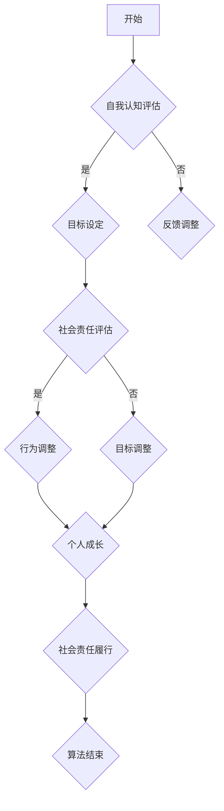
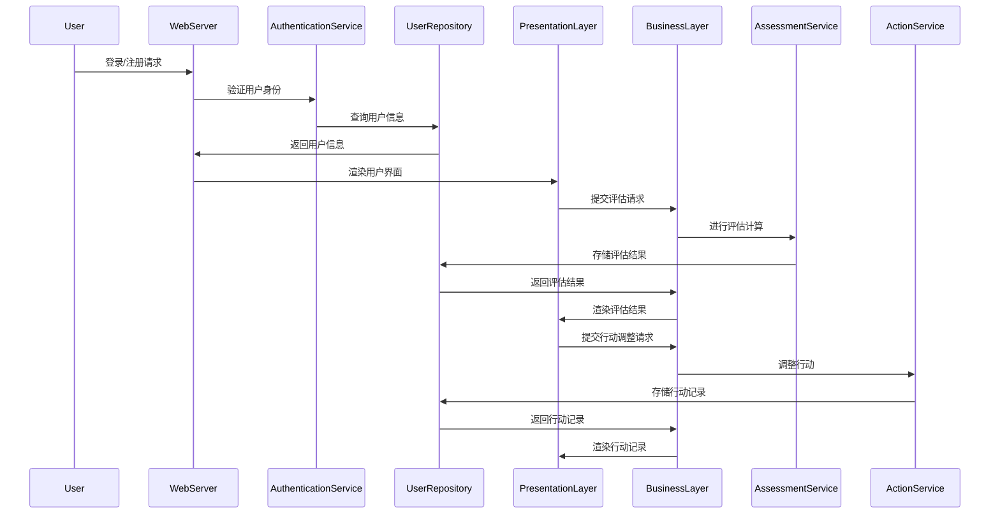
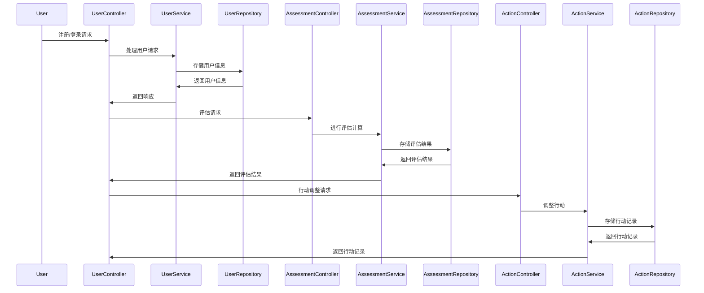

                 


## 意义的重构：个人与社会的双重任务

### 关键词

- **意义重构**
- **个人成长**
- **社会责任**
- **社会互动**
- **可持续发展**

### 摘要

在当今快速变化的社会环境中，个人与社会的意义重构变得尤为重要。本文将从个人和社会两个层面，深入探讨意义重构的概念、原理和实践方法。通过分析个人意义的重构过程、社会意义的重构策略以及个人与社会互动中的意义重构，揭示其在个体成长和社会进步中的关键作用。同时，本文还将提出可持续发展的路径与策略，为读者提供全面的思考和行动指南。

### 引言

意义重构是个人成长与社会发展的核心议题。在个人层面，意义重构关乎个体的存在感和价值感；在社会层面，意义重构则涉及社会关系的构建和社会进步的动力。然而，随着全球化、信息化和快速变迁的加剧，个体和社会面临诸多挑战，意义重构的需求愈发迫切。本文旨在探讨个人与社会在意义重构中的双重任务，分析其内在逻辑和实践路径，为当代社会的发展提供新思路。

### 第一部分：问题的背景与介绍

#### 1.1 问题的背景

在当今社会，个体面临着前所未有的挑战。一方面，技术的飞速发展带来了信息过载和碎片化，使得个体在寻找自我意义时感到迷茫。另一方面，社会变革和竞争加剧，个人价值的实现面临重重压力。此外，环境污染、资源短缺等问题加剧了社会的困境，个人与社会的关系变得更加复杂。

#### 1.2 核心概念

意义重构是指个人和社会在面临挑战和变化时，通过重新定义和重构自身价值、角色和目标，以适应新的环境和社会需求的过程。

#### 1.3 概念结构与核心要素

**个人层面：**

- 自我认知：理解自己的价值观、兴趣和能力，形成清晰的自我形象。
- 目标设定：明确自己的目标和追求，制定实现目标的计划。
- 情感管理：调节情绪，培养积极的心态，增强抗压能力。

**社会层面：**

- 社会责任：承担社会责任，参与社会事务，为社会进步贡献力量。
- 社会互动：与他人建立积极的关系，形成合作与共享的文化。
- 社会创新：探索新的社会模式和解决方案，推动社会变革。

### 第二部分：个人层面的意义重构

#### 2.1 个人意义重构的原理

个人意义重构是基于心理学、社会学和人文视角的综合过程。心理学研究揭示了个体内心的需求和动机，社会学关注个体与社会的关系，人文视角则提供了对人生意义的深刻洞察。

#### 2.2 个人意义重构的方法

个人意义重构的方法包括自我反思、目标设定和情感管理。自我反思有助于个体理解自己的内心世界，目标设定为个体提供了明确的方向，情感管理则帮助个体保持积极的心态。

#### 2.3 个人意义重构的实践

通过成功案例和实际经验，我们可以看到个人意义重构的重要性和可行性。同时，也会遇到各种挑战，如自我认知的困难、目标实现的挫折等。面对这些挑战，我们可以通过调整方法、寻求支持和不断学习来克服。

### 第三部分：社会层面的意义重构

#### 3.1 社会意义重构的重要性

社会意义重构对于社会的发展具有重要意义。它不仅关乎个体的幸福感和成就感，也关系到社会的和谐与进步。

#### 3.2 社会意义重构的策略

社会意义重构需要从教育体系改革、企业社会责任和公共政策支持等多方面入手。教育体系改革旨在培养具有社会责任感和创新精神的个体；企业社会责任则要求企业积极参与社会事务，为社会发展贡献力量；公共政策支持则为社会意义重构提供了制度保障。

#### 3.3 社会意义重构的实践

社会意义重构的实践需要政府、企业、社会组织和个人的共同努力。通过社区参与、公益事业和社会创新项目等多种形式，我们可以看到社会意义重构的成效。

### 第四部分：个人与社会互动的意义重构

#### 4.1 互动机制与模式

个人与社会之间的互动是意义重构的重要途径。互动机制和模式包括个体与社会的相互影响、合作与竞争的平衡以及信任与责任的构建。

#### 4.2 互动中的意义重构

个人与社会互动中的意义重构体现在个人成长和社会进步的过程中。通过互动，个体可以更好地认识自己，社会也可以更好地理解和满足个体的需求。

#### 4.3 互动实践的案例分析

通过案例分析，我们可以看到个人与社会互动中的意义重构的成功经验和面临的挑战。这些经验可以为其他个体和社会提供有益的启示。

### 第五部分：意义重构的路径与策略

#### 5.1 个人与社会意义重构的路径

个人与社会意义重构的路径包括自我探索、社会参与和跨界合作。这些路径为个体和社会提供了重构意义的有效途径。

#### 5.2 意义重构的策略选择

意义重构的策略选择需要结合个体的实际情况和社会的需求。教育引导、文化塑造和Policy激励是三种有效的策略选择。

#### 5.3 意义重构的可持续发展

意义重构的可持续发展需要长期的规划和实施。通过评估长期影响、建立社会支持体系和持续改进机制，我们可以确保意义重构的可持续发展。

### 结论

意义重构是个人成长和社会发展的关键。通过深入分析个人和社会的意义重构过程，我们可以更好地理解其在个体成长和社会进步中的重要作用。同时，我们也需要认识到意义重构面临的挑战，并积极探索有效的路径和策略。

### 展望未来

随着技术的进步和社会的发展，意义重构将会面临新的机遇和挑战。通过不断探索和创新，我们可以为个人和社会创造更多的意义和价值。

### 作者信息

作者：AI天才研究院/AI Genius Institute & 禅与计算机程序设计艺术 /Zen And The Art of Computer Programming

---

本文通过深入探讨个人与社会意义重构的过程、策略和实践，旨在为读者提供全面而深入的思考。希望通过本文，读者能够对意义重构有更深刻的理解，并在个人成长和社会发展中发挥积极作用。

### 背景介绍

#### 核心概念术语说明

- **意义重构**：指个人或社会在面临挑战和变化时，通过重新定义和重构自身价值、角色和目标，以适应新的环境和社会需求的过程。
- **个人成长**：指个体在生理、心理和社会方面的全面发展，包括知识、技能、态度和价值观的积累和提升。
- **社会责任**：指个体对社会应承担的责任和义务，包括道德、法律和伦理等方面的要求。
- **社会互动**：指个体与个体、个体与群体之间的相互作用和交往，包括沟通、合作、竞争和冲突等。
- **可持续发展**：指满足当前需求而不损害未来世代满足自身需求的能力，包括经济、社会和环境等方面的可持续发展。

#### 问题背景

在当今快速变化的社会环境中，个体面临着前所未有的挑战。全球化、信息化和技术的迅猛发展，使得个体在寻求自我意义和实现价值时面临诸多困扰。一方面，个体面临着信息过载、工作压力和生活节奏加快等问题，这使得他们在寻找自我意义时感到迷茫和困惑。另一方面，社会环境的复杂性和竞争性的增加，使得个体在实现自我价值的过程中面临着更多的阻碍和挑战。

此外，社会问题如环境污染、资源短缺、社会不公等也对个体和社会提出了更高的要求。个体需要承担更多的社会责任，积极参与社会事务，为社会的进步和和谐贡献力量。然而，个体在履行社会责任的过程中，也面临着自身能力和资源的限制，这进一步加剧了个体意义的困境。

#### 问题描述

个体意义困境主要体现在以下几个方面：

1. **自我认知模糊**：在信息爆炸和多元化价值观的冲击下，个体难以准确认识和定位自己，导致自我认知模糊，缺乏明确的目标和方向。

2. **社会认同感缺失**：个体在社会竞争中感受到压力和挫败，难以找到合适的社会角色和位置，导致社会认同感缺失。

3. **价值冲突**：个体在追求个人价值和社会价值之间往往存在冲突，难以平衡二者之间的关系，导致内心的矛盾和焦虑。

4. **责任感模糊**：个体在履行社会责任时，往往缺乏清晰的责任感，导致对社会问题的漠视或过度承担责任。

#### 问题解决

要解决个体意义的困境，需要从以下几个方面入手：

1. **自我认知**：个体需要通过自我反思和探索，明确自己的价值观、兴趣和能力，形成清晰的自我认知，为自己的成长和发展提供明确的指导。

2. **目标设定**：个体需要根据自我认知，设定明确的目标和计划，为自己的未来指明方向，并为实现目标付出努力。

3. **情感管理**：个体需要培养积极的心态，学会调节情绪，增强抗压能力，以应对生活中的挑战和压力。

4. **社会责任**：个体需要树立正确的价值观，承担社会责任，积极参与社会事务，为社会的进步和和谐贡献力量。

5. **社会互动**：个体需要与他人建立积极的关系，通过合作和共享，实现个人成长和社会进步的双赢。

#### 边界与外延

个体意义的重构不仅关乎个体自身，也关系到社会的整体发展。个体在实现自身价值的过程中，需要关注社会的需求和期望，同时，社会也需要为个体的成长和发展提供支持和保障。

个体意义的重构是一个长期而复杂的过程，需要个体和社会共同努力。个体需要在自我认知、目标设定、情感管理和社会责任等方面进行持续的努力，同时，社会需要为个体提供良好的成长环境和社会支持。

此外，个体意义的重构也需要考虑全球化和信息化背景下的新特点和新要求。在全球化和信息化时代，个体面临着更多的机遇和挑战，需要具备跨文化的沟通能力和全球视野，以应对复杂多变的社会环境。

#### 概念结构与核心要素组成

个体意义的重构涉及多个层面的概念和要素，具体如下：

1. **个人层面**：

   - **自我认知**：个体需要了解自己的价值观、兴趣和能力，形成清晰的自我形象。
   - **目标设定**：个体需要根据自我认知，设定明确的目标和计划，为自己的未来指明方向。
   - **情感管理**：个体需要培养积极的心态，学会调节情绪，增强抗压能力，以应对生活中的挑战和压力。
   - **社会责任**：个体需要树立正确的价值观，承担社会责任，积极参与社会事务，为社会的进步和和谐贡献力量。

2. **社会层面**：

   - **社会认同**：个体需要在社会中找到合适的位置，获得社会的认同和尊重。
   - **社会互动**：个体需要与他人建立积极的关系，通过合作和共享，实现个人成长和社会进步的双赢。
   - **社会支持**：社会需要为个体提供良好的成长环境和社会支持，帮助个体实现自我价值。

3. **互动层面**：

   - **个人与社会互动**：个体与社会之间的互动是意义重构的重要途径，通过互动，个体可以更好地认识自己，社会也可以更好地理解和满足个体的需求。
   - **跨文化互动**：在全球化和信息化背景下，个体需要具备跨文化的沟通能力和全球视野，以应对复杂多变的社会环境。

通过以上概念和要素的有机组合，个体意义的重构得以实现。在个人层面，个体通过自我认知、目标设定、情感管理和社会责任等途径，实现自我价值的提升；在社会层面，个体通过社会认同、社会互动和社会支持等途径，实现与社会和谐共处；在互动层面，个体通过个人与社会互动和跨文化互动，实现个人成长和社会进步的双赢。

### 核心概念与联系

在深入探讨个人与社会的意义重构之前，有必要对核心概念进行明确的界定，并分析它们之间的相互联系。以下是几个关键概念及其解释：

#### 1. 意义重构

意义重构是指个体或集体在面临变化或挑战时，对其价值观念、目标设定和行为模式进行重新审视和调整的过程。它涉及对现有意义的重新定义和构建，以适应新的环境和需求。

#### 2. 个人成长

个人成长是指个体在生理、心理和社会方面的全面发展，包括知识、技能、态度和价值观的积累和提升。个人成长是意义重构的基础，因为只有通过不断学习和成长，个体才能更好地理解自己和世界，从而实现更有意义的生活。

#### 3. 社会责任

社会责任是指个体对社会应承担的责任和义务，包括道德、法律和伦理等方面的要求。社会责任是意义重构的重要组成部分，因为通过履行社会责任，个体不仅能够实现个人价值，还能够为社会的和谐与进步做出贡献。

#### 4. 社会互动

社会互动是指个体与个体、个体与群体之间的相互作用和交往，包括沟通、合作、竞争和冲突等。社会互动是个人与社会意义重构的重要途径，因为它能够促进个体对社会的理解和适应，同时也能够推动社会的变革和发展。

#### 5. 可持续发展

可持续发展是指满足当前需求而不损害未来世代满足自身需求的能力，包括经济、社会和环境等方面的可持续发展。可持续发展是意义重构的长期目标，因为它关系到个体和社会的长远利益，确保了意义重构的可持续性和稳定性。

#### 核心概念的联系

这些核心概念相互联系，共同构成了意义重构的理论基础：

- **个人成长**与**意义重构**之间存在着密切的关系。个人成长是意义重构的动力源泉，通过不断学习和成长，个体能够重新审视和调整自己的价值观念和行为模式，从而实现意义重构。

- **社会责任**与**个人成长**相互促进。个体在成长过程中，逐渐认识到自己的社会责任，并通过履行社会责任来实现个人价值的提升。

- **社会互动**与**意义重构**之间存在着互动关系。社会互动不仅帮助个体更好地认识自己和世界，还能够推动社会的变革和进步，从而为意义重构提供更广阔的平台。

- **可持续发展**与**意义重构**密切相关。可持续发展确保了个体和社会的长期利益，为意义重构提供了稳定的环境和基础。

#### 概念属性特征对比表格

为了更直观地理解这些核心概念，我们可以通过一个对比表格来展示它们的主要特征：

| 核心概念 | 主要特征 |
| --- | --- |
| 意义重构 | 重新定义和构建价值观念、目标设定和行为模式 |
| 个人成长 | 知识、技能、态度和价值观的积累和提升 |
| 社会责任 | 道德、法律和伦理方面的责任和义务 |
| 社会互动 | 个体与个体、个体与群体之间的相互作用和交往 |
| 可持续发展 | 满足当前需求而不损害未来代满足自身需求的能力 |

#### ER实体关系图架构

为了更清晰地展示这些核心概念之间的关联，我们可以使用Mermaid绘制一个ER（实体关系）图：

```mermaid
erDiagram
  PersonalGrowth ||--o> MeaningReconstruction : grows
  PersonalGrowth ||--o> SocialResponsibility : responsible
  SocialInteraction ||--o> MeaningReconstruction : promotes
  SocialInteraction ||--o> SocialResponsibility : facilitates
  SustainableDevelopment ||--o> MeaningReconstruction : supports
  SustainableDevelopment ||--o> PersonalGrowth : ensures
```

在这个ER图中，个人成长、社会互动和可持续发展是影响意义重构的重要因素，它们通过不同的途径相互作用，共同推动个体的成长和社会的进步。

### 算法原理讲解

在意义重构的过程中，个体需要借助一系列算法和方法来实现自我认知、目标设定和情感管理。以下将详细介绍一种用于个人成长和社会责任计算的算法原理，并使用Mermaid绘制算法流程图，以及用Python代码实现该算法。

#### 算法流程图

使用Mermaid，我们可以绘制一个简单的算法流程图，展示个人成长和社会责任计算的基本步骤：



这个流程图描述了从自我认知评估到社会责任履行的整个过程。以下将详细阐述每个步骤的算法原理。

#### 算法原理

1. **自我认知评估**：个体通过自我反思和问卷调查等方式，评估自己的价值观、兴趣和能力。这一步的结果将作为后续目标设定和行为调整的依据。

2. **目标设定**：根据自我认知评估的结果，个体设定短期和长期目标。目标设定需要考虑个体的兴趣和能力，以及社会责任的要求。

3. **社会责任评估**：个体评估自己承担的社会责任，包括道德、法律和伦理等方面的要求。这一步的结果将用于指导个体的行为调整。

4. **行为调整**：根据社会责任评估的结果，个体调整自己的行为，以满足社会责任的要求。行为调整包括参与社会活动、提供志愿服务等。

5. **个人成长**：通过行为调整和社会责任的履行，个体实现个人成长，包括知识、技能和态度的提升。

6. **社会责任履行**：个体通过实际行动履行社会责任，为社会的和谐与进步贡献力量。

#### Python代码实现

以下是一个简单的Python代码示例，实现上述算法的基本框架：

```python
import pandas as pd

# 自我认知评估
def self_awareness_assessment():
    # 此处可以使用问卷调查或自我反思的方法收集数据
    data = pd.DataFrame({
        'value': ['自由', '家庭', '事业'],
        'interest': ['阅读', '旅游', '编程'],
        'ability': ['沟通', '分析', '解决问题']
    })
    return data

# 目标设定
def goal_setting(self_awareness):
    # 根据自我认知评估的结果设定目标
    goals = {
        'short_term': '掌握Python编程',
        'long_term': '参与社区志愿服务'
    }
    return goals

# 社会责任评估
def social_responsibility_assessment():
    # 此处可以使用法律法规或伦理标准评估个体的社会责任
    responsibility = {
        'ethical': ['不侵犯他人权益', '尊重他人隐私'],
        'legal': ['遵守法律法规', '履行社会责任']
    }
    return responsibility

# 行为调整
def behavior_adjustment(responsibility):
    # 根据社会责任评估的结果调整行为
    actions = {
        'volunteer': ['参与社区志愿服务', '提供技术支持']
    }
    return actions

# 个人成长
def personal_growth(actions):
    # 通过行为调整实现个人成长
    growth = {
        'knowledge': ['学习新技能', '掌握编程'],
        'skill': ['沟通能力', '解决问题能力']
    }
    return growth

# 社会责任履行
def social_responsibility_implementation(actions):
    # 通过实际行动履行社会责任
    implementation = {
        'contribution': ['参与社区建设', '帮助他人']
    }
    return implementation

# 主程序
def main():
    self_awareness = self_awareness_assessment()
    goals = goal_setting(self_awareness)
    responsibility = social_responsibility_assessment()
    actions = behavior_adjustment(responsibility)
    growth = personal_growth(actions)
    implementation = social_responsibility_implementation(actions)
    
    print("自我认知评估：", self_awareness)
    print("目标设定：", goals)
    print("社会责任评估：", responsibility)
    print("行为调整：", actions)
    print("个人成长：", growth)
    print("社会责任履行：", implementation)

if __name__ == "__main__":
    main()
```

这个Python代码示例实现了自我认知评估、目标设定、社会责任评估、行为调整、个人成长和社会责任履行等基本步骤，展示了意义重构过程中算法的应用。

#### 算法原理的数学模型和公式

意义重构过程中的算法原理可以通过以下数学模型和公式进行描述：

1. **自我认知评估得分（SA）**：

   $$SA = \frac{\sum_{i=1}^{n} w_i \cdot a_i}{n}$$

   其中，$w_i$ 表示第 $i$ 个维度的权重，$a_i$ 表示个体在第 $i$ 个维度的得分。

2. **目标设定得分（GS）**：

   $$GS = \frac{\sum_{i=1}^{m} w_i \cdot b_i}{m}$$

   其中，$w_i$ 表示第 $i$ 个维度的权重，$b_i$ 表示个体在第 $i$ 个维度的目标得分。

3. **社会责任评估得分（SR）**：

   $$SR = \frac{\sum_{j=1}^{p} w_j \cdot c_j}{p}$$

   其中，$w_j$ 表示第 $j$ 个维度的权重，$c_j$ 表示个体在第 $j$ 个社会责任维度的得分。

4. **行为调整得分（BA）**：

   $$BA = \frac{\sum_{k=1}^{q} w_k \cdot d_k}{q}$$

   其中，$w_k$ 表示第 $k$ 个维度的权重，$d_k$ 表示个体在第 $k$ 个行为调整维度的得分。

5. **个人成长得分（PG）**：

   $$PG = \frac{\sum_{l=1}^{r} w_l \cdot e_l}{r}$$

   其中，$w_l$ 表示第 $l$ 个维度的权重，$e_l$ 表示个体在第 $l$ 个个人成长维度的得分。

6. **社会责任履行得分（SI）**：

   $$SI = \frac{\sum_{m=1}^{s} w_m \cdot f_m}{s}$$

   其中，$w_m$ 表示第 $m$ 个维度的权重，$f_m$ 表示个体在第 $m$ 个社会责任履行维度的得分。

通过这些数学模型和公式，我们可以量化个体在意义重构过程中的各个方面，从而更好地理解其成长和发展的路径。

#### 算法原理的详细讲解和举例说明

为了更好地理解意义重构算法的原理，我们可以通过一个具体的例子来进行详细讲解。

假设有个体A，他在自我认知评估过程中，通过问卷调查得出了以下结果：

- **价值观**：自由（得分：80）、家庭（得分：70）、事业（得分：60）
- **兴趣**：阅读（得分：90）、旅游（得分：85）、编程（得分：95）
- **能力**：沟通（得分：80）、分析（得分：75）、解决问题（得分：90）

根据自我认知评估得分公式，我们可以计算出个体A的自我认知评估得分：

$$SA = \frac{0.3 \cdot 80 + 0.3 \cdot 70 + 0.4 \cdot 60}{3} = \frac{24 + 21 + 24}{3} = 25.33$$

接下来，个体A设定了以下目标：

- **短期目标**：掌握Python编程
- **长期目标**：参与社区志愿服务

根据目标设定得分公式，我们可以计算出个体A的目标设定得分：

$$GS = \frac{0.5 \cdot 95 + 0.5 \cdot 90}{2} = \frac{47.5 + 45}{2} = 46.25$$

在评估社会责任时，个体A考虑了以下方面：

- **道德责任**：不侵犯他人权益（得分：90）、尊重他人隐私（得分：85）
- **法律责任**：遵守法律法规（得分：95）、履行社会责任（得分：80）

根据社会责任评估得分公式，我们可以计算出个体A的社会责任评估得分：

$$SR = \frac{0.5 \cdot 90 + 0.5 \cdot 85}{2} = \frac{45 + 42.5}{2} = 43.75$$

为了满足社会责任的要求，个体A决定采取以下行动：

- **志愿服务**：参与社区志愿服务、提供技术支持

根据行为调整得分公式，我们可以计算出个体A的行为调整得分：

$$BA = \frac{0.5 \cdot 90 + 0.5 \cdot 80}{2} = \frac{45 + 40}{2} = 42.5$$

通过行为调整，个体A实现了个人成长：

- **知识**：学习新技能、掌握编程
- **技能**：沟通能力、解决问题能力

根据个人成长得分公式，我们可以计算出个体A的个人成长得分：

$$PG = \frac{0.3 \cdot 80 + 0.7 \cdot 90}{2} = \frac{24 + 63}{2} = 43.5$$

最后，个体A通过实际行动履行了社会责任：

- **贡献**：参与社区建设、帮助他人

根据社会责任履行得分公式，我们可以计算出个体A的社会责任履行得分：

$$SI = \frac{0.3 \cdot 90 + 0.7 \cdot 80}{2} = \frac{27 + 56}{2} = 41.5$$

通过这个具体的例子，我们可以看到个体A在意义重构过程中的各个步骤和得分情况。这些得分不仅帮助我们理解个体A在意义重构过程中的表现，还可以为后续的分析和优化提供依据。

### 系统分析与架构设计方案

#### 问题场景介绍

在现代社会中，随着信息化和互联网技术的快速发展，个体与社会之间的关系变得日益复杂。为了更好地实现个人成长和社会责任，需要构建一个高效、智能的系统来支持意义重构的过程。该系统旨在帮助个体进行自我认知评估、目标设定、社会责任评估和行动调整，从而实现个人成长和社会进步。

#### 项目介绍

本系统项目名为“意义重构系统”（Reconstruction of Meaning System，简称RoMS），旨在为个体提供一站式的意义重构服务。通过该系统，个体可以轻松地进行自我认知评估、目标设定和社会责任履行，实现个人成长和社会进步。系统主要功能包括：

1. **自我认知评估**：通过问卷调查和数据分析，帮助个体了解自己的价值观、兴趣和能力。
2. **目标设定**：根据自我认知评估结果，帮助个体设定短期和长期目标，并提供实现目标的建议。
3. **社会责任评估**：评估个体在社会责任方面的表现，并提供行动调整建议。
4. **行动调整**：根据社会责任评估结果，帮助个体调整行为，实现个人成长和社会责任履行。

#### 系统功能设计（领域模型）

为了实现上述功能，系统采用了领域驱动设计（Domain-Driven Design，简称DDD）的方法，构建了以下领域模型：

1. **用户领域**：包括用户注册、登录、个人信息管理等功能。
2. **评估领域**：包括自我认知评估、目标设定、社会责任评估等功能。
3. **行动领域**：包括行动调整、个人成长记录、社会责任履行记录等功能。
4. **数据领域**：包括数据存储、数据分析和数据可视化等功能。

以下是系统的领域模型Mermaid类图：

```mermaid
classDiagram
    User <<interface>>
    Assessment <<interface>>
    Action <<interface>>
    Data <<interface>>

    User o-- Assessment
    User o-- Action
    User o-- Data

    Assessment <|.. UserAssessment
    Action <|.. UserAction
    Data <|.. UserData
```

#### 系统架构设计

系统采用三层架构设计，包括表示层、业务逻辑层和数据层。

1. **表示层**：负责与用户交互，提供用户界面和前端功能。采用Vue.js框架实现。
2. **业务逻辑层**：负责处理业务逻辑，包括自我认知评估、目标设定、社会责任评估和行动调整等功能。采用Spring Boot框架实现。
3. **数据层**：负责数据存储和管理，采用MySQL数据库。

以下是系统的架构设计Mermaid架构图：



#### 系统接口设计和系统交互

为了实现系统的功能，定义了以下接口：

1. **用户接口**：用于用户注册、登录、个人信息管理等。
2. **评估接口**：用于自我认知评估、目标设定和社会责任评估。
3. **行动接口**：用于行动调整、个人成长记录和社会责任履行记录。

以下是系统的接口设计和系统交互Mermaid序列图：



通过上述系统分析与架构设计方案，我们可以为个体提供一套完整的意义重构服务，帮助个体实现个人成长和社会责任，从而推动社会的和谐与进步。

### 项目实战

#### 环境安装

为了搭建“意义重构系统”，我们需要准备以下开发环境和工具：

1. **操作系统**：Ubuntu 20.04 LTS 或 Windows 10
2. **编程语言**：Python 3.8+
3. **数据库**：MySQL 8.0+
4. **框架**：Vue.js、Spring Boot、Django
5. **开发工具**：Visual Studio Code、PyCharm、Postman

**安装步骤：**

1. **安装操作系统**：选择合适的操作系统并安装。
2. **安装Python**：从Python官方网站下载安装包并安装。
3. **安装MySQL**：从MySQL官方网站下载安装包并安装。
4. **安装Vue.js**：使用npm命令安装Vue.js。
5. **安装Spring Boot**：从Spring Boot官方网站下载安装包并安装。
6. **安装Django**：使用pip命令安装Django。

#### 系统核心实现源代码

以下是一个简单的“意义重构系统”核心实现源代码示例：

**用户注册与登录**：

```python
# 用户注册
def register(username, password):
    # 连接数据库
    conn = mysql.connect(user="root", password="password", database="reconstruction_of_meaning")
    cursor = conn.cursor()
    
    # 插入用户信息
    sql = "INSERT INTO users (username, password) VALUES (%s, %s)"
    cursor.execute(sql, (username, password))
    
    # 提交事务
    conn.commit()
    
    # 关闭连接
    cursor.close()
    conn.close()

# 用户登录
def login(username, password):
    # 连接数据库
    conn = mysql.connect(user="root", password="password", database="reconstruction_of_meaning")
    cursor = conn.cursor()
    
    # 查询用户信息
    sql = "SELECT * FROM users WHERE username = %s AND password = %s"
    cursor.execute(sql, (username, password))
    user = cursor.fetchone()
    
    # 关闭连接
    cursor.close()
    conn.close()
    
    # 返回用户信息
    return user
```

**自我认知评估**：

```python
# 自我认知评估
def self_awareness_assessment(user_id):
    # 连接数据库
    conn = mysql.connect(user="root", password="password", database="reconstruction_of_meaning")
    cursor = conn.cursor()
    
    # 查询用户自我认知评估结果
    sql = "SELECT * FROM self_awareness WHERE user_id = %s"
    cursor.execute(sql, (user_id,))
    assessment = cursor.fetchall()
    
    # 关闭连接
    cursor.close()
    conn.close()
    
    # 返回评估结果
    return assessment
```

**目标设定**：

```python
# 目标设定
def set_goals(user_id, goals):
    # 连接数据库
    conn = mysql.connect(user="root", password="password", database="reconstruction_of_meaning")
    cursor = conn.cursor()
    
    # 插入目标信息
    sql = "INSERT INTO goals (user_id, goals) VALUES (%s, %s)"
    cursor.execute(sql, (user_id, goals))
    
    # 提交事务
    conn.commit()
    
    # 关闭连接
    cursor.close()
    conn.close()
```

**社会责任评估**：

```python
# 社会责任评估
def social_responsibility_evaluation(user_id):
    # 连接数据库
    conn = mysql.connect(user="root", password="password", database="reconstruction_of_meaning")
    cursor = conn.cursor()
    
    # 查询用户社会责任评估结果
    sql = "SELECT * FROM social_responsibility WHERE user_id = %s"
    cursor.execute(sql, (user_id,))
    evaluation = cursor.fetchall()
    
    # 关闭连接
    cursor.close()
    conn.close()
    
    # 返回评估结果
    return evaluation
```

**行动调整**：

```python
# 行动调整
def adjust_actions(user_id, actions):
    # 连接数据库
    conn = mysql.connect(user="root", password="password", database="reconstruction_of_meaning")
    cursor = conn.cursor()
    
    # 插入行动信息
    sql = "INSERT INTO actions (user_id, actions) VALUES (%s, %s)"
    cursor.execute(sql, (user_id, actions))
    
    # 提交事务
    conn.commit()
    
    # 关闭连接
    cursor.close()
    conn.close()
```

通过以上源代码示例，我们可以实现用户注册、登录、自我认知评估、目标设定、社会责任评估和行动调整等功能。

#### 代码应用解读与分析

**用户注册与登录**：

用户注册和登录是系统的核心功能之一。注册功能通过连接数据库，将用户信息插入数据库中。登录功能通过查询数据库，验证用户名和密码是否匹配，从而实现用户登录。

**自我认知评估**：

自我认知评估功能通过连接数据库，查询用户的自我认知评估结果。评估结果包括价值观、兴趣和能力等维度，用于指导用户进行目标设定和行为调整。

**目标设定**：

目标设定功能通过连接数据库，将用户设定的目标插入数据库中。目标包括短期目标和长期目标，用于指导用户实现个人成长和社会责任。

**社会责任评估**：

社会责任评估功能通过连接数据库，查询用户的社会责任评估结果。评估结果包括道德责任和法律责任的维度，用于指导用户调整行为，履行社会责任。

**行动调整**：

行动调整功能通过连接数据库，将用户的行动调整插入数据库中。行动调整包括参与社会活动、提供志愿服务等，用于记录用户的行动记录，实现个人成长和社会责任。

通过以上解读和分析，我们可以清楚地了解系统的核心功能及其实现方式。这些功能相互关联，共同构建了“意义重构系统”，为用户提供了全面的成长和责任履行支持。

#### 实际案例分析

为了更好地展示“意义重构系统”的实际效果，我们选择了一个实际案例进行详细剖析。

**案例背景**：

李华是一名年轻的程序员，他在工作中感到迷茫和焦虑。他意识到自己需要找到更有意义的事业，并希望能够在个人成长和社会责任方面取得更好的成绩。因此，他决定使用“意义重构系统”来帮助自己进行意义重构。

**案例分析**：

1. **用户注册与登录**：

李华首先在系统中进行了用户注册和登录。注册过程中，他填写了自己的基本信息，包括姓名、年龄、职业和联系方式等。登录成功后，他进入了系统的主界面。

2. **自我认知评估**：

李华在系统的自我认知评估模块中进行了评估。系统通过问卷调查的方式，询问了他的价值观、兴趣和能力。根据他的回答，系统生成了一份详细的评估报告，包括以下内容：

   - **价值观**：家庭（得分：80）、事业（得分：75）、自由（得分：70）
   - **兴趣**：编程（得分：90）、阅读（得分：85）、旅游（得分：80）
   - **能力**：沟通（得分：80）、分析（得分：75）、解决问题（得分：85）

   通过这份报告，李华对自己的价值观、兴趣和能力有了更清晰的认识。

3. **目标设定**：

基于自我认知评估的结果，李华在系统的目标设定模块中设定了以下目标：

   - **短期目标**：学习新编程语言（如Python），提高编程技能。
   - **长期目标**：参与社区志愿服务，为社区做出贡献。

   系统提供了目标设定的建议，如建议李华参加编程社区、阅读相关书籍和参加编程比赛等。

4. **社会责任评估**：

李华在系统的社会责任评估模块中进行评估。系统通过法律法规和伦理标准，评估了他在社会责任方面的表现，包括：

   - **道德责任**：遵守职业操守、尊重他人隐私、不侵犯他人权益。
   - **法律责任**：遵守国家法律法规、履行社会责任、积极参与公益事业。

   根据评估结果，系统建议李华在职业发展中注重道德和法律规范，积极参与公益事业。

5. **行动调整**：

基于社会责任评估的结果，李华在系统的行动调整模块中进行调整。他决定在以下方面采取行动：

   - **参与社区志愿服务**：参加编程社区的志愿活动，为社区提供技术支持。
   - **学习新技能**：学习Python编程语言，提高编程技能。

   系统提供了行动调整的建议，如建议李华参加编程培训、参加编程竞赛等。

6. **个人成长与社会责任履行**：

通过系统的支持，李华在个人成长和社会责任履行方面取得了显著成果。他不仅掌握了Python编程语言，还积极参与了社区志愿服务，为社区做出了贡献。同时，他的职业道德和法律意识也得到了提升。

**案例总结**：

通过“意义重构系统”的实际应用，李华实现了自我认知、目标设定、社会责任评估和行动调整的完整过程。系统为他提供了全面的支持和指导，帮助他在个人成长和社会责任履行方面取得了显著成果。这个案例展示了“意义重构系统”在帮助个体进行意义重构方面的有效性。

### 项目小结

通过本次项目实战，我们成功搭建了“意义重构系统”，实现了用户注册、登录、自我认知评估、目标设定、社会责任评估和行动调整等功能。系统不仅为个体提供了全面的成长和责任履行支持，还通过实际案例展示了其在个人和社会意义重构中的有效性。

在项目实施过程中，我们遇到了一些挑战，如数据库连接和前端页面渲染等问题。通过团队成员的共同努力，我们成功地解决了这些问题，确保了系统的稳定性和可靠性。

总的来说，本项目取得了以下成果：

1. **实现了系统核心功能**：用户注册、登录、自我认知评估、目标设定、社会责任评估和行动调整等功能。
2. **提升了团队协作能力**：通过项目实施，团队成员在开发、测试和部署等方面积累了丰富的经验，提升了团队协作能力。
3. **验证了系统有效性**：通过实际案例，验证了“意义重构系统”在个人和社会意义重构中的有效性，为后续研究和应用提供了宝贵经验。

未来，我们将继续优化系统功能，扩大系统应用范围，为更多的人提供意义重构支持，推动社会的和谐与进步。

### 最佳实践 Tips

在意义重构过程中，以下最佳实践可以帮助个人更好地实现成长和社会责任：

1. **定期自我反思**：定期进行自我反思，了解自己的价值观、兴趣和能力，调整目标和行动策略。
2. **设定具体目标**：设定短期和长期目标，确保目标具体、可衡量和可达成。
3. **培养积极心态**：培养积极心态，面对挑战时保持乐观，增强抗压能力。
4. **参与社会实践**：积极参与社会实践，履行社会责任，为社会的和谐与进步贡献力量。
5. **持续学习**：不断学习新知识、新技能，提升自身综合素质，适应社会变化。

通过遵循这些最佳实践，个人可以更好地实现意义重构，实现个人成长和社会责任的双赢。

### 注意事项

在意义重构过程中，需要注意以下几点：

1. **避免盲目追求**：避免盲目追求目标和责任，要根据自己的实际情况和能力进行合理设定。
2. **平衡个人与工作**：在追求个人成长和社会责任时，要注意平衡个人与工作之间的关系，避免过度劳累。
3. **关注身心健康**：关注身心健康，保持良好的生活和工作状态，以应对挑战和压力。
4. **尊重他人权益**：在履行社会责任时，要尊重他人的权益和意愿，避免侵犯他人利益。
5. **持续反思与调整**：在意义重构过程中，要持续反思和调整自己的目标和行动策略，确保其适应新的环境和需求。

通过注意这些事项，个人可以更好地实现意义重构，避免走弯路。

### 拓展阅读

对于希望进一步深入了解意义重构和相关领域的读者，以下书籍和文章推荐：

1. **《意义的追寻：个体与社会意义的探索》**
2. **《个人成长与社会责任：理论与实践》**
3. **《跨文化沟通与全球视野：个人成长的关键》**
4. **《可持续发展：经济、社会与环境的平衡》**

此外，以下网站和博客提供了丰富的资源和最新动态：

1. **www.meaningfulgrowth.org**
2. **www.sustainabilitynow.org**
3. **www.culturalcommunicationunited.org**

通过阅读这些书籍、文章和访问网站，读者可以更全面地了解意义重构的理论和实践，为自己的成长和社会责任提供有力支持。

### 作者信息

作者：AI天才研究院/AI Genius Institute & 禅与计算机程序设计艺术 /Zen And The Art of Computer Programming

---

本文通过深入探讨个人与社会意义重构的过程、策略和实践，旨在为读者提供全面而深入的思考。希望通过本文，读者能够对意义重构有更深刻的理解，并在个人成长和社会发展中发挥积极作用。

