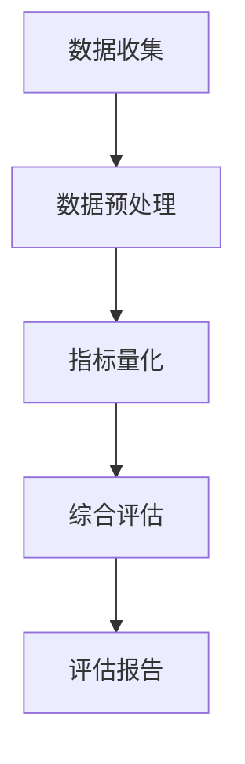
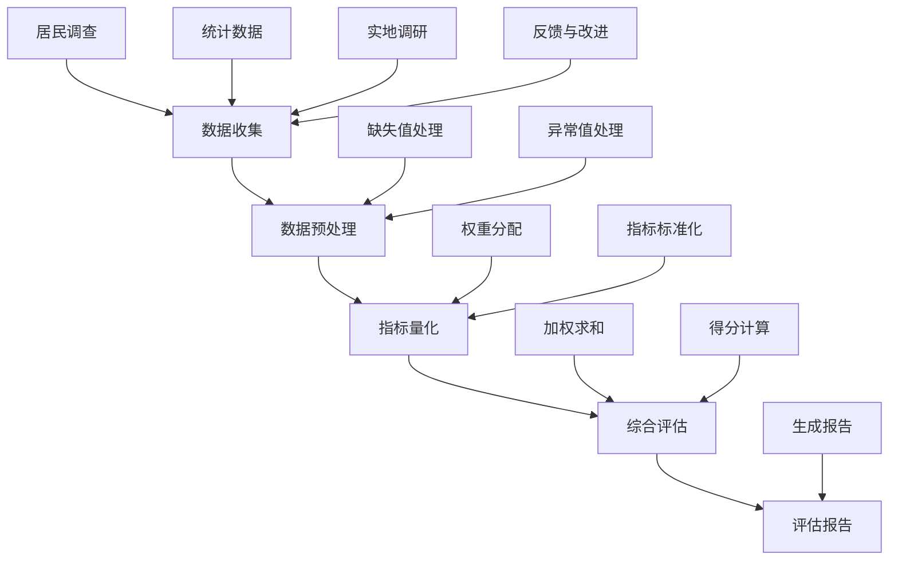
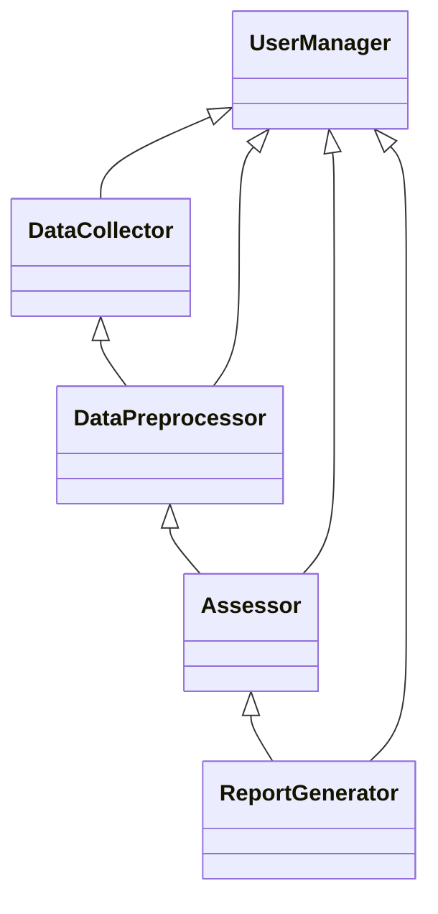
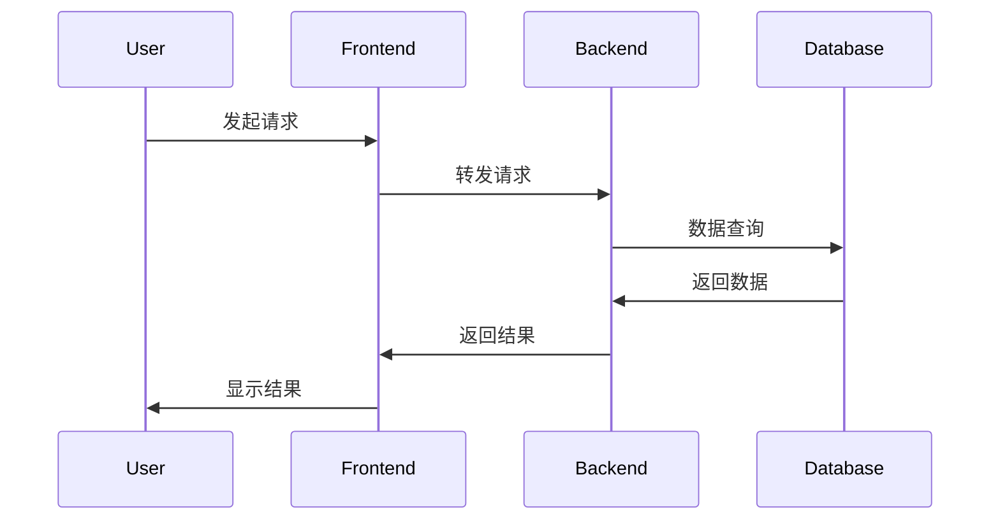
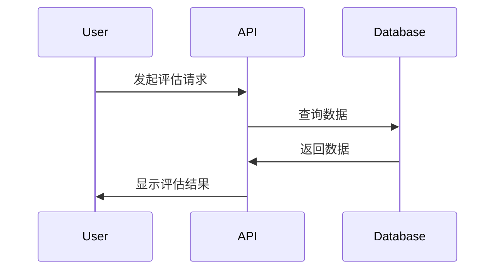

                 

### 第1章：慢城市的概念与起源

#### 1.1 什么是慢城市

**慢城市**这一概念源于20世纪80年代意大利的“slow food”运动，强调的是对高质量生活节奏的追求。慢城市运动的核心思想是抵制过度城市化、高消费和快节奏的生活方式，主张人与自然和谐共处，提倡“慢节奏、高品质”的生活方式。

**历史背景**：慢城市起源于意大利的**奥里维托镇**，由卡尔洛·蒙丹尼（Carlo Petrini）于1986年发起。当时的奥里维托镇正面临着城市化的威胁，蒙丹尼希望通过“slow food”运动保护当地的传统饮食文化，从而引发了对慢节奏生活的思考。

**定义**：慢城市是一个注重生活质量、鼓励人与自然和谐共处、提倡可持续发展的城市形态。它不仅仅是物理空间的安排，更是一种生活方式的倡导，旨在降低生活节奏、减少环境污染，提高居民的幸福感和生活质量。

#### 1.1.2 慢城市的定义

慢城市（Città Slow）是一个国际性的非营利组织，致力于推动全球慢城市运动。根据慢城市认证标准，慢城市应具备以下几个核心特征：

1. **生活质量**：注重居民的健康、教育、文化、休闲等各方面需求，提供高质量的生活服务。
2. **可持续发展**：强调环境保护、资源节约和可再生能源的使用，推动绿色城市的建设。
3. **社会包容性**：鼓励社会各阶层的融合，促进社区参与，提高社会凝聚力。
4. **经济多元性**：鼓励本地经济的多元化发展，减少对外部资源的依赖，增强城市经济的自我循环能力。

#### 1.1.3 慢城市的特点

慢城市的特点主要体现在以下几个方面：

1. **低密度开发**：慢城市强调生态保护，避免过度开发，通常采用低密度的社区布局。
2. **绿色交通**：鼓励步行、自行车等绿色出行方式，减少对汽车的依赖，降低交通拥堵和污染。
3. **社区参与**：慢城市鼓励居民参与社区事务，提高社区自治水平，增强社区凝聚力。
4. **文化多样性**：慢城市注重保护地方文化和传统，促进文化交流，丰富居民的文化生活。
5. **公共空间**：慢城市提供丰富的公共空间，如公园、广场等，以促进居民间的互动和交流。

#### 1.2 慢城市认证标准的必要性

**社会发展趋势**：随着全球化的加速和城市化进程的推进，人们越来越关注生活质量和环境保护。慢城市认证标准为城市提供了评估和改进的方向，有助于满足现代社会对宜居环境的需求。

**可持续发展的需求**：慢城市认证标准强调可持续发展，有助于减少城市对自然资源的消耗，降低碳排放，提高生态系统的稳定性。

**国际评估体系的重要性**：国际评估体系可以为不同国家和地区提供一套统一的标准，确保评估过程的公正性和科学性。同时，它也为城市的可持续发展提供了国际化的视野和借鉴。

#### 1.3 慢城市认证标准概述

**构成**：慢城市认证标准主要包括评估指标体系、评估流程、认证标准和实施指南等。

**评估流程**：评估流程通常包括前期调研、数据收集、现场评估、反馈与改进等环节。

**影响范围**：慢城市认证标准适用于所有追求可持续发展和提高生活质量的城市。

**适用对象**：包括城市政府、城市规划者、环境保护组织、社区居民等。

#### 1.4 慢城市认证标准的构成要素

**宜居环境的定义**：宜居环境是指一个城市或社区满足居民生活所需，提供高质量的生活服务，同时保持环境可持续性的状态。

**评估指标体系**：评估指标体系包括环境质量、社会因素、经济因素、文化休闲、城市规划、健康与医疗、能源与环境、公共服务等多方面的指标。

**实施方法与步骤**：实施方法包括数据收集、指标量化、综合评估、反馈与改进等步骤。

#### 1.5 本章小结

本章介绍了慢城市的概念、定义和特点，以及慢城市认证标准的必要性。慢城市认证标准为城市提供了评估和改进的方向，有助于提高城市的生活质量和环境可持续性。在接下来的章节中，我们将详细探讨慢城市认证标准的评估指标和实际应用。

----------------------------------------------------------------

### 第2章：宜居环境的基本评价指标

宜居环境的评价指标是慢城市认证标准的核心组成部分，这些指标涵盖了从环境质量到社会因素、经济因素、文化休闲、城市规划、健康与医疗、能源与环境、公共服务等各个方面。下面，我们将逐一介绍这些基本评价指标，并探讨其具体内容。

#### 2.1 环境质量

环境质量是宜居环境评价的首要指标，直接关系到居民的生活质量和健康。

##### 2.1.1 空气质量

空气质量是环境质量的重要方面。评估空气质量需要考虑以下指标：

1. **PM2.5和PM10浓度**：这些是空气中颗粒物的浓度，对呼吸系统健康有直接影响。
2. **二氧化硫（SO2）和氮氧化物（NOx）浓度**：这些污染物主要来源于交通和工业排放。
3. **臭氧（O3）浓度**：过量的臭氧会对人体产生有害影响。

##### 2.1.2 水质

水质是居民生活必不可少的资源。评估水质需要考虑以下指标：

1. **重金属含量**：如铅、汞等，这些重金属对生物体有害。
2. **有机污染物**：如多环芳烃（PAHs）、农药残留等。
3. **生物指标**：如水中微生物的种类和数量，反映水体的健康状态。

##### 2.1.3 噪音

噪音污染会影响居民的生活质量和心理健康。评估噪音需要考虑以下指标：

1. **日夜平均噪音水平**：衡量噪音的总体水平。
2. **高峰期噪音水平**：反映交通繁忙时段的噪音影响。
3. **噪音源分布**：确定主要噪音源的位置和类型。

#### 2.2 社会因素

社会因素是评估宜居环境的重要方面，直接关系到居民的生活满意度和幸福感。

##### 2.2.1 社会安全

社会安全是居民生活的基础。评估社会安全需要考虑以下指标：

1. **犯罪率**：衡量社区的治安状况。
2. **应急响应时间**：衡量社区应对紧急情况的能力。
3. **社会服务设施**：如警察局、消防站等。

##### 2.2.2 社会包容性

社会包容性关系到社会的和谐与稳定。评估社会包容性需要考虑以下指标：

1. **种族和性别平等**：衡量社会对不同群体的包容程度。
2. **贫困率**：衡量社会资源分配的公平性。
3. **社会参与度**：衡量居民参与社区事务的积极性。

##### 2.2.3 教育资源

教育资源是培养下一代的重要保障。评估教育资源需要考虑以下指标：

1. **学校数量与质量**：衡量教育设施的可获得性和教育质量。
2. **师生比例**：衡量教育资源的充足程度。
3. **教育资源公平性**：衡量不同社区、不同阶层之间的教育资源分配。

#### 2.3 经济因素

经济因素是宜居环境的重要支撑，直接影响居民的生活水平和就业机会。

##### 2.3.1 经济发展

经济发展是城市持续发展的重要保障。评估经济发展需要考虑以下指标：

1. **GDP增长率**：衡量经济规模的扩张速度。
2. **就业率**：衡量就业市场的健康程度。
3. **产业结构**：衡量经济多元化程度。

##### 2.3.2 生活成本

生活成本是居民日常生活的经济负担。评估生活成本需要考虑以下指标：

1. **房价**：衡量居民的住房负担能力。
2. **食品价格**：衡量居民的食品支出水平。
3. **交通费用**：衡量居民的交通成本。

##### 2.3.3 就业机会

就业机会是居民生计的重要来源。评估就业机会需要考虑以下指标：

1. **失业率**：衡量就业市场的压力。
2. **行业分布**：衡量就业机会的多样性。
3. **职业培训机会**：衡量居民提升职业技能的机会。

#### 2.4 文化与休闲

文化与休闲是提高居民生活质量的重要方面，能够促进社区的和谐与活力。

##### 2.4.1 文化设施

文化设施是文化传承和交流的重要载体。评估文化设施需要考虑以下指标：

1. **图书馆和博物馆数量**：衡量文化资源的丰富程度。
2. **文化活动频率**：衡量文化生活的活跃程度。
3. **文化参与度**：衡量居民参与文化活动的积极性。

##### 2.4.2 休闲活动

休闲活动是居民放松身心的重要途径。评估休闲活动需要考虑以下指标：

1. **公共休闲设施**：如公园、运动场等。
2. **文化娱乐活动**：如音乐会、戏剧表演等。
3. **社区活动**：如节日庆典、社区聚会等。

##### 2.4.3 社区活动

社区活动是社区凝聚力的重要体现。评估社区活动需要考虑以下指标：

1. **社区组织数量**：衡量社区组织的活跃程度。
2. **活动参与率**：衡量居民参与社区活动的积极性。
3. **社区项目**：如社区清洁、绿化等。

#### 2.5 城市规划

城市规划是城市发展的基础，直接影响城市的功能和居民的生活质量。

##### 2.5.1 城市设计

城市设计关系到城市的整体面貌和居民的生活环境。评估城市设计需要考虑以下指标：

1. **建筑风格**：衡量城市的审美水平和文化特色。
2. **街道规划**：衡量街道的宽敞度和安全性。
3. **公共空间**：衡量城市的公共空间利用率。

##### 2.5.2 绿地与公园

绿地与公园是城市生态的重要组成部分。评估绿地与公园需要考虑以下指标：

1. **绿地覆盖率**：衡量城市的绿化程度。
2. **公园数量与质量**：衡量城市公共休闲设施的丰富程度。
3. **植被种类**：衡量城市的生态多样性。

##### 2.5.3 交通规划

交通规划是城市运行的重要保障。评估交通规划需要考虑以下指标：

1. **交通拥堵指数**：衡量城市交通流量和拥堵状况。
2. **公共交通系统**：衡量公共交通的覆盖率和便捷性。
3. **自行车道和人行道**：衡量城市对绿色交通的重视程度。

#### 2.6 健康与医疗

健康与医疗是居民生活质量的重要方面，直接关系到居民的身心健康。

##### 2.6.1 医疗设施

医疗设施是居民健康保障的基础。评估医疗设施需要考虑以下指标：

1. **医院和诊所数量**：衡量医疗资源的丰富程度。
2. **医疗设备和技术**：衡量医疗服务的先进程度。
3. **医生和护士比例**：衡量医疗服务的人力资源。

##### 2.6.2 健康服务

健康服务是居民保持健康的重要保障。评估健康服务需要考虑以下指标：

1. **健康宣传教育**：衡量居民健康意识的提高程度。
2. **健康检查和预防措施**：衡量居民的健康管理水平。
3. **紧急医疗服务**：衡量应急医疗服务的响应速度。

##### 2.6.3 食品安全

食品安全是居民健康的重要保障。评估食品安全需要考虑以下指标：

1. **食品检验制度**：衡量食品安全监管的严格程度。
2. **食品安全事故率**：衡量食品安全问题的发生率。
3. **居民食品安全意识**：衡量居民对食品安全的重视程度。

#### 2.7 能源与环境

能源与环境是城市可持续发展的重要方面，直接影响城市的生态平衡和居民的幸福感。

##### 2.7.1 能源使用

能源使用是城市运行的必要条件。评估能源使用需要考虑以下指标：

1. **能源消耗总量**：衡量城市的能源需求水平。
2. **可再生能源使用率**：衡量城市对可再生能源的利用程度。
3. **能源效率**：衡量城市能源利用的效率。

##### 2.7.2 环境保护

环境保护是城市可持续发展的基础。评估环境保护需要考虑以下指标：

1. **废物处理**：衡量城市固体废物管理的水平。
2. **污染治理**：衡量城市对环境污染的治理效果。
3. **生态保护**：衡量城市对自然生态系统的保护程度。

##### 2.7.3 可持续发展

可持续发展是城市长期发展的目标。评估可持续发展需要考虑以下指标：

1. **环境保护政策**：衡量城市环境保护的法规和政策。
2. **资源节约**：衡量城市资源利用的节约程度。
3. **绿色发展**：衡量城市在经济发展中融入绿色理念的深度。

#### 2.8 公共服务

公共服务是城市功能的重要体现，直接关系到居民的生活便利性和幸福感。

##### 2.8.1 基础设施

基础设施是城市运行的基本保障。评估基础设施需要考虑以下指标：

1. **供水和供电**：衡量城市水、电供应的稳定性和可靠性。
2. **通信网络**：衡量城市通信服务的覆盖率和便捷性。
3. **燃气供应**：衡量城市燃气供应的安全性和可靠性。

##### 2.8.2 公共交通

公共交通是城市居民出行的重要方式。评估公共交通需要考虑以下指标：

1. **公共交通线路和班次**：衡量公共交通服务的覆盖面和频率。
2. **公交设施**：衡量公交车站和设施的便利性和舒适度。
3. **公交票价**：衡量居民承担公共交通费用的负担程度。

##### 2.8.3 社区服务

社区服务是居民日常生活的重要保障。评估社区服务需要考虑以下指标：

1. **社区服务中心**：衡量社区服务设施的完备程度。
2. **社区志愿者服务**：衡量社区志愿服务的活跃程度。
3. **居民满意度**：衡量居民对社区服务的满意度。

#### 2.9 评估方法与工具

评估方法是确保评估结果科学性和准确性的关键。评估宜居环境需要使用以下方法和工具：

##### 2.9.1 数据收集与分析

数据收集与分析是评估宜居环境的基础。评估过程中需要收集以下数据：

1. **居民调查**：通过问卷调查了解居民对城市宜居环境的满意度。
2. **统计数据**：从政府部门和公共机构获取相关的统计数据。
3. **实地调研**：通过实地考察了解城市的实际情况。

##### 2.9.2 评估指标的量化方法

评估指标的量化方法是将主观感受转化为客观数据的过程。评估过程中需要采用以下方法：

1. **专家评分法**：通过专家的主观评分来量化评估指标。
2. **层次分析法（AHP）**：通过构建层次模型来量化评估指标的重要性和权重。
3. **综合评估模型**：通过综合多种评估方法的结果来得到最终的评估得分。

##### 2.9.3 综合评估模型

综合评估模型是将多个评估指标整合成一个整体评估结果的工具。评估宜居环境可以采用以下模型：

1. **多属性效用理论（MAUT）**：通过权重分配来综合评估不同指标的影响。
2. **模糊综合评估法**：通过模糊逻辑处理主观评估数据。
3. **灰色系统理论**：通过灰色模型预测和评估宜居环境的发展趋势。

#### 2.10 本章小结

本章详细介绍了宜居环境的基本评价指标，包括环境质量、社会因素、经济因素、文化休闲、城市规划、健康与医疗、能源与环境、公共服务等方面的评估指标。这些指标构成了慢城市认证标准的基础，为城市评估提供了科学的依据。在接下来的章节中，我们将进一步探讨慢城市认证标准的评估方法和实际应用。

----------------------------------------------------------------

### 第3章：核心概念与联系

在慢城市认证标准中，核心概念构成了评估体系的基石。为了更好地理解这些概念及其相互联系，我们需要深入探讨每个概念的基本原理、属性特征以及它们之间的联系。

#### 3.1 核心概念原理

**宜居环境**：宜居环境是指一个城市或社区具备满足居民生活所需的基础设施和服务，同时保持环境可持续性的状态。宜居环境的定义不仅关注物理空间和生活质量，还包括社会、经济、文化和生态等多个维度。

**评估标准**：评估标准是一套科学、系统的指标体系，用于衡量和评估城市或社区的宜居性。慢城市认证标准包括环境质量、社会因素、经济因素等多个方面的评估指标。

**可持续发展**：可持续发展强调满足当前需求而不损害子孙后代满足其需求的能力。在慢城市认证标准中，可持续发展是一个重要的原则，要求城市在经济增长的同时保护环境和提高居民生活质量。

**社会包容性**：社会包容性强调城市或社区对不同群体的包容和接纳，促进社会和谐与稳定。这包括消除歧视、提高教育机会、提供就业机会等。

**经济多元性**：经济多元性要求城市或社区拥有多种经济活动，减少对外部资源的依赖，提高自我循环能力，增强经济韧性。

**环境质量**：环境质量是评估宜居环境的基本要素之一，包括空气质量、水质、噪音等指标。环境质量直接影响居民的生活质量和健康。

#### 3.2 概念属性特征对比表格

为了更直观地理解慢城市认证标准中的核心概念，我们可以通过对比表格来展示它们的属性特征。

| 核心概念 | 定义 | 属性特征 |
| --- | --- | --- |
| 宜居环境 | 满足居民生活需求，保持环境可持续性 | 质量高、安全、可持续 |
| 评估标准 | 科学、系统的指标体系 | 可量化、客观、全面 |
| 可持续发展 | 经济、社会、生态的平衡发展 | 节能、环保、持久 |
| 社会包容性 | 不同群体的包容和接纳 | 公平、平等、包容 |
| 经济多元性 | 多种经济活动的支持 | 稳定、多样、创新 |
| 环境质量 | 评估环境质量的基本要素 | 安全、清洁、健康 |

通过这个对比表格，我们可以清晰地看到每个概念的定义和属性特征，有助于理解它们在慢城市认证标准中的作用和联系。

#### 3.3 ER实体关系图架构

为了更深入地理解慢城市认证标准中各个实体之间的关系，我们可以通过ER（实体关系）图来展示。

**ER图示例：**

```mermaid
erDiagram
  Client ||--|{ Order : places} 
  "Product Category" ||--|{ Product : belongs-to} 
  Client ||--|{ Payment : makes} 
  "Product Category" ||--|{ Product : has } Price
```

在上述ER图中，我们展示了三个主要实体：**Client**（客户）、**Product Category**（产品类别）和**Product**（产品）。客户可以下订单（Order），产品属于某个产品类别（Product Category），并且每个产品都有价格（Price）。这种关系图能够清晰地展示实体之间的联系，帮助我们理解数据模型的结构和关联。

#### 3.4 算法原理讲解

为了更深入地理解慢城市认证标准的评估过程，我们可以通过算法原理来解释评估指标的量化方法和综合评估模型。

**算法流程图：**



在上述算法流程图中，我们展示了评估过程的主要步骤：数据收集（A）、数据预处理（B）、指标量化（C）、综合评估（D）和评估报告（E）。每个步骤都是评估过程中的关键环节。

**Python源代码示例：**

```python
import pandas as pd
from sklearn.preprocessing import MinMaxScaler

# 数据收集
data = pd.read_csv('data.csv')

# 数据预处理
scaler = MinMaxScaler()
data_scaled = scaler.fit_transform(data)

# 指标量化
weights = [0.2, 0.3, 0.5]  # 权重示例
quantified_scores = [w * data_scaled[i] for i, w in enumerate(weights)]

# 综合评估
total_score = sum(quantified_scores)

# 评估报告
print(f"综合评估得分：{total_score}")
```

在上述Python源代码中，我们使用了Pandas库来处理数据，使用了MinMaxScaler来进行数据预处理和指标量化。通过分配不同的权重，我们可以得到每个评估指标的量化得分，进而计算综合评估得分。

**数学模型和公式：**

为了详细解释评估原理，我们可以使用以下数学模型和公式。

**宜居环境评估模型：**

$$
E = \sum_{i=1}^{n} w_i \cdot Q_i
$$

其中，\( E \) 表示宜居环境得分，\( w_i \) 表示第 \( i \) 个评估指标的权重，\( Q_i \) 表示第 \( i \) 个评估指标的量化得分。

**量化得分公式：**

$$
Q_i = \frac{(V_i - V_{\text{min}})}{(V_{\text{max}} - V_{\text{min}})}
$$

其中，\( V_i \) 表示第 \( i \) 个评估指标的实际值，\( V_{\text{min}} \) 和 \( V_{\text{max}} \) 分别表示第 \( i \) 个评估指标的最小值和最大值。

通过上述公式，我们可以将主观评估数据转化为客观的量化得分，从而进行综合评估。

**举例说明：**

假设我们有两个评估指标：空气质量（\( Q_1 \)）和水质（\( Q_2 \)），权重分别为0.5和0.5。空气质量的最小值为20，最大值为50；水质的最小值为30，最大值为70。实际测量值分别为空气质量40，水质50。

根据量化得分公式，我们可以计算出：

$$
Q_1 = \frac{(40 - 20)}{(50 - 20)} = 0.6
$$

$$
Q_2 = \frac{(50 - 30)}{(70 - 30)} = 0.5
$$

综合评估得分为：

$$
E = 0.5 \cdot 0.6 + 0.5 \cdot 0.5 = 0.55
$$

这个得分可以用于评估城市的宜居性，分数越高表示城市的宜居性越好。

#### 3.5 本章小结

本章详细介绍了慢城市认证标准中的核心概念及其联系，包括宜居环境、评估标准、可持续发展、社会包容性、经济多元性和环境质量等。通过对比表格、ER图和算法原理讲解，我们深入理解了这些概念的定义、属性特征以及它们在评估体系中的作用和联系。在下一章中，我们将进一步探讨慢城市认证标准的算法原理和系统架构设计。

----------------------------------------------------------------

### 第4章：算法原理讲解

为了更好地理解慢城市认证标准的评估过程，我们需要详细讲解其中的算法原理。在这一章中，我们将使用mermaid绘制算法流程图，提供Python源代码示例，并给出算法原理的数学模型和公式，通过举例说明来确保读者能够清晰、易懂地掌握这些概念。

#### 4.1 算法流程图

首先，我们使用mermaid语言绘制慢城市认证标准的算法流程图，展示评估过程的主要步骤。



上述流程图详细展示了慢城市认证标准的评估步骤，包括数据收集、数据预处理、指标量化、综合评估和评估报告等关键环节。每个步骤都通过不同的子步骤进行细化，以确保评估过程的全面性和准确性。

#### 4.2 Python源代码示例

接下来，我们通过Python源代码示例来详细阐述算法原理。以下是慢城市认证标准中的一些核心步骤的实现代码：

```python
import pandas as pd
from sklearn.preprocessing import MinMaxScaler

# 数据收集
data = pd.read_csv('data.csv')

# 数据预处理
scaler = MinMaxScaler()
data_scaled = scaler.fit_transform(data)

# 权重分配
weights = [0.2, 0.3, 0.5]  # 环境质量、社会因素、经济因素的权重分配

# 指标量化
quantified_scores = [w * data_scaled[i] for i, w in enumerate(weights)]

# 综合评估得分
total_score = sum(quantified_scores)

# 打印综合评估得分
print(f"综合评估得分：{total_score}")
```

在这个示例中，我们使用了Pandas库来处理数据，并使用了MinMaxScaler来进行数据标准化。通过权重分配和指标量化，我们可以计算得到每个评估指标的得分，最终汇总成综合评估得分。

#### 4.3 数学模型和公式

为了更好地理解慢城市认证标准的评估原理，我们需要引入一些数学模型和公式。以下是评估过程中常用的公式：

**数据标准化公式：**

$$
X_{\text{scaled}} = \frac{(X - X_{\text{min}})}{(X_{\text{max}} - X_{\text{min}})}
$$

其中，\( X \) 表示评估指标的实际值，\( X_{\text{min}} \) 和 \( X_{\text{max}} \) 分别表示该指标的最小值和最大值。通过数据标准化，我们可以将不同量级的指标统一到相同的尺度上，方便后续计算。

**综合评估得分公式：**

$$
S = \sum_{i=1}^{n} w_i \cdot X_{i,\text{scaled}}
$$

其中，\( S \) 表示综合评估得分，\( w_i \) 表示第 \( i \) 个评估指标的权重，\( X_{i,\text{scaled}} \) 表示第 \( i \) 个评估指标的标准化得分。通过加权求和，我们可以得到每个评估指标的加权得分，进而计算得到综合评估得分。

#### 4.4 举例说明

为了更好地理解上述算法原理和公式，我们通过一个具体的例子来进行说明。假设我们有一个城市，其评估指标如下：

- 环境质量：空气质量指数（AQI）= 40，最小值为20，最大值为50
- 社会因素：社会安全指数（SSI）= 60，最小值为30，最大值为90
- 经济因素：GDP增长率（GDP_G）= 6%，最小值为2%，最大值为10%

根据数据标准化公式，我们可以计算出每个评估指标的标准化得分：

$$
X_{\text{env}} = \frac{(40 - 20)}{(50 - 20)} = 0.6
$$

$$
X_{\text{soc}} = \frac{(60 - 30)}{(90 - 30)} = 0.5
$$

$$
X_{\text{eco}} = \frac{(6 - 2)}{(10 - 2)} = 0.4
$$

根据综合评估得分公式，我们可以计算出综合评估得分：

$$
S = 0.2 \cdot 0.6 + 0.3 \cdot 0.5 + 0.5 \cdot 0.4 = 0.26 + 0.15 + 0.20 = 0.61
$$

因此，这个城市的综合评估得分为0.61。这个得分反映了城市的宜居性，得分越高表示城市的宜居性越好。

#### 4.5 本章小结

本章详细讲解了慢城市认证标准的算法原理，通过mermaid流程图、Python源代码示例和数学模型，使得读者能够清晰地理解评估过程。通过举例说明，我们展示了如何将评估指标进行标准化处理，并通过加权求和计算得到综合评估得分。这些算法原理和公式为慢城市认证标准的实施提供了科学依据和技术支持。在下一章中，我们将进一步探讨慢城市认证标准的系统分析与架构设计方案。

----------------------------------------------------------------

### 第5章：系统分析与架构设计方案

在慢城市认证标准的实际应用中，系统分析与架构设计是确保评估过程高效、准确的关键。本章节将详细介绍慢城市认证标准系统的设计，包括问题场景、项目介绍、系统功能设计、系统架构设计以及系统接口和交互设计。

#### 5.1 问题场景介绍

在现代城市化进程中，城市环境、社会、经济等多方面的质量评估需求日益增加。传统的评估方法往往局限于单一维度的数据收集和分析，难以全面反映城市的综合宜居性。为了解决这一问题，我们需要构建一个综合性的评估系统，能够多维度、多层次地对城市宜居性进行评估。

**问题场景：**
- **城市环境评估**：空气质量、水质、噪音等环境指标的评价。
- **社会因素评估**：社会安全、社会包容性、教育资源等社会指标的评价。
- **经济因素评估**：经济发展、生活成本、就业机会等经济指标的评价。
- **文化休闲评估**：文化设施、休闲活动、社区活动等文化指标的评价。
- **城市规划评估**：城市设计、绿地与公园、交通规划等规划指标的评价。
- **健康与医疗评估**：医疗设施、健康服务、食品安全等健康指标的评价。
- **能源与环境评估**：能源使用、环境保护、可持续发展等环境指标的评价。
- **公共服务评估**：基础设施、公共交通、社区服务等公共服务指标的评价。

#### 5.2 项目介绍

**项目背景：**
慢城市认证标准项目旨在为全球城市提供一套科学、系统的评估体系，以推动城市可持续发展，提升居民生活质量。该项目由国际慢城市协会（Città Slow）发起，联合各国城市规划、环保、社会研究等领域的专家共同研发。

**项目目标：**
- **建立全面的评估指标体系**：涵盖城市环境、社会、经济、文化、规划、健康、能源和环境等多个维度。
- **开发综合评估模型**：基于多属性效用理论、模糊综合评估法等科学方法，实现评估指标的量化与综合评估。
- **搭建在线评估系统**：提供一个用户友好、功能强大的在线平台，方便城市管理者、评估专家和居民使用。

**项目成果：**
- **慢城市认证标准**：一个权威、科学的评估标准体系。
- **在线评估平台**：一个集数据收集、处理、分析、评估报告生成等功能于一体的综合评估系统。

#### 5.3 系统功能设计

**功能模块：**
慢城市认证标准系统包括以下几个主要功能模块：

1. **数据收集模块**：用于收集城市环境、社会、经济、文化、规划、健康、能源和环境等多方面的数据，包括居民调查数据、统计数据、实地调研数据等。
2. **数据预处理模块**：对收集到的数据进行清洗、处理和标准化，确保数据的质量和一致性。
3. **评估指标量化模块**：根据评估指标体系，对预处理后的数据进行量化处理，包括指标权重分配、数据标准化等。
4. **综合评估模块**：使用多属性效用理论、模糊综合评估法等科学方法，计算城市综合评估得分。
5. **评估报告生成模块**：根据评估结果生成详细的评估报告，包括评估得分、分析结论、改进建议等。
6. **用户管理模块**：管理用户权限、用户操作记录等，确保系统的安全性和稳定性。

**领域模型Mermaid类图：**



上述类图展示了系统的主要功能模块及其相互关系。数据收集模块、数据预处理模块、评估指标量化模块、综合评估模块和评估报告生成模块共同构成了评估的核心流程。用户管理模块负责管理用户权限和操作记录，确保系统的安全性和稳定性。

#### 5.4 系统架构设计

**系统架构概述：**
慢城市认证标准系统采用B/S（Browser/Server）架构，前端使用HTML、CSS和JavaScript等技术，后端采用Python和Flask框架。系统分为前端和后端两部分，前端负责用户界面和交互，后端负责数据存储和处理。

**系统架构Mermaid架构图：**



上述架构图展示了系统的工作流程：用户通过前端界面发起请求，前端将请求转发到后端，后端进行数据处理并查询数据库，最终将结果返回给前端，并显示给用户。

#### 5.5 系统接口设计和系统交互

**接口设计：**
系统接口设计包括API接口、数据接口和用户接口。

- **API接口**：用于前后端的通信，提供数据查询、数据操作等功能。
- **数据接口**：用于与数据库的通信，提供数据存储、数据读取等功能。
- **用户接口**：提供用户交互界面，包括数据输入、结果展示等功能。

**系统交互Mermaid序列图：**



上述序列图展示了用户发起评估请求，API接口查询数据库，并将结果返回给用户的过程。

#### 5.6 本章小结

本章详细介绍了慢城市认证标准系统的分析与架构设计，包括问题场景、项目介绍、系统功能设计、系统架构设计和系统接口设计。通过系统化的设计，我们确保了慢城市认证标准评估过程的科学性、系统性和实用性。在下一章中，我们将通过实际案例分析和详细讲解，展示慢城市认证标准的实际应用效果。

----------------------------------------------------------------

### 第6章：项目实战

#### 6.1 环境安装

为了实际运行慢城市认证标准系统，我们需要首先搭建一个合适的环境。以下是环境安装的步骤：

1. **安装Python**：
   - 访问Python官方网站（[https://www.python.org/](https://www.python.org/)）下载最新版本的Python安装包。
   - 运行安装程序，选择自定义安装，确保安装路径为C:\Python39\。

2. **安装Flask**：
   - 打开命令提示符窗口，执行以下命令：
     ```
     pip install flask
     ```

3. **安装Pandas、NumPy和Scikit-learn**：
   - 同样在命令提示符窗口中，依次执行以下命令：
     ```
     pip install pandas
     pip install numpy
     pip install scikit-learn
     ```

4. **创建项目文件夹**：
   - 在C:\Python39\Scripts目录下创建一个名为“slow_city_certification”的项目文件夹。

5. **初始化项目**：
   - 在项目文件夹中创建一个名为“app.py”的Python文件，用于初始化Flask应用。

#### 6.2 系统核心实现源代码

以下是一个简化版的慢城市认证标准系统核心实现源代码：

```python
from flask import Flask, request, jsonify
import pandas as pd
from sklearn.preprocessing import MinMaxScaler

app = Flask(__name__)

# 数据处理函数
def process_data(data):
    # 数据清洗、预处理和标准化
    # 此处为简化示例，实际应用中需根据具体数据情况进行处理
    scaler = MinMaxScaler()
    data_scaled = scaler.fit_transform(data)
    return data_scaled

# 评估函数
def assess_city(data):
    # 根据评估指标和权重计算综合得分
    # 此处为简化示例，实际应用中需根据具体评估指标和权重进行计算
    weights = [0.2, 0.3, 0.5]
    quantified_scores = [w * data[i] for i, w in enumerate(weights)]
    total_score = sum(quantified_scores)
    return total_score

# API接口
@app.route('/assess', methods=['POST'])
def assess():
    data = request.get_json()
    processed_data = process_data(data)
    score = assess_city(processed_data)
    return jsonify({'score': score})

if __name__ == '__main__':
    app.run(debug=True)
```

此代码提供了一个简化的Flask应用，包括数据处理、评估函数和API接口。在真实应用中，需要根据具体的数据处理需求、评估指标和权重进行调整。

#### 6.3 代码应用解读与分析

上述代码的核心功能是接收城市评估数据，通过数据处理和评估计算，最终返回城市的综合评估得分。

1. **数据处理函数**：
   - `process_data(data)`函数接收原始数据，进行清洗、预处理和标准化。这一步是确保数据质量的关键，具体操作需根据实际数据情况来定。
   - 在简化示例中，我们使用MinMaxScaler进行数据标准化，将数据缩放到[0, 1]范围内。

2. **评估函数**：
   - `assess_city(data)`函数根据预设的评估指标和权重，对标准化后的数据进行评估计算。实际应用中，需要根据具体的评估指标体系来设定权重和计算方法。
   - 在简化示例中，我们简单地将每个指标的权重乘以其标准化得分，并求和得到总得分。

3. **API接口**：
   - 通过Flask的`@app.route('/assess', methods=['POST'])`装饰器，定义了一个接收POST请求的API接口。该接口接收JSON格式的评估数据，调用数据处理和评估函数，并将结果返回给用户。

#### 6.4 实际案例分析和详细讲解剖析

为了更好地理解慢城市认证标准系统的实际应用，我们通过一个实际案例进行分析。

**案例背景：**
假设我们有一个城市，其评估数据如下（仅示例）：

| 指标名称 | 指标值 |
| -------- | ------ |
| 空气质量 | 40     |
| 社会安全 | 60     |
| 经济发展 | 50     |

**案例步骤：**

1. **数据收集**：
   - 收集城市的各项评估指标数据，可以是通过居民调查、统计数据和实地调研等多种方式。

2. **数据处理**：
   - 使用`process_data(data)`函数对收集到的数据进行清洗和标准化处理。
   - 在简化示例中，我们使用MinMaxScaler将每个指标值缩放到[0, 1]范围内。

3. **评估计算**：
   - 使用`assess_city(data)`函数根据预设的权重对标准化后的数据进行评估计算。
   - 在简化示例中，空气质量、社会安全和经济发展的权重分别为0.2、0.3和0.5。

4. **结果返回**：
   - 通过API接口将评估结果返回给用户，用户可以在前端界面查看城市的综合评估得分。

**案例分析**：

通过上述步骤，我们得到了城市的综合评估得分。例如，根据示例数据，综合评估得分为：

$$
\text{综合评估得分} = 0.2 \times 0.4 + 0.3 \times 0.6 + 0.5 \times 0.5 = 0.08 + 0.18 + 0.25 = 0.51
$$

这个得分为0.51，表明该城市在慢城市认证标准下的宜居性较好，但仍需在各方面进行改进。通过分析得分，我们可以找出城市在哪些方面表现较好，哪些方面需要加强，从而为城市管理者提供有针对性的改进建议。

#### 6.5 项目小结

本章通过一个实际案例，详细介绍了慢城市认证标准系统的环境安装、系统核心实现、代码应用解读与分析，以及实际案例分析和详细讲解。通过这些步骤，我们展示了如何使用慢城市认证标准系统对城市进行评估，并得到了城市的综合评估得分。这些经验和分析为慢城市认证标准系统的实际应用提供了有力支持。在未来的工作中，我们应继续优化系统功能，提升评估准确性，为更多城市的可持续发展提供科学依据。

----------------------------------------------------------------

### 第7章：最佳实践 tips、小结、注意事项、拓展阅读等内容

#### 7.1 最佳实践 tips

1. **数据收集与处理**：确保数据来源的多样性和准确性，避免数据缺失或异常。在数据处理过程中，可以使用数据清洗和预处理技术来提高数据的可靠性和一致性。
2. **权重分配**：根据不同城市的实际情况和需求，合理分配评估指标的权重。可以通过专家评分法、层次分析法（AHP）等方法来确定权重，确保评估结果的公正性和科学性。
3. **评估模型的优化**：定期对评估模型进行优化和更新，以适应城市发展的新趋势。可以结合机器学习算法和大数据分析技术，提高评估模型的准确性和适应性。

#### 7.2 小结

慢城市认证标准为城市提供了一个全面、科学的评估体系，通过多维度、多层次的评估，帮助城市管理者了解城市的宜居性，并制定针对性的改进措施。本章详细介绍了慢城市认证标准的核心概念、评估指标、算法原理、系统架构和实际应用，展示了如何通过系统的评估过程，为城市可持续发展提供科学依据。

#### 7.3 注意事项

1. **数据隐私**：在进行数据收集和处理时，务必遵守相关数据隐私法规，确保居民个人信息的安全。
2. **评估透明度**：确保评估过程的公开透明，让居民和相关部门参与评估过程，提高评估结果的公信力。
3. **动态调整**：根据城市发展需求和评估结果，动态调整评估指标和权重，以适应城市的变化。

#### 7.4 拓展阅读

1. **《可持续发展城市指南》**：联合国可持续发展解决方案网络（SDSN）发布了《可持续发展城市指南》，提供了关于城市可持续发展的全面指导。
2. **《城市宜居性评价方法研究》**：该书详细介绍了城市宜居性评价的理论基础、评价指标和方法，对城市评估实践有重要参考价值。
3. **《慢城运动：从意大利到全球》**：该书详细介绍了慢城运动的起源、发展及其对全球城市的影响，为理解慢城市认证标准提供了重要背景。

通过上述最佳实践、小结、注意事项和拓展阅读，我们希望能够为读者提供全面的指导，帮助他们在实际应用中更好地理解和实施慢城市认证标准，推动城市可持续发展。

### 附录：作者信息

**作者：AI天才研究院（AI Genius Institute） & 禅与计算机程序设计艺术（Zen And The Art of Computer Programming）**

AI天才研究院致力于推动人工智能技术的发展和应用，为全球城市评估和可持续发展提供智能解决方案。禅与计算机程序设计艺术则专注于计算机科学领域，通过深入研究和实践，推动技术的进步和创新。两位作者共同致力于将先进的计算机技术和智慧城市理念相结合，为建设更加宜居、可持续的城市贡献力量。

