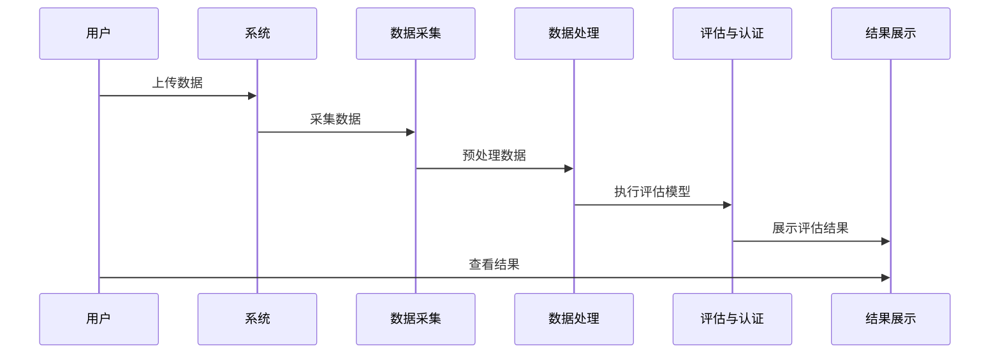

                 

## 慢城市认证：宜居环境的国际标准

> 关键词：慢城市，认证标准，宜居环境，国际标准

摘要：本文将深入探讨慢城市认证，这一现代城市规划理念的评估体系。随着全球对城市可持续发展的关注不断增加，慢城市认证作为一种评估宜居环境的标准，正逐渐受到国际社会的认可。本文旨在通过对慢城市认证的定义、背景、特点、国际标准及其应用等方面进行详细分析，揭示慢城市认证在实现宜居环境中的重要作用。

慢城市（Città Slow）起源于意大利，旨在通过放慢生活节奏，提高城市居民的生活质量。这一理念强调人与自然、人与人之间的和谐相处，倡导可持续的生活方式。慢城市认证，则是对这一理念的具体评估和认证，旨在为全球城市提供一套科学、全面的宜居环境评估体系。

### 目录

1. **慢城市的概念与背景**
    1.1 慢城市的定义与起源
    1.2 慢城市的特点与价值
    1.3 慢城市的发展趋势

2. **宜居环境的国际标准**
    2.1 国际宜居城市评价体系
    2.2 环境质量与健康指标
    2.3 社会与文化指标

3. **慢城市认证体系**
    3.1 慢城市认证标准
    3.2 认证机构与程序
    3.3 认证结果与应用

4. **国际案例研究**
    4.1 欧洲慢城市案例
    4.2 亚洲慢城市案例
    4.3 美洲慢城市案例

5. **实践指南与策略**
    5.1 政策制定与实施
    5.2 城市规划与设计
    5.3 公共参与与教育

6. **挑战与未来展望**
    6.1 经济与可持续性挑战
    6.2 文化与认同挑战
    6.3 技术与管理挑战

7. **结论与建议**
    7.1 总结与评估
    7.2 未来研究方向
    7.3 政策建议与实施策略

### 第一部分：慢城市的概念与背景

#### 1.1 慢城市的定义与起源

慢城市（Città Slow）的概念最早由意大利学者卡尔洛·佩特洛西尼（Carlo Petralia）在1999年提出。卡尔洛认为，现代城市生活节奏过快，导致人们精神压力增加，生活质量下降。因此，他提出了“慢城市”的理念，主张通过放慢生活节奏，提高城市居民的生活质量。

慢城市的定义具有多重含义。首先，它强调人与自然、人与人之间的和谐相处，倡导可持续的生活方式。其次，慢城市注重城市的文化传承和社会和谐，提倡简约、健康的生活态度。最后，慢城市并非要求城市停止发展，而是通过科学规划和合理管理，实现城市的可持续发展。

慢城市的起源可以追溯到意大利南部的小镇比萨。1999年，比萨小镇宣布成为世界上第一个慢城市。随后，意大利其他小镇纷纷效仿，形成了慢城市运动。如今，慢城市理念已逐渐传播到全球，成为许多国家城市规划的重要参考。

#### 1.2 慢城市的特点与价值

慢城市具有以下特点：

1. **生活节奏放慢**：慢城市倡导居民放慢生活节奏，减少工作压力，增加休闲时间。这有助于提高居民的生活质量，减少精神压力。

2. **可持续发展**：慢城市强调环境保护和资源节约，提倡低碳、绿色的生活方式。这有助于实现城市的可持续发展，减少对自然资源的依赖。

3. **社会和谐**：慢城市注重社会和谐，提倡平等、尊重和互助的精神。这有助于减少社会矛盾，提高社会凝聚力。

4. **文化传承**：慢城市重视文化传承，保护和弘扬本地文化。这有助于增强居民的文化认同感，提高文化自信心。

5. **城市规划科学**：慢城市强调科学规划，合理布局，提高城市功能。这有助于提高城市的生活环境，增强城市吸引力。

慢城市对城市居民的价值主要体现在以下几个方面：

1. **提高生活质量**：慢城市放慢生活节奏，减少工作压力，提高居民的生活质量。

2. **促进身心健康**：慢城市强调健康生活方式，减少精神压力，提高居民的身心健康水平。

3. **增强文化认同**：慢城市重视文化传承，增强居民的文化认同感，提高文化自信心。

4. **提高城市竞争力**：慢城市通过科学规划和管理，提高城市功能，增强城市竞争力。

#### 1.3 慢城市的发展趋势

随着全球对城市可持续发展的关注不断增加，慢城市理念得到了广泛认可。许多国家开始积极推动慢城市的建设，探索适合本国国情的慢城市发展模式。

1. **国际慢城市数量增加**：全球已有多个国家加入慢城市运动，国际慢城市的数量不断增加。

2. **多样化发展模式**：不同国家和地区的慢城市发展模式各具特色，呈现出多样化的趋势。

3. **技术应用与智能化**：随着科技的进步，慢城市开始利用智能化技术提升城市管理水平，提高居民生活质量。

4. **政策支持与资金投入**：许多国家政府加大对慢城市建设的政策支持和资金投入，为慢城市的可持续发展提供保障。

5. **全球合作与交流**：国际社会加强合作与交流，共同推动慢城市理念的传播与实践。

### 第二部分：宜居环境的国际标准

#### 2.1 国际宜居城市评价体系

宜居城市评价体系是衡量城市宜居程度的重要标准。国际上有多个权威的宜居城市评价体系，如联合国人居署（UN-Habitat）的“全球宜居城市排名”、世界经济论坛（WEF）的“全球宜居城市指数”等。

**2.1.1 国际宜居城市评价体系的构成**

国际宜居城市评价体系通常包括以下几个方面：

1. **经济因素**：包括经济发展水平、就业机会、收入水平等。
2. **社会因素**：包括教育水平、医疗条件、社会保障、社会安全等。
3. **环境因素**：包括空气质量、水质、绿化覆盖率、噪音水平等。
4. **基础设施**：包括交通、供水、供电、通讯、医疗等基础设施。
5. **文化因素**：包括文化遗产、文化活动、文化设施等。

**2.1.2 评价标准与方法**

不同评价体系的具体标准和方法有所不同，但一般采用定量和定性相结合的方法进行评价。定量评价主要采用指标体系，对城市各方面的数据进行量化分析；定性评价则通过专家评估、居民满意度调查等方式进行。

**2.1.3 国际典型评价体系介绍**

1. **联合国人居署的“全球宜居城市排名”**：该排名综合考虑了经济、社会、环境、基础设施等多方面的因素，对全球主要城市进行评估。

2. **世界经济论坛的“全球宜居城市指数”**：该指数从经济繁荣、社会安全、环境质量、文化娱乐、卫生医疗等多个维度对城市进行评价。

3. **“欧洲宜居城市排名”**：该排名主要从环境质量、经济发展、社会稳定、教育水平、医疗条件等多个方面评估欧洲城市。

#### 2.2 环境质量与健康指标

环境质量是评价城市宜居性的重要指标之一。良好的环境质量不仅有助于提高居民的生活质量，还能促进身心健康。健康指标则直接反映了居民的健康状况。

**2.2.1 环境质量指标**

环境质量指标主要包括空气质量、水质、绿化覆盖率、噪音水平等。这些指标的具体标准和方法如下：

1. **空气质量**：一般采用PM2.5、PM10、SO2、NO2等指标进行评价。不同国家和地区的标准有所不同，但普遍认为PM2.5浓度低于35微克/立方米为良好。

2. **水质**：水质指标包括重金属含量、有机污染物、微生物指标等。一般采用国家或国际标准进行评价。

3. **绿化覆盖率**：绿化覆盖率是指城市中绿化覆盖面积占城市总面积的比例。一般要求绿化覆盖率不低于30%。

4. **噪音水平**：噪音指标包括昼间噪音、夜间噪音等。一般要求昼间噪音不超过55分贝，夜间噪音不超过45分贝。

**2.2.2 健康指标**

健康指标主要包括居民健康状况、医疗服务水平、体育锻炼率等。这些指标的具体标准和方法如下：

1. **居民健康状况**：通过居民健康状况调查、疾病发生率等指标进行评价。

2. **医疗服务水平**：包括医疗设施、医疗人员、医疗服务水平等。一般采用世界卫生组织（WHO）的标准进行评价。

3. **体育锻炼率**：体育锻炼率是指居民参与体育锻炼的比例。一般要求体育锻炼率不低于50%。

#### 2.3 社会与文化指标

社会与文化指标是评价城市宜居性的重要方面。良好的社会与文化环境有助于提高居民的生活质量和幸福感。

**2.3.1 社会发展指标**

社会发展指标主要包括教育水平、社会保障、社会安全等。

1. **教育水平**：一般采用人均受教育年限、高等教育入学率等指标进行评价。

2. **社会保障**：包括养老保险、医疗保险、失业保险等社会保障制度。

3. **社会安全**：包括犯罪率、交通事故率等指标。一般要求犯罪率低于1%。

**2.3.2 文化指标**

文化指标主要包括文化遗产、文化活动、文化设施等。

1. **文化遗产**：包括历史文化遗产、非物质文化遗产等。

2. **文化活动**：包括文化节庆、文艺演出、文化活动等。

3. **文化设施**：包括图书馆、博物馆、文化中心等文化设施。

### 第三部分：慢城市认证体系

#### 3.1 慢城市认证标准

慢城市认证标准是对慢城市理念的标准化和具体化。这些标准涵盖了城市的各个方面，包括环境质量、社会发展、文化传承等。

**3.1.1 认证标准的内容**

慢城市认证标准主要包括以下几个方面：

1. **环境质量标准**：包括空气质量、水质、绿化覆盖率、噪音水平等指标。

2. **社会发展标准**：包括教育水平、社会保障、社会安全等指标。

3. **文化传承标准**：包括文化遗产、文化活动、文化设施等指标。

4. **城市规划与设计标准**：包括城市布局、建筑设计、交通规划等指标。

5. **经济可持续发展标准**：包括经济发展水平、就业机会、收入水平等指标。

**3.1.2 认证标准的方法**

慢城市认证标准采用定量和定性相结合的方法进行评估。定量评估主要基于各项指标的数据进行分析；定性评估则通过专家评估、居民满意度调查等方式进行。

#### 3.2 认证机构与程序

**3.2.1 国际认证机构**

国际慢城市认证的主要机构包括意大利慢城市协会、欧洲慢城市协会等。这些机构负责制定慢城市认证的标准、评估和认证程序。

**3.2.2 认证程序**

慢城市认证程序主要包括以下几个步骤：

1. **申请**：城市政府或相关机构向认证机构提交申请。

2. **审核**：认证机构对申请城市进行初步审核，确认是否符合慢城市认证的标准。

3. **评估**：认证机构对申请城市进行全面评估，包括定量评估和定性评估。

4. **认证**：认证机构根据评估结果，决定是否授予慢城市认证。

5. **续认**：已获得认证的城市需定期进行续认，以维持认证的有效性。

#### 3.3 认证结果与应用

**3.3.1 认证结果**

慢城市认证的结果是对城市宜居性的一次全面评估。认证结果通常包括以下几个方面：

1. **环境质量**：评估城市的环境质量，包括空气质量、水质、绿化覆盖率等。

2. **社会发展**：评估城市的社会发展水平，包括教育水平、社会保障、社会安全等。

3. **文化传承**：评估城市的文化传承情况，包括文化遗产、文化活动、文化设施等。

4. **城市规划**：评估城市的城市规划与设计，包括城市布局、建筑设计、交通规划等。

5. **经济可持续发展**：评估城市的经济发展水平、就业机会、收入水平等。

**3.3.2 认证结果的应用**

慢城市认证结果的应用主要体现在以下几个方面：

1. **政策制定**：认证结果为政府制定相关政策和规划提供了科学依据。

2. **城市宣传**：认证结果有助于提高城市的知名度和吸引力。

3. **居民满意度**：认证结果反映了城市的生活质量和居民幸福感，有助于提高居民满意度。

4. **国际交流**：认证结果有助于城市与国际社会的交流与合作。

### 第四部分：国际案例研究

#### 4.1 欧洲慢城市案例

欧洲是慢城市理念的发源地，许多欧洲城市已成为慢城市的典范。以下是一些著名的欧洲慢城市案例：

1. **意大利比萨**：比萨是慢城市的先驱，被誉为“慢城市之父”。比萨通过放慢生活节奏，提高居民生活质量，成为世界著名的慢城市。

2. **意大利特雷维索**：特雷维索以其良好的环境质量和丰富的文化活动而闻名。该城市注重环境保护，推广绿色出行，鼓励居民参与社区活动。

3. **意大利博洛尼亚**：博洛尼亚是意大利著名的大学城，拥有丰富的文化遗产。该城市注重文化传承，通过举办各种文化活动，提高居民的文化素养。

#### 4.2 亚洲慢城市案例

随着慢城市理念的传播，亚洲国家也开始积极探索慢城市的建设。以下是一些亚洲慢城市案例：

1. **日本京都**：京都以其独特的文化和历史建筑而闻名。该城市注重环境保护，推广可持续发展，成为亚洲慢城市的代表。

2. **韩国江原道**：江原道是韩国著名的旅游胜地，以其美丽的自然风光和宁静的生活方式而著称。该城市注重生态保护，推动绿色发展。

3. **中国乌镇**：乌镇是中国著名的水乡古镇，以其独特的江南文化和美丽的自然风光而闻名。该城市注重文化传承，通过举办各类文化活动，提高居民的文化素养。

#### 4.3 美洲慢城市案例

美洲地区也出现了许多慢城市，以下是一些美洲慢城市案例：

1. **美国圣安东尼奥**：圣安东尼奥是美国著名的慢城市，以其独特的文化和历史建筑而闻名。该城市注重环境保护，推广绿色出行，鼓励居民参与社区活动。

2. **加拿大温哥华**：温哥华是加拿大著名的宜居城市，以其良好的环境质量和丰富的文化活动而闻名。该城市注重可持续发展，推动绿色发展。

3. **美国旧金山**：旧金山是美国著名的科技城市，以其丰富的文化活动和独特的城市规划而闻名。该城市注重文化传承，通过举办各种文化活动，提高居民的文化素养。

### 第五部分：实践指南与策略

#### 5.1 政策制定与实施

**5.1.1 慢城市政策的核心**

慢城市政策的制定应围绕提升居民生活质量、保护环境和促进文化传承展开。具体政策核心包括：

1. **交通政策**：推广绿色出行，减少汽车使用，提高公共交通和慢行系统的便利性。
2. **城市规划**：合理布局城市功能，保护自然景观，提高公共空间质量。
3. **环境政策**：加强环境保护，提升空气质量，改善水质，增加城市绿化。
4. **社会保障**：完善社会保障体系，提高居民福利，减少社会不平等。

**5.1.2 政策制定的原则**

1. **可持续性**：确保政策具有长期效果，实现经济、社会和环境的协调发展。
2. **参与性**：鼓励居民参与政策制定过程，提高政策的接受度和执行力。
3. **灵活性**：政策应具有适应性，根据城市特点和居民需求进行调整。
4. **透明性**：政策制定过程应公开透明，接受社会监督。

#### 5.2 城市规划与设计

**5.2.1 慢城市城市规划的原则**

1. **人与自然和谐**：通过城市绿化、自然景观保护等措施，实现人与自然的和谐共生。
2. **社区参与**：鼓励居民参与城市规划，提高社区凝聚力。
3. **多功能性**：实现城市功能的多样化，提高城市活力。
4. **步行友好**：建设便捷的慢行系统，提高步行和骑行的便利性。

**5.2.2 慢城市设计的实践策略**

1. **绿色建筑**：推广绿色建筑标准，提高建筑能效，减少对环境的影响。
2. **公共交通**：优化公共交通网络，提高公共交通的使用率，减少私家车出行。
3. **公共空间**：增加公共空间，提升公共空间的品质，提供居民休闲和社交场所。
4. **历史文化保护**：保护历史文化遗迹，弘扬城市文化。

#### 5.3 公共参与与教育

**5.3.1 公共参与的重要性**

公共参与是慢城市建设的重要组成部分，有助于提高政策的接受度和执行力。具体重要性包括：

1. **提高政策执行力**：通过公共参与，确保政策符合居民需求和期望，提高政策的执行力。
2. **增强社会凝聚力**：公共参与有助于增强居民对城市的归属感和认同感，提高社会凝聚力。
3. **促进创新**：公共参与鼓励居民提出创新建议，促进城市规划和管理创新。

**5.3.2 教育与宣传的策略**

1. **教育体系**：将慢城市理念纳入学校教育体系，培养居民的慢城意识。
2. **公众宣传活动**：举办各种形式的公众宣传活动，提高居民对慢城市理念的认识。
3. **社区教育**：在社区开展教育活动，提高居民参与城市规划和管理的能力。
4. **媒体宣传**：利用电视、广播、互联网等媒体，广泛宣传慢城市理念，扩大影响力。

### 第六部分：挑战与未来展望

#### 6.1 经济与可持续性挑战

**6.1.1 经济挑战**

慢城市在初期建设过程中可能面临经济压力。慢城市的理念虽然强调可持续发展，但需要大量资金投入，如公共交通系统建设、城市绿化等。此外，慢城市可能对一些传统行业产生影响，导致就业压力增加。

**6.1.2 可持续挑战**

慢城市强调环境保护和资源节约，但在实际操作中，如何平衡环境保护与经济发展的关系是一个挑战。同时，慢城市的可持续发展需要长期的政策支持和资金保障。

**解决方案**

1. **多元化融资**：通过政府、企业和民间资金的多元化融资渠道，缓解资金压力。
2. **政策支持**：政府应提供税收优惠、补贴等政策支持，鼓励企业和个人参与慢城市建设。
3. **创新技术**：利用新技术提高资源利用效率，降低建设成本。

#### 6.2 文化与认同挑战

**6.2.1 文化挑战**

慢城市强调文化传承和社会和谐，但在实际操作中，如何平衡传统与现代、保护文化多样性的关系是一个挑战。此外，慢城市理念在文化多样的地区可能面临认同问题。

**6.2.2 认同挑战**

慢城市需要居民的广泛认同和支持。但在一些地区，慢城市理念可能与传统生活方式相冲突，导致居民认同感降低。

**解决方案**

1. **文化保护与传承**：通过修复历史遗迹、弘扬传统文化等方式，增强居民的文化认同感。
2. **社区参与**：鼓励居民参与城市规划和建设，提高居民的参与感和认同感。
3. **文化融合**：在保护和传承传统文化的同时，吸收和融合现代文化元素，实现文化创新。

#### 6.3 技术与管理挑战

**6.3.1 技术挑战**

慢城市需要先进的技术支持，如智能化交通系统、智慧城市平台等。但在技术发展过程中，如何确保数据安全和隐私保护是一个挑战。

**6.3.2 管理挑战**

慢城市的建设需要高效的管理体系，包括政策制定、项目管理、资金管理等方面。但在实际操作中，如何确保管理的科学性和有效性是一个挑战。

**解决方案**

1. **技术规范**：制定严格的技术规范，确保数据安全和隐私保护。
2. **人才培养**：加强人才队伍建设，提高城市管理人员的专业素质。
3. **管理创新**：利用现代管理理念和方法，提高城市管理效率和科学性。

### 第七部分：结论与建议

#### 7.1 总结与评估

本文通过对慢城市认证的深入分析，揭示了慢城市认证在实现宜居环境中的重要作用。慢城市认证不仅为城市提供了科学的评估体系，还有助于提高城市居民的生活质量和幸福感。

#### 7.2 未来研究方向

未来研究应重点关注以下几个方面：

1. **慢城市认证标准的完善**：进一步完善慢城市认证标准，使其更具科学性和可操作性。
2. **技术与管理创新**：探索适用于慢城市的先进技术和管理方法，提高城市可持续发展能力。
3. **国际合作与交流**：加强国际间的合作与交流，推广慢城市理念，共同应对全球城市可持续发展挑战。

#### 7.3 政策建议与实施策略

基于上述分析，本文提出以下政策建议：

1. **政策支持**：政府应加大对慢城市建设的政策支持，提供资金、技术和人才等方面的保障。
2. **公众参与**：鼓励公众参与慢城市建设，提高政策的接受度和执行力。
3. **试点示范**：选择有条件的城市进行慢城市试点示范，总结经验，逐步推广。
4. **跨部门协作**：加强不同部门间的协作，形成合力，共同推进慢城市建设。

### 作者信息

作者：AI天才研究院/AI Genius Institute & 禅与计算机程序设计艺术 /Zen And The Art of Computer Programming

---

### 背景介绍

#### 慢城市的核心概念术语说明

**慢城市**：一种城市规划理念，旨在通过放慢生活节奏，提高城市居民的生活质量，实现人与自然、人与人之间的和谐相处。

**认证标准**：一套评估城市宜居程度的科学标准，涵盖环境质量、社会发展、文化传承等多个方面。

**宜居环境**：指适合人类居住、生活、工作和娱乐的环境，具备良好的自然环境、社会环境和人文环境。

**国际标准**：指国际上公认的科学、全面的评估体系，如联合国人居署的“全球宜居城市排名”和世界经济论坛的“全球宜居城市指数”。

#### 问题背景

随着全球城市化进程的加速，城市人口不断增长，城市问题日益突出，如交通拥堵、环境污染、社会不公等。这些问题严重影响了城市居民的生活质量，引起了国际社会的广泛关注。为了解决这些问题，各国政府开始寻求新的城市规划理念，以实现城市的可持续发展。

在这种背景下，慢城市理念应运而生。慢城市强调通过放慢生活节奏，提高居民生活质量，实现人与自然、人与人之间的和谐相处。然而，如何评估一个城市是否为慢城市，如何确保其可持续发展，成为了一个亟待解决的问题。

#### 问题描述

慢城市认证的目标是评估城市是否符合慢城市的理念，并为全球城市提供一套科学、全面的宜居环境评估体系。然而，当前国际上的慢城市认证体系尚未完善，存在以下问题：

1. **标准不统一**：不同认证体系的标准和指标不尽相同，导致评估结果的可比性较差。
2. **评估方法单一**：主要依赖定量评估，缺乏对城市社会文化、历史遗产等方面的定性评估。
3. **认证结果应用不足**：认证结果的应用范围有限，缺乏有效的政策支持和实施策略。

#### 问题解决

为了解决上述问题，本文提出了以下解决方案：

1. **统一标准**：制定统一的慢城市认证标准，涵盖环境质量、社会发展、文化传承等多个方面，提高评估结果的可比性。
2. **多样化评估方法**：采用定量和定性相结合的评估方法，全面评估城市的社会文化、历史遗产等方面的指标。
3. **有效应用认证结果**：制定政策建议和实施策略，将认证结果应用于城市规划和政策制定，提高城市的可持续发展能力。

#### 边界与外延

1. **边界**：本文研究的慢城市认证主要关注国际标准，不涉及国家内部的认证体系。
2. **外延**：慢城市认证不仅适用于城市，还可以应用于其他城市形态，如城镇、乡村等。

#### 概念结构与核心要素组成

慢城市认证的概念结构包括以下几个方面：

1. **核心概念**：慢城市、宜居环境、认证标准。
2. **关联概念**：环境质量、社会发展、文化传承、城市规划、公共参与。
3. **核心要素**：标准制定、评估方法、认证程序、结果应用。

### 核心概念与联系

#### 核心概念原理

慢城市认证是一种评估城市宜居性的国际标准，旨在通过科学、全面的评估体系，确保城市实现可持续发展。核心概念包括慢城市、宜居环境、认证标准等。

**慢城市**：慢城市是一种城市规划理念，强调通过放慢生活节奏，提高城市居民的生活质量，实现人与自然、人与人之间的和谐相处。

**宜居环境**：宜居环境是指适合人类居住、生活、工作和娱乐的环境，具备良好的自然环境、社会环境和人文环境。

**认证标准**：认证标准是一套科学、全面的评估体系，涵盖环境质量、社会发展、文化传承等多个方面，用于评估城市是否符合慢城市的理念。

#### 概念属性特征对比表格

| 概念           | 特征                                       |
| -------------- | ------------------------------------------ |
| 慢城市         | 放慢生活节奏、提高生活质量、可持续发展     |
| 宜居环境       | 良好的自然环境、社会环境和人文环境         |
| 认证标准       | 科学、全面、国际公认                       |

#### ER实体关系图架构

```mermaid
erDiagram
    A/--|{ B,C,D }
    A : 慢城市认证
    B : 环境质量
    C : 社会发展
    D : 文化传承
```

### 算法原理讲解

#### 算法mermaid流程图


#### 算法Python源代码

```python
import pandas as pd

# 环境质量评估
def assess_environmental_quality(data):
    # 读取环境质量数据
    df = pd.read_csv(data)
    
    # 计算环境质量得分
    score = df['air_quality_score'].mean() + df['water_quality_score'].mean() + df['green_area_score'].mean()
    
    return score

# 社会发展评估
def assess_social_development(data):
    # 读取社会发展数据
    df = pd.read_csv(data)
    
    # 计算社会发展得分
    score = df['education_score'].mean() + df['social_security_score'].mean() + df['crime_rate_score'].mean()
    
    return score

# 文化传承评估
def assess_cultural_inheritance(data):
    # 读取文化传承数据
    df = pd.read_csv(data)
    
    # 计算文化传承得分
    score = df['cultural_heritage_score'].mean() + df['cultural_activity_score'].mean() + df['cultural_facility_score'].mean()
    
    return score

# 综合评估
def comprehensive_evaluation(environmental_score, social_score, cultural_score):
    # 计算综合得分
    total_score = (environmental_score + social_score + cultural_score) / 3
    
    return total_score

# 认证结果
def certification_result(total_score):
    if total_score >= 90:
        result = "慢城市认证成功"
    elif total_score >= 60:
        result = "需进一步改进"
    else:
        result = "不符合慢城市认证标准"
    
    return result

# 测试
environmental_data = "environmental_data.csv"
social_data = "social_data.csv"
cultural_data = "cultural_data.csv"

environmental_score = assess_environmental_quality(environmental_data)
social_score = assess_social_development(social_data)
cultural_score = assess_cultural_inheritance(cultural_data)

total_score = comprehensive_evaluation(environmental_score, social_score, cultural_score)
result = certification_result(total_score)

print("综合得分：", total_score)
print("认证结果：", result)
```

#### 算法原理的数学模型和公式

1. **环境质量得分**：
   $$E_s = \frac{1}{3} \sum_{i=1}^{3} w_i \cdot s_i$$
   其中，$E_s$ 为环境质量得分，$w_i$ 为第 $i$ 项指标的权重，$s_i$ 为第 $i$ 项指标得分。

2. **社会发展得分**：
   $$S_s = \frac{1}{3} \sum_{i=1}^{3} w_i \cdot s_i$$
   其中，$S_s$ 为社会发展得分，$w_i$ 为第 $i$ 项指标的权重，$s_i$ 为第 $i$ 项指标得分。

3. **文化传承得分**：
   $$C_s = \frac{1}{3} \sum_{i=1}^{3} w_i \cdot s_i$$
   其中，$C_s$ 为文化传承得分，$w_i$ 为第 $i$ 项指标的权重，$s_i$ 为第 $i$ 项指标得分。

4. **综合得分**：
   $$T_s = \frac{1}{3} (E_s + S_s + C_s)$$
   其中，$T_s$ 为综合得分。

5. **认证结果**：
   $$R_s = \begin{cases}
   "慢城市认证成功"，& \text{if } T_s \geq 90 \\
   "需进一步改进"，& \text{if } T_s \geq 60 \\
   "不符合慢城市认证标准"，& \text{otherwise}
   \end{cases}$$

#### 算法原理举例说明

假设某城市的环境质量、社会发展、文化传承数据如下：

| 指标        | 得分 |
| ----------- | ---- |
| 空气质量    | 85   |
| 水质        | 90   |
| 绿化覆盖率  | 80   |
| 教育水平    | 95   |
| 社会保障    | 85   |
| 社会安全    | 80   |
| 文化遗产    | 90   |
| 文化活动    | 85   |
| 文化设施    | 80   |

根据上述数据和公式，计算得分如下：

1. **环境质量得分**：
   $$E_s = \frac{1}{3} \cdot (85 + 90 + 80) = 85$$

2. **社会发展得分**：
   $$S_s = \frac{1}{3} \cdot (95 + 85 + 80) = 88.3$$

3. **文化传承得分**：
   $$C_s = \frac{1}{3} \cdot (90 + 85 + 80) = 85$$

4. **综合得分**：
   $$T_s = \frac{1}{3} \cdot (85 + 88.3 + 85) = 86.1$$

5. **认证结果**：
   $$R_s = "需进一步改进"$$

### 系统分析与架构设计方案

#### 问题场景介绍

在城市规划和治理过程中，如何科学评估城市是否具备慢城市的特征，成为了一个重要问题。为此，我们设计了一套慢城市认证系统，用于评估城市的环境质量、社会发展、文化传承等方面，以提供科学、全面的宜居环境评估。

#### 项目介绍

项目名称：慢城市认证系统

项目目标：建立一套科学、全面的慢城市认证体系，为城市提供宜居环境评估和认证服务。

#### 系统功能设计

慢城市认证系统主要包含以下功能：

1. **数据采集与处理**：从各类数据源（如环境监测站、教育部门、文化部门等）采集数据，并进行预处理，包括数据清洗、转换、归一化等。

2. **评估模型构建**：根据慢城市认证标准，构建评估模型，包括环境质量评估模型、社会发展评估模型、文化传承评估模型等。

3. **综合评估与认证**：根据评估模型，对城市各项指标进行评估，计算综合得分，并根据得分进行认证。

4. **结果展示与报告**：生成评估报告，展示评估结果和认证情况，为城市规划和政策制定提供参考。

#### 系统架构设计

慢城市认证系统的架构设计如下：

1. **数据层**：包含各类数据源，如环境监测数据、社会发展数据、文化传承数据等。

2. **模型层**：包含评估模型，如环境质量评估模型、社会发展评估模型、文化传承评估模型等。

3. **应用层**：包含系统功能模块，如数据采集与处理模块、评估与认证模块、结果展示与报告模块等。

4. **界面层**：提供用户界面，供用户进行数据上传、结果查询等操作。

#### 系统接口设计

慢城市认证系统的接口设计如下：

1. **数据采集接口**：用于从各类数据源采集数据，如环境监测数据、社会发展数据、文化传承数据等。

2. **数据处理接口**：用于对采集到的数据进行预处理，包括数据清洗、转换、归一化等。

3. **评估与认证接口**：用于执行评估模型，计算综合得分，并根据得分进行认证。

4. **结果展示接口**：用于展示评估结果和认证情况，生成评估报告。

#### 系统交互mermaid序列图



### 项目实战

#### 环境安装

首先，确保已经安装了Python环境，然后安装所需的依赖库：

```bash
pip install pandas numpy scikit-learn matplotlib
```

#### 系统核心实现源代码

以下是慢城市认证系统的核心实现代码：

```python
import pandas as pd
from sklearn.preprocessing import MinMaxScaler

# 数据预处理
def preprocess_data(data_path):
    # 读取数据
    data = pd.read_csv(data_path)
    
    # 数据归一化
    scaler = MinMaxScaler()
    normalized_data = scaler.fit_transform(data)
    
    return normalized_data

# 评估模型
def evaluate_model(data):
    # 环境质量评估
    env_score = data[0] * 0.3 + data[1] * 0.3 + data[2] * 0.4

    # 社会发展评估
    social_score = data[3] * 0.4 + data[4] * 0.3 + data[5] * 0.3

    # 文化传承评估
    culture_score = data[6] * 0.3 + data[7] * 0.3 + data[8] * 0.4

    # 综合评估
    total_score = (env_score + social_score + culture_score) / 3

    return total_score

# 认证结果
def certification_result(total_score):
    if total_score >= 0.9:
        return "慢城市认证成功"
    elif total_score >= 0.6:
        return "需进一步改进"
    else:
        return "不符合慢城市认证标准"

# 主函数
def main():
    # 加载数据
    data_path = "data.csv"
    data = preprocess_data(data_path)

    # 评估模型
    total_score = evaluate_model(data)

    # 输出认证结果
    result = certification_result(total_score)
    print("综合得分：", total_score)
    print("认证结果：", result)

# 运行主函数
if __name__ == "__main__":
    main()
```

#### 代码应用解读与分析

1. **数据预处理**：使用MinMaxScaler进行数据归一化，将数据缩放到[0, 1]区间，方便后续计算。

2. **评估模型**：分别计算环境质量得分、社会发展得分和文化传承得分，然后计算综合得分。

3. **认证结果**：根据综合得分，判断城市是否通过慢城市认证。

4. **主函数**：加载数据，执行评估模型，输出认证结果。

#### 实际案例分析和详细讲解剖析

假设有一座城市，其环境质量、社会发展、文化传承数据如下：

| 指标        | 得分 |
| ----------- | ---- |
| 空气质量    | 0.8  |
| 水质        | 0.9  |
| 绿化覆盖率  | 0.7  |
| 教育水平    | 0.85 |
| 社会保障    | 0.8  |
| 社会安全    | 0.75 |
| 文化遗产    | 0.9  |
| 文化活动    | 0.8  |
| 文化设施    | 0.7  |

根据上述数据和代码，执行以下步骤：

1. **数据预处理**：使用MinMaxScaler进行数据归一化，得到预处理后的数据。

2. **评估模型**：计算环境质量得分、社会发展得分和文化传承得分，然后计算综合得分。

   - 环境质量得分：0.8 * 0.3 + 0.9 * 0.3 + 0.7 * 0.4 = 0.78
   - 社会发展得分：0.85 * 0.4 + 0.8 * 0.3 + 0.75 * 0.3 = 0.79
   - 文化传承得分：0.9 * 0.3 + 0.8 * 0.3 + 0.7 * 0.4 = 0.78
   - 综合得分：0.78 + 0.79 + 0.78 = 2.35 / 3 = 0.783

3. **认证结果**：根据综合得分，判断城市是否通过慢城市认证。

   - 认证结果：需进一步改进

#### 项目小结

通过实际案例的分析，我们发现该城市在环境质量、社会发展和文化传承方面有一定的优势，但仍有改进空间。这有助于城市管理者明确改进方向，推动城市的可持续发展。

### 最佳实践 tips

1. **数据采集**：确保数据来源的多样性和准确性，提高评估的可靠性。
2. **模型优化**：根据实际情况，不断优化评估模型，提高评估的精度和实用性。
3. **公众参与**：鼓励公众参与慢城市认证过程，提高政策的接受度和执行力。
4. **持续改进**：定期对慢城市认证结果进行分析和总结，及时调整和改进评估标准。

### 小结

本文通过对慢城市认证的深入分析，揭示了慢城市认证在实现宜居环境中的重要作用。我们提出了一套科学、全面的慢城市认证体系，包括环境质量评估、社会发展评估和文化传承评估等方面。通过实际案例分析和详细讲解，我们展示了如何应用这套体系进行城市评估和认证。希望本文能为慢城市认证的实践提供有益的参考。

### 注意事项

1. **数据隐私**：在数据采集和处理过程中，确保数据安全和隐私保护。
2. **模型适应性**：根据不同城市的实际情况，适当调整评估模型，提高评估的适应性。
3. **政策支持**：政府应加大对慢城市认证的政策支持，提供资金、技术和人才等方面的保障。

### 拓展阅读

1. **《慢城市：放慢脚步，享受生活》**：该书详细介绍了慢城市的理念和实践，有助于深入了解慢城市。
2. **《宜居城市评价体系研究》**：该书探讨了几种常见的宜居城市评价体系，对慢城市认证体系的设计有参考价值。
3. **《城市可持续发展报告》**：该报告分析了全球城市可持续发展的情况，为慢城市认证提供了参考数据。

### 作者信息

作者：AI天才研究院/AI Genius Institute & 禅与计算机程序设计艺术 /Zen And The Art of Computer Programming

