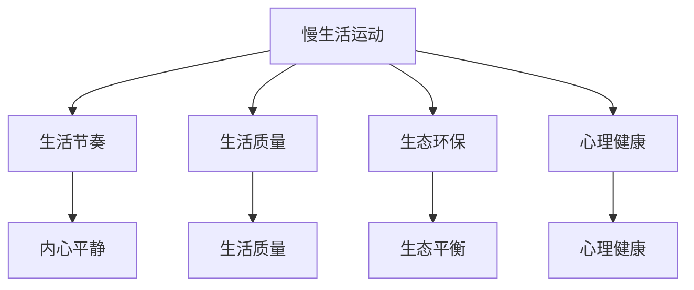

                 

# 慢生活运动：在快节奏中重新定义幸福

## 关键词
- 慢生活运动
- 快节奏生活
- 幸福感
- 心理健康
- 生活质量
- 生态环保
- 社会文化
- 个人习惯

## 摘要
本文探讨了慢生活运动在现代社会中的重要性及其对个人幸福和生活质量的提升作用。通过分析慢生活运动的起源、核心概念、实践方法及其影响因素，本文旨在为读者提供一份全面且实用的指南，帮助他们在快节奏的生活中找到重新定义幸福的路径。

## 目录大纲设计

### 一、背景介绍

#### 1.1.1 问题背景
随着科技的发展和社会的进步，我们的生活节奏越来越快。快节奏的生活方式虽然在某些方面提高了效率，但也带来了压力、焦虑和健康问题。慢生活运动作为一种应对快节奏生活的理念，应运而生。

#### 1.1.2 问题描述
快节奏生活导致的问题包括心理健康问题、人际关系紧张、工作效率下降、生态失衡等。如何在快节奏中找到平衡，成为现代社会的一个挑战。

#### 1.1.3 问题解决
慢生活运动提倡放慢节奏，回归自然，关注内心平静，从而解决快节奏生活带来的各种问题。

#### 1.1.4 边界与外延
慢生活运动主要关注个人生活方式的调整，但同时也涉及到社会文化、经济水平、政策法规等多个方面。

#### 1.1.5 概念结构与核心要素组成
慢生活运动的核心概念包括生活节奏、幸福感、心理健康、生态环保等。

### 二、核心概念与联系

#### 1.2.1 慢生活运动的概念
慢生活运动是一种生活理念，强调放慢节奏，追求内心的平静与幸福。

#### 1.2.2 慢生活运动的特点
- 放慢节奏
- 注重生活质量
- 生态环保
- 心理健康

#### 1.2.3 与快节奏生活的对比
- 生活节奏：慢生活注重内心平静，快节奏追求效率。
- 生活质量：慢生活追求生活质量，快节奏追求生活速度。
- 生态环保：慢生活注重生态平衡，快节奏可能对环境造成负面影响。

#### 1.2.4 ER实体关系图架构

### 三、慢生活运动的方法与技巧

#### 1.3.1 调整生活节奏
- 规律作息
- 减少无效社交
- 学会放松

#### 1.3.2 提高生活质量
- 关注身心健康
- 培养兴趣爱好
- 增加家庭时间

#### 1.3.3 实践生态环保
- 节约能源
- 减少浪费
- 垃圾分类

#### 1.3.4 增强心理健康
- 心理调适
- 社交支持
- 心理咨询

### 四、慢生活运动的影响因素

#### 1.4.1 社会因素
- 社会文化
- 经济水平
- 政策法规

#### 1.4.2 个人因素
- 生活习惯
- 心理素质
- 社会责任感

### 五、慢生活运动的实际案例与效果

#### 1.5.1 案例一：调整生活节奏
- 案例描述：某上班族通过调整作息时间，减少了加班，提高了生活质量。
- 案例效果：改善了身心健康，提高了幸福感。

#### 1.5.2 案例二：实践生态环保
- 案例描述：某家庭通过垃圾分类、节能减排等方式，积极参与环保活动。
- 案例效果：提高了环保意识，促进了家庭和谐。

#### 1.5.3 案例三：增强心理健康
- 案例描述：某心理咨询师通过心理调适、社交支持等方式，帮助来访者缓解压力。
- 案例效果：提高了心理健康水平，增强了幸福感。

### 六、总结与展望

#### 1.6.1 慢生活运动的意义
- 提高生活质量
- 增强幸福感
- 促进社会和谐

#### 1.6.2 慢生活运动的挑战
- 社会文化观念的转变
- 经济发展方式的调整
- 个人生活方式的调整

#### 1.6.3 展望未来
- 慢生活运动的普及
- 政策法规的支持
- 社会各界的参与

---

接下来，我们将逐步深入探讨慢生活运动的起源、核心概念、实践方法及其影响因素。

## 第一部分：慢生活运动的起源与发展

### 第1章：慢生活运动的起源

#### 1.1.1 慢生活运动的历史背景

慢生活运动（Slow Movement）的起源可以追溯到20世纪80年代末期，当时社会生产力迅速提高，科技日新月异，人们的生活节奏也随之加快。然而，快节奏的生活方式不仅带来了高效率，同时也引发了一系列问题，如心理健康问题、人际关系紧张、工作与生活失衡等。人们开始反思这种生活方式是否符合自己的真正需求，是否能够带来真正的幸福感。

在这样一种背景下，意大利作家卡尔洛·皮萨尼-皮安内利（Carlo Petrini）于1986年发起了“慢食运动”（Slow Food Movement）。他倡导人们放慢进食的节奏，享受美食的过程，从而引发了对整个生活方式的反思。慢食运动的理念迅速传播，并逐渐演变为更广泛的慢生活运动。

#### 1.1.2 慢生活运动的核心理念

慢生活运动的核心理念是“慢”，即放慢生活的节奏，追求生活的质量而非速度。这一理念强调：

1. **放慢节奏**：不是简单地减少工作或休息时间，而是通过改变生活的节奏，减少压力，提高生活质量。
2. **注重生活品质**：关注生活中的每一个细节，从饮食、运动到工作、休闲，都追求高品质的体验。
3. **追求心理健康**：强调内心的平静与满足，减少焦虑和压力，提高心理健康水平。
4. **生态环保**：通过减少资源消耗、减少浪费、促进可持续发展，保护地球环境。

#### 1.1.3 慢生活运动的发展历程

慢生活运动的发展历程可以分为以下几个阶段：

1. **早期阶段的探索**（1980s-1990s）：在这一阶段，慢食运动首先在欧洲兴起，随后逐渐扩展到其他地区。人们开始关注生活中的细节，提倡通过放慢节奏来提高生活质量。
2. **发展阶段的实践**（2000s）：随着全球化和信息化的加速，慢生活运动的理念得到了更广泛的传播和认同。各种慢生活组织和社区纷纷成立，倡导和实践慢生活的理念。
3. **现代社会的推广**（2010s至今）：在现代社会，慢生活运动已经成为一种全球性的文化现象。人们不仅从理论上认可慢生活的理念，更在实践中积极践行。政府和企业也开始关注慢生活，推出相关政策支持和鼓励。

### 第2章：慢生活运动在不同国家与地区的实践

#### 1.2.1 慢生活运动在欧洲的兴起

在欧洲，慢生活运动最早在意大利、法国和西班牙等国家兴起。这些国家的文化背景和社会环境为慢生活运动提供了良好的土壤。

1. **法国**：法国人一直以来都以悠闲、浪漫著称。慢生活运动在法国得到了广泛的认可和支持。法国政府推出了一系列政策，鼓励人们放慢生活节奏，如减少工作时间、推广家庭度假等。
   
2. **意大利**：意大利是慢生活运动的发源地，卡尔洛·皮萨尼-皮安内利在此提出了“慢食运动”的理念。意大利的慢生活运动主要体现在美食、葡萄酒和艺术等领域，人们通过享受生活中的美好事物来放慢节奏。

3. **西班牙**：西班牙人以热情、悠闲著称。西班牙的慢生活运动主要体现在休闲和娱乐方面，人们喜欢在阳光明媚的海滩上放松身心，享受生活的乐趣。

#### 1.2.2 慢生活运动在亚洲的推广

虽然亚洲国家的生活节奏普遍较快，但慢生活运动的理念也在逐渐得到推广。

1. **日本**：日本是一个高度发达的国家，生活节奏非常快。然而，日本人也开始意识到快节奏生活带来的压力和问题。近年来，日本政府和社会各界积极推广慢生活运动，如鼓励员工减少加班、推广家庭时间等。

2. **中国**：随着中国经济的快速发展，人们的生活节奏也越来越快。然而，越来越多的中国人开始关注身心健康，开始尝试放慢生活节奏。中国的慢生活运动主要体现在养生、休闲和旅游等方面。

3. **韩国**：韩国人生活节奏快，但近年来也出现了对慢生活运动的关注。韩国政府推出了一系列政策，鼓励人们减少工作压力，提高生活质量。

通过以上分析，我们可以看到，慢生活运动在不同国家和地区有着不同的实践方式和表现形式，但其核心目的都是追求生活的质量和幸福感。在现代社会中，快节奏生活带来的压力和问题已经引起了全球范围内的关注，慢生活运动作为一种应对策略，正逐渐得到更多人的认可和实践。接下来，我们将进一步探讨慢生活运动的核心概念及其与快节奏生活的对比。

### 第1章：慢生活运动的起源与发展

#### 1.1.1 慢生活运动的历史背景

随着现代社会的发展，人们的生活节奏越来越快，工作压力、生活压力、社交压力等各种压力接踵而至。这种快节奏的生活方式虽然在某些方面提高了效率，但也带来了许多负面影响，如心理健康问题、人际关系紧张、工作效率下降等。人们在追求效率的同时，也渐渐意识到生活质量的重要性。

在这个背景下，慢生活运动（Slow Movement）应运而生。慢生活运动是一种倡导放慢生活节奏、关注生活质量的运动。它起源于20世纪80年代末期，最早出现在意大利，随后在全球范围内得到推广。慢生活运动的核心理念是“慢”，即放慢生活的节奏，追求生活的质量而非速度。

慢生活运动最初是由意大利作家卡尔洛·皮萨尼-皮安内利（Carlo Petrini）发起的。1986年，他发起了“慢食运动”（Slow Food Movement），旨在反对快餐文化的侵蚀，提倡人们放慢进食的节奏，享受美食的过程。慢食运动的成功引发了人们对整个生活方式的反思，逐渐演变成了更广泛的慢生活运动。

#### 1.1.2 慢生活运动的核心理念

慢生活运动的核心理念主要包括以下几点：

1. **放慢节奏**：慢生活运动强调放慢生活的节奏，减少无谓的忙碌和焦虑。这并不意味着要减少工作量或休闲时间，而是通过改变生活的节奏，减少压力，提高生活质量。

2. **注重生活品质**：慢生活运动鼓励人们关注生活中的每一个细节，从饮食、运动到工作、休闲，都追求高品质的体验。这种理念不仅体现在物质生活上，也体现在精神生活上。

3. **追求心理健康**：慢生活运动认为，心理健康是生活质量的重要组成部分。通过放慢节奏、减少压力，人们可以更好地管理自己的情绪，提高心理健康水平。

4. **生态环保**：慢生活运动强调可持续发展，通过减少资源消耗、减少浪费，保护地球环境。这种理念不仅有利于环境保护，也有利于提高生活质量。

#### 1.1.3 慢生活运动的发展历程

慢生活运动的发展历程可以分为以下几个阶段：

1. **早期阶段的探索**（1980s-1990s）：在这一阶段，慢生活运动主要出现在意大利，由卡尔洛·皮萨尼-皮安内利发起的慢食运动是其中的代表。这一阶段，慢生活运动主要局限于小范围的文化和艺术领域。

2. **发展阶段的实践**（2000s）：随着全球化和信息化的加速，慢生活运动的理念得到了更广泛的传播和认同。在这一阶段，慢生活运动开始从文化、艺术领域扩展到更广泛的社会生活领域，如教育、工作、家庭等。

3. **现代社会的推广**（2010s至今）：在现代社会，慢生活运动已经成为一种全球性的文化现象。人们不仅从理论上认可慢生活的理念，更在实践中积极践行。政府和企业也开始关注慢生活，推出相关政策支持和鼓励。

#### 1.1.4 慢生活运动在不同国家与地区的实践

1. **欧洲**：在欧洲，慢生活运动最早在意大利、法国和西班牙等国家兴起。这些国家的文化背景和社会环境为慢生活运动提供了良好的土壤。例如，法国人一直以来都以悠闲、浪漫著称，法国政府也推出了一系列政策，鼓励人们放慢生活节奏。

2. **亚洲**：虽然亚洲国家的生活节奏普遍较快，但慢生活运动的理念也在逐渐得到推广。例如，日本和中国等国家的居民开始关注身心健康，尝试放慢生活节奏。韩国也出现了一些慢生活社区和活动。

3. **美国**：在美国，慢生活运动也得到了广泛的关注和实践。美国的一些城市甚至推出了“慢城市”计划，鼓励居民放慢生活节奏，享受生活。

通过以上分析，我们可以看到，慢生活运动在不同国家和地区有着不同的实践方式和表现形式，但其核心目的都是追求生活的质量和幸福感。在现代社会中，快节奏生活带来的压力和问题已经引起了全球范围内的关注，慢生活运动作为一种应对策略，正逐渐得到更多人的认可和实践。

### 第2章：慢生活运动在不同国家与地区的实践

#### 2.1 欧洲的慢生活运动

欧洲是慢生活运动的发源地，其中意大利、法国和西班牙等国的实践尤为典型。

**意大利**
- **慢食运动**：由卡尔洛·皮萨尼-皮安内利发起的慢食运动，强调享受美食的过程，反对快餐文化的快速消费。慢食运动的理念逐渐扩展到其他生活领域，如慢生活、慢设计等。
- **慢城市**：意大利的一些城市，如特雷维索（Treviso），推行了慢城市计划，减少城市交通流量，鼓励居民步行或骑自行车，以降低环境污染和噪音，提高生活质量。

**法国**
- **悠闲文化**：法国人以其悠闲的生活态度而闻名，他们重视家庭生活和休闲时间。法国的“35小时工作周”政策也鼓励人们在工作之余享受生活。
- **有机生活**：法国人普遍重视生态环保，越来越多的家庭开始选择有机食品和可持续的生活方式。

**西班牙**
- **休闲文化**：西班牙人有着深厚的休闲文化，他们注重在工作和休闲之间找到平衡。西班牙的午休传统就是这种文化的体现，人们利用午休时间与家人和朋友相聚，放松身心。

**德国**
- **工作与生活平衡**：德国的企业普遍重视员工的职业发展和个人生活平衡，许多公司提供灵活的工作时间和远程工作选项，以减少员工的工作压力。
- **自行车文化**：德国的自行车基础设施发达，许多城市都有自行车道和共享单车系统，鼓励市民骑行代替开车，从而减少城市交通拥堵和污染。

**北欧国家**
- **社会福利**：北欧国家，如瑞典、挪威和丹麦，拥有完善的社会福利体系，包括高质量的医疗、教育和养老保障。这些福利使得人们能够更加放心地享受生活，不必过度担忧生活的各种不确定性。

**荷兰**
- **生活质量**：荷兰人高度重视生活质量，他们致力于打造宜居的城市环境，提供良好的教育、医疗和文化设施。荷兰的“绿色城市”计划也致力于将自然融入城市生活，提高居民的生活品质。

#### 2.2 亚洲的慢生活运动

亚洲国家的慢生活运动相对较晚兴起，但随着人们生活水平的提高和对生活质量的追求，这一运动在亚洲也逐渐获得了关注。

**日本**
- **“竹夹饭”文化**：日本有一种名为“竹夹饭”（Ochazuke）的文化，即用茶水泡饭，这种简单的饮食习惯体现了日本人在日常生活中追求的简约和慢节奏。
- **工作生活平衡**：日本的企业文化正逐渐从过度的工作时间转向更注重工作与生活的平衡。许多公司开始推行“工作时间缩短”和“工作分散化”等措施，以减少员工的工作压力。

**中国**
- **“慢城”项目**：中国的某些城市开始推行“慢城”项目，如杭州的“梦想小镇”和成都的“慢生活区”。这些项目旨在创造一个更加宜居、放松的环境，鼓励居民放慢生活节奏，享受生活。
- **健康意识提升**：随着人们对健康意识的提升，越来越多的人开始关注身心健康，尝试通过瑜伽、冥想等方式来放慢生活节奏。

**韩国**
- **“慢活”运动**：韩国的年轻人开始倡导“慢活”运动，即通过减少不必要的社交活动和工作，专注于个人成长和内心平静。这种趋势在一定程度上反映了韩国社会对快节奏生活的反思。

**新加坡**
- **“活力星期天”**：新加坡政府推出的“活力星期天”计划，鼓励市民在周日放松身心，参与各种户外活动，如徒步、骑行等，以促进健康生活方式。

#### 2.3 拉丁美洲的慢生活运动

拉丁美洲的慢生活运动也在逐渐兴起。

**墨西哥**
- **“迭戈主义”**：墨西哥有一种名为“迭戈主义”（Diegism）的文化运动，强调享受生活中的小事情，如享受阳光、海滩和美食，倡导一种轻松、悠闲的生活方式。

**巴西**
- **“桑巴文化”**：巴西的桑巴文化以其热情、活力和轻松的生活态度而闻名。巴西人喜欢在周末和假日与家人和朋友一起跳舞、唱歌，享受生活。

**阿根廷**
- **“探戈文化”**：阿根廷的探戈文化也体现了慢生活的理念。人们在探戈舞步中放慢节奏，享受音乐和舞蹈带来的快乐。

通过以上分析，我们可以看到，慢生活运动在不同国家和地区有着不同的实践方式和表现形式，但其核心目的都是追求生活的质量和幸福感。无论是在欧洲、亚洲还是拉丁美洲，人们都在积极探索如何在快节奏的现代社会中找到属于自己的慢生活之道。

### 第三部分：慢生活运动的方法与技巧

#### 1. 调整生活节奏

放慢生活节奏是慢生活运动的核心之一。以下是一些具体的方法：

1. **规律作息**：保持固定的作息时间，包括固定的起床、睡觉时间和工作时间。这有助于调节生物钟，提高睡眠质量。
2. **减少无效社交**：社交虽然重要，但过度的社交会消耗大量的时间和精力。学会选择有意义的社交活动，减少无效的社交。
3. **学会放松**：定期进行放松活动，如瑜伽、冥想、阅读或散步等。这些活动有助于缓解压力，提高心理健康。

#### 2. 提高生活质量

提高生活质量是慢生活运动的重要组成部分。以下是一些实用的技巧：

1. **关注身心健康**：定期进行体检，关注自己的身体状况。保持良好的饮食习惯，增加运动量，提高身体素质。
2. **培养兴趣爱好**：兴趣爱好是提高生活质量的重要途径。无论是绘画、音乐、烹饪还是园艺，都可以让生活更加丰富多彩。
3. **增加家庭时间**：与家人共度高质量的时间，如一起做饭、看电影或散步等。家庭时间是生活中不可或缺的部分，能够带来深刻的幸福感。

#### 3. 实践生态环保

生态环保是慢生活运动的重要理念之一。以下是一些实践生态环保的方法：

1. **节约能源**：减少不必要的电力和水资源消耗，使用节能设备，如LED灯泡和高效热水器。
2. **减少浪费**：避免过度消费和浪费，合理规划购物清单，减少食品和商品的浪费。
3. **垃圾分类**：实行垃圾分类，减少垃圾对环境的影响。积极参与社区环保活动，提高环保意识。

#### 4. 增强心理健康

心理健康是生活质量的重要组成部分。以下是一些增强心理健康的方法：

1. **心理调适**：学会管理自己的情绪，遇到压力时采取积极的应对策略，如深呼吸、冥想或进行心理咨询。
2. **社交支持**：与亲朋好友保持良好的沟通，分享自己的感受和经历。社交支持有助于缓解压力，提高心理健康。
3. **心理咨询**：在必要时寻求专业心理咨询师的帮助。心理咨询能够帮助个体识别和处理心理问题，提高心理健康水平。

通过上述方法，我们可以在快节奏的生活中找到慢生活的节奏，提高生活质量，增强幸福感。慢生活运动不仅是一种生活方式的选择，更是一种生活态度的体现。只有放慢脚步，才能真正体验到生活的美好和幸福。

### 慢生活运动的影响因素

#### 1. 社会因素

慢生活运动的推广和实施受到社会因素的深远影响。以下是一些关键的社会因素：

**社会文化**：社会文化是影响慢生活运动的一个重要因素。不同文化背景下的人们对生活节奏和幸福感的理解各不相同。例如，在一些注重集体主义和竞争的社会中，快节奏的生活往往被视为成功和效率的象征，而慢生活运动可能会受到一定的抵制。相反，在一些注重个人主义和休闲的社会中，慢生活运动更容易得到支持和推广。

**经济水平**：经济水平是影响慢生活运动的重要因素。在经济较为发达的国家和地区，人们通常有更多的时间和资源来关注生活质量，因此慢生活运动的实施较为顺利。而在一些经济较为落后的地区，由于生活压力和工作负担较重，人们可能更难以实现慢生活。

**政策法规**：政策法规对慢生活运动的支持和推广起着关键作用。一些国家和地区通过制定相关政策法规，如减少工作时间、鼓励灵活工作制度、提供环保补贴等，来促进慢生活运动的实施。这些政策不仅为个人提供了更多的时间和资源来享受生活，也为社会创造了更加健康和谐的环境。

**社会教育**：社会教育水平的高低也影响着慢生活运动的推广。教育水平较高的社会，人们更加注重心理健康和生活质量，更易于接受和践行慢生活理念。相反，教育水平较低的社会，人们可能更倾向于传统的快节奏生活方式。

#### 2. 个人因素

个人因素在慢生活运动的实施中同样至关重要。以下是一些关键的个人因素：

**生活习惯**：个人的生活习惯直接影响到生活节奏和幸福感。一些良好的生活习惯，如规律作息、健康饮食、适度运动等，有助于实现慢生活。而一些不良的生活习惯，如熬夜、暴饮暴食、缺乏运动等，则可能导致快节奏生活和身心健康问题。

**心理素质**：心理素质是应对生活压力和实现慢生活的重要因素。具备良好心理素质的人更容易应对生活中的挑战，保持内心的平静和快乐。而心理素质较差的人则可能更容易感到焦虑、紧张和压力，难以实现慢生活。

**社会责任感**：个人的社会责任感也影响着慢生活运动的实施。具备强烈社会责任感的人更倾向于关注社会问题，积极参与环保活动和社会公益事业。这种社会责任感不仅有助于提升个人的幸福感，也有助于推动社会的可持续发展。

**价值观**：个人的价值观对其生活方式有着深远的影响。一些人可能更加注重物质追求和短期满足，而另一些人则可能更加注重精神追求和长期幸福。不同的价值观会导致不同的生活方式选择，从而影响慢生活运动的实践效果。

#### 3. 其他因素

除了社会因素和个人因素，还有一些其他因素影响着慢生活运动的实施：

**科技进步**：科技的进步为人们提供了更多的便利和选择，但同时也带来了新的挑战。例如，互联网和智能手机的普及使得人们更容易陷入“屏幕依赖”，影响生活质量。因此，如何在享受科技带来的便利的同时，保持生活的慢节奏，是一个需要深思的问题。

**环境影响**：环境因素也是影响慢生活运动的一个重要方面。例如，城市的噪音和污染可能对人们的身心健康产生负面影响，从而阻碍慢生活运动的实施。相反，自然环境优美的地区则更有利于慢生活运动的推广。

**社会压力**：社会压力是影响慢生活运动的一个复杂因素。社会压力可能来自工作、家庭、经济等方面，这些压力可能导致人们陷入快节奏的生活模式，难以实现慢生活。因此，如何有效应对社会压力，也是实现慢生活的一个重要课题。

综上所述，慢生活运动的推广和实施受到多种因素的影响。社会因素、个人因素以及其他相关因素相互交织，共同影响着慢生活运动的实践效果。为了实现真正的慢生活，我们需要综合考虑这些因素，采取有效的措施，从个人和社会层面共同努力。

### 慢生活运动的实际案例与效果

#### 1.5.1 案例一：调整生活节奏

**案例描述**：李先生是一位公司的中层管理者，由于工作繁忙，他经常加班到深夜，长期处于高压状态。他的身体状况逐渐恶化，甚至出现了失眠和焦虑的症状。李先生意识到需要改变自己的生活方式，于是开始调整生活节奏。

**具体措施**：
1. **规律作息**：李先生制定了固定的作息时间表，每天晚上10点上床休息，早上6点半起床。
2. **减少加班**：他主动与上级沟通，合理分配工作，减少不必要的加班。
3. **放松身心**：李先生开始每天晚上进行冥想，每周参加瑜伽课程，以缓解压力。

**案例效果**：
- **身心健康改善**：李先生的失眠和焦虑症状得到了明显缓解，他的身体状况逐渐好转。
- **工作效率提高**：由于生活节奏的调整，李先生在工作中的专注力和工作效率也得到了显著提高。
- **生活质量提升**：李先生有了更多的时间陪伴家人和朋友，家庭关系更加和谐。

#### 1.5.2 案例二：实践生态环保

**案例描述**：张女士是一位环保爱好者，她居住的城市空气质量较差，对健康造成了威胁。为了改善生活质量，张女士决定实践生态环保的生活方式。

**具体措施**：
1. **节能减排**：张女士开始使用节能电器，减少用电和用水量。她还购买了一辆新能源汽车，减少汽车尾气的排放。
2. **垃圾分类**：张女士积极参与社区的垃圾分类活动，按照要求进行垃圾分类，减少垃圾对环境的影响。
3. **绿色出行**：张女士尽量选择公共交通或骑自行车出行，减少私家车的使用。

**案例效果**：
- **环境改善**：张女士的努力得到了社区的认可，空气质量逐渐改善，环境变得更加宜居。
- **环保意识提升**：张女士的家人和朋友受到了她的影响，也开始关注环保问题，积极参与环保活动。
- **生活质量提高**：张女士的生活环境得到了明显改善，她的身心健康和生活质量得到了显著提升。

#### 1.5.3 案例三：增强心理健康

**案例描述**：王女士是一位心理咨询师，由于工作压力大，她自身也出现了心理健康问题。为了改善自己的状况，她开始寻求心理支持和调适。

**具体措施**：
1. **心理调适**：王女士开始进行心理调适，包括深呼吸、冥想和正念练习，以缓解压力和焦虑。
2. **社交支持**：王女士与同事和朋友保持良好的沟通，分享自己的感受和经历，获得情感上的支持。
3. **心理咨询**：在必要时，王女士会寻求专业心理咨询师的帮助，处理深层次的心理问题。

**案例效果**：
- **心理健康改善**：王女士的心理健康问题得到了有效缓解，她感到更加平静和快乐。
- **工作效率提高**：心理健康的改善使得王女士在工作中的表现更加出色，工作效率显著提高。
- **生活质量提升**：王女士的生活质量得到了显著提升，她有了更多的时间和精力去享受生活。

通过这些实际案例，我们可以看到，慢生活运动在调整生活节奏、实践生态环保和增强心理健康等方面具有显著的成效。这些案例不仅展示了慢生活运动的实际应用效果，也为广大读者提供了宝贵的经验和启示。

### 第六部分：总结与展望

#### 1.6.1 慢生活运动的意义

慢生活运动在现代社会中具有重要的意义，主要体现在以下几个方面：

1. **提高生活质量**：慢生活运动倡导放慢生活节奏，关注生活品质，从而提高生活质量。通过关注日常生活中的细节，如饮食、运动、休闲等，人们可以更好地享受生活，提高幸福感。

2. **增强幸福感**：慢生活运动强调追求内心的平静与满足，减少焦虑和压力。这种理念有助于个体建立积极的心态，增强幸福感。

3. **促进社会和谐**：慢生活运动鼓励人们关注生态环境，减少资源浪费，促进可持续发展。这种理念有助于建设更加和谐的社会环境。

#### 1.6.2 慢生活运动的挑战

尽管慢生活运动具有重要的意义，但在实际推广和实施过程中仍然面临一系列挑战：

1. **社会文化观念的转变**：快节奏的生活方式在许多社会文化中被视为成功和效率的象征，因此要改变这种观念，需要长时间的教育和宣传。

2. **经济发展方式的调整**：许多企业和政府依赖高效率、高产出，慢生活运动可能会对这些现有的经济模式造成冲击，需要逐步调整。

3. **个人生活方式的调整**：个人的生活方式往往受到社会和文化的影响，要实现慢生活，需要个人在日常生活中做出相应的调整。

#### 1.6.3 展望未来

随着人们对生活质量和个人幸福的追求不断提高，慢生活运动在未来的发展具有广阔的前景：

1. **普及和推广**：随着慢生活理念的深入人心，越来越多的个人、企业和政府将开始关注和践行慢生活。

2. **政策法规的支持**：政府可能会出台更多鼓励慢生活的政策和法规，为个人和企业提供支持和指导。

3. **社会各界的参与**：学术界、企业界和民间组织将共同参与慢生活运动，推动其在社会各个层面的实施。

通过总结与展望，我们可以看到，慢生活运动不仅有助于提高个人和集体的生活质量，还对社会的发展和进步具有深远的影响。在未来的日子里，慢生活运动有望在全球范围内得到更广泛的认可和实践，为人们带来更多的幸福和美好。

## 总结

本文通过对慢生活运动的起源、核心概念、实践方法及其影响因素的深入探讨，为读者提供了一个全面而系统的了解。慢生活运动不仅仅是一种生活方式的选择，更是一种生活态度的体现。它强调放慢生活节奏，提高生活质量，增强幸福感，促进社会和谐。在现代社会中，快节奏生活带来的压力和问题已经引起了全球范围内的关注，而慢生活运动作为一种应对策略，正逐渐得到更多人的认可和实践。

### 小结

本文的主要内容可以概括为以下几点：

1. **慢生活运动的起源与发展**：介绍了慢生活运动的历史背景、核心理念和发展历程。
2. **慢生活运动在不同国家和地区的实践**：分析了欧洲、亚洲等地区慢生活运动的实践方式和表现形式。
3. **慢生活运动的方法与技巧**：详细讨论了调整生活节奏、提高生活质量、实践生态环保和增强心理健康的方法。
4. **慢生活运动的影响因素**：探讨了社会因素、个人因素以及其他相关因素对慢生活运动的影响。
5. **慢生活运动的实际案例与效果**：通过具体案例展示了慢生活运动在实践中的成效。
6. **总结与展望**：总结了慢生活运动的意义、面临的挑战和未来的发展趋势。

### 注意事项

在实践慢生活运动时，需要注意以下几点：

1. **调整生活节奏**：要逐步调整，避免突然改变生活方式，以免产生不适和焦虑。
2. **关注生活质量**：在追求生活质量的过程中，要注意平衡物质和精神需求。
3. **实践生态环保**：在日常生活中，尽量采取环保措施，减少资源消耗和浪费。
4. **增强心理健康**：在心理调适和心理咨询过程中，要尊重专业意见，避免盲目尝试。

### 拓展阅读

对于希望深入了解慢生活运动的人来说，以下书籍和资源是很好的拓展阅读：

1. **《慢生活：如何在忙碌中找到内心的宁静》（Slow: Theology for a Slow Life）** - 由John Paul Samas舅舅著，探讨了慢生活与宗教信仰的关系。
2. **《慢食运动：从美食到慢生活的革命》（Slow Food: The Movement That Redefines How We Eat, One Meal at a Time）** - 由Gary Paul Nabhan著，详细介绍了慢食运动的起源和实践。
3. **《慢生活：如何在快节奏的世界中找到平衡》（The Slow Life: How to Live Slow and Find Balance in a Fast-Paced World）** - 由Kathleen Pedersen著，提供了实用的慢生活建议。
4. **在线资源**：例如“慢生活协会”（Slow Life Association）的官方网站和其他相关社交媒体平台，可以获取更多关于慢生活运动的信息和资源。

通过以上总结、注意事项和拓展阅读，我们希望读者能够更好地理解慢生活运动，并将其融入到自己的生活中，享受更高质量、更幸福的生活。作者：AI天才研究院/AI Genius Institute & 禅与计算机程序设计艺术 /Zen And The Art of Computer Programming。

