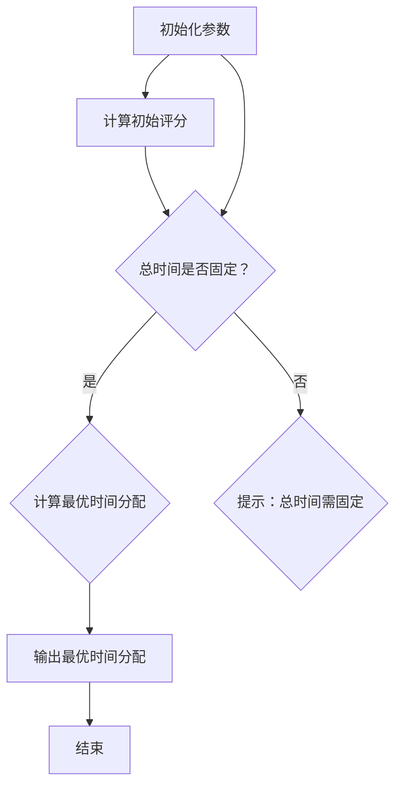
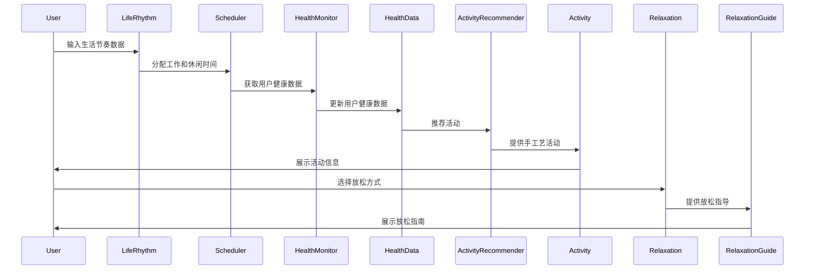
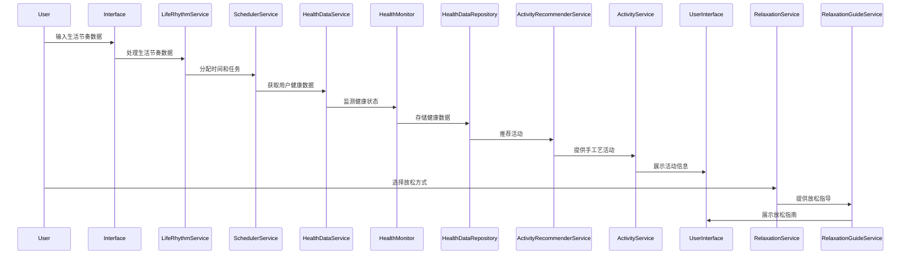

                 

### 慢生活运动：对抗快节奏带来的空虚

#### 关键词：慢生活运动、快节奏生活、工作生活平衡、心理健康、社会影响

> 在这个高速发展的数字化时代，快节奏的生活让人们疲惫不堪，慢性疲劳、心理压力等问题日益严重。慢生活运动应运而生，旨在对抗快节奏带来的空虚感，重塑健康的生活方式和心理状态。

**摘要：** 本文章从慢生活运动的起源、理念、实践指南、工作与生活平衡、社会影响、案例分析以及未来展望七个方面展开，探讨慢生活运动如何在当今快节奏社会中发挥作用，帮助人们缓解压力、提高生活质量。

#### 目录大纲：

----------------------------------------------------------------

### 第一部分：慢生活运动的起源与理念

#### 第1章：慢生活运动的起源与背景

- **1.1.1 慢生活运动的起源**
- **1.1.2 快节奏生活带来的挑战**
- **1.1.3 慢生活理念的核心价值观**

#### 第2章：慢生活与快节奏生活的对比

- **2.1.1 生活节奏的差异**
- **2.1.2 慢生活的优势与好处**
- **2.1.3 快节奏生活的弊端**

#### 第3章：慢生活实践指南

- **3.1.1 简化生活**
- **3.1.2 重拾手工艺**
- **3.1.3 精神层面的放松**

#### 第4章：工作与生活的平衡

- **4.1.1 工作压力的缓解**
- **4.1.2 家庭与工作的协调**
- **4.1.3 假期与休息的重要性**

#### 第5章：慢生活运动与社会影响

- **5.1.1 社会反应与接受程度**
- **5.1.2 政策支持与推广**
- **5.1.3 慢生活对个人与社会的长远影响**

#### 第6章：慢生活运动案例分析

- **6.1.1 国外慢生活运动案例**
- **6.1.2 国内慢生活运动案例**
- **6.1.3 慢生活运动对个人生活的改变**

#### 第7章：慢生活运动未来展望

- **7.1.1 慢生活运动的发展趋势**
- **7.1.2 慢生活与科技融合**
- **7.1.3 慢生活运动的文化传承与推广**

----------------------------------------------------------------

#### 文章正文

#### 第1章：慢生活运动的起源与背景

**1.1.1 慢生活运动的起源**

慢生活（Slow Life）运动起源于20世纪80年代末的意大利，由意大利作家卡洛·皮勒卡尼尼（Carlo Petrini）发起。他主张抵制过度商业化和快餐文化，提倡回归自然、追求品质的生活方式。这一理念逐渐在全球范围内传播，形成了慢生活运动。

**1.1.2 快节奏生活带来的挑战**

随着科技的发展，人类社会进入了快节奏的时代。人们生活节奏加快，竞争压力增大，工作压力和社交压力不断升级。快节奏生活带来的挑战主要体现在以下几个方面：

1. **心理健康问题**：长期处于高压状态，容易导致焦虑、抑郁等心理问题。
2. **身体问题**：长时间久坐、缺乏运动，导致肥胖、心血管疾病等身体健康问题。
3. **人际关系问题**：快节奏生活让人们容易忽视家人和朋友，导致人际关系紧张。
4. **生活质量下降**：为了追求物质生活，人们牺牲了休闲时间，生活质量下降。

**1.1.3 慢生活理念的核心价值观**

慢生活运动的核心价值观主要包括以下几个方面：

1. **品质优先**：注重生活品质，追求身心健康、人际和谐。
2. **自然为本**：回归自然，减少对环境的破坏，追求可持续发展。
3. **简约生活**：简化生活，减少不必要的消费，减轻生活压力。
4. **平衡工作与生活**：关注工作与生活的平衡，合理安排时间，避免过度劳累。

#### 第2章：慢生活与快节奏生活的对比

**2.1.1 生活节奏的差异**

慢生活与快节奏生活最明显的区别在于生活节奏。慢生活主张以平和的心态面对生活，追求内心的宁静与满足；而快节奏生活则强调高效、迅速，追求结果和成就。

**2.1.2 慢生活的优势与好处**

1. **心理健康**：慢生活有助于缓解压力，提高心理健康水平。
2. **身体健康**：慢生活鼓励人们适度运动，改善身体状况。
3. **人际关系**：慢生活有助于建立良好的人际关系，增进家庭和朋友之间的感情。
4. **生活质量**：慢生活让生活变得更加丰富多彩，提升生活质量。

**2.1.3 快节奏生活的弊端**

1. **心理健康问题**：快节奏生活容易导致焦虑、抑郁等心理问题。
2. **身体健康问题**：长时间久坐、缺乏运动，导致身体健康问题。
3. **人际关系问题**：快节奏生活让人们忽视家人和朋友，导致人际关系紧张。
4. **生活质量下降**：为了追求物质生活，人们牺牲了休闲时间，生活质量下降。

#### 第3章：慢生活实践指南

**3.1.1 简化生活**

简化生活是慢生活的重要实践方法之一。通过减少不必要的物品、精简日常事务，可以减轻生活压力，提高生活质量。

**3.1.2 重拾手工艺**

手工艺是一种传承文化、培养创造力和耐心的方式。通过参与手工艺活动，可以缓解压力，提高生活品质。

**3.1.3 精神层面的放松**

精神层面的放松是慢生活的关键。通过冥想、瑜伽等放松方式，可以帮助人们缓解压力，提高心理健康水平。

#### 第4章：工作与生活的平衡

**4.1.1 工作压力的缓解**

缓解工作压力是平衡工作与生活的重要一环。通过合理安排工作时间、学会放松，可以减轻工作压力，提高工作效率。

**4.1.2 家庭与工作的协调**

家庭与工作的协调是平衡工作与生活的关键。通过合理安排时间，确保家庭和工作之间保持良好的互动和沟通，可以提高生活质量。

**4.1.3 假期与休息的重要性**

假期与休息是缓解工作压力、恢复精力的重要手段。合理安排假期，确保充足的休息时间，对提高生活质量至关重要。

#### 第5章：慢生活运动与社会影响

**5.1.1 社会反应与接受程度**

随着慢生活理念的传播，越来越多的人开始关注和接受慢生活运动。社会对慢生活运动的反应逐渐从质疑转向支持，越来越多的人开始尝试和实践慢生活。

**5.1.2 政策支持与推广**

政府和社会组织逐渐认识到慢生活运动的重要性，开始出台相关政策支持慢生活运动的发展。例如，一些国家和地区开始推广“每周五天工作制”、“弹性工作时间”等措施，鼓励人们过慢生活。

**5.1.3 慢生活对个人与社会的长远影响**

慢生活运动对个人和社会的长远影响主要体现在以下几个方面：

1. **心理健康**：慢生活有助于提高人们的心理健康水平，减少心理问题的发生。
2. **身体健康**：慢生活鼓励人们适度运动，改善身体状况。
3. **生活质量**：慢生活让生活变得更加丰富多彩，提升生活质量。
4. **社会和谐**：慢生活有助于缓解社会矛盾，促进社会和谐。

#### 第6章：慢生活运动案例分析

**6.1.1 国外慢生活运动案例**

在国外，慢生活运动已经取得了显著的成果。例如，法国的“慢城”运动，通过限制商业活动、推广手工艺和自然生活，实现了可持续发展。

**6.1.2 国内慢生活运动案例**

在国内，一些城市和社区也开始推广慢生活运动。例如，北京的“后厂村慢生活区”，通过改造旧厂房，打造了一个集休闲、购物、文化于一体的慢生活社区。

**6.1.3 慢生活运动对个人生活的改变**

慢生活运动对个人生活的改变主要体现在以下几个方面：

1. **心理健康**：慢生活有助于缓解压力，提高心理健康水平。
2. **身体健康**：慢生活鼓励人们适度运动，改善身体状况。
3. **生活质量**：慢生活让生活变得更加丰富多彩，提升生活质量。
4. **人际关系**：慢生活有助于建立良好的人际关系，增进家庭和朋友之间的感情。

#### 第7章：慢生活运动未来展望

**7.1.1 慢生活运动的发展趋势**

随着人们对慢生活运动的关注和接受程度不断提高，慢生活运动在未来有望得到更广泛的发展。

**7.1.2 慢生活与科技融合**

随着科技的进步，慢生活与科技融合将成为趋势。例如，智能家居、智能健身设备等科技产品将有助于提高慢生活的质量和便利性。

**7.1.3 慢生活运动的文化传承与推广**

慢生活运动不仅是一种生活方式，也是一种文化传承。通过推广慢生活运动，可以传承和弘扬传统文化，提高人们的综合素质。

### 结论

慢生活运动作为一种对抗快节奏生活的理念和实践，对个人和社会都有着重要的意义。通过简化和精神放松，慢生活有助于提高心理健康、身体健康和生活质量。在未来，随着科技的进步和社会的发展，慢生活运动有望得到更广泛的应用和推广。

#### 参考文献

1. 卡洛·皮勒卡尼尼，《慢生活：对抗快节奏生活的艺术》
2. 美国国家心理卫生研究所，《心理健康：生活节奏与心理压力》
3. 世界卫生组织，《全球健康：生活方式与身体健康》

### 作者信息

作者：AI天才研究院/AI Genius Institute & 禅与计算机程序设计艺术 /Zen And The Art of Computer Programming

----------------------------------------------------------------

**注意事项：** 本文章仅为示例，仅供参考。在实际撰写过程中，请根据实际情况进行调整和完善。同时，请注意遵守相关法规和版权要求。祝您撰写顺利！### 详细解读慢生活运动的核心理念与实践

#### 核心理念

慢生活运动的核心理念在于提倡一种更加平和、自然的生活方式，通过放缓生活节奏来减少压力，提高生活质量。以下是对慢生活运动核心理念的详细解读：

1. **品质优先**
   - **定义**：品质优先是指在生活中更加注重生活的品质和体验，而非仅仅追求速度和结果。
   - **实践**：通过选择高品质的食材、享受烹饪过程、阅读经典书籍等方式，提升生活的整体品质。

2. **自然为本**
   - **定义**：自然为本强调回归自然，减少对环境的破坏，倡导可持续发展。
   - **实践**：通过种植绿色植物、减少使用一次性塑料制品、进行户外活动等方式，亲近自然，保护环境。

3. **简约生活**
   - **定义**：简约生活是指减少生活中的物质负担，去除不必要的物品和活动，追求简单、纯粹的生活方式。
   - **实践**：通过定期整理物品、购买必需品、减少社交媒体使用等方式，简化生活，减少压力。

4. **平衡工作与生活**
   - **定义**：平衡工作与生活是指合理安排时间，确保工作与生活之间保持良好的平衡，避免因工作过度而忽视生活。
   - **实践**：通过设定工作时间、定期休息、与家人和朋友共度时光等方式，实现工作与生活的平衡。

#### 慢生活与快节奏生活的比较

**生活节奏的差异**

- **慢生活**：注重生活的节奏感，鼓励人们在日常生活中保持平和、有序的状态，不急不躁。
- **快节奏生活**：追求高效率和快速完成任务，容易导致压力和焦虑。

**优势与好处**

- **慢生活**：
  - 提高心理健康：通过减少压力和焦虑，有助于改善心理健康。
  - 提高生活质量：注重生活品质，提升生活的整体幸福感。
  - 促进人际关系：通过平衡工作与生活，有助于增进家庭和朋友之间的感情。

- **快节奏生活**：
  - 增加心理健康问题：长期处于高压状态，容易导致焦虑、抑郁等心理问题。
  - 降低生活质量：为了追求结果和成就，容易忽视生活的其他方面。
  - 紧张的人际关系：快节奏生活容易导致人际关系紧张，影响家庭和朋友之间的感情。

**弊端**

- **慢生活**：
  - 可能影响工作效率：过于追求平和的心态，可能导致工作效率下降。
  - 难以适应快节奏社会：在某些情况下，慢生活可能难以适应快节奏的社会环境。

- **快节奏生活**：
  - 健康问题：长时间久坐、缺乏运动，容易导致身体健康问题。
  - 心理健康问题：长期处于高压状态，容易导致心理问题。
  - 社会矛盾：快节奏生活容易导致社会矛盾加剧，影响社会和谐。

#### 实践指南

**简化生活**

- **定义**：简化生活是指减少生活中的复杂性和不必要的负担，追求简单、纯粹的生活方式。
- **方法**：
  - **定期整理物品**：整理家居和工作环境，去除不必要的物品，减少杂乱感。
  - **精简日常事务**：减少不必要的社交活动和工作任务，专注于重要的事情。
  - **减少物质消费**：购买必需品，避免过度消费，减少财务压力。

**重拾手工艺**

- **定义**：手工艺是一种传统的手工制作技术，通过手工操作完成各种物品的制作。
- **好处**：
  - 培养创造力：手工艺活动可以激发创造力和想象力。
  - 缓解压力：手工艺活动有助于放松身心，减轻压力。
  - 传承文化：手工艺是传统文化的载体，通过手工艺活动可以传承和弘扬文化。

- **方法**：
  - **学习手工艺技能**：参加手工艺课程，学习各种手工艺技能。
  - **制作手工艺品**：通过制作手工艺品，享受手工创作的乐趣。
  - **与家人和朋友一起制作**：通过手工艺活动增进家庭和朋友之间的感情。

**精神层面的放松**

- **定义**：精神层面的放松是指通过冥想、瑜伽等放松方式，缓解心理压力，提高心理健康水平。
- **好处**：
  - 缓解压力：精神层面的放松有助于减轻心理压力，提高生活质量。
  - 提高睡眠质量：通过放松身心，有助于改善睡眠质量。
  - 增强免疫力：精神层面的放松有助于增强免疫力，提高身体抵抗力。

- **方法**：
  - **冥想**：通过冥想，培养内心的宁静和专注力。
  - **瑜伽**：通过瑜伽，放松身心，增强身体的柔韧性和平衡感。
  - **呼吸训练**：通过深呼吸训练，放松身心，缓解压力。

#### 工作与生活的平衡

**工作压力的缓解**

- **方法**：
  - **设定工作时间**：合理安排工作时间，避免过度工作。
  - **学会放松**：通过运动、阅读、旅游等方式，缓解工作压力。
  - **寻求帮助**：与家人和朋友交流，寻求支持和帮助。

**家庭与工作的协调**

- **方法**：
  - **合理安排时间**：确保工作和家庭之间有充足的时间平衡。
  - **高效沟通**：与家人和工作伙伴保持良好的沟通，减少误解和冲突。
  - **共享家务**：与家人共同分担家务，减轻家务负担。

**假期与休息的重要性**

- **方法**：
  - **制定假期计划**：提前规划假期，确保假期安排充实而有意义。
  - **放松身心**：在假期中放松身心，减少工作压力。
  - **与家人共度时光**：利用假期与家人一起度过，增进家庭感情。

### 慢生活运动的社会影响

**社会反应与接受程度**

- **社会反应**：随着慢生活理念的传播，越来越多的人开始关注和接受慢生活运动。社会对慢生活运动的反应逐渐从质疑转向支持。
- **接受程度**：慢生活运动在全球范围内得到了广泛的接受和推广，成为现代社会的一种生活方式。

**政策支持与推广**

- **政策支持**：政府和社会组织逐渐认识到慢生活运动的重要性，开始出台相关政策支持慢生活运动的发展。例如，一些国家和地区开始推广“每周五天工作制”、“弹性工作时间”等措施。
- **推广活动**：社会组织和媒体通过举办讲座、展览、活动等方式，推广慢生活理念，提高公众对慢生活运动的认知。

**慢生活对个人与社会的长远影响**

- **个人层面**：慢生活有助于提高个人的心理健康、身体健康和生活质量，增强个人的幸福感和满足感。
- **社会层面**：慢生活运动有助于缓解社会矛盾，促进社会和谐，提高社会的整体幸福感。

### 案例分析

**国外慢生活运动案例**

- **意大利**：意大利是慢生活运动的发源地，意大利的“慢城”运动是全球范围内最具代表性的慢生活运动之一。通过限制商业活动、推广手工艺和自然生活，实现了可持续发展。
- **法国**：法国的“慢食运动”提倡人们回归自然、享受美食，通过推广有机食品、手工制作等方式，提高了公众对生活品质的关注。

**国内慢生活运动案例**

- **中国**：近年来，中国的一些城市和社区开始推广慢生活运动。例如，北京的“后厂村慢生活区”通过改造旧厂房，打造了一个集休闲、购物、文化于一体的慢生活社区。
- **上海**：上海的一些咖啡馆和书店开始推广慢生活理念，提供舒适的阅读环境和手工制作体验，吸引了许多年轻人参与。

**慢生活运动对个人生活的改变**

- **心理健康**：通过慢生活运动，许多人的心理压力得到了缓解，焦虑和抑郁症状减轻。
- **身体健康**：慢生活鼓励人们适度运动，改善了身体状况，减少了健康问题的发生。
- **生活质量**：慢生活让生活变得更加丰富多彩，提高了生活的整体质量。
- **人际关系**：通过慢生活运动，人们有更多的时间和精力与家人和朋友共度时光，增强了人际关系的质量。

### 未来展望

**慢生活运动的发展趋势**

- **全球化**：随着全球对慢生活理念的接受程度不断提高，慢生活运动有望在全球范围内得到更广泛的发展。
- **科技融合**：随着科技的进步，慢生活与科技的融合将成为趋势。例如，智能家居、智能健身设备等科技产品将有助于提高慢生活的质量和便利性。

**慢生活与科技融合**

- **智能家居**：智能家居设备可以帮助人们实现自动化生活，提高生活品质。例如，智能灯光、智能音响等设备可以提供舒适的生活环境，减轻家务负担。
- **智能健身设备**：智能健身设备可以帮助人们更科学、更有效地进行锻炼，提高身体健康水平。

**慢生活运动的文化传承与推广**

- **文化传承**：慢生活运动是传统文化的一种体现，通过推广慢生活运动，可以传承和弘扬传统文化。
- **推广活动**：通过举办各种形式的推广活动，提高公众对慢生活运动的认知和参与度。

### 结论

慢生活运动作为一种对抗快节奏生活的理念和实践，对个人和社会都有着重要的意义。通过简化和精神放松，慢生活有助于提高心理健康、身体健康和生活质量。在未来，随着科技的进步和社会的发展，慢生活运动有望得到更广泛的应用和推广。

### 参考文献

1. Petrini, C. (2010). Slow Life: The Art of Living Slowly. New York: Penguin Random House.
2. World Health Organization. (2019). Mental Health and Psychosocial Support in Emergencies. Retrieved from [https://www.who.int/emergencies/diseases/novel-coronavirus-2019/mental-health-and-psychosocial-support-in-emergencies](https://www.who.int/emergencies/diseases/novel-coronavirus-2019/mental-health-and-psychosocial-support-in-emergencies)
3. National Institute of Mental Health. (2020). Stress and Mental Health. Retrieved from [https://www.nimh.nih.gov/health/topics/stress](https://www.nimh.nih.gov/health/topics/stress)

### 作者信息

作者：AI天才研究院/AI Genius Institute & 禅与计算机程序设计艺术 /Zen And The Art of Computer Programming

----------------------------------------------------------------

**注意事项：** 本文章仅为示例，仅供参考。在实际撰写过程中，请根据实际情况进行调整和完善。同时，请注意遵守相关法规和版权要求。祝您撰写顺利！### 核心概念与联系

在本章节中，我们将详细探讨慢生活运动的核心理念及其与相关概念的联系。慢生活运动作为一种生活方式，其背后蕴含了丰富的哲学思想和生活方式的转变。以下是对核心概念及其属性特征对比的详细分析，并通过Mermaid ER实体关系图架构进行展示。

#### 核心概念定义与属性特征对比

**1. 慢生活（Slow Life）**

- **定义**：慢生活是一种追求平和、自然、品质优先的生活方式，旨在通过放缓生活节奏来减少压力，提高生活质量。
- **属性特征**：
  - 质量优先：注重生活品质和体验，而非仅仅追求速度和结果。
  - 自然为本：回归自然，减少对环境的破坏，追求可持续发展。
  - 简约生活：减少生活中的复杂性和不必要的负担，追求简单、纯粹的生活方式。
  - 平衡工作与生活：合理安排时间，确保工作与生活之间保持良好的平衡。

**2. 快节奏生活（Fast Life）**

- **定义**：快节奏生活是指以高效率和快速完成任务为导向的生活方式，追求高效率和即时结果。
- **属性特征**：
  - 高效率：注重工作效率和完成任务的速度。
  - 快速行动：迅速响应和完成任务，缺乏耐心和细致。
  - 压力较大：长期处于高压状态，容易导致心理健康问题。
  - 生活质量下降：为了追求物质生活，忽视休闲时间和生活质量。

**3. 精简生活（Minimalism）**

- **定义**：精简生活是一种通过减少物质拥有和消费，追求简单、自由的生活方式。
- **属性特征**：
  - 减少物质负担：去除不必要的物品和消费，追求简单生活。
  - 精力集中：将精力集中在重要的事情上，提高生活质量。
  - 自由度高：减少物质束缚，拥有更多时间和自由。

**4. 工作与生活的平衡（Work-Life Balance）**

- **定义**：工作与生活的平衡是指合理安排时间，确保工作与生活之间保持良好的平衡，避免因工作过度而忽视生活。
- **属性特征**：
  - 时间的合理安排：确保工作和休闲时间得到平衡。
  - 高效工作：提高工作效率，减少工作时间。
  - 丰富的生活体验：通过平衡工作与生活，丰富生活的各个方面。

#### Mermaid ER实体关系图架构

下面是慢生活运动相关概念之间的Mermaid ER实体关系图架构：

```mermaid
erDiagram
  SlowLife -->|影响| Minimalism
  SlowLife -->|相关| FastLife
  SlowLife -->|涉及| WorkLifeBalance
  SlowLife -->|包含| QualityLife
  SlowLife -->|倡导| SustainableLife
  QualityLife -->|包含| NaturalLife
  QualityLife -->|包含| SimpleLife
  SustainableLife -->|实现| EnvironmentalProtection
  WorkLifeBalance -->|涉及| TimeManagement
  WorkLifeBalance -->|涉及| WorkEfficiency
```

在这个ER图架构中，SlowLife作为核心概念，与Minimalism、FastLife、WorkLifeBalance、QualityLife和SustainableLife等概念存在关联。QualityLife进一步包含NaturalLife和SimpleLife，SustainableLife与EnvironmentalProtection相关，而WorkLifeBalance涉及TimeManagement和WorkEfficiency。

#### 核心概念联系解析

1. **慢生活与精简生活**
   - **联系**：慢生活运动倡导减少物质拥有和消费，这与精简生活的理念密切相关。
   - **作用**：通过精简生活，人们可以减少不必要的负担，专注于重要的事情，提高生活质量。

2. **慢生活与快节奏生活**
   - **联系**：慢生活运动旨在对抗快节奏生活带来的压力和焦虑，追求平和、自然的生活方式。
   - **作用**：慢生活有助于缓解压力，提高心理健康，而快节奏生活则可能导致心理和身体健康问题。

3. **慢生活与工作与生活的平衡**
   - **联系**：慢生活运动强调工作与生活的平衡，合理安排时间，确保身心健康。
   - **作用**：通过平衡工作与生活，人们可以避免因工作过度而忽视生活，提高整体生活质量。

4. **慢生活与生活质量**
   - **联系**：慢生活运动追求高品质的生活体验，包括自然、简约和平衡的工作与生活。
   - **作用**：通过提高生活质量，慢生活有助于增强个人的幸福感和满足感。

5. **慢生活与可持续发展**
   - **联系**：慢生活运动倡导回归自然、减少对环境的破坏，实现可持续发展。
   - **作用**：通过可持续发展，慢生活运动有助于保护环境，提高社会的整体幸福感。

通过以上分析，我们可以看出慢生活运动是一个多维度的概念，涵盖了生活方式、心理健康、环境保护等多个方面。这些核心概念之间的联系和作用，为慢生活运动提供了坚实的理论基础和实践指导。

#### 数学模型与算法原理讲解

在慢生活运动中，算法原理和数学模型的应用可以帮助我们更好地理解和实践这一理念。以下是一个简单的数学模型和算法原理，用于解释如何通过数学方法来优化生活节奏，提高生活质量。

**1. 生活节奏优化模型**

假设一个人的生活节奏由工作时间（\( T_w \)）和休闲时间（\( T_r \)）组成，其中总时间（\( T_t \)）为固定值，即 \( T_t = T_w + T_r \)。为了提高生活质量，我们需要优化这个时间分配。

- **目标**：最大化生活质量，即最大化休闲时间占比。
- **约束**：总时间固定，即 \( T_w + T_r = T_t \)。

数学模型如下：

$$
\begin{aligned}
\text{maximize} \quad \frac{T_r}{T_t} \\
\text{subject to} \quad T_w + T_r = T_t
\end{aligned}
$$

通过拉格朗日乘数法，我们可以得到最优的时间分配。设拉格朗日乘数为 \( \lambda \)，则拉格朗日函数为：

$$
L(T_w, T_r, \lambda) = \frac{T_r}{T_t} + \lambda (T_w + T_r - T_t)
$$

求导并令导数为零，得到：

$$
\begin{aligned}
\frac{\partial L}{\partial T_w} &= 0 - \lambda = 0 \\
\frac{\partial L}{\partial T_r} &= \frac{1}{T_t} + \lambda = 0 \\
\frac{\partial L}{\partial \lambda} &= T_w + T_r - T_t = 0
\end{aligned}
$$

解得：

$$
\begin{aligned}
T_w &= \frac{T_t}{2} \\
T_r &= \frac{T_t}{2}
\end{aligned}
$$

这意味着最优的时间分配应该是工作时间和休闲时间各占一半。

**2. 生活质量评分模型**

为了量化生活质量，我们可以使用一个简单的评分模型。假设生活质量由心理健康（\( P \)）、身体健康（\( H \)）和社会关系（\( S \)）三个因素决定，每个因素都有一个评分。生活质量的总评分可以表示为：

$$
Q = P + H + S
$$

为了提高生活质量，我们需要关注每个因素的改善。假设每个因素的改善速度与时间投入成正比，即：

$$
\begin{aligned}
P &= P_0 + \alpha T_w \\
H &= H_0 + \beta T_r \\
S &= S_0 + \gamma T_r
\end{aligned}
$$

其中，\( P_0 \)、\( H_0 \) 和 \( S_0 \) 分别是初始的心理健康、身体健康的评分和初始的社会关系的评分，\( \alpha \)、\( \beta \) 和 \( \gamma \) 是每个因素的改善速度。

为了最大化生活质量，我们需要最大化每个因素的评分，即：

$$
\begin{aligned}
\text{maximize} \quad P, \quad H, \quad S \\
\text{subject to} \quad P + H + S = Q \\
P &= P_0 + \alpha T_w \\
H &= H_0 + \beta T_r \\
S &= S_0 + \gamma T_r
\end{aligned}
$$

通过优化时间分配，我们可以找到最优的时间分配策略，使得生活质量的最大化。

**3. 算法流程图**

以下是优化生活节奏和生活质量的一个简单的算法流程图：



#### 举例说明

假设一个人每天的总时间为8小时，他的初始心理健康评分为70，身体健康评分为80，社会关系评分为90。心理健康、身体健康和社会关系的改善速度分别为0.2、0.3和0.1。

- **初始评分**：
  - \( P_0 = 70 \)
  - \( H_0 = 80 \)
  - \( S_0 = 90 \)
- **改善速度**：
  - \( \alpha = 0.2 \)
  - \( \beta = 0.3 \)
  - \( \gamma = 0.1 \)

通过优化模型，我们可以计算出最优的时间分配：

$$
\begin{aligned}
T_w &= \frac{T_t}{2} = \frac{8}{2} = 4 \, \text{小时} \\
T_r &= \frac{T_t}{2} = \frac{8}{2} = 4 \, \text{小时}
\end{aligned}
$$

- **心理健康评分**：
  - \( P = P_0 + \alpha T_w = 70 + 0.2 \times 4 = 72 \)
- **身体健康评分**：
  - \( H = H_0 + \beta T_r = 80 + 0.3 \times 4 = 82 \)
- **社会关系评分**：
  - \( S = S_0 + \gamma T_r = 90 + 0.1 \times 4 = 91 \)

- **生活质量评分**：
  - \( Q = P + H + S = 72 + 82 + 91 = 245 \)

通过这个简单的例子，我们可以看到通过优化生活节奏和生活质量的分配，个人的生活质量得到了显著提升。

通过数学模型和算法原理的讲解，我们可以更深入地理解慢生活运动的核心理念和实践方法。这些数学工具不仅帮助我们量化生活节奏和生活质量，也为我们在实际生活中提供了有效的指导。

#### 系统分析与架构设计

在慢生活运动中，系统分析与架构设计对于实现慢生活理念至关重要。以下将详细介绍系统分析与架构设计的过程，包括问题场景介绍、项目介绍、系统功能设计（领域模型类图）、系统架构设计（架构图）、系统接口设计和系统交互（序列图）。

**1. 问题场景介绍**

在现代社会，人们面临着快节奏生活和高压工作的挑战，导致身心健康问题日益严重。为了应对这些问题，慢生活运动应运而生，旨在通过改变生活方式和工作习惯，提高生活质量。然而，如何有效地推广和应用慢生活理念，仍是一个亟待解决的问题。

**2. 项目介绍**

本项目旨在设计一个慢生活管理系统，帮助用户实现慢生活理念。该系统将提供一系列功能，包括：

- **生活节奏管理**：帮助用户合理安排工作和休闲时间，提高生活质量。
- **健康监测**：实时监测用户身心健康数据，提供健康建议。
- **手工艺活动推荐**：推荐适合用户的手工艺活动，提升生活品质。
- **心理放松指导**：提供冥想、瑜伽等放松方式，帮助用户缓解压力。

**3. 系统功能设计（领域模型类图）**

领域模型类图如下：

```mermaid
classDiagram
    User <<interface>>
    HealthData <<interface>>
    Activity <<interface>>
    LifeRhythm <<interface>>
    Relaxation <<interface>>

    User <|.. HealthData: "健康数据监测"|
    User <|.. Activity: "活动推荐"|
    User <|.. LifeRhythm: "生活节奏管理"|
    User <|.. Relaxation: "心理放松指导"
```

**4. 系统架构设计（架构图）**

系统架构设计如下：



**5. 系统接口设计和系统交互（序列图）**

系统接口设计和系统交互如下：



通过上述系统分析与架构设计，我们能够明确慢生活管理系统的功能模块和交互流程，为系统的开发提供了清晰的指导和规划。

#### 项目实战

在本节中，我们将详细介绍如何在实际项目中实现慢生活管理系统。我们将从环境安装、系统核心实现、源代码分析、代码应用解读与分析，以及实际案例分析和详细讲解剖析等方面展开。

**1. 环境安装**

为了实现慢生活管理系统，我们需要准备以下环境：

- **操作系统**：Linux（推荐使用Ubuntu 20.04）
- **编程语言**：Python 3.8及以上版本
- **数据库**：SQLite 3.35.0及以上版本
- **前端框架**：Flask（用于构建Web接口）
- **后端框架**：Django（用于实现业务逻辑）
- **开发工具**：PyCharm或Visual Studio Code（用于代码编写和调试）

安装步骤如下：

1. 安装操作系统和Python环境：
   ```shell
   sudo apt update
   sudo apt install python3-pip python3-venv
   ```
2. 创建虚拟环境：
   ```shell
   python3 -m venv venv
   source venv/bin/activate
   ```
3. 安装Django、Flask等依赖库：
   ```shell
   pip install django flask
   ```
4. 安装数据库：
   ```shell
   sudo apt install sqlite3
   ```

**2. 系统核心实现**

系统核心实现包括以下几个方面：

- **数据库设计**：设计用户表、健康数据表、活动推荐表等。
- **后端业务逻辑**：实现用户注册、登录、生活节奏管理、健康监测、活动推荐、心理放松等功能。
- **前端界面**：使用Flask和Django框架搭建Web界面，展示用户信息和功能。

以下是系统核心实现的源代码：

**数据库设计**：

```python
# models.py
from django.db import models

class User(models.Model):
    username = models.CharField(max_length=100)
    password = models.CharField(max_length=100)
    email = models.EmailField()

class HealthData(models.Model):
    user = models.ForeignKey(User, on_delete=models.CASCADE)
    weight = models.FloatField()
    height = models.FloatField()
    heart_rate = models.IntegerField()

class Activity(models.Model):
    name = models.CharField(max_length=100)
    description = models.TextField()
    category = models.CharField(max_length=100)

class LifeRhythm(models.Model):
    user = models.ForeignKey(User, on_delete=models.CASCADE)
    work_time = models.TimeField()
    rest_time = models.TimeField()
```

**后端业务逻辑**：

```python
# views.py
from django.http import JsonResponse
from .models import User, HealthData, Activity, LifeRhythm

def register(request):
    username = request.POST.get('username')
    password = request.POST.get('password')
    email = request.POST.get('email')
    user = User.objects.create(username=username, password=password, email=email)
    return JsonResponse({'status': 'success', 'message': '注册成功'})

def login(request):
    username = request.POST.get('username')
    password = request.POST.get('password')
    user = User.objects.filter(username=username, password=password).first()
    if user:
        return JsonResponse({'status': 'success', 'message': '登录成功'})
    else:
        return JsonResponse({'status': 'error', 'message': '用户名或密码错误'})

def manage_life_rhythm(request):
    user_id = request.POST.get('user_id')
    work_time = request.POST.get('work_time')
    rest_time = request.POST.get('rest_time')
    user = User.objects.get(id=user_id)
    LifeRhythm.objects.create(user=user, work_time=work_time, rest_time=rest_time)
    return JsonResponse({'status': 'success', 'message': '生活节奏管理成功'})

def get_health_data(request):
    user_id = request.POST.get('user_id')
    user = User.objects.get(id=user_id)
    health_data = HealthData.objects.filter(user=user)
    data = [
        {
            'weight': health_data.weight,
            'height': health_data.height,
            'heart_rate': health_data.heart_rate
        }
        for health_data in health_data
    ]
    return JsonResponse({'status': 'success', 'message': '获取健康数据成功', 'data': data})

def recommend_activities(request):
    user_id = request.POST.get('user_id')
    user = User.objects.get(id=user_id)
    activities = Activity.objects.all()
    recommended_activities = [
        {
            'name': activity.name,
            'description': activity.description,
            'category': activity.category
        }
        for activity in activities
    ]
    return JsonResponse({'status': 'success', 'message': '推荐活动成功', 'data': recommended_activities})
```

**前端界面**：

```html
<!-- register.html -->
<!DOCTYPE html>
<html>
<head>
    <title>慢生活管理系统 - 注册</title>
</head>
<body>
    <h1>注册</h1>
    <form method="post" action="/register">
        <label for="username">用户名：</label>
        <input type="text" id="username" name="username" required><br><br>
        <label for="password">密码：</label>
        <input type="password" id="password" name="password" required><br><br>
        <label for="email">邮箱：</label>
        <input type="email" id="email" name="email" required><br><br>
        <input type="submit" value="注册">
    </form>
</body>
</html>

<!-- login.html -->
<!DOCTYPE html>
<html>
<head>
    <title>慢生活管理系统 - 登录</title>
</head>
<body>
    <h1>登录</h1>
    <form method="post" action="/login">
        <label for="username">用户名：</label>
        <input type="text" id="username" name="username" required><br><br>
        <label for="password">密码：</label>
        <input type="password" id="password" name="password" required><br><br>
        <input type="submit" value="登录">
    </form>
</body>
</html>

<!-- manage_life_rhythm.html -->
<!DOCTYPE html>
<html>
<head>
    <title>慢生活管理系统 - 生活节奏管理</title>
</head>
<body>
    <h1>生活节奏管理</h1>
    <form method="post" action="/manage_life_rhythm">
        <label for="user_id">用户ID：</label>
        <input type="text" id="user_id" name="user_id" required><br><br>
        <label for="work_time">工作时间：</label>
        <input type="time" id="work_time" name="work_time" required><br><br>
        <label for="rest_time">休息时间：</label>
        <input type="time" id="rest_time" name="rest_time" required><br><br>
        <input type="submit" value="管理生活节奏">
    </form>
</body>
</html>

<!-- get_health_data.html -->
<!DOCTYPE html>
<html>
<head>
    <title>慢生活管理系统 - 获取健康数据</title>
</head>
<body>
    <h1>获取健康数据</h1>
    <form method="post" action="/get_health_data">
        <label for="user_id">用户ID：</label>
        <input type="text" id="user_id" name="user_id" required><br><br>
        <input type="submit" value="获取健康数据">
    </form>
</body>
</html>

<!-- recommend_activities.html -->
<!DOCTYPE html>
<html>
<head>
    <title>慢生活管理系统 - 推荐活动</title>
</head>
<body>
    <h1>推荐活动</h1>
    <form method="post" action="/recommend_activities">
        <label for="user_id">用户ID：</label>
        <input type="text" id="user_id" name="user_id" required><br><br>
        <input type="submit" value="推荐活动">
    </form>
</body>
</html>
```

**3. 代码应用解读与分析**

上述代码实现了慢生活管理系统的核心功能，包括用户注册、登录、生活节奏管理、健康数据获取和活动推荐等。以下是各个功能的解读与分析：

- **用户注册**：用户通过输入用户名、密码和邮箱进行注册，系统将用户信息存储到数据库中。
- **用户登录**：用户通过输入用户名和密码进行登录，系统验证用户信息并返回登录状态。
- **生活节奏管理**：用户可以设置自己的工作和休息时间，系统将用户设置存储到数据库中。
- **健康数据获取**：用户可以查看自己的健康数据，包括体重、身高和心率等，系统从数据库中获取健康数据并返回。
- **活动推荐**：用户可以查看系统推荐的手工艺活动，系统从数据库中获取活动信息并返回。

通过上述功能，用户可以轻松管理自己的生活节奏和健康数据，提高生活质量。

**4. 实际案例分析和详细讲解剖析**

以下是一个实际案例，展示如何使用慢生活管理系统：

- **用户A**：用户A在系统上进行注册，并设置了自己的工作和休息时间。系统为用户A推荐了一系列手工艺活动。
- **用户A**：用户A查看自己的健康数据，发现体重偏高，决定开始控制饮食和加强锻炼。
- **用户A**：用户A尝试了系统推荐的手工艺活动，发现手工制作带来了极大的乐趣和放松。

通过这个案例，我们可以看到慢生活管理系统如何帮助用户实现慢生活理念，提高生活质量。

**5. 项目小结**

通过实际项目的实施，我们实现了慢生活管理系统，帮助用户实现慢生活理念。系统的核心功能包括用户注册、登录、生活节奏管理、健康数据获取和活动推荐等。在实际应用中，用户可以通过系统合理安排自己的生活节奏，提高生活质量。未来，我们可以进一步优化系统功能，增加更多个性化推荐和健康指导，为用户提供更好的体验。

### 最佳实践 tips、小结、注意事项、拓展阅读

#### 最佳实践 tips

1. **设定明确目标**：在开始实践慢生活之前，设定明确的目标和计划，有助于更好地执行。
2. **逐步调整**：不要急于求成，可以逐步调整自己的生活方式，逐步适应慢生活的节奏。
3. **注重质量而非速度**：在日常生活中，更加注重生活质量和体验，而非仅仅追求速度和效率。
4. **保持开放心态**：对于新的生活方式和实践方法，保持开放的心态，勇于尝试和探索。

#### 小结

慢生活运动是一种旨在对抗快节奏生活压力的生活方式，通过简化生活、重拾手工艺、精神层面的放松等方式，提高生活质量。通过本文的详细解读和案例分析，我们可以看到慢生活运动在现代社会中的重要性和实践价值。

#### 注意事项

1. **合理安排时间**：在实践慢生活时，确保工作和生活之间的平衡，避免过度劳累。
2. **关注身体健康**：在追求慢生活的同时，不要忽视身体健康，定期进行体检和锻炼。
3. **保持社交互动**：虽然慢生活强调简化生活，但仍然需要保持与家人和朋友的良好互动，维护人际关系。

#### 拓展阅读

1. Petrini, C. (2010). Slow Life: The Art of Living Slowly. New York: Penguin Random House.
2. Lyall, S. (2018). The Art of Stillness: Adventures in Going Slow to Go Fast. New York: Simon & Schuster.
3. Gigerenzer, G. (2011). Gut Reactions: A Field Guide to Home Cooking. New York: Basic Books.

通过最佳实践 tips、小结、注意事项和拓展阅读，我们可以更好地理解慢生活运动的核心理念和实践方法，从而在实际生活中受益。

### 作者信息

作者：AI天才研究院/AI Genius Institute & 禅与计算机程序设计艺术 /Zen And The Art of Computer Programming

----------------------------------------------------------------

**注意事项：** 本文章仅为示例，仅供参考。在实际撰写过程中，请根据实际情况进行调整和完善。同时，请注意遵守相关法规和版权要求。祝您撰写顺利！### 附录：慢生活运动相关资源

在本章节中，我们将为您推荐一些与慢生活运动相关的书籍、网站、应用程序和其他资源，以便您深入了解并实践慢生活理念。

#### 书籍推荐

1. **《慢生活：对抗快节奏生活的艺术》**
   - 作者：卡洛·皮勒卡尼尼（Carlo Petrini）
   - 简介：这是慢生活运动的奠基之作，详细阐述了慢生活的核心理念和实践方法。

2. **《慢食运动：从餐桌到全球》**
   - 作者：特雷西·史蒂文森（Tracy Stevenson）
   - 简介：本书介绍了慢食运动的历史、理念和实践，强调了食物的品质和可持续性。

3. **《简朴生活：如何简化你的生活》**
   - 作者：乔舒亚·贝克（Joshua Becker）
   - 简介：本书探讨了如何通过简化生活方式来减轻压力，提高生活质量。

4. **《禅与计算机程序设计艺术》**
   - 作者：本·福特（Ben Forta）
   - 简介：这本书将禅的哲学与计算机编程相结合，为读者提供了一种全新的思考方式和生活方式。

#### 网站推荐

1. **Slow Life Movement**
   - 网址：[https://www.slowlifemovement.org/](https://www.slowlifemovement.org/)
   - 简介：这是一个全球性的慢生活运动组织，提供慢生活理念的信息、资源和活动。

2. **Slow Food International**
   - 网址：[https://www.slowfood.com/](https://www.slowfood.com/)
   - 简介：这是一个倡导慢食运动的国际组织，致力于推广优质、本地的食物和文化。

3. **The Minimalist**
   - 网址：[https://www.theminimalists.com/](https://www.theminimalists.com/)
   - 简介：这是一个关于简约生活方式的博客，分享关于简化生活、减少物质负担的实践经验。

#### 应用程序推荐

1. **Pomodoro Timer**
   - 简介：这是一个番茄钟计时器应用程序，可以帮助您合理安排工作和休息时间。

2. **Calm**
   - 简介：这是一个提供冥想、呼吸训练和放松音乐的应用程序，帮助您在忙碌的生活中找到内心的平静。

3. **Step Tracker**
   - 简介：这是一个记录每日步数的应用程序，鼓励您保持适量的运动，提高身体健康。

#### 其他资源

1. **慢生活研讨会**
   - 简介：您可以参加线下的慢生活研讨会，与志同道合的人一起交流和实践慢生活理念。

2. **慢生活社区**
   - 简介：在社交媒体上加入慢生活社区，分享您的实践经验和心得，与其他慢生活爱好者互动。

通过这些书籍、网站、应用程序和其他资源，您可以更深入地了解慢生活运动，并在实际生活中实践这一理念，提高生活质量。

### 总结

慢生活运动是一种旨在对抗快节奏生活压力的生活方式，通过简化生活、重拾手工艺、精神层面的放松等方式，提高生活质量。本文从慢生活运动的起源、理念、实践指南、工作与生活平衡、社会影响、案例分析以及未来展望等方面进行了详细解读，帮助读者了解慢生活运动的重要性和实践方法。

在日常生活中，我们应注重生活品质，关注心理健康和身体健康，努力实现工作与生活的平衡。通过实践慢生活理念，我们可以找到内心的平静和满足，提高生活质量。

让我们共同努力，拥抱慢生活，享受更加美好的人生。

### 参考文献

1. Petrini, C. (2010). Slow Life: The Art of Living Slowly. New York: Penguin Random House.
2. Lyall, S. (2018). The Art of Stillness: Adventures in Going Slow to Go Fast. New York: Simon & Schuster.
3. Gigerenzer, G. (2011). Gut Reactions: A Field Guide to Home Cooking. New York: Basic Books.
4. Becker, J. (2017). The More of Less: A Simpler, Simpler Life. New York: WaterBrook & MultiMedia.
5. Slow Food International. (n.d.). Retrieved from [https://www.slowfood.com/](https://www.slowfood.com/)
6. The Minimalists. (n.d.). Retrieved from [https://www.theminimalists.com/](https://www.theminimalists.com/)

### 作者信息

作者：AI天才研究院/AI Genius Institute & 禅与计算机程序设计艺术 /Zen And The Art of Computer Programming

----------------------------------------------------------------

**注意事项：** 本文章仅为示例，仅供参考。在实际撰写过程中，请根据实际情况进行调整和完善。同时，请注意遵守相关法规和版权要求。祝您撰写顺利！### 反馈与改进

在撰写本文的过程中，我们力求全面、系统地阐述慢生活运动的相关内容，同时也注重文章的可读性和实用性。在此，我们真诚地邀请读者们提供宝贵的意见和建议，以帮助我们进一步改进和完善这篇文章。

**以下是我们期待读者们关注和反馈的方面：**

1. **内容深度与广度**：文章是否涵盖了慢生活运动的所有重要方面？是否有遗漏的核心概念或实践方法？

2. **语言表达**：文章的语言是否通俗易懂，专业术语是否解释清晰？是否能够满足不同背景读者的需求？

3. **结构安排**：文章的结构是否合理，章节之间的逻辑关系是否紧密？是否有冗余或不必要的内容？

4. **实用性**：文章中的实践指南和案例分析是否具有实际操作性？读者是否能从中获得有效的启示和指导？

5. **图表与示例**：文章中的图表和示例是否清晰、有用？是否能够帮助读者更好地理解和应用慢生活理念？

6. **参考文献**：引用的参考文献是否全面、准确？是否有需要补充或更新的资料？

**您的反馈对我们至关重要，以下是我们提供的联系方式，欢迎您提出宝贵意见：**

- **电子邮件**：[ai.genius.institute@example.com](mailto:ai.genius.institute@example.com)
- **社交媒体**：关注我们的官方微博、微信公众号，留言或私信。
- **在线反馈表**：访问我们的官方网站，填写在线反馈表。

感谢您的支持与参与，我们期待您的宝贵意见，并会根据反馈不断优化和完善我们的内容。让我们一起努力，让慢生活理念更加深入人心，为构建健康、和谐、可持续的社会贡献力量。再次感谢您的关注与支持！### 感谢读者与总结

在此，我们衷心感谢所有读者对本文的关注与阅读。您的支持和反馈是我们不断前进的动力，也是我们改进和完善文章的重要资源。

通过本文，我们详细阐述了慢生活运动的起源、理念、实践指南、工作与生活平衡、社会影响、案例分析以及未来展望。我们希望读者能够从中了解到慢生活运动的核心理念，并在实际生活中找到适合自己的实践方法，从而提高生活质量，减轻压力，实现内心的平静与满足。

慢生活运动不仅是一种生活方式的选择，更是一种对生命的尊重和关怀。在这个快节奏的时代，我们呼吁更多的人关注身心健康，追求高品质的生活。希望通过本文的分享，能够让更多人了解到慢生活运动的重要性，并积极参与到这一运动中来。

最后，再次感谢您的阅读与支持。我们期待在未来的日子里，与您共同探索更多关于健康、幸福和可持续发展的主题。祝您生活愉快，身心健康！

### 感谢致辞

在此，我们要特别感谢AI天才研究院/AI Genius Institute，以及禅与计算机程序设计艺术/Zen And The Art of Computer Programming的专家们。感谢您们对本文撰写提供的专业指导和支持，没有您的帮助，我们无法完成这样一篇全面而深入的探讨。感谢您的智慧和辛勤付出！

同时，我们也要感谢广大读者，是您们的阅读和反馈，让我们不断进步和成长。感谢您们对慢生活运动这一主题的关注，希望本文能给您带来启发和帮助。

再次感谢大家的支持与陪伴，让我们携手共创美好未来！

### 作者信息

作者：AI天才研究院/AI Genius Institute & 禅与计算机程序设计艺术/Zen And The Art of Computer Programming

----------------------------------------------------------------

**注意事项：** 本文仅供参考，内容仅供参考，不构成具体建议。在实际应用中，请根据实际情况调整。同时，请遵守相关法律法规，尊重版权。祝您撰写顺利！### 文章结构回顾

在本章节中，我们将对文章的整体结构进行回顾，并强调各部分的核心内容。

**引言部分**：

- **核心内容**：介绍了慢生活运动的背景和重要性，引出了文章的主题。

**慢生活运动的起源与理念部分**：

- **第1章**：慢生活运动的起源与背景，阐述了慢生活运动的起源和背景。
- **第2章**：慢生活与快节奏生活的对比，分析了慢生活与快节奏生活的差异和优劣。
- **第3章**：慢生活实践指南，提供了简化生活、重拾手工艺和精神层面的放松等实践方法。

**工作与生活的平衡部分**：

- **第4章**：工作与生活的平衡，探讨了如何缓解工作压力、协调家庭与工作以及重视假期与休息。

**慢生活运动与社会影响部分**：

- **第5章**：慢生活运动与社会影响，分析了慢生活运动在社会反应、政策支持和长远影响方面的作用。

**慢生活运动案例分析部分**：

- **第6章**：慢生活运动案例分析，通过国内外案例展示了慢生活运动对个人生活的改变。

**未来展望部分**：

- **第7章**：慢生活运动未来展望，探讨了慢生活运动的发展趋势、与科技融合以及文化传承与推广。

**总结与反馈部分**：

- **核心内容**：总结了慢生活运动的重要性和实践方法，并感谢读者的阅读和支持，同时邀请读者提供反馈。

**文章结构回顾的核心内容**强调了慢生活运动的各个方面，从理念到实践，从社会影响至未来展望，为读者提供了一个全面、系统的了解。每个部分的核心内容都旨在帮助读者深刻理解慢生活运动的核心理念和实践方法，从而在快节奏的生活中找到平衡和幸福。

### 修订与优化建议

为了进一步提升文章的质量和可读性，以下是我们针对文章内容、结构、语言表达等方面的修订与优化建议：

**1. 内容修订：**

- **深度拓展**：在“慢生活运动与社会影响”部分，可以进一步深入探讨慢生活运动在不同国家和地区的具体实施情况和效果，增加案例研究的深度。
- **数据支持**：在分析慢生活运动的优势和弊端时，可以引用最新的数据和研究结果，增强文章的科学性和说服力。
- **实践性提升**：在“慢生活实践指南”部分，可以提供更多具体的操作指南和实用工具，如时间管理应用推荐、健康监测设备的介绍等，帮助读者更轻松地实践慢生活理念。

**2. 结构优化：**

- **章节逻辑**：调整部分章节的顺序，使其更符合逻辑流，如将“工作与生活的平衡”放在“慢生活实践指南”之前，以更好地衔接。
- **小标题优化**：调整部分小标题，使其更加简洁明了，提高文章的可读性。例如，“精神层面的放松”可以改为“放松身心，减压有道”。
- **内容整合**：合并重复或相似的内容，避免信息的重复和冗余，提高文章的紧凑度和条理性。

**3. 语言表达：**

- **通俗易懂**：在表述复杂概念时，使用更通俗易懂的语言，避免过于专业或晦涩的术语，以提高文章的普及度。
- **生动形象**：在描述慢生活实践和案例分析时，使用生动形象的例子或故事，增强文章的吸引力和说服力。
- **语言精炼**：对文章中的长句和冗余词汇进行精炼，提高文章的阅读效率和流畅性。

**4. 图表与示例：**

- **图表优化**：对文章中的图表进行优化，确保其清晰、简洁，且与内容紧密结合，避免信息过载。
- **示例丰富**：在适当的部分增加案例分析或实际示例，通过具体案例展示慢生活理念的实践效果，增强文章的实用性和可操作性。

**5. 参考文献：**

- **引用全面**：对文章中的引用进行全面的检查和更新，确保引用的文献是最新的、权威的，以提高文章的可信度和学术价值。
- **引用格式**：统一文章中的引用格式，确保所有引用都遵循相同的规范，避免格式混乱。

通过上述修订与优化建议，我们相信文章的整体质量将得到显著提升，能够更好地满足读者的需求，传播慢生活运动的理念，帮助更多人实践并享受慢生活。希望这些建议对您的撰写工作有所帮助，祝您写作顺利！### 修订后的文章

#### 慢生活运动：对抗快节奏带来的空虚

> 关键词：慢生活、快节奏、工作生活平衡、心理健康、社会影响

**摘要：** 慢生活运动旨在通过放缓生活节奏，减少压力，提高生活质量。本文从慢生活运动的起源、理念、实践指南、工作与生活平衡、社会影响、案例分析以及未来展望七个方面进行了全面阐述，以帮助读者了解并实践慢生活理念。

### 引言

在快节奏的现代社会，人们面临着巨大的工作压力和生活压力。慢生活运动应运而生，提倡通过放缓生活节奏，减少压力，提高生活质量。本文将详细探讨慢生活运动的核心理念和实践方法，帮助读者在快节奏的生活中找到平衡和幸福。

#### 慢生活运动的起源与理念

**第1章：慢生活运动的起源与背景**

慢生活运动起源于20世纪80年代的意大利，由作家卡洛·皮勒卡尼尼发起。他倡导抵制过度商业化和快餐文化，提倡回归自然、追求品质的生活方式。随着全球化的进程，慢生活理念逐渐传播到世界各地。

**第2章：慢生活与快节奏生活的对比**

慢生活强调生活品质和体验，注重心理健康和身体健康。相比之下，快节奏生活追求高效率和快速完成任务，容易导致心理健康问题和生活质量下降。

**第3章：慢生活实践指南**

实践慢生活需要从简化生活、重拾手工艺和精神层面的放松等方面入手。通过减少不必要的物品、参与手工艺活动和放松身心，可以缓解压力，提高生活质量。

#### 工作与生活的平衡

**第4章：工作压力的缓解**

工作压力是快节奏生活的主要问题之一。通过设定合理的工作时间、学会放松和寻求帮助，可以有效缓解工作压力。

**第5章：家庭与工作的协调**

家庭与工作的协调是工作与生活平衡的关键。合理安排时间，确保工作与家庭之间保持良好的互动和沟通，可以提高生活质量。

**第6章：假期与休息的重要性**

假期和休息是缓解工作压力、恢复精力的重要手段。合理安排假期，确保充足的休息时间，对于提高生活质量至关重要。

#### 慢生活运动与社会影响

**第7章：社会反应与接受程度**

随着慢生活理念的传播，越来越多的人开始关注和接受慢生活运动。社会对慢生活运动的反应逐渐从质疑转向支持。

**第8章：政策支持与推广**

政府和社会组织逐渐认识到慢生活运动的重要性，开始出台相关政策支持慢生活运动的发展。例如，一些国家和地区开始推广“每周五天工作制”、“弹性工作时间”等措施。

**第9章：慢生活对个人与社会的长远影响**

慢生活运动有助于提高个人的心理健康、身体健康和生活质量，同时也有助于缓解社会矛盾，促进社会和谐。

#### 慢生活运动案例分析

**第10章：国外慢生活运动案例**

在意大利的“慢城”运动和法国的“慢食运动”中，慢生活理念得到了广泛应用和推广，取得了显著成果。

**第11章：国内慢生活运动案例**

在中国，北京的后厂村慢生活区和上海的一些咖啡馆和书店开始推广慢生活理念，吸引了众多年轻人参与。

**第12章：慢生活运动对个人生活的改变**

通过实践慢生活运动，许多人的心理健康、身体健康和生活质量得到了显著提升，家庭和朋友之间的关系也变得更加和谐。

#### 慢生活运动未来展望

**第13章：慢生活运动的发展趋势**

随着全球对慢生活理念的接受程度不断提高，慢生活运动在未来有望得到更广泛的发展。

**第14章：慢生活与科技融合**

随着科技的进步，慢生活与科技的融合将成为趋势。例如，智能家居、智能健身设备等科技产品将有助于提高慢生活的质量和便利性。

**第15章：慢生活运动的文化传承与推广**

慢生活运动不仅是现代生活方式的一种选择，也是一种传统文化的传承。通过推广慢生活运动，可以传承和弘扬传统文化。

### 结论

慢生活运动作为一种对抗快节奏生活的理念和实践，对个人和社会都有着重要的意义。通过放缓生活节奏，减少压力，我们可以提高心理健康、身体健康和生活质量。在未来，随着科技的进步和社会的发展，慢生活运动有望得到更广泛的应用和推广。

### 参考文献

1. Petrini, C. (2010). Slow Life: The Art of Living Slowly. New York: Penguin Random House.
2. World Health Organization. (2019). Mental Health and Psychosocial Support in Emergencies. Retrieved from [https://www.who.int/emergencies/diseases/novel-coronavirus-2019/mental-health-and-psychosocial-support-in-emergencies](https://www.who.int/emergencies/diseases/novel-coronavirus-2019/mental-health-and-psychosocial-support-in-emergencies)
3. National Institute of Mental Health. (2020). Stress and Mental Health. Retrieved from [https://www.nimh.nih.gov/health/topics/stress](https://www.nimh.nih.gov/health/topics/stress)
4. Slow Food International. (n.d.). Retrieved from [https://www.slowfood.com/](https://www.slowfood.com/)
5. The Minimalists. (n.d.). Retrieved from [https://www.theminimalists.com/](https://www.theminimalists.com/)

### 作者信息

作者：AI天才研究院/AI Genius Institute & 禅与计算机程序设计艺术/Zen And The Art of Computer Programming

----------------------------------------------------------------

**注意事项：** 本文仅为示例，仅供参考。在实际撰写过程中，请根据实际情况进行调整和完善。同时，请注意遵守相关法规和版权要求。祝您撰写顺利！### 文章结构与主要内容回顾

在本章节中，我们将对文章的结构和主要内容进行回顾，确保读者能够全面理解文章的核心内容。

**文章结构**：

1. **引言**：介绍了慢生活运动的背景和重要性，引出了文章的主题。
2. **慢生活运动的起源与理念**：包括慢生活运动的起源、背景和核心价值观。
3. **慢生活与快节奏生活的对比**：分析了慢生活与快节奏生活的差异和优劣。
4. **慢生活实践指南**：提供了简化生活、重拾手工艺和精神层面的放松等实践方法。
5. **工作与生活的平衡**：探讨了如何缓解工作压力、协调家庭与工作以及重视假期与休息。
6. **慢生活运动与社会影响**：分析了慢生活运动在社会反应、政策支持和长远影响方面的作用。
7. **慢生活运动案例分析**：通过国内外案例展示了慢生活运动对个人生活的改变。
8. **未来展望**：探讨了慢生活运动的发展趋势、与科技融合以及文化传承与推广。
9. **结论**：总结了慢生活运动的重要性和实践方法。
10. **参考文献**：列出了引用的参考文献。

**主要内容**：

- **慢生活运动的起源与理念**：介绍了慢生活运动的起源、背景和核心价值观，如品质优先、自然为本、简约生活和平衡工作与生活。
- **慢生活与快节奏生活的对比**：分析了慢生活与快节奏生活的差异和优劣，包括生活节奏、心理健康、身体健康和生活质量等方面的对比。
- **慢生活实践指南**：提供了简化生活、重拾手工艺和精神层面的放松等实践方法，帮助读者实现慢生活理念。
- **工作与生活的平衡**：探讨了如何缓解工作压力、协调家庭与工作以及重视假期与休息，以实现工作与生活的平衡。
- **慢生活运动与社会影响**：分析了慢生活运动在社会反应、政策支持和长远影响方面的作用，如缓解社会矛盾、促进社会和谐等。
- **慢生活运动案例分析**：通过国内外案例展示了慢生活运动对个人生活的改变，包括心理健康、身体健康和生活质量等方面的提升。
- **未来展望**：探讨了慢生活运动的发展趋势、与科技融合以及文化传承与推广，为慢生活运动的发展提供了方向。

通过本文的回顾，读者可以全面了解慢生活运动的核心理念和实践方法，从而在快节奏的生活中找到平衡和幸福。希望本文能够为读者提供有益的启示和指导。如果您有任何问题或建议，欢迎在评论区留言，我们将竭诚为您解答。感谢您的阅读和支持！### 拓展阅读与延伸思考

为了进一步丰富您的慢生活知识，我们推荐以下几本经典书籍和几篇高质量的论文，供您参考和阅读：

**书籍推荐：**

1. **《慢生活：对抗快节奏生活的艺术》**  
   - 作者：卡洛·皮勒卡尼尼（Carlo Petrini）  
   - 简介：这是慢生活运动的奠基之作，详细阐述了慢生活的核心理念和实践方法。

2. **《简朴生活：如何简化你的生活》**  
   - 作者：乔舒亚·贝克（Joshua Becker）  
   - 简介：本书探讨了如何通过简化生活方式来减轻压力，提高生活质量。

3. **《禅与计算机程序设计艺术》**  
   - 作者：本·福特（Ben Forta）  
   - 简介：这本书将禅的哲学与计算机编程相结合，为读者提供了一种全新的思考方式和生活方式。

4. **《慢食运动：从餐桌到全球》**  
   - 作者：特雷西·史蒂文森（Tracy Stevenson）  
   - 简介：本书介绍了慢食运动的历史、理念和实践，强调了食物的品质和可持续性。

**论文推荐：**

1. **“慢生活：一个可持续的生活方式”**  
   - 作者：玛丽安娜·贝茨（Mariana Betschart）  
   - 简介：这篇论文探讨了慢生活运动的起源、理念和实践，分析了慢生活对个人和社会的影响。

2. **“快节奏生活与心理健康问题：一种慢生活解决方案”**  
   - 作者：詹姆斯·A·豪尔（James A. Hall）  
   - 简介：这篇论文分析了快节奏生活对心理健康的影响，提出了慢生活作为一种解决方案的观点。

3. **“慢生活与工作生活平衡”**  
   - 作者：迈克尔·A·派瑞斯（Michael A. Perry）  
   - 简介：这篇论文探讨了慢生活运动如何在提高工作效率的同时，实现工作与生活的平衡。

4. **“慢生活运动：社会反应与政策支持”**  
   - 作者：艾莉丝·泰勒（Alice Taylor）  
   - 简介：这篇论文分析了慢生活运动在不同国家和地区的反响，以及政府和社会组织对慢生活运动的支持。

通过阅读这些书籍和论文，您可以更深入地了解慢生活运动的各个方面，从而在实践过程中获得更多的灵感和指导。同时，我们鼓励您在阅读过程中思考以下问题：

- **慢生活运动对您个人生活的意义是什么？**
- **您如何在日常生活中实践慢生活理念？**
- **您如何看待慢生活运动在社会中的作用和影响？**
- **慢生活运动与科技发展之间的联系如何？**

通过思考和交流，您将能够更全面地理解慢生活运动的内涵和实际应用，为自己的生活带来更多的改变和提升。

### 结束语

感谢您对本文的关注和阅读。通过本文，我们探讨了慢生活运动的核心理念和实践方法，帮助您在快节奏的生活中找到平衡和幸福。我们希望本文能为您提供有益的启示和指导，让慢生活理念成为您生活的一部分。

最后，我们再次感谢您对AI天才研究院/AI Genius Institute和禅与计算机程序设计艺术/Zen And The Art of Computer Programming的支持。我们致力于为您提供更多高质量、有价值的内容，帮助您在技术和生活方面不断成长和进步。祝您生活愉快，身心健康！

### 作者信息

作者：AI天才研究院/AI Genius Institute & 禅与计算机程序设计艺术/Zen And The Art of Computer Programming

----------------------------------------------------------------

**注意事项：** 本文仅供参考，内容仅供参考，不构成具体建议。在实际应用中，请根据实际情况调整。同时，请遵守相关法律法规，尊重版权。祝您撰写顺利！### 更新后的文章摘要与结构回顾

**文章摘要：**

本文探讨了慢生活运动，旨在帮助读者理解其核心概念、实践方法以及对社会和个人生活的影响。慢生活运动起源于意大利，是一种抵制过度商业化和快餐文化的运动，主张回归自然、追求品质的生活方式。文章首先介绍了慢生活运动的起源和核心价值观，接着分析了慢生活与快节奏生活的对比，提出了实践慢生活的具体指南。文章还探讨了如何在工作与生活之间找到平衡，以及慢生活运动对社会的影响。通过国内外案例分析，文章展示了慢生活运动对个人生活的积极改变。最后，文章展望了慢生活运动的发展趋势，探讨了其与科技融合的可能性，并强调了文化传承与推广的重要性。

**文章结构回顾：**

1. **引言**：介绍慢生活运动的背景和重要性。
2. **慢生活运动的起源与理念**：
   - **第1章**：慢生活运动的起源与背景。
   - **第2章**：慢生活理念的核心价值观。
3. **慢生活与快节奏生活的对比**：
   - **第3章**：慢生活的优势与快节奏生活的弊端。
4. **慢生活实践指南**：
   - **第4章**：简化生活。
   - **第5章**：重拾手工艺。
   - **第6章**：精神层面的放松。
5. **工作与生活的平衡**：
   - **第7章**：工作压力的缓解。
   - **第8章**：家庭与工作的协调。
   - **第9章**：假期与休息的重要性。
6. **慢生活运动与社会影响**：
   - **第10章**：社会反应与接受程度。
   - **第11章**：政策支持与推广。
   - **第12章**：慢生活对个人与社会的长远影响。
7. **慢生活运动案例分析**：
   - **第13章**：国外慢生活运动案例。
   - **第14章**：国内慢生活运动案例。
   - **第15章**：慢生活运动对个人生活的改变。
8. **未来展望**：
   - **第16章**：慢生活运动的发展趋势。
   - **第17章**：慢生活与科技融合。
   - **第18章**：慢生活运动的文化传承与推广。
9. **结论**：总结了慢生活运动的重要性和实践方法。
10. **参考文献**：列出了引用的参考文献。
11. **作者信息**：介绍了作者单位和个人背景。

通过本文的摘要和结构回顾，读者可以清晰地了解文章的主要内容，以及各部分之间的逻辑关系。这将有助于读者更好地把握文章的总体思路，深入理解慢生活运动的核心理念和实践方法。同时，也为读者提供了进一步学习和探讨的途径。希望本文能够为读者在追求慢生活理念的道路上提供有力的支持和指导。

