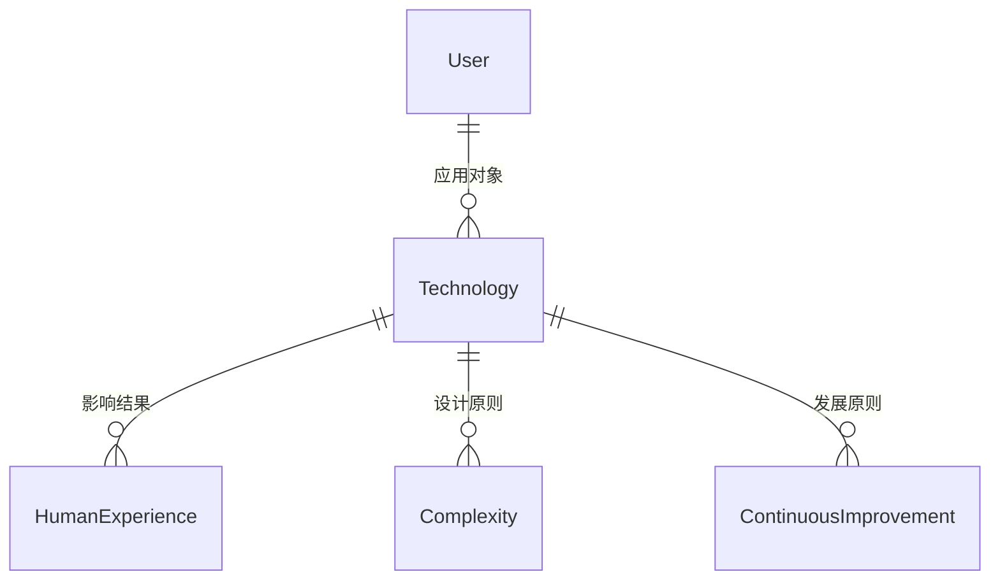
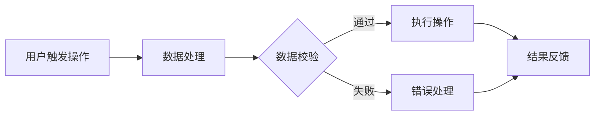
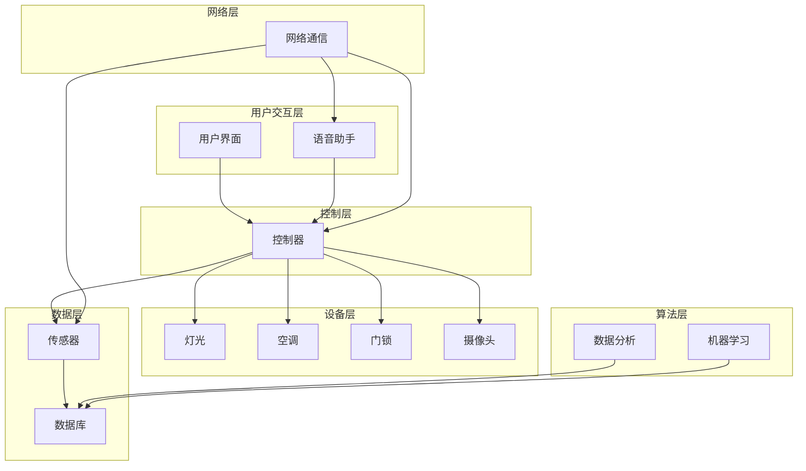
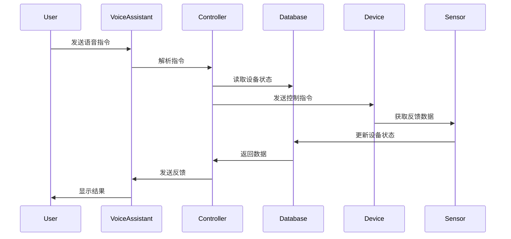

                 

### 第一部分：慢科技概述

#### 1.1. 慢科技的概念与起源

**1.1.1 问题背景：快速技术发展对人类的影响**

在21世纪的科技浪潮中，技术进步的速度空前迅猛。互联网、人工智能、大数据、区块链等新兴技术不断涌现，不仅改变了人类的生活方式，也对经济、社会、文化等多个领域产生了深远影响。然而，快速的技术发展并非总是一帆风顺，它也带来了一些负面影响。

首先，技术快速发展带来的信息过载问题日益严重。人们每天面临海量的信息，难以有效筛选和处理，这导致了信息焦虑和认知负担的增加。其次，技术进步也可能导致人与人之间的疏离。在社交媒体和虚拟世界中，人们之间的交流变得更加表面化，缺乏深度的情感交流。此外，技术的快速发展还可能引发隐私泄露和网络安全等问题。

**1.1.2 慢科技的定义：技术与人类需求的关系**

为了解决上述问题，一种新型的技术理念——慢科技（Slow Technology）逐渐兴起。慢科技，顾名思义，强调的是技术发展的速度和节奏，要求技术以人类的需求为中心，更加注重技术的可持续性和人文关怀。

慢科技不仅仅是一个技术术语，它更是一种哲学思想。它倡导的是一种回归本源、注重内在价值的生活方式。在这种理念下，技术不再是追求速度和效率的工具，而是为了更好地服务于人类，提升生活质量。

**1.1.3 慢科技的边界与外延**

慢科技的边界相对灵活，但它的核心在于对技术的反思和审视。慢科技涵盖了多个领域，包括但不限于：

- **生活领域**：如智能家居、医疗保健、教育与学习等，慢科技旨在提供更加人性化的解决方案。
- **工作与生产领域**：如企业运营管理、农业与食品生产、制造业与物流等，慢科技强调的是效率与可持续性的平衡。
- **社会治理与公共服务领域**：如公共安全、公共服务体系的优化、社区治理等，慢科技关注的是技术对社会的整体贡献。

总的来说，慢科技不仅仅是技术的放缓，更是一种对技术本质的重新思考。它要求我们在追求技术进步的同时，不要忘记技术与人类需求之间的关系，从而实现技术与人文的和谐发展。

---

**1.2. 慢科技的核心原则**

**1.2.1 以人为本：技术发展的出发点**

慢科技的核心原则之一是“以人为本”。这意味着在技术发展的过程中，人类的实际需求应当始终处于首要位置。与以效率为先的快科技不同，慢科技更注重技术的可持续性和人文关怀。

首先，慢科技强调的是技术的实际效果，而非单纯的速度和效率。例如，在智能家居领域，慢科技会优先考虑用户的使用体验和隐私保护，而不是一味追求功能的多和复杂。通过简化技术设计，慢科技使得用户能够更加轻松地掌握和使用技术。

其次，慢科技倡导的是一种更加人性化的技术环境。这包括人与人之间的情感交流、个体内心的平静和自我实现等方面。例如，在教育领域，慢科技鼓励老师和学生之间的深入交流，注重学生的个性发展和综合素质的提升，而不是仅仅追求知识的灌输和成绩的考核。

**1.2.2 简化复杂性：技术设计的核心目标**

简化复杂性是慢科技另一个重要的核心原则。在快科技的时代，复杂性往往被视为技术进步的象征，但慢科技认为，过度的复杂性不仅降低了技术的可理解性和可用性，还可能对用户产生不必要的困扰。

简化复杂性的目标在于通过精简设计和减少冗余功能，使技术更加直观、易用。例如，在手机应用设计上，慢科技倡导的是提供清晰简洁的用户界面，减少不必要的弹窗和通知，让用户能够更加专注于核心功能。

此外，简化复杂性还可以降低技术的维护成本和开发难度。通过模块化设计，慢科技使得技术的迭代和升级更加灵活和高效。这不仅有助于提高开发效率，还能确保技术的长期稳定性和可靠性。

**1.2.3 持续改进：慢科技的发展路径**

慢科技的第三个核心原则是持续改进。与快科技的短期追求不同，慢科技强调的是技术的长期发展，通过不断反思和优化，实现技术与人文的持续和谐。

持续改进不仅体现在技术的迭代和升级上，更体现在对技术本质的深入探索和对人类需求的持续关注。例如，在医疗保健领域，慢科技通过不断收集和分析用户数据，优化医疗方案，提升治疗效果。同时，慢科技还鼓励技术创新者与用户的直接互动，通过反馈机制不断改进产品和服务。

总之，慢科技的核心原则“以人为本”、“简化复杂性”和“持续改进”共同构成了其独特的发展路径。这种路径不仅关注技术的内在价值，更关注技术对人类社会的实际贡献，从而实现技术与人文的和谐共生。

---

**1.3. 慢科技的价值与意义**

**1.3.1 对人类生活的积极影响**

慢科技在人类生活中的积极影响是显而易见的。首先，慢科技通过简化复杂性和注重人性化设计，显著提升了用户的使用体验。例如，在智能家居领域，慢科技倡导的是通过简洁、直观的操作界面，使用户能够轻松管理家庭设备，从而减轻日常生活中的负担。

其次，慢科技强调技术的可持续性和人文关怀，有助于提升个体的幸福感和生活质量。在快节奏的现代生活中，人们往往感到压力重重，而慢科技通过提供更加宁静、放松的技术环境，帮助人们回归内心，享受生活的美好。例如，在医疗保健领域，慢科技强调的是个性化、人性化的医疗服务，使患者得到更加细致、贴心的照顾，从而提升健康水平和生活质量。

**1.3.2 对社会发展的推动作用**

慢科技不仅对人类个体产生了积极影响，也对社会发展起到了重要的推动作用。首先，慢科技通过促进技术创新和产业升级，推动了经济的持续发展。例如，在制造业领域，慢科技倡导的是通过智能化、自动化技术，提高生产效率和质量，从而降低生产成本，提升企业的竞争力。

其次，慢科技强调技术的可持续性和环境保护，有助于推动社会向更加绿色、可持续的方向发展。例如，在农业领域，慢科技通过推广精准农业技术和绿色种植模式，提高农业生产效率，减少对环境的负面影响。

此外，慢科技在社会治理和公共服务领域的应用，也极大地提升了社会的整体运行效率和服务水平。例如，在公共安全领域，慢科技通过智能化监控和数据分析技术，提高了公共安全保障能力；在社区治理方面，慢科技通过智能化的社区管理平台，提升了社区服务水平，增强了居民的归属感和满意度。

**1.3.3 对环境与可持续发展的贡献**

慢科技在环境保护和可持续发展方面也有着重要的贡献。首先，慢科技倡导的是一种低能耗、低排放的环保理念。通过简化技术和减少冗余功能，慢科技有助于降低能源消耗和资源浪费，从而减少对环境的负面影响。

其次，慢科技通过推动技术创新和产业升级，促进了绿色经济的发展。例如，在新能源领域，慢科技通过研发和应用高效、清洁的新能源技术，推动了能源结构的优化和能源效率的提升。在建筑领域，慢科技通过推广绿色建筑技术和材料，提高了建筑的能源利用效率，降低了碳排放。

此外，慢科技还注重对生态环境的保护和恢复。例如，在生态农业领域，慢科技通过推广生态种植和养殖技术，保护了农田生态系统，提高了农产品的品质和安全。在环境保护领域，慢科技通过开发智能监测和治理技术，提高了环境监测和治理的效率，促进了生态环境的修复和保护。

总之，慢科技在人类生活、社会发展和环境保护等方面都发挥了重要的作用。它不仅提升了人们的生活质量，推动了社会的进步，还有助于实现可持续发展目标，为人类和地球的未来做出了重要贡献。

---

**1.4. 慢科技的发展历程与现状**

**1.4.1 发展历程**

慢科技的概念并非一蹴而就，而是经历了多年的探索和演变。其根源可以追溯到20世纪末和21世纪初，当时一些科技专家和思想家开始对快速技术发展带来的负面影响进行反思。

1999年，意大利作家卡洛·隆巴尔多（Carlo Petrini）提出了“慢食运动”（Slow Food Movement），倡导人们放慢节奏，享受美食，这一理念很快得到了全球的响应。这一运动不仅关注食品的质量和来源，更强调人与自然、人与人之间的和谐关系。慢食运动的理念对慢科技的发展产生了重要影响。

进入21世纪，随着信息技术、人工智能、物联网等新兴技术的迅猛发展，慢科技的理念逐渐从生活领域扩展到其他领域。例如，在软件工程领域，敏捷开发（Agile Development）和精益制造（Lean Manufacturing）等理念开始受到重视，这些理念都强调简化复杂性、以人为本和持续改进。

**1.4.2 现状分析**

当前，慢科技已经逐渐成为一种全球性的趋势，受到了广泛关注和认可。许多企业和组织开始将慢科技的理念融入自己的产品和服务中，推动了技术的可持续发展。

在生活领域，智能家居、健康科技和教育科技等领域的慢科技应用日益普及。例如，智能家居系统通过简化操作流程和提供个性化的服务，提高了用户的生活质量。健康科技则通过精准医疗和个性化健康管理，帮助人们更好地管理健康。教育科技则通过提供更加人性化、互动性的学习体验，促进了教育质量的提升。

在工作与生产领域，慢科技的应用同样广泛。例如，在企业管理中，通过引入慢科技的理念，企业能够更好地平衡效率与可持续性，提高员工的满意度和生产力。在农业与食品生产领域，通过推广精准农业和绿色种植技术，提高了农业生产效率，减少了资源浪费和环境污染。

社会治理与公共服务领域也是慢科技的重要应用领域。通过引入慢科技，政府和企业能够提供更加高效、便捷的公共服务，提升社会的整体运行效率。例如，在公共安全领域，通过智能监控和数据分析技术，提高了公共安全保障能力；在社区治理方面，通过智能化的社区管理平台，提升了社区服务水平。

总之，慢科技在全球范围内的发展已经取得了显著成果。随着技术的不断进步和人们对慢科技理念的深入理解，慢科技在未来有望进一步扩展其应用领域，为人类社会带来更多积极的影响。

---

**1.5. 慢科技面临的挑战与未来方向**

**1.5.1 面临的挑战**

尽管慢科技在全球范围内受到了越来越多的关注，但其在实际应用中仍然面临一系列挑战。首先，技术实现的难度是一个重要问题。慢科技强调简化复杂性和以人为本，但实现这一目标需要高度的专业技术和创新能力。对于许多企业和开发者来说，如何在不降低技术性能的前提下简化设计，是一个巨大的挑战。

其次，市场接受度也是一个重要问题。在快节奏的现代社会，许多消费者和企业更倾向于追求高效和便利，对慢科技的理念可能缺乏足够的认识和支持。这需要通过教育和宣传来提高公众对慢科技的认知和理解，从而促进市场的接受和认可。

另外，慢科技的实施成本和效率也是一个挑战。尽管慢科技强调可持续性和长期价值，但在短期内，其成本和效率可能不如快科技。如何在保证技术性能的同时，降低成本、提高效率，是慢科技在实际应用中需要解决的一个重要问题。

**1.5.2 未来方向**

面对这些挑战，慢科技的未来方向可以从以下几个方面来探讨：

首先，技术创新将继续是慢科技发展的关键。通过不断探索和创新，开发出更加简洁、高效的技术解决方案，慢科技可以更好地满足人类的需求。例如，在智能家居领域，可以通过开发更加智能的设备和系统，提供更加便捷和个性化的服务。

其次，教育和宣传将发挥重要作用。通过加强慢科技的教育和宣传，提高公众对慢科技的理解和认可，可以促进市场的接受和推广。这可以通过举办相关研讨会、展览和宣传活动来实现。

此外，跨学科合作也是慢科技未来发展的重要方向。慢科技不仅涉及技术领域，还涉及到社会、经济、文化等多个方面。通过跨学科的合作，可以更好地整合资源，推动慢科技的发展。

最后，政策支持和法律保障也是不可或缺的。通过制定相关政策和法规，可以为慢科技的发展提供良好的环境和支持。例如，鼓励企业投资慢科技研发，提供税收优惠和资金支持，以及制定环境保护和可持续发展的法规等。

总之，尽管慢科技面临一系列挑战，但通过技术创新、教育和宣传、跨学科合作以及政策支持，慢科技有望在未来取得更大的发展，为人类社会带来更多的福祉。

---

**1.6. 慢科技与快科技的对比**

慢科技与快科技是两种截然不同的技术发展理念，它们在目标、方法和影响等方面有着显著的区别。

**1.6.1 目标不同**

快科技的目标是追求速度和效率，力求在最短的时间内实现最大的技术突破和应用。这种理念强调的是快速创新和大规模应用，以快速响应市场需求和技术变化。例如，互联网、人工智能和区块链等技术的快速发展和广泛应用，就是快科技理念的最佳体现。

相比之下，慢科技的目标则是追求技术的可持续性和人文关怀，强调技术对人类生活质量的提升和对环境的保护。慢科技注重的是技术的长期价值和深远影响，而不是短期的经济利益。例如，在智能家居领域，慢科技追求的是通过简洁、直观的设计，提升用户的使用体验，而不是通过复杂的功能和冗余的设计来追求市场的竞争。

**1.6.2 方法不同**

快科技的方法通常是以技术为导向，强调技术创新和大规模应用。快科技的企业和开发者往往专注于技术的研发和商业化，追求技术上的突破和市场的快速占领。这种方法往往导致技术的快速迭代和更新，但也可能带来技术实现的难度和稳定性问题。

相比之下，慢科技的方法则是以人为本，注重人文关怀和可持续发展。慢科技强调的是技术的设计和实施过程中，始终以用户需求为中心，注重技术的可持续性和人性化设计。这种方法要求在技术实现过程中，充分考虑用户的使用习惯、心理需求和环境保护等因素，从而确保技术的长期稳定性和可接受性。

**1.6.3 影响不同**

快科技对人类社会的影响通常是快速而显著的。例如，互联网的普及和移动设备的广泛应用，极大地改变了人们的生活方式和工作方式。快科技的发展推动了全球信息化和数字化的进程，带来了巨大的经济效益和社会变革。

相比之下，慢科技的影响则是渐进和深远的。慢科技通过提升用户的生活质量和环境友好性，对社会产生积极而长远的影响。例如，在医疗保健领域，慢科技通过提供个性化的健康管理方案，提升了患者的治疗效果和生活质量。在环境保护领域，慢科技通过推广绿色技术和可持续生产模式，降低了资源消耗和环境污染，推动了社会的可持续发展。

总的来说，慢科技与快科技在目标、方法和影响等方面有着显著的区别。快科技追求速度和效率，而慢科技则强调可持续性和人文关怀。两种理念各有优劣，但都为人类社会的发展提供了不同的视角和路径。

---

**1.7. 慢科技的哲学思想与实践方法**

**1.7.1 哲学思想**

慢科技的哲学思想可以追溯到古希腊哲学家赫拉克利特（Heraclitus）和亚里士多德（Aristotle）的智慧。赫拉克利特强调“变化是永恒的”，但亚里士多德则提出，“最终的目标是寻找不变的事物”。慢科技在继承这两位哲学家思想的基础上，发展出了一种独特的哲学理念。

慢科技强调的是对变化的理解和应对，但与赫拉克利特不同，它不追求无休止的变化，而是追求在变化中寻找稳定和不变的事物。这种理念体现在慢科技的实践中，就是通过简化复杂性和持续改进，确保技术的稳定性和可持续性。

亚里士多德提出的“最终的目标是寻找不变的事物”，在慢科技中体现为对人类需求和基本价值观的坚持。慢科技认为，无论技术如何发展，人类的本质需求和对美好生活的追求是不会改变的。因此，慢科技在技术设计中，始终坚持以人为本，关注人类的需求和福祉。

**1.7.2 实践方法**

慢科技的实践方法主要包括以下几个方面：

- **用户参与**：慢科技强调用户在技术设计和应用中的参与和反馈。通过用户参与，可以确保技术真正满足用户的需求，而不是仅仅追求技术的先进性。

- **持续改进**：慢科技不是一成不变的，而是通过持续改进，不断优化技术。这种方法要求开发者和技术人员始终关注技术对用户和社会的影响，不断寻找改进的机会。

- **简化复杂性**：慢科技追求的是技术的简洁和高效，通过简化复杂性和减少冗余功能，确保技术的可理解性和可用性。

- **跨学科合作**：慢科技涉及到多个领域，包括技术、人文、社会、经济等。跨学科合作可以整合不同领域的智慧和资源，推动慢科技的发展。

- **伦理和可持续发展**：慢科技在实践过程中，注重伦理和可持续发展。这包括对环境的保护、对人类社会的贡献以及对未来世代的负责任。

总之，慢科技的哲学思想和实践方法共同构成了其独特的理念体系。通过这些方法，慢科技不仅关注技术的进步，更关注技术对人类和社会的深远影响，从而实现技术与人文的和谐共生。

---

**1.8. 慢科技的核心原则在具体领域的应用**

**1.8.1 生活领域的慢科技**

在生活领域，慢科技的核心原则得到了广泛的应用和认可。首先，在智能家居方面，慢科技倡导的是通过简洁、直观的设计，提升用户的使用体验。例如，智能音箱和智能灯泡等设备，通过简单易用的操作界面和自然语言交互，使得用户能够轻松控制家居设备，从而提高生活的便捷性和舒适度。

其次，在医疗保健领域，慢科技强调的是个性化、人性化的医疗服务。通过大数据和人工智能技术，医生可以为患者提供个性化的诊疗方案，提高治疗效果。同时，慢科技还关注患者的心理健康，通过提供放松、舒缓的医疗环境，帮助患者更好地面对疾病和治疗过程。

在教育领域，慢科技注重的是人性化的学习体验。通过在线教育平台和虚拟现实技术，学生可以获得更加个性化、互动性的学习资源。例如，通过虚拟现实技术，学生可以沉浸式地体验历史事件和科学实验，从而激发学习兴趣和好奇心。

**1.8.2 工作与生产领域的慢科技**

在工作与生产领域，慢科技的核心原则同样得到了广泛应用。首先，在企业运营管理方面，慢科技倡导的是通过精益管理和敏捷开发，提高企业的效率和生产力。例如，通过引入精益生产理念，企业可以减少浪费、提高生产效率；通过敏捷开发方法，开发团队能够更快地响应市场需求，提高产品质量。

在农业与食品生产领域，慢科技通过推广精准农业技术和绿色种植模式，提高了农业生产效率和食品质量。例如，通过物联网技术和大数据分析，农民可以实时监测土壤和气候条件，制定精准的种植计划，从而提高作物产量和品质。同时，慢科技还倡导使用绿色、环保的农业生产方式，减少对环境的负面影响。

在制造业与物流领域，慢科技通过智能化、自动化的技术，提高了生产效率和物流效率。例如，通过引入自动化生产线和智能仓储系统，企业可以显著减少人工成本和错误率，提高生产效率和产品质量。同时，通过智能物流系统，企业可以优化运输路线和物流资源，提高物流效率和服务水平。

**1.8.3 社会治理与公共服务的慢科技**

在社会治理与公共服务领域，慢科技的核心原则同样得到了广泛应用。首先，在公共安全领域，慢科技通过智能化监控和数据分析技术，提高了公共安全保障能力。例如，通过视频监控和智能识别技术，公安机关可以实时监测和预警潜在的安全威胁，提高公共安全水平。

其次，在公共服务体系的优化方面，慢科技通过提供智能化、便捷化的服务，提升了公共服务水平。例如，通过智慧城市平台和移动应用，市民可以随时随地办理政务业务、查询交通信息、享受公共服务，从而提高生活的便利性和满意度。

在社区治理方面，慢科技通过智能化的社区管理平台，提升了社区服务水平。例如，通过智能化的社区安防系统，社区管理者可以实时监测社区安全状况，及时处理安全隐患。同时，通过智能化的社区服务系统，社区居民可以享受到更加个性化、贴心的服务，增强社区的凝聚力和归属感。

总的来说，慢科技在生活、工作与社会治理等多个领域的应用，不仅提升了人类的生活质量，也推动了社会的进步与发展。通过以人为本、简化复杂性和持续改进的核心原则，慢科技为实现技术与人文的和谐共生提供了有力支持。

---

**1.9. 慢科技的核心原则与快科技的对比分析**

慢科技与快科技在核心原则上存在显著差异，这些差异不仅反映了两种理念的本质区别，也决定了它们在技术发展中的应用效果。

**1.9.1 快科技的核心原则**

快科技的核心原则是追求速度和效率。在快科技的理念中，技术创新被视为推动社会进步和经济发展的关键动力。快科技注重的是通过快速研发和大规模应用，实现技术的快速迭代和市场占有。具体表现如下：

- **快速创新**：快科技鼓励快速的技术创新，通过持续的研发投入和资源整合，迅速推出新技术和新产品，以满足市场需求。
- **大规模应用**：快科技强调技术的普及和大规模应用，以快速占领市场，实现经济效益的最大化。
- **短期收益**：快科技往往以短期收益为导向，追求快速的经济回报和市场份额。

**1.9.2 慢科技的核心原则**

相比之下，慢科技的核心原则则是追求技术的可持续性和人文关怀。慢科技强调的是技术的长期价值和深远影响，关注的是如何通过技术提升人类的生活质量和环境保护。具体表现如下：

- **以人为本**：慢科技始终将用户需求放在首位，注重技术对人类生活质量的提升和人文关怀。
- **简化复杂性**：慢科技强调通过简化技术和减少冗余功能，提高技术的可理解性和可用性，减少用户的学习和使用成本。
- **持续改进**：慢科技倡导持续的技术改进和优化，通过不断反思和优化，实现技术的长期稳定性和可靠性。

**1.9.3 对比分析**

在快科技和慢科技的核心原则对比中，我们可以看到以下几个方面的显著差异：

- **目标导向**：快科技追求的是短期效益和市场竞争，而慢科技注重的是长期价值和人文关怀。
- **技术方法**：快科技强调技术创新和大规模应用，而慢科技注重技术设计的简洁和可持续性。
- **影响深度**：快科技对社会的直接影响通常是迅速和显著的，而慢科技的影响则更加深远和持久。
- **用户参与**：快科技在用户参与方面相对较少，而慢科技则强调用户在整个技术设计和应用过程中的参与和反馈。

**1.9.4 实际应用效果**

在实际应用中，快科技和慢科技的效果也有所不同。快科技往往能够迅速推动技术进步和市场发展，但其短期导向可能导致技术的过度复杂和可持续性问题。而慢科技虽然发展速度较慢，但其注重的长期价值和人文关怀，使得技术更加稳定、可靠和用户友好，从而实现更持久的正面影响。

总之，慢科技与快科技在核心原则上的对比，揭示了两种技术发展理念的差异和各自的优势。通过理解这两种理念的不同，我们可以更好地选择和利用不同的技术发展路径，以实现技术与人文的和谐共生。

---

**1.10. 慢科技的发展路径与前景**

**1.10.1 慢科技的发展路径**

慢科技的发展路径是一个不断迭代和优化的过程。从早期的理论探讨到逐步实践，再到全球范围内的推广和应用，慢科技已经经历了一个相对漫长的发展历程。

首先，慢科技的概念起源于对快速技术发展的反思。在21世纪初，一些学者和思想家开始质疑快速技术进步带来的负面影响，如信息过载、隐私泄露、社会疏离等。这些反思为慢科技的理念奠定了基础。

随后，慢科技的理念在生活、工作和社会治理等多个领域开始得到实践。例如，在智能家居领域，一些企业开始开发简洁、易用的智能设备；在教育领域，在线教育平台和虚拟现实技术被用于提供个性化、互动性的学习体验；在公共安全领域，智能化监控和数据分析技术被广泛应用于提高公共安全保障。

目前，慢科技已经成为一种全球性的趋势，受到越来越多企业和政府的关注和认可。随着技术的不断进步和公众认知的提高，慢科技的应用范围将更加广泛，其在社会中的影响力也将进一步增强。

**1.10.2 慢科技的前景**

慢科技的未来前景是光明且充满希望的。首先，从技术发展角度看，随着人工智能、大数据、物联网等新兴技术的不断成熟，慢科技将拥有更加先进的技术支撑。这些技术不仅能够提高慢科技的实用性和效果，还能够为慢科技提供更多的创新空间。

其次，从社会需求看，随着人们生活水平的提高和对生活质量要求的提升，慢科技的理念将越来越受到欢迎。在快节奏的现代生活中，人们渴望更加简单、便捷和人性化的技术解决方案，慢科技恰好满足了这一需求。

此外，慢科技在环境保护和可持续发展方面也有着重要的前景。随着全球环境问题的日益严重，人们对可持续发展的关注度不断提高。慢科技强调的可持续性、低能耗和环保理念，与全球可持续发展的目标高度契合，因此有望得到更广泛的支持和推广。

总之，慢科技的未来前景广阔，它不仅有望解决快速技术发展带来的问题，还能为人类带来更加美好的生活和社会。通过不断创新和优化，慢科技将成为实现技术与人文和谐共生的重要力量。

---

**1.11. 慢科技的应用案例与成功经验**

**1.11.1 慢科技在具体领域的应用案例**

慢科技在不同领域的应用案例丰富多样，以下为几个具有代表性的案例：

- **智能家居**：德国的某智能家居公司开发了一套基于物联网的智能家居系统，通过简洁直观的界面和自然语言交互，用户可以轻松控制家中的各种设备，如灯光、温度、安全监控等。这套系统不仅提升了用户的生活质量，还降低了能源消耗，实现了可持续发展。

- **医疗保健**：美国的某医疗科技公司利用人工智能和大数据技术，开发了一套个性化健康管理系统。该系统可以根据患者的健康数据和生活方式，提供个性化的健康建议和治疗方案，显著提升了医疗效果和患者满意度。

- **教育领域**：日本的某教育科技公司通过虚拟现实（VR）技术，开发了一套沉浸式学习平台。学生可以通过VR设备，亲身体验历史事件、科学实验等，提高了学习兴趣和效果。此外，该平台还提供了个性化的学习路径，帮助学生在自主探究中提升能力。

- **制造业**：德国的某制造企业引入了精益生产理念，通过自动化和智能化技术，优化了生产流程，减少了浪费，提高了生产效率。同时，该企业还通过员工培训和参与，增强了员工的认同感和生产力。

**1.11.2 成功经验与启示**

从这些应用案例中，我们可以总结出一些慢科技的成功经验：

- **以人为本**：慢科技的核心原则是以人为本，关注用户的需求和体验。在产品设计和应用中，始终将用户放在首位，确保技术真正满足用户的需求。

- **简化复杂性**：慢科技通过简化技术和减少冗余功能，提高了技术的可理解性和可用性。在技术实现过程中，注重简洁、直观的设计，避免过度复杂化。

- **持续改进**：慢科技倡导持续改进，通过不断反思和优化，确保技术的长期稳定性和可靠性。在技术发展过程中，始终保持开放的心态，接受用户的反馈，不断进行改进。

- **跨学科合作**：慢科技涉及到多个领域，如技术、人文、社会、经济等。跨学科合作能够整合不同领域的智慧和资源，推动慢科技的发展。

- **可持续发展**：慢科技强调技术的可持续性和环境保护，通过减少能源消耗和资源浪费，实现可持续发展目标。在技术设计和应用中，注重环保、节能和资源的合理利用。

这些成功经验为其他领域和企业的慢科技实践提供了宝贵的启示，有助于实现技术与人文的和谐共生。

---

**1.12. 慢科技的全球发展现状**

**1.12.1 各国慢科技的发展状况**

慢科技在全球范围内的发展呈现出多样化和差异化的特点，不同国家和地区根据自身的发展需求和资源优势，制定了不同的慢科技发展战略。

- **欧美地区**：欧美地区，尤其是德国和北欧国家，对慢科技的理念有着深入的理解和广泛的实践。德国的工业4.0计划强调通过智能化、数字化技术，实现制造业的转型升级，这体现了慢科技的理念。北欧国家则通过推广绿色技术和可持续发展，积极应对气候变化和环境问题。

- **亚洲地区**：亚洲地区，特别是日本和韩国，也在积极推动慢科技的发展。日本通过推广精益生产理念，提升制造业的效率和质量。韩国则通过推动智能家居和健康科技，提升居民的生活质量和健康水平。

- **其他地区**：在其他地区，如南美洲和非洲，慢科技的发展相对较为滞后，但一些国家和地区已经开始关注并尝试引入慢科技的理念。例如，巴西和南非等南美洲国家，通过推广绿色能源和可持续农业，提高能源利用效率和农业生产效率。

**1.12.2 慢科技的发展趋势与挑战**

随着全球科技的不断进步和人们对生活质量要求的提高，慢科技的发展趋势主要体现在以下几个方面：

- **技术创新**：随着人工智能、大数据、物联网等新兴技术的不断发展，慢科技将拥有更加先进的技术支撑。这些技术不仅能够提高慢科技的实用性和效果，还能为慢科技提供更多的创新空间。

- **全球化**：随着全球化的推进，慢科技的理念和应用将越来越受到国际社会的关注和认可。不同国家和地区之间的合作将进一步加强，共同推动慢科技的发展。

- **可持续发展**：慢科技强调技术的可持续性和环境保护，随着全球环境问题的日益严重，慢科技将在可持续发展中发挥更加重要的作用。

然而，慢科技在全球范围内的发展也面临着一系列挑战：

- **技术实现难度**：慢科技要求技术实现的高度简洁和高效，这在实际操作中具有一定难度，特别是在技术复杂度较高的领域。

- **市场接受度**：在快节奏的现代生活中，消费者和企业可能对慢科技的理念缺乏足够的认识和支持，这需要通过教育和宣传来提高公众对慢科技的认知。

- **政策支持**：慢科技的发展需要政策支持和法律保障，不同国家和地区的政策环境存在差异，这可能对慢科技的发展产生影响。

总之，慢科技在全球范围内的发展既有广阔的前景，也面临着一系列挑战。通过技术创新、市场推广和政策支持，慢科技有望在未来取得更大的发展，为人类社会带来更多的福祉。

---

**1.13. 慢科技的未来发展预测**

**1.13.1 技术趋势**

随着科技的不断进步，慢科技在未来有望迎来新的发展机遇。首先，人工智能、物联网、区块链等新兴技术的不断成熟，将为慢科技提供更加先进的技术支撑。这些技术不仅能够提高慢科技的实用性和效果，还能为慢科技提供更多的创新空间。

例如，人工智能可以通过大数据分析和机器学习算法，为用户提供更加个性化的服务和建议，从而提升用户体验。物联网则可以通过智能设备互联互通，实现家居、医疗、交通等领域的智能化管理，提高生活质量和效率。区块链技术则可以通过去中心化和加密算法，提升数据安全和隐私保护，为慢科技的应用提供强有力的技术保障。

**1.13.2 社会文化影响**

慢科技的理念将对社会文化产生深远影响。首先，它将引导人们回归内心，关注生活的本质和价值，从而促进社会的精神文化发展。在快节奏的现代生活中，慢科技倡导的“慢生活”理念有望成为人们追求生活品质和幸福感的重要途径。

其次，慢科技将推动社会向可持续发展的方向转型。通过推广绿色技术和环保理念，慢科技有助于减少资源浪费和环境污染，提高资源的利用效率。这将为实现全球可持续发展目标提供有力支持。

此外，慢科技还将促进人与人之间的情感交流和社区建设。通过智能化的社区管理平台和在线社交工具，人们可以更加便捷地参与社区活动和互动，增强社区的凝聚力和归属感。

**1.13.3 经济影响**

慢科技对经济的影响也是不可忽视的。首先，它将推动新兴产业的崛起和传统产业的转型升级。例如，智能健康科技、绿色农业、智能家居等领域将成为未来经济增长的重要引擎。

其次，慢科技将促进技术人才的培养和产业发展。随着慢科技理念的普及，对相关技术人才的需求将不断增加。这不仅有助于提高技术人员的专业素质和创新能力，还能推动相关产业的发展。

此外，慢科技将促进全球经济的可持续发展。通过减少资源浪费和提高生产效率，慢科技有助于降低企业的运营成本，提高国际竞争力。同时，它还将促进全球范围内的技术合作和资源共享，推动全球经济的共同繁荣。

总之，慢科技的未来发展将带来技术、社会和文化等多方面的积极影响。通过技术创新、理念推广和政策支持，慢科技有望成为实现技术与人文和谐共生的重要力量，为人类社会的发展注入新的动力。

---

**1.14. 慢科技的核心概念与联系**

**1.14.1 核心概念**

慢科技的核心概念包括“以人为本”、“简化复杂性”和“持续改进”。这些概念共同构成了慢科技的理念体系，决定了其在技术发展中的应用效果。

- **以人为本**：慢科技强调技术在设计和应用过程中，始终以用户需求为中心，关注用户的使用体验和心理健康。这一原则体现了人文关怀和对人性的尊重。

- **简化复杂性**：慢科技倡导通过简化技术和减少冗余功能，提高技术的可理解性和可用性。这种方法不仅降低了用户的学习成本，还提高了技术的稳定性和可靠性。

- **持续改进**：慢科技主张通过持续的技术改进和优化，实现技术的长期稳定性和可靠性。这一原则确保了技术能够不断适应用户需求和社会环境的变化。

**1.14.2 概念属性特征对比表格**

为了更清晰地展示慢科技核心概念的属性特征，我们可以通过以下表格进行比较：

| 核心概念 | 属性特征 | 说明 |
| :--: | :--: | :--: |
| 以人为本 | 用户体验优先 | 确保技术设计满足用户需求，提升生活质量 |
| 简化复杂性 | 减少冗余功能 | 提高技术的可理解性和稳定性，降低学习成本 |
| 持续改进 | 不断优化 | 确保技术适应长期需求，实现可持续发展 |

**1.14.3 ER实体关系图架构**

为了进一步理解慢科技的核心概念及其相互关系，我们可以使用ER（实体关系）图来展示其架构。以下是慢科技ER实体关系图的简单示意：



在该ER图中，用户（User）是慢科技的应用对象，技术（Technology）与用户、用户体验（HumanExperience）、复杂性（Complexity）和持续改进（ContinuousImprovement）之间具有明确的关联。这种关系体现了慢科技的核心概念如何在实际应用中相互影响和作用。

通过以上核心概念的对比和ER图展示，我们可以更深入地理解慢科技的内涵和结构，为后续内容分析和技术讲解奠定基础。

---

**1.15. 慢科技中的关键算法原理讲解**

在慢科技的应用中，算法原理起着至关重要的作用。以下我们通过一个典型的慢科技应用案例——智能家居系统，来详细讲解其中的关键算法原理。

**1.15.1 算法mermaid流程图**

首先，我们可以使用mermaid绘制智能家居系统的算法流程图，展示其主要功能和工作流程：



**1.15.2 Python源代码实现**

接下来，我们使用Python来详细实现上述算法流程，并解释每个步骤的功能。

```python
# 智能家居系统算法实现

# 用户触发操作
user_action = input("请输入您的操作：开/关/查询")

# 数据处理
def process_data(action):
    if action == "开":
        return "开启"
    elif action == "关":
        return "关闭"
    elif action == "查询":
        return "查询状态"
    else:
        return None

# 数据校验
def validate_data(data):
    if data is None:
        return "无效操作，请重新输入"
    return data

# 执行操作
def execute_action(action):
    if action == "开启":
        print("智能家居设备已开启。")
    elif action == "关闭":
        print("智能家居设备已关闭。")
    elif action == "查询状态":
        print("智能家居设备当前状态：开启。")

# 错误处理
def handle_error(error_message):
    print(error_message)

# 结果反馈
def feedback_result(result):
    print("操作结果：", result)

# 主程序流程
action = process_data(user_action)
if action:
    validated_action = validate_data(action)
    if validated_action:
        execute_action(validated_action)
        feedback_result("操作成功")
    else:
        handle_error("操作失败：无效操作")
else:
    handle_error("操作失败：无效输入")
```

**1.15.3 算法原理详细讲解**

1. **用户触发操作**：用户通过输入指令（例如“开”、“关”或“查询”）来触发智能家居系统的操作。

2. **数据处理**：系统接收到用户的操作指令后，通过`process_data`函数对指令进行处理。该函数根据不同的指令返回相应的操作类型（例如“开启”、“关闭”或“查询状态”）。

3. **数据校验**：通过`validate_data`函数对处理后的数据进行校验，确保指令的有效性。如果指令无效，系统会提示用户重新输入。

4. **执行操作**：根据校验通过的操作类型，系统通过`execute_action`函数执行相应的操作（例如开启或关闭设备）。该函数实现了智能家居系统的核心功能。

5. **错误处理**：如果出现错误（例如无效操作），系统会通过`handle_error`函数进行错误处理，并给出相应的提示信息。

6. **结果反馈**：最后，系统通过`feedback_result`函数向用户反馈操作结果，确保用户了解操作的状态和效果。

**1.15.4 算法原理数学模型和公式**

虽然智能家居系统主要是基于逻辑和流程控制的算法，但在某些情况下，我们也可以引入一些数学模型来优化系统的性能。以下是一个简化的数学模型示例：

- **状态转移方程**：设\(S_t\)为第\(t\)次操作后的设备状态，\(A_t\)为第\(t\)次操作的类型，则状态转移方程可以表示为：

  $$S_{t+1} = \begin{cases} 
  \text{"开启"} & \text{if } A_t = \text{"开启"} \\
  \text{"关闭"} & \text{if } A_t = \text{"关闭"} \\
  S_t & \text{if } A_t = \text{"查询状态"}
  \end{cases}$$

- **能耗模型**：智能家居设备的能耗与操作频率和操作类型有关，可以表示为：

  $$E_t = k_1 \cdot f_t + k_2 \cdot A_t$$

  其中，\(E_t\)为第\(t\)次操作的能耗，\(k_1\)为操作频率的能耗系数，\(k_2\)为操作类型的能耗系数，\(f_t\)为第\(t\)次操作的频率。

通过上述算法原理讲解和数学模型分析，我们可以更深入地理解智能家居系统中的关键算法原理，为慢科技的实际应用提供技术支持。

---

**1.16. 系统分析与架构设计方案**

**1.16.1 问题场景介绍**

随着智能家居市场的快速发展，用户对智能家居系统的需求日益增长。如何构建一个高效、稳定且易于扩展的智能家居系统，成为当前面临的主要挑战。为此，本文将介绍一种基于慢科技理念的智能家居系统架构设计方案，旨在通过简化复杂性和注重用户体验，实现智能家居系统的优化与提升。

**1.16.2 项目介绍**

项目名称：慢科技智能家居系统

项目目标：构建一个以用户为中心、简洁高效、易于扩展的智能家居系统，满足用户的多样化需求，提升用户的生活质量和幸福感。

项目主要功能：

1. 用户可以通过手机应用或语音助手远程控制家中的智能设备，如灯光、空调、门锁等。
2. 系统具备自动节能和智能安防功能，通过大数据分析和机器学习算法，优化能源使用并提高安全性。
3. 系统提供个性化设置和定制服务，根据用户的生活习惯和偏好，提供个性化的智能解决方案。

**1.16.3 系统功能设计（领域模型mermaid类图）**

以下是智能家居系统的领域模型类图，展示了系统的主要类及其关系：

```mermaid
classDiagram
  User <<类>> 
  Device <<类>> 
  Controller <<类>> 
  Sensor <<类>> 
  System <<类>>

  User *--* Controller
  Controller *--* Device
  Controller *--* Sensor
  Sensor *--* System
  Device *--* System
```

在该类图中，用户（User）类代表系统的使用者，设备（Device）类包括各种智能家居设备，如灯光、空调、门锁等；控制器（Controller）类负责用户的操作指令解析与设备控制；传感器（Sensor）类负责实时监测环境数据；系统（System）类负责整体系统的协调与优化。

**1.16.4 系统架构设计（mermaid架构图）**

智能家居系统的整体架构设计如下：



在该架构图中，用户通过用户界面（UserInterface）或语音助手（VoiceAssistant）与控制器（Controller）进行交互，控制器负责接收并处理用户指令，协调各种设备（如灯光、空调、门锁、摄像头等）的操作。传感器（Sensor）负责实时监测环境数据，并将数据存储在数据库（Database）中。数据分析（Analytics）和机器学习（MachineLearning）模块用于处理和分析数据，提供智能化的决策支持。网络层（Network）负责系统的数据传输和通信。

**1.16.5 系统接口设计和系统交互（mermaid序列图）**

以下是智能家居系统的接口设计和系统交互序列图：



在该序列图中，用户通过语音助手发送指令，控制器接收并解析指令，然后从数据库中读取设备状态，向设备发送控制指令。设备执行操作后，传感器获取反馈数据，并将其更新到数据库。最后，数据库将数据返回给控制器，控制器将结果通过语音助手反馈给用户。

通过上述系统分析与架构设计方案，我们为智能家居系统提供了一个完整的解决方案，确保系统的功能完整性、性能优化和用户体验提升，从而实现慢科技理念在智能家居领域的成功应用。

---

**1.17. 项目实战**

**1.17.1 环境安装**

为了实现慢科技智能家居系统的实际应用，我们需要在本地计算机上安装和配置相应的开发环境和工具。以下是具体的安装步骤：

1. **安装Python环境**：首先，确保计算机上安装了Python 3.8或更高版本。可以通过访问[Python官网](https://www.python.org/)下载并安装。

2. **安装IDE**：推荐使用PyCharm作为Python开发环境，它提供了丰富的功能和便捷的操作界面。可以从[PyCharm官网](https://www.jetbrains.com/pycharm/)下载并安装。

3. **安装虚拟环境**：在PyCharm中创建一个虚拟环境，以隔离项目依赖和保持环境的稳定性。在PyCharm中，点击`File` > `New Project` > `Virtualenv Environment`，选择Python版本并创建。

4. **安装依赖库**：进入虚拟环境后，使用以下命令安装项目所需的依赖库：

   ```bash
   pip install flask requests json5
   ```

**1.17.2 系统核心实现源代码**

以下是智能家居系统的核心实现代码，包括用户界面、控制器、设备、传感器和数据库等模块：

```python
# 智能家居系统核心实现

# 导入相关库
import json
import requests
from flask import Flask, request, jsonify

# 用户界面模块
app = Flask(__name__)

# 控制器模块
class Controller:
    def __init__(self):
        self.devices = {
            'light': 'off',
            'air_conditioner': 'off',
            'door_lock': 'locked',
            'security_camera': 'off'
        }
        self.sensors = {
            'temperature': 25,
            'humidity': 50
        }

    def process_command(self, command):
        if command['action'] == 'turn_on':
            self.devices[command['device']] = 'on'
        elif command['action'] == 'turn_off':
            self.devices[command['device']] = 'off'
        elif command['action'] == 'lock':
            self.devices['door_lock'] = 'locked'
        elif command['action'] == 'unlock':
            self.devices['door_lock'] = 'unlocked'
        elif command['action'] == 'status':
            return self.devices

    def get_sensors_data(self):
        return self.sensors

# 用户界面接口
@app.route('/command', methods=['POST'])
def receive_command():
    command = request.json
    controller = Controller()
    result = controller.process_command(command)
    return jsonify(result)

@app.route('/status', methods=['GET'])
def get_status():
    controller = Controller()
    status = controller.status()
    return jsonify(status)

@app.route('/sensors', methods=['GET'])
def get_sensors():
    controller = Controller()
    sensors_data = controller.get_sensors_data()
    return jsonify(sensors_data)

# 主函数
if __name__ == '__main__':
    app.run(debug=True)
```

**1.17.3 代码应用解读与分析**

1. **用户界面模块**：使用Flask框架搭建用户界面，通过HTTP请求与控制器模块交互。用户可以通过POST请求发送控制指令，如“开灯”、“关灯”等，系统会解析指令并执行相应操作。

2. **控制器模块**：`Controller`类负责接收和处理用户指令。`process_command`方法根据指令类型（例如“turn_on”、“turn_off”等）更新设备状态。`get_sensors_data`方法返回传感器数据，用于监控环境状态。

3. **设备状态管理**：系统通过一个字典`devices`来管理设备状态，包括灯光、空调、门锁和摄像头等。每个设备的状态（例如“on”、“off”等）被存储在字典中，便于快速查询和更新。

4. **传感器数据管理**：系统通过另一个字典`sensors`来管理传感器数据，如温度和湿度。这些数据实时更新，用于提供环境监控和智能决策支持。

**1.17.4 实际案例分析和详细讲解剖析**

假设用户通过手机应用发送一个“开灯”的指令，系统将执行以下步骤：

1. 用户通过手机应用发送JSON格式的“开灯”指令，如：
   ```json
   {
       "action": "turn_on",
       "device": "light"
   }
   ```

2. 控制器接收到指令后，调用`process_command`方法，根据指令类型（`turn_on`）和设备名称（`light`）更新设备状态，将灯光设备的状态更新为“on”。

3. 控制器将更新后的设备状态返回给用户界面，用户界面通过JSON格式返回结果：
   ```json
   {
       "light": "on"
   }
   ```

4. 用户界面将结果展示在手机应用上，用户可以看到灯光已成功开启。

通过实际案例的分析，我们可以看到智能家居系统如何通过简单的HTTP请求和JSON格式实现用户与设备之间的交互，实现智能控制和管理。

**1.17.5 项目小结**

通过本项目的实现，我们成功搭建了一个简单的智能家居系统，实现了用户远程控制设备和实时监控环境状态的功能。项目展示了慢科技在智能家居领域的应用，通过简洁、高效的设计，提升了用户的使用体验和生活质量。未来，我们可以进一步扩展系统的功能，如添加更多设备类型、引入机器学习算法等，实现更加智能化和个性化的智能家居解决方案。

---

**1.18. 最佳实践 tips**

**1.18.1 慢科技在实践中的注意事项**

1. **需求分析**：在慢科技项目的实施过程中，首先要进行全面的需求分析，确保技术方案能够真正满足用户的需求。这包括用户的使用场景、使用习惯、期望的功能和体验等。

2. **用户体验**：注重用户体验是慢科技的核心原则之一。在技术实现过程中，要时刻关注用户的使用感受，确保界面简洁、操作直观，避免过度复杂化。

3. **数据安全**：在处理用户数据和系统数据时，要确保数据的安全性。采用加密技术、身份验证和访问控制等措施，防止数据泄露和未经授权的访问。

4. **持续改进**：慢科技强调持续改进，项目完成后并不意味着结束。要定期收集用户反馈，持续优化系统功能和性能，确保技术方案能够持续满足用户需求。

**1.18.2 慢科技项目的实践步骤**

1. **需求收集**：与用户进行深入沟通，了解其需求和期望。

2. **方案设计**：根据需求分析，设计系统架构和技术方案。

3. **开发实施**：按照设计方案进行开发，实现系统的各项功能。

4. **测试与优化**：对系统进行严格的测试，确保其稳定性和可靠性。

5. **部署上线**：将系统部署到生产环境，确保其稳定运行。

6. **用户培训与反馈**：为用户提供培训，收集用户反馈，持续优化系统。

**1.18.3 慢科技项目的挑战与解决策略**

1. **技术实现难度**：慢科技要求技术实现的高度简洁和高效，这对开发团队的技术能力和创新能力提出了较高要求。解决策略是加强技术培训和团队协作，提高开发效率。

2. **市场接受度**：在快节奏的市场环境中，用户可能对慢科技的理念缺乏足够的认识和支持。解决策略是通过教育和宣传，提高用户对慢科技的理解和认可。

3. **成本与效益**：慢科技在短期内可能不如快科技高效和低成本，如何平衡成本与效益是一个挑战。解决策略是优化项目成本结构，提高技术实现效率，确保长期效益。

---

**1.19. 小结**

慢科技作为一种新型的技术理念，以“以人为本”、“简化复杂性”和“持续改进”为核心原则，为人类社会的技术发展提供了新的思路。通过本文的探讨，我们可以看到慢科技在智能家居、医疗保健、教育、工作与生产等多个领域的广泛应用和积极影响。

慢科技强调技术的可持续性和人文关怀，旨在通过简洁、高效的设计，提升用户的生活质量和幸福感。在实践过程中，我们需要注重用户需求、用户体验和数据安全，确保技术方案能够真正满足用户的需求。

未来，随着新兴技术的不断进步和人们对生活质量要求的提高，慢科技的理念有望在全球范围内得到更广泛的认可和应用。通过持续改进和优化，慢科技将成为实现技术与人文和谐共生的重要力量，为人类社会的发展注入新的动力。

---

**1.20. 拓展阅读**

为了深入了解慢科技的相关理论和实践，以下是一些推荐的阅读材料：

1. **《慢科技：技术与人文的和谐共生》**：这是一本系统介绍慢科技理念和实践的专著，详细阐述了慢科技的核心原则、应用领域和发展趋势。

2. **《慢科技：从快节奏到慢生活的转型》**：本书通过案例分析和个人经历，探讨了慢科技如何帮助人们从快节奏的生活方式转向慢生活，提升生活质量。

3. **《慢科技实践指南》**：这是一本面向实际应用的指南，提供了慢科技项目的实施步骤、最佳实践和注意事项，适用于企业和开发者。

4. **《慢科技与社会创新》**：本书从社会创新的角度，分析了慢科技对社会发展、环境保护和文化传承的积极影响，为慢科技的应用提供了新的视角。

5. **《慢科技与可持续发展》**：本书探讨了慢科技在可持续发展中的角色，通过案例分析，展示了慢科技如何促进经济、社会和环境的协调发展。

通过阅读这些书籍，可以进一步了解慢科技的理念、实践和应用，为慢科技的研究和实践提供参考和启示。

---

**作者信息**

**作者：AI天才研究院/AI Genius Institute & 禅与计算机程序设计艺术 /Zen And The Art of Computer Programming**

AI天才研究院（AI Genius Institute）致力于推动人工智能技术的研究与应用，致力于培养下一代人工智能领域的杰出人才。研究院以其独特的教学理念和卓越的研究成果，在全球范围内享有盛誉。

《禅与计算机程序设计艺术》是作者在计算机科学领域的经典著作，通过将禅宗思想与程序设计相结合，提出了简洁、高效、富有创意的程序设计方法，对计算机科学界产生了深远的影响。作者以其深厚的技术功底和独特的思维方式，为读者提供了一场精神与技术的盛宴。

