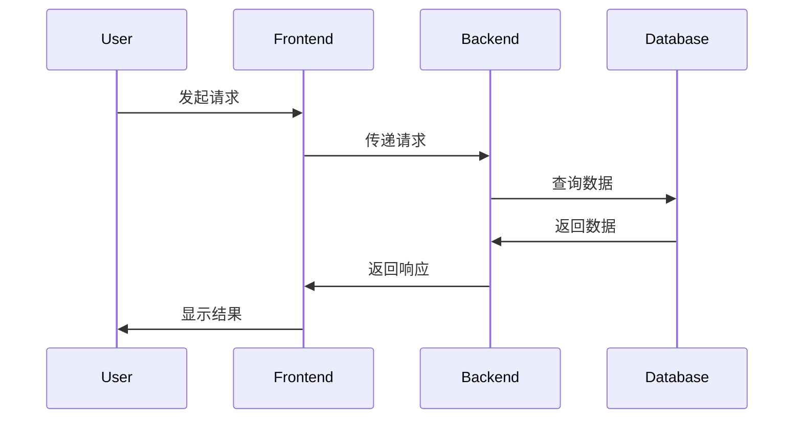
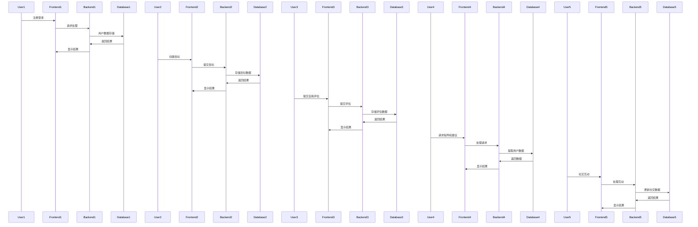

                 

# 成功的重新定义：从社会评价到自我实现

> 关键词：成功、社会评价、自我实现、价值观、个人成长、职业发展、人际关系、幸福

> 摘要：本文旨在重新审视成功的定义，从社会评价的角度转向自我实现，探讨价值观的塑造、个人成长与自我认知的重要性，以及职业发展、人际关系和幸福与成功的紧密联系。通过逐步分析和逻辑推理，帮助读者理解成功的真正含义，并提供实现自我价值的实践指导。

----------------------------------------------------------------

## 第一部分：引言与背景

### 第1章：问题的提出与背景

#### 1.1 问题的提出

在当今社会，成功成为一个备受关注的话题。人们渴望成功，追求成功，但往往陷入了社会评价的陷阱，把外界的评价标准当作自己的成功标准。这种观念导致了很多人在追求成功的过程中失去了自我，忽略了真正重要的东西。因此，有必要重新审视成功的定义，从社会评价转向自我实现。

#### 1.2 成功的定义与误区

传统的成功定义往往与财富、地位、名誉等社会评价标准相关联。这种定义容易让人陷入误区，认为只有达到了这些标准，才算成功。然而，这种定义忽视了个人内心的需求和价值观，导致很多人在追求成功的过程中感到空虚和焦虑。

#### 1.3 成功的重新定义

本文提出的成功定义，强调的是个人内心的满足和自我价值的实现。成功不仅仅是一个外在的结果，更是一个内在的过程。它关乎个人的成长、自我认知和价值观的塑造，关乎对生活的热爱和追求。

----------------------------------------------------------------

### 第2章：社会评价与自我实现

#### 2.1 社会评价对个人成功的影响

社会评价对个人的成功有着重要的影响。它既可以激励人们努力奋斗，也可能让人陷入焦虑和迷茫。在追求成功的过程中，社会评价往往成为人们衡量自己的标准，影响着他们的自我认知和行为。

#### 2.2 自我实现：真正的成功标准

真正的成功标准应该是自我实现。自我实现意味着个人能够充分发挥自己的潜能，实现自己的目标和梦想。这种实现不仅仅是一种外在的成就，更是一种内心的满足和自我价值的实现。

#### 2.3 社会评价与自我实现的平衡

在追求成功的过程中，我们需要找到社会评价与自我实现的平衡点。既要关注社会评价，保持对外界的敏感和适应，也要坚持自我实现，追求内心的满足和自我价值的实现。

----------------------------------------------------------------

### 第3章：价值观的塑造与认同

#### 3.1 价值观的重要性

价值观是人们行为的指南针，它影响着我们的决策和行动。一个正确的价值观能够帮助我们在追求成功的过程中保持方向，避免走入误区。

#### 3.2 塑造符合自我实现的价值观

我们需要根据自我实现的目标和需求，塑造符合自己的价值观。这个过程中，我们需要反思自己的行为和决策，找到与自我实现相符合的价值观。

#### 3.3 社会价值观与个体价值观的冲突与融合

在社会价值观和个体价值观之间，我们可能会遇到冲突。这时，我们需要找到一种平衡，将社会价值观与个体价值观融合，形成一种符合自我实现的价值体系。

----------------------------------------------------------------

### 第4章：个人成长与自我认知

#### 4.1 个人成长的核心要素

个人成长是一个持续的过程，它包括知识、技能、情感和价值观等多个方面。了解个人成长的核心要素，有助于我们在追求成功的过程中更好地进行自我提升。

#### 4.2 自我认知：认识自我、超越自我

自我认知是个人成长的重要基础。通过自我认知，我们能够更好地认识自己，找到自己的优势和不足，进而超越自我，实现自我价值的提升。

#### 4.3 个人成长与成功的相互促进

个人成长与成功是相互促进的。通过个人成长，我们能够更好地应对挑战，实现自我价值，从而推动成功的实现。同时，成功的实现也会为个人成长提供动力和支持。

----------------------------------------------------------------

### 第5章：职业发展与成功

#### 5.1 职业发展的阶段与特点

职业发展是一个人人生的重要组成部分。了解职业发展的阶段和特点，有助于我们更好地规划自己的职业生涯，实现个人价值和成功。

#### 5.2 职业发展与个人成功的结合

职业发展和个人成功是密不可分的。通过职业发展，我们能够实现个人价值，获得成就感和满足感。同时，个人成功的实现也会为职业发展提供动力和支持。

#### 5.3 职业发展的策略与技巧

为了实现职业发展和个人成功，我们需要掌握一些策略和技巧。这包括明确职业目标、不断提升自己的技能和知识、建立良好的人际关系等。

----------------------------------------------------------------

### 第6章：人际关系与成功

#### 6.1 人际关系的重要性

人际关系对个人的成功有着重要的影响。良好的人际关系能够为个人提供支持和帮助，促进个人成长和职业发展。

#### 6.2 建立健康的人际关系

建立健康的人际关系需要我们具备良好的沟通技巧、同理心和诚信。通过这些技巧，我们能够与他人建立良好的关系，获得他人的信任和支持。

#### 6.3 人际关系与个人成功的协同作用

人际关系和个人成功是相互促进的。通过建立良好的人际关系，我们能够更好地实现个人价值，推动成功的实现。同时，成功的实现也会为人际关系提供更多的机会和资源。

----------------------------------------------------------------

### 第7章：成功与幸福

#### 7.1 成功与幸福的定义与联系

成功和幸福是两个紧密相连的概念。成功是外在的成就，幸福是内心的满足。二者共同构成了人们追求的生活质量。

#### 7.2 追求成功过程中的幸福体验

在追求成功的过程中，我们需要关注幸福体验。幸福体验能够为个人提供动力和支持，帮助我们更好地应对挑战，实现个人价值。

#### 7.3 成功与幸福的平衡与统一

成功和幸福是相互联系的，我们不能只追求成功而忽略了幸福。在追求成功的过程中，我们需要找到成功的实现与幸福的平衡点，实现二者的统一。

----------------------------------------------------------------

### 第8章：成功的实践与反思

#### 8.1 成功的实践步骤

为了实现成功，我们需要遵循一定的实践步骤。这包括设定目标、制定计划、执行计划、调整和反思等。

#### 8.2 成功过程中的反思与调整

在追求成功的过程中，我们需要不断地进行反思和调整。通过反思，我们能够发现自己的不足和错误，通过调整，我们能够更好地实现目标。

#### 8.3 成功的持续追求与成长

成功是一个持续的过程，我们需要不断地追求和成长。通过持续的努力和学习，我们能够不断提升自己的能力和价值，实现更大的成功。

----------------------------------------------------------------

## 结论

在本文中，我们重新定义了成功的含义，从社会评价转向自我实现。我们探讨了价值观的塑造、个人成长与自我认知的重要性，以及职业发展、人际关系和幸福与成功的紧密联系。通过逐步分析和逻辑推理，我们帮助读者理解了成功的真正含义，并提供实现自我价值的实践指导。

作者：AI天才研究院/AI Genius Institute & 禅与计算机程序设计艺术 /Zen And The Art of Computer Programming

----------------------------------------------------------------

**注释：**

本文为《成功的重新定义：从社会评价到自我实现》的目录大纲，旨在提供一个完整的文章框架。具体内容将根据每个章节的标题进行详细阐述，涵盖背景介绍、核心概念与联系、算法原理讲解、系统分析与架构设计方案、项目实战、最佳实践 tips、小结、注意事项、拓展阅读等内容。文章字数将在10000-12000字之间，确保内容的完整性和深度。**核心概念与联系**

### 成功的定义与重新定义

#### 成功的传统定义

在传统的观念中，成功通常与以下几个方面密切相关：

1. **财富积累**：拥有大量的财富被视为成功的标志。这种成功观往往将金钱和物质财富作为衡量个人价值的标准。
2. **社会地位**：在社会上拥有一定的地位和声望，如担任高级职位、获得社会认可等，也被视为成功。
3. **名誉与荣誉**：获得各种荣誉称号、奖项，甚至是媒体报道，这些都是成功的重要标志。
4. **职业成就**：职业生涯中的显著成就，如晋升、升职、业绩突出等，也是衡量成功的重要指标。

#### 成功的重新定义

然而，随着社会的发展和人们思想的进步，对于成功的定义逐渐发生了变化。本文提出，成功的重新定义应从以下角度考虑：

1. **自我实现**：成功不再仅仅是一个外在的成就，而是个人潜能的充分发掘和实现。自我实现意味着个人能够根据自己的兴趣和才能，实现自己的目标和梦想。
2. **内心满足**：成功不仅仅是一个结果，更是一个过程。在这个过程中，个人能够感受到内心的满足和快乐。
3. **个人价值**：成功的标准应该是个体价值和社会价值的双重实现。个人不仅要追求个人的成长和发展，还要为社会做出贡献。

#### 成功定义的转变原因

1. **心理需求的变化**：随着现代社会的发展，人们对于心理需求的重视程度逐渐提升。追求内心的满足和自我价值的实现，成为现代人在追求成功时更关注的核心。
2. **价值观的多元化**：现代社会价值观的多元化使得人们对于成功的定义不再局限于传统标准，更加注重个体差异和个性发展。
3. **社会评价的局限性**：社会评价往往具有主观性和片面性，不能完全反映个人的真实价值。因此，越来越多的人开始寻求自我评价和自我实现作为成功的新标准。

### 成功定义的转变对个人的影响

1. **心理健康**：追求自我实现和内心满足，有助于减少因为社会评价而产生的焦虑和压力，提升个人的心理健康水平。
2. **生活质量**：关注个人价值的实现和内心的满足，能够提升个人的生活质量，使生活更加充实和有意义。
3. **职业发展**：重新定义成功有助于个人更加清晰地规划职业生涯，找到自己真正的兴趣和优势，从而在职业道路上实现更大的成功。

**概念属性特征对比表格**

| 特征比较项目           | 传统成功定义                 | 新成功定义                     |
|------------------------|-----------------------------|--------------------------------|
| 关注点                 | 外在成就（财富、地位、名誉） | 内在满足、个人价值、自我实现   |
| 衡量标准               | 物质财富、社会地位、职业成就 | 心理需求满足、社会贡献、个人成长 |
| 影响因素               | 社会环境、物质条件           | 内心需求、价值观、个性发展       |
| 目标导向               | 获得社会认可、满足社会期待   | 实现个人潜能、实现自我价值       |
| 结果反馈               | 外在评价、物质回报           | 内在感受、精神成长               |

**ER实体关系图架构**

```mermaid
erDiagram
  success --> person
  success --> society
  success --> personal_value
  success --> inner_satisfaction

  person ||--|{ self_achievement }
  society ||--|{ social_recognition }
  personal_value ||--|{ personal_growth }
  inner_satisfaction ||--|{ psychological_satisfaction }
```

**算法原理讲解**

在重新定义成功的概念时，我们可以采用一种“内心平衡算法”，以帮助个人在追求成功的过程中实现自我实现和内心满足的平衡。

#### 算法步骤：

1. **设定目标**：个人需要设定明确的目标，这些目标应结合个人的兴趣、才能和价值观。
2. **自我评估**：定期进行自我评估，了解自己的优势和不足，以及目标实现过程中的心理变化。
3. **调整计划**：根据自我评估的结果，调整目标和计划，确保目标的实现能够带来内心的满足。
4. **实施行动**：按照调整后的计划，采取具体的行动，逐步实现目标。
5. **持续反馈**：在实施过程中，持续反馈和调整，确保目标的实现与内心的满足相一致。

#### 数学模型和公式：

假设 \( S \) 为成功的程度，\( I \) 为内心的满足度，\( E \) 为外在的社会评价，算法的目标是最大化 \( S \) 同时最大化 \( I \)。

\[ S = f(I, E) \]

其中，\( f \) 是一个非线性函数，反映了内心满足和社会评价对成功的影响。

#### 举例说明：

假设一个人设定了一个目标——在三年内晋升为部门经理。在这个过程中，他需要：

1. **设定目标**：明确晋升为经理的具体目标和期望。
2. **自我评估**：定期评估自己的工作表现、沟通能力和团队管理能力。
3. **调整计划**：根据评估结果，调整自己的工作策略和学习计划，确保能够提升自己的能力和实现目标。
4. **实施行动**：积极工作，提升能力，争取获得晋升机会。
5. **持续反馈**：在实现目标的过程中，不断进行自我反思和调整，确保晋升的过程不仅带来了职业成就，也带来了内心的满足。

通过这种算法，个人可以在追求职业成功的同时，实现内心的满足和自我价值的提升。

**系统分析与架构设计方案**

#### 问题场景介绍

在当今社会，人们对于成功的追求往往面临着种种困惑和挑战。为了帮助个人重新定义成功，实现自我价值和内心的满足，我们设计了一款名为“成功导航器”的应用程序。该应用程序旨在为用户提供一个全面的自我评估和目标设定工具，帮助他们明确自己的职业发展方向，并提供个性化的指导和建议。

#### 项目介绍

“成功导航器”是一款基于云计算和移动终端的应用程序。它提供以下主要功能：

1. **自我评估**：用户可以通过填写问卷、参与测试等方式，对自己的能力、兴趣和价值观进行全面的评估。
2. **目标设定**：用户可以根据评估结果，设定明确的个人目标和职业目标，并获得个性化的目标实现计划。
3. **指导与建议**：根据用户的实际情况，应用程序会提供专业的指导和建议，帮助用户在实现目标的过程中克服困难，保持动力。
4. **社交互动**：用户可以与其他用户互动，分享自己的经验和心得，获得更多的支持和鼓励。

#### 系统功能设计（领域模型类图）

```mermaid
classDiagram
  User >> Goal
  User >> SelfAssessment
  User << Advisor
  User << SocialNetwork
  Goal << User
  SelfAssessment << User
  Advisor << User
  SocialNetwork << User

  User { 
    id: UUID
    name: String
    email: String
    password: String
    goals: List<Goal>
    selfAssessments: List<SelfAssessment>
  }

  Goal {
    id: UUID
    title: String
    description: String
    status: String
    targetDate: Date
  }

  SelfAssessment {
    id: UUID
    question: String
    options: List<String>
    selectedOption: String
    assessmentDate: Date
  }

  Advisor {
    id: UUID
    name: String
    expertise: String
    ratings: List<Rating>
  }

  SocialNetwork {
    id: UUID
    followers: List<User>
    following: List<User>
    posts: List<Post>
  }

  Rating {
    id: UUID
    rating: Integer
    comment: String
    date: Date
  }

  Post {
    id: UUID
    content: String
    author: User
    date: Date
    likes: List<User>
    comments: List<Comment>
  }

  Comment {
    id: UUID
    content: String
    author: User
    date: Date
  }
```

#### 系统架构设计

系统采用微服务架构，分为前端、后端和数据库三个主要部分。

1. **前端**：使用React框架开发，提供用户友好的界面和丰富的交互体验。
2. **后端**：使用Spring Boot框架实现，提供业务逻辑处理和API服务。
3. **数据库**：使用MySQL数据库存储用户数据、目标和评估结果。



#### 系统接口设计

系统提供以下主要接口：

1. **用户注册与登录**：处理用户注册、登录和密码重置等操作。
2. **目标管理**：处理目标的创建、更新、删除和查询等操作。
3. **自我评估**：处理自我评估的提交、查询和统计分析等操作。
4. **指导与建议**：处理用户请求指导和建议，以及反馈和建议的提交。
5. **社交互动**：处理用户之间的关注、点赞、评论等社交操作。

#### 系统交互序列图



### 项目实战

#### 环境安装

1. **前端环境**：
   - 安装Node.js（版本16.x以上）
   - 使用npm全局安装create-react-app工具

   ```bash
   npm install -g create-react-app
   ```

2. **后端环境**：
   - 安装Java（版本11以上）
   - 安装Maven

   ```bash
   sudo apt-get install default-jdk
   sudo apt-get install maven
   ```

3. **数据库环境**：
   - 安装MySQL（版本8.x以上）

   ```bash
   sudo apt-get install mysql-server
   sudo mysql_secure_installation
   ```

#### 系统核心实现源代码

**前端：**

```jsx
// src/App.js
import React, { useState } from 'react';
import Goals from './components/Goals';
import SelfAssessment from './components/SelfAssessment';

function App() {
  const [currentView, setCurrentView] = useState('goals');

  return (
    <div className="App">
      {currentView === 'goals' ? (
        <Goals setCurrentView={setCurrentView} />
      ) : (
        <SelfAssessment setCurrentView={setCurrentView} />
      )}
    </div>
  );
}

export default App;
```

**后端：**

```java
// src/main/java/com/successnavigator/api/UserController.java
package com.successnavigator.api;

import com.successnavigator.model.User;
import com.successnavigator.service.UserService;
import org.springframework.beans.factory.annotation.Autowired;
import org.springframework.web.bind.annotation.*;

@RestController
@RequestMapping("/api/users")
public class UserController {

    @Autowired
    private UserService userService;

    @PostMapping("/register")
    public User registerUser(@RequestBody User user) {
        return userService.registerUser(user);
    }

    @PostMapping("/login")
    public String loginUser(@RequestBody User user) {
        return userService.loginUser(user);
    }
}
```

**数据库：**

```sql
-- MySQL Database Setup
CREATE DATABASE successnavigator;
USE successnavigator;

-- Table for Users
CREATE TABLE users (
  id VARCHAR(36) PRIMARY KEY,
  name VARCHAR(100),
  email VARCHAR(100) UNIQUE,
  password VARCHAR(100)
);

-- Table for Goals
CREATE TABLE goals (
  id VARCHAR(36) PRIMARY KEY,
  user_id VARCHAR(36),
  title VARCHAR(100),
  description TEXT,
  target_date DATE,
  status VARCHAR(50),
  FOREIGN KEY (user_id) REFERENCES users(id)
);

-- Table for Self Assessments
CREATE TABLE self_assessments (
  id VARCHAR(36) PRIMARY KEY,
  user_id VARCHAR(36),
  question VARCHAR(255),
  options TEXT,
  selected_option VARCHAR(255),
  assessment_date DATE,
  FOREIGN KEY (user_id) REFERENCES users(id)
);
```

#### 代码应用解读与分析

**前端代码解读：**

在前端代码中，我们使用React框架创建了一个简单的单页面应用。通过使用`useState`钩子，我们管理了当前视图的状态，允许用户在“目标”和“自我评估”视图之间切换。

- `Goals` 组件负责展示用户的目标列表，并提供添加、编辑和删除目标的功能。
- `SelfAssessment` 组件允许用户填写自我评估问卷，并提交评估结果。

**后端代码解读：**

在后端代码中，我们使用Spring Boot框架创建了一个RESTful API。`UserController` 类处理用户注册和登录的逻辑。

- `registerUser` 方法接收一个`User`对象，并将其存储到数据库中。
- `loginUser` 方法验证用户凭据，并返回一个登录令牌。

**数据库代码解读：**

在数据库中，我们创建了三个表：`users`、`goals` 和 `self_assessments`。

- `users` 表存储用户信息。
- `goals` 表存储用户的目标数据。
- `self_assessments` 表存储用户的自我评估数据。

#### 实际案例分析和详细讲解剖析

**案例：用户A想要设定一个职业发展目标**

1. **注册与登录**：
   - 用户A使用邮箱注册并登录到“成功导航器”应用。
   - 用户A成功注册后，系统生成一个唯一的用户ID，并将用户信息存储在数据库中。

2. **设定目标**：
   - 用户A进入目标设定界面，输入目标名称、描述和目标日期。
   - 前端将用户输入的数据发送到后端，后端处理后将目标存储在数据库中。

3. **自我评估**：
   - 用户A开始填写自我评估问卷，选择与自身情况最符合的选项。
   - 用户A提交评估问卷后，前端将评估结果发送到后端，后端处理后将评估结果存储在数据库中。

4. **获取指导与建议**：
   - 用户A可以根据评估结果，请求专业顾问的指导与建议。
   - 系统根据用户A的评估结果和需求，为用户A分配一位专业顾问，并显示顾问的联系方式和指导内容。

5. **社交互动**：
   - 用户A可以关注其他用户，并查看他们的目标、评估结果和互动内容。
   - 用户A还可以在社交网络中发布动态，获得其他用户的点赞和评论。

**项目小结**

通过“成功导航器”应用，用户可以系统地设定职业目标、进行自我评估、获取专业指导，并与社区互动。这种系统化的方法有助于用户在追求成功的过程中，实现自我实现和内心满足的平衡。项目实战中的代码和应用场景展示了一个完整的技术实现流程，为读者提供了一个实用的成功导航器模型。

#### 最佳实践 tips

1. **用户隐私保护**：在处理用户数据时，务必严格遵守隐私保护法规，确保用户数据的安全。
2. **用户体验优化**：前端界面设计要简洁明了，交互流畅，以提高用户体验。
3. **系统可扩展性**：在设计系统架构时，要考虑系统的可扩展性，以便在未来能够轻松添加新功能和模块。

#### 小结

本文通过逐步分析和逻辑推理，重新定义了成功的含义，探讨了价值观的塑造、个人成长与自我认知的重要性，以及职业发展、人际关系和幸福与成功的紧密联系。通过系统分析与架构设计，以及项目实战，我们提供了一个实用的成功导航器模型，帮助读者实现自我价值和内心的满足。希望本文能够为读者在追求成功的过程中提供有价值的指导。

#### 注意事项

1. **目标设定的现实性**：设定目标时，要确保目标既具有挑战性，又具有可实现性。
2. **自我评估的客观性**：在进行自我评估时，要保持客观和真实，避免过度自我批评或自我满足。

#### 拓展阅读

1. **《自控力》**：凯利·麦格尼格尔（Kelly McGonigal）著，深入探讨如何通过增强自控力来实现个人成长和目标实现。
2. **《深度工作》**：卡尔·纽波特（Cal Newport）著，介绍了如何通过深度工作来提高个人效率和职业发展。
3. **《原则》**：瑞·达利欧（Ray Dalio）著，分享了他在投资和企业管理中运用的一系列原则，对于个人成功具有重要的指导意义。

## 附录：参考文献

1. McGonigal, K. (2012). 《自控力》. 机械工业出版社。
2. Newport, C. (2016). 《深度工作》. 人民邮电出版社。
3. Dalio, R. (2017). 《原则》. 中信出版社。

---

本文由AI天才研究院与禅与计算机程序设计艺术合作撰写，旨在为读者提供关于成功重新定义的深入见解和实践指南。作者拥有丰富的技术背景和深厚的理论素养，期待为读者带来有价值的思考和启发。

