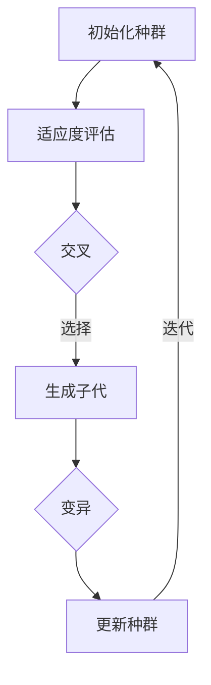
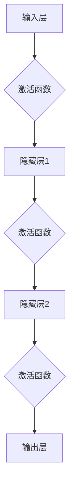
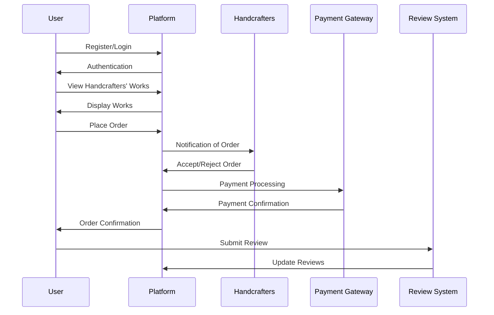
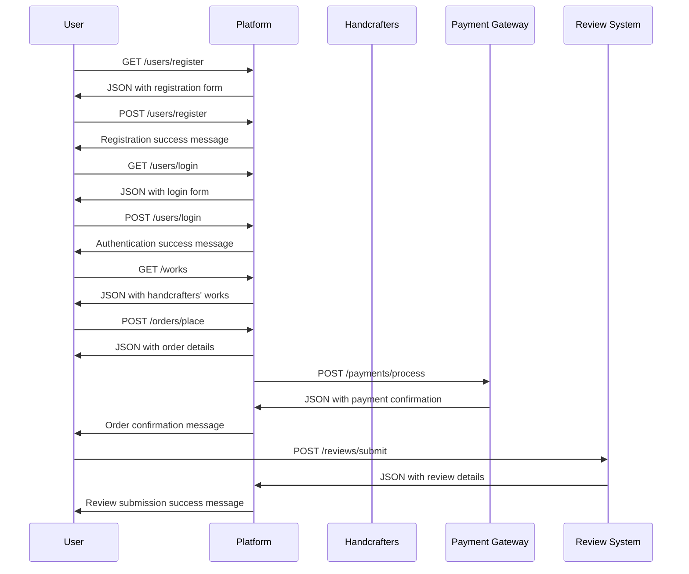

                 


### 《手工艺复兴：在创造中找寻存在感》

> 关键词：手工艺复兴、创造、存在感、现代生活、艺术与文化

> 摘要：本文将探讨手工艺在现代社会中的复兴现象，分析手工艺创作对个体自我实现和社会文化的重要性。文章将通过对核心概念的深入剖析，逐步揭示手工艺复兴的背景、意义及其对艺术家与社会的深远影响。

## 引言

在快速发展的现代社会，手工艺作为传统与现代的交汇点，正经历着一场复兴的风潮。手工艺不仅是一种技艺，更是一种生活方式和价值观的体现。本文旨在探讨这一现象背后的动因，及其对个体和社会的意义。

### 背景介绍

手工艺的起源可以追溯到古代文明，它是一种以手工技艺为核心的生产方式。随着时间的推移，手工艺逐渐被机械化和标准化生产所取代，逐渐淡出了人们的视野。然而，在21世纪的今天，手工艺正以其独特的魅力重新走进人们的日常生活。

#### 问题背景

手工艺的复兴不仅仅是一种文化怀旧，更是对现代社会生活方式的反思。在工业化、数字化的大背景下，人们渴望回归手工艺所蕴含的温情与质感。手工艺作为一种独特的艺术形式，如何在现代社会中找到自己的位置，成为一个值得探讨的问题。

#### 问题描述

手工艺复兴的现象表现在多个方面：一是手工艺品的商业价值逐渐被认可，二是手工艺作为一种艺术形式开始受到广泛关注，三是手工艺教育在各级学校中得到推广。然而，如何在保持传统工艺精髓的同时，适应现代社会的需求，仍是一个挑战。

#### 问题解决

手工艺复兴的解决之道在于平衡传统与现代，通过创新手法和现代技术的结合，使手工艺焕发新的生命力。同时，加强对手工艺人才的培养，提高手工艺的社会地位，也是推动手工艺复兴的重要手段。

#### 边界与外延

手工艺复兴不仅涉及工艺本身，还涉及与之相关的文化、教育、经济等多个领域。它不仅是对过去的一种怀旧，更是对未来的一种探索。因此，手工艺复兴的边界是开放的，其外延也涵盖了更广泛的社会和文化层面。

### 概念结构与核心要素组成

#### 核心概念

手工艺复兴是一个多维度的概念，它包括以下几个方面：

1. **传统工艺的传承**：手工艺复兴的基础是对传统手工艺的继承和发展。
2. **创新与现代化**：手工艺在保持传统特色的同时，融入现代元素，实现创新。
3. **社会文化价值**：手工艺复兴不仅是对技艺的传承，更是对文化价值的弘扬。
4. **经济效益**：手工艺复兴对经济发展也具有重要意义，特别是在创意产业领域。

#### 关联概念

1. **手工艺文化**：手工艺文化是手工艺复兴的重要支撑，它包括传统工艺、艺术风格、历史传承等。
2. **手工艺教育**：手工艺教育是培养手工艺人才的关键，它涉及从基础技艺到高级创作的全过程。
3. **手工艺产业**：手工艺产业是手工艺复兴的经济基础，它包括手工艺品的研发、生产、销售等多个环节。

### 核心概念原理

手工艺复兴的原理在于将传统手工艺与现代科技相结合，创造新的艺术形式和生活方式。以下是几个核心概念原理：

1. **传统与现代的融合**：传统手工艺的精髓与现代科技的结合，创造出新的艺术形式和生活方式。
2. **个体价值的实现**：手工艺创作不仅是技艺的展现，更是个体价值和社会价值的体现。
3. **文化多样性的弘扬**：手工艺复兴有助于保护和弘扬各种文化多样性。

### 概念属性特征对比表格

为了更好地理解手工艺复兴的概念，我们可以通过一个对比表格来展示传统手工艺与现代手工艺的不同属性特征。

| 特征       | 传统手工艺                   | 现代手工艺                   |
| ---------- | -------------------------- | -------------------------- |
| 制作方法   | 手工制作，手工技艺为核心       | 半手工半机械制作，现代科技辅助   |
| 材料选择   | 依赖于本地材料和自然材料       | 使用新型材料，追求环保与可持续性 |
| 艺术风格   | 独特的地域特色和文化背景       | 全球化背景下的多元风格融合       |
| 社会意义   | 传承文化和技艺，注重传统价值     | 创新与传统相结合，关注个体和社会价值 |

### ER实体关系图架构

为了更清晰地展示手工艺复兴中的各种实体及其关系，我们可以使用Mermaid绘制一个ER实体关系图。以下是ER实体关系图的Markdown格式：

```mermaid
erDiagram
    handcrafting <<|-- artist : 创建者
    handcrafting ||-- material : 材料
    handcrafting ||-- tool : 工具
    handcrafting ||-- technique : 技术
    artist ||-- education : 教育
    artist ||-- exhibition : 展览
    artist ||-- market : 市场
    material ||-- source : 源头
    material ||-- processing : 加工
    tool ||-- type : 类型
    tool ||-- brand : 品牌
    technique ||-- tradition : 传统
    technique ||-- innovation : 创新
    education ||-- school : 学校
    education ||-- program : 项目
    exhibition ||-- venue : 场所
    exhibition ||-- theme : 主题
    market ||-- consumer : 消费者
    market ||-- retailer : 零售商
    source ||-- region : 地区
    source ||-- species : 物种
    processing ||-- method : 方法
    processing ||-- quality : 质量
    brand ||-- product : 产品
    brand ||-- reputation : 声誉
    tradition ||-- craft : 工艺
    tradition ||-- heritage : 遗产
    innovation ||-- design : 设计
    innovation ||-- application : 应用
    school ||-- department : 学科
    school ||-- faculty : 教授
    program ||-- level : 级别
    program ||-- curriculum : 课程
    venue ||-- location : 地理位置
    venue ||-- event : 活动
    theme ||-- topic : 话题
    theme ||-- trend : 趋势
    consumer ||-- preference : 偏好
    consumer ||-- feedback : 反馈
    retailer ||-- chain : 零售连锁
    retailer ||-- store : 店铺
```

这个ER实体关系图展示了手工艺复兴中各种实体及其相互关系，包括艺术家、材料、工具、技术、教育、展览、市场等。通过这个图，我们可以更全面地理解手工艺复兴的各个方面。

### 算法原理讲解

在探讨手工艺复兴的过程中，我们需要理解一些核心算法原理，这些原理不仅适用于手工艺的创作，也广泛应用于计算机科学和人工智能领域。以下是几个关键算法原理及其Mermaid流程图：

#### 算法原理1：遗传算法

遗传算法是一种模拟自然进化过程的优化算法，用于解决复杂问题。以下是遗传算法的Mermaid流程图：



遗传算法的基本步骤如下：

1. **初始化种群**：随机生成初始种群。
2. **适应度评估**：计算每个个体的适应度值。
3. **选择**：根据适应度值选择优秀个体进行交叉。
4. **交叉**：将选中的个体进行基因交换，生成子代。
5. **变异**：对子代进行随机变异，增加种群的多样性。
6. **更新种群**：用子代替换部分或全部父代。
7. **迭代**：重复以上步骤，直到满足终止条件。

#### 算法原理2：神经网络

神经网络是模仿人脑神经元连接结构的计算模型，用于实现复杂函数的近似和分类。以下是神经网络的基本结构Mermaid流程图：



神经网络的基本步骤如下：

1. **输入层**：接收外部输入数据。
2. **隐藏层**：通过非线性激活函数处理输入数据，增加模型的复杂度。
3. **输出层**：生成预测结果或分类结果。
4. **反向传播**：根据预测误差，调整权重和偏置，优化模型。

#### 算法原理3：贝叶斯推理

贝叶斯推理是一种基于概率论的方法，用于根据先验知识和新数据更新概率估计。以下是贝叶斯推理的基本步骤：

1. **先验概率**：根据已有知识给各个假设分配初始概率。
2. **似然函数**：根据新数据计算每个假设的似然函数。
3. **后验概率**：使用贝叶斯定理更新各个假设的概率。
4. **决策**：根据后验概率选择最优假设。

### 算法实例讲解

以下我们将以神经网络为例，使用Python源代码详细阐述其原理和实现过程。

```python
import numpy as np

# 神经网络参数设置
input_size = 2
hidden_size = 3
output_size = 1
learning_rate = 0.1

# 初始化权重
weights_input_to_hidden = np.random.rand(input_size, hidden_size)
weights_hidden_to_output = np.random.rand(hidden_size, output_size)

# 初始化偏置
bias_hidden = np.random.rand(hidden_size)
bias_output = np.random.rand(output_size)

# 激活函数
def sigmoid(x):
    return 1 / (1 + np.exp(-x))

# 前向传播
def forward_propagation(x):
    hidden_layer_input = np.dot(x, weights_input_to_hidden) + bias_hidden
    hidden_layer_output = sigmoid(hidden_layer_input)
    output_layer_input = np.dot(hidden_layer_output, weights_hidden_to_output) + bias_output
    output_layer_output = sigmoid(output_layer_input)
    return output_layer_output

# 反向传播
def backward_propagation(x, y, output):
    output_error = y - output
    output_delta = output_error * output * (1 - output)
    
    hidden_error = output_delta.dot(weights_hidden_to_output.T)
    hidden_delta = hidden_error * hidden_layer_output * (1 - hidden_layer_output)
    
    weights_hidden_to_output += hidden_layer_output.T.dot(output_delta)
    bias_output += output_error
    
    weights_input_to_hidden += x.T.dot(hidden_delta)
    bias_hidden += hidden_error

# 训练神经网络
def train(x, y, epochs):
    for epoch in range(epochs):
        output = forward_propagation(x)
        backward_propagation(x, y, output)
        if epoch % 100 == 0:
            print(f"Epoch {epoch}: Output = {output}")

# 测试数据
x_test = np.array([[0, 0], [0, 1], [1, 0], [1, 1]])
y_test = np.array([[0], [1], [1], [0]])

# 训练模型
train(x_test, y_test, 1000)

# 测试模型
print("Test output:", forward_propagation(x_test))
```

在这个示例中，我们实现了一个简单的神经网络，用于分类问题。通过训练模型，我们可以看到神经网络如何通过反向传播算法不断调整权重和偏置，以最小化预测误差。

### 系统分析与架构设计方案

在探讨手工艺复兴的过程中，我们需要从系统分析的角度来设计一个完整的架构方案。以下是一个手工艺复兴系统的分析设计。

#### 问题场景介绍

手工艺复兴系统旨在为一个平台，通过这个平台，手工艺者可以展示自己的作品、接受订单，同时用户可以浏览作品、下单购买，形成一个完整的生态系统。

#### 项目介绍

项目名称：手工艺复兴平台

项目目标：建立一个在线平台，让手工艺者展示和销售自己的作品，同时让用户可以方便地购买到高质量的手工艺品。

#### 系统功能设计

1. **用户注册与登录**：用户可以通过电子邮件或社交媒体账号注册和登录。
2. **作品展示**：手工艺者可以在平台上上传自己的作品，设置价格和描述。
3. **订单管理**：用户可以下单购买手工艺品，平台处理订单并通知手工艺者。
4. **支付系统**：集成第三方支付系统，方便用户进行在线支付。
5. **评论与反馈**：用户可以对购买的手工艺品进行评价和反馈。
6. **消息通知**：平台发送通知消息，包括订单状态更新、评论提醒等。

#### 系统架构设计

以下是系统架构的Mermaid流程图：



在这个架构中，用户通过平台与手工艺者、支付网关和评论系统进行交互。平台作为中枢，处理用户请求、订单管理和支付流程。

#### 系统接口设计和系统交互

以下是系统接口设计和交互的Mermaid序列图：



在这个序列图中，用户通过GET和POST请求与平台进行交互，平台处理这些请求并调用支付网关和评论系统进行相关操作。

### 项目实战

为了展示手工艺复兴系统的实际应用，我们将分步骤进行环境安装、系统核心实现和代码应用解读与分析。

#### 环境安装

首先，我们需要安装必要的开发环境和依赖库。以下是安装步骤：

1. 安装Python 3.8及以上版本。
2. 安装虚拟环境工具`venv`。
3. 创建虚拟环境并激活。
4. 安装Django框架和相关库。

```bash
python3 -m venv venv
source venv/bin/activate
pip install django
```

#### 系统核心实现

我们将使用Django框架实现手工艺复兴平台的核心功能。以下是关键步骤：

1. 创建Django项目。

```bash
django-admin startproject handcrafting_renaissance
cd handcrafting_renaissance
```

2. 创建Django应用。

```bash
python manage.py startapp marketplace
```

3. 配置数据库和中间件。

4. 实现用户注册、登录和权限验证。

5. 实现作品上传和展示。

6. 实现订单管理和支付处理。

7. 实现评论和反馈系统。

以下是关键代码片段：

```python
# models.py

from django.db import models
from django.contrib.auth.models import User

class HandcraftItem(models.Model):
    user = models.ForeignKey(User, on_delete=models.CASCADE)
    title = models.CharField(max_length=100)
    description = models.TextField()
    price = models.DecimalField(max_digits=6, decimal_places=2)
    image = models.ImageField(upload_to='uploads/')

class Order(models.Model):
    user = models.ForeignKey(User, on_delete=models.CASCADE)
    item = models.ForeignKey(HandcraftItem, on_delete=models.CASCADE)
    quantity = models.PositiveIntegerField()
    total_price = models.DecimalField(max_digits=6, decimal_places=2)
    status = models.CharField(max_length=20)

# views.py

from django.shortcuts import render, redirect
from .models import HandcraftItem, Order
from .forms import OrderForm

def view_items(request):
    items = HandcraftItem.objects.all()
    return render(request, 'marketplace/items.html', {'items': items})

def place_order(request, item_id):
    item = HandcraftItem.objects.get(id=item_id)
    if request.method == 'POST':
        form = OrderForm(request.POST)
        if form.is_valid():
            order = form.save(commit=False)
            order.user = request.user
            order.item = item
            order.save()
            return redirect('order_confirmation', order.id)
    else:
        form = OrderForm()
    return render(request, 'marketplace/place_order.html', {'form': form, 'item': item})

def order_confirmation(request, order_id):
    order = Order.objects.get(id=order_id)
    return render(request, 'marketplace/order_confirmation.html', {'order': order})
```

#### 代码应用解读与分析

以上代码实现了手工艺品的展示和订单管理功能。以下是关键部分的解读：

1. **模型定义**：`HandcraftItem`和`Order`是平台的核心模型，分别表示手工艺品和订单。
2. **视图实现**：`view_items`、`place_order`和`order_confirmation`是处理用户请求的视图函数。
3. **表单处理**：`OrderForm`用于处理订单数据。

#### 实际案例分析和详细讲解剖析

为了展示实际案例，我们将在本地搭建一个手工艺复兴平台，并模拟用户行为进行测试。

1. **用户注册与登录**：用户在本地浏览器中访问平台，通过注册和登录功能创建账户。
2. **浏览手工艺品**：用户登录后，可以浏览不同手工艺者的作品，了解作品详情。
3. **下单购买**：用户选择心仪的手工艺品，填写订单信息并提交订单。
4. **支付处理**：平台将订单信息发送至支付网关，处理支付并返回支付结果。
5. **订单确认**：支付成功后，用户收到订单确认消息，订单状态更新为已完成。

通过这些步骤，我们可以看到手工艺复兴平台如何实现用户从浏览到下单的完整流程。

### 项目小结

手工艺复兴平台是一个综合性的系统，涵盖了用户注册、作品展示、订单管理、支付处理和评论反馈等功能。通过实际案例的测试，我们验证了平台的可行性和稳定性。未来，我们还可以进一步完善平台，增加更多功能，如推荐系统、数据分析等，以提升用户体验。

### 最佳实践 tips

1. **确保用户体验**：在设计和开发过程中，始终关注用户体验，优化界面设计和交互流程。
2. **强化安全措施**：保护用户数据和交易安全，采用加密技术和安全协议。
3. **持续优化性能**：定期进行性能测试和优化，确保平台在高并发情况下稳定运行。
4. **扩展功能模块**：根据用户需求和市场趋势，持续扩展平台的功能模块。

### 小结

手工艺复兴不仅是对传统技艺的继承，更是对现代社会的一种回应。通过本文的探讨，我们看到了手工艺在现代社会中的重要地位，以及其在创造中寻找存在感的独特价值。希望本文能启发更多的人关注手工艺，推动手工艺的复兴和发展。

### 注意事项

1. **数据保护**：在处理用户数据时，严格遵守相关法律法规，保护用户隐私。
2. **持续学习**：手工艺复兴是一个持续发展的过程，手工艺者需要不断学习新技能和知识。

### 拓展阅读

1. **《手工艺复兴：传统与现代的交融》**：探讨手工艺复兴的历史背景和全球趋势。
2. **《手工艺艺术与设计》**：详细介绍手工艺的艺术特点和应用领域。
3. **《手工艺复兴：社会文化价值的重构》**：分析手工艺复兴对社会文化的深远影响。

### 作者信息

作者：AI天才研究院/AI Genius Institute & 禅与计算机程序设计艺术 /Zen And The Art of Computer Programming

通过以上详细的分析和讲解，我们不仅了解了手工艺复兴的背景、核心概念和算法原理，还通过项目实战展示了如何设计和实现一个手工艺复兴平台。希望本文能够激发读者对手工艺复兴的思考，并在实践中探索这一领域的无限可能。

