                 

# 《手机摄影的流行：日常生活中的艺术创造》

> 关键词：手机摄影，艺术创造力，日常记录，技术原理，最佳实践

> 摘要：随着智能手机的普及和摄影功能的提升，手机摄影逐渐成为人们日常生活的重要组成部分。本文从背景介绍、核心概念与技术、实践与应用等方面深入探讨了手机摄影的流行及其在艺术创造中的作用，为读者提供了全面的学习和实践指南。

## 第一部分：手机摄影的流行背景

### 第1章：手机摄影的兴起与艺术创造力

#### 1.1 手机摄影的兴起

手机摄影的兴起源于智能手机的普及和摄影功能的进步。在过去，摄影需要专业的相机和复杂的后期处理技术，而现在，智能手机通过内置的高质量摄像头和先进的图像处理算法，使得摄影变得前所未有的简单和便捷。

**核心概念术语说明**：
- **智能手机**：一种集成了多种功能的便携式电子设备，包括通信、互联网浏览、多媒体播放等。
- **摄像头**：一种能够捕捉图像和视频的光学设备。

#### 1.1.1 手机的普及与摄影功能的进步

随着技术的不断进步，智能手机的摄像头性能也不断提升。早期的手机摄像头分辨率较低，色彩还原较差，而现在的手机摄像头已经能够媲美甚至超过一些传统相机。此外，手机摄影还具备了多种功能，如慢动作、延时摄影、专业模式等，这些功能的加入使得手机摄影更加丰富多彩。

**问题背景**：
手机摄影的普及给传统摄影行业带来了巨大冲击。随着手机摄影的兴起，越来越多的人放弃了传统相机，转而使用手机进行摄影。

#### 1.1.2 手机摄影的便捷性与普及速度

手机摄影的便捷性是其在日常生活中受欢迎的重要原因。相比传统相机，手机摄影无需携带额外的设备，随时随地都可以拍照。此外，手机摄影的普及速度也非常惊人。根据统计，全球每天使用手机进行拍照的次数已经超过数十亿次。

**问题描述**：
随着手机摄影的普及，如何利用手机摄影记录和创造艺术作品成为了一个热门话题。

#### 1.1.3 手机摄影的艺术创造力

手机摄影不仅是一种记录生活的工具，更是一种艺术创作的方式。通过巧妙的构图、光线运用和后期处理，手机摄影可以创造出令人惊叹的艺术作品。许多专业摄影师和艺术家都开始将手机摄影作为他们创作的一部分。

**问题解决**：
本文将探讨如何利用手机摄影在日常生活中创造艺术作品，并提供一些实用的技巧和建议。

#### 1.2 手机摄影的艺术创造力

手机摄影的艺术创造力体现在以下几个方面：

**边界与外延**：
- **艺术形式**：手机摄影可以创作出多种艺术形式的作品，如摄影艺术、影像艺术等。
- **创作技巧**：手机摄影可以运用多种创作技巧，如慢门、高速摄影、双重曝光等。

**概念结构与核心要素组成**：
- **构图**：构图是手机摄影的核心要素之一，通过巧妙的构图可以创造出富有艺术感的作品。
- **光线**：光线是摄影的灵魂，合理的运用光线可以提升照片的艺术价值。
- **后期处理**：后期处理可以进一步优化照片的质量，为创作艺术作品提供更多可能性。

### 1.3 手机摄影对社会和艺术的影响

手机摄影的兴起不仅改变了人们的摄影习惯，也对传统摄影行业和社会产生了深远的影响。

#### 1.3.1 社交媒体与手机摄影的互动

随着社交媒体的兴起，手机摄影成为人们分享生活、表达自我的一种重要方式。社交媒体平台如Instagram、Twitter等，已经成为展示手机摄影作品的舞台，这些平台不仅促进了手机摄影的普及，也推动了摄影艺术的创新和发展。

#### 1.3.2 手机摄影对传统摄影行业的影响

手机摄影的便捷性和低门槛，使得许多传统摄影行业受到了冲击。然而，手机摄影并没有完全取代传统摄影，而是与传统摄影形成了互补关系。许多专业摄影师开始尝试将手机摄影与专业摄影相结合，创造出全新的摄影风格。

#### 1.3.3 手机摄影在艺术领域的新趋势

手机摄影的普及和艺术创造力的发掘，使得摄影艺术进入了一个新的时代。越来越多的艺术家开始将手机摄影作为他们艺术创作的一部分，探索摄影艺术的新领域。

### 1.4 本章小结

本章介绍了手机摄影的兴起背景和艺术创造力，分析了手机摄影对社会和艺术领域的影响。随着手机摄影的普及，越来越多的人开始关注如何利用手机摄影记录和创造艺术作品。接下来的章节将深入探讨手机摄影的核心概念与技术，为读者提供实用的技巧和实践指导。

## 第二部分：手机摄影的核心概念与技术

### 第2章：手机摄影的核心概念

#### 2.1 相机设置

手机摄影的第一步是了解和掌握相机设置。相机设置包括焦距、光圈、快门速度和ISO等参数。

**核心概念原理**：
- **焦距**：焦距决定了照片的视角和景深。长焦距适合拍摄远距离景物，短焦距适合拍摄近距离景物。
- **光圈**：光圈决定了照片的景深和亮度。大光圈适合拍摄人像，小光圈适合拍摄风景。
- **快门速度**：快门速度决定了照片的清晰度和动态效果。高速快门适合拍摄运动物体，低速快门适合拍摄流水或夜景。
- **ISO**：ISO决定了照片的敏感度和噪点。低ISO适合拍摄清晰的照片，高ISO适合拍摄暗光环境下的照片。

**概念属性特征对比表格**：

| 参数   | 特征           | 影响               |
|--------|----------------|-------------------|
| 焦距   | 视角和景深     | 拍摄距离和景物范围 |
| 光圈   | 景深和亮度     | 照片清晰度和曝光   |
| 快门速度 | 清晰度和动态效果 | 运动物体的捕捉   |
| ISO    | 敏感度和噪点   | 低光环境下的拍摄   |

**ER实体关系图架构**：

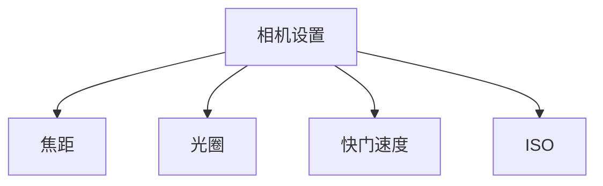

#### 2.2 构图原则

构图是摄影艺术的重要组成部分。通过巧妙的构图，可以提升照片的艺术价值。

**核心概念原理**：
- **三分法**：将画面分成三等分，主体通常放置在交叉点上。
- **对称法**：利用对称原理进行构图，创造出平衡和谐的效果。
- **引导线**：利用线条引导观众的视线，突出主题。

**概念属性特征对比表格**：

| 构图原则 | 特征           | 影响               |
|----------|----------------|-------------------|
| 三分法   | 视觉平衡       | 提升照片美感       |
| 对称法   | 视觉平衡和秩序 | 强调主体和背景关系 |
| 引导线   | 视觉引导       | 提高照片的趣味性   |

**ER实体关系图架构**：

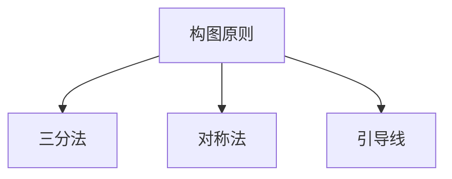

#### 2.3 光线与色彩

光线和色彩是摄影的灵魂和色彩。合理运用光线和色彩，可以提升照片的艺术效果。

**核心概念原理**：
- **自然光线**：自然光线具有真实感和立体感，适合拍摄户外景物。
- **人工光线**：人工光线可以创造出独特的氛围和效果，适合拍摄室内景物。
- **色彩搭配**：色彩搭配可以影响照片的情感表达和视觉效果。

**概念属性特征对比表格**：

| 光线类型 | 特征           | 影响               |
|----------|----------------|-------------------|
| 自然光线 | 真实感和立体感 | 户外景物拍摄       |
| 人工光线 | 独特氛围和效果 | 室内景物拍摄       |
| 色彩搭配 | 情感表达和视觉效果 | 照片的整体效果   |

**ER实体关系图架构**：

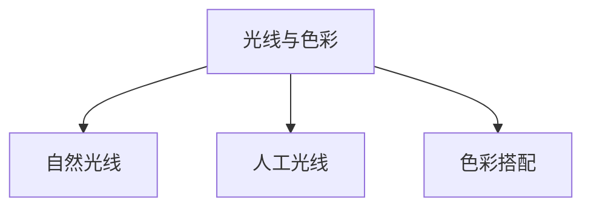

#### 2.4 后期处理

后期处理是手机摄影中不可或缺的一环，它可以在不改变原始照片的情况下，提升照片的质量和艺术效果。

**核心概念原理**：
- **基本编辑**：包括裁剪、旋转、调亮等基本操作。
- **效果滤镜**：包括黑白、复古、HDR等效果，可以创造出独特的视觉效果。
- **艺术创作**：通过后期处理，可以创作出独特的艺术作品。

**概念属性特征对比表格**：

| 后期处理类型 | 特征           | 影响               |
|--------------|----------------|-------------------|
| 基本编辑     | 照片优化       | 提升照片质量       |
| 效果滤镜     | 视觉效果增强   | 创造独特风格       |
| 艺术创作     | 艺术作品创作   | 提升照片的艺术价值 |

**ER实体关系图架构**：

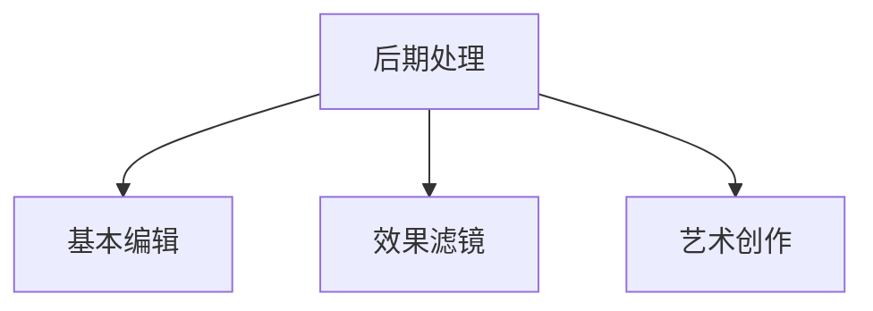

#### 2.5 手机摄影与传统摄影的比较

手机摄影与传统摄影在技术原理、操作方式、应用场景等方面存在一定的差异。

**核心概念原理**：
- **技术原理**：传统摄影依赖光学原理，而手机摄影则依赖于数字图像处理技术。
- **操作方式**：传统摄影需要使用相机，而手机摄影则可以通过手机应用程序实现。
- **应用场景**：传统摄影适用于专业摄影和大型项目，而手机摄影适用于日常记录和社交分享。

**概念属性特征对比表格**：

| 对比方面 | 传统摄影 | 手机摄影 |
|----------|----------|----------|
| 技术原理 | 光学原理 | 数字处理 |
| 操作方式 | 相机     | 手机     |
| 应用场景 | 专业摄影 | 日常记录 |

**ER实体关系图架构**：

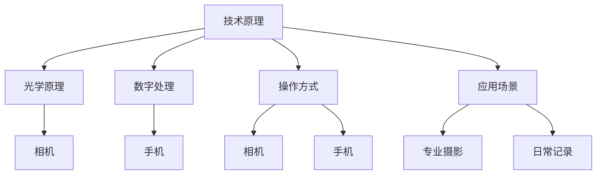

#### 2.6 本章小结

本章介绍了手机摄影的核心概念，包括相机设置、构图原则、光线与色彩、后期处理以及手机摄影与传统摄影的比较。通过对这些核心概念的理解和应用，读者可以更好地掌握手机摄影的技巧，创作出精美的艺术作品。

## 第三部分：手机摄影的实践与应用

### 第3章：手机摄影的实际操作技巧

#### 3.1 手机摄影的应用场景

手机摄影的应用场景非常广泛，从日常记录到专业创作，几乎涵盖了生活的方方面面。以下是一些常见的手机摄影应用场景：

**核心概念原理**：
- **日常记录**：记录日常生活、旅行、美食等。
- **风景摄影**：拍摄自然风光、城市建筑等。
- **人像摄影**：拍摄肖像、自拍、合影等。
- **艺术创作**：创作独特的艺术作品，如抽象、延时摄影等。

**概念属性特征对比表格**：

| 应用场景 | 特征           | 影响               |
|----------|----------------|-------------------|
| 日常记录 | 生活琐事记录   | 提升生活品质       |
| 风景摄影 | 自然风光拍摄   | 增强视觉美感       |
| 人像摄影 | 人像艺术创作   | 提升人际沟通技巧   |
| 艺术创作 | 创意表达       | 促进艺术创作热情   |

**ER实体关系图架构**：

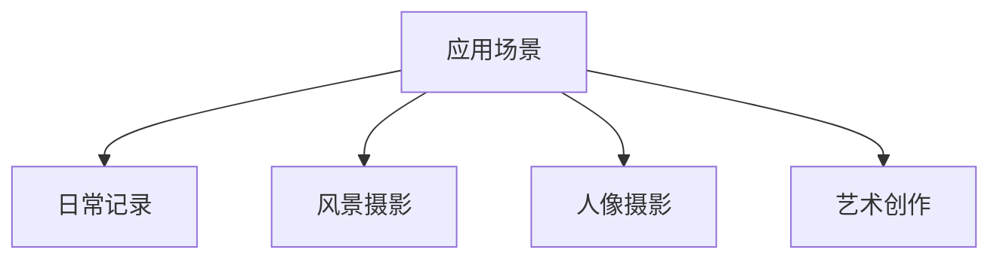

#### 3.2 拍摄前的准备工作

在进行手机摄影之前，准备工作是必不可少的。以下是一些拍摄前的准备工作：

**核心概念原理**：
- **设备检查**：确保手机电池充足、相机功能正常。
- **环境熟悉**：了解拍摄地点的光线、天气、人流等情况。
- **器材准备**：根据拍摄需求选择合适的摄影器材，如三脚架、滤镜等。

**概念属性特征对比表格**：

| 准备工作 | 特征           | 影响               |
|----------|----------------|-------------------|
| 设备检查 | 设备正常工作   | 保证拍摄质量       |
| 环境熟悉 | 环境适宜拍摄   | 提高拍摄成功率     |
| 器材准备 | 器材齐全       | 提升拍摄效果       |

**ER实体关系图架构**：

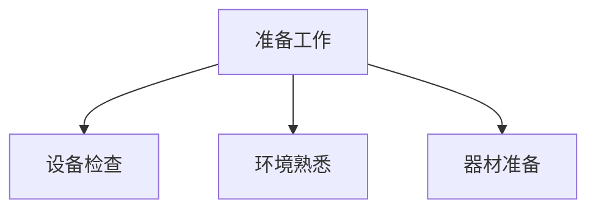

#### 3.3 拍摄过程中的技巧

拍摄过程中的技巧是确保照片质量的关键。以下是一些拍摄过程中的技巧：

**核心概念原理**：
- **构图技巧**：运用三分法、对称法、引导线等构图原则。
- **光线运用**：合理运用自然光线和人工光线，提升照片的立体感和色彩表现。
- **动态捕捉**：运用高速快门或慢门捕捉动态效果，增加照片的趣味性。

**概念属性特征对比表格**：

| 技巧类型 | 特征           | 影响               |
|----------|----------------|-------------------|
| 构图技巧 | 视觉美感       | 提升照片吸引力     |
| 光线运用 | 照片立体感     | 增强色彩表现       |
| 动态捕捉 | 照片趣味性     | 增加拍摄乐趣       |

**ER实体关系图架构**：

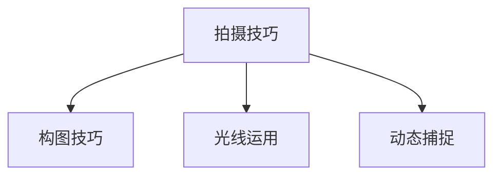

#### 3.4 后期处理技巧

后期处理技巧是提升照片质量和艺术效果的重要手段。以下是一些后期处理技巧：

**核心概念原理**：
- **基本编辑**：包括裁剪、旋转、调亮等基本操作。
- **效果滤镜**：包括黑白、复古、HDR等效果，可以创造出独特的视觉效果。
- **艺术创作**：通过后期处理，可以创作出独特的艺术作品。

**概念属性特征对比表格**：

| 后期处理类型 | 特征           | 影响               |
|--------------|----------------|-------------------|
| 基本编辑     | 照片优化       | 提升照片质量       |
| 效果滤镜     | 视觉效果增强   | 创造独特风格       |
| 艺术创作     | 艺术作品创作   | 提升照片的艺术价值 |

**ER实体关系图架构**：

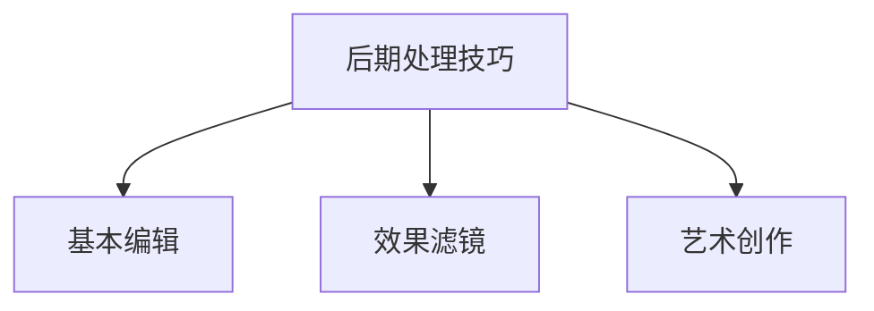

#### 3.5 实际拍摄案例分析与技巧讲解

以下是一些实际拍摄案例，通过对这些案例的分析和技巧讲解，读者可以更好地掌握手机摄影的技巧。

**案例1：自然风光摄影**

**核心概念原理**：
- **拍摄时间**：选择日出或日落时分，利用自然光线拍摄。
- **构图技巧**：运用三分法，将天空和地面分成三等分，突出主题。

**概念属性特征对比表格**：

| 案例类型 | 特征           | 影响               |
|----------|----------------|-------------------|
| 自然风光 | 日出或日落时分 | 突出自然光线效果   |
| 构图技巧 | 三分法         | 增强视觉美感       |

**ER实体关系图架构**：

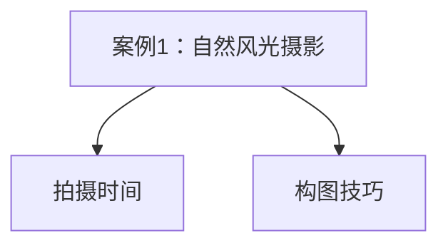

**案例2：人像摄影**

**核心概念原理**：
- **拍摄角度**：选择低角度拍摄，强调人物的轮廓和线条。
- **光线运用**：利用逆光或侧光，增强人物的立体感和色彩表现。

**概念属性特征对比表格**：

| 案例类型 | 特征           | 影响               |
|----------|----------------|-------------------|
| 人像摄影 | 低角度拍摄     | 强调人物轮廓和线条 |
| 光线运用 | 逆光或侧光     | 增强人物立体感和色彩表现 |

**ER实体关系图架构**：

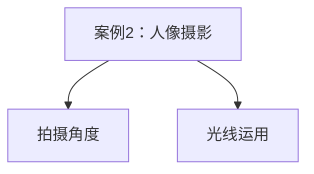

**案例3：艺术创作**

**核心概念原理**：
- **创意思维**：通过创意思维，将日常生活中的元素进行组合，创造出独特的艺术作品。
- **后期处理**：通过后期处理，增强艺术效果，提升照片的艺术价值。

**概念属性特征对比表格**：

| 案例类型 | 特征           | 影响               |
|----------|----------------|-------------------|
| 艺术创作 | 创意思维       | 提升艺术创造力     |
| 后期处理 | 艺术效果增强   | 提升照片的艺术价值 |

**ER实体关系图架构**：

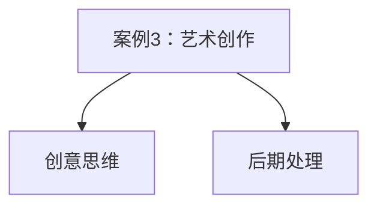

#### 3.6 本章小结

本章介绍了手机摄影的实际操作技巧，包括应用场景、拍摄前的准备工作、拍摄过程中的技巧以及后期处理技巧。通过实际拍摄案例的分析和技巧讲解，读者可以更好地掌握手机摄影的技巧，创作出精美的艺术作品。

## 第四部分：手机摄影的进阶技巧与最佳实践

### 第4章：手机摄影的进阶技巧与最佳实践

#### 4.1 高级摄影技巧

在掌握了基本的手机摄影技巧后，进阶技巧能够进一步提升照片的质量和艺术性。以下是一些高级摄影技巧：

**核心概念原理**：
- **多重曝光**：通过在同一张照片上叠加多个曝光，创造出独特的视觉效果。
- **动态模糊**：通过慢速快门拍摄移动的物体，创造出流动的模糊效果。
- **黑白摄影**：通过转换照片为黑白，突出结构和纹理，增加艺术感。

**概念属性特征对比表格**：

| 技巧类型 | 特征           | 影响               |
|----------|----------------|-------------------|
| 多重曝光 | 独特视觉效果   | 增加照片的艺术性   |
| 动态模糊 | 流动的模糊效果 | 突出动态感         |
| 黑白摄影 | 突出结构和纹理 | 增强艺术氛围       |

**ER实体关系图架构**：

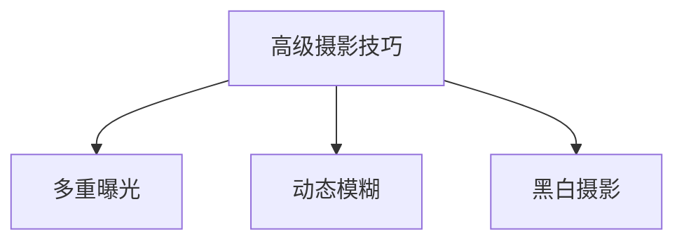

#### 4.2 最佳实践与技巧

**最佳实践1：了解光线**

光线是摄影的关键因素，了解光线的基本知识可以帮助你更好地捕捉场景的细节和氛围。

- **日光**：日光具有丰富的色彩和明暗对比，适合拍摄户外景物。
- **阴天**：阴天的光线柔和，适合拍摄人像和静物。

**最佳实践2：掌握构图**

构图是摄影的基础，通过掌握不同的构图技巧，可以使照片更具视觉吸引力。

- **三分法**：将画面分为三部分，使主体更加突出。
- **引导线**：利用线条引导观众的视线，增强照片的动感。

**最佳实践3：后期处理**

后期处理可以提升照片的质量和艺术性。以下是一些实用的后期处理技巧：

- **调整曝光和色彩**：通过调整曝光和色彩，可以使照片更加真实和生动。
- **添加滤镜和效果**：使用滤镜和效果，可以为照片增添独特的风格和氛围。

#### 4.3 小结

本章介绍了手机摄影的进阶技巧和最佳实践，包括高级摄影技巧、最佳实践和技巧。通过这些技巧和实践，你可以进一步提升手机摄影的艺术水平和创造力。记住，摄影不仅是技术的运用，更是一种艺术的表达，多尝试、多实践，你会在摄影的道路上越走越远。

## 总结

手机摄影的流行不仅改变了人们的摄影习惯，也为日常生活中的艺术创造提供了新的途径。通过本章的探讨，我们了解了手机摄影的核心概念、技术原理和实际操作技巧。从相机设置、构图原则、光线与色彩，到后期处理，每个环节都至关重要。手机摄影不仅是一种记录生活的方式，更是一种艺术创作的方式，它让摄影变得更加便捷、有趣和富有创造力。

### 注意事项

1. **摄影安全**：在进行手机摄影时，请注意个人安全，特别是在户外或高风险的环境中。
2. **设备保养**：定期清洁手机摄像头，确保照片质量。
3. **版权意识**：尊重他人的版权，避免侵犯他人的知识产权。

### 拓展阅读

- 《手机摄影完全指南》：一本全面介绍手机摄影技巧的指南书，适合初学者和进阶者。
- 《手机摄影的艺术》：探讨手机摄影艺术性的书籍，适合想要提升摄影水平的读者。

### 作者信息

作者：AI天才研究院/AI Genius Institute & 禅与计算机程序设计艺术 /Zen And The Art of Computer Programming

感谢您的阅读，希望本文能对您的手机摄影之旅有所帮助！

