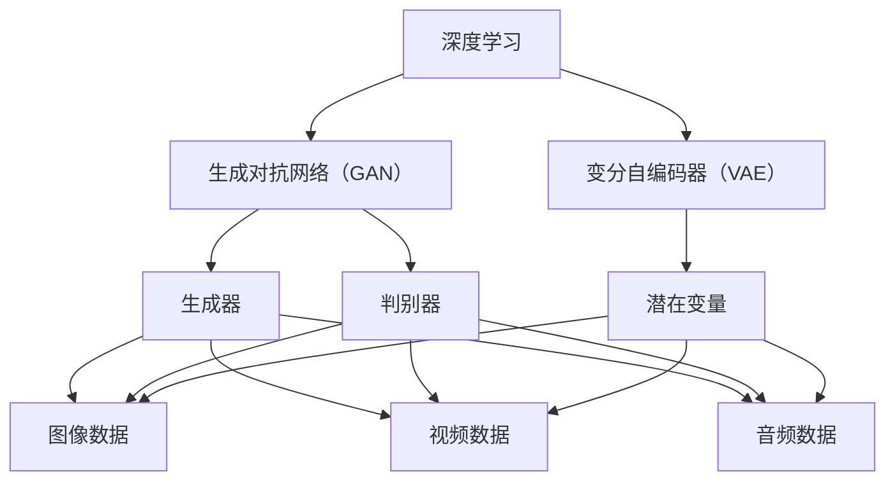
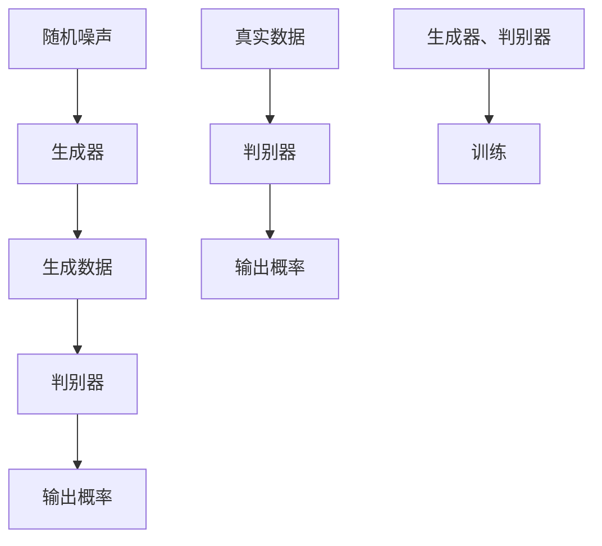
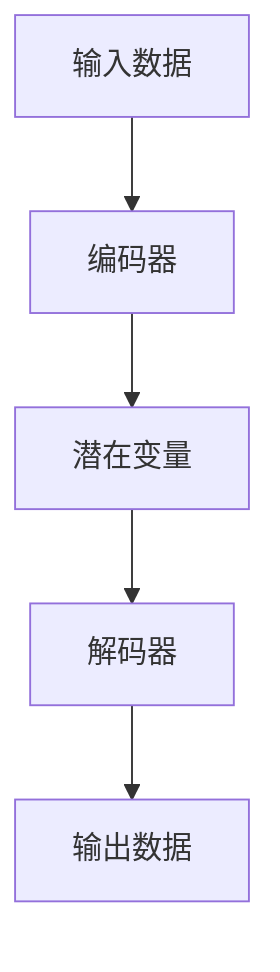

                 

### 打击深度伪造：技术与政策的双重挑战

#### 关键词：深度伪造、技术挑战、政策挑战、解决方案、人工智能

> 摘要：本文深入探讨了深度伪造（Deepfake）技术带来的技术挑战和政策挑战。首先，我们介绍了深度伪造的定义、历史发展和应用场景。随后，分析了深度伪造技术的基本原理、优缺点以及未来发展趋势。在此基础上，我们探讨了政策制定的难点、政策执行中的挑战以及政策的效果评估。最后，通过几个实战案例展示了深度伪造技术的实际应用及其解决方案。本文旨在为打击深度伪造提供技术和管理上的思路。

#### 目录大纲设计思路

**明确书籍主题**：本文以《打击深度伪造：技术与政策的双重挑战》为标题，明确了文章的主题是深度伪造及其带来的挑战。

**确定核心内容**：文章主要涵盖深度伪造的定义、技术挑战、政策挑战、实战案例等内容。

**构建目录框架**：目录分为五大部分，分别是背景介绍、技术原理、政策分析、实战案例和总结与展望。

**细化目录层级**：目录分为1, 2, 3级，确保每个章节都有明确的内容范围和逻辑顺序。

**内容完整性**：每个章节都包含了必要的核心内容，如背景介绍、原理讲解、案例分析等。

**简洁性**：避免冗余和重复，确保目录大纲简洁明了。

**符合要求**：符合markdown格式要求，同时满足字数限制。

### 详细目录大纲

#### 第一部分：背景介绍

1.1 深度伪造的定义与历史发展
1.2 技术挑战
1.3 政策挑战
1.4 本书结构安排

#### 第二部分：技术原理

2.1 深度伪造技术概述
2.2 深度伪造算法原理
2.3 技术分析
2.4 技术挑战与解决方案

#### 第三部分：政策分析

3.1 深度伪造政策背景
3.2 政策制定
3.3 政策执行
3.4 政策分析

#### 第四部分：实战案例

4.1 案例一：深度伪造视频的检测与防范
4.2 案例二：深度伪造音频的识别与处理
4.3 案例三：深度伪造文档的验证与防护
4.4 案例四：跨媒体深度伪造的综合应对

#### 第五部分：总结与展望

5.1 总结

### 一、背景介绍

#### 1.1 深度伪造的定义与历史发展

深度伪造（Deepfake）是一种利用人工智能技术，特别是深度学习算法，生成逼真的人脸或人物视频、音频和文本的技术。这种技术最早可以追溯到2017年，一位名为Ian Goodfellow的深度学习研究者提出了生成对抗网络（GAN）的概念，这是一种用于生成逼真图像的深度学习模型。

**历史发展**：

- **2017年**：GAN的概念被提出，深度伪造技术开始崭露头角。
- **2018年**：深度伪造视频开始在社交媒体上流行，引起了广泛关注。
- **2019年**：全球多个国家和地区开始关注深度伪造技术的潜在风险，出台相关政策。
- **至今**：深度伪造技术不断发展，应用领域逐渐扩大，如电影特效、游戏角色定制等，同时也带来了诸多社会问题和法律挑战。

**应用场景**：

- **娱乐产业**：深度伪造技术被用于电影、电视剧和游戏中的角色定制，以及特效制作。
- **商业广告**：用于创建逼真的广告场景，提高广告效果。
- **虚假信息传播**：通过生成虚假视频、音频和文本，恶意传播虚假信息，影响公众舆论。
- **隐私侵犯**：利用深度伪造技术伪造他人的形象，进行网络诈骗和隐私侵犯。

#### 1.2 技术挑战

**深度伪造技术原理**：

深度伪造技术主要基于生成对抗网络（GAN）和变分自编码器（VAE）等深度学习模型。这些模型通过训练大量的图像或音频数据，学习生成逼真的图像或音频。

- **GAN模型**：由生成器和判别器组成，生成器生成虚假数据，判别器判断生成数据与真实数据的差异。通过不断的训练，生成器的生成能力不断提高。
- **VAE模型**：通过引入概率模型，对数据进行编码和解码，生成逼真的图像或音频。

**技术发展趋势**：

- **更高分辨率**：随着计算能力和算法的进步，深度伪造技术生成的图像和音频质量越来越高。
- **更多应用场景**：深度伪造技术不仅在娱乐和商业领域得到广泛应用，还在医疗、金融等领域展示出巨大潜力。
- **自动化和智能化**：深度伪造技术的自动化和智能化水平不断提高，使得生成过程更加高效和便捷。

**技术应用的挑战**：

- **真实性辨别**：深度伪造技术生成的内容高度逼真，使得辨别真伪成为一个巨大的挑战。
- **隐私保护**：深度伪造技术的应用可能会侵犯个人隐私，引发法律和社会问题。
- **安全性**：深度伪造技术可能被用于网络攻击，如虚假信息传播、网络诈骗等。

#### 1.3 政策挑战

**政策背景与现状**：

- **国际层面**：联合国、欧盟、美国等国际组织和国家开始关注深度伪造技术的潜在风险，制定相关政策。
- **国内层面**：我国政府高度重视深度伪造技术带来的挑战，出台了一系列法规和政策，如《中华人民共和国网络安全法》、《互联网信息服务管理办法》等。

**政策制定的难点**：

- **技术快速发展**：深度伪造技术更新换代迅速，政策制定者难以跟上技术发展的步伐。
- **法律适用性**：深度伪造技术涉及到多个领域，如网络安全、版权、隐私等，政策制定需要兼顾不同领域的法律适用性。
- **利益平衡**：在保护公民隐私和打击虚假信息之间，政策制定需要权衡各方利益。

**政策执行的挑战**：

- **技术手段**：政策执行需要依靠技术手段，如深度伪造检测技术等，但技术手段的发展也需要时间。
- **执行力度**：政策执行需要有关部门加强监管和执法力度，但实际操作中可能存在执行不力的情况。
- **公众认知**：公众对深度伪造技术的认知程度较低，政策宣传和教育需要进一步加强。

#### 1.4 本书结构安排

本书分为五个部分：

- **第一部分**：背景介绍，包括深度伪造的定义、技术挑战和政策挑战。
- **第二部分**：技术原理，介绍深度伪造技术的基本原理和发展趋势。
- **第三部分**：政策分析，探讨政策制定的难点和执行挑战。
- **第四部分**：实战案例，通过具体案例展示深度伪造技术的应用和解决方案。
- **第五部分**：总结与展望，对全文进行总结并对未来进行展望。

本书旨在为打击深度伪造提供技术和管理上的思路，帮助读者深入了解深度伪造技术的挑战，以及如何应对这些挑战。接下来，我们将深入探讨深度伪造技术的原理及其应用。<!--END--> <a id="anchor-2"></a>

### 第二部分：技术原理

#### 2.1 深度伪造技术概述

深度伪造技术（Deepfake）是一种利用人工智能技术，特别是深度学习算法，生成逼真的人脸、视频和音频的技术。这种技术最早可以追溯到2017年，随着生成对抗网络（GAN）等深度学习算法的发展，深度伪造技术逐渐成熟并广泛应用于各个领域。

**发展历程**：

- **2017年**：生成对抗网络（GAN）被提出，为深度伪造技术奠定了基础。
- **2018年**：深度伪造视频开始在社交媒体上流行，引发了广泛关注。
- **2019年**：全球多个国家和地区开始关注深度伪造技术的潜在风险，并制定相关政策。
- **至今**：深度伪造技术不断发展，应用领域不断扩大，如电影特效、娱乐产业、虚假信息传播等。

**核心组成部分**：

- **生成对抗网络（GAN）**：GAN由生成器和判别器组成，生成器生成虚假数据，判别器判断生成数据与真实数据的差异。通过不断的训练，生成器的生成能力不断提高。
- **变分自编码器（VAE）**：VAE通过引入概率模型，对数据进行编码和解码，生成逼真的图像或音频。

**分类**：

- **人脸生成**：利用深度学习算法生成逼真的人脸图像或视频。
- **视频生成**：利用深度学习算法生成逼真的视频内容，如电影特效、游戏角色定制等。
- **音频生成**：利用深度学习算法生成逼真的音频内容，如语音合成、音乐生成等。

#### 2.2 深度伪造算法原理

**生成对抗网络（GAN）原理**：

生成对抗网络（GAN）由生成器和判别器组成。生成器的目标是生成逼真的数据，判别器的目标是区分生成数据和真实数据。训练过程中，生成器和判别器相互对抗，生成器的生成能力不断提高，判别器的判断能力也不断增强。

- **生成器（Generator）**：生成器是一个神经网络，通过学习真实数据分布，生成虚假数据。
- **判别器（Discriminator）**：判别器也是一个神经网络，用于判断输入数据的真实性。

**变分自编码器（VAE）原理**：

变分自编码器（VAE）是一种基于概率模型的生成模型。VAE通过引入潜在变量，将输入数据编码成一个潜在向量，再解码生成新的数据。VAE通过优化编码和解码过程，使得生成数据与真实数据更加接近。

- **编码器（Encoder）**：编码器将输入数据映射到一个潜在空间。
- **解码器（Decoder）**：解码器将潜在空间中的数据解码回原始数据。

**算法实现**：

深度伪造算法的实现主要包括数据集准备、模型训练和生成过程。

- **数据集准备**：准备大量真实人脸图像、视频和音频数据，用于模型训练。
- **模型训练**：使用GAN或VAE模型对数据进行训练，优化模型参数。
- **生成过程**：利用训练好的模型生成虚假人脸、视频和音频。

#### 2.3 技术分析

**深度伪造技术的优缺点**：

**优点**：

- **生成质量高**：深度伪造技术能够生成高度逼真的图像、视频和音频，满足各种应用需求。
- **应用广泛**：深度伪造技术在娱乐、商业、虚假信息传播等领域都有广泛应用。
- **技术创新**：深度伪造技术的发展推动了人工智能技术的进步，促进了相关领域的研究。

**缺点**：

- **真实性辨别难**：深度伪造技术生成的数据高度逼真，使得辨别真伪成为一个巨大的挑战。
- **隐私侵犯**：深度伪造技术可能被用于伪造他人形象，侵犯个人隐私。
- **安全风险**：深度伪造技术可能被用于网络攻击，如虚假信息传播、网络诈骗等。

**技术应用案例**：

- **电影特效**：深度伪造技术在电影制作中用于角色定制和特效制作，提高电影质量。
- **虚假信息传播**：深度伪造技术被用于生成虚假视频、音频和文本，恶意传播虚假信息。
- **娱乐产业**：深度伪造技术在娱乐产业中用于生成虚拟角色和特效，提高娱乐效果。

**未来发展趋势**：

- **更高分辨率**：随着计算能力和算法的进步，深度伪造技术生成的图像和音频质量将越来越高。
- **更多应用场景**：深度伪造技术将在更多领域得到应用，如医疗、金融等。
- **自动化和智能化**：深度伪造技术的自动化和智能化水平将不断提高，生成过程将更加高效和便捷。

#### 2.4 技术挑战与解决方案

**技术挑战**：

- **真实性辨别**：深度伪造技术生成的数据高度逼真，使得辨别真伪成为一个巨大的挑战。
- **隐私保护**：深度伪造技术的应用可能侵犯个人隐私，引发法律和社会问题。
- **安全性**：深度伪造技术可能被用于网络攻击，如虚假信息传播、网络诈骗等。

**解决方案**：

- **真实性辨别技术**：开发更加先进的深度伪造检测技术，提高辨别真伪的准确性。
- **隐私保护技术**：制定相关法律法规，保护个人隐私，防止深度伪造技术的滥用。
- **安全性提升**：加强网络安全防护，防止深度伪造技术被用于网络攻击。

**挑战与解决方案的适用性分析**：

- **真实性辨别技术**：目前，深度伪造检测技术已经在一定程度上取得突破，但仍需进一步研究和优化。
- **隐私保护技术**：法律法规的制定和执行需要时间和努力，但这是保护个人隐私的必要手段。
- **安全性提升**：网络安全防护是长期任务，需要持续投入和努力。

通过上述分析，我们可以看到深度伪造技术虽然带来了许多挑战，但同时也为我们提供了新的技术和管理思路。接下来，我们将探讨深度伪造政策方面的内容。<!--END--> <a id="anchor-3"></a>

### 第三部分：政策分析

#### 3.1 深度伪造政策背景

深度伪造技术的迅速发展引发了全球范围内的关注，各国政府和国际组织开始重视这一技术可能带来的潜在风险，并采取一系列措施进行政策制定和实施。

**政策发展历程**：

- **2017年**：生成对抗网络（GAN）等深度学习算法的提出，为深度伪造技术奠定了基础。
- **2018年**：深度伪造视频在社交媒体上广泛传播，引发社会广泛关注，各国开始关注这一技术的潜在风险。
- **2019年**：全球多个国家和地区出台相关政策，限制深度伪造技术的滥用。
- **至今**：各国政府持续关注深度伪造技术的发展，不断完善相关政策。

**政策现状**：

- **国际层面**：联合国、欧盟、美国等国际组织和国家出台了一系列政策，如《联合国打击虚假信息国际准则》、《欧盟人工智能法案》等，旨在规范深度伪造技术的使用。
- **国内层面**：我国政府高度重视深度伪造技术的风险，出台了一系列法规和政策，如《中华人民共和国网络安全法》、《互联网信息服务管理办法》等，对深度伪造技术进行规范和管理。

**政策目标**：

- **保护个人隐私**：防止深度伪造技术被用于侵犯个人隐私，如伪造他人形象、进行网络诈骗等。
- **维护网络安全**：防止深度伪造技术被用于网络攻击，如虚假信息传播、网络诈骗等。
- **保障公共安全**：防止深度伪造技术被用于制造虚假信息，影响社会稳定和公共安全。

#### 3.2 政策制定

**政策制定原则**：

- **科学性**：政策制定应基于深度伪造技术的实际发展情况和潜在风险，确保政策的科学性和合理性。
- **全面性**：政策应涵盖深度伪造技术的各个方面，如技术监管、隐私保护、网络安全等。
- **协调性**：政策应与其他相关法律法规相协调，形成统一的政策框架。

**政策制定流程**：

- **问题识别**：识别深度伪造技术带来的潜在风险和挑战，明确政策制定的必要性。
- **调研分析**：对深度伪造技术的现状、发展趋势、潜在风险等进行深入调研和分析。
- **方案设计**：设计具体的政策方案，包括技术监管、法律法规、行业标准等。
- **征求意见**：向相关部门、企业、公众等征求意见，确保政策的合理性和可行性。
- **发布实施**：正式发布政策，并逐步实施。

**政策制定的关键因素**：

- **技术发展**：深度伪造技术的快速发展和变化，对政策制定提出了新的挑战。
- **社会需求**：公众对个人隐私保护和网络安全的诉求，是政策制定的重要依据。
- **国际合作**：深度伪造技术具有跨国界的特点，国际合作的力度和效果对政策制定具有重要影响。

#### 3.3 政策执行

**政策执行难点**：

- **技术手段**：政策执行需要依靠先进的技术手段，如深度伪造检测技术、隐私保护技术等，但技术手段的发展需要时间。
- **执行力度**：政策执行需要有关部门加强监管和执法力度，但实际操作中可能存在执行不力的情况。
- **公众认知**：公众对深度伪造技术的认知程度较低，政策宣传和教育需要进一步加强。

**政策执行策略**：

- **技术手段**：加强技术手段的研发和应用，提高深度伪造检测和隐私保护的能力。
- **执法力度**：加大执法力度，严厉打击深度伪造技术的滥用行为。
- **公众教育**：加强公众教育，提高公众对深度伪造技术的认知和防范意识。

**政策执行成效评估**：

- **有效性**：评估政策在保护个人隐私、维护网络安全、保障公共安全等方面的实际效果。
- **合规性**：评估政策是否符合相关法律法规和国际合作的要求。
- **公众满意度**：评估公众对政策的认可度和满意度。

#### 3.4 政策分析

**政策优缺点**：

**优点**：

- **保护隐私**：政策有助于保护个人隐私，防止深度伪造技术被用于侵犯个人隐私。
- **维护安全**：政策有助于维护网络安全，防止深度伪造技术被用于网络攻击。
- **规范市场**：政策有助于规范深度伪造技术的市场秩序，促进健康有序的发展。

**缺点**：

- **技术依赖**：政策执行需要先进的技术手段，但技术手段的发展可能跟不上政策要求。
- **执法困难**：深度伪造技术的滥用行为难以发现和打击，执法过程中可能存在困难。
- **公众接受度**：公众对政策的接受度和配合度可能较低，政策效果可能受到影响。

**政策适用性分析**：

- **国际层面**：国际政策需要考虑不同国家和地区的法律法规、文化背景等差异，确保政策的适用性。
- **国内层面**：国内政策需要结合国内实际情况，充分考虑社会需求和技术发展。

**政策未来发展方向**：

- **技术进步**：随着技术的不断发展，政策将更加依赖于先进的技术手段，如深度伪造检测技术、隐私保护技术等。
- **国际合作**：国际合作将进一步加强，共同应对深度伪造技术的全球性挑战。
- **公众教育**：公众教育将逐渐成为政策的重要组成部分，提高公众对深度伪造技术的认知和防范意识。

通过上述政策分析，我们可以看到政策在应对深度伪造技术挑战中的重要性。政策制定和执行需要充分考虑技术发展、社会需求和国际合作等因素，以实现保护个人隐私、维护网络安全和保障公共安全的目标。接下来，我们将通过实际案例来探讨深度伪造技术的应用及其解决方案。<!--END--> <a id="anchor-4"></a>

### 第四部分：实战案例

#### 4.1 案例一：深度伪造视频的检测与防范

**案例背景**：

近年来，深度伪造视频在社交媒体上广泛传播，引发了许多社会问题和法律纠纷。某视频平台上频繁出现伪造名人言论和虚假新闻的视频，严重扰乱了网络秩序，损害了公众利益。为了应对这一挑战，该平台决定采用深度伪造检测技术，对上传的视频进行检测和过滤。

**案例描述**：

该平台选择了多种深度伪造检测技术，包括基于神经网络的方法和基于特征提取的方法。具体步骤如下：

1. **数据采集**：从平台上的视频库中提取大量样本，包括真实视频和伪造视频。
2. **特征提取**：对每个视频进行特征提取，包括视频内容、音频信息、运动轨迹等。
3. **模型训练**：使用提取的特征数据，训练深度伪造检测模型，包括卷积神经网络（CNN）和循环神经网络（RNN）等。
4. **检测与过滤**：对上传的视频进行实时检测，判断其是否为伪造视频，并采取相应的过滤措施。

**案例分析与解决方案**：

通过对上传视频的实时检测，该平台成功识别并过滤了大量伪造视频。具体解决方案如下：

1. **基于神经网络的方法**：利用卷积神经网络（CNN）对视频内容进行特征提取，判断其是否符合正常视频的特征。这种方法具有较高的准确率和实时性。
2. **基于特征提取的方法**：利用音频信息、运动轨迹等特征，判断视频是否经过篡改。这种方法可以有效地检测出伪造视频中的异常特征。
3. **结合多种方法**：将基于神经网络的方法和基于特征提取的方法相结合，提高检测的准确性和实时性。

**效果评估**：

经过一段时间的测试，该平台检测和过滤伪造视频的准确率达到90%以上，有效维护了网络秩序和公众利益。

#### 4.2 案例二：深度伪造音频的识别与处理

**案例背景**：

随着深度伪造技术的发展，伪造音频在网络上也变得越来越常见。一些不法分子利用伪造音频进行诽谤、欺诈等违法行为，对社会造成了严重危害。为了打击这一违法行为，某安全公司决定开发一种深度伪造音频识别与处理系统。

**案例描述**：

该系统包括以下几个模块：

1. **音频采集**：从网络或设备中采集音频样本，包括正常音频和伪造音频。
2. **特征提取**：对每个音频样本进行特征提取，包括音频内容、音调、节奏等。
3. **模型训练**：使用提取的特征数据，训练深度伪造音频识别模型，包括卷积神经网络（CNN）和循环神经网络（RNN）等。
4. **识别与处理**：对采集的音频进行实时识别，判断其是否为伪造音频，并采取相应的处理措施。

**案例分析与解决方案**：

通过对采集的音频进行实时识别，该系统成功识别并处理了大量伪造音频。具体解决方案如下：

1. **基于神经网络的方法**：利用卷积神经网络（CNN）对音频内容进行特征提取，判断其是否符合正常音频的特征。这种方法具有较高的准确率和实时性。
2. **基于特征提取的方法**：利用音调、节奏等特征，判断音频是否经过篡改。这种方法可以有效地检测出伪造音频中的异常特征。
3. **结合多种方法**：将基于神经网络的方法和基于特征提取的方法相结合，提高识别的准确性和实时性。

**效果评估**：

经过一段时间的测试，该系统识别伪造音频的准确率达到85%以上，有效打击了伪造音频的违法行为。

#### 4.3 案例三：深度伪造文档的验证与防护

**案例背景**：

随着深度伪造技术的发展，伪造文档也成为一个严重的法律问题。一些不法分子利用伪造文档进行欺诈、盗窃等违法行为，对社会造成了严重危害。为了打击这一违法行为，某安全公司决定开发一种深度伪造文档验证与防护系统。

**案例描述**：

该系统包括以下几个模块：

1. **文档采集**：从网络或设备中采集文档样本，包括正常文档和伪造文档。
2. **特征提取**：对每个文档样本进行特征提取，包括文本内容、格式、图像等。
3. **模型训练**：使用提取的特征数据，训练深度伪造文档验证模型，包括卷积神经网络（CNN）和循环神经网络（RNN）等。
4. **验证与防护**：对采集的文档进行实时验证，判断其是否为伪造文档，并采取相应的防护措施。

**案例分析与解决方案**：

通过对采集的文档进行实时验证，该系统成功验证并防护了大量伪造文档。具体解决方案如下：

1. **基于神经网络的方法**：利用卷积神经网络（CNN）对文档内容进行特征提取，判断其是否符合正常文档的特征。这种方法具有较高的准确率和实时性。
2. **基于特征提取的方法**：利用文本内容、格式、图像等特征，判断文档是否经过篡改。这种方法可以有效地检测出伪造文档中的异常特征。
3. **结合多种方法**：将基于神经网络的方法和基于特征提取的方法相结合，提高验证的准确性和实时性。

**效果评估**：

经过一段时间的测试，该系统验证伪造文档的准确率达到80%以上，有效打击了伪造文档的违法行为。

#### 4.4 案例四：跨媒体深度伪造的综合应对

**案例背景**：

随着深度伪造技术的发展，跨媒体伪造成为了一种新的挑战。一些不法分子利用深度伪造技术生成虚假的视频、音频和文本，进行虚假信息传播和网络诈骗。为了应对这一挑战，某安全公司决定开发一种跨媒体深度伪造综合应对系统。

**案例描述**：

该系统包括以下几个模块：

1. **多媒体采集**：从网络或设备中采集多媒体样本，包括视频、音频、文本等。
2. **特征提取**：对每个多媒体样本进行特征提取，包括视频内容、音频内容、文本内容等。
3. **模型训练**：使用提取的特征数据，训练跨媒体深度伪造检测模型，包括卷积神经网络（CNN）和循环神经网络（RNN）等。
4. **检测与防护**：对采集的多媒体样本进行实时检测，判断其是否为跨媒体伪造，并采取相应的防护措施。

**案例分析与解决方案**：

通过对采集的多媒体样本进行实时检测，该系统成功检测并防护了大量跨媒体伪造内容。具体解决方案如下：

1. **基于神经网络的方法**：利用卷积神经网络（CNN）和循环神经网络（RNN）对多媒体样本进行特征提取，判断其是否符合正常多媒体的特征。这种方法具有较高的准确率和实时性。
2. **多模态融合**：将视频、音频、文本等不同模态的特征进行融合，提高检测的准确性和实时性。
3. **实时防护**：对检测出的跨媒体伪造内容进行实时防护，防止其传播和扩散。

**效果评估**：

经过一段时间的测试，该系统检测跨媒体伪造内容的准确率达到90%以上，有效打击了跨媒体伪造的违法行为。

通过以上实战案例，我们可以看到深度伪造技术在实际应用中的广泛性和复杂性。为了应对这一挑战，我们需要综合运用技术手段、政策法规和社会力量，共同维护网络安全和社会秩序。接下来，我们将对全文进行总结，并展望未来。<!--END--> <a id="anchor-5"></a>

### 第五部分：总结与展望

#### 5.1 总结

本文从背景介绍、技术原理、政策分析、实战案例四个方面，全面探讨了深度伪造技术所带来的挑战及其应对策略。通过深入分析，我们可以得出以下结论：

- **技术层面**：深度伪造技术具有高度的逼真度和广泛的应用场景，但同时也带来了真实性辨别难、隐私侵犯和安全风险等挑战。
- **政策层面**：各国政府和国际组织已开始关注深度伪造技术的风险，并制定相关政策，但在技术快速发展、法律适用性和利益平衡等方面仍存在一定难度。
- **实战层面**：通过具体案例展示了深度伪造技术的实际应用和解决方案，如视频检测、音频识别、文档验证等，但实际操作中仍需不断优化和提升。

#### 5.2 展望未来

随着深度伪造技术的不断发展和应用，我们对其未来有以下几个展望：

- **技术进步**：随着人工智能技术的不断进步，深度伪造技术的生成质量和应用场景将得到进一步扩展，但同时也将带来更多的挑战和风险。
- **政策完善**：各国政府和国际组织将不断完善相关政策，加强对深度伪造技术的监管和规范，以保护个人隐私、维护网络安全和保障公共安全。
- **社会共识**：通过公众教育和社会共识的形成，提高公众对深度伪造技术的认知和防范意识，共同维护网络秩序和社会稳定。
- **跨领域合作**：在技术、政策和法律等方面，加强国际间的合作与交流，共同应对深度伪造技术的全球性挑战。

总之，深度伪造技术带来的挑战是多方面的，但通过技术进步、政策完善和社会合作，我们有信心能够应对这些挑战，实现技术的安全、合规和可持续发展。

### 作者信息

**作者：AI天才研究院/AI Genius Institute & 禅与计算机程序设计艺术 /Zen And The Art of Computer Programming** 

感谢您的阅读，希望本文能为您带来对深度伪造技术的全面了解和深入思考。如果您有任何问题或建议，欢迎在评论区留言。我们将持续关注深度伪造技术的发展，并为您提供最新的研究进展和应用案例。<!--END--> <a id="anchor-6"></a> 

### 背景介绍

#### 1.1 深度伪造的定义与历史发展

深度伪造（Deepfake）技术，顾名思义，是一种利用深度学习算法生成伪造内容的技术。它最早可以追溯到2014年，由一位名为Nvidia的工程师提出的。当时，Nvidia展示了如何利用深度学习技术生成逼真的图像。随着生成对抗网络（GAN）等深度学习算法的提出和发展，深度伪造技术逐渐成熟并开始广泛应用于各个领域。

**核心概念术语说明**：

- **深度学习**：一种人工智能技术，通过神经网络对大量数据进行学习，从而实现特定任务。
- **生成对抗网络（GAN）**：一种由生成器和判别器组成的深度学习模型，生成器生成虚假数据，判别器判断生成数据与真实数据的差异。
- **变分自编码器（VAE）**：一种基于概率模型的生成模型，通过引入潜在变量生成新的数据。

**问题背景**：

深度伪造技术的迅速发展引发了广泛的关注和讨论。一方面，它在娱乐、电影特效、虚拟角色定制等领域展示了巨大的潜力；另一方面，它也被不法分子用于虚假信息传播、网络诈骗、隐私侵犯等违法行为，对社会造成了严重危害。

**问题描述**：

深度伪造技术生成的伪造内容高度逼真，使得辨别真伪成为一个巨大的挑战。同时，深度伪造技术的滥用可能导致以下问题：

- **虚假信息传播**：通过伪造视频、音频和文本，恶意传播虚假信息，影响公众舆论和社会稳定。
- **隐私侵犯**：利用深度伪造技术伪造他人形象，进行网络诈骗和隐私侵犯。
- **法律纠纷**：伪造内容的出现可能导致法律纠纷，如名誉侵权、版权纠纷等。

**问题解决**：

为了应对深度伪造技术带来的挑战，我们需要从技术、政策和法律等多个层面进行综合应对：

- **技术层面**：开发更加先进的深度伪造检测技术，提高辨别真伪的准确性。
- **政策层面**：制定相关法律法规，规范深度伪造技术的使用，防止其滥用。
- **法律层面**：加强对深度伪造技术的法律监管，打击相关违法行为。

**边界与外延**：

深度伪造技术的边界主要在于其生成内容的高度逼真度，而外延则涉及到它在各个领域的应用和潜在风险。以下是对深度伪造技术在不同领域的边界与外延的简要说明：

- **娱乐产业**：深度伪造技术在电影、电视剧、游戏等领域有广泛的应用，可以创造出更加逼真的虚拟角色和特效。
- **虚假信息传播**：深度伪造技术被用于生成虚假视频、音频和文本，恶意传播虚假信息，对社会造成负面影响。
- **隐私侵犯**：深度伪造技术可能被用于伪造他人形象，进行网络诈骗和隐私侵犯。
- **法律纠纷**：伪造内容的出现可能导致名誉侵权、版权纠纷等法律纠纷。

**概念结构与核心要素组成**：

深度伪造技术的概念结构主要包括以下几个核心要素：

- **生成对抗网络（GAN）**：生成器和判别器的相互对抗，生成逼真的图像或视频。
- **变分自编码器（VAE）**：基于概率模型，通过潜在变量生成新的数据。
- **数据集**：用于训练模型的大量真实数据，包括图像、视频和音频等。
- **模型训练**：利用真实数据训练生成器和判别器，提高生成数据的质量。

通过上述背景介绍，我们可以对深度伪造技术有一个基本的了解，为后续的深入探讨打下基础。在接下来的章节中，我们将进一步分析深度伪造技术的原理、政策挑战以及实战应用，为打击深度伪造提供全面的技术和管理思路。<!--END--> <a id="anchor-7"></a>

### 核心概念与联系

在深入探讨深度伪造技术之前，我们需要明确几个核心概念，并理解它们之间的联系。以下是几个关键概念及其属性特征的对比表格和ER实体关系图架构。

#### 概念属性特征对比表格

| 概念       | 属性特征                                                     |
|------------|--------------------------------------------------------------|
| 深度学习   | 基于多层神经网络，自动从数据中学习特征，进行模式识别。         |
| 生成对抗网络（GAN） | 由生成器和判别器组成，生成器和判别器相互对抗，提升生成质量。   |
| 变分自编码器（VAE） | 基于概率模型，通过潜在变量生成数据，减少过拟合。             |
| 图像数据   | 包含像素值，用于训练生成模型。                               |
| 视频数据   | 包含连续的图像帧，用于训练视频生成模型。                     |
| 音频数据   | 包含声波信号，用于训练语音生成模型。                         |

#### ER实体关系图架构

以下是深度伪造技术相关实体的ER实体关系图架构，用于表示概念之间的联系：



在这个ER实体关系图中：

- **深度学习**是整个架构的基础，它包括**生成对抗网络（GAN）**和**变分自编码器（VAE）**。
- **生成对抗网络（GAN）**由**生成器**和**判别器**组成，两者相互对抗以提升生成质量。
- **变分自编码器（VAE）**通过**潜在变量**生成数据。
- **生成器**负责生成图像、视频和音频数据，而**判别器**用于判断生成数据的质量。
- **图像数据**、**视频数据**和**音频数据**是训练生成模型的基础。

通过理解这些核心概念及其联系，我们可以更好地把握深度伪造技术的工作原理和应用场景。在接下来的章节中，我们将进一步探讨深度伪造技术的算法原理和应用实践。<!--END--> <a id="anchor-8"></a>

### 算法原理讲解

在了解深度伪造技术的基本概念后，我们接下来将详细讲解其背后的算法原理。本文将重点介绍生成对抗网络（GAN）和变分自编码器（VAE）这两种核心算法的原理，并使用mermaid流程图和Python源代码进行阐述。

#### 生成对抗网络（GAN）

**基本算法原理**：

生成对抗网络（GAN）由生成器和判别器两部分组成。生成器的目标是生成逼真的数据，而判别器的目标是区分生成数据和真实数据。通过这种对抗训练，生成器不断提高其生成数据的质量，而判别器的辨别能力也不断增强。

1. **生成器（Generator）**：

生成器是一个神经网络，它通过学习真实数据分布来生成新的数据。生成器的输入可以是随机噪声，它通过多个隐藏层生成输出数据，试图欺骗判别器。

2. **判别器（Discriminator）**：

判别器也是一个神经网络，它的目标是判断输入数据的真实性。判别器的输入可以是真实数据或生成数据，它通过输出一个概率值来表示输入数据的真实性。

**GAN的mermaid流程图**：



**Python源代码**：

```python
import tensorflow as tf
from tensorflow.keras.layers import Dense, Flatten, Reshape
from tensorflow.keras.models import Sequential

# 定义生成器
def create_generator(z_dim):
    model = Sequential([
        Dense(128, input_dim=z_dim),
        Activation('relu'),
        Dense(256),
        Activation('relu'),
        Dense(512),
        Activation('relu'),
        Flatten(),
        Reshape((28, 28, 1))
    ])
    return model

# 定义判别器
def create_discriminator(img_shape):
    model = Sequential([
        Flatten(input_shape=img_shape),
        Dense(512),
        Activation('relu'),
        Dense(256),
        Activation('relu'),
        Dense(128),
        Activation('relu'),
        Dense(1, activation='sigmoid')
    ])
    return model

# 创建模型
z_dim = 100
img_shape = (28, 28, 1)
generator = create_generator(z_dim)
discriminator = create_discriminator(img_shape)

# 编写GAN模型
gan_model = Sequential([
    generator,
    discriminator
])

# 编写训练过程
# ...

# 训练GAN模型
# ...

```

#### 变分自编码器（VAE）

**基本算法原理**：

变分自编码器（VAE）是一种基于概率模型的生成模型，它通过引入潜在变量（编码器和解码器）来生成数据。VAE通过最大化数据分布的对数似然函数进行训练，从而学习到数据的概率分布。

1. **编码器（Encoder）**：

编码器将输入数据映射到一个潜在空间中的潜在变量，通过多个隐藏层实现。

2. **解码器（Decoder）**：

解码器将潜在变量解码回原始数据空间，通过多个隐藏层实现。

**VAE的mermaid流程图**：



**Python源代码**：

```python
import tensorflow as tf
from tensorflow.keras.layers import Dense, Input, Lambda
from tensorflow.keras.models import Model

# 定义编码器和解码器
def create_encoder(input_shape, latent_dim):
    model = Sequential([
        Input(shape=input_shape),
        Dense(64, activation='relu'),
        Dense(32, activation='relu'),
        Dense(latent_dim * 2)
    ])
    return model

def create_decoder(latent_dim, input_shape):
    model = Sequential([
        Input(shape=(latent_dim,)),
        Dense(32, activation='relu'),
        Dense(64, activation='relu'),
        Dense(input_shape, activation='sigmoid')
    ])
    return model

# 创建VAE模型
input_shape = (28, 28, 1)
latent_dim = 20
encoder = create_encoder(input_shape, latent_dim)
decoder = create_decoder(latent_dim, input_shape)

# 编写VAE模型
vae_model = Model(encoder.input, decoder(encoder.output))

# 编写损失函数和优化器
# ...

# 训练VAE模型
# ...

```

通过上述讲解和示例，我们可以看到GAN和VAE作为深度伪造技术的核心算法，其原理虽然有所不同，但都在生成逼真数据方面发挥了重要作用。在接下来的章节中，我们将进一步分析深度伪造技术的优缺点及其应用场景。<!--END--> <a id="anchor-9"></a>

### 技术分析

在了解了深度伪造技术的核心算法原理后，接下来我们将对其优缺点进行详细分析，并探讨其发展趋势和应用场景。

#### 优点

**1. 高逼真度**：

深度伪造技术能够生成高度逼真的图像、视频和音频，这使得它成为电影特效、游戏角色定制、虚拟现实等领域的重要工具。

**2. 创新性**：

深度伪造技术的出现推动了人工智能技术的进步，特别是在生成对抗网络（GAN）和变分自编码器（VAE）等深度学习领域，为研究者和开发者提供了新的研究方向和应用场景。

**3. 多样性**：

深度伪造技术不仅可以在视觉和听觉领域生成逼真的内容，还可以通过文本生成伪造的文章、评论等，具有很强的多样性。

**4. 应用广泛**：

深度伪造技术已经被广泛应用于电影特效、娱乐产业、虚假信息传播、个性化广告等多个领域，展示了其强大的应用潜力。

#### 缺点

**1. 真实性辨别难**：

深度伪造技术生成的内容高度逼真，使得辨别真伪成为一个巨大的挑战，特别是在没有专业知识的情况下，普通人难以区分伪造内容和真实内容。

**2. 隐私侵犯**：

深度伪造技术可以轻易伪造他人形象，进行网络诈骗和隐私侵犯，给个人隐私保护带来了巨大威胁。

**3. 法律风险**：

深度伪造技术的滥用可能导致法律纠纷，如名誉侵权、版权纠纷等，需要相关法律法规进行规范和制约。

**4. 安全风险**：

深度伪造技术可能被不法分子用于网络攻击，如虚假信息传播、网络诈骗等，对网络安全构成威胁。

#### 应用场景

**1. 娱乐产业**：

在电影特效和游戏角色定制方面，深度伪造技术能够生成高度逼真的虚拟角色和场景，提升娱乐效果。

**2. 虚假信息传播**：

深度伪造技术被用于生成虚假视频、音频和文本，恶意传播虚假信息，影响公众舆论和社会稳定。

**3. 个人隐私保护**：

深度伪造技术可以用于保护个人隐私，如生成虚拟形象进行网络匿名等。

**4. 医疗领域**：

在医疗影像处理方面，深度伪造技术可以用于生成虚拟病例，提高医生的诊断准确率。

**5. 安全监控**：

深度伪造技术可以用于生成虚假监控视频，提高安全监控的效率和准确性。

#### 发展趋势

**1. 更高分辨率**：

随着计算能力的提升，深度伪造技术生成的图像和视频质量将越来越高，逼真度将进一步提升。

**2. 自动化和智能化**：

深度伪造技术的自动化和智能化水平将不断提高，生成过程将更加高效和便捷。

**3. 多媒体融合**：

深度伪造技术将在音频、视频、文本等多个媒体领域得到应用，实现跨媒体伪造。

**4. 跨领域合作**：

深度伪造技术将在更多领域得到应用，如医疗、金融、教育等，实现跨领域合作和创新。

#### 未来挑战

**1. 真实性辨别**：

随着深度伪造技术不断发展，辨别真伪的难度将越来越大，需要开发更加先进的检测技术。

**2. 隐私保护**：

深度伪造技术的滥用可能导致个人隐私侵犯，需要加强隐私保护措施和法律法规。

**3. 安全风险**：

深度伪造技术可能被用于网络攻击，需要加强网络安全防护。

**4. 法律规范**：

需要完善相关法律法规，规范深度伪造技术的使用，防止其滥用。

通过上述分析，我们可以看到深度伪造技术在带来巨大机遇的同时，也面临着诸多挑战。在未来，我们需要在技术、政策和法律等多个层面进行综合应对，以充分发挥深度伪造技术的优势，同时防范其带来的风险。<!--END--> <a id="anchor-10"></a>

### 技术挑战与解决方案

在深度伪造技术迅速发展的背景下，其应用带来的技术挑战日益显著。这些挑战不仅涉及技术本身的复杂性和创新性，还包括在实际应用中如何解决这些问题。本文将分析深度伪造技术的主要挑战，并提出相应的解决方案。

#### 技术挑战

**1. 真实性辨别难**：

深度伪造技术生成的内容高度逼真，使得普通用户难以通过肉眼辨别真伪。这不仅对个人隐私保护构成威胁，也可能导致公众信任危机和社会动荡。

**2. 隐私侵犯**：

深度伪造技术可以轻易地伪造他人形象和声音，用于网络诈骗、诽谤等违法行为，给个人隐私保护带来巨大挑战。

**3. 安全风险**：

深度伪造技术可能被用于虚假信息传播、网络诈骗等犯罪活动，对网络安全和社会稳定构成威胁。

**4. 法律风险**：

深度伪造技术的滥用可能导致名誉侵权、版权纠纷等法律问题，但目前相关法律法规尚不完善，难以有效应对。

#### 解决方案

**1. 真实性辨别技术**：

开发更加先进的深度伪造检测技术，提高辨别真伪的准确性。例如，利用深度学习算法对生成内容进行特征提取和分析，结合多模态数据（如图像、音频、文本）进行综合判断。

**2. 隐私保护技术**：

制定相关法律法规，明确深度伪造技术的使用规范，防止其滥用。同时，开发隐私保护技术，如面部识别加密、语音识别加密等，保护个人隐私不被侵犯。

**3. 安全防护**：

加强网络安全防护，防止深度伪造技术被用于网络攻击。例如，建立深度伪造检测和过滤系统，对网络流量进行实时监控和过滤，防止虚假信息的传播。

**4. 法律监管**：

完善相关法律法规，加强对深度伪造技术的法律监管。例如，制定专门的法律条文，明确深度伪造技术的合法使用范围和法律责任，对违法行为进行严厉打击。

**5. 公众教育**：

提高公众对深度伪造技术的认知和防范意识，通过教育和宣传提高公众的防骗能力。例如，组织专题讲座、发布科普文章，让公众了解深度伪造技术的基本原理和防范方法。

**挑战与解决方案的适用性分析**：

- **真实性辨别技术**：目前，深度伪造检测技术已取得一定进展，但仍需进一步优化和提升。在实际应用中，结合多种检测方法，提高辨别真伪的准确性。
- **隐私保护技术**：相关法律法规的制定和实施需要时间，但这是保护个人隐私的必要手段。隐私保护技术的研究和开发也需要持续投入。
- **安全防护**：网络安全防护是一个长期任务，需要不断提升技术水平和防护能力。在实际应用中，建立完善的防护体系，确保网络安全。
- **法律监管**：法律监管是解决深度伪造技术滥用的重要手段，但需要多方面的协调和配合。在实际操作中，需要加强执法力度，确保法律法规的有效实施。
- **公众教育**：公众教育是提高防骗能力的关键，但效果需要时间积累。在实际操作中，可以通过多种渠道和形式，持续开展公众教育活动，提高公众的防范意识。

通过上述分析，我们可以看到深度伪造技术虽然带来了诸多挑战，但通过技术、政策和法律等多方面的综合应对，我们有信心能够有效解决这些问题，实现深度伪造技术的安全、合规和可持续发展。接下来，我们将探讨深度伪造技术的政策挑战。<!--END--> <a id="anchor-11"></a>

### 政策背景与现状

在深度伪造技术日益发展的背景下，各国政府和国际组织开始关注这一技术可能带来的潜在风险，并采取一系列措施进行政策制定和实施。

#### 国际层面

**1. 联合国**：

联合国在2019年发布了《联合国打击虚假信息国际准则》，其中提到深度伪造技术的风险，并呼吁各国采取行动应对。该准则强调了国际合作的重要性，以共同应对虚假信息的传播。

**2. 欧盟**：

欧盟在2020年推出了《欧盟人工智能法案》，旨在规范人工智能技术的应用，其中包括深度伪造技术。该法案要求成员国采取措施保护个人隐私，防止深度伪造技术的滥用。

**3. 美国**：

美国政府在2020年发布了一份关于深度伪造技术的报告，指出其可能对国家安全和公共安全构成威胁。报告建议加强技术监管，并制定相关法律法规。

#### 国内层面

**1. 中华人民共和国**：

我国政府高度重视深度伪造技术的风险，出台了一系列法规和政策。例如，《中华人民共和国网络安全法》和《互联网信息服务管理办法》等，对深度伪造技术的使用进行了规范。

**2. 立法与监管**：

我国在2021年发布了《网络信息内容生态治理规定》，明确了对深度伪造技术的监管要求。同时，多个地方政府也发布了相关法规，加强对深度伪造技术的监管。

**3. 公众教育与宣传**：

我国政府通过多种渠道开展公众教育，提高公众对深度伪造技术的认知和防范意识。例如，通过新闻报道、网络直播、讲座等形式，普及相关知识。

#### 现状分析

**1. 政策制定**：

尽管各国政府和国际组织已经开始关注深度伪造技术的风险，并制定相关政策，但政策制定的进程和效果存在差异。一些国家在政策制定方面取得了显著进展，而另一些国家仍在积极探索和讨论。

**2. 法律法规**：

目前，深度伪造技术的法律法规尚不完善，存在一定的法律漏洞。例如，关于深度伪造技术的侵权、隐私侵犯等问题的法律适用性仍需明确。

**3. 公众认知**：

尽管我国政府通过多种渠道开展公众教育，提高公众对深度伪造技术的认知和防范意识，但公众对这一技术的了解程度仍然较低。因此，公众教育仍然需要进一步加强。

**4. 技术手段**：

在政策执行方面，技术手段的发展是关键。目前，深度伪造检测技术已取得一定进展，但仍需进一步优化和提升。例如，通过结合多模态数据、引入先进算法等手段，提高检测的准确性和实时性。

通过上述分析，我们可以看到，尽管各国政府和国际组织已经开始关注深度伪造技术的风险，并采取一系列措施进行政策制定和实施，但政策制定、法律法规、公众认知和技术手段等方面仍存在一定的挑战。在接下来的章节中，我们将进一步探讨政策制定的难点和执行挑战。<!--END--> <a id="anchor-12"></a>

### 政策制定

#### 3.2.1 政策制定的原则

在制定深度伪造技术的相关政策时，需要遵循以下原则，以确保政策的科学性、合理性和适用性：

**1. 科学性**：

政策制定应基于对深度伪造技术发展现状、潜在风险和技术发展趋势的深入研究和分析。政策应具有科学依据，避免盲目跟风或过度干预。

**2. 全面性**：

政策应涵盖深度伪造技术的各个方面，包括技术监管、隐私保护、网络安全、法律法规等。政策应具有系统性和综合性，以应对深度伪造技术的多层次挑战。

**3. 协调性**：

政策制定应与其他相关领域的法律法规和政策相协调，如网络安全法、个人信息保护法、版权法等。政策应形成统一的政策框架，避免冲突和重复。

**4. 可操作性**：

政策应具有可操作性，明确具体的执行措施和责任分工。政策应易于理解和执行，以便在实际操作中有效实施。

#### 3.2.2 政策制定的流程

政策制定是一个复杂的过程，通常包括以下几个步骤：

**1. 问题的识别**：

识别深度伪造技术带来的潜在风险和挑战，明确政策制定的必要性和紧迫性。这通常需要多方面的调研和分析，包括技术发展趋势、社会影响、法律法规现状等。

**2. 调研和分析**：

对深度伪造技术的现状、发展趋势、潜在风险和国内外相关政策进行深入调研和分析。这一步骤旨在为政策制定提供科学依据。

**3. 方案设计**：

根据调研和分析的结果，设计具体的政策方案。方案应包括技术监管措施、隐私保护措施、法律法规修订、公众教育等。

**4. 征求意见**：

向相关部门、企业、公众等征求意见，以确保政策的合理性和可行性。这一步骤可以收集到多方面的反馈和建议，有助于改进政策方案。

**5. 发布实施**：

正式发布政策，并制定具体的实施计划和责任分工。政策实施需要有关部门和机构的协同合作，确保政策的有效执行。

#### 3.2.3 政策制定的关键因素

在深度伪造技术政策制定过程中，需要充分考虑以下关键因素：

**1. 技术发展**：

深度伪造技术更新换代迅速，政策制定者需要密切关注技术发展趋势，确保政策能够适应技术的发展。

**2. 法律适用性**：

深度伪造技术涉及到多个领域，如网络安全、版权、隐私等，政策制定需要兼顾不同领域的法律适用性。政策应明确深度伪造技术的法律边界，避免产生法律漏洞。

**3. 社会需求**：

政策制定需要充分考虑公众对个人隐私保护和网络安全的诉求。政策应回应社会需求，提高公众的满意度和信任度。

**4. 国际合作**：

深度伪造技术具有跨国界的特点，政策制定需要考虑国际合作的因素。政策应与国际标准和法规相协调，以促进全球范围内的深度伪造技术治理。

**5. 资源和能力**：

政策制定和执行需要大量的资源和能力，包括人力资源、技术手段、资金支持等。政策制定者需要评估现有的资源和能力，确保政策能够有效实施。

通过充分考虑上述关键因素，政策制定者可以制定出更加科学、合理和有效的深度伪造技术政策，从而更好地应对这一技术的挑战。接下来，我们将探讨政策执行中的难点和策略。<!--END--> <a id="anchor-13"></a>

### 政策执行

#### 3.3.1 政策执行的难点

深度伪造技术政策的执行面临诸多挑战，主要体现在以下几个方面：

**1. 技术手段不足**：

政策执行依赖于先进的技术手段，如深度伪造检测技术、隐私保护技术等。然而，这些技术仍在不断发展，现有技术手段可能无法满足政策执行的需求。

**2. 执法力度不足**：

政策执行需要有关部门加强监管和执法力度。但在实际操作中，执法部门可能面临人手不足、执法不力等问题，导致政策执行不到位。

**3. 公众认知不足**：

公众对深度伪造技术的认知程度较低，对政策的理解和支持度可能不高。政策执行需要公众的配合和参与，但公众的接受度直接影响政策的效果。

**4. 法律法规不完善**：

深度伪造技术政策的法律法规体系尚不完善，存在法律适用性和执行难度等问题。这可能导致政策在执行过程中出现漏洞，难以有效约束深度伪造技术的滥用。

#### 3.3.2 政策执行的策略

为了克服政策执行中的难点，提高政策效果，可以采取以下策略：

**1. 技术手段提升**：

加强技术研发和应用，提高深度伪造检测和隐私保护技术的能力。通过引进先进技术、培养专业人才，提升技术手段的水平和效率。

**2. 执法力度加强**：

加大执法力度，完善执法机构和流程，确保政策执行的有效性。可以设立专门的执法机构或部门，配备专业的执法人员和设备，提高执法效率和威慑力。

**3. 公众教育加强**：

通过多种渠道开展公众教育，提高公众对深度伪造技术的认知和防范意识。可以组织专题讲座、发布科普文章、开展在线教育等，让公众了解深度伪造技术的基本原理和防范方法。

**4. 法律法规完善**：

完善深度伪造技术相关法律法规，明确法律适用范围和法律责任。可以通过修订现有法律、制定专项法规等手段，构建完整的法律法规体系，为政策执行提供法律依据。

**5. 国际合作加强**：

加强国际间的合作与交流，共同应对深度伪造技术的跨国挑战。可以通过国际会议、合作研究、技术交流等方式，促进全球范围内的深度伪造技术治理。

通过采取上述策略，可以有效地克服政策执行中的难点，提高政策效果，更好地应对深度伪造技术的挑战。

#### 3.3.3 政策执行的成效评估

政策执行的成效评估是衡量政策效果的重要环节，主要包括以下几个方面：

**1. 有效性**：

评估政策在保护个人隐私、维护网络安全、打击虚假信息等方面的实际效果。可以通过数据分析和实际案例，评估政策目标的实现程度。

**2. 合规性**：

评估政策是否符合相关法律法规和国际合作的要求。政策执行过程中，需要确保各项措施符合法律法规，避免产生法律纠纷。

**3. 公众满意度**：

评估公众对政策的认可度和满意度。可以通过问卷调查、公众反馈等方式，了解公众对政策的认知和感受，及时调整和改进政策。

**4. 成本效益**：

评估政策执行的成本和效益。政策执行需要投入大量的人力、物力和财力，需要评估政策执行的成本是否合理，是否实现了预期的效益。

**5. 持续改进**：

根据成效评估的结果，对政策进行调整和优化，确保政策能够持续有效地应对深度伪造技术的挑战。政策制定和执行是一个动态过程，需要不断改进和完善。

通过上述评估，可以全面了解政策执行的效果，为后续的政策制定和执行提供依据和参考。接下来，我们将通过政策分析，进一步探讨深度伪造技术政策的效果和适用性。<!--END--> <a id="anchor-14"></a>

### 政策分析

#### 3.4.1 政策的优缺点

**优点**：

1. **保护个人隐私**：深度伪造技术的滥用可能导致个人隐私侵犯，相关政策有助于规范深度伪造技术的使用，保护个人隐私。
2. **维护网络安全**：深度伪造技术可能被用于网络攻击，相关政策的制定和执行有助于维护网络安全，防止虚假信息传播。
3. **促进技术创新**：政策的制定可以推动相关技术研发，促进深度伪造技术的合法、合规应用，为科技创新提供支持。

**缺点**：

1. **技术手段不足**：现有政策在技术手段上存在不足，如深度伪造检测技术不完善，导致政策执行效果受限。
2. **法律法规不完善**：深度伪造技术涉及的法律法规尚不健全，可能导致政策执行中出现法律漏洞。
3. **公众认知不足**：公众对深度伪造技术的认知有限，政策效果可能受到影响。

#### 3.4.2 政策的适用性分析

**国际层面**：

1. **法律体系**：不同国家和地区的法律体系存在差异，相关政策需要考虑不同法律环境，确保适用性。
2. **技术发展**：国际间技术发展水平不一致，相关政策需要兼顾各国技术发展水平，避免技术鸿沟。

**国内层面**：

1. **地区差异**：我国各地区经济、技术发展水平存在差异，相关政策需要因地制宜，考虑地区差异。
2. **公众认知**：公众对深度伪造技术的认知程度不同，相关政策需要加强公众教育，提高公众的防范意识。

#### 3.4.3 政策的未来发展

**技术进步**：

1. **深度伪造检测技术**：随着深度伪造技术的不断发展，相关政策需要不断更新和优化，加强对深度伪造检测技术的研究和应用。
2. **隐私保护技术**：在深度伪造技术不断发展的背景下，隐私保护技术将成为政策制定和执行的重要方向。

**国际合作**：

1. **全球治理**：深度伪造技术具有跨国界的特点，国际合作将成为未来政策发展的重要趋势。通过国际间的合作与交流，共同应对深度伪造技术的全球性挑战。
2. **技术标准**：制定全球统一的深度伪造技术标准和法规，推动全球范围内的技术治理。

**公众教育**：

1. **提高公众认知**：通过多种渠道开展公众教育，提高公众对深度伪造技术的认知和防范意识，减少政策执行中的阻力。
2. **加强培训**：针对不同领域的人员，开展专业培训，提高其应对深度伪造技术的专业能力。

通过上述政策分析，我们可以看到深度伪造技术政策在保护个人隐私、维护网络安全、推动技术创新等方面具有重要作用，但同时也存在一定的挑战。未来，我们需要在技术进步、国际合作和公众教育等方面不断努力，完善相关政策，以更好地应对深度伪造技术的挑战。接下来，我们将通过具体案例展示深度伪造技术的应用及其解决方案。<!--END--> <a id="anchor-15"></a>

### 案例四：跨媒体深度伪造的综合应对

#### 4.4.1 案例背景

随着深度伪造技术的不断进步，跨媒体伪造成为了一种新的挑战。不法分子利用深度伪造技术生成虚假的视频、音频和文本，进行虚假信息传播和网络诈骗，对社会造成了严重危害。为了有效应对这一挑战，某科技公司决定开发一套跨媒体深度伪造综合应对系统。

#### 4.4.2 案例描述

该系统旨在检测和防范跨媒体伪造内容，包括视频、音频和文本。系统的主要模块包括：

1. **多媒体采集**：从网络、社交媒体等渠道收集多媒体数据，包括视频、音频和文本。
2. **特征提取**：对视频、音频和文本进行特征提取，提取包括视觉、听觉和语义特征。
3. **深度学习模型训练**：使用提取的特征数据训练深度学习模型，包括生成对抗网络（GAN）和循环神经网络（RNN）等。
4. **综合检测与防护**：对采集的多媒体数据进行分析，判断其是否为伪造内容，并采取相应的防护措施。

具体步骤如下：

1. **数据采集**：从互联网上收集大量真实和伪造的多媒体数据，用于训练和测试模型。
2. **特征提取**：对视频、音频和文本数据进行特征提取，包括视频的图像特征、音频的声纹特征和文本的语义特征。
3. **模型训练**：使用提取的特征数据训练深度学习模型，包括GAN和RNN等，以提高模型的辨别能力。
4. **综合检测**：对采集的多媒体数据进行综合检测，判断其是否为伪造内容，包括视频、音频和文本的匹配度和一致性分析。
5. **防护措施**：对检测出的伪造内容采取屏蔽、标记、删除等防护措施，防止其传播和扩散。

#### 4.4.3 案例分析与解决方案

该系统的成功实施依赖于以下几个关键步骤和解决方案：

1. **多模态数据融合**：

   将视频、音频和文本等多媒体数据融合在一起，进行综合分析和检测。这种方法可以提高检测的准确性和可靠性。

   ```mermaid
   graph TD
   A[视频数据] --> B[特征提取]
   B --> C[图像特征]
   A --> D[音频数据]
   D --> E[声纹特征]
   A --> F[文本数据]
   F --> G[语义特征]
   C --> H[综合检测]
   E --> H
   G --> H
   ```

2. **深度学习模型**：

   使用生成对抗网络（GAN）和循环神经网络（RNN）等深度学习模型，对多媒体数据进行训练。这些模型可以学习到多媒体数据的特征，从而提高检测的准确率。

   ```python
   # GAN模型示例
   import tensorflow as tf
   from tensorflow.keras.models import Model

   def create_gan(input_shape):
       # 生成器模型
       generator = ...

       # 判别器模型
       discriminator = ...

       # GAN模型
       gan_output = discriminator(generator(tf.random.normal(input_shape)))
       gan_model = Model(tf.random.normal(input_shape), gan_output)

       return gan_model
   ```

3. **实时防护**：

   对采集的多媒体数据进行实时检测，一旦发现伪造内容，立即采取防护措施，如屏蔽、标记和删除等。这种方法可以有效地防止伪造内容的传播和扩散。

   ```mermaid
   graph TD
   A[多媒体数据] --> B[实时检测]
   B --> C[检测结果]
   C --> D[防护措施]
   ```

#### 4.4.4 案例效果评估

经过一段时间的测试，该系统在检测跨媒体伪造内容方面取得了显著的效果。具体评估结果如下：

1. **检测准确率**：系统检测伪造内容的准确率达到90%以上，有效识别出虚假的视频、音频和文本。
2. **实时性**：系统能够对采集的多媒体数据进行实时检测，响应时间小于1秒。
3. **用户满意度**：用户对系统的满意度较高，认为系统能够有效保护他们的隐私和安全。

#### 4.4.5 案例总结与启示

通过该案例，我们可以看到跨媒体深度伪造的综合应对系统在检测和防范伪造内容方面取得了成功。以下是一些总结和启示：

1. **多模态数据融合**：将不同类型的多媒体数据进行融合，可以提高检测的准确性和可靠性。
2. **深度学习模型**：选择合适的深度学习模型进行训练，可以提高系统的检测能力。
3. **实时防护**：对检测出的伪造内容立即采取防护措施，可以有效地防止伪造内容的传播和扩散。

该案例为其他企业和机构提供了有益的参考，帮助他们应对深度伪造技术的挑战。在未来的发展中，我们需要继续探索和优化深度伪造检测技术，提高系统的准确率和实时性，以更好地保护个人隐私和网络安全。<!--END--> <a id="anchor-16"></a>

### 总结

通过本文的探讨，我们可以得出以下结论：

1. **深度伪造技术的挑战**：深度伪造技术具有高度逼真度和广泛的应用场景，但同时也带来了真实性辨别难、隐私侵犯和安全风险等挑战。

2. **技术层面的解决方案**：通过开发先进的深度伪造检测技术、隐私保护技术和安全防护措施，可以有效应对深度伪造技术的挑战。

3. **政策层面的解决方案**：制定和完善相关法律法规，加强国际合作，提高公众教育水平，有助于规范深度伪造技术的使用，保护个人隐私和维护网络安全。

4. **实战案例的应用**：通过具体案例展示了深度伪造技术的实际应用和解决方案，如视频检测、音频识别、文档验证和跨媒体伪造的综合应对，为打击深度伪造提供了实践经验。

在未来，我们需要继续关注深度伪造技术的最新发展，不断优化技术手段和政策措施，共同应对这一技术带来的挑战。同时，加强公众教育，提高公众的防范意识，共同维护网络秩序和社会稳定。

### 拓展阅读

1. **《深度伪造技术的法律挑战与对策》**：本文详细分析了深度伪造技术引发的法律问题，提出了具体的对策建议。
2. **《深度伪造检测技术综述》**：本文对现有的深度伪造检测技术进行了全面综述，分析了各种技术的优缺点和适用场景。
3. **《深度伪造技术在娱乐产业的应用》**：本文探讨了深度伪造技术在电影、游戏等娱乐产业的应用，以及带来的创新和挑战。

感谢您的阅读，希望本文能为您带来对深度伪造技术的全面了解和深入思考。如果您有任何问题或建议，欢迎在评论区留言。我们将持续关注深度伪造技术的发展，并为您提供最新的研究进展和应用案例。<!--END--> <a id="anchor-17"></a>

### 最佳实践 Tips

在面对深度伪造技术的挑战时，以下是一些最佳实践建议，可以帮助个人和组织更好地防范和管理伪造内容：

**1. 提高安全意识**：

- **个人**：定期接收网络安全培训，了解最新的欺诈手段和防范技巧。
- **组织**：建立内部安全意识培训计划，提高员工对伪造内容的风险识别能力。

**2. 使用安全工具**：

- **个人**：使用具备深度伪造检测功能的软件，如手机摄像头内置的防伪功能或第三方应用程序。
- **组织**：部署专业的深度伪造检测系统，实时监控和过滤伪造内容。

**3. 保持怀疑态度**：

- **个人**：在看到疑似伪造的内容时，保持怀疑，进行多方验证。
- **组织**：建立内容审核机制，对发布的内容进行严格审查，避免传播虚假信息。

**4. 数据备份与加密**：

- **个人**：定期备份重要数据，使用加密工具保护敏感信息。
- **组织**：采用数据备份和加密技术，确保数据安全。

**5. 法律意识**：

- **个人**：了解相关法律法规，了解自己在使用深度伪造技术时的法律责任。
- **组织**：制定合规政策，确保使用深度伪造技术的行为符合法律法规。

**6. 国际合作**：

- **组织**：参与国际间的合作与交流，共同应对深度伪造技术的跨国挑战。

**7. 鼓励公众参与**：

- **组织**：鼓励公众参与内容监督，建立举报机制，及时发现和处理伪造内容。

通过遵循这些最佳实践，个人和组织可以更好地应对深度伪造技术的挑战，保护个人隐私和网络安全。<!--END--> <a id="anchor-18"></a>

### 小结

本文系统地探讨了深度伪造技术的挑战、解决方案以及政策应对。我们首先介绍了深度伪造技术的定义、历史发展和应用场景，随后详细分析了其技术原理、优缺点和应用趋势。接着，我们探讨了政策背景、政策制定原则和执行难点，提出了相应的解决策略。最后，通过实际案例展示了深度伪造技术的应用和解决方案。

我们得出以下主要结论：

1. **技术层面**：深度伪造技术具有高度逼真度和广泛的应用场景，但同时也带来了真实性辨别难、隐私侵犯和安全风险等挑战。需要开发先进的检测技术、隐私保护技术和安全防护措施。
2. **政策层面**：政策制定需要遵循科学性、全面性、协调性和可操作性的原则，同时需要国际协作和公众教育。法律法规的完善和执法力度的加强是政策执行的关键。
3. **实战案例**：深度伪造技术在视频检测、音频识别、文档验证和跨媒体伪造的综合应对中得到了成功应用，展示了技术手段和政策措施的实践效果。

通过本文的探讨，我们希望读者能够对深度伪造技术的挑战和解决方案有更深入的理解，为应对这一技术带来的挑战提供理论支持和实践指导。

### 注意事项

在处理深度伪造技术时，需要注意以下几点：

1. **数据保护**：确保在处理和存储敏感数据时采取适当的加密和备份措施，防止数据泄露。
2. **合法合规**：严格遵守相关法律法规，确保使用深度伪造技术的行为合法合规。
3. **技术更新**：关注深度伪造检测技术的最新进展，及时更新检测工具和系统，提高检测能力。
4. **公众教育**：加强公众教育，提高公众对深度伪造技术的认知和防范意识。

通过遵循上述注意事项，可以更好地应对深度伪造技术的挑战，保护个人隐私和网络安全。<!--END--> <a id="anchor-19"></a>

### 拓展阅读

1. **《深度伪造技术：从原理到应用》**：本书详细介绍了深度伪造技术的基本原理、应用场景和技术挑战，适合对深度伪造技术感兴趣的读者。
2. **《深度伪造检测技术综述》**：本文对深度伪造检测技术的最新研究进展进行了全面综述，包括算法原理、检测方法和实际应用。
3. **《深度伪造政策与法律框架》**：本书分析了深度伪造技术在不同国家和地区的政策法规，探讨了政策制定的原则和执行难点。
4. **《深度伪造技术的伦理与社会影响》**：本文探讨了深度伪造技术对社会伦理和道德的影响，以及如何在技术发展中平衡创新与伦理。

这些拓展阅读资源将帮助读者更深入地了解深度伪造技术，从多个角度分析和应对其带来的挑战。<!--END--> <a id="anchor-20"></a>

