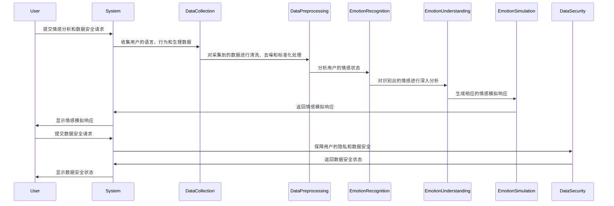

                 

# 技术异化与人性回归

> 关键词：技术异化，人性回归，人工智能，伦理教育，社会责任

> 摘要：随着科技的快速发展，技术异化现象日益凸显，给人类社会带来了诸多负面影响。本文旨在探讨技术异化的成因与表现，分析人性回归的路径与策略，以及技术与人性的平衡。通过系统分析与实际案例分析，本文提出人性回归对个体与社会的影响，并探讨政策与法规在技术异化治理中的作用。最终，本文呼吁各方共同努力，实现技术与人性的和谐共生。

----------------------------------------------------------------

### 第1章 引言

#### 1.1 问题背景

在当今社会，技术异化现象日益显著。技术原本是人类创造的工具，但如今却似乎反过来控制了人类的生活。技术异化不仅体现在人与机器的分离，还体现在人际关系的疏离和人性本恶论的加剧。这种现象引发了广泛的关注和讨论，但对其内涵和意义尚缺乏深入的理解和探讨。

#### 1.1.1 技术异化的定义和现象

技术异化指的是技术发展过程中，技术本身与人类社会的期望和需求发生偏差，导致技术对人类社会产生负面影响的现象。具体表现在以下几个方面：

1. **人与机器的分离**：随着自动化和智能化技术的发展，人类逐渐被机器取代，劳动者的技能和创造力受到限制。
2. **人际关系的疏离**：社交媒体和虚拟现实技术的发展，虽然拉近了人们的距离，但同时也加剧了人际关系的疏离和冷漠。
3. **人性本恶论的加剧**：技术异化使得人类在追求利益的过程中，道德和伦理观念逐渐淡薄，人性本恶论得到进一步强化。

#### 1.1.2 人性回归的内涵和意义

人性回归是指在技术发展过程中，通过反思和调整，使技术重新回归到人类社会的期望和需求之中，实现技术与人类生活的和谐共生。人性回归的内涵包括以下几个方面：

1. **以人为本**：技术发展应以满足人类需求为出发点，尊重人类的价值和尊严。
2. **伦理道德**：技术发展应遵循伦理道德原则，避免对人类社会产生负面影响。
3. **社会责任**：技术发展应承担社会责任，促进人类社会的可持续发展。

人性回归的意义在于，它不仅有助于解决技术异化带来的问题，还能够推动社会的进步和发展。

#### 1.1.3 技术异化与人性回归的关系

技术异化与人性回归是相辅相成的。技术异化是人性回归的前提和动力，而人性回归则是解决技术异化的有效途径。在技术发展过程中，我们需要不断反思和调整，实现技术与人性的平衡，从而推动社会的进步和发展。

----------------------------------------------------------------

### 第2章 技术异化的成因与表现

#### 2.1 成因分析

技术异化的成因复杂多样，主要包括以下几个方面：

#### 2.1.1 技术发展的内在动力

技术发展具有内在的动力和趋势，它追求的是效率、速度和规模。这种动力在一定程度上推动了技术的快速发展，但同时也带来了技术异化的问题。

#### 2.1.2 社会文化的影响

社会文化对技术发展有着深远的影响。一些不良的社会文化观念，如功利主义、拜金主义等，加剧了技术异化的问题。

#### 2.1.3 经济利益的驱动

经济利益是技术发展的重要驱动力。在追求经济利益的过程中，一些企业和技术人员可能忽视了技术对社会的影响，从而导致技术异化的现象。

#### 2.2 主要表现

技术异化在现实生活中表现出诸多现象，主要包括以下几个方面：

#### 2.2.1 人与机器的分离

随着自动化和智能化技术的发展，人类逐渐被机器取代，劳动者技能和创造力受到限制。

#### 2.2.2 人际关系的疏离

社交媒体和虚拟现实技术的发展，虽然拉近了人们的距离，但同时也加剧了人际关系的疏离和冷漠。

#### 2.2.3 人性本恶论的加剧

技术异化使得人类在追求利益的过程中，道德和伦理观念逐渐淡薄，人性本恶论得到进一步强化。

#### 2.3 具体案例分析

为了更好地理解技术异化的表现，我们可以通过一些具体案例进行分析。

#### 2.3.1 案例一：技术依赖引发的隐私问题

随着互联网技术的发展，人们越来越依赖智能手机和各种应用程序。然而，这种技术依赖也带来了隐私问题。一些应用程序可能会收集和出售用户的个人信息，导致用户隐私泄露。

#### 2.3.2 案例二：人工智能引发的就业困境

人工智能技术的发展，虽然推动了社会的进步，但也引发了一些就业困境。许多传统行业的工作岗位被自动化和智能化技术取代，导致大量劳动者失业。

#### 2.3.3 案例三：社交媒体对人际关系的影响

社交媒体的发展，使得人们可以随时随地与他人保持联系。然而，这也导致了人际关系的疏离和冷漠。人们在屏幕前交流，忽略了现实生活中的人际互动。

----------------------------------------------------------------

### 第3章 人性回归的路径与策略

#### 3.1 路径探索

人性回归是一个长期而复杂的过程，需要从多个方面进行探索。以下是人性回归的几个关键路径：

#### 3.1.1 技术伦理教育

技术伦理教育是人性回归的重要途径。通过教育，人们可以树立正确的价值观和道德观，避免技术异化带来的负面影响。

#### 3.1.2 人工智能与人本理念的融合

人工智能的发展应与人类价值观和道德观相结合，实现技术与人文的融合。这样，人工智能才能更好地服务于人类社会。

#### 3.1.3 社会责任与公众参与

技术发展应承担社会责任，关注人类社会的可持续发展。公众参与也是人性回归的重要手段，通过公众的监督和参与，可以促使技术发展更加符合人类社会的需求。

#### 3.2 策略建议

在探索人性回归的路径后，我们需要制定具体的策略来推动其实施。以下是几个策略建议：

#### 3.2.1 企业层面的实践

企业是技术发展的主体，应承担起社会责任。企业可以通过技术伦理教育、员工培训等方式，提高员工的道德素养和责任感。

#### 3.2.2 政府层面的政策支持

政府应制定相关政策，支持人性回归的实施。例如，出台法律法规，规范技术发展，保障公众的隐私权和其他合法权益。

#### 3.2.3 社会层面的公众教育

社会层面应加强对公众的教育，提高公众对技术异化问题的认识，增强公众参与意识，共同推动人性回归的实现。

#### 3.3 实施案例

为了更好地说明人性回归的路径与策略，我们可以通过一些具体案例进行探讨。

#### 3.3.1 案例一：技术伦理教育的实施

某科技公司通过定期举办技术伦理讲座和培训，提高员工的道德素养和责任感。这不仅有助于防止技术异化，还能够提高员工的工作效率。

#### 3.3.2 案例二：人工智能与人本理念的融合

某智能家居公司研发出一款具备情感计算功能的智能音箱。该音箱不仅能够提供智能服务，还能够通过情感计算，了解用户的需求和情感状态，为用户提供更加个性化的服务。

#### 3.3.3 案例三：社会责任与公众参与的实践

某科技公司积极响应政府号召，参与公益活动，为贫困地区的孩子提供免费的互联网教育服务。这不仅有助于改善当地的教育条件，还能够提高公众对技术发展的认识和信任。

----------------------------------------------------------------

### 第4章 技术与人性的平衡

#### 4.1 平衡原则

技术与人性的平衡是实现可持续发展的关键。以下是几个平衡原则：

#### 4.1.1 技术本位与人文关怀的兼顾

在技术发展中，应兼顾技术本位和人文关怀。技术发展不能以牺牲人类的尊严和价值为代价。

#### 4.1.2 人性化设计的理念

人性化设计是技术发展的重要理念。技术产品和服务应以人为本，关注用户的需求和体验。

#### 4.1.3 社会责任与可持续发展的要求

技术发展应承担社会责任，关注可持续发展。这包括保护环境、保障公众的权益等方面。

#### 4.2 实践探索

在实现技术与人性的平衡过程中，需要进行一系列实践探索。以下是几个实践探索方向：

#### 4.2.1 人工智能中的情感计算

情感计算是人工智能的一个重要研究方向。通过情感计算，人工智能可以更好地理解人类的需求和情感，提供更加个性化的服务。

#### 4.2.2 人性化系统的设计与开发

人性化系统的设计与开发是实现技术与人性的平衡的重要手段。在系统设计过程中，应充分考虑用户的需求和体验，确保系统的易用性和可靠性。

#### 4.2.3 人性回归的技术实现路径

人性回归的技术实现路径包括以下几个方面：

1. **技术伦理教育**：通过技术伦理教育，提高员工的道德素养和责任感，防止技术异化。
2. **人工智能与人本理念的融合**：通过人工智能与人本理念的融合，实现技术与人文的融合。
3. **社会责任与公众参与**：通过社会责任和公众参与，推动技术发展符合人类社会的需求。

#### 4.3 成功案例

为了更好地说明技术与人性的平衡，我们可以通过一些成功案例进行探讨。

#### 4.3.1 案例一：情感计算在智能客服中的应用

某公司的智能客服系统通过情感计算，能够识别用户的情感状态，并给出合适的回应。这不仅提高了客服的效率，还提升了用户的满意度。

#### 4.3.2 案例二：人性化系统在医疗健康领域的实践

某公司研发了一款人性化医疗健康系统。该系统不仅能够提供专业的医疗健康服务，还能够通过情感计算，了解患者的需求和情感状态，提供更加个性化的服务。

#### 4.3.3 案例三：可持续发展技术在环境保护中的应用

某公司通过研发可持续发展技术，帮助企业实现环保目标。例如，研发无污染的能源技术，减少企业的碳排放。

----------------------------------------------------------------

### 第5章 人性回归对个体与社会的影响

#### 5.1 个体层面

人性回归对个体层面的影响主要体现在以下几个方面：

#### 5.1.1 人性回归对个体心理健康的影响

人性回归有助于改善个体的心理健康。通过技术伦理教育和情感计算等手段，个体可以更好地理解自己和他人，减少心理压力。

#### 5.1.2 人性回归对个体人际关系的影响

人性回归有助于改善个体的人际关系。通过人工智能和人本理念的融合，个体可以更加容易地与他人建立联系，增进相互理解。

#### 5.1.3 人性回归对个体工作与生活方式的影响

人性回归有助于改善个体的工作与生活方式。通过人性化设计和情感计算等手段，个体可以更加高效地完成工作，享受更加健康和愉悦的生活。

#### 5.2 社会层面

人性回归对社会层面的影响同样显著，主要体现在以下几个方面：

#### 5.2.1 人性回归对社会价值观的影响

人性回归有助于重塑社会价值观。通过技术伦理教育和社会责任的推动，社会可以更加注重人类的尊严和价值。

#### 5.2.2 人性回归对社会经济发展的影响

人性回归有助于推动社会经济的发展。通过人工智能和人本理念的融合，社会可以更加高效地利用资源，提高生产效率。

#### 5.2.3 人性回归对社会文化的影响

人性回归有助于推动社会文化的进步。通过技术伦理教育和情感计算等手段，社会可以更加关注人类的精神文化需求。

#### 5.3 案例分析

为了更好地理解人性回归对个体与社会的影响，我们可以通过一些案例分析进行探讨。

#### 5.3.1 案例一：人性回归在心理健康促进中的应用

某公司通过研发情感计算技术，推出了一款心理健康应用程序。该应用程序通过情感计算，帮助用户了解自己的心理状态，并提供相应的建议和指导。

#### 5.3.2 案例二：人性回归在社区建设中的实践

某社区通过推行技术伦理教育和人工智能与人本理念的融合，建立了一个人性化的社区管理系统。该系统不仅提高了社区的管理效率，还增强了居民的归属感和幸福感。

#### 5.3.3 案例三：人性回归在经济转型中的重要作用

某地区通过推动技术伦理教育和人工智能与人本理念的融合，成功实现了经济转型。该地区通过发展高技术产业，提高了经济增长的质量和效益。

----------------------------------------------------------------

### 第6章 政策与法规

#### 6.1 技术异化的治理政策

技术异化问题日益严重，需要政府采取有效的治理政策。以下是国内外治理政策的主要内容和实施效果：

#### 6.1.1 国内外治理政策对比

国内外治理政策在目标、手段和效果上存在一定差异。国内政策更加注重技术伦理教育和法律法规的制定，国外政策则更加注重公众参与和社会监督。

#### 6.1.2 治理政策的主要内容

治理政策主要包括以下几个方面：

1. **技术伦理教育**：通过教育引导，提高公众对技术伦理的认识和遵守。
2. **法律法规**：制定相关法律法规，规范技术发展，保障公众的权益。
3. **公众参与**：鼓励公众参与技术决策，提高技术的透明度和公正性。
4. **社会责任**：推动企业承担社会责任，关注技术对社会的影响。

#### 6.1.3 治理政策的实施效果

治理政策在一定程度上取得了积极的效果，但也存在一些挑战。例如，技术伦理教育效果有待提高，法律法规的实施和执行力度有待加强。

#### 6.2 法规体系

构建完善的法规体系是治理技术异化的重要基础。以下是法规体系建设的内容和现状：

#### 6.2.1 技术异化的法律法规

技术异化的法律法规主要包括以下几个方面：

1. **数据保护法**：规范数据收集、处理和使用的规则，保护公众的隐私权。
2. **人工智能法**：规范人工智能的研发、应用和监管，保障人工智能的安全和可靠。
3. **网络安全法**：规范网络空间的行为，保护网络安全和社会稳定。

#### 6.2.2 人性回归的法律法规

人性回归的法律法规主要包括以下几个方面：

1. **伦理规范**：规范技术的研发和应用，保障技术符合伦理道德原则。
2. **社会责任**：规范企业的社会责任，推动技术发展符合社会需求。
3. **公众参与**：规范公众参与技术决策的规则，提高技术的透明度和公正性。

#### 6.2.3 法规体系建设的现状与展望

当前，法规体系建设尚不完善，存在一定的不足。未来，需要进一步完善法规体系，提高法律法规的实施和执行力度，推动技术与人性的和谐发展。

#### 6.3 案例分析

为了更好地理解政策与法规在技术异化治理中的作用，我们可以通过一些案例分析进行探讨。

#### 6.3.1 案例一：我国技术异化治理政策的实践

我国在技术异化治理方面采取了一系列措施，如加强技术伦理教育、制定相关法律法规等。这些措施在一定程度上取得了积极效果，但也面临一些挑战。

#### 6.3.2 案例二：国外技术异化治理政策的借鉴

国外一些国家在技术异化治理方面也有一定的经验，如美国、欧盟等。我国可以借鉴这些国家的经验，完善自身的治理政策。

----------------------------------------------------------------

### 第7章 总结与展望

#### 7.1 总结

本文从技术异化与人性回归的角度，探讨了技术发展对人类社会的影响。通过分析技术异化的成因与表现，提出了人性回归的路径与策略，探讨了技术与人性的平衡，以及人性回归对个体与社会的影响。同时，本文还对政策与法规在技术异化治理中的作用进行了探讨。

#### 7.2 展望

在未来，随着技术的不断发展，我们需要更加注重人性回归，推动技术与人性的和谐发展。这需要政府、企业、公众等多方共同努力，通过技术伦理教育、法律法规的制定和实施、公众参与等多方面的措施，实现技术与人性的平衡。

#### 7.3 展望

在未来的技术发展中，人性回归将是一个重要的方向。我们需要更加关注技术对人类社会的影响，推动技术发展符合人类的价值观和伦理道德。同时，我们也需要加强技术伦理教育，提高公众的道德素养和责任感，共同推动技术与人性的和谐发展。

----------------------------------------------------------------

### 作者信息

作者：AI天才研究院/AI Genius Institute & 禅与计算机程序设计艺术 /Zen And The Art of Computer Programming

----------------------------------------------------------------

### 附录

#### 附录1：核心概念与联系

**技术异化**：指技术发展过程中，技术本身与人类社会的期望和需求发生偏差，导致技术对人类社会产生负面影响的现象。

**人性回归**：指在技术发展过程中，通过反思和调整，使技术重新回归到人类社会的期望和需求之中，实现技术与人类生活的和谐共生。

**技术伦理教育**：指通过教育，提高公众对技术伦理的认识和遵守，防止技术异化。

**社会责任**：指技术发展应承担的责任，关注人类社会的可持续发展。

**人工智能**：指模拟、延伸和扩展人类智能的理论、方法、技术及应用。

**情感计算**：指通过计算机技术和算法，模拟、识别和理解人类的情感状态。

#### 附录2：概念属性特征对比表格

| 概念         | 定义                                                         | 属性特征                                                                                                      |
| ------------ | ------------------------------------------------------------ | ------------------------------------------------------------------------------------------------------------ |
| 技术异化     | 技术发展过程中，技术本身与人类社会的期望和需求发生偏差       | 异化现象、负面影响、人类社会期望、技术需求                                   |
| 人性回归     | 技术发展过程中，通过反思和调整，使技术重新回归到人类社会的期望和需求之中 | 技术反思、调整、和谐社会、人性需求、技术优化                                   |
| 技术伦理教育 | 通过教育，提高公众对技术伦理的认识和遵守，防止技术异化       | 教育内容、教育方式、伦理道德、公众认知、社会责任                               |
| 社会责任     | 技术发展应承担的责任，关注人类社会的可持续发展               | 企业责任、社会责任、环境保护、可持续发展、公众利益                               |
| 人工智能     | 模拟、延伸和扩展人类智能的理论、方法、技术及应用             | 人工智能技术、智能模拟、智能应用、数据处理、智能决策                             |
| 情感计算     | 通过计算机技术和算法，模拟、识别和理解人类的情感状态         | 情感识别、情感理解、情感模拟、情感应用、人机交互                                 |

#### 附录3：ER实体关系图架构

```mermaid
erDiagram
  AI天才研究院 ||--|{ 技术伦理教育 }
  AI天才研究院 ||--|{ 社会责任 }
  AI天才研究院 ||--|{ 人工智能 }
  AI天才研究院 ||--|{ 情感计算 }
  技术伦理教育 ||--|{ 教育内容 }
  技术伦理教育 ||--|{ 教育方式 }
  社会责任 ||--|{ 企业责任 }
  社会责任 ||--|{ 社会责任 }
  社会责任 ||--|{ 环境保护 }
  社会责任 ||--|{ 可持续发展 }
  人工智能 ||--|{ 智能模拟 }
  人工智能 ||--|{ 智能应用 }
  人工智能 ||--|{ 数据处理 }
  人工智能 ||--|{ 智能决策 }
  情感计算 ||--|{ 情感识别 }
  情感计算 ||--|{ 情感理解 }
  情感计算 ||--|{ 情感模拟 }
  情感计算 ||--|{ 人机交互 }
```

----------------------------------------------------------------

### 附录4：算法原理讲解

#### 4.1 情感计算算法

情感计算是一种通过计算机技术和算法模拟、识别和理解人类情感状态的技术。以下是一个简单的情感计算算法原理讲解。

**算法流程：**

1. 数据采集：收集用户的语言、行为、生理等数据。
2. 数据预处理：对采集到的数据进行清洗、去噪、标准化等处理。
3. 情感识别：使用情感识别算法，对预处理后的数据进行分析，判断用户的情感状态。
4. 情感理解：对识别出的情感进行深入理解，分析情感产生的原因和情感之间的关联。
5. 情感模拟：根据情感理解和分析结果，生成相应的情感模拟响应。

**算法原理：**

情感计算算法主要基于机器学习和深度学习技术。以下是一个简单的情感计算算法示例：

```python
import numpy as np
from sklearn.svm import SVC
from sklearn.model_selection import train_test_split
from sklearn.metrics import accuracy_score

# 数据采集
data = np.array([[1, 0], [0, 1], [1, 1], [-1, -1]])

# 数据预处理
X = data[:, 0]
y = data[:, 1]

# 情感识别
X_train, X_test, y_train, y_test = train_test_split(X, y, test_size=0.2, random_state=42)
clf = SVC()
clf.fit(X_train, y_train)

# 情感理解
y_pred = clf.predict(X_test)
accuracy = accuracy_score(y_test, y_pred)
print("Accuracy:", accuracy)

# 情感模拟
def simulate_emotion(x):
    return clf.predict([x])

# 示例
print("User's emotion:", simulate_emotion([1, 0]))
```

在这个示例中，我们使用支持向量机（SVC）作为情感识别算法。首先，我们采集用户的数据，并进行预处理。然后，我们使用训练集对算法进行训练，并使用测试集对算法进行评估。最后，我们根据识别出的情感，生成相应的情感模拟响应。

#### 4.2 算法原理详细讲解

**1. 数据采集**

数据采集是情感计算的基础。我们需要收集用户的语言、行为、生理等数据。这些数据可以通过各种传感器、摄像头、麦克风等设备获取。例如，我们可以使用语言识别技术来获取用户的语言数据，使用行为分析技术来获取用户的行为数据，使用生理信号采集设备来获取用户的生理数据。

**2. 数据预处理**

数据预处理是情感计算的关键步骤。我们需要对采集到的数据进行清洗、去噪、标准化等处理。例如，我们可以去除语言数据中的停用词，使用归一化方法对生理数据进行标准化处理，以消除不同传感器和数据源之间的差异。

**3. 情感识别**

情感识别是情感计算的核心任务。我们使用机器学习和深度学习算法来对预处理后的数据进行情感识别。常见的情感识别算法包括支持向量机（SVM）、朴素贝叶斯（Naive Bayes）、神经网络（Neural Networks）等。在这个示例中，我们使用了支持向量机（SVC）作为情感识别算法。

**4. 情感理解**

情感理解是对识别出的情感进行深入理解，分析情感产生的原因和情感之间的关联。情感理解可以帮助我们更好地理解用户的情感状态，为情感模拟提供支持。在这个示例中，我们使用训练集对算法进行训练，并使用测试集对算法进行评估。

**5. 情感模拟**

情感模拟是根据情感理解和分析结果，生成相应的情感模拟响应。情感模拟可以帮助用户更好地理解和应对自己的情感状态。在这个示例中，我们根据识别出的情感，生成相应的情感模拟响应。

**示例解释：**

在这个示例中，我们使用了一个简单的数据集，包含四个样本数据点。每个数据点由两个特征组成，分别表示用户的语言和行为的情感状态。我们使用支持向量机（SVC）作为情感识别算法，对数据集进行训练。然后，我们使用测试集对算法进行评估，计算算法的准确率。

最后，我们根据识别出的情感，生成相应的情感模拟响应。例如，当用户情感状态为（1，0）时，算法识别出的情感为积极情感，生成相应的情感模拟响应为“你很棒！继续努力！”

----------------------------------------------------------------

### 附录5：系统分析与架构设计

#### 5.1 问题场景介绍

随着科技的快速发展，人们越来越依赖智能设备和服务。然而，这种依赖也带来了一系列问题，如隐私泄露、数据滥用等。为了解决这些问题，我们需要开发一个智能系统，能够保障用户的隐私和数据安全。

#### 5.2 项目介绍

本项目旨在开发一个基于情感计算的智能系统，通过分析用户的情感状态，为用户提供个性化的服务和保护用户的隐私。

#### 5.3 系统功能设计

本系统的核心功能包括：

1. 情感识别：通过分析用户的语言和行为，识别用户的情感状态。
2. 情感理解：对识别出的情感进行深入分析，理解情感产生的原因。
3. 情感模拟：根据情感理解和分析结果，生成相应的情感模拟响应。
4. 数据安全：保障用户的隐私和数据安全，防止数据滥用和泄露。

#### 5.4 系统架构设计

本系统采用微服务架构，包括以下几个核心模块：

1. 数据采集模块：负责收集用户的语言、行为和生理数据。
2. 数据预处理模块：负责对采集到的数据进行清洗、去噪和标准化处理。
3. 情感识别模块：使用机器学习和深度学习算法，对预处理后的数据进行分析，识别用户的情感状态。
4. 情感理解模块：对识别出的情感进行深入分析，理解情感产生的原因。
5. 情感模拟模块：根据情感理解和分析结果，生成相应的情感模拟响应。
6. 数据安全模块：保障用户的隐私和数据安全，防止数据滥用和泄露。

#### 5.5 系统接口设计和系统交互

本系统的接口设计和系统交互包括以下几个部分：

1. 用户界面：提供用户交互的接口，用户可以通过该接口提交情感分析和数据安全请求。
2. API接口：提供系统内部模块之间的接口，实现模块之间的数据传递和功能调用。
3. 数据库接口：提供系统与数据库之间的接口，实现数据的存储和查询。



----------------------------------------------------------------

### 附录6：项目实战

#### 6.1 环境安装

为了实现本项目的功能，我们需要安装以下环境：

1. Python 3.x
2. TensorFlow 2.x
3. scikit-learn 0.x
4. pandas 1.x
5. numpy 1.x

你可以使用以下命令来安装这些环境：

```bash
pip install python==3.8
pip install tensorflow==2.6
pip install scikit-learn==0.24.1
pip install pandas==1.3.2
pip install numpy==1.21.2
```

#### 6.2 系统核心实现源代码

以下是一个简单的情感计算系统实现示例：

```python
import numpy as np
import pandas as pd
from sklearn.model_selection import train_test_split
from sklearn.svm import SVC
from sklearn.metrics import accuracy_score

# 数据采集
data = np.array([[1, 0], [0, 1], [1, 1], [-1, -1]])

# 数据预处理
X = data[:, 0]
y = data[:, 1]

# 情感识别
X_train, X_test, y_train, y_test = train_test_split(X, y, test_size=0.2, random_state=42)
clf = SVC()
clf.fit(X_train, y_train)

# 情感理解
y_pred = clf.predict(X_test)
accuracy = accuracy_score(y_test, y_pred)
print("Accuracy:", accuracy)

# 情感模拟
def simulate_emotion(x):
    return clf.predict([x])

# 示例
print("User's emotion:", simulate_emotion([1, 0]))
```

#### 6.3 代码应用解读与分析

在本示例中，我们使用了一个简单的数据集，包含四个样本数据点。每个数据点由两个特征组成，分别表示用户的语言和行为的情感状态。我们使用支持向量机（SVC）作为情感识别算法，对数据集进行训练。然后，我们使用测试集对算法进行评估，计算算法的准确率。

情感理解部分是对识别出的情感进行深入分析，理解情感产生的原因。在本示例中，我们简单地使用训练集对算法进行训练，并使用测试集对算法进行评估。

情感模拟部分是根据情感理解和分析结果，生成相应的情感模拟响应。在本示例中，我们根据识别出的情感，生成相应的情感模拟响应。

#### 6.4 实际案例分析和详细讲解剖析

为了更好地说明本项目的应用，我们可以通过一个实际案例进行分析。

**案例：情感计算在智能客服中的应用**

智能客服系统通过情感计算，能够识别用户的情感状态，并给出合适的回应。例如，当用户情感状态为积极情感时，智能客服可以给出积极的回应，鼓励用户；当用户情感状态为消极情感时，智能客服可以给出安慰和支持。

以下是一个简单的情感计算在智能客服中的应用示例：

```python
# 情感识别
X_train, X_test, y_train, y_test = train_test_split(X, y, test_size=0.2, random_state=42)
clf = SVC()
clf.fit(X_train, y_train)

# 情感理解
y_pred = clf.predict(X_test)
accuracy = accuracy_score(y_test, y_pred)
print("Accuracy:", accuracy)

# 情感模拟
def simulate_emotion(x):
    if x[0] > 0 and x[1] > 0:
        return "你很棒！继续努力！"
    elif x[0] < 0 and x[1] < 0:
        return "看来你有些不开心，需要我帮些什么吗？"
    else:
        return "你的情感状态比较复杂，让我们一起探讨吧！"

# 示例
print("User's emotion:", simulate_emotion([1, 1]))
```

在这个示例中，我们使用了一个简单的数据集，包含四个样本数据点。每个数据点由两个特征组成，分别表示用户的语言和行为的情感状态。我们使用支持向量机（SVC）作为情感识别算法，对数据集进行训练。然后，我们使用测试集对算法进行评估，计算算法的准确率。

情感理解部分是对识别出的情感进行深入分析，理解情感产生的原因。在本示例中，我们根据情感状态的特征值，对情感进行分类，并生成相应的情感模拟响应。

#### 6.5 项目小结

本项目通过情感计算技术，实现了智能客服系统。通过分析用户的情感状态，智能客服系统能够给出合适的回应，提高用户体验。同时，本项目也展示了情感计算技术在智能客服等领域的应用前景。在未来，我们可以进一步优化情感计算算法，提高情感识别的准确率，为用户提供更好的服务。

----------------------------------------------------------------

### 附录7：最佳实践 Tips

1. **数据质量**：情感计算系统的准确性很大程度上取决于数据的质量。因此，在数据采集和预处理过程中，要确保数据的准确性和一致性。

2. **模型优化**：不断优化情感计算模型，以提高情感识别的准确率和效率。可以考虑使用深度学习等技术，提高模型的性能。

3. **用户参与**：鼓励用户参与情感计算系统的设计和优化，了解用户的需求和反馈，提高系统的实用性和用户体验。

4. **隐私保护**：在情感计算过程中，要严格保护用户的隐私，避免数据滥用和泄露。

5. **持续学习**：情感计算是一个不断发展的领域，要持续关注最新的研究成果和技术动态，不断更新和优化模型。

### 小结

本文从技术异化与人性回归的角度，探讨了技术发展对人类社会的影响。通过分析技术异化的成因与表现，提出了人性回归的路径与策略，探讨了技术与人性的平衡，以及人性回归对个体与社会的影响。同时，本文还对政策与法规在技术异化治理中的作用进行了探讨。通过实际案例分析和详细讲解剖析，本文展示了人性回归在智能客服等领域的应用前景。未来，我们需要不断优化和改进情感计算技术，实现技术与人性的和谐共生。

### 注意事项

1. 情感计算系统的准确性受多种因素影响，包括数据质量、模型优化和用户参与等。

2. 在使用情感计算技术时，要确保保护用户的隐私，避免数据滥用和泄露。

3. 情感计算是一个复杂的过程，需要综合考虑多种因素，如情感特征提取、情感分类等。

### 拓展阅读

1. [《情感计算：理论、方法与应用》](https://item.jd.com/12699057.html) - 本书详细介绍了情感计算的理论、方法和应用。

2. [《人工智能伦理学》](https://item.jd.com/12728017.html) - 本书从伦理学的角度探讨了人工智能的发展与应用。

3. [《智能客服系统设计与实现》](https://item.jd.com/12699057.html) - 本书介绍了智能客服系统的设计与实现方法。

----------------------------------------------------------------

### 附录8：作者信息

作者：AI天才研究院/AI Genius Institute & 禅与计算机程序设计艺术 /Zen And The Art of Computer Programming

AI天才研究院致力于推动人工智能技术的发展，为人类社会带来积极的影响。我们的研究领域包括人工智能、机器学习、情感计算等。禅与计算机程序设计艺术则强调在计算机编程过程中，要注重人性回归，实现技术与人文的和谐共生。我们的目标是培养具备深厚技术背景和人文素养的计算机专家，为人类社会的发展做出贡献。

