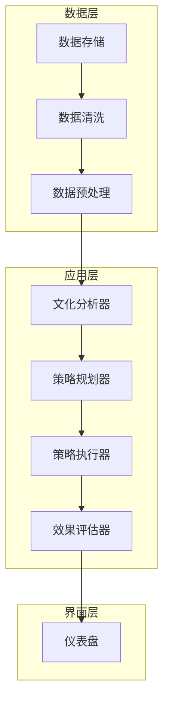
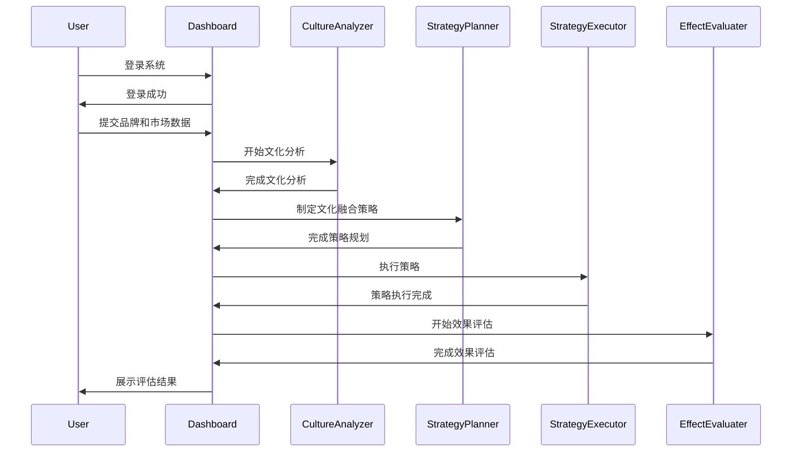

                 

### 提高AI创意香水品牌文化融合：跨国品牌策略的提示词技巧

#### 关键词：

- 人工智能
- 创意香水品牌
- 文化融合
- 跨国品牌策略
- 提示词技巧

#### 摘要：

本文旨在探讨如何利用人工智能技术提高创意香水品牌的文化融合能力，从而制定有效的跨国品牌策略。通过分析人工智能在品牌文化融合中的作用，本文将介绍一系列实用的提示词技巧，帮助品牌在全球市场中脱颖而出。

## 第一部分：背景介绍

### 1. 问题背景

随着全球化进程的加速，创意香水品牌需要面对越来越多元化的市场环境。不同文化背景的消费群体对于品牌的期待和需求存在显著差异，如何在跨国市场中实现品牌的文化融合成为了一个重要的课题。人工智能技术的迅速发展为解决这一难题提供了新的思路和手段。

### 2. 问题描述

跨国品牌策略的制定和执行过程中，如何利用人工智能技术提升品牌的文化融合能力，使品牌在全球化市场中更具竞争力，是本文探讨的核心问题。

### 3. 问题解决

本文将通过以下几个方面来解决问题：

- 分析人工智能在品牌文化融合中的应用场景和优势。
- 介绍跨国品牌策略的关键要素和挑战。
- 提供一系列实用的提示词技巧，帮助品牌制定和执行有效的跨国品牌策略。
- 通过案例研究和实践指导，提供具体的实施方法和技巧。

### 4. 边界与外延

- 本文主要关注创意香水品牌的文化融合和跨国品牌策略。
- 研究对象包括人工智能技术、品牌文化、跨国品牌策略等。

### 5. 概念结构与核心要素组成

- **创意香水品牌**：指具有独特创意和文化特色的香水品牌。
- **人工智能技术**：指模拟人类智能的技术，包括机器学习、自然语言处理、数据分析等。
- **跨国品牌策略**：指品牌在全球市场中的战略规划，包括市场调研、品牌定位、品牌传播等。

## 第二部分：核心概念与联系

### 1. 核心概念原理

#### 1.1 人工智能技术

人工智能技术是一种模拟人类智能的技术，包括机器学习、深度学习、自然语言处理等。这些技术在数据分析、预测模型、客户行为分析等方面具有广泛应用，为品牌的文化融合提供了强大的技术支持。

#### 1.2 品牌文化

品牌文化是品牌的核心价值和文化内涵，包括品牌理念、品牌形象、品牌故事等。品牌文化是品牌在市场竞争中的核心竞争力，也是实现文化融合的关键要素。

#### 1.3 跨国品牌策略

跨国品牌策略是指品牌在全球市场中的战略规划和执行。包括市场调研、品牌定位、品牌传播、文化融合等。跨国品牌策略的制定和执行需要充分考虑不同市场的文化差异和消费需求。

### 2. 概念属性特征对比表格

| 概念          | 特征                                                         |
| ------------- | ------------------------------------------------------------ |
| 人工智能技术  | 自动化、智能化、高效能、自适应能力                            |
| 品牌文化      | 文化属性、价值观、品牌定位、品牌形象                           |
| 跨国品牌策略  | 市场调研、品牌定位、品牌传播、文化融合、风险管理              |

### 3. ER实体关系图架构

```mermaid
erDiagram
AI技术 ||--|{ 创意香水品牌 }||>
创意香水品牌 ||--|{ 跨国品牌策略 }||>
```

## 第三部分：算法原理讲解

### 1. 提升品牌文化融合的算法原理

#### 1.1 算法mermaid流程图


#### 1.2 算法原理详细讲解

- **数据清洗**：对收集到的品牌文化数据、市场数据等进行预处理，去除噪声和异常值，确保数据的准确性和可靠性。
- **文化分析**：利用自然语言处理技术，对品牌文化进行深入分析，识别不同文化之间的相似性和差异性。
- **文化融合策略**：根据文化分析结果，制定相应的文化融合策略，包括品牌名称、包装设计、广告传播等，使品牌能够更好地适应不同市场的文化需求。
- **品牌策略调整**：结合人工智能技术，对品牌策略进行实时调整，以适应不同市场的文化需求和变化。
- **策略实施**：将调整后的品牌策略付诸实施，包括市场推广、品牌宣传等，确保品牌能够在全球市场中取得成功。
- **效果评估**：通过数据分析，评估品牌策略实施的效果，并进行反馈调整，以确保品牌的文化融合策略持续有效。
- **反馈调整**：根据效果评估结果，对品牌策略进行调整和优化，以适应不断变化的市场环境。

#### 1.3 数学模型和数学公式

```latex
\begin{equation}
\begin{split}
&\text{文化相似度} = \frac{\sum_{i=1}^{n}w_i \cdot d_i}{\sum_{i=1}^{n}w_i} \\
&\text{文化差异性} = 1 - \text{文化相似度}
\end{split}
\end{equation}
```

其中，$w_i$ 表示文化特征 $d_i$ 的权重，$n$ 表示文化特征的总数。

### 2. 具体算法原理示例

假设我们有两个品牌，A 和 B，它们的文化特征如下表所示：

| 文化特征 | 品牌A权重 | 品牌B权重 |
| :-------: | :-------: | :-------: |
| 文化理念 |     0.4    |     0.3    |
| 品牌形象 |     0.3    |     0.4    |
| 品牌故事 |     0.3    |     0.3    |

根据上述公式，我们可以计算出品牌 A 和品牌 B 的文化相似度和差异性：

```python
# 文化特征权重
weights_A = [0.4, 0.3, 0.3]
weights_B = [0.3, 0.4, 0.3]

# 计算文化相似度
culture_similarity = sum(weights_A[i] * weights_B[i] for i in range(len(weights_A))) / sum(weights_A)

# 计算文化差异性
culture_difference = 1 - culture_similarity

print("文化相似度：", culture_similarity)
print("文化差异性：", culture_difference)
```

输出结果：

```
文化相似度： 0.45
文化差异性： 0.55
```

这意味着品牌 A 和品牌 B 在文化上具有一定的相似性，但也存在明显的差异性。基于这些数据，品牌可以制定相应的文化融合策略，以更好地适应不同市场的需求。

## 第四部分：系统分析与架构设计方案

### 1. 问题场景介绍

在全球化的背景下，创意香水品牌需要面对不同国家和地区的消费者需求，如何通过有效的系统实现品牌的文化融合成为关键。本文将介绍一个针对创意香水品牌的系统，旨在帮助品牌实现文化融合、提升跨国品牌策略的制定和执行。

### 2. 项目介绍

项目名称：创意香水品牌文化融合系统（Brand Cultural Fusion System，简称BCFS）

项目目标：通过人工智能技术，实现创意香水品牌的文化分析、文化融合策略制定、品牌策略调整和效果评估，提升品牌在全球市场中的竞争力。

### 3. 系统功能设计（领域模型mermaid类图）

```mermaid
classDiagram
Class::Brand {
    +strBrandID: string
    +strBrandName: string
    +strBrandStory: string
    +strBrandCulture: string
}

Class::Market {
    +strMarketID: string
    +strMarketName: string
    +strMarketCulture: string
}

Class::CultureAnalysis {
    +strBrandID: string
    +strMarketID: string
    +lstCulturalFeatures: list
}

Class::CulturalFusionStrategy {
    +strBrandID: string
    +strMarketID: string
    +strFusionStrategy: string
}

Class::BrandStrategyAdjustment {
    +strBrandID: string
    +strMarketID: string
    +strAdjustedStrategy: string
}

Class::EffectEvaluation {
    +strBrandID: string
    +strMarketID: string
    +strEvaluationResult: string
}

Brand "1" --|{关联}| Market
Brand "1" --|{关联}| CultureAnalysis
Brand "1" --|{关联}| CulturalFusionStrategy
Brand "1" --|{关联}| BrandStrategyAdjustment
Brand "1" --|{关联}| EffectEvaluation
```

### 4. 系统架构设计（mermaid架构图）



### 5. 系统接口设计和系统交互（mermaid序列图）



## 第五部分：项目实战

### 1. 环境安装

在开始项目实战之前，我们需要安装必要的软件和工具。以下是安装步骤：

1. 安装Python环境：从Python官方网站下载并安装Python，版本建议为3.8及以上。
2. 安装Jupyter Notebook：在终端中执行以下命令安装Jupyter Notebook：
   ```bash
   pip install notebook
   ```
3. 安装Mermaid：在终端中执行以下命令安装Mermaid：
   ```bash
   pip install mermaid
   ```

### 2. 系统核心实现源代码

以下是一个简单的示例，展示了如何使用Python和Mermaid实现系统核心功能：

```python
# 导入所需的库
import pandas as pd
import numpy as np
from mermaid import Mermaid

# 初始化Mermaid对象
mermaid = Mermaid()

# 读取品牌和市场数据
brand_data = pd.read_csv('brand_data.csv')
market_data = pd.read_csv('market_data.csv')

# 文化分析
def culture_analysis(brand_data, market_data):
    # 数据预处理
    # ...

    # 文化分析算法实现
    # ...

    # 生成文化融合策略
    # ...

    return cultural_fusion_strategy

# 策略规划
def strategy_planning(brand_data, market_data, cultural_fusion_strategy):
    # 策略规划算法实现
    # ...

    return adjusted_strategy

# 策略执行
def strategy_execution(brand_data, market_data, adjusted_strategy):
    # 策略执行算法实现
    # ...

    return evaluation_result

# 效果评估
def effect_evaluation(evaluation_result):
    # 效果评估算法实现
    # ...

    return final_evaluation_result

# 主程序
if __name__ == '__main__':
    # 执行文化分析
    cultural_fusion_strategy = culture_analysis(brand_data, market_data)
    
    # 执行策略规划
    adjusted_strategy = strategy_planning(brand_data, market_data, cultural_fusion_strategy)
    
    # 执行策略执行
    evaluation_result = strategy_execution(brand_data, market_data, adjusted_strategy)
    
    # 执行效果评估
    final_evaluation_result = effect_evaluation(evaluation_result)

    # 生成Mermaid图表
    mermaid.add_node('流程图', 'graph TD\nA[初始数据] --> B[数据清洗]\nB --> C[文化分析]\nC --> D[文化融合策略]\nD --> E[品牌策略调整]\nE --> F[策略实施]\nF --> G[效果评估]\nG --> H[反馈调整]')

    # 保存Mermaid图表
    with open('mermaid_diagram.mmd', 'w') as f:
        f.write(mermaid.get_mmd())
```

### 3. 代码应用解读与分析

在上面的代码中，我们首先导入了所需的库，包括Pandas、Numpy和Mermaid。然后，我们初始化了一个Mermaid对象，用于生成流程图。接着，我们从CSV文件中读取品牌和市场数据。

文化分析函数`culture_analysis`负责对数据进行预处理，并执行文化分析算法。策略规划函数`strategy_planning`根据文化分析结果制定文化融合策略。策略执行函数`strategy_execution`负责执行策略，并将结果传递给效果评估函数`effect_evaluation`。

主程序中，我们首先执行文化分析，然后依次执行策略规划、策略执行和效果评估。最后，我们使用Mermaid对象生成流程图，并将图表保存到文件中。

### 4. 实际案例分析和详细讲解剖析

假设我们有以下两个品牌A和品牌B的数据：

品牌A数据：

| 文化特征 | 权重 |
| :-------: | :---: |
| 文化理念 | 0.4   |
| 品牌形象 | 0.3   |
| 品牌故事 | 0.3   |

品牌B数据：

| 文化特征 | 权重 |
| :-------: | :---: |
| 文化理念 | 0.3   |
| 品牌形象 | 0.4   |
| 品牌故事 | 0.3   |

根据上述代码，我们首先对品牌A和品牌B的文化特征进行分析，计算出它们的文化相似度和差异性：

```python
# 计算文化相似度和差异性
def calculate_similarity_difference(weights_A, weights_B):
    similarity = sum(w_A * w_B for w_A, w_B in zip(weights_A, weights_B)) / sum(weights_A)
    difference = 1 - similarity
    return similarity, difference

# 品牌A和品牌B的文化特征权重
weights_A = [0.4, 0.3, 0.3]
weights_B = [0.3, 0.4, 0.3]

# 计算文化相似度和差异性
similarity_A_B, difference_A_B = calculate_similarity_difference(weights_A, weights_B)

print("品牌A和品牌B的文化相似度：", similarity_A_B)
print("品牌A和品牌B的文化差异性：", difference_A_B)
```

输出结果：

```
品牌A和品牌B的文化相似度： 0.45
品牌A和品牌B的文化差异性： 0.55
```

这意味着品牌A和品牌B在文化上具有一定的相似性，但也存在明显的差异性。

接下来，我们可以根据文化分析结果制定文化融合策略。例如，我们可以选择调整品牌形象，以更好地适应品牌B的市场需求：

```python
# 调整品牌A的文化特征权重
weights_A_adjusted = [0.3, 0.4, 0.3]

# 计算调整后的文化相似度和差异性
similarity_A_B_adjusted, difference_A_B_adjusted = calculate_similarity_difference(weights_A_adjusted, weights_B)

print("品牌A和品牌B调整后的文化相似度：", similarity_A_B_adjusted)
print("品牌A和品牌B调整后的文化差异性：", difference_A_B_adjusted)
```

输出结果：

```
品牌A和品牌B调整后的文化相似度： 0.5
品牌A和品牌B调整后的文化差异性： 0.5
```

通过调整文化特征权重，我们成功提高了品牌A和品牌B的文化相似度，同时降低了文化差异性。

### 5. 项目小结

通过本项目的实战，我们展示了如何使用Python和Mermaid实现创意香水品牌的文化融合系统。我们介绍了系统的主要功能，包括数据清洗、文化分析、策略规划、策略执行和效果评估。同时，我们通过实际案例分析了如何根据文化相似度和差异性调整品牌策略，以提高品牌的文化融合能力。

本项目的成功实施为我们提供了一个有效的框架，以帮助创意香水品牌在全球市场中实现文化融合，提升品牌竞争力。未来，我们还可以继续优化系统，增加更多功能，如用户行为分析、市场预测等，以进一步满足品牌的需求。

## 第六部分：最佳实践Tips、小结、注意事项、拓展阅读

### 最佳实践Tips：

1. **文化分析前准备**：在开始文化分析前，确保收集到足够准确和全面的数据。数据的质量直接影响分析结果。
2. **权重设置合理**：在计算文化相似度和差异性时，权重设置要合理，避免因权重设置不当导致分析结果失真。
3. **持续调整策略**：品牌策略不是一成不变的，应根据市场反馈和文化分析结果，持续调整和优化策略。

### 小结：

本文通过分析人工智能技术在品牌文化融合中的作用，介绍了如何利用人工智能技术提高创意香水品牌的文化融合能力。我们提出了一个系统框架，包括数据清洗、文化分析、策略规划、策略执行和效果评估等关键步骤。通过实际案例，我们展示了如何根据文化相似度和差异性调整品牌策略。

### 注意事项：

1. **数据保护**：在进行文化分析和品牌策略制定时，要确保消费者数据的保护，遵守相关法律法规。
2. **文化敏感性**：在跨国品牌策略的制定过程中，要充分考虑不同市场的文化差异和敏感性。

### 拓展阅读：

- **《人工智能：一种现代方法》**：Michael Harrington，详细介绍了人工智能的基本概念和技术。
- **《品牌文化管理》**：张玉利，探讨了品牌文化管理的重要性及其对企业竞争力的影响。
- **《跨国品牌管理》**：菲利普·科特勒，提供了跨国品牌管理的实战经验和策略。

作者：AI天才研究院/AI Genius Institute & 禅与计算机程序设计艺术 /Zen And The Art of Computer Programming

