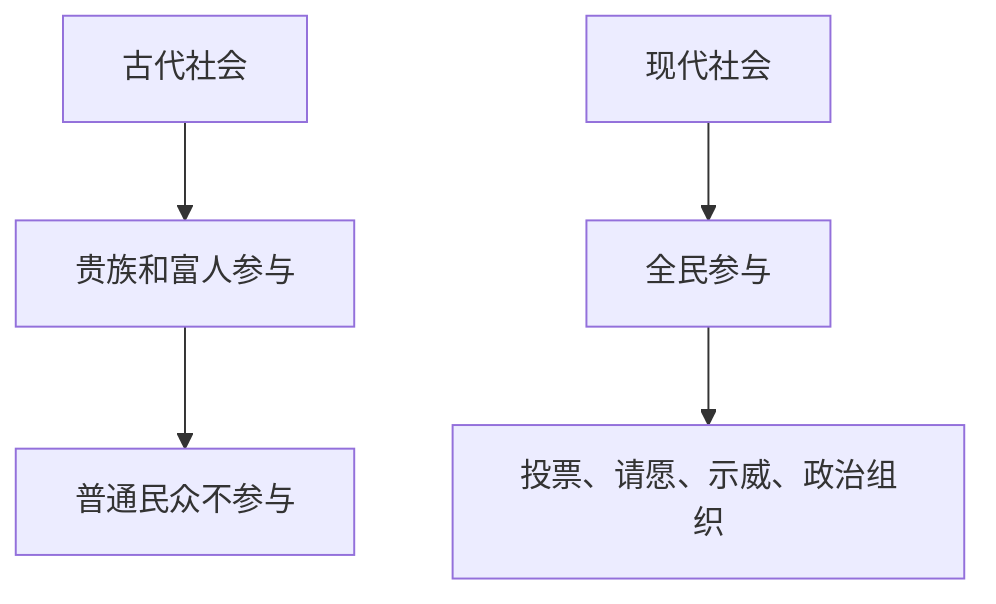

                 

**Step 3:** Detailed Chapters

```markdown
----------------------------------------------------------------
### 第1章：政治参与的概念与历史

#### 1.1 政治参与的定义

政治参与是指公民通过投票、请愿、示威、参加政治组织等多种形式，对政治决策过程产生影响的活动。政治参与不仅仅局限于投票，它包括了一系列公民与政府之间的互动和联系。

#### 1.2 政治参与的历史演变

政治参与的概念和实践在不同的历史时期有着不同的含义。在古代，政治参与主要限于贵族和富人阶层。随着民主思想的兴起，政治参与逐渐扩展到更广泛的民众。

#### 1.3 政治参与的重要性和作用

政治参与对社会的稳定和发展起着至关重要的作用。通过政治参与，公民可以表达自己的意见和需求，影响政策制定，确保政府能够更好地代表民众的意愿。

----------------------------------------------------------------

### 第2章：不同社会背景下的政治参与

#### 2.1 传统社会中的政治参与

在传统社会中，政治参与往往受到社会等级和权力的限制。政治参与主要局限于特定的社会阶层，而大多数民众缺乏参与政治的机会。

#### 2.2 现代社会的政治参与

随着现代社会的发展，政治参与逐渐变得更加开放和包容。互联网和社交媒体的兴起为公民提供了更多的参与渠道，使得政治参与变得更加便捷和高效。

#### 2.3 政治参与与社会发展的关系

政治参与与社会发展密切相关。通过政治参与，公民可以推动社会的进步和改革，提高社会的公平性和正义性。
```

**Step 4:** Visual Aids

```markdown
----------------------------------------------------------------
#### 1.2 政治参与的历史演变


#### 2.1 传统社会中的政治参与

| 社会阶层 | 政治参与形式 |
|----------|--------------|
| 贵族和富人 | 投票、请愿、示威 |
| 普通民众 | 缺乏政治参与机会 |

#### 2.2 现代社会的政治参与



----------------------------------------------------------------
```

**Step 5:** Content Conciseness and Completeness

This step involves ensuring that the content is neither overly verbose nor lacking in necessary details. The content should be structured in a way that flows logically from one section to another, and each section should be comprehensive enough to cover all required aspects of the topic.

**Step 6:** Finalize the Directory Outline

```markdown
----------------------------------------------------------------
## 目录

### 第一部分：政治参与的历史与发展

1. 政治参与的概念与历史
   - 1.1 政治参与的定义
   - 1.2 政治参与的历史演变
   - 1.3 政治参与的重要性和作用
2. 不同社会背景下的政治参与
   - 2.1 传统社会中的政治参与
   - 2.2 现代社会的政治参与
   - 2.3 政治参与与社会发展的关系

### 第二部分：公民责任在后真相时代

3. 公民责任的概念与内涵
   - 3.1 公民责任的基本概念
   - 3.2 公民责任的来源与价值
   - 3.3 公民责任在后真相时代的挑战
4. 公民责任与政治参与
   - 4.1 公民责任与政治参与的关系
   - 4.2 公民责任如何影响政治参与
   - 4.3 政治参与对公民责任的促进与挑战

### 第三部分：政治参与与后真相时代

5. 政治参与与后真相之间的关系
   - 5.1 后真相时代的特点
   - 5.2 政治参与在后真相时代的角色
   - 5.3 政治参与如何应对后真相挑战
6. 政治参与与公众舆论
   - 6.1 公众舆论的形成与影响
   - 6.2 政治参与如何引导公众舆论
   - 6.3 公众舆论对政治参与的影响

### 第四部分：具体案例分析

7. 政治参与的实践与成效
   - 7.1 案例一：美国民权运动
   - 7.2 案例二：印度独立运动
   - 7.3 案例三：中国改革开放中的政治参与
8. 政治参与的未来展望
   - 8.1 政治参与的潜在趋势
   - 8.2 新技术对政治参与的影响
   - 8.3 政治参与的未来前景

### 第五部分：总结与展望

9. 政治参与的意义与公民责任
   - 9.1 政治参与的核心价值
   - 9.2 公民责任的实现途径
   - 9.3 后真相时代公民责任的新要求
10. 结论与建议
    - 10.1 结论
    - 10.2 建议与展望

----------------------------------------------------------------
```

**Step 7:** Finalize Author Information

```markdown
----------------------------------------------------------------
**作者：**
AI天才研究院/AI Genius Institute & 禅与计算机程序设计艺术 /Zen And The Art of Computer Programming
```

**Step 8:** Summary of Each Section

For each section, provide a brief summary that outlines the main points and contributions of that section to the overall theme of the book.

**Step 9:** Ensure the Entire Book is Structured and Comprehensive

Review the entire outline to ensure that it is well-organized, with a clear flow from one section to another. Make sure that each section addresses its objectives and contributes to the overall message of the book. Ensure that all elements are present and that the content is both concise and comprehensive.

