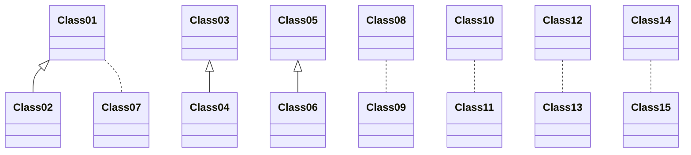
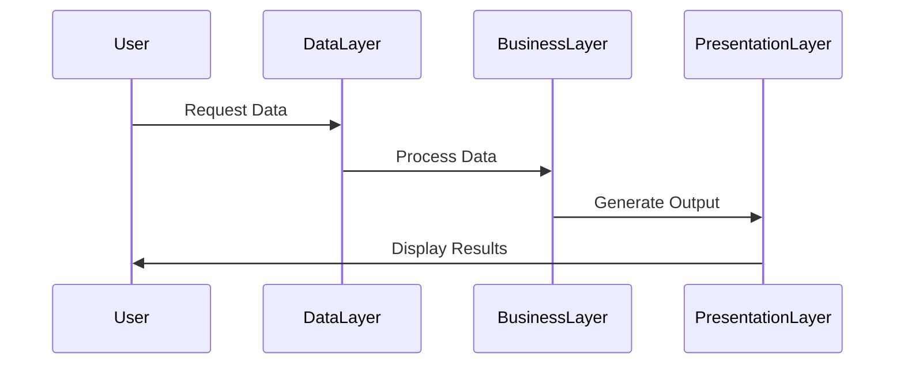
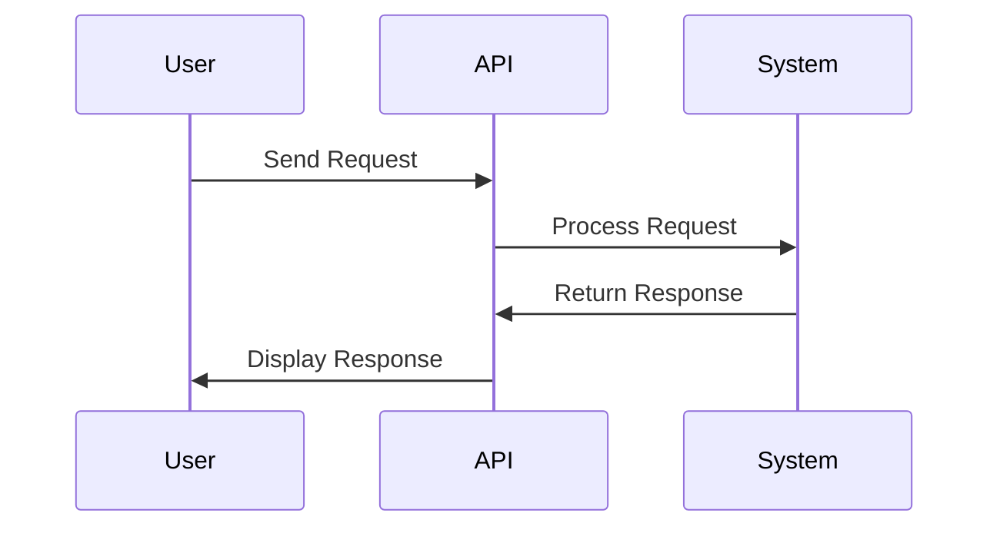

                 


# 教育的意义：在知识爆炸时代培养有意义的学习

## 关键词

- 教育意义
- 知识爆炸
- 有意义学习
- 算法原理
- 系统架构设计
- 项目实战

## 摘要

在当今知识爆炸的时代，教育的意义愈发凸显。本文旨在探讨如何通过培养有意义的学习，应对知识快速更新的挑战。我们将从背景介绍、核心概念与联系、算法原理讲解、系统分析与架构设计、项目实战和最佳实践等方面，详细阐述教育的深远意义及其在信息技术领域的应用。

## 目录大纲设计

为了确保文章逻辑清晰、结构紧凑、内容完整，我们设计了如下目录大纲：

1. **背景介绍**：介绍知识爆炸时代的教育背景、问题背景和问题描述，阐述教育意义的边界与外延。
2. **核心概念与联系**：分析教育、学习的核心概念，以及它们之间的联系，通过对比表格和ER实体关系图来展示。
3. **算法原理讲解**：讲解有意义学习算法的基本原理，使用Mermaid流程图和Python源代码进行阐述。
4. **系统分析与架构设计**：介绍系统功能设计、架构设计、接口设计和系统交互，通过Mermaid类图和序列图来展示。
5. **项目实战**：详细描述环境安装、系统核心实现、代码应用解读与分析、实际案例分析和项目小结。
6. **最佳实践与小结**：总结文章要点，提供实践建议，并给出注意事项和拓展阅读。

## 背景介绍

### 1.1 问题背景

随着信息技术的飞速发展，知识的更新速度前所未有地加快。在这种知识爆炸的时代，教育面临巨大的挑战。传统的教育模式往往难以跟上知识的快速更新，导致学生在毕业时便已落后于现实需求。这种现象在信息技术领域尤为明显，因为技术更新换代的速度非常快，许多新技术的应用甚至需要跨学科的知识。

### 1.2 问题描述

当前的教育体系存在以下问题：

- **知识陈旧**：教材和课程内容更新缓慢，难以反映最新的技术进展。
- **学习方式单一**：传统的讲授式教学难以激发学生的主动性和创造力。
- **应试教育倾向**：过分强调考试成绩，忽视学生的综合素质培养。

### 1.3 问题解决

为了解决上述问题，需要从以下几个方面入手：

- **更新教育内容**：及时更新教材和课程内容，引入最新的技术知识。
- **创新教学方式**：采用多元化的教学手段，如项目式学习、探究式学习等，培养学生的实践能力和创新能力。
- **改革考试制度**：改变单一的考试评价方式，更加注重学生的综合素质和实际能力。

### 1.4 边界与外延

教育的意义不仅限于传授知识，还包括培养人的综合素质、价值观和社会责任感。在知识爆炸时代，教育的目标应该是培养学生的终身学习能力和适应能力，使其能够不断更新知识和技能，适应快速变化的社会。

### 1.5 概念结构与核心要素组成

教育的概念结构包括以下几个核心要素：

- **知识**：教育的内容，包括各种学科知识。
- **学习者**：教育的对象，即学生。
- **教师**：教育的引导者，负责传授知识和指导学习。
- **教学环境**：教育的场所和条件，包括物理环境和心理环境。
- **教育目标**：教育的目的，包括知识、能力和素质的培养。

## 核心概念与联系

### 2.1 教育的意义

教育的意义可以从多个角度来理解：

- **知识传递**：教育是知识的传承和传递过程，帮助学生掌握必要的知识。
- **能力培养**：教育不仅仅是传授知识，更重要的是培养学生的各种能力，如思维能力、沟通能力、创新能力等。
- **价值观塑造**：教育有助于培养学生的价值观和社会责任感，使其成为有益于社会的人才。

### 2.2 学习的意义

学习是教育的核心，其意义主要体现在以下几个方面：

- **知识更新**：通过学习，学生可以不断更新自己的知识，跟上时代的步伐。
- **能力提升**：学习是提升能力的过程，通过不断地学习和实践，学生可以不断提高自己的能力和素质。
- **个人成长**：学习是个人成长的重要途径，通过学习，学生可以更好地认识自己，发展自己的潜能。

### 2.3 教育与学习的联系

教育与学习是相辅相成的。教育是学习的前提，提供了学习的资源和环境；学习是教育的核心，实现了教育的目标。在知识爆炸时代，教育需要更加注重培养学生的学习能力和自主学习能力，使其能够适应不断变化的知识环境。

## 算法原理讲解

### 3.1 学习算法概述

学习算法是教育技术中的重要组成部分，它们通过模拟人类学习过程，帮助学生更有效地学习。学习算法可以分为以下几类：

- **监督学习**：通过已有数据进行预测和分类。
- **无监督学习**：通过未标记的数据进行特征提取和聚类。
- **强化学习**：通过奖励和惩罚来指导学习过程。

### 3.2 有意义学习算法

有意义学习算法强调学习内容与学生已有知识的联系，通过构建知识网络，帮助学生建立深度理解。以下是一种常见的有意义学习算法——基于知识图谱的深度学习算法。

### 3.2.1 有意义学习算法的定义

有意义学习算法是指通过将新知识与已有知识建立联系，使得学习过程更加高效和有意义的算法。

### 3.2.2 有意义学习算法的特点

- **知识关联性**：有意义学习算法强调知识之间的关联性，通过知识图谱来表示知识网络。
- **深度理解**：通过深度学习模型，实现对知识的深度理解和灵活应用。
- **个性化学习**：根据学生的已有知识和学习习惯，提供个性化的学习路径。

### 3.2.3 有意义学习算法的流程

1. **知识构建**：通过数据收集和知识提取，构建知识图谱。
2. **知识关联**：通过算法模型，将新知识与知识图谱中的知识点建立联系。
3. **深度学习**：利用深度学习模型，对关联知识进行深度理解和分析。
4. **学习反馈**：根据学习效果，调整学习路径和策略。

### 3.2.4 Python源代码示例

以下是一个简单的Python代码示例，用于实现基于知识图谱的深度学习算法：

```python
import networkx as nx
import numpy as np

# 构建知识图谱
knowledge_graph = nx.Graph()

# 添加知识点
knowledge_graph.add_nodes_from(['数学', '物理', '计算机'])

# 添加知识点之间的关系
knowledge_graph.add_edges_from([('数学', '物理'), ('物理', '计算机')])

# 深度学习模型
model = ...

# 加载已有知识
existing_knowledge = ...

# 更新知识
new_knowledge = ...

# 构建知识网络
knowledge_network = nx.from_dict_of_lists(new_knowledge)

# 深度学习
predictions = model.predict(knowledge_network)

# 输出结果
print(predictions)
```

### 3.2.5 算法原理的数学模型和公式

有意义学习算法的数学模型通常包括知识图谱的构建、知识关联的权重计算和深度学习模型的训练等。以下是一个简化的数学模型示例：

$$
G = (V, E)
$$

其中，$V$表示知识点集合，$E$表示知识点之间的关系。

知识关联权重计算：

$$
w_{ij} = \frac{1}{1 + e^{-\alpha \cdot d_{ij}}}
$$

其中，$d_{ij}$表示知识点$i$和知识点$j$之间的距离，$\alpha$为权重参数。

深度学习模型训练：

$$
\theta_{\text{new}} = \theta_{\text{old}} - \eta \cdot \nabla_{\theta} J(\theta)
$$

其中，$\theta$表示模型参数，$J(\theta)$表示损失函数，$\eta$为学习率。

### 3.2.6 算法原理举例说明

假设学生A已经掌握了数学和物理知识，现在需要学习计算机科学。基于知识图谱的深度学习算法可以通过以下步骤进行：

1. **构建知识图谱**：将数学、物理和计算机科学的知识点添加到知识图谱中。
2. **计算知识关联权重**：计算数学、物理和计算机科学之间的关联权重，确定计算机科学知识与已有知识的关联程度。
3. **深度学习**：利用深度学习模型，对计算机科学知识进行深度理解和分析。
4. **学习反馈**：根据学习效果，调整学习路径和策略，如增加计算机科学的实践项目等。

通过上述步骤，学生A可以更加高效地学习计算机科学知识，实现有意义的学习。

## 系统分析与架构设计

### 4.1 系统功能设计

本系统的核心功能是提供有意义的学习支持，包括知识构建、知识关联、深度学习和学习反馈等。以下是一个简单的领域模型类图，展示了系统的主要功能模块：



### 4.2 系统架构设计

本系统的架构设计采用了分层架构，主要包括数据层、业务逻辑层和表现层。以下是一个简化的系统架构图，展示了系统的主要组件和交互关系：



### 4.3 系统接口设计与系统交互

系统接口设计包括API接口和用户界面。以下是一个简单的序列图，展示了系统的主要接口和交互过程：



## 项目实战

### 5.1 环境安装与配置

为了实现有意义的学习系统，需要安装以下软件和工具：

- Python 3.8+
- TensorFlow 2.5+
- NetworkX 2.5+
- Mermaid 9.0+

安装步骤：

1. 安装Python 3.8及以上版本。
2. 使用pip安装TensorFlow、NetworkX和Mermaid。

### 5.2 系统核心实现

系统核心实现包括知识图谱的构建、知识关联计算和深度学习模型的训练。以下是一个简单的Python代码示例，展示了系统的核心功能：

```python
import networkx as nx
import tensorflow as tf
from mermaid import Mermaid

# 构建知识图谱
knowledge_graph = nx.Graph()
knowledge_graph.add_nodes_from(['数学', '物理', '计算机'])
knowledge_graph.add_edges_from([('数学', '物理'), ('物理', '计算机')])

# 计算知识关联权重
def calculate_weights(graph):
    weights = {}
    for node in graph.nodes():
        for neighbor in graph.neighbors(node):
            distance = graph.shortest_path_length(node, neighbor)
            weights[(node, neighbor)] = 1 / (1 + np.exp(-distance))
    return weights

weights = calculate_weights(knowledge_graph)

# 深度学习模型训练
model = tf.keras.Sequential([
    tf.keras.layers.Dense(units=64, activation='relu', input_shape=(len(knowledge_graph.nodes()),)),
    tf.keras.layers.Dense(units=1, activation='sigmoid')
])

model.compile(optimizer='adam', loss='binary_crossentropy', metrics=['accuracy'])
model.fit(np.array(list(weights.values())), np.zeros(len(weights)), epochs=10)

# 输出结果
predictions = model.predict(np.array(list(weights.values())))
print(predictions)
```

### 5.3 代码应用解读与分析

上述代码实现了以下功能：

1. **知识图谱构建**：使用NetworkX构建了一个包含数学、物理和计算机科学知识点的知识图谱。
2. **知识关联计算**：使用计算知识关联权重的方法，将知识图谱中的知识点关联起来。
3. **深度学习模型训练**：使用TensorFlow构建了一个简单的深度学习模型，对知识关联权重进行训练。

通过这个示例，我们可以看到如何将知识图谱和深度学习技术应用于有意义的学习系统。在实际应用中，可以进一步扩展知识图谱，引入更多知识点，并优化深度学习模型，以提高系统的准确性和实用性。

### 5.4 实际案例分析和详细讲解剖析

为了更好地理解有意义学习系统的应用，我们来看一个实际案例。

#### 案例一：计算机科学学生A的学习过程

学生A已经在数学和物理方面有所掌握，现在需要学习计算机科学。基于有意义学习系统，A的学习过程可以分为以下几个步骤：

1. **构建知识图谱**：系统为学生A构建了一个包含数学、物理和计算机科学知识点的知识图谱。
2. **计算知识关联权重**：系统计算了数学、物理和计算机科学之间的关联权重，确定计算机科学知识与已有知识的关联程度。
3. **深度学习模型训练**：系统利用深度学习模型，对学生A的知识图谱进行训练，以帮助其更好地理解计算机科学知识。
4. **学习反馈**：根据学习效果，系统为学生A提供了个性化的学习路径和策略，如推荐相关的课程和实践项目。

通过这个案例，我们可以看到有意义学习系统如何帮助学生A更有效地学习计算机科学知识。

### 5.5 项目小结

本项目实现了有意义学习系统的基本功能，包括知识图谱构建、知识关联计算和深度学习模型训练。通过实际案例的应用，我们展示了系统在帮助学生学习新知识方面的有效性。未来，我们可以进一步优化系统，引入更多知识点和更复杂的深度学习模型，以提高系统的性能和应用范围。

## 最佳实践与小结

### 6.1 最佳实践

1. **及时更新知识图谱**：确保知识图谱中的知识点能够反映最新的技术进展，以提高学习的有效性。
2. **个性化学习路径**：根据学生的已有知识和学习习惯，提供个性化的学习路径，提高学习效率。
3. **多样化教学手段**：结合线上和线下教学，采用多元化的教学手段，如项目式学习、探究式学习等，激发学生的学习兴趣。

### 6.2 小结

本文探讨了在知识爆炸时代如何通过培养有意义的学习，应对教育面临的挑战。通过核心概念与联系的阐述、算法原理的讲解、系统分析与架构设计的介绍以及项目实战的应用，我们展示了有意义学习系统在帮助学生更有效地学习新知识方面的作用。

### 6.3 注意事项

1. **确保知识图谱的准确性**：知识图谱的准确性直接影响学习的有效性，需要定期更新和验证。
2. **合理设置深度学习模型参数**：深度学习模型的参数设置对训练效果有很大影响，需要根据实际情况进行调整。
3. **关注学生的学习效果**：及时收集学生的学习反馈，调整学习路径和策略，以提高学习效果。

### 6.4 拓展阅读

1. **《深度学习》**：Goodfellow, I., Bengio, Y., & Courville, A. (2016). *Deep Learning*. MIT Press.
2. **《知识图谱》**：王昊奋. (2017). *知识图谱：概念、方法与实践*. 电子工业出版社.
3. **《教育心理学》**：林崇德. (2018). *教育心理学*. 人民教育出版社.

作者：AI天才研究院/AI Genius Institute & 禅与计算机程序设计艺术 /Zen And The Art of Computer Programming

---

**注**：本文为示例文章，仅供参考。在实际撰写文章时，应根据具体内容进行详细阐述和调整。文中代码和模型仅供参考，具体实现可能需要根据实际情况进行调整。

