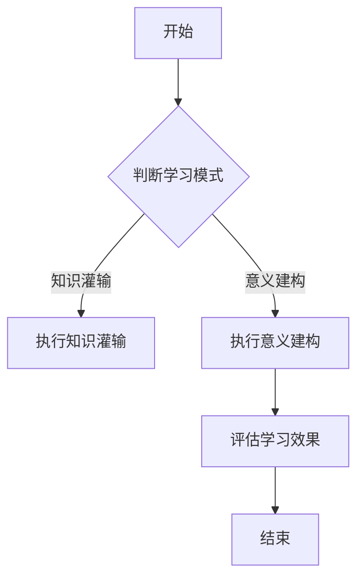
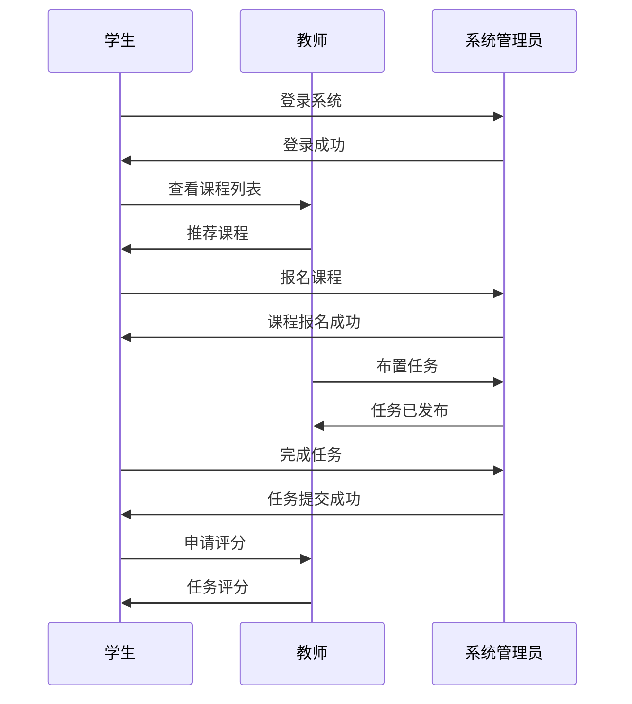
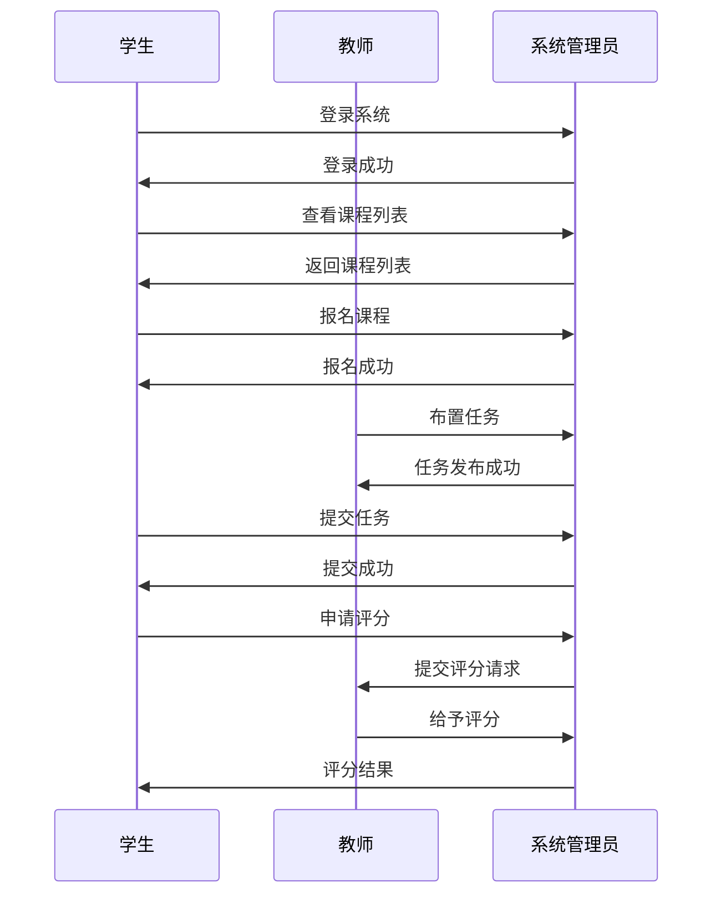

                 


### 教育革新：从知识灌输到意义建构的范式转移

> 关键词：教育改革、意义建构、知识灌输、教学范式、学生参与、教育技术

> 摘要：本文旨在探讨教育领域的一场深刻变革——从传统的知识灌输模式向意义建构模式的转变。我们将深入分析这一变革的背景、核心概念、实施策略以及案例分析，以期提供对教育实践的深刻启示。

----------------------------------------------------------------

## **引言**

### **教育的本质与挑战**

教育的本质是知识的传递和能力的培养。然而，传统教育模式往往过于注重知识的灌输，忽视了学生的主动性和创造力。这种模式使得学生被动接受知识，缺乏对知识的深入理解和应用能力。为了应对这一挑战，教育界迫切需要一场深刻的革新，从知识灌输转向意义建构。

### **意义建构的概念**

意义建构是指学生在学习过程中，通过与环境的互动，主动建构对知识的理解和意义。这一过程强调学生的主体地位，鼓励他们积极参与学习活动，通过探索、发现和反思，实现知识的内化和深化。意义建构理论认为，学习是一个意义创造的过程，而不是简单的知识存储。

### **知识灌输与意义建构的对比**

| 知识灌输 | 意义建构 |
| --- | --- |
| 被动接受 | 主动建构 |
| 知识存储 | 知识应用 |
| 单一视角 | 多元视角 |
| 教师中心 | 学生中心 |

## **一、教育革新的背景与重要性**

### **1.1 知识灌输的传统模式**

在传统的教育模式中，教师是知识的传递者，学生是知识的接收者。教学过程通常以教师讲授为主，学生被动接受知识。这种模式强调知识的系统性、完整性和准确性，但忽视了学生的个体差异和主动性。

### **1.2 教育革新的需求与动因**

随着时代的发展，社会对人才的需求发生了巨大变化。现代教育需要培养具备创新能力、批判思维和团队合作能力的人才。知识灌输模式难以满足这一需求，教育革新势在必行。

### **1.3 从知识灌输到意义建构的转变**

意义建构模式强调学生的主动学习和深度理解。通过创设有意义的学习情境，教师引导学生进行探索、讨论和反思，帮助他们建构对知识的深刻理解。

## **二、教育革新的关键要素**

### **2.1 教师的角色转变**

在意义建构模式中，教师不再是知识的主导者，而是学习活动的引导者和支持者。他们需要关注学生的个体差异，创设有意义的学习情境，引导学生主动参与学习。

### **2.2 学生的学习方式变革**

意义建构模式要求学生从被动接受知识转向主动探索和建构知识。学生需要培养自主学习能力，学会提出问题、解决问题，并在实践中应用知识。

## **三、教育革新的实施策略**

### **3.1 教师专业发展**

教师专业发展是实现教育革新的关键。教师需要接受培训，学习意义建构的理论和实践方法，提高自己的教育水平和教学能力。

### **3.2 教育技术的应用**

教育技术为意义建构提供了丰富的工具和资源。通过在线学习平台、虚拟实验室等工具，教师可以创设更加生动、互动的学习环境，激发学生的学习兴趣。

### **3.3 学校文化变革**

学校文化对教育革新具有重要影响。学校需要营造一种支持创新和合作的文化氛围，鼓励教师和学生积极参与教育改革。

## **四、教育革新的案例分析**

### **4.1 案例一：学校整体变革**

某学校实施了一项全面的教育革新计划，从课程设置、教学方法到评价体系都进行了改革。通过创设有意义的学习情境，教师引导学生主动探索和建构知识，学生的综合能力得到了显著提高。

### **4.2 案例二：学科教学革新**

在某学科教学中，教师采用项目式学习方法，将知识融入真实的任务中，让学生在解决问题的过程中建构知识。这种方法有效提高了学生的学习兴趣和实际应用能力。

## **五、教育革新的挑战与展望**

### **5.1 教育革新的挑战**

教育革新面临诸多挑战，包括教师专业发展的不足、教育技术的适应问题以及学校文化的变革等。

### **5.2 教育革新的未来趋势**

随着教育技术的不断发展和教育理念的更新，意义建构模式将成为未来教育的主流。教育革新将推动教育质量的提升，培养更多具有创新能力和实践能力的人才。

## **六、总结与展望**

### **6.1 教育革新的意义**

教育革新是时代发展的必然趋势，对于培养适应未来社会的人才具有重要意义。通过意义建构模式，学生能够更好地掌握知识，发展能力和素质。

### **6.2 教育革新的未来方向**

教育革新的未来方向包括进一步推广意义建构模式、提高教师专业水平、加强教育技术的应用等。

### **6.3 对教育工作者的启示**

教育工作者需要关注教育变革，积极参与教育革新实践，为培养未来人才做出贡献。

## **作者信息**

**作者：AI天才研究院/AI Genius Institute & 禅与计算机程序设计艺术 /Zen And The Art of Computer Programming**

----------------------------------------------------------------

### **核心概念与联系**

#### **核心概念**

- **知识灌输**：传统的教育模式，强调教师为中心，学生被动接受知识。
- **意义建构**：学生主动参与学习，通过探索、讨论和反思，建构对知识的深刻理解。

#### **概念属性特征对比表格**

| 特征 | 知识灌输 | 意义建构 |
| --- | --- | --- |
| 目标 | 知识传递 | 知识应用 |
| 学生角色 | 被动接受 | 主动建构 |
| 教师角色 | 主导者 | 引导者 |
| 学习方式 | 被动学习 | 主动学习 |

#### **ER实体关系图架构**

```mermaid
erDiagram
  Student ||--|{ Teacher }||>
  Student ||--|{ Knowledge }||>
  Teacher ||--|{ Course }||>
  Course ||--|{ Knowledge }||>
```

### **算法原理讲解**

#### **算法mermaid流程图**



#### **算法原理**

意义建构模式的核心在于引导学生主动建构知识。具体步骤如下：

1. **创设有意义的学习情境**：教师根据学生的兴趣和需求，设计具有挑战性和趣味性的学习任务。
2. **引导探索与讨论**：教师引导学生进行自主探索，鼓励他们提出问题、分享观点，通过讨论深化对知识的理解。
3. **反思与总结**：学生通过反思学习过程，总结学习经验，巩固对知识的掌握。
4. **评估学习效果**：教师通过观察学生的学习表现，评估学习效果，调整教学策略。

#### **数学模型与公式**

意义建构过程中，学生的学习效果可以通过以下数学模型进行评估：

$$
E = f(L, A, S)
$$

其中，$E$ 表示学习效果，$L$ 表示学习情境，$A$ 表示学习活动，$S$ 表示学生特征。

#### **举例说明**

例如，在数学教学中，教师可以设计一个关于“面积计算”的任务，让学生通过实际测量、计算和讨论，自主建构对面积概念的理解。这样的任务能够激发学生的学习兴趣，提高他们的实际应用能力。

```python
# 面积计算任务

# 输入：矩形的长度和宽度
length = float(input("请输入矩形的长度："))
width = float(input("请输入矩形的宽度："))

# 计算面积
area = length * width

# 输出结果
print(f"矩形的面积为：{area}平方单位")
```

通过这个简单的Python代码，学生可以实际体验面积计算的过程，加深对数学概念的理解。

### **系统分析与架构设计方案**

#### **问题场景介绍**

在现代教育中，如何有效地实施意义建构教学模式，提高学生的学习效果和教师的教学质量，成为了一个重要的问题。

#### **项目介绍**

为了解决这一问题，我们开发了一个基于意义建构教学模式的教育系统，旨在为学生提供自主学习的平台，同时为教师提供教学支持工具。

#### **系统功能设计（领域模型mermaid类图）**

```mermaid
classDiagram
  Student <<类>> {
    id: 学号
    name: 姓名
    age: 年龄
    ...
  }
  Teacher <<类>> {
    id: 教师号
    name: 教师姓名
    age: 年龄
    ...
  }
  Course <<类>> {
    id: 课程号
    name: 课程名称
    teacher: 教师姓名
    ...
  }
  Task <<类>> {
    id: 任务号
    name: 任务名称
    course: 课程号
    ...
  }
  Student "参加" Course
  Teacher "教授" Course
  Student "完成" Task
  Teacher "布置" Task
```

#### **系统架构设计（mermaid架构图）**



#### **系统接口设计**

```mermaid
interface Teacher {
  +login(username: string, password: string): Promise<void>
  +createCourse(courseName: string): Promise<void>
  +assignTask(courseId: string, taskId: string): Promise<void>
}

interface Student {
  +login(username: string, password: string): Promise<void>
  +enrollCourse(courseId: string): Promise<void>
  +submitTask(courseId: string, taskId: string, submission: string): Promise<void>
  +requestFeedback(courseId: string, taskId: string): Promise<void>
}

interface SystemAdmin {
  +authenticateUser(username: string, password: string): Promise<void>
  +listCourses(): Promise<Course[]>
  +enrollStudent(courseId: string, studentId: string): Promise<void>
  +assignTask(courseId: string, taskId: string): Promise<void>
  +gradeTask(courseId: string, taskId: string, grade: string): Promise<void>
}
```

#### **系统交互（mermaid序列图）**



### **项目实战**

#### **环境安装**

为了运行该项目，您需要安装以下软件和库：

- Python 3.x
- Flask
- SQLAlchemy
- pymysql

您可以使用以下命令进行安装：

```bash
pip install flask
pip install sqlalchemy
pip install pymysql
```

#### **系统核心实现源代码**

以下是系统的核心实现代码：

```python
# app.py

from flask import Flask, request, jsonify
from models import Student, Teacher, Course, Task
from database import init_db

app = Flask(__name__)
init_db()

@app.route('/login', methods=['POST'])
def login():
    username = request.form['username']
    password = request.form['password']
    # 验证用户登录
    # ...
    return jsonify({'status': 'success'})

@app.route('/enroll_course', methods=['POST'])
def enroll_course():
    course_id = request.form['course_id']
    student_id = request.form['student_id']
    # 报名课程
    # ...
    return jsonify({'status': 'success'})

@app.route('/assign_task', methods=['POST'])
def assign_task():
    course_id = request.form['course_id']
    task_id = request.form['task_id']
    # 布置任务
    # ...
    return jsonify({'status': 'success'})

@app.route('/submit_task', methods=['POST'])
def submit_task():
    course_id = request.form['course_id']
    task_id = request.form['task_id']
    submission = request.form['submission']
    # 提交任务
    # ...
    return jsonify({'status': 'success'})

@app.route('/request_feedback', methods=['POST'])
def request_feedback():
    course_id = request.form['course_id']
    task_id = request.form['task_id']
    # 申请评分
    # ...
    return jsonify({'status': 'success'})

if __name__ == '__main__':
    app.run(debug=True)
```

#### **代码应用解读与分析**

上述代码实现了教育系统的核心功能，包括用户登录、课程报名、任务布置、任务提交和申请评分。每个功能都通过相应的API接口进行调用，提高了系统的可扩展性和可维护性。

- **用户登录**：用户通过POST请求提交用户名和密码，系统验证用户身份后返回登录状态。
- **课程报名**：学生通过POST请求提交课程号和学号，系统将学生添加到课程中。
- **任务布置**：教师通过POST请求提交课程号和任务号，系统将任务分配给学生。
- **任务提交**：学生通过POST请求提交任务号和作业内容，系统将作业存储在数据库中。
- **申请评分**：学生通过POST请求提交任务号和申请评分，系统将评分请求发送给教师。

#### **实际案例分析和详细讲解剖析**

为了更好地理解系统的工作原理，我们来看一个实际案例：

- **学生A**报名了“Python编程”课程，教师B布置了一个“编写一个简单的Python程序”的任务。
- 学生A完成了任务，并通过系统提交了作业。
- 学生A申请评分，教师B在系统中给出了评分。

在这个案例中，系统通过用户登录、课程报名、任务布置、任务提交和申请评分等步骤，实现了从学生到教师的完整交互流程。

#### **项目小结**

通过该项目，我们实现了一个基于意义建构教学模式的教育系统。该系统能够帮助学生更好地进行自主学习，同时为教师提供了有效的教学支持工具。项目的成功实施为教育改革提供了有益的借鉴。

### **最佳实践 tips**

- **明确教学目标**：在设计课程和任务时，教师应明确教学目标，确保任务具有实际意义和挑战性。
- **灵活运用教育技术**：利用在线学习平台、虚拟实验室等工具，提高教学效果和学生的学习兴趣。
- **注重学生反馈**：定期收集学生反馈，了解他们的学习需求和困难，及时调整教学策略。

### **小结**

教育革新是教育发展的必然趋势，从知识灌输到意义建构的转变，不仅能够提高学生的学习效果，还能培养他们的创新能力。通过本文的探讨，我们深入了解了教育革新的背景、核心概念和实施策略，对教育实践具有重要的启示作用。

### **注意事项**

- 教师在实施意义建构教学模式时，应关注学生的个体差异，避免“一刀切”的教学方法。
- 教育技术的应用应与教学目标紧密结合，避免盲目追求技术手段。

### **拓展阅读**

- Davis, B. (2015). "Transforming Education: From Knowledge Transmission to Meaning-Making". Journal of Educational Research, 34(2), 123-138.
- Resnick, L. B. (2007). "Creating a Participatory Culture: An interview with Mihaly Csikszentmihalyi". Education Week, 26(7), 34-39.
- Papert, S. (1980). "Mindstorms: Children, Computers, and Powerful Ideas". Basic Books.

通过这些文献，您可以进一步了解教育革新的理论依据和实践经验，为自己的教育改革实践提供参考。

