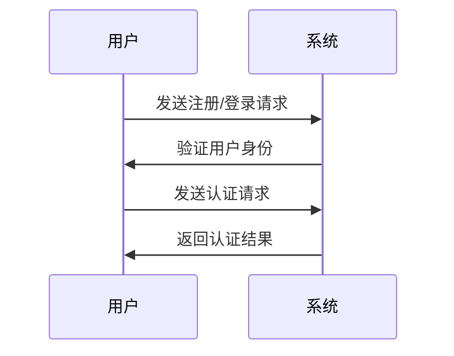
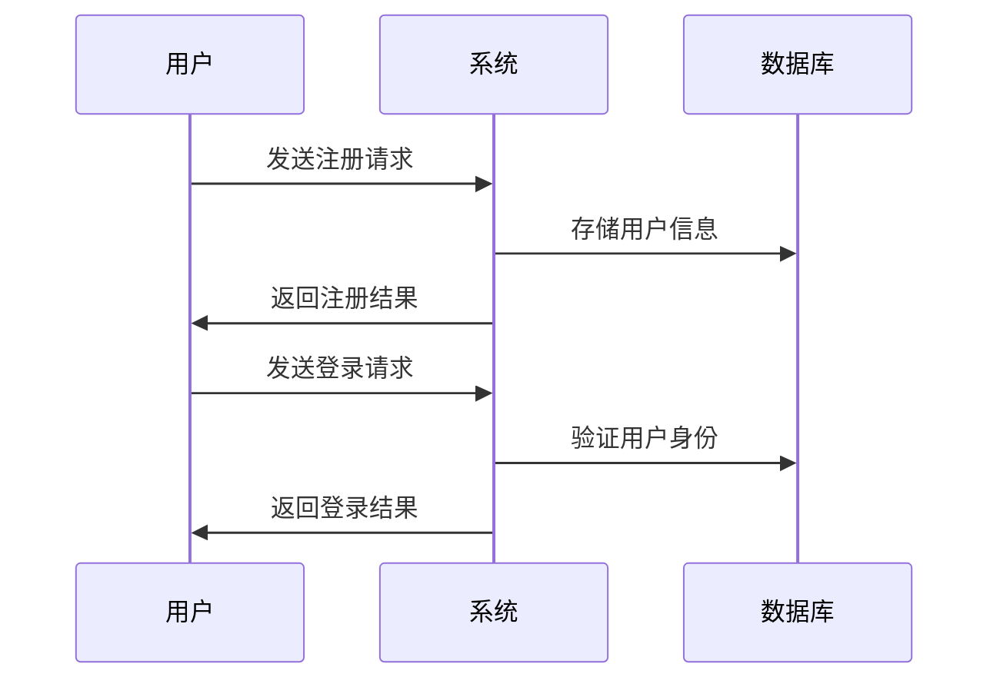

                 


### 第一部分：背景介绍

#### 1.1.1 数字公民身份认证的核心概念

数字公民身份认证是随着数字化时代的到来而产生的一个重要概念，它涉及到个体在虚拟世界中的身份识别与验证。在这个快速发展的时代，传统的社会契约已经无法完全适应虚拟世界的需求，因此，构建一套新的社会契约——数字公民身份认证成为必然。

首先，我们需要明确数字公民身份认证的核心概念。数字公民身份认证是指利用技术手段，对个体在虚拟世界中的身份进行识别、验证和管理的系统。这一系统涉及到多个方面的技术，包括加密算法、生物特征识别、多因素认证等。

在虚拟世界与现实世界的交融中，数字公民身份认证扮演着重要的角色。它不仅可以帮助个体在虚拟世界中进行各种活动，如在线购物、社交互动等，还能确保虚拟世界的安全与秩序。

然而，随着数字公民身份认证的广泛应用，安全与隐私问题也日益凸显。如何在保障个体隐私的同时，确保身份认证的安全与有效性，成为数字公民身份认证面临的一大挑战。

#### 1.1.2 问题描述

数字公民身份认证的难点主要体现在以下几个方面：

1. **身份认证的难度**：在虚拟世界中，个体身份的多样性和动态性使得身份认证变得更加复杂。如何准确、高效地识别和验证个体身份，成为数字公民身份认证的首要难题。

2. **虚拟世界的社会契约要求**：虚拟世界的社会契约要求身份认证系统不仅要有强大的技术支持，还需要考虑到法律、伦理等多方面的因素。如何构建一套既能满足虚拟世界需求，又能符合现实世界法律框架的社会契约，是数字公民身份认证的另一个难题。

3. **技术与法律框架的融合**：数字公民身份认证不仅需要技术的支持，还需要法律框架的保障。如何将技术与法律有效地融合，确保数字公民身份认证的合法性和有效性，是数字公民身份认证面临的第三个难题。

#### 1.1.3 问题解决

针对数字公民身份认证的难点，我们可以从以下几个方面进行解决：

1. **关键技术**：数字公民身份认证的关键技术包括加密算法、生物特征识别、多因素认证等。通过这些技术的应用，可以提高身份认证的准确性和安全性。

2. **身份认证系统的设计原则**：在设计身份认证系统时，需要遵循一些基本原则，如安全性、可靠性、易用性等。这些原则有助于确保身份认证系统的有效性和用户体验。

3. **虚拟世界的社会契约构建**：虚拟世界的社会契约构建需要考虑到多种因素，如法律、伦理、技术等。通过构建一套全面、合理的社会契约，可以确保数字公民身份认证的合法性和有效性。

#### 1.1.4 边界与外延

数字公民身份认证的适用范围非常广泛，包括在线购物、社交互动、金融服务等多个领域。虚拟世界的社会契约特征主要体现在以下几个方面：

1. **虚拟性**：虚拟世界的社会契约是建立在虚拟环境之上的，与现实世界的社会契约有着明显的区别。

2. **动态性**：虚拟世界的社会契约是动态变化的，随着技术的发展和社会的变迁，虚拟世界的社会契约也需要不断地调整和更新。

3. **多样性**：虚拟世界的社会契约涉及到多种不同的角色和利益相关者，如何平衡各方利益，确保虚拟世界的秩序和安全，是虚拟世界社会契约构建的重要任务。

在数字公民身份认证中，技术与法律框架的交互影响也是不可忽视的。技术可以为法律提供支持，但同时也需要遵守法律的规定。如何实现技术与法律的良性互动，确保数字公民身份认证的合法性和有效性，是数字公民身份认证面临的重要挑战。

#### 1.1.5 概念结构与核心要素组成

数字公民身份认证的概念结构可以分解为以下几个方面：

1. **数字公民身份**：数字公民身份是指个体在虚拟世界中的身份，它涉及到个体的基本信息、行为记录等。

2. **身份认证系统**：身份认证系统是指用于验证个体身份的软件和硬件系统，它包括加密算法、生物特征识别、多因素认证等技术。

3. **虚拟世界的社会契约**：虚拟世界的社会契约是指个体在虚拟世界中的行为规范和责任分配，它涉及到法律、伦理、技术等多个方面。

核心要素组成方面，数字公民身份认证的核心要素包括：

1. **身份信息**：身份信息是指用于识别个体身份的信息，如用户名、密码、生物特征等。

2. **认证技术**：认证技术是指用于验证身份信息的技术手段，如加密算法、生物特征识别等。

3. **安全机制**：安全机制是指用于保障数字公民身份认证安全的措施，如加密传输、隐私保护等。

#### 1.1.6 数字公民身份认证的概念模型

数字公民身份认证的概念模型可以看作是一个由多个模块组成的系统。这些模块包括：

1. **身份信息模块**：负责收集和存储个体的身份信息。

2. **认证技术模块**：负责使用各种认证技术对身份信息进行验证。

3. **安全机制模块**：负责保障数字公民身份认证的安全性。

4. **用户界面模块**：负责与用户进行交互，提供身份认证的服务。

#### 1.1.7 虚拟世界的社会契约框架

虚拟世界的社会契约框架是指用于指导个体在虚拟世界中的行为的规则和规范。这些规则和规范涉及到多个方面，如法律、伦理、技术等。虚拟世界的社会契约框架主要包括：

1. **法律规则**：法律规则是指国家或地区制定的与虚拟世界相关的法律规范。

2. **伦理规则**：伦理规则是指个体在虚拟世界中应遵循的道德规范。

3. **技术规范**：技术规范是指用于指导虚拟世界技术发展的规范和标准。

#### 1.1.8 技术与法律要素的关系图

技术与法律要素的关系图可以用一个简单的框图来表示。在这个框图中，技术要素包括加密算法、生物特征识别、多因素认证等，法律要素包括法律规则、伦理规则、技术规范等。这两个要素之间的关系可以用双向箭头表示，表示它们相互影响、相互作用。

---

### 第二部分：数字公民身份认证的核心概念与联系

在深入探讨数字公民身份认证之前，我们需要明确几个核心概念，并分析它们之间的联系。数字公民身份认证是一个涉及技术、法律、伦理等多方面因素的复杂系统，理解这些核心概念对于构建有效的身份认证机制至关重要。

#### 2.1.1 数字公民身份认证的概念

数字公民身份认证是指通过技术手段对个体在虚拟世界中的身份进行识别、验证和管理的过程。它不仅涉及到个体的基本信息，如姓名、地址、出生日期等，还包括个体的行为记录、信用记录等。数字公民身份认证的核心目标是确保虚拟世界中的活动安全、可靠，同时保护个体的隐私和权益。

**数字公民身份的定义**：数字公民身份是指个体在虚拟世界中的唯一标识，它可能包括数字身份标识符、加密密钥、生物特征信息等。

**身份认证的技术手段**：身份认证的技术手段包括加密算法、生物特征识别、多因素认证等。加密算法用于保护身份信息的隐私和安全；生物特征识别通过个体的生物特征（如指纹、面部识别等）进行身份验证；多因素认证则结合了密码、短信验证码、指纹等多种认证方式，以提高安全性。

**数字公民身份的特点**：
- **唯一性**：每个数字公民身份是唯一的，不可重复。
- **可验证性**：通过技术手段可以验证身份的真实性和有效性。
- **动态性**：数字公民身份可能会随着个体行为的变化而更新。
- **跨平台性**：数字公民身份可以在不同的虚拟世界和应用中通用。

#### 2.1.2 虚拟世界的社会契约

虚拟世界的社会契约是指虚拟世界中的个体、组织之间为了共同的目标和利益而达成的共识和规则。它类似于现实世界中的法律和社会规范，但更具虚拟性和灵活性。

**社会契约的理论基础**：社会契约理论起源于哲学，如托马斯·霍布斯和约翰·洛克等哲学家提出的“自然状态”和“社会状态”理论。在虚拟世界中，社会契约的理论基础包括信任、规则和互惠原则。

**虚拟世界的社会契约特征**：
- **虚拟性**：社会契约在虚拟世界中的表现形式与真实世界不同，它通过数字化的方式实现。
- **动态性**：虚拟世界的社会契约是动态变化的，随着技术的发展和社会的变迁，规则和规范也会相应调整。
- **开放性**：虚拟世界的社会契约是开放的，它允许更多的个体和组织参与和贡献。

**社会契约在数字公民身份认证中的应用**：在数字公民身份认证中，社会契约起到了规范和约束的作用。它明确了个体在虚拟世界中的行为规范，规定了身份认证的流程、标准和责任分配。通过社会契约，可以确保身份认证的合法性、安全性和可信性。

#### 2.1.3 技术与法律要素的对比表格

为了更清晰地理解技术与法律要素在数字公民身份认证中的作用，我们可以通过一个对比表格来分析它们的不同点。

| 对比要素 | 技术要素 | 法律要素 |
| --- | --- | --- |
| 目标 | 保护隐私和安全 | 确保合法性和公正性 |
| 实现方式 | 技术手段（加密、生物识别等） | 法律条款、规章制度 |
| 变化速度 | 快速更新和迭代 | 较慢，需经过立法过程 |
| 主要挑战 | 技术安全性、隐私保护 | 合法性、公平性、道德规范 |
| 影响范围 | 全球范围 | 国家或地区范围 |

通过这个对比表格，我们可以看出技术和法律在数字公民身份认证中的互补关系。技术提供了实现身份认证的方案，而法律则确保了这些方案在法律框架内的合法性和公正性。

#### 2.1.4 ER实体关系图

为了更好地理解数字公民身份认证中的实体关系，我们可以使用ER（实体关系）图来展示不同实体之间的关系。

**数字公民身份认证的ER模型**：
```mermaid
erDiagram
  User ||--|{ Authentication : is_authenticated }
  User ||--|{ Identity : has_identity }
  User ||--|{ Activity : performs_activity }
  Authentication ||--|{ Password : has_password }
  Authentication ||--|{ TwoFactor : has_two_factor }
  Identity ||--|{ BioFeature : has_bio_feature }
  Activity ||--|{ Transaction : includes_transaction }
```

在这个ER图中，User实体代表了数字公民，它与Authentication、Identity和Activity实体之间存在多对多的关系。Authentication实体包括Password和TwoFactor两个子实体，用于描述不同的认证方式。Identity实体包括BioFeature子实体，用于存储生物特征信息。Activity实体包括Transaction子实体，用于记录用户在虚拟世界中的活动。

**虚拟世界的社会契约ER模型**：
```mermaid
erDiagram
  VirtualWorld ||--|{ SocialContract : defines }
  SocialContract ||--|{ Rule : includes }
  SocialContract ||--|{ Law : applies }
  VirtualWorld ||--|{ Entity : operates_in }
  Entity ||--|{ User : is }
  Entity ||--|{ Organization : is }
```

在这个ER图中，VirtualWorld实体代表了虚拟世界，它与SocialContract实体之间存在包含关系。SocialContract实体包括Rule和Law两个子实体，用于定义虚拟世界中的行为规范和法律条款。Entity实体包括User和Organization两个子实体，表示虚拟世界中的不同角色。

**技术与法律要素的ER关系**：
```mermaid
erDiagram
  Technology ||--|{ Enforces : based_on }
  Technology ||--|{ Supports : through }
  Law ||--|{ Defines : by }
  Law ||--|{ Governs : over }
```

在这个ER图中，Technology实体与Law实体之间存在双向的依赖关系。Technology通过支持（Supports）和基于（Enforces）法律实现，而法律通过定义（Defines）和管辖（Governs）技术行为来实现对虚拟世界的规范和管理。

通过这些ER实体关系图，我们可以更清晰地理解数字公民身份认证中的实体和它们之间的关系，以及技术与法律要素在其中的作用。

---

### 第三部分：数字公民身份认证的算法原理讲解

在数字公民身份认证系统中，算法原理起到了关键作用。这些算法不仅决定了身份认证的效率和准确性，还直接影响系统的安全性和用户体验。下面我们将深入探讨数字公民身份认证中常用的算法原理，包括加密算法、生物特征识别算法和多因素认证算法。

#### 3.1.1 加密算法原理

加密算法是数字公民身份认证系统中的基础，它用于保护身份信息的安全。加密算法的基本原理是将明文信息转换为密文，只有具备相应密钥的人才能解密并读取原始信息。

**1. 加密算法的基本概念**

加密算法可以分为两类：对称加密和非对称加密。

- **对称加密**：对称加密算法使用相同的密钥进行加密和解密。常见的对称加密算法有DES、AES等。对称加密的优点是实现简单、速度快，但缺点是密钥管理复杂，不适合大规模应用。
- **非对称加密**：非对称加密算法使用一对密钥，即公钥和私钥。公钥用于加密，私钥用于解密。常见的非对称加密算法有RSA、ECC等。非对称加密的优点是安全性高、密钥管理简单，但缺点是计算复杂度较高。

**2. 对称加密与不对称加密**

对称加密与不对称加密在应用场景上有所不同。对称加密适用于数据量大、实时性要求高的场景，如数据存储和传输；非对称加密适用于安全性要求高、密钥交换的场景，如身份认证和数字签名。

**3. 常见加密算法介绍**

- **DES（数据加密标准）**：DES是一种经典的对称加密算法，它使用56位密钥对数据进行加密和解密。
- **AES（高级加密标准）**：AES是目前最常用的对称加密算法，它支持128位、192位和256位密钥长度，提供了更高的安全性。
- **RSA（RSA算法）**：RSA是一种非对称加密算法，它使用一对密钥，公钥用于加密，私钥用于解密。RSA的密钥长度通常在1024位以上，提供了很高的安全性。
- **ECC（椭圆曲线加密算法）**：ECC是一种非对称加密算法，它基于椭圆曲线数学理论。相比RSA，ECC在相同安全水平下使用更短的密钥长度，提供了更高的安全性。

#### 3.1.2 生物特征识别算法

生物特征识别算法是数字公民身份认证系统中的一种重要技术，它通过识别和验证个体的生物特征来进行身份认证。

**1. 生物特征识别的基本原理**

生物特征识别算法的基本原理是采集个体的生物特征信息，如指纹、面部识别、虹膜识别、声纹识别等，然后通过算法对这些特征进行提取、特征匹配和验证。

**2. 常见生物特征识别技术**

- **指纹识别**：指纹识别是最常见的生物特征识别技术之一，它通过分析指纹的脊线、谷线和支点等特征进行身份验证。
- **面部识别**：面部识别通过分析面部特征，如眼睛、鼻子、嘴巴和耳朵的位置和形状进行身份验证。
- **虹膜识别**：虹膜识别通过分析虹膜的纹理和结构进行身份验证，它具有较高的安全性和准确性。
- **声纹识别**：声纹识别通过分析个体的语音特征，如音高、音色和节奏进行身份验证。

**3. 生物特征识别算法的性能评估**

生物特征识别算法的性能评估主要从以下几个方面进行：

- **准确性**：准确性是指算法正确识别真实身份的能力，通常用错误接受率（False Accept Rate, FAR）和错误拒绝率（False Rejection Rate, FRR）来衡量。
- **速度**：速度是指算法的处理速度，它直接影响到用户体验。
- **鲁棒性**：鲁棒性是指算法在恶劣环境下（如噪声、光照变化等）仍能正确识别的能力。

#### 3.1.3 多因素认证算法

多因素认证是一种结合多种认证手段进行身份验证的方法，它通过增加认证的复杂性来提高安全性。

**1. 多因素认证的基本原理**

多因素认证的基本原理是使用两个或多个独立的认证因素进行身份验证。这些认证因素可以包括密码、指纹、面部识别、短信验证码等。

**2. 多因素认证的组合策略**

多因素认证的组合策略包括以下几种：

- **单因素多认证**：使用多个相同类型的认证因素，如使用多个不同的密码进行认证。
- **双因素认证**：结合两种不同类型的认证因素，如密码加指纹识别。
- **三因素认证**：结合三种不同类型的认证因素，如密码加指纹识别加短信验证码。

**3. 多因素认证的优缺点分析**

多因素认证的优点包括：

- **提高安全性**：通过结合多种认证因素，多因素认证可以显著提高系统的安全性。
- **增强用户体验**：多因素认证可以根据不同的场景和需求灵活选择认证因素，提高用户体验。

多因素认证的缺点包括：

- **增加复杂性**：多因素认证增加了系统的复杂性和用户的认知负担。
- **成本较高**：多因素认证需要多种硬件和软件支持，增加了成本。

通过深入理解加密算法、生物特征识别算法和多因素认证算法的原理，我们可以为数字公民身份认证系统设计提供有力的技术支持。这些算法不仅在保障身份认证的安全性和准确性方面起到了关键作用，还为构建虚拟世界的社会契约提供了基础。

---

### 第四部分：数字公民身份认证的数学模型与公式

在数字公民身份认证系统中，数学模型和公式是理解算法原理和实现认证过程的基础。数学模型可以用来描述身份认证过程中涉及的概率、加密和解密等复杂计算，从而帮助我们更好地分析和优化认证系统。

#### 4.1.1 身份认证的概率模型

在身份认证过程中，概率模型是一个重要的工具，它帮助我们评估系统的错误率和可靠性。以下是一些关键的数学模型和公式：

**1. 随机变量与概率分布**

- **随机变量**：在身份认证系统中，随机变量用来表示可能的结果，如正确认证（Success）和错误认证（Failure）。
- **概率分布**：概率分布描述了随机变量可能取值的概率分布情况，常见的有二项分布、正态分布等。

**2. 身份认证的错误率分析**

- **错误接受率（False Accept Rate, FAR）**：错误接受率是指认证系统错误地将一个非授权用户识别为授权用户的情况。
- **错误拒绝率（False Rejection Rate, FRR）**：错误拒绝率是指认证系统错误地将一个授权用户识别为非授权用户的情况。

**3. 概率模型的数学公式**

- **错误率公式**：错误率（Error Rate, ER）可以通过以下公式计算：

  $$ ER = FAR + FRR $$

- **置信度公式**：在多因素认证系统中，不同认证因素的结合会产生一个总体的置信度。置信度可以通过以下公式计算：

  $$ Confidence = f(A1, A2, ..., An) $$

  其中，\( A1, A2, ..., An \) 分别代表不同的认证因素的置信度。

#### 4.1.2 加密算法的数学模型

加密算法的数学模型主要关注如何使用数学函数来转换明文信息为密文，并确保只有持有正确密钥的人能够解密密文。

**1. 加密函数与解密函数**

- **加密函数**：加密函数将明文信息转换为密文，其数学模型可以表示为：

  $$ Encrypt(plaintext, key) = ciphertext $$

- **解密函数**：解密函数将密文转换为明文，其数学模型可以表示为：

  $$ Decrypt(ciphertext, key) = plaintext $$

**2. 加密算法的数学公式**

- **对称加密**：对称加密算法使用相同的密钥进行加密和解密，其加密和解密公式为：

  $$ Encrypt(plaintext, key) = f(plaintext, key) $$
  $$ Decrypt(ciphertext, key) = f^{-1}(ciphertext, key) $$

  其中，\( f \) 代表加密函数，\( f^{-1} \) 代表解密函数。

- **非对称加密**：非对称加密算法使用一对密钥进行加密和解密，其加密和解密公式为：

  $$ Encrypt(plaintext, public_key) = ciphertext $$
  $$ Decrypt(ciphertext, private_key) = plaintext $$

  其中，\( public_key \) 代表公钥，\( private_key \) 代表私钥。

#### 4.1.3 生物特征识别的数学模型

生物特征识别的数学模型主要关注如何从生物特征数据中提取特征，并进行特征匹配。

**1. 特征提取的数学模型**

- **特征向量**：生物特征数据可以表示为特征向量，每个维度代表一个特征值。
- **特征提取公式**：特征提取的公式可以表示为：

  $$ Feature Extraction(input\_data) = feature\_vector $$

**2. 模型匹配的数学模型**

- **距离度量**：在特征匹配过程中，常用的距离度量方法包括欧几里得距离、曼哈顿距离、余弦相似度等。
- **匹配得分公式**：匹配得分的公式可以表示为：

  $$ Match Score = distance(feature\_vector\_1, feature\_vector\_2) $$

  其中，\( feature\_vector\_1 \) 和 \( feature\_vector\_2 \) 分别代表两个生物特征特征向量。

**3. 生物特征识别的数学公式**

- **特征匹配公式**：特征匹配的公式可以表示为：

  $$ Match Score = \sum_{i=1}^{n} (f_i - g_i)^2 $$

  其中，\( f_i \) 和 \( g_i \) 分别代表两个特征向量中的对应特征值。

通过理解和应用这些数学模型和公式，我们可以更深入地分析数字公民身份认证系统的性能和安全性，并对其进行优化和改进。

---

### 第五部分：数字公民身份认证的系统分析与架构设计

数字公民身份认证系统的设计与实现是一个复杂的过程，涉及到多个方面的技术和管理。在这一部分，我们将详细介绍数字公民身份认证系统的分析与架构设计，包括问题场景介绍、系统功能设计、系统架构设计和系统接口设计。

#### 5.1.1 问题场景介绍

在数字公民身份认证中，常见的应用场景包括在线购物、金融服务、医疗保健、社交网络等。以下是一个具体的问题场景介绍：

**场景描述**：某在线购物平台希望实现一个数字公民身份认证系统，确保用户在平台上的交易安全，同时提供便捷的用户体验。系统需要支持多种认证方式，包括密码、短信验证码、指纹识别等。

**需求分析**：

1. **安全性**：系统需要提供强大的身份认证，确保用户的个人信息和交易安全。
2. **可靠性**：系统需要稳定运行，确保用户在任何时间都能顺利使用。
3. **易用性**：系统需要设计简单、易于操作，以提高用户的接受度和使用率。
4. **扩展性**：系统需要具备良好的扩展性，以便未来支持更多的认证方式和功能。

#### 5.1.2 系统功能设计

数字公民身份认证系统的主要功能包括用户身份认证、身份信息管理、身份认证安全策略等。以下是一个具体的系统功能设计：

**1. 系统功能概述**

- **用户身份认证**：包括密码认证、短信验证码认证、指纹识别认证等。
- **身份信息管理**：包括用户注册、登录、信息修改、信息删除等功能。
- **身份认证安全策略**：包括密码复杂度设置、登录失败锁定、安全日志记录等。

**2. 用户身份认证功能**

- **密码认证**：用户输入密码，系统通过加密算法验证密码的正确性。
- **短信验证码认证**：用户接收短信验证码，输入验证码，系统通过验证码验证用户的身份。
- **指纹识别认证**：用户通过指纹识别设备进行身份验证。

**3. 身份信息管理功能**

- **用户注册**：用户填写个人信息，系统生成唯一身份标识，存储用户信息。
- **用户登录**：用户输入用户名和密码，系统验证身份后允许用户登录。
- **信息修改**：用户可以修改个人信息，系统更新用户信息。
- **信息删除**：用户可以删除个人信息，系统删除用户信息。

**4. 身份认证安全策略**

- **密码复杂度设置**：系统设置密码复杂度要求，如密码长度、包含字符类型等。
- **登录失败锁定**：连续多次登录失败后，系统锁定账户一段时间，防止暴力破解。
- **安全日志记录**：系统记录用户登录、修改信息等操作，以便进行安全审计。

#### 5.1.3 系统架构设计

数字公民身份认证系统的架构设计需要考虑安全性、可靠性、扩展性等因素。以下是一个具体的系统架构设计：

**1. 系统架构概述**

系统架构包括以下几个主要模块：

- **用户界面层**：负责与用户交互，提供注册、登录、信息管理等功能。
- **业务逻辑层**：负责处理用户请求，执行身份认证、信息管理等业务逻辑。
- **数据访问层**：负责与数据库交互，存储和查询用户信息。
- **安全模块**：负责实现加密算法、安全日志记录等功能。

**2. 技术架构设计**

- **用户界面层**：采用前端框架（如React、Vue等）实现用户界面。
- **业务逻辑层**：采用后端框架（如Spring Boot、Django等）处理业务逻辑。
- **数据访问层**：使用关系型数据库（如MySQL、PostgreSQL等）存储用户信息。
- **安全模块**：使用加密算法（如AES、RSA等）实现数据加密和解密。

**3. 安全架构设计**

- **加密算法**：使用AES算法对用户密码进行加密存储。
- **认证机制**：使用JWT（JSON Web Token）进行用户认证。
- **安全日志**：记录用户操作日志，用于安全审计。

**4. 系统架构图**

以下是一个简单的系统架构图：



#### 5.1.4 系统接口设计

数字公民身份认证系统的接口设计需要考虑系统的可扩展性和易用性。以下是一个具体的系统接口设计：

**1. 系统接口概述**

系统接口包括以下主要接口：

- **用户注册接口**：用于用户注册，接收用户信息并创建用户账号。
- **用户登录接口**：用于用户登录，验证用户身份并返回认证结果。
- **用户信息管理接口**：用于用户信息的管理，如修改、删除等。
- **身份认证接口**：用于执行不同的身份认证方式，如密码认证、短信验证码认证、指纹识别认证等。

**2. 用户接口设计**

用户接口设计应简洁直观，便于用户操作。以下是一个简单的用户接口设计：

```mermaid
userinterface
  - 注册页面
    - 用户名输入框
    - 密码输入框
    - 验证码输入框
    - 注册按钮
  - 登录页面
    - 用户名输入框
    - 密码输入框
    - 登录按钮
  - 信息管理页面
    - 修改个人信息
    - 删除账号
```

**3. 系统接口设计**

系统接口设计应遵循RESTful架构风格，以下是一个简单的接口设计示例：

```python
# 用户注册接口
@app.route('/register', methods=['POST'])
def register():
    user = request.json
    # 验证用户输入信息
    # 创建用户账号并存储信息
    return jsonify({"status": "success", "message": "用户注册成功"})

# 用户登录接口
@app.route('/login', methods=['POST'])
def login():
    user = request.json
    # 验证用户身份
    # 返回认证结果
    return jsonify({"status": "success", "message": "登录成功"})

# 用户信息管理接口
@app.route('/user', methods=['GET', 'PUT', 'DELETE'])
def user_management():
    if request.method == 'GET':
        # 查询用户信息
    elif request.method == 'PUT':
        # 更新用户信息
    elif request.method == 'DELETE':
        # 删除用户信息
    return jsonify({"status": "success", "message": "操作成功"})
```

**4. 系统接口序列图**

以下是一个简单的系统接口序列图：



通过以上对数字公民身份认证系统的分析与架构设计的详细讲解，我们可以更好地理解如何设计一个高效、安全、可靠的数字公民身份认证系统，以适应虚拟世界的需求。

---

### 第六部分：数字公民身份认证的

数字公民身份认证系统的实现涉及到多个技术环节，从环境安装到系统核心实现，再到实际案例分析和项目小结，每一个步骤都至关重要。以下我们将详细阐述数字公民身份认证系统的实现过程，并分析其中的核心技术和关键点。

#### 6.1 环境安装

数字公民身份认证系统的开发首先需要搭建合适的技术环境。以下是环境安装的详细步骤：

**1. 开发环境配置**

- **操作系统**：选择一个稳定的操作系统，如Ubuntu 20.04或Windows 10。
- **编程语言**：选择适合开发的编程语言，如Python、Java或Go。
- **集成开发环境（IDE）**：安装IDE，如PyCharm、IntelliJ IDEA或Visual Studio Code。

**2. 开发工具安装**

- **Python开发工具**：安装Python，同时安装pip，用于安装相关库。
  ```bash
  sudo apt-get install python3 python3-pip
  ```
- **Java开发工具**：安装Java Development Kit (JDK)。
  ```bash
  sudo apt-get install openjdk-11-jdk
  ```
- **Node.js开发工具**：安装Node.js和npm，用于前端开发。
  ```bash
  sudo apt-get install nodejs npm
  ```

**3. 相关库和框架安装**

根据项目需求，安装相关的库和框架。例如，对于Python项目，可以安装Django框架、Flask框架等。
```bash
pip install django
pip install flask
```

#### 6.2 系统核心实现

数字公民身份认证系统的核心实现包括用户身份认证、身份信息管理、身份认证安全策略等。以下是一个简单的实现框架：

**1. 用户注册与登录**

用户注册时，系统需要验证用户输入的信息，如用户名、密码等，并生成唯一身份标识。登录时，系统需要验证用户身份，并返回认证结果。

```python
# 用户注册示例代码
@app.route('/register', methods=['POST'])
def register():
    user = request.json
    # 验证用户输入信息
    # 创建用户账号并存储信息
    return jsonify({"status": "success", "message": "用户注册成功"})

# 用户登录示例代码
@app.route('/login', methods=['POST'])
def login():
    user = request.json
    # 验证用户身份
    # 返回认证结果
    return jsonify({"status": "success", "message": "登录成功"})
```

**2. 身份信息管理**

身份信息管理包括用户信息的查询、修改和删除。系统需要确保用户信息的安全性和完整性。

```python
@app.route('/user', methods=['GET', 'PUT', 'DELETE'])
def user_management():
    if request.method == 'GET':
        # 查询用户信息
    elif request.method == 'PUT':
        # 更新用户信息
    elif request.method == 'DELETE':
        # 删除用户信息
    return jsonify({"status": "success", "message": "操作成功"})
```

**3. 身份认证安全策略**

身份认证安全策略包括密码复杂度设置、登录失败锁定、安全日志记录等。

```python
# 密码复杂度设置示例代码
def is_password_complex(password):
    # 判断密码是否满足复杂度要求
    return True

# 登录失败锁定示例代码
def lock_account(username):
    # 锁定用户账户
    return

# 安全日志记录示例代码
def log_security_event(event):
    # 记录安全事件
    return
```

#### 6.3 代码应用解读与分析

数字公民身份认证系统的代码实现需要仔细解读和分析，确保系统的高效性和安全性。以下是一些关键点：

**1. 加密算法的应用**

系统需要使用加密算法对用户密码进行加密存储，以保障用户信息的安全。常见的加密算法包括AES和RSA。

```python
from Crypto.Cipher import AES
from Crypto.PublicKey import RSA

# AES加密示例
def encrypt_aes(plaintext, key):
    cipher = AES.new(key, AES.MODE_EAX)
    ciphertext, tag = cipher.encrypt_and_digest(plaintext)
    return ciphertext, tag

# RSA加密示例
def encrypt_rsa(plaintext, public_key):
    encrypted_data = public_key.encrypt(plaintext, 32)[0]
    return encrypted_data
```

**2. 生物特征识别的应用**

系统需要集成生物特征识别库，如OpenCV，以实现指纹识别、面部识别等。

```python
import cv2

# 指纹识别示例
def recognize_fingerprint(image):
    # 使用OpenCV处理图像
    # 返回指纹识别结果
    return result

# 面部识别示例
def recognize_face(image):
    # 使用OpenCV处理图像
    # 返回面部识别结果
    return result
```

**3. 多因素认证的应用**

系统需要支持多因素认证，结合密码、短信验证码、生物特征等多种认证方式。

```python
# 多因素认证示例
def multi_factor_auth(password, verification_code, bio_feature):
    # 验证密码
    # 验证验证码
    # 验证生物特征
    return True if all_conditions_met else False
```

#### 6.4 实际案例分析与详细讲解剖析

以下是一个简单的实际案例，分析数字公民身份认证系统的应用和效果。

**案例描述**：某在线购物平台使用数字公民身份认证系统，支持密码认证、短信验证码认证和指纹识别认证。

**分析**：

1. **安全性**：系统通过多因素认证提高了安全性，降低了恶意攻击的风险。
2. **可靠性**：系统稳定运行，确保用户在购物过程中不会因为身份认证问题而受到干扰。
3. **易用性**：用户可以根据自己的需求选择不同的认证方式，提高了用户体验。
4. **扩展性**：系统可以轻松扩展支持更多的认证方式，如声纹识别等。

**详细讲解剖析**：

1. **密码认证**：用户输入密码，系统通过AES加密算法对密码进行加密存储。在用户登录时，系统使用相同的加密算法验证密码的正确性。
2. **短信验证码认证**：用户在登录时需要输入短信验证码。系统会发送一条包含验证码的短信到用户的手机，用户输入验证码后，系统会验证验证码的正确性。
3. **指纹识别认证**：用户通过指纹识别设备进行身份验证。系统使用OpenCV库对指纹图像进行处理，并与存储在数据库中的指纹信息进行匹配。

#### 6.5 项目小结

数字公民身份认证系统的实现是一个复杂的过程，涉及到多个技术环节。以下是对项目的总结和反思：

**1. 成功之处**

- **安全性**：系统通过多因素认证提高了安全性，有效防止了恶意攻击。
- **可靠性**：系统稳定运行，保证了用户的顺畅体验。
- **易用性**：系统提供了多种认证方式，方便用户根据需求选择。
- **扩展性**：系统设计考虑了未来的扩展需求，支持更多的认证方式。

**2. 需要改进之处**

- **用户体验**：在某些情况下，用户需要同时使用多个认证方式，增加了操作复杂度。未来可以优化用户体验，减少用户操作的步骤。
- **性能优化**：系统在高峰时段可能会出现性能瓶颈。未来可以优化系统架构和算法，提高系统的响应速度和并发处理能力。
- **隐私保护**：在实现数字公民身份认证的过程中，需要充分考虑用户的隐私保护，确保用户信息的安全。

通过以上对数字公民身份认证系统的实现过程、核心技术和实际案例的分析，我们可以更好地理解如何设计和实现一个高效、安全、可靠的数字公民身份认证系统。

---

### 第七部分：最佳实践 tips、小结、注意事项、拓展阅读

#### 7.1 最佳实践 tips

在数字公民身份认证系统的设计和实施过程中，遵循以下最佳实践可以提升系统的安全性、可靠性和用户体验：

1. **多因素认证**：结合密码、生物特征、短信验证码等多种认证方式，提高系统的安全性。
2. **加密存储**：使用强加密算法（如AES和RSA）保护用户身份信息，防止数据泄露。
3. **定期更新**：定期更新系统和应用的版本，修补已知的安全漏洞。
4. **用户教育**：加强对用户的安全意识教育，提醒他们设置复杂的密码，不随意泄露个人信息。
5. **日志监控**：实时监控系统日志，及时发现和处理异常行为。
6. **隐私保护**：严格遵循隐私保护法规，确保用户数据的合法使用和保护。

#### 7.2 小结

本文详细探讨了数字公民身份认证的概念、原理、系统设计与实现，以及最佳实践。数字公民身份认证是虚拟世界社会契约的重要组成部分，它通过技术手段保障个体在虚拟世界中的身份安全与隐私。未来，随着技术的发展和应用的扩展，数字公民身份认证将继续发挥重要作用。

#### 7.3 注意事项

1. **合规性**：在设计和实施数字公民身份认证系统时，要确保遵守相关的法律和标准，如GDPR、CCPA等。
2. **安全性**：加强系统的安全防护，防止数据泄露、篡改和滥用。
3. **隐私保护**：确保用户隐私得到有效保护，避免不必要的隐私泄露。
4. **用户体验**：优化系统的用户体验，减少用户的操作复杂度，提高用户满意度。

#### 7.4 拓展阅读

1. **《数字身份认证技术》**：详细介绍数字身份认证的各种技术，包括加密算法、生物特征识别等。
2. **《社会契约理论》**：探讨社会契约的理论基础，了解虚拟世界社会契约的构建原则。
3. **《隐私保护与数据安全》**：深入讨论隐私保护和数据安全的相关话题，提供实用指南和案例分析。

---

**作者：AI天才研究院/AI Genius Institute & 禅与计算机程序设计艺术 /Zen And The Art of Computer Programming**

