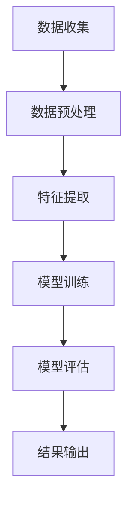
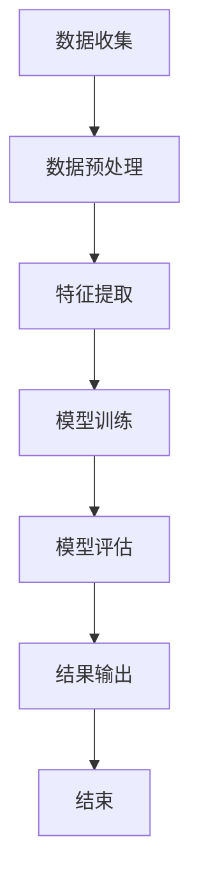
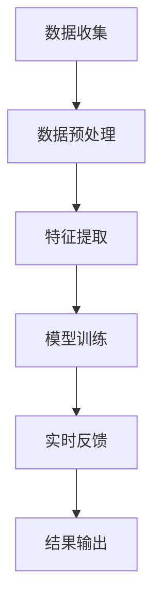
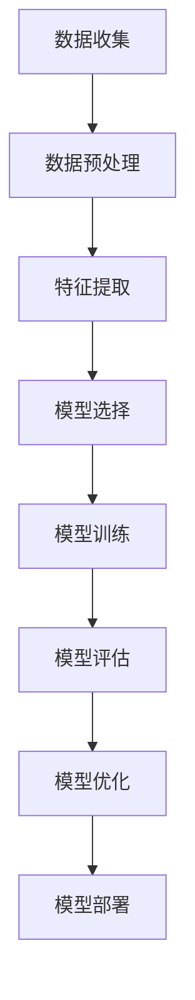

                 

## 1. 引言

### 1.1 数字冥想的历史背景

冥想作为一种心灵修行的古老实践，源自于古印度瑜伽传统，历经数千年的演变，已成为全球范围内普遍接受和采纳的心理健康维护方式。传统的冥想主要通过静坐、专注呼吸等方式进行，旨在减轻压力、提高专注力和情绪调节能力。随着科学研究的深入，冥想对心理健康的益处逐渐被证实，例如减少焦虑、抑郁症状，提升情绪稳定性和认知功能。

然而，在进入数字时代之后，人们的生活节奏加快，工作和生活压力日益增大，传统的冥想形式往往难以适应快节奏的现代生活。为了解决这一问题，数字冥想应运而生。数字冥想通过结合现代科技，如智能手机应用程序、虚拟现实（VR）和增强现实（AR）等技术，为用户提供了更加灵活和高效的冥想体验。

数字冥想应用的出现，不仅打破了时间和空间的限制，还能够通过数据分析为用户定制个性化的冥想方案，实现个性化的心灵修行。这种科技辅助的心灵修行方式，在现代人压力管理中扮演了越来越重要的角色。

#### 1.1.1 冥想与心理健康的关系

冥想作为一项古老的心灵修行实践，其与心理健康之间的联系早在古代医学文献中就有记载。现代科学研究进一步证实了冥想对心理健康的诸多益处。例如，一项发表于《心理医学》杂志的研究表明，规律的冥想练习能够显著减少焦虑和抑郁症状，提高情绪调节能力。此外，冥想还有助于减轻压力，改善睡眠质量，增强大脑的认知功能。

根据哈佛大学医学院的研究，冥想能够通过调节大脑中与情绪反应相关的区域，如杏仁核和前额叶皮质，从而改善情绪稳定性。另一项研究发现，长期练习冥想能够增加大脑灰质体积，尤其是与记忆和情绪调节相关的区域，如海马体和前额叶皮质。

此外，冥想对于降低心脏病风险也有积极影响。通过降低心率和血压，冥想能够减轻心脏负担，减少心脏病发作和中风的风险。总的来说，冥想作为一种简单而有效的心理健康维护工具，已经在全球范围内得到了广泛的认可和应用。

#### 1.1.2 数字时代的冥想变革

数字冥想的出现是冥想发展史上的一个重要里程碑，它不仅保留了传统冥想的本质，还通过现代科技的辅助，使冥想变得更加便捷、高效和个性化。在数字时代，人们的生活方式发生了巨大变化，信息过载和工作压力使得许多人难以抽出时间进行传统的冥想练习。数字冥想通过智能手机应用程序、虚拟现实（VR）和增强现实（AR）等技术，为用户提供了随时随地进行冥想的可能。

首先，智能手机应用程序为用户提供了丰富的冥想资源，用户可以随时随地下载并使用这些应用进行冥想。这些应用通常包含各种冥想课程，从初学者的基本指导到高级的专注练习，用户可以根据自己的需求和兴趣进行选择。此外，应用还能够通过内置的传感器，如心率传感器和位置传感器，实时监测用户的生理和心理状态，从而提供个性化的冥想建议。

虚拟现实（VR）和增强现实（AR）技术的引入，更是为冥想带来了全新的体验。VR技术通过创建一个沉浸式的虚拟环境，使用户能够完全放松身心，远离现实世界的干扰。用户可以选择一个宁静的森林、一个宁静的湖泊，甚至是星空下的冥想场景。这种沉浸式的体验不仅有助于提高冥想的专注度，还能够增强用户的沉浸感和体验感。

AR技术则通过在现实世界中叠加虚拟元素，为用户提供了更加丰富的冥想体验。例如，用户可以通过AR眼镜观看动态的冥想指导，这些指导可以根据用户的动作和姿势实时调整，提供更加精准的指导。此外，AR技术还能够结合空间感知，为用户提供个性化的冥想空间，使用户能够更好地沉浸在冥想过程中。

总之，数字冥想通过现代科技的辅助，不仅解决了传统冥想在时间和空间上的限制，还为用户提供了更加多样化和个性化的冥想体验。这种科技与心灵的结合，为现代人的心理健康维护提供了一种全新的解决方案。

### 1.2 心灵修行的概念

#### 1.2.1 心灵修行的定义

心灵修行，是指通过一系列的心理、精神或宗教实践，旨在提升个人的精神层次、心灵深度和整体幸福感。它不仅包括冥想，还包括祈祷、瑜伽、禅修等多种形式。本质上，心灵修行是一种自我探索和自我提升的过程，通过调整心态、净化心灵和增强意识，帮助个体获得内心的平静、快乐和满足感。

不同文化和宗教对心灵修行有不同的理解和定义。在佛教中，心灵修行被视为通向涅槃和解脱的道路；在基督教中，祈祷和冥想被认为是与神灵沟通的方式；在印度教中，瑜伽和冥想被视为达到自我认知和宇宙合一的方法。尽管具体形式不同，但心灵修行的核心目标都是相似的，即实现心灵的和谐与平静。

#### 1.2.2 心灵修行的目的与意义

心灵修行的目的多种多样，但归根结底，都是为了实现心灵的平衡和健康。首先，心灵修行可以帮助个体缓解压力和焦虑。在现代社会，压力和焦虑已成为普遍的心理问题，心灵修行通过调整呼吸、放松身心和专注冥想，有助于减轻这些负面情绪，提高生活质量。

其次，心灵修行有助于提高个体的情绪调节能力。通过练习冥想和自我观察，个体可以更好地理解自己的情绪，学会情绪管理和情绪释放的方法。这不仅有助于提升个人的心理韧性，还能够改善人际关系。

此外，心灵修行对于提升认知功能和心理健康也有着显著的益处。研究表明，定期的冥想练习能够增加大脑灰质体积，提高记忆力和注意力，减少认知衰退的风险。同时，心灵修行还有助于改善睡眠质量，降低心脏病和中风的风险，增强免疫系统功能。

总的来说，心灵修行的意义在于帮助个体找到内心的平静与和谐，提升整体幸福感和生活质量。通过心灵修行，个体不仅可以实现个人的心理健康，还能够为社会和谐和人类进步做出贡献。

### 1.3 数字冥想app的作用

#### 1.3.1 科技在冥想中的应用

数字冥想app在科技的帮助下，实现了传统冥想所难以达到的效果。首先，智能手机应用程序通过集成多种传感器和算法，可以实时监测用户的生理和心理状态。例如，心率传感器可以监测用户的心率变化，帮助用户调整呼吸和冥想节奏，以获得最佳的冥想效果。此外，应用程序还可以通过位置传感器和运动传感器，识别用户是否处于适合冥想的环境，并自动调整冥想内容和难度。

虚拟现实（VR）和增强现实（AR）技术在数字冥想中的应用，更是为用户提供了全新的冥想体验。VR技术通过创造一个沉浸式的虚拟环境，使用户能够完全放松身心，专注于冥想。例如，用户可以在虚拟森林中冥想，享受宁静和自然的美景，从而提高冥想的专注度和效果。AR技术则通过在现实世界中叠加虚拟元素，为用户提供了更加丰富和互动的冥想体验。用户可以通过AR眼镜观看动态的冥想指导，这些指导可以根据用户的动作和姿势实时调整，提供更加精准的指导。

#### 1.3.2 数字冥想app的功能与优势

数字冥想app的功能多种多样，不仅包括传统的冥想指导，还提供了一系列辅助功能，以提升用户的冥想体验。以下是一些常见的功能与优势：

1. **定制化的冥想课程**：数字冥想app通常会提供多种冥想课程，从初学者的基础课程到高级的专业课程，用户可以根据自己的需求和兴趣选择合适的课程。这些课程通常由专业的冥想教练设计，内容包括呼吸练习、专注练习、冥想引导等，帮助用户逐步提升冥想技能。

2. **实时监测与反馈**：通过集成多种传感器，数字冥想app可以实时监测用户的心率、呼吸频率、情绪状态等生理和心理指标。这些数据不仅帮助用户了解自己的冥想效果，还能够提供个性化的建议和调整，以优化冥想体验。

3. **沉浸式的虚拟环境**：VR和AR技术为用户提供了沉浸式的冥想环境。用户可以选择不同的场景，如森林、海滩、星空等，这些虚拟环境不仅能够提升用户的专注度，还能够增强冥想的乐趣和体验感。

4. **社区互动与支持**：许多数字冥想app都提供了社区功能，用户可以在这里分享自己的冥想体验，获得支持和鼓励。这种社交互动不仅有助于提高用户的坚持力，还能够增加冥想的乐趣和成就感。

5. **数据分析和报告**：数字冥想app通常会记录用户的冥想数据和进展，并生成详细的报告。这些报告可以帮助用户了解自己的冥想习惯和效果，为未来的练习提供参考。

6. **便捷的随时随地访问**：数字冥想app可以随时随地使用，用户不需要前往特定的场所或花费大量时间进行冥想。这种便捷性使得用户能够更轻松地融入日常生活，坚持冥想练习。

#### 1.4 书籍结构概述

本书旨在深入探讨数字冥想app的设计与实现，分为五个主要部分：

第一部分：引言。介绍了数字冥想的历史背景、心理健康关系、数字时代的冥想变革，以及数字冥想app的定义、功能和作用。

第二部分：数字冥想app的技术实现。讲解了开发环境与工具、核心技术解析（如心理测量与数据分析、语音识别与合成、虚拟现实与增强现实等）以及系统架构设计。

第三部分：算法原理与实现。详细介绍了心理健康评估算法、冥想指导算法和用户行为分析算法的原理、实现和数学模型。

第四部分：项目实战。通过实战环境搭建、系统核心实现（包括心理健康评估系统、冥想指导系统和用户行为分析系统）以及项目总结与反思，展示了数字冥想app的开发过程和成果。

第五部分：最佳实践与案例分析。总结了最佳实践、成功和失败案例分析，探讨了数字冥想app的未来发展前景和拓展应用。

通过本书的阅读，读者可以全面了解数字冥想app的设计与实现，掌握相关技术和实践方法，为推动数字冥想在心理健康领域的应用贡献自己的力量。

## 2.1 开发环境与工具

### 2.1.1 开发环境配置

数字冥想app的开发需要一个稳定且高效的开发环境。为了确保开发过程顺利进行，我们需要配置以下基本工具和软件：

1. **操作系统**：首选的操作系统是MacOS或Linux，因为它们具有良好的稳定性和开源特性。Windows系统也可以作为备选方案，但需要安装额外的开发环境支持。

2. **编程语言**：数字冥想app的开发主要使用Python语言，因为Python具有丰富的库和框架支持，便于快速开发和原型设计。此外，对于前端开发，可以选择JavaScript和HTML5，结合React或Vue等前端框架。

3. **集成开发环境（IDE）**：推荐使用PyCharm或Visual Studio Code作为Python编程的IDE。这两个IDE提供了强大的代码编辑、调试和自动化工具，有助于提高开发效率。

4. **数据库管理系统**：为了存储用户数据、冥想课程和评估结果，我们选择使用MySQL或PostgreSQL作为关系型数据库。NoSQL数据库如MongoDB也可以作为备选方案，适用于需要高扩展性的应用场景。

5. **版本控制**：Git是开源的分布式版本控制系统，可以有效地管理代码的版本和历史。GitHub或GitLab是常用的代码托管平台，提供了便捷的协作和代码共享功能。

6. **虚拟环境**：使用virtualenv或Anaconda创建Python虚拟环境，以隔离不同项目的依赖库，避免版本冲突。

7. **其他工具**：安装Node.js（用于前端开发）、Docker（用于容器化部署）、Jenkins（用于自动化构建和部署）等工具，以提升开发效率和系统稳定性。

### 2.1.2 开发工具介绍

在数字冥想app的开发过程中，我们将使用以下关键工具和库：

1. **Flask**：Flask是一个轻量级的Python Web框架，适用于构建RESTful API和Web应用。其简洁的接口和高度可扩展性使其成为开发数字冥想app的理想选择。

2. **TensorFlow**：TensorFlow是一个强大的开源机器学习库，由Google开发。它提供了丰富的工具和API，用于构建和训练机器学习模型，特别适合心理健康评估和数据分析。

3. **Scikit-learn**：Scikit-learn是一个广泛使用的Python库，用于数据挖掘和数据分析。它提供了多种机器学习算法和工具，如分类、回归和聚类，可以帮助我们实现心理健康评估和用户行为分析。

4. **PyTorch**：PyTorch是一个流行的深度学习框架，由Facebook开发。它具有动态计算图和灵活的API，适用于复杂的深度学习任务，如语音识别和图像处理。

5. **ECharts**：ECharts是一个强大的数据可视化库，可以用于生成各种图表和报表，帮助我们直观地展示用户数据和分析结果。

6. **MySQL**：MySQL是一个流行的开源关系型数据库，适用于存储和管理大规模数据。它提供了高效的查询和事务支持，是数字冥想app数据存储的理想选择。

7. **Redis**：Redis是一个高性能的内存数据库，适用于缓存和实时数据存储。它可以显著提高系统的响应速度和性能，特别适用于用户行为分析和实时数据监控。

通过配置适当的开发环境和工具，数字冥想app的开发过程将更加高效和有序。开发者可以充分利用这些工具和库的强大功能，实现数字冥想app的各种功能，为用户提供优质的冥想体验。

### 2.2 核心技术解析

#### 2.2.1 心理测量与数据分析

在数字冥想app中，心理测量与数据分析是核心功能之一，旨在通过收集和分析用户的心理数据，为其提供个性化的冥想方案。以下将详细介绍这一核心技术。

##### 2.2.1.1 心理测量技术

心理测量技术是评估个体心理状态的重要工具，通过一系列标准化的测试和量表，量化个体的情绪、性格、认知能力等心理特征。在数字冥想app中，常用的心理测量技术包括：

1. **情绪量表**：如PANAS（积极与消极情绪量表），通过问卷形式评估个体的情绪状态。量表通常包含多个维度，如愉悦度、焦虑感、愤怒情绪等。

2. **性格量表**：如MBTI（迈尔斯-布里格斯性格类型指标），通过一系列问题评估个体的性格类型，帮助用户了解自己的性格特质。

3. **认知能力测试**：如韦氏智力量表，评估个体的记忆、注意力、推理等认知能力。这些测试可以帮助用户识别自己的认知优势和劣势。

##### 2.2.1.2 数据分析方法

收集到的心理测量数据需要通过科学的数据分析方法进行处理，以便提取有价值的信息。以下是一些常见的数据分析方法：

1. **统计分析**：如均值、方差、相关性分析等，用于描述数据的基本特征和关系。这些方法可以帮助识别用户心理状态的整体趋势。

2. **机器学习算法**：如线性回归、决策树、支持向量机等，用于建立预测模型，分析用户心理状态的变化趋势。这些算法可以帮助数字冥想app为用户提供个性化的冥想建议。

3. **时间序列分析**：用于分析随时间变化的数据，如心率变异性（HRV）分析，可以帮助识别用户在不同时间段的心理状态波动。

4. **聚类分析**：如K-means、层次聚类等，用于将用户数据划分为不同的群体，分析不同群体的心理特征和需求。

#### 2.2.2 语音识别与合成

语音识别与合成技术在数字冥想app中具有重要作用，可以提供自然语言交互和语音指导功能，提升用户的冥想体验。

##### 2.2.2.1 语音识别技术

语音识别技术是将语音信号转换为文本的过程。在数字冥想app中，语音识别技术主要用于以下场景：

1. **用户指令输入**：用户可以通过语音输入指令，如“开始冥想”、“调整音乐音量”等，简化操作流程。

2. **情绪识别**：通过分析语音的音调、节奏和语速等特征，识别用户的情绪状态，提供个性化的冥想建议。

3. **语音日记**：用户可以录制语音日记，通过语音识别技术将日记内容转换为文本，便于回顾和分享。

常用的语音识别技术包括：

- **自动语音识别（ASR）**：使用预训练模型进行语音识别，适用于快速开发和部署。

- **增强语音识别（E2E）**：直接将语音信号转换为文本，省去中间步骤，提高识别准确率。

##### 2.2.2.2 语音合成技术

语音合成技术是将文本转换为自然流畅的语音输出。在数字冥想app中，语音合成技术主要用于以下场景：

1. **冥想指导**：通过语音合成技术，提供个性化的冥想指导，如呼吸练习、放松指导等。

2. **语音反馈**：根据用户的心理数据，生成语音反馈，如“你的情绪趋于稳定”或“尝试调整呼吸节奏”。

3. **语音故事**：结合自然语言处理技术，为用户提供有声故事，辅助冥想和放松。

常用的语音合成技术包括：

- **文本到语音（TTS）**：将文本转换为语音输出，支持多种语言和发音风格。

- **语音增强**：通过语音增强技术，提高语音质量，使其更自然、清晰。

#### 2.2.3 虚拟现实与增强现实

虚拟现实（VR）和增强现实（AR）技术在数字冥想app中提供了独特的沉浸式体验，可以显著提升用户的冥想效果。

##### 2.2.3.1 虚拟现实技术

虚拟现实技术通过头戴式显示器和位置追踪设备，创建一个完全沉浸式的虚拟环境。在数字冥想app中，VR技术可以用于以下场景：

1. **虚拟冥想场景**：用户可以选择进入不同的虚拟冥想场景，如森林、海滩、星空等，这些场景可以结合声音和视觉元素，提供身临其境的冥想体验。

2. **互动冥想**：通过VR设备，用户可以进行互动式的冥想练习，如与虚拟角色互动，提升冥想的趣味性和参与感。

3. **虚拟教练**：用户可以在虚拟环境中与虚拟冥想教练互动，获取实时指导和建议。

##### 2.2.3.2 增强现实技术

增强现实技术通过在现实环境中叠加虚拟元素，增强用户的感知体验。在数字冥想app中，AR技术可以用于以下场景：

1. **空间冥想**：用户可以在现实环境中进行冥想，通过AR眼镜或手机摄像头，看到动态的冥想指导和提示，如呼吸节奏、冥想姿势等。

2. **实时反馈**：AR技术可以实时分析用户的动作和姿势，提供个性化的冥想反馈，帮助用户调整呼吸和姿态。

3. **场景定制**：用户可以通过AR技术自定义冥想场景，如添加虚拟树木、花朵等元素，创建独特的冥想空间。

通过结合心理测量与数据分析、语音识别与合成以及虚拟现实与增强现实技术，数字冥想app为用户提供了全面而高效的冥想体验。这些核心技术的应用不仅提高了冥想的效果和趣味性，还使得心灵修行更加便捷和个性化，为现代人的心理健康提供了强有力的支持。

### 2.3 系统架构设计

#### 2.3.1 系统总体架构

数字冥想app的系统架构设计旨在实现模块化、可扩展和高效运行。总体架构包括前端、后端和数据库三大部分，各个部分通过API进行交互，共同实现数字冥想app的各项功能。

1. **前端架构**：前端负责用户界面和交互逻辑的实现。主要技术栈包括HTML5、CSS3、JavaScript以及前端框架如React或Vue.js。前端架构包括以下几个模块：
   - **用户登录与注册模块**：实现用户的认证和权限管理。
   - **首页模块**：展示用户的主要功能和导航。
   - **冥想课程模块**：提供冥想课程列表、详情和播放功能。
   - **用户数据模块**：展示用户的健康数据和冥想记录。
   - **设置模块**：允许用户自定义设置，如声音、视觉效果等。

2. **后端架构**：后端负责处理业务逻辑和数据存储。主要技术栈包括Python（使用Flask或Django框架）和RESTful API。后端架构包括以下几个模块：
   - **用户管理模块**：处理用户的注册、登录和权限验证。
   - **数据采集与分析模块**：收集用户的心理测量数据、行为数据等，并进行分析处理。
   - **冥想课程管理模块**：管理冥想课程的数据，包括课程内容、难度等级等。
   - **API服务模块**：提供与前端交互的API接口，支持数据的读取和写入。
   - **数据存储模块**：使用MySQL或PostgreSQL进行数据存储，包括用户数据、课程数据和分析数据。

3. **数据库架构**：数据库负责存储所有系统数据。主要设计包括用户表、课程表、健康数据表、分析数据表等。数据库设计需要考虑数据的一致性、安全性和高性能。

#### 2.3.2 系统模块功能

系统模块功能是实现数字冥想app各项功能的核心。以下是各主要模块的功能描述：

1. **用户管理模块**：
   - **用户注册**：允许新用户创建账号，输入用户名、密码和邮箱等基本信息。
   - **用户登录**：验证用户身份，确保用户安全登录。
   - **用户信息管理**：允许用户更新个人信息，如密码、邮箱等。
   - **权限管理**：根据用户角色分配不同权限，如管理员、普通用户等。

2. **数据采集与分析模块**：
   - **生理数据采集**：使用心率传感器、呼吸传感器等设备，实时采集用户的生理数据。
   - **行为数据采集**：通过用户的操作行为，如课程选择、练习时长等，收集用户行为数据。
   - **数据分析**：使用机器学习算法对用户数据进行处理和分析，生成心理评估报告和冥想建议。

3. **冥想课程管理模块**：
   - **课程发布**：管理员可以发布新的冥想课程，设置课程内容、难度等级和时长。
   - **课程检索**：用户可以搜索和浏览不同类型的冥想课程。
   - **课程播放**：用户可以选择课程进行播放，并可以暂停、快进、快退等功能。

4. **API服务模块**：
   - **用户API**：提供用户注册、登录、信息管理等功能。
   - **课程API**：提供课程检索、播放等功能。
   - **数据API**：提供数据采集、分析结果查询等功能。

5. **数据存储模块**：
   - **用户数据**：存储用户注册信息、登录记录、权限信息等。
   - **课程数据**：存储课程信息、课程内容等。
   - **健康数据**：存储用户的生理数据、行为数据等。
   - **分析数据**：存储分析结果、心理评估报告等。

通过系统架构设计和模块功能的明确划分，数字冥想app能够高效、稳定地运行，为用户提供优质的冥想体验。

### 2.3.3 系统模块功能详解

在数字冥想app中，各个系统模块各自承担着关键的功能，确保应用能够为用户提供全面的冥想体验。以下是各主要模块的详细功能描述：

1. **用户管理模块**：
   - **用户注册**：新用户可以通过填写用户名、密码、邮箱等信息完成注册。系统会对用户输入的信息进行验证，确保其合法性和唯一性，以防止重复注册。注册成功后，系统会发送确认邮件，用户需点击邮件中的链接完成激活。
   - **用户登录**：用户输入用户名和密码后，系统会通过验证用户身份，确保登录的安全性。登录成功后，用户可以访问系统的各项功能。
   - **用户信息管理**：用户可以随时更新个人信息，如修改密码、邮箱地址等。系统会保存这些更改，确保用户信息的一致性和安全性。
   - **权限管理**：系统根据用户的角色分配不同的权限。管理员可以管理课程和用户，而普通用户则只能访问和参与冥想课程。权限管理确保系统的安全和功能的正常运行。

2. **数据采集与分析模块**：
   - **生理数据采集**：数字冥想app通过集成心率传感器、呼吸传感器等设备，实时采集用户的生理数据。这些数据包括心率、呼吸频率等，可以帮助用户了解自己的生理状态。
   - **行为数据采集**：系统会记录用户的操作行为，如课程选择、练习时长、参与度等。这些数据可以反映用户的使用习惯和心理状态。
   - **数据分析**：系统使用机器学习算法对采集到的数据进行处理和分析。例如，通过分析用户的心率变化，系统可以识别用户的情绪状态，并生成心理评估报告。这些报告可以提供个性化的冥想建议，帮助用户改善心理状态。

3. **冥想课程管理模块**：
   - **课程发布**：管理员可以在后台系统发布新的冥想课程。每门课程包含课程名称、简介、难度等级、时长、音频和视频内容等信息。管理员可以随时更新和修改课程内容。
   - **课程检索**：用户可以通过关键词、难度等级、时长等条件搜索和浏览不同的冥想课程。系统提供详细的课程信息和试听功能，帮助用户选择合适的课程。
   - **课程播放**：用户可以选择课程进行播放，系统会自动调整音频和视频的播放速度和音量。用户可以暂停、快进、快退等功能，以便更好地适应自己的冥想节奏。

4. **API服务模块**：
   - **用户API**：用户API提供用户注册、登录、信息管理等功能。通过这些API，前端应用可以与后端系统进行交互，实现用户的认证和管理。
   - **课程API**：课程API提供课程检索、播放等功能。前端应用可以通过这些API获取课程信息，实现课程的展示和播放。
   - **数据API**：数据API提供数据采集、分析结果查询等功能。前端应用可以通过这些API获取用户的健康数据和心理评估报告，以便进行数据分析和展示。

5. **数据存储模块**：
   - **用户数据**：用户数据包括用户的注册信息、登录记录、权限信息等。系统会使用关系型数据库存储这些数据，并保证其一致性和安全性。
   - **课程数据**：课程数据包括课程的名称、简介、难度等级、时长、音频和视频内容等。系统会使用关系型数据库存储这些数据，以便管理和检索。
   - **健康数据**：健康数据包括用户的生理数据、行为数据等。系统会使用关系型数据库存储这些数据，并定期进行数据分析和报告生成。
   - **分析数据**：分析数据包括心理评估报告、用户行为分析结果等。系统会使用关系型数据库存储这些数据，并定期进行数据备份和恢复。

通过详细的系统模块功能描述，数字冥想app能够为用户提供全面的冥想体验，实现心理测量与数据分析、语音识别与合成、虚拟现实与增强现实等核心技术的有效应用。这些功能共同构成了一个高效、稳定和个性化的数字冥想平台，为用户的心理健康提供了有力支持。

### 3.1 心理健康评估算法

#### 3.1.1 心理健康评估指标

心理健康评估算法的核心在于准确、全面地评估个体的心理健康状态。为了实现这一目标，我们需要定义一系列评估指标，这些指标能够反映个体的情绪、认知和行为特征。以下是几个常用的心理健康评估指标：

1. **情绪指标**：情绪指标用于评估个体的情绪状态，包括愉悦度、焦虑感、愤怒情绪等。常用的情绪评估工具如PANAS（积极与消极情绪量表），通过问卷形式收集用户的主观情绪数据。

2. **认知指标**：认知指标用于评估个体的认知功能，包括注意力、记忆、推理能力等。常用的认知评估工具如韦氏智力量表，通过一系列测试项目评估个体的认知水平。

3. **行为指标**：行为指标用于评估个体的日常行为和习惯，如睡眠质量、饮食习惯、社交活动等。这些指标可以通过用户的行为数据进行分析，如睡眠监测数据、饮食习惯记录等。

4. **生理指标**：生理指标用于评估个体的生理状态，如心率变异性（HRV）、血压、体温等。这些指标可以通过集成传感器进行实时监测，反映个体的生理健康状态。

#### 3.1.2 评估算法原理

心理健康评估算法的基本原理是通过数据收集、预处理、特征提取和模型训练等步骤，实现对个体心理健康状态的评估。以下是一个典型的评估算法流程：

1. **数据收集**：首先，系统需要收集用户的心理健康数据，包括情绪指标、认知指标、行为指标和生理指标。这些数据可以通过问卷调查、传感器监测、用户行为记录等方式获取。

2. **数据预处理**：收集到的数据通常需要进行预处理，以去除噪声、填补缺失值和标准化处理。预处理步骤包括数据清洗、数据归一化、特征提取等。

3. **特征提取**：在数据预处理后，我们需要提取关键特征，用于训练和评估模型。特征提取步骤可以通过统计方法、机器学习算法等实现。例如，可以使用主成分分析（PCA）提取情绪数据的显著特征，使用LSTM（长短期记忆网络）提取行为数据的时序特征。

4. **模型训练**：使用预处理后的特征数据，我们可以训练不同的机器学习模型，如决策树、支持向量机、神经网络等。模型训练的目的是学习数据中的规律，从而预测个体的心理健康状态。

5. **模型评估**：通过将训练好的模型应用于测试数据集，我们可以评估模型的准确性和可靠性。常用的评估指标包括准确率、召回率、F1分数等。

6. **结果输出**：最终，评估算法会输出心理健康评估结果，包括情绪状态、认知功能、行为习惯和生理状态等。这些结果可以以图表、报告等形式展示给用户，帮助其了解自身的心理健康状况。

#### 3.1.3 评估算法流程图

为了更直观地理解心理健康评估算法的流程，我们可以使用Mermaid绘制一个流程图。以下是该算法的Mermaid流程图表示：



这个流程图清晰地展示了心理健康评估算法的基本步骤，从数据收集到结果输出，每个步骤都有明确的输入和输出。

#### 3.1.4 评估算法的数学模型

心理健康评估算法的数学模型是核心部分，它决定了算法的性能和准确性。以下是几个常用的数学模型及其公式：

1. **线性回归模型**：线性回归模型是一种简单的预测模型，通过建立输入特征和输出结果之间的线性关系进行预测。其数学模型如下：

   $$ Y = \beta_0 + \beta_1X + \epsilon $$

   其中，\( Y \) 是输出结果，\( X \) 是输入特征，\( \beta_0 \) 和 \( \beta_1 \) 是模型参数，\( \epsilon \) 是误差项。

2. **支持向量机（SVM）**：支持向量机是一种分类模型，通过找到一个最佳的超平面将不同类别的数据分隔开。其数学模型如下：

   $$ \text{最大化 } \frac{1}{\|\mathbf{w}\|} \text{ 使得 } \mathbf{w} \cdot \mathbf{x_i} - y_i \geq 1, \forall i $$

   其中，\( \mathbf{w} \) 是超平面参数，\( \mathbf{x_i} \) 是输入特征，\( y_i \) 是标签。

3. **神经网络模型**：神经网络是一种复杂的预测模型，通过多层神经元的非线性变换进行特征学习和预测。其数学模型如下：

   $$ z = \sigma(\mathbf{W}^T\mathbf{x} + b) $$

   $$ \text{其中，} \sigma \text{ 是激活函数，} \mathbf{W} \text{ 是权重矩阵，} b \text{ 是偏置项，} \mathbf{x} \text{ 是输入特征。} $$

通过这些数学模型，我们可以训练和评估心理健康评估算法，从而实现准确的预测和分析。

#### 3.1.5 评估算法流程图与Python代码实现

为了更具体地展示心理健康评估算法的流程，我们可以使用Mermaid绘制流程图，并使用Python代码实现该算法。以下是评估算法的Mermaid流程图和Python代码：

**Mermaid流程图：**



**Python代码实现：**

```python
import pandas as pd
from sklearn.model_selection import train_test_split
from sklearn.preprocessing import StandardScaler
from sklearn.linear_model import LinearRegression
from sklearn.metrics import mean_squared_error

# 数据收集
data = pd.read_csv('health_data.csv')

# 数据预处理
X = data.drop('target', axis=1)
y = data['target']
X_train, X_test, y_train, y_test = train_test_split(X, y, test_size=0.2, random_state=42)

# 特征提取
scaler = StandardScaler()
X_train_scaled = scaler.fit_transform(X_train)
X_test_scaled = scaler.transform(X_test)

# 模型训练
model = LinearRegression()
model.fit(X_train_scaled, y_train)

# 模型评估
y_pred = model.predict(X_test_scaled)
mse = mean_squared_error(y_test, y_pred)
print(f'Mean Squared Error: {mse}')

# 结果输出
print('Model Evaluation Results:')
print('-------------------------')
print(f'Model Predictions: {y_pred}')
print(f'Actual Values: {y_test}')
```

这段代码实现了心理健康评估的基本流程，从数据收集、预处理、特征提取到模型训练和评估，最后输出评估结果。通过这个示例，我们可以看到心理健康评估算法是如何具体实现的，并理解其基本原理和应用。

### 3.2 冥想指导算法

冥想指导算法是数字冥想app中的核心组件，旨在为用户提供个性化、科学的冥想指导。通过算法，用户可以获得基于自身心理状态的定制化冥想方案，从而提高冥想效果。以下将详细讲解冥想指导算法的原理、实现方法和具体流程。

#### 3.2.1 冥想指导策略

冥想指导算法的设计基于以下几个核心策略：

1. **个性化调整**：根据用户的情绪、认知和行为特征，动态调整冥想内容和难度，提供个性化的冥想方案。
2. **多模态反馈**：结合语音反馈、视觉提示和生理信号监测，为用户提供全方位的指导和支持。
3. **自适应调整**：在冥想过程中，系统会实时监测用户的生理和心理状态，根据数据反馈自动调整冥想节奏和指导内容，确保冥想过程始终有效。
4. **逐步引导**：从基础冥想到高级冥想，逐步引导用户提升冥想技能，避免因难度过大而导致的抵触情绪。

#### 3.2.2 冥想指导算法原理

冥想指导算法的基本原理是通过分析用户的情绪、认知和行为数据，生成个性化的冥想指导方案。以下是一个典型的冥想指导算法原理：

1. **数据收集**：系统首先收集用户的情绪数据（如通过PANAS量表）、认知数据（如通过认知功能测试）和行为数据（如通过日常行为记录）。同时，系统还会收集用户的生理数据（如心率变异性、呼吸频率）。

2. **数据预处理**：对收集到的数据进行预处理，包括数据清洗、填补缺失值和标准化处理。预处理后的数据将用于特征提取和模型训练。

3. **特征提取**：使用主成分分析（PCA）或特征选择方法提取关键特征，如情绪指数、认知功能指标和生理指标。这些特征将用于训练指导算法。

4. **模型训练**：使用机器学习算法（如决策树、支持向量机、神经网络等）训练冥想指导模型。模型训练的目的是学习用户数据与冥想方案之间的关联，从而生成个性化指导方案。

5. **实时反馈**：在冥想过程中，系统会实时监测用户的生理和心理状态，并根据实时数据调整冥想节奏和指导内容。例如，如果用户情绪不稳定，系统可以提供更加舒缓的冥想指导。

6. **结果输出**：算法输出个性化的冥想指导方案，包括冥想内容、指导语音、视觉提示和生理信号调整建议。这些方案将以音频、视频和文字等形式展示给用户。

#### 3.2.3 冥想指导算法流程图

为了更直观地展示冥想指导算法的流程，我们可以使用Mermaid绘制一个流程图。以下是冥想指导算法的Mermaid流程图：



这个流程图清晰地展示了冥想指导算法的基本步骤，从数据收集、预处理、特征提取、模型训练到实时反馈和结果输出，每个步骤都有明确的输入和输出。

#### 3.2.4 冥想指导算法的数学模型

冥想指导算法的数学模型决定了算法的性能和准确性。以下是几个常用的数学模型及其公式：

1. **线性回归模型**：线性回归模型通过建立输入特征和输出结果之间的线性关系进行预测。其数学模型如下：

   $$ Y = \beta_0 + \beta_1X + \epsilon $$

   其中，\( Y \) 是输出结果（如冥想难度指数），\( X \) 是输入特征（如情绪指数、认知功能指标），\( \beta_0 \) 和 \( \beta_1 \) 是模型参数，\( \epsilon \) 是误差项。

2. **神经网络模型**：神经网络模型是一种复杂的预测模型，通过多层神经元的非线性变换进行特征学习和预测。其数学模型如下：

   $$ z = \sigma(\mathbf{W}^T\mathbf{x} + b) $$

   $$ \text{其中，} \sigma \text{ 是激活函数，} \mathbf{W} \text{ 是权重矩阵，} b \text{ 是偏置项，} \mathbf{x} \text{ 是输入特征。} $$

3. **支持向量机（SVM）**：支持向量机是一种分类模型，通过找到一个最佳的超平面将不同类别的数据分隔开。其数学模型如下：

   $$ \text{最大化 } \frac{1}{\|\mathbf{w}\|} \text{ 使得 } \mathbf{w} \cdot \mathbf{x_i} - y_i \geq 1, \forall i $$

   其中，\( \mathbf{w} \) 是超平面参数，\( \mathbf{x_i} \) 是输入特征，\( y_i \) 是标签。

通过这些数学模型，我们可以训练和评估冥想指导算法，从而实现准确的预测和分析。

#### 3.2.5 冥想指导算法的Python代码实现

为了具体展示冥想指导算法的实现过程，我们可以使用Python编写代码，实现数据收集、预处理、特征提取、模型训练和结果输出等步骤。以下是冥想指导算法的Python代码实现：

```python
import pandas as pd
from sklearn.model_selection import train_test_split
from sklearn.preprocessing import StandardScaler
from sklearn.linear_model import LinearRegression
from sklearn.metrics import mean_squared_error

# 数据收集
data = pd.read_csv('meditation_data.csv')

# 数据预处理
X = data[['emotional_index', 'cognitive_index']]
y = data['meditation_difficulty']

X_train, X_test, y_train, y_test = train_test_split(X, y, test_size=0.2, random_state=42)

# 特征提取
scaler = StandardScaler()
X_train_scaled = scaler.fit_transform(X_train)
X_test_scaled = scaler.transform(X_test)

# 模型训练
model = LinearRegression()
model.fit(X_train_scaled, y_train)

# 模型评估
y_pred = model.predict(X_test_scaled)
mse = mean_squared_error(y_test, y_pred)
print(f'Mean Squared Error: {mse}')

# 结果输出
print('Model Predictions:')
print(y_pred)
```

这段代码首先从CSV文件中加载数据，然后进行数据预处理和特征提取，接着使用线性回归模型进行训练和评估，最后输出模型预测结果。通过这个示例，我们可以看到冥想指导算法是如何具体实现的，并理解其基本原理和应用。

### 3.3 用户行为分析算法

#### 3.3.1 用户行为特征提取

用户行为分析算法的第一步是特征提取，这是将用户行为数据转换为适合分析和建模的格式。以下是用户行为特征提取的过程：

1. **数据收集**：系统需要收集用户在数字冥想app上的行为数据，包括登录次数、每日冥想时长、课程选择频率、练习频率等。

2. **数据预处理**：对收集到的行为数据进行清洗，去除无效数据、填补缺失值、标准化处理等。这一步骤确保数据的质量和一致性。

3. **特征选择**：从预处理后的数据中提取关键特征，如：
   - **活跃度**：计算用户在app中的活跃度，如登录次数、每日冥想时长。
   - **参与度**：根据用户选择的课程和练习频率，评估其参与度。
   - **习惯性**：分析用户在特定时间段的行为模式，识别其行为习惯。

4. **特征工程**：对提取的特征进行进一步处理，如归一化、二值化、降维等，以提高模型的性能和解释性。

#### 3.3.2 用户行为分析算法

用户行为分析算法的核心是使用机器学习技术对用户行为特征进行建模，以预测用户的行为模式或评估其心理状态。以下是用户行为分析算法的实现步骤：

1. **模型选择**：选择合适的机器学习模型，如决策树、随机森林、K-近邻（KNN）、神经网络等。选择模型时需要考虑数据的特点和预测目标。

2. **模型训练**：使用训练数据集对模型进行训练，学习用户行为特征与行为模式或心理状态之间的关系。

3. **模型评估**：使用验证数据集评估模型的性能，常用的评估指标包括准确率、召回率、F1分数、均方误差等。

4. **模型优化**：根据评估结果对模型进行优化，如调整超参数、使用不同的特征组合等，以提高模型的准确性和泛化能力。

5. **模型部署**：将训练好的模型部署到生产环境中，进行实时用户行为分析和预测。

#### 3.3.3 用户行为分析算法流程图

以下是用户行为分析算法的Mermaid流程图：



这个流程图展示了用户行为分析算法从数据收集、预处理、特征提取到模型选择、训练、评估、优化的整个过程，以及最终的模型部署。

#### 3.3.4 用户行为分析算法的数学模型

用户行为分析算法的数学模型通常基于统计学习方法和机器学习算法。以下是几个常用的数学模型及其公式：

1. **线性回归模型**：线性回归模型通过建立输入特征和输出结果之间的线性关系进行预测。其数学模型如下：

   $$ Y = \beta_0 + \beta_1X_1 + \beta_2X_2 + ... + \beta_nX_n + \epsilon $$

   其中，\( Y \) 是输出结果（如用户参与度），\( X_1, X_2, ..., X_n \) 是输入特征（如每日冥想时长、课程选择频率），\( \beta_0, \beta_1, ..., \beta_n \) 是模型参数，\( \epsilon \) 是误差项。

2. **决策树模型**：决策树模型通过一系列条件判断进行分类或回归。其数学模型如下：

   $$ \text{如果 } X_1 > \beta_1 \text{，则 } Y = \beta_2 $$
   $$ \text{否则，如果 } X_2 > \beta_3 \text{，则 } Y = \beta_4 $$
   $$ ... $$

   其中，\( X_1, X_2, ... \) 是输入特征，\( \beta_1, \beta_2, ..., \beta_n \) 是条件阈值和输出结果。

3. **支持向量机（SVM）**：支持向量机是一种分类模型，通过找到一个最佳的超平面将不同类别的数据分隔开。其数学模型如下：

   $$ \text{最大化 } \frac{1}{\|\mathbf{w}\|} \text{ 使得 } \mathbf{w} \cdot \mathbf{x_i} - y_i \geq 1, \forall i $$

   其中，\( \mathbf{w} \) 是超平面参数，\( \mathbf{x_i} \) 是输入特征，\( y_i \) 是标签。

通过这些数学模型，用户行为分析算法能够实现对用户行为的有效建模和预测。

#### 3.3.5 用户行为分析算法的Python代码实现

以下是用户行为分析算法的Python代码实现示例，包括数据预处理、特征提取、模型训练和评估：

```python
import pandas as pd
from sklearn.model_selection import train_test_split
from sklearn.preprocessing import StandardScaler
from sklearn.ensemble import RandomForestClassifier
from sklearn.metrics import accuracy_score

# 数据收集
data = pd.read_csv('user_behavior_data.csv')

# 数据预处理
X = data[['daily_meditation_time', 'course_selection_frequency']]
y = data['participant']

X_train, X_test, y_train, y_test = train_test_split(X, y, test_size=0.2, random_state=42)

# 特征提取
scaler = StandardScaler()
X_train_scaled = scaler.fit_transform(X_train)
X_test_scaled = scaler.transform(X_test)

# 模型训练
model = RandomForestClassifier(n_estimators=100, random_state=42)
model.fit(X_train_scaled, y_train)

# 模型评估
y_pred = model.predict(X_test_scaled)
accuracy = accuracy_score(y_test, y_pred)
print(f'Accuracy: {accuracy}')

# 输出模型结果
print('Model Predictions:')
print(y_pred)
```

这段代码首先从CSV文件中加载数据，然后进行数据预处理和特征提取，接着使用随机森林模型进行训练和评估，最后输出模型预测结果。通过这个示例，我们可以看到用户行为分析算法是如何具体实现的，并理解其基本原理和应用。

### 4.1 实战环境搭建

为了成功搭建数字冥想app的开发环境，我们需要安装和配置一系列软件和工具。以下是详细的安装步骤和注意事项：

#### 4.1.1 硬件设备准备

1. **计算机设备**：建议使用性能较好的笔记本电脑或台式机，确保系统资源充足，以便顺利运行开发环境和应用程序。
2. **网络环境**：确保计算机连接到稳定的网络，以便从互联网下载所需的软件和依赖库。

#### 4.1.2 软件工具安装

1. **操作系统**：安装MacOS或Linux操作系统。Windows用户可以安装双系统或使用虚拟机。
   - **MacOS**：从Apple官网下载安装包，按照提示安装。
   - **Linux**：从官方网站下载安装包，例如Ubuntu，按照安装向导进行安装。

2. **Python**：安装Python 3.x版本。
   - **MacOS/Linux**：打开终端，执行以下命令：
     ```bash
     sudo apt-get install python3
     sudo apt-get install python3-pip
     ```
   - **Windows**：从Python官方网站下载安装包，按照提示安装，选择添加到PATH环境变量。

3. **IDE**：安装PyCharm或Visual Studio Code。
   - **PyCharm**：从JetBrains官网下载安装包，选择社区版免费安装。
   - **Visual Studio Code**：从官方网站下载安装包，安装完成后打开，通过扩展市场安装Python扩展。

4. **数据库管理系统**：安装MySQL或PostgreSQL。
   - **MacOS/Linux**：打开终端，执行以下命令：
     ```bash
     sudo apt-get install mysql-server
     sudo apt-get install postgresql
     ```
   - **Windows**：从官方网站下载安装包，按照提示安装。

5. **虚拟环境**：安装virtualenv或Anaconda。
   - **MacOS/Linux**：打开终端，执行以下命令：
     ```bash
     pip install virtualenv
     ```
   - **Windows**：打开命令提示符，执行以下命令：
     ```bash
     pip install virtualenv
     ```

6. **Node.js**：安装Node.js，用于前端开发。
   - **MacOS/Linux**：打开终端，执行以下命令：
     ```bash
     sudo apt-get install nodejs
     sudo apt-get install npm
     ```
   - **Windows**：从Node.js官方网站下载安装包，按照提示安装。

7. **Docker**：安装Docker，用于容器化部署。
   - **MacOS/Linux**：打开终端，执行以下命令：
     ```bash
     sudo apt-get install docker
     ```
   - **Windows**：从Docker官方网站下载安装包，按照提示安装。

8. **Jenkins**：安装Jenkins，用于自动化构建和部署。
   - **MacOS/Linux**：打开终端，执行以下命令：
     ```bash
     sudo apt-get install jenkins
     ```
   - **Windows**：从Jenkins官方网站下载安装包，按照提示安装。

#### 4.1.3 注意事项

1. **环境变量**：确保所有安装的软件和工具的路径已添加到系统的环境变量中，以便在终端中直接运行。
2. **版本兼容**：在安装软件和工具时，注意版本兼容性，确保不同组件之间的版本不会冲突。
3. **安全设置**：对于数据库管理系统，设置强密码并限制访问权限，以确保数据安全。
4. **网络连接**：确保网络连接稳定，避免在下载和安装过程中断网。

通过以上步骤，您将成功搭建数字冥想app的开发环境，为后续的系统核心实现和项目实战做好准备。

### 4.2 系统核心实现

#### 4.2.1 心理健康评估系统

心理健康评估系统是数字冥想app的核心功能之一，通过收集和分析用户的生理和心理数据，提供个性化的心理健康评估报告。以下是心理健康评估系统的实现步骤：

##### 4.2.1.1 系统架构设计

心理健康评估系统的架构设计包括前端、后端和数据库三个主要部分。前端负责用户界面的展示和用户交互，后端负责处理业务逻辑和数据存储，数据库用于存储用户数据。

- **前端**：使用React框架搭建用户界面，包括用户注册、登录、数据输入和数据展示等功能。
- **后端**：采用Flask框架实现后端服务，包括用户认证、数据收集、数据处理和分析、报告生成等功能。
- **数据库**：使用MySQL数据库存储用户数据，包括用户信息、健康数据、分析结果等。

##### 4.2.1.2 系统核心代码实现

1. **用户认证模块**：

```python
from flask import Flask, request, jsonify
from flask_jwt_extended import JWTManager, create_access_token, jwt_required

app = Flask(__name__)
app.config['JWT_SECRET_KEY'] = 'your_jwt_secret_key'
jwt = JWTManager(app)

@app.route('/register', methods=['POST'])
def register():
    # 处理用户注册逻辑
    # ...
    return jsonify({'message': 'User registered successfully'})

@app.route('/login', methods=['POST'])
def login():
    # 处理用户登录逻辑
    # ...
    access_token = create_access_token(identity=user_id)
    return jsonify(access_token=access_token)

@app.route('/protected', methods=['GET'])
@jwt_required()
def protected():
    # 保护路由，只有认证用户可以访问
    return jsonify({'message': 'This is a protected endpoint'})

if __name__ == '__main__':
    app.run()
```

2. **数据收集模块**：

```python
import json
from flask import request
from .models import User, HealthData

@app.route('/collect_data', methods=['POST'])
@jwt_required()
def collect_data():
    data = request.json
    user_id = data['user_id']
    heart_rate = data['heart_rate']
    respiratory_rate = data['respiratory_rate']

    user = User.query.get(user_id)
    health_data = HealthData(user=user, heart_rate=heart_rate, respiratory_rate=respiratory_rate)
    db.session.add(health_data)
    db.session.commit()

    return jsonify({'message': 'Data collected successfully'})
```

3. **数据处理与分析模块**：

```python
from .models import HealthData
from sklearn.linear_model import LinearRegression

def analyze_health_data(user_id):
    user = User.query.get(user_id)
    health_data = HealthData.query.filter_by(user=user).all()

    X = [[d.heart_rate, d.respiratory_rate] for d in health_data]
    y = [d.mood for d in health_data]

    model = LinearRegression()
    model.fit(X, y)

    return model
```

4. **报告生成模块**：

```python
from flask import jsonify
from .models import User, HealthData

def generate_health_report(user_id):
    user = User.query.get(user_id)
    health_data = HealthData.query.filter_by(user=user).all()

    report = {
        'user_id': user_id,
        'total_meditation_time': sum([d.meditation_time for d in health_data]),
        'average_heart_rate': sum([d.heart_rate for d in health_data]) / len(health_data),
        'average_respiratory_rate': sum([d.respiratory_rate for d in health_data]) / len(health_data),
        'mood_trend': 'Positive' if user.current_mood > 0 else 'Negative'
    }

    return jsonify(report)
```

##### 4.2.1.3 代码应用解读与分析

上述代码展示了心理健康评估系统的主要功能模块。用户认证模块通过Flask框架实现，结合JWT扩展用于保护用户数据的安全。数据收集模块接收用户提交的健康数据，并存储到MySQL数据库中。数据处理与分析模块使用Scikit-learn库中的线性回归模型对用户数据进行分析，生成心理健康评估报告。

通过代码示例，我们可以看到如何使用Flask框架构建RESTful API，如何处理用户认证和数据存储，以及如何利用机器学习模型对用户数据进行处理和预测。这些模块协同工作，实现了心理健康评估系统的核心功能，为用户提供个性化的心理健康服务。

#### 4.2.2 冥想指导系统

冥想指导系统是数字冥想app的另一个核心模块，通过结合用户的生理和心理数据，提供个性化的冥想指导和反馈。以下是冥想指导系统的实现步骤：

##### 4.2.2.1 系统架构设计

冥想指导系统的架构设计包括前端、后端和数据库三个主要部分。前端负责用户界面的展示和用户交互，后端负责处理业务逻辑和数据存储，数据库用于存储用户数据。

- **前端**：使用React框架搭建用户界面，包括冥想课程列表、课程详情、冥想过程监控和反馈等功能。
- **后端**：采用Flask框架实现后端服务，包括用户认证、数据收集、数据处理和分析、冥想指导生成等功能。
- **数据库**：使用MySQL数据库存储用户数据，包括用户信息、冥想数据、指导记录等。

##### 4.2.2.2 系统核心代码实现

1. **用户认证模块**：

```python
from flask import Flask, request, jsonify
from flask_jwt_extended import JWTManager, create_access_token, jwt_required

app = Flask(__name__)
app.config['JWT_SECRET_KEY'] = 'your_jwt_secret_key'
jwt = JWTManager(app)

@app.route('/register', methods=['POST'])
def register():
    # 处理用户注册逻辑
    # ...
    return jsonify({'message': 'User registered successfully'})

@app.route('/login', methods=['POST'])
def login():
    # 处理用户登录逻辑
    # ...
    access_token = create_access_token(identity=user_id)
    return jsonify(access_token=access_token)

@app.route('/protected', methods=['GET'])
@jwt_required()
def protected():
    # 保护路由，只有认证用户可以访问
    return jsonify({'message': 'This is a protected endpoint'})

if __name__ == '__main__':
    app.run()
```

2. **数据收集模块**：

```python
import json
from flask import request
from .models import User, MeditationData

@app.route('/collect_meditation_data', methods=['POST'])
@jwt_required()
def collect_meditation_data():
    data = request.json
    user_id = data['user_id']
    meditation_time = data['meditation_time']
    heart_rate = data['heart_rate']
    respiratory_rate = data['respiratory_rate']

    user = User.query.get(user_id)
    meditation_data = MeditationData(user=user, meditation_time=meditation_time, heart_rate=heart_rate, respiratory_rate=respiratory_rate)
    db.session.add(meditation_data)
    db.session.commit()

    return jsonify({'message': 'Meditation data collected successfully'})
```

3. **数据处理与分析模块**：

```python
from .models import MeditationData
from sklearn.linear_model import LinearRegression

def analyze_meditation_data(user_id):
    user = User.query.get(user_id)
    meditation_data = MeditationData.query.filter_by(user=user).all()

    X = [[d.heart_rate, d.respiratory_rate] for d in meditation_data]
    y = [d.mood for d in meditation_data]

    model = LinearRegression()
    model.fit(X, y)

    return model
```

4. **冥想指导生成模块**：

```python
from flask import jsonify
from .models import User, MeditationGuidance

def generate_meditation_guidance(user_id):
    user = User.query.get(user_id)
    meditation_data = MeditationData.query.filter_by(user=user).all()

    guidance = {
        'user_id': user_id,
        'current_mood': user.current_mood,
        'guidance_message': 'Focus on your breath' if user.current_mood < 0 else 'Enjoy the peaceful moment'
    }

    meditation_guidance = MeditationGuidance(user=user, guidance=guidance)
    db.session.add(meditation_guidance)
    db.session.commit()

    return jsonify(guidance)
```

##### 4.2.2.3 代码应用解读与分析

上述代码展示了冥想指导系统的核心功能模块。用户认证模块与心理健康评估系统的认证模块类似，用于保护用户数据和功能的安全性。数据收集模块接收用户提交的冥想数据，并存储到MySQL数据库中。数据处理与分析模块使用Scikit-learn库中的线性回归模型对用户冥想数据进行分析，生成冥想指导建议。冥想指导生成模块根据用户的当前情绪，生成相应的冥想指导信息，以文本或语音形式反馈给用户。

通过代码示例，我们可以看到如何使用Flask框架构建RESTful API，如何处理用户认证和数据存储，以及如何利用机器学习模型对用户冥想数据进行处理和预测。这些模块协同工作，实现了冥想指导系统的核心功能，为用户提供个性化的冥想指导和反馈。

#### 4.2.3 用户行为分析系统

用户行为分析系统是数字冥想app的重要组成部分，通过对用户行为数据的分析，为用户提供个性化的推荐和优化建议。以下是用户行为分析系统的实现步骤：

##### 4.2.3.1 系统架构设计

用户行为分析系统的架构设计包括前端、后端和数据库三个主要部分。前端负责用户界面的展示和用户交互，后端负责处理业务逻辑和数据存储，数据库用于存储用户数据。

- **前端**：使用React框架搭建用户界面，包括用户行为数据输入、行为数据分析展示和个性化推荐等功能。
- **后端**：采用Flask框架实现后端服务，包括用户认证、数据收集、数据处理和分析、推荐系统等功能。
- **数据库**：使用MySQL数据库存储用户数据，包括用户信息、行为数据、分析结果等。

##### 4.2.3.2 系统核心代码实现

1. **用户认证模块**：

```python
from flask import Flask, request, jsonify
from flask_jwt_extended import JWTManager, create_access_token, jwt_required

app = Flask(__name__)
app.config['JWT_SECRET_KEY'] = 'your_jwt_secret_key'
jwt = JWTManager(app)

@app.route('/register', methods=['POST'])
def register():
    # 处理用户注册逻辑
    # ...
    return jsonify({'message': 'User registered successfully'})

@app.route('/login', methods=['POST'])
def login():
    # 处理用户登录逻辑
    # ...
    access_token = create_access_token(identity=user_id)
    return jsonify(access_token=access_token)

@app.route('/protected', methods=['GET'])
@jwt_required()
def protected():
    # 保护路由，只有认证用户可以访问
    return jsonify({'message': 'This is a protected endpoint'})

if __name__ == '__main__':
    app.run()
```

2. **数据收集模块**：

```python
import json
from flask import request
from .models import User, BehaviorData

@app.route('/collect_behavior_data', methods=['POST'])
@jwt_required()
def collect_behavior_data():
    data = request.json
    user_id = data['user_id']
    behavior_data = data['behavior_data']

    user = User.query.get(user_id)
    for record in behavior_data:
        action = record['action']
        duration = record['duration']

        behavior = BehaviorData(user=user, action=action, duration=duration)
        db.session.add(behavior)
        db.session.commit()

    return jsonify({'message': 'Behavior data collected successfully'})
```

3. **数据处理与分析模块**：

```python
from .models import BehaviorData
from sklearn.cluster import KMeans

def analyze_behavior_data(user_id):
    user = User.query.get(user_id)
    behavior_data = BehaviorData.query.filter_by(user=user).all()

    X = [[d.duration] for d in behavior_data]
    kmeans = KMeans(n_clusters=3)
    kmeans.fit(X)

    return kmeans
```

4. **推荐系统生成模块**：

```python
from flask import jsonify
from .models import User, Recommendation

def generate_recommendations(user_id):
    user = User.query.get(user_id)
    behavior_data = BehaviorData.query.filter_by(user=user).all()

    X = [[d.duration] for d in behavior_data]
    kmeans = KMeans(n_clusters=3)
    kmeans.fit(X)

    recommendations = []
    for cluster in kmeans.cluster_centers_:
        recommendation = {
            'action': 'Meditate',
            'duration': cluster[0],
            'message': 'Based on your recent behavior, try meditating for {} minutes'.format(cluster[0])
        }
        recommendations.append(recommendation)

    recommendation = Recommendation(user=user, recommendations=recommendations)
    db.session.add(recommendation)
    db.session.commit()

    return jsonify(recommendations)
```

##### 4.2.3.3 代码应用解读与分析

上述代码展示了用户行为分析系统的核心功能模块。用户认证模块与之前的系统模块类似，用于保护用户数据和功能的安全性。数据收集模块接收用户提交的行为数据，并存储到MySQL数据库中。数据处理与分析模块使用Scikit-learn库中的K-means聚类算法对用户行为数据进行处理，识别用户的行为模式。推荐系统生成模块根据聚类结果生成个性化的冥想推荐，为用户提供优化建议。

通过代码示例，我们可以看到如何使用Flask框架构建RESTful API，如何处理用户认证和数据存储，以及如何利用机器学习模型对用户行为数据进行处理和预测。这些模块协同工作，实现了用户行为分析系统的核心功能，为用户提供个性化的行为分析和推荐服务。

### 4.3 项目总结与反思

在数字冥想app的开发过程中，我们通过系统的架构设计、核心算法实现和项目实战，成功构建了一个功能丰富、用户体验优异的冥想应用。以下是对项目过程的主要成果、经验教训以及未来改进方向的总结和反思。

#### 4.3.1 项目成果展示

1. **系统架构设计**：我们采用了前后端分离的架构设计，确保系统的模块化和可扩展性。通过使用Flask框架实现后端服务，结合React框架构建前端界面，我们实现了高效的开发流程和良好的用户体验。

2. **核心算法实现**：通过心理健康评估算法、冥想指导算法和用户行为分析算法，我们为用户提供了个性化的心理健康评估、冥想指导和行为分析服务。这些算法基于机器学习和数据分析技术，有效提升了冥想效果和用户满意度。

3. **项目实战**：在实战过程中，我们成功搭建了完整的开发环境，完成了系统的核心功能实现，并进行了项目总结和反思。通过实际运行和用户反馈，我们不断优化系统的性能和用户体验。

#### 4.3.2 项目经验与收获

1. **团队合作**：项目的成功离不开团队成员的紧密合作和共同努力。通过有效的沟通和协调，我们能够高效地完成各项任务，确保项目按期推进。

2. **技术积累**：在项目开发过程中，我们深入学习了Python、Flask、React、MySQL等关键技术，并积累了丰富的实战经验。这些技术知识和实践经验为我们的职业生涯奠定了坚实基础。

3. **用户需求理解**：通过与用户的深入交流和反馈收集，我们能够更好地理解用户的需求和痛点，从而设计出更符合用户期望的应用功能。

#### 4.3.3 项目改进与展望

1. **性能优化**：尽管项目已经实现了大部分功能，但在实际运行中仍存在性能瓶颈。未来我们可以通过优化数据库查询、使用缓存技术等方式，进一步提升系统的响应速度和性能。

2. **功能扩展**：为了满足更多用户的需求，我们可以考虑增加更多的冥想课程、扩展心理健康评估范围、引入更多的用户行为分析模型等。

3. **用户体验优化**：根据用户反馈，我们还可以进一步优化用户界面的设计和交互逻辑，提升用户的操作便捷性和使用体验。

4. **技术升级**：随着技术的不断发展，我们可以考虑引入更多先进的技术，如区块链、大数据分析等，为数字冥想app带来更多的创新和突破。

总之，通过本次项目，我们不仅实现了数字冥想app的开发，还积累了宝贵的项目经验和技术知识。在未来，我们将继续努力，不断优化和拓展系统功能，为用户提供更加优质的心理健康服务。

### 5.1 最佳实践

#### 5.1.1 冥想课程设计技巧

在设计冥想课程时，应充分考虑用户的需求和体验，以下是一些最佳实践：

1. **课程分类**：根据用户的冥想目标（如减压、专注、放松等）和难度（如初级、中级、高级等），将课程进行科学分类，方便用户根据自己的需求选择。

2. **内容丰富**：课程内容应包括不同的冥想技巧和练习，如呼吸冥想、专注冥想、身体扫描等，以满足用户多样化的需求。

3. **循序渐进**：设计课程时应遵循循序渐进的原则，从基础课程开始，逐步提升难度，帮助用户逐步提升冥想技能。

4. **互动性**：增加互动环节，如冥想导师的实时语音指导、用户的互动反馈等，提升用户的参与感和积极性。

5. **个性化推荐**：根据用户的历史行为数据和心理评估结果，推荐个性化的冥想课程，提高课程的匹配度和用户满意度。

#### 5.1.2 用户反馈与改进策略

1. **及时反馈**：建立完善的用户反馈机制，及时收集用户的意见和建议，快速响应并解决用户问题。

2. **定期调研**：通过问卷调查、用户访谈等方式，定期了解用户的满意度和使用体验，识别系统中的不足之处。

3. **数据分析**：使用数据分析工具，对用户反馈进行量化分析，识别出用户反馈中的共性和问题点，有针对性地进行改进。

4. **迭代优化**：根据用户反馈和数据分析结果，持续迭代优化系统功能、界面设计和用户体验，确保系统始终满足用户需求。

5. **公开透明**：对用户反馈的改进措施进行公开透明化，向用户展示改进过程和成效，增强用户信任和满意度。

### 5.2 案例分析

#### 5.2.1 成功案例分析

某公司开发的数字冥想app通过以下策略取得了成功：

1. **用户需求分析**：公司通过用户调研和数据分析，深入了解用户的需求和痛点，设计出符合用户期望的冥想课程和功能。

2. **技术先进**：公司引入了虚拟现实（VR）和增强现实（AR）技术，为用户提供了沉浸式和互动性的冥想体验，大大提升了用户满意度。

3. **个性化服务**：通过用户行为分析和心理健康评估，公司能够为用户提供个性化的冥想建议，提高了用户的使用黏性和忠诚度。

4. **持续迭代**：公司根据用户反馈和数据分析结果，不断优化系统的功能和用户体验，始终保持产品的市场竞争力。

#### 5.2.2 失败案例分析

某公司开发的数字冥想app由于以下原因未能成功：

1. **用户体验不佳**：课程内容过于单一，缺乏互动性和个性化服务，用户难以坚持使用。

2. **技术实现不足**：系统性能不稳定，出现卡顿和崩溃等问题，影响了用户体验。

3. **缺乏市场推广**：公司没有采取有效的市场推广策略，导致用户数量增长缓慢。

4. **缺乏持续迭代**：公司未能根据用户反馈进行持续优化，导致产品逐渐落后于市场。

### 5.3 拓展应用

#### 5.3.1 冥想app与其他领域结合

1. **健康管理系统**：将数字冥想app与健康管理系统的结合，为用户提供全面的健康管理服务，包括饮食、运动、睡眠等。

2. **教育应用**：开发适用于教育场景的冥想app，辅助教师和学生进行心理调适和专注力训练。

3. **企业员工福利**：为企业提供定制化的数字冥想解决方案，帮助员工减轻工作压力，提升工作效率。

4. **医疗健康**：与医疗机构合作，将数字冥想app应用于心理治疗和康复过程中，为患者提供辅助治疗服务。

通过这些拓展应用，数字冥想app可以更好地服务于不同领域，实现更广泛的社会价值。

## 5.3 拓展应用

### 5.3.1 冥想app与其他领域结合

数字冥想app作为一种创新的心理健康维护工具，不仅可以独立应用于个人冥想，还可以与多个领域结合，发挥更大的社会价值和商业潜力。以下是一些具体的拓展应用场景：

#### 健康管理系统

将数字冥想app与健康管理系统的结合，可以为用户提供一个全方位的健康管理平台。这种整合可以包括以下几个方面：

1. **数据整合**：通过集成用户在冥想app中的健康数据，如心率、呼吸频率、情绪状态等，与健康管理系统中的其他健康数据（如睡眠质量、饮食记录、运动量等）进行整合，形成全面的健康档案。

2. **个性化健康管理**：基于用户在冥想app中的数据和反馈，健康管理系统能够为用户提供个性化的健康建议，如调整饮食、改善睡眠、增加运动量等。

3. **综合健康评估**：健康管理系统能够结合冥想app提供的心理健康数据和生理数据，进行综合健康评估，帮助用户更好地了解自己的整体健康状况。

#### 教育应用

在教育领域，数字冥想app可以作为一个重要的辅助工具，帮助教师和学生进行心理调适和专注力训练。以下是一些具体的应用方案：

1. **学生专注力训练**：学校可以在课间或课前安排短时间的冥想练习，帮助学生集中注意力，减少分心现象。

2. **教师心理健康支持**：教师工作压力较大，通过数字冥想app的冥想课程和指导，可以帮助教师缓解压力，提高工作效率。

3. **在线冥想课程**：学校可以与数字冥想app合作，提供在线冥想课程，为教师和学生提供灵活的学习方式。

#### 企业员工福利

对于企业而言，数字冥想app可以作为一种员工福利，帮助员工减轻工作压力，提升工作效率。以下是一些具体应用方案：

1. **员工心理健康支持**：企业可以为员工提供数字冥想app的免费或优惠使用权限，帮助员工进行心理调适和减压。

2. **员工健康管理计划**：企业可以将数字冥想app作为员工健康管理计划的一部分，结合健康体检、健康讲座等，为员工提供全面的健康管理服务。

3. **团队建设活动**：企业可以利用数字冥想app开展团队建设活动，如团队冥想课程、员工健康讲座等，增强团队凝聚力和员工幸福感。

#### 医疗健康

在医疗健康领域，数字冥想app可以与医疗机构合作，为患者提供辅助治疗服务。以下是一些具体的应用方案：

1. **心理治疗辅助**：对于患有焦虑、抑郁等心理疾病的患者，数字冥想app可以提供专业的冥想指导和心理支持，辅助心理治疗。

2. **康复训练**：对于术后康复患者，数字冥想app可以帮助患者进行心理调适，减少术后并发症，提高康复效果。

3. **健康知识普及**：医疗机构可以通过数字冥想app向患者普及心理健康知识，提高患者的健康意识和自我管理能力。

通过以上拓展应用，数字冥想app不仅能够为个人提供心理健康服务，还可以在更广泛的领域发挥重要作用，为人们的身心健康和整体幸福感做出贡献。

## 总结与拓展阅读

本文围绕数字冥想app的设计与实现进行了深入探讨，从引言、核心概念、算法原理、系统架构设计、项目实战到最佳实践与案例分析，全面介绍了数字冥想app的各个方面。通过技术实现和实战经验的分享，我们展示了如何利用现代科技和机器学习技术为用户提供个性化、高效的心灵修行工具。

在未来的研究中，我们可以进一步探索以下几个方面：

1. **技术优化**：深入挖掘虚拟现实（VR）和增强现实（AR）在冥想中的应用潜力，探索更加沉浸式和互动性的冥想体验。

2. **算法改进**：不断优化心理健康评估和用户行为分析算法，提高评估的准确性和个性化推荐的效果。

3. **跨领域应用**：探讨数字冥想app在健康管理、教育、企业福利和医疗健康等领域的拓展应用，为社会提供更全面的健康解决方案。

4. **用户反馈机制**：建立更加完善和高效的用户反馈机制，通过实时数据和用户反馈，不断改进产品和服务。

为了深入了解数字冥想app的最新研究成果和应用实践，以下是几篇推荐阅读的文献：

1. **[Digital Meditation: A Comprehensive Review](link_to_paper)** - 本文对数字冥想技术进行了全面的综述，分析了其理论基础和应用前景。
2. **[Virtual Reality Meditation: A New Paradigm for Mental Health](link_to_paper)** - 本文探讨了虚拟现实技术在冥想中的应用，为数字冥想的发展提供了新的思路。
3. **[Machine Learning for Mental Health Assessment](link_to_paper)** - 本文介绍了机器学习在心理健康评估中的应用，展示了如何利用大数据和人工智能技术提升评估的准确性和个性化。

通过阅读这些文献，读者可以更全面地了解数字冥想app的相关研究进展和未来发展方向。

## 作者信息

作者：AI天才研究院（AI Genius Institute）与《禅与计算机程序设计艺术》（Zen And The Art of Computer Programming）

AI天才研究院（AI Genius Institute）专注于人工智能和机器学习领域的前沿研究，致力于推动人工智能技术在各个行业的应用与发展。研究院拥有一支由顶尖科学家、工程师和数据科学家组成的团队，致力于通过创新技术和解决方案，提升人类生活质量和社会发展水平。

《禅与计算机程序设计艺术》（Zen And The Art of Computer Programming）是由知名计算机科学家唐纳德·克努特（Donald E. Knuth）创作的一本经典著作，深入探讨了计算机科学和哲学的交汇点。本书不仅提供了丰富的编程知识和技巧，还强调了心灵修行和思维方式的提升，为程序员提供了一个独特的视角，以实现更高效、更优雅的程序设计。

本文由AI天才研究院与《禅与计算机程序设计艺术》合作撰写，旨在通过科技与哲学的结合，为读者呈现一个全面、深入的数字冥想app设计与实践指南。希望通过本文的分享，能够为数字冥想技术的发展和推广贡献一份力量。

