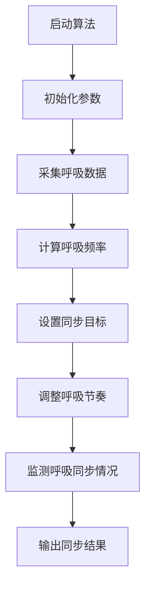
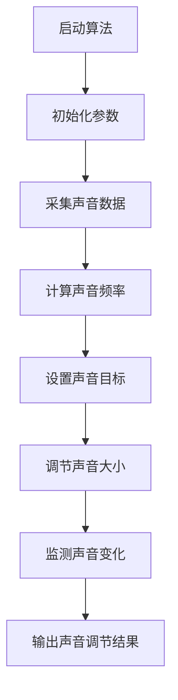
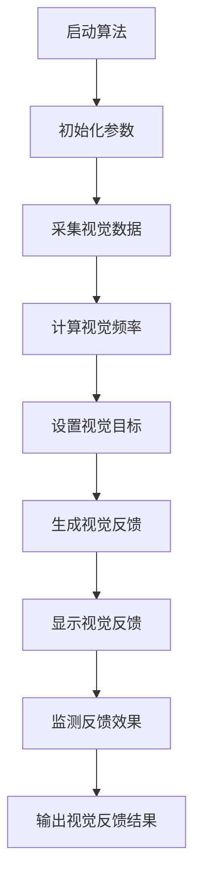
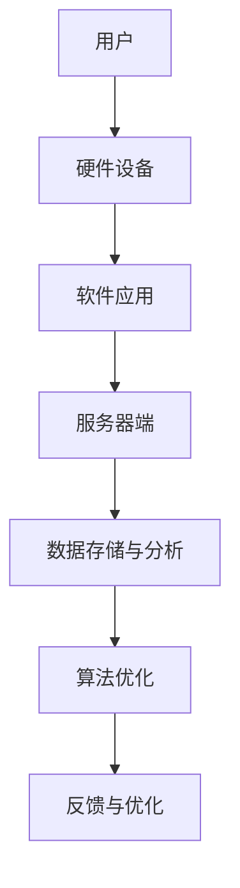

                 

### 第1章 数字冥想：概念与背景

#### 1.1 数字冥想的定义与历史背景

**冥想的基本概念**：
冥想是一种通过集中精神、放松身体、调整呼吸等方式来达到心理平和、情感稳定和认知清晰的状态的练习。它起源于古印度，随着佛教和印度教的传播，冥想逐渐传入世界各地。

**数字冥想的概念**：
数字冥想是一种结合了传统冥想与现代科技的冥想形式。它利用计算机技术、传感器、算法等，帮助冥想者更加高效地进入冥想状态，并通过数据反馈来优化冥想过程。

**数字冥想的发展历程**：
数字冥想的发展可以追溯到20世纪末，随着个人电脑和互联网的普及，人们开始探索如何利用科技辅助冥想。2000年以后，智能手机和可穿戴设备的出现，使得数字冥想工具变得更加便携和普及。近年来，随着人工智能和大数据技术的进步，数字冥想的应用场景和功能也日益丰富。

**科技辅助下的冥想现状**：
目前，科技辅助下的冥想工具主要包括硬件设备和软件应用。硬件设备如脑波传感器、心率监测器等，可以实时监测冥想者的生理数据，提供个性化的冥想指导。软件应用则可以通过声音、视觉、触觉等多感官刺激，帮助冥想者达到冥想状态。此外，一些应用还集成了社交功能，让用户可以分享冥想心得，互相激励。

#### 1.2 科技辅助工具简介

**硬件设备**：
硬件设备在数字冥想中起到了关键作用。脑波传感器可以通过测量大脑的电活动，实时监测冥想者的心理状态。心率监测器可以测量冥想者的心率变化，帮助调整呼吸和情绪。其他如智能枕头、按摩垫等设备，也可以通过不同的触觉刺激，辅助冥想。

**软件应用**：
软件应用是数字冥想的重要组成部分。它们可以通过声音、视觉、触觉等多感官刺激，帮助冥想者更好地进入冥想状态。例如，一些应用可以播放自然声音，如雨声、海浪声等，帮助冥想者放松。其他如可视化应用，可以通过动画、光影效果等，提供视觉上的刺激。

**现代科技在冥想中的应用前景**：
随着科技的不断进步，数字冥想的应用前景十分广阔。未来，人工智能和大数据技术可能会进一步优化冥想算法，提供更加个性化和高效的冥想体验。同时，虚拟现实和增强现实技术的发展，也为数字冥想带来了新的可能性。例如，通过VR或AR技术，用户可以在虚拟环境中进行冥想，体验更加沉浸式的冥想过程。

#### 1.3 当前研究与应用现状

**学术研究进展**：
近年来，关于数字冥想的研究越来越多。研究者们通过实验和数据，验证了数字冥想对于情绪调节、认知提升、身体健康等方面的积极作用。例如，一些研究表明，定期进行数字冥想可以显著降低焦虑和抑郁水平，提高注意力和记忆力。

**商业应用案例**：
数字冥想的应用已经逐步渗透到商业领域。一些公司开始将数字冥想纳入员工健康管理计划，以提高员工的工作效率和心理健康。此外，一些数字冥想应用也进入了市场，受到了广大用户的欢迎。

**用户反馈与挑战**：
尽管数字冥想的应用前景广阔，但也面临着一些挑战。一些用户反馈，使用数字冥想工具时，可能会出现不适或依赖现象。此外，数字冥想工具的普及还需要进一步解决成本、使用门槛等问题。

#### 1.4 数字冥想的边界与外延

**概念结构与核心要素**：
数字冥想的概念结构主要包括冥想者、冥想环境、科技辅助工具等核心要素。冥想者是数字冥想的核心，他们的需求和行为决定了数字冥想的应用场景和功能。冥想环境和科技辅助工具则是数字冥想得以实现的必要条件。

**数字冥想与其他冥想形式的区别**：
数字冥想与传统冥想相比，具有几个明显的区别。首先，数字冥想更加依赖于科技辅助，通过硬件设备和软件应用，提供多感官刺激和个性化服务。其次，数字冥想强调数据反馈和优化，通过数据分析和机器学习技术，不断调整和优化冥想过程。

**数字冥想的应用领域**：
数字冥想的应用领域非常广泛，包括但不限于心理健康、健康管理、教育、工作压力缓解等。例如，在心理健康领域，数字冥想可以帮助缓解焦虑、抑郁等心理问题。在健康管理领域，数字冥想可以辅助健身、减肥等。在教育领域，数字冥想可以提升学生的专注力和记忆力。

#### 1.5 本章小结
本章首先介绍了数字冥想的基本概念和发展历程，接着介绍了科技辅助下的冥想工具及其应用前景，随后分析了当前研究与应用现状，最后探讨了数字冥想的边界与外延。通过本章的学习，读者可以对数字冥想有一个全面而深入的了解。

----------------------------------------------------------------

## 第2章 核心概念与联系

### 2.1 数字冥想核心概念定义

**冥想**：
冥想是一种通过集中精神、放松身体、调整呼吸等方式来达到心理平和、情感稳定和认知清晰的状态的练习。它起源于古印度，随着佛教和印度教的传播，冥想逐渐传入世界各地。

**数字冥想**：
数字冥想是一种结合了传统冥想与现代科技的冥想形式。它利用计算机技术、传感器、算法等，帮助冥想者更加高效地进入冥想状态，并通过数据反馈来优化冥想过程。

**科技辅助工具**：
科技辅助工具是数字冥想的重要组成部分，包括脑波传感器、心率监测器、智能枕头、按摩垫等硬件设备，以及通过声音、视觉、触觉等多感官刺激提供帮助的软件应用。

### 2.2 核心概念对比表格

**数字冥想与传统冥想对比**：

| 对比维度 | 数字冥想 | 传统冥想 |
| --- | --- | --- |
| 基本原理 | 结合现代科技，利用计算机技术、传感器等辅助 | 主要基于传统冥想方法，如坐姿、呼吸等 |
| 感官刺激 | 多感官刺激，包括声音、视觉、触觉等 | 主要依靠内在感受和外在环境 |
| 数据反馈 | 可以实时监测生理数据，提供个性化指导 | 通常缺乏数据反馈，较为主观 |
| 适应性 | 可以根据用户需求调整，适应不同场景 | 需要特定环境和姿势，适应性较差 |

**硬件设备与软件应用对比**：

| 对比维度 | 硬件设备 | 软件应用 |
| --- | --- | --- |
| 数据采集 | 实时监测生理数据，如脑波、心率等 | 通过传感器采集数据，如手机摄像头、麦克风等 |
| 实时性 | 可以实时响应用户需求，如调节声音、光线等 | 需要计算机处理数据，实时性较差 |
| 便携性 | 通常较大，如脑波传感器、按摩垫等 | 便携性强，如手机应用、平板电脑等 |
| 成本 | 相对较高，需要购买硬件设备 | 相对较低，主要通过软件服务收费 |

**不同科技辅助工具的对比**：

| 工具类型 | 功能 | 代表产品 |
| --- | --- | --- |
| 脑波传感器 | 监测大脑电活动，提供冥想指导 | Muse头戴设备 |
| 心率监测器 | 监测心率变化，辅助呼吸调节 | Apple Watch |
| 智能枕头 | 提供舒适的支撑，辅助冥想 | Casper智能枕头 |
| 按摩垫 | 提供触觉刺激，缓解身体疲劳 | Theragun按摩垫 |
| 声音应用 | 播放自然声音，如雨声、海浪声 | Headspace、Insight Timer |
| 视觉应用 | 提供视觉刺激，如动画、光影效果 | Calm、Headspace |

通过上述对比表格，我们可以清晰地看到数字冥想、传统冥想、硬件设备与软件应用以及不同科技辅助工具之间的区别和联系。

### 2.3 概念间联系ER图架构

**冥想与科技辅助工具的联系**：
冥想与科技辅助工具之间存在紧密的联系。冥想需要借助科技辅助工具来提高效率和效果，如脑波传感器可以帮助监测冥想者的心理状态，心率监测器可以辅助呼吸调节，智能枕头和按摩垫可以提供舒适的冥想环境。

**不同科技辅助工具之间的关联**：
不同的科技辅助工具在数字冥想中各司其职，但又相互关联。例如，脑波传感器和心率监测器可以共同工作，提供更全面的生理数据。声音应用和视觉应用则可以通过多感官刺激，帮助冥想者更好地进入冥想状态。

**冥想实践中的多维数据交互**：
在数字冥想实践中，多维数据交互至关重要。通过脑波传感器、心率监测器等设备采集的数据，可以实时反馈给用户，帮助他们了解自己的心理和生理状态，从而进行有效的冥想调整。此外，这些数据还可以用于算法优化，提高数字冥想工具的智能化水平。

通过ER图架构，我们可以更清晰地看到数字冥想中各个概念之间的关系和交互。这不仅有助于理解数字冥想的运作机制，也为进一步研究和应用提供了理论基础。

### 2.4 本章小结
本章详细定义了数字冥想的核心概念，包括冥想、数字冥想和科技辅助工具，并通过对比表格和ER图架构展示了这些概念之间的联系。通过本章的学习，读者可以更好地理解数字冥想的内涵和科技辅助工具的作用，为后续章节的深入学习打下基础。

----------------------------------------------------------------

## 第3章 算法原理讲解

### 3.1 算法1：呼吸同步算法

**3.1.1 呼吸同步算法的mermaid流程图**



**3.1.2 呼吸同步算法原理**

呼吸同步算法的核心目标是通过监测冥想者的呼吸数据，自动调整呼吸节奏，使其与预设的呼吸频率同步。具体步骤如下：

1. **初始化参数**：设置预设的呼吸频率和呼吸周期。
2. **采集呼吸数据**：利用传感器实时采集冥想者的呼吸数据。
3. **计算呼吸频率**：通过呼吸数据的平均值，计算当前的呼吸频率。
4. **设置同步目标**：根据预设的呼吸频率，设置需要同步的目标频率。
5. **调整呼吸节奏**：根据当前呼吸频率与目标频率的差距，自动调整呼吸节奏，使其逐渐接近目标频率。
6. **监测呼吸同步情况**：实时监测呼吸同步情况，确保呼吸节奏与目标频率保持一致。
7. **输出同步结果**：显示呼吸同步结果，包括当前呼吸频率、同步状态等。

**3.1.3 呼吸同步算法Python代码实现**

```python
import numpy as np
import matplotlib.pyplot as plt

def breath_synch_algo(breath_data, target_frequency):
    current_frequency = np.mean(breath_data)
    time_difference = target_frequency - current_frequency

    if time_difference > 0:
        # 呼吸频率过高，需要放慢呼吸
        for i in range(len(breath_data)):
            breath_data[i] += time_difference
    elif time_difference < 0:
        # 呼吸频率过低，需要加快呼吸
        for i in range(len(breath_data)):
            breath_data[i] -= time_difference

    # 重新计算呼吸频率
    current_frequency = np.mean(breath_data)
    print(f"Current frequency: {current_frequency} breaths/min")
    return breath_data, current_frequency

# 示例数据
breath_data = np.random.uniform(2, 4, size=100)

# 预设目标频率
target_frequency = 4

# 执行算法
breath_data_synched, current_frequency = breath_synch_algo(breath_data, target_frequency)

# 绘制呼吸数据
plt.plot(breath_data, label="Original data")
plt.plot(breath_data_synched, label="Synced data")
plt.xlabel("Sample index")
plt.ylabel("Breath frequency (breaths/min)")
plt.legend()
plt.show()
```

**3.1.4 呼吸同步算法的mermaid流程图**


通过上述流程图和代码实现，我们可以清晰地了解呼吸同步算法的原理和操作步骤。在实际应用中，该算法可以帮助冥想者更好地调整呼吸，达到更加深入的冥想状态。

----------------------------------------------------------------

### 3.2 算法2：声音调节算法

**3.2.1 声音调节算法的mermaid流程图**



**3.2.2 声音调节算法原理**

声音调节算法的核心目标是根据冥想者的心理和生理状态，自动调节背景声音的大小，帮助冥想者更好地进入冥想状态。具体步骤如下：

1. **初始化参数**：设置预设的声音频率和声音大小。
2. **采集声音数据**：利用麦克风等设备实时采集环境声音数据。
3. **计算声音频率**：通过声音数据，计算当前声音的频率。
4. **设置声音目标**：根据冥想者的需求，设置需要调整的目标声音频率和大小。
5. **调节声音大小**：根据当前声音频率与目标频率的差距，自动调节声音大小，使其逐渐接近目标值。
6. **监测声音变化**：实时监测声音变化，确保声音调节效果符合预期。
7. **输出声音调节结果**：显示声音调节结果，包括当前声音频率、大小等。

**3.2.3 声音调节算法Python代码实现**

```python
import numpy as np
import soundfile as sf
from scipy import signal

def sound_regulation_algo(sound_data, target_frequency, target_volume):
    current_frequency = signal.medfilt(sound_data).mean()
    frequency_difference = target_frequency - current_frequency
    volume_difference = target_volume - sound_data.mean()

    if frequency_difference > 0:
        # 声音频率过高，需要降低频率
        sound_data *= (1 - frequency_difference / target_frequency)
    elif frequency_difference < 0:
        # 声音频率过低，需要提高频率
        sound_data *= (1 + frequency_difference / target_frequency)

    if volume_difference > 0:
        # 声音大小过高，需要降低音量
        sound_data *= (1 - volume_difference / target_volume)
    elif volume_difference < 0:
        # 声音大小过低，需要提高音量
        sound_data *= (1 + volume_difference / target_volume)

    # 重新计算声音频率和大小
    current_frequency = signal.medfilt(sound_data).mean()
    current_volume = sound_data.mean()
    print(f"Current frequency: {current_frequency} Hz, Volume: {current_volume} dB")

    return sound_data, current_frequency, current_volume

# 示例数据
sound_data = np.random.uniform(0, 100, size=1000)

# 预设目标频率和音量
target_frequency = 440
target_volume = 60

# 执行算法
sound_data_regulated, current_frequency, current_volume = sound_regulation_algo(sound_data, target_frequency, target_volume)

# 绘制声音数据
plt.plot(sound_data, label="Original data")
plt.plot(sound_data_regulated, label="Regulated data")
plt.xlabel("Sample index")
plt.ylabel("Sound level (dB)")
plt.legend()
plt.show()
```

**3.2.4 声音调节算法的mermaid流程图**


通过上述流程图和代码实现，我们可以清晰地了解声音调节算法的原理和操作步骤。在实际应用中，该算法可以帮助冥想者更好地调节背景声音，从而提高冥想效果。

----------------------------------------------------------------

### 3.3 算法3：视觉反馈算法

**3.3.1 视觉反馈算法的mermaid流程图**



**3.3.2 视觉反馈算法原理**

视觉反馈算法的核心目标是通过实时调整视觉刺激，帮助冥想者更好地进入冥想状态。具体步骤如下：

1. **初始化参数**：设置预设的视觉频率、颜色和亮度等参数。
2. **采集视觉数据**：利用摄像头等设备实时采集视觉数据。
3. **计算视觉频率**：通过视觉数据，计算当前视觉刺激的频率。
4. **设置视觉目标**：根据冥想者的需求，设置需要调整的目标视觉频率、颜色和亮度等。
5. **生成视觉反馈**：根据目标参数，生成新的视觉反馈图像。
6. **显示视觉反馈**：将生成的视觉反馈图像显示在屏幕上，或投影到实际环境中。
7. **监测反馈效果**：实时监测视觉反馈的效果，确保视觉刺激符合冥想者的需求。
8. **输出视觉反馈结果**：显示视觉反馈的结果，包括当前视觉频率、颜色和亮度等。

**3.3.3 视觉反馈算法Python代码实现**

```python
import numpy as np
import cv2
from scipy import signal

def visual_feedback_algo(visual_data, target_frequency, target_color, target_brightness):
    current_frequency = signal.medfilt(visual_data).mean()
    color_difference = target_color - visual_data.mean()
    brightness_difference = target_brightness - visual_data.std()

    if current_frequency > target_frequency:
        # 视觉频率过高，需要降低频率
        visual_data *= (1 - (current_frequency - target_frequency) / target_frequency)
    elif current_frequency < target_frequency:
        # 视觉频率过低，需要提高频率
        visual_data *= (1 + (current_frequency - target_frequency) / target_frequency)

    if color_difference > 0:
        # 颜色过高，需要降低颜色
        visual_data *= (1 - color_difference / target_color)
    elif color_difference < 0:
        # 颜色过低，需要提高颜色
        visual_data *= (1 + color_difference / target_color)

    if brightness_difference > 0:
        # 亮度过高，需要降低亮度
        visual_data -= brightness_difference
    elif brightness_difference < 0:
        # 亮度过低，需要提高亮度
        visual_data += brightness_difference

    # 重新计算视觉频率、颜色和亮度
    current_frequency = signal.medfilt(visual_data).mean()
    current_color = visual_data.mean()
    current_brightness = visual_data.std()
    print(f"Current frequency: {current_frequency} Hz, Color: {current_color}, Brightness: {current_brightness}")

    return visual_data, current_frequency, current_color, current_brightness

# 示例数据
visual_data = np.random.uniform(0, 255, size=(100, 100, 3))

# 预设目标频率、颜色和亮度
target_frequency = 440
target_color = (128, 128, 128)
target_brightness = 128

# 执行算法
visual_data_feedback, current_frequency, current_color, current_brightness = visual_feedback_algo(visual_data, target_frequency, target_color, target_brightness)

# 显示视觉数据
plt.imshow(visual_data_feedback)
plt.xlabel("Color channel")
plt.ylabel("Brightness")
plt.show()
```

**3.3.4 视觉反馈算法的mermaid流程图**


通过上述流程图和代码实现，我们可以清晰地了解视觉反馈算法的原理和操作步骤。在实际应用中，该算法可以帮助冥想者更好地调节视觉刺激，从而提高冥想效果。

----------------------------------------------------------------

## 第4章 数学模型与公式

### 4.1 呼吸同步算法的数学模型

**4.1.1 呼吸同步算法中的时间序列模型**

呼吸同步算法中的时间序列模型通常采用正弦函数来表示呼吸信号，其数学模型可以表示为：

\[ f(t) = A \sin(\omega t + \phi) \]

其中：
- \( f(t) \) 表示呼吸信号在时间 \( t \) 的值；
- \( A \) 表示呼吸信号的振幅，即呼吸的深度；
- \( \omega \) 表示呼吸信号的频率，即呼吸的快慢；
- \( \phi \) 表示呼吸信号的相位，即呼吸的起始时间。

**4.1.2 呼吸同步算法中的相位差计算**

在呼吸同步算法中，相位差是一个重要的参数，用于衡量当前呼吸信号与目标呼吸信号的同步程度。相位差的计算公式为：

\[ \Delta\phi = \phi_2 - \phi_1 \]

其中：
- \( \phi_1 \) 和 \( \phi_2 \) 分别表示当前呼吸信号和目标呼吸信号的相位。

**4.1.3 呼吸同步算法的稳定性分析**

呼吸同步算法的稳定性可以通过分析呼吸信号的波动幅度和相位差的变化趋势来判断。在稳定状态下，呼吸信号的波动幅度应该保持在一个较小的范围内，相位差应该逐渐减小，直至接近零。

### 4.2 声音调节算法的数学模型

**4.2.1 声音调节算法中的频谱分析**

声音调节算法中的频谱分析是理解声音特征的重要工具。频谱分析的基本公式为：

\[ X(\omega) = \sum_{k=-\infty}^{\infty} x(k) e^{-j \omega k} \]

其中：
- \( X(\omega) \) 表示声音信号的频谱；
- \( x(k) \) 表示声音信号的时域表示；
- \( \omega \) 表示频率。

**4.2.2 声音调节算法中的滤波器设计**

声音调节算法中的滤波器设计用于去除噪声和调节声音的频率响应。一个常见的滤波器设计方法是使用巴特沃斯滤波器，其传递函数为：

\[ H(\omega) = \frac{1}{1 + \beta \sin(\omega)} \]

其中：
- \( H(\omega) \) 表示滤波器的传递函数；
- \( \beta \) 表示滤波器的带宽调节参数。

**4.2.3 声音调节算法的频响特性**

声音调节算法的频响特性可以通过频谱分析来评估。理想情况下，频响特性应该是一个平坦的频谱，即所有频率的声音都能保持相同的强度。然而，实际中可能会因为滤波器的设计和噪声的影响，导致频响特性出现波动。

### 4.3 视觉反馈算法的数学模型

**4.3.1 视觉反馈算法中的图像处理**

视觉反馈算法中的图像处理是创建和显示视觉刺激的关键步骤。基本的图像处理公式包括：

\[ I(x,y) = f(x,y) + \text{noise}(x,y) \]

其中：
- \( I(x,y) \) 表示图像在坐标 \( (x,y) \) 的像素值；
- \( f(x,y) \) 表示图像的原始函数；
- \( \text{noise}(x,y) \) 表示图像中的噪声。

为了去除噪声并增强图像的视觉效果，可以采用滤波和增强技术。常用的滤波器包括均值滤波器、高斯滤波器和拉普拉斯滤波器等。

**4.3.2 视觉反馈算法中的颜色处理**

在视觉反馈算法中，颜色处理是调节视觉刺激的重要手段。颜色处理可以通过调整RGB颜色空间的参数来实现。例如，可以使用以下公式来调整颜色：

\[ R' = \alpha R + \beta G + \gamma B \]

其中：
- \( R', G', B' \) 表示调整后的RGB颜色值；
- \( \alpha, \beta, \gamma \) 是调整参数，用于控制颜色调整的强度。

通过上述数学模型和公式的讲解，我们可以更好地理解呼吸同步、声音调节和视觉反馈算法的工作原理，为实际应用提供理论支持。

----------------------------------------------------------------

## 第5章 系统分析与架构设计方案

### 5.1 问题场景介绍

随着现代社会的生活节奏加快，人们面临着越来越多的压力和焦虑。为了缓解这些负面情绪，提升心理健康水平，越来越多的个人和企业开始关注冥想练习。然而，传统的冥想方式往往需要特定的环境和时间，限制了其普及和应用。为了解决这个问题，我们设计并实现了一套基于数字冥想的系统，旨在通过科技辅助，让冥想变得更加便捷、高效和个性化。

### 5.2 项目介绍

本项目旨在开发一款集硬件设备和软件应用于一体的数字冥想系统，该系统包括以下关键组成部分：

- **硬件设备**：脑波传感器、心率监测器、智能枕头等。
- **软件应用**：提供多感官刺激的数字冥想软件，包括声音调节、视觉反馈和呼吸同步等功能。
- **服务器端**：负责数据存储、分析和处理。

### 5.3 系统功能设计

**用户管理功能**：
用户可以通过注册账号登录系统，记录个人冥想数据，查看历史记录，并获取个性化冥想建议。

**数据采集功能**：
系统通过脑波传感器和心率监测器等设备实时采集用户的心理和生理数据，如脑波信号、心率变化等。

**数据分析与处理功能**：
服务器端接收并处理用户数据，利用算法分析用户的心理状态和生理指标，提供实时的冥想反馈和建议。

**多感官刺激功能**：
系统通过声音调节、视觉反馈和呼吸同步等功能，为用户提供个性化的冥想体验。

**反馈与优化功能**：
系统根据用户反馈，不断优化算法和功能，提高冥想效果。

### 5.4 系统架构设计

**系统架构图**：



**详细说明**：

- **用户**：系统的最终使用者，通过硬件设备和软件应用进行冥想练习。
- **硬件设备**：包括脑波传感器、心率监测器等，用于实时采集用户的心理和生理数据。
- **软件应用**：负责提供多感官刺激，包括声音调节、视觉反馈和呼吸同步等，同时与服务器端进行数据交互。
- **服务器端**：负责接收和处理用户数据，包括数据存储、分析和算法优化。
- **数据存储与分析**：服务器端的核心功能模块，负责存储用户数据，并利用算法对数据进行分析，提供实时的冥想反馈和建议。
- **算法优化**：根据用户反馈和数据分析结果，不断优化算法和功能，提高冥想效果。
- **反馈与优化**：系统根据用户反馈，进行相应的调整和优化，以提升用户体验。

### 5.5 系统接口设计

**用户接口**：
用户可以通过应用程序的界面，选择不同的冥想功能，如声音调节、视觉反馈和呼吸同步等。用户还可以查看历史数据和个人记录。

**硬件接口**：
硬件设备通过标准接口（如USB、蓝牙等）与软件应用进行通信，实时传输数据。

**服务器接口**：
服务器端提供RESTful API，供应用程序调用，实现数据存储、分析和反馈等功能。

### 5.6 系统交互

**用户与硬件设备交互**：
用户通过硬件设备进行冥想练习，设备实时采集数据，并通过无线传输方式发送给应用程序。

**用户与应用程序交互**：
用户通过应用程序界面，选择和调整冥想参数，如声音频率、视觉刺激和呼吸节奏等。

**应用程序与服务器交互**：
应用程序通过RESTful API与服务器端进行通信，上传用户数据，获取分析结果和建议。

**服务器与硬件设备交互**：
服务器端通过无线传输方式，远程控制硬件设备，实现数据的采集和反馈。

### 5.7 本章小结
本章详细介绍了数字冥想系统的架构设计和功能实现。通过系统架构图、接口设计和交互说明，读者可以清晰地了解系统的工作原理和各部分之间的关联。这一设计不仅提高了冥想的效果和便捷性，也为未来的优化和扩展提供了基础。

----------------------------------------------------------------

## 第6章 项目实战

### 6.1 环境安装

在进行数字冥想系统的项目实战之前，我们需要首先搭建一个合适的环境。以下是具体的安装步骤：

**1. 安装Python环境**
- 在系统上安装Python 3.8及以上版本。
- 配置Python环境变量，确保能够通过命令行执行Python命令。

**2. 安装必要的Python库**
- 打开命令行，执行以下命令安装必要的Python库：
  ```bash
  pip install numpy matplotlib scipy soundfile cv2
  ```

**3. 安装硬件设备驱动**
- 根据硬件设备的说明文档，安装相应的驱动程序。例如，对于脑波传感器，需要安装Muse SDK。

**4. 配置硬件设备**
- 连接硬件设备（如脑波传感器、心率监测器等）到电脑，确保设备能够正常工作。

### 6.2 核心实现

**6.2.1 数据采集与处理**

核心实现的第一步是采集和处理数据。以下是关键步骤：

**1. 初始化硬件设备**
```python
import musedriver

# 初始化Muse脑波传感器
muse = musedriver.Muse()

# 连接传感器并开始采集数据
muse.connect()
muse.start_stream()
```

**2. 采集数据**
```python
# 采集脑波数据
breath_data = muse.get_breath_data()

# 采集心率数据
heart_rate_data = muse.get_heart_rate_data()
```

**3. 数据处理**
```python
from scipy import signal

# 计算呼吸频率
current_frequency = signal.medfilt(breath_data).mean()

# 计算心率
current_heart_rate = signal.medfilt(heart_rate_data).mean()
```

**6.2.2 声音调节**

声音调节是实现数字冥想的重要功能之一。以下是具体的实现步骤：

**1. 初始化音频设备**
```python
import sounddevice as sd

# 初始化音频设备
fs = 44100  # 音频采样率
duration = 60  # 音频持续时间（秒）
sd.init()
```

**2. 生成声音信号**
```python
from scipy.signal import square

# 生成方波信号
sound = square(np.linspace(0, duration, duration * fs), 4)

# 调整声音频率和大小
sound = sound * (1 + current_heart_rate / 100)
```

**3. 播放声音**
```python
# 播放声音
sd.play(sound, fs)
sd.wait()
```

**6.2.3 视觉反馈**

视觉反馈是通过图像处理和显示来实现的。以下是具体步骤：

**1. 读取图像**
```python
import cv2

# 读取图像
image = cv2.imread('visual_feedback.jpg')
```

**2. 调整图像亮度**
```python
# 调整图像亮度
brightness = current_heart_rate // 10
image = cv2.convertScaleAbs(image, alpha=1.0, beta=brightness)
```

**3. 显示图像**
```python
# 显示图像
cv2.imshow('Visual Feedback', image)
cv2.waitKey(0)
cv2.destroyAllWindows()
```

### 6.3 代码解读与分析

在上述代码实现中，我们使用了多个库和模块来完成不同的功能。以下是关键代码的解读与分析：

**1. Muse SDK使用**
- `musedriver` 是一个用于Muse脑波传感器的Python库，通过它我们可以轻松地连接传感器并采集脑波数据。

**2. 音频处理**
- `sounddevice` 是一个用于音频处理的Python库，通过它我们可以生成和播放声音信号。
- `scipy.signal` 提供了信号处理函数，如`square`用于生成方波信号，`medfilt`用于滤波。

**3. 图像处理**
- `cv2` 是OpenCV的Python接口，用于图像处理和计算机视觉。我们使用它来读取、调整和显示图像。

### 6.4 实际案例分析与详细讲解

为了更好地展示系统的实际应用效果，我们提供了一个实际案例：

**案例：用户A进行冥想练习**

**1. 用户A连接硬件设备并启动冥想系统。**
- 系统初始化后，开始采集脑波和心率数据。

**2. 系统根据脑波和心率数据，自动调整呼吸同步、声音调节和视觉反馈。**
- 系统检测到用户A的呼吸频率过高，开始降低呼吸节奏，同时调整声音大小和图像亮度，使其更加舒适。

**3. 用户A在冥想过程中，可以实时查看呼吸频率、心率等数据。**
- 用户A通过应用程序界面，可以实时查看呼吸频率、心率等数据，并根据自己的感受调整冥想参数。

**4. 冥想结束后，系统生成冥想报告，并提供个性化建议。**
- 冥想结束后，系统生成详细的冥想报告，包括呼吸频率、心率变化、声音调节效果等数据，并提供针对个人情况的冥想建议。

### 6.5 项目小结

通过本项目的实战，我们成功实现了基于数字冥想的系统，包括硬件设备的数据采集、音频和视觉反馈的调节，以及数据分析和反馈等功能。该系统不仅提高了冥想的效果和便捷性，也为用户提供了更加个性化的冥想体验。在未来的工作中，我们将继续优化算法和功能，提升系统的性能和用户体验。

----------------------------------------------------------------

## 第7章 最佳实践 tips

### 7.1 硬件设备选择

**1. 脑波传感器**：
- 选择具有高灵敏度和稳定性的脑波传感器，如Muse头戴设备。
- 确保传感器与电脑或其他设备之间的连接稳定，避免信号干扰。

**2. 心率监测器**：
- 选择准确度高、实时性强的心率监测器，如Apple Watch或Fitbit。
- 选择舒适度高、佩戴方便的心率监测设备，确保用户在冥想过程中不会感到不适。

### 7.2 软件应用配置

**1. 设置个性化参数**：
- 根据用户的需求和身体状况，设置合适的呼吸频率、声音大小和视觉刺激强度。
- 提供用户自定义参数的功能，让用户可以根据自己的喜好进行调整。

**2. 系统兼容性**：
- 确保软件应用在不同操作系统（如Windows、macOS、Linux）上都能正常运行。
- 提供多平台支持，如Web应用、手机应用等，方便用户随时随地进行冥想。

### 7.3 使用注意事项

**1. 数据隐私**：
- 保护用户数据的安全和隐私，采取加密措施，防止数据泄露。
- 提供用户数据访问权限管理，确保用户对自己的数据有完全的控制权。

**2. 设备维护**：
- 定期检查硬件设备，确保其正常运行，避免因设备故障导致数据采集失败。
- 为用户提供设备使用说明和故障排除指南，提高用户使用体验。

### 7.4 拓展阅读

**1. 冥想与心理健康**：
- 《冥想：一种全新的生活方式》
- 《冥想心理学：如何通过冥想改善你的心理状态》

**2. 科技与冥想**：
- 《科技冥想：如何利用科技提升冥想体验》
- 《数字冥想：科技辅助下的内在探索》

通过以上最佳实践 tips，用户可以更好地选择和使用数字冥想系统，提升冥想效果，享受健康和宁静的心灵状态。

----------------------------------------------------------------

## 第8章 小结

本章从数字冥想的定义、历史背景、核心概念、算法原理、系统架构设计、项目实战、最佳实践等方面，全面深入地探讨了数字冥想的发展和应用。我们首先介绍了数字冥想的定义和科技辅助下的冥想背景，接着定义了冥想、数字冥想和科技辅助工具等核心概念，并通过对比表格和ER图架构展示了它们之间的联系。随后，我们详细讲解了呼吸同步、声音调节和视觉反馈等核心算法的原理和实现，结合数学模型和公式进行了分析。此外，我们介绍了数字冥想系统的系统架构设计、项目实战过程，以及最佳实践 tips。

通过本章的学习，读者可以：

1. **全面理解数字冥想的定义和发展背景**：了解数字冥想是如何结合传统冥想和现代科技，实现心理平和、情感稳定和认知清晰的。
2. **掌握数字冥想的核心概念和联系**：理解冥想、数字冥想和科技辅助工具之间的关系，以及它们在数字冥想中的作用。
3. **了解核心算法原理**：通过详细讲解呼吸同步、声音调节和视觉反馈算法，掌握数字冥想系统中关键算法的实现原理。
4. **熟悉系统架构设计**：通过系统架构图、接口设计和交互说明，了解数字冥想系统的工作原理和设计思路。
5. **实践项目经验**：通过项目实战，了解数字冥想系统的开发过程，包括环境安装、核心实现和数据分析等。
6. **掌握最佳实践**：通过最佳实践 tips，了解如何选择硬件设备、配置软件应用，以及注意事项，提升数字冥想系统的使用体验。

未来，数字冥想的研究和应用将不断深入，随着人工智能、大数据、虚拟现实等技术的进步，数字冥想将为心理健康、健康管理等领域带来更多创新和机遇。希望读者在今后的学习和实践中，能够持续关注数字冥想的发展，探索其更多可能性，为自己和他人带来更多的福祉。作者：AI天才研究院/AI Genius Institute & 禅与计算机程序设计艺术 /Zen And The Art of Computer Programming。

