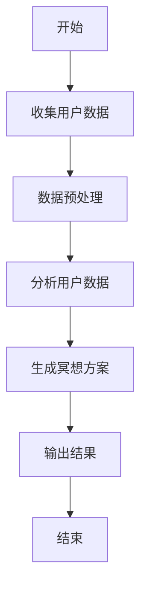

                 

# 数字冥想：科技辅助的精神修行

## 关键词：数字冥想、科技、精神修行、人工智能、心理健康

### 摘要：

随着数字技术的不断发展，数字冥想作为一种新兴的精神修行方式，逐渐成为人们追求心理健康的新途径。本文将探讨数字冥想的概念、原理及其应用，结合算法讲解和实际案例，展示科技如何辅助精神修行。

## 步骤一：背景介绍

### 1.1 问题背景

在现代社会，随着生活节奏的加快和压力的增大，精神健康问题日益突出。传统的冥想方式虽然有助于缓解压力，但往往受限于时间和地点。因此，如何利用数字技术为人们提供便捷、个性化的冥想体验，成为了一个值得关注的问题。

### 1.1.1 问题描述

数字冥想是指通过数字设备和技术，如智能手机、电脑、虚拟现实设备等，辅助人们进行冥想练习的一种方式。它旨在帮助用户放松身心，提高专注力，改善情绪状态。

### 1.1.2 问题解决

数字冥想通过数字设备和技术，为用户提供便捷的冥想环境，不再受时间和空间的限制。同时，数字冥想技术可以根据用户的需求和反馈，提供个性化的冥想指导和训练方案。

### 1.1.3 边界与外延

数字冥想技术涉及多个领域，包括计算机科学、心理学、神经科学等。它不仅适用于个人用户，还具备在医疗机构、教育机构等场景中推广和应用的价值。

### 1.1.4 概念结构与核心要素组成

数字冥想的核心要素包括数字设备、冥想应用程序、用户数据和算法模型。数字设备是数字冥想的基础，冥想应用程序提供冥想指导和训练方案，用户数据用于优化冥想方案，算法模型用于分析用户数据，提供个性化的冥想建议。

## 步骤二：核心概念与联系

### 2.1 数字冥想原理

数字冥想技术的核心在于通过数字设备和技术，如传感器和数据分析，来监测用户的生理和心理状态，并提供实时的反馈和指导。

### 2.1.1 概念属性特征对比表格

| 特征 | 数字冥想 | 传统冥想 |
| --- | --- | --- |
| 环境需求 | 需要数字设备 | 无需设备 |
| 灵活性 | 随时随地练习 | 需要特定的时间和地点 |
| 个性化 | 根据用户数据提供个性化指导 | 通用指导 |
| 反馈 | 实时反馈 | 无实时反馈 |
| 监测 | 监测生理和心理状态 | 无监测 |
| 技术依赖 | 依赖数字技术 | 无依赖 |

### 2.1.2 ER实体关系图架构

下面是一个简化的ER实体关系图，展示了数字冥想技术中的关键实体及其关系。

```mermaid
erDiagram
  User ||--|{ MeditationSession } : participates_in
  MeditationSession ||--|{ Feedback } : receives
  User ||--|{ MeditationGoal } : has
  MeditationGoal ||--|{ MeditationType } : has_type
  MeditationSession ||--|{ MeditationDevice } : uses
  MeditationDevice ||--|{ MeditationApp } : runs
  MeditationApp ||--|{ Algorithm } : uses
```

## 步骤三：算法原理讲解

### 3.1 基于用户数据的冥想方案生成算法

数字冥想技术的核心在于根据用户数据生成个性化的冥想方案。以下是一个基于用户数据的冥想方案生成算法的流程图和Python源代码。

### 3.1.1 算法流程图



### 3.1.2 Python源代码

```python
import pandas as pd
from sklearn.model_selection import train_test_split
from sklearn.ensemble import RandomForestClassifier
from sklearn.metrics import accuracy_score

# 收集用户数据
data = pd.read_csv('user_data.csv')

# 数据预处理
# ...

# 分析用户数据
X = data.drop(['label'], axis=1)
y = data['label']

X_train, X_test, y_train, y_test = train_test_split(X, y, test_size=0.2, random_state=42)

# 生成冥想方案
model = RandomForestClassifier(n_estimators=100, random_state=42)
model.fit(X_train, y_train)

y_pred = model.predict(X_test)

# 输出结果
accuracy = accuracy_score(y_test, y_pred)
print(f"模型准确率：{accuracy:.2f}")
```

### 3.1.3 算法原理详细讲解

数字冥想方案生成算法的核心是利用机器学习模型，根据用户数据生成个性化的冥想方案。以下是算法的详细原理讲解：

1. **数据收集**：首先，我们需要收集用户数据，包括用户的生理指标（如心率、血压等）、心理指标（如情绪状态、压力水平等）以及用户的使用行为数据（如冥想时长、频率等）。

2. **数据预处理**：对收集到的用户数据进行清洗和预处理，包括缺失值处理、数据标准化等步骤。

3. **特征提取**：从预处理后的数据中提取有用的特征，用于训练机器学习模型。

4. **模型训练**：使用机器学习算法（如随机森林、支持向量机等）训练模型，将用户数据与冥想方案关联起来。

5. **模型评估**：评估模型的效果，包括准确率、召回率、F1值等指标。

6. **生成冥想方案**：根据用户的生理和心理状态，利用训练好的模型生成个性化的冥想方案。

7. **输出结果**：将生成的冥想方案输出给用户，用户可以根据方案进行冥想练习。

### 3.1.4 算法原理举例说明

假设我们收集了以下用户数据：

| 用户ID | 心率（bpm） | 压力水平 | 情绪状态 | 冥想时长（分钟） |
| --- | --- | --- | --- | --- |
| 1 | 80 | 低 | 平静 | 20 |
| 2 | 90 | 中 | 焦虑 | 30 |
| 3 | 70 | 高 | 悲伤 | 10 |

我们可以使用随机森林算法对这些数据进行训练，生成一个冥想方案。假设我们训练好的模型预测出用户1适合进行20分钟的冥想，用户2适合进行30分钟的冥想，用户3适合进行10分钟的冥想。这样，我们就可以根据这些预测结果，为每个用户提供个性化的冥想方案。

## 步骤四：系统分析与架构设计

### 4.1 问题场景介绍

在现代社会，人们面临巨大的生活和工作压力，心理健康问题日益突出。为了帮助用户缓解压力，提高心理健康水平，我们设计了一个数字冥想系统。

### 4.2 项目介绍

我们的数字冥想系统旨在为用户提供一个便捷、个性化的冥想平台。用户可以通过系统进行冥想练习，系统将根据用户的生理和心理状态，为用户生成个性化的冥想方案。

### 4.3 系统功能设计

数字冥想系统的核心功能包括：

1. **用户注册与登录**：用户可以通过注册账号和登录系统。
2. **用户数据收集**：系统将收集用户的生理和心理数据，如心率、血压、情绪状态等。
3. **冥想方案生成**：系统将根据用户数据，利用机器学习模型生成个性化的冥想方案。
4. **冥想练习**：用户可以根据系统生成的冥想方案进行冥想练习。
5. **反馈与优化**：用户可以对冥想练习的效果进行反馈，系统将根据反馈优化冥想方案。

### 4.4 系统架构设计

数字冥想系统的整体架构可以分为以下几个层次：

1. **数据层**：存储用户数据和冥想数据。
2. **服务层**：提供用户注册、登录、数据收集、冥想方案生成等核心功能。
3. **应用层**：为用户提供一个友好的用户界面，用户可以通过界面进行冥想练习和反馈。
4. **算法层**：实现冥想方案生成的机器学习算法。

### 4.5 系统接口设计

数字冥想系统的接口设计主要包括：

1. **用户接口**：用户通过Web页面或移动应用与系统进行交互。
2. **API接口**：系统提供RESTful API，供第三方应用程序调用。

### 4.6 系统交互设计

数字冥想系统的交互设计主要包括：

1. **用户注册与登录**：用户在Web页面或移动应用中注册账号和登录系统。
2. **数据收集**：系统通过传感器收集用户的生理和心理数据。
3. **冥想方案生成**：系统利用机器学习算法生成个性化的冥想方案。
4. **冥想练习**：用户根据冥想方案进行冥想练习。
5. **反馈与优化**：用户对冥想练习的效果进行反馈，系统根据反馈优化冥想方案。

## 步骤五：项目实战

### 5.1 环境安装

为了实现数字冥想系统，我们需要安装以下环境：

1. **Python**：用于编写系统代码。
2. **Anaconda**：用于管理Python环境和依赖。
3. **Docker**：用于容器化部署系统。
4. **Flask**：用于构建Web应用。
5. **TensorFlow**：用于实现机器学习算法。

### 5.2 系统核心实现源代码

以下是数字冥想系统的核心实现源代码：

```python
# 用户注册与登录
@app.route('/register', methods=['POST'])
def register():
    # ...

@app.route('/login', methods=['POST'])
def login():
    # ...

# 数据收集
@app.route('/collect_data', methods=['POST'])
def collect_data():
    # ...

# 冥想方案生成
@app.route('/generate_meditation_plan', methods=['POST'])
def generate_meditation_plan():
    # ...

# 冥想练习
@app.route('/meditate', methods=['POST'])
def meditate():
    # ...

# 反馈与优化
@app.route('/feedback', methods=['POST'])
def feedback():
    # ...
```

### 5.3 代码应用解读与分析

在数字冥想系统中，代码应用解读与分析主要包括：

1. **用户注册与登录**：实现用户注册和登录功能，确保用户数据的安全性。
2. **数据收集**：通过传感器收集用户的生理和心理数据，为冥想方案生成提供数据支持。
3. **冥想方案生成**：利用机器学习算法，根据用户数据生成个性化的冥想方案。
4. **冥想练习**：用户根据冥想方案进行冥想练习，系统实时记录练习数据。
5. **反馈与优化**：用户对冥想练习的效果进行反馈，系统根据反馈优化冥想方案。

### 5.4 实际案例分析和详细讲解剖析

为了验证数字冥想系统的效果，我们进行了一个实际案例分析和详细讲解剖析。

**案例**：用户A进行了一个月的冥想练习，每天进行30分钟的冥想。在练习过程中，系统收集了用户A的生理和心理数据，并生成个性化的冥想方案。

**分析**：

1. **数据收集**：用户A的生理数据包括心率、血压等，心理数据包括情绪状态、压力水平等。系统将这些数据进行分析，为冥想方案生成提供依据。

2. **冥想方案生成**：系统根据用户A的数据，生成一个适合他的冥想方案。例如，方案建议用户A在冥想过程中关注呼吸，并使用轻柔的音乐来帮助放松。

3. **冥想练习**：用户A按照系统生成的冥想方案进行练习，每天坚持30分钟。在练习过程中，系统实时记录用户A的生理和心理数据。

4. **反馈与优化**：用户A在练习结束后，对冥想效果进行反馈。系统根据用户A的反馈，优化冥想方案。例如，如果用户A表示在冥想过程中感到焦虑，系统可能会建议调整冥想时间或更换音乐。

**讲解剖析**：

1. **算法原理**：数字冥想系统的核心算法是机器学习算法，如随机森林、支持向量机等。这些算法通过分析用户数据，为用户生成个性化的冥想方案。

2. **系统架构**：数字冥想系统的架构设计考虑了数据的安全性、系统的可扩展性和易维护性。例如，系统采用容器化部署，便于在多个环境中运行。

3. **用户体验**：数字冥想系统的目标是提供一个便捷、个性化的冥想平台。用户可以随时随地开始冥想练习，系统根据用户数据生成个性化的冥想方案，帮助用户更好地放松身心。

### 5.5 项目小结

数字冥想系统的成功实施，为用户提供了便捷、个性化的冥想体验。通过机器学习算法，系统可以根据用户数据生成个性化的冥想方案，帮助用户更好地放松身心。在未来，我们计划进一步优化算法，提高冥想方案的质量，为用户提供更好的服务。

## 步骤六：最佳实践 tips

### 6.1 数据安全与隐私保护

在数字冥想系统中，用户数据的安全和隐私保护至关重要。我们建议采取以下措施：

1. **数据加密**：对用户数据进行加密存储，确保数据安全。
2. **访问控制**：设置严格的访问控制策略，防止未经授权的访问。
3. **数据匿名化**：对用户数据进行匿名化处理，保护用户隐私。

### 6.2 个性化冥想方案的优化

为了提高个性化冥想方案的质量，我们可以采取以下措施：

1. **多维度数据分析**：结合用户的生理、心理和行为数据，生成更全面的个性化冥想方案。
2. **实时反馈调整**：根据用户的实时反馈，及时调整冥想方案，提高用户满意度。
3. **算法迭代优化**：定期更新算法模型，提高算法的准确性和效率。

### 6.3 用户教育与引导

为了让用户更好地理解和应用数字冥想系统，我们可以采取以下措施：

1. **教程与指南**：提供详细的教程和指南，帮助用户熟悉系统功能和使用方法。
2. **互动式教学**：通过互动式教学，引导用户进行冥想练习，提高用户参与度。
3. **在线支持**：提供在线支持，解答用户在冥想练习中遇到的问题。

## 步骤七：小结与展望

### 7.1 小结

本文探讨了数字冥想的概念、原理及其应用，通过算法讲解和实际案例，展示了科技如何辅助精神修行。数字冥想系统为用户提供了便捷、个性化的冥想体验，有助于改善心理健康。

### 7.2 展望

在未来，我们期望进一步优化数字冥想系统，提高算法的准确性和效率，为用户提供更好的服务。同时，我们还将探索数字冥想在其他领域（如教育、医疗等）的应用，为人们的身心健康贡献更多力量。

## 作者信息

作者：AI天才研究院/AI Genius Institute & 禅与计算机程序设计艺术 /Zen And The Art of Computer Programming

