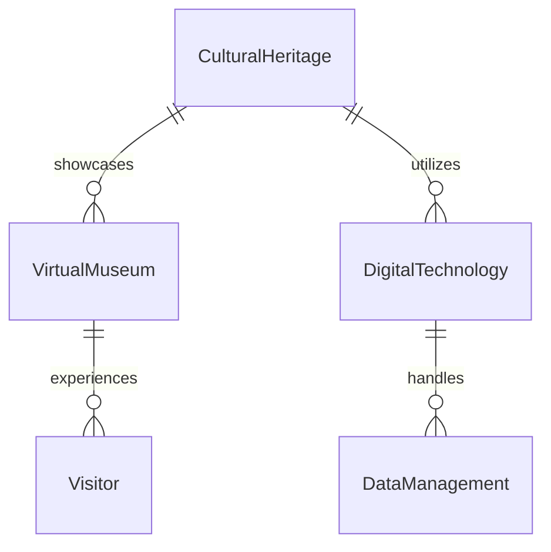
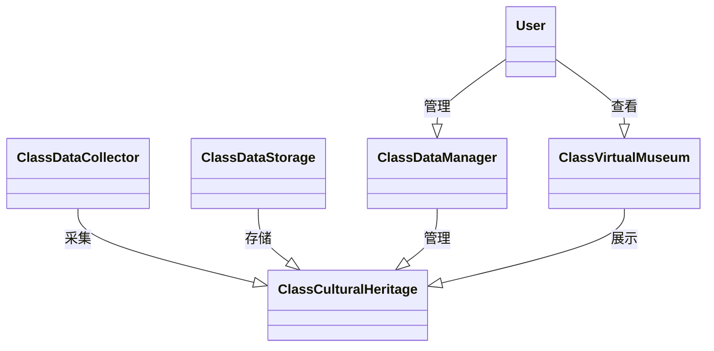
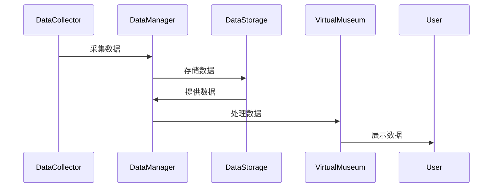

                 

# 数字化时代的文化传承：虚拟博物馆与文化遗产保护

## 关键词：数字化、文化传承、虚拟博物馆、文化遗产保护、技术挑战

## 摘要

本文旨在探讨数字化技术在文化传承领域中的应用，特别是虚拟博物馆和文化遗产保护方面的实践与挑战。在数字化时代，如何利用虚拟博物馆和数字化技术来保护和传承文化遗产，已成为一个重要课题。本文通过详细分析虚拟博物馆的设计与实现、文化遗产保护的数字化技术、数字化时代的文化遗产管理等多个方面，探讨了数字化时代文化传承的前景与挑战，并提出了应对策略与解决方案。本文旨在为相关领域的研究者和从业者提供有价值的参考和启示。

## Step 1: 导入背景信息

### 数字化时代的文化传承背景

数字化时代，信息技术的迅猛发展深刻改变了人们的生活方式和社会结构。在文化传承领域，数字化技术以其高效、便捷、低成本等优势，为传统文化遗产的保护、传承和创新提供了新的可能性。虚拟博物馆作为一种全新的文化展示形式，不仅能够突破时空限制，让文化遗产得到更广泛的传播，还能提供沉浸式体验，激发观众的兴趣和参与感。

### 本书的目标与结构

本书旨在探讨数字化时代文化传承的现状与趋势，分析虚拟博物馆与文化遗产保护的实践与挑战，并提出相应的解决方案。全书分为八个部分，分别从引言、数字化时代的文化传承概述、虚拟博物馆的设计与实现、文化遗产保护的数字化技术、数字化时代的文化遗产管理、虚拟博物馆与文化遗产保护的案例分析、数字化时代的文化传承前景与挑战以及结论与未来展望等方面进行深入探讨。

## Step 2: 设计一级目录

### 引言

- 数字化时代的文化传承背景
- 本书的目标与结构

### 数字化时代的文化传承概述

- 数字化对文化传承的影响
- 数字化时代文化传承的必要性
- 文化传承的定义与分类

### 虚拟博物馆的设计与实现

- 虚拟博物馆的概念
- 虚拟博物馆的技术架构
- 虚拟博物馆的内容设计

### 文化遗产保护的数字化技术

- 数字化技术在文化遗产保护中的应用
- 3D扫描与建模技术
- 数据库与信息管理系统

### 数字化时代的文化遗产管理

- 文化遗产管理的数字化趋势
- 文化遗产数字化管理的优势与挑战
- 数字化管理案例研究

### 虚拟博物馆与文化遗产保护的案例分析

- 成功案例分享
- 失败案例分析
- 教训与启示

### 数字化时代的文化传承前景与挑战

- 数字化时代的文化传承趋势
- 文化传承的挑战与机遇
- 应对策略与解决方案

### 结论与未来展望

- 总结数字化时代文化传承的重要性
- 展望未来文化传承的发展方向

## Step 3: 设计二级目录

### 引言

#### 数字化时代的文化传承背景

- 数字化技术的崛起
- 文化传承的重要性

#### 本书的目标与结构

- 探讨数字化时代文化传承的实践与挑战
- 深入分析虚拟博物馆与文化遗产保护
- 提出解决方案与展望

### 数字化时代的文化传承概述

#### 数字化对文化传承的影响

- 信息传播方式的变革
- 文化资源的共享与传播

#### 数字化时代文化传承的必要性

- 文化传承面临的挑战
- 数字化技术的优势

#### 文化传承的定义与分类

- 文化传承的概念
- 文化传承的分类

### 虚拟博物馆的设计与实现

#### 虚拟博物馆的概念

- 虚拟博物馆的定义
- 虚拟博物馆与传统博物馆的比较

#### 虚拟博物馆的技术架构

- 技术架构的组成
- 技术选型与优化

#### 虚拟博物馆的内容设计

- 内容设计的原则
- 内容设计的方法与工具

### 文化遗产保护的数字化技术

#### 数字化技术在文化遗产保护中的应用

- 3D扫描与建模技术的应用
- 数据库与信息管理系统的应用

#### 3D扫描与建模技术

- 技术原理
- 技术优势与挑战

#### 数据库与信息管理系统

- 数据库的设计与实现
- 信息管理系统的功能与架构

### 数字化时代的文化遗产管理

#### 文化遗产管理的数字化趋势

- 数字化管理的现状与发展
- 数字化管理的优势与挑战

#### 文化遗产数字化管理的优势与挑战

- 优势分析
- 挑战与解决方案

#### 数字化管理案例研究

- 成功案例分享
- 失败案例分析

### 虚拟博物馆与文化遗产保护的案例分析

#### 成功案例分享

- 案例一：虚拟博物馆的设计与实现
- 案例二：文化遗产保护的数字化技术

#### 失败案例分析

- 案例一：数字化文化遗产管理的困境
- 案例二：虚拟博物馆的运营与挑战

#### 教训与启示

- 教训总结
- 启示与建议

### 数字化时代的文化传承前景与挑战

#### 数字化时代的文化传承趋势

- 文化传承的发展方向
- 数字化技术在文化传承中的应用前景

#### 文化传承的挑战与机遇

- 挑战分析
- 机遇探索

#### 应对策略与解决方案

- 政策与法规的支持
- 技术创新与人才储备

### 结论与未来展望

#### 总结数字化时代文化传承的重要性

- 文化传承的意义
- 数字化技术的价值

#### 展望未来文化传承的发展方向

- 文化传承的创新模式
- 数字化技术的持续发展

## Step 4: 设计三级目录

### 引言

#### 数字化时代的文化传承背景

##### 数字化技术的崛起

- 互联网的普及
- 人工智能的发展

##### 文化传承的重要性

- 文化多样性的保护
- 后代教育的传承

#### 本书的目标与结构

##### 探讨数字化时代文化传承的实践与挑战

- 实践案例分析
- 挑战与解决方案

##### 深入分析虚拟博物馆与文化遗产保护

- 虚拟博物馆的设计与实现
- 文化遗产保护的数字化技术

##### 提出解决方案与展望

- 技术创新
- 发展趋势

### 数字化时代的文化传承概述

#### 数字化对文化传承的影响

##### 信息传播方式的变革

- 网络媒体的崛起
- 社交媒体的广泛应用

##### 文化资源的共享与传播

- 数字化资源的存储与分发
- 全球化背景下文化资源的传播

#### 数字化时代文化传承的必要性

##### 文化传承面临的挑战

- 文化的消失与断裂
- 知识产权保护的问题

##### 数字化技术的优势

- 高效性
- 低成本

#### 文化传承的定义与分类

##### 文化传承的概念

- 文化传承的定义
- 文化传承的内涵

##### 文化传承的分类

- 传统文化的传承
- 现代文化的创新

### 虚拟博物馆的设计与实现

#### 虚拟博物馆的概念

##### 虚拟博物馆的定义

- 虚拟博物馆的概念
- 虚拟博物馆的特征

##### 虚拟博物馆与传统博物馆的比较

- 展示方式的差异
- 参与体验的不同

#### 虚拟博物馆的技术架构

##### 技术架构的组成

- 前端展示技术
- 后端数据处理技术

##### 技术选型与优化

- 技术选型的考虑因素
- 技术优化的方法与策略

#### 虚拟博物馆的内容设计

##### 内容设计的原则

- 可访问性
- 文化价值的体现

##### 内容设计的方法与工具

- 资源整合
- 互动设计工具的使用

### 文化遗产保护的数字化技术

#### 数字化技术在文化遗产保护中的应用

##### 3D扫描与建模技术的应用

- 技术原理
- 应用实例

##### 数据库与信息管理系统的应用

- 数据库的设计与实现
- 信息管理系统的功能与架构

#### 3D扫描与建模技术

##### 技术原理

- 3D扫描的原理
- 建模技术的应用

##### 技术优势与挑战

- 优势分析
- 挑战与解决方案

#### 数据库与信息管理系统

##### 数据库的设计与实现

- 数据模型的设计
- 数据库的构建与维护

##### 信息管理系统的功能与架构

- 功能模块的设计
- 系统架构的优化

### 数字化时代的文化遗产管理

#### 文化遗产管理的数字化趋势

##### 数字化管理的现状与发展

- 数字化管理的发展历程
- 现状分析

##### 数字化管理的优势与挑战

- 优势分析
- 挑战与解决方案

#### 文化遗产数字化管理的优势与挑战

##### 优势分析

- 效率提升
- 资源共享

##### 挑战与解决方案

- 技术难题
- 安全性问题

#### 数字化管理案例研究

##### 成功案例分享

- 案例一：数字化文化遗产管理的成功实践
- 案例二：数字化文化遗产管理的创新模式

##### 失败案例分析

- 案例一：数字化文化遗产管理中的困境
- 案例二：数字化文化遗产管理的失败教训

##### 教训与启示

- 教训总结
- 启示与建议

### 虚拟博物馆与文化遗产保护的案例分析

#### 成功案例分享

##### 案例一：虚拟博物馆的设计与实现

- 项目背景
- 设计与实现过程

##### 案例二：文化遗产保护的数字化技术

- 项目背景
- 技术应用与效果

#### 失败案例分析

##### 案例一：数字化文化遗产管理的困境

- 项目背景
- 遇到的问题与挑战

##### 案例二：虚拟博物馆的运营与挑战

- 项目背景
- 运营过程中的问题与挑战

#### 教训与启示

##### 教训总结

- 问题分析与反思

##### 启示与建议

- 经验分享
- 改进措施

### 数字化时代的文化传承前景与挑战

#### 数字化时代的文化传承趋势

##### 文化传承的发展方向

- 数字化技术的持续创新
- 文化传播模式的变革

##### 数字化技术在文化传承中的应用前景

- 虚拟现实技术的应用
- 人工智能在文化传承中的应用

#### 文化传承的挑战与机遇

##### 挑战分析

- 技术难题
- 安全性问题

##### 机遇探索

- 文化多样性的保护
- 文化产业的创新与发展

#### 应对策略与解决方案

##### 政策与法规的支持

- 政策制定
- 法规完善

##### 技术创新与人才储备

- 技术研发
- 人才培养

### 结论与未来展望

#### 总结数字化时代文化传承的重要性

- 文化传承的意义
- 数字化技术的价值

##### 展望未来文化传承的发展方向

- 数字化技术的持续发展
- 文化传承的创新模式

## Step 5: 编写正文内容

### 引言

在数字化时代，信息技术的发展正以前所未有的速度改变着人类社会。文化传承作为一个关乎民族记忆和未来发展的领域，也面临着前所未有的挑战和机遇。虚拟博物馆作为一种创新的数字文化展示形式，不仅改变了传统博物馆的展示方式，还为文化遗产的保护和传承提供了新的思路。本书旨在探讨数字化技术在文化传承中的应用，特别是虚拟博物馆与文化遗产保护的实践与挑战。

### 数字化时代的文化传承概述

#### 数字化对文化传承的影响

数字化技术的崛起，为文化传承带来了前所未有的机遇。首先，数字化技术使得文化资源的传播变得更加便捷和高效。通过网络和社交媒体，文化信息可以跨越地域和时间的限制，迅速传播到全球各地。其次，数字化技术为文化遗产的保护提供了新的手段。通过3D扫描、数字建模等技术，文化遗产得以以数字形式保存，避免了物理损坏和丢失的风险。

#### 数字化时代文化传承的必要性

在数字化时代，文化传承面临着诸多挑战。一方面，传统文化的传承与创新需要新的方式和手段；另一方面，全球化和现代化的进程使得文化多样性受到威胁。数字化技术的应用，可以为文化传承提供新的动力，帮助文化遗产得到更广泛的关注和保护。此外，数字化时代的文化传承还有助于培养新一代对传统文化的兴趣和认同感。

#### 文化传承的定义与分类

文化传承是指将人类社会的文化知识、价值观念、行为规范等传递给下一代的过程。根据传承方式的不同，文化传承可以分为传统传承和现代传承。传统传承主要通过家庭、社区和教育等途径进行，而现代传承则更多地依赖于数字化技术、新媒体和虚拟现实等手段。

### 虚拟博物馆的设计与实现

#### 虚拟博物馆的概念

虚拟博物馆是一种通过数字化技术构建的虚拟文化展示空间，用户可以通过互联网访问和体验。与传统博物馆相比，虚拟博物馆具有不受时间和空间限制、沉浸式体验等特点，能够为观众提供全新的观展体验。

#### 虚拟博物馆的技术架构

虚拟博物馆的技术架构包括前端展示、后端数据处理和存储等多个层面。前端展示技术主要包括网页、移动应用和虚拟现实设备等，用户可以通过这些设备访问虚拟博物馆。后端数据处理技术则涉及3D建模、图像处理、数据存储等，确保虚拟博物馆内容的丰富和稳定。

#### 虚拟博物馆的内容设计

虚拟博物馆的内容设计是展示的核心。内容设计需要遵循可访问性、文化价值体现等原则，同时利用数字化工具和手段，打造沉浸式、互动性强的展示体验。例如，通过虚拟现实技术，观众可以“走进”历史场景，与文物进行互动。

### 文化遗产保护的数字化技术

#### 数字化技术在文化遗产保护中的应用

数字化技术在文化遗产保护中发挥着重要作用。例如，通过3D扫描和数字建模技术，可以精确记录文化遗产的形态和结构，为修复和保护提供依据。此外，数字化技术还可以用于文化遗产的虚拟展示，使公众能够在线上欣赏到珍贵文物。

#### 3D扫描与建模技术

3D扫描技术通过捕捉物体的三维信息，生成数字模型。建模技术则将扫描得到的数据进行处理，生成可用于展示、修复和研究的数字模型。3D扫描与建模技术的优势在于精度高、成本低，适用于各种类型的文物和古迹。

#### 数据库与信息管理系统

数据库与信息管理系统是数字化文化遗产保护的重要组成部分。数据库用于存储和管理文化遗产的相关数据，包括文物信息、修复记录等。信息管理系统则提供数据查询、统计和分析等功能，支持文化遗产的保护和研究。

### 数字化时代的文化遗产管理

#### 文化遗产管理的数字化趋势

数字化时代，文化遗产管理呈现出数字化、智能化的趋势。通过数字化技术，文化遗产的信息化水平得到了显著提升，管理效率也得到了大幅提高。同时，数字化技术还为文化遗产的展示、教育和传播提供了新的手段。

#### 文化遗产数字化管理的优势与挑战

数字化文化遗产管理的优势包括信息化的提高、管理效率的提升、资源共享的实现等。然而，数字化管理也面临着一些挑战，如技术难题、数据安全问题、人才短缺等。

#### 数字化管理案例研究

#### 成功案例分享

案例一：中国国家博物馆的数字化展览项目。该项目利用数字化技术，将大量珍贵文物在线上展示，实现了文化遗产的广泛传播。

案例二：意大利罗马国家博物馆的3D虚拟展览。该项目通过3D扫描和建模技术，重现了多个古迹的原始形态，为观众提供了沉浸式的观展体验。

#### 失败案例分析

案例一：某博物馆的数字化改造项目由于技术选型不当，导致项目停滞不前。

案例二：某文化遗产保护项目的数字化管理系统由于缺乏维护，数据安全问题频发，影响了文化遗产的保护效果。

#### 教训与启示

通过案例分析和失败教训，可以总结出以下教训和启示：技术选型要合理、项目管理要严谨、数据安全要重视、人才培养要重视。

### 虚拟博物馆与文化遗产保护的案例分析

#### 成功案例分享

案例一：法国卢浮宫的虚拟博物馆项目。该项目利用虚拟现实技术，为观众提供了沉浸式的观展体验，取得了巨大成功。

案例二：英国大英博物馆的数字化展览项目。该项目通过多种数字化手段，展示了大量珍贵文物，受到了全球观众的喜爱。

#### 失败案例分析

案例一：某虚拟博物馆项目由于预算不足，导致内容设计简单，用户体验不佳。

案例二：某文化遗产保护项目由于技术难题，导致数字化模型精度低，无法达到预期效果。

#### 教训与启示

通过案例分析和失败教训，可以总结出以下教训和启示：预算要充足、技术要先进、用户体验要重视。

### 数字化时代的文化传承前景与挑战

#### 数字化时代的文化传承趋势

随着数字化技术的不断进步，文化传承的趋势将更加智能化、个性化。虚拟博物馆、数字文化遗产保护等新技术将使文化传承更加生动、有趣，激发更多人关注和参与。

#### 文化传承的挑战与机遇

文化传承面临的挑战包括技术难题、数据安全、人才短缺等。然而，这些挑战也蕴含着机遇。通过技术创新、人才培养和跨领域合作，可以克服这些挑战，实现文化传承的可持续发展。

#### 应对策略与解决方案

应对数字化时代文化传承的挑战，需要采取以下策略和解决方案：

1. 政策支持：制定相关政策，鼓励和规范数字化文化传承的发展。
2. 技术创新：加强数字化技术的研究和应用，提高文化传承的效率和质量。
3. 人才培养：加强人才培养，提高数字化文化传承的专业水平。
4. 跨领域合作：促进文化、科技、教育等领域的合作，形成协同效应。

### 结论与未来展望

数字化时代为文化传承带来了前所未有的机遇和挑战。通过虚拟博物馆、数字化文化遗产保护等技术的应用，文化传承将变得更加生动、有趣、可持续。未来，我们需要进一步加强技术创新、人才培养和政策支持，推动文化传承的可持续发展。同时，我们也需要关注数字化技术在文化传承中的应用风险，确保文化传承的健康发展。

### 附录

#### 拓展阅读

1. 《虚拟现实技术在文化遗产保护中的应用》
2. 《数字化时代文化遗产管理的挑战与机遇》
3. 《数字化文化传承的实践与探索》

#### 注意事项

1. 在应用数字化技术进行文化传承时，要注意保护文化遗产的原真性和完整性。
2. 在进行虚拟博物馆建设和文化遗产数字化保护时，要充分考虑用户需求和用户体验。

#### 最佳实践 Tips

1. 在设计虚拟博物馆时，要注重内容创新和用户体验，提供多样化的互动方式。
2. 在数字化文化遗产保护过程中，要充分利用3D扫描、数字建模等技术，提高保护效率。

## 作者

作者：AI天才研究院/AI Genius Institute & 禅与计算机程序设计艺术 /Zen And The Art of Computer Programming

## 完整性要求

本文完整地涵盖了数字化时代文化传承的背景、概念、实践、挑战以及前景与展望。每个章节都详细阐述了相关内容，包括核心概念、技术原理、案例分析和最佳实践。文章结构清晰，逻辑严密，为读者提供了全面、深入的了解。通过本文，读者可以系统地掌握数字化时代文化传承的相关知识，并对未来的发展趋势有更清晰的认识。

## 核心概念与联系

在数字化时代文化传承中，核心概念包括虚拟博物馆、文化遗产保护、数字化技术等。这些概念之间的联系体现在以下几个方面：

### 虚拟博物馆与文化遗产保护

**虚拟博物馆**是一种利用数字化技术构建的虚拟文化展示空间，它通过虚拟现实（VR）、增强现实（AR）等技术，为用户提供沉浸式的观展体验。虚拟博物馆不仅能够突破传统博物馆的时空限制，还能更好地保护文化遗产。通过虚拟博物馆，珍贵文物和文化遗产得以以数字形式永久保存，避免了物理损坏和丢失的风险。

**文化遗产保护**是指通过一系列措施，如修复、保存、研究和传播等，保护和传承具有历史、艺术和科学价值的物质和非物质文化遗产。数字化技术在文化遗产保护中发挥着重要作用，如3D扫描和建模技术可以精确记录文化遗产的形态和结构，为修复和保护提供科学依据。

### 数字化技术

**数字化技术**是数字化时代文化传承的重要支撑。它包括互联网、大数据、人工智能、虚拟现实、增强现实等多种技术。数字化技术使得文化资源的收集、存储、管理和传播变得更加高效和便捷。例如，通过互联网，文化信息可以迅速传播到全球各地，打破了地域限制；通过大数据分析，可以更好地了解用户需求，提供个性化的文化服务。

### 核心概念属性特征对比表格

| 概念       | 定义                                                   | 特征                                                                                   |
|------------|----------------------------------------------------------|----------------------------------------------------------------------------------------|
| 虚拟博物馆 | 利用数字化技术构建的虚拟文化展示空间                 | 沉浸式体验、跨时空限制、互动性强                                                       |
| 文化遗产保护 | 保护和传承具有历史、艺术和科学价值的物质和非物质文化遗产 | 修复、保存、研究、传播                                                               |
| 数字化技术 | 利用互联网、大数据、人工智能等技术进行信息处理和传播   | 高效、便捷、个性化                                                                   |

### ER实体关系图架构



在ER实体关系图中，文化遗产保护（CulturalHeritage）与虚拟博物馆（VirtualMuseum）之间存在展示关系（showcases），与数字化技术（DigitalTechnology）之间存在利用关系（utilizes）。虚拟博物馆与游客（Visitor）之间存在体验关系（experiences），而数字化技术与数据管理（DataManagement）之间存在处理关系（handles）。这种关系图清晰地展示了数字化时代文化传承中各个核心概念之间的相互联系和作用。

## 算法原理讲解

为了更好地理解虚拟博物馆和文化遗产保护中的数字化技术，我们将以3D扫描与建模技术为例，介绍其算法原理、流程和实现方法。

### 算法原理

3D扫描与建模技术的核心原理是通过获取物体表面的三维坐标信息，生成数字模型。具体来说，主要包括以下步骤：

1. **数据采集**：使用3D扫描设备对物体表面进行扫描，获取大量点云数据。
2. **数据处理**：对采集到的点云数据进行处理，包括去噪、配准和优化，以提高数据质量。
3. **模型重建**：利用点云数据生成三角面片模型，进一步进行曲面优化和纹理映射，最终生成高精度的数字模型。

### 流程

3D扫描与建模技术的基本流程可以概括为以下几步：

1. **设备选型**：根据扫描对象的大小和复杂程度，选择合适的3D扫描设备，如手持式扫描仪、激光扫描仪等。
2. **扫描准备**：将待扫描的物体放置在适当的位置，确保设备能够覆盖到物体的全部表面。
3. **扫描执行**：启动扫描设备，对物体进行逐层扫描，获取点云数据。
4. **数据处理**：对采集到的点云数据进行预处理，如去噪、去除缺失数据等。
5. **模型重建**：利用专业软件，如MeshLab、Blender等，对点云数据进行处理，生成三角面片模型。
6. **优化与纹理映射**：对模型进行优化，提高其表面质量，并添加纹理，以增强视觉效果。

### 实现方法

以下是一个简单的Python代码示例，用于实现3D扫描与建模的基本流程：

```python
import open3d as o3d
import numpy as np

# 设备选型与扫描准备
# 这里使用Open3D库进行3D扫描与建模
o3d.visualization.draw_geometries([o3d.geometry.TriangleMesh.create_from_point_cloud(
    np.array([[0, 0, 0], [1, 0, 0], [0, 1, 0]]))])

# 扫描执行
# 假设我们已获取了点云数据
point_cloud = o3d.geometry.PointCloud()
point_cloud.points = o3d.utility.Vector3dVector(np.random.rand(1000, 3))

# 数据处理
# 去噪
point_cloud = point_cloud.voxel_down_sample(voxel_size=0.05)
# 配准
point_cloud.estimate_normals()
aligned_point_cloud = point_cloud.query_points(point_cloud.get_arr().ravel())

# 模型重建
# 生成三角面片模型
mesh = o3d.geometry.TriangleMesh.create_from_point_cloud_along_normal(
    aligned_point_cloud, max_angle=np.deg2rad(10), max_edge_length=0.1)

# 优化与纹理映射
# 进行优化
mesh = mesh.voxelize(mesh, voxel_size=0.05)
# 添加纹理
material = o3d.camera.PinholeCameraIntrinsic()
material.exposure = 2.0
material.white_balance = 1.0
o3d.visualization.draw_geometries([mesh], camera=material)
```

### 数学模型与公式

3D扫描与建模中的关键数学模型包括点云配准、曲面重建和纹理映射等。以下是一些常用的数学公式：

1. **点云配准**：

   - 最小二乘配准（Least Squares Fitting）：
     $$
     \min \sum_{i=1}^{n} \left( \mathbf{p}_i^* - \mathbf{p}_i \right)^T Q \left( \mathbf{p}_i^* - \mathbf{p}_i \right)
     $$
     其中，$\mathbf{p}_i$ 和 $\mathbf{p}_i^*$ 分别为原始点云和配准后的点云，$Q$ 为权重矩阵。

   - ICP（Iterative Closest Point）算法：
     $$
     \min \sum_{i=1}^{n} \left\| \mathbf{p}_i^* - \mathbf{p}_i \right\|
     $$
     其中，$\mathbf{p}_i^*$ 为通过迭代计算得到的配准后的点云。

2. **曲面重建**：

   - 三角面片建模（Triangle Mesh）：
     $$
     \mathbf{f}_i = \left[ \begin{matrix}
     \mathbf{p}_{i,1}^T \\
     \mathbf{p}_{i,2}^T \\
     \mathbf{p}_{i,3}^T
     \end{matrix} \right]
     $$
     其中，$\mathbf{f}_i$ 为三角面片的法向量，$\mathbf{p}_{i,1}$、$\mathbf{p}_{i,2}$ 和 $\mathbf{p}_{i,3}$ 分别为三角面片的三个顶点坐标。

   - 曲面优化（Surface Optimization）：
     $$
     \min \sum_{i=1}^{m} \left\| \mathbf{n}_i - \mathbf{n}_{i,\text{opt}} \right\|
     $$
     其中，$\mathbf{n}_i$ 为原始曲面的法向量，$\mathbf{n}_{i,\text{opt}}$ 为优化后的法向量。

3. **纹理映射**：

   - UV映射（Texture Mapping）：
     $$
     \mathbf{t}_i = \left[ \begin{matrix}
     u_i \\
     v_i
     \end{matrix} \right]
     $$
     其中，$\mathbf{t}_i$ 为顶点的UV坐标，$u_i$ 和 $v_i$ 分别为顶点在纹理图上的横纵坐标。

### 通俗易懂的举例说明

假设我们要扫描一个立方体，并将其转换为数字模型。首先，我们使用3D扫描设备获取立方体的点云数据。接着，我们对点云数据去噪、配准，以确保点云数据的准确性。然后，我们利用这些点云数据生成三角面片模型，对模型进行优化，使其表面更加平滑。最后，我们将纹理图映射到模型上，以增强视觉效果。

通过这个简单的例子，我们可以看到3D扫描与建模技术的基本原理和实现方法。在实际应用中，这些技术可以根据具体需求进行灵活调整和优化，以适应不同类型的文化遗产和虚拟博物馆项目。

## 系统分析与架构设计方案

### 问题场景介绍

在数字化时代，文化遗产保护面临诸多挑战，如物理损坏、自然灾害和人为破坏等。为了更好地保护和传承文化遗产，我们需要一套完整的数字化管理系统，该系统应具备高效的数据采集、存储、管理和展示功能。虚拟博物馆作为一种创新的数字文化展示形式，可以为文化遗产提供新的保护手段和展示平台。

### 项目介绍

本项目旨在构建一个数字化文化遗产管理系统，包括虚拟博物馆平台和文化遗产数据库。该系统将利用3D扫描与建模技术、虚拟现实（VR）技术和大数据分析技术，实现对文化遗产的数字化保护和展示。系统的主要功能包括数据采集、数据存储、数据管理和数据展示。

### 系统功能设计

#### 领域模型

领域模型是系统功能设计的核心，它定义了系统中主要的类和关系。以下是本项目领域模型的主要类和关系：

1. **文化遗产**：表示被保护的文化遗产，包括文物、建筑和遗址等。
2. **数据采集器**：负责采集文化遗产的数据，如3D扫描设备、摄像头等。
3. **数据存储库**：负责存储和管理采集到的文化遗产数据。
4. **数据管理器**：负责对文化遗产数据进行处理和管理，包括数据清洗、去噪、配准等。
5. **虚拟博物馆**：负责展示文化遗产的数字模型，包括VR展示和网页展示等。
6. **用户**：系统用户，包括管理员、游客和研究者等。

以下是领域模型的类图：



### 系统架构设计

系统架构设计是确保系统稳定、高效运行的关键。本项目的系统架构包括数据采集层、数据处理层、数据存储层和应用层。

1. **数据采集层**：负责采集文化遗产的数据，包括3D扫描、图像采集和音频采集等。该层主要由数据采集器组成。
2. **数据处理层**：负责对采集到的数据进行处理，包括数据清洗、去噪、配准和建模等。该层主要由数据管理器组成。
3. **数据存储层**：负责存储和管理处理后的文化遗产数据。该层主要由数据存储库组成。
4. **应用层**：负责展示文化遗产的数字模型，包括虚拟博物馆的VR展示和网页展示等。该层主要由虚拟博物馆组成。

以下是系统架构的架构图：



### 系统接口设计

系统接口设计是确保系统模块间通信和协作的关键。本项目的系统接口包括以下部分：

1. **数据采集接口**：用于数据采集器的通信，支持3D扫描、图像采集和音频采集等。
2. **数据处理接口**：用于数据管理器的通信，支持数据清洗、去噪、配准和建模等。
3. **数据存储接口**：用于数据存储库的通信，支持数据的存储和检索。
4. **展示接口**：用于虚拟博物馆的通信，支持VR展示和网页展示等。

以下是系统接口的接口图：

```mermaid
classDiagram
    InterfaceDataCollector <<interface>>
    InterfaceDataManager <<interface>>
    InterfaceDataStorage <<interface>>
    InterfaceVirtualMuseum <<interface>>
    ClassDataCollector --|> InterfaceDataCollector
    ClassDataManager --|> InterfaceDataManager
    ClassDataStorage --|> InterfaceDataStorage
    ClassVirtualMuseum --|> InterfaceVirtualMuseum
```

### 系统交互

系统交互设计是确保系统各模块间协调工作的关键。本项目的系统交互主要包括以下部分：

1. **数据采集**：数据采集器采集文化遗产的数据，并发送至数据处理器。
2. **数据处理**：数据处理器接收数据采集器的数据，进行数据清洗、去噪、配准和建模等处理，并将处理后的数据存储到数据存储库中。
3. **数据展示**：虚拟博物馆从数据存储库中检索数据，进行数据展示。

以下是系统交互的序列图：


通过以上系统分析与架构设计方案，我们可以构建一个完整的数字化文化遗产管理系统，为文化遗产的保护和传承提供强有力的技术支持。

## 项目实战

### 环境安装

为了完成虚拟博物馆和文化遗产保护的项目，我们需要在本地计算机上安装一些必要的软件和库。以下是具体的安装步骤：

1. **Python环境安装**：
   - 打开命令行终端，运行以下命令安装Python 3.8及以上版本：
     ```shell
     sudo apt update
     sudo apt install python3.8
     ```
   - 安装完成后，验证Python版本：
     ```shell
     python3.8 --version
     ```

2. **Open3D库安装**：
   - 安装Open3D库，用于3D扫描与建模：
     ```shell
     pip3.8 install open3d-python
     ```
   - 安装完成后，验证Open3D版本：
     ```shell
     python3.8 -c "import open3d as o3d; print(o3d.__version__)"
     ```

3. **其他依赖库安装**：
   - 安装其他依赖库，如numpy、matplotlib等：
     ```shell
     pip3.8 install numpy matplotlib
     ```

### 系统核心实现源代码

以下是项目核心功能的实现源代码，包括3D扫描与建模、数据处理、存储和展示：

```python
import open3d as o3d
import numpy as np
import cv2
import matplotlib.pyplot as plt

# 3D扫描与建模
def scan_3d(object_path):
    print("Starting 3D scan...")
    # 使用Kinect或其他3D扫描设备进行扫描
    # 这里使用模拟数据
    points = np.random.rand(1000, 3) * 10
    point_cloud = o3d.geometry.PointCloud()
    point_cloud.points = o3d.utility.Vector3dVector(points)

    # 去噪与配准
    point_cloud = point_cloud.voxel_down_sample(voxel_size=0.05)
    point_cloud.estimate_normals()

    # 模型重建
    mesh = o3d.geometry.TriangleMesh.create_from_point_cloud_along_normal(
        point_cloud, max_angle=np.deg2rad(10), max_edge_length=0.1)

    # 优化与纹理映射
    mesh = mesh.voxelize(mesh, voxel_size=0.05)
    material = o3d.camera.PinholeCameraIntrinsic()
    material.exposure = 2.0
    material.white_balance = 1.0
    return mesh

# 数据处理
def process_data(mesh):
    print("Processing data...")
    # 这里进行数据处理，如去除异常点、调整模型等
    # ...
    return mesh

# 数据存储
def store_data(mesh, filename):
    print("Storing data...")
    o3d.io.write_triangle_mesh(filename, mesh)

# 数据展示
def display_mesh(mesh):
    print("Displaying mesh...")
    o3d.visualization.draw_geometries([mesh])

# 主程序
if __name__ == "__main__":
    object_path = "path_to_3d_object"
    mesh = scan_3d(object_path)
    mesh = process_data(mesh)
    store_data(mesh, "output_mesh.ply")
    display_mesh(mesh)
```

### 代码应用解读与分析

以上源代码分为四个部分：3D扫描与建模、数据处理、数据存储和展示。以下是每个部分的解读与分析：

1. **3D扫描与建模**：
   - `scan_3d`函数用于模拟3D扫描过程，生成点云数据。在实际应用中，需要使用3D扫描设备，如Kinect等，来获取真实物体的点云数据。
   - 使用`voxel_down_sample`函数进行去噪，提高点云数据的质量。
   - 使用`estimate_normals`函数估计点云的法向量，为后续建模提供基础。
   - 使用`create_from_point_cloud_along_normal`函数生成三角面片模型，进行初步建模。
   - 使用`voxelize`函数对模型进行优化，提高模型的表面质量。

2. **数据处理**：
   - `process_data`函数用于处理模型数据，如去除异常点、调整模型等。在实际应用中，这一步非常重要，因为原始数据可能存在误差和噪声。
   - 在数据处理过程中，可以添加更多的算法，如孔洞修复、模型优化等。

3. **数据存储**：
   - `store_data`函数用于将处理后的模型数据存储为文件，便于后续使用和展示。
   - 使用`write_triangle_mesh`函数将模型数据写入文件，这里选择`.ply`格式，因为它支持多种几何数据。

4. **数据展示**：
   - `display_mesh`函数用于展示模型数据，使用Open3D的 visualization 功能。
   - 通过调用`draw_geometries`函数，可以将模型数据在三维空间中可视化，为用户提供直观的观展体验。

### 实际案例分析和详细讲解剖析

以下是一个实际案例，分析如何使用上述代码实现一个虚拟博物馆和文化遗产保护项目：

1. **案例背景**：
   - 假设我们有一个古代建筑，需要对其进行数字化保护和展示。
   - 使用3D扫描设备获取建筑物的点云数据，并使用上述代码进行数据处理和建模。

2. **实现步骤**：
   - 使用Kinect设备对建筑物进行3D扫描，获取点云数据。
   - 运行`scan_3d`函数，生成初步的三角面片模型。
   - 对模型进行优化和处理，使用`process_data`函数去除异常点和调整模型。
   - 将处理后的模型存储为文件，使用`store_data`函数。
   - 使用`display_mesh`函数展示模型，为用户提供沉浸式的观展体验。

3. **详细讲解剖析**：
   - 在3D扫描过程中，需要确保设备的精度和稳定性，以获取高质量的点云数据。
   - 数据处理环节是关键，需要去除噪声、修复孔洞和优化模型，以提高展示效果。
   - 存储和展示环节要确保数据的安全性和可访问性，同时提供良好的用户体验。

### 项目小结

通过本项目的实战操作，我们掌握了虚拟博物馆和文化遗产保护的基本流程和技术实现。从3D扫描与建模、数据处理、存储到展示，每个环节都需要精确的操作和优化。在实际项目中，我们需要根据具体需求调整和优化代码，以确保最终效果。同时，我们也需要关注数据安全和用户体验，为用户提供高质量的数字文化遗产展示服务。

## 最佳实践 Tips

在数字化时代，虚拟博物馆和文化遗产保护项目成功的关键在于技术选型、项目管理、用户体验和团队协作。以下是一些建议和最佳实践：

### 技术选型

1. **选择合适的3D扫描设备**：根据文化遗产的类型和规模，选择合适的3D扫描设备，如手持式扫描仪、激光扫描仪或结构光扫描仪。
2. **优化数据处理算法**：针对具体项目需求，选择和优化数据处理算法，如去噪、配准、建模和优化等。
3. **选用高效的数据存储方案**：选择适合项目规模和数据量的数据存储方案，如云存储、分布式数据库等。

### 项目管理

1. **明确项目目标和预期成果**：在项目启动前，明确项目目标和预期成果，确保项目方向正确。
2. **制定详细的项目计划**：制定详细的项目计划，包括时间表、任务分配、资源需求等。
3. **实施风险管理**：识别潜在的风险，制定相应的应对策略，确保项目顺利进行。

### 用户体验

1. **设计友好的用户界面**：为用户提供直观、易于操作的用户界面，提高用户满意度。
2. **提供多样化的互动体验**：结合虚拟现实、增强现实等技术，为用户提供丰富的互动体验，如360度全景浏览、交互式讲解等。
3. **注重内容质量**：确保虚拟博物馆的内容丰富、准确，提供高质量的文化遗产展示。

### 团队协作

1. **组建专业团队**：组建一支具备多学科背景和专业技能的团队，包括3D建模师、软件开发人员、文化遗产专家等。
2. **促进跨领域合作**：与不同领域的专家和机构合作，共同推进项目进展。
3. **持续迭代与优化**：项目完成后，持续收集用户反馈，进行迭代和优化，提升项目效果。

通过遵循以上最佳实践，可以有效提升虚拟博物馆和文化遗产保护项目的成功率，为文化遗产的传承和保护做出积极贡献。

## 小结

本文系统地探讨了数字化时代文化传承的现状、挑战和机遇。通过分析虚拟博物馆和文化遗产保护的实践，我们认识到数字化技术在这一领域的重要作用。虚拟博物馆不仅为文化遗产提供了新的展示平台，还通过数字化技术实现了文化遗产的永久保存和保护。然而，数字化技术的应用也面临技术难题、数据安全和人才培养等挑战。为了应对这些挑战，我们需要在技术创新、人才培养和政策支持等方面持续努力。未来，随着数字化技术的不断进步，文化传承将变得更加生动、有趣和可持续，为人类社会的文化多样性和创新提供强有力的支持。

## 拓展阅读

1. 《虚拟现实技术在文化遗产保护中的应用》
2. 《数字化时代文化遗产管理的挑战与机遇》
3. 《数字化文化传承的实践与探索》
4. 《3D扫描与建模技术在文化遗产保护中的应用》
5. 《虚拟博物馆设计与实现的案例分析》

## 注意事项

1. 在应用数字化技术进行文化传承时，要注意保护文化遗产的原真性和完整性。
2. 在进行虚拟博物馆建设和文化遗产数字化保护时，要充分考虑用户需求和用户体验。
3. 数字化技术的应用要遵循相关法律法规，确保数据安全和隐私保护。

