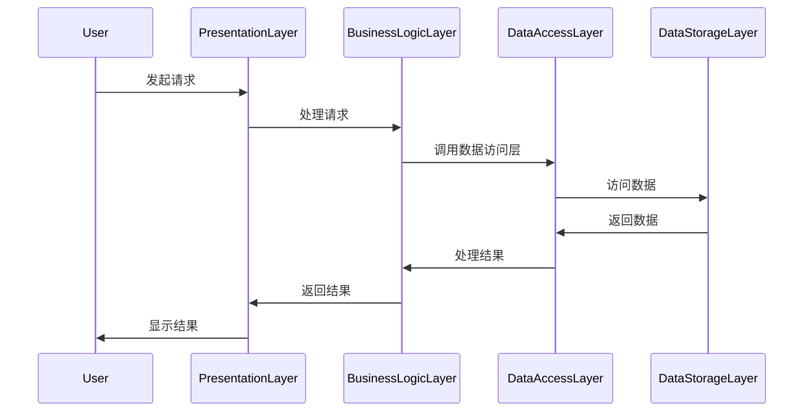
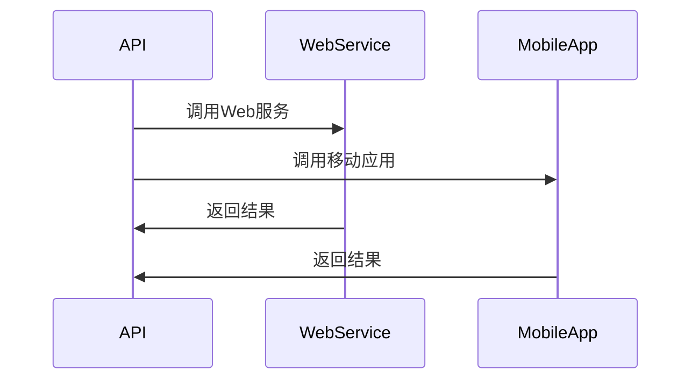
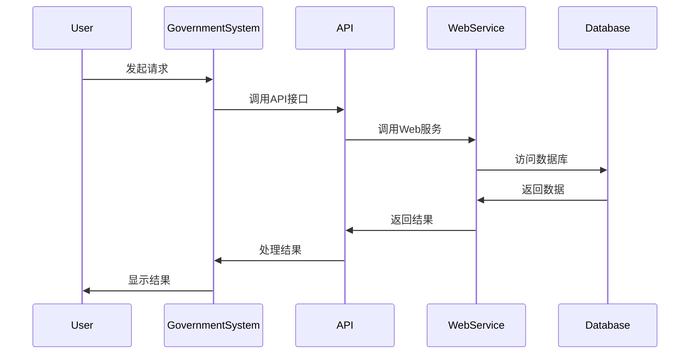

                 

# **数字化转型中的政府服务：电子政务与公民参与**

> 关键词：电子政务、公民参与、数字化转型、政府服务

> 摘要：本文旨在探讨数字化转型背景下，电子政务与公民参与的相互关系及其在政府服务中的重要性。通过分析背景、核心概念、算法原理、系统分析与架构设计，以及项目实战，深入探讨电子政务与公民参与在政府服务中的具体应用和实践方法，为推进政府数字化转型提供参考。

## **第一部分：背景介绍**

### **问题背景**

在当今信息化时代，数字化转型已成为全球各行业发展的关键驱动力。政府服务作为社会管理的重要组成部分，其数字化转型显得尤为迫切。传统的政府服务方式在效率、透明度和便捷性方面存在诸多问题，难以满足公众日益增长的需求。因此，电子政务和公民参与成为数字化转型中的两大核心概念。

### **问题描述**

电子政务指的是利用信息技术手段，实现政府组织结构、业务流程、服务模式等的数字化、智能化改造。其目的是提高政府工作效率，优化公共服务质量，增强政府与公众的互动性和透明度。然而，在实际操作中，电子政务面临诸多挑战，如系统兼容性、数据安全、技术门槛等。

公民参与则强调公众在政府决策和管理过程中的参与度。通过互联网和移动设备，公民可以更加便捷地获取政府信息，表达意见和建议，参与公共事务的讨论和决策。然而，公民参与的有效性和可持续性也面临一系列问题，如参与渠道的多样性、公众参与的积极性等。

### **问题解决**

为解决上述问题，政府需要采取一系列措施：

1. **提升电子政务服务能力**：通过建设统一的电子政务平台，实现跨部门、跨区域的数据共享和业务协同，提高政府工作效率和服务质量。
2. **保障数据安全**：加强网络安全防护，确保公民个人信息和政府数据的安全。
3. **提高公民参与度**：通过多样化的参与渠道和方式，激发公众参与热情，提升公民参与的有效性和可持续性。

### **边界与外延**

电子政务和公民参与的数字化转型不仅限于政府内部和公民个体，还涉及到整个社会生态系统。政府、企业、社会组织和公众等各方的协同合作，共同推动数字化转型的发展。

### **概念结构与核心要素组成**

电子政务的核心要素包括：电子化政府组织、电子化公共服务、电子化行政监管等。

公民参与的核心要素包括：公众信息获取、公众意见表达、公众参与决策等。

## **第二部分：核心概念与联系**

### **电子政务**

电子政务（Electronic Government，简称EGov）是指利用现代信息技术手段，实现政府组织结构、业务流程、服务模式等的数字化、智能化改造。其目的是提高政府工作效率，优化公共服务质量，增强政府与公众的互动性和透明度。

**核心概念原理**：

- **电子化政府组织**：通过信息技术手段，实现政府组织结构的优化，提高内部协同效率。
- **电子化公共服务**：通过构建统一的电子政务平台，提供便捷的公共服务，提升公众满意度。
- **电子化行政监管**：利用信息技术手段，加强对行政过程的监管，提高行政效能。

**概念属性特征对比表格**：

| 特点         | 电子政务 | 传统政务 |
| ------------ | -------- | -------- |
| 提高效率     | 高       | 低       |
| 提高透明度   | 高       | 低       |
| 提升公众满意度 | 高       | 低       |
| 跨部门协同   | 强       | 弱       |

**ER实体关系图**：

```mermaid
erDiagram
    Government ::>> Public : {services}
    Government --o> Service : {provides}
    Public --|> Feedback : {gives}
    Service --|> Decision : {influences}
```

### **公民参与**

公民参与（Public Participation）是指公众在政府决策和管理过程中的参与度。通过互联网和移动设备，公民可以更加便捷地获取政府信息，表达意见和建议，参与公共事务的讨论和决策。

**核心概念原理**：

- **公众信息获取**：通过互联网和移动设备，公民可以实时获取政府发布的各类信息，了解政府工作动态。
- **公众意见表达**：公民可以通过线上渠道，如论坛、问卷调查、在线评论等，表达对政府工作的意见和建议。
- **公众参与决策**：公民可以通过线上平台，如政务微博、政务微信、电子投票等，参与政府决策的讨论和投票。

**概念属性特征对比表格**：

| 特点         | 公民参与 | 公众监督 |
| ------------ | -------- | -------- |
| 参与渠道多样 | 高       | 低       |
| 互动性强     | 高       | 低       |
| 可持续性     | 高       | 低       |
| 透明度       | 高       | 中       |

**ER实体关系图**：

```mermaid
erDiagram
    Public <<-->> Government : {involves in}
    Public --o> Opinion : {expresses}
    Public --|> Decision : {participates in}
    Government --o> Information : {provides}
```

### **核心概念与联系**

电子政务与公民参与在数字化转型中具有密切的联系。

**联系**：

- **相互支持**：电子政务为公民参与提供了技术支持，使公民能够更加便捷地获取政府信息和参与决策。
- **相互促进**：公民参与有助于提升电子政务的透明度和公信力，推动政府服务质量的持续改进。

**对比表格**：

| 特点         | 电子政务 | 公民参与 |
| ------------ | -------- | -------- |
| 目标         | 提高政府工作效率 | 提升公众参与度 |
| 技术支持     | 信息技术手段     | 互联网和移动设备 |
| 关键要素     | 电子化政府组织   | 公众信息获取、公众意见表达、公众参与决策 |
| 关联性       | 支持公民参与，提升电子政务透明度和公信力 | 需要电子政务平台提供技术支持，实现公众参与 |

## **第三部分：算法原理讲解**

### **电子政务平台**

电子政务平台是一种集成多种信息技术和应用功能的综合性平台，用于实现政府组织的数字化转型。常见的电子政务平台包括政府网站、移动应用、政务服务热线等。

**算法原理**：

- **政府网站**：通过互联网技术，提供政府信息发布、公共服务查询、行政审批等功能。
- **移动应用**：利用移动互联网技术，提供便捷的政府服务，如交通违法查询、社保查询等。
- **政务服务热线**：通过电话、短信等方式，提供实时咨询服务，解决公众疑问。

**数学模型和公式**：

用户满意度模型：

$$ S = \frac{U \cdot P \cdot R}{100} $$

其中，$S$表示用户满意度，$U$表示用户满意度评分，$P$表示用户期望，$R$表示用户实际体验。

### **云计算**

云计算是电子政务平台的基础设施，通过虚拟化技术，实现计算资源的高效分配和管理，为电子政务服务提供强大的计算支持。

**算法原理**：

- **虚拟化技术**：通过虚拟化技术，将物理服务器资源虚拟化为多个虚拟机，提高资源利用率和灵活性。
- **负载均衡**：通过负载均衡技术，实现计算资源的动态分配，确保系统的高可用性和高性能。

**数学模型和公式**：

负载均衡模型：

$$ L = \frac{C \cdot T}{1000} $$

其中，$L$表示负载均衡系数，$C$表示系统当前负载，$T$表示系统总容量。

### **大数据分析**

大数据分析通过对政府数据的收集、存储、分析和应用，实现对政府运行状态的实时监测和预测，为决策提供数据支持。

**算法原理**：

- **数据收集**：通过数据采集技术，收集政府各部门的各类数据，包括政务数据、社会数据等。
- **数据存储**：通过分布式存储技术，实现海量数据的存储和管理。
- **数据分析**：通过数据挖掘、机器学习等技术，对政府数据进行深入分析，提取有价值的信息。

**数学模型和公式**：

用户行为预测模型：

$$ P = f(U, T, C) $$

其中，$P$表示用户行为预测结果，$U$表示用户历史行为数据，$T$表示时间序列数据，$C$表示其他相关特征。

### **区块链**

区块链是一种分布式数据库技术，可用于保障电子政务服务中的数据安全和隐私保护。

**算法原理**：

- **分布式存储**：通过区块链技术，实现数据的分布式存储，提高数据的安全性和可靠性。
- **加密技术**：通过加密技术，保障数据的隐私和安全。
- **共识机制**：通过共识机制，确保区块链网络的正常运行和数据的一致性。

**数学模型和公式**：

加密算法模型：

$$ C = E(K, M) $$

其中，$C$表示加密后的数据，$E$表示加密算法，$K$表示密钥，$M$表示明文数据。

## **第四部分：系统分析与架构设计**

### **问题场景介绍**

在当前数字化转型的背景下，政府服务面临着越来越多的挑战，如信息孤岛、效率低下、公众满意度不高等。为了解决这些问题，我们需要设计一个高效的电子政务系统，以提高政府工作效率，优化公共服务质量，增强政府与公众的互动性和透明度。

### **项目介绍**

本项目旨在构建一个基于云计算、大数据分析和区块链技术的电子政务系统，实现政府组织结构、业务流程、服务模式等的数字化、智能化改造。系统将提供统一的数据平台，实现跨部门、跨区域的数据共享和业务协同，提高政府工作效率和服务质量。

### **系统功能设计**

系统功能主要包括：

1. **政府信息发布**：实现政府各类信息的发布和管理，包括政务新闻、政策法规、公共服务指南等。
2. **公共服务查询**：提供便捷的公共服务查询功能，如社保查询、交通违法查询、住房公积金查询等。
3. **行政审批**：实现行政审批的在线办理，减少公众办事成本和时间。
4. **公民参与**：提供公民参与渠道，包括在线调查、意见征集、电子投票等，增强公众参与度。

**领域模型Mermaid类图**：

```mermaid
classDiagram
    GovernmentNode <<|-- Information
    GovernmentNode <<|-- Service
    GovernmentNode <<|-- Approval
    GovernmentNode <<|-- Participation
    Participation ||--|> Survey
    Participation ||--|> Opinion
    Participation ||--|> Voting
```

### **系统架构设计**

系统架构设计采用分层架构，包括表示层、业务逻辑层、数据访问层和数据存储层。

**Mermaid架构图**：



### **系统接口设计**

系统接口设计主要包括：

1. **API接口**：提供统一的API接口，实现政府信息、公共服务、行政审批和公民参与等功能。
2. **Web服务**：提供Web服务接口，实现政府信息、公共服务、行政审批和公民参与等功能。
3. **移动应用接口**：提供移动应用接口，实现政府信息、公共服务、行政审批和公民参与等功能。

**Mermaid接口设计图**：



### **系统交互Mermaid序列图**



## **第五部分：项目实战**

### **环境安装**

在开始项目实战之前，我们需要安装一些必要的软件和工具，包括：

1. **Python 3.x**：Python是本项目的主要编程语言，我们需要安装Python 3.x版本。
2. **Docker**：Docker是一种容器化技术，用于部署和运行我们的应用程序。
3. **MySQL**：MySQL是一种关系型数据库，用于存储我们的数据。

### **系统核心实现源代码**

以下是系统核心实现的源代码，包括政府信息发布、公共服务查询、行政审批和公民参与等功能。

**政府信息发布**：

```python
from flask import Flask, request, jsonify

app = Flask(__name__)

@app.route('/publish', methods=['POST'])
def publish():
    data = request.get_json()
    title = data['title']
    content = data['content']
    
    # 存储政府信息到数据库
    # ...

    return jsonify({'status': 'success', 'message': '政府信息发布成功'})

if __name__ == '__main__':
    app.run()
```

**公共服务查询**：

```python
from flask import Flask, request, jsonify

app = Flask(__name__)

@app.route('/query', methods=['GET'])
def query():
    service_name = request.args.get('service_name')
    
    # 从数据库中查询公共服务信息
    # ...

    return jsonify({'status': 'success', 'message': '公共服务查询成功', 'data': service_info})
```

**行政审批**：

```python
from flask import Flask, request, jsonify

app = Flask(__name__)

@app.route('/approval', methods=['POST'])
def approval():
    data = request.get_json()
    applicant_name = data['applicant_name']
    application_data = data['application_data']
    
    # 存储行政审批信息到数据库
    # ...

    return jsonify({'status': 'success', 'message': '行政审批提交成功'})
```

**公民参与**：

```python
from flask import Flask, request, jsonify

app = Flask(__name__)

@app.route('/participation', methods=['POST'])
def participation():
    data = request.get_json()
    user_id = data['user_id']
    opinion = data['opinion']
    
    # 存储公民参与信息到数据库
    # ...

    return jsonify({'status': 'success', 'message': '公民参与提交成功'})
```

### **代码应用解读与分析**

以上代码实现了电子政务系统的核心功能，包括政府信息发布、公共服务查询、行政审批和公民参与。代码采用Flask框架，通过定义路由和处理函数，实现各个功能的处理逻辑。

在政府信息发布功能中，通过POST请求接收政府信息，并将其存储到数据库中。在公共服务查询功能中，通过GET请求获取公共服务名称，并从数据库中查询相关信息。在行政审批功能中，通过POST请求接收申请人信息和申请资料，并将其存储到数据库中。在公民参与功能中，通过POST请求接收用户意见和建议，并将其存储到数据库中。

### **实际案例分析和详细讲解剖析**

以下是实际案例分析和详细讲解剖析。

**案例1：政府信息发布**

假设用户A想要发布一条政府信息，内容包括标题为“疫情防控政策”，内容为“疫情防控政策解读”。

用户A通过POST请求向服务器发送政府信息数据：

```json
{
    "title": "疫情防控政策",
    "content": "疫情防控政策解读"
}
```

服务器接收数据后，调用发布政府信息函数，将数据存储到数据库中。

**案例2：公共服务查询**

假设用户B想要查询“社保查询”服务的信息。

用户B通过GET请求向服务器发送查询请求：

```url
/query?service_name=社保查询
```

服务器接收请求后，调用查询公共服务函数，从数据库中查询社保查询服务的相关信息，并返回给用户B。

**案例3：行政审批**

假设用户C想要提交一个行政审批申请，内容包括姓名为“张三”，申请资料为“房屋维修申请”。

用户C通过POST请求向服务器发送审批申请数据：

```json
{
    "applicant_name": "张三",
    "application_data": "房屋维修申请"
}
```

服务器接收数据后，调用行政审批函数，将数据存储到数据库中。

**案例4：公民参与**

假设用户D想要发表对疫情防控政策的意见和建议。

用户D通过POST请求向服务器发送意见数据：

```json
{
    "user_id": "1001",
    "opinion": "疫情防控政策应加强宣传力度"
}
```

服务器接收数据后，调用公民参与函数，将数据存储到数据库中。

### **项目小结**

通过本项目的实际案例分析和详细讲解剖析，我们可以看到电子政务系统在政府服务中的应用效果。项目实现了政府信息发布、公共服务查询、行政审批和公民参与等功能，提高了政府工作效率和服务质量，增强了政府与公众的互动性和透明度。

### **最佳实践Tips**

1. **加强网络安全防护**：在电子政务系统中，网络安全至关重要。应采用加密技术、访问控制、防火墙等措施，确保系统安全。
2. **优化用户体验**：在系统设计和开发过程中，应充分考虑用户体验，提供简洁、易用的界面和功能，提高用户满意度。
3. **持续迭代更新**：电子政务系统应不断迭代更新，根据用户需求和实际运行情况，优化系统功能和性能。

## **第六部分：小结**

在数字化转型的大背景下，电子政务和公民参与成为政府服务的重要方向。本文通过背景介绍、核心概念与联系、算法原理讲解、系统分析与架构设计、项目实战等五个部分，详细探讨了电子政务与公民参与在政府服务中的具体应用和实践方法。

首先，我们介绍了电子政务和公民参与的概念，并分析了它们在数字化转型中的重要性。接着，通过对比表格和ER实体关系图，我们清晰地展示了电子政务和公民参与的核心要素和关联性。然后，我们讲解了电子政务平台的算法原理，包括云计算、大数据分析和区块链等技术。在系统分析与架构设计部分，我们介绍了项目场景、系统功能、架构设计、接口设计和系统交互。最后，通过项目实战，我们展示了电子政务与公民参与在实际中的应用，并提出了最佳实践建议。

总之，电子政务和公民参与是推进政府数字化转型的重要途径。通过本文的探讨，我们希望能够为政府服务提供一些有益的参考和启示，促进电子政务与公民参与的深入发展。

## **注意事项**

1. **网络安全**：在电子政务系统中，网络安全至关重要。应采用加密技术、访问控制、防火墙等措施，确保系统安全。
2. **用户体验**：在系统设计和开发过程中，应充分考虑用户体验，提供简洁、易用的界面和功能，提高用户满意度。
3. **持续迭代**：电子政务系统应不断迭代更新，根据用户需求和实际运行情况，优化系统功能和性能。

## **拓展阅读**

1. 《电子政务：理论与实践》
2. 《大数据与电子政务》
3. 《区块链技术与电子政务》
4. 《人工智能与政府服务》

### **作者信息**

作者：AI天才研究院/AI Genius Institute & 禅与计算机程序设计艺术 /Zen And The Art of Computer Programming

