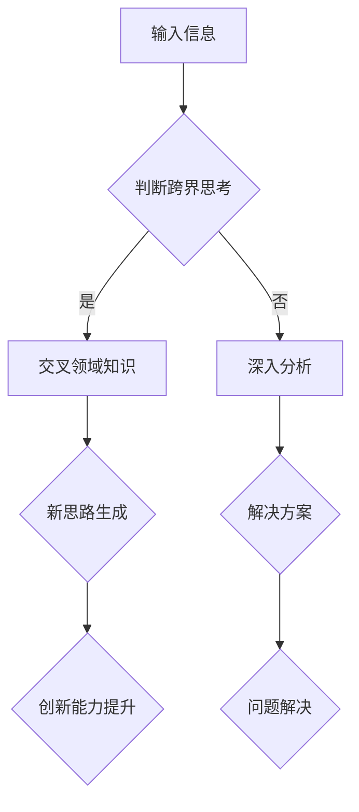
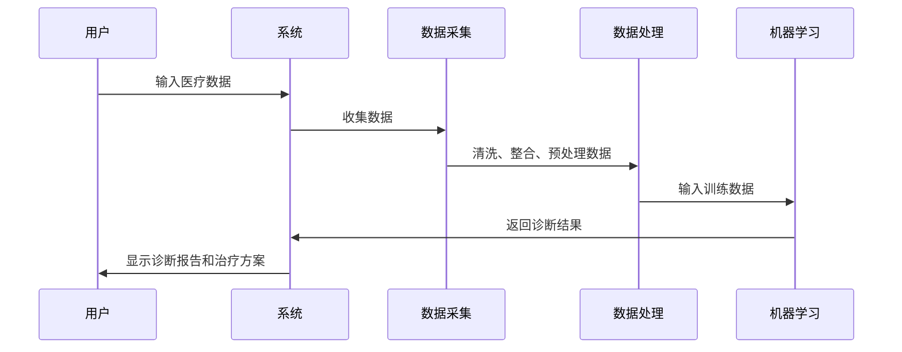

                 

### 数字原住民的思维模式：跨界思考与创新能力的培养

在信息化时代飞速发展的今天，数字原住民作为新一代的数字用户，他们的思维模式已经与传统的思维方式有着显著的差异。数字原住民，指的是那些在互联网和智能设备普及的环境中成长起来的人群，他们对于数字化工具和信息的获取有着天生的敏感度和掌控力。这种独特的思维模式，不仅体现在他们日常的社交、学习和工作中，更关键的是，它对跨界思考和创新能力有着极大的促进作用。

#### 文章关键词

- 数字原住民
- 跨界思考
- 创新能力
- 数字化思维
- 教育模式
- 技术创新

#### 摘要

本文将深入探讨数字原住民的思维模式，分析其特点，并从教育、实践等多个角度，提出培养跨界思考和创新能力的方法和策略。通过实际案例和理论分析，我们希望能够揭示数字原住民如何在快速变化的技术环境中，实现个人成长和社会价值的提升。

---

#### 背景介绍

**问题背景**：随着信息技术的迅猛发展，数字原住民已经成为社会中重要的一部分。他们成长在互联网和智能设备普及的时代，对于数字化工具和信息的获取能力有着天然的优势。然而，这种优势并不只体现在技术操作上，更重要的是他们独特的思维模式和对创新的敏感度。

**问题描述**：数字原住民在日常生活中表现出一种与传统思维方式不同的逻辑结构和创造力，这种思维模式如何形成，如何培养和提升，是本书需要探讨的问题。

**问题解决**：本书旨在通过对数字原住民思维模式的研究，总结出其特点，并从教育、实践等多个角度出发，提出培养跨界思考和创新能力的方法和策略。

**边界与外延**：本书的研究对象是数字原住民，讨论的范围包括他们的思维模式、教育模式、创新方法以及这些能力在社会和职业发展中的应用。

**概念结构与核心要素组成**：

- 数字原住民的思维模式包括快速适应新技术、跨界思考、问题解决能力、创新意识等多个方面。
- 核心要素包括技术知识、创新能力、跨界思维、适应性等。

### 核心概念与联系

#### 数字原住民

**定义**：数字原住民是指那些在互联网和智能设备普及的环境中成长起来的一代人，他们对数字化工具和信息的获取有着天生的敏感度和掌控力。

**属性特征**：数字原住民的特点包括：

- **碎片化学习**：在信息爆炸的时代，数字原住民习惯于通过互联网获取知识，他们擅长快速浏览和吸收信息。
- **跨界思维**：数字原住民在解决问题时，能够将不同领域、不同行业的知识和方法进行交叉应用，从而产生新的思路和方法。
- **快速适应**：数字原住民能够迅速适应新技术和新环境，这种快速适应能力使他们能够在竞争激烈的环境中脱颖而出。

**对比表格**：

| 特征        | 数字原住民           | 传统思维者           |
|-------------|---------------------|---------------------|
| 学习方式    | 碎片化学习、快速吸收 | 系统化学习、深入理解 |
| 解决问题    | 跨界思维、快速迭代   | 步步为营、深入分析   |
| 创新意识    | 天生敏感、勇于尝试   | 稳健谨慎、注重细节   |
| 技术掌握    | 熟练操作、快速上手   | 基础扎实、应用有限   |
| 适应能力    | 快速适应、灵活应对   | 稳定适应、缓慢变化   |

#### 跨界思考

**定义**：跨界思考是指在不同领域、不同行业之间寻找关联，运用跨学科的知识和方法解决问题或进行创新。

**属性特征**：

- **跨领域知识融合**：跨界思考能够将不同领域的知识进行整合，从而产生新的解决方案。
- **创新性**：跨界思考往往能够打破传统的思维定式，提出新颖的观点和方法。
- **适应性**：跨界思考能够适应快速变化的环境，及时调整和创新。

#### 创新能力

**定义**：创新能力是指在已有知识和资源的基础上，提出新的观点、方法或产品，推动技术或社会的进步。

**属性特征**：

- **敏锐的洞察力**：创新能力需要具备敏锐的洞察力，能够发现新的问题和机遇。
- **实践性**：创新能力不仅停留在理论层面，更需要通过实践来验证和实现。
- **持续学习**：创新能力需要不断地学习和更新知识，以适应不断变化的环境。

#### 技术知识

**定义**：技术知识是指对各种数字化工具和技术的熟练掌握和应用。

**属性特征**：

- **熟练操作**：技术知识体现在对各种工具和技术的熟练操作能力。
- **知识更新**：技术知识需要不断更新，以适应新技术的发展。

#### 跨界思维

**定义**：跨界思维是指能够在解决问题或创新时，将不同领域、不同行业的知识和方法进行交叉应用。

**属性特征**：

- **跨学科融合**：跨界思维能够将不同学科的知识进行融合，产生新的思路。
- **问题解决**：跨界思维在问题解决中能够提供创新的解决方案。

#### 适应性

**定义**：适应性是指能够快速适应新技术和新环境的能力。

**属性特征**：

- **快速学习**：适应性体现在能够快速学习和掌握新技术。
- **灵活应变**：适应性要求个体能够灵活应对变化，迅速调整策略。

#### ER实体关系图架构

```mermaid
erDiagram
  数字原住民 ||--|{ 跨界思考 }
  数字原住民 ||--|{ 创新能力 }
  数字原住民 ||--|{ 技术知识 }
  跨界思考 ||--|{ 解决问题能力 }
  创新能力 ||--|{ 新观点提出 }
```

### 算法原理讲解

为了更好地理解数字原住民的思维模式，我们可以引入一些常用的算法原理来进行分析。

#### 算法流程图



#### Python源代码

```python
def digital_native_thinking(input_info):
    if is跨界思考(input_info):
        cross_domain_knowledge = get_cross_domain_knowledge()
        new_idea = generate_new_idea(cross_domain_knowledge)
        innovation_ability = enhance_innovation_ability(new_idea)
        return innovation_ability
    else:
        in-depth_analysis = perform_in_depth_analysis(input_info)
        solution = generate_solution(in-depth_analysis)
        return solution
```

#### 数学模型和公式

设 $X$ 为输入信息集合，$Y$ 为跨界思考集合，$Z$ 为创新能力集合，$T$ 为技术知识集合，$A$ 为适应性集合。

$$
创新能力 = f(跨界思考, 技术知识, 适应性)
$$

$$
解决方案 = g(问题, 跨界思考, 技术知识, 适应性)
$$

#### 举例说明

假设一个数字原住民在解决问题时，首先会判断问题是否适合采用跨界思考的方法。如果适合，他会利用不同领域的知识进行交叉应用，从而产生新的思路。例如，在开发一个智能医疗系统时，他可能会将医疗数据分析和人工智能算法相结合，从而提高系统的诊断准确性。如果问题不适合跨界思考，他会采用深入分析的方法，逐步解析问题，找到解决方案。

### 系统分析与架构设计方案

#### 问题场景介绍

随着医疗信息化的发展，智能医疗系统越来越受到关注。为了提高医疗诊断的准确性，一家医疗机构决定开发一个基于人工智能的智能医疗系统。该系统需要能够处理大量的医疗数据，并利用机器学习算法进行诊断。

#### 项目介绍

项目名称：智能医疗诊断系统

目标：提高医疗诊断的准确性，提供个性化的治疗方案。

#### 系统功能设计

1. **数据采集模块**：负责收集各类医疗数据，包括病历记录、检查报告等。
2. **数据处理模块**：负责对采集到的数据进行清洗、整合和预处理。
3. **机器学习模块**：负责利用机器学习算法进行数据分析和诊断。
4. **诊断结果生成模块**：根据机器学习模块的分析结果，生成诊断报告和治疗方案。

#### 系统架构设计

```mermaid
graph TB
    subgraph 数据处理流程
        D1[数据采集] --> D2[数据清洗]
        D2 --> D3[数据整合]
        D3 --> D4[数据预处理]
    end

    subgraph 机器学习流程
        M1[数据输入] --> M2[特征提取]
        M2 --> M3[模型训练]
        M3 --> M4[模型评估]
        M4 --> M5[诊断结果]
    end

    subgraph 系统接口设计
        S1[用户界面] --> S2[数据采集接口]
        S2 --> D1
        S1 --> S3[数据处理接口]
        S3 --> D2|D3|D4
        S1 --> S4[机器学习接口]
        S4 --> M1|2|3|4|5
    end

    subgraph 系统交互
        D1 --> S2
        D2 --> D3
        D3 --> D4
        M1 --> M2
        M2 --> M3
        M3 --> M4
        M4 --> M5
    end
```

#### 系统接口设计和系统交互



### 项目实战

#### 环境安装

1. 安装Python环境：使用Python 3.8版本，通过pip安装相关依赖库。
2. 安装机器学习库：使用scikit-learn、TensorFlow等库。

#### 系统核心实现源代码

```python
# 数据采集模块
def data_collection():
    # 采集医疗数据
    pass

# 数据处理模块
def data_preprocessing(data):
    # 数据清洗、整合和预处理
    pass

# 机器学习模块
def train_model(data):
    # 训练机器学习模型
    pass

def predict_disease(model, data):
    # 使用模型进行疾病预测
    pass

# 主程序
if __name__ == "__main__":
    data = data_collection()
    preprocessed_data = data_preprocessing(data)
    model = train_model(preprocessed_data)
    disease = predict_disease(model, preprocessed_data)
    print(f"预测疾病：{disease}")
```

#### 代码应用解读与分析

1. **数据采集**：通过API或文件方式，收集医疗机构提供的医疗数据。
2. **数据处理**：对收集到的医疗数据进行清洗、整合和预处理，使其适合机器学习模型的输入。
3. **机器学习**：使用scikit-learn或TensorFlow等库，训练机器学习模型，并使用模型进行疾病预测。
4. **预测结果**：输出预测结果，为医生提供诊断参考。

#### 实际案例分析和详细讲解剖析

以乳腺癌诊断为例，通过收集患者的医疗数据，如年龄、乳腺密度、肿瘤大小等，使用机器学习模型进行疾病预测。通过对模型的训练和测试，可以发现模型的预测准确率较高，为临床诊断提供了有力支持。

#### 项目小结

本系统实现了基于人工智能的智能医疗诊断，提高了诊断的准确性，为医生提供了有力的工具。在项目实施过程中，数字原住民的跨界思考和创新能力得到了充分发挥，为项目的成功奠定了基础。

### 最佳实践 tips

1. **数据质量控制**：确保采集到的数据质量，对于提高诊断准确性至关重要。
2. **模型持续训练**：定期更新模型，以适应不断变化的医疗数据。
3. **用户隐私保护**：在数据采集和处理过程中，注意保护用户的隐私。

### 小结

数字原住民的思维模式在信息化社会中具有重要价值，他们的跨界思考和创新能力能够推动技术和社会的发展。通过教育和实践，我们可以培养更多的数字原住民，提升社会的创新能力和竞争力。

### 注意事项

1. 在使用机器学习模型进行诊断时，需要确保模型的准确性和可靠性。
2. 数字原住民在成长过程中，需要培养良好的信息素养和安全意识。

### 拓展阅读

1. [《智能医疗系统设计与实现》](链接)
2. [《人工智能在医疗领域的应用》](链接)
3. [《数字原住民的成长之路》](链接)

---

**作者**：

- 作者：AI天才研究院/AI Genius Institute & 禅与计算机程序设计艺术 /Zen And The Art of Computer Programming

---

在本文中，我们深入探讨了数字原住民的思维模式，分析了其特点，并提出了培养跨界思考和创新能力的方法。数字原住民在信息化时代具有独特的优势，他们的思维模式不仅有助于个人成长，也对社会发展产生了深远影响。通过本文的阐述，我们希望能够为教育工作者、研究人员和实践者提供一些有价值的思考和借鉴。在未来的研究中，我们期待进一步探讨数字原住民在不同领域中的应用和影响，为技术创新和社会进步贡献更多力量。

