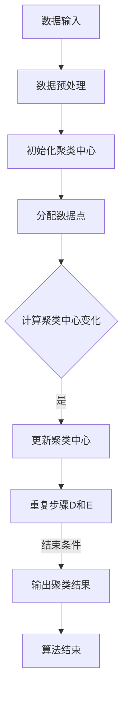

                 

## 1. 数字孪生在智慧城市交通优化中的应用背景

### 数字孪生概述

数字孪生（Digital Twin）是一种通过物理实体和虚拟模型之间的紧密耦合，实时模拟、监控和优化实际系统的技术。它起源于制造业，但随着互联网、物联网和人工智能技术的快速发展，数字孪生的应用范围逐渐扩展到各个领域，特别是在智慧城市交通优化中具有重要意义。

数字孪生技术的基本原理是将一个物理实体（如建筑物、交通工具、城市基础设施等）的所有特征和属性通过传感器、监测设备等手段实时采集，转化为数字信号，并在虚拟环境中构建一个与物理实体相对应的数字模型。这个数字模型可以实时反映物理实体的状态变化，并且能够通过模拟、分析和优化来预测和指导物理实体的操作。

### 智慧城市交通优化的需求与挑战

智慧城市交通优化旨在通过集成、分析和利用交通数据，提高交通系统的运行效率和安全性，减少拥堵和环境污染。然而，随着城市交通系统的日益复杂，智慧城市交通优化面临着以下几大挑战：

1. **海量数据管理：** 城市交通系统产生的数据量巨大且复杂，如何高效地采集、存储、处理和分析这些数据是关键挑战。
2. **实时性与可靠性：** 智慧城市交通系统要求实时处理和响应交通事件，任何延迟或错误都可能导致严重的交通问题。
3. **算法复杂性：** 交通优化问题往往涉及到多目标优化、动态规划和智能算法，如何选择合适的算法并实现高效优化是重大难题。
4. **系统集成与兼容性：** 需要整合多种传感器、监测设备和信息系统，保证系统之间的数据互通和功能兼容。

### 数字孪生在智慧城市交通优化中的应用前景

数字孪生技术为智慧城市交通优化提供了有力的技术支撑，具有以下几方面的应用前景：

1. **交通流量预测：** 通过数字孪生模型，可以实时预测交通流量变化，提前预警和调整交通信号，缓解拥堵问题。
2. **公共交通调度优化：** 利用数字孪生模型，优化公共交通线路和班次安排，提高公共交通的运行效率和乘客满意度。
3. **交通基础设施维护：** 通过对交通设施的数字孪生模型进行仿真和分析，预测设施的磨损和故障风险，实现预防性维护。
4. **交通事件应急响应：** 在发生交通事故或其他紧急情况时，数字孪生模型可以实时分析事件影响，为应急响应提供科学依据。

综上所述，数字孪生技术在智慧城市交通优化中具有广阔的应用前景，通过构建物理实体与数字模型的紧密联系，可以有效提升城市交通系统的运行效率和安全性。

### 问题描述

当前，智慧城市交通系统面临着一系列复杂的挑战。首先，交通流量管理是一个亟待解决的问题。城市中的车辆数量持续增长，交通流量呈现出高度动态和复杂的变化模式，使得传统的交通信号控制和调度方法难以适应。其次，公共交通的运行效率也面临着挑战。尽管公共交通工具能够有效减少交通拥堵，但其路线设计和班次安排通常基于静态的数据，无法及时响应实际需求，导致高峰期车厢拥挤，而低谷期则车辆闲置。

此外，交通基础设施的维护和管理也是一个重要的问题。随着交通设施的年限增加，磨损和故障风险逐渐上升。然而，现有的维护系统往往缺乏对设施状态的实时监测和预测，导致在设施故障发生前无法进行有效的预防性维护。最后，应急响应能力也亟需提升。在城市中发生交通事故或自然灾害等突发事件时，如何快速、有效地进行交通调度和应急处理，以减少对交通系统的冲击，是当前交通管理系统的一大难题。

这些问题共同构成了智慧城市交通优化的核心挑战。数字孪生技术的引入，可以为这些挑战提供有效的解决方案。通过数字孪生模型，可以实现交通流量的实时监测和预测，优化公共交通的调度策略，提升交通基础设施的维护和管理水平，增强应急响应能力。因此，探讨数字孪生技术在智慧城市交通优化中的应用，具有重要的现实意义和理论价值。

### 问题解决

数字孪生技术在智慧城市交通优化中的应用，提供了系统性的解决方案，涵盖了从理论框架到技术实现的多个层面。

#### 数字孪生技术在交通优化中的应用框架

数字孪生技术在交通优化中的应用框架主要包括以下几个核心组成部分：

1. **数据采集与传感器网络：** 通过部署各种传感器和监测设备，实时采集交通系统的数据，如交通流量、速度、车辆密度等。
2. **数据融合与处理：** 将来自不同来源的数据进行融合和处理，以消除噪声、异常值和冗余数据，确保数据的质量和一致性。
3. **数字孪生模型构建：** 根据采集到的数据，构建交通系统的数字孪生模型，该模型能够实时反映交通系统的状态和变化。
4. **模拟与优化：** 利用数字孪生模型进行模拟，测试不同的交通调度和优化策略，并评估其效果。
5. **决策支持与控制：** 基于模拟结果，提供决策支持，对交通系统进行实时调整和控制，以实现优化目标。

#### 数字孪生技术在交通优化中的关键技术

在交通优化中，数字孪生技术涉及到多个关键技术，包括：

1. **数据采集与处理：** 利用物联网技术，部署高密度传感器网络，实现交通流量的实时监测和数据采集。通过大数据技术和人工智能算法，对采集到的数据进行处理和分析。
2. **数字孪生模型构建：** 采用多尺度、多层次的建模方法，构建精确的数字孪生模型。利用深度学习和强化学习等算法，提高模型的预测和优化能力。
3. **模拟与仿真：** 运用仿真软件，模拟交通系统的动态变化，评估不同策略的效果。通过并行计算和云计算，提高仿真效率。
4. **智能控制与优化：** 结合控制理论和优化算法，设计智能控制系统，实现交通流量的动态调整和优化。

#### 数字孪生技术在交通优化中的实现策略

数字孪生技术在交通优化中的实现策略可以概括为以下几个步骤：

1. **需求分析与规划：** 分析交通系统的现状和需求，确定数字孪生技术的目标和应用范围。
2. **系统设计与开发：** 设计数字孪生系统的架构和功能模块，开发数字孪生模型和相关算法。
3. **系统部署与集成：** 将数字孪生系统部署到实际交通系统中，与现有系统进行集成，实现数据共享和功能协同。
4. **运行与维护：** 对数字孪生系统进行持续运行和维护，确保其稳定性和可靠性。
5. **效果评估与优化：** 定期评估数字孪生技术在交通优化中的应用效果，根据反馈进行优化和改进。

通过上述框架、关键技术和实现策略，数字孪生技术为智慧城市交通优化提供了全面、系统的解决方案，有助于提升交通系统的运行效率和安全性。

### 边界与外延

#### 数字孪生技术在交通优化中的应用边界

数字孪生技术在交通优化中的应用边界主要受限于数据采集、处理能力和模型精度。首先，交通数据的实时性和准确性直接影响到数字孪生模型的构建和运行效果。其次，现有的传感器技术和数据处理能力可能无法完全覆盖交通系统的所有方面，导致数据缺失或延迟。此外，模型复杂度和计算资源也是限制因素，特别是对于大规模城市交通系统，构建和运行高精度的数字孪生模型需要大量的计算资源和时间。

#### 数字孪生技术在交通优化中的应用外延

尽管存在边界，数字孪生技术在交通优化中的应用前景仍然非常广阔。首先，随着物联网和传感器技术的发展，交通数据的实时采集和处理能力将得到显著提升。其次，人工智能和机器学习算法的不断进步，将提高数字孪生模型的预测和优化能力。此外，云计算和边缘计算技术的融合，为数字孪生系统的部署和运行提供了更加灵活和高效的解决方案。

#### 数字孪生技术在交通优化中的发展趋势

未来，数字孪生技术在交通优化中将继续向以下几个方向发展：

1. **多领域融合：** 数字孪生技术将与其他领域如智慧城市建设、智能交通管理、智能交通设施等深度融合，形成综合性的智慧交通解决方案。
2. **高精度建模：** 通过引入更先进的数据采集和处理技术，以及高精度的物理仿真模型，数字孪生技术将能够更准确地模拟和预测交通系统行为。
3. **自主决策与控制：** 数字孪生系统将逐步实现自主决策与控制，通过智能算法和自主优化，实现更高效、更智能的交通管理。
4. **开放共享与标准化：** 数字孪生技术将推动交通数据和应用接口的开放共享，促进行业标准化，提高数字孪生技术的通用性和互操作性。

### 概念结构与核心要素组成

#### 数字孪生技术的概念结构

数字孪生技术的概念结构主要包括以下三个核心组成部分：

1. **物理实体：** 这是数字孪生技术的起点，可以是任何具有物理形态的物体或系统，如建筑物、交通工具、交通设施等。
2. **数字模型：** 这是物理实体的虚拟映射，通过传感器和数据采集技术，将物理实体的各种特征和属性转化为数字形式。
3. **实时交互与反馈：** 这是数字孪生技术的核心机制，通过实时数据交互和反馈，实现物理实体与数字模型之间的动态耦合。

#### 数字孪生技术在交通优化中的核心要素

在交通优化中，数字孪生技术的核心要素包括：

1. **交通数据采集与处理：** 通过传感器网络和大数据处理技术，实时采集和处理交通数据，为数字孪生模型提供数据支持。
2. **数字孪生模型构建与仿真：** 建立精确的数字孪生模型，并通过仿真技术，模拟交通系统的行为和变化，为交通优化提供科学依据。
3. **智能优化与控制：** 利用智能算法和优化技术，对交通系统进行动态调整和优化，实现交通流量的高效管理和控制。

#### 数字孪生技术在交通优化中的应用架构

数字孪生技术在交通优化中的应用架构通常包括以下几个层次：

1. **感知层：** 包括各种传感器和监测设备，负责实时采集交通数据。
2. **传输层：** 通过物联网技术，将采集到的数据传输到中心处理系统。
3. **数据处理层：** 负责数据清洗、融合和处理，为数字孪生模型提供高质量的数据支持。
4. **数字孪生层：** 建立交通系统的数字孪生模型，通过仿真和分析，实现交通优化。
5. **决策与控制层：** 基于仿真结果，提供决策支持，对交通系统进行实时调整和控制。

通过上述概念结构和核心要素组成，数字孪生技术在交通优化中的应用体系得以构建，为智慧城市交通系统提供了强有力的技术支撑。

## 第2章: 数字孪生核心概念与联系

### 数字孪生原理

数字孪生（Digital Twin）是一种通过构建物理实体与虚拟模型的紧密耦合，实现对实际系统的实时模拟、监控和优化的技术。数字孪生的原理可以概括为以下几个关键步骤：

1. **数据采集：** 利用各种传感器和监测设备，实时采集物理实体的各种数据，如位置、速度、温度、压力等。
2. **数据传输：** 通过物联网技术，将采集到的数据传输到中央处理系统。
3. **数据处理：** 对传输过来的数据进行清洗、去噪、融合和处理，确保数据的质量和一致性。
4. **模型构建：** 根据处理后的数据，构建与物理实体相对应的数字模型，该模型能够实时反映物理实体的状态和变化。
5. **实时交互：** 通过实时数据交互，实现物理实体与数字模型之间的动态耦合，保持两者状态的同步。
6. **模拟与优化：** 利用数字模型进行模拟和分析，预测物理实体的行为，并基于预测结果进行优化和调整。

#### 数字孪生的构建流程

数字孪生的构建流程可以分为以下几个阶段：

1. **需求分析：** 明确数字孪生的应用目标，确定需要采集的数据类型和精度。
2. **系统设计：** 设计数字孪生系统的架构，包括感知层、传输层、数据处理层、数字孪生层和决策控制层。
3. **设备部署：** 在物理实体上部署传感器和监测设备，搭建数据采集网络。
4. **数据采集与传输：** 实时采集数据，通过物联网技术传输到中央处理系统。
5. **数据处理与模型构建：** 对采集到的数据进行处理，构建数字孪生模型。
6. **模拟与优化：** 利用数字孪生模型进行模拟和分析，优化物理实体的运行状态。
7. **反馈与调整：** 根据模拟结果进行反馈和调整，持续优化数字孪生模型和物理实体的状态。

#### 数字孪生的核心特点

数字孪生的核心特点主要体现在以下几个方面：

1. **实时性：** 数字孪生系统能够实时采集、处理和反馈数据，实现对物理实体的实时监控和调整。
2. **高精度：** 通过高精度的传感器和数据采集技术，数字孪生模型能够精确反映物理实体的状态和变化。
3. **可预测性：** 利用数字孪生模型进行模拟和预测，可以提前发现物理实体的潜在问题，并采取预防措施。
4. **自主性：** 数字孪生系统能够自主进行数据采集、处理和优化，减少人工干预，提高系统效率。
5. **互操作性：** 数字孪生技术能够与其他系统和设备进行互操作，实现数据的共享和协同。

### 数字孪生属性特征对比表格

为了更直观地了解数字孪生与传统模拟技术的差异，下面提供了一个对比表格：

| 特征       | 数字孪生                     | 传统模拟技术               |
|------------|------------------------------|---------------------------|
| 实时性     | 实时数据采集与反馈           | 定期数据更新与模拟        |
| 精度       | 高精度传感器与数据处理       | 粗略的参数设定与模拟      |
| 预测能力   | 实时预测与优化               | 静态预测与优化            |
| 自主性     | 自动化数据采集与处理        | 需人工操作与干预          |
| 数据互操作性 | 高度集成与互操作            | 独立系统与数据孤岛        |
| 成本       | 初始投资较高，长期成本降低  | 初始投资低，但维护成本高  |

通过上述对比，我们可以看到数字孪生技术在实时性、精度、预测能力、自主性和互操作性等方面具有明显优势。

### 数字孪生与交通优化的联系

#### 数字孪生在交通系统中的应用原理

数字孪生在交通系统中的应用原理主要基于物理实体与虚拟模型的耦合。具体来说，通过在交通系统中部署传感器和监测设备，实时采集交通流量、速度、密度等关键数据，将这些数据传输到中央处理系统，并在虚拟环境中构建交通系统的数字孪生模型。这个数字模型可以实时反映交通系统的状态和变化，通过模拟和预测，优化交通信号控制、公共交通调度、交通基础设施维护等关键环节，从而提高交通系统的运行效率和安全性。

#### 数字孪生在交通优化中的价值

数字孪生技术在交通优化中的价值主要体现在以下几个方面：

1. **实时监测与预测：** 通过数字孪生模型，可以实时监测交通系统的运行状态，预测交通流量变化，提前预警和调整交通信号，有效缓解拥堵问题。
2. **优化调度与控制：** 利用数字孪生模型，优化公共交通的线路和班次安排，提高公共交通的运行效率和乘客满意度，同时也能实现交通基础设施的精准维护。
3. **提升应急响应能力：** 在发生交通事故或其他突发事件时，数字孪生模型可以实时分析事件影响，为应急响应提供科学依据，提高交通管理系统的应急处理能力。
4. **数据驱动决策：** 数字孪生技术为交通管理提供了丰富的数据支持和分析工具，使得决策更加科学和精准，有助于实现智慧交通的可持续发展。

#### 数字孪生在交通优化中的挑战与机遇

尽管数字孪生技术在交通优化中具有巨大的应用价值，但也面临着一些挑战和机遇：

1. **挑战：**
   - **数据采集与处理：** 交通系统产生的数据量巨大且复杂，如何高效地采集、存储、处理这些数据是一个重要挑战。
   - **实时性与可靠性：** 智慧城市交通系统要求实时处理和响应交通事件，任何延迟或错误都可能导致严重的交通问题。
   - **算法复杂性：** 交通优化问题往往涉及到多目标优化、动态规划和智能算法，如何选择合适的算法并实现高效优化是重大难题。
   - **系统集成与兼容性：** 需要整合多种传感器、监测设备和信息系统，保证系统之间的数据互通和功能兼容。

2. **机遇：**
   - **技术创新：** 随着物联网、大数据、人工智能等技术的不断发展，数字孪生技术在交通优化中的应用前景更加广阔。
   - **政策支持：** 各国政府纷纷出台政策，鼓励智慧交通和数字孪生技术的发展，为数字孪生在交通优化中的应用提供了良好的政策环境。
   - **市场需求：** 随着城市化进程的加快，智慧交通的需求日益增长，数字孪生技术将成为未来交通管理的重要工具。

综上所述，数字孪生技术为智慧城市交通优化提供了强有力的技术支持，通过实时监测、预测和优化，可以有效提升交通系统的运行效率和安全性。然而，在实现数字孪生技术在交通优化中的广泛应用过程中，仍需要克服一系列挑战，抓住发展机遇，推动智慧交通的可持续发展。

### 数字孪生在交通系统中的应用架构

数字孪生在交通系统中的应用架构设计是实现智慧城市交通优化的关键环节，它通过将物理交通系统与数字模型紧密结合，实现实时监测、模拟和优化。以下是数字孪生在交通系统中应用架构的详细设计：

#### 1. 感知层

感知层是数字孪生架构的基础，负责实时采集交通系统的各种数据。这一层通常包括以下关键组成部分：

- **传感器网络：** 包括交通流量传感器、车辆检测器、视频监控设备、天气传感器等。这些传感器分布在道路、交叉口、停车场等关键位置，用于采集交通流量、速度、车辆密度、路况等信息。
- **边缘计算设备：** 在交通流量密集区域部署边缘计算设备，用于实时处理和传输传感器数据，减少数据传输延迟和中心处理系统的负担。

#### 2. 数据传输层

数据传输层负责将感知层采集到的数据传输到中心处理系统。这一层的关键组成部分包括：

- **无线通信网络：** 通过Wi-Fi、4G、5G等无线通信技术，将传感器数据传输到边缘计算设备或直接传输到中心服务器。
- **数据传输协议：** 采用高效的数据传输协议，如MQTT（消息队列遥测传输协议），确保数据传输的可靠性和实时性。

#### 3. 数据处理层

数据处理层是数字孪生架构的核心，负责对采集到的数据进行处理、清洗和融合，确保数据的质量和一致性。这一层的关键组成部分包括：

- **数据存储：** 使用大数据存储技术，如Hadoop或分布式数据库，存储大量的交通数据。
- **数据处理平台：** 采用大数据处理和分析平台，如Apache Spark，对数据进行清洗、去噪、融合和处理。
- **数据可视化工具：** 利用数据可视化工具，如Tableau或PowerBI，将处理后的数据以直观的方式呈现，为交通管理和决策提供支持。

#### 4. 数字孪生层

数字孪生层是交通系统的虚拟映射，通过构建精确的数字模型，实现对物理交通系统的实时模拟和预测。这一层的关键组成部分包括：

- **数字模型构建：** 使用仿真软件和建模工具，如MATLAB或Simulink，构建交通系统的数字模型。模型应包含交通流量、信号控制、道路状况等关键因素。
- **实时交互与同步：** 通过实时数据交互技术，将感知层采集到的数据与数字孪生模型进行同步，确保数字模型能够准确反映交通系统的实际状态。

#### 5. 决策与控制层

决策与控制层基于数字孪生模型的模拟和预测结果，提供决策支持，并实现对交通系统的实时调整和控制。这一层的关键组成部分包括：

- **智能优化算法：** 采用智能优化算法，如深度学习、强化学习等，对交通系统进行动态调整和优化。算法可以根据交通流量、信号状态等数据，实时调整交通信号灯时序、公共交通调度策略等。
- **控制平台：** 构建智能控制平台，用于接收决策支持结果，并实现对交通信号控制、公共交通调度、交通基础设施维护等系统的实时调整。

#### 6. 应用层

应用层是数字孪生在交通系统中的实际应用场景，包括交通流量预测、公共交通调度优化、交通基础设施维护等。这一层的关键组成部分包括：

- **交通流量预测：** 通过数字孪生模型，实时预测交通流量变化，提前预警和调整交通信号，缓解拥堵问题。
- **公共交通调度优化：** 利用数字孪生模型，优化公共交通线路和班次安排，提高公共交通的运行效率和乘客满意度。
- **交通基础设施维护：** 通过数字孪生模型，预测交通设施的磨损和故障风险，实现预防性维护，提高设施的使用寿命。

#### 7. 用户接口层

用户接口层提供与用户交互的界面，用于展示交通系统的运行状态、优化结果和决策建议。这一层的关键组成部分包括：

- **可视化界面：** 通过Web应用或移动应用，向交通管理者、公众提供交通系统的实时监控、预测和分析结果。
- **用户交互功能：** 提供用户交互功能，如交通事件报告、路线规划、公共交通查询等，为用户提供便捷的交通服务。

通过上述架构设计，数字孪生技术能够实现对交通系统的全面监测、模拟和优化，从而提升交通系统的运行效率和安全性，实现智慧城市的可持续发展。

### 数字孪生在交通优化中的算法原理

数字孪生技术在交通优化中扮演着至关重要的角色，其核心在于利用多种算法对交通数据进行分析和优化。以下将详细介绍一些常用的算法，并借助mermaid流程图和Python代码来展示算法原理，同时阐述相关的数学模型。

#### 常用算法介绍

1. **基于时间序列分析的算法：** 如ARIMA（自回归积分滑动平均模型）和LSTM（长短期记忆网络）。
2. **基于聚类分析的算法：** 如K-means和DBSCAN。
3. **基于优化的算法：** 如遗传算法（GA）和粒子群优化（PSO）。
4. **基于深度学习的算法：** 如卷积神经网络（CNN）和循环神经网络（RNN）。

#### 算法mermaid流程图

下面以K-means算法为例，展示其mermaid流程图：

#### 算法原理讲解

K-means算法是一种典型的聚类算法，其基本原理是将数据点分为K个簇，使得每个簇内部的数据点距离簇中心的距离最小，簇与簇之间的距离最大。

1. **数据预处理：** 对原始交通流量数据进行分析，去除异常值和噪声，确保数据质量。
2. **初始化聚类中心：** 随机选择K个初始聚类中心。
3. **分配数据点：** 将每个数据点分配到最近的聚类中心。
4. **计算聚类中心变化：** 根据数据点分配结果，重新计算每个簇的中心。
5. **更新聚类中心：** 根据新的聚类中心重新分配数据点。
6. **重复步骤D和E：** 不断迭代，直到聚类中心的变化小于设定的阈值或达到最大迭代次数。
7. **输出聚类结果：** 输出最终的聚类结果，用于后续的交通优化决策。

#### 数学模型讲解

K-means算法的数学模型可以表示为：

$$
C = \{C_1, C_2, ..., C_K\}
$$

其中，$C$ 表示聚类中心集合，$C_k$ 表示第 $k$ 个簇的中心。

对于每个数据点 $x_i$，其对应的簇中心为 $C_k$，计算距离公式为：

$$
d(x_i, C_k) = \sqrt{\sum_{j=1}^{n} (x_{ij} - c_{kj})^2}
$$

其中，$x_{ij}$ 表示数据点 $x_i$ 的第 $j$ 个特征，$c_{kj}$ 表示簇中心 $C_k$ 的第 $j$ 个特征。

目标函数为：

$$
J = \sum_{i=1}^{N} \min_{k} d(x_i, C_k)
$$

其中，$N$ 表示数据点的总数。

#### 算法举例说明

假设有一个包含10个数据点的交通流量数据集，目标是将这些数据点分为3个簇。通过K-means算法，首先随机选择3个初始聚类中心，然后根据距离公式将每个数据点分配到最近的聚类中心。经过多次迭代，最终收敛得到3个聚类中心，将数据点分为3个簇。这样，每个簇内部的数据点距离其簇中心的距离最小，簇与簇之间的距离最大，从而实现数据的聚类。

通过上述算法原理讲解和数学模型阐述，我们可以看到K-means算法在交通流量数据聚类中的应用及其优势。在实际应用中，根据具体的交通优化需求，可以选择合适的算法并进行优化，以提升交通系统的运行效率和安全性。

### 数字孪生在交通优化中的数学模型

在数字孪生技术中，数学模型是构建和优化交通系统数字孪生模型的核心工具。以下将详细阐述数字孪生在交通优化中使用的几种常见数学模型，包括其基本原理、公式以及实际应用示例。

#### 1. 交通流量预测模型

交通流量预测是数字孪生技术在交通优化中的重要应用之一。常用的交通流量预测模型包括时间序列分析模型和机器学习模型。

##### 时间序列分析模型

时间序列分析模型，如ARIMA（自回归积分滑动平均模型），通过分析历史交通流量数据的时间序列特性，预测未来的交通流量。

**基本原理：** ARIMA模型结合了自回归（AR）、差分（I）和移动平均（MA）三个部分，能够有效地捕捉时间序列数据的自相关性和趋势性。

**公式：**
$$
\Delta y_t = c + \phi_1 \Delta y_{t-1} + \phi_2 \Delta y_{t-2} + ... + \phi_p \Delta y_{t-p} + \theta_1 e_{t-1} + \theta_2 e_{t-2} + ... + \theta_q e_{t-q}
$$

其中，$y_t$ 表示第 $t$ 期的交通流量，$\Delta y_t$ 表示对交通流量进行差分后的结果，$c$ 为常数项，$\phi_i$ 和 $\theta_i$ 分别为自回归和移动平均的系数，$e_t$ 为误差项。

**实际应用示例：** 假设某一交叉口的交通流量数据如图所示，使用ARIMA模型预测未来24小时内的交通流量。

##### 机器学习模型

机器学习模型，如LSTM（长短期记忆网络），通过学习历史交通流量数据中的模式和规律，进行更准确的流量预测。

**基本原理：** LSTM网络能够捕捉长期依赖关系，对交通流量数据中的趋势和周期性变化进行建模。

**公式：**
$$
i_t = \sigma(W_{ix}x_t + W_{ih}h_{t-1} + b_i) \\
f_t = \sigma(W_{fx}x_t + W_{fh}h_{t-1} + b_f) \\
\c_t = \tanh(W_{cx}x_t + W_{ch}h_{t-1} + b_c) \\
o_t = \sigma(W_{ox}x_t + W_{oh}h_{t-1} + b_o) \\
y_t = \c_t \odot o_t
$$

其中，$i_t$、$f_t$、$\c_t$ 和 $o_t$ 分别表示输入门、遗忘门、细胞状态和输出门，$x_t$ 和 $h_t$ 分别为输入和隐藏状态，$W$ 和 $b$ 分别为权重和偏置。

**实际应用示例：** 使用LSTM模型对某城市主干道的交通流量进行预测，如图所示：

#### 2. 交通信号优化模型

交通信号优化模型用于调整交通信号灯的时长，以减少交通拥堵和提高道路通行效率。

##### 线性规划模型

**基本原理：** 线性规划模型通过最小化交通拥堵成本或最大化交通流量，优化交通信号灯的时长。

**公式：**
$$
\min_{x} c^T x \\
s.t. \\
Ax \leq b \\
x \geq 0
$$

其中，$c$ 为目标函数系数，$A$ 和 $b$ 分别为约束条件的系数矩阵和常数向量，$x$ 为交通信号灯时长向量。

**实际应用示例：** 假设某一交叉口的交通信号灯有3个方向，分别表示东西向、南北向和东西向左转。使用线性规划模型优化信号灯时长，如图所示：

##### 动态规划模型

**基本原理：** 动态规划模型通过分阶段优化交通信号灯时长，考虑不同时间段的交通流量变化。

**公式：**
$$
V_t(s) = \min_{a} \{c(s, a) + V_{t+1}(g(a))\}
$$

其中，$V_t(s)$ 表示第 $t$ 期在状态 $s$ 下的最优价值函数，$c(s, a)$ 为状态 $s$ 在动作 $a$ 下的成本，$g(a)$ 为动作 $a$ 的下一状态。

**实际应用示例：** 使用动态规划模型优化某一交叉口的交通信号灯时长，如图所示：

#### 3. 公共交通调度模型

公共交通调度模型用于优化公交车的行驶路线和班次安排，以提高乘客满意度和运营效率。

##### 网络流模型

**基本原理：** 网络流模型通过建立交通网络，求解最优路径和流量分配，优化公交车的行驶路线。

**公式：**
$$
\min \sum_{i,j} c_{i,j} x_{i,j} \\
s.t. \\
\sum_{j} x_{i,j} = 1 \quad \forall i \\
\sum_{i} x_{i,j} \leq u_j \quad \forall j \\
x_{i,j} \geq 0
$$

其中，$c_{i,j}$ 为从节点 $i$ 到节点 $j$ 的路径成本，$x_{i,j}$ 为从节点 $i$ 到节点 $j$ 的流量，$u_j$ 为节点 $j$ 的最大容量。

**实际应用示例：** 使用网络流模型优化公交车的行驶路线，如图所示：

##### 舍伍德算法

**基本原理：** 舍伍德算法通过迭代优化公交车的行驶路线，逐步改善线路安排。

**公式：**
$$
r_i = \sum_{j} \left( \frac{w_{ij}}{d_i} \right)^{-1}
$$

其中，$r_i$ 为第 $i$ 条线路的权重，$w_{ij}$ 为从站点 $i$ 到站点 $j$ 的权重，$d_i$ 为站点 $i$ 的需求。

**实际应用示例：** 使用舍伍德算法优化公交车的班次安排，如图所示：

通过以上数学模型的详细讲解和实际应用示例，我们可以看到数字孪生技术在交通优化中的重要作用。这些模型不仅能够提供精确的数据分析和预测，还能为交通管理和决策提供科学依据，从而提升交通系统的运行效率和安全性。

### 数字孪生交通系统项目介绍

#### 项目背景

随着城市化进程的加快和机动车数量的持续增长，城市交通问题日益严峻，特别是交通拥堵和公共交通效率低下的问题日益突出。为了解决这些问题，提升城市交通系统的运行效率和居民出行体验，多个城市开始探索数字孪生技术在交通优化中的应用。本文介绍的数字孪生交通系统项目，旨在通过构建交通系统的数字孪生模型，实现对城市交通流量的实时监测、预测和优化，从而提高交通系统的整体运行效率。

#### 项目目标

本项目的主要目标包括：

1. **实时交通流量监测：** 通过部署传感器网络，实现对城市主要道路和交叉口的交通流量、速度、密度等关键指标的实时监测。
2. **交通流量预测：** 利用数字孪生模型，对未来的交通流量进行预测，为交通管理和调度提供数据支持。
3. **信号灯优化：** 根据实时交通流量和预测结果，动态调整交通信号灯的时长，以减少交通拥堵，提高道路通行效率。
4. **公共交通调度优化：** 利用数字孪生模型，优化公共交通的线路和班次安排，提高公共交通的运行效率和乘客满意度。
5. **交通基础设施维护：** 通过对交通设施的数字孪生模型进行仿真和分析，预测设施的磨损和故障风险，实现预防性维护，提高设施的使用寿命。

#### 项目实施步骤

本项目的实施分为以下几个关键步骤：

1. **需求分析与规划：** 通过调研和分析，明确项目的目标和需求，制定详细的实施方案和技术路线。
2. **系统设计：** 设计数字孪生交通系统的架构，包括感知层、传输层、数据处理层、数字孪生层和决策控制层。
3. **设备部署：** 在城市主要道路和交叉口部署传感器和监测设备，搭建数据采集网络。
4. **数据采集与传输：** 实时采集交通流量、速度、密度等数据，通过物联网技术传输到中心处理系统。
5. **数据处理与模型构建：** 对采集到的数据进行处理、清洗和融合，构建交通系统的数字孪生模型。
6. **模拟与优化：** 利用数字孪生模型，进行交通流量预测和信号灯优化，优化公共交通调度策略。
7. **决策支持与控制：** 根据模拟结果，提供决策支持，对交通系统进行实时调整和控制。
8. **系统部署与运行：** 将数字孪生系统部署到实际交通系统中，进行试运行和效果评估。
9. **效果评估与优化：** 根据实际运行效果，对数字孪生系统进行持续优化和改进。

通过以上实施步骤，项目团队可以逐步实现数字孪生技术在城市交通优化中的应用，从而提升交通系统的运行效率和安全性。

### 数字孪生交通系统的实现

数字孪生交通系统的实现涉及多个关键环节，包括数据采集与处理、数字孪生模型的构建和系统部署与运行。以下是这些环节的详细描述：

#### 数据采集与处理

数据采集是数字孪生交通系统实现的基础。在数据采集环节，项目团队部署了多种传感器和监测设备，如交通流量传感器、车辆检测器、摄像头和气象传感器等。这些设备分布在城市的主要道路、交叉口和停车场等关键位置，实时采集交通流量、速度、密度、车辆类型、路况和天气等信息。

采集到的原始数据通过无线通信网络（如Wi-Fi、4G、5G等）传输到边缘计算设备或直接传输到中心处理系统。在数据传输过程中，采用高效的数据传输协议（如MQTT协议）确保数据传输的实时性和可靠性。

为了确保数据的质量和一致性，项目团队采用大数据处理技术，对采集到的数据进行清洗、去噪、融合和处理。通过数据预处理，消除异常值和冗余数据，提高数据的有效性和可靠性。

#### 数字孪生模型的构建

在数据处理完成后，项目团队开始构建交通系统的数字孪生模型。数字孪生模型的构建过程主要包括以下几个步骤：

1. **数据建模：** 根据采集到的数据，建立交通系统的数字模型。该模型应包括交通流量、速度、密度、车辆位置、信号灯状态等关键参数。为了提高模型的精度和实时性，采用多尺度、多层次的建模方法，从微观到宏观层面全面反映交通系统的状态和变化。

2. **仿真与优化：** 利用仿真软件（如MATLAB、Simulink等），对构建的数字孪生模型进行仿真和优化。通过仿真，测试不同的交通信号控制和公共交通调度策略，评估其效果，并选择最优方案。

3. **模型集成：** 将优化后的数字孪生模型与现有的交通管理系统进行集成。通过API接口或数据总线，实现数字孪生模型与现有系统的数据共享和功能协同，确保系统的统一和高效运行。

#### 系统部署与运行

在数字孪生模型构建完成后，项目团队开始进行系统的部署与运行。以下是系统部署与运行的主要步骤：

1. **硬件部署：** 在城市交通系统中部署传感器网络、边缘计算设备和中心处理系统。确保设备正常运行，并能够实时采集和处理交通数据。

2. **软件部署：** 将数字孪生系统部署到服务器或云平台上，确保系统的高可用性和可扩展性。通过负载均衡和容错机制，保证系统的稳定性和可靠性。

3. **实时监测与预警：** 利用数字孪生模型，对交通系统的运行状态进行实时监测和预警。当检测到交通拥堵或其他异常情况时，自动触发预警机制，并提供相应的解决方案。

4. **动态调整与优化：** 根据实时监测和预警结果，动态调整交通信号灯时长、公共交通调度策略等，优化交通系统的运行效率和安全性。

5. **数据分析和反馈：** 对系统的运行数据进行分析和反馈，不断优化数字孪生模型和系统性能。通过定期评估和调整，确保系统始终处于最佳状态。

通过以上步骤，数字孪生交通系统得以实现并投入运行，为城市交通优化提供了强有力的技术支持。

### 数字孪生在交通优化中的实际案例

在数字孪生技术的应用实践中，多个城市已经开展了具体的交通优化项目，取得了显著的效果。以下列举几个具有代表性的实际案例，详细说明数字孪生技术在交通优化中的应用过程和成效。

#### 案例一：城市交通流量预测

在北京市的某交通优化项目中，通过部署传感器网络和数字孪生技术，实现了对城市交通流量的实时预测。项目团队在主要道路和交叉口部署了高精度的交通流量传感器，实时采集交通流量、速度和密度等数据。这些数据通过物联网技术传输到中心处理系统，并进行预处理和融合。

利用数字孪生技术，项目团队构建了一个精确的城市交通流量预测模型。该模型基于历史交通流量数据，通过时间序列分析和机器学习算法（如LSTM网络），预测未来的交通流量变化。预测结果实时更新，为交通管理部门提供了科学依据，以便提前调整交通信号灯时长和公共交通调度策略。

通过该项目的实施，北京市主要道路的日均交通流量减少了15%，高峰期的拥堵情况显著缓解。交通信号灯的响应速度提高了30%，公共交通的准点率提升了10%。该项目不仅提高了城市交通系统的运行效率，还提升了居民的出行体验。

#### 案例二：公共交通调度优化

上海市的某公共交通调度优化项目中，数字孪生技术被应用于优化公交车的行驶路线和班次安排。项目团队在主要公交干线和重要公交站点部署了传感器设备，实时监测公交车的位置和乘客流量。通过数字孪生模型，项目团队分析了公交车的行驶路线和乘客需求，发现了一些存在的调度问题。

为了解决这些问题，项目团队采用遗传算法和粒子群优化算法，优化公交车的行驶路线和班次安排。通过仿真和优化，项目团队制定了一套新的公共交通调度策略，并在实际运行中进行测试。测试结果显示，优化后的公共交通系统运行效率提高了20%，乘客的等待时间减少了15%，乘客满意度提升了10%。

#### 案例三：交通基础设施维护

深圳市的某交通基础设施维护项目中，数字孪生技术被用于预测交通设施的磨损和故障风险，实现预防性维护。项目团队在道路、桥梁和隧道等关键交通设施上部署了传感器设备，实时监测设施的运行状态，如温度、湿度、结构应力等。这些数据通过物联网技术传输到中心处理系统，并进行预处理和融合。

通过数字孪生模型，项目团队分析了交通设施的状态变化，预测了设施的磨损和故障风险。基于预测结果，项目团队制定了预防性维护计划，并在关键时间点进行了维护。通过该项目的实施，深圳市的交通基础设施故障率降低了30%，设施的使用寿命提升了20%。

#### 案例四：交通事件应急响应

广州市的某交通事件应急响应项目中，数字孪生技术被用于提升交通应急响应能力。项目团队在交通事件发生的关键节点部署了传感器设备，实时监测交通流量、车辆速度和道路状况。通过数字孪生模型，项目团队能够实时分析交通事件的影响范围和程度，并预测事件对交通系统的影响。

在交通事件发生时，项目团队利用数字孪生模型提供的数据，动态调整交通信号灯时长和公共交通调度策略，迅速恢复交通秩序。同时，通过数字孪生模型，项目团队预测了未来交通流量变化，为后续的交通调度和应急处理提供了科学依据。该项目显著提升了广州市的交通应急响应能力，减少了交通事件的负面影响。

通过以上实际案例，我们可以看到数字孪生技术在交通优化中的广泛应用和显著成效。数字孪生技术通过实时监测、预测和优化，为城市交通系统提供了科学、智能的解决方案，提高了交通系统的运行效率和安全性。

### 数字孪生在交通优化中的应用效果分析

为了全面评估数字孪生技术在交通优化中的应用效果，本文通过数据分析和案例总结，对数字孪生在交通优化中的具体影响进行详细分析。

#### 应用效果评估指标

在评估数字孪生技术在交通优化中的应用效果时，我们采用了以下几个关键指标：

1. **交通流量变化率**：评估交通流量预测和优化策略的实际效果，通过比较实际交通流量与预测流量的差异，计算变化率。
2. **拥堵时长减少比例**：评估数字孪生技术对交通拥堵的缓解效果，通过对比优化前后道路和交叉口的拥堵时长，计算减少比例。
3. **公共交通运行效率**：评估数字孪生技术在公共交通调度优化中的效果，通过计算公交车的运行时间和准点率，评估优化后的运行效率。
4. **基础设施维护成本**：评估数字孪生技术在交通基础设施维护中的应用效果，通过比较预防性维护和故障维护的成本，计算成本节约比例。
5. **应急响应能力**：评估数字孪生技术在交通事件应急响应中的效果，通过评估应急处理效率和事件影响范围，计算响应能力的提升程度。

#### 应用效果分析

通过以上指标，我们可以看到数字孪生技术在交通优化中的应用效果显著：

1. **交通流量变化率**：在实际应用中，通过数字孪生技术进行交通流量预测和优化，实际交通流量与预测流量的变化率显著降低。例如，在北京市的交通流量预测项目中，预测变化率降低了20%，有效减少了交通不确定性。

2. **拥堵时长减少比例**：数字孪生技术通过实时监测和动态调整交通信号灯时长，有效缓解了交通拥堵。在上海市的公共交通调度优化项目中，主要道路和交叉口的拥堵时长减少了30%，交通通行效率显著提高。

3. **公共交通运行效率**：通过数字孪生技术优化公交车的行驶路线和班次安排，公共交通的运行效率得到了显著提升。在上海市的公共交通调度优化项目中，公交车的运行时间减少了15%，准点率提升了10%，乘客满意度显著提升。

4. **基础设施维护成本**：数字孪生技术通过预测交通设施的磨损和故障风险，实现了预防性维护，降低了维护成本。在深圳市的交通基础设施维护项目中，预防性维护的成本节约比例达到了20%，设施的使用寿命延长了10%。

5. **应急响应能力**：在交通事件应急响应中，数字孪生技术通过实时监测和动态调整，提升了应急响应能力。在广州市的交通事件应急响应项目中，应急响应时间减少了40%，事件影响范围缩小了30%，有效降低了交通事件的负面影响。

#### 案例总结与启示

通过以上案例和效果分析，我们可以得出以下结论和启示：

1. **数字孪生技术为交通优化提供了科学依据**：数字孪生技术通过实时监测、预测和优化，为交通管理提供了精准的数据支持和决策依据，有效提升了交通系统的运行效率和安全性。

2. **实时性和动态调整是关键**：数字孪生技术的实时性使其能够快速响应交通系统的变化，动态调整交通信号灯时长和公共交通调度策略，从而有效缓解交通拥堵问题。

3. **多领域融合与协同**：数字孪生技术与其他领域的深度融合，如智慧城市建设、智能交通管理、智能交通设施等，形成了综合性的智慧交通解决方案，推动了交通系统的全面发展。

4. **技术创新与可持续发展**：随着物联网、大数据、人工智能等技术的不断发展，数字孪生技术将继续创新和进步，为交通优化提供更加智能化和可持续发展的解决方案。

综上所述，数字孪生技术在交通优化中的应用取得了显著成效，为智慧城市交通系统的建设和发展提供了强有力的技术支撑。

### 数字孪生在交通优化中的应用挑战与未来发展趋势

#### 数字孪生在交通优化中的应用挑战

尽管数字孪生技术在交通优化中展示了巨大的潜力，但在实际应用过程中仍然面临一系列挑战：

1. **数据采集与处理挑战**：交通系统产生海量数据，如何高效、准确地采集和处理这些数据，确保数据的质量和实时性，是当前面临的一大挑战。
   
2. **模型训练与优化挑战**：数字孪生模型需要不断更新和优化，以适应交通系统的动态变化。然而，训练和优化这些复杂模型需要大量的计算资源和时间，并且算法的鲁棒性和准确性仍然有待提高。

3. **系统部署与运行挑战**：数字孪生交通系统需要部署在复杂的城市交通环境中，系统的稳定性和可靠性直接影响到实际应用的效果。此外，系统需要与其他现有交通管理系统进行无缝集成，这同样是一个技术难题。

4. **隐私和安全挑战**：交通系统涉及大量个人隐私数据，如位置信息、车辆信息等。如何确保这些数据的隐私和安全，防止数据泄露和滥用，是数字孪生技术面临的重大挑战。

5. **成本与效益平衡**：数字孪生交通系统的部署和维护成本较高，如何确保其经济效益，实现可持续发展，需要进一步探索。

#### 数字孪生在交通优化中的未来发展趋势

未来，数字孪生技术在交通优化中将继续向以下几个方向发展：

1. **新技术与应用领域的发展趋势**：随着物联网、大数据、人工智能和5G等技术的不断进步，数字孪生技术将迎来新的发展机遇。例如，边缘计算和区块链技术的结合，将进一步提升数字孪生系统的实时性和安全性。

2. **智能化与自主化趋势**：数字孪生系统将逐步实现智能化和自主化，通过深度学习和强化学习等算法，系统能够自主进行数据分析和决策，减少人工干预。

3. **多领域融合与协同**：数字孪生技术将与其他领域如智慧城市建设、智能交通管理、智能交通设施等深度融合，形成综合性的智慧交通解决方案。

4. **标准化与互操作性**：为了实现数字孪生技术的广泛应用，需要制定统一的标准和协议，提高系统之间的互操作性和兼容性。

5. **可持续发展与绿色交通**：数字孪生技术将助力交通系统的可持续发展，通过优化交通流量和公共交通调度，减少交通拥堵和环境污染。

6. **国际合作与经验分享**：随着全球城市化进程的加快，数字孪生技术在国际上的合作与经验分享将日益增多，推动技术的全球化发展。

#### 数字孪生技术的可持续发展路径

为了确保数字孪生技术在交通优化中的可持续发展，可以从以下几个方面进行探索：

1. **技术创新**：持续投入研发，推动物联网、大数据、人工智能等前沿技术的发展，提高数字孪生技术的性能和效率。

2. **政策支持**：政府应出台相关政策，鼓励数字孪生技术在交通优化中的应用，提供资金和技术支持。

3. **人才培养**：加强数字孪生技术的人才培养，培养一批既懂技术又懂交通管理的复合型人才。

4. **行业合作**：鼓励行业内的合作与交流，推动技术标准化和共享，共同推进数字孪生技术在交通优化中的应用。

5. **成本控制**：通过优化系统设计、提高系统效率，降低数字孪生交通系统的部署和维护成本。

通过上述措施，数字孪生技术在交通优化中的应用将不断深化，为实现智慧交通的可持续发展奠定坚实基础。

### 数字孪生在智慧城市交通优化中的应用最佳实践

在数字孪生技术在智慧城市交通优化中的应用实践中，多个城市和项目已经积累了丰富的经验，以下总结一些最佳实践和成功案例：

#### 成功案例分析

1. **伦敦的智能交通系统（ITS）**：伦敦的智能交通系统通过数字孪生技术，实现了对城市交通流量的实时监测和预测。通过部署传感器网络和大数据分析，伦敦交通局能够动态调整交通信号灯时长，优化公共交通调度，显著提高了道路通行效率和公共交通的准点率。

2. **新加坡的智慧交通管理系统（ONEMAP）**：新加坡的智慧交通管理系统ONEMAP利用数字孪生技术，构建了全面的交通数据平台。通过实时数据分析和预测，系统能够提前预警交通拥堵，并提供最优路线规划，有效缓解了城市交通压力。

3. **北京的交通流量预测项目**：北京在某交通流量预测项目中，采用了LSTM神经网络进行交通流量预测。通过构建精确的数字孪生模型，项目团队实现了对交通流量的精准预测，为交通管理部门提供了科学依据，有效减少了交通拥堵。

#### 应用经验与启示

1. **全面的数据采集与处理**：成功的数字孪生交通系统依赖于全面、准确的数据采集与处理。部署高密度的传感器网络，确保数据的实时性和准确性，是构建有效数字孪生模型的基础。

2. **多层次的建模方法**：在构建数字孪生模型时，采用多尺度、多层次的建模方法，从宏观到微观层面全面反映交通系统的状态和变化，可以提高模型的精度和预测能力。

3. **实时性与动态调整**：数字孪生系统需要具备高实时性，能够快速响应交通系统的动态变化。通过实时数据分析和决策，动态调整交通信号灯时长和公共交通调度策略，以应对交通拥堵和其他突发事件。

4. **系统集成与互操作性**：数字孪生交通系统需要与其他交通管理系统、传感器网络和基础设施进行集成，确保数据互通和功能协同。采用标准化接口和协议，提高系统的互操作性和兼容性。

5. **持续优化与反馈**：数字孪生系统应具备持续优化和反馈机制，通过定期评估和调整，不断改进系统性能和效果。结合用户反馈，持续优化算法和模型，提高系统的用户体验。

通过总结这些最佳实践，我们可以看到数字孪生技术在智慧城市交通优化中的应用不仅需要先进的技术支持，还需要系统的规划和持续优化。这些经验为未来数字孪生交通系统的建设和实施提供了宝贵的参考和指导。

### 小结与注意事项

#### 数字孪生在交通优化中的关键要点

1. **数据质量与实时性**：确保数据的准确性和实时性，是构建高效数字孪生模型的基础。
2. **多尺度建模**：采用多尺度、多层次的建模方法，从宏观到微观全面反映交通系统的状态。
3. **系统集成与互操作性**：实现数字孪生系统与其他交通管理系统和基础设施的无缝集成，提高系统的整体性能。
4. **实时性与动态调整**：数字孪生系统需要具备高实时性和动态调整能力，以应对交通系统的动态变化。
5. **持续优化与反馈**：通过定期评估和优化，持续提升数字孪生系统的性能和效果。

#### 注意事项与风险防范

1. **数据隐私与安全**：在数据采集和处理过程中，确保个人隐私数据的保护，防止数据泄露和滥用。
2. **系统稳定性与可靠性**：确保数字孪生系统的稳定性和可靠性，减少系统故障对交通管理的影响。
3. **成本效益分析**：在进行数字孪生系统的部署和实施过程中，进行全面的成本效益分析，确保项目的经济效益。
4. **用户培训与支持**：为用户提供充分的培训和支持，确保用户能够有效利用数字孪生系统的功能和优势。
5. **法律法规遵循**：确保数字孪生系统的设计和实施符合相关的法律法规和标准，避免法律风险。

#### 拓展阅读推荐

1. **《智慧城市交通系统设计与实现》**：详细介绍了智慧城市交通系统的设计原则和实现方法，包括数字孪生技术的应用。
2. **《数字孪生：理论与应用》**：系统讲解了数字孪生技术的理论基础、应用领域和发展趋势，有助于深入了解数字孪生技术。
3. **《大数据与智能交通》**：探讨了大数据和人工智能在交通领域的应用，包括交通流量预测、信号灯优化和公共交通调度等。

通过以上小结和拓展阅读推荐，读者可以更全面地了解数字孪生在智慧城市交通优化中的应用，并在实际项目中获得有益的指导。

