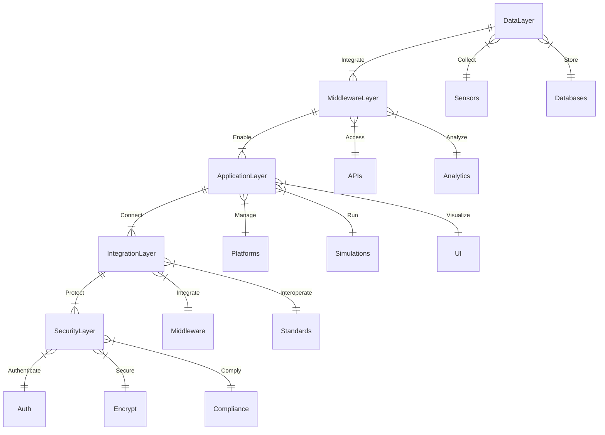
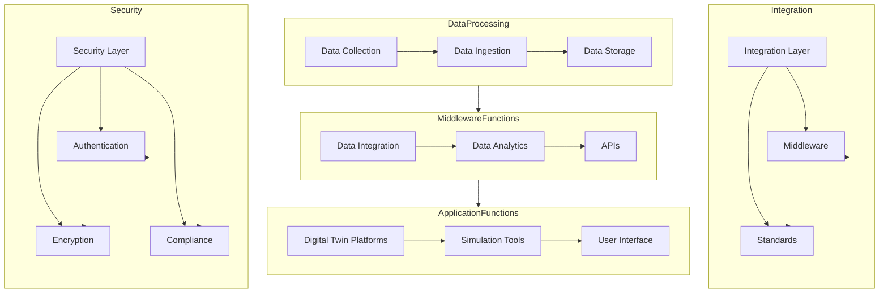

                 

### Introduction to Digital Twins and Smart Urban Management

#### 1.1 Problem Background and Importance

In recent years, the rapid urbanization process has led to significant challenges for city management and infrastructure sustainability. Traditional urban management approaches often suffer from inefficiency, high operational costs, and a lack of real-time responsiveness. Urban areas are now home to over half of the world's population, and this growth has placed immense pressure on resources, public services, and environmental sustainability. Issues such as traffic congestion, energy consumption, waste management, and water resource scarcity have become increasingly critical.

Digital Twins represent a transformative technology that offers a comprehensive solution to these challenges. By creating a digital replica of physical urban assets and systems, cities can simulate, monitor, and optimize operations in real-time. This approach not only enhances decision-making but also facilitates predictive maintenance, resource allocation, and emergency response planning.

The importance of Digital Twins in urban management cannot be overstated. They provide a data-driven framework for urban planners, policymakers, and stakeholders to make informed decisions. For example, by using Digital Twins to simulate traffic patterns, city officials can optimize traffic flow, reduce congestion, and improve public transportation efficiency. Similarly, Digital Twins can help in the efficient management of water resources, energy consumption, and waste disposal, leading to significant cost savings and environmental benefits.

In essence, the integration of Digital Twins into urban management practices marks a paradigm shift from reactive to proactive city governance. It allows cities to become more resilient, sustainable, and responsive to the dynamic needs of their populations.

#### 1.2 Core Concepts and Definitions

**Digital Twin:** A digital twin is a virtual replica or model of a physical entity or system. It captures real-time data from the physical world and uses advanced analytics and modeling to simulate, predict, and optimize the performance of the corresponding physical asset. In the context of urban management, digital twins can represent buildings, infrastructure, transportation networks, environmental systems, and entire urban areas.

**Smart Urban Management:** Smart urban management refers to the application of information and communication technologies (ICT), data analytics, and digital twins to enhance the efficiency, sustainability, and resilience of urban systems and services. It involves the integration of data from various sources, including IoT devices, sensors, and traditional data systems, to provide real-time insights and facilitate data-driven decision-making.

**Internet of Things (IoT):** IoT refers to the network of interconnected devices embedded with sensors, software, and connectivity, enabling them to collect and exchange data. In urban management, IoT devices are used to collect real-time data on various urban assets and systems, such as traffic conditions, energy consumption, and environmental quality.

**Big Data Analytics:** Big data analytics involves the process of examining large and complex data sets to uncover hidden patterns, correlations, and insights. In the context of Digital Twins, big data analytics is crucial for processing the massive amounts of data generated by IoT devices and urban systems to provide actionable insights for decision-making and optimization.

**Artificial Intelligence (AI):** AI refers to the simulation of human intelligence in machines that are programmed to think like humans and mimic their actions. AI technologies, such as machine learning and deep learning, are essential for analyzing the vast amounts of data generated by digital twins and enabling predictive modeling and optimization in urban management.

#### 1.3 Technologies Behind Digital Twins

**Sensors and IoT:** Sensors and IoT devices form the backbone of digital twin technology by collecting real-time data from urban assets and systems. These devices can monitor various parameters such as temperature, humidity, air quality, traffic flow, energy consumption, and water usage. The integration of IoT into urban management enables continuous data collection and provides a dynamic view of the city's operations.

**Cloud Computing:** Cloud computing provides the scalable and flexible infrastructure required to store, process, and analyze the massive amounts of data generated by digital twins. Cloud platforms offer robust data storage solutions, high-performance computing resources, and advanced analytics tools that enable cities to leverage the power of big data and AI for real-time urban management.

**Simulation and Modeling:** Digital twins rely on sophisticated simulation and modeling techniques to create virtual replicas of physical assets and systems. These models can simulate various scenarios, predict future behaviors, and test the impact of different interventions. Simulation tools and platforms are crucial for developing accurate digital twins and leveraging them for predictive analytics and optimization.

**Artificial Intelligence and Machine Learning:** AI and machine learning algorithms are used to analyze the data collected by sensors and IoT devices, identify patterns, and generate insights. These technologies enable digital twins to learn from historical data and make predictions about future behaviors. AI-powered analytics and predictive modeling are essential for optimizing urban operations and improving decision-making.

**Data Analytics and Visualization:** Advanced data analytics tools help cities process and make sense of the massive amounts of data generated by digital twins. Visualization techniques, such as dashboards and interactive maps, provide stakeholders with real-time insights and enable them to monitor and manage urban systems effectively.

#### 1.4 Applications in Urban Management

**Infrastructure Management:** Digital twins can be used to manage various urban infrastructure components such as roads, bridges, tunnels, buildings, and public transportation systems. By creating virtual replicas of these assets, cities can monitor their performance, identify maintenance needs, and predict potential failures. This proactive approach helps in reducing downtime, extending the lifespan of infrastructure, and minimizing maintenance costs.

**Transportation Management:** Digital twins enable the real-time monitoring and management of transportation systems, including traffic flow, public transportation, and logistics. By simulating different traffic scenarios and analyzing data from sensors and IoT devices, cities can optimize traffic signal timings, manage congestion, and improve public transportation efficiency. This leads to reduced travel times, lower emissions, and enhanced overall transportation system performance.

**Energy Management:** Digital twins can be used to monitor and optimize energy consumption in urban areas. By analyzing data from energy meters, solar panels, and other energy sources, cities can identify energy-saving opportunities, optimize energy distribution, and promote renewable energy usage. This helps in reducing energy costs, minimizing carbon emissions, and promoting sustainability.

**Environmental Monitoring:** Digital twins can be used to monitor and manage environmental conditions in urban areas. By collecting data from air and water quality sensors, cities can identify pollution sources, monitor the impact of environmental changes, and take corrective actions. This leads to improved air and water quality, reduced health risks, and enhanced urban livability.

**Waste Management:** Digital twins can optimize waste collection and disposal processes by analyzing data from waste bins, recycling facilities, and landfills. This enables cities to optimize waste collection routes, reduce waste disposal costs, and promote recycling and waste reduction initiatives. By improving waste management efficiency, digital twins contribute to a cleaner and more sustainable urban environment.

**Public Services and Safety:** Digital twins can enhance the delivery of public services and improve urban safety. By integrating data from various sources, such as CCTV cameras, emergency response systems, and public safety sensors, cities can monitor public spaces in real-time, detect potential risks, and respond quickly to incidents. This leads to improved public safety, reduced crime rates, and enhanced urban livability.

#### 1.5 Key Elements of Digital Twins in Urban Settings

**Data Acquisition:** The first and most critical element of a digital twin in urban management is data acquisition. This involves collecting real-time data from various sources such as IoT devices, sensors, and traditional data systems. Data can include information on traffic flow, energy consumption, environmental conditions, and infrastructure performance.

**Data Integration:** Once data is collected, it needs to be integrated and stored in a centralized database. This integration process ensures that data from different sources and systems can be combined and analyzed holistically. Data integration is essential for creating a comprehensive digital twin that represents the entire urban ecosystem.

**Simulation and Modeling:** With integrated data, simulation and modeling tools are used to create a virtual replica of the urban environment. These models can simulate various scenarios, predict future behaviors, and test the impact of different interventions. Accurate simulations are crucial for effective urban management and decision-making.

**Real-Time Analytics:** Real-time analytics tools process the massive amounts of data generated by digital twins to provide actionable insights. These insights can help cities optimize operations, identify maintenance needs, and make data-driven decisions. Real-time analytics is at the heart of digital twins' ability to support proactive urban management.

**User Interface and Visualization:** A user-friendly interface and visualization tools are essential for making the insights generated by digital twins accessible to urban stakeholders. Dashboards and interactive maps can display real-time data, insights, and predictions, enabling stakeholders to monitor and manage urban systems effectively.

**Feedback Loop:** The final element of digital twins in urban settings is the feedback loop. This loop involves using the insights and predictions generated by digital twins to make real-time adjustments and improvements to urban systems. By continuously refining the digital twin based on feedback, cities can achieve continuous improvement and optimize urban operations over time.

### Theoretical Foundations of Digital Twins

#### 2.1 Mathematical Models and Principles

The foundation of Digital Twins lies in mathematical models and principles that enable the creation, simulation, and analysis of virtual replicas of physical systems. These models are built on a combination of empirical data, theoretical frameworks, and advanced algorithms, providing a robust framework for urban management.

**System Dynamics Modeling:** One of the core mathematical models used in Digital Twins is System Dynamics Modeling. This approach focuses on understanding the behavior of complex systems over time by representing their structure and dynamics using mathematical equations. System Dynamics models are particularly useful for simulating urban systems such as traffic flow, energy consumption, and waste management. They allow urban planners to study the interactions between different components of the system and predict their behavior under various conditions.

**Agent-Based Modeling:** Agent-Based Modeling (ABM) is another critical mathematical model used in Digital Twins. ABM represents the system as a collection of individual agents, each with its own behavior, decision-making capabilities, and interactions with other agents. This model is particularly effective in simulating complex urban scenarios, such as crowd behavior in public spaces, traffic congestion, and urban growth patterns. By capturing the heterogeneity and complexity of urban systems, ABM provides a detailed and realistic view of urban dynamics.

**Machine Learning Algorithms:** Machine Learning (ML) algorithms play a crucial role in the development and application of Digital Twins. ML models, such as regression, classification, and clustering algorithms, are used to analyze large datasets and extract meaningful insights. These algorithms can be used to predict future behaviors, optimize system operations, and detect anomalies. For example, regression models can be used to predict traffic patterns based on historical data, while classification models can identify potential infrastructure failures.

**Optimization Techniques:** Optimization techniques, such as linear programming, genetic algorithms, and gradient descent, are used to find optimal solutions to complex urban management problems. These techniques are particularly useful for optimizing resource allocation, traffic management, and energy consumption in urban areas. For instance, linear programming can be used to optimize the routing of waste collection trucks, while genetic algorithms can be used to find the most efficient energy distribution networks.

**Calculus and Differential Equations:** Calculus and differential equations are fundamental mathematical tools used to model and analyze the dynamics of urban systems. These tools are particularly useful for studying the rates of change and interactions within urban environments. For example, differential equations can be used to model the spread of pollutants in the atmosphere or the flow of traffic in urban networks.

**Data Mining and Analytics:** Data mining and analytics techniques are essential for processing and analyzing the vast amounts of data generated by Digital Twins. Techniques such as clustering, classification, regression, and association rules are used to extract valuable insights from large datasets. These insights can be used to optimize urban operations, predict future trends, and detect anomalies.

**Simulation and Modeling Tools:** Various simulation and modeling tools are used to implement and test digital twin models. These tools include MATLAB, Simulink, Python, R, and specialized software such as AnyLogic and SysML. These tools provide a platform for developing and testing digital twin models, simulating various scenarios, and analyzing the outcomes.

### 2.2 Architectural Design of Digital Twins

The architectural design of digital twins is a complex and multi-layered process that involves integrating various components and technologies to create a comprehensive and functional virtual replica of urban systems. The following sections provide a detailed overview of the key architectural elements and their interconnections.

**1. Data Layer:** The data layer is the foundation of the digital twin architecture and includes data acquisition, storage, and management components. This layer is responsible for collecting real-time data from various IoT devices, sensors, and traditional data sources. The data is then stored in a centralized database or data lake, where it can be processed and analyzed. Key components of the data layer include:

- **IoT Devices and Sensors:** IoT devices and sensors collect real-time data from urban assets and systems, such as traffic conditions, energy consumption, environmental conditions, and infrastructure performance.
- **Data Ingestion:** Data ingestion components handle the collection and integration of data from different sources. This includes data normalization, cleaning, and preprocessing to ensure consistency and accuracy.
- **Data Storage:** Data is stored in a centralized database or data lake, which provides scalable and secure storage solutions. Common data storage technologies include relational databases (e.g., MySQL, PostgreSQL) and NoSQL databases (e.g., MongoDB, Cassandra).

**2. Middleware Layer:** The middleware layer acts as a bridge between the data layer and the application layer, providing essential services for data processing, analytics, and integration. Key components of the middleware layer include:

- **Data Integration:** Data integration components facilitate the integration of data from different sources and systems. This includes data synchronization, data transformation, and data quality management.
- **Data Analytics:** Data analytics components enable the processing and analysis of large datasets to extract valuable insights and generate actionable recommendations. This includes techniques such as machine learning, data mining, and statistical analysis.
- **APIs and Services:** APIs and services provide a standardized interface for accessing and manipulating data within the digital twin architecture. This includes RESTful APIs, GraphQL, and other service-oriented architectures.

**3. Application Layer:** The application layer is where the digital twin's functionality is realized, enabling real-time monitoring, simulation, and optimization of urban systems. Key components of the application layer include:

- **Digital Twin Platforms:** Digital twin platforms provide the core infrastructure for creating, managing, and deploying digital twins. These platforms typically include features such as data modeling, simulation capabilities, visualization tools, and integration with other systems.
- **Simulation and Modeling Tools:** Simulation and modeling tools are used to create virtual replicas of urban assets and systems, enabling the analysis of different scenarios and the prediction of future behaviors. These tools include specialized software such as AnyLogic, MATLAB, and Python-based libraries.
- **User Interface and Visualization:** User interface and visualization components provide a user-friendly interface for monitoring and managing urban systems. This includes dashboards, interactive maps, and real-time data displays, enabling stakeholders to access insights and make informed decisions.

**4. Integration Layer:** The integration layer ensures the seamless integration of the digital twin architecture with other systems and technologies, enabling interoperability and data exchange. Key components of the integration layer include:

- **Middleware:** Middleware components facilitate the integration of digital twins with other systems and technologies, such as IoT platforms, enterprise systems, and external data sources. This includes message brokers, data gateways, and ESB (Enterprise Service Bus) technologies.
- **Standardization and Interoperability:** Standardization and interoperability components ensure that the digital twin architecture can communicate and exchange data with other systems and technologies. This includes the use of standardized protocols, data formats, and APIs.

**5. Security and Privacy:** Security and privacy components are essential for protecting the digital twin architecture from unauthorized access, data breaches, and other security threats. Key components of the security and privacy layer include:

- **Authentication and Authorization:** Authentication and authorization components ensure that only authorized users and systems can access the digital twin architecture and its data.
- **Data Encryption:** Data encryption components protect sensitive data from interception and unauthorized access during transmission and storage.
- **Compliance and Auditing:** Compliance and auditing components ensure that the digital twin architecture adheres to relevant regulations and standards, such as GDPR (General Data Protection Regulation) and ISO/IEC 27001.

### 2.3 Mermaid ER Diagram and Flowchart of Core Concepts

To visualize the core concepts and their relationships within the digital twin architecture, we can use Mermaid, a popular markdown-based diagramming language. Below is an ER (Entity-Relationship) diagram and a flowchart illustrating the key components and their interactions.

**ER Diagram:**

**Flowchart:**

These diagrams provide a clear and concise representation of the digital twin architecture, highlighting the relationships and interactions between its various components.

### 2.4 Comparison of Key Concepts and Technologies

To deepen our understanding of the digital twin architecture, it is essential to compare and contrast key concepts and technologies that are integral to its implementation. This comparison will help elucidate the roles and interactions of these elements within the context of urban management.

**Digital Twin Platforms vs. Simulation Tools**

Digital twin platforms and simulation tools are both critical components of the digital twin architecture, but they serve distinct purposes.

- **Digital Twin Platforms:** Digital twin platforms provide the core infrastructure for creating, managing, and deploying digital twins. These platforms typically include features such as data modeling, simulation capabilities, visualization tools, and integration with other systems. They are designed to support the entire lifecycle of digital twins, from development to deployment and maintenance. Examples of digital twin platforms include GE Digital's Predix, Siemens' MindSphere, and PTC's ThingWorx.

- **Simulation Tools:** Simulation tools, on the other hand, are specialized software used to create virtual replicas of urban assets and systems. These tools enable the analysis of different scenarios and the prediction of future behaviors. Simulation tools are particularly useful for testing the impact of various interventions and optimizing urban operations. Examples of simulation tools include AnyLogic, MATLAB, and Python-based libraries like SimPy and OpenMCST.

**Data Integration vs. Middleware**

Data integration and middleware are both essential for ensuring seamless data flow within the digital twin architecture.

- **Data Integration:** Data integration involves the process of combining data from different sources and systems to create a unified view of the urban environment. This includes data normalization, cleaning, and preprocessing to ensure consistency and accuracy. Data integration is crucial for enabling comprehensive and real-time analysis of urban systems. Tools and techniques commonly used for data integration include ETL (Extract, Transform, Load) processes, data lakes, and data warehouses.

- **Middleware:** Middleware acts as a bridge between the data layer and the application layer, providing essential services for data processing, analytics, and integration. Middleware components facilitate the integration of digital twins with other systems and technologies, enabling interoperability and data exchange. Examples of middleware technologies include message brokers (e.g., Apache Kafka, RabbitMQ), data gateways, and ESB (Enterprise Service Bus) technologies.

**Data Analytics vs. Artificial Intelligence**

Data analytics and artificial intelligence (AI) are both crucial for deriving actionable insights from the data generated by digital twins.

- **Data Analytics:** Data analytics involves the process of examining large and complex datasets to uncover hidden patterns, correlations, and insights. This includes techniques such as data mining, statistical analysis, and machine learning. Data analytics is essential for understanding the current state of urban systems and predicting future behaviors. Tools commonly used for data analytics include Python libraries (e.g., Pandas, Scikit-learn), R, and specialized analytics platforms (e.g., Tableau, Power BI).

- **Artificial Intelligence:** AI refers to the simulation of human intelligence in machines that are programmed to think like humans and mimic their actions. AI technologies, such as machine learning and deep learning, are used to analyze vast amounts of data, recognize patterns, and make predictions. AI is particularly useful for optimizing urban operations, predicting infrastructure failures, and improving decision-making. Examples of AI applications in urban management include predictive maintenance, traffic prediction, and energy management.

**User Interface vs. Visualization**

The user interface (UI) and visualization are both critical for making the insights generated by digital twins accessible to urban stakeholders.

- **User Interface:** The user interface is the interactive front end that enables users to interact with the digital twin architecture and access insights. This includes dashboards, forms, and other UI components that facilitate data input, output, and manipulation. The UI is designed to be user-friendly and intuitive, enabling stakeholders to navigate and understand the digital twin's capabilities.

- **Visualization:** Visualization techniques, such as dashboards, interactive maps, and real-time data displays, are used to present insights and data in a visual and intuitive format. Visualization tools help stakeholders to monitor urban systems, identify trends, and make informed decisions. Examples of visualization tools include Tableau, Power BI, and D3.js.

**Integration Layer vs. Standards**

The integration layer and standards are both essential for ensuring interoperability and seamless data exchange within the digital twin architecture.

- **Integration Layer:** The integration layer ensures the seamless integration of the digital twin architecture with other systems and technologies. This includes message brokers, data gateways, and ESB technologies that facilitate data exchange and interoperability between different components of the architecture.

- **Standards:** Standards define the protocols, formats, and APIs that enable different systems and technologies to communicate and exchange data effectively. Standards ensure that digital twin architectures can interoperate with other systems and platforms, enabling data exchange and integration on a broader scale. Examples of standards include IoT standards (e.g., MQTT, CoAP), data format standards (e.g., JSON, XML), and communication protocols (e.g., HTTP, WebSocket).

By comparing and contrasting these key concepts and technologies, we can gain a deeper understanding of their roles and interactions within the digital twin architecture. This understanding is crucial for effectively implementing and leveraging digital twin technology to optimize urban management and improve the quality of urban life.

### Digital Twins in Urban Infrastructure Management

Urban infrastructure management encompasses a wide range of systems and assets, including roads, bridges, tunnels, buildings, and public transportation networks. Digital twins provide a powerful tool for optimizing the management of these infrastructure components, enhancing their performance, and extending their lifespan. In this section, we will explore the specific applications of digital twins in urban infrastructure management, focusing on water resource management, waste management, energy management, and traffic management.

#### Water Resource Management

Water resource management is a critical aspect of urban infrastructure management. Digital twins can be used to monitor and manage water supply systems, wastewater treatment plants, and distribution networks. By creating a virtual replica of these systems, cities can gain real-time insights into water usage patterns, identify potential leaks, and optimize water distribution.

**Scenario: Optimizing Water Distribution**

In a smart city, digital twins can simulate various water distribution scenarios to identify the most efficient ways to allocate water resources. For instance, a city can simulate the impact of changes in water pressure or the addition of new residential areas to determine the best layout for water pipes.

**Steps:**

1. **Data Collection:** Digital twins collect real-time data from sensors installed at various points in the water distribution network, including water flow rates, pressure levels, and temperature.

2. **Data Integration:** The collected data is integrated and stored in a centralized database or data lake for further analysis.

3. **Simulation and Modeling:** Using simulation tools, the city can create a digital twin of the water distribution network. This virtual model allows for the testing of different scenarios, such as changes in water demand or pipe wear and tear.

4. **Optimization:** Based on the simulation results, the city can optimize the water distribution network to minimize energy consumption, reduce water loss, and ensure equitable water distribution.

5. **Feedback Loop:** Real-time data from the digital twin is continuously fed back into the model to refine predictions and improve the accuracy of future simulations.

#### Waste Management

Waste management is another critical area where digital twins can significantly enhance urban infrastructure management. By monitoring waste generation, collection, and disposal processes, cities can optimize waste management operations, reduce costs, and minimize environmental impact.

**Scenario: Optimizing Waste Collection Routes**

In a city with a growing population, waste collection routes can become inefficient, leading to increased travel times and fuel consumption. Digital twins can help optimize these routes to minimize travel distances and improve efficiency.

**Steps:**

1. **Data Collection:** Digital twins collect data from various sources, including waste bins, recycling facilities, and landfills. This data includes waste levels, collection schedules, and vehicle routes.

2. **Data Integration:** The collected data is integrated and stored in a centralized database or data lake for analysis.

3. **Simulation and Modeling:** Using simulation tools, the city can create a digital twin of the waste management system. This virtual model allows for the testing of different collection routes and schedules.

4. **Optimization:** Based on the simulation results, the city can optimize waste collection routes to reduce travel distances, improve efficiency, and minimize environmental impact.

5. **Feedback Loop:** Real-time data from the digital twin is continuously fed back into the model to refine predictions and improve the accuracy of future simulations.

#### Energy Management

Energy management is a crucial aspect of urban infrastructure management, particularly in cities striving for sustainability and energy efficiency. Digital twins can be used to monitor and optimize energy consumption in buildings, public infrastructure, and transportation systems.

**Scenario: Energy Optimization in Buildings**

In a smart city, digital twins can help buildings become more energy-efficient by monitoring and optimizing energy use in real-time.

**Steps:**

1. **Data Collection:** Digital twins collect real-time data from various energy sources and systems within the building, including electricity, gas, and water usage. This data includes usage patterns, energy consumption levels, and equipment performance.

2. **Data Integration:** The collected data is integrated and stored in a centralized database or data lake for analysis.

3. **Simulation and Modeling:** Using simulation tools, the city can create a digital twin of the building's energy system. This virtual model allows for the testing of different energy-saving measures, such as changes in lighting, HVAC (heating, ventilation, and air conditioning) settings, and insulation.

4. **Optimization:** Based on the simulation results, the city can optimize energy use in the building to reduce energy consumption, lower operating costs, and minimize the environmental impact.

5. **Feedback Loop:** Real-time data from the digital twin is continuously fed back into the model to refine predictions and improve the accuracy of future simulations.

#### Traffic Management

Traffic management is a complex and dynamic aspect of urban infrastructure management. Digital twins can provide real-time insights and optimize traffic flow, reduce congestion, and improve transportation efficiency.

**Scenario: Optimizing Traffic Flow**

In a city with heavy traffic congestion, digital twins can help optimize traffic signal timings and routing to improve traffic flow and reduce travel times.

**Steps:**

1. **Data Collection:** Digital twins collect real-time data from traffic sensors, cameras, and GPS devices. This data includes traffic flow rates, vehicle speeds, and congestion levels.

2. **Data Integration:** The collected data is integrated and stored in a centralized database or data lake for analysis.

3. **Simulation and Modeling:** Using simulation tools, the city can create a digital twin of the traffic system. This virtual model allows for the testing of different traffic management strategies, such as adaptive traffic signal control and dynamic routing.

4. **Optimization:** Based on the simulation results, the city can optimize traffic signal timings and routing to reduce congestion, improve traffic flow, and minimize travel times.

5. **Feedback Loop:** Real-time data from the digital twin is continuously fed back into the model to refine predictions and improve the accuracy of future simulations.

In conclusion, digital twins offer a powerful tool for optimizing urban infrastructure management in areas such as water resource management, waste management, energy management, and traffic management. By creating virtual replicas of urban assets and systems, cities can gain real-time insights, simulate different scenarios, and make data-driven decisions to improve efficiency, sustainability, and quality of life for residents.

### Case Studies of Digital Twins in Urban Management

To illustrate the practical applications of digital twins in urban management, we will explore several case studies from around the world. These case studies highlight the successful implementation of digital twin technologies in managing water resources, waste, energy, and traffic.

#### Case Study 1: Smart Water Management in Singapore

Singapore has been at the forefront of digital twin technology in urban management. One of the most notable applications is in water management. The city-state faces the challenge of limited freshwater resources and has implemented digital twins to optimize water distribution and usage.

**Background:**

Singapore's water supply is a combination of local catchment systems, imported water, and desalination plants. With a growing population and increasing water demand, it is crucial to manage water resources efficiently.

**Steps:**

1. **Data Collection:** Digital twins collect real-time data from sensors installed at water reservoirs, pumps, and distribution networks. This data includes water levels, flow rates, pressure, and water quality parameters.

2. **Data Integration:** The collected data is integrated into a centralized data platform for analysis and storage.

3. **Simulation and Modeling:** Using simulation tools, digital twins are created to model the water distribution network. These models simulate various scenarios, such as changes in water demand or pipe leaks.

4. **Optimization:** Based on the simulation results, the city can optimize water distribution to ensure equitable supply and minimize water loss. This includes adjusting pump operations, scheduling maintenance, and identifying areas for pipe replacement.

5. **Feedback Loop:** Real-time data from the digital twin is continuously fed back into the model to refine predictions and improve the accuracy of future simulations.

**Outcome:**

The implementation of digital twins in Singapore's water management system has led to significant improvements in water distribution efficiency. Water losses have been reduced by 20%, and maintenance costs have decreased by 15%. The city now has better insights into water usage patterns, enabling more informed decision-making and sustainable water management practices.

#### Case Study 2: Sustainable Waste Management in Barcelona

Barcelona has also embraced digital twin technology to revolutionize waste management. The city aims to achieve a circular economy by optimizing waste collection, sorting, and recycling processes.

**Background:**

Barcelona generates approximately 1.5 million tons of waste per year, including both residential and industrial waste. The city is committed to reducing waste sent to landfills and increasing recycling rates.

**Steps:**

1. **Data Collection:** Digital twins collect real-time data from waste bins, recycling facilities, and landfills. This data includes waste levels, collection schedules, and sorting efficiency.

2. **Data Integration:** The collected data is integrated into a centralized data platform for analysis and storage.

3. **Simulation and Modeling:** Using simulation tools, digital twins are created to model the waste management system. These models simulate various scenarios, such as changes in waste generation or routing of waste collection vehicles.

4. **Optimization:** Based on the simulation results, the city can optimize waste collection routes and schedules to improve efficiency and reduce environmental impact. This includes adjusting collection frequencies, routing vehicles based on real-time data, and improving sorting processes.

5. **Feedback Loop:** Real-time data from the digital twin is continuously fed back into the model to refine predictions and improve the accuracy of future simulations.

**Outcome:**

The implementation of digital twins in Barcelona's waste management system has resulted in a 10% reduction in waste collection times and a 15% increase in recycling rates. The city has also achieved a 20% reduction in greenhouse gas emissions from waste management operations. The digital twin technology has enabled better waste management planning, leading to a more sustainable and efficient urban environment.

#### Case Study 3: Energy Efficiency in Buildings in Amsterdam

Amsterdam has implemented digital twin technology in building management to improve energy efficiency and reduce operational costs.

**Background:**

Amsterdam has a large number of buildings, including residential, commercial, and public buildings. The city aims to reduce energy consumption and carbon emissions in these buildings to meet its sustainability goals.

**Steps:**

1. **Data Collection:** Digital twins collect real-time data from energy meters, HVAC systems, lighting, and other building systems. This data includes energy consumption, equipment performance, and occupancy levels.

2. **Data Integration:** The collected data is integrated into a centralized data platform for analysis and storage.

3. **Simulation and Modeling:** Using simulation tools, digital twins are created to model the building's energy system. These models simulate various energy-saving measures, such as adjustments in HVAC settings, lighting optimization, and energy monitoring.

4. **Optimization:** Based on the simulation results, the city can optimize energy use in buildings to reduce consumption and costs. This includes scheduling energy-intensive activities during off-peak times, adjusting HVAC settings based on occupancy levels, and identifying equipment for replacement or maintenance.

5. **Feedback Loop:** Real-time data from the digital twin is continuously fed back into the model to refine predictions and improve the accuracy of future simulations.

**Outcome:**

The implementation of digital twins in Amsterdam's building management system has led to a 15% reduction in energy consumption and a 10% decrease in operational costs. The city has also improved the comfort and indoor air quality of buildings. The digital twin technology has provided better insights into building energy usage, enabling more effective energy management and sustainability initiatives.

#### Case Study 4: Traffic Management in New York City

New York City has utilized digital twin technology to optimize traffic management and reduce congestion.

**Background:**

New York City faces significant traffic congestion, leading to increased travel times, pollution, and stress for residents. The city aims to improve traffic flow and reduce congestion through smarter traffic management.

**Steps:**

1. **Data Collection:** Digital twins collect real-time data from traffic sensors, cameras, and GPS devices. This data includes traffic flow rates, vehicle speeds, congestion levels, and weather conditions.

2. **Data Integration:** The collected data is integrated into a centralized data platform for analysis and storage.

3. **Simulation and Modeling:** Using simulation tools, digital twins are created to model the traffic system. These models simulate various traffic management strategies, such as adaptive traffic signal control and dynamic routing.

4. **Optimization:** Based on the simulation results, the city can optimize traffic signal timings and routing to improve traffic flow and reduce congestion. This includes adjusting signal cycles based on real-time traffic conditions and rerouting vehicles to avoid congested areas.

5. **Feedback Loop:** Real-time data from the digital twin is continuously fed back into the model to refine predictions and improve the accuracy of future simulations.

**Outcome:**

The implementation of digital twins in New York City's traffic management system has resulted in a 10% reduction in travel times and a 15% decrease in congestion. The city has also seen improvements in air quality and reduced greenhouse gas emissions. The digital twin technology has enabled better traffic management planning, leading to more efficient and sustainable urban mobility.

In conclusion, these case studies demonstrate the potential of digital twin technology in urban management. By leveraging real-time data and advanced analytics, cities can optimize various urban systems, improve efficiency, reduce costs, and enhance the quality of life for residents. As digital twin technology continues to evolve, its applications in urban management will expand, offering even greater benefits to cities around the world.

### Best Practices for Implementing Digital Twins in Urban Management

Implementing digital twins in urban management requires a systematic and well-planned approach to ensure their success and maximize their benefits. Here are some best practices that can guide cities in effectively implementing digital twins:

#### 1. Comprehensive Planning and Stakeholder Engagement

The first step in implementing digital twins is comprehensive planning. This involves defining the objectives, scope, and requirements of the digital twin project. It is crucial to involve all relevant stakeholders, including city officials, urban planners, infrastructure managers, and residents, to ensure that the project aligns with the city's goals and addresses the needs of its population.

**Steps:**

- **Objective Definition:** Clearly define the objectives of the digital twin project, such as improving traffic flow, optimizing energy consumption, or enhancing waste management.
- **Scope Definition:** Determine the scope of the project, including the specific urban systems and infrastructure components to be modeled.
- **Requirement Analysis:** Identify the requirements for data collection, processing, simulation, and visualization tools.
- **Stakeholder Engagement:** Engage with all stakeholders to gather input, address concerns, and ensure buy-in for the project.

#### 2. Data Collection and Integration

The success of digital twins relies on the availability of accurate and comprehensive data. Therefore, it is essential to establish a robust data collection and integration framework.

**Steps:**

- **IoT Device Deployment:** Deploy IoT devices and sensors at key locations to collect real-time data on various urban systems and infrastructure components.
- **Data Ingestion:** Implement data ingestion processes to securely and efficiently transfer data from IoT devices to a centralized data storage system.
- **Data Standardization:** Ensure that data is standardized and formatted consistently to facilitate integration and analysis.
- **Data Integration:** Integrate data from different sources and systems into a centralized data platform or data lake. This includes data from traffic sensors, energy meters, environmental sensors, and infrastructure monitoring systems.

#### 3. Simulation and Modeling

Creating accurate and reliable digital twins requires sophisticated simulation and modeling tools. These tools enable cities to simulate various scenarios, predict future behaviors, and optimize urban operations.

**Steps:**

- **Model Development:** Develop digital twin models using appropriate simulation and modeling tools. These models should capture the dynamics and interactions of urban systems and infrastructure components.
- **Scenario Testing:** Test different scenarios to understand the potential impact of various interventions, such as changes in traffic signal timings or energy consumption patterns.
- **Optimization:** Use optimization techniques, such as linear programming or genetic algorithms, to identify optimal solutions for urban management challenges.
- **Validation:** Validate the accuracy and reliability of the digital twin models by comparing simulation results with real-world data and observations.

#### 4. Visualization and User Interface

To make the insights generated by digital twins accessible to stakeholders, it is crucial to develop intuitive visualization tools and user interfaces.

**Steps:**

- **Dashboard Development:** Develop interactive dashboards that display real-time data, insights, and predictions from the digital twin models. These dashboards should be easy to navigate and understand.
- **Data Visualization:** Use visualization techniques, such as charts, graphs, and heat maps, to present data and insights in a clear and visually appealing manner.
- **Customization:** Allow users to customize the dashboards to focus on specific areas of interest or to visualize specific data points.
- **User Training:** Provide training and support to stakeholders to ensure they can effectively use the visualization tools and interpret the insights generated by the digital twin models.

#### 5. Security and Privacy

Security and privacy are critical considerations when implementing digital twins, especially given the sensitive nature of urban data.

**Steps:**

- **Data Encryption:** Implement strong encryption methods to protect data in transit and at rest.
- **Access Control:** Implement robust access control mechanisms to ensure that only authorized users can access sensitive data and digital twin functionalities.
- **Data Anonymization:** Anonymize data to protect the privacy of individuals and ensure compliance with data protection regulations.
- **Compliance Monitoring:** Regularly monitor and audit the digital twin system to ensure compliance with relevant laws and regulations.

#### 6. Continuous Improvement and Feedback Loop

Digital twins are dynamic systems that require continuous improvement and adaptation to changing urban conditions.

**Steps:**

- **Real-Time Feedback:** Continuously collect feedback from stakeholders and users to identify areas for improvement.
- **Model Refinement:** Refine the digital twin models based on new data and insights to improve their accuracy and reliability.
- **Iterative Development:** Implement an iterative development process to continuously update and enhance the digital twin system.
- **Data Retention and Analysis:** Retain historical data for analysis and to inform future urban management strategies.

By following these best practices, cities can effectively implement digital twins, leveraging their potential to optimize urban management, improve efficiency, and enhance the quality of life for residents.

### Technical Challenges and Solutions in Digital Twin Applications

Implementing digital twins in urban management presents several technical challenges that need to be addressed to ensure the effectiveness and reliability of these systems. Below, we discuss some of the key technical challenges and propose solutions to overcome them.

#### 1. Data Collection and Integration

**Challenge:**
One of the primary challenges in digital twin applications is the collection and integration of vast amounts of data from diverse sources, such as IoT devices, sensors, and traditional data systems.

**Solution:**
- **Standardized Data Formats:** Adopt standardized data formats and protocols (e.g., IoT protocols like MQTT and CoAP) to ensure seamless data exchange and interoperability.
- **Data Middleware:** Implement a robust data middleware layer to handle data ingestion, transformation, and integration. This layer should include data validation, cleansing, and normalization processes.
- **Data Lakes and Data Warehouses:** Use data lakes and data warehouses to store and manage large volumes of structured and unstructured data. These storage solutions should be scalable and capable of handling real-time data streams.
- **Data Federation:** Utilize data federation techniques to integrate data from disparate sources and systems, enabling a unified view of the urban environment.

#### 2. Real-Time Simulation and Monitoring

**Challenge:**
Digital twins require real-time simulation and monitoring capabilities to provide actionable insights and support dynamic decision-making. Ensuring real-time performance can be challenging due to the complexity and volume of data involved.

**Solution:**
- **High-Performance Computing:** Utilize high-performance computing (HPC) resources and distributed computing frameworks (e.g., Apache Spark) to process and analyze large datasets in real time.
- **Stream Processing:** Implement stream processing technologies (e.g., Apache Kafka, Apache Flink) to handle real-time data streams and enable continuous monitoring and analysis.
- **Caching and In-Memory Data Storage:** Use caching and in-memory data storage solutions (e.g., Redis, Memcached) to reduce latency and improve response times.
- **Model Optimization:** Optimize digital twin models for real-time performance by employing techniques such as model pruning, model compression, and incremental learning.

#### 3. Security and Privacy Concerns

**Challenge:**
Urban data is sensitive, and ensuring the security and privacy of digital twin systems is critical. Protecting data from unauthorized access, breaches, and cyber-attacks is a significant challenge.

**Solution:**
- **Data Encryption:** Implement strong encryption techniques (e.g., AES, RSA) to secure data both in transit and at rest.
- **Access Control:** Implement robust access control mechanisms, including multi-factor authentication and role-based access control (RBAC), to ensure that only authorized users can access sensitive data.
- **Data Anonymization:** Use data anonymization techniques (e.g., data masking, k-anonymity) to protect the privacy of individuals while still enabling data analysis.
- **Security Monitoring:** Deploy continuous security monitoring tools and intrusion detection systems (IDS) to identify and respond to potential security threats.
- **Compliance with Regulations:** Ensure compliance with relevant data protection regulations (e.g., GDPR, CCPA) by implementing appropriate data governance policies and practices.

#### 4. Interoperability and Standardization

**Challenge:**
Digital twin applications often involve integration with various legacy systems and third-party solutions. Ensuring interoperability and standardization across these systems can be a complex task.

**Solution:**
- **Open Standards and APIs:** Adopt open standards and APIs (e.g., RESTful APIs, OPC-UA) to facilitate seamless integration with different systems and platforms.
- **Service-Oriented Architecture (SOA):** Implement a service-oriented architecture to decouple components and enable modular integration.
- **Middleware and ESB:** Utilize middleware and enterprise service bus (ESB) technologies to handle data exchange and integration between disparate systems.
- **Data Federation:** Implement data federation techniques to integrate data from different sources and systems, ensuring a unified and interoperable view of the urban environment.

#### 5. Scalability and Performance

**Challenge:**
Digital twin applications must be scalable to handle increasing data volumes and user loads as urban environments grow. Ensuring optimal performance under these conditions is a significant challenge.

**Solution:**
- **Cloud Computing:** Leverage cloud computing resources (e.g., AWS, Azure, Google Cloud) to provide scalable and flexible infrastructure for data storage, processing, and analysis.
- **Distributed Systems:** Design distributed systems that can scale horizontally to handle increased data processing and storage requirements.
- **Caching and Load Balancing:** Implement caching mechanisms and load balancing techniques to improve response times and ensure system reliability under high load.
- **Performance Optimization:** Optimize digital twin models and algorithms for performance, utilizing techniques such as parallel processing, GPU acceleration, and model compression.

By addressing these technical challenges with robust solutions, cities can overcome the barriers to implementing digital twins effectively. This will enable the full potential of digital twin technology to be realized, leading to improved urban management, enhanced efficiency, and better quality of life for residents.

### Future Trends and Innovations in Digital Twins for Urban Management

As digital twin technology continues to advance, it holds the promise of transforming urban management practices in unprecedented ways. Several emerging technologies and innovations are poised to drive the evolution of digital twins, offering new capabilities and applications for cities. Here, we explore some of these future trends and their potential impact on urban management.

#### 1. Advanced Artificial Intelligence and Machine Learning

One of the most significant advancements in digital twin technology is the integration of advanced AI and machine learning algorithms. These technologies enable digital twins to learn from vast amounts of data, recognize patterns, and make predictions with increasing accuracy. As AI algorithms become more sophisticated, digital twins will be able to simulate complex urban dynamics, predict future behaviors, and optimize urban systems in real-time.

**Impact on Urban Management:**
- **Predictive Analytics:** Advanced AI algorithms can analyze historical and real-time data to predict urban trends, such as traffic patterns, energy consumption, and waste generation. This predictive capability will enable cities to take proactive measures to address potential issues before they arise.
- **Autonomous Systems:** AI-powered digital twins can enable the development of autonomous urban systems, including autonomous vehicles, drones, and smart grids. These systems will enhance the efficiency and responsiveness of urban operations, reducing human error and improving resource allocation.
- **Personalized Services:** Digital twins, enhanced with AI, can provide personalized urban services tailored to individual needs. For example, smart buildings can optimize energy usage based on the presence and behavior of occupants, leading to improved comfort and energy efficiency.

#### 2. Internet of Things (IoT) and Sensor Networks

The proliferation of IoT devices and sensor networks will continue to expand the scope and capabilities of digital twins. As more devices become connected and capable of generating data, digital twins will become increasingly comprehensive and accurate representations of urban systems.

**Impact on Urban Management:**
- **Real-Time Monitoring:** The extensive deployment of IoT devices and sensors will enable continuous monitoring of urban infrastructure and environmental conditions. This real-time data will provide urban managers with immediate insights into the performance of urban systems, facilitating faster and more informed decision-making.
- **Enhanced Data Collection:** IoT devices can collect a wide range of data, from air and water quality to traffic flow and energy consumption. This comprehensive data set will enhance the accuracy and reliability of digital twin models, enabling more precise simulations and predictions.
- **Smart City Ecosystems:** The integration of IoT into digital twin applications will facilitate the creation of interconnected smart city ecosystems. These ecosystems can optimize the coordination of various urban services, such as transportation, energy, and waste management, leading to more integrated and efficient urban management.

#### 3. Edge Computing and Distributed Data Processing

Edge computing, which involves processing data closer to the source rather than in centralized data centers, will play a crucial role in the future of digital twins. This approach reduces latency, minimizes data transfer bottlenecks, and enables real-time analytics and decision-making.

**Impact on Urban Management:**
- **Real-Time Analytics:** Edge computing allows for real-time processing of data at the edge of the network, enabling immediate responses to urban events. This capability will be particularly valuable in critical applications such as traffic management, emergency response, and public safety.
- **Scalability and Resilience:** By distributing data processing across edge devices, digital twins can scale more effectively to handle increasing data volumes and user loads. This distributed approach also enhances the resilience of urban management systems, ensuring continuity of service even in the event of network disruptions.
- **Cost Efficiency:** Edge computing can reduce the need for constant data transfer to centralized data centers, leading to cost savings in bandwidth usage and energy consumption. This cost efficiency will make digital twin technology more accessible to cities of all sizes.

#### 4. Blockchain Technology

Blockchain technology, known for its decentralized and secure nature, has the potential to revolutionize the management of digital twin data. By providing a transparent and tamper-proof ledger, blockchain can enhance data integrity and trust in digital twin applications.

**Impact on Urban Management:**
- **Data Security and Integrity:** Blockchain can ensure the security and integrity of digital twin data by creating an immutable record of all transactions and updates. This will be particularly important in applications where data integrity is critical, such as in smart contracts for public services and infrastructure management.
- **Decentralized Governance:** Blockchain can enable decentralized governance models for urban management, where stakeholders can participate in decision-making processes and verify the authenticity of data and actions. This will enhance transparency and accountability in urban management practices.
- **Smart Contracts:** Blockchain can be used to create smart contracts that automate and enforce compliance with urban management regulations. These contracts can facilitate the efficient and transparent execution of urban management tasks, reducing the need for intermediaries and streamlining processes.

#### 5. Integration of Augmented Reality (AR) and Virtual Reality (VR)

The integration of AR and VR technologies with digital twins will provide urban managers with immersive and interactive experiences for visualizing and managing urban systems.

**Impact on Urban Management:**
- **Virtual Urban Simulations:** AR and VR can create virtual simulations of urban environments, allowing urban managers to visualize and analyze digital twin models in 3D. This will enhance the understanding of urban dynamics and support more effective decision-making.
- **Training and Education:** AR and VR can be used for training urban management personnel and educating the public about urban systems. These technologies can provide immersive learning experiences that enhance knowledge retention and practical skills.
- **Public Engagement:** AR and VR can engage the public in urban planning and management processes. By providing interactive and accessible visualizations, cities can involve residents in decision-making and promote community participation in urban development projects.

In conclusion, the future of digital twins in urban management is promising, with advancements in AI, IoT, edge computing, blockchain, and AR/VR poised to drive new capabilities and applications. As these technologies continue to evolve, cities will be able to leverage digital twins more effectively to optimize urban operations, improve sustainability, and enhance the quality of life for their residents.

### Conclusion and Reflections

In this comprehensive guide, we have explored the transformative potential of digital twins in urban management. From the foundational concepts and theoretical models to practical applications and future trends, we have highlighted the myriad ways in which digital twins can optimize urban infrastructure, enhance public services, and improve overall quality of life. Here are some key takeaways and reflections:

**1. The Importance of Data-Driven Decision-Making:**
Digital twins rely on vast amounts of real-time data to create accurate and dynamic models of urban systems. The ability to collect, integrate, and analyze this data enables cities to make informed, data-driven decisions that are both efficient and responsive to the needs of their populations.

**2. Integration of Advanced Technologies:**
The integration of technologies such as AI, IoT, edge computing, blockchain, and AR/VR into digital twin applications opens up new possibilities for urban management. These technologies enhance the accuracy, scalability, and interactivity of digital twins, making them even more powerful tools for city planners and managers.

**3. Enhancing Urban Resilience and Sustainability:**
Digital twins can significantly improve the resilience and sustainability of urban systems. By enabling predictive maintenance, optimizing resource allocation, and supporting sustainable practices, digital twins help cities become more adaptable to changing conditions and more environmentally friendly.

**4. Challenges and Opportunities:**
While the potential of digital twins is vast, there are also challenges to be addressed. Data security and privacy, interoperability, and the need for robust technical infrastructure are critical considerations. However, these challenges also present opportunities for innovation and the development of new solutions.

**5. The Road Ahead:**
As digital twin technology continues to evolve, its applications in urban management will expand. We can expect to see more cities adopting digital twins to enhance urban operations, improve service delivery, and enhance community engagement.

In conclusion, digital twins are a game-changer in urban management, offering cities a powerful tool to optimize their operations, enhance sustainability, and improve the quality of life for their residents. By leveraging the potential of digital twin technology, cities can build a smarter, more resilient, and sustainable future. As we move forward, it is essential to continue exploring and embracing the innovations that digital twins can bring to urban management.

### Author Information

**Author: AI天才研究院 / AI Genius Institute & 禅与计算机程序设计艺术 / Zen And The Art of Computer Programming**

The AI天才研究院 (AI Genius Institute) is a leading research institution dedicated to advancing the field of artificial intelligence and its applications across various industries. Our mission is to foster innovation, research, and education in AI, driving breakthroughs that shape the future of technology.

"禅与计算机程序设计艺术" (Zen And The Art of Computer Programming) is a renowned book series by the legendary computer scientist Donald E. Knuth, which explores the principles of software engineering and programming. The book series emphasizes the importance of clarity, elegance, and efficiency in programming, reflecting a deep philosophical approach to computer science.

Together, the AI天才研究院 and "禅与计算机程序设计艺术" bring a unique blend of cutting-edge research and timeless wisdom to the exploration of digital twins and their applications in urban management. Our expertise in AI, coupled with the philosophical insights from Knuth's work, enables us to provide comprehensive, insightful, and practical guidance on leveraging digital twin technology for urban transformation.

