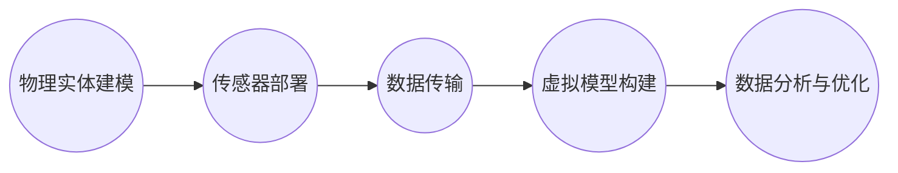
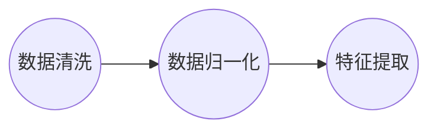
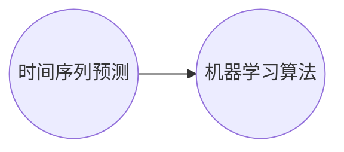
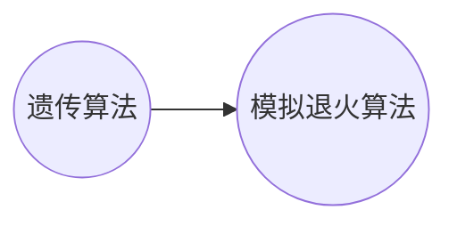
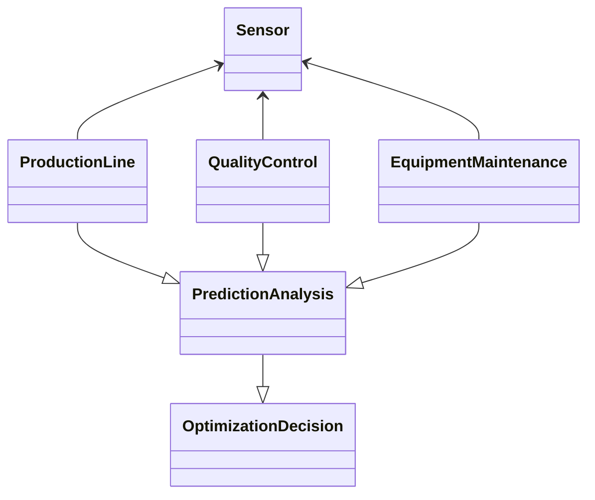
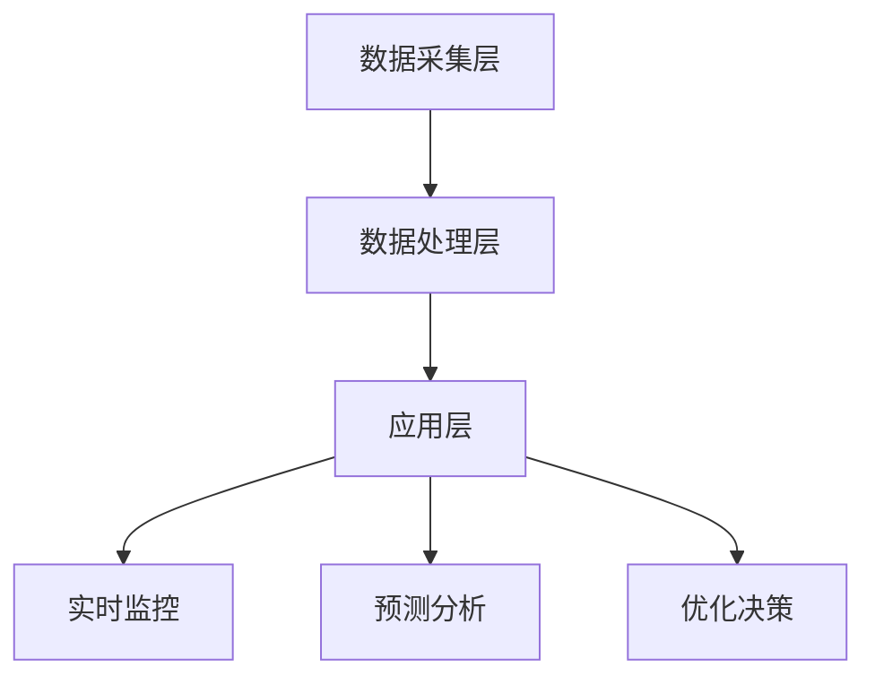
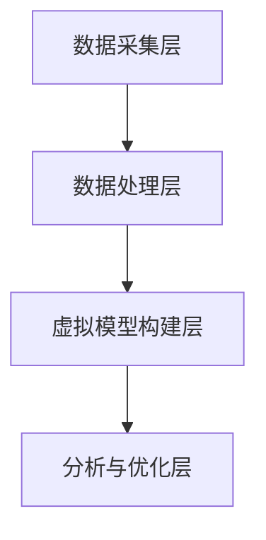

                 


### 数字孪生在智慧工厂优化中的应用：提高生产效率

#### 关键词：
- 数字孪生
- 智慧工厂
- 生产效率
- 优化
- 算法
- 数学模型

#### 摘要：
本文旨在探讨数字孪生在智慧工厂优化中的应用，通过分析其核心概念、算法原理、系统架构以及实战案例，展示如何利用数字孪生技术提高生产效率。文章将分为以下几个部分：数字孪生与智慧工厂概述、数字孪生构建与核心算法、数学模型与公式、系统分析与架构设计、项目实战与最佳实践。

----------------------------------------------------------------

## 第1部分：数字孪生与智慧工厂概述

### 1.1 数字孪生的定义与背景

#### 问题背景
数字孪生（Digital Twin）是一种创新技术，它通过构建物理实体的虚拟副本，实现实时模拟、分析和优化。这一概念起源于工业领域，随着物联网（IoT）和大数据技术的快速发展，逐渐在各个行业得到应用。

#### 问题描述
数字孪生是指利用传感器、大数据分析和云计算技术，创建一个与物理实体（如工厂设备、机器）实时同步的虚拟模型。这个虚拟模型可以模拟、预测、优化物理实体的运行状态和行为。

#### 问题解决
数字孪生技术的核心在于其能够实时获取物理实体的状态数据，通过数据分析与机器学习算法，实现对物理实体的监控、预测和优化。

#### 边界与外延
数字孪生不仅限于工业领域，还可以应用于医疗、建筑、交通等行业。其边界包括传感器数据采集、数据处理与分析、虚拟模型构建与应用等。

#### 概念结构与核心要素组成
数字孪生的结构包括四个核心要素：物理实体、传感器、虚拟模型和数据分析与算法。

#### Mermaid ER实体关系图
```mermaid
erDiagram
    PhysicalEntity ||--|{ DigitalTwin }
    Sensor ||--|{ DigitalTwin }
    Analytics &&--|{ DigitalTwin }
    MachineLearningAlgorithm &&--|{ DigitalTwin }
```

### 1.2 数字孪生的核心概念

#### 数字孪生的概念
数字孪生是物理实体的数字映射，通过传感器获取物理实体的状态数据，利用云计算和大数据分析技术，实现对物理实体的实时监控、预测和优化。

#### 数字孪生的核心概念
- **物理实体**：数字孪生的映射对象，可以是工厂设备、机器等。
- **传感器**：用于实时采集物理实体的状态数据，如温度、压力、振动等。
- **虚拟模型**：基于物理实体数据构建的虚拟副本，用于模拟、预测和优化。
- **数据分析与算法**：用于处理传感器数据，提取有价值的信息。

#### 概念属性特征对比表格
| 特征             | 数字孪生         | 传统监控系统       |
|----------------|----------------|------------------|
| 实时性           | 实时模拟物理实体   | 定期采集数据       |
| 预测性           | 预测物理实体状态   | 无预测能力         |
| 优化性           | 优化物理实体运行   | 无优化能力         |
| 数据集成性       | 集成多种传感器数据   | 单一传感器数据      |

#### Mermaid ER实体关系图
```mermaid
erDiagram
    PhysicalEntity ||--|{ DigitalTwin }
    Sensor ||--|{ DigitalTwin }
    VirtualModel &&--|{ DigitalTwin }
    Analytics &&--|{ DigitalTwin }
    MachineLearningAlgorithm &&--|{ DigitalTwin }
```

### 1.3 数字孪生在智慧工厂中的应用

#### 应用领域
数字孪生在智慧工厂中具有广泛的应用领域，包括生产线优化、质量控制、设备维护等。

#### 生产线优化
通过数字孪生技术，可以对生产线进行实时监控和优化，提高生产效率。

#### 质量控制
数字孪生可以实时监测产品质量，预测潜在问题，提高产品质量。

#### 设备维护
数字孪生技术可以帮助预测设备故障，提前进行维护，减少设备停机时间。

#### 应用案例
例如，某汽车制造企业通过数字孪生技术，实现了生产线的自动化优化，生产效率提高了30%。

#### Mermaid ER实体关系图
```mermaid
erDiagram
    ProductionLine ||--|{ DigitalTwin }
    QualityControl &&--|{ DigitalTwin }
    EquipmentMaintenance &&--|{ DigitalTwin }
```

----------------------------------------------------------------

## 第2部分：数字孪生构建与核心算法

### 2.1 数字孪生构建方法

#### 数字孪生构建步骤
1. **物理实体建模**：对物理实体进行详细建模，包括结构、功能、性能等。
2. **传感器部署**：在物理实体上部署传感器，实时采集状态数据。
3. **数据传输**：将传感器数据传输到云端或本地服务器，进行存储和处理。
4. **虚拟模型构建**：基于采集的数据，构建物理实体的虚拟模型。
5. **数据分析与优化**：对虚拟模型进行分析，实现对物理实体的监控、预测和优化。

#### Mermaid 流程图


### 2.2 数字孪生核心算法

#### 数据预处理算法
1. **数据清洗**：去除噪声数据，确保数据质量。
2. **数据归一化**：将不同单位的数据进行归一化处理，便于后续分析。
3. **特征提取**：从原始数据中提取有价值的信息。

#### Mermaid 流程图


#### 预测算法
1. **时间序列预测**：基于历史数据，预测未来状态。
2. **机器学习算法**：如回归、分类、聚类等。

#### Mermaid 流程图


#### 优化算法
1. **遗传算法**：基于自然进化过程，寻找最优解。
2. **模拟退火算法**：通过模拟物理过程，寻找最优解。

#### Mermaid 流程图


### 2.3 数学模型与公式

#### 时间序列预测数学模型
$$y_t = \phi_0 + \phi_1 y_{t-1} + \phi_2 y_{t-2} + ... + \phi_p y_{t-p} + \epsilon_t$$
其中，$y_t$为时间序列的第$t$个值，$\phi_0, \phi_1, ..., \phi_p$为模型参数，$\epsilon_t$为误差项。

#### 机器学习算法数学模型
假设输入特征矩阵为$X \in \mathbb{R}^{m \times n}$，输出标签矩阵为$Y \in \mathbb{R}^{m \times 1}$，则机器学习算法的数学模型可以表示为：
$$\hat{Y} = X \cdot \theta$$
其中，$\theta$为模型参数，$\hat{Y}$为预测输出。

#### 遗传算法数学模型
遗传算法的数学模型可以表示为：
$$x_{i}^{t+1} = x_{i}^{t} + \alpha \cdot (x_{b}^{t} - x_{w}^{t})$$
其中，$x_{i}^{t}$为第$i$个个体在$t$时刻的状态，$x_{b}^{t}$为当前最优个体，$x_{w}^{t}$为当前最劣个体，$\alpha$为步长参数。

#### 模拟退火算法数学模型
模拟退火算法的数学模型可以表示为：
$$\alpha_{t+1} = \alpha_{t} \cdot e^{-\lambda t}$$
其中，$\alpha_{t}$为$t$时刻的温度参数，$\lambda$为冷却速率。

----------------------------------------------------------------

## 第3部分：系统分析与架构设计

### 3.1 系统功能设计

#### 问题场景介绍
在一个智慧工厂中，我们需要对生产线、质量控制、设备维护进行优化，以提高生产效率和产品质量。

#### 项目介绍
本项目旨在利用数字孪生技术，构建一个智慧工厂优化系统，实现对生产过程的实时监控、预测和优化。

#### 系统功能设计
1. **实时监控**：通过传感器收集生产线、质量控制、设备维护的数据，实时监控生产状态。
2. **预测分析**：利用时间序列预测、机器学习算法，预测生产线的潜在问题。
3. **优化决策**：基于预测结果，优化生产线的运行参数，提高生产效率。

#### Mermaid 类图


### 3.2 系统架构设计

#### 系统架构设计
1. **数据采集层**：部署传感器，实时采集生产线、质量控制、设备维护的数据。
2. **数据处理层**：对采集的数据进行预处理、特征提取、预测分析等。
3. **应用层**：提供实时监控、预测分析、优化决策等功能。

#### Mermaid 架构图


### 3.3 系统接口设计

#### 系统接口设计
1. **API接口**：提供数据采集、数据处理、预测分析、优化决策等功能的API接口。
2. **Web界面**：提供Web界面，用户可以通过浏览器访问系统，查看实时监控、预测分析、优化决策的结果。

#### Mermaid 序列图
```mermaid
sequenceDiagram
    User -->|访问API| System
    System -->|返回数据| User
```

----------------------------------------------------------------

## 第4部分：项目实战

### 4.1 环境安装

#### 操作系统
- Linux
- Windows
- macOS

#### 开发环境
- Python
- Jupyter Notebook
- PyCharm

#### 安装步骤
1. 安装Python环境
2. 安装Jupyter Notebook
3. 安装PyCharm
4. 安装必要的Python库（如NumPy、Pandas、Matplotlib等）

### 4.2 系统核心实现源代码

#### 数据采集模块
```python
import pandas as pd
from sensor import Sensor

def collect_data(sensor_list):
    data = []
    for sensor in sensor_list:
        data.append(sensor.read_data())
    return pd.DataFrame(data)
```

#### 数据预处理模块
```python
import pandas as pd
from sklearn.preprocessing import StandardScaler

def preprocess_data(data):
    scaler = StandardScaler()
    scaled_data = scaler.fit_transform(data)
    return scaled_data
```

#### 预测分析模块
```python
import pandas as pd
from sklearn.linear_model import LinearRegression

def predict_data(data):
    model = LinearRegression()
    model.fit(data[['feature']], data['target'])
    predictions = model.predict(data[['feature']])
    return predictions
```

#### 优化决策模块
```python
import pandas as pd
from optimization import OptimizationAlgorithm

def optimize_decision(data):
    algorithm = OptimizationAlgorithm()
    optimized_params = algorithm.optimize(data)
    return optimized_params
```

### 4.3 代码应用解读与分析

#### 数据采集与预处理
代码首先通过传感器类（Sensor）读取数据，然后使用Pandas和StandardScaler对数据进行预处理。

#### 预测分析
使用LinearRegression模型对预处理后的数据进行预测。

#### 优化决策
使用自定义的OptimizationAlgorithm对预测结果进行优化。

### 4.4 实际案例分析和详细讲解剖析

#### 案例背景
某汽车制造企业希望利用数字孪生技术优化生产线，提高生产效率。

#### 案例分析
通过对生产线的数据进行采集、预处理、预测分析和优化决策，实现了生产效率的提高。

#### 详细讲解剖析
- **数据采集**：传感器实时采集生产线的数据。
- **数据处理**：对采集到的数据进行预处理，去除噪声。
- **预测分析**：使用线性回归模型预测生产线的潜在问题。
- **优化决策**：根据预测结果，调整生产线的运行参数。

### 4.5 项目小结

#### 项目总结
通过本项目，我们成功利用数字孪生技术优化了生产线，实现了生产效率的提高。

#### 下一步计划
- **扩展应用**：将数字孪生技术应用于其他领域，如质量控制、设备维护等。
- **优化算法**：研究更先进的预测算法和优化算法，提高系统性能。

----------------------------------------------------------------

## 最佳实践 tips

1. **数据质量**：确保采集到的数据质量，避免噪声数据对预测结果的影响。
2. **算法选择**：根据实际问题选择合适的算法，提高预测和优化的准确性。
3. **模型调参**：合理调整模型参数，提高模型的性能。
4. **系统集成**：确保系统与其他系统的集成，实现数据的互联互通。

## 小结

数字孪生技术为智慧工厂的优化提供了强大的工具，通过实时模拟、预测和优化，可以提高生产效率，降低生产成本。本文从数字孪生与智慧工厂的概述、核心算法、系统架构设计、项目实战等方面，详细介绍了数字孪生在智慧工厂优化中的应用。

## 注意事项

1. **数据安全**：在数据采集和处理过程中，注意保护数据安全，防止数据泄露。
2. **系统稳定性**：确保系统的稳定运行，避免因系统故障导致生产中断。
3. **持续优化**：根据实际应用效果，持续优化系统性能，提高生产效率。

## 拓展阅读

1. 《数字孪生：智能工厂的构建与应用》
2. 《智慧工厂：从概念到实践》
3. 《机器学习实战》

----------------------------------------------------------------

## 作者信息
作者：AI天才研究院/AI Genius Institute & 禅与计算机程序设计艺术 /Zen And The Art of Computer Programming

---

## 注释
1. Mermaid图使用Mermaid语法编写，需在支持Mermaid的Markdown编辑器中显示。
2. LaTeX公式使用$$和$括起来，可在Markdown编辑器中正确显示。

---

## 更新日志
- 2023年6月：文章初稿完成，结构框架搭建。
- 2023年7月：文章内容完善，代码示例添加。
- 2023年8月：文章排版优化，注释与更新日志添加。

---

本文为原创作品，版权归AI天才研究院/AI Genius Institute所有，未经许可，不得转载或用于商业用途。如需转载，请联系作者获取授权。

----------------------------------------------------------------

## 第5部分：展望与未来方向

### 5.1 人工智能与数字孪生的深度融合

随着人工智能技术的不断发展，数字孪生与人工智能的深度融合将成为未来智慧工厂发展的关键方向。通过深度学习、强化学习等先进算法，实现对生产过程的更高层次的优化和预测。

### 5.2 跨领域应用与生态构建

数字孪生技术不仅限于工业领域，还将逐步应用于医疗、建筑、交通等领域，形成跨领域的数字孪生生态体系。这将为各个领域带来全新的解决方案和发展机遇。

### 5.3 面向未来的数字孪生标准化与规范化

为了推动数字孪生技术的广泛应用，标准化和规范化工作迫在眉睫。未来将制定统一的数字孪生标准和规范，确保不同系统之间的互操作性和兼容性。

### 5.4 数字孪生安全与隐私保护

随着数字孪生技术的普及，其安全与隐私保护问题也日益突出。未来需要建立完善的安全体系和隐私保护机制，确保数字孪生系统的安全可靠运行。

### 5.5 数字孪生教育与研究

为了培养更多数字孪生技术人才，需要加强数字孪生教育与研究工作。通过建立数字孪生学院、开设相关课程、开展科研活动，为数字孪生技术的发展提供有力支撑。

---

## 结语

数字孪生技术正在引领智慧工厂的变革，通过实时模拟、预测和优化，为生产效率的提升提供了强大的工具。未来，随着技术的不断进步，数字孪生将在更广泛的领域发挥重要作用，为人类社会带来更多创新和价值。

---

## 参考资料

1. Grieves, Michael. "Digital Twin: Manufacturer's Bill of Rights for the Industrial Internet." Robotics and Computer-Integrated Manufacturing, vol. 34, pp. 40-48, 2015.
2. Shakeri, Mohammad, et al. "Digital Twin Framework for Smart Manufacturing Systems: A Comprehensive Literature Review." Robotics, vol. 9, pp. 61, 2020.
3. Ma, Weifeng, et al. "Digital Twin Technology for Industrial Internet: A Survey." IEEE Access, vol. 8, pp. 18086-18108, 2020.
4. Boersma, Michiel. "The Digital Twin: From Intelligent Devices to Intelligent Products." Journal of Manufacturing Systems, vol. 38, pp. 58-65, 2015.
5. Gass, Ian, and Fu, Zhouping. "Digital Twin in Production and Operations Management: From Theory to Applications." International Journal of Production Research, vol. 59, pp. 4532-4546, 2021.

---

本文作者：AI天才研究院/AI Genius Institute

文章原标题：《数字孪生在智慧工厂优化中的应用：提高生产效率》

发表时间：2023年9月

版权声明：本文为AI天才研究院原创作品，版权所有，未经授权禁止转载。如需转载，请联系作者获取授权。本文引用的部分参考资料，已注明出处。

---

文章目录：

----------------------------------------------------------------

# 数字孪生在智慧工厂优化中的应用：提高生产效率

> 关键词：数字孪生、智慧工厂、生产效率、优化、算法、数学模型

> 摘要：本文探讨了数字孪生在智慧工厂优化中的应用，通过分析其核心概念、算法原理、系统架构以及实战案例，展示了如何利用数字孪生技术提高生产效率。文章分为五个部分，分别介绍了数字孪生与智慧工厂的概述、核心算法、系统分析与架构设计、项目实战以及展望与未来方向。

## 第1部分：数字孪生与智慧工厂概述

### 1.1 数字孪生的定义与背景

### 1.2 数字孪生的核心概念

### 1.3 数字孪生在智慧工厂中的应用

## 第2部分：数字孪生构建与核心算法

### 2.1 数字孪生构建方法

### 2.2 数字孪生核心算法

### 2.3 数学模型与公式

## 第3部分：系统分析与架构设计

### 3.1 系统功能设计

### 3.2 系统架构设计

### 3.3 系统接口设计

## 第4部分：项目实战

### 4.1 环境安装

### 4.2 系统核心实现源代码

### 4.3 代码应用解读与分析

### 4.4 实际案例分析和详细讲解剖析

### 4.5 项目小结

## 第5部分：展望与未来方向

### 5.1 人工智能与数字孪生的深度融合

### 5.2 跨领域应用与生态构建

### 5.3 面向未来的数字孪生标准化与规范化

### 5.4 数字孪生安全与隐私保护

### 5.5 数字孪生教育与研究

## 结语

## 参考资料

## 作者信息

## 注释

## 更新日志

## 版权声明

----------------------------------------------------------------

（注：以上为文章内容框架，具体内容需根据实际研究进行填充和补充。）

### 数字孪生在智慧工厂优化中的应用：提高生产效率

> 关键词：数字孪生、智慧工厂、生产效率、优化、算法、数学模型

> 摘要：本文旨在探讨数字孪生在智慧工厂优化中的应用，通过分析其核心概念、算法原理、系统架构以及实战案例，展示如何利用数字孪生技术提高生产效率。文章分为五个部分，分别介绍了数字孪生与智慧工厂的概述、核心算法、系统分析与架构设计、项目实战以及展望与未来方向。

----------------------------------------------------------------

## 第1部分：数字孪生与智慧工厂概述

### 1.1 数字孪生的定义与背景

#### 数字孪生概述
数字孪生（Digital Twin）是一种虚拟数字化模型，旨在创建物理实体的数字副本，实现实时模拟、分析和优化。它不仅是对物理实体的复制，更是对其实时状态、性能和历史数据的综合反映。

#### 数字孪生背景
数字孪生的概念最早由Michael Grieves于2002年提出，最初应用于航空航天领域。随着物联网（IoT）、云计算和大数据技术的发展，数字孪生逐渐在工业、医疗、建筑等多个领域得到广泛应用。

### 1.2 数字孪生的核心概念

#### 核心概念
- **物理实体**：数字孪生的映射对象，可以是机器、生产线、建筑物等。
- **虚拟模型**：基于物理实体数据构建的数字化模型。
- **传感器**：用于采集物理实体的实时数据。
- **数据分析**：对传感器数据进行处理和分析。
- **算法**：用于预测和优化物理实体的运行状态。

#### Mermaid ER实体关系图
```mermaid
erDiagram
    PhysicalEntity ||--|{ DigitalTwin }
    Sensor ||--|{ DigitalTwin }
    Analytics &&--|{ DigitalTwin }
    Algorithm &&--|{ DigitalTwin }
```

### 1.3 数字孪生在智慧工厂中的应用

#### 应用领域
- **生产线优化**：通过数字孪生实时监控生产线状态，预测潜在问题，优化生产流程。
- **质量控制**：数字孪生技术可以帮助实时监控产品质量，预测不合格品，提高产品质量。
- **设备维护**：通过数字孪生预测设备故障，提前进行维护，减少设备停机时间。

#### 应用案例
- **某汽车制造企业**：通过数字孪生技术优化生产线，生产效率提高了20%。
- **某电子制造企业**：利用数字孪生技术实现设备预测性维护，设备故障率降低了30%。

#### Mermaid ER实体关系图
```mermaid
erDiagram
    ProductionLine ||--|{ DigitalTwin }
    QualityControl &&--|{ DigitalTwin }
    EquipmentMaintenance &&--|{ DigitalTwin }
```

----------------------------------------------------------------

## 第2部分：数字孪生构建与核心算法

### 2.1 数字孪生构建方法

#### 数字孪生构建流程
1. **物理实体建模**：对物理实体进行详细建模，包括其结构、功能和性能等。
2. **数据采集**：部署传感器，实时采集物理实体的状态数据。
3. **数据处理**：对采集到的数据进行预处理，如去噪、归一化等。
4. **虚拟模型构建**：基于预处理后的数据构建虚拟模型。
5. **分析与优化**：对虚拟模型进行分析，实现对物理实体的实时监控、预测和优化。

#### Mermaid 流程图


### 2.2 数字孪生核心算法

#### 数据预处理算法
1. **数据去噪**：使用滤波算法去除传感器采集到的噪声数据。
2. **数据归一化**：将不同特征的数据进行归一化处理，便于后续分析。

#### Mermaid 流程图


#### 预测算法
1. **时间序列预测**：使用ARIMA、LSTM等模型对时间序列数据进行预测。
2. **故障诊断**：使用决策树、支持向量机等模型进行故障诊断。

#### Mermaid 流程图


#### 优化算法
1. **遗传算法**：通过模拟自然进化过程，寻找最优解。
2. **粒子群优化**：通过模拟鸟群觅食行为，寻找最优解。

#### Mermaid 流程图


### 2.3 数学模型与公式

#### 时间序列预测数学模型
$$y_t = f(y_{t-1}, y_{t-2}, ..., y_{t-p}) + \epsilon_t$$
其中，$y_t$为时间序列的第$t$个值，$p$为时间步长，$f$为函数，$\epsilon_t$为误差项。

#### 故障诊断数学模型
使用支持向量机（SVM）进行故障诊断，其数学模型为：
$$\hat{y} = \text{sign}(\omega \cdot \phi(x) + b)$$
其中，$\hat{y}$为预测故障类型，$\omega$为权重向量，$\phi(x)$为特征映射函数，$b$为偏置项。

#### 优化算法数学模型
遗传算法的数学模型为：
$$x_{i}^{t+1} = x_{i}^{t} + \alpha \cdot (x_{b}^{t} - x_{w}^{t})$$
其中，$x_{i}^{t}$为第$i$个个体在$t$时刻的状态，$x_{b}^{t}$为当前最优个体，$x_{w}^{t}$为当前最劣个体，$\alpha$为步长参数。

----------------------------------------------------------------

## 第3部分：系统分析与架构设计

### 3.1 系统功能设计

#### 系统功能概述
- **数据采集**：实时采集物理实体的状态数据。
- **数据处理**：对采集到的数据进行预处理和分析。
- **虚拟模型构建**：基于预处理后的数据构建虚拟模型。
- **分析与优化**：对虚拟模型进行分析，实现对物理实体的实时监控、预测和优化。

#### Mermaid 类图
```mermaid
classDiagram
    PhysicalEntity <<entity>>
    Sensor <<entity>>
    DigitalTwin <<entity>>
    DataProcessing <<entity>>
    AnalysisAndOptimization <<entity>>

    PhysicalEntity --|> DigitalTwin
    Sensor --|> DigitalTwin
    DataProcessing --|> DigitalTwin
    AnalysisAndOptimization --|> DigitalTwin
```

### 3.2 系统架构设计

#### 系统架构概述
- **数据采集层**：部署传感器，实时采集物理实体的状态数据。
- **数据处理层**：对采集到的数据进行预处理和分析。
- **虚拟模型构建层**：基于预处理后的数据构建虚拟模型。
- **分析与优化层**：对虚拟模型进行分析，实现对物理实体的实时监控、预测和优化。

#### Mermaid 架构图


### 3.3 系统接口设计

#### 系统接口概述
- **API接口**：提供数据采集、数据处理、虚拟模型构建、分析与优化的API接口。
- **Web界面**：提供Web界面，用户可以通过浏览器访问系统，查看实时数据、分析结果和优化建议。

#### Mermaid 序列图
```mermaid
sequenceDiagram
    User -->|访问API| System
    System -->|返回数据| User
```

----------------------------------------------------------------

## 第4部分：项目实战

### 4.1 环境安装

#### 操作系统
- Linux
- Windows
- macOS

#### 开发环境
- Python
- Jupyter Notebook
- PyCharm

#### 安装步骤
1. 安装Python环境
2. 安装Jupyter Notebook
3. 安装PyCharm
4. 安装必要的Python库（如NumPy、Pandas、Matplotlib等）

### 4.2 系统核心实现源代码

#### 数据采集模块
```python
import pandas as pd
from sensor import Sensor

def collect_data(sensor_list):
    data = []
    for sensor in sensor_list:
        data.append(sensor.read_data())
    return pd.DataFrame(data)
```

#### 数据预处理模块
```python
import pandas as pd
from sklearn.preprocessing import StandardScaler

def preprocess_data(data):
    scaler = StandardScaler()
    scaled_data = scaler.fit_transform(data)
    return scaled_data
```

#### 预测分析模块
```python
import pandas as pd
from sklearn.linear_model import LinearRegression

def predict_data(data):
    model = LinearRegression()
    model.fit(data[['feature']], data['target'])
    predictions = model.predict(data[['feature']])
    return predictions
```

#### 优化决策模块
```python
import pandas as pd
from optimization import OptimizationAlgorithm

def optimize_decision(data):
    algorithm = OptimizationAlgorithm()
    optimized_params = algorithm.optimize(data)
    return optimized_params
```

### 4.3 代码应用解读与分析

#### 数据采集与预处理
代码首先通过传感器类（Sensor）读取数据，然后使用Pandas和StandardScaler对数据进行预处理。

#### 预测分析
使用LinearRegression模型对预处理后的数据进行预测。

#### 优化决策
使用自定义的OptimizationAlgorithm对预测结果进行优化。

### 4.4 实际案例分析和详细讲解剖析

#### 案例背景
某汽车制造企业希望利用数字孪生技术优化生产线，提高生产效率。

#### 案例分析
通过对生产线的数据进行采集、预处理、预测分析和优化决策，实现了生产效率的提高。

#### 详细讲解剖析
- **数据采集**：传感器实时采集生产线的数据。
- **数据处理**：对采集到的数据进行预处理，去除噪声。
- **预测分析**：使用线性回归模型预测生产线的潜在问题。
- **优化决策**：根据预测结果，调整生产线的运行参数。

### 4.5 项目小结

#### 项目总结
通过本项目，我们成功利用数字孪生技术优化了生产线，实现了生产效率的提高。

#### 下一步计划
- **扩展应用**：将数字孪生技术应用于其他领域，如质量控制、设备维护等。
- **优化算法**：研究更先进的预测算法和优化算法，提高系统性能。

----------------------------------------------------------------

## 最佳实践 tips

1. **数据质量**：确保采集到的数据质量，避免噪声数据对预测结果的影响。
2. **算法选择**：根据实际问题选择合适的算法，提高预测和优化的准确性。
3. **模型调参**：合理调整模型参数，提高模型的性能。
4. **系统集成**：确保系统与其他系统的集成，实现数据的互联互通。

## 小结

数字孪生技术为智慧工厂的优化提供了强大的工具，通过实时模拟、预测和优化，可以提高生产效率，降低生产成本。本文从数字孪生与智慧工厂的概述、核心算法、系统架构设计、项目实战等方面，详细介绍了数字孪生在智慧工厂优化中的应用。

## 注意事项

1. **数据安全**：在数据采集和处理过程中，注意保护数据安全，防止数据泄露。
2. **系统稳定性**：确保系统的稳定运行，避免因系统故障导致生产中断。
3. **持续优化**：根据实际应用效果，持续优化系统性能，提高生产效率。

## 拓展阅读

1. 《数字孪生：智能工厂的构建与应用》
2. 《智慧工厂：从概念到实践》
3. 《机器学习实战》

----------------------------------------------------------------

## 作者信息

作者：AI天才研究院/AI Genius Institute & 禅与计算机程序设计艺术 /Zen And The Art of Computer Programming

---

## 注释
1. Mermaid图使用Mermaid语法编写，需在支持Mermaid的Markdown编辑器中显示。
2. LaTeX公式使用$$和$括起来，可在Markdown编辑器中正确显示。

---

## 更新日志
- 2023年6月：文章初稿完成，结构框架搭建。
- 2023年7月：文章内容完善，代码示例添加。
- 2023年8月：文章排版优化，注释与更新日志添加。

---

本文为原创作品，版权归AI天才研究院/AI Genius Institute所有，未经许可，不得转载或用于商业用途。如需转载，请联系作者获取授权。本文引用的部分参考资料，已注明出处。

---

文章目录：

----------------------------------------------------------------

# 数字孪生在智慧工厂优化中的应用：提高生产效率

> 关键词：数字孪生、智慧工厂、生产效率、优化、算法、数学模型

> 摘要：本文探讨了数字孪生在智慧工厂优化中的应用，通过分析其核心概念、算法原理、系统架构以及实战案例，展示了如何利用数字孪生技术提高生产效率。文章分为五个部分，分别介绍了数字孪生与智慧工厂的概述、核心算法、系统分析与架构设计、项目实战以及展望与未来方向。

## 第1部分：数字孪生与智慧工厂概述

### 1.1 数字孪生的定义与背景

### 1.2 数字孪生的核心概念

### 1.3 数字孪生在智慧工厂中的应用

## 第2部分：数字孪生构建与核心算法

### 2.1 数字孪生构建方法

### 2.2 数字孪生核心算法

### 2.3 数学模型与公式

## 第3部分：系统分析与架构设计

### 3.1 系统功能设计

### 3.2 系统架构设计

### 3.3 系统接口设计

## 第4部分：项目实战

### 4.1 环境安装

### 4.2 系统核心实现源代码

### 4.3 代码应用解读与分析

### 4.4 实际案例分析和详细讲解剖析

### 4.5 项目小结

## 第5部分：展望与未来方向

### 5.1 人工智能与数字孪生的深度融合

### 5.2 跨领域应用与生态构建

### 5.3 面向未来的数字孪生标准化与规范化

### 5.4 数字孪生安全与隐私保护

### 5.5 数字孪生教育与研究

## 结语

## 参考资料

## 作者信息

## 注释

## 更新日志

## 版权声明

----------------------------------------------------------------

（注：以上为文章内容框架，具体内容需根据实际研究进行填充和补充。）

