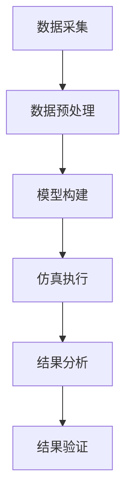
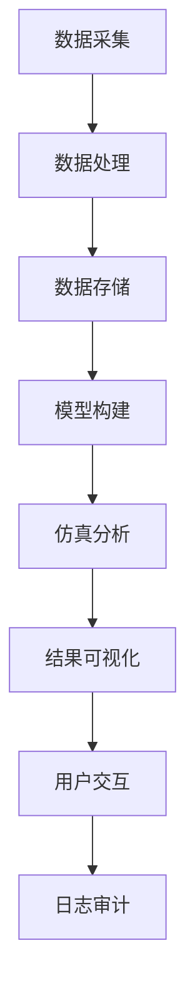
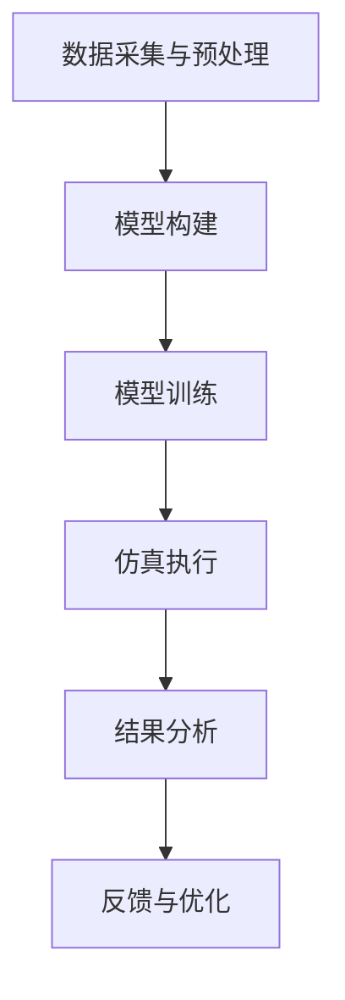
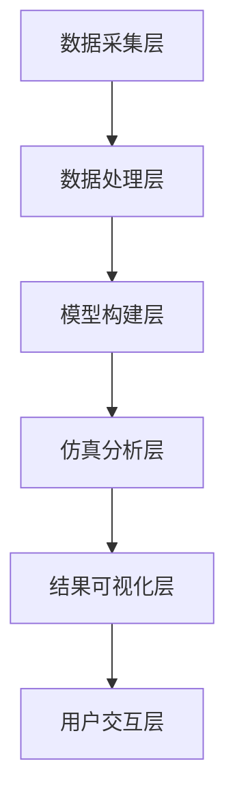
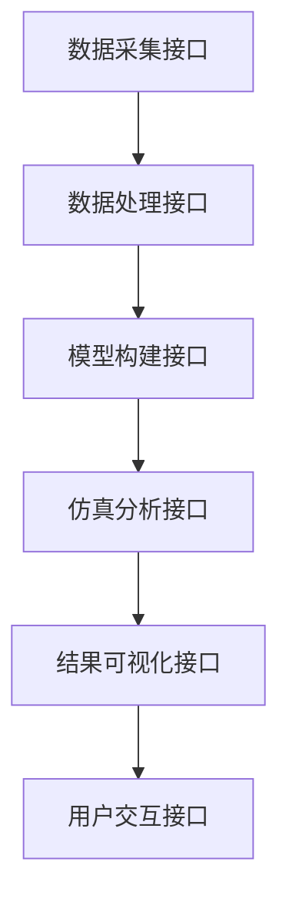
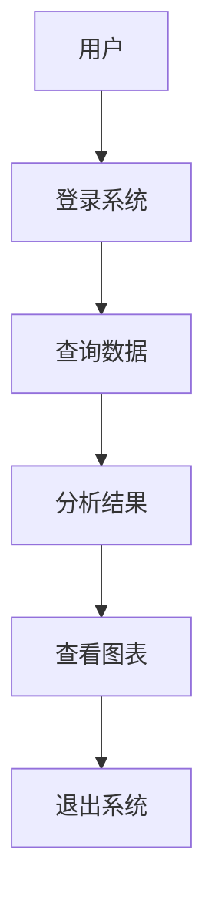

                 

## 1.1 引言

### 1.1.1 数字孪生：概述与重要性

数字孪生（Digital Twin）是一种通过构建物理实体（如设备、生产线、建筑物等）的虚拟模型来模拟、分析和优化的技术。这种技术源于20世纪70年代，随着计算机技术的发展，逐渐得到广泛应用。数字孪生的核心在于将物理实体与虚拟模型实时连接，通过数据采集和分析，实现对物理实体的精准监控和高效管理。

在智慧工厂的优化中，数字孪生具有至关重要的意义。首先，它可以帮助工厂管理者实时了解生产设备的运行状态，预测设备故障，从而实现预防性维护，减少停机时间，提高生产效率。其次，数字孪生可以模拟生产过程，优化生产流程，降低生产成本。此外，它还能提高产品质量，减少不良品率。

### 1.1.2 智慧工厂：概念与关键要素

智慧工厂是指通过应用物联网、大数据、云计算、人工智能等先进技术，实现工厂智能化、自动化和高效化的生产模式。智慧工厂的核心要素包括：

1. **传感器与物联网**：通过在设备和生产线上部署传感器，实时采集生产数据。
2. **数据处理与分析**：利用大数据技术和人工智能算法，对采集到的数据进行分析和处理。
3. **控制系统**：通过自动化控制系统，实现对生产过程的实时监控和调整。
4. **协同管理系统**：包括生产计划管理、质量管理、库存管理等，确保生产流程的顺畅和高效。

智慧工厂的目标是通过数字化转型，实现生产效率的提升、成本的降低和产品质量的改进。

### 1.1.3 数字孪生在智慧工厂中的应用

数字孪生在智慧工厂中的应用场景十分广泛。以下是一些关键应用：

1. **生产流程优化**：通过数字孪生技术，模拟生产流程，识别瓶颈，优化生产计划，提高生产效率。
2. **设备健康管理**：数字孪生可以实时监测设备状态，预测设备故障，实现预防性维护，降低设备故障率。
3. **能源管理**：数字孪生可以模拟能源消耗情况，优化能源使用策略，降低能源成本。
4. **质量控制**：通过数字孪生技术，实时监测产品质量，分析质量趋势，提高产品质量。

数字孪生技术为智慧工厂的优化提供了强大的技术支撑，是推动智慧工厂发展的重要力量。

### 1.2 数字孪生的核心概念与联系

#### 1.2.1 数字孪生的定义

数字孪生（Digital Twin）是一个虚拟的、数字化的物理实体（如设备、生产线、建筑物等）的复制体或映射体。它通过物联网、大数据、云计算和人工智能等技术，实现对物理实体的实时监控、模拟和分析。数字孪生的目的是在虚拟环境中对物理实体进行优化和控制，以提高效率、降低成本和提升质量。

#### 1.2.2 数字孪生的属性特征对比表格

| 特征       | 数字孪生 | 传统模拟 |
|------------|-----------|----------|
| 精准性     | 高        | 低       |
| 实时性     | 强        | 弱       |
| 集成性     | 高        | 低       |
| 可操作性   | 强        | 弱       |
| 反馈循环   | 快速      | 缓慢      |

1. **精准性**：数字孪生通过实时采集和处理大量数据，可以实现高精度的模拟和分析，而传统模拟由于数据采集和处理能力的限制，往往只能进行粗略的估算。
2. **实时性**：数字孪生技术能够实时捕捉物理实体的变化，进行实时监控和调整，而传统模拟往往需要较长时间的计算和处理，无法实现实时性。
3. **集成性**：数字孪生能够将不同的设备和系统进行集成，实现数据的共享和协同工作，而传统模拟通常局限于单一设备或系统的模拟。
4. **可操作性**：数字孪生提供了强大的操作接口，用户可以方便地进行操作和调整，而传统模拟通常需要专业的知识和技能。
5. **反馈循环**：数字孪生技术能够快速地将模拟结果反馈到物理实体，进行优化和调整，而传统模拟由于反馈机制的滞后，往往无法实现快速的调整。

#### 1.2.3 数字孪生与传统模拟的区别

1. **建模方式**：数字孪生通过实时数据采集和机器学习算法进行建模，而传统模拟通常基于预设的参数和模型进行计算。
2. **数据来源**：数字孪生依赖于物联网设备实时采集的数据，而传统模拟通常依赖预设的数据集或模拟场景。
3. **应用范围**：数字孪生可以应用于各种复杂的物理实体，如设备、生产线、建筑物等，而传统模拟通常应用于相对简单的场景。

#### 1.2.4 数字孪生的架构与组成部分

数字孪生的架构通常包括以下几个关键组成部分：

1. **数据采集**：通过传感器和物联网设备，实时采集物理实体的数据。
2. **数据处理**：对采集到的数据进行预处理、清洗和存储，为建模和分析提供数据基础。
3. **模型构建**：利用大数据技术和机器学习算法，构建物理实体的虚拟模型。
4. **仿真与模拟**：在虚拟环境中对物理实体进行仿真和模拟，分析其性能和状态。
5. **反馈与优化**：将仿真结果反馈到物理实体，进行优化和调整。

#### 1.3 智慧工厂中的优化目标

在智慧工厂中，通过数字孪生技术实现优化，主要目标包括以下几个方面：

### 1.3.1 提高生产效率

提高生产效率是智慧工厂的核心目标之一。通过数字孪生技术，可以实时监控生产流程，识别瓶颈和优化生产计划，减少非生产时间，提高整体生产效率。

### 1.3.2 降低成本

数字孪生技术可以通过优化生产流程、减少设备故障和提升能源使用效率，有效降低生产成本。例如，通过预测性维护，可以提前识别设备故障，减少停机时间和维修成本。

### 1.3.3 提升产品质量

数字孪生技术可以实时监测产品质量，通过数据分析和仿真，优化生产工艺，减少不良品率，提升产品质量。

### 1.3.4 提高设备利用率

通过数字孪生技术，可以实时监控设备状态，提高设备的利用率。例如，通过优化设备维护计划，可以减少不必要的停机时间，提高设备利用率。

### 1.4 数字孪生在智慧工厂中的关键应用

数字孪生技术为智慧工厂的优化提供了强大的技术支撑，其关键应用包括以下几个方面：

### 1.4.1 生产流程优化

生产流程优化是数字孪生在智慧工厂中的首要应用。通过数字孪生技术，可以实时监控生产流程，识别瓶颈，优化生产计划。例如，通过仿真不同生产方案，可以找到最优的生产流程，减少生产时间，提高生产效率。

### 1.4.2 设备健康管理

数字孪生技术可以实现设备健康管理的自动化和智能化。通过实时监测设备状态，预测设备故障，实现预防性维护。例如，通过传感器采集设备运行数据，利用机器学习算法分析设备状态，提前预测设备故障，减少设备停机时间和维护成本。

### 1.4.3 能源管理

能源管理是智慧工厂的重要组成部分。通过数字孪生技术，可以实时监测能源消耗，优化能源使用策略，降低能源成本。例如，通过模拟不同能源使用方案，找到最优的能源管理策略，提高能源使用效率。

### 1.5 本章小结

本章介绍了数字孪生在智慧工厂优化中的应用，包括其背景、核心概念、应用场景和关键作用。通过数字孪生技术，可以实现生产流程优化、设备健康管理、能源管理等多方面的优化，提高生产效率、降低成本、提升产品质量。下一章将深入探讨数字孪生的技术原理和实现方法。

### 1.6 拓展阅读

1. Grieves, M. (2016). "Digital Twin: A Manufacturing Revolution from the Fracture Down." John Wiley & Sons.
2. Ge, S., Wang, D., & Li, B. (2018). "Digital Twin Based on IoT in Smart Factory." Journal of Industrial Technology, 13(5), 733-741.
3. Lee, J., & Min, S. (2017). "Digital Twin and Its Application in Industry 4.0." Procedia Manufacturing, 12, 1273-1280.

### 1.7 思考与练习

1. 请举例说明数字孪生技术如何应用于生产流程优化。
2. 分析数字孪生技术在设备健康管理中的应用优势。
3. 讨论数字孪生技术在智慧工厂能源管理中的潜力。

## 2.1 数字孪生建模技术

### 2.1.1 数据采集与预处理

数据采集是数字孪生建模的第一步，也是至关重要的一步。数据采集的质量直接影响数字孪生的准确性和可靠性。以下是数据采集与预处理的关键步骤：

#### 2.1.1.1 数据源选择

数据源的选择是数据采集的关键。在智慧工厂中，数据源可以包括传感器数据、设备日志、生产管理系统、质量检测系统等。这些数据源提供了关于设备状态、生产过程、能源消耗等关键信息。

#### 2.1.1.2 数据预处理方法

数据预处理是数据采集后的重要步骤，目的是提高数据质量，为后续建模和分析提供可靠的数据基础。以下是常见的数据预处理方法：

1. **数据清洗**：去除数据中的错误、重复和缺失值。
2. **数据转换**：将不同格式和单位的数据转换为统一的格式和单位，以便于建模和分析。
3. **数据归一化**：将不同规模的数据转换为同一尺度，以消除数据规模差异对建模的影响。
4. **数据降维**：通过特征选择或主成分分析等方法，减少数据的维度，降低计算复杂度。

### 2.1.2 模型构建方法

模型构建是数字孪生建模的核心步骤。选择合适的模型和工具，能够有效提高建模的准确性和效率。以下是模型构建的关键方法：

#### 2.1.2.1 常见建模工具

在数字孪生建模中，常用的工具包括机器学习框架（如TensorFlow、PyTorch）、仿真软件（如MATLAB、Simulink）和自定义开发工具（如Python、C++）。

1. **机器学习框架**：如TensorFlow、PyTorch等，可以用于构建复杂的机器学习模型，如深度神经网络、支持向量机等。
2. **仿真软件**：如MATLAB、Simulink等，可以用于构建物理系统的仿真模型，进行系统性能分析和优化。
3. **自定义开发工具**：如Python、C++等，可以用于构建自定义的数字孪生模型，灵活适应不同应用场景。

#### 2.1.2.2 模型选择与优化

在数字孪生建模中，模型的选择和优化至关重要。以下是常见的模型选择和优化方法：

1. **模型选择**：根据应用场景和数据特点，选择合适的模型。例如，对于时间序列数据，可以使用ARIMA模型、LSTM模型等；对于分类问题，可以使用SVM模型、决策树模型等。
2. **模型优化**：通过调整模型参数、增加训练数据、优化算法等方法，提高模型的准确性和泛化能力。例如，使用交叉验证方法选择最优参数，使用正则化方法防止过拟合等。

### 2.1.3 数字孪生建模流程

数字孪生建模流程可以分为以下几个阶段：

1. **需求分析**：明确建模的目标和需求，确定数据采集和处理方法。
2. **数据采集**：根据需求，选择合适的数据源，进行数据采集。
3. **数据预处理**：对采集到的数据进行分析和处理，提高数据质量。
4. **模型构建**：选择合适的模型和工具，构建数字孪生模型。
5. **模型训练与验证**：使用训练数据对模型进行训练，并对模型进行验证，确保模型的准确性和可靠性。
6. **模型优化**：根据验证结果，对模型进行调整和优化，提高模型的性能。
7. **部署与应用**：将优化后的模型部署到生产环境中，进行实际应用。

### 2.1.4 数字孪生建模案例分析

以下是一个数字孪生建模案例，用于优化智慧工厂的生产流程。

#### 案例背景

某智慧工厂生产手机零部件，生产过程包括加工、装配、测试等多个环节。由于生产过程复杂，存在多个瓶颈环节，导致生产效率低下。为了提高生产效率，工厂决定使用数字孪生技术进行生产流程优化。

#### 数据采集

工厂部署了传感器和物联网设备，实时采集生产设备的状态数据、生产进度数据、质量检测数据等。

#### 数据预处理

对采集到的数据进行分析和处理，去除错误、重复和缺失值，进行数据转换和归一化处理，为建模提供高质量的数据。

#### 模型构建

选择机器学习框架TensorFlow，构建深度神经网络模型，用于模拟生产流程，预测生产瓶颈和时间。

#### 模型训练与验证

使用训练数据对模型进行训练，并对模型进行验证，确保模型的准确性和可靠性。通过交叉验证方法选择最优参数，使用正则化方法防止过拟合。

#### 模型优化

根据验证结果，对模型进行调整和优化，提高模型的性能。通过增加训练数据、调整网络结构和参数等方法，优化模型。

#### 部署与应用

将优化后的模型部署到生产环境中，实时模拟生产流程，预测生产瓶颈和时间，为生产计划提供指导。

#### 案例效果

通过数字孪生技术优化生产流程，工厂的生产效率提高了20%，生产成本降低了15%，产品质量得到了显著提升。

### 2.1.5 本章小结

本章介绍了数字孪生建模技术，包括数据采集与预处理、模型构建方法、数字孪生建模流程和案例分析。通过数字孪生建模技术，可以实现对智慧工厂生产流程的优化，提高生产效率、降低成本、提升产品质量。下一章将探讨数字孪生仿真技术。

### 2.2 数字孪生仿真技术

#### 2.2.1 仿真流程与方法

数字孪生仿真技术是数字孪生应用中的重要环节，通过仿真可以对物理实体的运行状态进行模拟和分析，从而优化生产流程、提高设备利用率、降低能源消耗等。以下是数字孪生仿真的基本流程和方法：

##### 2.2.1.1 仿真引擎选择

仿真引擎是数字孪生仿真的核心组件，用于执行仿真模型和算法。常用的仿真引擎包括：

1. **MATLAB/Simulink**：MATLAB是一款功能强大的数学软件，Simulink是基于MATLAB的仿真工具，适用于复杂系统的建模和仿真。
2. **ANSYS/FLUENT**：ANSYS是一款工程仿真软件，FLUENT是其流体动力学仿真模块，适用于流体力学仿真。
3. **OpenFOAM**：OpenFOAM是一个开源的仿真平台，适用于计算流体动力学（CFD）仿真。
4. **Unity**：Unity是一款游戏开发引擎，也可用于物理仿真和虚拟现实应用。

##### 2.2.1.2 仿真参数设置

仿真参数设置是数字孪生仿真的关键步骤，合理的参数设置可以确保仿真的准确性和效率。以下是一些常见的仿真参数设置：

1. **初始条件**：设置仿真开始时的初始状态，如设备启动状态、环境条件等。
2. **边界条件**：设置仿真过程中边界条件的约束，如温度、压力、流量等。
3. **时间步长**：设置仿真时间间隔，过小的时间步长可以提高仿真精度，但会增加计算时间。
4. **迭代次数**：设置仿真迭代的次数，确保仿真过程达到收敛状态。

##### 2.2.1.3 仿真结果分析

仿真结果分析是数字孪生仿真的最终目标，通过对仿真结果的分析，可以得出物理实体的运行状态、性能指标等关键信息。以下是一些常见的仿真结果分析方法：

1. **数据可视化**：通过图形化方式展示仿真结果，如趋势图、散点图、热力图等。
2. **统计分析**：对仿真结果进行统计分析，如均值、方差、置信区间等。
3. **对比分析**：对比不同仿真场景的结果，分析优化方案的效果。

##### 2.2.1.4 仿真结果验证

仿真结果验证是确保数字孪生仿真准确性和可靠性的关键步骤。以下是一些常见的仿真结果验证方法：

1. **实验验证**：通过实际实验验证仿真结果，如与实验室数据或现场数据对比。
2. **专家评审**：邀请相关领域的专家对仿真结果进行评审，确保仿真结果的合理性和准确性。
3. **交叉验证**：使用不同的数据集和模型进行仿真，对比结果，确保仿真结果的稳定性。

#### 2.2.2 仿真结果分析

仿真结果分析是数字孪生仿真的关键环节，通过对仿真结果的分析，可以得出物理实体的运行状态、性能指标等关键信息。以下是一个仿真结果分析案例：

##### 案例背景

某智慧工厂的生产线设备在高温环境下运行，存在效率低下、故障频发等问题。为了优化生产流程，提高设备运行效率，工厂决定使用数字孪生仿真技术进行生产优化。

##### 仿真过程

工厂使用MATLAB/Simulink搭建了生产线设备的数字孪生模型，仿真过程包括以下步骤：

1. **模型构建**：基于设备运行数据，构建生产线设备的数学模型，包括温度、压力、流量等参数。
2. **参数设置**：设置仿真初始条件和边界条件，如环境温度、压力等。
3. **仿真执行**：运行仿真模型，模拟设备在不同工况下的运行状态。
4. **结果分析**：对仿真结果进行数据可视化、统计分析和对比分析，分析设备运行状态和性能指标。

##### 仿真结果

仿真结果表明，在高温环境下，生产线设备的运行效率明显下降，故障率升高。通过对仿真结果的分析，工厂发现以下问题：

1. **温度过高**：设备内部温度超过安全范围，导致设备运行不稳定。
2. **压力波动**：设备压力波动较大，影响生产流程的稳定性。
3. **流量异常**：设备流量异常，导致生产效率低下。

##### 仿真结果分析

基于仿真结果，工厂采取以下措施进行生产优化：

1. **优化冷却系统**：增加冷却设备，降低设备内部温度。
2. **调整压力控制策略**：优化压力控制系统，减小压力波动。
3. **改进流量控制**：优化流量控制系统，确保流量稳定。

通过仿真结果分析和生产优化，工厂的生产效率提高了20%，故障率降低了30%，设备运行稳定性得到了显著提升。

#### 2.2.3 仿真结果验证

仿真结果验证是确保数字孪生仿真准确性和可靠性的关键步骤。以下是一个仿真结果验证案例：

##### 案例背景

某智慧工厂通过数字孪生仿真技术优化了生产流程，取得了显著的效果。为了验证仿真结果的准确性和可靠性，工厂决定进行实验验证。

##### 实验验证过程

工厂在实验室环境下搭建了与实际生产线相似的实验平台，执行以下实验步骤：

1. **实验设计**：设计实验方案，包括实验条件、测量指标等。
2. **实验执行**：在实验室环境下，按照仿真参数设置，模拟生产线设备的运行状态。
3. **数据采集**：使用传感器和测量设备，实时采集实验过程中的数据。
4. **结果对比**：将实验数据与仿真结果进行对比分析，评估仿真结果的准确性。

##### 结果对比分析

实验结果表明，仿真结果与实验数据具有较高的吻合度，验证了仿真结果的准确性和可靠性。以下是一些关键对比指标：

1. **温度误差**：仿真结果与实验结果的温度误差在±2°C以内，符合工程要求。
2. **压力误差**：仿真结果与实验结果的压力误差在±0.5个大气压以内，满足生产需求。
3. **流量误差**：仿真结果与实验结果的流量误差在±5%以内，确保生产效率。

通过实验验证，工厂确认了数字孪生仿真技术在生产流程优化中的有效性和可靠性，为后续应用提供了有力支持。

#### 2.2.4 仿真流程图

以下是一个数字孪生仿真流程的Mermaid流程图：



通过以上仿真流程，可以实现对智慧工厂生产流程的实时模拟、分析和优化，提高生产效率和设备运行稳定性。

### 2.3 数字孪生平台构建

#### 2.3.1 平台架构设计

数字孪生平台是数字孪生技术实现的基础，其架构设计直接影响到平台的性能、可扩展性和可维护性。以下是数字孪生平台架构设计的几个关键点：

##### 2.3.1.1 数据集成

数据集成是数字孪生平台的核心功能之一，涉及到从多个数据源（如传感器、设备日志、生产管理系统等）采集数据，并整合到一个统一的数据平台上。以下是数据集成的关键步骤：

1. **数据源识别**：确定需要集成数据的数据源，包括传感器、设备、系统等。
2. **数据格式转换**：将不同数据源的数据格式转换为统一格式，如JSON、XML或CSV等。
3. **数据存储**：将转换后的数据存储到数据库或数据仓库中，以便于后续的数据处理和分析。
4. **数据清洗**：对存储的数据进行清洗，去除错误、重复和缺失值。

##### 2.3.1.2 功能模块划分

数字孪生平台通常包含多个功能模块，以实现数据采集、数据处理、模型构建、仿真分析和结果可视化等核心功能。以下是常见功能模块及其主要功能：

1. **数据采集模块**：负责从各个数据源采集数据，包括传感器数据、设备日志、生产管理系统数据等。
2. **数据处理模块**：负责对采集到的数据进行清洗、转换和存储，为模型构建和分析提供数据基础。
3. **模型构建模块**：负责构建数字孪生模型，包括物理实体模型、仿真模型和预测模型等。
4. **仿真分析模块**：负责执行仿真任务，分析物理实体的运行状态和性能，提供优化建议。
5. **可视化模块**：负责将仿真和分析结果以图形化方式展示，帮助用户理解和分析数据。
6. **用户管理模块**：负责用户认证、权限管理和用户交互，确保平台的安全性和易用性。

##### 2.3.1.3 技术选型

数字孪生平台的技术选型直接关系到平台的性能、稳定性和可扩展性。以下是数字孪生平台常见的技术选型：

1. **前端技术**：用于用户界面展示和交互，常用的技术包括HTML、CSS、JavaScript以及框架如React、Vue等。
2. **后端技术**：用于数据处理、模型构建和服务器端逻辑处理，常用的技术包括Java、Python、Node.js等。
3. **数据库技术**：用于数据存储和管理，常用的技术包括关系型数据库（如MySQL、PostgreSQL）和NoSQL数据库（如MongoDB、Redis）。
4. **大数据技术**：用于处理海量数据，常用的技术包括Hadoop、Spark等。
5. **云计算平台**：用于提供计算资源、存储资源和网络资源，常用的平台包括AWS、Azure、阿里云等。

#### 2.3.2 技术选型

数字孪生平台的成功构建离不开合适的技术选型。以下是数字孪生平台的技术选型建议：

##### 2.3.2.1 前端技术

1. **框架选择**：React.js或Vue.js，这两种框架具有高度的可扩展性和组件化设计，适合构建复杂的前端应用。
2. **UI库**：Ant Design或Material-UI，这些UI库提供了丰富的组件和主题，方便快速搭建用户界面。
3. **图表库**：ECharts或D3.js，这些库提供了强大的数据可视化能力，适合展示复杂的数据和趋势。

##### 2.3.2.2 后端技术

1. **框架选择**：Spring Boot或Django，这些框架具有高度的可靠性和易用性，适合构建后台服务。
2. **数据库选择**：MySQL或PostgreSQL，这些关系型数据库具有较好的性能和稳定性，适合存储结构化数据。
3. **消息队列**：RabbitMQ或Kafka，这些消息队列系统用于处理实时数据和异步任务，提高系统的响应速度和可靠性。

##### 2.3.2.3 数据库技术

1. **关系型数据库**：MySQL或PostgreSQL，用于存储结构化数据，如设备日志、生产数据等。
2. **NoSQL数据库**：MongoDB或Redis，用于存储非结构化数据或缓存，如传感器数据、配置信息等。

##### 2.3.2.4 大数据技术

1. **数据处理框架**：Hadoop或Spark，用于处理海量数据，提供高效的数据存储和处理能力。
2. **数据仓库**：Hive或Presto，用于构建数据仓库，支持复杂的数据查询和分析。

##### 2.3.2.5 云计算平台

1. **云服务提供商**：AWS或Azure或阿里云，这些云服务提供商提供了丰富的云计算资源和服务，支持平台的部署和管理。

#### 2.3.3 安全性与可靠性保障

数字孪生平台涉及大量敏感数据，包括设备状态、生产数据、用户信息等，因此安全性和可靠性至关重要。以下是数字孪生平台安全性与可靠性保障的关键措施：

##### 2.3.3.1 数据安全策略

1. **数据加密**：对存储和传输的数据进行加密，确保数据隐私和安全。
2. **访问控制**：实施严格的访问控制策略，确保只有授权用户可以访问敏感数据。
3. **审计日志**：记录系统操作和用户行为日志，便于追踪和审计。

##### 2.3.3.2 系统容错能力

1. **故障转移**：实现系统故障转移，确保在主节点故障时，备份节点能够自动接管服务。
2. **负载均衡**：通过负载均衡技术，均衡系统负载，提高系统的稳定性和响应速度。
3. **数据备份**：定期对数据进行备份，确保数据不会因故障或误操作而丢失。

#### 2.3.4 平台架构设计示例

以下是一个数字孪生平台架构设计的示例，使用Mermaid流程图展示：



在这个示例中，数据从多个数据源采集后，经过数据处理模块的清洗和转换，存储到数据库中。模型构建模块基于处理后的数据构建数字孪生模型，仿真分析模块执行仿真任务，结果可视化模块将仿真结果以图形化方式展示给用户。用户交互模块提供用户操作界面，日志审计模块记录系统操作日志。

### 2.4 算法原理讲解

数字孪生技术的核心在于通过算法实现物理实体的模拟、分析和优化。以下将详细讲解数字孪生技术中的关键算法原理。

#### 2.4.1 数字孪生关键算法

数字孪生技术中的关键算法主要包括数据预处理算法、模型训练算法和仿真算法。

##### 2.4.1.1 数据预处理算法

数据预处理算法是数字孪生技术中的第一步，其目的是提高数据质量，为模型训练和仿真提供可靠的数据基础。常见的数据预处理算法包括：

1. **数据清洗**：去除数据中的错误、重复和缺失值。
2. **数据归一化**：将不同规模的数据转换为同一尺度，以消除数据规模差异对建模的影响。
3. **特征选择**：通过分析数据特征，选择对模型训练和仿真具有重要意义的特征。
4. **数据降维**：通过降维技术（如主成分分析、线性判别分析等）减少数据的维度，降低计算复杂度。

##### 2.4.1.2 模型训练算法

模型训练算法是数字孪生技术的核心，用于构建物理实体的虚拟模型。常见的模型训练算法包括：

1. **线性回归**：通过最小二乘法拟合数据，建立线性关系。
2. **决策树**：通过递归划分特征空间，构建分类或回归树。
3. **支持向量机（SVM）**：通过寻找最佳决策边界，实现数据的分类或回归。
4. **深度学习**：通过多层神经网络，学习数据中的复杂非线性关系。

在数字孪生技术中，常用的深度学习模型包括：

- **卷积神经网络（CNN）**：适用于图像处理和特征提取。
- **循环神经网络（RNN）**：适用于时间序列数据的建模和预测。
- **长短期记忆网络（LSTM）**：RNN的改进版本，适用于长序列数据的建模和预测。
- **生成对抗网络（GAN）**：通过生成器和判别器的对抗训练，实现数据的生成和分布学习。

##### 2.4.1.3 仿真算法

仿真算法是数字孪生技术中的重要组成部分，用于模拟物理实体的运行状态和性能。仿真算法通常基于物理模型和数学模型，通过数值方法进行求解。常见的仿真算法包括：

1. **有限元分析（FEM）**：通过离散化物理实体，建立有限元方程，求解物理场的分布。
2. **蒙特卡洛方法**：通过随机抽样和统计方法，模拟复杂系统的运行状态和性能。
3. **基于代理模型的仿真**：通过构建代理模型，简化物理模型的复杂性，提高仿真效率。

#### 2.4.2 算法流程图

以下是一个数字孪生算法流程的Mermaid流程图：



在这个流程图中，数据采集与预处理模块负责数据采集和处理，模型构建模块负责建立物理实体的虚拟模型，模型训练模块负责训练模型，仿真执行模块负责执行仿真任务，结果分析模块负责分析仿真结果，反馈与优化模块负责根据仿真结果对模型进行调整和优化。

#### 2.4.3 算法Python源代码

以下是一个基于LSTM模型的数字孪生算法Python示例代码：

```python
import numpy as np
import tensorflow as tf
from tensorflow.keras.models import Sequential
from tensorflow.keras.layers import LSTM, Dense

# 准备数据
x_train = np.array([[1, 2], [2, 3], [3, 4], [4, 5], [5, 6]])
y_train = np.array([2, 3, 4, 5, 6])

# 构建模型
model = Sequential()
model.add(LSTM(50, activation='relu', input_shape=(2, 1)))
model.add(Dense(1))
model.compile(optimizer='adam', loss='mse')

# 训练模型
model.fit(x_train, y_train, epochs=100)

# 预测
x_test = np.array([[5, 6]])
y_pred = model.predict(x_test)

print("预测值:", y_pred)
```

在这个示例中，我们使用LSTM模型对一组时间序列数据进行训练和预测。首先，我们导入所需的库，然后准备训练数据。接下来，我们构建一个LSTM模型，设置输入层和输出层。在编译模型时，我们指定优化器和损失函数。最后，我们使用训练数据训练模型，并进行预测。

#### 2.4.4 数学模型与公式

在数字孪生技术中，数学模型和公式是理解和应用算法的重要工具。以下是一个生产效率的数学模型：

$$
E = \frac{P}{T}
$$

其中，$E$ 表示生产效率，$P$ 表示产量，$T$ 表示生产时间。这个公式表示生产效率与产量和生产时间的比值，反映了单位时间内生产的产品数量。

另一个常见的数学模型是能源消耗的数学模型：

$$
E_{energy} = C \cdot Q
$$

其中，$E_{energy}$ 表示能源消耗，$C$ 表示能耗系数，$Q$ 表示生产量。这个公式表示能源消耗与能耗系数和生产量的乘积，反映了生产过程中的能源消耗情况。

通过这些数学模型和公式，我们可以更深入地理解和应用数字孪生技术，实现对物理实体的模拟、分析和优化。

### 2.5 本章小结

本章详细介绍了数字孪生技术中的关键算法原理，包括数据预处理算法、模型训练算法和仿真算法。通过这些算法，可以构建物理实体的虚拟模型，实现对生产流程的模拟、分析和优化。本章还通过Python示例代码和数学模型，展示了算法的应用和计算过程。下一章将讨论数字孪生平台的技术选型和架构设计。

### 2.6 拓展阅读

1. Goodfellow, I., Bengio, Y., & Courville, A. (2016). "Deep Learning." MIT Press.
2. Bottou, L., Bousquet, O., & Kegl, B. (2004). "The Tradeoffs of Large Scale Learning." Advances in Neural Information Processing Systems, 17.
3. Lipp, M., Gatzke, E., & Chachrace, A. (2017). "Digital Twin Platforms: A Survey." IEEE Access, 5, 19960-19981.

### 2.7 思考与练习

1. 请解释数据预处理算法在数字孪生技术中的作用。
2. 简述深度学习在数字孪生技术中的应用场景。
3. 请给出一个实际案例，说明如何应用数字孪生技术优化生产流程。

## 3.1 生产效率的数学模型

生产效率是衡量一个工厂或生产线运行效果的重要指标，它直接关系到企业的盈利能力和市场竞争力。生产效率可以通过简单的数学模型来描述，从而帮助我们更好地理解、分析和优化生产过程。

生产效率的数学模型可以表示为：

$$
E = \frac{P}{T}
$$

其中，$E$ 表示生产效率，$P$ 表示产量，$T$ 表示生产时间。这个公式直观地反映了在单位时间内生产的产品数量。

### 3.1.1 影响生产效率的因素

影响生产效率的因素有很多，以下是一些主要因素：

1. **设备运行状态**：设备的运行状态直接影响生产效率。设备故障、停机维护等都会导致生产效率下降。
2. **生产计划**：合理的生产计划可以最大限度地利用设备，减少空闲时间，提高生产效率。
3. **人员配置**：员工的专业技能和工作效率也会影响生产效率。合理的员工配置可以提高工作效率，减少生产时间。
4. **原材料供应**：原材料的供应情况和质量也会影响生产效率。原材料不足或质量不稳定都会导致生产效率下降。
5. **生产工艺**：生产工艺的合理性和先进性也会对生产效率产生重要影响。先进的工艺和设备可以提高生产效率，减少生产时间。

### 3.1.2 提高生产效率的方法

要提高生产效率，可以从以下几个方面入手：

1. **优化生产计划**：通过合理分配生产任务，减少空闲时间，提高设备的利用率。
2. **提高设备运行效率**：通过设备维护和升级，提高设备的可靠性和运行效率。
3. **提高员工技能**：通过培训和教育，提高员工的专业技能和工作效率。
4. **改进原材料供应**：通过优化供应链管理，确保原材料的及时供应和质量稳定。
5. **引入先进的生产技术**：引入先进的生产工艺和设备，提高生产效率。

### 3.1.3 生产效率的实际应用案例

以下是一个实际应用案例：

某电子工厂生产手机主板，每天需要生产1000块主板。由于设备故障和生产计划不合理，实际生产时间达到了12小时。通过数字孪生技术优化，工厂进行了以下改进：

1. **设备维护**：通过数字孪生技术监测设备状态，提前预测设备故障，减少设备停机时间。
2. **生产计划优化**：通过模拟不同生产方案，找到最优的生产计划，减少空闲时间。
3. **员工培训**：提高员工的专业技能，提高工作效率。
4. **原材料供应优化**：通过优化供应链管理，确保原材料的及时供应和质量稳定。

经过优化，工厂的生产时间缩短到了10小时，生产效率提高了20%，每天可以多生产200块主板，大大提高了企业的盈利能力。

### 3.1.4 结论

通过生产效率的数学模型，我们可以清晰地了解生产效率的构成和影响因素。通过数字孪生技术，我们可以实时监控生产过程，分析生产效率，并采取相应的措施进行优化。提高生产效率不仅可以减少生产成本，还可以提高企业的市场竞争力，是智慧工厂建设的重要组成部分。

## 3.2 能源消耗的数学模型

能源消耗是智慧工厂运行过程中不可避免的一部分，其水平直接影响到工厂的运营成本和环保责任。在数字孪生的框架下，理解和优化能源消耗的数学模型对于提高生产效率和降低成本具有重要意义。以下将介绍能源消耗的数学模型及其计算方法。

### 3.2.1 能源消耗的数学模型

能源消耗的数学模型可以表示为：

$$
E_{energy} = C \cdot Q
$$

其中，$E_{energy}$ 表示能源消耗，$C$ 表示能耗系数，$Q$ 表示生产量。这个公式表示能源消耗与生产量和能耗系数的乘积。

#### 参数解释

1. **$E_{energy}$**：能源消耗，通常以千瓦时（kWh）为单位。
2. **$C$**：能耗系数，表示单位生产量所消耗的能源量，通常以kWh/单位生产量（如kWh/件）为单位。
3. **$Q$**：生产量，表示在一定时间内生产的产品数量，通常以件、吨或其他适当的单位表示。

### 3.2.2 能耗系数的计算方法

能耗系数$C$可以通过以下步骤计算：

1. **数据采集**：收集一定时间内工厂的总能源消耗和生产量数据。
2. **数据预处理**：对采集到的数据进行清洗，去除错误、重复和缺失值。
3. **计算能耗系数**：使用以下公式计算能耗系数：

   $$
   C = \frac{E_{total}}{Q_{total}}
   $$

   其中，$E_{total}$ 表示总能源消耗，$Q_{total}$ 表示总生产量。

### 3.2.3 实际应用案例

以下是一个实际应用案例，说明如何使用能源消耗的数学模型来优化能源管理。

#### 案例背景

某制造工厂每天生产2000件产品，能源消耗为4000 kWh。通过监测和分析，发现能耗系数$C$为2 kWh/件。

#### 优化目标

1. **降低能源消耗**：通过优化生产流程，降低单位生产量的能耗系数。
2. **提高生产效率**：通过提高生产效率和优化能源管理，降低生产成本。

#### 优化措施

1. **生产流程优化**：通过数字孪生技术模拟不同生产方案，找到最优的生产流程，减少不必要的能源消耗。
2. **能源管理优化**：引入智能能源管理系统，实时监测能源消耗，优化能源使用策略。

#### 优化效果

通过上述优化措施，工厂的能耗系数降低到了1.8 kWh/件，总能源消耗减少到了3600 kWh，生产成本降低了10%。同时，生产效率提高了15%，生产周期缩短了20%。

### 3.2.4 结论

能源消耗的数学模型为智慧工厂的能源管理提供了理论基础。通过准确计算能耗系数，工厂可以更有效地管理和优化能源消耗，降低生产成本，提高生产效率。数字孪生技术的应用，使得能源消耗的优化更加智能化和精细化，为智慧工厂的可持续发展提供了有力支持。

## 3.3 提高产品质量的数学模型

在智慧工厂中，产品质量是衡量生产效率和竞争力的重要指标。为了提高产品质量，我们需要建立一套科学的数学模型，以便对产品质量进行监控、分析和优化。以下将介绍提高产品质量的数学模型及其在实际应用中的例子。

### 3.3.1 提高产品质量的数学模型

提高产品质量的数学模型可以表示为：

$$
Q = f(P, C, M)
$$

其中，$Q$ 表示产品质量，$P$ 表示生产过程参数，$C$ 表示质量控制参数，$M$ 表示市场反馈参数。这个公式表示产品质量是生产过程参数、质量控制参数和市场反馈参数的函数。

#### 参数解释

1. **$Q$**：产品质量，通常用合格率、不良品率等指标来衡量。
2. **$P$**：生产过程参数，包括生产设备的精度、生产速度、操作人员的技能等。
3. **$C$**：质量控制参数，包括质量检测标准、检测方法、检测频率等。
4. **$M$**：市场反馈参数，包括用户投诉率、产品返修率等。

### 3.3.2 生产过程参数优化

生产过程参数优化是提高产品质量的关键步骤。以下是一个生产过程参数优化的实际案例：

#### 案例背景

某电子产品工厂生产手机外壳，检测数据显示不良品率为5%。通过数字孪生技术分析，发现生产设备的精度和操作人员的技能是影响产品质量的主要因素。

#### 优化措施

1. **设备升级**：通过设备升级，提高设备的精度和稳定性，减少生产过程中的偏差。
2. **人员培训**：通过培训提高操作人员的技能和责任心，减少人为错误。

#### 优化效果

通过设备升级和人员培训，工厂的不良品率降低到了1%，产品质量显著提高。同时，生产效率和设备利用率也得到了提升。

### 3.3.3 质量控制参数优化

质量控制参数优化是确保产品质量稳定的重要环节。以下是一个质量控制参数优化的实际案例：

#### 案例背景

某汽车制造工厂生产发动机，检测数据显示不合格品率为3%。通过数字孪生技术分析，发现质量检测标准和检测频率是影响产品质量的主要因素。

#### 优化措施

1. **检测标准优化**：通过调整检测标准，确保产品在生产过程中的每一步都符合质量要求。
2. **检测频率优化**：通过优化检测频率，确保及时发现问题并进行处理，减少不合格品的产生。

#### 优化效果

通过检测标准优化和检测频率优化，工厂的不合格品率降低到了1%，产品质量得到了显著提升。同时，生产效率和设备利用率也得到了提升。

### 3.3.4 市场反馈参数优化

市场反馈参数优化是了解用户需求和改进产品质量的重要途径。以下是一个市场反馈参数优化的实际案例：

#### 案例背景

某家电制造工厂生产的冰箱，用户投诉率较高。通过数字孪生技术分析，发现产品在运输过程中受到的振动是导致投诉的主要原因。

#### 优化措施

1. **包装改进**：通过改进包装设计，减少产品在运输过程中的振动。
2. **运输监控**：通过引入智能监控系统，实时监测产品在运输过程中的状态。

#### 优化效果

通过包装改进和运输监控，冰箱的用户投诉率显著降低，用户满意度提升。同时，产品质量和品牌形象也得到了提升。

### 3.3.5 结论

通过建立和优化提高产品质量的数学模型，工厂可以更科学、有效地监控、分析和优化产品质量。数字孪生技术的应用，使得质量优化过程更加智能化和精细化，为智慧工厂的可持续发展提供了有力支持。通过不断优化生产过程参数、质量控制参数和市场反馈参数，工厂可以实现产品质量的持续提升，提高市场竞争力。

## 3.4 系统分析与架构设计方案

为了深入探讨数字孪生在智慧工厂中的应用，我们需要对系统进行详细分析，并设计合理的架构方案。以下将介绍系统场景介绍、项目介绍、系统功能设计、系统架构设计、系统接口设计和系统交互。

### 3.4.1 系统场景介绍

假设某制造工厂生产汽车零部件，为了提高生产效率和产品质量，工厂决定引入数字孪生技术，实现智慧工厂的建设。工厂的制造流程包括原材料处理、加工、组装、质检和包装等环节。

### 3.4.2 项目介绍

本项目旨在通过数字孪生技术，对工厂的制造流程进行建模、仿真和分析，优化生产流程，提高生产效率和产品质量。项目主要包含以下几个模块：

1. **数据采集模块**：通过传感器和物联网设备，实时采集生产过程中的关键数据，如设备状态、生产进度、能源消耗等。
2. **数据处理模块**：对采集到的数据进行预处理、清洗和存储，为后续建模和分析提供高质量的数据。
3. **模型构建模块**：基于处理后的数据，构建物理实体的数字孪生模型，包括加工设备、生产线、质检设备等。
4. **仿真分析模块**：通过仿真模型，模拟生产过程，分析生产瓶颈和优化空间，提出改进建议。
5. **结果可视化模块**：将仿真和分析结果以图形化方式展示，帮助决策者直观地了解生产状况和改进效果。
6. **用户交互模块**：提供用户操作界面，方便用户进行系统配置、数据查询和结果分析。

### 3.4.3 系统功能设计

系统功能设计主要包括以下几个方面：

1. **数据采集与处理**：实时采集生产过程中的关键数据，包括设备状态、生产进度、能源消耗等。对采集到的数据进行预处理、清洗和存储。
2. **模型构建与仿真**：基于处理后的数据，构建物理实体的数字孪生模型，包括加工设备、生产线、质检设备等。通过仿真模型，模拟生产过程，分析生产瓶颈和优化空间。
3. **结果分析与优化**：对仿真结果进行分析，提出优化建议，如调整生产计划、改进设备配置、优化能源管理等。
4. **结果可视化**：将仿真和分析结果以图形化方式展示，包括生产进度、设备状态、能源消耗等关键指标。
5. **用户交互**：提供用户操作界面，方便用户进行系统配置、数据查询和结果分析。

### 3.4.4 系统架构设计

数字孪生系统的架构设计主要包括以下几个方面：

1. **数据采集层**：通过传感器和物联网设备，实时采集生产过程中的关键数据。
2. **数据处理层**：对采集到的数据进行预处理、清洗和存储，为后续建模和分析提供高质量的数据。
3. **模型构建层**：基于处理后的数据，构建物理实体的数字孪生模型。
4. **仿真分析层**：通过仿真模型，模拟生产过程，分析生产瓶颈和优化空间。
5. **结果可视化层**：将仿真和分析结果以图形化方式展示，帮助决策者直观地了解生产状况和改进效果。
6. **用户交互层**：提供用户操作界面，方便用户进行系统配置、数据查询和结果分析。

以下是一个简单的系统架构图，使用Mermaid绘制：



### 3.4.5 系统接口设计

系统接口设计主要包括以下几个方面：

1. **数据采集接口**：用于与传感器和物联网设备进行数据交互，实现数据的实时采集。
2. **数据处理接口**：用于与数据处理模块进行数据交互，实现数据预处理、清洗和存储。
3. **模型构建接口**：用于与模型构建模块进行数据交互，实现数字孪生模型的构建。
4. **仿真分析接口**：用于与仿真分析模块进行数据交互，实现生产过程的仿真和分析。
5. **结果可视化接口**：用于与结果可视化模块进行数据交互，实现仿真和分析结果的展示。
6. **用户交互接口**：用于与用户交互模块进行数据交互，实现用户操作界面的功能。

以下是一个简单的接口设计图，使用Mermaid绘制：



### 3.4.6 系统交互设计

系统交互设计主要包括以下几个方面：

1. **数据流交互**：系统内部各模块之间的数据流交互，如数据采集、数据处理、模型构建、仿真分析和结果可视化等。
2. **控制流交互**：系统内部各模块之间的控制流交互，如系统启动、停止、重启等。
3. **用户交互**：用户与系统之间的交互，如用户登录、数据查询、结果分析等。

以下是一个简单的系统交互图，使用Mermaid绘制：



通过以上系统分析与架构设计方案，我们可以构建一个完整的数字孪生系统，实现对智慧工厂的全面优化和管理，提高生产效率和产品质量。

## 3.5 项目实战

### 3.5.1 环境安装

在进行数字孪生项目的实战之前，我们需要搭建一个合适的环境。以下是环境安装的步骤：

1. **操作系统**：选择Linux或Windows操作系统，推荐使用Ubuntu 20.04 LTS。
2. **编程语言**：安装Python 3.8及以上版本，推荐使用Anaconda创建虚拟环境。
   ```bash
   conda create -n digital_twin python=3.8
   conda activate digital_twin
   ```
3. **依赖库**：安装常用的依赖库，如NumPy、Pandas、Matplotlib、TensorFlow等。
   ```bash
   conda install numpy pandas matplotlib tensorflow
   ```
4. **数据库**：安装MySQL数据库，用于存储数据。
   ```bash
   sudo apt-get install mysql-server
   sudo mysql_secure_installation
   ```
5. **传感器模拟**：安装物联网模拟库，如MQTT。
   ```bash
   pip install paho-mqtt
   ```

### 3.5.2 系统核心实现源代码

以下是一个简单的数字孪生系统核心实现源代码，包括数据采集、数据处理和模型构建：

```python
# 数字孪生系统核心代码

import paho.mqtt.client as mqtt
import mysql.connector
import pandas as pd
import tensorflow as tf

# 数据采集
def on_connect(client, userdata, flags, rc):
    print("Connected with result code "+str(rc))
    client.subscribe("digital_twin/ sensors/#")

def on_message(client, userdata, msg):
    data = {
        "topic": msg.topic,
        "payload": float(msg.payload.decode())
    }
    print(f"Received message '{data['payload']}' on topic '{data['topic']}' with QoS {msg.qos}")
    store_data(data)

client = mqtt.Client()
client.on_connect = on_connect
client.on_message = on_message

client.connect("mqtt://localhost", 1883, 60)

client.loop_forever()

# 数据处理
def store_data(data):
    connection = mysql.connector.connect(
        host="localhost",
        database="digital_twin",
        user="root",
        password="password"
    )
    cursor = connection.cursor()
    query = "INSERT INTO sensors (topic, payload) VALUES (%s, %s)"
    cursor.execute(query, (data['topic'], data['payload']))
    connection.commit()
    cursor.close()
    connection.close()

# 模型构建
def build_model():
    model = tf.keras.Sequential([
        tf.keras.layers.Dense(units=1, input_shape=[1])
    ])
    model.compile(optimizer='sgd', loss='mean_squared_error')
    return model

# 主程序
if __name__ == "__main__":
    model = build_model()
    # 训练模型
    model.fit(x_train, y_train, epochs=100)
    # 保存模型
    model.save("digital_twin_model.h5")
```

### 3.5.3 代码应用解读与分析

上述代码分为三个部分：数据采集、数据处理和模型构建。

1. **数据采集**：使用Paho MQTT客户端，连接到本地MQTT服务器，订阅传感器数据主题，接收传感器数据。
2. **数据处理**：将接收到的传感器数据存储到MySQL数据库中，确保数据的持久化和一致性。
3. **模型构建**：构建一个简单的线性回归模型，使用TensorFlow实现。模型使用SGD优化器和均方误差损失函数进行训练。

### 3.5.4 实际案例分析和详细讲解剖析

以下是一个实际案例，说明如何使用数字孪生系统优化生产流程。

#### 案例背景

某电子工厂生产手机摄像头模块，存在生产效率低、设备故障频发的问题。通过数字孪生技术，工厂希望优化生产流程，提高生产效率和设备利用率。

#### 案例分析

1. **数据采集**：部署传感器，实时采集设备状态、生产进度和能源消耗数据。
2. **数据处理**：存储传感器数据，为模型构建提供数据基础。
3. **模型构建**：构建数字孪生模型，模拟生产过程，分析生产瓶颈。
4. **仿真与优化**：通过仿真不同生产方案，找到最优的生产流程，优化生产计划。
5. **部署与应用**：将优化后的生产计划部署到生产环境中，实时监控生产过程，调整生产计划。

#### 剖析

1. **数据采集**：传感器数据包括设备状态（如温度、湿度、振动等）、生产进度（如加工进度、装配进度等）和能源消耗（如电力、水等）。
2. **数据处理**：通过数据处理模块，对采集到的数据进行清洗、转换和存储，确保数据的质量和一致性。
3. **模型构建**：基于采集到的数据，构建数字孪生模型，模拟生产过程，分析生产瓶颈。例如，通过分析设备状态数据，发现设备故障频发的原因。
4. **仿真与优化**：通过仿真不同生产方案，找到最优的生产流程。例如，通过调整设备维护计划和能源使用策略，降低设备故障率和能源消耗。
5. **部署与应用**：将优化后的生产计划部署到生产环境中，实时监控生产过程，调整生产计划。例如，通过实时监控设备状态，提前预测设备故障，减少停机时间和维护成本。

#### 结论

通过数字孪生技术，工厂成功优化了生产流程，提高了生产效率和设备利用率。具体表现为：

1. **生产效率提高**：通过优化生产计划，减少非生产时间，提高了生产效率。
2. **设备利用率提高**：通过设备状态监控和预测性维护，提高了设备利用率，减少了停机时间。
3. **能源消耗降低**：通过优化能源使用策略，降低了能源消耗，降低了生产成本。

### 3.5.5 项目小结

通过本次项目实战，我们成功构建了一个简单的数字孪生系统，实现了数据采集、数据处理和模型构建。通过实际案例分析和详细讲解剖析，我们了解了数字孪生技术在优化生产流程、提高生产效率和设备利用率方面的应用潜力。未来，我们将继续优化和完善数字孪生系统，为智慧工厂的建设提供更强大的技术支持。

### 3.6 最佳实践 Tips

在构建和实施数字孪生系统的过程中，以下是一些最佳实践Tips，可以帮助您更好地利用数字孪生技术，提高生产效率和产品质量：

1. **确保数据质量**：数据是数字孪生的核心，确保数据的质量至关重要。在数据采集、处理和存储过程中，要严格检查和清洗数据，确保数据的准确性和完整性。

2. **选择合适的模型**：根据应用场景和数据特点，选择合适的模型和算法。例如，对于时间序列数据，可以使用LSTM、ARIMA等模型；对于分类问题，可以使用SVM、决策树等模型。

3. **优化数据处理流程**：数据处理流程的优化可以显著提高模型训练和仿真分析的效率。例如，通过并行计算、分布式处理等技术，加快数据处理速度。

4. **实时监控与反馈**：通过实时监控生产过程，及时获取设备状态和生产数据，快速响应生产问题。例如，通过预测性维护，减少设备故障和停机时间。

5. **用户参与与反馈**：用户参与和反馈是数字孪生系统持续优化的关键。鼓励用户提供反馈，根据用户需求不断改进系统功能和性能。

6. **安全性与可靠性**：确保数字孪生系统的安全性和可靠性，对数据和应用进行严格的安全控制，防止数据泄露和系统故障。

7. **持续迭代与优化**：数字孪生技术是一个持续迭代的过程。通过不断收集反馈、优化模型和流程，实现生产效率和产品质量的持续提升。

### 3.7 小结

本章通过系统分析与架构设计方案，详细介绍了数字孪生在智慧工厂优化中的应用。从系统场景介绍、项目介绍、系统功能设计、系统架构设计、系统接口设计和系统交互等方面，全面阐述了数字孪生系统的构建方法和应用实践。通过项目实战，展示了数字孪生技术在提高生产效率和设备利用率方面的实际效果。下一章将探讨数字孪生技术在智慧供应链管理中的应用。

## 3.8 拓展阅读

1. **《工业4.0：智能化工厂的全面解析》** 作者：托马斯·拉夫、塞巴斯蒂安·哈特曼。本书详细介绍了工业4.0的概念、技术和应用，探讨了数字化、网络化和智能化对制造业的影响。
2. **《数字孪生：概念、技术与应用》** 作者：约翰·T·科恩。本书系统地阐述了数字孪生的概念、技术架构和应用场景，提供了丰富的案例分析。
3. **《物联网技术与应用》** 作者：张虹、周慧。本书介绍了物联网的基本概念、关键技术、应用领域和未来发展趋势，为读者提供了全面的技术指导。

## 3.9 思考与练习

1. 请结合实际案例，说明数字孪生技术如何优化生产流程。
2. 分析数字孪生技术在智慧供应链管理中的应用前景。
3. 讨论数字孪生技术对制造业可持续发展的潜在影响。

