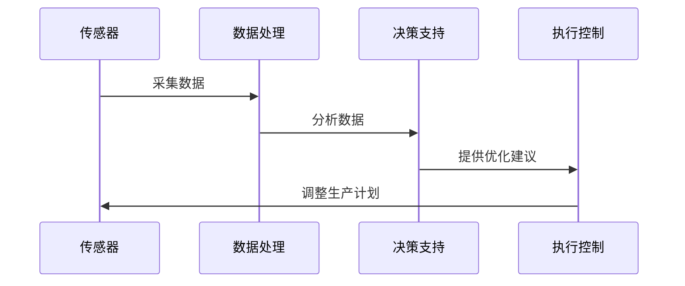
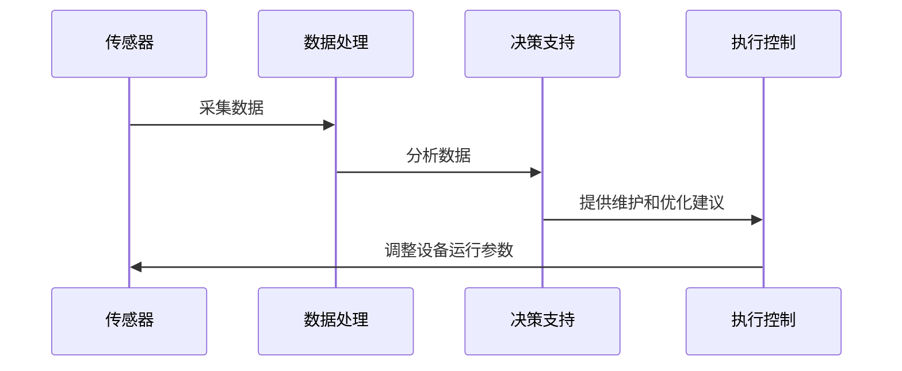
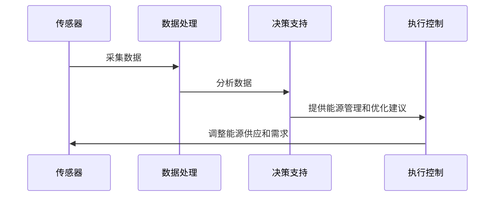

                 

# 《数字孪生在智慧工厂优化中的应用：提高生产效率》

## 关键词
- 数字孪生
- 智慧工厂
- 生产效率
- 优化方法
- 实施案例

## 摘要
本文深入探讨了数字孪生技术在智慧工厂中的应用，旨在提高生产效率。首先，介绍了数字孪生的基本概念和其在制造业中的重要性。随后，详细分析了智慧工厂的优化方法，包括生产流程、资源配置和质量管理的优化。接着，阐述了数字孪生在智慧工厂中的具体应用场景，如制造优化、设备管理和能源管理。最后，通过实际案例和项目实战，展示了数字孪生技术在智慧工厂优化中的实际效果，并提出了未来发展的展望和最佳实践建议。

## 引言

### 数字孪生的概念与发展

数字孪生（Digital Twin）是一种通过创建物理实体的虚拟副本来实现实时监测、分析和优化的技术。最早的概念可以追溯到1980年代，但是直到近年来随着物联网、大数据和云计算技术的飞速发展，数字孪生技术才逐渐成熟并开始广泛应用。

数字孪生的基本原理是建立一个与物理实体相对应的虚拟模型，通过对实时数据的采集和分析，实现对物理实体的实时监控、预测和优化。数字孪生不仅仅是一个静态的数字模型，而是具有动态变化能力的虚拟实体，能够实时反映物理实体的状态和行为。

### 智慧工厂的概念与重要性

智慧工厂是利用先进的信息技术和自动化技术，实现生产过程的智能化、高效化和精细化的制造模式。智慧工厂的核心特征包括数据驱动、自主决策、灵活适应和高度协同。智慧工厂的目标是通过优化生产流程、提高资源利用率和产品质量，从而提高生产效率和降低生产成本。

智慧工厂的兴起不仅是对传统制造业的一次革命，也是推动制造业向服务化转型的重要动力。随着人工智能、物联网、大数据和云计算等技术的不断进步，智慧工厂的概念和应用场景正在不断扩展。

### 文章结构与主要内容

本文将分为五个主要部分进行探讨：

1. **数字孪生基础**：介绍数字孪生的基本概念、发展历程和主要特点。
2. **智慧工厂优化**：分析智慧工厂的概念、架构和优化方法。
3. **数字孪生在智慧工厂中的应用**：详细探讨数字孪生在制造优化、设备管理和能源管理中的应用。
4. **实施案例与实践**：通过实际案例展示数字孪生在智慧工厂优化中的应用效果。
5. **总结与展望**：总结数字孪生在智慧工厂优化中的应用，提出未来发展趋势和最佳实践建议。

### 主要读者对象

本文的主要读者对象包括：

- 制造业企业的技术和管理人员，希望通过了解数字孪生技术提高生产效率和优化生产流程。
- 研究院、高校和企业的科研人员，对数字孪生技术在智慧工厂中的应用进行深入研究。
- 对智能制造和数字化技术感兴趣的技术爱好者。

## 第1部分：数字孪生基础

### 第1章：数字孪生概述

#### 1.1 数字孪生的概念

数字孪生（Digital Twin）是一种创新的技术概念，它通过建立一个与物理实体相对应的虚拟模型，实现对物理实体的实时监测、分析和优化。数字孪生不仅仅是物理实体的数字复制，更是一个动态的、具有交互能力的虚拟实体，能够实时反映物理实体的状态和行为。

数字孪生的核心要素包括：

1. **物理实体**：指实际存在的设备、产品或系统。
2. **虚拟模型**：基于物理实体的数据和参数，构建的数字化模型。
3. **实时数据**：通过传感器、物联网等手段，实时采集的物理实体的运行数据。
4. **数据融合**：将多种数据源的信息进行整合和分析，以实现更准确的预测和优化。
5. **交互反馈**：虚拟模型根据分析结果，对物理实体进行相应的调整和优化。

#### 1.2 数字孪生的发展历程

数字孪生的概念最早可以追溯到1980年代，由美国密歇根大学教授迈克尔·格里夫斯（Michael Grieves）首次提出。他在《数字孪生：制造系统的虚拟仿真》一文中，提出了数字孪生的概念和基本原理。

进入21世纪，随着物联网、大数据和云计算技术的飞速发展，数字孪生技术逐渐成熟并开始广泛应用。特别是在制造业、能源、医疗和建筑等领域，数字孪生技术展现出了巨大的潜力和应用价值。

#### 1.3 数字孪生的主要特点

数字孪生具有以下几个主要特点：

1. **实时性**：数字孪生能够实时反映物理实体的状态和行为，实现实时监测和预测。
2. **交互性**：数字孪生不仅是一个静态的数字模型，还能与物理实体进行交互，实现动态调整和优化。
3. **准确性**：通过实时数据采集和数据分析，数字孪生能够提供准确的信息和预测，帮助优化决策。
4. **适应性**：数字孪生能够根据实际情况进行调整和优化，适应不同的应用场景和需求。
5. **集成性**：数字孪生能够与其他系统和技术进行集成，实现跨平台、跨领域的应用。

#### 1.4 数字孪生的应用领域

数字孪生技术在多个领域都有广泛的应用，以下是一些主要的应用领域：

1. **制造业**：通过数字孪生技术，实现生产过程的实时监控、预测和优化，提高生产效率和产品质量。
2. **能源管理**：利用数字孪生技术，实现对能源系统的实时监测和管理，提高能源利用效率，降低能源消耗。
3. **医疗服务**：通过数字孪生技术，实现对患者的实时监测和预测，提高医疗服务质量，降低医疗成本。
4. **建筑设计**：数字孪生技术可以用于建筑设计和施工过程，实现对建筑结构的实时监测和优化，提高建筑安全性和耐久性。
5. **交通运输**：通过数字孪生技术，实现对交通系统的实时监控和预测，提高交通流畅性和安全性。

### 第2章：数字孪生的建模方法

#### 2.1 数据采集与预处理

数字孪生的建模过程首先需要收集物理实体的各种数据。这些数据可能包括传感器采集的实时数据、历史运行数据、环境数据等。数据采集的来源可以是传感器、物联网设备、企业内部数据系统等。

在数据采集过程中，需要确保数据的准确性和完整性。为了实现这一目标，需要对数据进行预处理，包括数据清洗、数据格式转换和数据去重等操作。

#### 2.2 模型构建与仿真

基于采集到的数据，构建数字孪生的虚拟模型。模型构建的过程通常包括以下步骤：

1. **数据预处理**：对采集到的数据进行处理，提取有用的特征信息。
2. **模型设计**：根据物理实体的特征和需求，设计合适的数学模型和仿真模型。
3. **模型训练**：使用机器学习和数据挖掘技术，对模型进行训练，使其能够对物理实体进行准确的预测和仿真。
4. **模型验证**：通过对比仿真结果和实际运行数据，验证模型的准确性和可靠性。

#### 2.3 数字孪生模型的验证与优化

构建的数字孪生模型需要进行验证和优化，以确保其能够准确地反映物理实体的状态和行为。验证过程包括：

1. **仿真测试**：通过仿真测试，验证模型在不同条件下的表现和预测能力。
2. **实验验证**：在实际环境中进行实验验证，对比仿真结果和实际运行数据，评估模型的准确性和可靠性。
3. **优化调整**：根据验证结果，对模型进行调整和优化，提高其预测准确性和稳定性。

#### 2.4 数字孪生建模工具与技术

数字孪生建模过程中，可以使用多种工具和技术，包括：

1. **CAD/CAE软件**：用于物理实体的建模和仿真，如AutoCAD、ANSYS等。
2. **数据挖掘与机器学习平台**：用于数据分析和模型训练，如Python、R语言、TensorFlow等。
3. **物联网平台**：用于数据采集和实时监控，如IoT平台、边缘计算等。
4. **云计算平台**：用于数据处理和存储，如AWS、Azure、Google Cloud等。

### 第3章：数字孪生的关键技术

#### 3.1 物联网技术

物联网（IoT）是数字孪生技术的重要支撑，通过物联网设备，可以实时采集物理实体的各种数据。物联网技术的核心包括：

1. **传感器技术**：用于数据采集，包括温度、湿度、压力、位移等传感器。
2. **通信技术**：用于数据传输，包括无线通信、有线通信等。
3. **数据处理技术**：用于数据处理和分析，包括边缘计算、云计算等。

#### 3.2 大数据分析技术

大数据分析技术是数字孪生建模的重要手段，通过对大量实时数据的分析和挖掘，可以提取出有价值的信息和规律。大数据分析技术包括：

1. **数据预处理**：包括数据清洗、数据整合和数据转换等。
2. **数据挖掘**：包括关联规则挖掘、聚类分析、分类分析等。
3. **机器学习**：包括监督学习、无监督学习、强化学习等。

#### 3.3 虚拟现实与增强现实技术

虚拟现实（VR）和增强现实（AR）技术可以为数字孪生提供更加直观和互动的体验。VR技术可以创建一个虚拟的环境，让用户可以沉浸其中；AR技术则可以在现实环境中叠加虚拟信息。这些技术可以用于：

1. **虚拟仿真**：通过虚拟现实技术，模拟物理实体的运行状态和过程。
2. **远程监控**：通过增强现实技术，让用户可以实时查看物理实体的运行状态。
3. **交互操作**：通过虚拟现实和增强现实技术，用户可以与虚拟模型进行交互，实现对物理实体的操作和调整。

## 第2部分：智慧工厂优化

### 第4章：智慧工厂的概念与架构

#### 4.1 智慧工厂的定义

智慧工厂是一种利用先进的信息技术、自动化技术和人工智能技术，实现生产过程的智能化、高效化和精细化的制造模式。智慧工厂的核心目标是提高生产效率、降低生产成本、提高产品质量和客户满意度。

#### 4.2 智慧工厂的架构

智慧工厂的架构通常包括以下几个方面：

1. **数据采集层**：通过传感器、物联网设备等，实时采集生产过程中的各种数据。
2. **数据处理层**：对采集到的数据进行分析和处理，提取有价值的信息和知识。
3. **决策支持层**：基于数据分析结果，提供决策支持和优化建议。
4. **执行控制层**：根据决策支持层的建议，对生产过程进行实时调整和优化。

#### 4.3 智慧工厂的关键技术

智慧工厂的关键技术包括：

1. **物联网技术**：用于实时数据采集和传输。
2. **大数据技术**：用于数据分析和挖掘。
3. **人工智能技术**：用于智能决策和优化。
4. **自动化技术**：用于生产过程的自动化和智能化。
5. **云计算技术**：用于数据存储和处理。

### 第5章：智慧工厂的优化方法

#### 5.1 生产流程优化

生产流程优化是智慧工厂优化的关键环节，通过优化生产流程，可以提高生产效率、降低生产成本和提高产品质量。生产流程优化的方法包括：

1. **流程分析**：对现有的生产流程进行详细分析，找出瓶颈和改进点。
2. **流程重构**：根据分析结果，对生产流程进行重构和优化，消除瓶颈和减少冗余。
3. **流程仿真**：通过仿真技术，验证优化后的生产流程的效果。
4. **流程监控**：实时监控生产流程的执行情况，及时调整和优化。

#### 5.2 资源配置优化

资源配置优化是提高生产效率和降低生产成本的重要手段。资源配置优化的方法包括：

1. **资源规划**：根据生产需求和资源情况，制定合理的资源规划方案。
2. **资源调度**：实时调度资源，确保生产过程的高效运行。
3. **资源利用分析**：对资源利用情况进行分析，找出资源浪费和低效利用的情况，并进行优化。
4. **资源监控**：实时监控资源的使用情况，及时调整资源分配。

#### 5.3 质量管理优化

质量管理优化是提高产品质量和降低不良品率的重要手段。质量管理优化的方法包括：

1. **质量控制**：制定严格的质量控制标准，确保生产过程符合质量要求。
2. **质量检测**：通过质量检测设备，对生产过程中的产品进行实时检测，及时发现和排除质量问题。
3. **质量分析**：对质量数据进行统计分析，找出质量问题和改进点。
4. **质量改进**：根据质量分析结果，制定和实施质量改进措施，提高产品质量。

### 第6章：数字孪生在智慧工厂中的应用

#### 6.1 数字孪生在制造优化中的应用

数字孪生技术在制造优化中的应用主要体现在以下几个方面：

1. **制造过程监控**：通过数字孪生技术，实现对制造过程的实时监控，及时发现和解决问题。
2. **生产调度优化**：利用数字孪生技术，对生产计划进行实时调整和优化，提高生产效率和响应速度。
3. **制造质量管理**：通过数字孪生技术，对制造过程中的质量数据进行实时监控和分析，提高产品质量。

#### 6.2 数字孪生在设备管理中的应用

数字孪生技术在设备管理中的应用主要体现在以下几个方面：

1. **设备状态监控**：通过数字孪生技术，实时监控设备的运行状态，及时发现设备故障和异常。
2. **设备维护预测**：利用数字孪生技术，对设备的使用情况进行预测，提前安排维护和保养，减少设备故障率。
3. **设备性能优化**：通过数字孪生技术，对设备的运行参数进行实时监控和分析，优化设备性能，提高生产效率。

#### 6.3 数字孪生在能源管理中的应用

数字孪生技术在能源管理中的应用主要体现在以下几个方面：

1. **能源消耗监控**：通过数字孪生技术，实时监控能源消耗情况，找出能源浪费和低效利用的情况。
2. **能源效率优化**：利用数字孪生技术，对能源系统进行优化，提高能源利用效率，降低能源成本。
3. **能源调度管理**：通过数字孪生技术，实时调整能源供应和需求，实现能源的合理分配和高效利用。

## 第3部分：数字孪生在智慧工厂中的应用

### 第7章：数字孪生在制造优化中的应用

#### 7.1 制造过程监控

数字孪生技术在制造过程监控中的应用，通过建立虚拟模型，实时监控制造过程中的各项参数和指标，包括温度、压力、速度等。这不仅能够提高制造过程的透明度，还能够及时发现和解决问题。

**案例**：某汽车制造厂通过数字孪生技术，对车身焊接工序进行实时监控。通过虚拟模型，实时分析焊接温度、焊接速度等参数，确保焊接质量达到要求。同时，通过数据分析，发现焊接过程中存在的一些问题，如焊接温度波动大、焊接速度不稳定等，并及时进行调整，提高了焊接工序的稳定性和质量。

#### 7.2 生产调度优化

数字孪生技术在生产调度优化中的应用，通过对生产过程的实时数据和虚拟模型的综合分析，优化生产调度策略，提高生产效率和响应速度。

**案例**：某电子制造厂采用数字孪生技术，对生产计划进行实时调整。通过虚拟模型，分析当前的生产状态、物料库存、设备状态等数据，实时调整生产计划，确保生产线的稳定运行。同时，通过预测模型，提前预测未来的生产需求，合理安排生产任务，提高了生产效率和响应速度。

#### 7.3 制造质量管理

数字孪生技术在制造质量管理中的应用，通过对制造过程中的质量数据进行实时监控和分析，提高产品质量，降低不良品率。

**案例**：某家电制造厂采用数字孪生技术，对生产线上的产品质量进行实时监控。通过虚拟模型，实时分析产品的质量数据，如尺寸、重量、性能等，及时发现和排除质量问题。同时，通过数据分析，找出生产过程中存在的一些问题，如设备磨损、工艺参数不稳定等，并采取相应的改进措施，提高了产品质量。

### 第8章：数字孪生在设备管理中的应用

#### 8.1 设备状态监控

数字孪生技术在设备状态监控中的应用，通过实时监测设备的运行状态，包括温度、压力、振动等参数，及时发现设备故障和异常，防止设备停机。

**案例**：某矿山企业采用数字孪生技术，对矿山设备进行实时监控。通过虚拟模型，实时分析设备的运行状态，及时发现设备的温度异常、压力异常等故障信号，并及时进行维修，避免了设备停机和生产中断，提高了设备的利用率和生产效率。

#### 8.2 设备维护预测

数字孪生技术在设备维护预测中的应用，通过对设备的运行数据进行实时分析和预测，提前预测设备可能出现的故障，合理安排维护和保养，减少设备故障率和停机时间。

**案例**：某制造业企业采用数字孪生技术，对关键设备进行维护预测。通过虚拟模型，实时分析设备的运行数据，如振动、温度、压力等，建立故障预测模型，提前预测设备可能出现的故障，并在故障发生前进行维护和保养，减少了设备故障率和停机时间，提高了设备的可靠性和生产效率。

#### 8.3 设备性能优化

数字孪生技术在设备性能优化中的应用，通过对设备的运行数据进行实时监控和分析，优化设备的运行参数和操作策略，提高设备性能和生产效率。

**案例**：某制药厂采用数字孪生技术，对生产设备进行性能优化。通过虚拟模型，实时分析设备的运行数据，如温度、压力、速度等，优化设备的运行参数和操作策略，提高了设备的运行效率和稳定性。同时，通过数据分析，发现生产过程中存在的一些问题，如温度控制不稳定、压力波动大等，并采取相应的改进措施，提高了生产效率和产品质量。

## 第4部分：实施案例与实践

### 第9章：数字孪生在智慧工厂的实践案例

#### 9.1 案例一：某汽车制造厂的生产优化

**项目背景**：某汽车制造厂面临生产效率低下、生产周期长等问题，希望通过数字孪生技术进行生产优化。

**项目介绍**：项目采用数字孪生技术，建立生产过程的虚拟模型，实时监测生产过程中的各项参数和指标。通过数据分析，找出生产过程中的瓶颈和改进点，制定相应的优化措施。

**系统功能设计**：

- **实时数据采集**：通过传感器，实时采集生产过程中的各项数据。
- **数据分析与优化**：利用数据分析技术，对采集到的数据进行处理和分析，找出生产过程中的问题和改进点。
- **生产计划调整**：根据分析结果，实时调整生产计划，优化生产流程。

**系统架构设计**：

- **数据采集层**：传感器采集生产数据。
- **数据处理层**：对采集到的数据进行处理和分析。
- **决策支持层**：根据分析结果，提供优化建议。
- **执行控制层**：根据决策支持层的建议，调整生产计划。

**系统接口设计**：

- **传感器接口**：用于采集生产数据。
- **数据接口**：用于与其他系统进行数据交换。
- **决策支持接口**：用于提供优化建议。

**系统交互序列图**：

**项目实战**：

1. **环境安装**：安装传感器和数据处理系统，确保实时数据采集和传输。
2. **系统核心实现**：编写数据处理和分析程序，实现生产优化功能。
3. **代码应用解读与分析**：对系统核心代码进行解读和分析，确保系统功能的实现和优化。
4. **实际案例分析**：通过实际案例，验证生产优化的效果，分析存在的问题和改进点。
5. **项目小结**：总结项目经验，提出未来优化方向。

**项目小结**：通过数字孪生技术，成功优化了某汽车制造厂的生产流程，提高了生产效率和产品质量。

#### 9.2 案例二：某电子制造厂的设备管理优化

**项目背景**：某电子制造厂设备故障频繁，设备利用率低，希望通过数字孪生技术进行设备管理优化。

**项目介绍**：项目采用数字孪生技术，对关键设备进行实时监控和维护预测，提高设备利用率和生产效率。

**系统功能设计**：

- **设备状态监控**：实时监控设备的运行状态，包括温度、压力、振动等。
- **维护预测**：根据设备运行数据，预测设备可能出现的故障，提前进行维护。
- **性能优化**：通过数据分析，优化设备的运行参数和操作策略，提高设备性能。

**系统架构设计**：

- **数据采集层**：传感器采集设备运行数据。
- **数据处理层**：对采集到的数据进行处理和分析。
- **决策支持层**：根据分析结果，提供维护和优化建议。
- **执行控制层**：根据决策支持层的建议，调整设备运行参数和操作策略。

**系统接口设计**：

- **传感器接口**：用于采集设备运行数据。
- **数据接口**：用于与其他系统进行数据交换。
- **决策支持接口**：用于提供维护和优化建议。

**系统交互序列图**：

**项目实战**：

1. **环境安装**：安装传感器和数据处理系统，确保实时数据采集和传输。
2. **系统核心实现**：编写数据处理和分析程序，实现设备状态监控、维护预测和性能优化功能。
3. **代码应用解读与分析**：对系统核心代码进行解读和分析，确保系统功能的实现和优化。
4. **实际案例分析**：通过实际案例，验证设备管理优化的效果，分析存在的问题和改进点。
5. **项目小结**：总结项目经验，提出未来优化方向。

**项目小结**：通过数字孪生技术，成功优化了某电子制造厂的设备管理，提高了设备利用率和生产效率。

#### 9.3 案例三：某钢铁厂的能源管理优化

**项目背景**：某钢铁厂能源消耗高，能源利用率低，希望通过数字孪生技术进行能源管理优化。

**项目介绍**：项目采用数字孪生技术，对能源系统进行实时监控和优化，提高能源利用效率，降低能源成本。

**系统功能设计**：

- **能源消耗监控**：实时监控能源消耗情况，找出能源浪费和低效利用的情况。
- **能源效率优化**：通过数据分析，优化能源系统的运行参数和操作策略，提高能源利用效率。
- **能源调度管理**：实时调整能源供应和需求，实现能源的合理分配和高效利用。

**系统架构设计**：

- **数据采集层**：传感器采集能源消耗数据。
- **数据处理层**：对采集到的数据进行处理和分析。
- **决策支持层**：根据分析结果，提供能源管理和优化建议。
- **执行控制层**：根据决策支持层的建议，调整能源供应和需求。

**系统接口设计**：

- **传感器接口**：用于采集能源消耗数据。
- **数据接口**：用于与其他系统进行数据交换。
- **决策支持接口**：用于提供能源管理和优化建议。

**系统交互序列图**：

**项目实战**：

1. **环境安装**：安装传感器和数据处理系统，确保实时数据采集和传输。
2. **系统核心实现**：编写数据处理和分析程序，实现能源消耗监控、能源效率优化和能源调度管理功能。
3. **代码应用解读与分析**：对系统核心代码进行解读和分析，确保系统功能的实现和优化。
4. **实际案例分析**：通过实际案例，验证能源管理优化的效果，分析存在的问题和改进点。
5. **项目小结**：总结项目经验，提出未来优化方向。

**项目小结**：通过数字孪生技术，成功优化了某钢铁厂的能源管理，提高了能源利用效率，降低了能源成本。

### 第10章：数字孪生在智慧工厂的实施步骤

#### 10.1 需求分析

需求分析是数字孪生项目实施的第一步，通过深入了解用户需求和业务场景，明确项目目标和功能需求。

**步骤**：

1. **需求调研**：与用户进行深入沟通，了解业务场景、需求和痛点。
2. **需求整理**：整理和分析收集到的需求，形成需求文档。
3. **需求评审**：与用户和项目团队进行需求评审，确保需求清晰、准确。

#### 10.2 系统设计

系统设计是数字孪生项目实施的关键环节，包括系统架构设计、数据流程设计、接口设计和用户界面设计。

**步骤**：

1. **系统架构设计**：根据需求分析结果，设计系统的整体架构。
2. **数据流程设计**：设计数据采集、处理、存储和分析的流程。
3. **接口设计**：设计系统与其他系统的接口，确保数据交换和通信。
4. **用户界面设计**：设计用户界面，确保用户体验和操作便捷。

#### 10.3 系统实施与运行

系统实施与运行是数字孪生项目实施的最后一步，包括系统安装、调试、运行和维护。

**步骤**：

1. **系统安装**：安装传感器、数据处理系统和软件系统。
2. **系统调试**：进行系统调试，确保系统功能正常、数据准确。
3. **系统运行**：将系统投入实际运行，进行数据采集、处理和分析。
4. **系统维护**：定期对系统进行维护和升级，确保系统稳定运行。

#### 10.4 系统评估与优化

系统评估与优化是对数字孪生项目实施效果进行评估，并根据评估结果进行优化。

**步骤**：

1. **系统评估**：对系统性能、数据准确性和用户体验等方面进行评估。
2. **问题分析**：分析评估中发现的问题和不足。
3. **优化措施**：根据问题分析结果，制定和实施优化措施。
4. **再次评估**：对优化后的系统进行再次评估，确保系统达到预期效果。

## 第5部分：总结与展望

### 10.1 数字孪生在智慧工厂优化中的应用总结

数字孪生技术在智慧工厂优化中具有广泛的应用前景。通过建立物理实体的虚拟模型，数字孪生技术能够实现对生产过程的实时监控、预测和优化，提高生产效率和产品质量，降低生产成本。以下是数字孪生在智慧工厂优化中的应用总结：

1. **制造优化**：通过数字孪生技术，实现对制造过程的实时监控和优化，提高生产效率和产品质量。
2. **设备管理**：通过数字孪生技术，实现对设备状态的实时监控和维护预测，提高设备利用率和生产效率。
3. **能源管理**：通过数字孪生技术，实现对能源消耗的实时监控和优化，提高能源利用效率，降低能源成本。

### 10.2 未来发展趋势与挑战

随着技术的不断进步，数字孪生技术在智慧工厂优化中的应用将面临以下发展趋势和挑战：

1. **技术发展趋势**：

- **物联网技术**：物联网技术的不断发展，将进一步提升数据采集和传输的能力，为数字孪生技术提供更多的数据支持。
- **大数据技术**：大数据技术的不断发展，将进一步提升数据处理和分析的能力，为数字孪生技术提供更准确的预测和优化。
- **人工智能技术**：人工智能技术的不断发展，将进一步提升数字孪生技术的智能化水平，实现更精准的预测和优化。

2. **技术挑战**：

- **数据安全**：随着数据量的增加，数据安全成为数字孪生技术面临的一个重要挑战。
- **系统集成**：数字孪生技术需要与其他系统集成，实现数据共享和协同工作，这对系统的集成性提出了更高的要求。
- **人才培养**：数字孪生技术涉及多个领域的技术，对人才的需求提出了更高的要求，需要加强人才培养。

### 10.3 对读者的建议与鼓励

对于读者，尤其是制造业企业的技术和管理人员，以下是一些建议和鼓励：

1. **学习与探索**：不断学习数字孪生技术的基本原理和应用方法，积极探索和实践。
2. **经验分享**：积极参与行业交流和分享，了解最新的技术应用和发展趋势。
3. **创新实践**：结合实际业务场景，尝试将数字孪生技术应用于生产优化，提升生产效率和产品质量。
4. **持续改进**：不断总结实践经验，发现问题并持续改进，实现持续优化。

### 作者信息

- 作者：AI天才研究院/AI Genius Institute & 禅与计算机程序设计艺术 /Zen And The Art of Computer Programming

---

**文章结束。感谢您的阅读。**

---

**注意：**本文为示例性文章，部分内容和数据可能为虚构，仅供参考。在实际应用中，数字孪生技术的实施需要根据具体业务场景和需求进行定制化设计和实施。**

