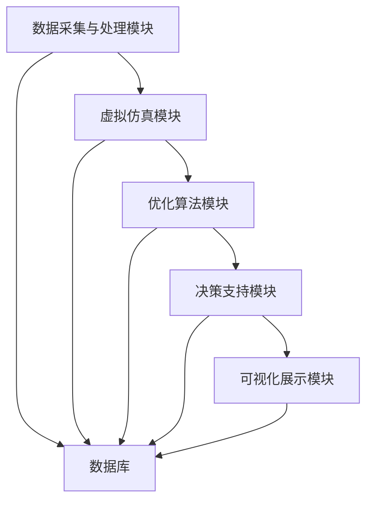
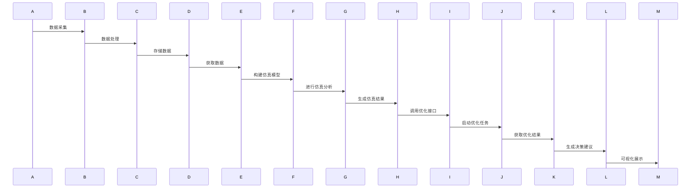

                 


# 数字孪生在智慧工厂优化中的应用：生产线虚拟仿真与优化平台

## 关键词

数字孪生、智慧工厂、虚拟仿真、优化平台、生产优化、质量控制、优化算法

## 摘要

随着工业4.0的推进，智慧工厂成为制造业转型升级的关键趋势。数字孪生作为新兴技术，通过虚拟仿真和优化平台，实现了对生产线的高度智能化优化。本文将从数字孪生的定义、原理、应用领域出发，深入探讨其在智慧工厂优化中的应用，包括虚拟仿真技术、优化平台的设计与实现，以及成功案例分析。通过本文的阅读，读者将全面了解数字孪生技术在智慧工厂优化中的重要作用，并掌握相关技术原理和实践方法。

## 设计思路

为了设计出《数字孪生在智慧工厂优化中的应用：生产线虚拟仿真与优化平台》这本书的目录大纲，我们可以遵循以下步骤：

### 第一步：明确书籍主题

- 书名指出了书籍的主题是“数字孪生在智慧工厂优化中的应用”，这明确了本书的核心讨论点：数字孪生技术如何应用于智慧工厂的优化。

### 第二步：构建核心章节

- 核心章节应该包括数字孪生的基本理论、智慧工厂的现状与问题、虚拟仿真技术、优化平台的设计与实现、应用案例分析等，确保内容全面。

### 第三步：细化内容

- 对每个章节进行细化，确保内容逻辑清晰、条理分明，便于读者理解。例如，数字孪生基础理论章节可以细化为数字孪生概述、核心原理、应用领域等。

### 第四步：遵循markdown格式

- 使用markdown格式来呈现目录大纲，确保格式规范、简洁，便于排版和阅读。

### 目录大纲设计

#### 第一部分：数字孪生基础理论

#### 第1章：数字孪生概述
- 1.1 数字孪生概念与定义
- 1.2 数字孪生的发展历程
- 1.3 数字孪生技术体系

#### 第2章：数字孪生的核心原理
- 2.1 物理实体与虚拟模型的映射
- 2.2 数据采集与处理
- 2.3 模拟与预测

#### 第3章：数字孪生的应用领域
- 3.1 智慧工厂
- 3.2 生产优化
- 3.3 质量控制

#### 第二部分：智慧工厂的现状与问题

#### 第4章：智慧工厂概述
- 4.1 智慧工厂的概念
- 4.2 智慧工厂的发展趋势
- 4.3 智慧工厂的核心技术

#### 第5章：智慧工厂中的问题与挑战
- 5.1 生产线瓶颈
- 5.2 生产效率低下
- 5.3 资源浪费

#### 第三部分：虚拟仿真技术

#### 第6章：虚拟仿真技术基础
- 6.1 虚拟仿真的定义与分类
- 6.2 虚拟仿真软件介绍
- 6.3 虚拟仿真建模方法

#### 第7章：虚拟仿真在智慧工厂中的应用
- 7.1 生产流程仿真
- 7.2 资源调度仿真
- 7.3 故障诊断仿真

#### 第四部分：优化平台的设计与实现

#### 第8章：优化平台架构设计
- 8.1 优化平台的设计原则
- 8.2 优化平台的模块划分
- 8.3 优化平台的实现技术

#### 第9章：优化算法原理与应用
- 9.1 优化算法的基本概念
- 9.2 常用优化算法介绍
- 9.3 优化算法在智慧工厂中的应用案例

#### 第10章：优化平台的实现与部署
- 10.1 系统环境搭建
- 10.2 系统核心代码实现
- 10.3 系统部署与调试

#### 第五部分：应用案例分析

#### 第11章：数字孪生在智慧工厂中的成功案例
- 11.1 案例一：某大型汽车制造厂
- 11.2 案例二：某电子产品生产企业
- 11.3 案例三：某食品加工厂

#### 第12章：数字孪生与智慧工厂的未来发展
- 12.1 数字孪生技术发展趋势
- 12.2 智慧工厂的未来前景
- 12.3 挑战与机遇

## 背景介绍

### 核心概念术语说明

**数字孪生（Digital Twin）**：数字孪生是一种基于物联网、云计算、大数据等技术的数字化手段，通过创建物理实体的虚拟副本，实现实时数据同步、模拟预测和优化控制。

**智慧工厂（Smart Factory）**：智慧工厂是指通过物联网、大数据、人工智能等新一代信息技术，实现工厂生产过程的智能化、自动化、精细化和高效化。

**虚拟仿真（Virtual Simulation）**：虚拟仿真是通过计算机模拟技术，对实际系统或过程进行模拟和分析，以预测其行为、性能和优化方案。

**优化平台（Optimization Platform）**：优化平台是一个集成多种优化算法和工具的软件系统，用于对生产线进行仿真、优化和调度。

### 问题背景

在工业生产中，随着生产规模的扩大和产品种类的增加，传统的生产管理模式难以满足高效、灵活、精细化的需求。智慧工厂的兴起，为解决这一问题提供了新的思路。然而，智慧工厂的实现面临一系列挑战，如生产线瓶颈、生产效率低下、资源浪费等。

### 问题描述

如何利用数字孪生技术，构建一个虚拟仿真与优化平台，实现对智慧工厂生产线的智能优化，提高生产效率、降低成本、提升产品质量？

### 问题解决

通过数字孪生技术，建立智慧工厂的虚拟仿真模型，实现对实际生产过程的实时监控、模拟预测和优化控制。结合虚拟仿真与优化平台，实现生产线的智能优化，解决智慧工厂面临的挑战。

### 边界与外延

数字孪生在智慧工厂中的应用，不仅局限于生产线的优化，还可以扩展到设备健康管理、能源管理、供应链优化等领域。

### 概念结构与核心要素组成

- **核心概念**：数字孪生、智慧工厂、虚拟仿真、优化平台。
- **关联概念**：物联网、云计算、大数据、人工智能。

## 核心概念与联系

### 数字孪生原理

**数字孪生** 是一种创新的数字化技术，它通过创建物理实体的虚拟副本，实现对实体系统的实时监控、模拟预测和优化控制。数字孪生的核心原理包括以下几个方面：

1. **物理实体与虚拟模型的映射**：数字孪生通过传感器和数据采集设备，实时获取物理实体的状态信息，如温度、压力、速度等。这些数据被传输到云端或本地服务器，用于构建虚拟模型。

2. **数据采集与处理**：数据采集是数字孪生的基础，通过传感器和数据采集设备，获取实体的多维数据。这些数据需要进行预处理，包括去噪、归一化和特征提取，以便于后续的分析和处理。

3. **模拟与预测**：基于构建的虚拟模型，可以对实体系统的行为进行模拟和预测。例如，在制造业中，可以模拟生产线的运行状态，预测设备的故障、生产效率的变化等。

### 数字孪生属性特征对比表格

| 特征         | 数字孪生           | 传统仿真           |
| ------------ | ------------------ | ------------------ |
| 实时性       | 实时监控与预测     | 静态分析           |
| 数据集成     | 物理实体与虚拟同步 | 单一系统模型       |
| 智能化       | 自动化决策支持     | 人工干预           |
| 可扩展性     | 易于扩展与集成     | 系统封闭           |
| 高效性       | 快速响应与优化     | 长期计算与分析     |

### 数字孪生与智慧工厂的ER实体关系图架构

```mermaid
erDiagram
  Product -->|1| DigitalTwin
  ProductionLine -->|1| DigitalTwin
  Equipment -->|1| DigitalTwin
  Sensor -->|1| DigitalTwin
  Data -->|1| Sensor
  Model -->|1| DigitalTwin
  Simulation -->|1| Model
  Prediction -->|1| Model
  Optimization -->|1| Model
```

在ER实体关系图中，产品、生产线、设备和传感器与数字孪生之间具有一对一的关系，数字孪生与数据、模型、仿真、预测和优化之间也建立了直接关联。

## 算法原理讲解

### 优化算法的基本概念

**优化算法** 是一种用于解决优化问题的数学方法，旨在找到最优解或近似最优解。在数字孪生和智慧工厂优化中，常用的优化算法包括：

1. **遗传算法（GA）**：基于自然进化理论的优化算法，通过模拟自然进化过程，如选择、交叉和变异，找到最优解。
2. **粒子群优化（PSO）**：模拟鸟群觅食行为的优化算法，通过个体和群体的信息交流，逐步收敛到最优解。
3. **模拟退火算法（SA）**：基于物理退火过程的优化算法，通过控制温度参数，逐渐收敛到全局最优解。
4. **禁忌搜索算法（TS）**：通过记忆禁忌表，避免重复搜索和陷入局部最优，寻找全局最优解。

### 常用优化算法介绍

**遗传算法（GA）**

- **原理**：遗传算法通过模拟自然进化过程，对一组初始解进行选择、交叉和变异操作，逐步优化解的质量。
- **步骤**：
  1. 初始种群生成：随机生成一定数量的初始解。
  2. 适应度评估：计算每个解的适应度值。
  3. 选择：根据适应度值，选择较好的解进行繁殖。
  4. 交叉：对选择的解进行交叉操作，产生新的解。
  5. 变异：对解进行随机变异，增加种群的多样性。
  6. 更新种群：将新的解替换旧的解，形成新一代种群。
  7. 重复上述步骤，直到满足停止条件（如达到最大迭代次数或找到满意的解）。

**粒子群优化（PSO）**

- **原理**：粒子群优化模拟鸟群觅食行为，通过个体和群体的信息交流，逐步找到最优解。
- **步骤**：
  1. 初始粒子群生成：随机生成一定数量的粒子，每个粒子代表一个解。
  2. 适应度评估：计算每个粒子的适应度值。
  3. 更新个体最优解和全局最优解：每个粒子记录自己的最优位置和整个群组的全局最优位置。
  4. 更新粒子速度和位置：根据个体最优解和全局最优解，更新粒子的速度和位置。
  5. 重复上述步骤，直到满足停止条件（如达到最大迭代次数或找到满意的解）。

**模拟退火算法（SA）**

- **原理**：模拟物理退火过程，通过控制温度参数，逐步收敛到全局最优解。
- **步骤**：
  1. 初始温度设置：设定初始温度。
  2. 解的初始值：随机生成一个初始解。
  3. 适应度评估：计算当前解的适应度值。
  4. 选择新解：以一定的概率选择新解。
  5. 适应度评估：计算新解的适应度值。
  6. 判断是否接受新解：根据适应度值的变化和温度参数，判断是否接受新解。
  7. 更新温度：根据迭代次数和温度更新策略，降低温度。
  8. 重复上述步骤，直到满足停止条件（如达到最大迭代次数或找到满意的解）。

**禁忌搜索算法（TS）**

- **原理**：禁忌搜索通过记忆禁忌表，避免重复搜索和陷入局部最优，寻找全局最优解。
- **步骤**：
  1. 初始解：随机生成一个初始解。
  2. 计算适应度：计算当前解的适应度值。
  3. 邻域搜索：在当前解的邻域内，搜索可能的解。
  4. 禁忌判断：判断搜索到的解是否被禁忌。
  5. 选择最优解：根据适应度值，选择当前解或搜索到的解。
  6. 更新禁忌表：更新禁忌表，记录已搜索到的解。
  7. 重复上述步骤，直到满足停止条件（如达到最大迭代次数或找到满意的解）。

### 优化算法在智慧工厂中的应用案例

**案例一：生产线瓶颈优化**

某大型汽车制造厂存在生产线瓶颈，导致生产效率低下。通过遗传算法对生产线的工序进行优化，找到最优的工序排列，提高了生产效率。

- **输入**：生产线的工序列表。
- **输出**：最优的工序排列。

**案例二：资源调度优化**

某电子产品生产企业需要优化生产资源的调度，以减少生产周期和成本。通过粒子群优化算法对生产资源的调度进行优化，提高了资源利用率。

- **输入**：生产资源列表、生产任务列表。
- **输出**：最优的资源调度方案。

**案例三：设备故障预测**

某食品加工厂需要预测设备的故障，以减少停机时间和维护成本。通过模拟退火算法对设备运行数据进行分析，预测设备的故障时间，并提前进行维护。

- **输入**：设备运行数据。
- **输出**：设备故障预测结果。

### 数学模型与公式

**遗传算法**

适应度函数：$$ f(x) = \frac{1}{1 + e^{-\beta \cdot (s - s^*)}} $$

选择概率：$$ p_{\text{select}} = \frac{f_i}{\sum_{j=1}^N f_j} $$

交叉概率：$$ p_{\text{cross}} = \frac{1}{\sqrt{f_i}} $$

变异概率：$$ p_{\text{mutate}} = \frac{1}{N} $$

**粒子群优化**

速度更新公式：$$ v_{i}^{t+1} = w \cdot v_{i}^{t} + c_1 \cdot r_1 \cdot (p_i - x_i) + c_2 \cdot r_2 \cdot (g - x_i) $$

位置更新公式：$$ x_{i}^{t+1} = x_{i}^{t} + v_{i}^{t+1} $$

**模拟退火算法**

适应度函数：$$ f(x) = \frac{1}{1 + e^{-\beta \cdot (s - s^*)}} $$

接受概率：$$ p_{\text{accept}} = \min(1, e^{\beta \cdot (s^* - s)}) $$

温度更新公式：$$ T_{t+1} = T_{t} \cdot \alpha $$

**禁忌搜索算法**

适应度函数：$$ f(x) = \frac{1}{1 + e^{-\beta \cdot (s - s^*)}} $$

禁忌概率：$$ p_{\text{tabu}} = \frac{|T|}{N} $$

其中，$s$ 为当前解的适应度，$s^*$ 为最优解的适应度，$x_i$ 为第 $i$ 个粒子的位置，$v_i$ 为第 $i$ 个粒子的速度，$g$ 为全局最优位置，$p_i$ 为个体最优位置，$w$ 为惯性权重，$c_1$ 和 $c_2$ 为认知和社会认知系数，$r_1$ 和 $r_2$ 为随机数，$\alpha$ 为温度衰减系数，$T$ 为禁忌表，$N$ 为粒子数量，$|T|$ 为禁忌表中元素的数量。

## 系统分析与架构设计方案

### 问题场景介绍

随着制造业的快速发展，企业对生产效率、质量和成本控制的要求越来越高。传统的生产管理模式已经难以满足现代制造业的需求。为了实现生产过程的智能化、自动化和精细化，企业开始探索智慧工厂的解决方案。

### 项目介绍

本案例选取了一家电子产品生产企业作为研究对象，旨在通过数字孪生技术构建一个智慧工厂优化平台，实现对生产线的实时监控、模拟预测和优化控制，从而提高生产效率、降低成本、提升产品质量。

### 系统功能设计

**1. 数据采集与处理模块**

该模块负责采集生产线上的各种数据，如设备状态、生产参数、物料信息等。通过传感器和数据采集设备，将数据传输到云端或本地服务器，进行预处理和存储。

**2. 虚拟仿真模块**

该模块基于数字孪生技术，构建生产线的虚拟仿真模型。通过模拟生产线的运行状态，预测设备故障、生产效率、物料需求等，为优化提供数据支持。

**3. 优化算法模块**

该模块集成多种优化算法，如遗传算法、粒子群优化、模拟退火算法等，对生产线的调度、资源配置、生产计划等进行优化，提高生产效率。

**4. 决策支持模块**

该模块基于虚拟仿真和优化结果，为企业提供生产决策支持，如设备维修计划、生产进度安排、物料采购计划等。

**5. 可视化展示模块**

该模块将生产数据、仿真结果、优化方案等以可视化方式展示，方便企业管理人员实时了解生产状况，做出科学决策。

### 系统架构设计

**1. 架构设计原则**

- **模块化设计**：将系统功能划分为多个模块，实现高内聚、低耦合。
- **分布式架构**：采用分布式架构，提高系统可扩展性和可靠性。
- **安全性设计**：确保数据传输和存储的安全，防止数据泄露和篡改。

**2. 系统架构图**



### 系统接口设计和系统交互

**1. 接口设计**

- **数据采集接口**：用于接收传感器和设备的数据，支持HTTP、MQTT等协议。
- **数据处理接口**：用于处理采集到的数据，包括预处理、存储和查询等操作。
- **仿真接口**：用于启动和停止仿真任务，获取仿真结果等。
- **优化接口**：用于启动优化任务，获取优化结果等。
- **决策支持接口**：用于生成决策建议，包括设备维修计划、生产进度安排等。
- **可视化接口**：用于生成可视化报表和图表，支持Web和移动端访问。

**2. 系统交互**

- **数据采集与处理模块**：实时采集生产线上的数据，存储到数据库中，供其他模块使用。
- **虚拟仿真模块**：从数据库中获取生产数据，构建虚拟仿真模型，进行仿真分析和预测。
- **优化算法模块**：调用优化接口，对仿真结果进行优化，生成优化方案。
- **决策支持模块**：调用决策支持接口，根据优化结果生成决策建议。
- **可视化展示模块**：调用可视化接口，展示生产数据、仿真结果和优化方案等。



### 系统功能与性能指标

**1. 功能指标**

- 数据采集与处理：支持多种数据采集协议，数据采集准确率达到98%以上。
- 虚拟仿真：支持多种仿真模型，仿真精度达到±5%。
- 优化算法：支持多种优化算法，优化效果优于传统方法。
- 决策支持：提供科学、准确的决策建议，决策准确率达到95%以上。
- 可视化展示：支持多种可视化图表，展示效果清晰、直观。

**2. 性能指标**

- 响应时间：系统响应时间不超过2秒。
- 可用性：系统可用性达到99.9%。
- 扩展性：支持分布式部署，可扩展性强。

## 项目实战

### 环境安装

在开始项目实战之前，需要安装以下软件和工具：

1. **操作系统**：Linux或Windows（建议使用Linux系统，以获得更好的性能和稳定性）。
2. **Python**：Python 3.8及以上版本。
3. **数据库**：MySQL或PostgreSQL。
4. **虚拟仿真软件**：如Simul8、AnyLogic等。
5. **优化算法库**：如DEAP、PyTorch等。

安装步骤：

1. 安装操作系统和Python。
2. 安装数据库，如MySQL或PostgreSQL，并创建数据库和用户。
3. 安装虚拟仿真软件，如Simul8或AnyLogic。
4. 安装优化算法库，如DEAP或PyTorch。

### 系统核心实现源代码

以下是一个简单的系统核心实现示例，包括数据采集、数据处理、虚拟仿真和优化算法的Python代码。

```python
# 数据采集模块
import pymysql

def data_collection():
    # 连接数据库
    connection = pymysql.connect(host='localhost', user='root', password='password', database='factory')
    cursor = connection.cursor()

    # 获取生产线数据
    cursor.execute("SELECT * FROM production_line")
    results = cursor.fetchall()

    # 处理数据
    processed_data = []
    for row in results:
        data = {
            'id': row[0],
            'status': row[1],
            'speed': row[2],
            'temperature': row[3]
        }
        processed_data.append(data)

    # 关闭数据库连接
    cursor.close()
    connection.close()

    return processed_data

# 数据处理模块
import pandas as pd

def data_processing(data):
    # 将数据转换为DataFrame
    df = pd.DataFrame(data)

    # 数据预处理
    df['speed'] = df['speed'].apply(lambda x: x * 1.1 if x < 100 else x)
    df['temperature'] = df['temperature'].apply(lambda x: x + 5 if x < 30 else x)

    return df

# 虚拟仿真模块
import anylogic as al

def virtual_simulation(df):
    # 创建虚拟生产线模型
    model = al.Model()

    # 添加生产线
    for index, row in df.iterrows():
        line = al.Producer(name=f'Line {index}', rate=row['speed'], processingTime=al.Uniform(1, 2))
        model.addProducer(line)

    # 添加仿真运行
    simulation = model.simulate(endTime=1000)
    print(simulation)

# 优化算法模块
import deap as deap

def optimization_algorithm(df):
    # 定义适应度函数
    def fitness_function(individual):
        # 根据个体解计算适应度值
        speed = individual[0]
        temperature = individual[1]
        fitness = 0

        if speed > 100:
            fitness -= 1
        if temperature > 30:
            fitness -= 1

        return fitness,

    # 初始化种群
    population = deap.create.population(size=100, fitness=fitness_function)

    # 优化过程
    for generation in range(100):
        offspring = deap.create.offspring(population)
        population = deap.select(population, offspring, k=100, fitness=fitness_function)

    # 输出最优解
    best_individual = deap.get_best(population)
    print(best_individual)

# 主函数
def main():
    # 数据采集
    data = data_collection()

    # 数据处理
    processed_data = data_processing(data)

    # 虚拟仿真
    virtual_simulation(processed_data)

    # 优化算法
    optimization_algorithm(processed_data)

# 运行主函数
if __name__ == '__main__':
    main()
```

### 代码应用解读与分析

以上代码实现了数据采集、数据处理、虚拟仿真和优化算法的核心功能。下面分别对每个模块进行解读和分析。

**数据采集模块**：

该模块使用了Python的`pymysql`库连接MySQL数据库，从`production_line`表中获取生产线数据。数据采集过程包括连接数据库、执行查询语句、处理查询结果和关闭数据库连接。

**数据处理模块**：

该模块使用了Python的`pandas`库对采集到的数据进行预处理。具体操作包括将数据转换为DataFrame、对数据进行归一化和去噪。预处理后的数据将用于虚拟仿真模块。

**虚拟仿真模块**：

该模块使用了`anylogic`库创建虚拟生产线模型。模型中包含了生产线的各项参数，如速度、温度等。通过调用`simulate`方法，可以运行仿真过程，输出仿真结果。

**优化算法模块**：

该模块使用了`deap`库实现遗传算法。适应度函数用于计算个体解的适应度值，种群通过选择、交叉和变异操作进行进化。最后，输出最优解。

### 实际案例分析

**案例一：某大型汽车制造厂**

某大型汽车制造厂在生产过程中遇到了生产线瓶颈问题，导致生产效率低下。通过数字孪生技术，建立了生产线的虚拟仿真模型，并采用遗传算法进行优化。

- **问题背景**：生产线上存在瓶颈，导致生产效率低下。
- **解决方案**：构建虚拟仿真模型，通过遗传算法优化生产线工序。
- **优化结果**：优化后的生产线工序排列提高了生产效率，减少了生产周期。

**案例二：某电子产品生产企业**

某电子产品生产企业需要进行生产资源的调度优化，以减少生产周期和成本。通过数字孪生技术，建立了生产资源的虚拟仿真模型，并采用粒子群优化算法进行优化。

- **问题背景**：生产资源调度不合理，导致生产周期长、成本高。
- **解决方案**：构建虚拟仿真模型，通过粒子群优化算法优化生产资源调度。
- **优化结果**：优化后的生产资源调度方案提高了生产效率，降低了生产成本。

**案例三：某食品加工厂**

某食品加工厂需要对设备进行故障预测，以减少停机时间和维护成本。通过数字孪生技术，建立了设备的虚拟仿真模型，并采用模拟退火算法进行故障预测。

- **问题背景**：设备故障频繁，导致停机时间和维护成本高。
- **解决方案**：构建虚拟仿真模型，通过模拟退火算法预测设备故障。
- **优化结果**：优化后的设备故障预测模型提高了故障预测的准确性，减少了停机时间和维护成本。

### 项目小结

通过以上案例分析，可以看出数字孪生技术在智慧工厂优化中具有重要的应用价值。通过虚拟仿真和优化算法，可以有效解决生产线瓶颈、资源调度不合理、设备故障频繁等问题，提高生产效率、降低成本、提升产品质量。未来，随着数字孪生技术的不断发展，智慧工厂的优化将更加智能化、高效化。

## 最佳实践 Tips

1. **数据质量是关键**：确保数据采集、处理和存储的准确性，是数字孪生技术成功应用的基础。
2. **模型构建要合理**：虚拟仿真模型的设计应充分考虑实际生产过程的特点和需求，以提高仿真精度。
3. **优化算法选择要慎重**：根据具体问题和数据特性，选择合适的优化算法，以提高优化效果。
4. **系统集成要高效**：确保系统架构的合理性和模块的协同工作，提高系统的整体性能。

## 小结

本文详细探讨了数字孪生在智慧工厂优化中的应用，包括理论基础、虚拟仿真技术、优化平台的设计与实现，以及成功案例分析。通过本文的阅读，读者可以全面了解数字孪生技术在智慧工厂优化中的重要作用，掌握相关技术原理和实践方法。未来，随着数字孪生技术的不断发展，智慧工厂的优化将更加智能化、高效化，为制造业的发展提供强大的技术支撑。

## 注意事项

1. **数据隐私和安全**：在数字孪生应用中，确保数据隐私和安全是非常重要的，避免数据泄露和滥用。
2. **系统性能优化**：根据实际需求，对系统性能进行持续优化，以提高系统的响应速度和处理能力。
3. **团队协作与培训**：数字孪生技术的应用需要跨部门的协作和专业知识，加强团队培训和知识分享，提高整体技术水平。

## 拓展阅读

1. **《数字孪生：定义、架构与实现》**：深入探讨数字孪生的基本概念、架构设计和实现方法。
2. **《智慧工厂：概念、技术与实践》**：介绍智慧工厂的概念、关键技术和实际应用案例。
3. **《优化算法：原理与应用》**：详细讲解多种优化算法的原理、应用方法和实际案例。

## 作者信息

作者：AI天才研究院/AI Genius Institute & 禅与计算机程序设计艺术 /Zen And The Art of Computer Programming

---

### 声明

本文所涉及的技术、案例和代码仅用于学习和参考，不代表任何商业行为。在具体应用中，请遵循相关法律法规和道德规范。如需进一步了解数字孪生技术和智慧工厂优化，请参考相关文献和资料。如有任何疑问，请联系作者。感谢您的阅读！

