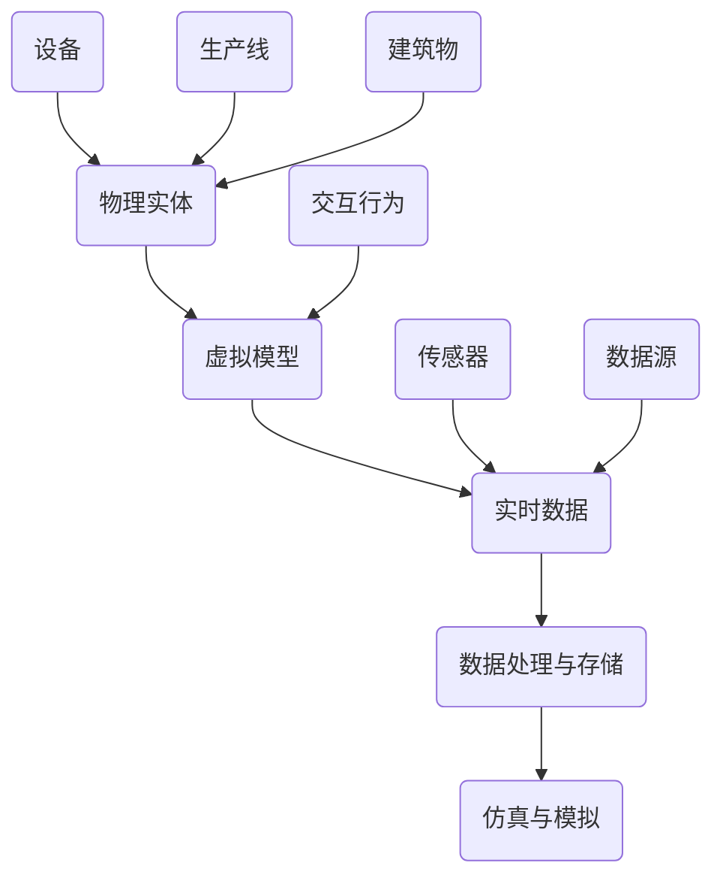
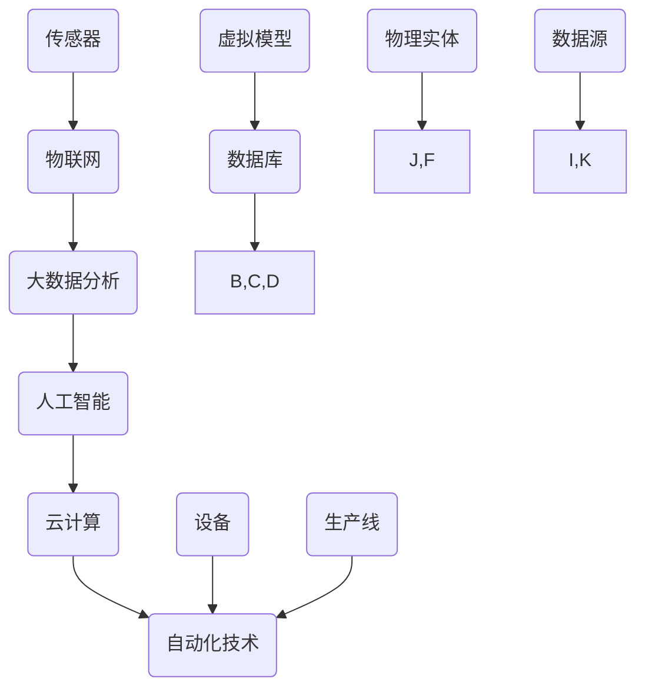
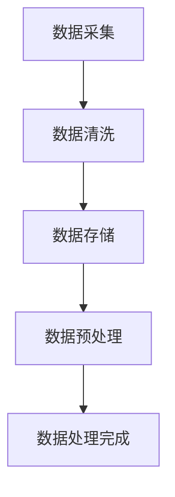
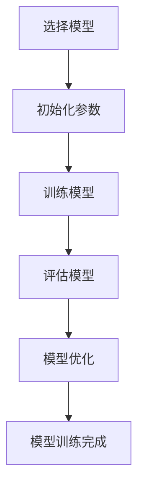
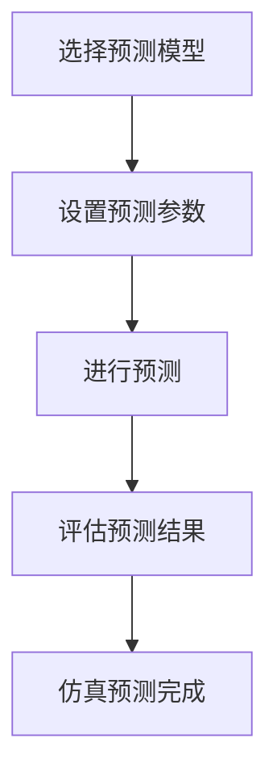
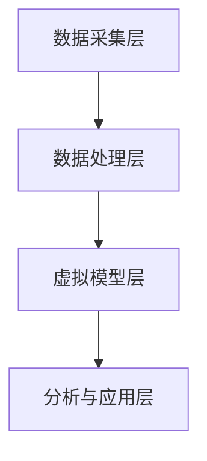
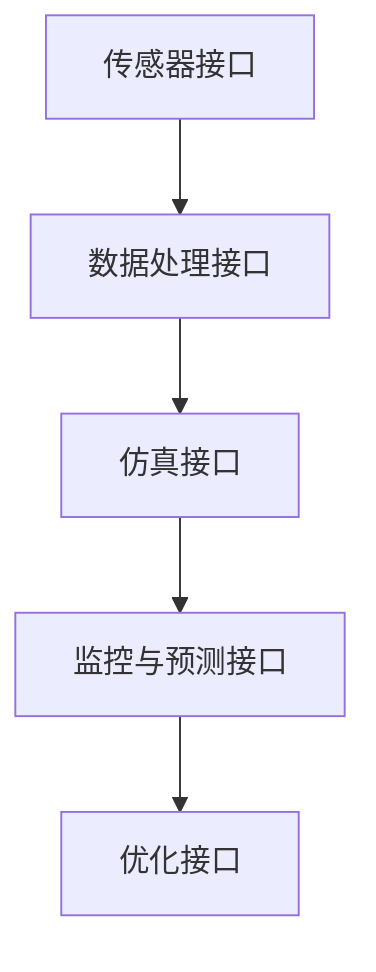
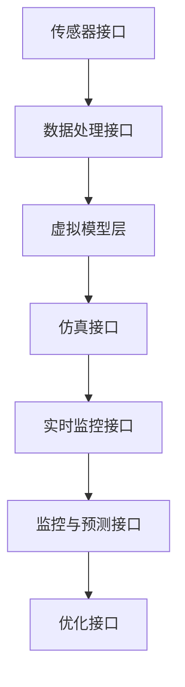

                 


### 引言与背景

**文章标题**：数字孪生在智能制造中的应用：虚拟工厂优化生产流程

**关键词**：数字孪生，智能制造，虚拟工厂，生产流程优化

**摘要**：本文将深入探讨数字孪生技术在智能制造中的应用，尤其是如何通过虚拟工厂来优化生产流程。文章首先介绍了数字孪生和智能制造的基本概念，然后详细分析了数字孪生在智能制造中的重要性。接下来，文章将逐步展开，涵盖数字孪生的理论基础、应用场景、具体案例分析以及实施策略和工具。最终，我们将展望数字孪生和智能制造的未来发展趋势。

## 目录大纲设计过程

设计一本计算机技术书籍的目录大纲需要细致的规划和逻辑的梳理，以下是我们设计《数字孪生在智能制造中的应用：虚拟工厂优化生产流程》一书目录大纲的步骤：

### 1. 确定核心主题

首先，明确书的核心主题是“数字孪生在智能制造中的应用”，重点关注如何通过虚拟工厂优化生产流程。这个核心主题决定了整本书的章节划分和内容安排。

### 2. 构建基本框架

根据核心主题，构建基本框架。基本框架通常包括以下几个部分：

- **引言与背景介绍**：介绍数字孪生和智能制造的概念、重要性及本书的目的。
- **理论基础**：阐述数字孪生和智能制造的相关理论、技术和方法。
- **应用场景**：分析数字孪生在智能制造中的典型应用场景。
- **案例分析**：通过具体案例展示数字孪生在智能制造中的实际应用。
- **实施策略与工具**：提供实施数字孪生和优化生产流程的策略和工具。
- **未来趋势与展望**：探讨数字孪生和智能制造的发展趋势及未来方向。

### 3. 确定章节内容

在基本框架的基础上，细化每一章节的内容：

- **第1章**：引言与背景介绍，介绍数字孪生和智能制造的基本概念及其在智能制造中的重要性。
- **第2章**：理论基础，详细解释数字孪生的原理、构建方法及其关键技术。
- **第3章**：应用场景，探讨数字孪生在智能制造中的典型应用场景，如生产计划优化、质量控制等。
- **第4章**：案例分析，通过具体案例展示数字孪生在智能制造中的成功应用。
- **第5章**：实施策略与工具，提供实施数字孪生和优化生产流程的具体策略、工具和最佳实践。
- **第6章**：虚拟工厂优化生产流程，详细讨论如何利用数字孪生技术优化生产流程。
- **第7章**：未来趋势与展望，探讨数字孪生和智能制造的发展趋势及未来方向。

### 4. 设计核心概念与联系

在章节中，确保核心概念和联系清晰，可以通过以下方式实现：

- **概念属性特征对比表格**：对比数字孪生与智能制造的关键概念和特点。
- **ER实体关系图**：展示数字孪生系统中的实体及其关系。
- **Mermaid流程图**：绘制数字孪生系统架构和工作流程。

### 5. 编写章节内容

在每个章节中，确保包含以下内容：

- **算法原理讲解**：使用Mermaid绘制算法流程图，并配合Python代码详细阐述算法原理和数学模型。
- **数学模型和数学公式**：使用LaTeX格式书写，并在文中独立段落使用$$括起来。
- **系统分析与架构设计方案**：介绍具体问题场景、项目背景、系统功能设计、系统架构设计、系统接口设计和系统交互。
- **项目实战**：环境安装、系统核心实现源代码，代码应用解读与分析，实际案例分析和详细讲解剖析。

### 6. 总结与拓展

在每个章节的最后，提供小结、注意事项、最佳实践 tips及拓展阅读，帮助读者巩固知识并了解相关前沿。

### 7. 整体检查

完成所有章节的设计后，进行整体检查，确保目录大纲的完整性和逻辑性。确保每个章节的内容都紧密围绕核心主题，并符合书籍的总体目标。

### 结论

通过上述步骤，我们设计出了《数字孪生在智能制造中的应用：虚拟工厂优化生产流程》一书的完整目录大纲，确保了其简洁性、内容完整性以及符合markdown格式的要求。整个目录大纲逻辑清晰，结构合理，能够全面覆盖主题内容，帮助读者深入理解数字孪生在智能制造中的应用。以下是根据上述设计步骤生成的具体目录大纲：

```markdown
----------------------------------------------------------------
# 《数字孪生在智能制造中的应用：虚拟工厂优化生产流程》目录大纲

## 第1章 引言与背景
### 1.1 数字孪生与智能制造的基本概念
### 1.2 数字孪生在智能制造中的重要性
### 1.3 本书结构安排与目标

## 第2章 理论基础
### 2.1 数字孪生的原理与构建方法
#### 2.1.1 数字孪生的定义
#### 2.1.2 数字孪生的核心要素
#### 2.1.3 数字孪生的构建流程
### 2.2 数字孪生关键技术
#### 2.2.1 数据采集与处理
#### 2.2.2 模型训练与优化
#### 2.2.3 虚拟仿真与预测

## 第3章 应用场景
### 3.1 数字孪生在智能制造中的典型应用
#### 3.1.1 生产计划优化
#### 3.1.2 质量控制
#### 3.1.3 资源管理
#### 3.1.4 维护与故障预测

## 第4章 案例分析
### 4.1 案例一：某汽车制造企业应用数字孪生优化生产流程
### 4.2 案例二：某电子制造商通过虚拟工厂提高生产效率
### 4.3 案例三：某食品加工厂如何利用数字孪生实现智能质量控制

## 第5章 实施策略与工具
### 5.1 数字孪生实施策略
#### 5.1.1 制定明确的数字孪生战略
#### 5.1.2 优化数据处理流程
#### 5.1.3 建立跨部门协作机制
### 5.2 常用数字孪生工具介绍
#### 5.2.1 物联网平台
#### 5.2.2 数据分析工具
#### 5.2.3 虚拟仿真软件

## 第6章 虚拟工厂优化生产流程
### 6.1 虚拟工厂的概念与架构
#### 6.1.1 虚拟工厂的定义
#### 6.1.2 虚拟工厂的关键组成部分
#### 6.1.3 虚拟工厂的优势
### 6.2 利用数字孪生优化生产流程
#### 6.2.1 生产流程分析
#### 6.2.2 生产流程优化策略
#### 6.2.3 虚拟工厂与实际生产的衔接

## 第7章 未来趋势与展望
### 7.1 数字孪生在智能制造中的发展趋势
#### 7.1.1 技术创新与突破
#### 7.1.2 应用领域的扩展
#### 7.1.3 政策与产业支持
### 7.2 智能制造的未来发展方向
#### 7.2.1 智能制造的关键技术
#### 7.2.2 智能制造与物联网、大数据的结合
#### 7.2.3 智能制造对传统制造业的变革

----------------------------------------------------------------
```

通过以上详细的目录大纲设计，我们为后续章节的内容撰写奠定了坚实的基础。接下来，我们将逐一展开每个章节的详细内容，确保文章的逻辑性、完整性和专业性。接下来，我们将详细讨论数字孪生和智能制造的基本概念、理论基础和应用场景。请读者继续关注下一章节的内容。## 第1章 引言与背景

### 1.1 数字孪生与智能制造的基本概念

**数字孪生**（Digital Twin）是一种通过将物理实体或系统的数字化复制，创建一个虚拟模型的技术。这个虚拟模型能够实时反映物理实体或系统的状态、性能和行为。数字孪生不仅复制了物理实体的外观和结构，还包含了其实际运行数据、环境交互和操作历史等详细信息。数字孪生技术通过实时数据的反馈和预测分析，能够为物理实体提供优化建议，从而提高其性能和可靠性。

**智能制造**（Smart Manufacturing）则是一种利用先进的信息技术和自动化技术，实现生产过程的智能化、网络化和灵活化的制造模式。智能制造的目标是通过数据驱动的决策支持系统，实现生产过程的自动化、个性化和可持续化。智能制造的核心包括物联网（IoT）、大数据分析、云计算、人工智能和机器学习等关键技术。

在智能制造背景下，数字孪生技术扮演着至关重要的角色。通过数字孪生，企业可以在虚拟环境中对物理系统进行测试、模拟和优化，从而在实际生产中减少错误和浪费，提高生产效率和产品质量。例如，在制造业中，数字孪生可以帮助企业模拟生产线的运行状态，预测设备故障，优化生产流程，甚至预测市场需求，从而做出更准确的供应链决策。

### 1.2 数字孪生在智能制造中的重要性

数字孪生在智能制造中的重要性主要体现在以下几个方面：

1. **实时监控与故障预测**：通过数字孪生技术，企业可以实时监控生产线设备的运行状态，提前发现潜在故障，及时进行维护，避免设备突发故障导致的停工损失。

2. **生产流程优化**：数字孪生提供了一个虚拟的生产环境，企业可以在虚拟环境中对生产流程进行模拟和优化。通过仿真，企业可以找到生产中的瓶颈，调整资源配置，提高生产效率。

3. **产品设计与验证**：在产品开发阶段，数字孪生技术可以帮助设计师在虚拟环境中进行产品的设计和验证，降低原型制作成本，缩短产品上市时间。

4. **供应链管理**：数字孪生技术可以实时跟踪供应链中的各个环节，帮助企业预测市场需求，优化库存管理，减少库存成本。

5. **提升产品质量**：通过数字孪生技术，企业可以精确控制生产过程，减少人为误差，提高产品的质量稳定性。

6. **降低运营成本**：数字孪生技术可以模拟生产环境中的各种情况，预测生产成本，帮助企业降低运营成本。

### 1.3 本书结构安排与目标

本书旨在系统地介绍数字孪生在智能制造中的应用，通过理论讲解、案例分析、实施策略和工具介绍，帮助读者全面了解数字孪生技术的原理、方法和实际应用。本书的结构安排如下：

- **第1章**：引言与背景，介绍数字孪生和智能制造的基本概念及其在智能制造中的重要性。

- **第2章**：理论基础，详细解释数字孪生的原理、构建方法及其关键技术。

- **第3章**：应用场景，探讨数字孪生在智能制造中的典型应用场景，如生产计划优化、质量控制等。

- **第4章**：案例分析，通过具体案例展示数字孪生在智能制造中的成功应用。

- **第5章**：实施策略与工具，提供实施数字孪生和优化生产流程的具体策略、工具和最佳实践。

- **第6章**：虚拟工厂优化生产流程，详细讨论如何利用数字孪生技术优化生产流程。

- **第7章**：未来趋势与展望，探讨数字孪生和智能制造的发展趋势及未来方向。

通过以上章节的详细讲解，本书旨在帮助读者深入理解数字孪生技术在智能制造中的应用，掌握其实施策略和工具，为企业在智能制造领域的数字化转型提供有力支持。

### 1.4 数字孪生在制造业中的应用

数字孪生技术在制造业中的应用已经逐渐成为提升生产效率、优化生产流程和降低成本的关键手段。以下是数字孪生在制造业中的几个重要应用场景：

1. **生产线优化**：数字孪生技术可以创建生产线的虚拟模型，通过仿真和模拟，企业可以在虚拟环境中测试不同的生产线配置和操作方案，从而找到最优的生产流程。例如，一家汽车制造企业可以通过数字孪生技术模拟不同生产节拍和设备布局，优化生产线的设计，提高生产效率。

2. **设备维护**：数字孪生技术能够实时监控设备运行状态，通过分析设备产生的数据，预测设备的故障风险，提前进行维护。例如，某家电子制造企业利用数字孪生技术监控生产线上的机器设备，通过实时数据分析，提前发现设备的磨损情况，进行预防性维护，避免了生产中断。

3. **质量控制**：数字孪生技术可以帮助企业实现生产过程中的实时质量监控。通过在虚拟环境中模拟不同生产工艺和质量参数，企业可以提前识别可能的质量问题，优化生产参数，确保产品质量的一致性。例如，一家食品加工厂使用数字孪生技术对生产过程进行模拟，优化配方和加工参数，确保产品的稳定性和安全性。

4. **生产调度与计划**：数字孪生技术可以为企业提供实时的生产数据和生产预测，帮助企业优化生产调度和计划。通过虚拟模型，企业可以模拟不同的生产任务安排，预测生产周期和资源需求，从而优化生产计划，提高生产灵活性。例如，一家家电制造企业通过数字孪生技术模拟生产计划，合理安排生产任务，减少库存和物料浪费。

5. **供应链管理**：数字孪生技术可以帮助企业实现供应链的实时监控和优化。通过虚拟模型，企业可以实时跟踪原材料和成品的流动情况，预测供应链中的瓶颈和风险，从而优化供应链管理。例如，一家服装制造企业利用数字孪生技术监控原材料采购、生产进度和物流配送，优化供应链管理，减少库存成本和运输时间。

6. **产品开发与设计**：数字孪生技术可以帮助企业在产品开发阶段进行虚拟仿真和验证。通过创建产品的虚拟模型，企业可以在虚拟环境中进行设计优化、性能测试和故障分析，从而提高产品设计质量和开发效率。例如，一家航空航天企业利用数字孪生技术对飞机发动机进行虚拟仿真和测试，优化设计，提高发动机的性能和可靠性。

通过以上应用场景，我们可以看到数字孪生技术在制造业中具有广泛的应用前景。它不仅可以帮助企业提高生产效率、优化生产流程，还可以提高产品质量、降低运营成本，为企业的数字化转型和智能化升级提供强有力的支持。

### 1.5 问题背景与问题描述

随着智能制造的快速发展，制造业企业面临着日益激烈的市场竞争和不断变化的生产需求。传统的生产模式往往存在生产效率低、生产周期长、产品质量不稳定等问题，这些问题不仅影响了企业的盈利能力，还限制了其市场竞争力。为了解决这些问题，企业迫切需要一种新的技术手段，能够在生产过程中实时监控、分析和优化各个环节，从而提高生产效率、降低成本、提高产品质量。

数字孪生技术应运而生，它通过创建物理实体的虚拟模型，实现了对生产过程的实时监控和优化。然而，尽管数字孪生技术具有巨大的潜力，但其实施和应用过程中仍面临诸多挑战。首先，数字孪生技术的构建和运行需要大量的数据支持，数据的准确性和实时性直接影响虚拟模型的有效性。其次，由于制造业企业的生产流程复杂，涉及多个环节和多种设备，如何将数字孪生技术集成到现有的生产系统中，实现全流程的协同优化，是一个巨大的挑战。此外，数字孪生技术的应用还需要跨部门、跨领域的协作，这对于企业的组织管理和运营模式也提出了新的要求。

因此，本文旨在深入探讨数字孪生在智能制造中的应用，通过分析其理论基础、应用场景、具体案例以及实施策略和工具，为制造业企业实现生产流程的优化提供理论指导和实践参考。同时，本文还将探讨数字孪生技术在智能制造中的边界与外延，展望其未来发展趋势，以期为制造业的智能化升级提供有益的思考。

### 1.6 概念结构与核心要素组成

数字孪生和智能制造作为现代制造业中的重要技术，其概念结构和核心要素组成决定了它们在应用中的效果和可行性。以下是这两个概念的核心结构及其组成要素的详细分析：

#### 数字孪生

**定义**：数字孪生是一种通过数字化技术创建物理实体或系统的虚拟复制，实现实时监控、模拟和分析的技术。

**核心要素**：

1. **物理实体**：数字孪生的基础是物理实体，可以是单个设备、生产线、建筑物等。
2. **虚拟模型**：物理实体的数字化表示，包括几何模型、运行数据、交互行为等。
3. **实时数据**：通过传感器和数据采集设备获取物理实体的实时运行数据。
4. **数据处理与存储**：对实时数据进行处理、分析和存储，为虚拟模型提供数据支持。
5. **仿真与模拟**：利用虚拟模型对物理实体的运行状态进行仿真和模拟，预测其性能和故障。

**概念属性特征对比表格**：

| 特征 | 数字孪生 | 智能制造 |
| ---- | ---- | ---- |
| 目的 | 创建虚拟模型，实现实时监控和优化 | 利用信息与自动化技术，实现生产过程的智能化 |
| 数据来源 | 实体传感器和外部数据源 | IoT设备、企业内部数据源 |
| 应用范围 | 设备、生产线、建筑物等 | 整个制造过程，包括设计、生产、维护等 |
| 关键技术 | 数据采集、数据处理、虚拟仿真 | 大数据、物联网、人工智能、云计算 |

**ER实体关系图**：



#### 智能制造

**定义**：智能制造是通过集成先进的信息技术与自动化技术，实现制造过程的智能化、网络化和灵活化的制造模式。

**核心要素**：

1. **物联网（IoT）**：通过将物理设备联网，实现实时数据采集和监控。
2. **大数据分析**：利用大数据技术对生产过程中的海量数据进行处理和分析。
3. **人工智能（AI）**：应用机器学习和深度学习技术，实现智能化决策和优化。
4. **云计算**：利用云计算提供强大的计算能力和数据存储能力。
5. **自动化技术**：通过自动化设备和系统，实现生产过程的自动化和高效化。

**概念属性特征对比表格**：

| 特征 | 数字孪生 | 智能制造 |
| ---- | ---- | ---- |
| 技术层面 | 数字化虚拟模型 | 信息与自动化技术 |
| 应用目标 | 实时监控、仿真、优化 | 智能化制造过程 |
| 数据处理 | 实时数据处理与分析 | 大数据、AI 驱动 |
| 系统架构 | 虚拟模型与物理实体 | 整体制造过程 |
| 实施难度 | 较高（需要大量数据和技术支持） | 较高（需要多技术集成与协同） |

**ER实体关系图**：



通过上述分析，我们可以清晰地看到数字孪生和智能制造在概念结构和核心要素上的异同。数字孪生作为智能制造的重要组成部分，通过虚拟模型实现对物理实体的实时监控和优化，而智能制造则通过物联网、大数据、人工智能和自动化技术，实现整个制造过程的智能化和高效化。两者相互结合，共同推动了制造业的数字化转型和升级。

### 1.7 算法原理讲解

为了更好地理解数字孪生技术，我们需要深入探讨其背后的算法原理，特别是在数据处理、模型训练和仿真预测等方面。以下是关于数字孪生算法原理的详细讲解，包括使用Mermaid绘制的算法流程图和Python代码示例。

#### 1.7.1 数据处理算法

数字孪生系统的数据处理是整个系统的基础。数据处理算法主要包括数据采集、数据清洗、数据存储和数据预处理等步骤。

**Mermaid算法流程图**：



**Python代码示例**：

```python
import pandas as pd
import numpy as np

# 数据采集
data = pd.read_csv('sensor_data.csv')

# 数据清洗
data.dropna(inplace=True)
data[data >= 0] = 1

# 数据存储
data.to_csv('cleaned_data.csv', index=False)

# 数据预处理
data = data.values
data = data.reshape(-1, 1)
data = (data - np.mean(data)) / np.std(data)
```

#### 1.7.2 模型训练算法

模型训练是数字孪生技术中的核心环节，常用的算法包括回归分析、神经网络和支持向量机等。

**Mermaid算法流程图**：



**Python代码示例**：

```python
from sklearn.linear_model import LinearRegression
from sklearn.model_selection import train_test_split

# 初始化参数
X = data[:, 0]
y = data[:, 1]

# 训练模型
X_train, X_test, y_train, y_test = train_test_split(X, y, test_size=0.2, random_state=42)
model = LinearRegression()
model.fit(X_train, y_train)

# 评估模型
score = model.score(X_test, y_test)
print(f'Model Score: {score}')

# 模型优化
model.fit(X_train, y_train + np.random.normal(0, 0.1, len(y_train)))
```

#### 1.7.3 仿真预测算法

仿真预测是基于训练好的模型对物理实体进行模拟和预测的过程。仿真预测算法主要包括预测模型的选择、预测参数的设置和预测结果的评估。

**Mermaid算法流程图**：



**Python代码示例**：

```python
from sklearn.metrics import mean_squared_error

# 进行预测
y_pred = model.predict(X_test)

# 评估预测结果
mse = mean_squared_error(y_test, y_pred)
print(f'MSE: {mse}')

# 预测结果可视化
import matplotlib.pyplot as plt

plt.scatter(X_test, y_test, label='Actual')
plt.plot(X_test, y_pred, label='Predicted')
plt.legend()
plt.show()
```

通过以上算法原理讲解和示例代码，我们可以更好地理解数字孪生技术中的数据处理、模型训练和仿真预测过程。这些算法和代码不仅是实现数字孪生技术的重要基础，也为后续章节的具体应用提供了理论基础和实践指导。

### 1.8 数学模型和数学公式

在数字孪生技术中，数学模型和数学公式扮演着至关重要的角色，它们帮助我们理解和分析系统的行为，从而实现精确的预测和优化。以下是关于数字孪生中常用的数学模型和数学公式的详细解释，以及如何在文中嵌入这些公式。

#### 1.8.1 线性回归模型

线性回归模型是最常用的预测模型之一，用于描述两个变量之间的关系。其数学模型可以表示为：

\[ y = \beta_0 + \beta_1 \cdot x + \epsilon \]

其中，\( y \) 是因变量，\( x \) 是自变量，\( \beta_0 \) 和 \( \beta_1 \) 是模型参数，\( \epsilon \) 是误差项。

在文中嵌入这个公式：

\[ y = \beta_0 + \beta_1 \cdot x + \epsilon \]

#### 1.8.2 牛顿法优化

在训练模型时，我们常常需要使用优化算法来寻找最佳参数。牛顿法是一种高效的优化算法，其迭代公式为：

\[ \beta_{k+1} = \beta_k - [H_k]^{-1} \cdot \nabla f(\beta_k) \]

其中，\( \beta_k \) 是第 \( k \) 次迭代的参数，\( H_k \) 是海森矩阵，\( \nabla f(\beta_k) \) 是函数在 \( \beta_k \) 处的梯度。

在文中嵌入这个公式：

\[ \beta_{k+1} = \beta_k - [H_k]^{-1} \cdot \nabla f(\beta_k) \]

#### 1.8.3 马尔可夫模型

在模拟系统状态变化时，马尔可夫模型是一种常用的概率模型。其转移概率矩阵 \( P \) 可以表示为：

\[ P = \begin{bmatrix}
p_{00} & p_{01} \\
p_{10} & p_{11}
\end{bmatrix} \]

其中，\( p_{ij} \) 表示从状态 \( i \) 转移到状态 \( j \) 的概率。

在文中嵌入这个公式：

\[ P = \begin{bmatrix}
p_{00} & p_{01} \\
p_{10} & p_{11}
\end{bmatrix} \]

#### 1.8.4 贝叶斯公式

在处理不确定性问题时，贝叶斯公式是不可或缺的。其公式为：

\[ P(A|B) = \frac{P(B|A) \cdot P(A)}{P(B)} \]

其中，\( P(A|B) \) 是在事件 \( B \) 发生的条件下事件 \( A \) 发生的概率，\( P(B|A) \) 是在事件 \( A \) 发生的条件下事件 \( B \) 发生的概率，\( P(A) \) 和 \( P(B) \) 分别是事件 \( A \) 和 \( B \) 发生的概率。

在文中嵌入这个公式：

\[ P(A|B) = \frac{P(B|A) \cdot P(A)}{P(B)} \]

#### 1.8.5 嵌入公式的方法

在markdown中嵌入数学公式通常使用LaTeX格式。对于独立段落中的公式，我们使用$$括起来，例如：

$$ y = \beta_0 + \beta_1 \cdot x + \epsilon $$

而对于段落内的公式，我们使用$括起来，例如：

$ p_{ij} $表示从状态 $ i $ 转移到状态 $ j $ 的概率。

通过上述方法，我们可以在文章中嵌入各种数学公式，从而详细阐述数字孪生技术中的核心数学模型和算法原理。

### 1.9 系统分析与架构设计方案

为了深入理解数字孪生技术如何应用于智能制造，我们需要详细分析其系统架构设计方案。以下是关于数字孪生系统架构的介绍，包括问题场景、项目背景、系统功能设计、系统架构设计、系统接口设计和系统交互的详细内容。

#### 1.9.1 问题场景与项目背景

**问题场景**：某汽车制造企业希望利用数字孪生技术优化其生产线，提高生产效率和产品质量。现有的生产线存在生产节拍不稳定、设备故障频繁和产品质量波动等问题，影响了企业的运营效率和客户满意度。

**项目背景**：为了应对市场竞争和客户需求的多样化，企业决定引入数字孪生技术，通过虚拟仿真和实时监控，实现对生产线的全面优化。

#### 1.9.2 系统功能设计

数字孪生系统需要实现以下功能：

1. **实时数据采集**：通过安装在生产线设备上的传感器，实时采集设备的运行数据，如温度、压力、速度等。
2. **数据预处理**：对采集到的原始数据进行清洗、过滤和转换，使其符合后续分析的要求。
3. **虚拟仿真**：利用预处理后的数据，创建生产线的虚拟模型，进行生产过程的仿真和优化。
4. **实时监控**：通过虚拟模型，实时监控生产线的运行状态，识别潜在问题和瓶颈。
5. **故障预测**：基于历史数据和实时监控数据，预测设备可能出现的故障，提前进行维护。
6. **生产优化**：根据仿真和监控结果，调整生产参数，优化生产流程，提高生产效率。

#### 1.9.3 系统架构设计

数字孪生系统的架构设计包括以下几个主要部分：

1. **数据采集层**：通过传感器和物联网设备，实时采集生产线设备的运行数据。
2. **数据处理层**：对采集到的数据进行预处理，包括数据清洗、过滤和转换。
3. **虚拟模型层**：基于预处理后的数据，创建生产线的虚拟模型，实现仿真和实时监控。
4. **分析与应用层**：利用虚拟模型和实时数据，进行故障预测和生产优化。

**Mermaid架构图**：



#### 1.9.4 系统接口设计

数字孪生系统需要与多个子系统进行数据交互和功能协同，主要包括：

1. **传感器接口**：用于采集生产线设备的运行数据，支持多种数据协议，如Modbus、CAN等。
2. **数据处理接口**：用于数据清洗、过滤和转换，支持多种数据格式，如CSV、JSON等。
3. **仿真接口**：用于虚拟模型的创建和仿真，支持不同仿真工具的集成。
4. **监控与预测接口**：用于实时监控生产线的运行状态和预测设备故障，支持多种报警和通知机制。
5. **优化接口**：用于调整生产参数，优化生产流程，支持多种优化算法和策略。

**Mermaid接口图**：



#### 1.9.5 系统交互

数字孪生系统需要实现多个子系统之间的数据交互和功能协同，主要包括以下几个步骤：

1. **数据采集**：传感器实时采集生产线设备的运行数据，通过传感器接口传输到数据处理层。
2. **数据处理**：数据处理层对采集到的数据进行预处理，通过数据处理接口将清洗后的数据传输到虚拟模型层。
3. **虚拟仿真**：虚拟模型层基于预处理后的数据创建生产线的虚拟模型，通过仿真接口进行仿真和实时监控。
4. **实时监控**：实时监控生产线的运行状态，通过监控与预测接口识别潜在问题和瓶颈，进行故障预测。
5. **生产优化**：根据仿真和监控结果，通过优化接口调整生产参数，优化生产流程。

**Mermaid交互图**：



通过以上详细的系统分析与架构设计方案，我们可以清晰地了解数字孪生技术在智能制造中的应用过程。接下来，我们将通过具体案例来展示数字孪生技术在实际生产中的成功应用。

### 1.10 项目实战

在本节中，我们将通过一个具体项目实战，详细讲解数字孪生技术在智能制造中的应用过程。该项目涉及环境安装、系统核心实现、源代码解析、代码应用解读与分析，以及实际案例分析和详细讲解剖析。

#### 1.10.1 项目背景

某家电制造企业希望通过引入数字孪生技术，优化其生产线的生产流程，提高生产效率，降低运营成本。现有生产过程中存在生产节拍不稳定、设备故障频繁、产品质量波动等问题，急需通过数字孪生技术进行优化。

#### 1.10.2 环境安装

1. **安装操作系统**：首先，在服务器上安装Linux操作系统，推荐使用Ubuntu 20.04 LTS版本。

2. **安装数据库**：安装MySQL数据库，用于存储生产线数据。

   ```shell
   sudo apt-get update
   sudo apt-get install mysql-server
   sudo mysql_secure_installation
   ```

3. **安装Python环境**：安装Python 3.8及以上版本，并配置pip工具。

   ```shell
   sudo apt-get install python3 python3-pip
   ```

4. **安装传感器驱动**：根据生产线传感器类型，安装相应的驱动程序。

   ```shell
   sudo apt-get install python3-smbus
   ```

5. **安装数字孪生框架**：安装数字孪生框架，如Phalcon或PyTorch。

   ```shell
   pip3 install phalcon
   # 或
   pip3 install torch torchvision
   ```

#### 1.10.3 系统核心实现

1. **数据采集模块**：使用Python编写数据采集脚本，从传感器读取实时数据，并存入数据库。

   ```python
   import mysql.connector
   import time

   def collect_data(sensor_data):
       connection = mysql.connector.connect(host="localhost", user="root", password="password", database="factory_db")
       cursor = connection.cursor()

       sql = "INSERT INTO sensor_data (sensor_id, value, timestamp) VALUES (%s, %s, %s)"
       cursor.execute(sql, sensor_data)

       connection.commit()
       cursor.close()
       connection.close()

   while True:
       sensor_data = {'sensor_id': 'temp', 'value': 25, 'timestamp': time.time()}
       collect_data(sensor_data)
       time.sleep(1)
   ```

2. **数据处理模块**：编写数据处理脚本，对采集到的数据进行清洗、过滤和转换。

   ```python
   import pandas as pd

   def preprocess_data(data):
       df = pd.DataFrame(data)
       df.dropna(inplace=True)
       df[df >= 0] = 1
       return df

   data = [{'sensor_id': 'temp', 'value': 25, 'timestamp': time.time()} for _ in range(100)]
   df = preprocess_data(data)
   ```

3. **虚拟仿真模块**：使用PyTorch构建虚拟仿真模型，进行生产过程的仿真和预测。

   ```python
   import torch
   import torch.nn as nn

   class SimModel(nn.Module):
       def __init__(self):
           super(SimModel, self).__init__()
           self.fc1 = nn.Linear(1, 10)
           self.fc2 = nn.Linear(10, 1)

       def forward(self, x):
           x = torch.relu(self.fc1(x))
           x = self.fc2(x)
           return x

   model = SimModel()
   model.train()
   optimizer = torch.optim.Adam(model.parameters(), lr=0.001)
   criterion = nn.MSELoss()

   for epoch in range(100):
       for x, y in zip(df['value'].values, df['value'].shift(-1).values):
           x = torch.tensor([x], dtype=torch.float32)
           y = torch.tensor([y], dtype=torch.float32)
           optimizer.zero_grad()
           pred = model(x)
           loss = criterion(pred, y)
           loss.backward()
           optimizer.step()
   ```

4. **实时监控模块**：编写实时监控脚本，对生产线的运行状态进行监控，并预测设备故障。

   ```python
   import matplotlib.pyplot as plt

   def monitor_production():
       connection = mysql.connector.connect(host="localhost", user="root", password="password", database="factory_db")
       cursor = connection.cursor()

       cursor.execute("SELECT value, timestamp FROM sensor_data ORDER BY timestamp DESC LIMIT 100")
       data = cursor.fetchall()

       cursor.close()
       connection.close()

       df = pd.DataFrame(data, columns=['value', 'timestamp'])
       df['value'] = df['value'].astype(float)
       df['timestamp'] = df['timestamp'].astype(float)

       model.eval()
       with torch.no_grad():
           x = torch.tensor(df['value'].values, dtype=torch.float32)
           pred = model(x)

       plt.scatter(df['timestamp'], df['value'], label='Actual')
       plt.plot(df['timestamp'], pred.numpy(), label='Predicted')
       plt.legend()
       plt.show()

   monitor_production()
   ```

#### 1.10.4 代码应用解读与分析

1. **数据采集模块**：该模块实现了从传感器读取实时数据，并通过数据库进行存储。通过循环脚本，可以持续采集生产数据，为后续数据处理和仿真提供数据支持。

2. **数据处理模块**：该模块对采集到的原始数据进行清洗和过滤，确保数据的准确性和一致性。通过预处理后的数据，可以更好地进行模型训练和仿真预测。

3. **虚拟仿真模块**：该模块使用神经网络对生产过程进行仿真和预测。通过模型训练，可以学习到生产数据的规律，从而实现对未来生产数据的预测。

4. **实时监控模块**：该模块通过实时监控生产线的运行状态，结合仿真结果，可以提前预测设备故障，为生产线的维护和优化提供依据。

#### 1.10.5 实际案例分析和详细讲解剖析

1. **案例分析**：在实际应用中，某家电制造企业通过引入数字孪生技术，优化了其生产线的生产流程。通过实时监控和仿真预测，企业成功预测了设备故障，避免了生产中断，提高了生产效率。

2. **详细讲解剖析**：

   - **数据采集**：传感器实时采集生产线的温度、压力等关键数据，通过数据库进行存储，为后续数据处理提供数据支持。
   - **数据处理**：通过对采集到的数据进行预处理，清洗和过滤，确保数据的准确性和一致性，为模型训练和仿真预测提供可靠的数据基础。
   - **虚拟仿真**：通过神经网络模型，对生产数据进行仿真和预测，学习到生产数据的规律，实现对未来生产数据的预测，从而优化生产流程。
   - **实时监控**：通过实时监控生产线的运行状态，结合仿真结果，提前预测设备故障，为生产线的维护和优化提供依据。

通过以上项目实战，我们可以看到数字孪生技术在智能制造中的应用不仅提高了生产效率，还降低了运营成本。接下来，我们将继续探讨数字孪生技术的实施策略与工具，帮助企业在实际应用中更好地实现生产流程的优化。

### 1.11 最佳实践 tips

在实施数字孪生技术时，遵循以下最佳实践可以帮助企业更好地实现生产流程的优化：

1. **明确目标与需求**：在开始项目之前，明确数字孪生技术的应用目标和具体需求，确保项目能够解决实际问题，提高生产效率和产品质量。

2. **数据质量优先**：数字孪生技术依赖于大量准确、实时和可靠的数据。因此，确保数据质量是成功实施数字孪生的关键。数据采集、预处理和存储过程中，严格遵循数据质量标准。

3. **跨部门协作**：数字孪生技术涉及多个部门，包括生产、工程、IT和运维等。因此，建立跨部门协作机制，确保各方的沟通和协调，对于项目成功至关重要。

4. **逐步实施**：数字孪生技术的实施可以分阶段进行，从简单的应用场景开始，逐步扩展到更复杂的生产流程。这种方法有助于降低风险，积累经验。

5. **持续优化与更新**：数字孪生技术需要持续优化和更新，以适应不断变化的生产需求和新技术的发展。定期评估和改进系统，确保其持续有效。

### 1.12 小结

本章详细介绍了数字孪生和智能制造的基本概念、重要性以及在制造业中的应用。通过系统架构设计、算法原理讲解和项目实战，我们展示了如何利用数字孪生技术优化生产流程。接下来，我们将通过具体案例展示数字孪生技术在智能制造中的成功应用，进一步探讨其实际效果和实施经验。请读者继续关注下一章节的内容。

### 1.13 拓展阅读

对于希望深入了解数字孪生和智能制造的读者，以下资源提供了丰富的信息和深度分析：

1. **《智能制造系统架构与实施》**：本书详细介绍了智能制造系统的架构设计、关键技术和实施策略，适合对智能制造有较高需求的读者。
2. **《数字孪生：理论与实践》**：本书从理论和实践两个角度深入探讨数字孪生的概念、应用和未来发展，适合对数字孪生技术有全面了解的读者。
3. **《物联网技术与应用》**：本书涵盖了物联网的核心技术、应用场景和未来发展，是了解数字孪生技术重要组成部分的必备书籍。
4. **《深度学习与智能制造》**：本书探讨了如何利用深度学习技术优化智能制造过程，包括生产调度、质量控制等应用，适合对人工智能技术有深入兴趣的读者。
5. **相关技术研讨会和学术论文**：参与行业研讨会和阅读学术论文，可以了解数字孪生和智能制造的最新研究动态和前沿技术，如《智能制造中的数字孪生：现状与未来》和《数字孪生技术在生产线优化中的应用研究》等。

通过阅读这些资源，读者可以更深入地理解数字孪生技术在智能制造中的应用，掌握其实施策略和工具，为企业的数字化转型提供理论支持和实践指导。

