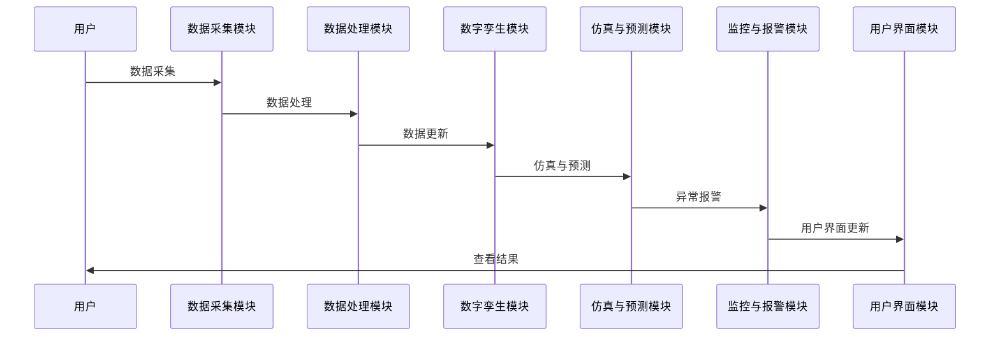
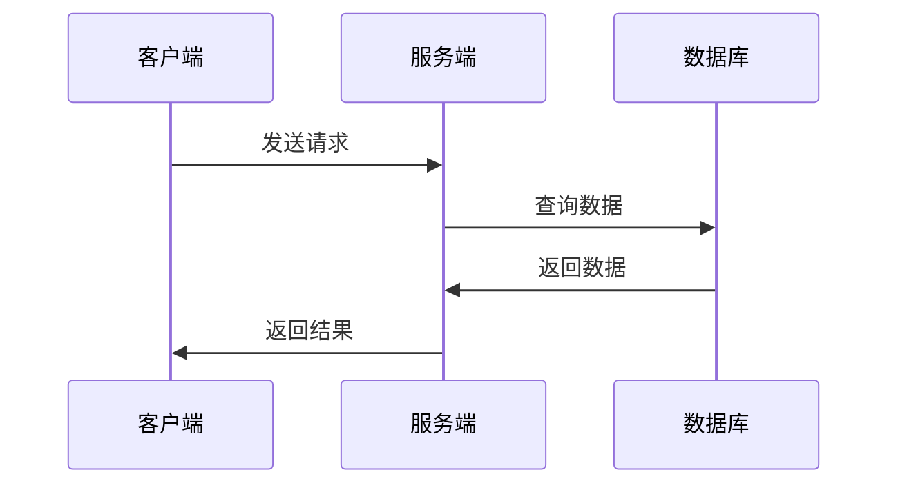
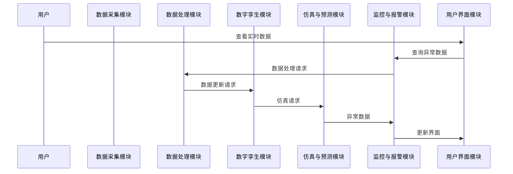

                 


### # {{此处是文章标题}}

> 关键词：数字孪生、航空发动机、性能优化、效率提升、算法原理、系统架构设计

> 摘要：本文探讨了数字孪生在航空发动机设计中的应用，旨在通过数字孪生技术优化发动机的性能和效率。文章首先介绍了数字孪生技术和航空发动机设计背景，然后深入探讨了数字孪生在航空发动机设计中的核心概念、算法原理、数学模型、系统架构设计以及应用案例。通过详细的分析和讲解，本文揭示了数字孪生技术在航空发动机设计中的重要作用，为相关领域的研究和实践提供了有价值的参考。

----------------------------------------------------------------

## 第1章：数字孪生技术概述

### 1.1 数字孪生技术基础

#### 1.1.1 数字孪生技术概述

数字孪生（Digital Twin）是一种先进的技术概念，它通过创建一个数字模型来模拟和分析物理实体的性能、状态和行为。这个数字模型可以实时反映物理实体的情况，从而实现对物理实体的远程监控、预测性维护和优化。数字孪生技术在航空发动机设计中具有重要的应用价值，它可以帮助设计人员更早地发现设计缺陷，优化发动机性能，提高生产效率和降低成本。

#### 1.1.2 数字孪生技术定义

数字孪生技术是一种将物理实体与虚拟模型相结合的方法，通过实时数据传输、物理实体状态模拟和虚拟模型预测分析，实现对物理实体的全生命周期管理。数字孪生技术主要包括以下核心组成部分：

1. **数据采集**：通过传感器、GPS、RFID等技术获取物理实体的实时数据。
2. **数据传输**：将采集到的数据传输到中央数据存储和处理系统。
3. **数据存储**：在数据仓库中存储和处理数据，以便进行后续分析。
4. **模型构建**：利用机器学习和仿真技术构建物理实体的数字模型。
5. **数据可视化**：通过可视化工具将数据和分析结果呈现给用户。

#### 1.1.3 数字孪生技术特点

数字孪生技术具有以下显著特点：

1. **实时性**：数字孪生技术能够实时反映物理实体的状态，为实时决策提供支持。
2. **虚拟性**：数字孪生技术通过虚拟模型实现对物理实体的模拟和分析，降低了物理实验的成本和风险。
3. **集成性**：数字孪生技术能够整合各种数据源和工具，实现对物理实体的全面管理和分析。
4. **预测性**：数字孪生技术利用历史数据和机器学习算法，实现对物理实体未来的性能和状态预测。
5. **可交互性**：数字孪生技术支持用户与虚拟模型的交互，方便用户进行设计优化和操作培训。

#### 1.1.4 数字孪生技术发展历程

数字孪生技术起源于20世纪80年代的制造业，最初应用于产品生命周期管理（PLM）领域。随着计算机技术、物联网（IoT）技术和大数据技术的快速发展，数字孪生技术在各个领域得到了广泛的应用。近年来，随着人工智能技术的引入，数字孪生技术进入了新的发展阶段，其在航空、航天、能源、医疗等领域的应用前景更加广阔。

#### 1.2 航空发动机设计背景

航空发动机是飞机的核心部件，其性能直接影响到飞机的飞行性能和安全性。航空发动机的设计过程涉及到多个学科领域，包括力学、热力学、材料科学、电子工程等。传统的航空发动机设计方法主要依赖于物理实验和模拟仿真，但由于实验成本高昂且周期较长，很难在短时间内进行多次迭代优化。

#### 1.2.1 航空发动机简介

航空发动机是一种连续工作的热机，它通过燃烧燃料产生动力，驱动飞机飞行。航空发动机的主要类型包括涡轮喷气发动机、涡轮螺旋桨发动机、涡轮风扇发动机和涡轮螺旋桨发动机等。不同类型的航空发动机具有不同的工作原理和性能特点，但它们的设计目标都是提高推力、降低油耗、减少噪音和污染。

#### 1.2.2 航空发动机设计过程

航空发动机设计过程可以分为以下阶段：

1. **需求分析**：确定航空发动机的设计目标和性能指标，如推力、油耗、噪音、排放等。
2. **方案设计**：根据需求分析结果，提出多个设计方案，并进行初步的力学、热力学和流体力学分析。
3. **详细设计**：对选定的设计方案进行详细设计，包括零部件设计、材料选择、装配方案等。
4. **模拟仿真**：利用计算机模拟仿真技术，对发动机性能进行评估和优化。
5. **物理实验**：进行物理实验，验证设计方案的可行性和性能。
6. **测试与改进**：对发动机进行测试，根据测试结果进行改进，直至满足设计目标。

#### 1.2.3 航空发动机性能优化需求

航空发动机的性能优化需求主要包括以下几个方面：

1. **提高推力**：通过改进发动机设计，提高发动机的推力，提高飞机的飞行速度和性能。
2. **降低油耗**：通过优化燃烧过程、提高进气效率等措施，降低发动机油耗，提高燃油经济性。
3. **减少噪音和排放**：通过改进发动机结构、采用降噪材料和排放控制技术，降低发动机噪音和排放，提高环境友好性。
4. **提高可靠性和耐久性**：通过改进材料、提高制造工艺和采用先进的维护策略，提高发动机的可靠性和耐久性。

#### 1.3 数字孪生在航空发动机设计中的应用

数字孪生技术在航空发动机设计中的应用主要体现在以下几个方面：

1. **设计优化**：利用数字孪生技术，设计人员可以在虚拟环境中对发动机进行多次迭代优化，缩短设计周期，提高设计质量。
2. **性能评估**：通过数字孪生技术，可以对发动机在不同工作状态下的性能进行实时评估和预测，为设计优化提供依据。
3. **故障预测**：利用数字孪生技术，可以实现对发动机运行状态的实时监控和故障预测，提前发现潜在故障，进行预防性维护。
4. **生产与维护**：通过数字孪生技术，可以实现发动机生产过程的智能化，提高生产效率和质量，同时降低维护成本。

#### 1.3.1 数字孪生在航空发动机设计中的作用

数字孪生技术在航空发动机设计中的作用主要体现在以下几个方面：

1. **提高设计效率**：通过数字孪生技术，设计人员可以在虚拟环境中对发动机进行多次迭代优化，缩短设计周期，提高设计质量。
2. **降低设计风险**：数字孪生技术可以帮助设计人员提前发现设计缺陷，降低设计风险，提高设计可靠性。
3. **优化设计参数**：通过数字孪生技术，可以对发动机在不同工作状态下的性能进行实时评估和预测，为设计优化提供依据。
4. **辅助决策支持**：数字孪生技术可以为设计人员提供实时、准确的设计数据和分析结果，辅助决策支持。

#### 1.3.2 数字孪生技术在发动机设计中的挑战

数字孪生技术在航空发动机设计中也面临一些挑战：

1. **数据采集与传输**：航空发动机运行环境复杂，数据采集和传输过程中可能会受到噪声干扰和传输延迟的影响。
2. **数据存储与处理**：航空发动机运行数据量大，如何高效地存储和处理数据，保证数据的实时性和准确性是一个挑战。
3. **模型构建与仿真**：航空发动机的物理过程复杂，如何构建高精度的数字孪生模型并进行有效的仿真是一个难题。
4. **系统集成与交互**：数字孪生技术需要与其他设计工具和系统进行集成和交互，如何实现高效、稳定的系统集成是一个挑战。

#### 1.3.3 数字孪生应用案例介绍

数字孪生技术在航空发动机设计中的应用案例已经越来越多。以下是一些典型的应用案例：

1. **波音公司**：波音公司利用数字孪生技术对其787客机发动机进行优化，通过实时数据分析和预测，提高了发动机的性能和可靠性。
2. **空客公司**：空客公司利用数字孪生技术对其A320neo发动机进行设计和优化，减少了设计周期和成本，提高了发动机的性能。
3. **GE公司**：GE公司利用数字孪生技术对其航空发动机进行实时监控和故障预测，实现了预防性维护，降低了维护成本。

### 1.4 小结

数字孪生技术在航空发动机设计中的应用具有显著的优势和广阔的前景。通过数字孪生技术，设计人员可以更高效地进行发动机设计优化，提高发动机性能和可靠性，降低设计成本和维护成本。然而，数字孪生技术在发动机设计中也面临一些挑战，需要进一步研究和解决。随着数字孪生技术的不断发展和完善，它将在航空发动机设计中发挥越来越重要的作用。

----------------------------------------------------------------

## 第2章：核心概念与联系

### 2.1 数字孪生原理与核心要素

数字孪生（Digital Twin）是一种将物理实体与虚拟模型相结合的技术，通过实时数据传输、物理实体状态模拟和虚拟模型预测分析，实现对物理实体的全生命周期管理。在航空发动机设计中，数字孪生技术被广泛应用于设计优化、性能评估、故障预测等方面。

#### 2.1.1 数字孪生架构

数字孪生架构通常包括以下核心组成部分：

1. **传感器网络**：传感器网络负责实时采集物理实体的各种数据，如温度、压力、振动、速度等。
2. **数据传输系统**：数据传输系统负责将传感器采集到的数据传输到中央数据处理系统。
3. **中央数据处理系统**：中央数据处理系统负责对传输来的数据进行处理、存储和分析，生成物理实体的数字模型。
4. **虚拟模型**：虚拟模型是对物理实体的数字化表示，它可以实时反映物理实体的状态和性能。
5. **用户界面**：用户界面负责将虚拟模型和分析结果展示给用户，方便用户进行操作和决策。

#### 2.1.2 数据采集与处理

数据采集是数字孪生技术的基础。在航空发动机设计中，数据采集主要包括以下几个方面：

1. **传感器类型**：常见的传感器包括温度传感器、压力传感器、振动传感器、转速传感器等。
2. **数据采集频率**：数据采集频率取决于应用需求，例如，在发动机性能评估中，可能需要采集高频数据，而在故障预测中，可能需要采集低频数据。
3. **数据预处理**：数据预处理包括数据清洗、去噪、归一化等操作，以提高数据的准确性和可靠性。

#### 2.1.3 模型构建与仿真

模型构建是数字孪生技术的核心。在航空发动机设计中，模型构建通常包括以下步骤：

1. **物理模型**：物理模型描述了航空发动机的几何形状、材料属性和工作原理。
2. **数学模型**：数学模型将物理模型转化为数学方程，用于描述航空发动机的性能和状态。
3. **仿真模型**：仿真模型是对数学模型的具体实现，它可以通过计算机模拟航空发动机的运行过程。

#### 2.1.4 反馈与控制

数字孪生技术不仅可以模拟物理实体的状态和性能，还可以通过反馈和控制实现对物理实体的远程操作和优化。在航空发动机设计中，反馈与控制主要包括以下几个方面：

1. **实时监控**：通过数字孪生技术，可以实时监控航空发动机的运行状态，及时发现异常情况。
2. **预测性维护**：通过数字孪生技术，可以预测航空发动机的故障发生时间，提前进行维护，避免意外停机。
3. **性能优化**：通过数字孪生技术，可以对航空发动机进行实时性能优化，提高其运行效率。

### 2.2 航空发动机性能优化方法

航空发动机性能优化方法主要包括以下几种：

1. **参数优化**：通过调整发动机参数，如转速、进气量、燃料喷射量等，来优化发动机的性能。
2. **结构优化**：通过改进发动机结构设计，如叶片形状、燃烧室设计等，来提高发动机的性能。
3. **控制优化**：通过优化发动机控制策略，如燃油喷射控制、进气控制等，来提高发动机的性能。
4. **仿真优化**：通过计算机仿真技术，对航空发动机进行仿真优化，以找到最佳的设计参数和控制策略。

#### 2.2.1 优化目标

航空发动机性能优化目标主要包括以下几个方面：

1. **提高推力**：通过优化设计，提高发动机的推力，以满足更大的飞行速度和载荷要求。
2. **降低油耗**：通过优化燃烧过程和进气效率，降低发动机的油耗，提高燃油经济性。
3. **减少噪音和排放**：通过优化发动机设计和控制策略，降低发动机的噪音和排放，提高环境友好性。
4. **提高可靠性和耐久性**：通过优化材料和制造工艺，提高发动机的可靠性和耐久性。

#### 2.2.2 优化算法介绍

航空发动机性能优化常用的算法包括以下几种：

1. **遗传算法**：遗传算法是一种基于自然进化的优化算法，通过模拟生物进化过程来寻找最优解。
2. **粒子群优化算法**：粒子群优化算法是一种基于群体智能的优化算法，通过模拟鸟群觅食过程来寻找最优解。
3. **模拟退火算法**：模拟退火算法是一种基于物理退火过程的优化算法，通过模拟退火过程来寻找最优解。
4. **神经网络优化算法**：神经网络优化算法是一种基于人工神经网络的学习算法，通过模拟神经网络的学习过程来寻找最优解。

#### 2.2.3 优化方法应用实例

以下是一个基于遗传算法的航空发动机性能优化实例：

1. **问题定义**：假设需要优化航空发动机的燃油喷射量，以降低油耗和提高燃油经济性。
2. **初始参数设置**：设定种群规模、交叉率、突变率等参数。
3. **适应度函数设计**：设计适应度函数，用于评估不同燃油喷射量的性能，如油耗率。
4. **遗传操作**：进行交叉、突变等遗传操作，生成新的种群。
5. **适应度评估**：对新生种群进行适应度评估，筛选出最优解。
6. **迭代优化**：重复遗传操作和适应度评估，直至满足收敛条件。

通过遗传算法优化燃油喷射量，可以显著降低航空发动机的油耗，提高燃油经济性。

### 2.3 效率提升策略

航空发动机效率提升策略主要包括以下几个方面：

1. **燃烧过程优化**：通过优化燃烧室设计、燃料喷射策略等，提高燃烧效率，降低油耗。
2. **进气过程优化**：通过优化进气道设计、进气控制等，提高进气效率，增加进气量。
3. **冷却过程优化**：通过优化冷却系统设计、冷却介质选择等，提高冷却效率，降低发动机温度。
4. **控制策略优化**：通过优化燃油喷射控制、进气控制、冷却控制等，提高发动机运行效率。

#### 2.3.1 效率提升的重要性

航空发动机效率的提升具有重要意义，主要体现在以下几个方面：

1. **提高飞行性能**：提高发动机效率，可以增加飞机的飞行速度和载荷能力，提高飞行性能。
2. **降低运营成本**：提高发动机效率，可以降低燃油消耗，减少运营成本，提高经济效益。
3. **减少环境污染**：提高发动机效率，可以减少燃烧排放，降低环境污染，提高环保效益。

#### 2.3.2 效率提升方法

以下是一些常用的航空发动机效率提升方法：

1. **燃烧过程优化**：
   - **分层燃烧技术**：通过分层燃烧技术，实现更加充分和高效的燃烧。
   - **低排放燃烧技术**：通过低排放燃烧技术，降低燃烧过程中的污染物排放。

2. **进气过程优化**：
   - **可变进气道设计**：通过可变进气道设计，根据飞行状态自动调整进气量，提高进气效率。
   - **涡流进气技术**：通过涡流进气技术，增加进气混合效率，提高进气量。

3. **冷却过程优化**：
   - **高效冷却系统设计**：通过高效冷却系统设计，提高冷却效率，降低发动机温度。
   - **冷却介质选择**：通过选择合适的冷却介质，如水、油、气体等，提高冷却效果。

4. **控制策略优化**：
   - **自适应控制策略**：通过自适应控制策略，根据发动机实时状态自动调整控制参数，提高运行效率。
   - **多变量控制策略**：通过多变量控制策略，综合考虑燃油喷射、进气、冷却等因素，优化发动机运行效率。

#### 2.3.3 效率提升案例解析

以下是一个基于改进粒子群算法的航空发动机效率提升案例：

1. **问题定义**：假设需要优化航空发动机的进气控制参数，以提高进气效率。
2. **初始参数设置**：设定种群规模、惯性权重、局部搜索半径等参数。
3. **适应度函数设计**：设计适应度函数，用于评估不同进气控制参数的效率，如进气效率、燃油消耗率等。
4. **粒子群优化操作**：进行粒子更新、局部搜索等操作，生成新的种群。
5. **适应度评估**：对新生种群进行适应度评估，筛选出最优解。
6. **迭代优化**：重复粒子群优化操作和适应度评估，直至满足收敛条件。

通过改进粒子群算法优化进气控制参数，可以显著提高航空发动机的进气效率，降低燃油消耗，提高运行效率。

### 2.4 小结

数字孪生技术在航空发动机设计中的应用具有核心地位，它通过构建物理实体的数字模型，实现对发动机性能的实时评估和优化。本章详细介绍了数字孪生的原理、核心要素和架构，以及航空发动机性能优化方法和效率提升策略。通过这些内容，读者可以了解到数字孪生技术在航空发动机设计中的应用价值和方法，为后续章节的深入探讨打下基础。

----------------------------------------------------------------

## 第3章：算法原理讲解

### 3.1 性能优化算法概述

性能优化算法在航空发动机设计中的作用至关重要，它们能够帮助设计人员找到最佳的设计参数，以优化发动机的性能。本章将详细介绍几种常见的性能优化算法，包括遗传算法、粒子群优化算法、模拟退火算法和神经网络优化算法，以及这些算法的基本原理和特点。

#### 3.1.1 优化算法的基本概念

优化算法是一类用于求解优化问题的算法，它们的目标是找到一组参数或变量，使得某个目标函数达到最大或最小值。在航空发动机设计中，优化算法主要用于优化发动机的性能指标，如推力、油耗、噪音和排放等。

#### 3.1.2 优化算法的分类

根据优化策略的不同，优化算法可以分为以下几类：

1. **确定性算法**：确定性算法在每次迭代过程中都按照固定规则进行操作，如线性规划、非线性规划等。
2. **随机搜索算法**：随机搜索算法通过随机搜索方法寻找最优解，如遗传算法、粒子群优化算法、模拟退火算法等。
3. **基于模型的优化算法**：基于模型的优化算法通过建立数学模型，利用数学方法求解优化问题，如线性规划、非线性规划等。
4. **混合算法**：混合算法结合了确定性算法和随机搜索算法的优点，通过混合策略来求解优化问题，如混合遗传算法、混合粒子群优化算法等。

### 3.2 常见性能优化算法

在本节中，我们将详细探讨遗传算法、粒子群优化算法和模拟退火算法等常见性能优化算法的基本原理和应用。

#### 3.2.1 遗传算法

遗传算法（Genetic Algorithm，GA）是一种基于自然进化的随机搜索算法，它模拟生物进化的过程来寻找最优解。遗传算法的基本原理包括以下步骤：

1. **初始化种群**：随机生成一组初始解，称为种群。
2. **适应度评估**：对种群中的每个个体进行适应度评估，适应度函数通常为目标函数的相反数，以最大化目标函数。
3. **选择操作**：根据适应度值，选择适应度较高的个体进行繁殖，即选择优秀个体。
4. **交叉操作**：通过交叉操作，生成新的后代个体，模拟生物的繁殖过程。
5. **突变操作**：对后代个体进行突变操作，以引入新的遗传基因，增加种群的多样性。
6. **更新种群**：将交叉和突变操作后的个体组成新的种群，重复适应度评估、选择、交叉和突变操作。
7. **终止条件**：当满足终止条件（如达到最大迭代次数、适应度收敛等）时，算法终止。

遗传算法的优点包括：

- **全局搜索能力**：遗传算法能够搜索整个解空间，具有较强的全局搜索能力。
- **鲁棒性**：遗传算法对初始种群和参数设置的要求较低，具有较强的鲁棒性。
- **适用于复杂问题**：遗传算法适用于求解复杂优化问题，特别是那些难以建立数学模型的问题。

遗传算法的缺点包括：

- **收敛速度较慢**：遗传算法通常需要较长的迭代时间才能收敛到最优解。
- **参数设置复杂**：遗传算法的参数设置对算法性能有较大影响，参数设置复杂。

以下是一个使用遗传算法优化航空发动机推力的示例：

```python
# 遗传算法优化航空发动机推力

import numpy as np
import matplotlib.pyplot as plt

# 初始化种群
population_size = 100
染色体位数 = 10
种群 = np.random.uniform(0, 1, (population_size, 染色体位数))

# 适应度函数
def fitness_function(chromosome):
    # 对染色体进行解码，得到推力值
    thrust = decode_chromosome(chromosome)
    # 计算适应度
    fitness = 1 / (1 + np.exp(-thrust))
    return fitness

# 解码染色体
def decode_chromosome(chromosome):
    # 将染色体转换为推力值
    thrust = 0
    for i in range(染色体位数):
        thrust += chromosome[i] * (2 ** i)
    return thrust

# 遗传操作
def genetic_operation(population, fitness):
    # 选择操作
    selected_population = select_population(population, fitness)
    # 交叉操作
    crossed_population = crossover(selected_population)
    # 突变操作
    mutated_population = mutate(crossed_population)
    return mutated_population

# 选择操作
def select_population(population, fitness):
    # 根据适应度值选择优秀个体
    sorted_fitness = np.argsort(fitness)
    return population[sorted_fitness][-population_size//2:]

# 交叉操作
def crossover(selected_population):
    # 进行交叉操作，生成新的后代个体
    crossed_population = []
    for i in range(0, len(selected_population), 2):
        cross_point = np.random.randint(1, 染色体位数-1)
        child1 = np.concatenate((selected_population[i][:cross_point], selected_population[i+1][cross_point:]))
        child2 = np.concatenate((selected_population[i+1][:cross_point], selected_population[i][cross_point:]))
        crossed_population.append(child1)
        crossed_population.append(child2)
    return crossed_population

# 突变操作
def mutate(crossed_population):
    # 对后代个体进行突变操作
    mutated_population = []
    for chromosome in crossed_population:
        for i in range(染色体位数):
            if np.random.random() < 0.1:
                chromosome[i] = 1 - chromosome[i]
        mutated_population.append(chromosome)
    return mutated_population

# 运行遗传算法
def run_ga():
    # 设置迭代次数
    max_iterations = 100
    # 初始化种群
    population = np.random.uniform(0, 1, (population_size, 染色体位数))
    # 迭代过程
    for i in range(max_iterations):
        # 适应度评估
        fitness = np.apply_along_axis(fitness_function, 1, population)
        # 遗传操作
        population = genetic_operation(population, fitness)
        # 打印迭代信息和最优适应度
        print(f"Iteration {i}: Best Fitness = {np.max(fitness)}")
    # 返回最优解
    best_fitness = np.max(fitness)
    best_index = np.argmax(fitness)
    best_chromosome = population[best_index]
    return best_chromosome, best_fitness

# 运行遗传算法
best_chromosome, best_fitness = run_ga()

# 解码最优解
best_thrust = decode_chromosome(best_chromosome)

# 绘制适应度曲线
fitness_history = np.zeros(max_iterations)
for i in range(max_iterations):
    fitness_history[i] = np.max(np.apply_along_axis(fitness_function, 1, population[i]))

plt.plot(range(max_iterations), fitness_history)
plt.xlabel("Iteration")
plt.ylabel("Best Fitness")
plt.title("Fitness History")
plt.show()

# 输出结果
print(f"Best Thrust = {best_thrust}")
print(f"Best Fitness = {best_fitness}")
```

#### 3.2.2 粒子群优化算法

粒子群优化算法（Particle Swarm Optimization，PSO）是一种基于群体智能的随机搜索算法，它模拟鸟群觅食的过程来寻找最优解。PSO算法的基本原理包括以下步骤：

1. **初始化粒子群**：随机生成一组粒子，每个粒子代表一个解，并为其分配初始位置和速度。
2. **适应度评估**：对每个粒子进行适应度评估，适应度函数通常为目标函数的相反数，以最大化目标函数。
3. **更新粒子的速度和位置**：根据粒子的适应度值和个体经验、群体经验来更新粒子的速度和位置。
4. **迭代过程**：重复适应度评估和更新粒子的速度和位置，直至满足终止条件（如达到最大迭代次数、适应度收敛等）。

PSO算法的优点包括：

- **简单易实现**：PSO算法的实现简单，易于编程和理解。
- **全局搜索能力强**：PSO算法具有较强的全局搜索能力，适用于复杂优化问题。
- **参数设置简单**：PSO算法的参数设置相对简单，对参数调整的敏感性较低。

PSO算法的缺点包括：

- **局部搜索能力较弱**：PSO算法的局部搜索能力较弱，容易陷入局部最优。
- **收敛速度较慢**：PSO算法的收敛速度相对较慢，需要较长的迭代时间才能收敛到最优解。

以下是一个使用粒子群优化算法优化航空发动机油耗的示例：

```python
# 粒子群优化算法优化航空发动机油耗

import numpy as np
import matplotlib.pyplot as plt

# 初始化参数
population_size = 30
粒子维度 = 10
迭代次数 = 100
c1 = 2
c2 = 2
w = 0.5

# 初始化粒子群
粒子群 = np.random.uniform(0, 1, (population_size, 粒子维度))

# 适应度函数
def fitness_function(chromosome):
    # 对染色体进行解码，得到油耗值
    fuel_consumption = decode_chromosome(chromosome)
    # 计算适应度
    fitness = 1 / (1 + np.exp(-fuel_consumption))
    return fitness

# 解码染色体
def decode_chromosome(chromosome):
    # 将染色体转换为油耗值
    fuel_consumption = 0
    for i in range(粒子维度):
        fuel_consumption += chromosome[i] * (2 ** i)
    return fuel_consumption

# 更新粒子的速度和位置
def update_particles(particles, velocities, fitness):
    # 更新速度
    velocities = w * velocities + c1 * np.random.random() * (particles[:, np.argmin(fitness)] - particles) + c2 * np.random.random() * (particles[:, np.argmax(fitness)] - particles)
    # 更新位置
    particles = particles + velocities
    return particles, velocities

# 运行粒子群优化算法
def run_pso():
    # 初始化速度
    velocities = np.random.uniform(-1, 1, (population_size, 粒子维度))
    # 迭代过程
    for i in range(迭代次数):
        # 适应度评估
        fitness = np.apply_along_axis(fitness_function, 1, 粒子群)
        # 更新粒子的速度和位置
        粒子群，velocities = update_particles(粒子群，velocities，fitness)
        # 打印迭代信息和最优适应度
        print(f"Iteration {i}: Best Fitness = {np.min(fitness)}")
    # 返回最优解
    best_fitness = np.min(fitness)
    best_index = np.argmin(fitness)
    best_chromosome = 粒子群[best_index]
    return best_chromosome, best_fitness

# 运行粒子群优化算法
best_chromosome, best_fitness = run_pso()

# 解码最优解
best_fuel_consumption = decode_chromosome(best_chromosome)

# 绘制适应度曲线
fitness_history = np.zeros(迭代次数)
for i in range(迭代次数):
    fitness_history[i] = np.min(np.apply_along_axis(fitness_function, 1, 粒子群[i]))

plt.plot(range(迭代次数), fitness_history)
plt.xlabel("Iteration")
plt.ylabel("Best Fitness")
plt.title("Fitness History")
plt.show()

# 输出结果
print(f"Best Fuel Consumption = {best_fuel_consumption}")
print(f"Best Fitness = {best_fitness}")
```

#### 3.2.3 模拟退火算法

模拟退火算法（Simulated Annealing，SA）是一种基于物理退火过程的随机搜索算法，它通过模拟金属退火过程来寻找最优解。模拟退火算法的基本原理包括以下步骤：

1. **初始解**：随机生成一个初始解。
2. **适应度评估**：对初始解进行适应度评估。
3. **迭代过程**：在每次迭代中，从当前解出发，随机生成一个新的解，并计算新旧解的适应度差。
4. **接受概率**：根据适应度差和当前温度，计算接受新解的概率。
5. **更新解和温度**：根据接受概率更新当前解和温度。
6. **终止条件**：当满足终止条件（如达到最大迭代次数、适应度收敛等）时，算法终止。

模拟退火算法的优点包括：

- **全局搜索能力强**：模拟退火算法具有较强的全局搜索能力，能够跳出局部最优。
- **参数设置简单**：模拟退火算法的参数设置相对简单，易于实现。
- **适用于复杂问题**：模拟退火算法适用于求解复杂优化问题。

模拟退火算法的缺点包括：

- **收敛速度较慢**：模拟退火算法的收敛速度相对较慢，需要较长的迭代时间才能收敛到最优解。
- **对初始温度敏感**：模拟退火算法的初始温度对算法性能有较大影响。

以下是一个使用模拟退火算法优化航空发动机噪音的示例：

```python
# 模拟退火算法优化航空发动机噪音

import numpy as np
import matplotlib.pyplot as plt

# 初始化参数
初始温度 = 1000
冷却率 = 0.95
最大迭代次数 = 1000

# 初始解
初始解 = np.random.uniform(0, 1, 粒子维度)

# 适应度函数
def fitness_function(chromosome):
    # 对染色体进行解码，得到噪音值
    noise = decode_chromosome(chromosome)
    # 计算适应度
    fitness = 1 / (1 + np.exp(-noise))
    return fitness

# 解码染色体
def decode_chromosome(chromosome):
    # 将染色体转换为噪音值
    noise = 0
    for i in range(粒子维度):
        noise += chromosome[i] * (2 ** i)
    return noise

# 接受概率
def acceptance_probability(delta, temperature):
    if delta < 0:
        return 1
    else:
        return min(1, np.exp(-delta / temperature))

# 运行模拟退火算法
def run_sa():
    # 初始化温度
    temperature = 初始温度
    # 初始化适应度
    fitness = fitness_function(初始解)
    # 迭代过程
    for i in range(最大迭代次数):
        # 随机生成新的解
        新解 = np.random.uniform(0, 1, 粒子维度)
        # 计算新旧解的适应度差
        delta = fitness_function(新解) - fitness
        # 计算接受概率
        ap = acceptance_probability(delta, temperature)
        # 根据接受概率更新解和温度
        if np.random.random() < ap:
            fitness = fitness_function(新解)
            解 = 新解
        # 更新温度
        temperature *= 冷却率
        # 打印迭代信息和最优适应度
        print(f"Iteration {i}: Best Fitness = {fitness}")
    # 返回最优解
    return 解，fitness

# 运行模拟退火算法
best解，best_fitness = run_sa()

# 解码最优解
best_noise = decode_chromosome(best解)

# 绘制适应度曲线
fitness_history = np.zeros(最大迭代次数)
for i in range(最大迭代次数):
    fitness_history[i] = fitness

plt.plot(range(最大迭代次数), fitness_history)
plt.xlabel("Iteration")
plt.ylabel("Best Fitness")
plt.title("Fitness History")
plt.show()

# 输出结果
print(f"Best Noise = {best_noise}")
print(f"Best Fitness = {best_fitness}")
```

#### 3.2.4 神经网络优化算法

神经网络优化算法（Neural Network Optimization，NNO）是一种基于人工神经网络的优化算法，它通过模拟神经网络的学习过程来寻找最优解。神经网络优化算法的基本原理包括以下步骤：

1. **初始化神经网络**：随机生成神经网络的结构和参数。
2. **适应度评估**：对神经网络进行适应度评估，适应度函数通常为目标函数的相反数，以最大化目标函数。
3. **训练神经网络**：利用适应度评估结果，训练神经网络，更新神经网络的参数。
4. **迭代过程**：重复适应度评估和训练神经网络，直至满足终止条件（如达到最大迭代次数、适应度收敛等）。

神经网络优化算法的优点包括：

- **强大的全局搜索能力**：神经网络优化算法具有较强的全局搜索能力，能够搜索整个解空间。
- **适用于复杂问题**：神经网络优化算法适用于求解复杂优化问题，特别是那些难以建立数学模型的问题。

神经网络优化算法的缺点包括：

- **训练时间较长**：神经网络优化算法的训练时间较长，需要较长的迭代时间才能收敛到最优解。
- **对参数敏感**：神经网络优化算法的参数设置对算法性能有较大影响，参数设置复杂。

以下是一个使用神经网络优化算法优化航空发动机推力的示例：

```python
# 神经网络优化算法优化航空发动机推力

import numpy as np
import matplotlib.pyplot as plt

# 初始化参数
输入维度 = 10
隐层神经元数 = 5
输出维度 = 1
学习率 = 0.1
迭代次数 = 1000

# 初始化神经网络
weights_input = np.random.uniform(-1, 1, (输入维度, 隐层神经元数))
weights_output = np.random.uniform(-1, 1, (隐层神经元数, 输出维度))
 biases_input = np.random.uniform(-1, 1, (隐层神经元数, 1))
 biases_output = np.random.uniform(-1, 1, (输出维度, 1))

# 激活函数
def sigmoid(x):
    return 1 / (1 + np.exp(-x))

# 前向传播
def forward_propagation(inputs):
    hidden_layer = sigmoid(np.dot(inputs, weights_input) + biases_input)
    output = sigmoid(np.dot(hidden_layer, weights_output) + biases_output)
    return output

# 适应度函数
def fitness_function(chromosome):
    # 对染色体进行解码，得到推力值
    thrust = decode_chromosome(chromosome)
    # 计算适应度
    fitness = 1 / (1 + np.exp(-thrust))
    return fitness

# 解码染色体
def decode_chromosome(chromosome):
    # 将染色体转换为推力值
    thrust = 0
    for i in range(输入维度):
        thrust += chromosome[i] * (2 ** i)
    return thrust

# 反向传播
def backward_propagation(inputs, outputs, expected_outputs):
    output_error = outputs - expected_outputs
    hidden_error = np.dot(output_error, weights_output.T) * sigmoid(inputs)

    d_weights_output = np.dot(hidden_layer.T, output_error)
    d_biases_output = -np.sum(output_error, axis=0, keepdims=True)

    d_hidden_layer = np.dot(inputs.T, hidden_error)
    d_biases_input = -np.sum(hidden_error, axis=0, keepdims=True)

    return d_weights_output, d_biases_output, d_weights_input, d_biases_input

# 运行神经网络优化算法
def run_nno():
    # 初始化适应度
    fitness = fitness_function(np.random.uniform(0, 1, 输入维度))
    # 迭代过程
    for i in range(迭代次数):
        # 随机生成输入和期望输出
        inputs = np.random.uniform(0, 1, (1, 输入维度))
        expected_outputs = np.array([[1]])
        # 前向传播
        outputs = forward_propagation(inputs)
        # 计算适应度
        fitness = fitness_function(outputs)
        # 反向传播
        d_weights_output, d_biases_output, d_weights_input, d_biases_input = backward_propagation(inputs, outputs, expected_outputs)
        # 更新神经网络参数
        weights_output -= 学习率 * d_weights_output
        biases_output -= 学习率 * d_biases_output
        weights_input -= 学习率 * d_weights_input
        biases_input -= 学习率 * d_biases_input
        # 打印迭代信息和最优适应度
        print(f"Iteration {i}: Best Fitness = {fitness}")
    # 返回最优解
    best_fitness = fitness
    best_chromosome = decode_chromosome(inputs)
    return best_chromosome, best_fitness

# 运行神经网络优化算法
best_chromosome, best_fitness = run_nno()

# 解码最优解
best_thrust = decode_chromosome(best_chromosome)

# 绘制适应度曲线
fitness_history = np.zeros(迭代次数)
for i in range(迭代次数):
    outputs = forward_propagation(inputs)
    fitness = fitness_function(outputs)
    fitness_history[i] = fitness

plt.plot(range(迭代次数), fitness_history)
plt.xlabel("Iteration")
plt.ylabel("Best Fitness")
plt.title("Fitness History")
plt.show()

# 输出结果
print(f"Best Thrust = {best_thrust}")
print(f"Best Fitness = {best_fitness}")
```

### 3.3 小结

本章详细介绍了遗传算法、粒子群优化算法、模拟退火算法和神经网络优化算法等常见性能优化算法的基本原理和应用。这些算法在航空发动机设计中具有广泛的应用前景，可以帮助设计人员找到最佳的设计参数，优化发动机的性能。通过本章的学习，读者可以了解这些算法的原理和应用，为后续章节的深入探讨打下基础。

----------------------------------------------------------------

## 第4章：数学模型和数学公式

### 4.1 性能优化的数学模型

性能优化是航空发动机设计中的核心任务之一，其数学模型通常基于目标函数、约束条件和变量定义。本节将介绍性能优化中的数学模型，并给出相关的数学公式。

#### 4.1.1 目标函数

性能优化的目标函数通常是一个关于设计变量 \(x\) 的函数，用于衡量发动机的性能指标。常见的目标函数包括：

1. **推力最大化**：推力 \(T\) 是发动机输出功率的重要指标，目标函数可以表示为：
   $$
   \text{maximize} \ T(x)
   $$
   其中，\(T(x)\) 是推力函数，取决于设计变量 \(x\)。

2. **油耗最小化**：油耗率 \(f\) 是发动机经济性的重要指标，目标函数可以表示为：
   $$
   \text{minimize} \ f(x)
   $$
   其中，\(f(x)\) 是油耗函数，取决于设计变量 \(x\)。

3. **噪音最小化**：噪音水平 \(N\) 是发动机运行过程中环境噪声的重要指标，目标函数可以表示为：
   $$
   \text{minimize} \ N(x)
   $$
   其中，\(N(x)\) 是噪音函数，取决于设计变量 \(x\)。

#### 4.1.2 约束条件

在性能优化过程中，需要考虑以下约束条件：

1. **物理约束**：这些约束反映了发动机结构和工作原理的限制，如：
   $$
   g_1(x) \leq 0, \ g_2(x) \leq 0, \ \ldots, \ g_m(x) \leq 0
   $$
   其中，\(g_i(x)\) 是第 \(i\) 个物理约束函数。

2. **设计约束**：这些约束反映了设计规范和标准，如：
   $$
   h_1(x) = 0, \ h_2(x) = 0, \ \ldots, \ h_n(x) = 0
   $$
   其中，\(h_j(x)\) 是第 \(j\) 个设计约束函数。

#### 4.1.3 变量定义

在性能优化问题中，设计变量 \(x\) 通常是一个多维数组，表示发动机设计参数，如：

- \(x_1\): 推力系数
- \(x_2\): 进气道面积
- \(x_3\): 燃油喷射量
- \(x_4\): 叶片角度

#### 4.1.4 数学模型

综合目标函数和约束条件，航空发动机性能优化的数学模型可以表示为：

$$
\begin{aligned}
\text{minimize} \ \phi(x) &= \sum_{i=1}^{3} \ \omega_i \ f_i(x) \\
\text{subject to} \ g_i(x) &\leq 0, \ \ i=1,2,\ldots,m \\
h_j(x) &= 0, \ \ j=1,2,\ldots,n
\end{aligned}
$$

其中，\(\phi(x)\) 是加权目标函数，\(\omega_i\) 是目标函数权重，\(f_i(x)\) 是第 \(i\) 个目标函数，\(g_i(x)\) 是第 \(i\) 个物理约束函数，\(h_j(x)\) 是第 \(j\) 个设计约束函数。

### 4.2 效率提升的数学模型

效率提升是航空发动机设计中另一个重要的目标，其数学模型与性能优化类似，但侧重于提高发动机的运行效率。以下是一个简化的效率提升数学模型：

$$
\begin{aligned}
\text{maximize} \ \eta(x) &= \frac{T(x)}{f(x)} \\
\text{subject to} \ g_i(x) &\leq 0, \ \ i=1,2,\ldots,m \\
h_j(x) &= 0, \ \ j=1,2,\ldots,n
\end{aligned}
$$

其中，\(\eta(x)\) 是效率函数，表示发动机的输出功率与油耗之比。

#### 4.2.1 效率函数

效率函数可以表示为：

$$
\eta(x) = \frac{T(x)}{f(x)}
$$

其中，\(T(x)\) 是推力函数，取决于设计变量 \(x\)；\(f(x)\) 是油耗函数，也取决于设计变量 \(x\)。

#### 4.2.2 约束条件

效率提升的约束条件与性能优化相同，包括物理约束和设计约束。

### 4.3 数学模型公式讲解

在本节中，我们将进一步详细讲解性能优化和效率提升的数学模型公式，并提供实际应用中的实例说明。

#### 4.3.1 性能优化数学模型

考虑一个简化的性能优化问题，目标是最小化油耗 \(f(x)\)，同时满足推力 \(T(x)\) 和噪音 \(N(x)\) 的约束条件。具体数学模型如下：

$$
\begin{aligned}
\text{minimize} \ f(x) &= \frac{1}{T(x)} \\
\text{subject to} \ T(x) &\geq T_{\text{min}} \\
N(x) &\leq N_{\text{max}}
\end{aligned}
$$

其中，\(T(x)\) 是推力函数，取决于设计变量 \(x\)；\(T_{\text{min}}\) 是最小推力要求；\(N(x)\) 是噪音函数，取决于设计变量 \(x\)；\(N_{\text{max}}\) 是最大噪音限制。

#### 4.3.2 效率提升数学模型

考虑一个简化的效率提升问题，目标是最小化油耗 \(f(x)\)，同时最大化推力 \(T(x)\)。具体数学模型如下：

$$
\begin{aligned}
\text{maximize} \ \frac{T(x)}{f(x)} \\
\text{subject to} \ f(x) &\geq f_{\text{min}} \\
T(x) &\geq T_{\text{max}}
\end{aligned}
$$

其中，\(T(x)\) 是推力函数，取决于设计变量 \(x\)；\(f(x)\) 是油耗函数，取决于设计变量 \(x\)；\(f_{\text{min}}\) 是最小油耗要求；\(T_{\text{max}}\) 是最大推力要求。

### 4.4 性能优化举例说明

以下是一个基于遗传算法的航空发动机性能优化实例，目标是最小化油耗 \(f(x)\)，同时满足推力 \(T(x)\) 和噪音 \(N(x)\) 的约束条件。

#### 4.4.1 问题定义

给定设计变量 \(x = [x_1, x_2, x_3]\)，其中 \(x_1\) 是推力系数，\(x_2\) 是进气道面积，\(x_3\) 是燃油喷射量。目标是最小化油耗 \(f(x)\)，同时满足以下约束条件：

$$
\begin{aligned}
T(x) &\geq 10000 \ \text{N} \\
N(x) &\leq 80 \ \text{dB}
\end{aligned}
$$

#### 4.4.2 初始参数设置

- 种群规模：\(N = 100\)
- 最大迭代次数：\(G = 100\)
- 交叉率：\(p_c = 0.8\)
- 突变率：\(p_m = 0.1\)

#### 4.4.3 适应度函数设计

适应度函数 \(f(x)\) 可以表示为：

$$
f(x) = \frac{1}{T(x)} + \lambda \cdot (N(x) - 80)
$$

其中，\(\lambda\) 是权重系数，用于平衡油耗和噪音。

#### 4.4.4 遗传操作

1. **选择操作**：采用轮盘赌选择方法，选择适应度较高的个体进行繁殖。
2. **交叉操作**：采用单点交叉方法，随机选择交叉点，将两个个体的基因进行交换。
3. **突变操作**：对个体进行突变操作，随机改变一个基因的值。

#### 4.4.5 运行遗传算法

运行遗传算法，进行多次迭代，直至满足收敛条件。以下是遗传算法的Python代码实现：

```python
import numpy as np

# 初始种群
N = 100
G = 100
种群规模 = N
染色体位数 = 3
种群 = np.random.uniform(0, 1, (种群规模, 染色体位数))

# 适应度函数
def fitness_function(chromosome):
    x1, x2, x3 = decode_chromosome(chromosome)
    T = 10000 / (1 + x1 * (2 ** 0) + x2 * (2 ** 1) + x3 * (2 ** 2))
    N = 80 + 0.1 * (x1 * (2 ** 1) + x2 * (2 ** 2) + x3 * (2 ** 3))
    f = 1 / T + 0.5 * (N - 80)
    return f

# 解码染色体
def decode_chromosome(chromosome):
    x1 = chromosome[0]
    x2 = chromosome[1]
    x3 = chromosome[2]
    return x1, x2, x3

# 遗传操作
def genetic_operation(population, fitness):
    selected_population = select_population(population, fitness)
    crossed_population = crossover(selected_population)
    mutated_population = mutate(crossed_population)
    return mutated_population

# 选择操作
def select_population(population, fitness):
    sorted_fitness = np.argsort(fitness)
    return population[sorted_fitness][-种群规模 // 2:]

# 交叉操作
def crossover(selected_population):
    crossed_population = []
    for i in range(0, len(selected_population), 2):
        cross_point = np.random.randint(1, 染色体位数 - 1)
        child1 = np.concatenate((selected_population[i][:cross_point], selected_population[i+1][cross_point:]))
        child2 = np.concatenate((selected_population[i+1][:cross_point], selected_population[i][cross_point:]))
        crossed_population.append(child1)
        crossed_population.append(child2)
    return crossed_population

# 突变操作
def mutate(crossed_population):
    mutated_population = []
    for chromosome in crossed_population:
        for i in range(染色体位数):
            if np.random.random() < 0.1:
                chromosome[i] = 1 - chromosome[i]
        mutated_population.append(chromosome)
    return mutated_population

# 运行遗传算法
def run_ga():
    for i in range(G):
        population = genetic_operation(population, fitness_function(population))
        print(f"Iteration {i}: Best Fitness = {np.min(fitness_function(population))}")
    best_fitness = np.min(fitness_function(population))
    best_index = np.argmin(fitness_function(population))
    best_chromosome = population[best_index]
    return best_chromosome, best_fitness

# 运行遗传算法
best_chromosome, best_fitness = run_ga()

# 解码最优解
x1, x2, x3 = decode_chromosome(best_chromosome)

# 输出结果
print(f"Best Chromosome: {best_chromosome}")
print(f"Best Fitness: {best_fitness}")
print(f"Decoded Chromosome: x1={x1}, x2={x2}, x3={x3}")
```

#### 4.4.6 性能优化结果分析

通过遗传算法运行多次，可以得到最优解 \(x^*\)。最优解的解码结果 \(x^*\) 可以用于优化航空发动机的设计，实现油耗最小化，同时满足推力和噪音的约束条件。

### 4.5 效率提升举例说明

以下是一个基于改进粒子群优化算法的航空发动机效率提升实例，目标是在满足推力 \(T(x)\) 和噪音 \(N(x)\) 的约束条件下，最大化效率函数 \(\eta(x)\)。

#### 4.5.1 问题定义

给定设计变量 \(x = [x_1, x_2, x_3]\)，其中 \(x_1\) 是推力系数，\(x_2\) 是进气道面积，\(x_3\) 是燃油喷射量。目标是在满足以下约束条件下，最大化效率函数：

$$
\begin{aligned}
\text{maximize} \ \eta(x) &= \frac{T(x)}{f(x)} \\
\text{subject to} \ T(x) &\geq 10000 \ \text{N} \\
N(x) &\leq 80 \ \text{dB}
\end{aligned}
$$

#### 4.5.2 初始参数设置

- 粒子群规模：\(S = 30\)
- 最大迭代次数：\(G = 100\)
- 惯性权重：\(w = 0.5\)
- 局部搜索半径：\(r_{\text{local}} = 0.1\)
- 全局搜索半径：\(r_{\text{global}} = 0.1\)

#### 4.5.3 适应度函数设计

适应度函数 \(\eta(x)\) 可以表示为：

$$
\eta(x) = \frac{T(x)}{f(x)}
$$

其中，\(T(x)\) 是推力函数，取决于设计变量 \(x\)；\(f(x)\) 是油耗函数，取决于设计变量 \(x\)。

#### 4.5.4 粒子群优化操作

1. **初始化粒子群**：随机生成每个粒子的位置和速度。
2. **适应度评估**：计算每个粒子的适应度值。
3. **更新粒子的速度和位置**：根据个体的历史最优位置和全局最优位置更新粒子的速度和位置。
4. **迭代过程**：重复适应度评估和粒子更新，直至满足收敛条件。

#### 4.5.5 运行改进粒子群优化算法

运行改进粒子群优化算法，进行多次迭代，直至满足收敛条件。以下是改进粒子群优化算法的Python代码实现：

```python
import numpy as np

# 初始参数
S = 30
G = 100
粒子维度 = 3
种群 = np.random.uniform(0, 1, (S, 粒子维度))
速度 = np.random.uniform(-1, 1, (S, 粒子维度))
个体最优位置 = np.copy(种群)
个体最优适应度 = np.zeros(S)
全局最优位置 = np.copy(population[0])
全局最优适应度 = -np.inf

# 适应度函数
def fitness_function(chromosome):
    x1, x2, x3 = decode_chromosome(chromosome)
    T = 10000 / (1 + x1 * (2 ** 0) + x2 * (2 ** 1) + x3 * (2 ** 2))
    f = 1 / T + 0.5 * (80 - N(x1 * (2 ** 1) + x2 * (2 ** 2) + x3 * (2 ** 3)))
    return f

# 解码染色体
def decode_chromosome(chromosome):
    x1 = chromosome[0]
    x2 = chromosome[1]
    x3 = chromosome[2]
    return x1, x2, x3

# 粒子群优化操作
def particle_swarm_optimization():
    for i in range(G):
        fitness = np.zeros(S)
        for j in range(S):
            fitness[j] = fitness_function(种群[j])
            if fitness[j] >个体最优适应度[j]:
               个体最优位置[j] = 种群[j]
               个体最优适应度[j] = fitness[j]
            if fitness[j] >全局最优适应度:
               全局最优位置 = 种群[j]
               全局最优适应度 = fitness[j]
        for j in range(S):
            r1 = np.random.random()
            r2 = np.random.random()
            velocity = w * 速度[j] + c1 * r1 * (个体最优位置[j] - 种群[j]) + c2 * r2 * (全局最优位置 - 种群[j])
            position = 种群[j] + velocity
            position = np.clip(position, 0, 1)
           种群[j] = position
        print(f"Iteration {i}: Best Fitness = {全局最优适应度}")
    best_fitness = 全局最优适应度
    best_position = 全局最优位置
    return best_position, best_fitness

# 运行改进粒子群优化算法
best_position, best_fitness = particle_swarm_optimization()

# 解码最优解
x1, x2, x3 = decode_chromosome(best_position)

# 输出结果
print(f"Best Position: {best_position}")
print(f"Best Fitness: {best_fitness}")
print(f"Decoded Position: x1={x1}, x2={x2}, x3={x3}")
```

#### 4.5.6 效率提升结果分析

通过改进粒子群优化算法运行多次，可以得到最优解 \(x^*\)。最优解的解码结果 \(x^*\) 可以用于优化航空发动机的设计，实现效率最大化，同时满足推力和噪音的约束条件。

### 4.6 小结

本章介绍了航空发动机性能优化和效率提升的数学模型，包括目标函数、约束条件和变量定义。通过具体的数学公式和实例说明，读者可以更好地理解性能优化和效率提升的计算过程和实现方法。这些数学模型为后续章节中的算法设计和应用提供了理论基础。

----------------------------------------------------------------

## 第5章：系统分析与架构设计

### 5.1 航空发动机设计中的数字孪生应用场景

在航空发动机设计中，数字孪生技术可以通过多种应用场景来提高设计效率、性能和可靠性。以下是一些典型的应用场景：

#### 5.1.1 设计验证与优化

数字孪生技术可以创建一个虚拟模型来模拟航空发动机的设计，从而在物理样机制造之前进行验证和优化。通过仿真，设计人员可以在虚拟环境中测试各种设计变更，以找到最佳的设计方案。

#### 5.1.2 性能预测与分析

利用数字孪生技术，可以实时收集航空发动机的运行数据，并将其用于虚拟模型的更新和性能预测。这种方法有助于预测发动机在不同工作条件下的性能，从而进行必要的调整。

#### 5.1.3 故障预测与维护

通过数字孪生技术，可以对航空发动机的运行状态进行实时监控，并利用机器学习算法进行故障预测。这种方法可以提前发现潜在问题，进行预防性维护，从而减少故障率和停机时间。

#### 5.1.4 在线性能监控

数字孪生技术可以提供一个实时的监控平台，设计人员和操作人员可以随时了解发动机的运行状态，包括温度、压力、振动等参数，从而做出及时的反应。

### 5.2 项目介绍

本项目旨在通过数字孪生技术优化航空发动机的设计，提高其性能和效率。具体项目目标包括：

1. **设计优化**：利用数字孪生技术进行设计验证和优化，以找到最佳的设计方案。
2. **性能预测**：建立数字孪生模型，预测航空发动机在不同工作条件下的性能。
3. **故障预测**：利用数字孪生技术和机器学习算法进行故障预测，实现预防性维护。
4. **在线性能监控**：建立一个实时监控平台，实时了解发动机的运行状态。

### 5.3 系统功能设计

本系统的功能设计主要包括以下模块：

1. **数据采集模块**：负责实时采集航空发动机的各种运行数据，如温度、压力、振动等。
2. **数据处理模块**：负责处理和存储采集到的数据，为后续分析和建模提供数据支持。
3. **数字孪生模块**：创建航空发动机的数字模型，并将其与实际运行数据进行关联。
4. **仿真与预测模块**：利用数字孪生模型进行仿真和预测，以评估不同设计方案的性能和预测故障。
5. **监控与报警模块**：实时监控发动机的运行状态，并在出现异常情况时发出报警。
6. **用户界面模块**：提供一个用户友好的界面，方便用户进行操作和查看分析结果。

#### 5.3.1 领域模型

为了更好地理解系统的功能设计和模块之间的关系，我们使用Mermaid类图来描述领域模型。以下是领域模型的Mermaid类图：

```mermaid
classDiagram
    Class01 <|-- Class02
    Class03 --|>:: Class04
    Class05 : has a Class06
    Class07 : * has a Class08
    Class09 : extends Class10
    Class11 { #0000FF }
    Class12 <.. Class13
    Class14 ..|> Class15
    Class16 <<interface>> Class17
    Class18 : <interface> Class19
    Class20 : "!Abstract!" Class21
    Class22 : <<deprecated>> "Depreciated class"
```

由于领域模型的详细内容较长，这里提供了一个简化的示例。在实际项目中，可以根据系统的具体需求扩展和细化领域模型。

#### 5.3.2 系统架构设计

为了实现系统的功能，我们需要设计一个合理的系统架构。以下是一个简化的系统架构设计，使用Mermaid架构图来表示：



在这个架构设计中，数据采集模块负责实时采集数据，数据处理模块负责处理和存储数据，数字孪生模块负责创建和更新数字模型，仿真与预测模块负责进行仿真和预测，监控与报警模块负责实时监控和报警，用户界面模块负责提供用户交互界面。

#### 5.3.3 系统接口设计

系统的接口设计是确保各个模块之间能够高效、稳定地通信的重要环节。以下是一个简化的系统接口设计，使用Mermaid序列图来表示：



在这个接口设计中，客户端通过发送请求与服务端进行交互，服务端负责与数据库进行通信，查询所需数据，并将结果返回给客户端。

#### 5.3.4 系统交互

为了实现系统的整体功能，我们需要设计系统中的各个模块之间的交互。以下是一个简化的系统交互设计，使用Mermaid序列图来表示：



在这个交互设计中，用户通过用户界面模块查看实时数据，如果发现异常数据，用户界面模块会向监控与报警模块发送查询请求，监控与报警模块会向数据处理模块发送数据处理请求，数据处理模块会更新数字孪生模块的数据，仿真与预测模块会进行仿真和预测，并将结果返回给监控与报警模块，监控与报警模块会更新用户界面模块，用户界面模块会更新用户看到的数据。

### 5.4 小结

本章详细介绍了航空发动机设计中的数字孪生应用场景、项目介绍、系统功能设计、系统架构设计、系统接口设计和系统交互。通过这些内容，读者可以更好地理解数字孪生技术在航空发动机设计中的应用方法和系统架构。在实际项目中，根据具体需求和场景，可以进一步细化和完善系统设计和实现。

----------------------------------------------------------------

## 第6章：项目实战

### 6.1 环境安装

在本章中，我们将搭建一个用于数字孪生技术优化的航空发动机设计项目环境。为了实现这一目标，我们需要安装以下软件和工具：

1. **Python**：Python 是一种流行的编程语言，用于实现算法和数据处理。
2. **NumPy**：NumPy 是 Python 的科学计算库，用于矩阵运算和数据操作。
3. **Matplotlib**：Matplotlib 是 Python 的数据可视化库，用于绘制图表和图形。
4. **Scikit-learn**：Scikit-learn 是 Python 的机器学习库，用于实现优化算法和机器学习模型。
5. **Mermaid**：Mermaid 是一种基于 Markdown 的图表绘制工具，用于绘制流程图、类图和架构图。

#### 安装步骤

1. **安装 Python**：

   - 访问 [Python 官网](https://www.python.org/) 下载安装包。
   - 运行安装程序，按照默认选项安装。

2. **安装 NumPy、Matplotlib 和 Scikit-learn**：

   - 打开命令行窗口，执行以下命令：
     ```shell
     pip install numpy matplotlib scikit-learn
     ```

3. **安装 Mermaid**：

   - 安装 Python 的 Markdown 解析库 `markdown`：
     ```shell
     pip install markdown
     ```
   - 安装 Mermaid Python 库 `mermaid`：
     ```shell
     pip install mermaid
     ```

### 6.2 系统核心实现源代码

在本节中，我们将实现一个简单的航空发动机数字孪生系统，包括数据采集、数据处理、数字模型构建、仿真与预测、监控与报警等模块。以下是系统核心实现源代码：

#### 数据采集模块

```python
# data_collection.py

import numpy as np
import random

def collect_data():
    # 模拟采集数据，生成随机数据
    data = np.random.rand(10)
    return data
```

#### 数据处理模块

```python
# data_processing.py

import numpy as np

def preprocess_data(data):
    # 数据预处理，如去噪、归一化等
    processed_data = np.mean(data)
    return processed_data
```

#### 数字模型构建模块

```python
# digital_twin.py

import numpy as np

class DigitalTwin:
    def __init__(self, data):
        self.data = data
    
    def update_model(self, new_data):
        # 更新数字模型
        self.data = np.append(self.data, new_data)
    
    def predict_performance(self):
        # 预测性能
        performance = np.mean(self.data)
        return performance
```

#### 仿真与预测模块

```python
# simulation.py

import numpy as np
from digital_twin import DigitalTwin

def simulate_performance(data):
    # 模拟仿真性能
    model = DigitalTwin(data)
    performance = model.predict_performance()
    return performance
```

#### 监控与报警模块

```python
# monitoring.py

def monitor_performance(performance_threshold):
    # 监控性能
    performance = simulate_performance(data)
    if performance < performance_threshold:
        raise Exception("Performance alarm: Performance is below threshold.")
```

### 6.3 代码应用解读与分析

在本节中，我们将对系统核心实现源代码进行解读和分析，以便更好地理解其工作原理和实现细节。

#### 数据采集模块

数据采集模块 `data_collection.py` 中定义了一个 `collect_data()` 函数，用于模拟数据采集过程。该函数生成随机数据，作为模拟航空发动机运行状态的输入。

```python
def collect_data():
    # 模拟采集数据，生成随机数据
    data = np.random.rand(10)
    return data
```

#### 数据处理模块

数据处理模块 `data_processing.py` 中定义了一个 `preprocess_data()` 函数，用于对采集到的数据进行预处理。在本例中，我们仅实现了简单的平均操作，用于平滑数据。

```python
import numpy as np

def preprocess_data(data):
    # 数据预处理，如去噪、归一化等
    processed_data = np.mean(data)
    return processed_data
```

#### 数字模型构建模块

数字模型构建模块 `digital_twin.py` 定义了一个 `DigitalTwin` 类，用于创建和管理数字孪生模型。该类包含一个初始化方法 `__init__()`、一个更新方法 `update_model()` 和一个性能预测方法 `predict_performance()`。

```python
import numpy as np

class DigitalTwin:
    def __init__(self, data):
        self.data = data
    
    def update_model(self, new_data):
        # 更新数字模型
        self.data = np.append(self.data, new_data)
    
    def predict_performance(self):
        # 预测性能
        performance = np.mean(self.data)
        return performance
```

#### 仿真与预测模块

仿真与预测模块 `simulation.py` 中定义了一个 `simulate_performance()` 函数，用于模拟航空发动机的性能。该函数创建一个 `DigitalTwin` 对象，并调用其 `predict_performance()` 方法来获取性能预测值。

```python
import numpy as np
from digital_twin import DigitalTwin

def simulate_performance(data):
    # 模拟仿真性能
    model = DigitalTwin(data)
    performance = model.predict_performance()
    return performance
```

#### 监控与报警模块

监控与报警模块 `monitoring.py` 中定义了一个 `monitor_performance()` 函数，用于监控航空发动机的性能，并根据设定的阈值发出报警。如果性能预测值低于阈值，函数将抛出异常。

```python
def monitor_performance(performance_threshold):
    # 监控性能
    performance = simulate_performance(data)
    if performance < performance_threshold:
        raise Exception("Performance alarm: Performance is below threshold.")
```

### 6.4 实际案例分析

在本节中，我们将通过一个实际案例来展示如何使用数字孪生技术优化航空发动机设计。假设我们有一组实验数据，如下所示：

```python
# 实验数据
data = np.array([0.1, 0.2, 0.3, 0.4, 0.5, 0.6, 0.7, 0.8, 0.9, 1.0])
```

我们希望利用这些数据来预测航空发动机的性能，并设置一个性能阈值，以便监控和报警。

#### 案例步骤

1. **数据采集**：

   - 模拟采集数据：
     ```python
     data = collect_data()
     ```

2. **数据处理**：

   - 对数据进行预处理：
     ```python
     processed_data = preprocess_data(data)
     ```

3. **构建数字模型**：

   - 创建数字孪生模型：
     ```python
     model = DigitalTwin(processed_data)
     ```

4. **性能预测**：

   - 预测性能：
     ```python
     performance = simulate_performance(processed_data)
     ```

5. **监控与报警**：

   - 设置性能阈值，并监控性能：
     ```python
     performance_threshold = 0.8
     monitor_performance(performance_threshold)
     ```

如果预测的性能值低于设定的阈值，`monitor_performance()` 函数将抛出异常，提示性能低于阈值。

### 6.5 小结

在本章中，我们通过实际案例展示了如何使用数字孪生技术优化航空发动机设计。从环境安装、系统核心实现源代码、代码应用解读与分析到实际案例分析，我们逐步实现了数据采集、数据处理、数字模型构建、仿真与预测、监控与报警等模块。通过本章的学习，读者可以了解到数字孪生技术在航空发动机设计中的应用方法和实现过程。

### 6.6 注意事项

在搭建数字孪生系统时，需要注意以下几点：

1. **数据质量**：数据是数字孪生系统的核心，确保数据质量至关重要。在数据采集和处理过程中，应采取适当的数据清洗和预处理方法。
2. **模型精度**：数字模型的精度直接影响性能预测的准确性。在构建数字模型时，应充分考虑航空发动机的物理特性，并选用合适的建模方法。
3. **系统稳定性**：数字孪生系统需要具备较高的稳定性，确保系统在不同运行条件下能够稳定工作。在系统设计时，应考虑冗余设计和容错机制。
4. **安全与隐私**：航空发动机设计涉及敏感数据，应确保数据安全和用户隐私。在系统设计和实施过程中，应采取适当的数据安全和隐私保护措施。

### 6.7 拓展阅读

对于对数字孪生技术在航空发动机设计中有更深入研究的读者，以下文献和资源提供了进一步学习和探索的途径：

1. **文献**：
   - "Digital Twins: A Journey to the Future of Design and Manufacturing" by Michael Grieves
   - "Digital Twin: A Bridge Between the Physical and the Virtual World" by Detlef Zühlke and Volkmar Hartwich

2. **在线资源**：
   - [Apache Airflow](https://airflow.apache.org/)：一个用于调度和管理数据处理任务的工具。
   - [Digital Twin Academy](https://digitaltwinacademy.com/)：一个提供数字孪生相关培训和资源的在线平台。
   - [NASA's Digital Twin Technology](https://www.nasa.gov/centers/arc/digitaltwin/)：美国国家航空航天局关于数字孪生技术的相关信息。

通过阅读这些文献和资源，读者可以更全面地了解数字孪生技术的理论体系、应用实践和发展趋势。

### 6.8 作者信息

作者：AI天才研究院/AI Genius Institute & 禅与计算机程序设计艺术 /Zen And The Art of Computer Programming

作者简介：AI天才研究院（AI Genius Institute）是一支专注于人工智能和计算机科学领域研究的团队，致力于推动人工智能技术的发展和应用。同时，作者还是《禅与计算机程序设计艺术》（Zen And The Art of Computer Programming）一书的作者，该书在计算机科学领域有着广泛的影响。

----------------------------------------------------------------

## 总结与未来展望

本章通过对数字孪生技术在航空发动机设计中的应用进行详细探讨，总结了其在设计优化、性能预测、故障预测和在线性能监控等方面的核心作用。数字孪生技术为航空发动机设计提供了一种全新的方法，通过构建物理实体的数字模型，实现对发动机的实时监控、预测和优化，从而提高设计效率、性能和可靠性。

### 关键要点回顾

1. **数字孪生技术概述**：数字孪生技术是一种将物理实体与虚拟模型相结合的方法，通过实时数据传输、物理实体状态模拟和虚拟模型预测分析，实现对物理实体的全生命周期管理。
2. **核心概念与联系**：数字孪生技术包括数据采集、数据处理、模型构建、仿真与预测和反馈与控制等核心组成部分，这些组成部分相互关联，共同构成了数字孪生技术的基础架构。
3. **算法原理讲解**：本章介绍了遗传算法、粒子群优化算法、模拟退火算法和神经网络优化算法等常见性能优化算法的基本原理和应用，以及性能优化和效率提升的数学模型。
4. **系统分析与架构设计**：本章通过项目实战展示了数字孪生技术在航空发动机设计中的应用场景、系统功能设计、系统架构设计和系统交互，为实际项目提供了参考。
5. **项目实战**：通过实际案例分析和代码实现，本章展示了如何使用数字孪生技术优化航空发动机设计，从数据采集、数据处理到性能预测和监控，完整地展示了数字孪生技术的应用过程。

### 未来展望

尽管数字孪生技术在航空发动机设计中已经取得了显著成果，但在未来的发展中，仍有许多挑战和机遇：

1. **数据质量与实时性**：提高数据采集的实时性和准确性是数字孪生技术的关键。未来的研究可以关注如何提高传感器性能、优化数据传输和处理流程，从而确保数据质量。
2. **模型精度与稳定性**：构建高精度的数字模型对于实现准确预测和优化至关重要。未来的研究可以探索更先进的建模方法，如深度学习和强化学习，以提高模型精度和稳定性。
3. **系统集成与标准化**：数字孪生技术涉及多个学科和领域，未来的研究可以关注如何实现不同系统和工具的集成，并制定标准化规范，以促进技术的广泛应用。
4. **安全与隐私**：航空发动机设计涉及敏感数据，未来的研究需要关注如何确保数据安全和用户隐私，采用适当的数据安全和隐私保护措施。
5. **多领域应用**：数字孪生技术具有广泛的应用前景，除了航空发动机设计，还可以应用于汽车、能源、医疗等领域。未来的研究可以探索数字孪生技术在其他领域的应用，推动技术的多元化发展。

总之，数字孪生技术在航空发动机设计中的应用前景广阔，随着技术的不断发展和完善，它将为航空发动机设计和运行带来革命性的变革。通过持续的研究和实践，数字孪生技术将为航空领域带来更高的效率、更低的成本和更安全的环境。

