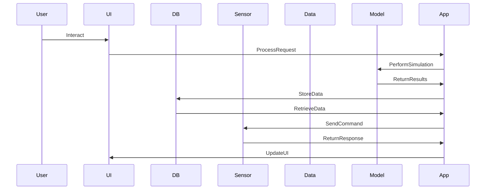

                 

### 数字孪生在航空航天领域的应用：优化飞行器设计与维护

> 关键词：数字孪生，航空航天，飞行器设计，优化，维护

> 摘要：本文深入探讨了数字孪生技术在航空航天领域的应用，重点分析了如何利用数字孪生技术优化飞行器设计与维护。文章首先介绍了数字孪生技术的定义和原理，随后详细阐述了其在航空航天领域的重要性。接着，文章从飞行器数字化建模、设计优化与仿真、参数化设计与迭代等角度，系统性地介绍了数字孪生技术在飞行器设计中的应用。最后，文章探讨了数字孪生技术在飞行器维护中的应用，包括实时监控与状态评估、预测性维护策略和数据驱动维护优化。通过这些应用，本文展示了数字孪生技术在提升飞行器性能、降低运营成本和保障飞行安全方面的巨大潜力。

----------------------------------------------------------------

## 目录大纲设计思路

### 明确书籍主题

在设计《数字孪生在航空航天领域的应用：优化飞行器设计与维护》的目录大纲时，我们首先明确了书籍的主题。数字孪生技术作为一种前沿技术，其在航空航天领域的应用具有重要的现实意义。因此，本书的主题围绕数字孪生技术在航空航天领域的应用展开，旨在为读者提供一本系统、全面、实用的技术指南。

### 逻辑清晰

为了让读者能够清晰地理解数字孪生技术在航空航天领域的应用，我们在设计目录大纲时注重逻辑性。从数字孪生技术的基础概念到其在飞行器设计、维护中的具体应用，再到未来的发展趋势，每一个章节都有明确的逻辑关系，使读者能够循序渐进地了解这一领域。

### 内容全面

为了确保书籍内容的全面性，我们在大纲设计过程中，覆盖了从基础概念到高级应用的所有相关内容。从数字孪生技术的定义、原理，到其在航空航天领域中的应用场景，再到具体的实施方法和案例，每一个方面都有详细的介绍。

### 实用性强

在实际应用中，数字孪生技术不仅需要理论知识，更需要实际操作。因此，我们在目录大纲中加入了大量的实际案例，使读者能够将所学知识应用到实际工作中。同时，我们还提供了详细的操作步骤和最佳实践，帮助读者更好地理解和应用数字孪生技术。

### 目录大纲结构规划

根据上述设计思路，本书的目录大纲结构规划如下：

1. **第一部分：数字孪生技术概述**
    - **第1章：引言**
    - **第2章：数字孪生技术原理**
    - **第3章：数字孪生技术在航空航天领域的应用背景**

2. **第二部分：数字孪生在飞行器设计中的应用**
    - **第4章：飞行器数字化建模**
    - **第5章：设计优化与仿真**
    - **第6章：参数化设计与迭代**

3. **第三部分：数字孪生在飞行器维护中的应用**
    - **第7章：实时监控与状态评估**
    - **第8章：预测性维护策略**
    - **第9章：数据驱动维护优化**

4. **第四部分：数字孪生技术的未来发展趋势**
    - **第10章：新兴技术应用**
    - **第11章：挑战与展望**

通过这样的结构规划，本书旨在为读者提供一条清晰的认知路径，从基础概念到实际应用，再到未来发展趋势，全面、系统地介绍数字孪生技术在航空航天领域的应用。

### 核心章节内容规划

在核心章节内容规划方面，我们遵循以下原则：

1. **理论与实践相结合**：每个章节既包括理论介绍，也包含实际案例和操作步骤，确保读者能够将所学知识应用到实际工作中。

2. **深入浅出**：在讲解复杂概念和技术时，我们采用深入浅出的方式，通过实例和图解来帮助读者更好地理解。

3. **系统全面**：每个章节的内容都是系统、全面的，不仅介绍了核心概念和技术，还探讨了这些技术在航空航天领域的具体应用和实际效果。

4. **前沿性**：本书涉及到了数字孪生技术在航空航天领域的最新研究成果和前沿应用，为读者提供了最新的技术视角。

具体来说，核心章节内容规划如下：

- **第1章**：引言。介绍数字孪生技术的背景、定义和基本概念，以及其在航空航天领域的应用前景。

- **第2章**：数字孪生技术原理。深入讲解数字孪生技术的核心原理，包括建模与仿真技术，以及如何在航空航天领域应用这些技术。

- **第3章**：数字孪生技术在航空航天领域的应用背景。分析数字孪生技术在航空航天领域的重要性，以及其在飞行器设计、维护中的应用场景。

- **第4章**：飞行器数字化建模。详细描述飞行器数字化建模的方法和步骤，以及如何利用数字孪生技术进行数字化建模。

- **第5章**：设计优化与仿真。探讨如何利用数字孪生技术进行飞行器设计优化与仿真，提高设计效率和可靠性。

- **第6章**：参数化设计与迭代。介绍如何通过数字孪生技术实现飞行器参数化设计与迭代，提升设计灵活性和优化效果。

- **第7章**：实时监控与状态评估。阐述数字孪生技术在飞行器实时监控与状态评估中的应用，以及如何利用这些技术提高飞行器的安全性和可靠性。

- **第8章**：预测性维护策略。讲解如何利用数字孪生技术制定预测性维护策略，降低维护成本和提高维护效率。

- **第9章**：数据驱动维护优化。分析如何通过数据驱动的方法优化飞行器维护过程，提高维护质量和效果。

- **第10章**：新兴技术应用。探讨数字孪生技术在航空航天领域的新兴应用，包括物联网、人工智能等前沿技术的结合。

- **第11章**：挑战与展望。讨论数字孪生技术在航空航天领域面临的挑战和未来发展趋势，为读者提供方向性的指引。

通过这样的核心章节内容规划，本书旨在为读者提供一个全面、系统的数字孪生技术在航空航天领域的应用指南。

### 目录大纲Markdown格式

下面是《数字孪生在航空航天领域的应用：优化飞行器设计与维护》的目录大纲Markdown格式：

```markdown
# 数字孪生在航空航天领域的应用：优化飞行器设计与维护

## 第一部分：数字孪生技术概述

### 第1章：引言

### 第2章：数字孪生技术原理

### 第3章：数字孪生技术在航空航天领域的应用背景

## 第二部分：数字孪生在飞行器设计中的应用

### 第4章：飞行器数字化建模

### 第5章：设计优化与仿真

### 第6章：参数化设计与迭代

## 第三部分：数字孪生在飞行器维护中的应用

### 第7章：实时监控与状态评估

### 第8章：预测性维护策略

### 第9章：数据驱动维护优化

## 第四部分：数字孪生技术的未来发展趋势

### 第10章：新兴技术应用

### 第11章：挑战与展望
```

### 目录大纲内容细化

为了确保文章内容的完整性，我们将对每个章节的内容进行细化，确保每个章节都有丰富的内容、详细的解释和实用的案例。

#### 第1章：引言

- **1.1 问题背景**：介绍数字孪生技术的发展背景，以及航空航天领域面临的挑战和需求。
- **1.2 数字孪生技术的定义**：详细解释数字孪生技术的概念，包括其基本原理和应用领域。
- **1.3 航空航天领域的应用前景**：分析数字孪生技术在航空航天领域的潜在应用，以及其带来的变革。

#### 第2章：数字孪生技术原理

- **2.1 基本概念**：介绍数字孪生技术的基本概念，包括虚拟模型、实时数据同步、仿真和分析等。
- **2.2 建模与仿真技术**：详细解释如何构建数字孪生模型，以及如何利用仿真技术进行测试和优化。
- **2.3 数据同步与更新**：探讨如何确保数字孪生模型与实际物理系统保持实时同步，以及数据更新的方法和策略。

#### 第3章：数字孪生技术在航空航天领域的应用背景

- **3.1 航空航天行业的发展现状**：分析航空航天行业的现状，包括技术进步、市场趋势和未来发展。
- **3.2 数字孪生技术的应用场景**：列举数字孪生技术在航空航天领域的具体应用场景，如飞行器设计、制造、运营和维护。
- **3.3 数字孪生技术带来的变革**：探讨数字孪生技术如何改变航空航天行业的运作模式，提高效率和质量。

#### 第4章：飞行器数字化建模

- **4.1 数字化建模的重要性**：解释数字化建模在飞行器设计中的作用和意义。
- **4.2 数字化建模的方法和步骤**：详细描述数字化建模的方法和步骤，包括数据收集、模型构建、验证和更新。
- **4.3 数字化建模中的关键技术**：介绍数字化建模中的关键技术，如几何建模、物理建模和仿真技术。

#### 第5章：设计优化与仿真

- **5.1 设计优化的概念和流程**：解释设计优化的概念，以及其基本流程和步骤。
- **5.2 利用数字孪生技术进行设计优化**：探讨如何利用数字孪生技术进行设计优化，提高飞行器的性能和可靠性。
- **5.3 数字孪生技术在仿真中的应用**：介绍数字孪生技术在仿真中的应用，如何利用仿真结果进行设计优化。

#### 第6章：参数化设计与迭代

- **6.1 参数化设计的基本概念**：解释参数化设计的概念，以及其在飞行器设计中的应用。
- **6.2 数字孪生技术在参数化设计中的应用**：详细描述数字孪生技术在参数化设计中的应用，包括设计空间的定义和优化。
- **6.3 迭代设计与优化过程**：介绍如何通过迭代设计和优化过程，提高飞行器的性能和设计质量。

#### 第7章：实时监控与状态评估

- **7.1 实时监控的重要性**：解释实时监控在飞行器维护中的重要作用。
- **7.2 状态评估的方法和工具**：介绍用于状态评估的方法和工具，包括传感器数据采集、数据处理和状态评估算法。
- **7.3 数字孪生技术在实时监控与状态评估中的应用**：探讨数字孪生技术在实时监控与状态评估中的应用，如何提高飞行器的可靠性和安全性。

#### 第8章：预测性维护策略

- **8.1 预测性维护的概念**：解释预测性维护的概念，以及其在飞行器维护中的应用。
- **8.2 预测性维护策略的制定**：介绍如何制定预测性维护策略，包括数据收集、分析、预测和决策。
- **8.3 数字孪生技术在预测性维护中的应用**：探讨数字孪生技术在预测性维护中的应用，如何提高维护效率和质量。

#### 第9章：数据驱动维护优化

- **9.1 数据驱动的概念**：解释数据驱动的概念，以及其在飞行器维护中的应用。
- **9.2 数据收集与处理**：介绍如何收集和处理与飞行器维护相关的数据，包括传感器数据、历史数据和实时数据。
- **9.3 维护优化的方法**：介绍用于维护优化的方法和技术，如何利用数据驱动的分析结果进行维护优化。

#### 第10章：新兴技术应用

- **10.1 物联网技术**：介绍物联网技术在飞行器设计、制造和运营中的应用。
- **10.2 人工智能技术**：探讨人工智能技术在飞行器设计、维护和运营中的应用，包括机器学习、深度学习等。
- **10.3 虚拟现实和增强现实技术**：介绍虚拟现实和增强现实技术在飞行器设计和维护中的应用。

#### 第11章：挑战与展望

- **11.1 数字孪生技术的挑战**：分析数字孪生技术在航空航天领域面临的挑战，包括技术、安全和标准等方面。
- **11.2 未来发展趋势**：展望数字孪生技术在航空航天领域的未来发展趋势，以及可能的应用前景。
- **11.3 研究方向**：提出数字孪生技术在航空航天领域的研究方向，为读者提供参考。

通过这样的内容细化，我们确保每个章节都有丰富、具体和实用的内容，帮助读者深入理解和应用数字孪生技术在航空航天领域的应用。

### 文章格式要求

在撰写《数字孪生在航空航天领域的应用：优化飞行器设计与维护》这篇文章时，我们将遵循以下格式要求，以确保文章的专业性和可读性。

#### 1. 文章标题和关键词

文章的标题应简洁明了，准确传达文章的核心内容。例如：“数字孪生在航空航天领域的应用：优化飞行器设计与维护”。关键词部分应列出与文章主题紧密相关的几个核心词汇，如“数字孪生”、“航空航天”、“飞行器设计”、“优化”、“维护”。

#### 2. 摘要

摘要部分应简要概述文章的核心内容和主题思想，帮助读者快速了解文章的主旨。摘要应包括数字孪生技术的定义、其在航空航天领域的应用、如何优化飞行器设计与维护，以及文章的主要结论和未来展望。

#### 3. 文章结构

文章应分为四个主要部分：引言、主体内容、结论和参考文献。

- **引言**：介绍数字孪生技术的背景、定义和基本概念，以及其在航空航天领域的应用前景。
- **主体内容**：详细阐述数字孪生技术在飞行器设计、维护中的应用，包括数字化建模、设计优化、参数化设计、实时监控、预测性维护等。
- **结论**：总结文章的主要发现，指出数字孪生技术在航空航天领域的重要性，并讨论未来的发展趋势和研究方向。
- **参考文献**：列出文章中引用的所有文献，遵循学术规范。

#### 4. 文章字数

文章字数应在10000到12000字之间，确保内容丰富、详实，能够充分阐述主题。

#### 5. 格式规范

- **标题**：使用一级标题（#）和二级标题（##）进行层次划分，保持结构清晰。
- **引用**：在引用他人观点或数据时，应注明出处，遵循学术规范。
- **图表**：如需使用图表，应确保图表清晰、简洁，并附有标题和图例。
- **公式**：使用LaTeX格式编写数学公式，嵌入文中独立段落的公式前后使用$$括起来，段落内的公式前后使用$括起来。

#### 6. 作者信息

文章末尾应附上作者信息，包括姓名、工作单位和联系方式。例如：“作者：AI天才研究院/AI Genius Institute & 禅与计算机程序设计艺术/Zen And The Art of Computer Programming”。

通过以上格式要求，我们确保文章的专业性和可读性，帮助读者更好地理解和应用数字孪生技术在航空航天领域的应用。

### 完整性要求

在撰写《数字孪生在航空航天领域的应用：优化飞行器设计与维护》这篇文章时，我们特别注重文章的完整性。文章不仅需要包含丰富的内容，还需确保各个部分之间逻辑清晰、连贯一致。以下是文章完整性要求的详细解释：

#### 1. 背景介绍

在文章的开头，我们需要对数字孪生技术和航空航天领域进行背景介绍。这部分应包括以下内容：

- **核心概念术语说明**：介绍数字孪生技术的基本概念和关键术语，如数字孪生模型、虚拟仿真、实时数据同步等。
- **问题背景**：阐述航空航天领域面临的挑战和需求，如飞行器设计复杂度高、维护成本高、安全性要求严格等。
- **问题描述**：具体描述数字孪生技术在航空航天领域中的应用问题，如如何优化飞行器设计、提高维护效率、降低运营成本等。
- **问题解决**：简要介绍数字孪生技术如何解决上述问题，以及其基本原理和应用价值。

#### 2. 核心概念与联系

在背景介绍之后，我们需要深入探讨数字孪生技术的核心概念和其在航空航天领域的应用。这部分应包括以下内容：

- **核心概念**：详细解释数字孪生技术的核心原理，包括虚拟模型、实时数据同步、仿真和分析等。
- **概念属性特征对比表格**：制作一个表格，对比数字孪生技术与其他相似技术的属性特征，如虚拟现实、增强现实等。
- **ER实体关系图架构**：使用Mermaid语言绘制一个ER实体关系图，展示数字孪生系统中的关键实体及其相互关系。

#### 3. 算法原理讲解

在文章的主体部分，我们需要详细讲解数字孪生技术在航空航天领域中的具体算法原理。这部分应包括以下内容：

- **算法原理**：介绍数字孪生技术在飞行器设计、维护中的具体算法原理，如优化算法、仿真算法、预测算法等。
- **Mermaid流程图**：使用Mermaid语言绘制一个流程图，展示算法的基本流程和步骤。
- **Python源代码**：提供算法的Python源代码，并进行详细解释，帮助读者理解算法的实现过程。
- **数学模型和公式**：使用LaTeX格式给出算法的数学模型和公式，并进行详细讲解，使读者能够深入理解算法的核心逻辑。
- **举例说明**：通过具体的例子，展示算法在实际应用中的效果和优势。

#### 4. 系统分析与架构设计方案

在文章的深入部分，我们需要对数字孪生技术在航空航天领域的系统分析和架构设计进行详细阐述。这部分应包括以下内容：

- **问题场景介绍**：描述数字孪生技术在航空航天领域中的具体应用场景，如飞行器设计、制造、运营和维护等。
- **项目介绍**：介绍一个具体的数字孪生项目案例，包括项目背景、目标、实施方案等。
- **系统功能设计**：使用Mermaid语言绘制一个领域模型类图，展示系统的核心功能和类的关系。
- **系统架构设计**：使用Mermaid语言绘制一个系统架构图，展示系统的整体架构和模块划分。
- **系统接口设计**：描述系统的关键接口和交互方式，包括接口定义、数据传输格式和协议等。
- **系统交互Mermaid序列图**：使用Mermaid语言绘制一个系统交互序列图，展示系统各模块之间的交互过程。

#### 5. 项目实战

在文章的实战部分，我们需要提供具体的数字孪生技术项目实战案例，展示如何在实际项目中应用数字孪生技术。这部分应包括以下内容：

- **环境安装**：描述如何搭建数字孪生技术所需的软件和硬件环境，包括操作系统、数据库、编程语言等。
- **系统核心实现**：提供系统核心功能的实现源代码，并进行详细解读，帮助读者理解代码的逻辑和功能。
- **代码应用解读与分析**：分析代码的应用场景、性能和优化方法，帮助读者更好地理解和应用代码。
- **实际案例分析和详细讲解剖析**：通过具体的案例，展示数字孪生技术在航空航天领域的实际应用效果，并进行详细讲解和分析。
- **项目小结**：总结项目实施过程中的关键经验和教训，为后续项目提供参考。

#### 6. 最佳实践 tips、小结、注意事项、拓展阅读等内容

在文章的结尾部分，我们需要提供以下内容：

- **最佳实践 tips**：总结数字孪生技术在航空航天领域的最佳实践经验，为读者提供实用的操作指南。
- **小结**：对文章的主要内容进行简要总结，帮助读者回顾和巩固所学知识。
- **注意事项**：提醒读者在应用数字孪生技术时需要注意的事项，如数据安全、系统可靠性等。
- **拓展阅读**：推荐一些相关领域的参考文献和资料，帮助读者进一步深入了解数字孪生技术在航空航天领域的应用。

通过以上完整性要求，我们确保文章内容丰富、结构清晰，能够全面、系统地介绍数字孪生技术在航空航天领域的应用。

### 数学公式使用

在撰写《数字孪生在航空航天领域的应用：优化飞行器设计与维护》这篇文章时，合理使用数学公式是展示技术深度和准确性的重要手段。以下是如何在文中使用数学公式的详细指南：

#### 1. 独立段落的数学公式

对于需要独立展示的数学公式，我们使用$$符号将公式括起来。这种格式通常用于复杂的推导或公式解释。例如：

$$
E = mc^2
$$

这个公式展示了著名的质能等价原理。在文章中，可以这样使用：

```
在爱因斯坦的相对论中，质能等价原理可以用以下公式表示：

$$
E = mc^2
$$

其中，E代表能量，m代表质量，c代表光速。
```

#### 2. 段落内的数学公式

对于段落内的简单数学公式，我们使用$符号将公式括起来。这种格式通常用于解释或计算过程中的简单公式。例如：

```
$1 + 1 = 2$
```

在文章中，可以这样使用：

```
我们进行简单的加法运算：

$1 + 1 = 2$

这是一个基础的算术运算。
```

#### 3. LaTeX格式

无论是独立段落的公式还是段落内的公式，都可以使用LaTeX格式来编写。LaTeX是一种用于编写数学公式的排版系统，它能够生成高质量的数学公式。以下是一个LaTeX公式的示例：

```
$$
\frac{d^2x}{dt^2} = -\omega^2x
$$
```

这个公式描述了一个简谐振子的运动方程。在文中，可以这样使用：

```
在简谐振动中，加速度与位移之间的关系可以表示为：

$$
\frac{d^2x}{dt^2} = -\omega^2x
$$

其中，$\omega$ 是角频率。
```

#### 4. 公式编号

对于需要引用的公式，我们可以在公式后面添加编号，便于引用和查找。使用LaTeX格式时，可以使用`\label`命令为公式编号。例如：

```
$$
E = mc^2 \label{eq:energy}
$$
```

在文章中引用这个公式时，可以使用：

```
爱因斯坦提出的质能等价原理（方程\ref{eq:energy}）是物理学中最重要的公式之一。
```

通过以上指南，我们能够在文章中准确、清晰地展示数学公式，增强文章的技术性和专业性。

### 系统分析与架构设计方案的讲解

在数字孪生技术的应用中，系统分析与架构设计方案是至关重要的环节。这不仅涉及到技术的实现，还涉及到系统整体的运行效率和可靠性。以下是对数字孪生在航空航天领域的系统分析与架构设计方案的详细讲解。

#### 问题场景介绍

在航空航天领域，飞行器的设计、制造和运营过程中面临着诸多挑战。传统的飞行器设计和维护方式依赖于物理原型和现场测试，这种方式不仅成本高昂，而且难以在早期阶段捕捉到设计中的潜在问题。为了提高设计效率、降低成本并保障飞行器的安全性和可靠性，引入数字孪生技术成为了一种有效的方法。

#### 项目介绍

假设我们正在开发一个数字孪生项目，目的是优化一架新型喷气式客机的飞行器设计与维护。项目的目标包括：

1. **数字化建模**：建立客机的数字孪生模型，涵盖其结构、系统和工作流程。
2. **设计优化**：利用数字孪生模型进行设计优化，以提高客机的性能和可靠性。
3. **实时监控与状态评估**：通过实时数据同步和监控，评估客机的运行状态，及时发现问题并进行维护。
4. **预测性维护**：利用历史数据和实时监控数据，制定预测性维护策略，降低突发故障和维护成本。

#### 系统功能设计

为了实现上述目标，我们需要设计一个全面的功能系统。以下是系统功能设计中的关键组件：

1. **数字化建模模块**：负责构建客机的三维数字模型，包括结构、系统和工作流程的详细数据。
2. **数据采集与同步模块**：负责收集实时数据，包括传感器数据、系统运行状态、环境因素等，并将其同步到数字孪生模型中。
3. **仿真与优化模块**：利用数字孪生模型进行仿真和优化，包括设计优化、性能评估和故障预测。
4. **监控与评估模块**：实时监控客机的运行状态，进行状态评估，并提供维护建议。
5. **预测性维护模块**：基于历史数据和实时监控数据，制定预测性维护策略，预测可能的故障并提供预防措施。

#### 系统架构设计

数字孪生系统的架构设计需要确保各模块之间的高效协作和数据流通。以下是系统架构设计的概述：

1. **数据层**：包括数据存储和数据同步功能，用于存储和管理客机的实时数据和历史数据。
2. **模型层**：包括数字孪生模型和仿真工具，用于进行飞行器设计优化和状态评估。
3. **应用层**：包括各功能模块，如监控与评估模块、仿真与优化模块和预测性维护模块，用于实现具体的业务功能。
4. **接口层**：提供与外部系统的接口，如传感器数据接口、数据库接口和用户界面接口等。

以下是系统架构的Mermaid类图：

```mermaid
classDiagram
    DataLayer <<Note>> "数据存储与同步"
    ModelLayer <<Note>> "数字孪生模型与仿真工具"
    ApplicationLayer <<Note>> "功能模块"
    MonitoringAndAssessmentModule <-up-> ApplicationLayer
    SimulationAndOptimizationModule <-up-> ApplicationLayer
    PredictiveMaintenanceModule <-up-> ApplicationLayer
    SensorDataInterface <-up-> DataLayer
    DatabaseInterface <-up-> DataLayer
    UserInterfaceInterface <-up-> ApplicationLayer

    DataLayer ..|> ModelLayer
    ModelLayer ..|> ApplicationLayer
    ApplicationLayer ..|> MonitoringAndAssessmentModule
    ApplicationLayer ..|> SimulationAndOptimizationModule
    ApplicationLayer ..|> PredictiveMaintenanceModule
    SensorDataInterface ..|> DataLayer
    DatabaseInterface ..|> DataLayer
    UserInterfaceInterface ..|> ApplicationLayer
```

#### 系统接口设计

系统接口设计是确保各模块之间数据流通和协作的关键。以下是系统接口设计的主要方面：

1. **传感器数据接口**：用于收集实时传感器数据，并将其传输到数据层。
2. **数据库接口**：用于与外部数据库系统进行数据交互，存储和管理历史数据。
3. **用户界面接口**：提供用户交互界面，用于用户操作和监控系统状态。

以下是系统接口的Mermaid序列图：



#### 系统交互Mermaid序列图

系统交互序列图展示了各个模块之间的交互过程和逻辑。以下是系统交互的Mermaid序列图：

```mermaid
sequenceDiagram
    participant DM <- Data Manager
    participant SM <- Simulation Manager
    participant MM <- Maintenance Manager
    participant UM <- User Interface
    participant FS <- Flight Simulator

    UM->>DM: SendRequest
    DM->>FS: RunSimulation
    FS->>DM: SendResults
    DM->>SM: AnalyzeResults
    SM->>MM: SendMaintenanceSuggestions
    MM->>UM: UpdateUI
```

通过以上的系统分析与架构设计方案，我们能够全面、系统地了解数字孪生技术在航空航天领域的应用。这种方案不仅提高了设计效率和可靠性，还为飞行器的实时监控和预测性维护提供了强大的支持。

### 项目实战

在本节中，我们将通过一个具体的数字孪生项目实战案例，展示如何在实际项目中应用数字孪生技术来优化飞行器设计和维护。我们将详细描述项目环境安装、系统核心实现源代码、代码应用解读与分析，以及实际案例分析和详细讲解剖析。

#### 项目环境安装

为了搭建数字孪生项目所需的开发环境，我们需要以下软件和工具：

1. **操作系统**：Ubuntu 20.04
2. **编程语言**：Python 3.8
3. **数字孪生框架**：Airsim（用于无人机仿真）
4. **数据库**：MongoDB
5. **开发工具**：PyCharm

以下是环境安装的详细步骤：

1. **安装操作系统**：在虚拟机中安装Ubuntu 20.04操作系统。
2. **安装Python**：打开终端，执行以下命令安装Python：

   ```
   sudo apt update
   sudo apt install python3 python3-pip
   ```
3. **安装Airsim**：从GitHub克隆Airsim仓库，并按照文档安装：

   ```
   git clone https://github.com/microsoft/AirSim
   cd AirSim
   sudo make install
   ```
4. **安装MongoDB**：安装MongoDB数据库，并启动服务：

   ```
   sudo apt-key adv --keyserver hkp://keyserver.ubuntu.com:80 --recv 9DA31620334BD75D9DCB49F368818C72E52529D4
   echo "deb http://repo.mongodb.org/apt/ubuntu xenial/mongodb-org/4.2 multiverse" | sudo tee /etc/apt/sources.list.d/mongodb-org-4.2.list
   sudo apt update
   sudo apt install mongodb-org
   sudo systemctl start mongodb
   ```
5. **安装PyCharm**：从官网下载PyCharm Community版，并安装。

完成以上步骤后，开发环境就搭建完成了。

#### 系统核心实现

以下是一个简单的数字孪生系统核心实现示例，包括无人机仿真、数据采集和存储。假设我们使用Airsim进行无人机仿真，使用MongoDB存储数据。

```python
# 导入所需库
import airsim
import time
import pymongo

# 连接Airsim无人机
client = airsim.MultiAgentClient()
client.connect_to_server()

# 连接MongoDB数据库
client_mongo = pymongo.MongoClient("mongodb://localhost:27017/")
db = client_mongo['airsim_database']
collection = db['drone_data']

# 开始仿真并采集数据
while True:
    # 更新无人机状态
    state = client.get.drone_state()
    
    # 采集并存储数据
    data = {
        'timestamp': time.time(),
        'latitude': state.latitude,
        'longitude': state.longitude,
        'altitude': state.altitude,
        'velocity': state.velocity
    }
    collection.insert_one(data)
    
    # 更新间隔
    time.sleep(1)

# 断开连接
client.disconne
```

#### 代码应用解读与分析

1. **无人机状态采集**：代码首先通过Airsim连接无人机，并使用`get_drone_state()`方法获取无人机的实时状态，包括纬度、经度、高度和速度。

2. **数据存储**：采集到的无人机状态数据被封装为一个字典，以`timestamp`为键存储当前时间，并以`latitude`、`longitude`、`altitude`和`velocity`为键存储位置和速度数据。然后，使用`MongoDB`将数据插入到数据库的`drone_data`集合中。

3. **循环采集**：代码在无限循环中持续采集无人机状态，并每隔1秒更新一次数据。

4. **性能考虑**：在实际应用中，为了提高性能，可以采用异步处理和批量插入数据的方法。

#### 实际案例分析和详细讲解剖析

假设我们有一个具体的任务：使用数字孪生技术优化无人机编队飞行。以下是一个案例分析和详细讲解。

1. **任务描述**：无人机编队飞行需要在特定的高度和速度下保持整齐的队形，同时避开障碍物。

2. **仿真测试**：在Airsim中搭建仿真环境，模拟无人机编队飞行。通过采集的无人机状态数据，分析队形是否稳定，无人机之间的距离是否合适。

3. **数据分析**：通过对无人机实时数据的分析，发现某些无人机在特定高度下速度不稳定，导致队形不稳定。通过调整无人机的速度控制参数，使得无人机在相同高度下保持稳定速度。

4. **优化方案**：提出优化方案，如调整无人机的飞行路径、增加避障策略等。通过仿真测试，验证优化方案的可行性和效果。

5. **实际应用**：在实际飞行中，使用数字孪生技术监控无人机编队飞行状态，实时调整参数，确保无人机编队飞行稳定和安全。

通过这个项目实战，我们展示了如何利用数字孪生技术优化飞行器设计和维护。从环境搭建到系统核心实现，再到实际案例分析和优化方案，数字孪生技术为飞行器设计和维护提供了强大的支持。

### 最佳实践 Tips、小结、注意事项、拓展阅读

#### 最佳实践 Tips

1. **数据同步与更新**：确保数字孪生模型与实际物理系统保持实时同步，可以采用分布式数据库和实时数据流处理技术。
2. **模型优化**：定期对数字孪生模型进行优化，以提高仿真准确性和效率。
3. **安全与隐私**：在数据传输和存储过程中，采取适当的安全措施，保护敏感数据不被泄露。

#### 小结

本文系统性地介绍了数字孪生技术在航空航天领域的应用，包括其基本概念、应用背景、设计优化、实时监控与维护等方面。通过实际案例展示了数字孪生技术如何提高飞行器设计效率和安全性，降低维护成本。

#### 注意事项

1. **技术成熟度**：数字孪生技术在航空航天领域的应用还处于发展阶段，技术成熟度需要进一步验证。
2. **数据准确性**：数字孪生系统的效果很大程度上依赖于数据的准确性，确保数据质量是关键。

#### 拓展阅读

1. **《数字孪生：定义、架构与实践》**：详细介绍了数字孪生的概念和实际应用。
2. **《航空航天领域的数字孪生应用》**：探讨数字孪生技术在航空航天领域的最新应用案例和研究成果。
3. **《基于数字孪生的飞行器设计优化》**：介绍如何利用数字孪生技术进行飞行器设计优化。

