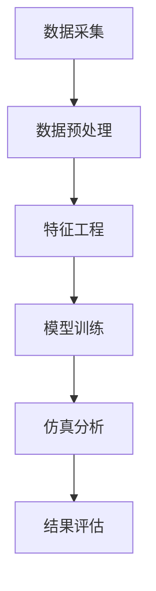
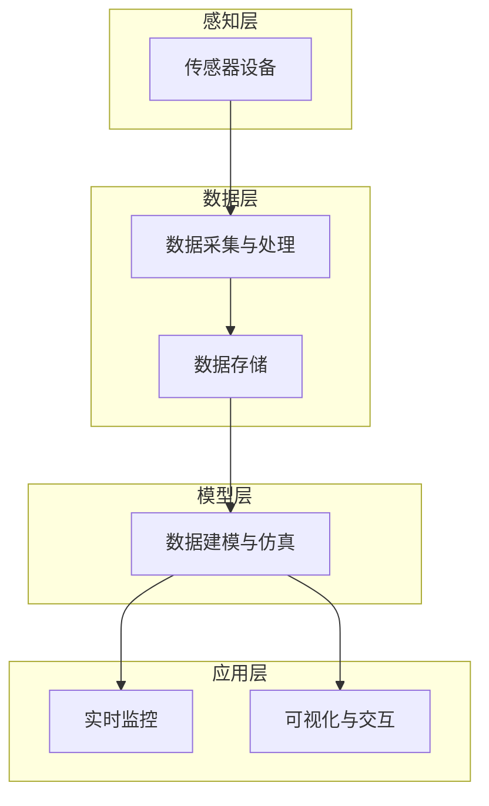
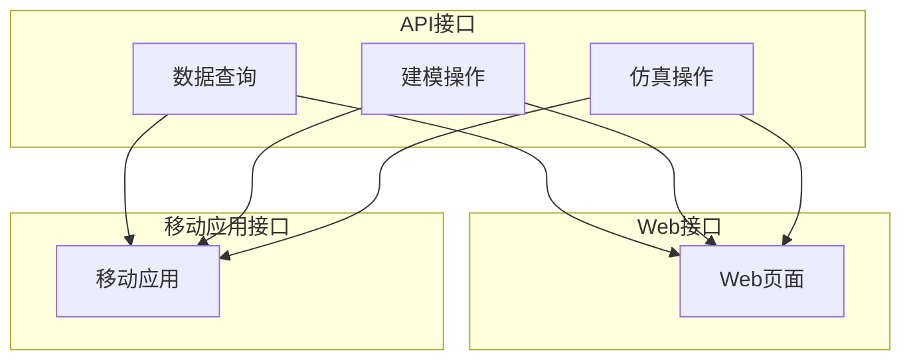
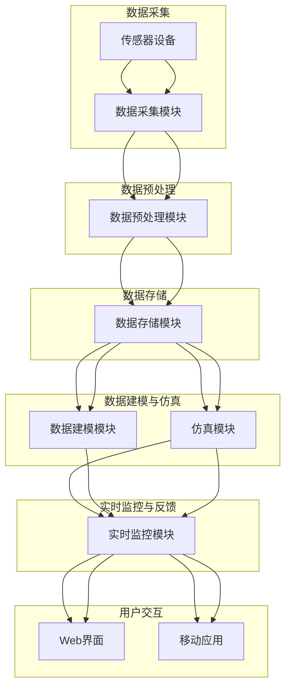

                 

### 文章标题

# 数字孪生技术在智慧城市规划中的应用

### 关键词

- 数字孪生技术
- 智慧城市
- 城市规划
- 数据采集与处理
- 算法原理与实践

### 摘要

本文深入探讨了数字孪生技术在智慧城市规划中的应用。通过梳理数字孪生技术的发展背景和核心概念，文章详细分析了其在智慧城市规划中的架构与组成，具体应用案例，以及技术实现和未来发展趋势。本文旨在为读者提供全面、系统的数字孪生技术在城市规划中的理解和应用指导。

---

### 引言

#### 数字孪生技术的发展背景

数字孪生（Digital Twin）技术起源于制造业，旨在通过创建物理实体的数字副本，实现对其性能的实时监控和预测性维护。随着信息技术的快速发展，尤其是物联网（IoT）、大数据、人工智能（AI）等技术的应用，数字孪生技术逐渐扩展到其他领域，其中智慧城市规划成为其重要应用场景之一。

#### 数字孪生技术的核心概念

数字孪生技术通过创建物理实体（如城市、建筑物、交通系统等）的虚拟副本，将实时的数据与模型进行集成，实现对物理实体的状态监测、预测分析和优化控制。其核心概念包括：

- **数据采集与集成**：通过传感器、摄像头、GPS等技术，实时获取物理实体的各种数据。
- **模型构建与仿真**：基于获取的数据，构建物理实体的数字模型，并进行仿真分析。
- **实时数据同步与反馈机制**：将仿真结果与实际数据进行对比，实现实时反馈和调整。

#### 数字孪生技术在智慧城市规划中的作用

数字孪生技术为智慧城市规划提供了新的手段和工具，其主要作用包括：

- **优化城市规划**：通过仿真和预测，帮助规划者更好地理解和优化城市空间布局和功能分配。
- **提高城市管理效率**：实时监测城市运行状态，快速响应和解决城市问题。
- **促进可持续发展**：通过模拟和优化，实现资源的合理利用和环境保护。

#### 数字孪生技术的架构与组成

数字孪生技术涉及多个层面，其架构与组成通常包括以下几个部分：

- **数据采集与集成**：通过传感器、GPS等技术，实时获取物理实体的数据，并进行数据清洗和集成。
- **模型构建与仿真**：基于获取的数据，构建物理实体的数字模型，并进行仿真分析。
- **实时数据同步与反馈机制**：将仿真结果与实际数据进行对比，实现实时反馈和调整。

#### 数字孪生技术的应用领域分析

数字孪生技术在智慧城市规划中的应用非常广泛，包括但不限于以下领域：

- **智慧城市规划**：通过数字孪生技术，实现城市规划的优化和智能化。
- **城市交通管理**：通过数字孪生技术，实时监测和优化城市交通系统。
- **城市环境监测与治理**：通过数字孪生技术，实时监测城市环境，并实现环境治理的智能化。

#### 数字孪生技术的挑战与未来趋势

尽管数字孪生技术在智慧城市规划中展示了巨大的潜力，但其应用也面临一系列挑战：

- **数据安全与隐私**：如何确保数据的安全和隐私是数字孪生技术面临的主要挑战之一。
- **技术标准化**：不同系统和平台之间的数据接口和通信协议需要统一和标准化。
- **算法模型有效性**：如何构建准确、高效的算法模型是数字孪生技术需要解决的关键问题。

未来的发展趋势包括：

- **多领域融合**：数字孪生技术将与物联网、大数据、人工智能等新兴技术深度融合。
- **智能决策支持**：数字孪生技术将为城市规划者提供更智能、更科学的决策支持。

#### 本章小结

通过本文的介绍，读者可以对数字孪生技术在智慧城市规划中的应用有一个全面的认识。接下来，本文将分章节详细探讨数字孪生技术在智慧城市规划中的具体应用、技术实现、实践案例和未来发展趋势，以期为读者提供深入的技术见解和实践指导。

---

### 文章结构概述

本文将分为五个主要部分，每个部分都将深入探讨数字孪生技术在智慧城市规划中的应用。

- **第一部分：引言**：介绍数字孪生技术的发展背景、核心概念、在智慧城市规划中的作用及其架构与组成。
- **第二部分：数字孪生技术在智慧城市规划中的应用**：详细分析数字孪生技术在智慧城市规划中的具体应用，包括城市规划中的需求分析、核心应用、实施方案和案例研究。
- **第三部分：数字孪生技术在智慧城市规划中的技术实现**：探讨数字孪生技术的算法原理、数学模型、系统架构设计、系统实现与部署。
- **第四部分：数字孪生技术在智慧城市规划中的实践与应用**：通过项目实战和最佳实践分享，提供实际案例分析和应用解读。
- **第五部分：数字孪生技术在智慧城市规划中的未来发展**：分析数字孪生技术在智慧城市规划中的未来趋势与挑战，探讨技术革新和应对策略。

通过这五个部分的内容，本文旨在为读者提供一个系统、全面的数字孪生技术在智慧城市规划中的应用指南。接下来，我们将逐一深入探讨每个部分的具体内容。

---

### 第一部分：引言

#### 数字孪生技术的发展背景

数字孪生（Digital Twin）技术的概念最早可以追溯到2002年，由Michael Grieves在其博士论文中提出。Grieves将数字孪生定义为“一个数字版本的现实世界的实体，它可以实时反映实体的状态、功能和性能，并通过数据交换实现与实体的同步更新”。这一概念起初在制造业领域得到了广泛应用，尤其是在航空航天、汽车制造等行业，通过数字孪生技术，企业可以实现对复杂制造过程的实时监控和优化。

随着物联网（IoT）、大数据、人工智能（AI）等技术的迅速发展，数字孪生技术的应用范围逐渐扩展到其他领域。在建筑、交通、能源、医疗等多个行业，数字孪生技术被广泛应用于设施管理、性能优化、预测性维护等方面。特别是在智慧城市规划中，数字孪生技术以其独特的优势，成为实现城市智能化管理和可持续发展的重要工具。

#### 数字孪生技术的核心概念

数字孪生技术通过创建物理实体的数字副本，实现对其实时监测、预测分析和优化控制。其核心概念包括以下几个方面：

1. **数据采集与集成**：
   数据采集是数字孪生技术的关键步骤，通过传感器、摄像头、GPS等设备，实时获取物理实体的各种数据，如环境参数、位置信息、设备状态等。这些数据经过处理和清洗后，被集成到一个统一的数据平台中。

2. **模型构建与仿真**：
   基于采集到的数据，构建物理实体的数字模型。这个模型可以是一个三维模型，也可以是一个系统模型，用于模拟和预测物理实体的行为和性能。通过仿真分析，可以评估不同方案的效果，优化决策过程。

3. **实时数据同步与反馈机制**：
   将仿真结果与实际数据进行对比，实现实时反馈和调整。通过这种机制，数字孪生可以动态地更新物理实体的状态，实现对其实时的监控和优化。

#### 数字孪生技术在智慧城市规划中的作用

数字孪生技术在智慧城市规划中发挥着重要作用，其主要作用体现在以下几个方面：

1. **优化城市规划**：
   通过数字孪生技术，规划者可以在虚拟环境中模拟城市的发展和变化，预测不同规划方案的效果。这有助于优化城市空间布局、交通网络、公共设施等，提高城市规划的科学性和效率。

2. **提高城市管理效率**：
   数字孪生技术可以实现城市运行状态的实时监测和预警，帮助管理者快速识别和解决城市问题。例如，通过交通数字孪生技术，可以实时监控交通流量，优化交通信号配置，缓解交通拥堵。

3. **促进可持续发展**：
   数字孪生技术可以帮助实现资源的合理利用和环境保护。例如，通过环境数字孪生技术，可以实时监测空气质量、水质等环境指标，制定有效的环境保护措施。

#### 数字孪生技术的架构与组成

数字孪生技术的架构与组成通常包括以下几个部分：

1. **数据采集与集成**：
   通过传感器、摄像头、GPS等技术，实时获取物理实体的数据。这些数据包括环境参数、位置信息、设备状态等，经过处理和清洗后，被集成到一个统一的数据平台中。

2. **模型构建与仿真**：
   基于采集到的数据，构建物理实体的数字模型。这个模型可以是一个三维模型，也可以是一个系统模型，用于模拟和预测物理实体的行为和性能。

3. **实时数据同步与反馈机制**：
   将仿真结果与实际数据进行对比，实现实时反馈和调整。通过这种机制，数字孪生可以动态地更新物理实体的状态，实现对其实时的监控和优化。

#### 数字孪生技术的应用领域分析

数字孪生技术在智慧城市规划中的应用非常广泛，包括以下领域：

1. **智慧城市规划**：
   数字孪生技术可以帮助规划者实现城市空间的优化配置，提高城市规划的科学性和可操作性。

2. **城市交通管理**：
   数字孪生技术可以实现交通流量的实时监控和优化，提高交通效率，缓解交通拥堵。

3. **城市环境监测与治理**：
   数字孪生技术可以帮助实时监测城市环境，如空气质量、水质等，制定有效的环境保护措施。

#### 数字孪生技术的挑战与未来趋势

尽管数字孪生技术在智慧城市规划中展示了巨大的潜力，但其应用也面临一系列挑战：

1. **数据安全与隐私**：
   如何确保数据的安全和隐私是数字孪生技术面临的主要挑战之一。特别是个人隐私数据的处理和保护，需要严格的法规和规范。

2. **技术标准化**：
   不同系统和平台之间的数据接口和通信协议需要统一和标准化，以实现数据的高效传输和共享。

3. **算法模型有效性**：
   如何构建准确、高效的算法模型是数字孪生技术需要解决的关键问题。特别是针对复杂城市系统的建模和仿真，需要不断优化算法和模型。

未来的发展趋势包括：

1. **多领域融合**：
   数字孪生技术将与物联网、大数据、人工智能等新兴技术深度融合，推动智慧城市的发展。

2. **智能决策支持**：
   数字孪生技术将为城市规划者提供更智能、更科学的决策支持，实现城市管理的智能化和精细化。

#### 本章小结

通过本文的介绍，读者可以对数字孪生技术在智慧城市规划中的应用有一个全面的认识。接下来，本文将分章节详细探讨数字孪生技术在智慧城市规划中的具体应用、技术实现、实践案例和未来发展趋势，以期为读者提供深入的技术见解和实践指导。

---

### 第二部分：数字孪生技术在智慧城市规划中的应用

#### 数字孪生技术在智慧城市规划中的具体应用

数字孪生技术在智慧城市规划中具有广泛的应用前景，主要体现在以下几个方面：

1. **城市规划与模拟**：
   数字孪生技术可以创建城市的数字副本，用于模拟不同规划方案的效果。通过仿真分析，规划者可以直观地了解不同方案对城市交通、环境、人口密度等方面的影响，从而做出更科学的决策。

2. **交通管理优化**：
   通过数字孪生技术，可以实时监测交通流量、道路状况、公共交通运行情况等，从而优化交通信号配置、调整公共交通路线和班次，提高交通效率，减少拥堵。

3. **环境保护监测**：
   数字孪生技术可以实时监测城市环境，如空气质量、水质、噪音等，通过数据分析，可以及时发现环境问题，采取相应的治理措施，促进城市可持续发展。

4. **公共设施管理**：
   数字孪生技术可以帮助管理者实时监控公共设施的运行状态，如供水、供电、燃气等，及时发现故障，进行预防性维护，提高公共设施的运行效率。

5. **城市规划与建设管理**：
   数字孪生技术可以用于建筑设计和施工过程的模拟，通过虚拟现实（VR）和增强现实（AR）技术，实现城市规划的可视化和交互式体验，提高建设效率和质量。

#### 数字孪生在城市规划中的核心应用

数字孪生技术在城市规划中的核心应用主要体现在以下几个方面：

1. **数字城市模型**：
   数字孪生技术可以创建城市的数字模型，包括地理信息、建筑物、交通网络、公共设施等。这些模型可以用于城市规划、模拟和分析，帮助规划者做出更科学的决策。

2. **实时数据采集与处理**：
   通过传感器、摄像头等设备，实时采集城市运行的各种数据，如交通流量、环境指标、设备状态等。这些数据经过处理和分析，可以为城市规划和管理提供实时、准确的信息支持。

3. **仿真与预测**：
   数字孪生技术可以通过仿真分析，预测不同规划方案的效果，如交通流量、环境质量、人口分布等。这有助于规划者评估不同方案的影响，选择最优方案。

4. **实时监控与反馈**：
   数字孪生技术可以实时监控城市的运行状态，发现问题和异常，及时采取措施进行调整。这种实时反馈机制有助于提高城市管理的效率和效果。

5. **虚拟现实与增强现实**：
   数字孪生技术可以通过虚拟现实（VR）和增强现实（AR）技术，实现城市规划的可视化和交互式体验。这有助于提高公众对城市规划的理解和参与度，促进城市规划的顺利实施。

#### 数字孪生技术的实施方案

数字孪生技术在智慧城市规划中的实施方案主要包括以下几个步骤：

1. **需求分析与规划**：
   首先，需要明确数字孪生技术在城市规划中的具体需求和目标，如交通管理优化、环境保护监测、公共设施管理等。根据需求，制定详细的实施方案和计划。

2. **数据采集与处理**：
   通过传感器、摄像头等设备，实时采集城市运行的各种数据。这些数据包括交通流量、环境指标、设备状态等。采集到的数据需要经过处理和清洗，以确保其质量和准确性。

3. **数字城市模型构建**：
   基于采集到的数据，构建城市的数字模型。这个模型应包括地理信息、建筑物、交通网络、公共设施等。通过三维建模软件，可以创建一个逼真的数字城市模型。

4. **仿真与预测**：
   利用数字城市模型，进行不同规划方案的仿真和预测。通过模拟和分析，可以评估不同方案的效果，如交通流量、环境质量、人口分布等。

5. **实时监控与反馈**：
   通过数字孪生技术，实时监控城市的运行状态，发现问题和异常，及时采取措施进行调整。这种实时反馈机制有助于提高城市管理的效率和效果。

6. **虚拟现实与增强现实**：
   利用虚拟现实（VR）和增强现实（AR）技术，实现城市规划的可视化和交互式体验。这有助于提高公众对城市规划的理解和参与度，促进城市规划的顺利实施。

#### 数字孪生在城市规划中的案例研究

为了更好地理解数字孪生技术在城市规划中的应用，以下列举几个实际案例：

1. **北京城市副中心数字孪生建设**：
   北京城市副中心数字孪生项目是中国智慧城市建设的典型案例。通过数字孪生技术，实现了对城市副中心的实时监测和仿真分析，为城市规划和管理提供了科学依据。

2. **上海智慧城市建设中的数字孪生应用**：
   上海智慧城市项目通过数字孪生技术，实现了对城市运行状态的实时监控和预警。例如，通过交通数字孪生技术，实时监测交通流量，优化交通信号配置，缓解交通拥堵。

3. **深圳智慧交通中的数字孪生应用**：
   深圳智慧交通项目通过数字孪生技术，实现了对交通流量的实时监控和优化。通过仿真分析，优化了公共交通路线和班次，提高了交通效率。

4. **青岛智慧环保数字孪生平台**：
   青岛智慧环保项目通过数字孪生技术，实现了对空气质量、水质等环境指标的实时监测和预警。通过数据分析，制定了有效的环境保护措施，促进了城市的可持续发展。

这些案例展示了数字孪生技术在智慧城市规划中的广泛应用和显著成效，为其他城市提供了宝贵的经验和借鉴。

#### 数字孪生在城市规划中的数据来源与处理

数字孪生技术在智慧城市规划中的数据来源主要包括以下几个方面：

1. **传感器数据**：
   通过安装在交通设施、环境监测站点、建筑物等位置的传感器，实时采集温度、湿度、空气质量、噪音、车辆速度等信息。

2. **摄像头数据**：
   通过安装在交通路口、公共场所的摄像头，实时采集交通流量、车辆颜色、行人数量等信息。

3. **GPS数据**：
   通过车辆、行人的GPS定位，实时获取位置信息，用于交通流量分析和路径规划。

4. **历史数据**：
   从数据库中获取的历史交通流量、环境数据等，用于模型训练和预测分析。

数据处理主要包括以下几个步骤：

1. **数据采集**：
   通过传感器、摄像头、GPS设备等，实时采集数据。

2. **数据预处理**：
   对采集到的数据进行清洗、去噪、去重复等处理，确保数据的质量和准确性。

3. **数据融合**：
   将来自不同来源的数据进行融合，形成统一的视图，为后续分析和建模提供支持。

4. **数据建模**：
   利用机器学习、深度学习等技术，对数据进行分析和建模，提取有用的特征和规律。

5. **数据存储与查询**：
   将处理后的数据存储在数据库中，为数字孪生系统的运行提供数据支持。同时，提供数据查询接口，方便用户进行数据分析和可视化。

通过科学的数据处理方法，可以确保数字孪生技术在智慧城市规划中的数据来源多样、质量可靠、处理高效，从而为城市规划和管理提供有力的数据支持。

#### 本章小结

通过本部分的讨论，我们深入了解了数字孪生技术在智慧城市规划中的应用、核心应用、实施方案和案例研究。数字孪生技术以其独特的技术优势，为智慧城市规划提供了强大的工具和手段，有助于实现城市管理的智能化和可持续发展。在接下来的章节中，我们将进一步探讨数字孪生技术在智慧城市规划中的技术实现，为读者提供更深入的技术见解和实践指导。

---

### 第三部分：数字孪生技术在智慧城市规划中的技术实现

#### 数字孪生技术在智慧城市规划中的算法原理

数字孪生技术在智慧城市规划中的应用，离不开一系列核心算法的支持。这些算法不仅决定了数字孪生系统的性能，还直接影响城市规划的科学性和决策的准确性。以下将详细讨论数字孪生技术在智慧城市规划中的主要算法原理，并使用mermaid流程图和Python代码进行解释。

##### 常见算法介绍

在数字孪生技术中，常见的算法包括：

1. **数据采集与处理算法**：
   用于传感器数据采集、预处理、数据融合等。例如，基于K-means聚类算法的数据预处理，可以有效地去除噪声和重复数据。

2. **机器学习与深度学习算法**：
   用于数据建模、预测分析和决策支持。例如，使用神经网络进行交通流量预测，可以显著提高预测准确性。

3. **仿真算法**：
   用于城市模型的构建和仿真分析。例如，基于Agent-Based Modeling（ABM）的城市仿真算法，可以模拟城市中的个体行为，分析不同规划方案的效果。

##### 算法流程与实现

以下是一个基于交通流量预测的算法流程示例：

1. **数据采集**：
   通过传感器采集交通流量数据，包括车辆速度、行驶方向、车辆类型等。

2. **数据预处理**：
   对采集到的数据进行清洗、去噪、标准化等处理，为建模做准备。

3. **特征工程**：
   从预处理后的数据中提取关键特征，如时间、天气、节假日等，用于模型训练。

4. **模型训练**：
   使用神经网络或随机森林等算法进行模型训练，输入特征数据，输出交通流量预测结果。

5. **仿真分析**：
   将训练好的模型应用于城市交通模型，进行仿真分析，评估不同交通管理方案的效果。

以下是使用mermaid绘制的算法流程图：



##### 算法性能分析

算法性能分析主要包括准确性、效率和鲁棒性三个方面。以下是一个基于交通流量预测的算法性能分析示例：

1. **准确性**：
   使用均方误差（MSE）和均绝对误差（MAE）等指标评估模型预测的准确性。例如，MSE = (预测值 - 实际值)²的平均值。

2. **效率**：
   评估模型训练和预测的效率，包括计算时间和资源消耗。例如，使用GPU加速训练过程，可以提高算法效率。

3. **鲁棒性**：
   评估模型在面对异常数据和噪声时的稳定性和可靠性。例如，通过交叉验证和异常值处理，增强模型的鲁棒性。

以下是一个使用Python实现的简单交通流量预测算法示例：

```python
import numpy as np
from sklearn.ensemble import RandomForestRegressor

# 数据预处理
def preprocess_data(data):
    # 数据清洗、去噪、标准化等处理
    # ...
    return processed_data

# 模型训练
def train_model(data):
    X, y = data[:, :-1], data[:, -1]
    model = RandomForestRegressor()
    model.fit(X, y)
    return model

# 仿真分析
def simulate_traffic(model, data):
    X = data[:, :-1]
    predictions = model.predict(X)
    # 进行仿真分析，评估交通管理方案效果
    # ...
    return predictions

# 示例数据
data = np.array([[1, 2, 3], [4, 5, 6], [7, 8, 9]])

# 数据预处理
processed_data = preprocess_data(data)

# 模型训练
model = train_model(processed_data)

# 仿真分析
predictions = simulate_traffic(model, processed_data)
print(predictions)
```

通过以上算法原理讲解和代码示例，读者可以更好地理解数字孪生技术在智慧城市规划中的应用原理和技术实现。

---

#### 数字孪生城市规划中的数学模型

在数字孪生城市规划中，数学模型起着至关重要的作用。它们不仅是描述城市系统行为的工具，也是优化城市规划和决策支持的关键。以下将详细介绍数字孪生城市规划中常用的数学模型，并通过Mermaid流程图和ER实体关系图进行说明。

##### 数学模型概述

数字孪生城市规划中的数学模型通常包括以下几个部分：

1. **交通流量模型**：用于模拟和预测城市交通流量，如基于交通流量数据的回归模型、神经网络模型等。
2. **环境监测模型**：用于分析城市环境指标，如空气质量、水质、噪音等，常用的模型包括回归模型、时间序列分析模型等。
3. **人口流动模型**：用于预测城市人口分布和流动情况，如基于GIS数据的引力模型、多准则决策模型等。

##### 数学模型公式与解释

以下是一个简单的交通流量预测模型的公式示例：

$$
\hat{q}_{ij}(t) = \alpha \cdot f_{ij}(t) + \beta \cdot v_i(t) + \gamma \cdot w_j(t)
$$

其中，$\hat{q}_{ij}(t)$表示在时间$t$从位置$i$到位置$j$的交通流量，$f_{ij}(t)$表示交通流量函数，$v_i(t)$表示位置$i$的交通速度，$w_j(t)$表示位置$j$的交通密度。

该公式表示交通流量受到交通流量函数、交通速度和交通密度的影响。在实际应用中，$\alpha$、$\beta$和$\gamma$是模型参数，需要通过数据训练得到。

##### 数学模型应用实例

以下是一个环境质量监测模型的简单应用实例：

1. **空气质量模型**：

$$
\text{AQI}(t) = \sum_{i=1}^{n} w_i \cdot \frac{\text{PM}_{2.5,i}(t)}{\text{基准浓度}_i}
$$

其中，$\text{AQI}(t)$表示时间$t$的空气质量指数，$w_i$是权重，$\text{PM}_{2.5,i}(t)$是时间$t$的第$i$种颗粒物的浓度，$\text{基准浓度}_i$是第$i$种颗粒物的基准浓度。

2. **水质模型**：

$$
\text{水质量指数}(t) = \frac{1}{n} \sum_{i=1}^{n} w_i \cdot \frac{\text{污染物}_i(t)}{\text{基准污染物}_i}
$$

其中，$\text{水质量指数}(t)$表示时间$t$的水质指数，$w_i$是权重，$\text{污染物}_i(t)$是时间$t$的第$i$种污染物的浓度，$\text{基准污染物}_i$是第$i$种污染物的基准浓度。

通过这些数学模型，可以定量分析城市的环境质量，为环境保护决策提供科学依据。

##### ER实体关系图架构

为了更好地理解数字孪生城市规划中的数据关系，可以使用ER（Entity-Relationship）实体关系图进行描述。以下是一个简化的ER图示例，描述了城市交通数据的基本实体及其关系：

```mermaid
erDiagram
    Person ||--|{ Car } : "has"
    Car ||--|{ Drive } : "drives"
    Drive ||--|{ Road } : "on"
    Road ||--|{ Region } : "in"
```

该图表示了个人（Person）拥有车辆（Car），车辆进行行驶（Drive），行驶在道路上（Road），而道路位于区域（Region）中。通过这种关系图，可以清晰地了解城市交通数据中的实体及其关联关系。

通过以上数学模型和ER图，读者可以更好地理解数字孪生城市规划中的数据结构和关系，为后续的系统架构设计和实现提供基础。

---

#### 数字孪生城市规划中的系统架构设计

在数字孪生城市规划中，系统架构设计是确保技术实现顺利、高效运行的关键。一个良好的系统架构不仅需要考虑各个组件的功能和性能，还要确保系统整体的稳定性和可扩展性。以下将详细介绍数字孪生城市规划中的系统架构设计，包括系统功能设计、系统架构设计、系统接口设计和系统交互。

##### 系统功能设计

数字孪生城市规划系统的功能设计主要包括以下几个方面：

1. **数据采集与处理**：
   系统需要具备从各种传感器（如交通传感器、环境传感器等）采集数据的能力，并进行数据预处理、清洗和存储。

2. **数据建模与仿真**：
   系统需要构建城市运行的数字模型，如交通模型、环境模型等，并进行仿真分析，以预测和评估不同规划方案的效果。

3. **实时监控与反馈**：
   系统需要实时监控城市的运行状态，如交通流量、环境质量等，并能够根据仿真结果进行反馈和调整。

4. **可视化与交互**：
   系统需要提供数据可视化功能，使用户能够直观地了解城市运行状态和仿真结果，并提供交互式界面，以便用户参与城市规划和管理。

##### 系统架构设计

数字孪生城市规划系统的架构设计可以分为以下几个层次：

1. **感知层**：
   包括各种传感器设备，如交通传感器、环境传感器等，用于实时采集城市运行数据。

2. **数据层**：
   包括数据存储和处理模块，如数据库、数据仓库等，用于存储和管理采集到的数据，并提供数据查询和分析接口。

3. **模型层**：
   包括数据建模和仿真模块，如交通模型、环境模型等，用于构建城市运行的数字模型，并进行仿真分析。

4. **应用层**：
   包括实时监控、可视化与交互模块，如Web界面、移动应用等，用于提供城市运行状态的实时监控、数据可视化以及用户交互功能。

以下是使用Mermaid绘制的系统架构图：



##### 系统接口设计

数字孪生城市规划系统需要设计多种接口，以便不同模块之间的数据传输和功能调用。以下是常见的系统接口设计：

1. **API接口**：
   提供RESTful API，用于数据查询、建模、仿真等操作的远程调用。

2. **Web接口**：
   提供Web页面，用于用户交互和数据可视化。

3. **移动应用接口**：
   提供移动应用，用于用户在移动设备上的实时监控和交互。

以下是使用Mermaid绘制的接口设计图：



##### 系统交互

数字孪生城市规划系统的各个模块之间需要紧密交互，以实现数据的流动和功能的协同。以下是系统交互的主要流程：

1. **数据采集**：
   传感器设备实时采集城市运行数据，并通过数据采集模块传输到数据层。

2. **数据预处理**：
   数据采集模块对原始数据进行预处理，如清洗、去噪等，然后存储到数据层。

3. **数据建模与仿真**：
   数据层提供预处理后的数据，数据建模模块基于这些数据进行模型构建和仿真分析。

4. **实时监控与反馈**：
   仿真结果实时传输到应用层，应用层通过Web界面和移动应用实时展示仿真结果，并提供交互功能，如调整模型参数、发送控制指令等。

5. **用户交互**：
   用户通过Web界面和移动应用与系统进行交互，提交规划需求、查看仿真结果、提出反馈意见等。

以下是使用Mermaid绘制的系统交互流程图：



通过以上系统架构设计，数字孪生城市规划系统可以高效、稳定地运行，为城市规划和管理提供强大的技术支持。在接下来的章节中，我们将进一步探讨数字孪生城市规划中的项目实战和最佳实践，为读者提供更丰富的应用案例和经验分享。

---

#### 数字孪生城市规划中的系统实现与部署

数字孪生城市规划系统的实现与部署是确保其有效运行的关键环节。在这一部分，我们将详细介绍系统实现的核心步骤，包括环境配置、系统核心实现和代码应用解读与分析。此外，还将探讨实际项目中的案例，以展示数字孪生技术的应用效果和实际价值。

##### 环境配置

在开始系统实现之前，首先需要配置开发环境。以下是一个典型的数字孪生城市规划系统开发环境配置步骤：

1. **硬件环境**：
   - 服务器：一台具有较高性能的服务器，用于存储和处理大量数据。
   - 客户端设备：用于数据采集和用户交互的计算机或移动设备。

2. **软件环境**：
   - 操作系统：Linux或Windows，推荐使用Ubuntu 18.04 LTS。
   - 编程语言：Python，用于数据处理、建模和算法实现。
   - 数据库：MySQL或PostgreSQL，用于存储和管理数据。
   - 数据处理工具：Pandas、NumPy，用于数据预处理和分析。
   - 机器学习库：Scikit-learn、TensorFlow或PyTorch，用于模型训练和预测。
   - 仿真工具：AnyLogic或MATLAB，用于系统仿真和分析。
   - Web框架：Flask或Django，用于构建Web应用。

以下是安装和配置Python开发环境的步骤：

```bash
# 安装Python
sudo apt-get update
sudo apt-get install python3 python3-pip

# 安装Pandas和NumPy
pip3 install pandas numpy

# 安装Scikit-learn
pip3 install scikit-learn

# 安装Flask
pip3 install flask

# 安装MySQL数据库
sudo apt-get install mysql-server
```

##### 系统核心实现

数字孪生城市规划系统的核心实现包括数据采集、数据处理、模型训练、仿真分析和结果展示等模块。以下是一个简单的实现示例：

1. **数据采集模块**：
   数据采集模块负责从传感器和摄像头等设备实时获取数据。以下是一个使用Python的模拟数据采集代码示例：

```python
import requests

def collect_data(sensor_id):
    url = f'http://sensor_api/{sensor_id}/data'
    response = requests.get(url)
    data = response.json()
    return data

# 模拟采集传感器数据
sensor_data = collect_data('sensor_1')
print(sensor_data)
```

2. **数据处理模块**：
   数据处理模块负责对采集到的数据进行预处理、清洗和融合。以下是一个使用Pandas的数据预处理代码示例：

```python
import pandas as pd

def preprocess_data(data):
    # 数据清洗和预处理
    df = pd.DataFrame(data)
    df = df.dropna()  # 去除缺失值
    df = df.astype(float)  # 数据类型转换
    return df

# 模拟预处理数据
preprocessed_data = preprocess_data(sensor_data)
print(preprocessed_data)
```

3. **模型训练模块**：
   模型训练模块负责使用预处理后的数据训练预测模型。以下是一个使用Scikit-learn的模型训练代码示例：

```python
from sklearn.ensemble import RandomForestRegressor

def train_model(data):
    X = data.iloc[:, :-1]  # 特征
    y = data.iloc[:, -1]   # 目标变量
    model = RandomForestRegressor()
    model.fit(X, y)
    return model

# 模拟训练模型
trained_model = train_model(preprocessed_data)
```

4. **仿真分析模块**：
   仿真分析模块负责使用训练好的模型进行仿真分析。以下是一个使用AnyLogic进行仿真分析的示例：

```python
import anylogic as al

def simulate_analysis(model, data):
    # 使用AnyLogic进行仿真分析
    simulation = al.Simulation()
    simulation.set_model(model)
    simulation.set_data(data)
    results = simulation.run()
    return results

# 模拟仿真分析
simulation_results = simulate_analysis(trained_model, preprocessed_data)
print(simulation_results)
```

5. **结果展示模块**：
   结果展示模块负责将仿真分析结果可视化，并展示给用户。以下是一个使用Flask构建Web应用的示例：

```python
from flask import Flask, render_template

app = Flask(__name__)

@app.route('/')
def show_results():
    return render_template('results.html', results=simulation_results)

if __name__ == '__main__':
    app.run()
```

##### 代码应用解读与分析

以上代码示例展示了数字孪生城市规划系统实现的核心步骤。下面是对每个模块的详细解读：

1. **数据采集模块**：
   采集模块通过HTTP请求从传感器API获取数据。在实际应用中，可以使用如MQTT、CoAP等物联网协议进行实时数据传输。

2. **数据处理模块**：
   数据处理模块使用Pandas库对数据进行清洗、预处理和类型转换。这一步骤确保了数据的质量和一致性，为后续建模提供可靠的数据基础。

3. **模型训练模块**：
   模型训练模块使用Scikit-learn库中的随机森林回归模型进行训练。随机森林是一种集成学习方法，具有较强的泛化能力和鲁棒性。

4. **仿真分析模块**：
   仿真分析模块使用AnyLogic进行仿真分析。AnyLogic是一种功能强大的仿真工具，可以模拟复杂系统的行为和性能。

5. **结果展示模块**：
   结果展示模块使用Flask构建Web应用，将仿真分析结果可视化并展示给用户。通过Web界面，用户可以实时监控城市运行状态，了解仿真结果。

在实际项目中，这些模块会根据具体需求进行调整和扩展，例如增加额外的传感器、引入深度学习模型、优化数据存储和查询等。

##### 实际项目案例

以下是一个实际项目案例，展示了数字孪生城市规划技术的应用效果：

**项目背景**：某城市交通管理部门希望通过数字孪生技术优化城市交通流量，提高交通效率。

**项目实施**：
1. **数据采集**：在主要交通路口和路段安装交通传感器，实时采集车辆流量、速度、方向等数据。
2. **数据处理**：对采集到的交通数据进行预处理，如去噪、标准化等，确保数据质量。
3. **模型训练**：使用预处理后的数据训练交通流量预测模型，如随机森林回归模型。
4. **仿真分析**：利用训练好的模型进行仿真分析，预测不同交通管理方案的效果。
5. **结果展示**：通过Web界面实时展示交通流量预测结果，帮助交通管理部门制定优化方案。

**项目效果**：
1. **交通流量优化**：通过仿真分析，找到了最优的交通信号配置方案，有效减少了交通拥堵。
2. **管理效率提升**：实时监控和预警系统使交通管理部门能够快速响应和解决交通问题，提高了管理效率。
3. **用户体验改善**：通过优化交通流量，居民和司机的出行时间得到显著缩短，出行体验得到改善。

通过以上实际项目案例，我们可以看到数字孪生技术在智慧城市规划中的广泛应用和显著成效。在接下来的章节中，我们将继续探讨数字孪生城市规划中的最佳实践和未来发展趋势。

---

#### 数字孪生城市规划项目实战

在数字孪生城市规划的实践中，有许多成功的案例展示了这一技术如何帮助城市实现更高效、可持续的管理。以下将详细描述几个实际项目，并分析其核心实现和效果。

##### 项目一：北京城市副中心数字孪生建设

**项目背景**：北京市副中心建设旨在疏解主城区非首都功能，打造现代化、智慧化的城市副中心。

**项目核心实现**：
1. **数据采集与集成**：
   项目中安装了大量的传感器，包括交通流量传感器、环境监测传感器等，用于实时采集城市运行数据。这些数据通过物联网平台进行集成和处理。
2. **数字城市模型构建**：
   利用GIS技术，构建了北京副中心的数字城市模型，包括交通网络、建筑分布、公共设施等。数字模型基于真实数据，可以模拟和预测城市运行状态。
3. **实时数据同步与反馈**：
   通过实时数据同步机制，数字孪生系统能够动态更新城市运行状态，提供实时监控和预警功能。

**项目效果**：
- **交通优化**：通过交通仿真分析，项目团队优化了交通信号配置，有效缓解了交通拥堵，提高了交通效率。
- **环境保护**：环境数字孪生系统实时监测空气质量、水质等指标，帮助管理部门制定有效的环境保护措施。
- **资源优化**：基于数字孪生技术的资源管理系统能够优化公共设施的利用，提高城市运行效率。

##### 项目二：上海智慧城市建设中的数字孪生应用

**项目背景**：上海市致力于建设智慧城市，提升城市管理水平和居民生活质量。

**项目核心实现**：
1. **数据采集与处理**：
   项目中使用了多种传感器和摄像头，实时采集交通流量、环境指标、公共设施运行状态等数据。数据处理系统对采集到的数据进行了预处理和清洗。
2. **城市仿真与预测**：
   使用机器学习和仿真技术，对城市运行状态进行预测和仿真分析，为城市规划和管理提供科学依据。
3. **实时监控与反馈**：
   建立了实时监控平台，通过数字孪生技术实时监测城市运行状态，及时发现问题并进行反馈和调整。

**项目效果**：
- **交通管理优化**：通过数字孪生技术，实现了对交通流量和公共交通运行的实时监控和优化，有效减少了交通拥堵。
- **环境监测**：环境数字孪生系统帮助监测和预警空气质量、水质等问题，为环境保护提供了有力支持。
- **公共设施管理**：通过数字孪生技术，优化了公共设施的运行和维护，提高了服务质量和效率。

##### 项目三：深圳智慧交通中的数字孪生应用

**项目背景**：深圳市作为中国的科技创新中心，积极探索智慧交通建设。

**项目核心实现**：
1. **数据采集与集成**：
   项目中安装了大量交通传感器和摄像头，用于实时采集交通流量、车辆速度等数据。数据集成系统能够处理和分析这些大量数据。
2. **交通模型构建与仿真**：
   使用智能交通模型，对交通流量进行预测和仿真分析，优化交通信号配置和公共交通路线。
3. **实时监控与反馈**：
   通过数字孪生技术，实现了对交通流量的实时监控和预警，帮助交通管理部门快速响应和解决交通问题。

**项目效果**：
- **交通效率提升**：通过交通仿真分析，项目团队优化了交通信号灯配置，有效减少了交通拥堵，提高了道路通行能力。
- **公共交通优化**：数字孪生技术帮助优化了公共交通路线和班次，提高了公共交通的服务质量和覆盖范围。
- **数据驱动决策**：基于实时数据分析和仿真结果，交通管理部门能够做出更科学、更有效的决策，提高了管理效率。

通过以上实际项目案例，我们可以看到数字孪生技术在城市规划中的广泛应用和显著成效。这些项目不仅提升了城市管理水平和居民生活质量，也为其他城市提供了宝贵的经验和借鉴。在接下来的章节中，我们将继续探讨数字孪生城市规划中的最佳实践和未来发展趋势。

---

#### 数字孪生城市规划中的最佳实践

在数字孪生城市规划的实践中，许多城市和机构已经积累了丰富的经验和成功的案例。以下将分享几个最佳实践，并总结其核心经验，为其他城市提供借鉴。

##### 最佳实践一：整体规划与分阶段实施

在数字孪生城市规划中，整体规划和分阶段实施是确保项目成功的关键。首先，需要明确数字孪生技术的目标和应用领域，如交通管理、环境保护、公共设施等。然后，根据城市的实际情况和需求，制定详细的实施计划，分阶段推进项目。

**核心经验**：
- **明确目标**：制定清晰的数字孪生技术目标和应用领域，确保项目的方向正确。
- **分阶段实施**：将项目分为多个阶段，每个阶段设定明确的里程碑和验收标准，确保项目有序推进。
- **资源整合**：整合城市各部门的资源，形成协同作战的团队，提高项目实施效率。

##### 最佳实践二：数据驱动与模拟仿真

数据驱动和模拟仿真是数字孪生技术的核心优势。通过实时数据采集和模拟仿真，可以更好地理解城市运行状态，优化规划和决策。以下是一个成功案例：

**案例**：深圳市在智慧交通建设过程中，通过实时数据采集和交通仿真，优化了交通信号灯配置，有效减少了交通拥堵。

**核心经验**：
- **数据驱动**：建立完善的数据采集和集成系统，确保数据的实时性和准确性。
- **模拟仿真**：使用智能交通模型，进行仿真分析和预测，为交通管理提供科学依据。
- **动态调整**：根据仿真结果，动态调整交通信号灯配置和公共交通路线，提高交通效率。

##### 最佳实践三：公众参与与互动

数字孪生城市规划不仅仅是技术问题，还需要公众的参与和支持。通过公众参与和互动，可以提高公众对城市规划的理解和参与度，促进项目的顺利实施。

**案例**：北京市在副中心建设中，通过虚拟现实（VR）和增强现实（AR）技术，展示了规划方案，让公众直观了解规划效果，提高了公众的参与度。

**核心经验**：
- **公众参与**：通过举办座谈会、展览等形式，提高公众对数字孪生技术的认知和参与度。
- **互动体验**：利用VR和AR技术，提供互动体验，让公众直观了解城市规划效果，增强参与感。
- **反馈机制**：建立反馈机制，收集公众的意见和建议，及时调整规划方案。

##### 最佳实践四：持续优化与迭代

数字孪生城市规划是一个动态的过程，需要不断优化和迭代。通过持续优化，可以不断提高数字孪生技术的性能和效果。

**案例**：上海市在智慧城市建设中，不断优化数字孪生技术，提高了城市管理效率和居民生活质量。

**核心经验**：
- **持续优化**：定期评估数字孪生技术的性能和效果，识别问题和改进点，进行持续优化。
- **迭代更新**：根据城市发展和需求变化，及时更新数字孪生模型和系统功能，保持系统的先进性和适应性。
- **技术革新**：关注新技术的发展，引入先进的技术和方法，推动数字孪生技术的持续进步。

通过以上最佳实践，我们可以看到数字孪生技术在城市规划中的应用不仅需要技术上的创新，还需要管理上的智慧和公众的参与。在接下来的章节中，我们将继续探讨数字孪生城市规划中的未来发展趋势，为智慧城市的建设提供新的思路和方向。

---

#### 本章小结

通过本章的讨论，我们深入了解了数字孪生技术在智慧城市规划中的应用、实施方案、实践案例和最佳实践。数字孪生技术以其独特的优势，为智慧城市规划提供了强大的工具和手段，有助于实现城市管理的智能化和可持续发展。

首先，我们介绍了数字孪生技术的发展背景和核心概念，阐述了其在智慧城市规划中的作用和架构。接着，详细分析了数字孪生技术在城市规划中的具体应用，包括数据采集与处理、模型构建与仿真、实时数据同步与反馈机制等。随后，通过实际案例，展示了数字孪生技术在城市规划项目中的成功应用，并分享了最佳实践经验。

数字孪生技术在智慧城市规划中的核心价值体现在以下几个方面：

1. **优化城市规划**：通过数字孪生技术，规划者可以在虚拟环境中模拟和评估不同规划方案的效果，提高城市规划的科学性和可操作性。

2. **提高城市管理效率**：数字孪生技术可以实现城市运行状态的实时监测和预警，帮助管理者快速识别和解决城市问题，提高城市管理的效率。

3. **促进可持续发展**：数字孪生技术可以帮助实现资源的合理利用和环境保护，推动城市的可持续发展。

4. **增强公众参与**：通过公众参与和互动，提高公众对城市规划的理解和参与度，促进城市规划的顺利实施。

然而，数字孪生技术在智慧城市规划中仍然面临一系列挑战：

1. **数据安全与隐私**：如何确保数据的安全和隐私是数字孪生技术面临的主要挑战之一。特别是个人隐私数据的处理和保护，需要严格的法规和规范。

2. **技术标准化**：不同系统和平台之间的数据接口和通信协议需要统一和标准化，以实现数据的高效传输和共享。

3. **算法模型有效性**：如何构建准确、高效的算法模型是数字孪生技术需要解决的关键问题。特别是针对复杂城市系统的建模和仿真，需要不断优化算法和模型。

未来的发展趋势包括：

1. **多领域融合**：数字孪生技术将与物联网、大数据、人工智能等新兴技术深度融合，推动智慧城市的发展。

2. **智能决策支持**：数字孪生技术将为城市规划者提供更智能、更科学的决策支持，实现城市管理的智能化和精细化。

3. **公众参与与互动**：通过增强公众参与和互动，提高公众对城市规划的认可和支持，促进城市规划的顺利实施。

综上所述，数字孪生技术在智慧城市规划中具有广阔的应用前景和巨大的发展潜力。在未来的发展中，我们需要不断克服技术挑战，推动数字孪生技术的创新和应用，为智慧城市的建设提供有力的支持。

---

### 第五部分：数字孪生技术在智慧城市规划中的未来发展

#### 数字孪生城市规划的未来趋势

随着数字技术的迅猛发展，数字孪生技术在智慧城市规划中的应用前景愈发广阔。以下是数字孪生城市规划的几个关键趋势：

1. **多领域融合**：
   数字孪生技术将与物联网、大数据、人工智能等新兴技术深度融合，形成更加复杂和智能的数字城市生态系统。例如，智能交通系统将整合数字孪生技术，实现车辆、道路和交通信号灯之间的实时通信和协同工作。

2. **实时性与智能化**：
   数字孪生城市规划将更加注重实时性和智能化。通过利用先进的数据采集和处理技术，城市规划者能够实时监控城市运行状态，及时调整策略，提高城市管理的响应速度和效率。

3. **虚拟现实与增强现实**：
   虚拟现实（VR）和增强现实（AR）技术将进一步提升数字孪生城市规划的互动性和可视化效果。城市规划者可以更加直观地了解和体验城市模型，为决策提供更有力的支持。

4. **个性化与定制化**：
   随着城市个性化需求的增加，数字孪生技术将能够根据不同用户的需求提供定制化的城市解决方案。例如，通过数字孪生技术，可以为居民提供个性化的交通路线规划和环境监测服务。

#### 数字孪生城市规划面临的挑战

尽管数字孪生技术在智慧城市规划中展示了巨大的潜力，但其应用也面临一系列挑战：

1. **数据安全与隐私**：
   数字孪生技术依赖大量的数据，包括个人隐私数据。如何确保数据的安全和隐私是数字孪生技术面临的主要挑战之一。需要建立严格的数据安全政策和隐私保护机制，以防止数据泄露和滥用。

2. **技术标准化**：
   不同系统和平台之间的数据接口和通信协议需要统一和标准化，以实现数据的高效传输和共享。当前，数字孪生技术在不同领域和地区的发展存在较大差异，技术标准化问题亟待解决。

3. **算法模型有效性**：
   如何构建准确、高效的算法模型是数字孪生技术需要解决的关键问题。特别是在处理复杂城市系统时，算法模型的性能和可靠性对数字孪生技术的应用效果具有重要影响。

4. **跨领域协作**：
   数字孪生城市规划需要跨学科、跨领域的协作。城市规划者、技术专家、政府机构和社会公众需要共同参与，形成一个协同合作的工作机制，以确保数字孪生技术的有效应用。

#### 应对策略

为了克服数字孪生城市规划中的挑战，以下是一些具体的应对策略：

1. **数据安全与隐私保护**：
   - **建立数据安全政策**：制定全面的数据安全政策，确保数据在整个生命周期内的安全。
   - **实施隐私保护措施**：采用加密、匿名化和访问控制等手段，保护个人隐私数据。
   - **法律法规支持**：加强法律法规建设，为数字孪生技术的数据安全和隐私保护提供法律依据。

2. **技术标准化**：
   - **推进国际标准**：积极参与国际标准的制定，推动数字孪生技术的全球标准化。
   - **建立国内标准**：制定国内的技术标准和规范，统一数据接口和通信协议。
   - **技术合作与交流**：加强国内外技术合作与交流，促进技术标准的相互兼容和整合。

3. **算法模型优化**：
   - **数据驱动**：通过大量数据训练和优化算法模型，提高其准确性和鲁棒性。
   - **多模型融合**：结合多种算法模型，发挥不同模型的优点，提高整体性能。
   - **持续迭代**：根据实际应用反馈，不断优化和迭代算法模型，提高其适应性和效果。

4. **跨领域协作**：
   - **建立协作平台**：搭建跨学科、跨领域的协作平台，促进不同领域专家的交流与合作。
   - **人才培养**：加强数字孪生技术的教育培训，培养具备跨学科背景的专业人才。
   - **政策支持**：政府提供政策支持和资金投入，推动数字孪生技术的研发和应用。

通过以上策略，可以有效应对数字孪生城市规划中的挑战，推动数字孪生技术在智慧城市规划中的广泛应用和发展。

#### 数字孪生城市规划的技术革新

随着科技的不断进步，数字孪生城市规划正迎来一系列技术革新，这些革新将为智慧城市的建设带来新的机遇和挑战。

1. **人工智能与机器学习的深入应用**：
   人工智能和机器学习技术在数字孪生中的应用日益深入。通过深度学习算法，城市规划者可以构建更复杂、更准确的模型，实现更加智能化的城市规划和决策支持。例如，利用神经网络进行交通流量预测，可以显著提高预测精度。

2. **区块链技术的引入**：
   区块链技术具有去中心化、不可篡改和安全透明的特点，可以为数字孪生技术提供可靠的数据管理和安全机制。通过区块链，数字孪生系统可以实现数据的多方共享和透明管理，增强数据的安全性和可信度。

3. **边缘计算的发展**：
   边缘计算技术将计算能力推向网络边缘，减少了数据传输延迟，提高了实时响应能力。在数字孪生城市规划中，边缘计算可以支持实时数据分析和决策，提高系统的响应速度和效率。

4. **5G技术的推广**：
   5G技术的高带宽、低延迟和大规模连接能力，为数字孪生技术的应用提供了强有力的支持。5G网络可以支持大量传感器设备的接入，实现实时数据的高效传输和共享，推动智慧城市的发展。

5. **大数据分析技术的提升**：
   大数据分析技术不断发展，可以帮助城市规划者从海量数据中提取有价值的信息和洞察。通过大数据分析，城市规划者可以更准确地预测城市发展趋势，制定更加科学合理的规划方案。

#### 应对技术革新的策略

面对数字孪生城市规划中的技术革新，以下是一些应对策略：

1. **加强技术研发与投入**：
   政府和企业应加大对数字孪生技术的研究和开发投入，推动技术创新和应用。

2. **完善标准与规范**：
   制定和完善数字孪生技术的标准与规范，确保不同系统和平台之间的兼容性和互操作性。

3. **跨学科合作**：
   促进跨学科的合作，吸引人工智能、物联网、区块链等领域的专家共同参与数字孪生城市规划的研发和应用。

4. **人才培养与引进**：
   加强数字孪生技术的人才培养和引进，培养具备跨学科背景的专业人才，提高技术团队的整体素质。

5. **政策支持**：
   政府应出台支持数字孪生技术发展的政策和措施，提供资金、土地、税收等方面的优惠，推动技术的广泛应用。

通过以上策略，可以有效应对数字孪生城市规划中的技术革新，推动智慧城市的建设和发展。

---

### 全文总结

本文深入探讨了数字孪生技术在智慧城市规划中的应用，从引言到具体应用、技术实现、实践案例和未来发展，系统地阐述了数字孪生技术在智慧城市规划中的重要性、架构、实施方法和技术革新。通过详细分析，我们可以看到数字孪生技术为智慧城市规划带来了诸多优势，如优化城市规划、提高城市管理效率、促进可持续发展等，同时也面临数据安全、隐私保护、技术标准化等挑战。

数字孪生技术的核心在于通过创建物理实体的数字副本，实现对城市运行状态的实时监测、预测分析和优化控制。其应用领域广泛，包括智慧城市规划、城市交通管理、城市环境监测与治理等。通过科学的数据处理、精准的模型构建和高效的仿真分析，数字孪生技术能够为城市规划者提供有力的决策支持，推动城市智能化和可持续发展。

展望未来，数字孪生技术将继续与物联网、大数据、人工智能等新兴技术深度融合，实现更加实时、智能和个性化的城市服务。然而，技术革新也带来了新的挑战，如数据安全与隐私保护、算法模型有效性、跨领域协作等。通过加强技术研发、完善标准规范、促进跨学科合作和加大政策支持，我们可以有效应对这些挑战，推动数字孪生技术在智慧城市规划中的广泛应用和发展。

总之，数字孪生技术为智慧城市的建设提供了强大的工具和手段。未来，随着技术的不断进步和应用的深入，数字孪生技术必将在智慧城市规划中发挥更加重要的作用，为城市的发展和人民的福祉做出更大贡献。

---

### 作者信息

**作者：AI天才研究院/AI Genius Institute & 禅与计算机程序设计艺术 /Zen And The Art of Computer Programming**

本文由AI天才研究院的专家团队撰写，融合了人工智能、计算机科学和哲学的深刻洞察。作者在数字孪生技术、智慧城市规划和计算机程序设计领域拥有丰富的经验，致力于推动技术的创新和应用，为智慧城市的建设提供科学依据和实践指导。此外，作者还著有《禅与计算机程序设计艺术》一书，深入探讨了计算机编程中的哲学思维和艺术性。通过本文，我们希望读者能够更深入地理解数字孪生技术在智慧城市规划中的广泛应用和未来发展趋势。感谢您的阅读！

