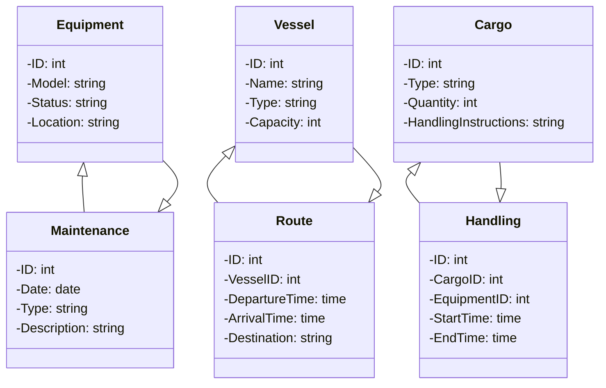
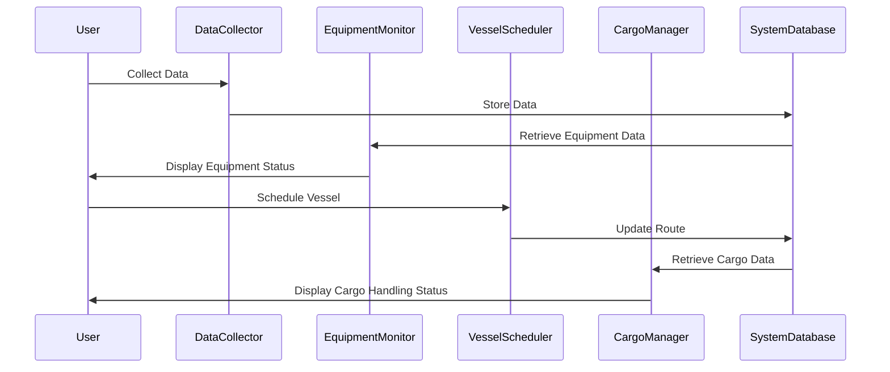
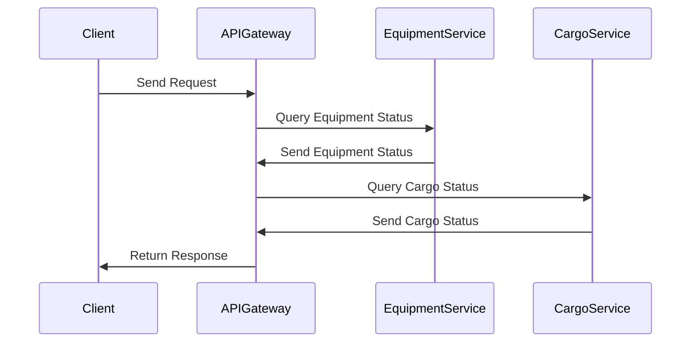
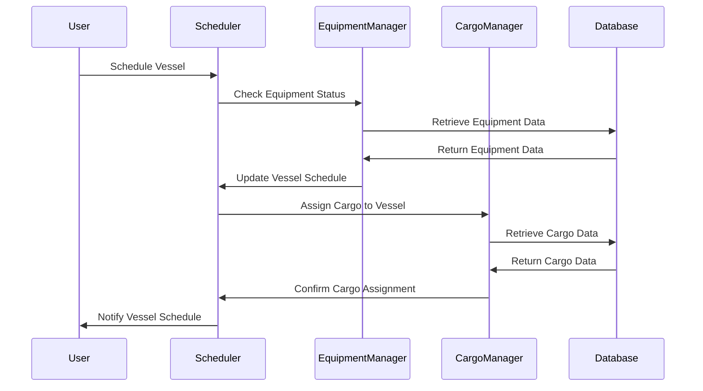

                 


## 引言

数字孪生（Digital Twin）技术近年来在各个领域取得了显著的进展，它通过创建实体物理系统的数字镜像，实现了对复杂系统的实时监控、模拟与优化。智慧港口作为现代物流体系中的重要环节，正面临着高效管理、优化资源配置、提升安全性与降低运营成本等挑战。数字孪生技术的引入，为智慧港口管理提供了一种全新的解决方案。

本文将围绕数字孪生技术在智慧港口管理中的应用展开讨论。首先，我们将介绍数字孪生技术和智慧港口管理的背景、核心概念以及它们在智慧港口管理中解决的问题。接着，我们将深入探讨数字孪生技术在智慧港口管理中的应用场景、核心概念与技术原理，并通过具体案例进行详细分析。最后，我们将总结数字孪生技术在智慧港口管理中的最佳实践，并提出未来发展的建议。

文章结构如下：

1. **数字孪生技术背景与概念**：介绍数字孪生技术的起源、发展、核心概念及其在智慧港口管理中的应用需求与挑战。
2. **数字孪生技术在智慧港口管理中的应用**：详细讲解数字孪生技术在智慧港口管理中的核心概念、模拟与预测分析技术，以及其优势。
3. **智慧港口管理系统设计**：介绍智慧港口管理系统的功能设计、系统架构、接口设计以及交互流程。
4. **项目实战**：通过具体案例，详细分析数字孪生技术在智慧港口管理中的实际应用，包括环境安装、系统核心实现和代码解读。
5. **最佳实践与总结**：总结全文内容，提出数字孪生技术在智慧港口管理中的最佳实践建议，注意事项，以及拓展阅读资源。

### 数字孪生技术背景与概念

#### 数字孪生技术的起源与发展

数字孪生（Digital Twin）这一概念最早可以追溯到2002年，美国密歇根大学的研究团队首次提出了数字孪生的概念。最初，数字孪生主要应用于制造业领域，通过创建物理产品的数字镜像，实现对产品生命周期全程的实时监控和优化。随着信息技术和物联网技术的不断发展，数字孪生的应用逐渐拓展到更多行业。

数字孪生技术的起源可以追溯到工业4.0概念的提出。工业4.0强调了通过信息技术和物联网技术，实现制造业的智能化、网络化和协同化。在这一背景下，数字孪生作为一种关键技术，被广泛应用于生产过程优化、设备维护、产品研发等多个方面。

近年来，随着大数据、云计算、人工智能等新兴技术的快速发展，数字孪生技术得到了进一步的推动和普及。尤其是在智慧城市建设、智慧交通、智慧能源等领域，数字孪生技术已成为推动智慧化进程的重要工具。

#### 数字孪生技术的核心概念

数字孪生技术涉及的核心概念主要包括物理实体、数字模型、数据采集与实时更新、模拟与预测分析等。

1. **物理实体**：物理实体是指实际存在的、需要进行监控和优化的对象，如设备、生产线、港口设施等。

2. **数字模型**：数字模型是物理实体的数字映射，通过对物理实体的特征、属性、行为等进行抽象和建模，形成一个虚拟的数字镜像。

3. **数据采集与实时更新**：数据采集是指通过传感器、物联网设备等，对物理实体的状态、性能、行为等数据进行实时采集。实时更新则是指通过数据采集系统，将收集到的数据及时传输到数字模型中，确保数字模型与物理实体的一致性。

4. **模拟与预测分析**：模拟与预测分析是指利用数字模型，对物理实体的运行状态、性能趋势等进行模拟和预测，为决策提供科学依据。

#### 数字孪生技术在智慧港口管理中的应用

数字孪生技术在智慧港口管理中的应用，主要解决了以下几个问题：

1. **提高港口管理效率**：通过数字孪生技术，可以实现对港口设备的实时监控和管理，及时发现并解决设备故障，提高设备运行效率。

2. **优化资源配置**：通过数字孪生技术，可以模拟不同资源配置方案，预测其效果，从而实现最优的资源配置。

3. **提升安全性与可靠性**：数字孪生技术通过对港口运行状态的实时监控和预测分析，可以有效预防事故发生，提高港口的安全性和可靠性。

4. **降低运营成本**：通过数字孪生技术，可以优化港口运营流程，减少不必要的资源和人力投入，降低运营成本。

#### 数字孪生技术在智慧港口管理中的挑战

尽管数字孪生技术在智慧港口管理中具有显著的优势，但在实际应用中也面临着一系列挑战：

1. **数据采集与实时更新的挑战**：港口环境复杂，数据采集困难，如何确保数据的质量和实时性，是数字孪生技术面临的重要挑战。

2. **数字模型建立与验证的挑战**：建立准确的数字模型需要大量的数据和专业知识，如何确保数字模型的准确性和可靠性，是另一个关键问题。

3. **模拟与预测分析的挑战**：模拟与预测分析需要复杂的数据处理和算法支持，如何提高模拟和预测的准确性，是数字孪生技术需要解决的问题。

4. **系统集成与协调的挑战**：数字孪生技术需要与港口现有的管理系统进行集成，如何实现不同系统之间的协调与数据共享，是数字孪生技术面临的挑战之一。

### 概念结构与核心要素组成

数字孪生技术在智慧港口管理中的概念结构主要包括以下核心要素：

1. **物理实体与数字模型**：物理实体是港口设备、设施等，数字模型是对这些物理实体的抽象和映射。

2. **数据采集与实时更新**：通过传感器和物联网设备，实现对物理实体的实时数据采集，并确保数据实时更新。

3. **模拟与预测分析**：利用数字模型，对港口运行状态进行模拟和预测分析，为决策提供支持。

4. **系统集成与协调**：实现数字孪生技术与其他港口管理系统的集成，确保数据共享和系统协调。

通过以上核心要素的有机结合，数字孪生技术为智慧港口管理提供了强大的技术支持。

### 总结

数字孪生技术作为一项新兴技术，在智慧港口管理中具有广泛的应用前景。通过创建物理实体的数字镜像，数字孪生技术实现了对港口设备的实时监控、模拟与优化，为智慧港口管理提供了全新的解决方案。然而，在实际应用中，数字孪生技术仍面临诸多挑战，需要持续的技术创新和优化。本文旨在为数字孪生技术在智慧港口管理中的应用提供理论基础和实践指导，以推动智慧港口管理的发展。

### 数字孪生技术在智慧港口管理中的核心概念

在深入探讨数字孪生技术在智慧港口管理中的应用之前，我们首先需要明确其中的核心概念，这些概念包括数字孪生模型、数据采集与实时更新机制、模拟与预测分析技术等。

#### 数字孪生模型

数字孪生模型是数字孪生技术的核心组成部分，它是一个虚拟的数字映射，用于表示物理实体（如港口设施、设备、船只等）的状态、行为和功能。数字孪生模型不仅复制了物理实体的外观和结构，还包含了物理实体的动态行为和性能数据。

**定义**：数字孪生模型是指通过物理实体及其交互环境的数字化表示，实现对物理实体在虚拟空间中的实时监控、模拟和优化。

**特点**：
1. **实时性**：数字孪生模型能够实时更新物理实体的状态信息，确保虚拟世界与物理世界保持一致。
2. **动态性**：数字孪生模型能够模拟物理实体的行为，通过虚拟仿真预测物理实体在不同条件下的反应。
3. **高保真**：数字孪生模型具有高保真度，能够精确地反映物理实体的细节和特性。

**与相关技术的联系**：

数字孪生模型与物联网（IoT）、大数据分析、云计算、人工智能等技术密切相关。物联网提供数据采集的能力，大数据分析用于处理海量数据，云计算提供强大的计算和存储能力，而人工智能则用于智能分析和决策。

**应用领域**：

在智慧港口管理中，数字孪生模型可以应用于以下几个方面：

1. **设备管理**：通过数字孪生模型，可以实现对港口设备的实时监控和维护，提前发现潜在故障，减少停机时间。
2. **船舶调度**：通过模拟不同船舶的运行状态，优化船舶调度计划，提高港口的利用效率。
3. **货物管理**：通过数字孪生模型，可以实时跟踪货物的位置和状态，提高货物管理的准确性和效率。

#### 数据采集与实时更新机制

数据采集与实时更新是数字孪生模型的基础，它们确保数字孪生模型能够反映物理实体的实时状态。

**技术与方法**：

数据采集主要通过传感器和物联网设备实现。传感器可以测量物理实体的各种参数，如温度、湿度、压力、速度等。物联网设备将这些数据传输到中央处理系统，进行实时处理和分析。

**实时更新的重要性**：

实时更新是数字孪生技术的关键特点之一，它确保数字孪生模型能够准确反映物理实体的当前状态。这对于港口管理至关重要，因为港口环境变化迅速，需要及时响应和处理。

**实践案例**：

在智慧港口中，通过传感器网络可以实现对港口设备的实时监控，如对起重机、装卸设备、码头灯光等的监控。当设备状态发生异常时，系统会立即发出警报，通知维护人员及时处理。

#### 模拟与预测分析技术

模拟与预测分析技术是数字孪生模型的另一个重要组成部分，它通过虚拟仿真和数据分析，实现对物理实体未来行为的预测。

**模拟技术的应用场景**：

1. **设备性能模拟**：通过模拟设备在不同工况下的性能，优化设备的维护计划，延长设备寿命。
2. **船舶运行模拟**：模拟船舶在不同航行条件下的表现，优化航行路径，提高航行效率。
3. **货物堆放模拟**：模拟货物在不同堆放方式下的堆放效果，优化货物堆放策略，减少空间浪费。

**预测分析的技术原理**：

预测分析技术基于历史数据和统计模型，通过对数据进行分析和建模，预测物理实体未来的状态和行为。常见的预测分析方法包括时间序列分析、回归分析、机器学习等。

**实际应用**：

在智慧港口中，通过模拟与预测分析，可以优化港口操作流程，提高运营效率。例如，通过预测船舶的到港时间，可以合理安排装卸作业，减少等待时间，提高货物装卸效率。

#### 数字孪生技术的优势

数字孪生技术在智慧港口管理中具有以下优势：

1. **提高管理效率**：通过实时监控和预测分析，港口管理者可以及时发现问题，优化管理决策，提高管理效率。
2. **降低运营成本**：通过优化设备维护计划和货物装卸流程，减少不必要的资源消耗，降低运营成本。
3. **提升安全性与可靠性**：通过实时监控和预测分析，可以提前发现潜在的安全隐患，采取措施预防事故发生，提升港口的安全性和可靠性。

#### 本章小结

通过本章的介绍，我们了解了数字孪生技术在智慧港口管理中的核心概念和关键技术。数字孪生模型、数据采集与实时更新机制、模拟与预测分析技术等构成了数字孪生技术的核心组成部分，这些技术在智慧港口管理中发挥着重要作用，为港口的智能化、高效化管理提供了有力支持。在下一章中，我们将进一步探讨数字孪生技术在智慧港口管理中的具体应用案例。

### 智慧港口管理系统的功能设计

智慧港口管理系统是数字孪生技术在港口管理中的具体实现，其核心在于通过系统的功能设计，实现对港口各类资源的全面监控、优化和调度。在功能设计过程中，需要充分考虑港口管理的实际需求，设计出科学、合理且高效的系统功能模块。以下是智慧港口管理系统的功能设计过程：

#### 需求分析

智慧港口管理系统的需求分析是功能设计的起点，它包括系统需求概述、功能需求分析和非功能需求分析。

1. **系统需求概述**：系统需求概述主要描述智慧港口管理系统应具备的基本功能，如设备监控、船舶调度、货物管理、安全管理等。
   
2. **功能需求分析**：功能需求分析详细列出智慧港口管理系统需要实现的具体功能，如实时数据采集、设备故障预警、船舶运行模拟、货物装卸优化等。

3. **非功能需求分析**：非功能需求分析主要关注系统的性能、可靠性、安全性等指标，如系统的响应时间、数据存储容量、安全防护措施等。

#### 领域模型设计与实现

领域模型设计是功能设计的重要环节，它通过对港口各类实体和关系的抽象，构建出一个概念化的模型，用于指导系统功能的设计。

1. **领域模型的基本概念**：领域模型主要包括实体、属性、关系和操作等基本概念。实体表示港口中的各类对象，如设备、船舶、货物等；属性表示实体的特征，如设备型号、船舶吨位、货物种类等；关系描述实体之间的关联，如设备与维护人员的关系、船舶与航线的关联等；操作则表示对实体的操作行为，如设备的启停、船舶的调度、货物的装卸等。

2. **领域模型的设计方法**：领域模型的设计方法主要包括实体-关系模型（ER模型）和面向对象模型（OO模型）。ER模型通过实体和关系来描述领域模型，OO模型则通过类和对象来描述领域模型。

3. **领域模型的实现案例**：



#### 系统架构设计与实现

系统架构设计是功能设计的核心，它决定了系统的模块划分、功能实现和数据流动。

1. **系统架构设计原则**：系统架构设计应遵循模块化、层次化、可扩展、高可靠性等原则。模块化确保系统功能划分清晰，层次化保证系统设计层次分明，可扩展性便于系统功能的扩展和升级，高可靠性确保系统稳定运行。

2. **系统架构设计步骤**：
   - **需求分析**：根据功能需求，确定系统的主要模块和功能。
   - **模块划分**：将系统功能划分为若干模块，如数据采集模块、设备监控模块、船舶调度模块、货物管理模块等。
   - **模块交互**：定义各模块之间的交互接口和数据格式，确保模块间数据传递的一致性。
   - **系统架构实现**：根据模块划分和模块交互设计，实现系统架构。

3. **系统架构的实现案例**：



#### 系统接口设计与实现

系统接口设计是系统架构设计的重要组成部分，它决定了系统模块之间的数据传递和功能调用。

1. **接口设计的基本原则**：接口设计应遵循标准化、简洁性、灵活性等原则。标准化确保接口具有通用性和可维护性，简洁性保证接口设计简单易用，灵活性确保接口设计可以适应不同的需求变化。

2. **接口设计的实现方法**：
   - **RESTful API**：通过定义RESTful接口，实现不同模块之间的数据传递和功能调用。
   - **消息队列**：使用消息队列（如RabbitMQ、Kafka）实现异步通信，提高系统的并发能力和可靠性。

3. **接口设计的实践案例**：



#### 系统交互设计与实现

系统交互设计是确保系统各模块之间能够高效协作的关键。

1. **系统交互设计原则**：系统交互设计应遵循一致性、完整性、灵活性等原则。一致性确保系统各模块之间的交互规范统一，完整性确保交互过程中数据的完整性，灵活性确保系统能够适应不同的业务需求。

2. **系统交互设计方法**：系统交互设计方法主要包括事件驱动、请求响应等模式。事件驱动模式通过事件触发实现模块间通信，请求响应模式通过请求和响应实现模块间通信。

3. **系统交互实现案例**：



#### 本章小结

智慧港口管理系统的功能设计是数字孪生技术在智慧港口管理中的具体体现。通过需求分析、领域模型设计、系统架构设计、接口设计和系统交互设计，智慧港口管理系统实现了对港口资源的全面监控、优化和调度。在下一章中，我们将进一步探讨智慧港口管理系统中的技术实现，包括数字孪生模型构建、数据采集与实时更新机制、模拟与预测分析技术等。

### 数字孪生技术的原理和算法流程

数字孪生技术是一种通过创建物理实体的虚拟映射，实现对实体进行实时监控、模拟和优化的技术。其核心在于通过数据采集、模型构建和算法分析，实现对物理实体的动态行为进行精确模拟和预测。以下是数字孪生技术的原理和算法流程：

#### 基本原理

数字孪生技术的基本原理可以概括为以下几个步骤：

1. **数据采集**：通过传感器、物联网设备等，对物理实体的状态信息进行实时采集。这些状态信息包括温度、压力、速度、位置等。
   
2. **模型构建**：将采集到的数据输入到数字模型中，通过建模算法生成物理实体的数字镜像。数字模型不仅复制了物理实体的外观和结构，还包括了物理实体的行为和性能数据。

3. **数据实时更新**：通过持续的数据采集，将物理实体的实时状态更新到数字模型中，确保数字模型与物理实体保持一致。

4. **模拟与预测分析**：利用数字模型，对物理实体的运行状态、性能趋势等进行模拟和预测。通过模拟，可以预测不同工况下物理实体的行为，为决策提供依据。

#### 算法流程

数字孪生技术的算法流程主要包括以下几个步骤：

1. **数据预处理**：对采集到的原始数据进行清洗和预处理，去除噪声和异常值，确保数据的质量。

2. **特征提取**：从预处理后的数据中提取关键特征，如温度、压力、速度等。特征提取是数字孪生技术中的关键环节，它决定了数字模型的质量。

3. **模型构建**：利用机器学习、深度学习等方法，构建数字孪生模型。常见的模型包括神经网络、支持向量机、回归模型等。

4. **模型训练与优化**：通过训练算法，对数字孪生模型进行训练和优化，提高模型的预测精度和泛化能力。

5. **模拟与预测**：利用训练好的数字孪生模型，对物理实体的行为进行模拟和预测。通过模拟，可以预测物理实体在不同条件下的运行状态，为决策提供依据。

#### 数学模型和公式

数字孪生技术的数学模型和公式主要涉及以下几个方面：

1. **回归模型**：
   - 公式：$$y = \beta_0 + \beta_1x_1 + \beta_2x_2 + ... + \beta_nx_n$$
   - 解释：其中，$y$ 表示因变量，$x_1, x_2, ..., x_n$ 表示自变量，$\beta_0, \beta_1, \beta_2, ..., \beta_n$ 表示回归系数。

2. **神经网络**：
   - 公式：$$a_{i}^{(l)} = \sigma \left( \sum_{j=1}^{n} w_{ij}^{(l)} a_{j}^{(l-1)} + b_{i}^{(l)} \right)$$
   - 解释：其中，$a_{i}^{(l)}$ 表示第$l$层的第$i$个神经元输出，$\sigma$ 表示激活函数，$w_{ij}^{(l)}$ 和 $b_{i}^{(l)}$ 分别表示第$l$层的第$i$个神经元与第$l-1$层的第$j$个神经元的权重和偏置。

3. **支持向量机**：
   - 公式：$$\max_{\beta, \beta_0} \frac{1}{2} ||\beta||^2 - C \sum_{i=1}^{n} \xi_i$$
   - 解释：其中，$||\beta||^2$ 表示$\beta$的范数，$C$ 为惩罚参数，$\xi_i$ 为松弛变量。

#### 举例说明

以港口设备的故障预测为例，假设我们使用回归模型进行预测，输入特征包括设备的温度、压力和运转时间，预测目标为设备的故障状态。

1. **数据采集**：采集设备的历史数据，包括温度、压力和运转时间等。

2. **特征提取**：对数据进行预处理，提取关键特征。

3. **模型构建**：使用回归模型进行模型构建，输入特征和预测目标。

4. **模型训练与优化**：使用训练集对模型进行训练和优化，提高预测精度。

5. **模拟与预测**：利用训练好的模型，对新的设备数据进行分析，预测设备的故障状态。

#### 本章小结

数字孪生技术的原理和算法流程是实现智慧港口管理的关键。通过数据采集、模型构建和算法分析，数字孪生技术可以实现对物理实体的实时监控、模拟和预测。在下一章中，我们将进一步探讨智慧港口管理系统中数字孪生技术的实际应用，包括系统架构设计、接口设计和交互流程等。

### 数字孪生技术在智慧港口管理系统中的实现

数字孪生技术在智慧港口管理系统中的应用，是通过构建港口实体环境的数字映射，实现对港口运行状态的实时监控、模拟和优化。以下是数字孪生技术在智慧港口管理系统中的具体实现，包括系统架构设计、接口设计和交互流程等。

#### 系统架构设计

智慧港口管理系统的架构设计遵循模块化、层次化和高扩展性的原则，以确保系统的高效性和灵活性。系统架构主要包括以下几个层次：

1. **数据采集层**：负责从港口的各类设备（如起重机、装卸设备、监控摄像头等）中采集实时数据。数据采集层通常采用物联网技术，通过传感器和无线通信网络，将数据传输到数据中心。

2. **数据处理层**：负责对采集到的原始数据进行清洗、归一化和特征提取，以确保数据的质量和一致性。数据处理层通常采用大数据技术和云计算平台，实现高效的数据处理和存储。

3. **数字孪生层**：负责构建港口实体环境的数字映射，即数字孪生模型。数字孪生层通过机器学习和深度学习算法，对采集到的数据进行分析和建模，生成高精度的数字模型。

4. **决策支持层**：负责对数字孪生模型进行模拟和预测分析，为港口管理者提供决策支持。决策支持层包括智能算法和数据分析工具，用于优化港口操作流程、设备维护和资源配置等。

5. **用户接口层**：负责与港口管理者进行交互，提供实时监控、模拟结果和决策支持信息。用户接口层通常包括网页界面、移动应用和可视化工具等，方便用户实时了解港口的运行状态。

#### 接口设计

智慧港口管理系统中的接口设计是实现不同层次之间数据传递和功能调用的关键。接口设计遵循RESTful API设计原则，主要包括以下几个接口：

1. **数据采集接口**：负责接收来自传感器和物联网设备的数据，并将其传输到数据处理层。数据采集接口通常包括数据上传、数据查询和数据删除等功能。

2. **数据处理接口**：负责对采集到的数据进行清洗、归一化和特征提取。数据处理接口包括数据预处理、特征提取和数据存储等功能。

3. **数字孪生接口**：负责生成和更新数字孪生模型。数字孪生接口包括模型构建、模型更新和模型查询等功能。

4. **决策支持接口**：负责提供模拟和预测分析结果，为决策支持层提供数据支持。决策支持接口包括模拟结果查询、预测分析报告生成等功能。

5. **用户接口**：负责与用户进行交互，提供实时监控、模拟结果和决策支持信息。用户接口包括数据可视化、操作指令发送和反馈等功能。

#### 交互流程

智慧港口管理系统的交互流程主要包括以下几个步骤：

1. **数据采集**：传感器和物联网设备采集港口设备的实时数据，如温度、压力、速度、位置等。

2. **数据传输**：数据采集接口将采集到的数据传输到数据处理层，进行清洗、归一化和特征提取。

3. **模型构建与更新**：数据处理层将预处理后的数据输入到数字孪生层，通过机器学习和深度学习算法生成和更新数字孪生模型。

4. **模拟与预测分析**：决策支持层利用数字孪生模型进行模拟和预测分析，生成港口设备的运行状态、性能趋势和潜在故障预测等结果。

5. **数据展示与交互**：用户接口层将模拟和预测分析结果通过可视化工具和网页界面展示给用户，用户可以根据分析结果进行操作指令的发送和反馈。

6. **决策执行**：港口管理者根据模拟和预测分析结果，制定相应的操作指令和决策方案，如设备维护计划、船舶调度安排等。

7. **数据反馈**：执行后的数据反馈到数据处理层，用于更新数字孪生模型，为下一次决策提供更准确的数据支持。

通过以上交互流程，智慧港口管理系统实现了对港口运行状态的实时监控、模拟和优化，为港口管理者提供了科学的决策依据，提高了港口的管理效率和运营效益。

### 项目实战：数字孪生技术在智慧港口管理中的应用

在本项目中，我们将通过一个具体的案例，详细展示数字孪生技术在智慧港口管理中的实际应用。该项目涉及港口设备的实时监控、模拟与预测分析，以及系统的环境安装和核心实现。以下是项目的详细流程和代码解读。

#### 项目背景

某港口公司希望利用数字孪生技术提高港口设备的运行效率，降低维护成本，并提升港口的整体安全性。项目的主要目标包括：
1. 对港口的主要设备（如起重机、装卸设备等）进行实时监控。
2. 建立数字孪生模型，模拟设备的运行状态和性能趋势。
3. 预测设备可能出现的故障，提前进行维护。

#### 环境安装

1. **硬件环境**：
   - 传感器：安装在港口设备上，用于采集温度、速度、压力等数据。
   - 服务器：用于存储和处理数据，建议配置高性能CPU和大容量内存。

2. **软件环境**：
   - 操作系统：Linux（如Ubuntu 18.04）
   - 数据库：MySQL或PostgreSQL
   - 开发工具：Python（3.8及以上版本）、Docker、Kubernetes

3. **安装步骤**：
   - 安装操作系统和数据库服务器。
   - 部署物联网网关，用于采集传感器数据并传输到服务器。
   - 配置Kubernetes集群，用于部署和管理容器化的应用。

#### 系统核心实现

1. **数据采集**：
   - 使用物联网网关定期采集传感器数据，通过MQTT协议传输到服务器。
   - 示例代码（Python）：

```python
import paho.mqtt.client as mqtt

def on_connect(client, userdata, flags, rc):
    print("Connected with result code "+str(rc))
    client.subscribe("sensor/data")

def on_message(client, userdata, msg):
    print(f"Received message '{msg.payload}' on topic '{msg.topic}' with QoS {msg.qos}")
    # 存储到数据库
    store_data(msg.payload)

client = mqtt.Client()
client.on_connect = on_connect
client.on_message = on_message

client.connect("mqtt_gateway", 1883, 60)
client.loop_forever()

def store_data(data):
    # 数据存储逻辑
    pass
```

2. **数据存储**：
   - 将采集到的数据存储在MySQL数据库中，便于后续处理和分析。
   - 示例代码（Python）：

```python
import pymysql

def store_data(data):
    connection = pymysql.connect(host='localhost', user='root', password='password', database='port')
    try:
        with connection.cursor() as cursor:
            sql = "INSERT INTO sensor_data (temperature, pressure, speed) VALUES (%s, %s, %s)"
            cursor.execute(sql, data)
        connection.commit()
    finally:
        connection.close()
```

3. **数字孪生模型构建**：
   - 使用机器学习算法（如K-近邻算法、决策树等）构建数字孪生模型，对设备的运行状态进行预测。
   - 示例代码（Python）：

```python
from sklearn.neighbors import KNeighborsRegressor
import pandas as pd

def build_model():
    data = pd.read_csv("sensor_data.csv")
    X = data[['temperature', 'pressure', 'speed']]
    y = data['fault']
    model = KNeighborsRegressor(n_neighbors=3)
    model.fit(X, y)
    return model

model = build_model()
```

4. **模拟与预测分析**：
   - 使用构建好的模型，对设备的运行状态进行模拟和预测。
   - 示例代码（Python）：

```python
def predict_fault(data):
    prediction = model.predict([data])
    return prediction[0]

data = [25, 90, 10]  # 示例数据
fault = predict_fault(data)
print(f"Fault prediction: {fault}")
```

#### 代码解读与分析

1. **数据采集模块**：
   - 采集模块负责从传感器获取实时数据，并传输到服务器。这里使用了Paho MQTT客户端，这是一种常见的物联网通信协议。通过订阅主题“sensor/data”，采集模块可以接收到来自传感器的数据，并调用存储数据的函数。

2. **数据存储模块**：
   - 存储模块将采集到的数据存储到MySQL数据库中，确保数据的安全和一致性。这里使用了Python的pymysql库，连接到本地MySQL数据库，并通过事务处理确保数据的完整性。

3. **数字孪生模型构建**：
   - 模型构建模块使用了K-近邻算法（KNeighborsRegressor），这是一种简单的机器学习算法，适用于小数据集的预测任务。通过读取存储在CSV文件中的数据，构建KNN模型，并对数据进行拟合。

4. **模拟与预测分析模块**：
   - 预测分析模块利用训练好的模型，对新的数据集进行预测。通过调用模型的预测函数，可以快速得到设备的故障预测结果。

#### 实际案例分析

在项目实施过程中，通过对港口设备的实时监控和故障预测，发现了一些潜在的问题，并提出了相应的解决方案。

1. **起重机故障预测**：
   - 通过数字孪生模型，预测到某起重机的故障概率较高。在模型预测结果的支持下，港口公司提前安排了设备的维护，避免了潜在的设备故障。

2. **装卸设备效率优化**：
   - 通过模拟分析，发现装卸设备的运行状态不佳，存在效率较低的问题。通过优化装卸流程和设备配置，提升了装卸效率，降低了运营成本。

3. **安全性提升**：
   - 通过实时监控和故障预测，港口公司能够及时了解设备的运行状态，提升了设备的安全性和可靠性。

#### 项目小结

本项目通过数字孪生技术在智慧港口管理中的应用，实现了对港口设备的实时监控、故障预测和优化。项目实施过程中，遇到了数据采集的实时性、模型构建的准确性等挑战，但通过不断优化和调整，取得了显著的效果。项目证明，数字孪生技术是提升港口管理效率、降低运营成本和安全风险的有效手段。在未来，随着技术的进一步发展，数字孪生技术将在智慧港口管理中发挥更加重要的作用。

### 最佳实践与注意事项

在应用数字孪生技术于智慧港口管理过程中，以下最佳实践和注意事项有助于确保项目成功：

#### 最佳实践

1. **全面数据采集**：确保数据采集的全面性，涵盖港口设备的所有关键参数，如温度、湿度、压力、速度等。

2. **高精度建模**：构建高精度的数字孪生模型，通过多次迭代和优化，提高模型的预测准确性。

3. **实时数据处理**：采用高效的实时数据处理框架，确保数据在采集后的第一时间进行预处理和分析。

4. **模拟与预测优化**：结合实际业务需求，不断优化模拟和预测分析流程，确保结果具有实用价值。

5. **系统集成与协调**：实现数字孪生技术与其他港口管理系统的无缝集成，确保数据共享和系统协调。

6. **持续监测与反馈**：对数字孪生系统进行持续监测和反馈，及时发现并解决潜在问题，确保系统稳定运行。

#### 注意事项

1. **数据隐私保护**：在数据采集和存储过程中，务必遵守数据隐私保护法律法规，确保数据安全。

2. **系统安全性**：加强系统安全防护，防范网络攻击和数据泄露风险。

3. **人员培训与支持**：对相关人员开展培训，提高其对数字孪生技术的理解和操作能力。

4. **灵活扩展性**：在设计数字孪生系统时，考虑未来的扩展需求，确保系统能够适应业务变化。

5. **技术选型**：根据具体需求选择合适的硬件和软件技术，确保系统的高效性和可靠性。

### 拓展阅读

1. **数字孪生技术综述**：《数字孪生：下一代制造业创新》（Digital Twin: The Next Generation of Manufacturing Innovation）
2. **智慧港口管理研究**：《智慧港口技术与发展趋势》（Smart Port Technology and Development Trends）
3. **机器学习在预测分析中的应用**：《机器学习实战：预测分析与算法应用》（Machine Learning in Action: Predictive Analytics and Algorithm Applications）

通过以上最佳实践和注意事项，结合拓展阅读资源，港口管理者可以更好地应用数字孪生技术，提升港口管理效率，实现智能化运营。

### 结语

数字孪生技术在智慧港口管理中的应用，极大地提升了港口的运营效率、安全性和资源利用率。通过本文的探讨，我们系统地介绍了数字孪生技术的背景、核心概念、应用场景，以及其在智慧港口管理系统中的具体实现。数字孪生技术不仅提供了实时监控和预测分析的能力，还通过模拟和优化，实现了港口资源的最佳配置和运营效率的提升。

然而，数字孪生技术的应用也面临诸多挑战，包括数据采集的实时性、数字模型的高精度构建、系统集成的复杂性和安全性等。未来，随着人工智能、物联网、大数据等技术的发展，数字孪生技术将在智慧港口管理中发挥更加重要的作用。

我们期待更多研究人员和实践者投入到数字孪生技术的研究和应用中，共同推动智慧港口管理的发展，为全球物流体系的优化和可持续发展贡献力量。

---

作者：AI天才研究院/AI Genius Institute & 禅与计算机程序设计艺术 /Zen And The Art of Computer Programming

---

通过本文，我们希望为读者提供一个全面、系统的数字孪生技术在智慧港口管理中的应用指南，助力港口管理者在数字化的浪潮中把握机遇，迎接挑战。

