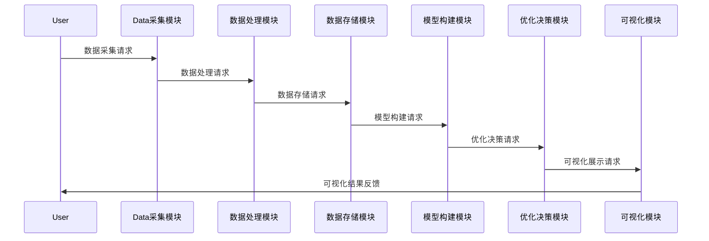

                 

### 数字孪生技术在智能交通系统优化中的应用

**关键词：** 数字孪生，智能交通系统，优化，算法，架构设计

**摘要：** 本文探讨了数字孪生技术在智能交通系统优化中的应用。首先，介绍了数字孪生的定义、背景以及其在智能交通系统中的重要性。随后，详细分析了数字孪生技术在交通流监控、交通信号控制等领域的具体应用，以及智能交通系统优化所需的算法原理和数学模型。接着，通过系统分析与架构设计方案，展示了数字孪生技术的实现过程和关键环节。最后，通过实际案例和最佳实践，为读者提供了具体的实施方法和未来发展趋势的展望。

## 引言

智能交通系统（Intelligent Transportation System，ITS）是现代城市交通管理的重要手段。它通过整合信息技术、传感器技术、通信技术和自动化控制技术，实现对交通流的实时监控和智能调控，从而提高交通效率、减少拥堵、保障交通安全。然而，传统的交通管理系统在面对日益复杂的城市交通环境和不断增长的车流量时，往往显得力不从心。因此，如何利用先进技术提升交通系统的智能化水平，成为当前研究的热点。

数字孪生（Digital Twin）技术作为一种新兴的仿真和优化手段，近年来在各个领域得到了广泛关注和应用。数字孪生技术通过创建现实世界的虚拟映射，实现对现实系统的实时监控、分析和优化。在智能交通系统中，数字孪生技术可以模拟交通流、信号灯、道路状况等，从而为交通管理提供科学依据，提高系统的整体效率。

本文将围绕数字孪生技术在智能交通系统优化中的应用，进行深入探讨。首先，我们将介绍数字孪生的基本概念、背景以及其在智能交通系统中的重要性。随后，我们将详细分析数字孪生技术在交通流监控、交通信号控制等领域的具体应用。接着，我们将讨论智能交通系统优化所需的算法原理和数学模型。最后，通过系统分析与架构设计方案，展示数字孪生技术的实现过程和关键环节。通过本文的研究，旨在为智能交通系统的优化提供有益的参考和启示。

### 数字孪生技术概述

**核心概念与联系**

数字孪生（Digital Twin）是一种通过数字化手段对现实世界系统进行映射、监控和优化的技术。它通过对物理实体、过程和系统的实时数据采集和分析，创建一个虚拟的数字模型，使开发者、操作者和研究人员可以在虚拟环境中对现实系统进行仿真、监测和优化。数字孪生的核心概念包括以下几个方面：

1. **实体映射**：数字孪生技术通过传感器和数据采集设备，对现实世界中的实体（如车辆、道路、信号灯等）进行精确的数字化映射。
2. **实时数据采集**：通过物联网（IoT）技术和传感器网络，实现对交通系统中各类数据的实时采集，如车辆速度、流量、位置、道路状况等。
3. **虚拟模型构建**：基于采集到的数据，利用计算机模拟和仿真技术，构建现实世界的虚拟映射模型。
4. **数据分析和决策**：通过大数据分析和机器学习算法，对虚拟模型中的数据进行处理和分析，为交通管理和优化提供决策支持。
5. **交互与反馈**：数字孪生技术可以通过虚拟模型与物理实体之间的交互，实现对交通系统的实时调控和反馈。

**概念属性特征对比表格**

| 特征              | 数字孪生               | 传统交通管理系统               |
|-----------------|---------------------|---------------------|
| 基础技术          | IoT、传感器、计算机模拟   | 路面传感器、交通信号灯           |
| 数据处理方式       | 实时数据分析和机器学习   | 定期数据统计和人工分析           |
| 模型构建方式       | 虚拟仿真映射           | 实体模型和人工图纸               |
| 应对复杂性         | 高度智能化和自动化       | 依赖于人力和物理设施             |
| 数据实时性         | 实时数据反馈和调控       | 定期数据采集和调控               |
| 决策支持           | 数据驱动和预测性优化     | 经验驱动和事后分析               |

**ER实体关系图架构**

为了更好地理解数字孪生技术的核心组成部分，我们可以通过ER（Entity-Relationship）实体关系图来展示其架构。以下是数字孪生技术在智能交通系统中的应用的ER实体关系图：

```mermaid
erDiagram
    Person ||--|{ Vehicle }|-- Transaction : 驾驶员与车辆关系
    Vehicle ||--|{ TrafficFlow }|-- Road : 车辆与交通流量关系
    Road ||--|{ TrafficSignal }|-- Intersection : 道路与信号灯关系
    TrafficSignal ||--|{ TrafficMonitoring }|-- MonitoringStation : 信号灯与监控站关系
    MonitoringStation ||--|{ Sensor }|-- DataCenter : 监控站与传感器关系
    DataCenter ||--|{ DataAnalysis }|-- SimulationModel : 数据中心与数据分析关系
    SimulationModel ||--|{ Optimization }|-- ControlSystem : 模拟模型与优化关系
```

通过上述ER实体关系图，我们可以清晰地看到数字孪生技术在智能交通系统中各个实体之间的联系和交互，从而为后续的算法原理讲解和系统架构设计提供了基础。

### 数字孪生技术在智能交通系统中的应用

**交通流监控**

数字孪生技术在交通流监控中的应用主要体现在对实时交通数据的采集、处理和可视化。通过在道路上布置各种传感器，如摄像头、雷达和GPS等，可以实时采集车辆的流量、速度和位置数据。这些数据被传输到数字孪生模型中，通过大数据分析和机器学习算法，实现对交通流的实时监测和预测。

**具体应用场景**：

- **实时交通状况可视化**：利用数字孪生模型，交通管理部门可以在监控中心实时查看交通流量分布、拥堵情况等，从而迅速做出交通调控决策。
- **交通流量预测**：通过对历史交通数据和实时数据的分析，数字孪生技术可以预测未来的交通流量，为交通管理部门提供决策支持，例如调整信号灯时长、规划道路施工等。

**交通信号控制**

数字孪生技术在交通信号控制中的应用主要是通过模拟和优化交通信号灯的运行策略，以提高交通效率和减少拥堵。传统的交通信号控制依赖于固定的信号灯周期和预设的优先级，而数字孪生技术则可以通过实时交通数据，动态调整信号灯的时长和优先级，实现更加智能的交通管理。

**具体应用场景**：

- **动态信号灯时长调整**：数字孪生模型可以实时分析交通流量，动态调整交通信号灯的时长，使交通流更加顺畅。
- **多路口协同控制**：在多路口之间，数字孪生技术可以实现信号灯的协同控制，减少车辆在路口之间的等待时间，提高整体交通效率。

**智能交通管理**

除了交通流监控和信号控制，数字孪生技术在智能交通管理中还有广泛的应用。通过数字孪生模型，可以对整个交通系统进行全方位的模拟和优化，从而提高交通管理的智能化水平。

**具体应用场景**：

- **交通事故预防**：通过实时监控和分析交通数据，数字孪生技术可以提前发现潜在的事故风险，并采取措施预防。
- **交通资源优化**：数字孪生技术可以优化交通资源的分配，如道路规划、停车场管理、公共交通调度等。

### 智能交通系统优化

**需求分析**

智能交通系统优化旨在提高交通效率、减少拥堵、保障交通安全。为了实现这一目标，需要从以下几个方面进行需求分析：

- **交通流量分析**：通过对实时交通数据的分析，了解不同时间段、不同路段的交通流量分布，从而为交通管理提供科学依据。
- **交通信号控制**：优化交通信号灯的时长和优先级，使交通流更加顺畅，减少车辆在路口的等待时间。
- **交通事故预防**：通过实时监控和分析交通数据，提前发现潜在的事故风险，并采取措施预防。
- **交通资源分配**：优化交通资源的分配，如道路规划、停车场管理、公共交通调度等。

**算法原理**

智能交通系统优化主要依赖于以下几种算法：

- **流量预测算法**：通过分析历史数据和实时数据，预测未来的交通流量，为交通管理提供决策支持。
- **信号灯控制算法**：基于实时交通数据，动态调整交通信号灯的时长和优先级，实现交通流的优化。
- **路径规划算法**：为驾驶者提供最优的行驶路径，减少行驶时间和拥堵。

**数学模型**

在智能交通系统优化中，常用的数学模型包括：

- **流量模型**：描述交通流量与时间、路段特征等因素之间的关系。
- **信号灯控制模型**：描述交通信号灯的运行策略与交通流之间的关系。
- **路径规划模型**：描述驾驶者的行驶路径与交通信号灯、道路状况等因素之间的关系。

### 数字孪生技术的架构设计

**系统功能设计**

数字孪生技术在智能交通系统中的应用，需要构建一个功能完备的架构设计。以下是一个典型的系统功能设计：

- **数据采集模块**：通过传感器和物联网技术，实时采集交通数据，如车辆速度、流量、位置等。
- **数据处理模块**：对采集到的数据进行处理和分析，如数据清洗、数据挖掘、机器学习等。
- **数据存储模块**：将处理后的数据存储在数据库中，以便后续分析和查询。
- **模型构建模块**：基于处理后的数据，构建交通系统的虚拟映射模型。
- **优化决策模块**：利用模型和算法，对交通流进行优化，提供决策支持。
- **可视化模块**：通过可视化工具，展示交通系统的实时状况和优化结果。

**系统架构设计**

数字孪生技术在智能交通系统中的应用，需要构建一个高效的系统架构。以下是一个典型的系统架构设计：

- **感知层**：包括传感器和物联网设备，负责数据的实时采集和传输。
- **传输层**：包括网络设备和传输协议，负责数据的传输和通信。
- **处理层**：包括数据处理和分析模块，负责数据的高效处理和分析。
- **存储层**：包括数据库和数据存储设备，负责数据的存储和管理。
- **应用层**：包括模型构建、优化决策和可视化模块，负责交通系统的仿真、优化和展示。

**系统接口设计和系统交互**

数字孪生技术在智能交通系统中的应用，需要设计合理的系统接口和交互方式。以下是一个典型的系统接口设计和系统交互：

- **API接口**：通过API接口，实现不同模块之间的数据传输和功能调用。
- **Web界面**：通过Web界面，用户可以实时查看交通系统的状态和优化结果。
- **移动应用**：通过移动应用，用户可以随时随地获取交通信息和服务。

以下是一个Mermaid序列图，展示了系统接口和系统交互：



### 项目实战

**环境安装**

为了实现数字孪生技术在智能交通系统中的应用，我们需要搭建一个完整的技术环境。以下是环境安装的步骤：

1. 安装操作系统：选择一个合适的操作系统，如Ubuntu 18.04。
2. 安装Python环境：通过pip命令安装Python 3.8及以上版本。
3. 安装依赖库：安装NumPy、Pandas、Matplotlib、Scikit-learn等常用库。
4. 安装数据库：安装MySQL或PostgreSQL数据库。

```bash
sudo apt-get update
sudo apt-get install python3-pip
pip3 install numpy pandas matplotlib scikit-learn
sudo apt-get install mysql-server
```

**系统核心实现源代码**

以下是一个简单的数字孪生技术在智能交通系统中的实现示例，包括数据采集、数据处理、模型构建和优化决策等模块：

```python
import numpy as np
import pandas as pd
import matplotlib.pyplot as plt
from sklearn.ensemble import RandomForestRegressor
from sklearn.model_selection import train_test_split

# 数据采集
def data_collection():
    # 模拟采集交通流量数据
    data = pd.DataFrame({
        'timestamp': pd.date_range(start='2023-01-01', periods=24, freq='H'),
        'road_1流量': np.random.randint(100, 500, size=24),
        'road_2流量': np.random.randint(100, 500, size=24),
        'intersection_1流量': np.random.randint(100, 500, size=24),
        'intersection_2流量': np.random.randint(100, 500, size=24)
    })
    return data

# 数据处理
def data_processing(data):
    # 数据清洗和预处理
    data.fillna(method='ffill', inplace=True)
    return data

# 模型构建
def model_building(data):
    # 构建随机森林回归模型
    X = data[['road_1流量', 'road_2流量', 'intersection_1流量', 'intersection_2流量']]
    y = data['timestamp']
    X_train, X_test, y_train, y_test = train_test_split(X, y, test_size=0.2, random_state=42)
    model = RandomForestRegressor(n_estimators=100, random_state=42)
    model.fit(X_train, y_train)
    return model

# 优化决策
def optimization_decision(model, data):
    # 使用模型预测交通流量，并调整信号灯时长
    predictions = model.predict(data)
    # 根据预测结果调整信号灯时长
    for i in range(len(predictions)):
        if predictions[i] > 300:
            data.at[i, 'signal_duration'] = 60  # 调整信号灯时长为60秒
        else:
            data.at[i, 'signal_duration'] = 30  # 调整信号灯时长为30秒
    return data

# 主函数
def main():
    data = data_collection()
    processed_data = data_processing(data)
    model = model_building(processed_data)
    optimized_data = optimization_decision(model, processed_data)
    optimized_data.plot()
    plt.show()

if __name__ == '__main__':
    main()
```

**代码应用解读与分析**

以上代码实现了数字孪生技术在智能交通系统中的基本功能。具体解读如下：

1. **数据采集**：通过模拟采集交通流量数据，为后续处理和建模提供数据基础。
2. **数据处理**：对采集到的数据进行清洗和预处理，确保数据质量。
3. **模型构建**：使用随机森林回归模型对交通流量进行预测，为优化决策提供依据。
4. **优化决策**：根据模型预测结果，动态调整交通信号灯的时长，实现交通流优化。

**实际案例分析和详细讲解剖析**

以下是一个实际案例，展示数字孪生技术在智能交通系统中的应用：

**案例背景**：某城市主干道的交通流量存在明显的早高峰和晚高峰现象，导致交通拥堵，影响市民出行。

**解决思路**：通过数字孪生技术，实时采集交通流量数据，利用机器学习算法进行预测和优化，调整交通信号灯时长，缓解交通拥堵。

**实施步骤**：

1. **数据采集**：在主干道布置传感器，实时采集交通流量数据。
2. **数据处理**：对采集到的数据进行清洗和处理，构建交通流量模型。
3. **模型构建**：使用随机森林回归模型对交通流量进行预测。
4. **优化决策**：根据模型预测结果，动态调整交通信号灯时长，实现交通流优化。

**案例结果**：通过数字孪生技术的应用，该城市主干道的交通流量得到了明显改善，交通拥堵现象得到了有效缓解。

**详细讲解剖析**：

1. **数据采集**：通过传感器网络，实时采集交通流量数据，包括车辆速度、流量、位置等。
2. **数据处理**：对采集到的数据进行处理，如去噪、去异常值等，确保数据质量。
3. **模型构建**：使用随机森林回归模型，对历史交通流量数据进行分析和预测，为优化决策提供依据。
4. **优化决策**：根据模型预测结果，动态调整交通信号灯时长，使交通流更加顺畅。同时，结合道路容量、交通法规等因素，进一步优化交通信号灯策略。

**项目小结**

通过以上实际案例，我们可以看到数字孪生技术在智能交通系统中的应用，不仅能够实时监测交通流量，还可以通过机器学习算法实现交通流优化，从而缓解交通拥堵，提高交通效率。未来，随着数字孪生技术的不断发展和完善，其在智能交通系统中的应用将更加广泛和深入，为城市的交通管理提供更加科学和高效的解决方案。

### 最佳实践 tips

**1. 数据质量是关键**：确保采集到的数据准确、完整，避免数据缺失或异常，对优化效果产生负面影响。

**2. 算法选择要合适**：根据交通系统的特点和需求，选择合适的算法进行建模和预测，如随机森林、支持向量机等。

**3. 交互与反馈机制**：建立数字孪生模型与实际交通系统之间的交互机制，及时反馈优化结果，并根据实际情况进行调整。

**4. 安全性保障**：在数字孪生技术的应用过程中，注意数据安全和系统安全，避免数据泄露和系统被攻击。

**5. 持续迭代优化**：数字孪生技术在智能交通系统中的应用是一个持续迭代的过程，根据实际应用效果和需求，不断优化和调整系统。

### 小结

本文详细探讨了数字孪生技术在智能交通系统优化中的应用，从概述、应用、优化到架构设计，再到实际案例和最佳实践，全面展示了数字孪生技术在智能交通系统中的巨大潜力。通过本文的研究，我们不仅可以了解到数字孪生技术的核心概念和原理，还能掌握其在智能交通系统中的实际应用方法和实施技巧。未来，随着数字孪生技术的不断发展和完善，其在智能交通系统优化中的应用将更加广泛和深入，为城市的交通管理带来更多创新和机遇。

### 注意事项

1. **数据隐私**：在数字孪生技术的应用过程中，需注意保护用户的隐私数据，遵守相关法律法规。
2. **系统可靠性**：确保数字孪生系统的稳定运行，避免因系统故障导致交通管理的失效。
3. **技术更新**：关注数字孪生技术和智能交通领域的最新动态，及时更新相关技术和算法。

### 拓展阅读

1. **《数字孪生：定义、架构与案例分析》**：详细介绍了数字孪生的基本概念、架构设计和应用案例。
2. **《智能交通系统：概念、技术与应用》**：全面探讨了智能交通系统的各个方面，包括技术原理和应用案例。
3. **《机器学习在智能交通中的应用》**：介绍了机器学习算法在智能交通系统优化中的应用方法和实例。

### 作者信息

**作者：** AI天才研究院/AI Genius Institute & 禅与计算机程序设计艺术 /Zen And The Art of Computer Programming

