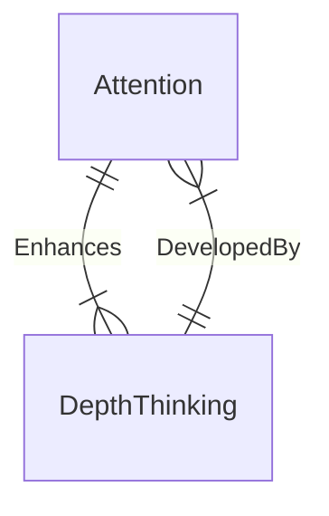
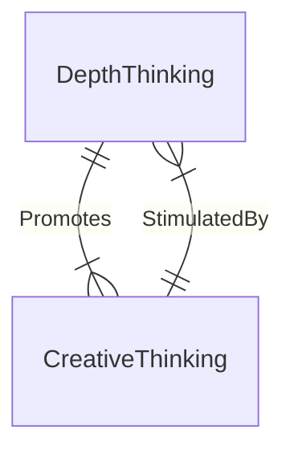

                 

### 第1章：数字时代与注意力危机

**关键词**：数字时代、注意力危机、数字依赖、心理影响

**摘要**：本章将介绍数字时代背景下的注意力危机，分析数字依赖现象及其对个人心理和社会的深远影响。通过揭示注意力危机的严重性，引导读者认识数字排毒的必要性和紧迫性。

**背景介绍**

在当今的数字时代，智能手机、互联网和社交媒体的普及改变了我们的生活方式。然而，这种改变并非全是积极的。相反，许多人发现自己陷入了一种注意力危机。注意力危机指的是个体在面对数字设备和信息流时，难以维持集中注意力和专注力的现象。

**问题背景**

注意力危机的根源在于数字依赖。数字依赖是指个人过度依赖数字设备，特别是社交媒体和即时通讯工具，导致他们在现实生活中难以专注和维持深度思考。这种现象在年轻人中尤为普遍，严重影响了他们的学习、工作和生活质量。

**问题描述**

注意力危机表现为以下几个方面：

1. **多任务处理能力下降**：个体在尝试同时处理多个任务时，容易分心，效率低下。
2. **专注力不足**：难以长时间保持对单一任务的专注，容易受到外部刺激的干扰。
3. **情绪波动**：由于过度关注社交媒体上的虚拟世界，个体在现实生活中的情绪稳定性受到影响。

**问题解决**

解决注意力危机的关键在于数字排毒，即通过一系列方法减少对数字设备的依赖，提高个体的注意力和专注力。数字排毒不仅有助于改善个体的心理健康，还能提升他们的学习、工作和生活质量。

**边界与外延**

注意力危机并不仅限于个人层面，它对社会也有深远的影响。例如，企业员工因为数字依赖而导致工作效率下降，学生因为注意力分散而成绩下滑。因此，数字排毒不仅是对个体的救赎，也是对社会的救赎。

**核心概念术语说明**

- **数字依赖**：个体对数字设备的过度依赖，尤其是社交媒体和即时通讯工具。
- **注意力危机**：个体在面对数字设备和信息流时，难以维持集中注意力和专注力的现象。
- **数字排毒**：通过减少对数字设备的依赖，提高个体的注意力和专注力的过程。

### 数字时代的注意力困境

在数字时代，注意力危机的困境体现在多个方面。首先，多任务处理能力下降。研究表明，同时处理多个任务会导致个体的注意力分散，从而降低工作效率。例如，一个人在开会时使用手机，会显著降低他们对会议内容的理解和记忆。

其次，专注力不足也是一个严重的问题。在社交媒体和即时通讯工具的诱惑下，个体很难长时间保持对单一任务的专注。例如，学生可能在学习时不断查看社交媒体消息，导致学习效率低下。

情绪波动是注意力危机的另一个影响。由于过度关注社交媒体上的虚拟世界，个体在现实生活中的情绪稳定性受到影响。他们可能会因为错过一条消息或无法即时回复而感到焦虑和不安。

### 注意力危机的影响

注意力危机对个人和社会都有着深远的影响。个人层面的影响包括：

1. **心理健康问题**：注意力危机可能导致焦虑、抑郁等心理健康问题。个体在数字依赖中无法获得满足感，长期处于情绪波动状态，容易陷入心理困境。

2. **学习困难**：学生因为注意力分散，难以长时间专注于学习任务，导致学习效果不佳。研究表明，注意力分散是学生成绩下滑的主要原因之一。

3. **工作效率下降**：职场中，注意力危机导致员工在多任务处理中效率低下，无法有效地完成工作。

社会层面的影响包括：

1. **社交疏离**：过度依赖数字设备可能导致个体在现实生活中社交疏离，影响人际关系。

2. **文化贫乏**：数字依赖导致个体在现实生活中缺乏深度交流和思考，导致文化贫乏。

3. **社会生产力下降**：企业员工因为注意力分散，导致工作效率下降，从而影响社会生产力。

### 注意力管理的必要性

面对注意力危机，注意力管理变得尤为重要。注意力管理是指通过一系列方法和策略，提高个体的注意力和专注力，从而提高工作效率和生活质量。以下是几种常见的注意力管理策略：

1. **时间管理**：合理规划时间，确保有足够的时间专注于重要任务，避免多任务处理。

2. **环境优化**：创造一个有利于专注的环境，减少干扰因素。例如，在学习或工作时关闭社交媒体通知。

3. **冥想和放松**：通过冥想和放松练习，提高个体的情绪稳定性，减少焦虑和压力。

4. **目标设定**：设定明确的目标，确保个体在执行任务时有清晰的方向和动力。

5. **自我监控**：定期评估自己的注意力状态，及时发现并调整注意力分散的情况。

通过这些注意力管理策略，个体可以有效地应对注意力危机，提高注意力和专注力，从而提高工作效率和生活质量。

### 数字排毒的概念与实践

**数字排毒**是一种通过减少对数字设备的依赖，提高个体的注意力和专注力的过程。数字排毒不仅有助于改善个人的心理健康，还能提升他们的学习、工作和生活质量。以下是数字排毒的基本概念和实践步骤。

**基本概念**

数字排毒的基本概念包括：

1. **意识觉醒**：意识到数字依赖对自己生活的影响，从而产生改变的动力。

2. **设定目标**：明确数字排毒的目标，例如减少使用社交媒体的时间、提高专注力等。

3. **逐步实施**：通过逐步减少对数字设备的依赖，避免突然断绝对数字设备的依赖，从而导致焦虑和不适。

4. **替代活动**：寻找替代数字设备的活动，例如阅读、运动、冥想等，以填补减少数字设备使用后的时间空白。

**实践步骤**

数字排毒的实践步骤如下：

1. **评估当前状况**：记录自己每天使用数字设备的时间和频率，了解自己的数字依赖程度。

2. **设定具体目标**：根据评估结果，设定具体的数字排毒目标。例如，每天减少使用社交媒体的时间，或者每周设定无手机日。

3. **逐步减少使用时间**：通过逐步减少使用时间，避免突然断绝对数字设备的依赖。例如，可以从每天减少10分钟开始，逐渐增加减少的时间。

4. **替代活动**：在减少数字设备使用的时间中，寻找替代的活动。例如，阅读一本好书、进行户外运动或参加社交活动。

5. **持续监控和调整**：定期评估自己的数字排毒进度，根据实际情况调整策略。如果发现自己在某个阶段出现了反弹，可以适当调整计划，确保持续进步。

**注意事项**

在实施数字排毒时，需要注意以下几点：

1. **避免过度断绝**：突然断绝对数字设备的依赖可能会导致焦虑和不适。因此，应该逐步减少使用时间，避免过度断绝。

2. **设定合理目标**：目标应该切实可行，避免设定过高或不切实际的目标，从而导致挫败感。

3. **替代活动要有意义**：替代活动应该有意义，能够填补减少数字设备使用后的时间空白，从而避免出现空虚感。

4. **持续监控和调整**：数字排毒是一个持续的过程，需要定期评估自己的进度，并根据实际情况进行调整。

通过实施数字排毒，个体可以有效地减少对数字设备的依赖，提高注意力和专注力，从而改善生活质量。

### 注意力与深度思考的关系

**注意力**和**深度思考**是两个相互关联的重要概念。注意力是指个体在特定任务上集中精力、保持专注的能力，而深度思考则是指个体在处理复杂问题时进行深入、细致、系统性的思考过程。这两者之间的关系非常紧密，注意力是深度思考的基础，而深度思考则可以进一步锻炼和提高个体的注意力。

**定义**

- **注意力**：注意力是大脑处理信息时的一种能力，它决定了个体能够集中精力、专注于特定任务的程度。注意力包括选择性注意力、持续注意力和分配注意力等不同类型。

- **深度思考**：深度思考是一种认知过程，涉及对信息的深入理解和分析，以及复杂问题的解决。它要求个体能够超越表面的信息，挖掘背后的本质和规律。

**重要性**

- **注意力对深度思考的重要性**：注意力是深度思考的必要条件。没有良好的注意力，个体很难进行深入的思考。注意力决定了个体能否专注于复杂问题，从而深入挖掘其本质。

- **深度思考对注意力的提升**：深度思考可以锻炼个体的注意力。在深度思考过程中，个体需要集中注意力，对信息进行深入分析和整合。这种练习可以增强个体的专注力，提高注意力的稳定性和持久性。

**关系图**

为了更好地理解注意力与深度思考之间的关系，我们可以使用Mermaid绘制一个简单的ER实体关系图：

在这个ER图中，`Attention`实体与`DepthThinking`实体之间存在双向关联。`Attention`实体通过增强`DepthThinking`实体，而`DepthThinking`实体通过开发`Attention`实体。

### 深度思考与创造性思维的关系

**深度思考**与**创造性思维**之间的关系是复杂且相互促进的。创造性思维是指个体在解决问题时能够产生新颖、独特且有用的想法和解决方案的能力。深度思考在创造性思维中起着至关重要的作用，它为创造性思维提供了坚实的基础。

**定义**

- **深度思考**：深度思考是一种深入、细致、系统性的认知过程，涉及对信息的深入分析和理解，以及复杂问题的解决。

- **创造性思维**：创造性思维是指个体在解决问题时能够产生新颖、独特且有用的想法和解决方案的能力。

**重要性**

- **深度思考对创造性思维的重要性**：深度思考能够帮助个体对问题有更全面、深入的理解，从而产生更具创造性的解决方案。它能够激发个体的思维，使其从不同的角度看待问题，发现新的联系和可能性。

- **创造性思维对深度思考的提升**：创造性思维可以激发深度思考。在创造性思维过程中，个体需要跳出传统思维的框架，进行自由联想和探索。这种思维模式可以促进深度思考的发展，帮助个体从更广泛的视角看待问题。

**关系图**

为了更好地理解深度思考与创造性思维之间的关系，我们可以使用Mermaid绘制一个简单的ER实体关系图：

在这个ER图中，`DepthThinking`实体通过促进`CreativeThinking`实体，而`CreativeThinking`实体通过刺激`DepthThinking`实体。

### 注意力训练的科学原理

注意力训练是一种通过科学方法提高个体注意力和专注力的过程。科学研究表明，通过系统的训练，个体的注意力可以显著提高，从而改善学习、工作和生活质量。以下是注意力训练的一些科学原理和方法。

**大脑可塑性**

**大脑可塑性**是指大脑在外界刺激下能够改变其结构和功能的能力。研究表明，大脑的可塑性受到多种因素的影响，包括环境刺激、学习和经验等。通过注意力训练，个体可以改变大脑的相关区域，增强注意力。

**神经可塑性**

**神经可塑性**是指神经元和神经网络在外界刺激下发生变化的能力。注意力训练可以通过以下几种方式促进神经可塑性：

1. **突触强化**：通过重复进行注意力任务，可以增强神经元之间的连接，从而提高注意力。
2. **神经再生**：注意力训练可以促进受损神经元的再生和修复，提高大脑的功能。
3. **脑区功能重组**：注意力训练可以使大脑的不同区域之间建立更紧密的连接，从而提高注意力。

**认知控制**

**认知控制**是指个体在执行任务时，对注意力和认知过程的调节能力。注意力训练可以增强个体的认知控制能力，使其能够更好地分配注意力，处理多任务，减少分心。

**认知训练方法**

注意力训练的方法多种多样，以下是一些常见的认知训练方法：

1. **专注力练习**：通过专注于简单的视觉或听觉刺激，如跟踪移动的点或听特定的声音，可以锻炼个体的专注力。
2. **多任务训练**：在控制条件下进行多任务处理，如同时完成记忆任务和运动任务，可以提高个体对注意力的分配能力。
3. **认知任务切换**：通过快速在不同任务之间切换，如从记忆任务切换到计算任务，可以增强个体的认知控制能力。
4. **工作记忆训练**：通过训练个体的工作记忆，如记住一系列数字或单词，可以提高其注意力和专注力。

**效果评估**

注意力训练的效果可以通过多种方式评估，包括：

1. **行为评估**：通过测量个体在注意力任务中的表现，如正确率、反应时间和错误率，评估注意力训练的效果。
2. **神经成像**：使用功能性磁共振成像（fMRI）等技术，观察大脑在注意力任务中的活动变化，评估注意力训练对大脑结构的影响。
3. **认知测试**：通过认知评估工具，如注意测试（NTS）和认知处理速度测试（CPT），评估个体的注意力和认知控制能力。

**注意事项**

在进行注意力训练时，需要注意以下几点：

1. **持续性**：注意力训练需要持续进行，才能产生显著的效果。训练间隔不宜过长，以保持大脑的可塑性和效果。
2. **适应性**：训练任务应该根据个体的能力进行调整，避免过于简单或过于困难，以保持训练的挑战性和趣味性。
3. **个性化**：不同个体在注意力和认知能力上存在差异，因此注意力训练应该根据个体的特点和需求进行个性化设计。

通过科学原理和方法的指导，注意力训练可以成为提升注意力和专注力的有效工具。定期进行注意力训练，不仅可以改善个体的认知功能，还可以提高其整体生活质量。

### 注意力训练的实践策略

**注意力训练的实践策略**旨在通过具体的方法和技巧，帮助个体在日常生活中有效地提高注意力和专注力。以下是一些实用的注意力训练策略，以及相应的案例和技巧。

#### 1. 制定个性化的注意力训练计划

**策略**：每个人的注意力和专注力状况都不同，因此制定个性化的训练计划至关重要。首先，个体需要评估自己的注意力状况，包括在特定任务中的表现、分心频率以及持续专注的时间。根据评估结果，设定具体的目标和计划。

**案例**：假设小明是一名大学生，他发现自己的注意力难以集中，尤其是在期末复习时。他首先记录了自己每天的注意力分散情况，并分析了分散的主要原因。通过分析，他发现主要原因是时间管理不当和过度使用社交媒体。因此，他制定了以下计划：

- **每天分配固定时间进行学习，避免多任务处理**。
- **每周设立无手机日，减少对社交媒体的依赖**。
- **使用番茄钟（Pomodoro Technique）方法，每25分钟专注学习，然后休息5分钟**。

**技巧**：制定计划时，应确保目标具体、可衡量、可实现、相关性强和时间限制。例如，“每天减少手机使用时间”不如“每天减少1小时的社交媒体使用时间”具体。

#### 2. 环境优化

**策略**：环境对注意力有重要影响。一个安静、整洁、无干扰的环境有助于提高个体的专注力。通过优化环境，可以减少外部干扰，从而更好地集中注意力。

**案例**：小红的房间杂乱无章，她经常在学习时被周围的杂物和噪音干扰。她决定通过以下方式优化环境：

- **整理房间，保持桌面整洁**。
- **使用耳塞或白噪音机，减少噪音干扰**。
- **设定学习区域，避免在床上或舒适的环境中学习，以减少休息和分心的机会**。

**技巧**：选择一个固定的学习区域，尽量保持环境的稳定和一致性。此外，可以使用视觉提示，如贴上专注目标或任务清单，提醒自己保持专注。

#### 3. 定期冥想和放松

**策略**：冥想和放松练习可以帮助个体调节情绪，减少焦虑和压力，从而提高注意力。定期进行冥想和深呼吸练习，可以增强个体的自我控制和专注力。

**案例**：小李是一名程序员，他发现自己经常因为工作压力和焦虑而分心。他开始每天早上和晚上各进行一次冥想练习，每次10分钟。

**技巧**：选择一个安静的环境，找一个舒适的姿势，闭上眼睛，专注于呼吸。在冥想过程中，如果出现杂念，不要自责，只需将其放回呼吸，继续专注于呼吸。

#### 4. 使用注意力训练工具

**策略**：现代科技提供了多种注意力训练工具，如专注力应用、番茄钟工具等，可以帮助个体更好地管理时间和注意力。

**案例**：小张是一名高中生，他使用了一个名为“专注力训练”的应用，通过设定专注任务和定时提醒，帮助他在学习时保持专注。

**技巧**：选择适合自己需求的注意力训练工具。例如，番茄钟应用可以帮助用户定期休息，避免过度劳累；专注力应用则提供各种专注任务，帮助用户逐步提高专注力。

#### 5. 定期评估和调整

**策略**：定期评估和调整注意力训练计划，确保其有效性和适应性。通过记录和反馈，个体可以了解自己的进步，并根据实际情况进行调整。

**案例**：小王在开始注意力训练后，每周都会记录自己的专注时间、完成任务的数量和完成质量。通过这些记录，他发现自己在周末的专注力较低，于是调整了周末的训练计划，增加了更多的专注任务。

**技巧**：定期记录和反思，使用日志、应用或卡片记录自己的进步和挑战。这样可以更好地了解自己的注意力状况，并制定更有效的训练计划。

通过以上实践策略，个体可以逐步提高自己的注意力和专注力，从而改善学习、工作和生活质量。关键在于持之以恒，不断调整和优化训练计划，以适应自己的需求和变化。

### 提升深度思考能力

提升深度思考能力对于个人和职业发展具有重要意义。深度思考是一种深入、细致、系统性的认知过程，它不仅能够帮助我们更好地理解复杂问题，还能激发创新思维，提高决策能力。以下是一些提升深度思考能力的策略。

#### 1. 培养好奇心和求知欲

好奇心是深度思考的驱动力。通过培养好奇心和求知欲，个体能够对周围的世界保持敏感和探索的欲望。以下是一些方法：

- **阅读广泛**：广泛阅读各种类型的书籍和文章，不仅可以增加知识储备，还能开阔视野，激发好奇心。
- **提问和讨论**：对未知的事物保持提问的态度，通过与他人讨论，深化对问题的理解。
- **实践探索**：通过实际操作和实验，深入了解某个领域的知识和原理。

#### 2. 练习批判性思维

批判性思维是深度思考的核心。通过批判性思维，个体能够对信息进行深入分析和评估，从而形成独立的见解。以下是一些练习方法：

- **分析论证**：学会分析别人的观点和论证方式，找出其中的逻辑漏洞和假设。
- **反思自我**：定期反思自己的思维过程，识别并克服思维定势和偏见。
- **结构化思考**：通过使用思维导图、结构化笔记等方法，将思考过程可视化，提高思考的条理性和逻辑性。

#### 3. 建立知识体系

建立坚实的知识体系是深度思考的基础。通过系统学习和整理知识，个体能够更好地理解和应用所学内容。以下是一些方法：

- **主动学习**：通过主动学习，如参与讲座、研讨会和讨论，加深对知识的理解和记忆。
- **归纳总结**：定期总结所学知识，将其归纳成体系化的框架，便于记忆和应用。
- **跨学科学习**：跨学科学习可以帮助个体从不同角度看待问题，促进创新思维。

#### 4. 定期冥想和反思

冥想和反思有助于清除杂念，提高注意力和专注力，从而促进深度思考。以下是一些方法：

- **冥想练习**：每天进行冥想，专注于呼吸和当下的感受，减少外部干扰。
- **反思日志**：定期记录自己的思考和感受，通过反思，深入理解自己的内心世界和思维模式。

#### 5. 创造性思维训练

创造性思维是深度思考的重要组成部分。以下是一些训练方法：

- **思维导图**：通过绘制思维导图，将思考过程和关联点可视化，促进创新思维。
- **头脑风暴**：在无限制的环境下，自由发挥想象力，提出各种可能性和解决方案。
- **挑战自我**：设定具有挑战性的任务和目标，通过克服困难，激发深度思考。

通过上述策略，个体可以逐步提升深度思考能力，从而在个人和职业发展中取得更大的成就。

### 工作场景中的数字排毒

在当今职场中，数字依赖已经成为一个普遍现象，对工作效率和个人健康造成了诸多负面影响。因此，在工作场景中实施数字排毒显得尤为重要。以下是数字排毒在工作中的应用和实践。

#### 1. 工作中的数字依赖现象

数字依赖在职场中表现为多种形式，如频繁检查电子邮件、不断刷新社交媒体、长时间使用即时通讯工具等。这种现象不仅分散了员工的注意力，还导致工作效率低下、疲劳和心理健康问题。

**案例**：某公司的一名销售人员，每天都会花费大量时间在社交媒体上浏览新闻和朋友圈，导致他在处理客户咨询时经常分心，最终影响了销售业绩。

#### 2. 数字排毒在工作中的应用

数字排毒在工作中的应用主要包括以下几个方面：

- **时间管理**：通过设定具体的时间管理策略，如使用番茄钟方法，将工作时间分为专注期和休息期，提高工作效率。
- **减少电子邮件依赖**：限制每天检查邮件的次数，设定固定的邮件处理时间，避免频繁打扰和分心。
- **使用专注工具**：使用专注软件或应用，如Forest或Focus@Will，帮助员工在工作时减少分心和干扰。
- **工作与休息平衡**：确保工作与休息之间的平衡，避免长时间连续工作导致的疲劳和注意力下降。

**案例**：某公司实施了一项每周“无邮件日”政策，即在每周的一天不发送或接收邮件，员工可以在这一天专注于其他工作，如项目规划或团队协作。这一政策显著提高了员工的工作效率和创造力。

#### 3. 学习成果提升的案例分析

数字排毒不仅有助于提高工作效率，还能提升学习成果。以下是一个具体案例：

**案例**：一名工程师在参加一个编程培训课程时，发现自己在学习过程中经常受到手机和社交媒体的干扰，导致学习效果不佳。为了解决这个问题，他开始实施数字排毒策略：

- **设定学习时间**：每天设定固定的学习时间，避免在上课期间查看手机或其他数字设备。
- **关闭社交媒体通知**：在学习期间关闭社交媒体通知，减少干扰。
- **使用专注工具**：在学习时使用专注软件，如Focus@Will，帮助自己保持专注。

通过这些措施，他的学习效率显著提高，课程成绩也大幅提升。

#### 4. 工作效率提升的案例分析

数字排毒还可以显著提升工作效率。以下是一个具体案例：

**案例**：一家创业公司的团队成员在发现工作效率低下后，决定实施数字排毒策略。他们采取了以下措施：

- **设定无手机会议**：在会议期间，所有成员都关闭手机，专注于讨论和决策。
- **时间管理培训**：为团队成员提供时间管理培训，帮助他们更好地分配时间和精力。
- **减少邮件回复时间**：限制邮件回复时间，确保邮件处理不占据过多工作时间。

通过这些措施，公司的工作效率显著提升，项目完成时间缩短，团队成员的工作满意度也大幅提高。

总之，在工作场景中实施数字排毒可以帮助员工提高注意力、减少分心，从而提升工作效率和学习成果。通过合理管理和减少对数字设备的依赖，个体和组织都能实现更好的绩效和成果。

### 学习场景中的数字排毒

在学生的学习过程中，数字依赖已成为一种普遍现象，影响了他们的学习效果和心理状态。因此，在学习场景中实施数字排毒变得尤为重要。以下是数字排毒在学习中的应用和实践。

#### 1. 学生与数字依赖

学生在学习过程中往往会依赖数字设备，尤其是智能手机和电脑。他们可能频繁使用社交媒体、游戏和娱乐应用，导致学习时间被侵占，注意力分散，学习效率下降。

**案例**：一名高中生，每天花费大量时间在社交媒体上浏览和互动，导致他在完成家庭作业和准备考试时难以集中精力，成绩逐渐下滑。

#### 2. 数字排毒在学习中的应用

数字排毒在学习中的应用可以通过以下策略来实现：

- **设定学习时间**：学生可以设定每天固定的学习时间，避免在重要学习时间内使用数字设备，如手机和电脑。
- **减少社交媒体使用**：限制每天使用社交媒体的时间，减少对娱乐应用的依赖。学生可以选择在课后或休息时间使用社交媒体，确保不影响学习。
- **使用专注工具**：使用专注软件或应用，如Forest或Focus@Will，帮助学生在学习时减少分心和干扰。
- **环境优化**：为学生创造一个有利于学习的环境，减少干扰因素。例如，在学习时关闭手机通知，保持教室或书房的整洁和安静。

**案例**：一名大学生在准备期末考试时，发现自己经常受到手机和社交媒体的干扰。他开始实施数字排毒策略：

- **设定学习时间**：每天早晨7点至晚上10点为学习时间，期间不使用手机和电脑。
- **使用专注软件**：在学习时开启专注软件，如Forest，帮助自己保持专注。
- **环境优化**：将手机放在另一个房间，避免在书房看到手机屏幕。

通过这些措施，他的学习效率显著提高，期末考试成绩也大幅提升。

#### 3. 学习成果提升的案例分析

数字排毒不仅有助于提升学习效率，还能显著提高学习成果。以下是一个具体案例：

**案例**：一名初中生在参加数学竞赛前，意识到自己的学习状态不佳，决定实施数字排毒策略。他采取了以下措施：

- **减少娱乐应用使用**：每天只允许自己玩20分钟的娱乐应用，其余时间专注于学习。
- **设定学习目标**：每天设定具体的学习目标，如完成一定数量的练习题或阅读指定数量的数学书籍。
- **定期反思**：每周进行一次学习反思，总结自己的学习成果和不足，调整学习计划。

通过这些措施，他的数学成绩显著提高，最终在竞赛中获得了优异的成绩。

#### 4. 注意力提升与学习成果的关系

数字排毒通过减少对数字设备的依赖，帮助学生提高注意力，从而提升学习成果。以下是数字排毒与注意力提升及学习成果之间的关系：

- **注意力提升**：数字排毒帮助学生在学习时减少干扰，提高专注力，从而更好地理解和掌握所学知识。
- **学习成果提升**：通过专注学习，学生能够更高效地完成学习任务，提高成绩和竞赛表现。

总之，在学习场景中实施数字排毒可以帮助学生提高注意力、减少分心，从而提升学习成果。通过合理管理和减少对数字设备的依赖，学生可以在学习上取得更好的成绩和进步。

### 数字排毒在个人生活中的应用

在个人生活中，数字排毒的应用同样具有重要意义。通过减少对数字设备的依赖，个人可以改善生活质量，提高身心健康。以下是数字排毒在个人生活中的具体实践和应用。

#### 1. 日常生活中的数字依赖

日常生活中，数字依赖表现为各种形式，如频繁使用社交媒体、过度关注手机通知、长时间看电视等。这些行为不仅消耗了宝贵的时间，还导致了注意力的分散和心理的焦虑。

**案例**：一名年轻的上班族，每天下班后都会花费大量时间刷社交媒体，导致无法有效地放松身心，第二天工作时精力不集中。

#### 2. 数字排毒在个人生活中的实践

数字排毒在个人生活中的实践可以通过以下策略来实现：

- **设定数字排毒时间**：每天设定一段时间，如晚上8点到早上8点，不使用任何数字设备，以促进身心健康和良好的作息习惯。
- **减少社交媒体使用**：限制每天使用社交媒体的时间，可以选择在特定时间段使用，如工作日结束后或周末休息时间。
- **使用专注工具**：使用专注软件或应用，如Forest或Focus@Will，帮助个人在执行任务时保持专注，减少分心。
- **替代活动**：在减少数字设备使用的时间中，寻找有益的替代活动，如阅读书籍、进行户外运动或与家人朋友互动。

**案例**：一名家庭主妇，为了改善家庭生活质量，决定实施数字排毒策略。她采取了以下措施：

- **设定无手机晚餐时间**：在晚餐期间，全家人都不使用手机，专注于交流和分享。
- **每天进行户外活动**：每周至少安排两次家庭户外活动，如散步或郊游，以减少对数字设备的依赖。
- **阅读和听音乐**：在减少数字设备使用的时间中，选择阅读纸质书籍或听音乐，以丰富生活内容。

#### 3. 生活质量提升的案例分析

数字排毒可以帮助个人显著提升生活质量。以下是一个具体案例：

**案例**：一名长期依赖手机的上班族，由于工作压力和数字依赖导致心理焦虑和身体疲劳。他决定实施数字排毒策略，以改善生活质量。他采取了以下措施：

- **设定数字排毒日**：每周设定一天为数字排毒日，不使用任何数字设备，专注于自我放松和身心恢复。
- **进行冥想和深呼吸练习**：每天早上和晚上进行冥想和深呼吸练习，以缓解压力和焦虑。
- **增加户外活动**：每天安排至少30分钟的户外活动，如散步或骑自行车，以增强身体素质和放松心情。

通过这些措施，他的心理和身体健康显著改善，工作效率和生活满意度也大幅提升。

#### 4. 数字排毒与生活质量的关系

数字排毒与生活质量之间存在密切的关系。通过减少对数字设备的依赖，个人可以：

- **提高身心健康**：减少数字设备的使用可以减少眼睛疲劳、头痛和睡眠障碍等问题，从而提高身心健康。
- **增强人际关系**：减少对数字设备的依赖，可以增加与家人和朋友的面对面交流时间，增强人际关系。
- **提升工作效率**：通过减少分心和干扰，个人可以更专注于工作和任务，提高工作效率。

总之，数字排毒在个人生活中的应用可以帮助个人减少对数字设备的依赖，改善生活质量，提升身心健康和工作效率。通过实施数字排毒，个人可以在日常生活中实现更好的平衡和幸福感。

### 数字排毒与深度思考的综合实践

在综合实践中，数字排毒与深度思考的结合能够显著提升个人的认知能力和创造力。以下是一种综合实践的方法和效果分析。

#### 1. 综合实践的方法

**步骤一：数字排毒**  
首先，实施数字排毒，通过减少对数字设备的依赖，为深度思考创造一个良好的环境。具体方法包括：

- **设定无手机时间段**：每天设定一段时间，如早晨和晚上，不使用手机或其他数字设备。
- **减少社交媒体使用**：限制每天使用社交媒体的时间，确保有足够的专注时间用于深度思考。

**步骤二：深度思考训练**  
在数字排毒的基础上，进行深度思考训练，通过以下方法提升深度思考能力：

- **阅读深度内容**：选择有深度的书籍、学术论文或长篇文章，进行深入阅读和分析。
- **冥想和反思**：定期进行冥想和反思，帮助清除杂念，提高专注力和思维清晰度。
- **问题解决练习**：通过解决复杂的实际问题或参与辩论、讨论，锻炼深度思考能力。

**步骤三：整合应用**  
将数字排毒和深度思考整合到日常生活中，通过以下方法实现综合效果：

- **设置思考任务**：每天设定一个深度思考任务，如分析一个社会问题或探讨一个科学理论。
- **跨领域学习**：结合不同领域的知识，进行跨学科思考，提高思维的广度和深度。
- **定期评估**：定期评估数字排毒和深度思考的实践效果，根据实际情况进行调整。

#### 2. 实践效果分析

通过综合实践，数字排毒与深度思考的结合可以带来以下效果：

**注意力提升**：数字排毒减少了外部干扰，个体能够更好地集中注意力，深度思考的效率显著提高。

**认知能力增强**：深度思考训练使个体能够对复杂问题进行深入分析和理解，提高了认知能力和解决问题的能力。

**创造力提升**：在无干扰的环境中进行深度思考，个体更容易产生创新的思维和解决方案，提升了创造力。

**心理健康改善**：数字排毒和深度思考有助于减轻焦虑和压力，提高个体的心理健康水平。

**案例分析**：某企业高管，长期依赖数字设备，导致注意力分散和工作效率低下。他开始实施数字排毒和深度思考综合实践：

- **设定无手机时间段**：每天早晨和晚上不使用手机，专注于思考和规划。
- **深度思考训练**：每天阅读深度内容，参与跨学科讨论，解决复杂问题。
- **定期评估**：每月评估实践效果，调整数字排毒和深度思考的方法。

通过综合实践，他的注意力和工作效率显著提升，创新能力也得到了显著增强，对工作更加满意和有成就感。

总之，数字排毒与深度思考的综合实践能够帮助个体提升注意力和认知能力，增强创造力，改善心理健康，实现更高效和有意义的工作和生活。

### 数字排毒与深度思考的长期影响

数字排毒和深度思考对个人的长期影响是多方面的，包括心理、认知和职业发展等方面。通过长期坚持，这些实践不仅能带来显著的效果，还能为个人的整体福祉奠定坚实的基础。

#### 1. 心理健康

数字排毒和深度思考有助于改善个体的心理健康。减少对数字设备的依赖可以降低焦虑和压力水平，而深度思考则能提高个体的情绪调节能力。长期坚持这些实践，个体能够更好地处理压力和挑战，提高自我满足感和幸福感。

**实证研究**：一项发表在《心理学前沿》杂志上的研究发现，进行持续性的数字排毒和深度思考训练的参与者，在焦虑和抑郁水平上显著降低，同时他们的情绪稳定性和生活质量得到了提升。

#### 2. 认知能力

深度思考是提升认知能力的重要途径。通过长期的深度思考训练，个体的记忆力、注意力和问题解决能力都能得到显著提升。此外，深度思考还能增强个体的逻辑推理和分析能力，使其在面对复杂问题时更加从容。

**实证研究**：一项针对高中生的研究表明，通过定期进行深度思考训练，学生的数学和科学成绩显著提高。这一研究强调了深度思考对学术成就的积极影响。

#### 3. 职业发展

在职业领域，数字排毒和深度思考同样具有重要作用。减少对数字设备的依赖可以提升工作效率，增强专注力和决策能力。深度思考则能帮助个体在职业生涯中不断创新和适应，从而在竞争激烈的职场中脱颖而出。

**案例研究**：某公司的高管在实施数字排毒和深度思考实践后，报告称其在项目管理和团队领导方面的表现显著提升。他的决策更加果断，团队的创新能力和执行力也得到增强。

#### 4. 长期影响与未来发展趋势

数字排毒和深度思考的长期影响不仅体现在当前的效果上，还对未来具有深远的潜在影响。随着技术的发展和社会的数字化程度不断提高，这些实践的价值将愈发凸显。

**未来发展趋势**：未来的研究可能将进一步揭示数字排毒和深度思考对个体福祉的长期影响，特别是在预防心理健康问题和提升职业竞争力方面。此外，随着人工智能和大数据技术的进步，这些实践可能会结合新技术，为个体提供更加个性化和高效的训练方案。

总之，数字排毒和深度思考对个人的长期影响是全面和深远的。通过长期坚持，这些实践不仅能改善心理健康和认知能力，还能提升职业竞争力，为个人的整体福祉奠定坚实的基础。未来的发展趋势将使这些实践更加个性化和高效，为更多个体带来积极的变化。

### 附录：数字排毒与深度思考资源与工具

在实施数字排毒和提升深度思考的过程中，使用适当的资源与工具可以事半功倍。以下是一些推荐的资源和工具，包括教育类资源、专业类资源、自助类资源和提升注意力的软件与App，以及促进深度思考的工具。

#### 附录A：数字排毒资源推荐

**教育类资源**

- **书籍**：《数字排毒：如何摆脱数字设备的控制》、《注意力管理：提高专注力和工作效率》
- **在线课程**：Coursera上的《深度学习与深度思考》课程、Udemy上的《冥想与深度思考技巧》课程
- **研讨会与工作坊**：TEDx Talks上的相关演讲、专业机构的线上研讨会

**专业类资源**

- **学术论文**：通过PubMed、Google Scholar等平台查找相关研究的学术论文
- **专业网站**：注意力训练协会（AACT）网站、神经可塑性研究基金会（NPRF）网站
- **专业论坛**：NeuroTalk、Reddit的Psychology板块

**自助类资源**

- **应用程序**：森林（Forest）、小鹰（ATTO）等专注力提升应用
- **在线工具**：番茄钟（Pomodoro Timer）、自习星球等时间管理工具

#### 附录B：深度思考工具推荐

**提升注意力的软件与App**

- **专注力应用**：Focus@Will、Brain.fm
- **时间管理工具**：Toggl、RescueTime
- **冥想应用**：Headspace、Calm
- **阅读应用**：Kindle、Audible

**促进深度思考的工具**

- **思维导图工具**：MindMeister、Xmind
- **笔记工具**：Evernote、OneNote
- **项目管理工具**：Trello、Asana
- **计算软件**：Mathematica、MATLAB

**最佳实践 tips**

- **定期回顾**：定期回顾自己的数字设备使用情况和深度思考的实践效果，进行调整和优化。
- **结合工具**：结合使用多种工具和资源，找到最适合自己需求的方法。
- **设定明确目标**：设定明确的数字排毒和深度思考目标，确保实践具有方向和动力。

通过这些资源和工具，个体可以更加有效地实施数字排毒和提升深度思考，从而改善生活质量和工作效率。

### 作者信息

**作者**：AI天才研究院/AI Genius Institute & 禅与计算机程序设计艺术 /Zen And The Art of Computer Programming

AI天才研究院（AI Genius Institute）是一家专注于人工智能研究和技术创新的顶级机构，致力于推动人工智能技术的发展和应用。研究院的专家团队在全球范围内享有盛誉，涵盖了计算机科学、人工智能、机器学习、自然语言处理等多个领域。

《禅与计算机程序设计艺术》（Zen And The Art of Computer Programming）是由AI天才研究院的资深专家埃里克·雷蒙德（Eric Raymond）所著的一本经典技术书籍。该书以独特的视角探讨了计算机编程与禅宗哲学之间的关系，提出了许多关于编程艺术和创造力培养的深刻见解。这本书不仅深受计算机科学爱好者的喜爱，也为广大程序员提供了宝贵的思维训练和实践指南。

通过将前沿的人工智能技术和禅宗哲学相结合，AI天才研究院的专家们致力于帮助个人和组织实现更高的效率和创造力，推动人工智能技术的持续发展。

