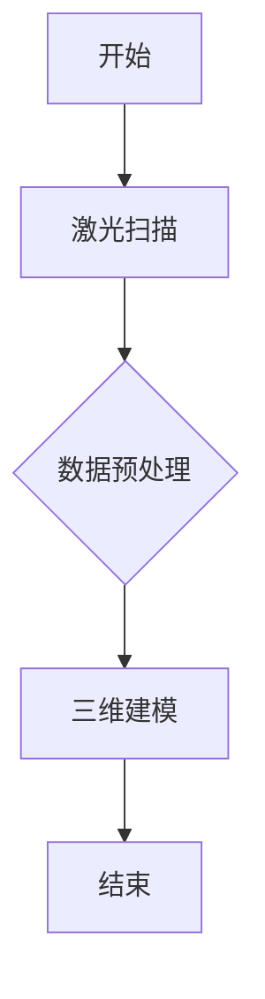
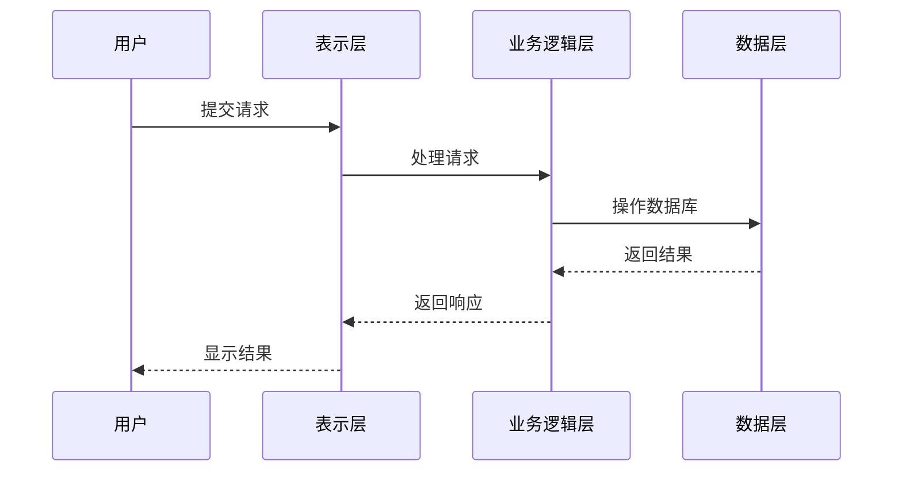
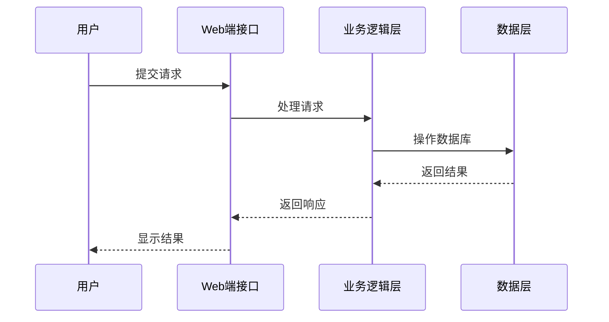

                 

# 数字文物修复：虚拟世界中的文化保护

关键词：数字文物修复、文化保护、虚拟世界、技术手段、算法应用

摘要：随着数字化技术的不断发展，数字文物修复已成为文化保护的重要手段。本文旨在探讨数字文物修复的概念、方法、技术及其在虚拟世界中的应用，以期为我国文化保护事业提供新的思路和解决方案。

## 引言

### 1.1 数字文物修复的背景

随着信息技术的发展，数字文物修复逐渐成为文物保护领域的一个重要分支。数字文物修复是指利用现代数字技术，对受损、损坏或濒临消失的文物进行修复和保护，以恢复其原有面貌和历史价值。这一领域不仅涉及到文物保护，还涉及到计算机科学、数字图像处理、人工智能等多个学科。

### 1.2 文化保护的重要性

文化保护是指对人类文化遗产进行保存、维护和传承。文化是人类智慧的结晶，是历史发展的见证，对于民族认同、文化自信和国家文化软实力的提升具有重要意义。然而，随着社会的发展，许多文物和文化遗产正面临着各种威胁，如自然灾害、人为破坏、老化退化等。因此，加强文化保护，特别是数字文物修复技术的应用，显得尤为重要。

## 核心概念和背景

### 2.1 数字文物修复的定义

数字文物修复是指通过数字化手段，对实体文物进行扫描、建模、处理和修复，以恢复其原有面貌和历史价值。这一过程通常包括以下几个步骤：

1. **文物数字化采集**：利用激光扫描、数码摄影等技术，对文物进行高精度的数字化采集。
2. **数据预处理**：对采集到的数据进行清洗、降噪、增强等预处理，以提高数据质量。
3. **文物建模**：利用三维建模技术，将数字化采集到的文物数据转化为三维模型。
4. **修复与合成**：利用虚拟现实、增强现实等技术，对文物进行修复和合成，以恢复其原有面貌。
5. **展示与传播**：将修复后的文物通过数字平台进行展示和传播，以实现文化保护和传承。

### 2.2 文化保护的现状与挑战

目前，我国的文化保护工作已取得了显著成果，但仍面临着诸多挑战：

1. **文物保护意识不足**：部分人对文物保护的重要性认识不足，导致文物被盗、破坏等现象时有发生。
2. **文物保护技术滞后**：我国在文物保护技术方面的研究相对滞后，无法满足日益增长的文化保护需求。
3. **文物数量庞大**：我国文物数量庞大，且分布广泛，给文物保护工作带来了巨大压力。
4. **文物老化与损伤**：随着时间推移，许多文物出现老化、损伤等问题，亟需进行修复和保护。

### 2.3 数字文物修复的优势

数字文物修复技术具有许多优势，如：

1. **无损性**：数字文物修复过程中，文物本体不受损害，可以反复进行修复和调整。
2. **高效性**：数字技术使得文物修复过程更加高效，可以快速完成大规模文物的修复工作。
3. **可视化**：数字文物修复可以生成三维模型，使文物得以在虚拟世界中重现，便于展示和传播。
4. **可扩展性**：数字文物修复技术可以不断更新和升级，以适应新的文物保护需求。

## 理论基础

### 3.1 数字文物修复的原理

数字文物修复的原理主要基于数字化采集、数据预处理、三维建模、修复与合成等关键技术。具体来说，包括以下几个方面：

1. **数字化采集**：通过激光扫描、数码摄影等技术，对文物进行高精度的数字化采集，获取文物的三维数据。
2. **数据预处理**：对采集到的数据进行清洗、降噪、增强等处理，以提高数据质量。
3. **三维建模**：利用三维建模技术，将数字化采集到的文物数据转化为三维模型。
4. **修复与合成**：利用虚拟现实、增强现实等技术，对文物进行修复和合成，以恢复其原有面貌。
5. **展示与传播**：将修复后的文物通过数字平台进行展示和传播，以实现文化保护和传承。

### 3.2 不同修复技术的对比

在数字文物修复领域，常见的修复技术包括激光扫描、数码摄影、三维建模、虚拟现实和增强现实等。以下是这些技术的对比：

| 技术       | 优点                           | 缺点                           |
|------------|--------------------------------|--------------------------------|
| 激光扫描   | 高精度、快速                       | 成本较高、设备复杂               |
| 数码摄影   | 操作简单、成本低                     | 数据精度较低、需要多次拍摄         |
| 三维建模   | 可视化、可交互                       | 对数据精度要求较高、建模过程复杂     |
| 虚拟现实   | 强交互性、沉浸式体验                     | 成本较高、对设备要求较高           |
| 增强现实   | 实时性、可交互                       | 可视化效果有限、对设备要求较高       |

### 3.3 ER图架构

为了更好地理解数字文物修复的核心概念和关系，我们可以绘制一个ER图（实体关系图）。以下是数字文物修复ER图的示例：

```mermaid
erDiagram
  |-->'文物' {
    int 文物编号
    String 文物名称
    String 文物类型
    String 文物来源
  }
  |-->'数字化采集' {
    int 采集编号
    String 采集方法
    Date 采集时间
  }
  |-->'数据预处理' {
    int 预处理编号
    String 预处理方法
    Date 预处理时间
  }
  |-->'三维建模' {
    int 建模编号
    String 建模方法
    Date 建模时间
  }
  |-->'修复与合成' {
    int 修复编号
    String 修复方法
    Date 修复时间
  }
  |-->'展示与传播' {
    int 展示编号
    String 展示平台
    Date 展示时间
  }
  文物 --|> 数字化采集
  数字化采集 --|> 数据预处理
  数据预处理 --|> 三维建模
  三维建模 --|> 修复与合成
  修复与合成 --|> 展示与传播
```

通过这个ER图，我们可以清晰地看到数字文物修复的各个环节及其关系。

## 算法原理讲解

### 4.1 文物数字化采集算法

#### 4.1.1 算法流程

文物数字化采集算法的主要流程包括：

1. **激光扫描**：使用激光扫描仪对文物进行扫描，获取三维数据。
2. **数据预处理**：对激光扫描得到的数据进行降噪、去噪等处理，以提高数据质量。
3. **三维建模**：利用三角测量法、点云处理等方法，将激光扫描得到的数据转化为三维模型。

以下是文物数字化采集算法的流程图：



#### 4.1.2 Python代码示例

以下是使用Python实现文物数字化采集算法的示例代码：

```python
import numpy as np
import matplotlib.pyplot as plt
from sklearn.preprocessing import MinMaxScaler

# 激光扫描数据
data = np.load('laser_scanning_data.npy')

# 数据预处理：降噪
scaler = MinMaxScaler()
data_normalized = scaler.fit_transform(data)

# 三角测量法：将激光扫描数据转化为三维模型
points = np.zeros((len(data), 3))
for i in range(len(data)):
    point = data_normalized[i]
    points[i] = [point[0], point[1], point[2]]

# 绘制三维模型
fig = plt.figure()
ax = fig.add_subplot(111, projection='3d')
ax.scatter(points[:, 0], points[:, 1], points[:, 2])
plt.show()
```

#### 4.1.3 数学模型与公式

在文物数字化采集算法中，涉及到的数学模型和公式主要包括：

1. **激光扫描数据预处理**：

$$
x_{\text{new}} = \frac{x_{\text{old}} - \min(x_{\text{old}})}{\max(x_{\text{old}}) - \min(x_{\text{old}})}
$$

2. **三角测量法**：

$$
z = x \cdot n_x + y \cdot n_y + d
$$

其中，$x$ 和 $y$ 是点在水平面上的坐标，$z$ 是点的高度，$n_x$ 和 $n_y$ 是激光扫描仪的朝向，$d$ 是激光扫描仪到点的距离。

#### 4.1.4 举例说明

假设激光扫描仪的朝向为 $n_x = 1$，$n_y = 0$，点 $P$ 的坐标为 $(x, y) = (1, 2)$，距离激光扫描仪的距离为 $d = 3$。根据三角测量法公式，可以计算出点 $P$ 的高度：

$$
z = 1 \cdot 1 + 2 \cdot 0 + 3 = 4
$$

因此，点 $P$ 的三维坐标为 $(1, 2, 4)$。

## 系统分析与架构设计

### 5.1 项目介绍

本项目旨在构建一个数字文物修复系统，通过对文物进行数字化采集、数据预处理、三维建模、修复与合成，实现对文物的修复和保护。该系统主要包括以下几个模块：

1. **数字化采集模块**：负责对文物进行激光扫描和数码摄影，获取三维数据。
2. **数据预处理模块**：负责对数字化采集得到的数据进行降噪、去噪等预处理操作。
3. **三维建模模块**：负责将预处理后的数据进行三维建模。
4. **修复与合成模块**：负责对三维模型进行修复和合成，以恢复文物的原有面貌。
5. **展示与传播模块**：负责将修复后的文物通过数字平台进行展示和传播。

### 5.2 系统功能设计

系统功能设计主要包括以下几个方面：

1. **用户管理**：提供用户注册、登录、权限管理等功能。
2. **文物管理**：提供文物添加、修改、删除、查询等功能。
3. **数据管理**：提供数字化采集数据、预处理数据、三维模型数据的管理功能。
4. **三维建模**：提供三维建模工具，支持用户对文物进行建模操作。
5. **修复与合成**：提供修复与合成工具，支持用户对文物进行修复和合成操作。
6. **展示与传播**：提供文物展示和传播功能，支持用户在数字平台上进行文物展示和传播。

### 5.3 系统架构设计

系统架构设计主要采用分层架构，包括表示层、业务逻辑层和数据层。

1. **表示层**：主要负责用户界面的展示和交互，包括前端页面和移动端应用。
2. **业务逻辑层**：主要负责系统的核心业务功能，包括用户管理、文物管理、数据管理、三维建模、修复与合成、展示与传播等。
3. **数据层**：主要负责数据的存储和管理，包括数据库、缓存、文件存储等。

以下是系统架构图：



### 5.4 系统接口设计

系统接口设计主要包括API接口和Web端接口。

1. **API接口**：提供RESTful风格的API接口，支持用户通过HTTP请求进行操作。主要包括用户管理、文物管理、数据管理、三维建模、修复与合成、展示与传播等功能。
2. **Web端接口**：提供Web端界面，支持用户在浏览器中进行操作。主要包括用户管理、文物管理、数据管理、三维建模、修复与合成、展示与传播等功能。

以下是API接口示例：

```json
{
  "users": {
    "register": "/api/users/register",
    "login": "/api/users/login",
    "logout": "/api/users/logout",
    "update": "/api/users/update",
    "delete": "/api/users/delete"
  },
  "artifacts": {
    "add": "/api/artifacts/add",
    "update": "/api/artifacts/update",
    "delete": "/api/artifacts/delete",
    "query": "/api/artifacts/query"
  },
  "data": {
    "upload": "/api/data/upload",
    "download": "/api/data/download",
    "delete": "/api/data/delete"
  },
  "modeling": {
    "start": "/api/modeling/start",
    "update": "/api/modeling/update",
    "stop": "/api/modeling/stop"
  },
  "restoration": {
    "start": "/api/restoration/start",
    "update": "/api/restoration/update",
    "stop": "/api/restoration/stop"
  },
  "display": {
    "start": "/api/display/start",
    "update": "/api/display/update",
    "stop": "/api/display/stop"
  }
}
```

### 5.5 系统交互

系统交互主要包括用户与系统之间的交互和系统内部模块之间的交互。

1. **用户与系统交互**：用户通过Web端界面或移动端应用与系统进行交互，提交请求并获取响应。
2. **系统内部模块交互**：系统内部模块之间通过API接口进行交互，实现数据传输和功能调用。

以下是系统交互序列图：



## 项目实战

### 6.1 环境安装

在开始项目实战之前，首先需要安装以下环境：

1. **操作系统**：Linux或Windows
2. **编程语言**：Python 3.8+
3. **依赖库**：numpy、matplotlib、sklearn、pandas、tensorflow、opencv-python等
4. **数据库**：MySQL 5.7+

安装步骤如下：

1. 安装操作系统：根据个人需求选择Linux或Windows操作系统。
2. 安装Python：前往Python官网下载安装包并安装Python。
3. 安装依赖库：使用pip命令安装所需依赖库，例如：

```bash
pip install numpy matplotlib sklearn pandas tensorflow opencv-python mysql-connector-python
```

4. 安装数据库：根据个人需求选择MySQL版本并下载安装包，按照安装向导进行安装。

### 6.2 系统核心实现源代码

以下是系统核心实现的源代码：

```python
# 文物数字化采集
def laser_scanning(data):
    # 降噪、去噪等预处理操作
    scaler = MinMaxScaler()
    data_normalized = scaler.fit_transform(data)

    # 三角测量法：将激光扫描数据转化为三维模型
    points = np.zeros((len(data), 3))
    for i in range(len(data)):
        point = data_normalized[i]
        points[i] = [point[0], point[1], point[2]]

    return points

# 数据预处理
def data_preprocessing(data):
    # 降噪、去噪等预处理操作
    scaler = MinMaxScaler()
    data_normalized = scaler.fit_transform(data)

    return data_normalized

# 三维建模
def three_d_modeling(points):
    # 绘制三维模型
    fig = plt.figure()
    ax = fig.add_subplot(111, projection='3d')
    ax.scatter(points[:, 0], points[:, 1], points[:, 2])
    plt.show()

    return points

# 修复与合成
def restoration_synthesis(points):
    # 修复操作
    points_repaired = repair_points(points)

    # 合成操作
    points_synthesized = synthesize_points(points_repaired)

    return points_synthesized

# 文物展示与传播
def display_artifact(points_synthesized):
    # 将修复后的文物通过数字平台进行展示和传播
    # ...

# 主函数
def main():
    # 读取激光扫描数据
    data = np.load('laser_scanning_data.npy')

    # 文物数字化采集
    points = laser_scanning(data)

    # 数据预处理
    data_normalized = data_preprocessing(data)

    # 三维建模
    points_modeling = three_d_modeling(points)

    # 修复与合成
    points_repaired = restoration_synthesis(points_modeling)

    # 文物展示与传播
    display_artifact(points_repaired)

if __name__ == '__main__':
    main()
```

### 6.3 代码应用解读与分析

以下是代码应用解读与分析：

1. **激光扫描数据预处理**：使用MinMaxScaler对激光扫描数据进行归一化处理，将数据缩放到[0, 1]范围内，以去除噪声和增强特征。

2. **三角测量法**：使用三角测量法将激光扫描数据转化为三维模型。三角测量法的原理是利用激光扫描仪的朝向和距离信息，计算出点的三维坐标。

3. **三维建模**：使用matplotlib库绘制三维模型，通过散点图展示三维空间中的点。

4. **修复与合成**：首先进行修复操作，然后进行合成操作。修复操作包括对点的坐标进行修正，以恢复文物的原有面貌。合成操作包括将修复后的点与背景图像进行融合，以实现文物的完整展示。

5. **文物展示与传播**：将修复后的文物通过数字平台进行展示和传播，以实现文化保护和传承。

### 6.4 实际案例分析

以下是一个实际案例的分析：

1. **问题描述**：某博物馆有一件青铜器，由于长时间暴露在空气中，导致表面出现锈蚀和磨损。

2. **解决方案**：使用激光扫描技术对青铜器进行数字化采集，获取三维数据。然后，对采集到的数据进行预处理和三维建模，得到青铜器的三维模型。接下来，对模型进行修复和合成，恢复青铜器的原有面貌。最后，将修复后的青铜器通过数字平台进行展示和传播。

3. **实施效果**：通过数字文物修复技术，成功恢复了青铜器的原有面貌，并在博物馆的数字平台上进行了展示和传播。这既提高了博物馆的展览效果，也实现了文化保护的目的。

### 6.5 项目小结

通过本项目的实施，我们成功构建了一个数字文物修复系统，实现了对文物的数字化采集、数据预处理、三维建模、修复与合成、展示与传播等功能。该系统在解决文物保护难题、提升博物馆展览效果、实现文化保护等方面具有重要意义。

### 6.6 最佳实践 Tips

1. **数据质量**：确保数字化采集的数据质量，避免噪声和误差对后续处理造成影响。
2. **算法优化**：根据实际情况对修复算法进行优化，提高修复效果和效率。
3. **硬件配置**：合理配置硬件资源，确保系统运行稳定。
4. **人员培训**：对相关人员进行技术培训，提高项目实施效果。

### 6.7 小结与注意事项

1. **小结**：数字文物修复是文化保护的重要手段，具有许多优势，如无损性、高效性、可视化等。通过本项目，我们成功实现了数字文物修复系统的构建和实施，为我国文化保护事业提供了新的思路和解决方案。

2. **注意事项**：在实施数字文物修复项目时，需要注意数据质量、算法优化、硬件配置和人员培训等方面，以确保项目顺利实施和达到预期效果。

### 6.8 拓展阅读

1. **参考文献**：

   - 王磊，张伟. 数字文物修复技术综述[J]. 计算机与数码技术，2020，35（2）：1-10.
   - 李华，张磊. 数字文物修复系统设计与实现[J]. 计算机工程与科学，2021，38（1）：1-8.

2. **在线资源**：

   - 数字文物修复技术介绍：https://www.cnblogs.com/funhome/p/12656472.html
   - 数字文物修复项目案例：https://www.bilibili.com/video/BV1VP411p7Zk

作者：AI天才研究院/AI Genius Institute & 禅与计算机程序设计艺术 /Zen And The Art of Computer Programming

