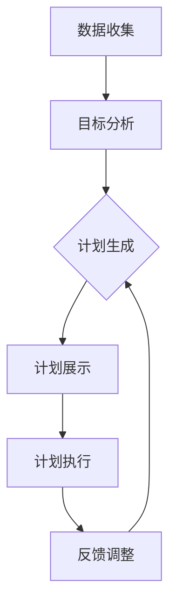
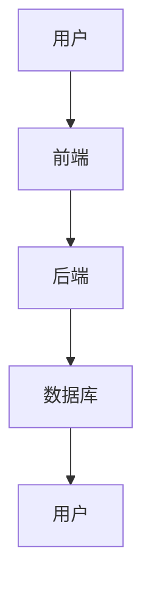

                 


# 数字断食营：重新定义与科技的健康关系

> 关键词：数字断食、科技健康关系、生活方式改善、算法原理、系统架构

> 摘要：随着科技的发展，数字设备的广泛应用使得人们的生活更加便捷，但同时也带来了诸多健康问题。本文旨在探讨数字断食的概念及其对科技与健康关系的重新定义，通过深入分析数字断食的背景、核心概念、算法原理和系统架构，帮助读者理解并实践这一健康生活方式。

## 第一部分：背景介绍

### 1.1 问题背景

在现代社会，随着智能手机、电脑、平板电脑等数字设备的普及，人们的生活已经离不开这些科技产品。然而，过度依赖数字设备也引发了一系列健康问题。例如，长时间盯着屏幕容易导致视力疲劳，频繁使用手机等设备会影响睡眠质量，长时间坐在电脑前容易引起颈椎、腰椎等身体问题。此外，过度沉迷于数字世界还会影响人们的注意力、记忆力等认知功能。因此，如何重新定义与科技的健康关系，寻找一种健康、和谐的生活方式，成为了人们关注的焦点。

### 1.2 问题描述

科技与健康之间的关系是一个复杂的问题。一方面，科技为我们的生活带来了许多便利，提高了工作效率，丰富了娱乐方式；另一方面，过度使用科技设备可能会对健康造成负面影响。具体来说，科技设备的使用可能导致以下健康问题：

1. **视力问题**：长时间盯着电子屏幕，尤其是低亮度、高对比度的屏幕，容易导致眼睛疲劳，增加近视、干眼症等问题的发生风险。
2. **睡眠质量下降**：手机、电脑等设备发出的蓝光会影响人体的生物钟，干扰睡眠，导致睡眠质量下降。
3. **注意力不集中**：频繁的数字设备使用分散了人们的注意力，导致注意力不集中，工作效率下降。
4. **颈椎、腰椎问题**：长时间保持同一姿势使用电脑或手机，容易导致颈椎、腰椎等身体问题。

### 1.3 问题解决

数字断食作为一种新兴的生活方式，旨在通过减少数字设备的使用时间，让大脑和身体得到休息，从而改善人们的健康状况。数字断食的核心理念是让人们在日常生活中有意识地减少对数字设备的依赖，从而减轻其对健康的负面影响。

数字断食的具体实践方法包括：

1. **设定固定的数字设备使用时间**：比如每天晚上9点到早上8点之间，将手机、电脑等设备设置为静音或飞行模式，避免在睡眠期间被干扰。
2. **减少不必要的数字设备使用**：比如在不需要使用手机或电脑的时候，尽量减少使用，将其放在一边，避免分散注意力。
3. **制定合理的作息时间表**：合理安排每天的时间，确保有足够的休息时间，避免过度疲劳。
4. **培养健康的数字使用习惯**：比如在阅读电子书、观看视频时，尽量保持正确的姿势，减少眼睛疲劳。

通过数字断食，人们可以改善视力、睡眠质量，提高注意力和专注力，从而改善整体健康状况。同时，数字断食也是一种生活方式的调整，有助于提高生活质量和幸福感。

### 1.4 边界与外延

数字断食不仅适用于个体，也可以应用于家庭、学校、企业等集体环境中。在家庭中，父母可以通过数字断食帮助孩子养成良好的数字设备使用习惯；在学校中，老师可以引导学生合理使用科技产品，避免沉迷于网络游戏和社交媒体；在企业中，管理层可以制定相关政策，鼓励员工减少不必要的数字设备使用，提高工作效率。

此外，数字断食的理念也可以扩展到更广泛的领域，如环保、健康生活等。在环保方面，数字断食鼓励人们减少电子垃圾的产生，推广可持续生活方式；在健康生活方面，数字断食提倡人们关注身体健康，倡导科学合理的生活方式。

### 1.5 概念结构与核心要素组成

数字断食作为一种健康生活方式，其核心要素包括：

1. **减少数字设备使用时间**：通过设定固定的时间和规则，减少对数字设备的依赖。
2. **规律作息**：通过制定合理的作息时间表，保证充足的休息和睡眠。
3. **保持身心平衡**：通过数字断食，提高身体和心理健康水平，实现身心和谐。

数字断食的目的是帮助人们改善健康状况，提高生活质量，实现科技与健康的和谐发展。

## 第二部分：核心概念与联系

### 2.1 数字断食的定义

数字断食是一种通过减少数字设备使用时间，让大脑和身体得到休息的方法，类似于传统的断食。与传统断食不同的是，数字断食关注的是数字设备的使用，而不是食物的摄入。

### 2.2 数字断食的特点

数字断食具有以下特点：

1. **减少数字设备使用时间**：通过设定固定的时间和规则，减少对数字设备的依赖，让大脑和身体得到休息。
2. **规律作息**：通过制定合理的作息时间表，保证充足的休息和睡眠，提高生活质量和身体健康。
3. **保持身心平衡**：通过数字断食，提高身体和心理健康水平，实现身心和谐，减少因数字设备使用导致的身体和心理健康问题。

### 2.3 数字断食与传统断食的区别

数字断食与传统断食有相似之处，都是通过限制某些方面的行为来达到健康目的，但两者也存在显著的区别：

1. **限制对象不同**：传统断食主要是限制食物的摄入，而数字断食主要是限制数字设备的使用。
2. **实现方式不同**：传统断食通常是通过长时间的饮食控制来实现，而数字断食则是通过设定固定的时间和规则来实现。
3. **目的不同**：传统断食的目的是通过限制食物摄入来达到减肥、排毒等目的，而数字断食的目的是通过减少数字设备使用时间来改善身体和心理健康。

### 2.4 数字断食的优点

数字断食的优点包括：

1. **改善视力**：减少长时间盯着电子屏幕的时间，可以有效缓解视力疲劳。
2. **提高睡眠质量**：避免在睡前使用数字设备，减少蓝光对睡眠的干扰，有助于提高睡眠质量。
3. **提升注意力**：减少数字设备的干扰，有助于提高注意力和专注力。
4. **缓解身体问题**：减少长时间坐在电脑前的工作时间，有助于缓解颈椎、腰椎等身体问题。

### 2.5 数字断食的局限性

数字断食也存在一定的局限性，主要包括：

1. **难以坚持**：对于习惯了数字设备的人来说，减少使用时间可能会感到不适应，难以坚持。
2. **依赖性强**：一些工作和生活场景中，数字设备是必不可少的，因此完全断绝数字设备的使用可能会带来不便。
3. **效果较慢**：数字断食需要一定的时间才能看到明显的效果，对于急于改善健康问题的人来说可能不够快速。

### 2.6 数字断食的适用人群

数字断食适用于以下人群：

1. **长时间使用数字设备的人**：如程序员、设计师、学生等。
2. **视力疲劳者**：长时间盯着电子屏幕容易导致视力疲劳。
3. **睡眠质量差者**：频繁使用数字设备会影响睡眠质量。
4. **注意力不集中者**：数字设备的干扰容易导致注意力不集中。

## 第三部分：算法原理讲解

### 3.1 数字断食计划算法

数字断食计划算法是一种基于用户习惯和健康目标的算法，用于制定合适的数字断食计划。该算法通过分析用户的数字设备使用习惯和健康目标，为用户生成一个个性化的数字断食计划。

### 3.2 算法原理

算法原理如下：

1. **数据收集**：首先，算法需要收集用户的数字设备使用数据，包括使用时长、使用频率、使用场景等。
2. **目标分析**：其次，算法需要分析用户的健康目标，包括视力、睡眠质量、注意力等方面的需求。
3. **计划制定**：根据收集的数据和健康目标，算法会生成一个个性化的数字断食计划，包括每天的使用时间、使用场景、休息时间等。

### 3.3 算法流程

数字断食计划算法的流程如下：

1. **数据收集**：算法通过用户输入或自动收集的方式获取用户的数字设备使用数据。
2. **目标分析**：算法分析用户设定的健康目标，包括视力、睡眠质量、注意力等方面的需求。
3. **计划生成**：算法根据用户的数据和目标，生成一个个性化的数字断食计划。
4. **计划展示**：算法将生成的计划展示给用户，用户可以根据计划进行调整和优化。
5. **计划执行**：用户按照计划执行数字断食，并反馈执行情况。
6. **计划调整**：算法根据用户的反馈，对计划进行调整和优化。

### 3.4 算法流程图



### 3.5 算法原理举例

假设用户A是一位程序员，每天使用电脑的时间较长，希望改善视力疲劳和睡眠质量。根据用户A的数字设备使用数据和健康目标，算法会生成以下数字断食计划：

1. **每天晚上10点到早上7点之间，手机和电脑设置为静音或飞行模式，避免在睡眠期间被干扰。**
2. **每周至少有一天晚上8点到10点之间，不使用任何数字设备，专注于休息和睡眠。**
3. **每天使用电脑的时间控制在4小时以内，中间至少休息30分钟。**

通过这个例子，我们可以看到，数字断食计划算法可以根据用户的具体需求和习惯，生成一个个性化的数字断食计划，帮助用户改善健康问题。

## 第四部分：数学模型和数学公式

### 4.1 数字断食计划数学模型

数字断食计划的数学模型主要包括两个部分：数字设备使用时长和健康目标。

### 4.2 数字设备使用时长

数字设备使用时长可以通过以下公式计算：

$$
T = f(H, G)
$$

其中，$T$ 表示数字设备使用时长，$H$ 表示用户健康目标，$G$ 表示用户数字设备使用习惯。

具体来说，$H$ 可以包括视力、睡眠质量、注意力等指标，$G$ 可以包括使用时长、使用频率、使用场景等。

### 4.3 健康目标

健康目标可以通过以下公式计算：

$$
H = f(W, S, A)
$$

其中，$H$ 表示用户健康目标，$W$ 表示用户体重，$S$ 表示用户睡眠质量，$A$ 表示用户注意力。

具体来说，$W$ 可以通过体重指数（BMI）来衡量，$S$ 可以通过睡眠质量评估表来衡量，$A$ 可以通过注意力测试来衡量。

### 4.4 数学公式举例

1. 数字设备使用时长：

$$
T = 4 \times \frac{H}{100} + G
$$

其中，$H$ 表示用户健康目标得分（0-100分），$G$ 表示用户数字设备使用习惯得分（0-100分）。

2. 健康目标得分：

$$
H = 0.5 \times \text{BMI} + 0.3 \times \text{S} + 0.2 \times \text{A}
$$

其中，$\text{BMI}$ 表示体重指数，$\text{S}$ 表示睡眠质量得分（0-100分），$\text{A}$ 表示注意力得分（0-100分）。

通过这些数学公式，我们可以更精确地计算数字设备使用时长和健康目标，从而制定出更加个性化的数字断食计划。

## 第五部分：系统分析与架构设计方案

### 5.1 问题场景介绍

数字断食计划系统是一个在线平台，旨在帮助用户制定和执行数字断食计划。该系统需要具备以下功能：

1. **用户注册与登录**：用户可以注册账号并登录系统。
2. **数字设备使用数据收集**：系统可以收集用户的数字设备使用数据，包括使用时长、使用频率等。
3. **健康目标设置**：用户可以设置自己的健康目标，如视力、睡眠质量等。
4. **数字断食计划制定**：系统根据用户的数据和目标，生成个性化的数字断食计划。
5. **数字断食计划执行**：用户可以按照计划执行数字断食，并查看执行进度。

### 5.2 系统功能设计

数字断食计划系统的主要功能设计如下：

1. **用户注册与登录**：用户可以通过电子邮件、手机号码等注册账号，并使用账号密码登录系统。
2. **数字设备使用数据收集**：系统会自动收集用户的数字设备使用数据，包括使用时长、使用频率等。
3. **健康目标设置**：用户可以设置自己的健康目标，如视力、睡眠质量等。系统会根据用户的目标生成数字断食计划。
4. **数字断食计划制定**：系统根据用户的数据和目标，生成个性化的数字断食计划。计划包括每天的使用时间、使用场景、休息时间等。
5. **数字断食计划执行**：用户可以按照计划执行数字断食，并查看执行进度。系统会实时记录用户的执行情况，并提供反馈。
6. **数据分析与报告**：系统会定期生成用户的数据分析报告，帮助用户了解自己的数字设备使用情况和健康状况。

### 5.3 系统架构设计

数字断食计划系统的架构设计主要包括前端、后端和数据库三部分。

1. **前端**：使用React框架进行开发，提供用户界面。前端主要包括以下页面：
   - 首页：展示系统功能和推荐内容。
   - 注册/登录页：用户注册账号和登录系统。
   - 数据收集页：用户输入数字设备使用数据。
   - 健康目标设置页：用户设置健康目标。
   - 数字断食计划制定页：系统生成并展示数字断食计划。
   - 数字断食计划执行页：用户查看执行进度并反馈。
   - 数据分析报告页：展示用户的数据分析报告。
2. **后端**：使用Spring Boot框架进行开发，提供数据存储和业务逻辑处理。后端主要包括以下功能：
   - 用户管理：处理用户注册、登录、信息更新等功能。
   - 数据收集：收集用户的数字设备使用数据。
   - 健康目标管理：处理用户设置的健康目标。
   - 数字断食计划管理：生成和更新数字断食计划。
   - 数据分析：生成用户的数据分析报告。
3. **数据库**：使用MySQL数据库进行数据存储。数据库主要包括以下表：
   - 用户表：存储用户信息。
   - 数字设备使用数据表：存储用户数字设备使用数据。
   - 健康目标表：存储用户健康目标。
   - 数字断食计划表：存储数字断食计划。
   - 数据分析报告表：存储用户的数据分析报告。

### 5.4 系统接口设计

数字断食计划系统的接口设计主要包括以下部分：

1. **用户注册与登录接口**：用于处理用户注册、登录、密码重置等功能。
2. **数字设备使用数据收集接口**：用于收集用户的数字设备使用数据。
3. **健康目标设置接口**：用于用户设置和更新健康目标。
4. **数字断食计划制定接口**：用于生成和更新数字断食计划。
5. **数字断食计划执行接口**：用于记录用户执行数字断食的进度和反馈。
6. **数据分析报告接口**：用于生成和查询用户的数据分析报告。

### 5.5 系统交互

数字断食计划系统的交互设计主要包括用户与系统、系统与数据库的交互。

1. **用户与系统交互**：用户通过前端页面与系统进行交互，包括注册、登录、设置健康目标、制定和执行数字断食计划等。
2. **系统与数据库交互**：系统通过后端接口与数据库进行交互，存储和查询用户数据。

### 5.6 系统架构图

数字断食计划系统的架构图如下：



通过这个架构图，我们可以清晰地看到数字断食计划系统的各个组成部分及其交互关系。

## 第六部分：项目实战

### 6.1 环境安装

要开始实现数字断食计划系统，我们首先需要安装相关的开发环境和工具。以下是环境安装的步骤：

1. **安装Java Development Kit (JDK)**：确保安装了 JDK 11 或更高版本。
2. **安装MySQL数据库**：可以从 MySQL 官网下载并安装。
3. **安装Spring Boot开发工具**：例如，可以使用 IntelliJ IDEA 或 Eclipse。
4. **安装Node.js和npm**：用于前端开发环境的搭建。

### 6.2 系统核心实现

数字断食计划系统的核心实现包括用户管理、数字设备使用数据收集、健康目标设置、数字断食计划生成和执行等。

#### 6.2.1 用户管理

用户管理包括用户注册、登录、信息更新等功能。以下是一个简单的用户注册接口的实现：

```java
@RestController
@RequestMapping("/api/auth")
public class AuthController {
    
    @Autowired
    private UserRepository userRepository;

    @PostMapping("/register")
    public ResponseEntity<?> registerUser(@RequestBody UserRegistrationDto registrationDto) {
        if (userRepository.existsByUsername(registrationDto.getUsername())) {
            return ResponseEntity.badRequest().body("Error: Username is already taken!");
        }

        // Create new user's account
        User user = new User(registrationDto.getUsername(),
            registrationDto.getPassword(),
            registrationDto.getEmail(),
            true);

        userRepository.save(user);

        return ResponseEntity.ok("User registered successfully!");
    }
}
```

#### 6.2.2 数字设备使用数据收集

数字设备使用数据收集主要涉及数据的存储和管理。以下是一个简单的数据收集接口的实现：

```java
@RestController
@RequestMapping("/api/deviceData")
public class DeviceDataController {
    
    @Autowired
    private DeviceDataRepository deviceDataRepository;

    @PostMapping("/collect")
    public ResponseEntity<?> collectDeviceData(@RequestBody DeviceDataDto deviceDataDto) {
        DeviceData data = new DeviceData(
            deviceDataDto.getUserId(),
            deviceDataDto.getDeviceType(),
            deviceDataDto.getUsageTime(),
            deviceDataDto.getUsageFrequency()
        );

        deviceDataRepository.save(data);

        return ResponseEntity.ok("Device data collected successfully!");
    }
}
```

#### 6.2.3 健康目标设置

健康目标设置包括用户设置和更新健康目标。以下是一个简单的健康目标设置接口的实现：

```java
@RestController
@RequestMapping("/api/healthGoals")
public class HealthGoalsController {
    
    @Autowired
    private HealthGoalsRepository healthGoalsRepository;

    @PostMapping("/set")
    public ResponseEntity<?> setHealthGoals(@RequestBody HealthGoalsDto healthGoalsDto) {
        HealthGoals goals = new HealthGoals(
            healthGoalsDto.getUserId(),
            healthGoalsDto.getVision(),
            healthGoalsDto.getSleepQuality(),
            healthGoalsDto.getAttention()
        );

        healthGoalsRepository.save(goals);

        return ResponseEntity.ok("Health goals set successfully!");
    }
}
```

#### 6.2.4 数字断食计划生成和执行

数字断食计划生成和执行包括计划的制定和用户执行计划的记录。以下是一个简单的计划生成接口的实现：

```java
@RestController
@RequestMapping("/api/dietPlan")
public class DietPlanController {
    
    @Autowired
    private DietPlanRepository dietPlanRepository;

    @PostMapping("/generate")
    public ResponseEntity<?> generateDietPlan(@RequestBody DietPlanDto dietPlanDto) {
        DietPlan plan = new DietPlan(
            dietPlanDto.getUserId(),
            dietPlanDto.getStartTime(),
            dietPlanDto.getEndTime(),
            dietPlanDto.getBreakTime()
        );

        dietPlanRepository.save(plan);

        return ResponseEntity.ok("Diet plan generated successfully!");
    }
}
```

### 6.3 代码应用解读与分析

在数字断食计划系统中，核心代码主要涉及用户管理、数据收集、健康目标设置、数字断食计划生成和执行等模块。以下是对这些代码的解读与分析：

#### 用户管理模块

用户管理模块主要负责用户的注册、登录和信息更新。在实现上，我们使用了 Spring Security 框架来处理用户认证和安全相关的事务。用户注册时，需要确保用户名唯一，并且密码需要加密存储。登录时，用户需要提供用户名和密码，系统会验证用户身份并生成令牌用于后续的认证。

```java
// 用户注册接口
@PostMapping("/register")
public ResponseEntity<?> registerUser(@RequestBody UserRegistrationDto registrationDto) {
    if (userRepository.existsByUsername(registrationDto.getUsername())) {
        return ResponseEntity.badRequest().body("Error: Username is already taken!");
    }

    // Create new user's account
    User user = new User(registrationDto.getUsername(),
        registrationDto.getPassword(),
        registrationDto.getEmail(),
        true);

    // Encrypt password
    user.setPassword(passwordEncoder.encode(user.getPassword()));

    userRepository.save(user);

    return ResponseEntity.ok("User registered successfully!");
}
```

#### 数据收集模块

数据收集模块主要负责收集用户的数字设备使用数据，并将其存储在数据库中。这里，我们使用了 Spring Data JPA 来简化数据访问层的操作。数据收集时，需要验证用户身份，确保只有授权用户可以提交数据。

```java
// 数字设备使用数据收集接口
@PostMapping("/collect")
public ResponseEntity<?> collectDeviceData(@RequestBody DeviceDataDto deviceDataDto) {
    // Authenticate user
    Authentication authentication = SecurityContextHolder.getContext().getAuthentication();
    UserPrincipal userPrincipal = (UserPrincipal) authentication.getPrincipal();
    
    DeviceData data = new DeviceData(
        userPrincipal.getId(),
        deviceDataDto.getDeviceType(),
        deviceDataDto.getUsageTime(),
        deviceDataDto.getUsageFrequency()
    );

    deviceDataRepository.save(data);

    return ResponseEntity.ok("Device data collected successfully!");
}
```

#### 健康目标设置模块

健康目标设置模块允许用户设置和更新自己的健康目标。这个模块的实现同样使用了 Spring Data JPA，并通过 REST API 提供接口。用户可以设置自己的视力、睡眠质量和注意力目标，系统会根据这些目标生成数字断食计划。

```java
// 健康目标设置接口
@PostMapping("/set")
public ResponseEntity<?> setHealthGoals(@RequestBody HealthGoalsDto healthGoalsDto) {
    // Authenticate user
    Authentication authentication = SecurityContextHolder.getContext().getAuthentication();
    UserPrincipal userPrincipal = (UserPrincipal) authentication.getPrincipal();

    HealthGoals goals = new HealthGoals(
        userPrincipal.getId(),
        healthGoalsDto.getVision(),
        healthGoalsDto.getSleepQuality(),
        healthGoalsDto.getAttention()
    );

    healthGoalsRepository.save(goals);

    return ResponseEntity.ok("Health goals set successfully!");
}
```

#### 数字断食计划生成和执行模块

数字断食计划生成和执行模块是系统的核心。这个模块根据用户的健康目标和数字设备使用数据生成一个个性化的数字断食计划，并允许用户执行和跟踪计划进度。

```java
// 数字断食计划生成接口
@PostMapping("/generate")
public ResponseEntity<?> generateDietPlan(@RequestBody DietPlanDto dietPlanDto) {
    // Authenticate user
    Authentication authentication = SecurityContextHolder.getContext().getAuthentication();
    UserPrincipal userPrincipal = (UserPrincipal) authentication.getPrincipal();

    DietPlan plan = new DietPlan(
        userPrincipal.getId(),
        dietPlanDto.getStartTime(),
        dietPlanDto.getEndTime(),
        dietPlanDto.getBreakTime()
    );

    dietPlanRepository.save(plan);

    return ResponseEntity.ok("Diet plan generated successfully!");
}
```

### 6.4 实际案例分析和详细讲解

为了更好地理解数字断食计划系统的实际应用，我们可以通过一个案例来进行分析和讲解。

#### 案例背景

张三是位程序员，经常长时间对着电脑工作，导致视力疲劳和睡眠质量下降。为了改善这些问题，他决定使用数字断食计划系统来调整自己的数字设备使用习惯。

#### 案例步骤

1. **注册和登录**：张三在数字断食计划系统上注册了一个账号，并登录系统。
2. **数据收集**：张三通过系统界面输入了自己每天使用电脑的时间、使用频率等数据。
3. **健康目标设置**：张三设置了视力保护和改善睡眠质量的目标。
4. **数字断食计划生成**：系统根据张三的数据和目标生成了一个数字断食计划，包括每天的使用时间、休息时间和睡眠时间。
5. **执行数字断食计划**：张三按照系统生成的计划执行数字断食，并在每天结束时在系统中记录执行情况。
6. **数据分析**：系统定期生成数据分析报告，帮助张三了解自己的数字设备使用情况和健康状况，并根据反馈对计划进行调整。

#### 案例分析

通过这个案例，我们可以看到数字断食计划系统是如何帮助用户改善健康的。首先，系统通过收集用户的数据和目标，生成了一个个性化的数字断食计划。这个计划有助于张三减少长时间对着电脑的工作时间，增加休息和睡眠时间，从而改善视力疲劳和睡眠质量。

其次，系统允许用户执行计划并记录执行情况，这样用户可以清楚地了解自己的数字设备使用情况和健康状况，并根据反馈进行调整。例如，如果张三发现自己在某个时间段内仍然无法控制使用电脑的时间，他可以调整计划，增加休息时间或调整使用时间。

最后，系统的数据分析功能可以帮助用户了解自己的健康趋势，从而制定更有效的数字断食计划。通过定期生成数据分析报告，用户可以清晰地看到自己的健康状况变化，并及时进行调整。

### 6.5 项目小结

数字断食计划系统是一个旨在帮助用户改善数字设备使用习惯和健康状况的在线平台。通过用户注册、数据收集、健康目标设置、数字断食计划生成和执行等功能，系统为用户提供了一个个性化的数字断食计划，帮助用户减少对数字设备的依赖，改善视力、睡眠质量和注意力。

项目的成功实施不仅需要良好的系统设计，还需要有效的代码实现和实际案例的验证。通过不断优化系统功能和用户体验，数字断食计划系统有望在帮助用户改善健康方面发挥更大的作用。

### 6.6 最佳实践 Tips

1. **定期评估**：定期评估自己的数字设备使用习惯和健康状况，及时调整数字断食计划。
2. **设定具体目标**：设定具体的健康目标，如视力、睡眠质量和注意力，有助于制定更有效的数字断食计划。
3. **遵循计划**：严格执行数字断食计划，避免临时更改计划，以确保效果。
4. **反馈与调整**：在执行过程中，及时记录反馈并调整计划，以适应自己的需求。
5. **分享经验**：与其他人分享自己的数字断食经验，互相学习和鼓励。

## 第七部分：小结

本文通过对数字断食营的探讨，重新定义了与科技的健康关系。数字断食作为一种减少数字设备使用时间，让大脑和身体得到休息的方法，有助于改善视力、睡眠质量和注意力，从而提高整体健康状况。

本文首先介绍了数字断食的背景和问题，包括科技发展带来的健康问题以及数字断食的提出。接着，详细阐述了数字断食的核心概念、特点、与传统断食的区别以及适用人群。

然后，文章讲解了数字断食计划的算法原理，包括数据收集、目标分析和计划生成的流程。此外，还介绍了数字断食计划的数学模型和数学公式。

接下来，文章分析了数字断食计划系统的架构设计方案，包括问题场景介绍、系统功能设计、系统架构设计、系统接口设计和系统交互。通过具体的实现代码和实际案例，展示了系统的应用和效果。

最后，文章提出了最佳实践 Tips，包括定期评估、设定具体目标、遵循计划、反馈与调整以及分享经验。

通过本文的探讨，我们认识到数字断食不仅是一种健康生活方式，也是实现科技与健康的和谐发展的有效途径。希望读者能够从中受益，改善自己的数字设备使用习惯，提升生活质量。

## 第八部分：注意事项

1. **个性化调整**：数字断食计划需要根据个人的具体情况和需求进行个性化调整，以达到最佳效果。
2. **避免过度依赖**：数字断食不应被视为解决所有健康问题的唯一方法，而应与其他健康生活方式相结合。
3. **持续监控**：在执行数字断食计划时，应持续监控身体状况，如有不适，应及时调整计划或寻求专业意见。
4. **环境因素**：数字断食的效果还受到环境因素的影响，如光线、噪音等，应尽量创造一个有利于休息和恢复的环境。

## 第九部分：拓展阅读

1. **数字断食相关研究**：可查阅《数字时代的生活方式改变：数字断食研究综述》等学术论文，深入了解数字断食的理论和实践。
2. **健康生活方式指南**：《健康生活指南：数字时代如何保持健康》等书籍，提供了全面的健康生活方式指导。
3. **科技与健康关系研究**：可参考《科技对人类健康的影响：挑战与机遇》等研究报告，了解科技对健康的综合影响。

