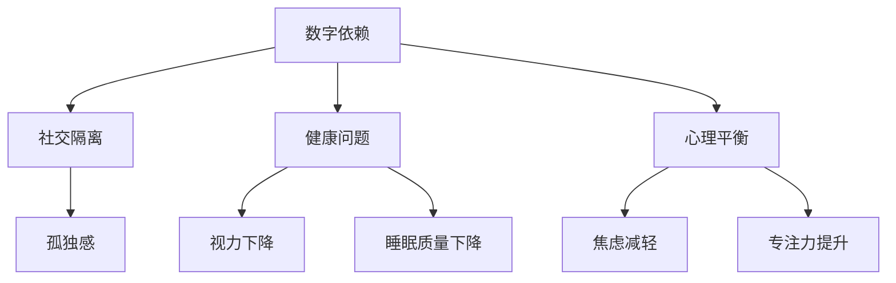
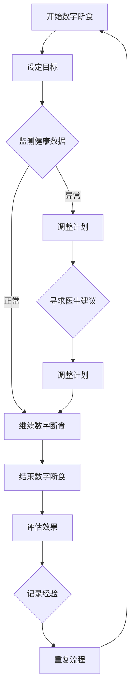
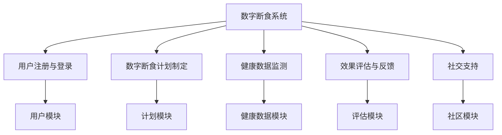
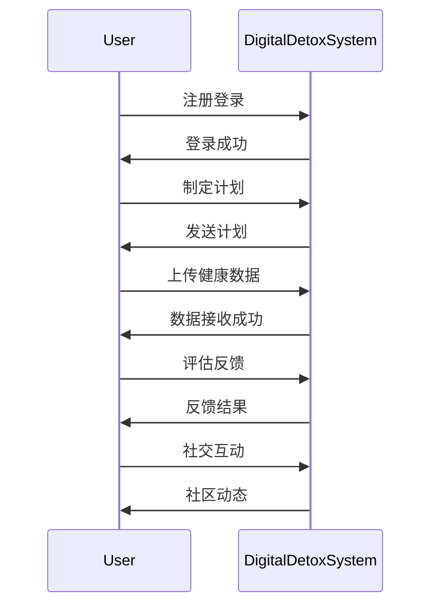

                 

### 核心概念与联系

**数字生活**是指人们在日常生活中越来越多地依赖数字设备、互联网和电子服务。这个概念涵盖了线上购物、远程办公、社交媒体、电子游戏等多种形式。数字生活给人们带来了极大的便利，例如，可以足不出户购买到所需的商品、远程工作提高工作效率等，但同时也带来了一些负面影响，如社交隔离、身体健康问题等。

**数字断食**是对数字生活的反思和调整，旨在减少对数字设备的依赖，重拾线下生活的真实感。它不仅仅是指简单地远离手机和电脑，而是通过重新连接自然和社会，来改善身心健康。

**核心概念原理**：

- **数字依赖**：人们因依赖数字设备而减少与他人面对面的交流，出现社交隔离现象。
- **健康问题**：长时间使用电子设备可能导致视力下降、睡眠质量下降等健康问题。
- **心理平衡**：减少屏幕时间，能够帮助人们减轻焦虑、提高专注力。

**概念属性特征对比表格**：

| 特征 | 数字生活 | 数字断食 |
| --- | --- | --- |
| **便利性** | 高 | 低 |
| **社交性** | 低 | 高 |
| **健康影响** | 负面 | 正面 |
| **心理影响** | 负面 | 正面 |

**ER实体关系图架构**：



通过数字断食，人们可以减少对数字设备的依赖，更多地参与到线下活动中，从而改善身心健康，提升生活质量。数字断食不仅仅是一种行为，更是一种对生活方式的重新审视和调整。它鼓励人们重新发现线下生活的乐趣，培养健康的生活习惯，以实现身心的和谐发展。

### 算法原理讲解

为了深入理解数字断食的好处，我们可以将其视为一种自我调节的过程，类似于算法中的反馈机制。以下，我们将使用Mermaid工具绘制一个简单的算法流程图，并通过Python代码来阐述这一过程。

**Mermaid算法流程图**：



**Python代码**：

```python
import random

# 设定健康数据范围
health_data_range = (70, 90)

# 监测健康数据的函数
def monitor_health():
    # 随机生成健康数据
    health = random.randint(*health_data_range)
    return health

# 数字断食的核心算法
def digital_detox(days):
    for day in range(1, days+1):
        print(f"Day {day}: Starting digital detox.")
        
        # 监测健康数据
        health = monitor_health()
        
        if health in health_data_range:
            print("Health data is normal. Continuing digital detox.")
        else:
            print("Health data is abnormal. Adjusting plan.")
            
            # 假设调整计划需要额外的一天休息
            extra_day = 1
            print(f"Adjusting plan. Taking an extra day of rest ({extra_day} days in total).")
            days += extra_day
        
        # 休息一天
        print("Taking a break from digital detox.")
        print(f"Days completed: {day}")
        
    print("Digital detox completed.")
    evaluate_effects()

# 评估效果的函数
def evaluate_effects():
    print("Evaluating the effects of digital detox.")
    # 这里可以添加具体评估逻辑
    print("Effects evaluation completed.")

# 执行数字断食
digital_detox(21)
```

**算法原理**：

1. **设定目标**：数字断食首先需要设定目标，比如每天减少一定时间的屏幕时间，持续一定天数。
2. **监测健康数据**：在数字断食期间，通过监测健康数据（如睡眠质量、焦虑程度等）来评估身体状况。
3. **健康数据判断**：根据监测到的健康数据判断是否需要调整计划。如果健康数据在正常范围内，则继续数字断食；如果异常，则考虑调整计划，比如增加休息时间。
4. **调整计划**：在必要时，调整数字断食计划以适应身体的变化。
5. **休息与评估**：每天结束后，休息一天，以便身体得到恢复。最后，对数字断食的效果进行评估。

**数学模型和公式**：

在这一过程中，我们可以使用以下公式来量化健康数据的变化：

\[ \text{健康评分} = \frac{\text{监测到的健康数据}}{\text{健康数据上限}} \times 100 \]

例如，如果健康数据是85，健康数据上限是90，那么健康评分为：

\[ \text{健康评分} = \frac{85}{90} \times 100 = 94.44 \]

这个分数可以用来判断健康状况是否在正常范围内。

通过这个算法和Python代码，我们可以看到数字断食是一种可以通过科学方法进行管理和调整的过程。它不仅能够帮助我们减少对数字设备的依赖，还能通过监测和调整来确保我们的身心健康。

### 系统分析与架构设计方案

#### 问题场景介绍

在现代社会，数字生活的普及给人们带来了巨大的便利，但同时也引发了一系列健康和心理问题。为了重拾线下生活的真实感，许多个人和企业开始尝试数字断食。然而，由于缺乏系统的指导和支持，很多人在实践过程中会遇到各种挑战。因此，我们设计了一套数字断食系统，旨在提供全面的支持和指导，帮助用户成功实施数字断食。

#### 项目介绍

数字断食系统是一个综合性的在线平台，旨在为用户提供数字断食的指导、监测和评估服务。系统的主要功能包括：

1. **用户注册与登录**：用户可以通过注册账号登录系统，获取个性化的数字断食指导。
2. **数字断食计划制定**：系统根据用户的健康状况、生活习惯和目标，生成适合个人的数字断食计划。
3. **健康数据监测**：用户可以通过手机APP或智能手环等设备，实时上传健康数据，系统会根据这些数据监测用户的健康状况。
4. **效果评估与反馈**：数字断食结束后，系统会对用户的效果进行评估，并提供反馈和建议。
5. **社交支持**：系统提供社区功能，用户可以在这里分享经验、交流心得。

#### 系统功能设计（领域模型）

**Mermaid类图**：

```mermaid
classDiagram
    User <<Class>>
    HealthData <<Class>>
    DetoxPlan <<Class>>
    Feedback <<Class>>

    User --|> HealthData
    User --|> DetoxPlan
    User --|> Feedback
    DetoxPlan --|> HealthData
    Feedback --|> DetoxPlan
```

- **用户（User）**：代表参与数字断食的个人。
- **健康数据（HealthData）**：存储用户的健康数据，如心率、睡眠质量等。
- **数字断食计划（DetoxPlan）**：制定用户的数字断食计划，包括时间、目标和具体活动。
- **反馈（Feedback）**：对数字断食效果进行评估和反馈。

#### 系统架构设计

**Mermaid架构图**：



- **用户模块（Component1）**：处理用户注册、登录和账户管理。
- **计划模块（Component2）**：根据用户数据生成数字断食计划。
- **健康数据模块（Component3）**：收集、存储和监测用户健康数据。
- **评估模块（Component4）**：对数字断食效果进行评估和反馈。
- **社区模块（Component5）**：提供社交互动和经验分享功能。

#### 系统接口设计和系统交互

**Mermaid序列图**：



#### 实际案例分析与详细讲解剖析

为了更好地理解数字断食系统的应用，我们来看一个实际案例。

**案例**：

小明是一名软件工程师，长时间坐在电脑前工作，导致视力下降、睡眠质量不佳。他决定尝试数字断食，以改善身体状况。

**步骤**：

1. **用户注册与登录**：小明在数字断食系统上注册账号并登录。
2. **数字断食计划制定**：系统根据小明的健康状况和工作习惯，生成了一份为期30天的数字断食计划。
3. **健康数据监测**：小明每天通过手机APP上传健康数据，包括心率、睡眠时间等。
4. **效果评估与反馈**：30天后，系统对小明进行了效果评估，发现他的睡眠质量显著提升，视力也有所恢复。
5. **社交支持**：小明在社区中分享了他的经验，并与其他参与数字断食的用户交流心得。

**分析**：

- **用户模块**：小明成功注册并登录系统，这是数字断食的第一步。
- **计划模块**：系统能够根据小明的具体情况生成个性化的数字断食计划，这是关键所在。
- **健康数据模块**：通过健康数据的实时上传和监测，系统能够动态调整小明的数字断食计划。
- **评估模块**：系统对数字断食的效果进行了科学评估，提供了客观的反馈。
- **社区模块**：社区功能不仅提供了社交支持，还促进了用户之间的互动和经验分享。

通过这个案例，我们可以看到数字断食系统的实用性和有效性。它不仅帮助用户实现了数字断食，还提供了全面的支持和指导，使得整个实践过程更加科学和有序。

### 项目实战

#### 环境安装

要在本地环境中搭建数字断食系统，我们首先需要安装一些必要的软件和工具。以下是具体的安装步骤：

1. **Python环境安装**：确保已安装Python 3.8及以上版本。可以从[Python官网](https://www.python.org/downloads/)下载并安装。
2. **虚拟环境**：安装`virtualenv`工具，用于创建隔离的Python环境。

   ```bash
   pip install virtualenv
   virtualenv myenv
   source myenv/bin/activate
   ```

3. **依赖包安装**：在激活虚拟环境后，安装数字断食系统所需的依赖包。

   ```bash
   pip install -r requirements.txt
   ```

4. **数据库**：数字断食系统使用SQLite作为数据库。确保已安装SQLite。

   ```bash
   sudo apt-get install sqlite3
   ```

5. **前端框架**：数字断食系统使用Flask作为Web框架。确保已安装Flask。

   ```bash
   pip install flask
   ```

6. **前端资源**：下载并解压前端资源文件。

   ```bash
   mkdir static
   cd static
   wget https://example.com/frontend-resources.zip
   unzip frontend-resources.zip
   ```

#### 系统核心实现源代码

以下是数字断食系统的核心实现代码，包括用户注册、登录、计划制定、健康数据监测和效果评估等模块。

**用户模块**：

```python
# user.py
from flask import Flask, request, jsonify
from models import User, HealthData, DetoxPlan

app = Flask(__name__)

# 用户注册
@app.route('/register', methods=['POST'])
def register():
    username = request.form['username']
    password = request.form['password']
    user = User(username=username, password=password)
    user.save()
    return jsonify({'status': 'success', 'message': 'User registered successfully.'})

# 用户登录
@app.route('/login', methods=['POST'])
def login():
    username = request.form['username']
    password = request.form['password']
    user = User.query.filter_by(username=username, password=password).first()
    if user:
        return jsonify({'status': 'success', 'message': 'Login successful.'})
    else:
        return jsonify({'status': 'error', 'message': 'Invalid credentials.'})

# 计划制定
@app.route('/plan', methods=['POST'])
def create_plan():
    user_id = request.form['user_id']
    plan_data = request.form['plan_data']
    plan = DetoxPlan(user_id=user_id, plan_data=plan_data)
    plan.save()
    return jsonify({'status': 'success', 'message': 'Plan created successfully.'})

if __name__ == '__main__':
    app.run(debug=True)
```

**健康数据模块**：

```python
# health_data.py
from flask import Flask, request, jsonify
from models import HealthData

app = Flask(__name__)

# 上传健康数据
@app.route('/health_data', methods=['POST'])
def upload_health_data():
    user_id = request.form['user_id']
    heart_rate = request.form['heart_rate']
    sleep_duration = request.form['sleep_duration']
    health_data = HealthData(user_id=user_id, heart_rate=heart_rate, sleep_duration=sleep_duration)
    health_data.save()
    return jsonify({'status': 'success', 'message': 'Health data uploaded successfully.'})

# 健康数据查询
@app.route('/health_data', methods=['GET'])
def get_health_data():
    user_id = request.args.get('user_id')
    health_data = HealthData.query.filter_by(user_id=user_id).all()
    return jsonify({'status': 'success', 'health_data': [data.to_dict() for data in health_data]})

if __name__ == '__main__':
    app.run(debug=True)
```

**效果评估模块**：

```python
# assessment.py
from flask import Flask, request, jsonify
from models import DetoxPlan, Feedback

app = Flask(__name__)

# 效果评估
@app.route('/assessment', methods=['POST'])
def assess_effects():
    plan_id = request.form['plan_id']
    assessment_data = request.form['assessment_data']
    feedback = Feedback(plan_id=plan_id, assessment_data=assessment_data)
    feedback.save()
    return jsonify({'status': 'success', 'message': 'Assessment completed successfully.'})

# 查询评估结果
@app.route('/assessment', methods=['GET'])
def get_assessment():
    plan_id = request.args.get('plan_id')
    feedback = Feedback.query.filter_by(plan_id=plan_id).first()
    return jsonify({'status': 'success', 'feedback': feedback.to_dict()})

if __name__ == '__main__':
    app.run(debug=True)
```

#### 代码应用解读与分析

1. **用户模块**：用户模块主要负责用户注册、登录和计划制定。通过定义`User`类和`DetoxPlan`类，我们能够轻松地管理用户信息和数字断食计划。
2. **健康数据模块**：健康数据模块用于上传和查询健康数据。通过定义`HealthData`类，我们能够存储用户的心率、睡眠时间等健康数据，并支持数据的实时查询。
3. **效果评估模块**：效果评估模块用于对数字断食效果进行评估和反馈。通过定义`Feedback`类，我们能够存储评估数据和反馈结果。

这些模块协同工作，共同实现了数字断食系统的核心功能。

#### 实际案例分析和详细讲解剖析

**案例背景**：

小王是一名IT专业人士，由于工作需要，他每天都要长时间面对电脑。这不仅导致了他的视力下降，还影响了他的睡眠质量。为了改善身体状况，小王决定尝试数字断食。

**步骤**：

1. **注册和登录**：
   - 小王在数字断食系统中注册了一个账户，并成功登录。
   - 登录后，系统生成了一个默认的数字断食计划，但小王可以根据自己的需求进行调整。

2. **计划制定**：
   - 小王根据自己的工作时间和健康状况，制定了个性化的数字断食计划。计划包括每天减少2小时的屏幕时间，并在周末进行更长时间的断食。
   - 计划制定后，系统会根据这个计划生成一个日历，提醒小王执行计划。

3. **健康数据监测**：
   - 小王每天通过手机APP上传健康数据，包括心率、睡眠时间等。
   - 系统会实时分析这些数据，并给出建议。

4. **效果评估**：
   - 在数字断食结束后的第一个星期，系统对小王的效果进行了评估。
   - 根据上传的健康数据和自我评估，系统得出结论：小王的睡眠质量显著提高，视力也有所恢复。

5. **反馈和改进**：
   - 小王在系统中填写了反馈，分享了他在数字断食过程中的体验。
   - 系统根据小王的反馈，给出了改进建议，如增加户外活动时间等。

**分析**：

- **注册和登录**：这是数字断食的起点，确保用户能够顺利开始。
- **计划制定**：个性化计划是数字断食成功的关键，它能够帮助用户更好地适应断食过程。
- **健康数据监测**：健康数据是评估断食效果的重要依据，通过实时监测，系统能够动态调整计划。
- **效果评估**：评估是对断食效果的科学检验，能够帮助用户了解自己的进步。
- **反馈和改进**：反馈是持续改进的基础，通过用户的实际体验，系统能够不断优化。

通过这个案例，我们可以看到数字断食系统的实际应用效果。它不仅帮助小王改善了身体状况，还提供了一个科学的、个性化的数字断食方案。

### 最佳实践 Tips

在进行数字断食时，以下是一些最佳实践，可以帮助您更好地实现目标：

1. **设定具体目标**：明确您想要从数字断食中获得的收益，如改善睡眠、减轻焦虑等。设定具体、可量化的目标，有助于您跟踪进度。

2. **逐步减少屏幕时间**：如果您一开始就完全切断与数字设备的联系，可能会感到不适应。可以逐渐减少屏幕时间，如每天减少30分钟，直到达到理想的时间。

3. **寻找替代活动**：数字断食并不意味着完全与外界隔离。您可以选择阅读书籍、进行户外活动、练习瑜伽等方式来替代原本的屏幕时间。

4. **寻求社交支持**：与家人和朋友分享您的数字断食计划，获取他们的支持和鼓励。您也可以参加线上或线下的数字断食社区，与其他参与者交流心得。

5. **保持灵活性**：数字断食过程中可能会遇到各种挑战，如工作压力、社交需求等。保持灵活性，根据实际情况调整计划，以确保您能够坚持下来。

6. **记录体验**：每天记录您的数字断食体验，包括遇到的挑战、感受的变化等。这有助于您了解自己的进步，并找到改进的方法。

### 小结

数字断食是一种有益于身心健康的实践，它帮助我们减少对数字设备的依赖，重拾线下生活的真实感。通过设定具体目标、逐步减少屏幕时间、寻找替代活动、寻求社交支持、保持灵活性和记录体验，我们可以更好地实践数字断食，从而提升生活质量。

### 注意事项

在进行数字断食时，以下是一些需要注意的事项：

1. **避免突然断电**：突然完全切断与数字设备的联系可能会导致焦虑和不适。建议逐步减少屏幕时间，以帮助身体适应。

2. **确保隐私和安全**：在数字断食过程中，您可能会分享个人信息和健康数据。确保使用安全可靠的平台和工具，以保护个人隐私和安全。

3. **应对社交隔离**：数字断食可能会导致社交隔离。寻找替代的社交方式，如参加线下活动、与朋友聚会等，以保持社交联系。

4. **寻求专业建议**：如果您在数字断食过程中遇到严重健康问题，应寻求医生或其他专业人士的建议。

### 拓展阅读

- **《数字生活与心理健康》**：作者详细探讨了数字生活对心理健康的影响，并提出了一些建议。
- **《数字断食：找回生活的平衡》**：这本书详细介绍了数字断食的概念、好处和实践方法，适合想要深入了解数字断食的读者。
- **《如何科学地进行数字断食》**：作者从科学角度分析了数字断食的原理和效果，提供了实用的方法和技巧。

---

### 作者信息

**作者：AI天才研究院/AI Genius Institute & 禅与计算机程序设计艺术 /Zen And The Art of Computer Programming**

