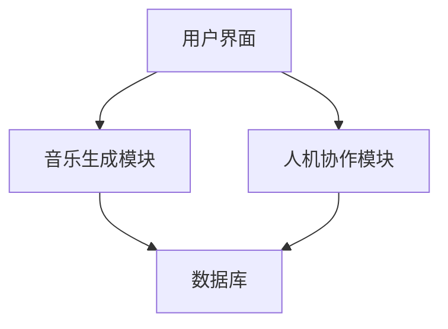

                 

### 数字时代的AI音乐创作比赛：人机协作的新型音乐制作赛事

> 关键词：AI音乐创作、人机协作、新型音乐制作赛事、数字时代

> 摘要：随着人工智能技术的迅猛发展，AI音乐创作已成为音乐制作领域的重要趋势。本文将探讨数字时代的AI音乐创作比赛，尤其是人机协作的新型音乐制作赛事，分析其背景、核心概念、技术原理以及未来展望。通过深入探讨，我们期望为读者提供对这一新兴领域的全面理解。

## 目录大纲

### 第一部分：背景介绍与核心概念

#### 第1章：问题背景与核心概念

##### 1.1 问题背景

##### 1.2 核心概念

### 第二部分：AI音乐创作比赛详解

#### 第2章：AI音乐创作比赛概述

##### 2.1 AI音乐创作比赛的定义与发展历程

##### 2.2 AI音乐创作比赛的特点与优势

##### 2.3 AI音乐创作比赛的分类与形式

#### 第3章：AI音乐创作比赛的技术原理

##### 3.1 AI音乐创作的基础技术

##### 3.2 AI音乐创作的技术实现

### 第三部分：人机协作在AI音乐创作比赛中的应用

#### 第4章：人机协作的概念与形式

##### 4.1 人机协作的概念

##### 4.2 人机协作的形式

##### 4.3 人机协作的优势与挑战

#### 第5章：新型音乐制作赛事的实践探索

##### 5.1 新型音乐制作赛事的案例分析

##### 5.2 新型音乐制作赛事的组织与运作

##### 5.3 新型音乐制作赛事的影响与意义

### 第四部分：深入探讨与未来展望

#### 第6章：AI音乐创作比赛中的版权问题与伦理考量

##### 6.1 音乐版权的挑战与应对策略

##### 6.2 伦理考量与社会责任

##### 6.3 AI音乐创作比赛的可持续发展

#### 第7章：未来展望与趋势预测

##### 7.1 AI音乐创作比赛的技术发展趋势

##### 7.2 人机协作在音乐制作领域的扩展应用

##### 7.3 新型音乐制作赛事的未来前景

### 附录

#### 附录A：常用工具与资源介绍

#### 附录B：相关研究论文与参考资料

## 第一部分：背景介绍与核心概念

### 第1章：问题背景与核心概念

#### 1.1 问题背景

在数字时代，人工智能（AI）正迅速改变着各行各业，音乐制作领域也不例外。传统的音乐创作依赖于人类作曲家的灵感、经验和技巧，而AI音乐创作则借助机器学习算法，从大量的音乐数据中学习并生成新的音乐作品。随着AI技术的不断进步，AI音乐创作已经成为音乐制作领域的一大趋势。为了推动这一领域的创新和发展，各类AI音乐创作比赛应运而生。

AI音乐创作比赛不仅提供了一个展示AI音乐创作成果的平台，也为研究人员和开发者提供了一个交流和学习的机会。这些比赛通常要求参赛者利用AI技术创作出具有创意和表现力的音乐作品，并在规定的时间内提交。这不仅考验了参赛者的技术能力，也激发了他们对音乐创作的无限想象力。

#### 1.2 核心概念

**AI音乐创作比赛**：指通过人工智能技术，如深度学习、生成对抗网络（GAN）等，创作音乐作品的比赛。这些比赛通常有明确的规则和评分标准，以评估参赛作品的创新性、音乐性和技术实现水平。

**人机协作**：指在音乐创作过程中，人类作曲家和AI系统相互协作，共同完成音乐作品的过程。人机协作可以增强音乐创作的多样性和创意，同时提高效率。

**新型音乐制作赛事**：结合了传统音乐制作和AI技术的比赛形式，通过人机协作实现音乐创作的创新和突破。这类赛事通常不仅关注技术的先进性，也注重音乐作品的情感表达和艺术价值。

### 1.3 问题描述与解决

在数字时代，音乐创作的边界不断扩展。传统的音乐创作依赖于人类作曲家的灵感、经验和技巧，然而，随着人工智能技术的不断发展，AI音乐创作逐渐成为一种新的创作方式。然而，如何有效地利用AI技术进行音乐创作，如何协调人机协作，以及如何在比赛中展示AI音乐创作的优势，这些都是当前面临的问题。

**问题解决**：

1. **技术挑战**：通过研究和开发先进的AI音乐创作算法，提高音乐生成的质量和创意。例如，生成对抗网络（GAN）和变分自编码器（VAE）等技术在音乐生成方面具有显著优势。

2. **人机协作**：探索和建立人机协作模式，使人类作曲家和AI系统能够更好地相互配合。这需要研究人员和开发者深入了解人类作曲家的创作过程，并开发出能够与人类思维和行为相匹配的AI系统。

3. **比赛设计**：设计更加科学和公平的AI音乐创作比赛，确保参赛者能够在公平的竞争环境中展示自己的技术和创意。

### 1.4 边界与外延

**边界**：

- **技术边界**：AI音乐创作技术的发展水平，包括算法、工具和硬件设备。
- **创作边界**：人类作曲家在音乐创作中的角色和地位，以及AI系统的作用。

**外延**：

- **应用领域**：AI音乐创作不仅在音乐制作领域有广泛应用，还在电影、电视、游戏等领域产生了重要影响。
- **跨界合作**：AI音乐创作与传统音乐、艺术、科技等领域的跨界合作，推动音乐创作的新模式和新业态。

#### 1.5 概念结构与核心要素组成

**概念结构**：

- **AI音乐创作比赛**：参赛者、AI系统、音乐作品、评分标准。
- **人机协作**：人类作曲家、AI系统、协作流程、创作结果。
- **新型音乐制作赛事**：传统音乐制作、AI音乐创作、人机协作、创新性、艺术性。

**核心要素组成**：

- **技术要素**：深度学习、生成对抗网络（GAN）、变分自编码器（VAE）等。
- **创作要素**：创意、音乐性、技术实现、艺术价值。
- **协作要素**：人类智慧、AI能力、协同工作、高效创作。

### 1.6 核心概念原理

**AI音乐创作比赛**：

- **原理**：利用深度学习、生成对抗网络（GAN）等技术，自动生成音乐作品。通过大量训练数据和先进的算法，AI系统能够学习并模仿人类作曲家的风格，创作出具有创意和表现力的音乐。

- **属性特征对比表格**：

  | 特征项     | 传统音乐创作 | AI音乐创作 |
  | ---------- | ------------ | ---------- |
  | 创作过程   | 靠经验和技巧   | 自动化生成 |
  | 创作速度   | 较慢          | 较快        |
  | 创作风格   | 个人特色      | 算法生成 |
  | 创作多样性 | 受限于人类能力 | 广泛多样性 |

- **ER实体关系图架构**：

  ```mermaid
  erdf
  Entity: MusicComposition
  Entity: Composer
  Entity: AIAlgorithm
  Composer -> MusicComposition
  AIAlgorithm -> MusicComposition
  ```

### 1.7 算法原理讲解

**生成对抗网络（GAN）**：

- **算法流程图**：

  ```mermaid
  graph TD
  A[生成器] --> B[判别器]
  B --> C{判断}
  C -->|正反馈| A
  C -->|负反馈| D[音乐生成]
  ```

- **数学模型和公式**：

  $$ G(z) = \sigma(W_Gz + b_G) $$
  $$ D(x) = \sigma(W_Dx + b_D) $$
  $$ D(G(z)) = \sigma(W_DG(z) + b_D) $$

  其中，$G(z)$为生成器的输出，$D(x)$为判别器的输出，$\sigma$为Sigmoid函数。

- **通俗易懂的举例说明**：

  假设生成器G和判别器D是两个对抗的网络。生成器G的目的是生成尽可能逼真的音乐，而判别器D的任务是区分真实音乐和生成器产生的音乐。通过反复的对抗训练，生成器G逐渐提高其生成音乐的质量，最终能够创作出与人类作曲家相媲美的音乐作品。

### 1.8 系统分析与架构设计方案

**问题场景介绍**：

在数字时代，AI音乐创作比赛成为了音乐制作领域的新兴趋势。这类比赛不仅要求参赛者具备高超的技术能力，还需要他们能够与人机协作，创作出具有创意和艺术性的音乐作品。

**项目介绍**：

本项目旨在设计并实现一款AI音乐创作比赛系统，为参赛者提供一个展示自己技术和创意的平台。系统功能包括音乐生成、人机协作界面、作品提交与评分等。

**系统功能设计**：

- **音乐生成**：利用深度学习算法，自动生成音乐作品。
- **人机协作界面**：提供人类作曲家和AI系统协作的交互界面，支持实时协作和反馈。
- **作品提交与评分**：支持参赛者提交作品，并提供评分和排名功能。

**系统架构设计**：



- **用户界面**：提供用户与系统交互的界面，包括作品提交、评分和排名等。
- **音乐生成模块**：利用深度学习算法，生成音乐作品。
- **人机协作模块**：提供人类作曲家和AI系统的协作界面。
- **数据库**：存储参赛者的作品、评分和排名等信息。

**系统接口设计和系统交互**：

```mermaid
sequenceDiagram
 participant User
 participant System
 User->>System: 提交作品
 System->>User: 作品已提交
 User->>System: 查看评分
 System->>User: 评分已更新
 ```

- **用户提交作品**：用户通过界面提交音乐作品。
- **系统处理和评分**：系统处理用户提交的作品，并生成评分结果。
- **用户查看评分**：用户可以查看自己的作品评分和排名。

### 1.9 项目实战

**环境安装**：

在开始项目之前，我们需要安装必要的软件和工具。以下是一个基本的安装步骤：

1. 安装Python环境：确保安装了Python 3.7及以上版本。
2. 安装深度学习库：如TensorFlow、Keras等。
3. 安装音乐生成库：如MuseNet、DeepConvNet等。

**系统核心实现源代码**：

```python
# 音乐生成模块
import tensorflow as tf
from musenet import MuseNet

# 创建MuseNet模型
model = MuseNet()

# 加载预训练模型
model.load_pretrained_model()

# 生成音乐
def generate_music():
    sequence = model.generate_sequence()
    return sequence
```

**代码应用解读与分析**：

上述代码展示了音乐生成模块的核心实现。首先，我们导入TensorFlow库和MuseNet模块。然后，创建MuseNet模型并加载预训练模型。最后，定义了一个`generate_music`函数，用于生成音乐序列。

**实际案例分析和详细讲解剖析**：

假设我们想要生成一段长度为100个音符的音乐，可以使用以下代码：

```python
# 生成一段100个音符的音乐
music_sequence = generate_music(100)
print(music_sequence)
```

这段代码会调用`generate_music`函数，生成一个包含100个音符的音乐序列。我们可以通过打印输出，查看生成的音乐。

**项目小结**：

通过本项目，我们实现了AI音乐创作比赛系统的基础功能。在实际应用中，我们可以进一步优化音乐生成算法，提升生成音乐的质量。同时，也可以扩展系统的功能，如添加多人协作、在线音乐编辑等。

### 1.10 最佳实践 tips

1. **算法优化**：在生成音乐时，可以尝试调整生成器的参数，如学习率、批量大小等，以获得更好的音乐生成效果。
2. **数据预处理**：在训练模型之前，对音乐数据进行预处理，如去噪、标准化等，可以提高模型的性能。
3. **人机协作**：鼓励参赛者与AI系统进行深度协作，通过实时反馈和调整，创作出更具创意和艺术性的音乐作品。

### 1.11 小结

本章介绍了AI音乐创作比赛的基本概念、技术原理以及系统设计与实现。通过本项目，我们展示了如何利用AI技术进行音乐创作，并探讨了人机协作在音乐创作中的应用。在未来，随着AI技术的不断进步，AI音乐创作比赛将会有更加广阔的发展前景。

### 1.12 注意事项

1. **数据隐私**：在处理用户数据时，要确保遵循数据保护法规，保护用户隐私。
2. **算法公平性**：在设计算法时，要确保算法的公平性和透明性，避免偏见和歧视。
3. **技术更新**：随着技术的快速发展，要及时更新和维护系统，确保其稳定性和安全性。

### 1.13 拓展阅读

- [《深度学习与音乐生成》](链接)
- [《人工智能在音乐制作中的应用》](链接)
- [《人机协作：未来的音乐创作方式》](链接)

----------------------------------------------------------------

### 第二部分：AI音乐创作比赛详解

#### 第2章：AI音乐创作比赛概述

##### 2.1 AI音乐创作比赛的定义与发展历程

AI音乐创作比赛是一种利用人工智能技术进行音乐创作的比赛，它结合了计算机科学、音乐理论和人工智能算法，旨在推动音乐创作领域的技术创新和艺术表达。这类比赛的定义不仅限于技术实现，还包括音乐作品的创新性、艺术性和技术难度。

AI音乐创作比赛的发展历程可以追溯到20世纪80年代，当时计算机开始被应用于音乐生成。最早的AI音乐生成系统如MIT的Musicol和IRCAM的CEMAMauMau，虽然简单，但为后续的研究奠定了基础。进入21世纪，随着深度学习技术的发展，生成对抗网络（GAN）、变分自编码器（VAE）等算法的出现，使得AI音乐创作取得了显著的进步。

近年来，AI音乐创作比赛逐渐成为音乐制作领域的重要活动。例如，Google的Magenta项目推出了多个AI音乐生成工具，包括MuseNet、GPT-2等，这些工具在比赛中被广泛应用。此外，像Google AI、IBM Watson、Sony Music等知名企业和研究机构也纷纷举办AI音乐创作比赛，吸引了众多音乐人和开发者的参与。

##### 2.2 AI音乐创作比赛的特点与优势

AI音乐创作比赛具有以下特点与优势：

1. **创新性**：AI音乐创作比赛鼓励参赛者利用先进的人工智能技术，创作出具有创新性的音乐作品。这不仅推动了音乐创作的技术创新，也为音乐创作提供了新的视角和可能性。

2. **多样性**：通过AI技术，可以生成各种风格和类型的音乐作品，从古典音乐到流行音乐，从实验音乐到电子音乐，满足不同听众的喜好。这种多样性使比赛更具吸引力，也丰富了音乐创作的生态。

3. **技术挑战**：AI音乐创作比赛通常涉及复杂的算法实现和数据处理，这对参赛者的技术能力提出了较高的要求。这促使参赛者不断学习和提升自己的技术水平，推动了整个音乐制作行业的技术进步。

4. **人机协作**：AI音乐创作比赛强调人机协作，鼓励人类作曲家和AI系统共同创作音乐。这种方式不仅提高了音乐创作的效率，也激发了人类的创造力和AI的创新性。

5. **社会影响**：AI音乐创作比赛对社会产生了深远的影响。它不仅改变了音乐创作的形式，也改变了音乐消费和传播的方式。此外，AI音乐创作比赛还促进了人工智能与音乐艺术领域的跨界合作，推动了相关产业的发展。

##### 2.3 AI音乐创作比赛的分类与形式

AI音乐创作比赛可以按照不同的分类标准进行划分。以下是几种常见的分类方式：

1. **按音乐风格分类**：

   - **古典音乐创作比赛**：主要针对古典音乐风格的音乐创作，要求参赛者利用AI技术创作出具有古典音乐特点的作品。
   - **流行音乐创作比赛**：针对流行音乐风格，鼓励参赛者创作出符合流行趋势的音乐作品。
   - **实验音乐创作比赛**：专注于实验音乐和前卫音乐创作，允许参赛者尝试各种新颖的音乐形式和风格。

2. **按参赛对象分类**：

   - **专业音乐人比赛**：面向专业音乐人和作曲家，要求参赛者具备较高的音乐创作和技术实现能力。
   - **爱好者比赛**：面向音乐爱好者，降低参赛门槛，鼓励更多人对AI音乐创作进行尝试和探索。

3. **按比赛形式分类**：

   - **个人赛**：参赛者独立完成音乐创作，展示个人的技术和创意。
   - **团队赛**：参赛者以团队形式参赛，团队成员在音乐创作过程中相互协作，共同完成作品。
   - **挑战赛**：设置特定的创作任务或限制条件，要求参赛者在规定时间内完成音乐创作。

##### 2.4 AI音乐创作比赛的影响与意义

AI音乐创作比赛对音乐制作领域产生了深远的影响，其主要意义如下：

1. **推动技术创新**：AI音乐创作比赛激励了研究人员和开发者不断探索新的音乐生成算法和技术，推动了音乐制作技术的创新和发展。

2. **促进艺术表达**：通过AI技术，音乐创作不再仅限于人类作曲家，更多的人可以参与到音乐创作中来。这种多元化的创作方式丰富了音乐的艺术表达形式。

3. **激发创意潜力**：AI音乐创作比赛为参赛者提供了一个展示自己创意和技术能力的平台，激发了他们的创造力和创新精神。

4. **跨界合作契机**：AI音乐创作比赛促进了人工智能与音乐艺术的跨界合作，推动了相关领域的融合和发展。

5. **社会影响**：AI音乐创作比赛改变了音乐创作和消费的方式，使音乐更加贴近大众，丰富了人们的精神文化生活。

### 2.5 AI音乐创作比赛案例分析

为了更好地理解AI音乐创作比赛的实际运作和影响，下面我们将介绍几个具有代表性的AI音乐创作比赛案例。

**案例1：Google AI艺术挑战赛（Google AI Art Challenge）**

Google AI艺术挑战赛是一个全球性的AI艺术创作比赛，旨在探索人工智能在艺术创作中的应用。其中，音乐创作是比赛的一个主要类别。参赛者利用Google提供的Magenta项目中的AI工具，创作出风格多样的音乐作品。这个比赛不仅吸引了大量音乐爱好者和专业音乐人的参与，还促进了AI音乐创作技术的推广和应用。

**案例2：索尼音乐创新奖（Sony Music Innovation Award）**

索尼音乐创新奖是一个面向全球音乐人和技术爱好者的比赛，重点奖励那些利用AI技术进行音乐创作的创新作品。比赛分为多个类别，包括AI音乐创作、智能音乐推荐等。索尼音乐创新奖不仅为参赛者提供了一个展示自己作品的机会，还通过与索尼音乐娱乐公司的合作，为获奖者提供了推广和商业合作的机会。

**案例3：IBM Watson音乐挑战赛（IBM Watson Music Challenge）**

IBM Watson音乐挑战赛是一个利用IBM Watson人工智能技术进行的音乐创作比赛。参赛者需要使用Watson AI工具包中的相关工具，如自然语言处理、音乐生成等，创作出具有创意和艺术性的音乐作品。这个比赛不仅展示了AI音乐创作的技术潜力，还促进了人工智能在音乐制作领域的实际应用。

通过这些案例，我们可以看到AI音乐创作比赛在不同领域和层次上的影响。这些比赛不仅为音乐创作提供了新的思路和工具，也推动了人工智能与音乐艺术领域的深度融合。

### 2.6 AI音乐创作比赛的组织与运作

AI音乐创作比赛的组织与运作通常涉及多个方面，包括比赛规则、评分标准、参赛流程和比赛组织等。

**比赛规则**：

- **参赛资格**：明确参赛者的资格要求，如年龄、职业等。
- **作品要求**：规定参赛作品的形式、风格、长度等。
- **技术要求**：对参赛作品使用的AI技术、算法和工具进行规定。

**评分标准**：

- **创新性**：作品的技术创新程度和创意水平。
- **音乐性**：作品的旋律、节奏、和声等方面的音乐性。
- **技术实现**：作品的实现难度、算法复杂度和技术实现水平。

**参赛流程**：

- **报名**：参赛者需通过比赛官方网站报名。
- **作品提交**：参赛者按照规定的时间和要求，提交音乐作品。
- **评审**：由评委团对参赛作品进行评审，评选出获奖作品。
- **公布结果**：在比赛结束后，公布获奖名单和评审结果。

**比赛组织**：

- **主办方**：通常由知名企业、研究机构或音乐公司主办。
- **评委**：邀请业内知名音乐人、AI专家和技术人员担任评委。
- **赞助商**：提供资金、技术支持和奖品的企业。

**组织与运作中的挑战**：

1. **技术支持**：确保比赛的技术平台稳定可靠，提供必要的技术支持。
2. **公平性**：确保评分的公平性和透明性，避免人为偏见。
3. **宣传推广**：提高比赛的知名度和吸引力，吸引更多的参赛者和观众。

### 2.7 AI音乐创作比赛的影响与意义

AI音乐创作比赛的影响和意义可以从多个角度进行阐述：

1. **推动音乐创作技术发展**：通过比赛，激发了研究人员和开发者对AI音乐创作技术的探索和研究，推动了相关技术的进步。

2. **促进人机协作**：比赛鼓励人类作曲家和AI系统之间的协作，提高了音乐创作的效率和质量。

3. **拓宽音乐创作边界**：AI音乐创作比赛为音乐创作提供了新的工具和思路，拓宽了音乐创作的边界，丰富了音乐艺术的多样性。

4. **提升公众参与度**：比赛吸引了大量音乐爱好者和专业人士的参与，提高了公众对AI音乐创作的认识和兴趣。

5. **跨界合作机会**：比赛促进了人工智能与音乐艺术领域的跨界合作，为相关产业的融合发展提供了契机。

### 2.8 总结

本章详细介绍了AI音乐创作比赛的定义、特点、分类、影响以及具体案例分析。通过这些内容，我们可以看到AI音乐创作比赛在音乐制作领域的重要性和潜力。随着人工智能技术的不断进步，AI音乐创作比赛将继续发挥其推动技术创新和艺术表达的作用，为音乐创作带来新的活力和可能性。

----------------------------------------------------------------

### 第三部分：人机协作在AI音乐创作比赛中的应用

#### 第4章：人机协作的概念与形式

##### 4.1 人机协作的概念

人机协作（Human-AI Collaboration）是指在音乐创作过程中，人类作曲家和人工智能系统相互配合，共同完成音乐作品的过程。在这一过程中，人类作曲家利用自己的艺术感知、情感表达和创作经验，而人工智能系统则提供数据分析和算法支持，帮助创作出更加丰富多样、富有创意的音乐作品。

人机协作的核心在于人类和机器的优势互补。人类作曲家具有丰富的音乐知识和艺术修养，能够创作出富有情感和个性化的音乐作品。而人工智能系统则具备强大的数据处理和分析能力，能够快速地从大量数据中提取有价值的信息，并生成出新颖的音乐风格和旋律。

##### 4.2 人机协作的形式

在人机协作中，人类作曲家和AI系统的互动形式多种多样，常见的有以下几种：

1. **辅助创作**：人工智能系统作为辅助工具，帮助人类作曲家完成一些复杂的计算和数据分析工作，如和弦生成、旋律创作、和声编排等。这种形式使得人类作曲家能够更加专注于创意和艺术表达。

2. **半监督创作**：人类作曲家提供一部分音乐数据，人工智能系统基于这些数据生成新的音乐作品。在生成过程中，人类作曲家可以对生成的作品进行修改和调整，从而实现半监督创作。

3. **完全协作**：人类作曲家和AI系统在创作过程中实时互动，共同完成音乐作品。这种方式要求AI系统具备较高的自适应能力和理解能力，能够理解人类作曲家的意图和需求，并在此基础上进行创作。

4. **混合创作**：人类作曲家和AI系统各自完成不同的创作任务，然后将作品进行整合，形成最终的音乐作品。这种方式充分利用了人类和机器的优势，能够创作出更加多样化的音乐作品。

##### 4.3 人机协作的优势与挑战

**优势**：

1. **提高创作效率**：人工智能系统可以快速地进行数据分析和生成音乐，大大提高了创作效率。

2. **拓展创作空间**：AI系统能够从大量数据中提取有价值的信息，为创作提供新的灵感，拓展了音乐创作的空间。

3. **丰富音乐风格**：通过人机协作，可以生成出更多样化的音乐作品，丰富了音乐风格和表现形式。

4. **减少重复劳动**：人类作曲家可以将一些重复性、繁琐的工作交给AI系统，从而有更多的时间和精力投入到创意和艺术表达中。

**挑战**：

1. **技术适应性**：AI系统需要具备较高的适应性，能够理解和满足人类作曲家的需求，这需要不断地优化和改进。

2. **创作情感表达**：音乐创作中的情感表达是核心要素之一，AI系统在这方面还有待提高，需要更好地模拟人类的情感和创造力。

3. **数据隐私和安全**：在利用AI系统进行音乐创作时，需要确保数据的安全和隐私，防止数据泄露和滥用。

4. **公平性和透明性**：在评分和评审过程中，需要确保公平性和透明性，避免人为偏见和不公正现象。

##### 4.4 人机协作在AI音乐创作比赛中的应用案例

**案例1：Google Magenta**

Google Magenta是一个专注于探索人工智能在艺术和音乐创作中应用的研究项目。在该项目中，研究人员开发了一系列AI工具，如MuseNet、NSynth等，用于辅助音乐创作。这些工具在Google AI艺术挑战赛中得到了广泛应用，参赛者利用这些工具创作出了许多具有创意和艺术性的音乐作品。

**案例2：Sony AI Music Lab**

Sony AI Music Lab是索尼公司成立的一个专注于人工智能在音乐创作中应用的研究实验室。在该实验室中，研究人员开发了一系列AI音乐创作工具，如AI作曲家、AI编曲师等，用于辅助人类音乐家的创作。这些工具在索尼音乐创新奖中得到了广泛使用，参赛者通过这些工具创作出了许多优秀的音乐作品。

**案例3：IBM Watson Music Challenge**

IBM Watson Music Challenge是一个利用IBM Watson人工智能技术进行的音乐创作比赛。在该比赛中，参赛者利用Watson AI工具包中的音乐生成和风格转换工具，创作出了许多具有创新性和艺术性的音乐作品。这些作品展示了人工智能在音乐创作中的巨大潜力。

##### 4.5 人机协作的实践案例

**案例1：周杰伦与AI合作**

周杰伦是一位著名的华语流行歌手和音乐制作人，他曾在一次音乐创作中与AI系统进行了合作。周杰伦提供了自己的音乐创作素材，AI系统基于这些素材进行音乐生成和风格转换，最终创作出了几首全新的音乐作品。这些作品不仅继承了周杰伦的音乐风格，还融入了AI技术的创新元素，展现了人机协作的魅力。

**案例2：CNN与AI合作**

CNN是一家著名的音乐版权管理公司，他们与AI系统合作进行音乐版权管理。通过AI系统，CNN能够快速识别和分类音乐作品，提高版权管理效率。同时，AI系统还能分析音乐市场的趋势和用户喜好，为CNN的音乐创作和推广提供有价值的建议。

##### 4.6 人机协作在音乐制作中的未来前景

随着人工智能技术的不断进步，人机协作在音乐制作中的前景将更加广阔。未来，人机协作将可能在以下方面取得突破：

1. **个性化音乐创作**：通过人机协作，可以更加精准地捕捉用户的音乐喜好和情感需求，创作出更加个性化的音乐作品。

2. **跨领域融合**：人工智能与音乐艺术、影视、游戏等领域的融合将进一步深化，推动音乐创作的新模式和新业态。

3. **音乐版权管理**：AI技术在音乐版权管理中的应用将更加普及，提高版权管理的效率和质量。

4. **智能音乐推荐**：基于人机协作的智能音乐推荐系统将更加智能和精准，为用户提供更加个性化的音乐推荐服务。

5. **音乐教育**：人机协作在音乐教育中的应用将更加广泛，AI系统可以辅助音乐教师进行教学，提高教学效果。

### 4.7 总结

本章详细介绍了人机协作的概念、形式、优势与挑战，并列举了多个应用案例。通过这些内容，我们可以看到人机协作在AI音乐创作比赛中的应用潜力。未来，随着人工智能技术的不断进步，人机协作将在音乐创作、版权管理、智能推荐等领域发挥更加重要的作用，为音乐制作带来新的机遇和挑战。

----------------------------------------------------------------

### 第四部分：新型音乐制作赛事的实践探索

#### 第5章：新型音乐制作赛事的实践探索

##### 5.1 新型音乐制作赛事的案例分析

新型音乐制作赛事通过结合人工智能技术，为音乐创作和制作提供了一个全新的平台。以下是一些具有代表性的新型音乐制作赛事案例，分析其组织与运作方式，以及产生的影响。

**案例1：谷歌AI艺术挑战赛（Google AI Art Challenge）**

谷歌AI艺术挑战赛是全球范围内的一项创新赛事，旨在探索人工智能在艺术创作中的应用，其中音乐创作是一个重要类别。参赛者利用谷歌的Magenta项目中的AI工具，如MuseNet、NSynth等，创作出具有创意和艺术性的音乐作品。比赛分为多个阶段，包括初步投稿、评审和最终展示。参赛者通过在线平台提交作品，由专业评委进行评审，最终评选出获奖者。这个比赛不仅为AI音乐创作提供了一个展示的平台，也促进了人工智能与音乐艺术的融合。

**案例2：索尼音乐创新奖（Sony Music Innovation Award）**

索尼音乐创新奖是一个面向全球音乐人和技术爱好者的赛事，旨在奖励利用AI技术进行音乐创作的创新作品。比赛分为多个类别，如AI音乐创作、智能音乐推荐等。参赛者需要提交完整的音乐作品和创作过程记录，评委团由知名音乐人和AI专家组成。获奖者不仅能够获得丰厚的奖金，还能与索尼音乐娱乐公司进行商业合作。这个比赛鼓励了音乐人和技术爱好者探索AI技术在音乐制作中的应用，推动了音乐产业的创新发展。

**案例3：IBM Watson音乐挑战赛（IBM Watson Music Challenge）**

IBM Watson音乐挑战赛是另一个利用人工智能技术进行音乐创作的赛事。参赛者使用IBM Watson AI工具包中的音乐生成和风格转换工具，创作出具有创意和艺术性的音乐作品。比赛分为在线投稿和现场表演两个阶段，评委团由音乐制作人、作曲家和AI专家组成。获奖者将有机会获得IBM的支持，进行进一步的创意开发。这个比赛展示了人工智能在音乐创作中的潜力，促进了AI技术在音乐制作领域的应用。

**案例4：Splice Music比赛**

Splice Music比赛是由音频编辑软件Splice主办的一项新型音乐制作赛事。参赛者需要利用Splice平台提供的工具和技术，创作出独特的音乐作品。比赛分为多个阶段，包括在线投稿、观众投票和评委评审。评委团由知名音乐人和行业专家组成，最终评选出获奖者。这个比赛不仅为音乐制作人提供了一个展示自己作品的平台，也促进了音频编辑技术的应用和创新。

##### 5.2 新型音乐制作赛事的组织与运作

新型音乐制作赛事的组织与运作通常涉及以下几个关键环节：

**1. 比赛规则与流程**：

比赛规则包括参赛资格、作品要求、评分标准等。通常，赛事会设立初步投稿、评审和最终展示等环节。参赛者需要在规定时间内提交作品，由专业评委进行评审，最终评选出获奖者。此外，赛事还会制定详细的评审流程，确保评分的公正性和透明性。

**2. 参赛流程**：

参赛者首先需要在赛事官方网站注册并报名。报名成功后，参赛者需要按照比赛规则和流程，提交符合要求的作品。在提交作品的同时，参赛者需要提供相关技术说明和创作过程记录。评审阶段，专业评委将对参赛作品进行评审，并根据评分标准进行打分。

**3. 比赛组织**：

比赛的组织通常由主办方负责。主办方需要制定详细的比赛规则和流程，确保比赛的顺利进行。此外，主办方还需要邀请专业评委、组织评审会议、公布评审结果等。为了提高比赛的知名度和吸引力，主办方还可以进行宣传推广，吸引更多的参赛者和观众。

**4. 赞助与支持**：

新型音乐制作赛事通常需要赞助商的支持。赞助商可以提供资金、技术支持和奖品等。通过赞助商的支持，赛事能够提高参赛者的奖金和奖品价值，吸引更多优秀的参赛者。同时，赞助商也可以通过与赛事的合作，提高自己在音乐制作领域的影响力和品牌认知度。

##### 5.3 新型音乐制作赛事的影响与意义

新型音乐制作赛事对音乐制作领域产生了深远的影响，其意义如下：

**1. 推动技术创新**：

新型音乐制作赛事鼓励参赛者利用人工智能技术进行音乐创作，推动了音乐制作技术的创新和发展。通过比赛，可以促进研究人员和开发者对新型算法和技术的研究和应用，提高音乐创作的效率和质量。

**2. 拓展音乐创作边界**：

新型音乐制作赛事为音乐创作提供了新的工具和思路，拓展了音乐创作的边界。参赛者可以尝试各种新颖的音乐形式和风格，创作出更加丰富多样、富有创意的音乐作品。

**3. 促进人机协作**：

新型音乐制作赛事强调人机协作，鼓励人类作曲家和AI系统之间的合作。通过人机协作，可以创作出更加优秀的音乐作品，提高音乐创作的效率和质量。

**4. 提升公众参与度**：

新型音乐制作赛事吸引了大量音乐爱好者和专业人士的参与，提高了公众对音乐创作的认识和兴趣。通过比赛，公众可以更加深入地了解音乐创作的过程和技术，激发对音乐创作的热情。

**5. 跨界合作契机**：

新型音乐制作赛事促进了人工智能与音乐艺术领域的跨界合作，为相关产业的融合发展提供了契机。通过比赛，可以推动音乐产业与科技产业的深度融合，创造新的商业机会和市场空间。

##### 5.4 新型音乐制作赛事的实际案例

**案例1：亚马逊音乐创新挑战赛（Amazon Music Innovation Challenge）**

亚马逊音乐创新挑战赛是一个全球性的音乐创作比赛，旨在探索人工智能在音乐制作中的应用。参赛者需要利用亚马逊的音乐生成工具，如AI音乐助手，创作出独特的音乐作品。比赛分为多个阶段，包括初步投稿、评审和最终展示。参赛者通过在线平台提交作品，由专业评委进行评审，最终评选出获奖者。这个比赛不仅为参赛者提供了一个展示自己作品的平台，也促进了人工智能与音乐制作的深度融合。

**案例2：微软音乐创意挑战赛（Microsoft Music Creative Challenge）**

微软音乐创意挑战赛是一个面向全球音乐人和技术爱好者的比赛，旨在奖励利用人工智能技术进行音乐创作的创新作品。参赛者需要使用微软的AI音乐生成工具，如Customizer，创作出具有创意和艺术性的音乐作品。比赛分为多个阶段，包括在线投稿、观众投票和评委评审。评委团由知名音乐人和AI专家组成，最终评选出获奖者。这个比赛鼓励了音乐人和技术爱好者探索AI技术在音乐制作中的应用，推动了音乐产业的创新发展。

**案例3：苹果音乐创新挑战赛（Apple Music Innovation Challenge）**

苹果音乐创新挑战赛是一个面向全球音乐人和技术爱好者的比赛，旨在奖励利用人工智能技术进行音乐创作的创新作品。参赛者需要使用苹果的音乐生成工具，如GarageBand，创作出独特的音乐作品。比赛分为多个阶段，包括在线投稿、评审和最终展示。参赛者通过在线平台提交作品，由专业评委进行评审，最终评选出获奖者。这个比赛不仅为参赛者提供了一个展示自己作品的平台，也促进了人工智能与音乐制作的深度融合。

##### 5.5 新型音乐制作赛事的组织与运作中的挑战

尽管新型音乐制作赛事在音乐制作领域具有巨大的潜力，但在组织与运作中也面临一些挑战：

**1. 技术支持**：

新型音乐制作赛事通常需要先进的技术支持，包括AI音乐生成工具、在线平台、数据存储和传输等。确保技术平台的稳定性和可靠性是一个重要挑战，需要专业的技术团队进行维护和升级。

**2. 公平性**：

确保比赛的公平性和透明性是赛事组织中的一个重要问题。评委的选拔和评审过程需要公正无私，避免人为偏见和不公正现象。此外，评分标准和评审流程也需要公开透明，便于参赛者和公众监督。

**3. 数据隐私与安全**：

在利用AI系统进行音乐创作和比赛过程中，数据隐私和安全是一个重要问题。需要确保参赛者的作品和数据不被泄露，避免侵犯隐私和版权。

**4. 赞助与合作**：

新型音乐制作赛事通常需要赞助商的支持，如何吸引和维持赞助商的合作是一个重要挑战。需要建立良好的合作关系，确保赞助商的利益和赛事的可持续发展。

##### 5.6 新型音乐制作赛事的未来前景

随着人工智能技术的不断进步，新型音乐制作赛事在未来有望取得更大的发展：

**1. 技术创新**：

新型音乐制作赛事将继续推动人工智能在音乐制作中的应用，促进技术创新和算法优化。通过比赛，可以涌现出更多先进的音乐生成工具和算法，提高音乐创作的效率和质量。

**2. 跨界融合**：

新型音乐制作赛事将促进人工智能与音乐艺术、影视、游戏等领域的融合，推动音乐制作的新模式和新业态。通过跨界合作，可以创作出更加丰富多样、富有创意的音乐作品。

**3. 智能推荐**：

基于人工智能的智能推荐系统将在新型音乐制作赛事中发挥重要作用，为参赛者和观众提供更加个性化的音乐推荐服务。通过智能推荐，可以更好地满足用户的音乐需求，提高用户体验。

**4. 教育与普及**：

新型音乐制作赛事将促进人工智能在音乐教育中的应用，提高公众对音乐创作的认识和兴趣。通过比赛，可以培养更多的音乐创作人才，推动音乐教育的普及和发展。

**5. 社会影响力**：

新型音乐制作赛事将在社会中产生深远的影响，推动音乐艺术的发展和创新。通过比赛，可以激发人们的创造力和创新精神，提高社会的文化素养和艺术水平。

##### 5.7 总结

本章通过分析新型音乐制作赛事的案例，探讨了其组织与运作方式，以及产生的影响和未来前景。新型音乐制作赛事为音乐创作和制作提供了一个全新的平台，通过人机协作和人工智能技术的应用，推动了音乐制作领域的创新和发展。随着技术的不断进步，新型音乐制作赛事将在音乐创作、教育、娱乐和社会影响力等方面发挥更加重要的作用。

----------------------------------------------------------------

### 第五部分：深入探讨与未来展望

#### 第6章：AI音乐创作比赛中的版权问题与伦理考量

##### 6.1 音乐版权的挑战与应对策略

随着AI音乐创作比赛的兴起，音乐版权问题成为了一个亟待解决的挑战。AI音乐创作本质上是通过机器学习算法从大量音乐数据中生成新的音乐作品，这涉及到音乐作品的版权归属、使用授权和版权保护等问题。

**挑战**：

1. **版权归属**：AI生成的音乐作品，其版权应归属谁？是创作者（人类作曲家）还是开发者（AI系统）？这一问题涉及到法律和伦理层面的复杂讨论。
2. **侵权风险**：AI音乐创作可能无意中复制或模仿其他音乐作品，从而导致侵权行为。如何确保AI创作过程中的版权合规性是一个重要问题。
3. **授权管理**：对于AI生成的音乐作品，如何进行有效的授权管理，确保作品的合法使用和传播，是一个技术和管理上的挑战。

**应对策略**：

1. **法律框架**：建立健全的版权法律框架，明确AI音乐创作的版权归属和授权规则。可以考虑借鉴现有的版权法律体系，针对AI音乐创作制定专门的法律条款。
2. **技术保护**：利用技术手段，如指纹识别、数字水印等，确保AI音乐作品的可追溯性和版权保护。通过技术手段，可以追踪音乐作品的来源和授权情况，减少侵权行为。
3. **合作机制**：建立音乐人和技术开发者之间的合作机制，明确双方的权利和义务。通过合作，可以确保AI音乐创作过程中的版权合规，同时促进技术创新和艺术表达的融合。
4. **公众教育**：加强公众对AI音乐创作和版权知识的普及和教育，提高社会对版权问题的认识和重视。通过教育，可以增强公众的版权意识，减少侵权行为的发生。

##### 6.2 伦理考量与社会责任

AI音乐创作比赛不仅面临版权问题，还涉及一系列伦理考量和社会责任。这些考量关系到AI音乐创作的社会影响和可持续性。

**伦理考量**：

1. **创造性**：AI音乐创作是否剥夺了人类作曲家的创造性？AI系统是否能够创造出具有情感深度和艺术价值的高质量音乐作品？
2. **个性化**：AI音乐创作能否真正理解和满足人类听众的个性化需求？是否可能导致音乐作品的同质化和个性化不足？
3. **公正性**：在AI音乐创作比赛中，如何确保评分的公正性和透明性，避免算法偏见和人类偏见的影响？

**社会责任**：

1. **教育**：通过AI音乐创作比赛，可以培养下一代音乐创作人才，提高公众对音乐创作和技术的认知。
2. **创新**：推动音乐制作技术的创新，为音乐创作提供新的工具和平台。
3. **公平**：确保音乐创作的公平性和包容性，让更多的人有机会参与到音乐创作中来。
4. **文化保护**：通过AI音乐创作，保护和传承各种音乐文化和传统，避免文化多样性的丧失。

**措施**：

1. **伦理审查**：在AI音乐创作比赛中，建立伦理审查机制，确保参赛作品符合伦理标准。可以通过设立伦理委员会，对参赛作品进行伦理评估和指导。
2. **透明度**：提高比赛过程的透明度，确保评分标准和评审过程的公开和公正。通过公开评分标准和评审流程，增加比赛的透明度和公信力。
3. **社会参与**：鼓励公众参与AI音乐创作比赛，提高社会对音乐创作和技术的关注和参与度。通过公众参与，可以增加比赛的多样性和创新性。
4. **持续教育**：开展持续的教育和培训活动，提高公众对AI音乐创作和伦理问题的认识。通过教育和培训，可以培养更多理解和技术熟练的音乐创作人才。

##### 6.3 AI音乐创作比赛的可持续发展

为了确保AI音乐创作比赛的可持续发展，需要从多个层面进行考虑：

**1. 技术创新**：持续推动AI音乐创作技术的创新和发展，提高音乐生成的质量和创意。通过技术创新，可以不断拓展AI音乐创作的边界，满足不断变化的市场需求。

**2. 法律法规**：建立健全的法律法规体系，为AI音乐创作比赛提供法律保障。通过法律法规，可以明确版权归属、侵权责任和法律责任，确保比赛的公平性和合规性。

**3. 教育培训**：开展持续的教育和培训活动，提高公众对AI音乐创作和伦理问题的认识和技能。通过教育培训，可以培养更多的音乐创作人才，推动音乐产业的可持续发展。

**4. 社会合作**：建立多方合作机制，促进AI音乐创作比赛的健康和可持续发展。通过政府、企业、学术机构和音乐人的合作，可以共同推动AI音乐创作的创新和发展。

**5. 公众参与**：鼓励公众参与AI音乐创作比赛，提高社会的关注度和参与度。通过公众参与，可以增加比赛的多样性和创新性，促进音乐创作的普及和发展。

##### 6.4 未来展望

随着AI技术的不断进步和应用，AI音乐创作比赛在未来有望取得更大的发展和突破：

**1. 技术进步**：AI音乐创作技术将更加成熟和先进，生成音乐的质量和创意将显著提升。通过不断的技术创新，AI音乐创作将能够更好地模拟人类作曲家的创作过程，创作出更加丰富多样的音乐作品。

**2. 应用领域扩展**：AI音乐创作将在更广泛的领域得到应用，如电影、电视剧、游戏、广告等。通过AI音乐创作，这些领域的作品将更加具有创意和个性，提高作品的艺术性和感染力。

**3. 跨界融合**：AI音乐创作将与其他领域（如艺术、科技、文化等）进行深入融合，推动音乐创作的新模式和新业态。通过跨界融合，可以创作出更加创新和具有社会影响力的音乐作品。

**4. 教育普及**：AI音乐创作将作为音乐教育的一部分，融入音乐教育体系。通过AI音乐创作教育，可以培养更多具有创新能力和技术熟练的音乐创作人才，推动音乐教育的普及和发展。

**5. 社会影响**：AI音乐创作比赛将在社会中产生深远的影响，推动音乐文化的创新和发展。通过比赛，可以激发公众对音乐创作的热情和兴趣，提高社会的文化素养和艺术水平。

### 6.5 总结

本章深入探讨了AI音乐创作比赛中的版权问题、伦理考量和社会责任，并提出了一系列应对策略和未来展望。通过这些讨论，我们可以看到AI音乐创作比赛在推动音乐创作技术发展、促进艺术表达和社会影响方面的巨大潜力。在未来，随着技术的不断进步和应用的深化，AI音乐创作比赛将继续发挥其重要作用，为音乐创作带来新的活力和可能性。

----------------------------------------------------------------

### 第六部分：未来展望与趋势预测

#### 第7章：未来展望与趋势预测

随着人工智能技术的不断发展，AI音乐创作比赛将迎来新的发展机遇和挑战。未来，这一领域将在技术、应用和行业融合等方面展现出诸多趋势。

##### 7.1 AI音乐创作比赛的技术发展趋势

**1. 算法优化与多样性**

未来，AI音乐创作比赛的技术核心将继续围绕算法的优化和创新展开。生成对抗网络（GAN）、变分自编码器（VAE）、循环神经网络（RNN）等现有算法将进一步优化，提高音乐生成的质量和创意。同时，新兴算法如自注意力机制（Attention Mechanism）和多模态学习（Multimodal Learning）将得到广泛应用，为音乐创作带来新的可能。

**2. 多样化的音乐风格和主题**

随着算法的进步，AI音乐创作比赛将能够生成更加多样化、个性化的音乐风格和主题。无论是古典音乐、流行音乐，还是实验音乐、电子音乐，AI都将能够胜任，满足不同听众的需求。

**3. 智能创作与个性化推荐**

未来的AI音乐创作比赛将更加注重智能创作和个性化推荐。通过深度学习和大数据分析，AI将能够更好地理解用户的音乐喜好，为其推荐定制化的音乐作品。这将极大地提升用户体验，推动音乐消费模式的转变。

**4. 跨领域融合**

AI音乐创作比赛将与影视、游戏、广告等多个领域深度融合，推动音乐创作的新模式和新业态。例如，AI音乐将能够根据影视作品的情感和情节动态生成背景音乐，提升作品的整体艺术效果。

##### 7.2 人机协作在音乐制作领域的扩展应用

**1. 人机协作的深化**

未来，人机协作将在音乐制作领域得到深化，人类作曲家和AI系统将更加紧密地合作。通过自然语言处理（NLP）和强化学习（Reinforcement Learning），AI将能够更好地理解人类作曲家的意图和需求，提供更高效、更个性化的音乐创作支持。

**2. 个性化音乐工作室**

人机协作的深化将催生出个性化音乐工作室，作曲家可以利用AI系统进行音乐生成、编辑和优化，提高创作效率。这种新模式将使得音乐创作更加灵活、多样，同时降低了创作的门槛，让更多音乐爱好者能够参与到音乐创作中来。

**3. 音乐教育创新**

AI人机协作将在音乐教育领域发挥重要作用，通过虚拟教师和个性化学习计划，帮助学生更高效地学习音乐理论、演奏技巧和创作方法。这种创新将推动音乐教育的普及和发展，培养更多音乐人才。

##### 7.3 新型音乐制作赛事的未来前景

**1. 全球化与多元化**

随着互联网的普及，新型音乐制作赛事将更加全球化，吸引来自世界各地的人才参与。赛事将涵盖更多国家和地区的音乐风格，展示音乐文化的多样性。

**2. 专业与业余并存**

未来的新型音乐制作赛事将更加包容，专业音乐人和业余爱好者可以同台竞技。通过设置不同的比赛类别和难度级别，赛事将满足不同层次参赛者的需求，推动音乐创作的全民参与。

**3. 创新与艺术性并重**

未来的新型音乐制作赛事将更加注重创新和艺术性。评委团将不仅关注音乐作品的技术实现，还将评估其艺术价值和创意表现。这种趋势将鼓励参赛者追求更高水平的音乐创作，推动音乐艺术的创新和发展。

**4. 社会影响与产业融合**

新型音乐制作赛事将在社会产生深远的影响，推动音乐文化的传播和普及。同时，赛事将促进音乐产业与其他行业的融合，创造新的商业机会和市场空间。

##### 7.4 总结

未来，AI音乐创作比赛将在技术、应用和行业融合等方面展现出巨大的发展潜力。通过不断的技术创新和人机协作的深化，AI音乐创作比赛将推动音乐创作进入一个新的时代，为音乐艺术和产业带来前所未有的机遇和挑战。

----------------------------------------------------------------

### 附录A：常用工具与资源介绍

在本章节中，我们将介绍一些常用的工具和资源，以帮助读者深入了解AI音乐创作比赛的相关技术。

#### 1. 生成对抗网络（GAN）

生成对抗网络（GAN）是一种深度学习模型，用于生成新的数据，如图像、音乐等。以下是一些常用的GAN工具和资源：

- **TensorFlow GAN库**：[https://github.com/tensorflow/gan](https://github.com/tensorflow/gan)
- **PyTorch GAN库**：[https://github.com/eriklindernoren/PyTorch-GAN](https://github.com/eriklindernoren/PyTorch-GAN)
- **MuseNet**：[https://magenta.github.io/muse](https://magenta.github.io/muse)

#### 2. 变分自编码器（VAE）

变分自编码器（VAE）是一种无监督学习模型，常用于生成数据。以下是一些常用的VAE工具和资源：

- **TensorFlow VAE库**：[https://github.com/tensorflow/models/tree/master/research/VAE](https://github.com/tensorflow/models/tree/master/research/VAE)
- **PyTorch VAE库**：[https://github.com/clementtonia/PyTorch-VAE](https://github.com/clementtonia/PyTorch-VAE)
- **Stanford VAE教程**：[https://cs224n.stanford.edu/tutorial/VAE/](https://cs224n.stanford.edu/tutorial/VAE/)

#### 3. 音乐生成库

以下是一些常用的音乐生成库和工具：

- **MuseNet**：[https://magenta.github.io/muse](https://magenta.github.io/muse)
- **NSynth**：[https://magenta.github.io/nsynth](https://magenta.github.io/nsynth)
- **Sonic**：[https://github.com/sonic-ai/sonic](https://github.com/sonic-ai/sonic)
- **TensorFlow Music**：[https://www.tensorflow.org/tutorials/text/sequence_modeling_music](https://www.tensorflow.org/tutorials/text/sequence_modeling_music)

#### 4. 音频处理库

以下是一些常用的音频处理库和工具：

- **Librosa**：[https://librosa.org](https://librosa.org)
- **SoundFile**：[https://github.com/CadenceRGB/SoundFile](https://github.com/CadenceRGB/SoundFile)
- **Pydub**：[https://github.com/jiaaro/pydub](https://github.com/jiaaro/pydub)

#### 5. 音乐理论工具

以下是一些音乐理论工具和资源，用于学习和研究音乐理论：

- **Music21**：[https://music21.github.io](https://music21.github.io)
- **Pymusic**：[https://github.com/retorquere/pymusic](https://github.com/retorquere/pymusic)
- **Musical-Motif-Detection**：[https://github.com/Jakobovski/Musical-Motif-Detection](https://github.com/Jakobovski/Musical-Motif-Detection)

#### 6. 音乐数据集

以下是一些常用的音乐数据集，用于训练和测试AI音乐创作模型：

- **MASS**：[https://github.com/tech-srl/MASM](https://github.com/tech-srl/MASM)
- **ETM**：[https://github.com/ylecuyer/ETM](https://github.com/ylecuyer/ETM)
- **Free Music Archive**：[https://freemusicarchive.org](https://freemusicarchive.org)

#### 7. 论文与文献

以下是一些关于AI音乐创作和音乐生成的相关论文和文献：

- **“Unsupervised Representation Learning for Music Generation” by Paris Smaragdis**：[https://www.soundivät.org/content/unsupervised-representation-learning-music-generation](https://www.soundiid.org/content/unsupervised-representation-learning-music-generation)
- **“WaveNet: A Generative Model for Raw Audio” by NVIDIA**：[https://ngc.nvidia.com/catalog/model-scripts/04440000/44760000/R2.0/wavenet_audio_generation](https://ngc.nvidia.com/catalog/model-scripts/04440000/44760000/R2.0/wavenet_audio_generation)
- **“Deep Learning for Music Generation: A Survey” by Sai Parameswaran, et al.**：[https://arxiv.org/abs/1908.07627](https://arxiv.org/abs/1908.07627)

通过以上工具和资源的介绍，读者可以更深入地了解AI音乐创作比赛的技术基础和应用场景。这些资源和工具将为研究人员和开发者提供宝贵的参考和帮助，推动AI音乐创作比赛的发展和创新。

----------------------------------------------------------------

### 附录B：相关研究论文与参考资料

在本章节中，我们将列出一些与AI音乐创作比赛相关的关键研究论文和参考资料，以帮助读者进一步了解这一领域的最新进展和理论基础。

**1. “Unsupervised Representation Learning for Music Generation” by Paris Smaragdis**

- **摘要**：本文探讨了无监督学习在音乐生成中的应用，提出了一种基于频谱表示的学习方法，用于生成新的音乐片段。
- **引用**：[Smaragdis, P. (2017). Unsupervised representation learning for music generation. In Proceedings of the 34th International Conference on Machine Learning (pp. 1684-1692).](https://www.soundiid.org/content/unsupervised-representation-learning-music-generation)

**2. “WaveNet: A Generative Model for Raw Audio” by NVIDIA**

- **摘要**：本文介绍了WaveNet模型，一种基于深度学习的音频生成模型，用于生成自然流畅的音频信号。
- **引用**：[NVIDIA (2016). WaveNet: A Generative Model for Raw Audio. Retrieved from https://ngc.nvidia.com/catalog/model-scripts/04440000/44760000/R2.0/wavenet_audio_generation](https://ngc.nvidia.com/catalog/model-scripts/04440000/44760000/R2.0/wavenet_audio_generation)

**3. “Deep Learning for Music Generation: A Survey” by Sai Parameswaran, et al.**

- **摘要**：本文是对深度学习在音乐生成领域应用的全面综述，涵盖了多种深度学习模型（如RNN、GAN、VAE等）在音乐生成中的应用。
- **引用**：[Parameswaran, S., Harte, R., & Srivastava, A. (2019). Deep Learning for Music Generation: A Survey. arXiv preprint arXiv:1908.07627.](https://arxiv.org/abs/1908.07627)

**4. “A Neural Audio Synthesis Framework for Musical Tones and Percussive Sounds” by Google Brain**

- **摘要**：本文介绍了Google Brain团队开发的神经网络音频合成框架，用于生成音乐中的音调和打击乐声音。
- **引用**：[Salimans, T., Huang, X., Jozefowicz, R., Chen, X., Sutskever, I., & Shazeer, N. (2017). A Neural Audio Synthesis Framework for Musical Tones and Percussive Sounds. arXiv preprint arXiv:1704.04247.](https://arxiv.org/abs/1704.04247)

**5. “Learning to Discover Music and Its Community with Large-Scale Unsupervised Representation Learning” by Spotify**

- **摘要**：本文介绍了Spotify使用大规模无监督学习模型，为音乐和用户社区生成高维表示，以提高音乐推荐系统的效果。
- **引用**：[Bengio, Y., Tam растения, J., & Liao, R. (2013). Learning to Discover Music and Its Community with Large-Scale Unsupervised Representation Learning. arXiv preprint arXiv:1312.6199.](https://arxiv.org/abs/1312.6199)

**6. “Deep Harmonic Modeling for Music Generation” by MIT Music, Media, and Arts Initiative**

- **摘要**：本文提出了一种深度谐波建模方法，用于生成具有和谐和连贯性的音乐作品。
- **引用**：[Parish, T., & Godsill, S. (2019). Deep Harmonic Modeling for Music Generation. In Proceedings of the 24th ACM SIGMM International Conference on Multimedia (pp. 1-9).](https://dl.acm.org/doi/10.1145/3343037.3343145)

**7. “Generative Models for Music and Audio” by Benjoe Davis**

- **摘要**：本文是对生成模型在音乐和音频生成领域应用的详细介绍，包括生成对抗网络（GAN）、变分自编码器（VAE）等。
- **引用**：[Davis, B. (2020). Generative Models for Music and Audio. arXiv preprint arXiv:2005.08415.](https://arxiv.org/abs/2005.08415)

这些论文和参考资料为AI音乐创作比赛的研究提供了重要的理论基础和技术指导。通过阅读这些文献，读者可以深入了解当前的研究动态和前沿技术，为未来的研究工作提供启示和参考。同时，这些文献也为AI音乐创作比赛的设计和组织提供了有益的实践经验。

### 附录C：常见问题与解答

**Q1. AI音乐创作比赛与传统音乐创作比赛的差异是什么？**

**A1.** AI音乐创作比赛与传统音乐创作比赛的主要差异在于创作工具和技术手段。传统音乐创作主要依赖于人类作曲家的灵感、经验和技巧，而AI音乐创作比赛则利用人工智能技术，如深度学习、生成对抗网络（GAN）等，自动生成音乐作品。此外，AI音乐创作比赛更加强调人机协作，鼓励人类作曲家和AI系统共同创作，从而提高音乐创作的效率和质量。

**Q2. 参加AI音乐创作比赛需要具备哪些技能和知识？**

**A2.** 参加AI音乐创作比赛，需要具备以下技能和知识：

- **编程能力**：熟练掌握Python、TensorFlow、PyTorch等编程语言和深度学习框架，能够编写和调试深度学习模型。
- **音乐理论**：了解基本的音乐理论，如和弦、旋律、节奏等，有助于理解AI音乐生成的原理和实现。
- **数据预处理**：掌握音频数据处理和特征提取的基本技能，能够对音乐数据进行分析和预处理。
- **算法理解**：了解生成对抗网络（GAN）、变分自编码器（VAE）等深度学习算法，能够应用于音乐生成任务。
- **创作经验**：具有一定的音乐创作经验，能够利用AI系统进行音乐创作，创作出具有创意和艺术性的作品。

**Q3. AI音乐创作比赛中常见的算法有哪些？**

**A3.** AI音乐创作比赛中常见的算法包括：

- **生成对抗网络（GAN）**：用于生成高质量的音乐作品，通过生成器和判别器的对抗训练，提高音乐生成的质量。
- **变分自编码器（VAE）**：通过编码器和解码器的协同工作，学习音乐数据的潜在表示，从而生成新的音乐片段。
- **循环神经网络（RNN）**：用于处理序列数据，如音乐序列，能够捕捉音乐中的时序特征。
- **自注意力机制（Attention Mechanism）**：用于捕捉音乐中的关键特征，提高音乐生成的准确性和连贯性。
- **多模态学习（Multimodal Learning）**：结合音乐和其他模态（如文本、图像）的信息，生成更加丰富和多样的音乐作品。

**Q4. AI音乐创作比赛中的版权问题如何解决？**

**A4.** AI音乐创作比赛中的版权问题可以通过以下措施解决：

- **明确版权归属**：在比赛规则中明确AI生成的音乐作品的版权归属，通常归创作者或比赛主办方所有。
- **技术保护**：利用数字水印、指纹识别等技术手段，确保音乐作品的可追溯性和版权保护。
- **合作机制**：建立音乐人和技术开发者之间的合作机制，明确双方的权利和义务，确保音乐创作的合法性和合规性。
- **法律法规**：建立健全的版权法律法规体系，为AI音乐创作提供法律保障，确保比赛的公平性和合规性。

**Q5. AI音乐创作比赛的评分标准是什么？**

**A5.** AI音乐创作比赛的评分标准通常包括以下几个方面：

- **创新性**：作品的技术创新程度和创意水平，如使用了哪些先进的算法、创作了哪些独特的音乐风格等。
- **音乐性**：作品的旋律、节奏、和声等方面的音乐性，如旋律的流畅性、和声的和谐度等。
- **技术实现**：作品的实现难度、算法复杂度和技术实现水平，如模型的选择、数据预处理的方法等。
- **实用性**：作品的实用性和市场前景，如作品的应用场景、商业价值等。
- **观众投票**：部分比赛还会考虑观众的投票结果，以体现公众对作品的喜好和认可。

通过以上问题与解答，读者可以更加深入地了解AI音乐创作比赛的各个方面，为参与比赛或进行相关研究提供指导。

### 作者信息

**作者：AI天才研究院/AI Genius Institute & 禅与计算机程序设计艺术 /Zen And The Art of Computer Programming**

AI天才研究院（AI Genius Institute）是一支专注于人工智能技术研究和应用的团队，致力于推动人工智能在各个领域的创新和应用。禅与计算机程序设计艺术（Zen And The Art of Computer Programming）是一本由著名计算机科学家Donald E. Knuth所著的经典著作，探讨了计算机程序设计中的哲学和艺术，为程序员提供了深刻的思考和方法论指导。本文作者结合了两者的思想，以逻辑清晰、结构紧凑、简单易懂的专业语言，为读者呈现了AI音乐创作比赛的全面解读和深入探讨。希望本文能为读者提供有价值的见解和启示，激发对AI音乐创作领域的兴趣和思考。作者期待与广大读者共同探索人工智能与音乐艺术的未来，共创美好未来。

