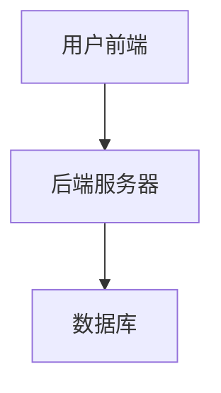
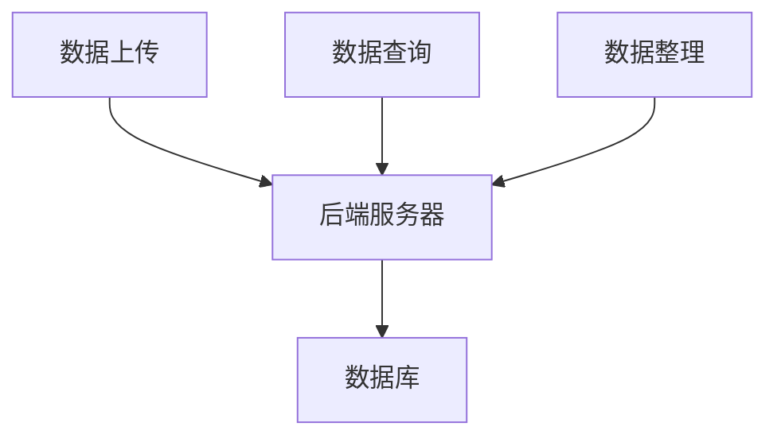
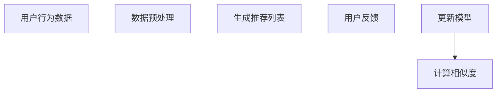

                 


### 构建个人知识管理系统的步骤

#### 步骤 1: 需求分析
首先，我们需要明确个人知识管理系统的目标用户和需求。个人知识管理系统的主要目的是帮助用户高效地收集、整理、存储和利用个人知识。因此，我们需要考虑以下几个方面的需求：
- **数据收集**：系统应能收集多种类型的数据，如文档、图片、视频等。
- **知识整理**：系统应提供便捷的标签、分类功能，帮助用户整理知识。
- **数据存储**：系统应保证数据的安全性和可恢复性。
- **知识利用**：系统应提供智能搜索、推荐等功能，帮助用户快速找到所需知识。

#### 步骤 2: 系统架构设计
在明确需求后，我们需要设计系统的整体架构。个人知识管理系统通常包括以下几个主要模块：
- **前端界面**：负责展示用户界面，提供交互功能。
- **后端服务器**：负责处理业务逻辑，存储和管理数据。
- **数据库**：存储用户的知识数据。

以下是一个简单的系统架构设计示例：



#### 步骤 3: 接口设计与实现
设计系统接口是确保前后端交互的关键。以下是几个主要接口设计示例：
- **数据上传接口**：允许用户上传文档、图片等数据。
- **数据查询接口**：允许用户通过关键词搜索知识。
- **数据整理接口**：允许用户对知识进行分类、标签管理。

以下是一个简单的接口设计示例：



#### 步骤 4: 核心算法与数学模型
个人知识管理系统中，核心算法和数学模型是提高系统智能化的关键。以下是几个常见的算法和模型：
- **搜索引擎算法**：如Lucene、Elasticsearch，用于快速检索知识。
- **推荐算法**：如协同过滤、矩阵分解，用于智能推荐知识。

以下是一个简单的推荐算法的mermaid流程图：



#### 步骤 5: 环境安装与配置
在开始编码之前，我们需要搭建开发环境。以下是常见的环境安装与配置步骤：
- **前端开发环境**：安装Node.js、npm等工具。
- **后端开发环境**：安装Python、Django、Flask等框架。
- **数据库环境**：安装MySQL、PostgreSQL等数据库。

#### 步骤 6: 编码实现
根据系统架构设计和接口设计，开始编写代码。以下是几个核心部分的Python代码示例：
- **数据上传接口**：

```python
from flask import Flask, request, jsonify
app = Flask(__name__)

@app.route('/upload', methods=['POST'])
def upload_file():
    file = request.files['file']
    # 处理文件上传逻辑
    return jsonify({'status': 'success'})

if __name__ == '__main__':
    app.run()
```

- **数据查询接口**：

```python
from flask import Flask, request, jsonify
app = Flask(__name__)

@app.route('/search', methods=['GET'])
def search():
    query = request.args.get('query')
    # 处理搜索逻辑
    return jsonify({'results': search_results})

if __name__ == '__main__':
    app.run()
```

#### 步骤 7: 测试与调试
在编码过程中，我们需要不断进行测试和调试，确保系统功能的正确性和稳定性。以下是几个测试与调试的步骤：
- **单元测试**：编写单元测试用例，确保每个模块的功能正确。
- **集成测试**：模拟实际使用场景，测试系统的整体性能。
- **调试**：使用调试工具，定位和修复代码中的错误。

#### 步骤 8: 部署与维护
完成开发后，我们需要将系统部署到生产环境，并进行持续维护和优化。以下是几个部署与维护的步骤：
- **部署**：使用容器技术（如Docker）部署系统，确保环境的稳定性和可扩展性。
- **监控**：使用监控系统，实时监控系统的运行状态，确保系统的稳定运行。
- **优化**：根据用户反馈和系统性能指标，持续优化系统功能。

#### 步骤 9: 拓展与升级
随着用户需求的变化和技术的进步，我们需要不断对系统进行拓展和升级。以下是几个拓展与升级的步骤：
- **功能拓展**：根据用户需求，增加新的功能模块。
- **技术升级**：采用新的技术和框架，提升系统的性能和可维护性。
- **用户体验优化**：优化用户界面和交互设计，提升用户体验。

通过以上步骤，我们可以逐步构建一个功能完善、性能优秀的个人知识管理系统。这不仅能够帮助用户高效地管理个人知识，还能为用户创造更大的价值。

### 结论
个人知识管理系统的开发是一项系统性工程，涉及需求分析、架构设计、算法实现、环境配置、编码实现等多个方面。通过本文的逐步分析，我们了解了如何从零开始构建一个个人知识管理系统。希望本文能为从事相关领域的技术人员提供一些有价值的参考和启示。

### 拓展阅读
- 《人工智能应用实践指南》
- 《大数据时代的数据挖掘技术与实战》
- 《深度学习原理与实战》
- 《软件架构设计：模式、原则与实践》

---

### 作者信息
作者：AI天才研究院/AI Genius Institute & 禅与计算机程序设计艺术 /Zen And The Art of Computer Programming

