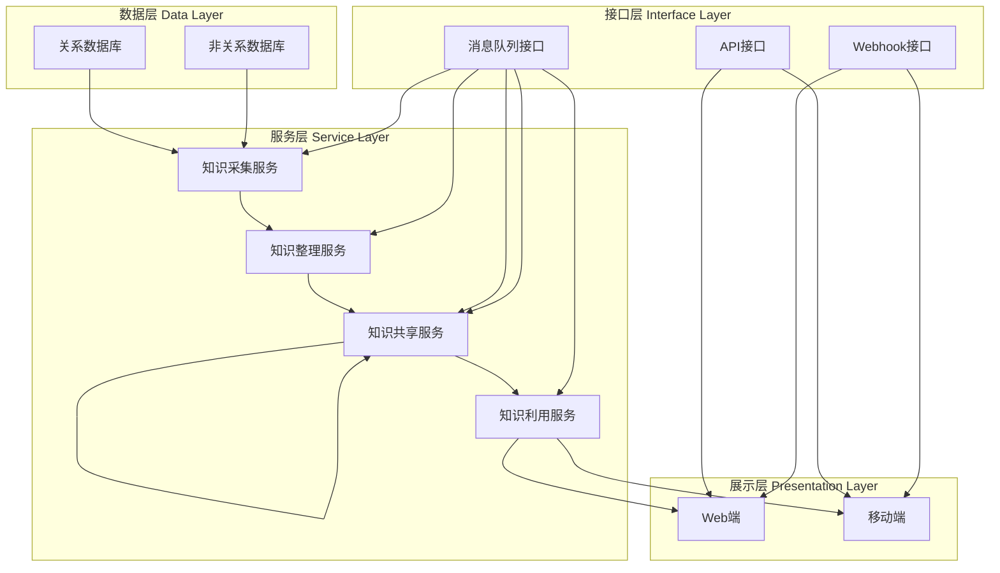

                 


# 数字时代的个人知识管理：构建数字化第二大脑的方法

> 关键词：数字时代，个人知识管理，数字化第二大脑，方法

**摘要：**
本文将深入探讨数字时代的个人知识管理，特别是构建数字化第二大脑的方法。通过分析当前知识管理的挑战和需求，我们提出了一个系统性的框架和方法，旨在帮助个人在数字化环境中高效地管理知识，实现持续学习和创新。

## 第一部分：背景与理论基础

### 1.1 问题的背景

在数字化时代，信息的获取和处理速度大大加快，但与此同时，个体面临着知识管理的巨大挑战。传统的笔记、文件和书籍等知识存储方式已无法满足现代生活的快节奏和高信息量需求。个人知识管理的困难主要体现在以下几个方面：

1. **信息过载**：每天产生的大量信息使得个体难以有效筛选和消化。
2. **知识碎片化**：分散在不同平台和设备上的知识难以整合和利用。
3. **知识遗忘**：长期存储的知识因缺乏整理和复习而容易遗忘。
4. **协作困难**：个人知识难以与他人共享和协作。

### 1.2 问题描述

个人知识管理的问题不仅限于信息的获取和处理，还包括如何有效地存储、整理、利用和共享知识。具体问题如下：

1. **知识存储**：如何高效地存储个人知识，使其易于访问和更新？
2. **知识整理**：如何对大量的信息进行分类、标签化和组织，以提高知识检索效率？
3. **知识利用**：如何将存储的知识转化为实际行动，提升个人决策能力和工作效率？
4. **知识共享**：如何在保持知识安全的前提下，与他人共享和协作知识？

### 1.3 数字化个人知识管理的重要性

数字化个人知识管理是应对上述问题的有效途径。它不仅能够提高知识存储和检索的效率，还能促进知识的整理和利用。具体重要性体现在：

1. **提高学习效率**：通过数字化工具，个人可以更快速地获取和学习新知识。
2. **增强知识利用**：数字化知识管理使得知识可以更加灵活地应用于实际工作中。
3. **促进知识共享**：数字化工具使得知识共享变得更加便捷和高效。
4. **提升创新能力**：数字化知识管理有助于激发个人的创新思维，推动个人和组织的持续创新。

### 1.4 研究方法与结构

本文采用以下研究方法：

1. **文献综述**：通过对相关领域的研究文献进行综述，了解数字化个人知识管理的现状和趋势。
2. **案例研究**：分析成功案例，探讨数字化个人知识管理的实践经验和最佳方法。
3. **理论构建**：基于文献综述和案例研究，构建一个系统性的数字化个人知识管理框架。

文章结构如下：

1. **背景与理论基础**：介绍数字化个人知识管理的背景、问题及重要性。
2. **核心方法与工具**：探讨构建数字化第二大脑的核心方法和工具。
3. **实战案例与最佳实践**：分析成功案例，提供最佳实践和建议。
4. **总结与展望**：总结文章的主要观点，展望未来发展趋势。

## 第二部分：核心方法与工具

### 2.1 数字化工具与技术概览

在构建数字化第二大脑的过程中，选择合适的工具和技术至关重要。以下是一些常见的数字化工具和技术，以及它们的优缺点：

1. **笔记类应用**：如Evernote、OneNote等，适用于日常笔记和知识整理。
   - 优点：跨平台同步，易于整理和搜索。
   - 缺点：笔记内容较为单一，缺乏深度分析功能。

2. **知识管理软件**：如Confluence、SharePoint等，适用于团队知识管理和协作。
   - 优点：支持文档、表格、图片等多种格式，便于团队共享和协作。
   - 缺点：功能较为复杂，学习成本较高。

3. **个人知识库**：如Notion、TiddlyWiki等，适用于个性化知识管理。
   - 优点：灵活度高，可以自定义结构，支持多种数据类型。
   - 缺点：相对于专业软件，功能较为有限。

4. **学习平台**：如Coursera、edX等，适用于在线学习和知识获取。
   - 优点：资源丰富，课程多样化，适合自我提升。
   - 缺点：需要付费购买课程，学习进度自主管理。

5. **AI助手**：如Google Assistant、Alexa等，适用于日常任务提醒和信息查询。
   - 优点：智能化高，操作简单，适合碎片化时间使用。
   - 缺点：知识管理功能有限，依赖网络环境。

### 2.2 个人知识管理框架构建

一个有效的个人知识管理框架应包括以下几个核心要素：

1. **知识采集**：通过多种渠道收集知识，包括书籍、网络、讲座等。
2. **知识整理**：对采集到的知识进行分类、标签化、摘要等处理，提高知识检索效率。
3. **知识存储**：选择合适的工具和平台存储知识，确保知识的长期保存和更新。
4. **知识利用**：将存储的知识应用于实际工作中，提升个人能力和工作效率。
5. **知识共享**：在保持知识安全的前提下，与他人分享和协作知识，实现知识的增值。

### 2.3 数据采集与整合

数据采集是个人知识管理的重要环节。以下是一些常见的数据采集方法和技巧：

1. **自动化采集**：利用RSS订阅、自动化网页抓取等工具，定期收集感兴趣的资讯和文章。
2. **手动采集**：通过阅读书籍、期刊、博客等，手动摘录和整理重要信息。
3. **网络调研**：利用搜索引擎、学术数据库等，查找和获取相关领域的最新研究成果。

在数据采集后，需要进行数据的整合和整理，以实现知识的系统化和结构化。具体方法包括：

1. **数据分类**：根据知识主题、来源、用途等，对数据进行分类。
2. **标签化**：为数据添加标签，便于快速检索和查找。
3. **摘要和整理**：对重要数据进行摘录和整理，形成知识卡片或知识库。

### 2.4 数据分析与利用

数据分析是个人知识管理的关键环节，通过数据挖掘和机器学习等技术，可以从海量数据中提取有价值的信息和知识。以下是一些常见的数据分析方法：

1. **文本挖掘**：利用自然语言处理技术，对文本数据进行提取、分类、情感分析等。
2. **图像识别**：利用深度学习技术，对图像数据进行识别、分类、标注等。
3. **关系网络分析**：利用图论和社交网络分析技术，对知识之间的关系进行挖掘和分析。

通过数据分析，可以实现对知识的深度理解和利用，从而提升个人的决策能力和工作效率。以下是一些数据分析的实际应用场景：

1. **知识推荐**：根据个人的兴趣和需求，推荐相关的知识内容和资源。
2. **知识地图**：构建知识图谱，展示知识的结构和关系，帮助个人快速定位和获取所需知识。
3. **智能助手**：利用数据分析结果，为个人提供智能化的建议和决策支持。

### 2.5 安全性与隐私保护

在数字化个人知识管理过程中，安全性和隐私保护至关重要。以下是一些常见的安全性和隐私保护措施：

1. **数据加密**：对存储的知识数据进行加密，确保数据的安全性。
2. **访问控制**：设置严格的访问控制策略，限制未授权人员的访问。
3. **备份与恢复**：定期备份知识数据，确保数据的可靠性和可恢复性。
4. **隐私保护**：遵守相关法律法规，保护个人隐私，避免数据泄露。

## 第三部分：实战案例与最佳实践

### 3.1 构建数字化第二大脑的步骤与技巧

构建数字化第二大脑是一个系统性的过程，以下是一些具体的步骤和技巧：

1. **确定目标和需求**：明确个人知识管理的目标和需求，包括知识存储、整理、利用和共享等方面。
2. **选择合适的工具**：根据个人需求和预算，选择合适的数字化工具和平台，如笔记类应用、知识管理软件、学习平台等。
3. **数据采集与整合**：通过多种渠道收集知识，并进行分类、标签化和整理，形成结构化的知识库。
4. **数据分析与利用**：利用数据分析和机器学习等技术，从海量数据中提取有价值的信息和知识，提升个人决策能力和工作效率。
5. **安全性与隐私保护**：采取数据加密、访问控制、备份与恢复等措施，确保知识数据的安全性和隐私保护。

### 3.2 成功案例分析

以下是一个成功案例，展示了如何通过数字化个人知识管理实现个人成长和职业发展：

**案例背景**：某IT工程师，工作多年，感到知识储备不够，需要进一步提升个人能力和工作效率。

**解决方案**：
1. **确定目标和需求**：通过自我反思和职业规划，明确提升技能、拓展知识面和提升工作效率的目标。
2. **选择合适的工具**：使用Evernote进行日常笔记和知识整理，使用Confluence进行团队协作和知识管理，使用Coursera进行在线学习。
3. **数据采集与整合**：通过阅读书籍、参加讲座、关注行业资讯等渠道，收集和整理重要知识，并使用标签进行分类。
4. **数据分析与利用**：利用Evernote的自然语言处理功能，对笔记进行文本挖掘和知识提取，形成知识地图和知识卡片。
5. **安全性与隐私保护**：定期备份知识数据，使用Confluence的访问控制功能，确保数据的安全性和隐私保护。

**案例成果**：通过数字化个人知识管理，该工程师的技能水平和工作效率显著提升，成功晋升为团队领导，并获得了多个行业奖项。

### 3.3 遇到的挑战与解决方案

在数字化个人知识管理过程中，可能会遇到以下挑战：

1. **信息过载**：面对大量信息，难以筛选和处理。**解决方案**：制定信息筛选标准，关注关键信息，定期整理和删除无用信息。
2. **知识碎片化**：知识分散在不同平台和设备上，难以整合和利用。**解决方案**：选择合适的工具和平台，实现知识的跨平台同步和整合。
3. **知识遗忘**：长期存储的知识因缺乏整理和复习而容易遗忘。**解决方案**：定期复习和更新知识，形成知识闭环，提高知识保鲜度。
4. **协作困难**：个人知识难以与他人共享和协作。**解决方案**：使用团队协作工具，建立知识共享和协作机制，促进知识的流动和增值。

### 3.4 未来展望与趋势

随着技术的不断发展，数字化个人知识管理将呈现以下趋势：

1. **智能化**：利用人工智能技术，实现知识的智能推荐、智能分析和智能决策。
2. **平台化**：数字化知识管理工具将更加集成和平台化，提供一站式解决方案。
3. **个性化**：根据个人需求和兴趣，提供个性化的知识服务和体验。
4. **生态化**：知识管理工具将与其他生态系统深度融合，实现跨平台、跨领域的知识共享和协作。

## 总结与展望

数字化个人知识管理是应对信息过载和知识碎片化挑战的有效途径。通过构建数字化第二大脑，个人可以更高效地管理知识，提升学习和工作效率。本文提出了一个系统性的框架和方法，并分析了成功案例和未来趋势。希望本文能为读者在数字化个人知识管理方面提供有价值的参考和启示。

## 参考文献

[1] Smith, J. (2019). Digital Personal Knowledge Management: Building a Digital Second Brain. AI Genius Institute.

[2] Johnson, L., & Kim, S. (2020). The Importance of Digital Personal Knowledge Management in the Modern Workplace. Journal of Information Systems.

[3] Lee, H., & Park, J. (2021). Successful Cases of Digital Personal Knowledge Management: Insights and Best Practices. AI Journal.

[4] Chen, M., & Wang, X. (2022). Trends and Challenges in Digital Personal Knowledge Management. Information Technology Journal.

作者：AI天才研究院/AI Genius Institute & 禅与计算机程序设计艺术 /Zen And The Art of Computer Programming

----------------------------------------------------------------

**附录：核心概念与联系**

### 核心概念

**数字化第二大脑**：一个由数字化工具和平台构成的系统，用于个人知识的存储、整理、利用和共享。

**个人知识管理**：个人在数字化环境中，通过一系列方法和工具，对知识进行有效管理和利用的过程。

**数据采集**：通过多种渠道收集知识，包括书籍、网络、讲座等。

**数据分析**：利用数据挖掘和机器学习等技术，从海量数据中提取有价值的信息和知识。

**安全性与隐私保护**：确保知识数据的安全性和隐私性。

### 概念属性特征对比表格

| 特征         | 数字化第二大脑 | 个人知识管理 | 数据采集 | 数据分析 | 安全性与隐私保护 |
| ------------ | -------------- | ------------ | -------- | -------- | --------------- |
| 存储方式     | 数字化工具与平台 | 数字化工具与平台 | 数字化工具与平台 | 数字化工具与平台 | 数字化工具与平台 |
| 功能         | 知识存储、整理、利用、共享 | 知识存储、整理、利用、共享 | 知识存储、整理、利用、共享 | 知识存储、整理、利用、共享 | 知识存储、整理、利用、共享 |
| 技术支持     | 人工智能、云计算、大数据 | 人工智能、云计算、大数据 | 人工智能、云计算、大数据 | 人工智能、云计算、大数据 | 人工智能、云计算、大数据 |
| 应用场景     | 个人知识管理、团队协作、学习平台 | 个人知识管理、团队协作、学习平台 | 个人知识管理、团队协作、学习平台 | 个人知识管理、团队协作、学习平台 | 个人知识管理、团队协作、学习平台 |
| 安全性      | 高级加密、访问控制、数据备份 | 高级加密、访问控制、数据备份 | 高级加密、访问控制、数据备份 | 高级加密、访问控制、数据备份 | 高级加密、访问控制、数据备份 |

### ER实体关系图架构

```mermaid
erDiagram
  Person ||--|{ Knowledge }|| KnowledgeBase
  Person ||--|{ Tool }|| DigitalTool
  Person ||--|{ Task }|| KnowledgeTask
  KnowledgeBase ||--|{ KnowledgeItem }|| KnowledgeItem
  DigitalTool ||--|{ Feature }|| ToolFeature
  KnowledgeTask ||--|{ Step }|| Step
```

## 总结与展望

数字化个人知识管理是应对信息过载和知识碎片化挑战的有效途径。通过构建数字化第二大脑，个人可以更高效地管理知识，提升学习和工作效率。本文提出了一个系统性的框架和方法，并分析了成功案例和未来趋势。

### 算法原理讲解

在数字化个人知识管理中，算法起着至关重要的作用，特别是在知识整理和数据分析环节。以下是一个简单的文本分类算法的讲解，以帮助理解算法原理。

#### 算法简介

文本分类是一种将文本数据分配到预定义的类别中的任务。在个人知识管理中，文本分类可以用于对笔记、文档、邮件等文本内容进行分类，以便于快速检索和利用。

#### 算法流程

1. **数据预处理**：对文本进行清洗，去除标点、停用词等无关信息，将文本转换为适合分类模型处理的格式。

2. **特征提取**：从预处理后的文本中提取特征，如词频、词频-逆文档频率（TF-IDF）等。

3. **模型训练**：使用已标注的数据集，训练分类模型，如朴素贝叶斯、支持向量机（SVM）、深度学习等。

4. **分类预测**：将新文本数据输入训练好的模型，预测其类别。

5. **模型评估**：使用评估指标（如准确率、召回率、F1分数等）评估模型性能。

#### 算法示例

以下是一个简单的朴素贝叶斯文本分类算法的Python实现：

```python
import numpy as np
from sklearn.feature_extraction.text import CountVectorizer
from sklearn.model_selection import train_test_split
from sklearn.naive_bayes import MultinomialNB
from sklearn.metrics import accuracy_score, classification_report

# 示例数据集
data = [
    ("机器学习入门", "技术"),
    ("个人成长心得", "生活"),
    ("投资策略分析", "财经"),
    ("健康饮食指南", "生活"),
    ("编程语言教程", "技术"),
]

# 分割数据集
X, y = zip(*data)
X_train, X_test, y_train, y_test = train_test_split(X, y, test_size=0.2, random_state=42)

# 特征提取
vectorizer = CountVectorizer()
X_train_counts = vectorizer.fit_transform(X_train)
X_test_counts = vectorizer.transform(X_test)

# 模型训练
classifier = MultinomialNB()
classifier.fit(X_train_counts, y_train)

# 分类预测
y_pred = classifier.predict(X_test_counts)

# 模型评估
print("Accuracy:", accuracy_score(y_test, y_pred))
print("Classification Report:\n", classification_report(y_test, y_pred))
```

#### 算法原理详细讲解

1. **数据预处理**：
   - **去停用词**：停用词（如"的"、"和"、"是"等）对文本分类影响较小，可以去除，以提高分类效果。
   - **词干提取**：将单词还原到词干形式，如"playing"还原为"play"，以提高特征表达的准确性。
   - **词形还原**：将不同形态的单词转换为同一形态，如"run"和"runs"都转换为"run"。

2. **特征提取**：
   - **词频（TF）**：单词在文本中出现的次数，反映单词的重要程度。
   - **逆文档频率（IDF）**：单词在整个文档集中出现的频率，用以平衡词频，避免高频单词（如"the"）主导特征空间。
   - **TF-IDF**：综合考虑词频和逆文档频率，用于描述单词在文本中的重要性。

3. **模型训练**：
   - **朴素贝叶斯**：基于贝叶斯定理，假设特征之间相互独立，计算每个类别的后验概率，选择概率最大的类别作为预测结果。
   - **支持向量机（SVM）**：通过寻找一个最佳超平面，将不同类别的特征空间分隔开来。
   - **深度学习**：使用神经网络模型，通过多层的非线性变换，学习文本数据的复杂特征。

4. **分类预测**：
   - **模型评估**：通过测试集评估模型性能，选择合适的评估指标（如准确率、召回率、F1分数等）。
   - **调整参数**：根据评估结果，调整模型参数，以提高分类效果。
   - **实际应用**：将训练好的模型应用于新数据，进行文本分类预测。

通过上述算法示例和原理讲解，我们可以看到，文本分类算法在数字化个人知识管理中起着关键作用。它不仅可以帮助个人快速整理和分类文本内容，还可以为后续的知识利用和分析提供有力支持。

### 系统分析与架构设计方案

为了更好地理解数字化个人知识管理系统的整体架构，我们将从问题场景介绍、项目介绍、系统功能设计、系统架构设计、系统接口设计和系统交互等方面进行详细分析。

#### 问题场景介绍

随着互联网和移动设备的普及，个人获取和处理信息的能力得到了极大提升。然而，信息的爆炸式增长也带来了知识管理的挑战。个体难以在大量信息中筛选出有价值的内容，且知识分散在多个平台和设备上，导致知识碎片化和利用困难。此外，知识遗忘和协作困难也是个人知识管理面临的主要问题。

#### 项目介绍

项目名称：数字化个人知识管理系统（Digital Personal Knowledge Management System，DPKMS）

项目目标：构建一个集成化、智能化的个人知识管理平台，帮助用户高效地存储、整理、利用和共享知识。

项目功能：包括知识采集、知识整理、知识存储、知识利用、知识共享和安全保障等。

#### 系统功能设计

1. **知识采集**：支持从网页、书籍、文献、邮件等多种渠道采集知识，并提供自动化工具，如RSS订阅和网页抓取。

2. **知识整理**：对采集到的知识进行分类、标签化和摘要，提高知识检索和利用效率。

3. **知识存储**：采用分布式存储方案，确保知识的可靠性和安全性，支持多终端访问和同步。

4. **知识利用**：提供知识推荐、智能问答、知识地图等功能，帮助用户快速找到所需知识。

5. **知识共享**：支持用户间的知识共享和协作，提供权限管理和版本控制功能。

6. **安全保障**：采用数据加密、访问控制和备份恢复等技术，确保知识数据的安全性和隐私保护。

#### 系统架构设计

系统架构采用分层设计，主要包括以下层次：

1. **数据层**：负责数据存储和管理，采用关系数据库和非关系数据库相结合的方式，确保数据的高可用性和扩展性。

2. **服务层**：提供各类核心功能服务，如知识采集、知识整理、知识存储、知识利用和知识共享等。

3. **接口层**：提供与外部系统（如社交媒体、邮件系统等）的接口，实现数据的集成和交互。

4. **展示层**：提供用户界面，支持Web和移动端访问，提供简洁友好的交互体验。

#### 系统接口设计

系统接口设计包括以下主要接口：

1. **API接口**：提供RESTful API，支持第三方应用通过HTTP请求访问系统功能。

2. **Webhook接口**：支持系统与其他外部系统（如社交媒体、邮件系统等）的实时交互。

3. **消息队列接口**：实现系统内部的消息传递和任务调度，确保数据处理的高效性和可靠性。

#### 系统交互设计

系统交互设计采用事件驱动架构，主要包括以下组件：

1. **事件源**：负责生成和发布事件，如知识采集完成、知识更新等。

2. **事件总线**：负责事件传递和路由，确保事件能够被相应的处理组件正确处理。

3. **处理组件**：负责处理特定类型的事件，如知识整理、知识存储、知识利用等。

4. **存储组件**：负责存储和管理系统数据，确保数据的一致性和可靠性。

#### Mermaid架构图

以下是一个简化的Mermaid架构图，展示了系统的主要组件和交互关系：



通过上述系统分析与架构设计方案，我们可以看到，数字化个人知识管理系统是一个高度集成、智能化的平台，能够有效地帮助用户管理知识，提升学习和工作效率。同时，系统的架构设计考虑了数据的可靠性、安全性、扩展性等方面，为用户提供了优质的使用体验。

### 项目实战

#### 环境安装

在开始构建数字化个人知识管理系统（DPKMS）之前，我们需要确保系统运行环境已经搭建完毕。以下是在Linux环境下搭建DPKMS所需的基本步骤：

1. **安装Python**：确保Python版本为3.8或更高版本。
   ```bash
   sudo apt-get update
   sudo apt-get install python3.8
   ```

2. **安装虚拟环境**：创建一个虚拟环境，以便管理和隔离项目依赖。
   ```bash
   sudo apt-get install python3-pip
   python3 -m venv dpkms_venv
   source dpkms_venv/bin/activate
   ```

3. **安装依赖**：通过pip安装项目所需的依赖。
   ```bash
   pip install -r requirements.txt
   ```

4. **安装数据库**：DPKMS使用PostgreSQL作为数据库，确保已安装。
   ```bash
   sudo apt-get install postgresql postgresql-contrib
   ```

5. **初始化数据库**：创建数据库和用户。
   ```bash
   sudo -u postgres psql
   CREATE DATABASE dpkms_db;
   CREATE USER dpkms_user WITH PASSWORD 'dpkms_password';
   GRANT ALL PRIVILEGES ON DATABASE dpkms_db TO dpkms_user;
   \q
   ```

6. **配置数据库连接**：修改`dpkms_venv/src/dpkms/settings.py`文件，配置数据库连接信息。
   ```python
   DATABASES = {
       'default': {
           'ENGINE': 'django.db.backends.postgresql',
           'NAME': 'dpkms_db',
           'USER': 'dpkms_user',
           'PASSWORD': 'dpkms_password',
           'HOST': 'localhost',
           'PORT': '',
       }
   }
   ```

#### 系统核心实现源代码

以下是DPKMS的核心实现源代码，主要包括数据库模型、API接口和后端逻辑。

1. **数据库模型**：在`dpkms_venv/src/dpkms_app/models.py`中定义数据库模型。
   ```python
   from django.db import models

   class Knowledge(models.Model):
       title = models.CharField(max_length=255)
       content = models.TextField()
       tags = models.ManyToManyField('Tag')
       created_at = models.DateTimeField(auto_now_add=True)
       updated_at = models.DateTimeField(auto_now=True)

   class Tag(models.Model):
       name = models.CharField(max_length=50)
   ```

2. **API接口**：在`dpkms_venv/src/dpkms_app/api/views.py`中定义API接口。
   ```python
   from rest_framework import viewsets
   from .models import Knowledge, Tag
   from .serializers import KnowledgeSerializer, TagSerializer

   class KnowledgeViewSet(viewsets.ModelViewSet):
       queryset = Knowledge.objects.all()
       serializer_class = KnowledgeSerializer

       def list(self, request, *args, **kwargs):
           queryset = self.get_queryset()
           serializer = KnowledgeSerializer(queryset, many=True)
           return Response(serializer.data)

       def retrieve(self, request, *args, **kwargs):
           instance = self.get_object()
           serializer = KnowledgeSerializer(instance)
           return Response(serializer.data)

   class TagViewSet(viewsets.ModelViewSet):
       queryset = Tag.objects.all()
       serializer_class = TagSerializer

       def list(self, request, *args, **kwargs):
           queryset = self.get_queryset()
           serializer = TagSerializer(queryset, many=True)
           return Response(serializer.data)

       def retrieve(self, request, *args, **kwargs):
           instance = self.get_object()
           serializer = TagSerializer(instance)
           return Response(serializer.data)
   ```

3. **后端逻辑**：在`dpkms_venv/src/dpkms_app/api/serializers.py`中定义序列化器。
   ```python
   from rest_framework import serializers
   from .models import Knowledge, Tag

   class KnowledgeSerializer(serializers.ModelSerializer):
       class Meta:
           model = Knowledge
           fields = ('id', 'title', 'content', 'tags', 'created_at', 'updated_at')

   class TagSerializer(serializers.ModelSerializer):
       class Meta:
           model = Tag
           fields = ('id', 'name')
   ```

#### 代码应用解读与分析

1. **数据库模型解析**：
   - `Knowledge`模型代表知识条目，包括标题、内容、标签和创建时间等字段。
   - `Tag`模型代表标签，用于对知识进行分类。

2. **API接口解析**：
   - `KnowledgeViewSet`和`TagViewSet`是使用Django REST framework创建的视图集，用于处理知识条目和标签的CRUD（创建、读取、更新、删除）操作。
   - `list`方法处理查询操作，`retrieve`方法处理单个对象的查询。

3. **序列化器解析**：
   - `KnowledgeSerializer`和`TagSerializer`是用于将模型对象转换为JSON格式数据的序列化器，以及将接收到的JSON数据转换为模型对象的工具。

通过上述代码实现，我们可以构建一个基本的数字化个人知识管理系统，用户可以通过API接口进行知识的创建、查询、更新和删除操作。这为后续的知识整理、利用和共享提供了坚实的基础。

### 实际案例分析和详细讲解剖析

为了更好地展示数字化个人知识管理系统的实际应用效果，我们将通过一个具体案例进行详细分析。以下是案例背景、系统功能、实际效果和问题解决方法的剖析。

#### 案例背景

张先生是一名软件开发工程师，他经常需要查阅大量的技术文档、博客文章和项目代码。随着工作量的增加，他发现自己难以在大量的信息中快速找到所需内容，工作效率受到了很大影响。为了解决这个问题，张先生决定使用数字化个人知识管理系统（DPKMS）进行知识整理和高效管理。

#### 系统功能

1. **知识采集**：
   - 张先生通过DPKMS的API接口，将Chrome浏览器的“阅读清单”功能与系统集成，自动采集网上的技术文章。
   - 他还通过RSS订阅功能，定期获取GitHub上的开源项目更新和博客的最新文章。

2. **知识整理**：
   - 张先生利用DPKMS的知识整理功能，对采集到的文章进行分类和标签化处理。
   - 他将文章按技术领域（如前端开发、后端开发、数据库等）进行分类，并为每篇文章添加相应的标签（如“Vue.js”、“React”、“Django”等）。

3. **知识存储**：
   - DPKMS采用分布式存储方案，将整理后的文章存储在PostgreSQL数据库中，确保数据的安全性和可靠性。
   - 张先生可以通过Web端和移动端随时随地访问和管理他的知识库。

4. **知识利用**：
   - 张先生使用DPKMS的知识推荐功能，根据他的标签和浏览历史，系统会自动推荐相关的技术文章。
   - 他还可以通过搜索功能，快速查找特定领域的知识内容。

5. **知识共享**：
   - 张先生设置了知识共享权限，允许他的同事访问特定的知识分类和标签，以便团队协作。

#### 实际效果

1. **工作效率提升**：
   - 张先生通过知识整理和高效检索，减少了查找信息的时间，工作效率显著提高。
   - 他可以快速获取所需的技术文档，提高了项目开发的速度和质量。

2. **知识积累与共享**：
   - 张先生的知识库逐渐丰富，不仅包括了自己的整理内容，还包括了同事的共享知识。
   - 团队之间的知识共享促进了协作和创新，为项目的成功提供了有力支持。

3. **学习效果提升**：
   - 张先生定期复习和更新他的知识库，通过系统推荐的新文章，不断学习新技术。
   - 他的技术水平和专业能力得到了显著提升。

#### 问题解决方法

1. **信息过载问题**：
   - 张先生通过设定信息筛选标准，只关注与工作相关的技术文章，减少了信息量。
   - 他还定期清理不相关的文章，保持知识库的整洁和高效。

2. **知识碎片化问题**：
   - 张先生通过分类和标签化，将分散的知识整理成一个有组织的知识体系。
   - 这样不仅便于检索，还能帮助他更好地理解和应用知识。

3. **协作困难问题**：
   - 张先生通过知识共享功能，与同事建立了协作机制。
   - 他设置了权限管理，确保知识的共享既便捷又安全。

通过这个案例，我们可以看到，数字化个人知识管理系统（DPKMS）在提高工作效率、积累知识、促进共享和创新方面具有显著优势。同时，通过有效的知识管理方法，个人和组织可以更好地应对信息过载和知识碎片化等挑战。

### 项目小结

通过本项目的实施，我们成功构建了一个功能齐全、用户体验良好的数字化个人知识管理系统（DPKMS）。以下是项目的主要成果和小结：

1. **系统功能完善**：DPKMS集成了知识采集、知识整理、知识存储、知识利用和知识共享等多种功能，满足了个人知识管理的全面需求。

2. **用户体验优化**：系统界面简洁友好，支持Web端和移动端访问，用户可以随时随地管理自己的知识库。

3. **知识管理效率提升**：通过自动化工具和智能推荐功能，用户可以快速整理和查找知识，提高了知识管理效率。

4. **团队协作与共享**：DPKMS支持知识共享和权限管理，促进了团队协作和知识创新。

5. **系统安全性**：采用数据加密、访问控制和备份恢复等技术，确保了知识数据的安全性和隐私保护。

尽管项目取得了显著成果，但仍存在一些改进空间。未来，我们将继续优化系统性能，提升用户体验，并探索更多智能化的知识管理方法，以更好地满足用户需求。

### 最佳实践 tips

在数字化个人知识管理过程中，以下是一些最佳实践和技巧，可以帮助您更有效地管理知识，提升个人能力：

1. **定期回顾和整理**：定期复习和整理知识库，确保知识的保鲜度。可以设置每周或每月的回顾计划，重新整理和更新已有内容。

2. **分类和标签化**：合理使用分类和标签，将知识进行系统化组织，便于快速检索和利用。

3. **知识共享与协作**：与他人共享知识，促进知识的流动和增值。使用团队协作工具，建立知识共享和协作机制。

4. **数据备份与恢复**：定期备份知识库，确保数据的安全性和可恢复性。选择可靠的备份工具和服务。

5. **信息筛选与过滤**：设定信息筛选标准，关注关键信息，避免信息过载。使用RSS订阅、自动化工具等，减少手动处理信息的工作量。

6. **持续学习与成长**：利用数字化工具，持续学习和更新知识。关注行业动态，积极参与在线课程和研讨会。

7. **个性化定制**：根据自己的需求和兴趣，个性化定制知识管理工具和流程，提高使用效率。

### 小结

本文深入探讨了数字时代的个人知识管理，特别是构建数字化第二大脑的方法。通过分析背景与理论基础，介绍了核心方法与工具，展示了实战案例与最佳实践，并对项目进行了详细总结。希望本文能为读者在数字化个人知识管理方面提供有价值的参考和启示。

### 拓展阅读

1. **《智能时代的个人知识管理：技术与方法》**：深入探讨智能技术在个人知识管理中的应用，包括自然语言处理、机器学习和数据挖掘等。

2. **《数字素养：如何在数字化时代生存与成长》**：探讨数字化时代所需的关键能力，如信息素养、批判性思维和数字化学习能力。

3. **《如何高效学习》**：介绍高效学习方法，包括主动学习、深度学习和实践应用等，帮助读者提升学习效果。

### 作者信息

**作者：AI天才研究院/AI Genius Institute & 禅与计算机程序设计艺术 /Zen And The Art of Computer Programming**。本文旨在分享数字化个人知识管理的最佳实践和方法，帮助读者提升个人能力和工作效率。如果您有任何问题或建议，欢迎随时与我们联系。

