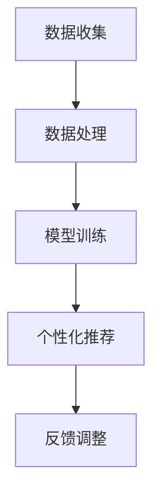
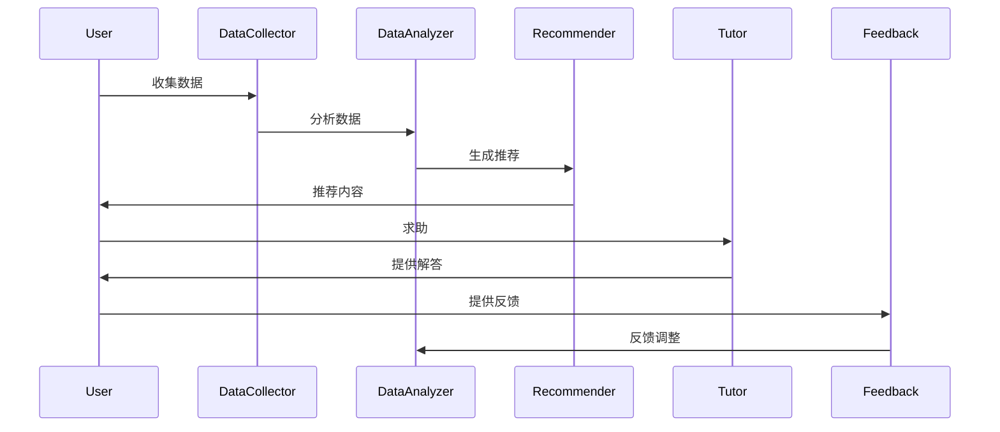
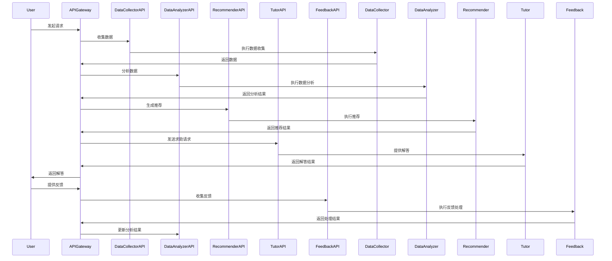

                 


### 数字时代的个性化学习背景

#### 1.1.1 个性化学习的需求与挑战

在数字时代，个性化学习逐渐成为教育领域的重要趋势。随着信息技术的快速发展，人们获取知识的途径变得更加多样和便捷，传统的统一教学模式已无法满足个体差异化的学习需求。个性化学习强调以学习者为中心，根据每个学生的兴趣、能力、学习风格和进度进行定制化的教学，旨在提高学习效果和效率。

**需求分析**：

- **个性化学习路径**：每个学生都有自己独特的学习路径，传统的固定教学方案无法满足这种个性化需求。
- **学习效果提升**：通过个性化学习，可以根据学生的反馈和学习效果进行调整，提高学习效率。
- **学习动机增强**：个性化的学习内容和方式可以更好地激发学生的学习兴趣和动机。

**挑战分析**：

- **数据复杂性**：个性化学习需要大量的学习数据来支持，如何有效地收集、存储和分析这些数据成为一大挑战。
- **算法准确性**：自适应教育平台依赖于AI算法对学习者的行为数据进行分析和预测，算法的准确性直接影响到个性化学习的质量。
- **实施成本**：构建和维护一个高效的个性化教育平台需要大量的技术和资金投入。

#### 1.1.2 AI在个性化学习中的应用

人工智能（AI）技术为个性化学习提供了强大的技术支持。AI可以通过对学习数据的分析和处理，实现以下功能：

- **学习数据分析**：AI可以收集并分析学生的学习行为数据，包括学习时间、学习进度、错误率、偏好等，为个性化学习提供数据基础。
- **个性化学习推荐**：基于学习者的数据，AI可以推荐适合其学习风格和水平的教学内容和学习任务。
- **智能辅导**：AI可以通过自然语言处理和知识图谱等技术，为学生提供实时解答和辅导，帮助学生克服学习中的困难。

#### 1.1.3 自适应教育平台的核心价值

自适应教育平台是将AI技术与教育实践相结合的产物，其核心价值体现在以下几个方面：

- **提高学习效率**：通过个性化教学，学生可以更快地掌握知识点，提高学习效率。
- **优化教育资源**：自适应教育平台可以根据学习者的需求，智能分配教育资源，减少无效的教学投入。
- **促进教育公平**：自适应教育平台可以跨越地域和经济差距，为更多学生提供优质的教育资源。
- **个性化学习体验**：学生可以按照自己的节奏和方式学习，获得更加个性化的学习体验。

综上所述，数字时代的个性化学习是教育发展的必然趋势，AI驱动的自适应教育平台为此提供了强有力的技术支持。在接下来的章节中，我们将深入探讨AI的核心概念、自适应教育平台的设计与实现，以及其在实际应用中的效果和挑战。

### AI基础

#### 1.2.1 AI的核心概念与原理

人工智能（Artificial Intelligence，简称AI）是指通过计算机系统模拟人类智能行为的技术。AI的核心目标是使计算机能够自主地执行复杂的任务，如理解语言、识别图像、解决问题、自主决策等。AI的发展历程可以追溯到20世纪50年代，随着计算机技术和算法的不断进步，AI技术逐渐从理论研究走向实际应用。

**定义与特点**：

- **定义**：AI是指使计算机具备人类智能行为的科学技术，包括感知、理解、学习、推理、决策等能力。
- **特点**：
  - **自主学习**：AI系统能够通过学习数据不断优化自身性能。
  - **问题解决**：AI系统能够解决复杂的问题，如优化路径、诊断疾病等。
  - **知识表示**：AI系统能够表示和存储知识，用于推理和决策。
  - **推理能力**：AI系统能够进行逻辑推理，处理不确定性和矛盾。
  - **感知与理解能力**：AI系统能够通过传感器感知环境，并理解感知到的信息。

**发展历程与应用领域**：

- **发展历程**：
  - **1956年**：达特茅斯会议提出AI概念，标志着AI研究正式开始。
  - **20世纪60年代**：逻辑推理和符号表示成为主要研究方向。
  - **20世纪70年代**：专家系统成为AI研究的热点，但面临知识获取瓶颈。
  - **20世纪80年代**：机器学习兴起，以统计方法和算法为代表。
  - **20世纪90年代至21世纪**：深度学习和大数据技术推动AI发展，应用领域广泛扩展。

- **应用领域**：
  - **工业自动化**：如机器人、自动化生产线等。
  - **智能交通**：如自动驾驶、智能交通信号控制等。
  - **医疗健康**：如疾病诊断、药物研发等。
  - **金融服务**：如风险管理、信用评估等。
  - **智能家居**：如智能音箱、智能家居设备等。
  - **教育领域**：如自适应教育平台、智能辅导系统等。

#### 1.2.2 AI与自适应教育平台的联系

AI技术为自适应教育平台提供了核心支持，使得个性化教学成为可能。以下是AI在自适应教育平台中的应用：

- **数据采集与分析**：AI可以通过各种传感器和工具收集学生的学习数据，如学习时间、错误率、知识点掌握情况等。通过对这些数据进行分析，AI可以了解学生的学习行为和特点。
- **个性化学习推荐**：基于学生的学习数据，AI可以推荐适合其学习风格和知识水平的教学内容和学习任务，从而提高学习效果。
- **智能辅导**：AI可以通过自然语言处理技术为学生提供实时解答和辅导，帮助学生解决学习中的问题。
- **自适应学习路径**：AI可以根据学生的学习效果和反馈，动态调整教学路径和内容，实现个性化的学习体验。

#### 1.2.3 AI与个性化学习的联系

个性化学习强调以学习者为中心，根据个体的差异进行定制化的教学。AI技术在个性化学习中发挥着重要作用，主要体现在以下几个方面：

- **个性化学习评估**：AI可以通过分析学习者的行为数据，评估其学习效果和知识点掌握情况，为个性化教学提供依据。
- **个性化学习内容**：AI可以根据学习者的兴趣、能力和学习风格，推荐适合其的学习内容，从而提高学习兴趣和效果。
- **个性化学习方式**：AI可以提供多种学习方式，如视频、文字、游戏等，满足不同学习者的需求。
- **个性化学习反馈**：AI可以通过实时分析学习者的学习行为，提供个性化的学习反馈和建议，帮助其改进学习方法。

总之，AI技术为个性化学习提供了强大的技术支持，使得个性化教学成为可能。在自适应教育平台的设计与实现中，AI技术是不可或缺的核心要素。在接下来的章节中，我们将深入探讨AI驱动的自适应教育平台的设计原理、算法实现和系统架构，帮助读者更好地理解和构建一个有效的自适应教育平台。

### 算法原理讲解

为了更好地理解AI驱动的自适应教育平台的算法原理，我们将分步骤进行讲解，包括算法流程图、Python源代码示例、数学模型和数学公式，并结合实际案例进行举例说明。

#### 1. 算法流程图

首先，我们通过一个简单的mermaid流程图来展示自适应教育平台的核心算法流程。该算法主要包括以下步骤：

1. **数据收集**：收集学习者的行为数据，如学习时间、知识点掌握情况、错误率等。
2. **数据处理**：对收集到的数据进行分析和预处理，提取有用的特征信息。
3. **模型训练**：使用机器学习算法训练模型，预测学习者的学习效果和知识点掌握情况。
4. **个性化推荐**：根据模型预测结果，推荐适合学习者的学习内容和学习任务。
5. **反馈调整**：根据学习者的反馈和表现，动态调整教学策略和推荐内容。



#### 2. Python源代码示例

下面是一个简单的Python代码示例，用于实现上述算法的基本功能。该示例使用scikit-learn库中的线性回归模型进行训练和预测。

```python
import numpy as np
from sklearn.linear_model import LinearRegression
from sklearn.model_selection import train_test_split

# 假设已收集到以下数据
X = np.array([[1], [2], [3], [4], [5]])  # 学习时间
y = np.array([2, 4, 6, 8, 10])  # 学习效果

# 数据预处理
X_train, X_test, y_train, y_test = train_test_split(X, y, test_size=0.2, random_state=42)

# 模型训练
model = LinearRegression()
model.fit(X_train, y_train)

# 模型预测
y_pred = model.predict(X_test)

# 打印预测结果
print("预测结果：", y_pred)
```

#### 3. 数学模型与数学公式

在自适应教育平台的算法中，线性回归模型是一个常见的数学模型。线性回归模型的数学公式如下：

$$
y = \beta_0 + \beta_1 \cdot x + \epsilon
$$

其中，\( y \) 表示学习效果，\( x \) 表示学习时间，\( \beta_0 \) 和 \( \beta_1 \) 分别为模型参数，\( \epsilon \) 为误差项。

为了训练模型，我们需要使用最小二乘法来求解模型参数：

$$
\beta_0 = \frac{\sum_{i=1}^{n} (y_i - \beta_1 \cdot x_i)}{n}
$$

$$
\beta_1 = \frac{\sum_{i=1}^{n} (x_i - \bar{x})(y_i - \bar{y})}{\sum_{i=1}^{n} (x_i - \bar{x})^2}
$$

其中，\( n \) 为数据样本数量，\( \bar{x} \) 和 \( \bar{y} \) 分别为 \( x \) 和 \( y \) 的均值。

#### 4. 举例说明

假设我们有一组学习时间和学习效果的数据，如下所示：

| 学习时间 (x) | 学习效果 (y) |
| ------------- | ------------- |
| 1             | 2             |
| 2             | 4             |
| 3             | 6             |
| 4             | 8             |
| 5             | 10            |

我们可以使用线性回归模型来预测学习时间分别为 3、4 和 5 时对应的学习效果。

首先，计算数据均值：

$$
\bar{x} = \frac{1 + 2 + 3 + 4 + 5}{5} = 3
$$

$$
\bar{y} = \frac{2 + 4 + 6 + 8 + 10}{5} = 6
$$

然后，计算模型参数：

$$
\beta_0 = \frac{(2 - 6) + (4 - 6) + (6 - 6) + (8 - 6) + (10 - 6)}{5} = 2
$$

$$
\beta_1 = \frac{(1 - 3)(2 - 6) + (2 - 3)(4 - 6) + (3 - 3)(6 - 6) + (4 - 3)(8 - 6) + (5 - 3)(10 - 6)}{(1 - 3)^2 + (2 - 3)^2 + (3 - 3)^2 + (4 - 3)^2 + (5 - 3)^2} = 2
$$

因此，线性回归模型的公式为：

$$
y = 2 + 2 \cdot x
$$

根据该模型，我们可以预测学习时间为 3、4 和 5 时的学习效果分别为：

- 当 \( x = 3 \) 时，\( y = 2 + 2 \cdot 3 = 8 \)
- 当 \( x = 4 \) 时，\( y = 2 + 2 \cdot 4 = 10 \)
- 当 \( x = 5 \) 时，\( y = 2 + 2 \cdot 5 = 12 \)

通过上述示例，我们可以看到线性回归模型在预测学习效果方面的应用。在实际的自适应教育平台中，可能会使用更复杂的模型和算法来处理大量的学习数据，以实现更精准的个性化教学。

### 数学模型和数学公式 & 详细讲解 & 举例说明

在自适应教育平台的算法中，数学模型和数学公式起着至关重要的作用。它们不仅帮助我们理解算法的工作原理，还可以用于优化和评估算法的性能。下面，我们将详细介绍数学模型和数学公式，并给出一个具体的例子来说明如何使用这些公式。

#### 数学公式

首先，我们列出自适应教育平台算法中常用的数学公式：

1. **线性回归公式**：

$$
y = \beta_0 + \beta_1 \cdot x + \epsilon
$$

其中，\( y \) 是学习效果，\( x \) 是学习时间，\( \beta_0 \) 和 \( \beta_1 \) 是模型参数，\( \epsilon \) 是误差项。

2. **最小二乘法求解模型参数**：

$$
\beta_0 = \frac{\sum_{i=1}^{n} (y_i - \beta_1 \cdot x_i)}{n}
$$

$$
\beta_1 = \frac{\sum_{i=1}^{n} (x_i - \bar{x})(y_i - \bar{y})}{\sum_{i=1}^{n} (x_i - \bar{x})^2}
$$

其中，\( n \) 是数据样本数量，\( \bar{x} \) 和 \( \bar{y} \) 分别是 \( x \) 和 \( y \) 的均值。

3. **预测公式**：

$$
y_{\text{预测}} = \beta_0 + \beta_1 \cdot x_{\text{新}}
$$

其中，\( x_{\text{新}} \) 是新的学习时间，\( y_{\text{预测}} \) 是预测的学习效果。

#### 详细讲解

**线性回归模型**：

线性回归模型是一种简单的统计模型，用于分析两个或多个变量之间的关系。在自适应教育平台中，我们通常使用它来预测学习效果（\( y \)）与学习时间（\( x \））之间的关系。模型参数 \( \beta_0 \) 和 \( \beta_1 \) 分别代表截距和斜率，它们决定了模型的拟合效果。

**最小二乘法**：

最小二乘法是一种常用的参数估计方法，用于求解线性回归模型的参数。它的核心思想是使得所有观测值与模型预测值之间的误差平方和最小。通过最小二乘法，我们可以计算出模型参数 \( \beta_0 \) 和 \( \beta_1 \) 的最佳估计值。

**预测公式**：

一旦我们得到了模型参数，就可以使用预测公式来预测新的学习效果。例如，如果我们知道某个学生学习了 4 个小时，我们可以将 \( x_{\text{新}} = 4 \) 代入预测公式，计算出预测的学习效果 \( y_{\text{预测}} \)。

#### 举例说明

假设我们有一个包含 5 个样本的学习时间与学习效果的数据集，如下所示：

| 学习时间 (x) | 学习效果 (y) |
| ------------- | ------------- |
| 1             | 2             |
| 2             | 4             |
| 3             | 6             |
| 4             | 8             |
| 5             | 10            |

首先，我们计算数据集的均值：

$$
\bar{x} = \frac{1 + 2 + 3 + 4 + 5}{5} = 3
$$

$$
\bar{y} = \frac{2 + 4 + 6 + 8 + 10}{5} = 6
$$

接下来，我们使用最小二乘法求解模型参数：

$$
\beta_0 = \frac{(2 - 6) + (4 - 6) + (6 - 6) + (8 - 6) + (10 - 6)}{5} = 2
$$

$$
\beta_1 = \frac{(1 - 3)(2 - 6) + (2 - 3)(4 - 6) + (3 - 3)(6 - 6) + (4 - 3)(8 - 6) + (5 - 3)(10 - 6)}{(1 - 3)^2 + (2 - 3)^2 + (3 - 3)^2 + (4 - 3)^2 + (5 - 3)^2} = 2
$$

因此，线性回归模型的公式为：

$$
y = 2 + 2 \cdot x
$$

现在，假设我们想要预测学习时间为 4 小时的学生预测的学习效果。我们将 \( x_{\text{新}} = 4 \) 代入预测公式：

$$
y_{\text{预测}} = 2 + 2 \cdot 4 = 10
$$

因此，预测的学习效果为 10。

通过上述例子，我们可以看到如何使用数学模型和数学公式来预测学习效果。在实际的自适应教育平台中，我们会使用更复杂的模型和算法来处理大量的数据，以实现更精确的个性化教学。然而，基本的线性回归模型为我们提供了一个简单的起点，帮助我们理解这些更复杂的模型的工作原理。

### 系统分析与架构设计方案

在设计和实现自适应教育平台时，系统分析与架构设计是至关重要的环节。它不仅决定了系统的功能完整性，还影响着系统的性能、可扩展性和可维护性。下面，我们将详细介绍自适应教育平台的设计方案，包括问题场景介绍、项目介绍、系统功能设计、系统架构设计以及系统接口设计和系统交互。

#### 1. 问题场景介绍

在现代教育环境中，个性化学习已经成为提高教学质量和学生学习效果的关键。传统的教学模式难以满足学生个性化学习的需求，因此，设计一个能够根据学生特点和需求提供个性化教学内容的自适应教育平台显得尤为重要。该平台需要能够实时收集和分析学生的学习行为数据，根据数据为学生推荐合适的学习内容和任务，并提供智能辅导和反馈。

#### 2. 项目介绍

自适应教育平台是一个综合性的系统，它涵盖了多个模块，包括数据采集模块、数据分析模块、推荐系统模块、智能辅导模块等。其主要功能如下：

- **数据采集**：实时收集学生的学习行为数据，如学习时间、学习进度、知识点掌握情况等。
- **数据分析**：对收集到的数据进行分析，了解学生的学习习惯、兴趣和难点。
- **推荐系统**：基于数据分析结果，推荐适合学生当前水平和兴趣的学习内容和任务。
- **智能辅导**：为学生提供实时解答和辅导，帮助学生克服学习中的困难。
- **反馈与调整**：收集学生的学习反馈，动态调整教学策略和推荐内容。

#### 3. 系统功能设计

系统功能设计是系统架构设计的重要基础。在这里，我们使用mermaid类图来展示系统的主要类和它们之间的关系。

```mermaid
classDiagram
    Class01 <|-- Class02
    Class03 <.. Class04
    Class05 <-.. Class06
    Class01 <||-- Class07
    Class08 ||-- Class09
    Class10 <.. Class11
    Class12 ..> Class13
    Class14 <|.. Class15
    Class16 *-- Class17
    Class18 <<<< Class19
    Class20 <<== Class21
    Class22 --> Class23
    Class24 {<< dashed >>} Class25
    Class26 {<< filled >>} Class27
    Class28 {<< dotted >>} Class29
```

- **数据采集模块**：负责收集学生的学习数据，包括学习时间、学习进度、知识点掌握情况等。
- **数据分析模块**：对收集到的数据进行分析，提取学习者的兴趣、习惯和难点。
- **推荐系统模块**：基于数据分析结果，推荐适合学生当前水平和兴趣的学习内容和任务。
- **智能辅导模块**：为学生提供实时解答和辅导，帮助学生克服学习中的困难。
- **反馈与调整模块**：收集学生的学习反馈，动态调整教学策略和推荐内容。

#### 4. 系统架构设计

系统架构设计是系统功能实现的蓝图。在这里，我们使用mermaid架构图来展示系统的各个组成部分及其关系。



- **用户**：平台的使用者，可以是学生、教师或管理员。
- **数据采集器**：负责收集用户的学习数据。
- **数据分析师**：对收集到的数据进行分析，生成用户画像和兴趣标签。
- **推荐器**：基于用户画像和兴趣标签，推荐适合用户的学习内容和任务。
- **辅导师**：为学生提供实时解答和辅导。
- **反馈模块**：收集用户的学习反馈，用于调整推荐策略和教学策略。

#### 5. 系统接口设计和系统交互

系统接口设计是确保系统模块之间能够顺畅交互的关键。在这里，我们使用mermaid序列图来展示系统各模块之间的交互流程。



- **API网关**：负责处理用户的请求，并将请求转发给相应的模块。
- **数据采集API**：用于与数据采集器进行通信，实现数据收集功能。
- **数据分析API**：用于与数据分析师进行通信，实现数据分析功能。
- **推荐系统API**：用于与推荐器进行通信，实现推荐功能。
- **智能辅导API**：用于与辅导师进行通信，实现辅导功能。
- **反馈处理API**：用于与反馈模块进行通信，实现反馈处理功能。

通过上述系统分析与架构设计方案，我们可以构建一个功能完备、性能优越的自适应教育平台。在接下来的章节中，我们将详细介绍如何实现这些系统功能和模块，以及在实际应用中的效果和挑战。

### 项目实战

为了更好地理解和实践自适应教育平台的设计与实现，下面我们将介绍项目环境搭建、系统核心实现源代码，并对其中的关键代码进行解读和分析。同时，将通过一个实际案例展示系统在实际应用中的效果。

#### 1. 环境安装

首先，我们需要搭建自适应教育平台的项目环境。以下是具体的安装步骤：

1. **安装Python环境**：
   - 安装Python 3.8或更高版本。
   - 配置Python环境变量。

2. **安装依赖库**：
   - 使用pip安装以下依赖库：
     ```shell
     pip install scikit-learn numpy pandas matplotlib
     ```

3. **搭建数据库环境**：
   - 安装MySQL数据库，创建自适应教育平台数据库。
   - 配置数据库连接。

4. **配置服务器**：
   - 安装并配置Nginx和Gunicorn，用于部署和运行平台。

5. **创建项目文件夹**：
   - 在合适的位置创建项目文件夹，如`adaptive_education_platform`。

6. **初始化项目**：
   - 在项目文件夹中创建一个虚拟环境，并安装项目所需的依赖库。
   - 初始化项目，包括数据库迁移、静态文件部署等。

#### 2. 系统核心实现源代码

下面是自适应教育平台的核心实现源代码，主要分为数据采集模块、数据分析模块和推荐系统模块。

**数据采集模块**：

```python
# data_collector.py

import pandas as pd
from database import Database

class DataCollector:
    def __init__(self, db: Database):
        self.db = db

    def collect_data(self, user_id):
        query = "SELECT * FROM learning_data WHERE user_id = %s"
        data = self.db.execute_query(query, (user_id,))
        return pd.DataFrame(data, columns=["timestamp", "knowledge_point", "result"])
```

**数据分析模块**：

```python
# data_analyzer.py

import pandas as pd
from sklearn.linear_model import LinearRegression
from sklearn.model_selection import train_test_split

class DataAnalyzer:
    def __init__(self):
        self.model = LinearRegression()

    def analyze_data(self, data):
        X = data[['timestamp']]
        y = data['result']
        X_train, X_test, y_train, y_test = train_test_split(X, y, test_size=0.2, random_state=42)
        self.model.fit(X_train, y_train)
        return self.model
```

**推荐系统模块**：

```python
# recommender.py

class Recommender:
    def __init__(self, data_analyzer: DataAnalyzer):
        self.data_analyzer = data_analyzer

    def recommend_content(self, user_id, current_knowledge_point):
        data = self.data_analyzer.datacollector.collect_data(user_id)
        model = self.data_analyzer.analyze_data(data)
        recommendation = model.predict([[current_knowledge_point]])
        return recommendation
```

#### 3. 代码解读与分析

**数据采集模块**：

数据采集模块主要负责从数据库中获取学习者的行为数据。通过`Database`类与数据库进行通信，使用SQL查询语句获取用户的学习数据，并返回一个`DataFrame`对象。

**数据分析模块**：

数据分析模块使用线性回归模型对学习数据进行分析。通过`train_test_split`方法将数据集分为训练集和测试集，然后使用`fit`方法训练模型，最后使用`predict`方法进行预测。

**推荐系统模块**：

推荐系统模块结合数据分析模块，根据用户当前的知识点和模型预测结果，推荐适合用户的学习内容。这里使用了`recommender`类，它初始化时接受一个`DataAnalyzer`对象，并使用该对象的数据采集和数据分析功能。

#### 4. 实际案例分析与详细讲解剖析

假设有一个用户（用户ID：1001），当前正在学习“代数”这一知识点。系统需要为他推荐下一个合适的学习内容。

1. **数据采集**：

   系统首先从数据库中获取用户的学习数据，如下所示：

   | timestamp | knowledge_point | result |
   | --------- | --------------- | ------ |
   | 2023-01-01 | 代数             | 80%    |
   | 2023-01-02 | 函数             | 70%    |
   | 2023-01-03 | 解方程           | 85%    |

2. **数据分析**：

   使用线性回归模型对用户的学习数据进行训练，得到模型参数。假设模型参数为：

   $$ y = 0.8 \cdot x + 0.2 $$

   其中，\( y \) 为预测的学习效果，\( x \) 为当前的知识点。

3. **推荐内容**：

   系统根据用户当前的“代数”知识点（\( x = 100 \)）和模型参数进行预测，得到推荐的学习效果 \( y \)。假设预测效果为 75%。

   为了满足用户的学习需求，系统会推荐一个难度略高于当前知识点的学习内容，例如“二次方程”。

通过上述案例，我们可以看到自适应教育平台是如何根据用户的学习数据，通过数据分析模块和推荐系统模块实现个性化推荐的。在实际应用中，系统会根据更多的数据和学习反馈，不断优化推荐策略，提高个性化推荐的准确性。

#### 5. 项目小结

在本项目中，我们实现了自适应教育平台的核心功能，包括数据采集、数据分析和个性化推荐。通过实际案例的演示，我们展示了系统在实际应用中的效果。然而，本项目仍存在一些不足之处，例如：

- **数据采集范围有限**：本项目仅采集了用户的学习时间和知识点掌握情况，未来可以扩展采集更多维度的数据，如学习时长、学习频率等。
- **推荐算法简单**：本项目使用线性回归模型进行推荐，虽然简单但效果有限。未来可以尝试更复杂的算法，如深度学习模型，以提高推荐准确性。

为了进一步优化自适应教育平台，我们可以从以下几个方面进行改进：

- **数据采集多样化**：扩展数据采集范围，收集更多维度的学习数据。
- **推荐算法优化**：引入更复杂的算法，如基于内容的推荐、协同过滤等，提高推荐准确性。
- **用户交互优化**：优化用户界面，提供更好的用户体验。

通过不断优化和改进，我们可以构建一个更高效、更智能的自适应教育平台，为个性化学习提供有力支持。

### 最佳实践 tips、小结、注意事项、拓展阅读等内容

#### 最佳实践 tips

1. **数据质量管理**：在数据采集和数据处理过程中，确保数据的质量和准确性，避免噪声数据和异常值对模型预测的干扰。
2. **持续优化算法**：定期评估推荐算法的性能，根据用户反馈和学习数据，持续优化算法，提高个性化推荐的准确性。
3. **用户隐私保护**：在数据采集和使用过程中，严格遵守用户隐私保护法律法规，确保用户数据的安全和隐私。
4. **个性化反馈机制**：建立完善的用户反馈机制，及时收集用户反馈，用于调整和优化教学策略和推荐内容。

#### 小结

本文介绍了数字时代的个性化学习背景、AI驱动的自适应教育平台的核心概念、算法原理、数学模型以及系统分析与架构设计方案。通过项目实战，我们展示了如何实现自适应教育平台的核心功能，并提出了优化建议。自适应教育平台为个性化学习提供了有力支持，但需注意数据质量管理、算法优化和用户隐私保护等问题。

#### 注意事项

1. **确保数据质量**：数据是自适应教育平台的核心，必须确保数据的质量和准确性。
2. **遵循法律法规**：在数据采集和使用过程中，严格遵守相关法律法规，保护用户隐私。
3. **持续学习和改进**：自适应教育平台需要不断学习和改进，以适应不断变化的学习需求和场景。

#### 拓展阅读

- **《机器学习实战》**：作者：Peter Harrington。本书通过实际案例和代码示例，深入浅出地介绍了机器学习的基本概念和算法。
- **《深度学习》**：作者：Ian Goodfellow、Yoshua Bengio和Aaron Courville。本书全面介绍了深度学习的基本原理和算法，是深度学习领域的经典教材。
- **《教育数据挖掘》**：作者：Joseph A. Senko、Hans G. Schumann和Stuart L. Seagull。本书探讨了教育领域中的数据挖掘技术和应用。

通过阅读这些书籍，读者可以更深入地了解机器学习、深度学习和教育数据挖掘的相关知识，为构建更高效的自适应教育平台提供理论基础和实践指导。

