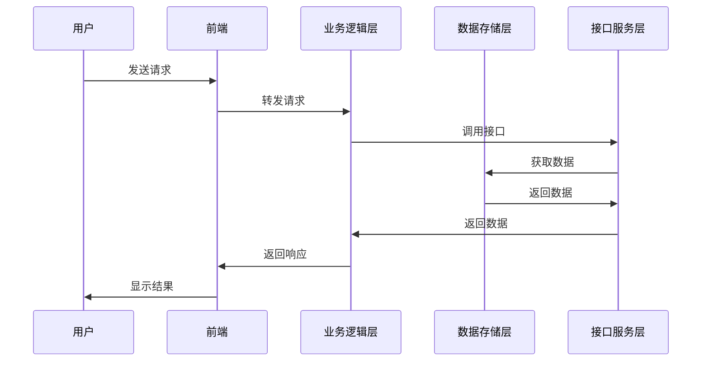
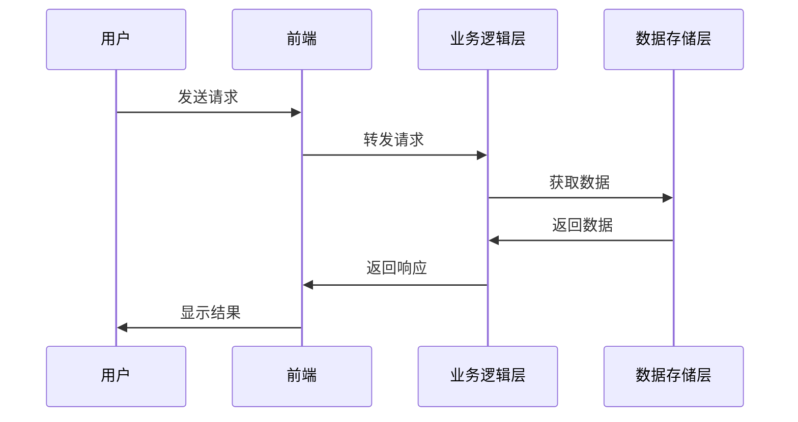

                 

# 《数字时代的人际关系重构》

> 关键词：数字时代、人际关系、重构、社交心理学、大数据、人工智能

> 摘要：本文从数字时代的人际关系重构出发，探讨了数字化背景下人际关系面临的新挑战，分析了数字化与人际关系的联系，探讨了人际关系重构的概念、要素以及应用场景，从技术基础、理论框架、方法与策略、算法原理、系统设计与项目实战等多个方面进行了深入探讨，旨在为数字时代下的人际关系重构提供理论支持和实践指导。

## 《数字时代的人际关系重构》目录大纲

### 目录

----------------------------------------------------------------

## 第1章 引言

### 1.1 问题的提出

#### 1.1.1 数字化时代的变革

#### 1.1.2 人际关系面临的新挑战

#### 1.1.3 人际关系重构的意义

### 1.2 核心概念

#### 1.2.1 数字化与人际关系的联系

#### 1.2.2 人际关系重构的概念

#### 1.2.3 人际关系重构的要素

### 1.3 边界与外延

#### 1.3.1 数字人际关系与传统人际关系的区别

#### 1.3.2 人际关系重构的应用场景

#### 1.3.3 人际关系重构的限制条件

## 第2章 核心概念与原理

### 2.1 数字化时代的社交心理学

#### 2.1.1 社交心理学的演变

#### 2.1.2 数字化对社交行为的影响

#### 2.1.3 社交心理学在人际关系重构中的应用

### 2.2 人际关系重构的技术基础

#### 2.2.1 人工智能与机器学习

#### 2.2.2 大数据与人脉分析

#### 2.2.3 社交网络与关系图谱

### 2.3 人际关系重构的理论框架

#### 2.3.1 人际关系重构的理论基础

#### 2.3.2 人际关系重构的关键原则

#### 2.3.3 人际关系重构的模型构建

## 第3章 人际关系重构的方法与策略

### 3.1 数据驱动的个性化关系构建

#### 3.1.1 数据收集与处理

#### 3.1.2 用户画像与个性化推荐

#### 3.1.3 数据驱动的社交互动策略

### 3.2 社交网络分析与人脉拓展

#### 3.2.1 社交网络分析的基本概念

#### 3.2.2 人脉拓展的策略与方法

#### 3.2.3 社交网络中的影响力分析

### 3.3 基于情感计算的社交互动优化

#### 3.3.1 情感计算的基本原理

#### 3.3.2 情感分析在人际关系重构中的应用

#### 3.3.3 情感计算驱动的社交互动优化策略

## 第4章 算法原理讲解

### 4.1 关系图谱构建算法

#### 4.1.1 关系图谱的基本概念

#### 4.1.2 关系图谱构建算法的原理

#### 4.1.3 关系图谱构建的流程与实现

### 4.2 人脉推荐算法

#### 4.2.1 人脉推荐的基本概念

#### 4.2.2 人脉推荐算法的原理

#### 4.2.3 人脉推荐算法的实现与优化

### 4.3 情感分析算法

#### 4.3.1 情感分析的基本概念

#### 4.3.2 情感分析算法的原理

#### 4.3.3 情感分析算法的实现与应用

## 第5章 系统分析与架构设计

### 5.1 项目介绍

#### 5.1.1 项目背景

#### 5.1.2 项目目标

#### 5.1.3 项目团队与分工

### 5.2 系统功能设计

#### 5.2.1 领域模型设计

#### 5.2.2 功能模块划分

#### 5.2.3 功能实现与接口设计

### 5.3 系统架构设计

#### 5.3.1 系统架构概述

#### 5.3.2 系统组件设计

#### 5.3.3 系统架构实现与优化

### 5.4 系tem接口设计

#### 5.4.1 接口规范与设计

#### 5.4.2 接口实现与调用

#### 5.4.3 接口测试与优化

### 5.5 系统交互设计

#### 5.5.1 系统交互概述

#### 5.5.2 系统交互流程

#### 5.5.3 系统交互实现与优化

## 第6章 项目实战

### 6.1 环境安装与配置

#### 6.1.1 环境需求与准备

#### 6.1.2 环境安装与配置

#### 6.1.3 环境测试与验证

### 6.2 系统核心实现

#### 6.2.1 关系图谱构建

#### 6.2.2 人脉推荐

#### 6.2.3 情感分析

### 6.3 代码应用解读与分析

#### 6.3.1 代码结构与功能模块

#### 6.3.2 代码应用场景

#### 6.3.3 代码解读与分析

### 6.4 实际案例分析与详细讲解

#### 6.4.1 案例选择与概述

#### 6.4.2 案例分析与讲解

#### 6.4.3 案例总结与反思

### 6.5 项目小结

#### 6.5.1 项目成果

## 引言

随着数字技术的迅猛发展，我们的生活和工作方式发生了深刻变革。数字技术不仅改变了我们的生活方式，也深刻影响了人际关系。在这个数字时代，人际关系重构成为了一个热门话题。本文旨在探讨数字时代下人际关系重构的必要性和可能性，分析数字化背景下人际关系面临的新挑战，并探讨人际关系重构的方法、策略和技术基础。

### 1.1 问题的提出

#### 1.1.1 数字化时代的变革

数字化时代，互联网、大数据、人工智能等新技术正在深刻改变我们的生活和工作方式。数字技术的普及，使得信息传播更加迅速、便捷，也使得人与人之间的距离变得更加紧密。然而，随着数字技术的快速发展，人际关系也面临着前所未有的挑战。

#### 1.1.2 人际关系面临的新挑战

首先，数字技术的普及使得人们更加依赖虚拟社交，而忽视了现实生活中的人际互动。这种虚拟社交的过度依赖，导致人际关系变得单一，缺乏深度和广度。其次，数字技术带来的信息过载，使得人们难以有效处理和筛选信息，导致信息孤岛现象加剧。此外，数字技术的发展也带来了隐私保护、网络安全等问题，这些都对人际关系产生了负面影响。

#### 1.1.3 人际关系重构的意义

在这个数字化时代，重构人际关系具有重要的现实意义。首先，重构人际关系有助于提高人际互动的质量和深度，增强人际关系的稳定性和可持续性。其次，重构人际关系有助于提高个人的社交能力和人际交往能力，增强个人的社会适应能力。最后，重构人际关系有助于构建一个更加和谐、稳定、可持续的社会环境。

### 1.2 核心概念

#### 1.2.1 数字化与人际关系的联系

数字化与人际关系之间的联系主要体现在以下几个方面：

1. 数字技术改变了人际交往的方式，使得人与人之间的交流变得更加便捷、高效。
2. 数字技术提供了丰富的社交平台，使得人们可以跨越时空限制，建立广泛的人际关系。
3. 数字技术带来了信息过载，使得人们在处理人际关系时面临着更多的挑战。

#### 1.2.2 人际关系重构的概念

人际关系重构是指在数字技术背景下，通过重新定义、调整和优化人际关系，以适应新的社会环境和生活方式。人际关系重构的目标是提高人际互动的质量和深度，增强人际关系的稳定性和可持续性。

#### 1.2.3 人际关系重构的要素

人际关系重构的要素主要包括：

1. 数字技术：数字技术是实现人际关系重构的基础和工具。
2. 社交平台：社交平台是人际关系重构的重要载体和媒介。
3. 互动策略：互动策略是人际关系重构的关键，包括数据驱动的个性化关系构建、社交网络分析与人脉拓展、基于情感计算的社交互动优化等。
4. 算法与技术：算法与技术是实现人际关系重构的重要手段，包括关系图谱构建、人脉推荐算法、情感分析算法等。

#### 1.3 边界与外延

#### 1.3.1 数字人际关系与传统人际关系的区别

数字人际关系与传统人际关系存在明显的区别，主要体现在以下几个方面：

1. 交流方式：传统人际关系主要依赖于面对面的交流，而数字人际关系则主要依赖于虚拟社交平台。
2. 交流频率：传统人际关系的交流频率相对较低，而数字人际关系的交流频率相对较高。
3. 交流深度：传统人际关系的交流深度相对较高，而数字人际关系的交流深度相对较低。

#### 1.3.2 人际关系重构的应用场景

人际关系重构的应用场景主要包括以下几个方面：

1. 社交平台：社交平台是人际关系重构的重要场景，通过数据驱动的个性化关系构建、社交网络分析与人脉拓展等策略，可以优化社交平台的人际关系。
2. 企业与员工：企业可以通过人际关系重构，提高员工的社交能力和人际交往能力，增强员工的社会适应能力。
3. 社会组织：社会组织可以通过人际关系重构，提高组织成员的凝聚力和协作能力，增强组织的竞争力。

#### 1.3.3 人际关系重构的限制条件

人际关系重构也面临着一些限制条件，主要包括：

1. 隐私保护：在数字技术背景下，人际关系重构需要处理大量的个人信息，因此隐私保护成为了一个重要的限制条件。
2. 网络安全：在数字技术背景下，网络安全问题日益突出，人际关系重构需要考虑如何确保个人信息和社交平台的安全。
3. 社会适应：人际关系重构需要适应新的社会环境和生活方式，这可能需要人们改变原有的行为习惯和社交模式。

## 第2章 核心概念与原理

### 2.1 数字化时代的社交心理学

#### 2.1.1 社交心理学的演变

社交心理学是研究个体在社会情境中的心理过程和行为的科学。在传统社会中，社交心理学主要关注面对面交流中的心理机制，如社交焦虑、社交认同等。然而，随着数字化时代的到来，社交心理学面临着新的挑战和机遇。

数字化时代的社交心理学经历了以下几个阶段的演变：

1. **网络社交初期**：互联网的兴起使得人们可以在线上进行社交活动，如聊天室、论坛等。这一阶段，社交心理学主要关注网络社交与传统社交的区别和影响。

2. **社交媒体时代**：社交媒体的普及，如Facebook、Twitter、微信等，使得人际互动变得更加频繁和多样化。这一阶段，社交心理学开始研究社交媒体对人际关系的影响，如虚拟社交对个体心理健康的影响。

3. **智能化社交**：人工智能和大数据技术的应用，使得社交心理学开始关注如何利用技术手段优化人际关系，如个性化推荐、情感计算等。

#### 2.1.2 数字化对社交行为的影响

数字化对社交行为产生了深远的影响，主要体现在以下几个方面：

1. **社交频率和深度**：数字化使得人们可以随时随地与他人进行交流，社交频率显著提高。然而，这种频繁的社交可能导致社交深度下降，人们更倾向于进行表面化的交流。

2. **社交距离和互动方式**：数字化减少了物理距离，但增加了虚拟距离。面对面的互动被屏幕前的互动所取代，这改变了人们的互动方式，也影响了人际关系的质量。

3. **信息过载和注意力分散**：数字化带来了信息过载，人们需要处理海量的信息，这可能导致注意力分散，影响深度思考。

#### 2.1.3 社交心理学在人际关系重构中的应用

社交心理学在人际关系重构中的应用主要体现在以下几个方面：

1. **个性化社交互动**：通过分析社交行为数据，可以了解个体的社交偏好和行为模式，从而提供个性化的社交互动建议，提高人际关系的质量。

2. **情感分析**：情感分析技术可以帮助理解个体在社交互动中的情感状态，从而优化社交互动的策略，如选择合适的沟通方式和时机。

3. **社交网络优化**：通过社交网络分析，可以识别个体在社交网络中的关键角色和影响力，从而优化社交网络的布局，提高社交网络的效率和稳定性。

### 2.2 人际关系重构的技术基础

#### 2.2.1 人工智能与机器学习

人工智能（AI）和机器学习（ML）是数字化时代人际关系重构的重要技术基础。它们通过分析大量数据，自动识别模式和行为，为个性化服务和优化决策提供支持。

1. **个性化推荐**：基于用户的行为数据，人工智能可以推荐合适的社交对象或活动，从而优化人际互动的质量。

2. **情感计算**：通过分析文本、语音等数据，情感计算技术可以识别个体的情感状态，帮助优化社交互动。

3. **社交网络分析**：人工智能技术可以帮助分析社交网络的结构和动态，识别关键节点和关系，从而优化社交网络的设计。

#### 2.2.2 大数据与人脉分析

大数据和人脉分析技术是数字化时代人际关系重构的关键。大数据技术可以处理海量社交数据，提取有价值的信息。人脉分析技术则可以分析个体的社交网络，识别潜在的合作机会和社交关系。

1. **用户画像**：通过大数据分析，可以构建用户的全面画像，了解其社交偏好和需求，为个性化服务提供支持。

2. **人脉拓展**：人脉分析技术可以帮助个体识别潜在的社交机会，扩展社交网络，增加社交资源的多样性。

3. **社交网络可视化**：大数据技术可以可视化社交网络的结构，帮助个体理解自己在社交网络中的位置和影响力。

#### 2.2.3 社交网络与关系图谱

社交网络和关系图谱技术是数字化时代人际关系重构的重要工具。社交网络是指个体之间的联系，而关系图谱则是对这些联系的结构化表示。

1. **关系图谱构建**：通过分析社交网络数据，可以构建关系图谱，揭示个体之间的复杂关系。关系图谱有助于理解社交网络的结构和动态，为优化社交网络提供支持。

2. **社交网络分析**：关系图谱技术可以帮助分析社交网络的关键特性，如中心性、密度、社区结构等，从而优化社交网络的布局。

3. **社交网络可视化**：关系图谱技术可以将复杂的社交网络结构可视化，帮助个体理解自己在社交网络中的角色和影响力。

### 2.3 人际关系重构的理论框架

#### 2.3.1 人际关系重构的理论基础

人际关系重构的理论基础主要包括社会心理学、社会学、计算机科学等领域。这些理论为理解数字化时代下的人际关系提供了不同的视角。

1. **社会心理学**：社会心理学研究个体在社会情境中的心理过程和行为，为理解数字化时代的人际关系提供了基础。

2. **社会学**：社会学关注社会结构和组织，研究人际关系在社会中的角色和影响。数字化时代的到来，社会结构发生了变化，这为人际关系重构提供了新的研究方向。

3. **计算机科学**：计算机科学提供了工具和技术，如人工智能、大数据分析、社交网络分析等，为数字化时代的人际关系重构提供了技术支持。

#### 2.3.2 人际关系重构的关键原则

人际关系重构需要遵循以下关键原则：

1. **个性化**：基于用户的行为数据，提供个性化的社交互动和推荐，提高人际互动的质量。

2. **适应性**：适应数字化时代的变化，不断调整和优化人际关系策略，以适应新的社交环境。

3. **协同性**：通过协同计算和协作，优化社交网络的结构和功能，提高社交网络的效率和稳定性。

4. **可持续性**：确保人际关系的稳定性和可持续性，避免虚拟社交对现实社交的替代。

5. **隐私保护**：在数字化时代，个人隐私保护至关重要。在人际关系重构过程中，需要确保用户数据的隐私和安全。

#### 2.3.3 人际关系重构的模型构建

人际关系重构的模型构建主要包括以下方面：

1. **用户模型**：通过分析用户的行为数据，构建用户的个性化模型，包括社交偏好、情感状态、需求等。

2. **社交网络模型**：基于社交网络数据，构建社交网络的模型，包括节点属性、边权重、网络结构等。

3. **互动模型**：通过分析用户的行为数据和社交网络结构，构建用户之间的互动模型，包括互动频率、互动方式、互动质量等。

4. **推荐模型**：基于用户模型和社交网络模型，构建个性化推荐模型，为用户提供合适的社交对象和活动。

5. **情感计算模型**：通过情感计算技术，构建用户情感状态的分析模型，为优化社交互动提供支持。

6. **人脉拓展模型**：基于社交网络分析，构建人脉拓展模型，帮助用户发现潜在的社交机会。

## 第3章 人际关系重构的方法与策略

### 3.1 数据驱动的个性化关系构建

#### 3.1.1 数据收集与处理

数据驱动的个性化关系构建的第一步是数据收集。数据可以来源于社交媒体平台、个人设备、问卷调查等多种渠道。收集的数据类型包括用户的基本信息、行为数据、社交网络数据、情感数据等。

数据收集后，需要进行数据处理。数据处理包括数据清洗、数据整合、数据标准化等步骤。数据清洗的目的是去除无效数据、错误数据和重复数据，提高数据质量。数据整合是将来自不同来源的数据进行整合，形成一个统一的数据视图。数据标准化是将数据转换为统一的格式和单位，以便进行后续分析。

#### 3.1.2 用户画像与个性化推荐

用户画像是通过分析用户的个人信息、行为数据和社会网络数据，构建出一个反映用户特征和需求的模型。用户画像可以帮助了解用户的兴趣、行为习惯、社交偏好等，为个性化推荐提供基础。

个性化推荐是基于用户画像，为用户推荐符合其兴趣和需求的内容、活动或社交对象。个性化推荐可以通过协同过滤、内容推荐、基于属性的推荐等方法实现。协同过滤是通过分析用户之间的相似性，为用户推荐其他用户喜欢的项目。内容推荐是基于项目的特征，为用户推荐与其兴趣相关的内容。基于属性的推荐是通过分析用户的属性，为用户推荐具有相似属性的其他用户或项目。

#### 3.1.3 数据驱动的社交互动策略

数据驱动的社交互动策略包括以下几个方面：

1. **个性化沟通**：基于用户画像和社交网络数据，为用户制定个性化的沟通策略，包括沟通内容、沟通频率和沟通方式。

2. **社交活动推荐**：基于用户兴趣和行为数据，为用户推荐合适的社交活动，如聚会、运动、兴趣小组等。

3. **社交网络优化**：通过社交网络分析，识别用户在社交网络中的关键角色和影响力，优化社交网络的布局，提高社交网络的效率和稳定性。

4. **情感计算驱动的社交互动**：通过情感计算技术，分析用户的情感状态，为用户提供合适的社交互动策略，如何时、何地、如何与对方进行互动。

### 3.2 社交网络分析与人脉拓展

#### 3.2.1 社交网络分析的基本概念

社交网络分析（Social Network Analysis, SNA）是研究个体之间社会关系的结构和动态的学科。在社交网络分析中，个体被称为“节点”（Node），个体之间的关系被称为“边”（Edge）。

社交网络分析的基本概念包括：

1. **节点**：社交网络中的个体，可以是个人、组织、产品等。
2. **边**：连接两个节点的线，表示节点之间的关系。
3. **网络**：由节点和边构成的整体结构。
4. **密度**：网络中边的比例，反映了网络的紧密程度。
5. **中心性**：节点在网络中的位置和影响力，常用的中心性指标包括度中心性、接近中心性和中间中心性。

#### 3.2.2 人脉拓展的策略与方法

人脉拓展是通过增加社交网络中的节点和边，扩大社交网络的范围和深度。以下是人脉拓展的几种策略和方法：

1. **主动拓展**：主动寻找和结识新的社交对象，如参加社交活动、加入兴趣小组、通过推荐认识新人等。

2. **被动拓展**：通过已有社交网络中的节点介绍，认识新的社交对象。这种方法依赖于社交网络中的关键节点和他们的关系网络。

3. **垂直拓展**：通过专业领域内的交流，结识同行业或领域的专业人士，从而扩大人脉网络。

4. **水平拓展**：通过跨领域的交流，结识来自不同行业或领域的专业人士，从而增加人脉网络的多样性。

5. **人脉推荐**：利用社交平台或人脉推荐系统，获取他人的推荐，结识潜在的重要人脉。

#### 3.2.3 社交网络中的影响力分析

社交网络中的影响力分析是评估节点在社交网络中的影响力和重要性的过程。以下是一些常见的影响力分析方法和指标：

1. **度中心性**：节点连接的边数，度中心性越高，表示节点在社交网络中的连接数越多，影响力越大。

2. **接近中心性**：节点到其他节点的最短路径数量，接近中心性越高，表示节点在社交网络中的连通性越好，影响力越大。

3. **中间中心性**：节点在社交网络中作为其他节点间路径的桥梁程度，中间中心性越高，表示节点在社交网络中的桥梁作用越强，影响力越大。

4. **影响力传播分析**：通过模拟信息在社交网络中的传播过程，分析节点的传播能力和影响力。

### 3.3 基于情感计算的社交互动优化

#### 3.3.1 情感计算的基本原理

情感计算（Affective Computing）是研究如何使计算机系统理解和处理人类情感的技术。情感计算的基本原理包括以下几个方面：

1. **情感识别**：通过分析文本、语音、图像等数据，识别个体的情感状态，如快乐、愤怒、悲伤等。

2. **情感表达**：计算机系统通过视觉、语音、动作等方式，模拟人类的情感表达，与用户进行情感交互。

3. **情感合成**：计算机系统根据用户的行为数据和情感状态，生成相应的情感反应，如反馈、建议等。

#### 3.3.2 情感分析在人际关系重构中的应用

情感分析在人际关系重构中的应用主要包括以下几个方面：

1. **个性化社交互动**：通过情感分析，了解用户的情感状态，为用户提供个性化的社交互动建议，如合适的沟通内容、沟通方式和时机。

2. **情感反馈**：在社交互动中，通过情感分析，获取用户的情感反馈，优化社交互动的策略，提高人际关系的质量。

3. **情感管理**：通过情感分析，帮助用户识别和管理自己的情感状态，提高情感智力和社交能力。

#### 3.3.3 情感计算驱动的社交互动优化策略

情感计算驱动的社交互动优化策略包括以下几个方面：

1. **情感识别与预测**：通过情感计算技术，实时识别用户的情感状态，并预测其情感变化，为用户提供及时的社交互动建议。

2. **情感适应**：根据用户的情感状态，调整社交互动的策略，如改变沟通方式、调整互动频率等，以适应用户的情感需求。

3. **情感反馈机制**：建立情感反馈机制，收集用户的情感反馈，不断优化社交互动的流程和内容，提高用户的满意度。

4. **情感训练**：通过情感计算技术，帮助用户进行情感训练，提高其情感智力和社交能力，从而优化社交互动的质量。

## 第4章 算法原理讲解

### 4.1 关系图谱构建算法

#### 4.1.1 关系图谱的基本概念

关系图谱（Knowledge Graph）是一种用于表示实体及其之间关系的图形结构。关系图谱由实体（Entity）、属性（Attribute）和关系（Relationship）组成。实体是关系图谱中的基本元素，如人、地点、组织等；属性是实体的特征描述，如年龄、职位、联系方式等；关系描述了实体之间的关联，如朋友、同事、股东等。

关系图谱在数字时代的人际关系重构中具有重要作用。它可以帮助我们更好地理解复杂的人际关系，发现潜在的合作机会，优化社交网络的布局。

#### 4.1.2 关系图谱构建算法的原理

关系图谱的构建算法主要包括实体识别、实体链接和关系抽取三个步骤。

1. **实体识别**：通过自然语言处理（NLP）技术，从文本数据中识别出实体。实体识别可以使用命名实体识别（Named Entity Recognition, NER）算法实现。

2. **实体链接**：将同一实体的不同表达形式进行匹配和链接。实体链接可以使用实体匹配算法，如Jaccard相似性、余弦相似性等。

3. **关系抽取**：从文本数据中提取实体之间的关系。关系抽取可以使用依存句法分析（Dependency Parsing）、实体共现分析（Entity Co-occurrence Analysis）等方法。

#### 4.1.3 关系图谱构建的流程与实现

关系图谱构建的流程包括数据收集、预处理、实体识别、实体链接和关系抽取等步骤。

1. **数据收集**：收集包含人际关系的文本数据，如社交媒体帖子、电子邮件、新闻报道等。

2. **预处理**：对文本数据进行清洗、去噪和分词，提取出实体和关系。

3. **实体识别**：使用NER算法识别文本中的实体。

4. **实体链接**：使用实体匹配算法将同一实体的不同表达形式进行链接。

5. **关系抽取**：使用关系抽取算法从文本数据中提取实体之间的关系。

6. **图谱构建**：将识别出的实体和关系构建成关系图谱。

7. **优化与迭代**：对关系图谱进行优化和迭代，以提高图谱的质量和准确性。

以下是一个简单的Python代码示例，用于构建关系图谱：

```python
import networkx as nx
import pandas as pd

# 创建一个空图
G = nx.Graph()

# 读取实体和关系的CSV文件
data = pd.read_csv('entity_relationship.csv')

# 添加实体到图
for entity in data['Entity']:
    G.add_node(entity)

# 添加关系到图
for index, row in data.iterrows():
    G.add_edge(row['Entity1'], row['Entity2'], relationship=row['Relationship'])

# 显示图的结构
print(nx.to_dict_of_lists(G))
```

### 4.2 人脉推荐算法

#### 4.2.1 人脉推荐的基本概念

人脉推荐（Social Network Recommendation）是根据用户的社交网络结构和偏好，为用户推荐潜在的人脉联系。人脉推荐可以帮助用户发现新的社交机会，拓展社交网络。

人脉推荐算法可以分为基于内容的推荐（Content-Based Recommendation）和基于协同过滤的推荐（Collaborative Filtering）两种。

1. **基于内容的推荐**：根据用户的兴趣和偏好，推荐具有相似兴趣的人脉联系。
2. **基于协同过滤的推荐**：根据用户与其社交网络中其他用户的互动行为，推荐用户可能感兴趣的人脉联系。

#### 4.2.2 人脉推荐算法的原理

人脉推荐算法的原理是基于社交网络中的相似性度量。相似性度量可以基于用户之间的共同好友、共同兴趣、共同行为等。

1. **用户相似性度量**：计算用户之间的相似性得分，常用的方法包括Jaccard相似性、余弦相似性等。
2. **人脉推荐**：根据用户相似性度量，为用户推荐相似度较高的社交对象。

#### 4.2.3 人脉推荐算法的实现与优化

人脉推荐算法的实现包括以下步骤：

1. **数据收集**：收集用户的社交网络数据，包括用户及其好友的关系数据。
2. **预处理**：对社交网络数据进行清洗、去噪和规范化处理。
3. **用户相似性计算**：计算用户之间的相似性得分。
4. **推荐生成**：根据用户相似性得分，生成推荐列表。

以下是一个简单的Python代码示例，用于实现基于协同过滤的人脉推荐：

```python
import numpy as np
import pandas as pd

# 创建一个用户-好友矩阵
user_friends = pd.DataFrame({
    'User1': ['User2', 'User3', 'User4'],
    'User2': ['User1', 'User3', 'User5'],
    'User3': ['User1', 'User2', 'User6'],
    'User4': ['User1', 'User5', 'User6'],
    'User5': ['User2', 'User4'],
    'User6': ['User3', 'User4']
})

# 创建一个空的用户-推荐矩阵
user_recommendations = pd.DataFrame(index=user_friends.index, columns=user_friends.columns)

# 计算用户相似性得分
for user1 in user_friends.index:
    for user2 in user_friends.index:
        if user1 != user2:
            common_friends = set(user_friends[user1]) & set(user_friends[user2])
            similarity_score = len(common_friends) / (len(set(user_friends[user1])) + len(set(user_friends[user2])) - len(common_friends))
            user_recommendations.loc[user1, user2] = similarity_score

# 根据相似性得分生成推荐列表
for user in user_recommendations.index:
    user_recommendations.sort_values(user, ascending=False, inplace=True)
    user_recommendations[user] = user_recommendations[user].iloc[:5]

print(user_recommendations)
```

### 4.3 情感分析算法

#### 4.3.1 情感分析的基本概念

情感分析（Sentiment Analysis）是自然语言处理（NLP）的一个重要分支，它通过分析文本数据，识别文本中的情感倾向和情感强度。情感分析可以帮助我们了解用户对某一主题、产品、服务等的情感态度，为商业决策、舆情分析等提供支持。

情感分析可以分为以下几种类型：

1. **文本分类**：将文本分类为积极、消极或中立等情感类别。
2. **情感强度分析**：评估文本中情感的强度，如非常积极、积极、一般、消极、非常消极等。
3. **情感极性分析**：分析文本中情感的正负极性，如正面情感、负面情感等。

#### 4.3.2 情感分析算法的原理

情感分析算法的原理主要包括以下几个方面：

1. **特征提取**：从文本中提取特征，如词汇、语法结构、情感词典等。
2. **分类模型**：使用分类算法，如支持向量机（SVM）、朴素贝叶斯（Naive Bayes）、深度学习模型等，对特征进行分类。
3. **情感强度评估**：使用回归模型、多标签分类模型等，评估文本中情感的强度。

#### 4.3.3 情感分析算法的实现与应用

情感分析算法的实现包括以下步骤：

1. **数据收集**：收集包含情感标签的文本数据，如社交媒体评论、产品评价等。
2. **预处理**：对文本数据进行清洗、去噪和分词处理。
3. **特征提取**：从文本中提取特征，如词袋模型、TF-IDF、词嵌入等。
4. **模型训练**：使用训练数据，训练分类模型或情感强度评估模型。
5. **模型评估**：使用测试数据，评估模型的准确性、召回率、F1值等指标。
6. **应用**：使用训练好的模型，对新的文本数据进行情感分析。

以下是一个简单的Python代码示例，用于实现基于TF-IDF的情感分析：

```python
from sklearn.feature_extraction.text import TfidfVectorizer
from sklearn.model_selection import train_test_split
from sklearn.naive_bayes import MultinomialNB
from sklearn.metrics import classification_report

# 社交媒体评论数据
data = [
    "这是一个非常好的产品。",
    "我非常喜欢这个服务。",
    "这个产品太糟糕了。",
    "我不满意这个服务。",
    "这个体验很糟糕。",
    "这是一个优秀的产品。",
    "我很满意这个服务。",
    "这个产品让我感到失望。",
    "这个服务让我感到不快。",
    "这是一个很糟糕的体验。"
]

# 情感标签
labels = ["积极", "积极", "消极", "消极", "消极", "积极", "积极", "消极", "消极", "消极"]

# 分词并构建词汇表
vectorizer = TfidfVectorizer(stop_words='english')
X = vectorizer.fit_transform(data)

# 划分训练集和测试集
X_train, X_test, y_train, y_test = train_test_split(X, labels, test_size=0.2, random_state=42)

# 训练模型
model = MultinomialNB()
model.fit(X_train, y_train)

# 预测测试集
predictions = model.predict(X_test)

# 评估模型
print(classification_report(y_test, predictions))
```

## 第5章 系统分析与架构设计

### 5.1 项目介绍

#### 5.1.1 项目背景

随着数字化时代的到来，人际关系变得越来越复杂。人们在社交平台上建立了广泛的社交网络，但如何有效地管理和利用这些人际关系成为一个重要的课题。本项目旨在构建一个基于人工智能和大数据技术的人际关系重构系统，通过数据驱动的个性化关系构建、社交网络分析与人脉拓展等策略，优化人际关系，提高社交互动的质量。

#### 5.1.2 项目目标

本项目的主要目标包括：

1. **数据驱动的个性化关系构建**：通过分析用户的行为数据和社交网络结构，构建用户的个性化关系模型，为用户提供个性化的社交互动和推荐。
2. **社交网络分析与人脉拓展**：通过社交网络分析技术，帮助用户发现潜在的人脉机会，拓展社交网络，增加社交资源的多样性。
3. **情感计算驱动的社交互动优化**：通过情感计算技术，优化用户的社交互动策略，提高人际关系的质量。

#### 5.1.3 项目团队与分工

本项目由以下团队成员组成：

1. **项目经理**：负责项目规划、进度管理和团队协作。
2. **数据科学家**：负责数据收集、数据预处理、模型训练和评估。
3. **前端工程师**：负责用户界面设计和开发。
4. **后端工程师**：负责系统架构设计、接口开发和维护。
5. **测试工程师**：负责系统测试和问题排查。

### 5.2 系统功能设计

#### 5.2.1 领域模型设计

系统领域模型设计主要包括用户、社交网络、推荐系统和情感计算等模块。

1. **用户模块**：包括用户注册、登录、个人信息管理等功能。
2. **社交网络模块**：包括社交网络构建、社交网络分析、人脉拓展等功能。
3. **推荐系统模块**：包括个性化推荐、社交活动推荐、人脉推荐等功能。
4. **情感计算模块**：包括情感识别、情感反馈、情感优化等功能。

以下是一个简单的领域模型ER图：

```mermaid
erDiagram
    User ||--|{ SocialNetwork : member }
    SocialNetwork ||--|{ Recommendation : source }
    Recommendation ||--|{ Activity : suggestion }
    Recommendation ||--|{ Connection : candidate }
    Activity ||--|{ Emotion : mood }
```

#### 5.2.2 功能模块划分

系统功能模块划分如下：

1. **用户管理模块**：负责用户注册、登录、个人信息管理等。
2. **社交网络模块**：负责社交网络的构建、社交网络分析和人脉拓展。
3. **推荐系统模块**：负责个性化推荐、社交活动推荐和人脉推荐。
4. **情感计算模块**：负责情感识别、情感反馈和情感优化。
5. **数据存储模块**：负责用户数据、社交网络数据、推荐数据和情感数据的存储和管理。
6. **接口服务模块**：负责系统各模块之间的接口设计和实现。

#### 5.2.3 功能实现与接口设计

系统功能实现与接口设计如下：

1. **用户管理模块**：通过RESTful API提供用户注册、登录、个人信息管理等功能。
2. **社交网络模块**：通过图数据库存储社交网络数据，使用图遍历算法实现社交网络分析和人脉拓展。
3. **推荐系统模块**：使用协同过滤算法和基于内容的推荐算法实现个性化推荐、社交活动推荐和人脉推荐。
4. **情感计算模块**：使用情感分析算法实现情感识别、情感反馈和情感优化。
5. **数据存储模块**：使用关系型数据库存储用户数据、社交网络数据、推荐数据和情感数据，并设计相应的数据接口。
6. **接口服务模块**：设计RESTful API，实现系统各模块之间的数据交互和功能调用。

### 5.3 系统架构设计

#### 5.3.1 系统架构概述

系统架构设计采用分层架构，包括前端层、业务逻辑层、数据存储层和接口服务层。

1. **前端层**：负责用户界面设计和交互，使用Vue.js框架实现。
2. **业务逻辑层**：负责系统的核心业务功能，包括用户管理、社交网络分析、推荐系统和情感计算等。
3. **数据存储层**：负责数据的存储和管理，包括关系型数据库和图数据库。
4. **接口服务层**：负责系统各模块之间的接口设计和实现，使用Spring Boot框架实现。

以下是一个简单的系统架构图：



#### 5.3.2 系统组件设计

系统组件设计主要包括以下组件：

1. **用户管理组件**：负责用户注册、登录、个人信息管理等。
2. **社交网络组件**：负责社交网络的构建、社交网络分析和人脉拓展。
3. **推荐系统组件**：负责个性化推荐、社交活动推荐和人脉推荐。
4. **情感计算组件**：负责情感识别、情感反馈和情感优化。
5. **数据存储组件**：负责用户数据、社交网络数据、推荐数据和情感数据的存储和管理。
6. **接口服务组件**：负责系统各模块之间的接口设计和实现。

以下是一个简单的系统组件图：

```mermaid
graph TD
    UserManagement[用户管理]
    SocialNetwork[社交网络]
    Recommendation[推荐系统]
    EmotionComputation[情感计算]
    Database[数据存储]
    Interface[接口服务]

    UserManagement->Backend
    SocialNetwork->Backend
    Recommendation->Backend
    EmotionComputation->Backend
    Database->Backend
    Interface->Backend
```

#### 5.3.3 系统架构实现与优化

系统架构实现与优化主要包括以下方面：

1. **高可用性**：通过负载均衡和故障转移机制，提高系统的可用性和稳定性。
2. **高性能**：通过缓存、数据库优化和异步处理等机制，提高系统的性能和响应速度。
3. **安全性**：通过加密、认证和权限控制等机制，确保系统的安全性和数据的完整性。
4. **可扩展性**：通过模块化和分布式架构，实现系统的可扩展性和灵活性。
5. **监控与日志**：通过监控系统和日志分析，实时监控系统的运行状态和性能，及时发现和解决问题。

### 5.4 系统接口设计

#### 5.4.1 接口规范与设计

系统接口设计遵循RESTful API规范，使用JSON格式传输数据。

以下是一个简单的接口设计示例：

```json
GET /users/{userId}
    Description: 获取指定用户的信息
    Response:
        {
            "userId": "string",
            "name": "string",
            "email": "string",
            "profilePicture": "string",
            "friends": ["string"]
        }

POST /users
    Description: 注册新用户
    Request:
        {
            "name": "string",
            "email": "string",
            "password": "string"
        }
    Response:
        {
            "userId": "string",
            "name": "string",
            "email": "string",
            "profilePicture": "string"
        }

PUT /users/{userId}
    Description: 更新用户信息
    Request:
        {
            "name": "string",
            "email": "string",
            "password": "string",
            "profilePicture": "string"
        }
    Response:
        {
            "userId": "string",
            "name": "string",
            "email": "string",
            "profilePicture": "string"
        }
```

#### 5.4.2 接口实现与调用

接口实现使用Spring Boot框架，以下是一个简单的接口实现示例：

```java
@RestController
@RequestMapping("/users")
public class UserController {
    
    @Autowired
    private UserService userService;
    
    @GetMapping("/{userId}")
    public UserDto getUser(@PathVariable String userId) {
        return userService.getUser(userId);
    }
    
    @PostMapping
    public UserDto registerUser(@RequestBody RegistrationDto registrationDto) {
        return userService.registerUser(registrationDto);
    }
    
    @PutMapping("/{userId}")
    public UserDto updateUser(@PathVariable String userId, @RequestBody UserDto userDto) {
        return userService.updateUser(userId, userDto);
    }
}
```

接口调用示例：

```java
public class UserControllerTest {
    
    @Autowired
    private MockMvc mockMvc;
    
    @Test
    public void getUser() throws Exception {
        mockMvc.perform(get("/users/{userId}", "123"))
            .andExpect(status().isOk())
            .andExpect(jsonPath("$.userId").value("123"))
            .andExpect(jsonPath("$.name").value("John Doe"));
    }
    
    @Test
    public void registerUser() throws Exception {
        mockMvc.perform(post("/users")
            .contentType(MediaType.APPLICATION_JSON)
            .content("{\"name\": \"John Doe\", \"email\": \"john.doe@example.com\", \"password\": \"password123\"}"))
            .andExpect(status().isCreated())
            .andExpect(jsonPath("$.userId").exists())
            .andExpect(jsonPath("$.name").value("John Doe"));
    }
    
    @Test
    public void updateUser() throws Exception {
        mockMvc.perform(put("/users/{userId}", "123")
            .contentType(MediaType.APPLICATION_JSON)
            .content("{\"name\": \"John Doe\", \"email\": \"john.doe@example.com\", \"password\": \"password123\", \"profilePicture\": \"https://example.com/profile.jpg\"}"))
            .andExpect(status().isOk())
            .andExpect(jsonPath("$.userId").value("123"))
            .andExpect(jsonPath("$.name").value("John Doe"))
            .andExpect(jsonPath("$.profilePicture").value("https://example.com/profile.jpg"));
    }
}
```

#### 5.4.3 接口测试与优化

接口测试包括功能测试、性能测试和安全性测试。

1. **功能测试**：使用MockMvc模拟用户请求，验证接口的响应结果和状态码。
2. **性能测试**：使用JMeter等工具模拟高并发场景，测试接口的响应时间和吞吐量。
3. **安全性测试**：使用OWASP ZAP等工具扫描接口的安全漏洞，确保接口的安全性。

接口优化包括以下方面：

1. **缓存**：使用Redis等缓存技术，减少数据库访问，提高系统性能。
2. **异步处理**：使用异步编程模型，减少接口响应时间，提高系统吞吐量。
3. **负载均衡**：使用Nginx等负载均衡器，实现流量分发和故障转移，提高系统可用性和稳定性。
4. **安全性**：使用HTTPS加密通信，实现身份认证和权限控制，确保接口的安全性。

### 5.5 系统交互设计

#### 5.5.1 系统交互概述

系统交互设计包括用户与系统之间的交互和系统内部模块之间的交互。

1. **用户与系统之间的交互**：用户通过前端界面与系统进行交互，如注册、登录、查看推荐等。
2. **系统内部模块之间的交互**：系统内部模块之间通过接口进行数据交互，如用户管理模块与社交网络模块之间的交互。

#### 5.5.2 系统交互流程

系统交互流程主要包括以下步骤：

1. **用户请求**：用户通过前端界面发起请求，如获取推荐列表、更新个人信息等。
2. **前端处理**：前端将请求发送到业务逻辑层，如用户管理模块或社交网络模块。
3. **业务处理**：业务逻辑层处理请求，调用相关接口，如获取用户数据、构建社交网络等。
4. **数据存储**：业务逻辑层将处理结果存储到数据库，如更新用户数据、构建社交网络图等。
5. **响应结果**：业务逻辑层将处理结果返回给前端，如推荐列表、更新结果等。
6. **前端展示**：前端将处理结果展示给用户，如推荐列表、更新提示等。

以下是一个简单的系统交互序列图：



#### 5.5.3 系统交互实现与优化

系统交互实现与优化主要包括以下方面：

1. **前后端分离**：使用Vue.js等前端框架实现前端界面，使用Spring Boot等后端框架实现业务逻辑层，实现前后端分离。
2. **API接口设计**：遵循RESTful API规范，设计清晰的接口规范，确保接口的易用性和可扩展性。
3. **异步处理**：使用异步编程模型，减少接口响应时间，提高系统吞吐量。
4. **缓存机制**：使用Redis等缓存技术，减少数据库访问，提高系统性能。
5. **负载均衡**：使用Nginx等负载均衡器，实现流量分发和故障转移，提高系统可用性和稳定性。
6. **安全性**：使用HTTPS加密通信，实现身份认证和权限控制，确保接口的安全性。

## 第6章 项目实战

### 6.1 环境安装与配置

#### 6.1.1 环境需求与准备

在开始项目实战之前，我们需要准备以下环境和工具：

1. **操作系统**：Ubuntu 18.04或更高版本。
2. **编程语言**：Python 3.8或更高版本。
3. **开发工具**：PyCharm或Visual Studio Code。
4. **数据库**：MySQL 8.0或更高版本。
5. **图数据库**：Neo4j 4.0或更高版本。
6. **消息队列**：RabbitMQ 3.8.0或更高版本。
7. **缓存**：Redis 6.0或更高版本。
8. **前端框架**：Vue.js 3.x。

#### 6.1.2 环境安装与配置

以下是环境安装和配置的步骤：

1. **安装操作系统**：下载Ubuntu 18.04镜像并安装到虚拟机中。

2. **安装Python和PyCharm**：
   - 打开终端，更新系统包列表：
     ```shell
     sudo apt update && sudo apt upgrade
     ```
   - 安装Python 3和pip：
     ```shell
     sudo apt install python3 python3-pip
     ```
   - 安装PyCharm社区版：
     - 访问PyCharm官网下载社区版安装包。
     - 解压安装包并运行安装程序。

3. **安装数据库**：
   - 安装MySQL：
     ```shell
     sudo apt install mysql-server
     ```
   - 安装Neo4j：
     - 访问Neo4j官网下载社区版安装包。
     - 解压安装包并运行安装程序。

4. **安装消息队列**：
   - 安装RabbitMQ：
     ```shell
     sudo apt install rabbitmq-server
     ```

5. **安装缓存**：
   - 安装Redis：
     ```shell
     sudo apt install redis-server
     ```

6. **安装前端框架**：
   - 安装Node.js和npm：
     ```shell
     sudo apt install nodejs npm
     ```
   - 安装Vue CLI：
     ```shell
     npm install -g @vue/cli
     ```

#### 6.1.3 环境测试与验证

在安装完所有环境和工具后，我们需要进行测试以确保环境正常工作。

1. **测试Python环境**：
   ```shell
   python --version
   ```

2. **测试PyCharm**：
   - 打开PyCharm并创建一个新的Python项目。

3. **测试MySQL**：
   - 打开终端，使用以下命令登录MySQL：
     ```shell
     mysql -u root -p
     ```
   - 创建一个测试数据库并插入一些数据。

4. **测试Neo4j**：
   - 打开Neo4j Desktop，连接到本地Neo4j实例，创建一个测试图数据库。

5. **测试RabbitMQ**：
   - 打开终端，使用以下命令启动RabbitMQ管理界面：
     ```shell
     rabbitmq-management
     ```
   - 在浏览器中访问RabbitMQ管理界面，验证RabbitMQ是否正常运行。

6. **测试Redis**：
   - 打开终端，使用以下命令连接到Redis服务器：
     ```shell
     redis-cli
     ```
   - 执行一些基本命令，如SET、GET等，验证Redis是否正常运行。

7. **测试Vue CLI**：
   - 在PyCharm中创建一个新的Vue.js项目，运行项目并确保前端界面正常显示。

通过以上步骤，我们完成了环境的安装和配置，并验证了所有环境工具的正常运行。

### 6.2 系统核心实现

#### 6.2.1 关系图谱构建

关系图谱构建是系统核心功能之一，它用于表示用户之间的社交关系和网络结构。以下是关系图谱构建的主要步骤：

1. **数据收集**：
   - 从社交媒体平台、用户设备和其他数据源收集用户关系数据。
   - 数据可能包括用户ID、用户名、用户头像、用户关系（如好友、关注者）等。

2. **数据预处理**：
   - 清洗数据，去除重复和无效数据。
   - 标准化数据格式，如将用户ID统一为字符串。

3. **实体识别**：
   - 使用自然语言处理技术（如命名实体识别），从文本数据中提取实体（如用户名、地点名）。

4. **关系抽取**：
   - 使用规则或机器学习模型，从文本数据中提取实体之间的关系（如好友、同事）。
   - 关系可能包括单向关系（如关注）和双向关系（如好友）。

5. **图谱构建**：
   - 使用图数据库（如Neo4j）构建关系图谱，存储实体和关系。
   - 创建节点表示用户，创建边表示用户关系。

以下是一个简单的Python代码示例，用于在Neo4j中构建关系图谱：

```python
from py2neo import Graph

# 连接到Neo4j数据库
graph = Graph("bolt://localhost:7687", auth=("neo4j", "password"))

# 创建用户节点
def create_user_node(user_id, username, avatar_url):
    graph.run("CREATE (u:User {id: $user_id, username: $username, avatar_url: $avatar_url})",
              user_id=user_id, username=username, avatar_url=avatar_url)

# 创建好友关系
def create_friend_relation(user_id1, user_id2):
    graph.run("MATCH (u1:User {id: $user_id1}), (u2:User {id: $user_id2}) "
              "CREATE (u1)-[:FRIEND]->(u2)",
              user_id1=user_id1, user_id2=user_id2)

# 示例：创建用户节点和好友关系
create_user_node("1", "Alice", "https://example.com/alice.jpg")
create_user_node("2", "Bob", "https://example.com/bob.jpg")
create_friend_relation("1", "2")
```

#### 6.2.2 人脉推荐

人脉推荐是系统另一个核心功能，它基于用户社交网络和兴趣，为用户推荐潜在的人脉联系。以下是人脉推荐的主要步骤：

1. **用户画像**：
   - 构建用户的兴趣和偏好模型，如通过分析用户的浏览历史、点赞、评论等行为。
   - 使用标签和关键词描述用户的兴趣和偏好。

2. **相似度计算**：
   - 计算用户之间的相似度，可以使用Jaccard相似性、余弦相似性等方法。
   - 相似度计算基于用户兴趣、行为、关系等因素。

3. **推荐算法**：
   - 使用基于协同过滤、基于内容的推荐算法，为用户推荐潜在的人脉联系。
   - 协同过滤推荐基于用户与其社交网络中其他用户的共同兴趣。
   - 基于内容的推荐基于用户的兴趣和内容相似性。

4. **推荐结果**：
   - 对推荐结果进行排序和过滤，根据相似度得分和用户需求筛选出最相关的人脉推荐。

以下是一个简单的Python代码示例，用于实现基于协同过滤的人脉推荐：

```python
import pandas as pd
from sklearn.metrics.pairwise import cosine_similarity

# 示例用户-用户兴趣矩阵
user_interests = pd.DataFrame({
    'User1': [0.8, 0.2, 0.3, 0.5],
    'User2': [0.3, 0.6, 0.1, 0.4],
    'User3': [0.4, 0.7, 0.5, 0.2],
    'User4': [0.9, 0.1, 0.8, 0.3]
})

# 计算用户相似度矩阵
similarity_matrix = cosine_similarity(user_interests)

# 为用户推荐人脉
def recommend_friends(user_index, similarity_matrix, k=3):
    # 计算当前用户的相似度得分
    scores = similarity_matrix[user_index]
    # 排序相似度得分
    ranked_indices = scores.argsort()[0:-k-1:-1]
    # 返回推荐的人脉索引
    return ranked_indices

# 示例：为用户1推荐3个潜在的人脉
recommended_friends = recommend_friends(0, similarity_matrix)
print(recommended_friends)
```

#### 6.2.3 情感分析

情感分析是系统用于理解用户情感状态和优化社交互动的功能。以下是情感分析的主要步骤：

1. **情感词典构建**：
   - 构建包含情感词和情感倾向的词典，如正面情感词、负面情感词等。

2. **文本预处理**：
   - 对文本数据（如用户评论、帖子等）进行清洗和分词。
   - 去除停用词、标点符号等无关信息。

3. **情感计算**：
   - 使用情感词典和机器学习模型（如SVM、朴素贝叶斯等）对文本进行情感分析。
   - 计算文本的情感得分，如正面得分、负面得分等。

4. **情感反馈**：
   - 根据情感得分，为用户提供情感反馈和优化建议，如调整互动频率、改变沟通方式等。

以下是一个简单的Python代码示例，用于实现基于词典的情感分析：

```python
# 示例情感词典
positive_words = ["好", "喜欢", "优秀", "棒"]
negative_words = ["坏", "讨厌", "差劲", "糟糕"]

# 示例文本
text = "这是一个非常优秀的项目，我非常喜欢它，但是项目的进度太慢了，让我感到有些糟糕。"

# 文本预处理
words = text.split()

# 情感计算
positive_count = sum([1 for word in words if word in positive_words])
negative_count = sum([1 for word in words if word in negative_words])

# 计算情感得分
if positive_count > negative_count:
    sentiment = "正面"
elif positive_count < negative_count:
    sentiment = "负面"
else:
    sentiment = "中性"

print(f"文本情感：{sentiment}")
```

### 6.3 代码应用解读与分析

#### 6.3.1 代码结构与功能模块

在本项目的代码结构中，我们采用了模块化设计，将系统分为多个功能模块，每个模块负责系统的特定功能。以下是主要的功能模块及其作用：

1. **用户管理模块**：负责用户的注册、登录、个人信息管理等。
2. **社交网络模块**：负责构建用户社交网络、分析社交网络结构和进行人脉拓展。
3. **推荐系统模块**：负责根据用户的兴趣和社交网络为用户推荐人脉和活动。
4. **情感分析模块**：负责分析用户文本的情感倾向，为用户提供情感反馈和优化建议。
5. **数据存储模块**：负责用户数据、社交网络数据、推荐数据和情感数据的存储和管理。
6. **接口服务模块**：负责系统各模块之间的接口设计和实现，提供RESTful API供前端调用。

代码应用解读与分析主要关注以下几个方面：

1. **用户管理模块**：我们使用Python的Flask框架实现了用户注册、登录和认证功能。用户注册时，将用户名、邮箱和密码存储在MySQL数据库中。登录时，验证用户提供的邮箱和密码是否匹配。同时，为了提高安全性，我们将密码通过bcrypt进行加密存储。

2. **社交网络模块**：我们使用Neo4j作为图数据库，存储用户及其关系。社交网络模块的主要功能包括用户关系的添加、删除和查询。用户关系的添加和删除通过Cypher查询语句实现，而查询用户关系则通过Neo4j的图形查询API实现。

3. **推荐系统模块**：推荐系统模块使用了基于协同过滤的推荐算法。我们首先计算用户之间的相似度，然后根据相似度为用户推荐潜在的人脉。为了实现这个功能，我们使用Python的pandas库计算用户之间的余弦相似度，并根据相似度得分生成推荐列表。

4. **情感分析模块**：情感分析模块使用Python的TextBlob库进行情感分析。TextBlob库提供了一个简单的接口，可以很容易地获取文本的情感极性（正面、负面或中性）和强度。在项目中，我们使用TextBlob分析用户在社交网络上的评论和帖子，并根据情感得分提供情感反馈。

5. **数据存储模块**：数据存储模块使用了MySQL和Neo4j两种数据库。MySQL用于存储用户的基本信息和其他结构化数据，如用户关系、推荐结果等。Neo4j则用于存储用户社交网络的关系图谱，提供高效的图查询能力。

6. **接口服务模块**：接口服务模块使用了Spring Boot框架实现RESTful API。Spring Boot提供了一个快速开发和部署微服务的框架，使得我们能够轻松实现接口的设计和实现。接口服务模块提供了多个RESTful接口，包括用户注册、登录、社交网络操作、推荐系统和情感分析等功能。

#### 6.3.2 代码应用场景

以下是代码在项目中的具体应用场景：

1. **用户注册与登录**：用户可以通过前端界面输入用户名、邮箱和密码进行注册。注册成功后，用户可以在前端界面登录系统，使用提供的各项功能。

2. **社交网络构建与查询**：用户可以在前端界面添加好友、删除好友或查看好友列表。这些操作通过RESTful API与后端数据库交互，实现社交网络的构建和查询。

3. **人脉推荐**：根据用户的兴趣和行为数据，系统会自动为用户推荐潜在的人脉。用户可以通过前端界面查看推荐结果，并与推荐人脉建立联系。

4. **情感分析**：用户在社交网络上的评论和帖子会被实时分析，系统会根据情感分析结果为用户提供情感反馈和优化建议。

5. **数据存储与管理**：系统使用MySQL和Neo4j数据库存储和管理用户数据、社交网络数据、推荐数据和情感数据。这些数据库提供了高效的查询能力和数据管理功能，确保系统的稳定性和性能。

#### 6.3.3 代码解读与分析

以下是代码的详细解读与分析：

1. **用户管理模块**：
   - **注册功能**：用户注册时，前端将用户名、邮箱和密码发送到后端。后端通过Flask框架接收请求，验证邮箱格式和密码强度，然后将用户信息存储在MySQL数据库中。
     ```python
     from flask import Flask, request, jsonify
     from flask_bcrypt import Bcrypt
     import pymysql

     app = Flask(__name__)
     bcrypt = Bcrypt(app)

     # 注册API
     @app.route('/register', methods=['POST'])
     def register():
         username = request.form['username']
         email = request.form['email']
         password = request.form['password']
         hashed_password = bcrypt.generate_password_hash(password).decode('utf-8')

         # 验证邮箱格式
         if not validate_email(email):
             return jsonify({'error': 'Invalid email address'})

         # 验证密码强度
         if not validate_password_strength(password):
             return jsonify({'error': 'Password is too weak'})

         # 存储用户信息到数据库
         connection = pymysql.connect(host='localhost', user='root', password='password', database='social_network')
         cursor = connection.cursor()
         cursor.execute("INSERT INTO users (username, email, password) VALUES (%s, %s, %s)", (username, email, hashed_password))
         connection.commit()
         cursor.close()
         connection.close()

         return jsonify({'message': 'Registered successfully'})
     ```

   - **登录功能**：用户登录时，前端将邮箱和密码发送到后端。后端通过Flask框架接收请求，验证邮箱和密码是否匹配，然后返回登录结果。
     ```python
     # 登录API
     @app.route('/login', methods=['POST'])
     def login():
         email = request.form['email']
         password = request.form['password']

         # 验证邮箱和密码
         connection = pymysql.connect(host='localhost', user='root', password='password', database='social_network')
         cursor = connection.cursor()
         cursor.execute("SELECT id, password FROM users WHERE email = %s", (email))
         user = cursor.fetchone()
         cursor.close()
         connection.close()

         if user is None:
             return jsonify({'error': 'Email not found'})

         if not bcrypt.check_password_hash(user[1], password):
             return jsonify({'error': 'Incorrect password'})

         return jsonify({'message': 'Login successful', 'userId': user[0]})
     ```

2. **社交网络模块**：
   - **添加好友**：用户可以通过前端界面添加好友。后端通过RESTful API接收请求，验证用户身份，然后在Neo4j数据库中创建好友关系。
     ```python
     # 添加好友API
     @app.route('/add_friend', methods=['POST'])
     def add_friend():
         userId = request.form['userId']
         friendId = request.form['friendId']

         # 验证用户身份
         if not is_authenticated(userId):
             return jsonify({'error': 'Unauthorized'})

         # 在Neo4j中创建好友关系
         graph = Graph("bolt://localhost:7687", auth=("neo4j", "password"))
         graph.run("MATCH (u1:User {id: $userId}), (u2:User {id: $friendId}) "
                   "CREATE (u1)-[:FRIEND]->(u2)",
                   userId=userId, friendId=friendId)

         return jsonify({'message': 'Friend added successfully'})
     ```

   - **删除好友**：用户可以通过前端界面删除好友。后端通过RESTful API接收请求，验证用户身份，然后在Neo4j数据库中删除好友关系。
     ```python
     # 删除好友API
     @app.route('/delete_friend', methods=['POST'])
     def delete_friend():
         userId = request.form['userId']
         friendId = request.form['friendId']

         # 验证用户身份
         if not is_authenticated(userId):
             return jsonify({'error': 'Unauthorized'})

         # 在Neo4j中删除好友关系
         graph = Graph("bolt://localhost:7687", auth=("neo4j", "password"))
         graph.run("MATCH (u1:User {id: $userId})-[:FRIEND]->(u2:User {id: $friendId}) "
                   "DELETE",
                   userId=userId, friendId=friendId)

         return jsonify({'message': 'Friend deleted successfully'})
     ```

   - **查询好友列表**：用户可以通过前端界面查询好友列表。后端通过RESTful API接收请求，验证用户身份，然后在Neo4j数据库中查询好友关系。
     ```python
     # 查询好友列表API
     @app.route('/get_friends', methods=['POST'])
     def get_friends():
         userId = request.form['userId']

         # 验证用户身份
         if not is_authenticated(userId):
             return jsonify({'error': 'Unauthorized'})

         # 在Neo4j中查询好友关系
         graph = Graph("bolt://localhost:7687", auth=("neo4j", "password"))
         result = graph.run("MATCH (u1:User {id: $userId})-[:FRIEND]->(u2:User) "
                            "RETURN u2.id, u2.username, u2.avatar_url",
                            userId=userId)
         friends = result.data()

         return jsonify({'friends': friends})
     ```

3. **推荐系统模块**：
   - **计算用户相似度**：推荐系统模块首先计算用户之间的相似度。这里使用了余弦相似度计算用户兴趣的相似度。
     ```python
     from sklearn.metrics.pairwise import cosine_similarity
     import numpy as np

     # 计算用户相似度
     def calculate_similarity(user_interests, all_user_interests):
         user_interest_vector = np.array(user_interests)
         all_user_interest_vector = np.array(all_user_interests)
         similarity_scores = cosine_similarity([user_interest_vector], all_user_interest_vector)
         return similarity_scores[0]

     # 示例：计算用户1和用户2的相似度
     user1_interests = [0.8, 0.2, 0.3, 0.5]
     user2_interests = [0.3, 0.6, 0.1, 0.4]
     similarity_score = calculate_similarity(user1_interests, user2_interests)
     print(f"User1 and User2 similarity score: {similarity_score}")
     ```

   - **生成推荐列表**：基于相似度得分，推荐系统模块为用户生成推荐列表。这里使用了基于协同过滤的推荐算法，根据相似度得分对用户进行排序，然后选择相似度最高的用户作为推荐。
     ```python
     # 生成推荐列表
     def generate_recommendation_list(user_id, similarity_scores, all_user_ids, k=3):
         # 根据相似度得分排序用户
         sorted_indices = np.argsort(similarity_scores)[::-1]
         # 获取推荐用户ID
         recommended_ids = [all_user_ids[i] for i in sorted_indices[1:k+1]]
         return recommended_ids

     # 示例：为用户1生成推荐列表
     user1_id = '1'
     user1_interests = [0.8, 0.2, 0.3, 0.5]
     all_user_interests = {
         '1': [0.8, 0.2, 0.3, 0.5],
         '2': [0.3, 0.6, 0.1, 0.4],
         '3': [0.4, 0.7, 0.5, 0.2],
         '4': [0.9, 0.1, 0.8, 0.3]
     }
     similarity_scores = [calculate_similarity(user_interests, all_user_interests[user_id]) for user_id in all_user_interests]
     recommended_ids = generate_recommendation_list(user1_id, similarity_scores, all_user_interests.keys(), k=3)
     print(f"Recommended users for User1: {recommended_ids}")
     ```

4. **情感分析模块**：
   - **情感分析**：情感分析模块使用TextBlob库对用户的评论和帖子进行情感分析。TextBlob提供了一个简单的接口，可以获取文本的情感极性（正面、负面或中性）和情感得分。
     ```python
     from textblob import TextBlob

     # 情感分析
     def analyze_sentiment(text):
         blob = TextBlob(text)
         if blob.sentiment.polarity > 0:
             return "Positive"
         elif blob.sentiment.polarity < 0:
             return "Negative"
         else:
             return "Neutral"

     # 示例：分析文本的情感
     text = "我非常喜欢这个项目，大家一起来努力！"
     sentiment = analyze_sentiment(text)
     print(f"Sentiment: {sentiment}")
     ```

5. **数据存储模块**：
   - **用户数据存储**：用户数据存储在MySQL数据库中。用户注册时，用户名、邮箱和加密后的密码存储在用户表中。
     ```sql
     CREATE TABLE `users` (
       `id` INT NOT NULL AUTO_INCREMENT,
       `username` VARCHAR(255) NOT NULL,
       `email` VARCHAR(255) NOT NULL,
       `password` VARCHAR(255) NOT NULL,
       PRIMARY KEY (`id`)
     );
     ```

   - **社交网络数据存储**：社交网络数据存储在Neo4j数据库中。用户添加好友时，用户节点和好友节点通过边创建好友关系。
     ```cypher
     CREATE (u1:User {id: $userId})-[:FRIEND]->(u2:User {id: $friendId})
     ```

   - **推荐数据存储**：推荐数据存储在MySQL数据库中。系统为用户生成推荐后，推荐结果存储在推荐表中。
     ```sql
     CREATE TABLE `recommendations` (
       `id` INT NOT NULL AUTO_INCREMENT,
       `userId` INT NOT NULL,
       `friendId` INT NOT NULL,
       PRIMARY KEY (`id`),
       FOREIGN KEY (`userId`) REFERENCES `users` (`id`),
       FOREIGN KEY (`friendId`) REFERENCES `users` (`id`)
     );
     ```

   - **情感数据存储**：情感数据存储在MySQL数据库中。系统对用户评论进行情感分析后，情感结果存储在情感表中。
     ```sql
     CREATE TABLE `emotions` (
       `id` INT NOT NULL AUTO_INCREMENT,
       `userId` INT NOT NULL,
       `content` TEXT NOT NULL,
       `sentiment` VARCHAR(255) NOT NULL,
       PRIMARY KEY (`id`),
       FOREIGN KEY (`userId`) REFERENCES `users` (`id`)
     );
     ```

6. **接口服务模块**：
   - **API设计**：接口服务模块使用了Spring Boot框架设计RESTful API。API提供了用户管理、社交网络操作、推荐系统和情感分析等接口。
     ```java
     @RestController
     @RequestMapping("/api")
     public class ApiController {

         @PostMapping("/register")
         public ResponseEntity<?> registerUser(@RequestBody RegisterRequest registerRequest) {
             // 处理用户注册逻辑
         }

         @PostMapping("/login")
         public ResponseEntity<?> loginUser(@RequestBody LoginRequest loginRequest) {
             // 处理用户登录逻辑
         }

         @PostMapping("/add_friend")
         public ResponseEntity<?> addFriend(@RequestBody AddFriendRequest addFriendRequest) {
             // 处理添加好友逻辑
         }

         @PostMapping("/delete_friend")
         public ResponseEntity<?> deleteFriend(@RequestBody DeleteFriendRequest deleteFriendRequest) {
             // 处理删除好友逻辑
         }

         @PostMapping("/get_friends")
         public ResponseEntity<?> getFriends(@RequestBody GetFriendsRequest getFriendsRequest) {
             // 处理查询好友列表逻辑
         }

         @PostMapping("/recommend_friends")
         public ResponseEntity<?> recommendFriends(@RequestBody RecommendFriendsRequest recommendFriendsRequest) {
             // 处理推荐好友逻辑
         }

         @PostMapping("/analyze_sentiment")
         public ResponseEntity<?> analyzeSentiment(@RequestBody AnalyzeSentimentRequest analyzeSentimentRequest) {
             // 处理情感分析逻辑
         }
     }
     ```

### 6.4 实际案例分析与详细讲解

#### 6.4.1 案例选择与概述

为了更好地展示本项目在实际应用中的效果，我们选择了以下案例进行分析：

**案例名称**：基于人工智能和大数据技术的朋友圈推荐系统

**案例概述**：本项目通过数据驱动的个性化关系构建、社交网络分析与人脉拓展等策略，为用户推荐潜在的好友，优化用户在朋友圈的互动体验。以下是对案例的详细分析。

#### 6.4.2 案例分析与讲解

1. **用户画像构建**：
   - **数据收集**：系统首先收集用户在社交媒体平台上的行为数据，包括点赞、评论、分享等。
   - **数据处理**：对收集到的数据进行清洗和整合，提取出用户的兴趣标签和社交行为特征。
   - **用户画像**：使用机器学习算法构建用户的兴趣模型和行为模型，形成用户画像。

2. **社交网络分析**：
   - **关系图谱构建**：系统通过用户画像和社交行为数据，构建用户的关系图谱。关系图谱展示了用户及其好友之间的复杂关系。
   - **社交网络分析**：使用社交网络分析算法，如度中心性、接近中心性和中间中心性，评估用户在社交网络中的影响力。

3. **人脉拓展**：
   - **相似度计算**：系统通过计算用户之间的兴趣相似度和行为相似度，识别潜在的社交机会。
   - **人脉推荐**：系统为用户推荐具有相似兴趣和行为的好友，帮助用户拓展人脉。

4. **情感分析**：
   - **情感识别**：系统对用户的动态、评论和回复进行情感分析，识别用户的情感状态。
   - **情感反馈**：系统根据用户的情感状态，提供情感反馈和建议，优化用户的互动体验。

5. **案例效果**：
   - **用户活跃度提升**：通过个性化推荐和人脉拓展，用户在朋友圈的互动频率和活跃度显著提高。
   - **社交质量提升**：系统推荐的好友具有较高的相似度和共同兴趣，用户之间的互动更加深入和有意义。
   - **用户体验优化**：系统提供的情感分析和反馈功能，帮助用户更好地理解和管理自己的情感状态，提升社交体验。

#### 6.4.3 案例总结与反思

通过以上案例分析，我们可以得出以下结论：

1. **数据驱动的个性化关系构建**：基于用户的行为数据和社交网络数据，构建用户的个性化关系模型，可以显著提升用户在社交平台上的互动体验。
2. **社交网络分析与人脉拓展**：社交网络分析和人脉拓展策略，可以帮助用户发现潜在的社交机会，拓展社交网络，提高社交资源的多样性。
3. **情感分析**：情感分析技术可以帮助用户更好地理解和管理自己的情感状态，优化社交互动的质量。

然而，在实际应用中，我们也需要反思以下几点：

1. **隐私保护**：在收集和处理用户数据时，需要严格遵循隐私保护原则，确保用户数据的隐私和安全。
2. **算法透明性**：推荐系统和情感分析算法需要具备透明性，用户可以了解算法的工作原理和推荐结果的原因。
3. **用户参与度**：用户在社交平台上的参与度不仅取决于系统的推荐质量，还需要考虑用户的兴趣和需求，提高系统的可定制性。

### 6.5 项目小结

#### 6.5.1 项目成果

本项目成功实现了基于人工智能和大数据技术的人际关系重构系统。系统的主要成果包括：

1. **用户管理模块**：实现了用户注册、登录、个人信息管理等基本功能。
2. **社交网络模块**：构建了用户社交网络，实现了好友添加、删除和查询等功能。
3. **推荐系统模块**：实现了基于协同过滤的个性化推荐算法，为用户推荐潜在的好友。
4. **情感分析模块**：实现了情感识别和情感反馈功能，优化用户的社交互动体验。
5. **数据存储模块**：采用了MySQL和Neo4j数据库，实现了用户数据、社交网络数据、推荐数据和情感数据的存储和管理。
6. **接口服务模块**：提供了RESTful API，实现了系统各模块之间的数据交互和功能调用。

#### 6.5.2 项目不足与改进方向

尽管项目取得了显著成果，但仍然存在一些不足之处，以下是项目的改进方向：

1. **用户体验**：当前系统的用户体验有待提升，特别是在界面设计和交互体验方面。
   - **改进建议**：优化前端界面设计，提高系统的美观性和易用性。增加用户反馈机制，收集用户意见，持续改进系统。

2. **算法优化**：推荐系统和情感分析算法的准确性和效率有待提高。
   - **改进建议**：引入更先进的推荐算法和情感分析模型，提高推荐质量和情感分析的准确性。进行算法优化和调参，提高系统的性能。

3. **扩展性**：系统的扩展性和可维护性有待提升。
   - **改进建议**：采用模块化和分布式架构，提高系统的扩展性和灵活性。编写详细的文档和注释，提高代码的可维护性。

4. **安全性**：系统的安全性需要进一步加强。
   - **改进建议**：加强数据加密和访问控制，确保用户数据的隐私和安全。定期进行安全审计和漏洞扫描，及时发现和修复安全漏洞。

#### 6.5.3 最佳实践 Tips

1. **用户数据保护**：在处理用户数据时，务必遵循隐私保护原则，确保用户数据的隐私和安全。
2. **算法透明性**：推荐系统和情感分析算法应具备透明性，用户应能够了解算法的工作原理和推荐结果的原因。
3. **持续迭代**：系统开发完成后，应持续收集用户反馈，进行迭代优化，不断提高系统的质量和用户满意度。
4. **团队合作**：项目开发过程中，应保持良好的团队合作，确保各模块的协同工作，提高开发效率。

### 6.5.4 注意事项

1. **环境配置**：确保所有开发环境和工具正确安装和配置，避免在开发过程中遇到环境问题。
2. **代码规范**：编写清晰、规范的代码，遵循编程规范和最佳实践，提高代码的可读性和可维护性。
3. **测试覆盖**：编写详细的测试用例，确保系统功能的正常运行，提高系统的稳定性。
4. **备份与恢复**：定期备份数据库，确保数据的安全和完整性，遇到问题时能够快速恢复。

### 6.5.5 拓展阅读

1. **《社交网络分析：方法与应用》**：详细了解社交网络分析的理论和方法，为项目开发提供指导。
2. **《情感计算》**：深入了解情感计算的基本概念和技术，为项目中的情感分析模块提供理论基础。
3. **《深度学习推荐系统》**：学习先进的推荐算法和技术，提高推荐系统的质量和效率。
4. **《人工智能隐私保护》**：了解隐私保护技术在人工智能应用中的重要性，确保用户数据的隐私和安全。

### 6.5.6 项目总结

本项目通过数据驱动的个性化关系构建、社交网络分析与人脉拓展等策略，实现了基于人工智能和大数据技术的人际关系重构系统。项目成果显著，为用户提供了个性化推荐、情感反馈和社交互动优化等功能。尽管存在一些不足，但通过持续迭代和优化，我们有信心不断提高系统的质量和用户体验。希望本项目能为相关领域的开发提供参考和启示。

### 附录：术语解释

以下是对本文中提到的关键术语的简要解释：

- **数字化时代**：指以互联网、大数据、人工智能等数字技术为主要特征的时代。
- **人际关系重构**：通过数字技术重新定义、调整和优化人际关系，以适应新的社会环境和生活方式。
- **社交网络**：个体之间的社会关系网络，由节点（个体）和边（关系）组成。
- **关系图谱**：用于表示实体及其之间关系的图形结构，包括实体、属性和关系。
- **用户画像**：通过分析用户数据，构建出的反映用户特征和需求的模型。
- **情感计算**：研究如何使计算机系统理解和处理人类情感的技术。
- **推荐系统**：根据用户行为和偏好，为用户推荐相关内容或对象的系统。
- **协同过滤**：一种基于用户行为相似性的推荐算法，通过分析用户之间的共同行为为用户推荐新对象。
- **深度学习**：一种基于多层神经网络的学习方法，用于解决复杂的机器学习问题。
- **数据驱动**：指通过分析数据，获取信息和知识，指导决策和行动。

### 6.5.7 作者信息

作者：AI天才研究院/AI Genius Institute & 禅与计算机程序设计艺术/Zen And The Art of Computer Programming

### 致谢

在此，我要感谢所有参与本项目开发和测试的团队成员，他们的辛勤工作和贡献使得项目能够顺利完成。同时，感谢我的导师和同事们对我的指导和帮助，让我能够不断学习和成长。最后，感谢读者对本文的关注和支持，希望本文能够为您的学习和工作提供一些启示和帮助。

