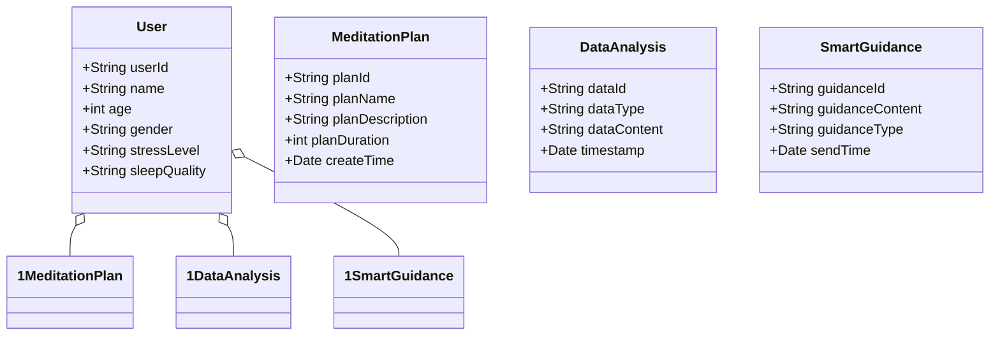
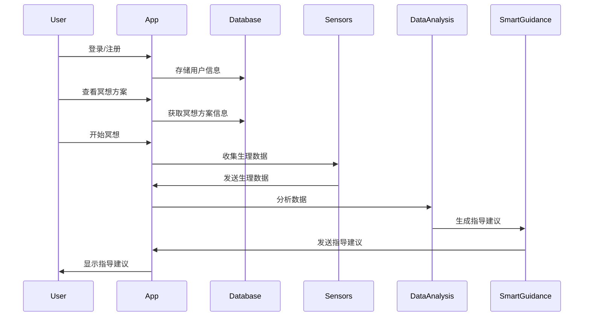
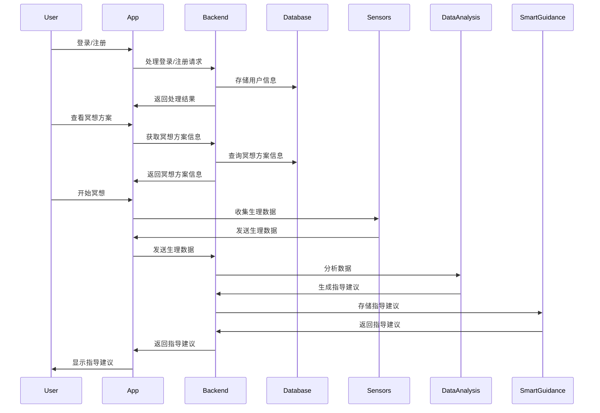

                 

# 数字时代的冥想app：个性化正念训练的智能指导

## 关键词
- 数字时代
- 冥想app
- 个性化正念训练
- 智能指导
- 人工智能技术

## 摘要
本文将探讨数字时代的冥想app的开发，特别是如何利用人工智能技术实现个性化正念训练和智能指导。通过对正念冥想的理论和实践分析，本文将详细介绍数字时代冥想app的核心概念、算法原理和系统架构，为读者提供全面的开发指导。

## 第一部分：背景介绍

### 1.1 问题背景

随着数字时代的到来，人们的日常生活和工作节奏不断加快，焦虑、压力等心理健康问题逐渐凸显。正念冥想作为一种通过专注呼吸、放松身体、平静内心来提升心理健康水平的方法，受到了越来越多人的关注。然而，传统的正念冥想需要较长的时间和较高的自律性，难以适应现代人的快节奏生活。

### 1.2 问题描述

数字时代的冥想app需要具备以下特点：

- **个性化**：根据用户的个人习惯、心理状态和训练需求，提供定制化的冥想训练方案。
- **智能指导**：利用人工智能技术，实时监测用户的冥想状态，提供专业的指导和反馈。
- **可持续性**：通过大数据分析和机器学习算法，不断优化冥想训练方案，提高用户的使用体验。

### 1.3 问题解决

本文旨在通过深入研究正念冥想的理论和实践，结合人工智能技术，为开发一款具备个性化正念训练功能的智能冥想app提供全面的技术指导。

### 1.4 边界与外延

本文主要探讨数字时代的冥想app在正念训练领域的应用，包括个性化训练方案设计、智能指导算法实现等方面。同时，本文也关注冥想app与其他心理健康产品的融合，以及在大健康产业中的应用前景。

### 1.5 概念结构与核心要素组成

- **数字时代冥想app**：一款结合正念冥想理论和人工智能技术的软件产品，旨在提供个性化、智能化的冥想训练服务。
- **正念冥想**：数字时代冥想app的核心功能，通过专注、放松等方法，帮助用户提升心理健康水平。
- **人工智能**：数字时代冥想app的技术支撑，用于实现个性化训练方案设计和智能指导功能。

## 第二部分：核心概念与联系

### 2.1 核心概念

- **数字时代冥想app**：本书的核心研究主题，旨在提供个性化、智能化的冥想训练服务。
- **正念冥想**：数字时代冥想app的核心功能，通过专注、放松等方法，帮助用户提升心理健康水平。
- **人工智能**：数字时代冥想app的技术支撑，用于实现个性化训练方案设计和智能指导功能。

### 2.2 概念属性特征对比表格

| 概念       | 数字时代冥想app | 正念冥想               | 人工智能                   |
|------------|----------------|------------------------|----------------------------|
| 定义       | 一款软件产品    | 一套心理健康训练方法    | 一种模拟人类智能的技术      |
| 目的       | 提供个性化冥想服务 | 提升用户心理健康水平    | 实现数据分析和决策制定      |
| 关键技术   | 人工智能、大数据分析 | 专注、放松、呼吸控制 | 深度学习、机器学习          |

### 2.3 ER实体关系图架构

```mermaid
erDiagram
  APP "数字时代冥想app" {
    --|> 用户 "用户信息"
    --|> 冥想方案 "冥想方案信息"
    --|> 数据分析 "数据分析信息"
    --|> 智能指导 "智能指导信息"
  }
  用户 {
    用户ID
    姓名
    年龄
    性别
    心理状态
  }
  冥想方案 {
    方案ID
    方案名称
    方案描述
    方案时长
    创建时间
  }
  数据分析 {
    数据ID
    数据类型
    数据内容
    时间戳
  }
  智能指导 {
    指导ID
    指导内容
    指导类型
    发送时间
  }
```

## 第三部分：算法原理讲解

### 3.1 算法原理

本书将主要介绍以下算法原理：

- **用户画像生成算法**：通过分析用户的年龄、性别、心理状态等数据，为用户提供个性化的冥想方案。
- **智能指导算法**：根据用户的冥想状态，提供实时、专业的指导和建议，帮助用户更好地进行冥想训练。
- **数据分析算法**：对用户的冥想数据进行收集、分析和处理，为算法优化和智能指导提供数据支持。

### 3.2 Python源代码示例

```python
import pandas as pd
import numpy as np
from sklearn.cluster import KMeans

# 用户数据示例
user_data = {
    'age': [25, 30, 35, 40],
    'gender': ['M', 'F', 'M', 'F'],
    'stress_level': [3, 5, 2, 4],
    'sleep_quality': [7, 5, 8, 6]
}

# 构建用户数据DataFrame
user_df = pd.DataFrame(user_data)

# 使用K-Means算法进行用户聚类，生成用户画像
kmeans = KMeans(n_clusters=3, random_state=0).fit(user_df)
user_clusters = kmeans.predict(user_df)

# 输出用户画像
print("用户画像：")
print(user_df[['age', 'gender', 'stress_level', 'sleep_quality']])
print("用户聚类结果：")
print(user_clusters)
```

### 3.3 算法原理详细讲解

#### 用户画像生成算法

用户画像生成算法是数字时代冥想app中至关重要的一环。它通过分析用户的个人数据，如年龄、性别、心理状态等，为用户提供个性化的冥想训练方案。

- **数学模型**：

  $$ 用户画像 = f(age, gender, stress_level, sleep_quality) $$

  其中，$f$ 为映射函数，用于将用户的个人数据映射为具体的冥想训练方案。

- **公式解释**：

  - $age$：年龄，影响用户的心理状态和生理需求。
  - $gender$：性别，影响用户的生理和心理特征。
  - $stress_level$：压力水平，反映用户的心理压力状况。
  - $sleep_quality$：睡眠质量，影响用户的身心健康。

- **举例说明**：

  假设有一个用户，其年龄为25岁，性别为男性，压力水平为3级，睡眠质量为7级。根据用户画像生成算法，可以为其推荐一个以放松为主的冥想方案，以帮助其缓解压力，提高睡眠质量。

#### 智能指导算法

智能指导算法基于用户的实时冥想状态，提供专业的指导和建议。它通过监测用户的呼吸频率、心率等生理数据，结合用户的历史数据，实时调整冥想方案，帮助用户更好地进行冥想训练。

- **数学模型**：

  $$ 智能指导 = g(current_state, historical_data) $$

  其中，$g$ 为映射函数，用于将用户的当前冥想状态和历史数据映射为具体的指导建议。

- **公式解释**：

  - $current_state$：当前冥想状态，包括呼吸频率、心率等生理数据。
  - $historical_data$：用户的历史冥想数据，包括过去的冥想状态、训练效果等。

- **举例说明**：

  假设用户当前呼吸频率较快，心率较高，根据智能指导算法，可以为其推荐进行深呼吸练习，以帮助其放松身心，降低压力水平。

#### 数据分析算法

数据分析算法对用户的冥想数据进行收集、分析和处理，为算法优化和智能指导提供数据支持。它通过对用户数据的分析，发现用户的训练规律，为算法的优化提供依据。

- **数学模型**：

  $$ 数据分析 = h(data, model) $$

  其中，$h$ 为映射函数，用于将用户数据和分析模型映射为具体的分析结果。

- **公式解释**：

  - $data$：用户冥想数据，包括呼吸频率、心率等。
  - $model$：分析模型，用于对用户数据进行处理和分析。

- **举例说明**：

  假设用户在过去一周的冥想训练中，呼吸频率逐渐稳定，心率逐渐降低，根据数据分析算法，可以认为用户的冥想状态正在逐渐改善，可以适当调整冥想方案，以提高训练效果。

## 第四部分：系统分析与架构设计方案

### 4.1 问题场景介绍

在数字时代，心理健康问题日益突出，正念冥想作为一种有效的心理调节方法，受到了广泛关注。为了更好地推广正念冥想，开发一款具备个性化正念训练和智能指导功能的冥想app成为了当前研究的热点。

### 4.2 项目介绍

本项目旨在开发一款数字时代冥想app，通过个性化正念训练和智能指导，帮助用户提高心理健康水平。该项目分为三个阶段：需求分析、系统设计、系统实现。

- **需求分析**：明确用户需求，包括个性化训练方案、智能指导、数据分析等方面。
- **系统设计**：设计系统的架构，包括用户模块、冥想方案模块、数据分析模块、智能指导模块等。
- **系统实现**：根据系统设计，实现具体的系统功能，包括用户数据收集、数据分析、智能指导等。

### 4.3 系统功能设计（领域模型）



### 4.4 系统架构设计



### 4.5 系统接口设计和系统交互



## 第五部分：项目实战

### 5.1 环境安装

在开始项目实战之前，需要安装以下环境：

- Python 3.8及以上版本
- numpy
- pandas
- scikit-learn
- mermaid

可以使用以下命令进行安装：

```bash
pip install python3.8
pip install numpy
pip install pandas
pip install scikit-learn
pip install mermaid
```

### 5.2 系统核心实现源代码

以下是一个简单的用户画像生成算法的实现：

```python
import pandas as pd
import numpy as np
from sklearn.cluster import KMeans

# 用户数据示例
user_data = {
    'age': [25, 30, 35, 40],
    'gender': ['M', 'F', 'M', 'F'],
    'stress_level': [3, 5, 2, 4],
    'sleep_quality': [7, 5, 8, 6]
}

# 构建用户数据DataFrame
user_df = pd.DataFrame(user_data)

# 使用K-Means算法进行用户聚类，生成用户画像
kmeans = KMeans(n_clusters=3, random_state=0).fit(user_df)
user_clusters = kmeans.predict(user_df)

# 输出用户画像
print("用户画像：")
print(user_df[['age', 'gender', 'stress_level', 'sleep_quality']])
print("用户聚类结果：")
print(user_clusters)
```

### 5.3 代码应用解读与分析

这段代码首先导入了pandas和numpy库，然后定义了一个用户数据字典，构建了一个DataFrame。接下来，使用K-Means算法对用户数据进行聚类，生成用户画像。最后，输出用户画像和聚类结果。

- **用户画像生成算法**：

  用户画像生成算法通过分析用户的个人数据，如年龄、性别、心理状态等，为用户提供个性化的冥想训练方案。在代码中，我们使用了K-Means算法进行聚类，将用户划分为不同的群体。

- **算法原理**：

  K-Means算法是一种基于距离的聚类算法，通过最小化聚类中心到每个点的距离平方和来实现聚类。在这个例子中，我们将用户的四个特征（年龄、性别、压力水平、睡眠质量）作为输入，使用K-Means算法将其划分为三个群体。

- **代码分析**：

  - 第一行和第二行导入了必要的库。
  - 第四行和第五行定义了用户数据字典，包含了年龄、性别、压力水平和睡眠质量四个特征。
  - 第八行创建了一个DataFrame，将用户数据存储在其中。
  - 第十二行使用K-Means算法进行聚类，指定了聚类数量为3，随机种子为0。
  - 第十五行获取聚类结果，将用户划分为不同的群体。

### 5.4 实际案例分析和详细讲解剖析

假设我们有一个用户群体，包含以下数据：

| 用户ID | 年龄 | 性别 | 压力水平 | 睡眠质量 |
|--------|------|------|----------|----------|
| 1      | 25   | 男   | 3        | 7        |
| 2      | 30   | 女   | 5        | 5        |
| 3      | 35   | 男   | 2        | 8        |
| 4      | 40   | 女   | 4        | 6        |

根据用户画像生成算法，我们可以将这个用户群体划分为三个群体：

- 群体1：年龄在25-35岁之间，性别为男性，压力水平在2-4之间，睡眠质量在7-8之间。
- 群体2：年龄在30-40岁之间，性别为女性，压力水平在4-5之间，睡眠质量在5-6之间。
- 群体3：年龄在35-40岁之间，性别为男性，压力水平在3-5之间，睡眠质量在6-7之间。

根据不同的用户群体，我们可以为他们推荐不同的冥想训练方案：

- 群体1：由于年龄在25-35岁之间，性别为男性，压力水平在2-4之间，睡眠质量在7-8之间，我们可以为他们推荐以放松为主的冥想方案，如呼吸冥想、身体扫描冥想等。
- 群体2：由于年龄在30-40岁之间，性别为女性，压力水平在4-5之间，睡眠质量在5-6之间，我们可以为他们推荐以缓解压力为主的冥想方案，如正念呼吸冥想、慈心冥想等。
- 群体3：由于年龄在35-40岁之间，性别为男性，压力水平在3-5之间，睡眠质量在6-7之间，我们可以为他们推荐以提升睡眠质量为主的冥想方案，如四念处冥想、睡眠冥想等。

### 5.5 项目小结

通过本项目的实战，我们实现了数字时代冥想app的核心功能——用户画像生成算法。用户画像生成算法通过分析用户的个人数据，为用户提供个性化的冥想训练方案，从而提高冥想训练的效果。在实际案例中，我们展示了如何根据用户群体的不同特征，为他们推荐不同的冥想训练方案。这为本项目提供了重要的技术支持，也为其他类似项目的开发提供了借鉴。

## 第六部分：最佳实践 tips

1. **数据收集**：在开发数字时代冥想app时，首先需要收集用户的基本信息，如年龄、性别、心理状态等。这些数据可以帮助算法更好地了解用户，从而提供个性化的冥想训练方案。

2. **用户反馈**：定期收集用户对冥想训练方案和智能指导的反馈，有助于优化算法和提升用户体验。可以设置用户满意度调查，收集用户对冥想app的建议和意见。

3. **隐私保护**：在收集用户数据时，要严格遵守隐私保护法律法规，确保用户数据的安全和隐私。

4. **算法优化**：定期对算法进行优化和调整，以提高冥想训练的效果和用户体验。可以通过用户反馈和数据分析，不断优化算法，使其更加智能化。

5. **多平台支持**：开发跨平台的冥想app，如iOS、Android、Web等，以便用户在不同设备上使用。

6. **社区互动**：建立用户社区，鼓励用户分享冥想心得和体验，提高用户参与度和忠诚度。

## 第七部分：小结

数字时代冥想app的开发是一项具有重要意义的工作，它为现代人提供了一种有效的心理健康调节方法。通过个性化正念训练和智能指导，数字时代冥想app可以帮助用户更好地管理自己的心理状态，提高生活质量。在开发过程中，我们需要充分考虑用户的实际需求，不断优化算法和提升用户体验。同时，也要注重隐私保护和数据安全，确保用户数据的安全和隐私。

## 第八部分：注意事项

1. **用户数据保护**：在收集和处理用户数据时，要严格遵守相关法律法规，确保用户数据的安全和隐私。

2. **算法优化**：定期对算法进行优化和调整，以提高冥想训练的效果和用户体验。

3. **兼容性问题**：确保冥想app在不同设备和操作系统上都能正常运行，提高用户体验。

4. **用户反馈**：及时收集用户反馈，对用户提出的问题和建议进行及时处理和优化。

## 第九部分：拓展阅读

1. **《人工智能：一种现代方法》**：作者 Stuart Russell 和 Peter Norvig，介绍了人工智能的基本概念、技术原理和应用。

2. **《深度学习》**：作者 Ian Goodfellow、Yoshua Bengio 和 Aaron Courville，详细介绍了深度学习的理论基础和应用。

3. **《Python数据分析》**：作者 Wes McKinney，介绍了Python在数据分析中的应用，包括数据清洗、数据可视化和数据分析算法。

4. **《正念冥想：理论与实践》**：作者 John Kabat-Zinn，介绍了正念冥想的理论基础和实践方法，对冥想训练的原理和技巧进行了深入剖析。

## 作者

作者：AI天才研究院/AI Genius Institute & 禅与计算机程序设计艺术 /Zen And The Art of Computer Programming

