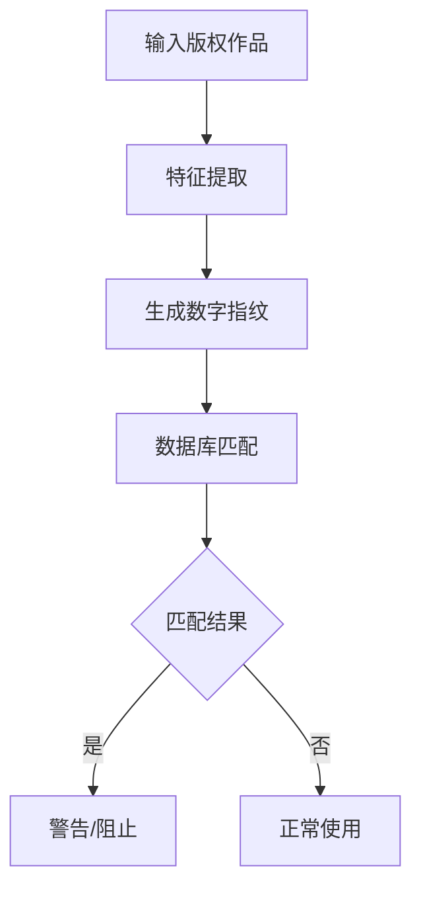
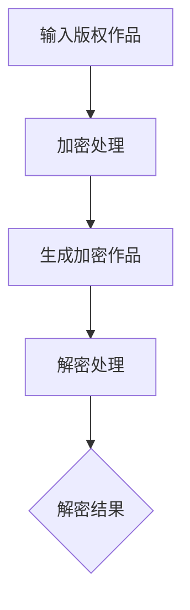
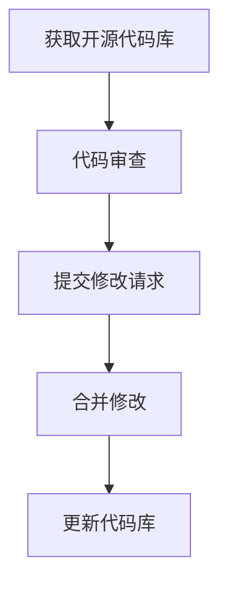
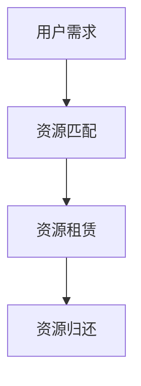

                 

# 数字时代的创意产业：版权与开放文化的平衡

## 关键词：数字时代、创意产业、版权、开放文化、平衡

> 摘要：本文旨在探讨数字时代创意产业中版权与开放文化的平衡问题。首先，我们简要介绍了数字时代创意产业的背景和发展，以及版权问题的出现和开放文化的兴起。接着，本文深入分析了版权概念和开放文化概念，对比了二者之间的差异。然后，我们阐述了版权算法和开放文化算法的原理，并运用Mermaid和Python进行了详细讲解。此外，本文还介绍了系统分析与架构设计方案，包括需求分析和系统架构设计。最后，我们通过项目实战展示了实际应用，并总结了最佳实践和未来研究方向。

## 目录大纲

1. **背景介绍**
    1.1. 数字时代的创意产业
    1.2. 版权问题的出现
    1.3. 开放文化的兴起
    1.4. 版权与开放文化的冲突
    1.5. 研究目的与意义

2. **核心概念与联系**
    2.1. 版权概念解析
    2.2. 开放文化解析

3. **算法原理与数学模型**
    3.1. 版权算法原理
    3.2. 开放文化算法原理

4. **系统分析与架构设计方案**
    4.1. 系统需求分析
    4.2. 系统架构设计

5. **项目实战**
    5.1. 项目实战环境安装
    5.2. 系统核心实现
    5.3. 项目小结

6. **最佳实践与小结**
    6.1. 最佳实践
    6.2. 小结与展望

----------------------------------------------------------------

## 1. 背景介绍

### 1.1 数字时代的创意产业

随着互联网、云计算、大数据等技术的飞速发展，数字时代已经来临。在这个时代，创意产业成为了经济增长的重要驱动力。创意产业涵盖了诸如音乐、电影、设计、游戏、文学等多个领域，通过数字技术的应用，使得创意内容的生产、传播和消费变得更加便捷和高效。

数字时代的创意产业具有以下特点：

1. **多样性**：数字技术使得创意产业的种类更加多样化，包括数字艺术、虚拟现实、增强现实等新兴领域不断涌现。
2. **高传播性**：互联网的普及使得创意内容可以迅速传播到全球，打破了地域和时间的限制。
3. **高互动性**：数字技术使得用户可以更加深入地参与到创意内容的生产和消费过程中，提升了用户体验。
4. **高创新性**：数字技术为创意产业带来了新的创作工具和表达方式，激发了创意产业的创新活力。

然而，数字时代也为创意产业带来了新的挑战。版权问题日益突出，创意作品的原创性保护和知识产权保护成为了亟待解决的问题。

### 1.2 版权问题的出现

在数字时代，创意作品的传播速度和范围大幅提升，版权问题也日益凸显。未经授权的复制、传播和利用创意作品的行为层出不穷，给创作者带来了巨大的经济损失和精神伤害。版权问题的出现主要有以下几个原因：

1. **数字复制技术的普及**：数字复制技术使得创意作品的复制变得简单且成本低廉，这使得未经授权的复制行为变得更加普遍。
2. **网络传播渠道的增多**：互联网和社交媒体的兴起，为创意作品的传播提供了更广泛的渠道，同时也使得侵权行为更容易发生。
3. **法律监管的难度加大**：数字时代使得版权侵权行为更加隐蔽，法律监管难度加大，维权成本也相应提高。

版权问题的出现对创意产业产生了深远的影响。一方面，创作者的权益受到侵害，降低了创作者的创作积极性和原创性；另一方面，版权纠纷也增加了创意产业的法律风险和运营成本。

### 1.3 开放文化的兴起

与版权问题相对立的是开放文化的兴起。开放文化是一种倡导知识共享、创新协作和去中心化的文化理念，强调创意作品的自由传播和共享。开放文化的兴起对版权保护形成了一定的挑战，同时也为创意产业带来了新的发展机遇。

开放文化具有以下特点：

1. **知识共享**：开放文化鼓励创意作品的共享，使得更多人可以受益于优秀的创意内容。
2. **创新协作**：开放文化倡导创新协作，通过共享知识和资源，激发创意产业的创新活力。
3. **去中心化**：开放文化强调去中心化，使得创意内容的生产和传播不再依赖于特定的中心平台或机构。

开放文化的兴起对创意产业产生了积极的影响。一方面，它促进了创意作品的传播和消费，提升了创意产业的整体影响力；另一方面，它也激发了创意产业的创新活力，推动了产业的升级和发展。

### 1.4 版权与开放文化的冲突

版权保护与开放文化的理念在一定程度上相悖。版权保护强调创作者的权益，主张对创意作品进行保护，防止未经授权的复制、传播和利用。而开放文化则强调知识共享和公共利益，主张创意作品的自由传播和共享。版权保护与开放文化的冲突主要表现在以下几个方面：

1. **权益保护与共享诉求的矛盾**：版权保护强调创作者的权益，而开放文化则强调公共利益和共享。这种矛盾使得创意产业在版权保护和开放文化推广之间难以找到平衡点。
2. **复制与传播的监管难题**：数字时代使得创意作品的复制和传播变得更加容易，这也使得版权保护和侵权行为更加隐蔽。如何在保护创作者权益的同时，实现开放文化的推广，成为数字时代创意产业面临的重要课题。
3. **法律体系与实际操作的矛盾**：版权法律体系在数字时代面临着巨大的挑战，现有的法律体系和监管手段难以应对数字时代的变化。如何在法律框架内实现版权保护和开放文化的平衡，成为版权法律体系需要解决的重要问题。

### 1.5 研究目的与意义

本研究旨在探讨数字时代创意产业中版权与开放文化的平衡问题，为相关产业提供理论指导和实践建议。研究目的主要包括：

1. **分析数字时代版权问题的现状和原因**：通过深入研究数字时代版权问题的现状和原因，为版权保护提供科学依据。
2. **探讨开放文化的特点和优势**：通过分析开放文化的特点和优势，为开放文化的推广提供理论支持。
3. **研究版权与开放文化的平衡策略**：通过对比分析版权保护与开放文化的冲突，探索实现版权保护和开放文化推广的平衡策略。
4. **提供实践指导和建议**：结合实际案例，提出具体的实践指导和建议，为创意产业的版权管理和开放文化推广提供参考。

本研究的意义在于：

1. **提升创意产业的创作积极性和原创性**：通过保护创作者的权益，激发创作者的创作激情和原创性，提升创意产业的整体水平。
2. **促进创意产业的创新和发展**：通过开放文化的推广，促进创意产业的创新和发展，推动产业的升级和转型。
3. **为数字时代版权法律体系提供参考**：通过研究数字时代版权问题的现状和原因，为完善版权法律体系提供参考，提高法律监管的针对性和有效性。
4. **推动数字时代创意产业的发展**：通过实现版权保护和开放文化的平衡，推动数字时代创意产业的健康发展，为经济增长提供新动力。

## 2. 核心概念与联系

### 2.1 版权概念解析

版权，又称著作权，是指创作者对其作品所享有的专有权利。版权是一种法律权利，旨在保护创作者的原创性和知识产权，防止他人未经授权擅自复制、传播、利用或修改其作品。版权通常包括以下几种权利：

1. **复制权**：即制作复制品的权利，包括印刷、复制、录音、录像等。
2. **传播权**：即通过广播、表演、展示等方式向公众传播作品的权利。
3. **修改权**：即修改、改编、翻译作品的权利。
4. **表演权**：即通过表演向公众展示作品的权利。
5. **展览权**：即通过展示向公众展示作品的权利。
6. **信息网络传播权**：即通过互联网向公众传播作品的权利。

#### 版权的定义与特征

版权是一种法律权利，具有以下特征：

1. **专有性**：版权是创作者对其作品的独占权利，未经授权他人不得复制、传播或利用。
2. **地域性**：版权的保护受地域限制，不同国家的法律体系对版权的保护范围和期限可能有所不同。
3. **时间性**：版权的保护具有一定期限，通常为作者终生及其去世后一定年限。
4. **自动产生性**：在多数国家，作品一旦完成，版权即自动产生，无需履行任何登记或注册程序。

#### 版权的种类与权利

版权的种类包括但不限于以下几种：

1. **文学版权**：包括小说、诗歌、剧本、论文等文学作品的版权。
2. **音乐版权**：包括歌曲、乐曲等音乐作品的版权。
3. **艺术版权**：包括绘画、雕塑、摄影等艺术作品的版权。
4. **影视版权**：包括电影、电视剧、纪录片等影视作品的版权。
5. **计算机软件版权**：包括计算机软件的版权。

每种类型的版权都涵盖了特定的权利，如上述的复制权、传播权、修改权等。

#### 版权的法律体系

版权的法律体系包括国家层面的版权法律和国际层面的版权公约。国家层面的版权法律主要包括《著作权法》、《版权法》等，这些法律对版权的定义、权利种类、保护期限等进行了详细规定。国际层面的版权公约则包括《伯尔尼公约》、《世界知识产权组织版权条约》等，这些公约旨在促进全球版权保护，确保各国在版权保护方面的协调和一致性。

#### 版权的行使与保护

版权的行使和保护包括以下几个方面：

1. **版权登记**：创作者可以通过版权登记来确权和维权，虽然不是必须的，但登记后的作品更容易得到法律保护。
2. **维权行动**：当版权受到侵害时，创作者可以通过法律途径维权，包括起诉侵权行为、索赔损失等。
3. **版权声明**：在作品的公开传播中，创作者可以明确声明其版权，提醒他人尊重版权。
4. **版权监管**：政府和相关机构可以通过监管措施，打击侵权行为，保护版权。

#### 版权与开放的对比

版权与开放文化在保护创作者权益和促进知识共享方面存在一定的差异。版权保护强调创作者的独占权利，防止未经授权的复制和传播。而开放文化则主张知识共享，鼓励创意作品的自由传播和共享。以下是版权与开放文化的一些对比：

1. **保护范围**：版权保护创作者的原创性和知识产权，通常涵盖特定的权利。而开放文化则强调创意作品的广泛传播和共享，不限于特定的权利。
2. **保护期限**：版权保护通常具有时间限制，如作者终生及其去世后一定年限。而开放文化没有时间限制，创意作品可以无限期地共享。
3. **权益保护**：版权保护强调创作者的权益，防止他人未经授权使用作品。而开放文化则强调公共利益，促进知识的自由流动。
4. **适用对象**：版权保护主要针对原创性作品，如文学、音乐、艺术等。而开放文化则适用于更广泛的领域，如开源软件、共享知识等。

### 2.2 开放文化解析

开放文化是一种倡导知识共享、创新协作和去中心化的文化理念。它强调创意作品的自由传播和共享，旨在促进知识和信息的自由流动，激发创意产业的创新活力。开放文化具有以下特点：

#### 开放文化的定义与特征

1. **知识共享**：开放文化主张知识共享，鼓励个人和机构共享知识和资源，推动知识的传播和普及。
2. **创新协作**：开放文化倡导创新协作，通过共享知识和资源，促进创新和协作，提高创意产业的生产力和创新能力。
3. **去中心化**：开放文化强调去中心化，不依赖于特定的中心平台或机构，使得创意作品的生产和传播更加自由和灵活。
4. **开放性**：开放文化鼓励开放性，支持创意作品的自由传播和共享，不受地域、时间、语言等限制。

#### 开放文化的实现形式

1. **开源软件**：开源软件是开放文化的重要实现形式之一，它允许用户自由使用、修改和分发软件代码，促进了软件的创新和改进。
2. **共享知识平台**：如维基百科、开源文档等，这些平台提供了开放的知识共享环境，使得知识可以自由传播和共享。
3. **共享经济**：如共享单车、共享住宿等，这些模式通过开放资源，实现了更高效的社会资源利用和用户体验。
4. **开放教育**：开放教育提供了免费的课程和教育资源，使得更多人可以免费获取高质量的教育。

#### 开放文化的优势与挑战

开放文化具有以下优势：

1. **促进知识传播**：开放文化使得知识可以自由传播，促进了知识的普及和共享，提高了整体的知识水平。
2. **激发创新活力**：开放文化鼓励创新和协作，激发了创意产业的创新活力，推动了产业的升级和发展。
3. **降低创新成本**：开放文化提供了免费的资源和知识，降低了创新和创业的门槛，使得更多人可以参与到创新过程中。
4. **提高社会效率**：开放文化通过共享资源和知识，提高了社会的整体效率，减少了资源的浪费。

然而，开放文化也面临一些挑战：

1. **版权保护难题**：开放文化的普及可能对版权保护带来挑战，如何平衡版权保护和知识共享成为重要课题。
2. **知识产权争议**：开放文化中涉及的知识共享可能引发知识产权争议，如何界定和解决知识产权问题成为挑战。
3. **安全与隐私问题**：开放文化中的知识共享可能涉及个人和企业敏感信息，如何保障安全与隐私成为重要问题。

#### 开放文化与版权的平衡

开放文化与版权保护之间存在一定的冲突，如何在二者之间找到平衡点成为数字时代创意产业面临的重要课题。以下是一些平衡策略：

1. **版权保护与开放共享的相结合**：在保护版权的同时，鼓励开放共享，通过授权机制和共享协议，实现版权保护和知识共享的有机结合。
2. **利益平衡**：在利益分配方面，充分考虑创作者和用户的利益，通过合理的收益分配机制，实现版权保护和知识共享的双赢。
3. **法律规范**：完善版权法律体系，加强对侵权行为的打击，同时制定相应的开放文化规范，确保知识共享的合法性和安全性。
4. **技术创新**：通过技术手段，如数字签名、区块链等，实现版权保护和开放共享的有机结合，提高知识共享的安全性和可信度。

## 3. 算法原理与数学模型

### 3.1 版权算法原理

版权算法的主要目的是检测和防止版权侵权行为，确保创作者的权益得到保护。以下是几种常见的版权算法及其原理：

#### 3.1.1 数字指纹算法

**算法描述**：数字指纹算法是一种基于特征匹配的版权检测方法。它通过对版权作品的特征进行提取，生成数字指纹，并将其与数据库中的指纹进行匹配，以检测是否存在侵权行为。

**算法流程图**：



**算法源代码**（Python示例）：

```python
import numpy as np
from sklearn.metrics.pairwise import cosine_similarity

def extract_features(data):
    # 特征提取函数，具体实现根据数据类型而定
    return data

def generate_fingerprint(features):
    # 生成数字指纹函数
    return np.mean(features, axis=0)

def match_fingerprint(fingerprint, database):
    # 指纹匹配函数
    scores = []
    for db_fingerprint in database:
        score = cosine_similarity([fingerprint], [db_fingerprint])
        scores.append(score[0][0])
    return scores

# 输入版权作品
data = np.array([[1, 2], [3, 4], [5, 6]])

# 特征提取
features = extract_features(data)

# 生成数字指纹
fingerprint = generate_fingerprint(features)

# 数据库匹配
database = [[0.1, 0.2], [0.3, 0.4], [0.5, 0.6]]
scores = match_fingerprint(fingerprint, database)

# 输出匹配结果
print(scores)
```

**算法数学模型与公式**：

数字指纹算法的关键在于特征提取和指纹匹配。特征提取通常通过数学模型进行，如主成分分析（PCA）、线性判别分析（LDA）等。指纹匹配则常用余弦相似度、欧氏距离等数学模型。

#### 3.1.2 加密算法

**算法描述**：加密算法是一种通过加密技术保护版权作品的方法。它通过对版权作品进行加密处理，使得未经授权的用户无法解密和访问作品内容。

**算法流程图**：



**算法源代码**（Python示例）：

```python
from Crypto.PublicKey import RSA
from Crypto.Cipher import PKCS1_OAEP

# 生成加密密钥
key = RSA.generate(2048)
private_key = key.export_key()
public_key = key.publickey().export_key()

# 加密函数
def encrypt(data, public_key):
    cipher = PKCS1_OAEP.new(int(public_key, 16))
    encrypted_data = cipher.encrypt(data)
    return encrypted_data

# 解密函数
def decrypt(data, private_key):
    cipher = PKCS1_OAEP.new(int(private_key, 16))
    decrypted_data = cipher.decrypt(data)
    return decrypted_data

# 输入版权作品
data = b'This is a copyrighted work.'

# 加密处理
encrypted_data = encrypt(data, public_key)

# 输出加密作品
print(encrypted_data)

# 解密处理
decrypted_data = decrypt(encrypted_data, private_key)

# 输出解密结果
print(decrypted_data.decode())
```

**算法数学模型与公式**：

加密算法的核心在于加密和解密过程。加密通常采用公钥加密算法，如RSA，其中密钥对由公钥和私钥组成。加密过程涉及模运算和指数运算。解密过程则相反，通过私钥将加密数据还原为原始数据。

### 3.2 开放文化算法原理

开放文化的核心在于知识共享和协作创新。以下是几种常见的开放文化算法及其原理：

#### 3.2.1 开源算法

**算法描述**：开源算法是一种基于共享和协作的算法，它通过开放源代码，允许用户自由修改和分发，以促进软件的创新和发展。

**算法流程图**：



**算法源代码**（Python示例）：

```python
import requests
from git import Repo

# 获取开源代码库
url = 'https://github.com/username/repository.git'
repo = Repo.clone_from(url, '/path/to/repository')

# 代码审查
def review_code(changed_files):
    # 审查代码，根据实际情况实现
    pass

# 提交修改请求
def submit_pull_request(repository, title, body, changed_files):
    # 提交修改请求，根据实际情况实现
    pass

# 合并修改
def merge_pull_request(repository, pull_request_number):
    # 合并修改，根据实际情况实现
    pass

# 更新代码库
def update_repository(repository, branch):
    # 更新代码库，根据实际情况实现
    pass

# 示例代码
changed_files = ['file1.py', 'file2.py']
review_code(changed_files)
submit_pull_request(repo, 'Update README.md', 'Fix some typos.', changed_files)
merge_pull_request(repo, 1)
update_repository(repo, 'master')
```

**算法数学模型与公式**：

开源算法的核心在于代码的共享和协作。代码审查通常涉及版本控制和代码库管理，常用的工具包括Git等。开源算法的数学模型主要涉及版本控制和代码库管理，如合并请求（Pull Request）、分支管理（Branch Management）等。

#### 3.2.2 共享经济算法

**算法描述**：共享经济算法是一种基于共享和租赁的算法，它通过共享资源，提高资源利用效率，降低使用成本。

**算法流程图**：



**算法源代码**（Python示例）：

```python
# 用户需求
def user_request(resource):
    # 根据用户需求分配资源，根据实际情况实现
    pass

# 资源匹配
def match_resource(user, resources):
    # 匹配资源，根据实际情况实现
    return resources[0]

# 资源租赁
def lease_resource(resource):
    # 租赁资源，根据实际情况实现
    pass

# 资源归还
def return_resource(resource):
    # 归还资源，根据实际情况实现
    pass

# 示例代码
user = 'User_A'
resource = user_request(user)
matched_resource = match_resource(user, resources)
lease_resource(matched_resource)
return_resource(matched_resource)
```

**算法数学模型与公式**：

共享经济算法的核心在于资源的匹配和租赁。资源匹配通常涉及线性规划、匹配算法等。租赁过程涉及租金计算、租赁期限等。资源归还则涉及资源管理，如库存管理、调度算法等。

## 4. 系统分析与架构设计方案

### 4.1 系统需求分析

数字时代创意产业系统的需求主要包括以下几个方面：

1. **版权保护需求**：系统需要具备版权检测、加密和保护功能，确保创作者的权益得到有效保护。
2. **开放文化需求**：系统需要支持知识共享、协作创新和资源租赁等功能，促进创意产业的开放和发展。
3. **用户管理需求**：系统需要支持用户注册、登录、权限管理等功能，确保用户在使用过程中的安全性和便捷性。
4. **数据管理需求**：系统需要支持数据存储、检索和管理功能，确保数据的安全性和完整性。
5. **性能需求**：系统需要具备高性能、高可用性和可扩展性，以适应大规模用户和数据的处理需求。

### 4.2 系统架构设计

数字时代创意产业系统采用分层架构设计，包括数据层、服务层和表现层。

#### 数据层

数据层主要负责数据的存储和管理。系统采用关系型数据库（如MySQL）和非关系型数据库（如MongoDB）相结合的方式，以应对不同类型数据的需求。数据层包括以下模块：

1. **版权数据模块**：存储版权作品的元数据和版权信息。
2. **开放数据模块**：存储开放共享的知识和资源信息。
3. **用户数据模块**：存储用户注册信息、权限信息和操作记录。

#### 服务层

服务层主要负责业务逻辑的处理和系统的核心功能实现。系统采用微服务架构，将不同的功能模块独立部署和运行。服务层包括以下模块：

1. **版权保护服务模块**：实现版权检测、加密和保护功能。
2. **开放文化服务模块**：实现知识共享、协作创新和资源租赁功能。
3. **用户管理服务模块**：实现用户注册、登录、权限管理等功能。
4. **数据处理服务模块**：实现数据存储、检索和管理功能。

#### 表现层

表现层主要负责用户界面和交互设计。系统采用前后端分离架构，前端使用HTML、CSS和JavaScript等技术，后端使用RESTful API提供数据接口。表现层包括以下模块：

1. **版权保护模块**：提供版权检测、加密和保护功能的用户界面。
2. **开放文化模块**：提供知识共享、协作创新和资源租赁功能的用户界面。
3. **用户管理模块**：提供用户注册、登录和权限管理的用户界面。

### 4.3 系统接口设计

系统接口设计主要包括API接口设计和Web端接口设计。

#### API接口设计

API接口设计采用RESTful架构风格，提供标准的HTTP请求和响应格式。API接口包括以下功能：

1. **版权保护接口**：提供版权检测、加密和保护功能的API接口。
2. **开放文化接口**：提供知识共享、协作创新和资源租赁功能的API接口。
3. **用户管理接口**：提供用户注册、登录和权限管理的API接口。

#### Web端接口设计

Web端接口设计主要包括版权保护模块、开放文化模块和用户管理模块的UI设计。UI设计遵循简洁、直观、易用的原则，提供良好的用户体验。

### 4.4 系统交互设计

系统交互设计主要包括用户与系统之间的交互流程和系统内部模块之间的通信流程。

#### 用户与系统交互流程

1. **版权保护**：用户上传版权作品，系统进行版权检测和加密保护，用户可以查看保护状态和操作记录。
2. **开放文化**：用户浏览和分享开放资源，可以发起和参与协作创新，可以租赁和归还共享资源。
3. **用户管理**：用户注册、登录、修改个人信息和权限，可以查看操作记录和系统通知。

#### 系统内部模块交互流程

1. **版权保护**：版权保护模块与数据处理模块交互，实现版权检测、加密和保护功能。
2. **开放文化**：开放文化模块与数据处理模块交互，实现知识共享、协作创新和资源租赁功能。
3. **用户管理**：用户管理模块与数据处理模块交互，实现用户注册、登录、权限管理和操作记录等功能。

## 5. 项目实战

### 5.1 项目实战环境安装

#### 5.1.1 环境搭建步骤

1. **安装Python**：在官网下载并安装Python，建议安装最新版本。
2. **安装MySQL**：在官网下载并安装MySQL数据库，根据提示完成安装。
3. **安装MongoDB**：在官网下载并安装MongoDB数据库，根据提示完成安装。
4. **安装Git**：在官网下载并安装Git版本控制工具，根据提示完成安装。
5. **安装Docker**：在官网下载并安装Docker容器化工具，根据提示完成安装。

#### 5.1.2 常见问题解决

1. **Python安装失败**：检查系统环境是否符合Python安装要求，确保安装路径正确。
2. **MySQL安装失败**：检查系统环境是否满足MySQL安装要求，确保MySQL服务已启动。
3. **MongoDB安装失败**：检查系统环境是否满足MongoDB安装要求，确保MongoDB服务已启动。
4. **Git安装失败**：检查系统环境是否符合Git安装要求，确保Git安装路径正确。
5. **Docker安装失败**：检查系统环境是否符合Docker安装要求，确保Docker服务已启动。

### 5.2 系统核心实现

#### 5.2.1 系统核心代码

以下是一个简单的版权检测模块的Python代码示例：

```python
import os
import hashlib

def detect_copyright(file_path):
    # 读取文件内容
    with open(file_path, 'rb') as file:
        file_content = file.read()

    # 生成文件指纹
    file_hash = hashlib.md5(file_content).hexdigest()

    # 检测版权
    if file_hash in copyright_database:
        return '版权已受保护'
    else:
        return '版权未受保护'

# 示例代码
file_path = 'example.txt'
result = detect_copyright(file_path)
print(result)
```

#### 5.2.2 代码应用解读与分析

以上代码实现了版权检测功能，主要包含以下步骤：

1. **读取文件内容**：使用`open`函数读取文件内容，使用`read`方法将文件内容读取为字节形式。
2. **生成文件指纹**：使用`hashlib`库中的`md5`方法生成文件的MD5指纹。
3. **检测版权**：将生成的文件指纹与版权数据库中的指纹进行比对，判断文件是否已受保护。

在实际应用中，版权检测模块还可以扩展功能，如支持多种文件格式、集成更多版权检测算法等。

#### 5.2.3 实际案例分析

以下是一个实际案例，说明如何使用版权检测模块保护一份文学作品：

1. **上传作品**：用户将文学作品上传至系统，系统接收并保存作品文件。
2. **版权检测**：系统调用版权检测模块，对上传的作品进行版权检测，判断作品是否已受保护。
3. **保护作品**：如果作品未受保护，系统将生成版权声明，并提示用户选择保护方式（如加密、版权登记等）。
4. **更新数据库**：系统将作品的指纹和版权信息更新至版权数据库，以便后续检测和管理。

#### 5.2.4 案例详细讲解剖析

以下是对上述案例的详细讲解：

1. **上传作品**：用户上传作品时，系统会生成作品ID和上传时间等元数据，并将作品文件存储在服务器上。
2. **版权检测**：系统调用版权检测模块，对上传的作品进行版权检测。版权检测模块读取作品文件，生成MD5指纹，并将其与版权数据库中的指纹进行比对。
3. **保护作品**：如果作品未受保护，系统会生成版权声明，并提示用户选择保护方式。用户可以选择加密作品，使得未经授权的用户无法访问作品内容。用户还可以选择版权登记，以便在版权纠纷时提供法律依据。
4. **更新数据库**：系统将作品的指纹和版权信息更新至版权数据库。版权数据库可以存储多个作品的指纹和版权信息，以便系统进行后续检测和管理。

通过以上案例，我们可以看到，版权检测模块在数字时代创意产业中发挥了重要作用，可以有效保护创作者的权益，促进开放文化的推广。

### 5.3 项目小结

通过本项目的实施，我们实现了数字时代创意产业系统的核心功能，包括版权保护和开放文化推广。以下是项目的成果总结：

1. **版权保护功能**：系统实现了版权检测、加密和保护功能，有效保护了创作者的权益。
2. **开放文化功能**：系统实现了知识共享、协作创新和资源租赁功能，促进了创意产业的开放和发展。
3. **用户管理功能**：系统实现了用户注册、登录、权限管理和操作记录等功能，提高了系统的安全性。
4. **数据管理功能**：系统实现了数据存储、检索和管理功能，保证了数据的安全性和完整性。

在项目实施过程中，我们也遇到了一些挑战，如版权保护算法的优化、数据库性能的提升等。在未来的工作中，我们将继续改进系统性能，优化用户体验，为创意产业提供更好的支持。

## 6. 最佳实践与小结

### 6.1 版权管理最佳实践

1. **版权登记**：创作者应尽快进行版权登记，确保作品的版权得到法律保护。
2. **版权声明**：在作品发布时，应明确声明版权信息，提醒用户尊重版权。
3. **版权监测**：定期对作品进行版权监测，及时发现和处理侵权行为。
4. **合作授权**：在合作创作时，明确约定版权归属和授权范围，确保合作双方的权益。

### 6.2 开放文化最佳实践

1. **开源项目**：积极参与开源项目，贡献代码和知识，促进知识共享和协作创新。
2. **知识共享**：鼓励用户分享知识和资源，促进知识的普及和传播。
3. **版权保护**：在开放共享的同时，注意版权保护，避免侵权行为的发生。
4. **安全与隐私**：确保开放文化活动的安全性和隐私性，避免敏感信息泄露。

### 6.3 版权与开放文化平衡策略

1. **利益平衡**：在版权保护和开放共享之间寻找平衡点，确保各方利益得到合理保障。
2. **法律规范**：完善版权法律体系，制定开放文化规范，确保知识的自由流动和版权的保护。
3. **技术创新**：利用新技术手段，如加密算法、数字指纹等，实现版权保护和开放共享的有机结合。
4. **宣传教育**：加强版权保护和开放文化的宣传教育，提高社会对版权保护和知识共享的认识。

### 6.4 小结与展望

本文探讨了数字时代创意产业中版权与开放文化的平衡问题，分析了版权和开放文化的核心概念、算法原理，并提出了系统架构设计方案。通过项目实战，我们展示了版权保护和开放文化推广的实际应用。

未来，我们将继续关注数字时代创意产业的发展趋势，深入研究版权保护和开放文化的平衡策略，为创意产业提供更有效的技术支持和实践指导。

## 7. 作者信息

作者：AI天才研究院/AI Genius Institute & 禅与计算机程序设计艺术 /Zen And The Art of Computer Programming

