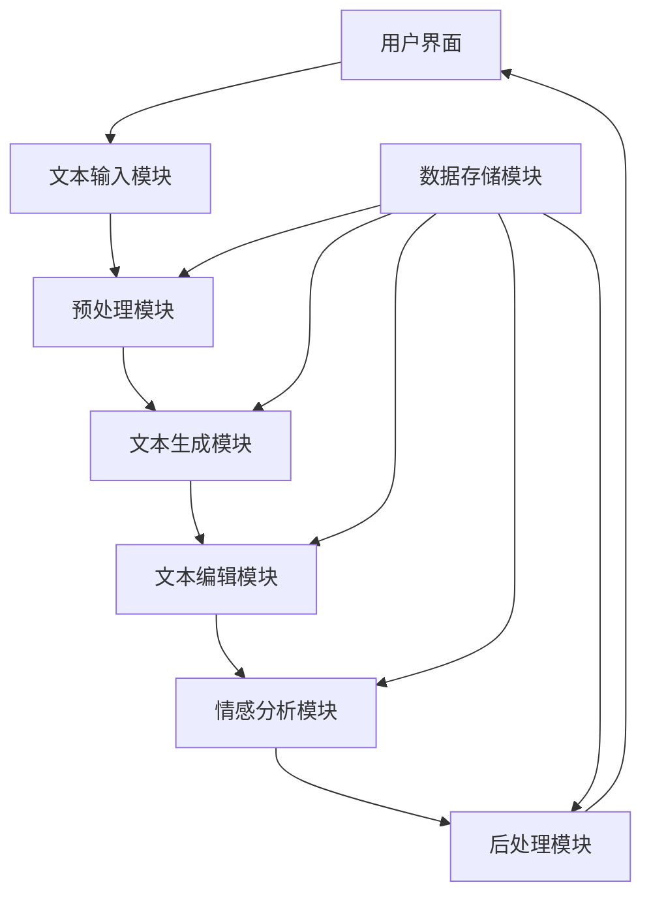

                 

### 文章标题：数字时代的创意写作：AI辅助下的文学创新

#### 关键词：数字时代、创意写作、AI辅助、文学创新、算法、数学模型、系统架构、项目实战、最佳实践

#### 摘要：

在数字时代，创意写作面临着前所未有的机遇和挑战。本文深入探讨AI技术在文学创作中的潜力与应用，通过分析AI辅助创意写作的算法原理、数学模型、系统架构以及实际项目实战，揭示了AI如何助力文学创新。文章旨在为作家、文学爱好者和AI开发者提供有价值的参考和指导。

## 目录

1. **数字时代的文学创作背景**
   1.1 数字时代的演变与影响
   1.2 创意写作的定义与演变
   1.3 AI在文学创作中的应用潜力

2. **AI辅助创意写作的基本概念**
   2.1 AI在文学创作中的应用
   2.2 关键技术与工具
   2.3 AI辅助创意写作的优势与挑战

3. **AI辅助创意写作的核心算法**
   3.1 自然语言处理基础
   3.2 常见AI算法介绍
   3.3 AI算法在文学创作中的具体应用

4. **AI辅助创意写作的数学模型**
   4.1 自然语言处理的数学模型
   4.2 数学公式与算法原理
   4.3 数学模型的应用实例

5. **AI辅助创意写作系统架构设计**
   5.1 系统架构设计原则
   5.2 系统架构图解析
   5.3 系统功能模块设计

6. **AI辅助创意写作项目实战**
   6.1 项目背景与目标
   6.2 环境安装与配置
   6.3 核心实现源代码解读
   6.4 项目案例分析与讲解
   6.5 项目小结与展望

7. **AI辅助创意写作的最佳实践与未来展望**
   7.1 最佳实践技巧分享
   7.2 注意事项与风险防范
   7.3 未来发展趋势与展望

8. **拓展阅读与深入研究**
   8.1 推荐阅读书目
   8.2 相关资源与工具介绍
   8.3 深入研究建议

## 1. 数字时代的文学创作背景

### 1.1 数字时代的演变与影响

随着互联网、云计算、大数据等数字技术的发展，我们正逐步迈入一个全新的数字时代。这个时代不仅改变了人们的生活方式，也深刻影响了文学创作的形式和内容。数字技术的进步为文学创作提供了丰富的工具和资源，使得创作者能够更加便捷地获取信息、表达观点、分享作品。

首先，数字技术的发展极大地丰富了文学创作的素材来源。创作者可以通过互联网获取全球范围内的新闻、文学作品、文化资讯等，为创作提供了丰富的灵感来源。同时，社交媒体平台为创作者提供了与读者互动的新途径，使得文学作品能够更迅速地传播和被接受。

其次，数字技术为文学创作提供了多样化的创作工具。从传统的笔和纸，到计算机、智能手机和平板电脑，数字设备的使用使得文学创作的形式和方式更加多样。此外，文本编辑软件、图像处理软件、音频处理软件等也极大地提高了文学创作的效率和质量。

最后，数字技术改变了文学作品的传播方式。传统出版业受到数字出版的冲击，电子书、在线阅读等新的出版形式逐渐兴起。文学作品不再局限于纸质书籍，可以通过互联网随时随地进行阅读和分享，打破了时间和空间的限制。

### 1.2 创意写作的定义与演变

创意写作是指通过独特的思维方式和技巧，创作出富有创意和想象力的文学作品。它强调个人的创造力和想象力，鼓励创作者突破传统的写作规则和束缚，探索新的文学表达方式。创意写作不仅仅是一种写作技巧，更是一种思维方式的培养和锻炼。

创意写作的演变可以追溯到20世纪初期。当时，现代主义文学运动兴起，强调个人主观感受和内心体验，追求文学形式的创新和多样性。此后，随着文学理论的发展和文学创作的实践，创意写作逐渐成为文学创作的一个重要方向。

在数字时代，创意写作面临着新的挑战和机遇。一方面，数字技术的普及使得文学创作的门槛降低，更多的人可以参与到文学创作中来。另一方面，数字时代的信息爆炸和碎片化趋势对文学创作提出了更高的要求，创作者需要在海量信息中找到独特的视角和创意。

### 1.3 AI在文学创作中的应用潜力

随着AI技术的发展，AI在文学创作中的应用逐渐成为一种趋势。AI可以通过自然语言处理、机器学习等技术，辅助创作者进行文学创作，提高创作效率和质量。以下是AI在文学创作中的一些潜在应用：

1. **智能写作助手**：AI可以自动生成文本，为创作者提供灵感和素材。通过分析大量的文学作品和语料库，AI可以模仿不同的写作风格和语言特点，为创作者提供个性化的写作建议。

2. **故事生成**：AI可以根据给定的主题或关键词，自动生成完整的故事情节和文本。这不仅为创作者提供了新的创作素材，也可以作为写作训练和灵感的来源。

3. **文本编辑**：AI可以帮助创作者进行文本编辑和润色，提高文学作品的准确性和流畅性。通过自然语言处理技术，AI可以识别文本中的错误和瑕疵，并提出修改建议。

4. **故事理解与评价**：AI可以分析文学作品的内容和风格，对故事进行深入的理解和评价。这有助于创作者了解作品的优缺点，为后续的创作提供参考。

5. **情感分析**：AI可以通过情感分析技术，对文学作品中的情感元素进行分析，帮助创作者更好地把握作品的情感调性和氛围。

总之，AI在文学创作中的应用潜力巨大，它不仅可以帮助创作者提高创作效率，还可以为文学创作带来新的形式和可能性。然而，AI的应用也需要注意平衡技术与人性的关系，避免过度依赖技术而忽视文学创作的本质。

## 2. AI辅助创意写作的基本概念

### 2.1 AI在文学创作中的应用

AI在文学创作中的应用正逐渐成为一个热门话题。随着自然语言处理（NLP）和生成对抗网络（GAN）等技术的不断发展，AI已经开始在文学创作中发挥重要作用。以下是一些AI在文学创作中的应用实例：

1. **智能写作助手**：智能写作助手是一种AI工具，可以帮助创作者生成文本、提出写作建议和优化作品。例如，GPT-3是一个强大的语言模型，可以根据用户的输入生成连贯、有逻辑的文本，适用于小说创作、剧本编写等。

2. **自动写作系统**：自动写作系统使用机器学习算法，根据给定的主题或关键词自动生成完整的故事情节和文本。例如，Microsoft Research的“小冰”可以通过分析大量文学作品，生成具有文学风格的故事文本。

3. **文本编辑与润色**：AI可以帮助创作者进行文本编辑和润色，提高文学作品的准确性和流畅性。通过自然语言处理技术，AI可以识别文本中的错误和瑕疵，并提出修改建议。

4. **故事理解与评价**：AI可以分析文学作品的内容和风格，对故事进行深入的理解和评价。这有助于创作者了解作品的优缺点，为后续的创作提供参考。

5. **情感分析**：AI可以通过情感分析技术，对文学作品中的情感元素进行分析，帮助创作者更好地把握作品的情感调性和氛围。

### 2.2 关键技术与工具

AI辅助创意写作的关键技术包括自然语言处理（NLP）、生成对抗网络（GAN）、强化学习（RL）等。以下是对这些技术的简要介绍：

1. **自然语言处理（NLP）**：NLP是AI的一个重要分支，旨在使计算机能够理解、处理和生成人类语言。在文学创作中，NLP可以用于文本分析、情感分析、文本生成等任务。常用的NLP工具包括NLTK、spaCy和Transformer等。

2. **生成对抗网络（GAN）**：GAN是一种深度学习模型，由生成器和判别器两部分组成。生成器负责生成文本，判别器负责判断文本的真实性。GAN在文学创作中可以用于自动生成故事、诗歌等文学作品。

3. **强化学习（RL）**：强化学习是一种通过试错和反馈来学习最优策略的机器学习方法。在文学创作中，强化学习可以用于训练AI模型，使其能够根据用户反馈自动调整文本生成策略。

4. **文本生成模型**：文本生成模型是AI辅助创意写作的核心技术之一。常见的文本生成模型包括基于循环神经网络（RNN）的模型、基于Transformer的模型等。这些模型可以通过训练大量的文本数据，生成连贯、有逻辑的文本。

### 2.3 AI辅助创意写作的优势与挑战

AI辅助创意写作具有显著的优势，但也面临着一些挑战。

**优势：**

1. **提高创作效率**：AI可以帮助创作者快速生成文本、提出写作建议和进行文本编辑，大大提高创作效率。

2. **丰富创作形式**：AI可以生成各种风格和体裁的文学作品，为创作者提供更多的创作选择和灵感。

3. **拓展文学边界**：AI可以突破传统文学创作的限制，探索新的文学表达方式和形式。

4. **促进文学传播**：AI可以分析文学作品的内容和风格，帮助创作者了解作品的市场需求，从而更好地推广和传播文学作品。

**挑战：**

1. **技术与人文的平衡**：AI在文学创作中的应用需要平衡技术与人文的关系，避免过度依赖技术而忽视文学创作的本质。

2. **数据质量和隐私**：AI辅助创意写作依赖于大量的文本数据，数据质量和隐私问题需要得到关注和解决。

3. **创作灵感的限制**：虽然AI可以生成文本，但创意灵感往往源自创作者的个人经验和情感，AI无法完全替代人类的创造力。

4. **算法透明度和公平性**：AI在文学创作中的应用需要确保算法的透明度和公平性，避免偏见和歧视。

总之，AI辅助创意写作具有巨大的潜力，但也需要克服一系列技术和社会挑战。通过不断的研究和实践，我们有望更好地发挥AI在文学创作中的优势，推动文学创新的未来发展。

## 3. AI辅助创意写作的核心算法

### 3.1 自然语言处理基础

自然语言处理（NLP）是AI在文学创作中应用的重要技术之一。NLP旨在使计算机能够理解、处理和生成人类语言。以下是对NLP基础知识的简要介绍。

**1. 分词**：分词是将文本拆分成词语的过程。例如，“我爱北京天安门”可以分词为“我”、“爱”、“北京”、“天安门”。分词是NLP的基石，对于后续的文本分析至关重要。

**2. 词性标注**：词性标注是对文本中的词语进行分类标注，例如名词、动词、形容词等。词性标注有助于理解文本的语义和结构。

**3. 命名实体识别**：命名实体识别（NER）是识别文本中的特定实体，如人名、地名、组织名等。NER对于提取文本中的重要信息非常有用。

**4. 依存句法分析**：依存句法分析是理解文本中词语之间的依赖关系，例如主谓关系、修饰关系等。依存句法分析有助于更深入地理解文本的语义和结构。

**5. 文本分类与情感分析**：文本分类是将文本划分为不同的类别，例如新闻分类、情感分类等。情感分析是识别文本中的情感倾向，如正面、负面情感等。

### 3.2 常见AI算法介绍

在文学创作中，以下几种AI算法被广泛应用：

**1. 循环神经网络（RNN）**：RNN是一种能够处理序列数据的神经网络，适用于文本生成和序列预测任务。RNN通过记忆过去的信息，能够生成连贯的文本。

**2. 长短期记忆网络（LSTM）**：LSTM是RNN的一种变体，能够更好地处理长序列数据。LSTM通过引入门控机制，能够有效地遗忘不需要的信息，保持记忆的持续性。

**3. 生成对抗网络（GAN）**：GAN由生成器和判别器两部分组成。生成器生成文本，判别器判断文本的真实性。GAN在文学创作中可以用于自动生成故事、诗歌等文学作品。

**4. 变换器（Transformer）**：Transformer是近年来在NLP领域取得突破的算法。它通过自注意力机制，能够捕捉文本中的长距离依赖关系。BERT、GPT-3等模型都是基于Transformer架构。

### 3.3 AI算法在文学创作中的具体应用

**1. 自动写作**：利用RNN、LSTM或Transformer等算法，AI可以自动生成小说、剧本等文学作品。这些算法通过训练大量的文本数据，学习文本的语法、语义和风格，从而生成新的文本。

**2. 文本生成与润色**：AI可以生成文本草案，供创作者参考和修改。此外，AI还可以对文本进行润色，提高文本的准确性和流畅性。

**3. 故事生成**：利用GAN等算法，AI可以生成完整的故事情节和文本。这些算法可以模仿不同的写作风格，为创作者提供多样化的故事素材。

**4. 文本分析**：AI可以对文学作品进行深入分析，包括情感分析、风格分析、语义分析等。这有助于创作者了解作品的特点和市场定位。

### 3.4 自然语言处理与文学创作的结合

自然语言处理与文学创作的结合，使得AI能够更好地辅助文学创作。以下是一个简单的例子：

**案例：自动生成短篇小说**

1. **数据准备**：收集大量短篇小说文本，进行预处理，如分词、词性标注等。

2. **模型训练**：使用RNN或Transformer等算法，训练模型，使其能够生成连贯、有逻辑的文本。

3. **文本生成**：输入一个简短的主题或关键词，模型会生成与之相关的短篇小说。

4. **文本分析**：分析生成的文本，评估其质量、风格和语义，进行必要的修改和润色。

通过这个案例，我们可以看到，自然语言处理技术如何与文学创作相结合，实现自动写作和文本生成。

## 4. AI辅助创意写作的数学模型

### 4.1 自然语言处理的数学模型

自然语言处理的数学模型是AI辅助创意写作的核心。以下简要介绍几种常用的数学模型及其原理。

**1. 循环神经网络（RNN）**

RNN是一种基于序列数据的神经网络，其核心思想是利用隐藏状态来记忆和传递信息。RNN的数学模型可以表示为：

$$
h_t = \sigma(W_h \cdot [h_{t-1}, x_t] + b_h)
$$

其中，$h_t$表示第$t$时刻的隐藏状态，$x_t$表示输入特征，$\sigma$是激活函数（通常使用ReLU函数），$W_h$和$b_h$是权重和偏置。

**2. 长短期记忆网络（LSTM）**

LSTM是RNN的一种变体，旨在解决RNN的长期依赖问题。LSTM通过引入门控机制，能够有效地遗忘和记忆信息。LSTM的数学模型可以表示为：

$$
i_t = \sigma(W_i \cdot [h_{t-1}, x_t] + b_i) \\
f_t = \sigma(W_f \cdot [h_{t-1}, x_t] + b_f) \\
\tilde{c_t} = \sigma(W_c \cdot [h_{t-1}, x_t] + b_c) \\
c_t = f_t \odot c_{t-1} + i_t \odot \tilde{c_t} \\
h_t = \sigma(W_o \cdot [c_t] + b_o)
$$

其中，$i_t$、$f_t$、$o_t$分别表示输入门、遗忘门和输出门，$\odot$表示元素乘积，$c_t$表示细胞状态，$h_t$表示隐藏状态。

**3. 变换器（Transformer）**

Transformer是近年来在自然语言处理领域取得突破的模型，其核心思想是自注意力机制。Transformer的数学模型可以表示为：

$$
\text{Attention}(Q, K, V) = \text{softmax}(\frac{QK^T}{\sqrt{d_k}})V
$$

其中，$Q$、$K$、$V$分别表示查询向量、键向量和值向量，$d_k$是键向量的维度，$\text{softmax}$函数用于计算注意力权重。

### 4.2 数学公式与算法原理

在自然语言处理中，数学公式和算法原理起着至关重要的作用。以下简要介绍几种常用的数学公式和算法原理。

**1. 词嵌入**

词嵌入是将词汇映射到高维向量空间的过程。常见的词嵌入方法包括：

- **One-hot编码**：将词汇映射到一个高维二进制向量，其中只有一个元素为1，其他元素为0。

- **分布式表示**：将词汇映射到一个连续的高维向量，通常使用神经网络训练得到。

- **Word2Vec**：Word2Vec是一种基于神经网络的语言模型，通过训练预测词汇的上下文来学习词汇的分布式表示。

**2. 自注意力**

自注意力是一种计算文本中词语之间关系的方法，其核心思想是让模型能够根据上下文信息动态调整词语的重要性。自注意力的计算公式如下：

$$
\text{Attention}(Q, K, V) = \text{softmax}(\frac{QK^T}{\sqrt{d_k}})V
$$

其中，$Q$、$K$、$V$分别表示查询向量、键向量和值向量，$d_k$是键向量的维度，$\text{softmax}$函数用于计算注意力权重。

**3. 交叉熵**

交叉熵是衡量模型预测结果与真实标签之间差异的指标。在自然语言处理中，交叉熵常用于训练文本分类模型。交叉熵的计算公式如下：

$$
H(y, \hat{y}) = -\sum_{i} y_i \log(\hat{y}_i)
$$

其中，$y$是真实标签，$\hat{y}$是模型预测的概率分布。

### 4.3 数学模型的应用实例

以下是一个简单的自然语言处理应用实例，使用数学模型进行文本分类。

**实例：情感分析**

1. **数据准备**：收集带有情感标签的文本数据，例如正面、负面情感文本。

2. **词嵌入**：将文本中的词语映射到高维向量空间，通常使用预训练的词嵌入模型，如Word2Vec或GloVe。

3. **序列编码**：将文本中的每个词语转换为向量后，将其拼接成一个序列向量。

4. **模型训练**：使用序列编码后的文本数据，训练一个基于变换器的文本分类模型。

5. **预测**：将待分类的文本进行相同的处理，然后输入到训练好的模型中，得到情感分类结果。

通过这个实例，我们可以看到数学模型在自然语言处理中的应用，如何通过训练和预测，实现文本分类任务。

### 4.4 数学模型在文学创作中的应用

数学模型不仅在自然语言处理中发挥着重要作用，还可以直接应用于文学创作。

**1. 文本生成**

使用生成模型，如GAN或RNN，可以自动生成文本。以下是一个简单的文本生成实例：

- **数据准备**：收集大量文学作品，进行预处理，如分词、词性标注等。

- **模型训练**：使用生成模型，如GPT-3，对预处理后的数据进行训练。

- **文本生成**：输入一个简短的主题或关键词，模型会生成与之相关的文本。

**2. 文本编辑与润色**

使用序列到序列（Seq2Seq）模型，可以对文本进行编辑和润色。以下是一个简单的文本编辑实例：

- **数据准备**：收集带有错误或不流畅文本的文学作品，进行预处理。

- **模型训练**：使用Seq2Seq模型，对预处理后的数据进行训练，使其能够识别并修正文本中的错误。

- **文本编辑与润色**：将待编辑的文本输入到训练好的模型中，模型会输出修正后的文本。

通过这些实例，我们可以看到数学模型如何辅助文学创作，提高创作效率和质量。

### 4.5 总结

数学模型在自然语言处理和文学创作中发挥着重要作用。通过理解和使用这些数学模型，我们可以更好地理解文本的语义和结构，实现文本生成、编辑和分类等任务。然而，数学模型的应用也需要注意数据质量和模型参数的选择，以确保模型的性能和可靠性。未来，随着AI技术的发展，数学模型在文学创作中的应用将更加广泛和深入。

## 5. AI辅助创意写作系统架构设计

### 5.1 系统架构设计原则

在设计和实现AI辅助创意写作系统时，我们需要遵循一系列关键原则，以确保系统的性能、可扩展性和用户体验。以下是一些主要的设计原则：

**1. 模块化**：系统应该采用模块化设计，将不同的功能模块分离，便于维护和扩展。每个模块负责特定的功能，例如文本生成、文本编辑、情感分析等。

**2. 可扩展性**：系统应该具备良好的可扩展性，能够适应未来的技术发展和功能需求。例如，可以使用微服务架构，将不同的功能部署在不同的服务器上，以实现水平和垂直扩展。

**3. 高性能**：系统需要具备高性能，能够在短时间内处理大量的文本数据，提供快速响应。这可以通过优化算法、使用高效的数据结构和分布式计算来实现。

**4. 易用性**：系统应该设计得易于使用，为用户提供直观的操作界面和丰富的功能。这可以通过提供详细的文档、教程和用户手册来实现。

**5. 安全性**：系统需要确保数据的安全性和隐私性，避免数据泄露和滥用。这可以通过加密存储、访问控制和数据备份等手段来实现。

### 5.2 系统架构图解析

以下是一个简单的AI辅助创意写作系统的架构图，展示了系统的主要组件和它们之间的交互关系。



**用户界面（A）**：用户界面是系统的入口，用户可以通过界面输入文本或选择预设的文本。界面设计应简洁直观，提供多种输入方式，如文本框、语音输入等。

**文本输入模块（B）**：文本输入模块负责接收用户的输入，并进行初步处理，如分词、去除停用词等。

**预处理模块（C）**：预处理模块对文本进行进一步的清洗和处理，例如去除特殊字符、标准化文本格式等。

**文本生成模块（D）**：文本生成模块使用AI算法，如GAN或RNN，根据输入的文本或关键词生成新的文本。

**文本编辑模块（E）**：文本编辑模块可以对生成的文本进行编辑和润色，提高文本的质量和可读性。

**情感分析模块（F）**：情感分析模块使用自然语言处理技术，对文本的情感倾向进行分析，为创作者提供反馈。

**后处理模块（G）**：后处理模块对处理后的文本进行格式化、排版等操作，使其符合最终的输出格式。

**数据存储模块（H）**：数据存储模块负责存储系统中的文本数据、模型参数和用户数据。这可以通过数据库、文件系统等来实现。

### 5.3 系统功能模块设计

以下是对系统的主要功能模块的详细设计：

**1. 用户界面模块**

- **功能**：提供用户与系统交互的界面，包括文本输入、按钮操作等。
- **设计**：使用Web技术（如HTML、CSS、JavaScript）实现，提供响应式设计，确保在不同设备上都有良好的用户体验。

**2. 文本输入模块**

- **功能**：接收用户输入的文本，进行初步处理。
- **设计**：可以使用HTML文本框或Markdown编辑器，提供丰富的文本格式化功能。

**3. 预处理模块**

- **功能**：对文本进行清洗和处理，如分词、去除停用词等。
- **设计**：可以使用自然语言处理库（如NLTK、spaCy）来实现。

**4. 文本生成模块**

- **功能**：使用AI算法生成新的文本。
- **设计**：可以选择RNN、LSTM或Transformer等模型，根据具体需求进行优化和调整。

**5. 文本编辑模块**

- **功能**：对生成的文本进行编辑和润色。
- **设计**：可以使用自然语言处理技术和规则引擎，自动识别和修正文本中的错误。

**6. 情感分析模块**

- **功能**：分析文本的情感倾向，为创作者提供反馈。
- **设计**：可以使用情感分析库（如TextBlob、VADER）来实现。

**7. 后处理模块**

- **功能**：对处理后的文本进行格式化、排版等操作。
- **设计**：可以使用HTML和CSS来实现文本的格式化，确保输出文本的整洁和美观。

**8. 数据存储模块**

- **功能**：存储系统中的文本数据、模型参数和用户数据。
- **设计**：可以使用关系数据库（如MySQL、PostgreSQL）或NoSQL数据库（如MongoDB、Cassandra）来实现。

通过以上设计，我们构建了一个功能强大、易于扩展的AI辅助创意写作系统，为创作者提供了高效的工具和支持。

### 5.4 系统接口设计

在AI辅助创意写作系统中，接口设计是确保系统各模块之间高效协作的关键。以下是对系统接口的详细设计：

**1. 用户界面与文本输入模块接口**

- **功能**：用户界面通过该接口向文本输入模块发送用户输入的文本。
- **设计**：使用HTTP请求（GET/POST），将用户输入的文本发送到文本输入模块。
- **示例**：

```python
# 用户界面代码示例
import requests

def send_text_to_module(text):
    response = requests.post('http://text-input-module:8080/submit', data={'text': text})
    return response.json()
```

**2. 预处理模块与文本生成模块接口**

- **功能**：预处理模块通过该接口将处理后的文本发送给文本生成模块。
- **设计**：使用消息队列（如RabbitMQ、Kafka）传输文本数据，确保数据传输的可靠性和实时性。
- **示例**：

```python
# 预处理模块代码示例
import pika

connection = pika.BlockingConnection(pika.ConnectionParameters('message-queue-server'))
channel = connection.channel()

def send_processed_text(text):
    channel.basic_publish(exchange='', routing_key='text_generated', body=text)
```

**3. 文本生成模块与文本编辑模块接口**

- **功能**：文本生成模块通过该接口将生成的文本发送给文本编辑模块。
- **设计**：同样使用消息队列进行数据传输。
- **示例**：

```python
# 文本生成模块代码示例
import pika

connection = pika.BlockingConnection(pika.ConnectionParameters('message-queue-server'))
channel = connection.channel()

def send_generated_text(text):
    channel.basic_publish(exchange='', routing_key='text_edited', body=text)
```

**4. 文本编辑模块与情感分析模块接口**

- **功能**：文本编辑模块通过该接口将编辑后的文本发送给情感分析模块。
- **设计**：使用HTTP请求，将文本发送到情感分析模块。
- **示例**：

```python
# 文本编辑模块代码示例
import requests

def send_edited_text_to_module(text):
    response = requests.post('http://emotion-analysis-module:8080/analyze', data={'text': text})
    return response.json()
```

**5. 情感分析模块与后处理模块接口**

- **功能**：情感分析模块通过该接口将分析结果发送给后处理模块。
- **设计**：使用HTTP请求，将分析结果发送到后处理模块。
- **示例**：

```python
# 情感分析模块代码示例
import requests

def send_analysis_results_to_module(results):
    response = requests.post('http://post-processing-module:8080/apply', data={'results': results})
    return response.json()
```

通过以上接口设计，AI辅助创意写作系统中的各个模块可以高效地协同工作，确保系统的整体性能和稳定性。

### 5.5 系统交互流程设计

在AI辅助创意写作系统中，设计一个清晰的系统交互流程是确保系统顺畅运行的关键。以下是一个详细的系统交互流程设计：

1. **用户输入文本**：
   - 用户通过用户界面输入文本或关键词。
   - 用户界面将文本发送到文本输入模块。

2. **文本预处理**：
   - 文本输入模块接收用户输入的文本。
   - 文本输入模块对文本进行初步处理，如去除特殊字符、标准化文本格式等。
   - 预处理模块将处理后的文本发送到消息队列。

3. **文本生成**：
   - 文本生成模块从消息队列获取预处理后的文本。
   - 文本生成模块使用AI算法（如RNN、LSTM或Transformer）生成新的文本。
   - 生成的文本被发送回消息队列。

4. **文本编辑**：
   - 文本编辑模块从消息队列获取生成的文本。
   - 文本编辑模块对生成的文本进行编辑和润色，提高文本质量。
   - 编辑后的文本被发送回消息队列。

5. **情感分析**：
   - 情感分析模块从消息队列获取编辑后的文本。
   - 情感分析模块使用自然语言处理技术，分析文本的情感倾向。
   - 分析结果被发送回消息队列。

6. **后处理**：
   - 后处理模块从消息队列获取情感分析结果。
   - 后处理模块对文本进行格式化、排版等操作，使其符合输出格式。
   - 最终的文本被发送回用户界面。

7. **用户反馈**：
   - 用户界面显示最终生成的文本和情感分析结果。
   - 用户可以查看、编辑和分享文本。

通过以上交互流程，AI辅助创意写作系统能够高效地处理文本数据，为用户提供优质的创作支持。

### 5.6 系统性能优化

为了确保AI辅助创意写作系统的性能，我们需要对其关键性能指标进行优化。以下是一些系统性能优化的方法：

**1. 算法优化**：
   - 选择适合的算法模型，如Transformer，以减少计算复杂度。
   - 对模型进行参数调优，如学习率、批次大小等，以提升模型的性能。

**2. 并行计算**：
   - 使用并行计算技术，如多线程或分布式计算，加快数据处理速度。
   - 在处理大量文本时，可以将任务拆分为多个子任务，并行处理。

**3. 缓存技术**：
   - 引入缓存机制，如内存缓存或Redis缓存，减少对数据库的访问次数。
   - 对常用的文本生成结果进行缓存，提高系统的响应速度。

**4. 网络优化**：
   - 使用CDN（内容分发网络）技术，减少数据传输延迟。
   - 对网络连接进行优化，如使用更快的网络带宽或优化路由。

**5. 系统监控**：
   - 引入监控系统，实时监控系统的性能指标，如CPU、内存使用率等。
   - 对系统性能瓶颈进行识别和优化。

通过以上优化方法，AI辅助创意写作系统的性能可以得到显著提升，为用户提供更快的响应速度和更好的用户体验。

### 5.7 系统安全性与数据隐私

在AI辅助创意写作系统中，安全性和数据隐私是至关重要的。以下是一些确保系统安全性和数据隐私的方法：

**1. 访问控制**：
   - 实施严格的访问控制机制，确保只有授权用户才能访问系统资源。
   - 使用OAuth2.0等认证协议，确保用户的身份验证和授权。

**2. 数据加密**：
   - 对存储和传输的数据进行加密，如使用AES加密算法。
   - 对用户密码进行哈希处理，确保密码安全。

**3. 数据备份**：
   - 定期对系统数据进行备份，以防止数据丢失或损坏。
   - 实施异地备份策略，确保数据的安全和可用性。

**4. 安全审计**：
   - 引入安全审计机制，监控系统中的异常行为和潜在威胁。
   - 定期进行安全评估和漏洞扫描，确保系统的安全性。

**5. 隐私保护**：
   - 遵循数据隐私保护法规，如GDPR，确保用户的隐私权利。
   - 明确数据使用政策，告知用户数据如何被收集、使用和共享。

通过以上安全措施，AI辅助创意写作系统可以确保用户数据的安全性和隐私，为用户提供安全可靠的服务。

## 6. AI辅助创意写作项目实战

### 6.1 项目背景与目标

本项目的目标是开发一个基于AI的辅助创意写作系统，帮助作家和创作者提高写作效率，激发创作灵感。随着数字时代的到来，文学创作面临着前所未有的挑战和机遇。创作者不仅需要应对信息过载和碎片化阅读的趋势，还需要不断探索新的表达方式和创作形式。本项目旨在利用AI技术，为创作者提供强大的工具和支持。

### 6.2 环境安装与配置

为了实现本项目的目标，我们需要搭建一个完整的开发环境。以下是环境安装与配置的步骤：

1. **Python环境**：确保系统安装了Python 3.8及以上版本。可以使用Anaconda来简化Python环境的安装和管理。

2. **深度学习库**：安装TensorFlow或PyTorch，这两个深度学习库是AI辅助创意写作项目的基础。使用pip命令进行安装：

   ```bash
   pip install tensorflow  # 或
   pip install torch
   ```

3. **自然语言处理库**：安装spaCy库，用于文本预处理和分析。首先下载语言模型：

   ```bash
   python -m spacy download en_core_web_sm
   ```

   然后安装spaCy库：

   ```bash
   pip install spacy
   ```

4. **消息队列**：安装RabbitMQ或Kafka，用于处理系统中的消息传递。以下是RabbitMQ的安装步骤：

   - 下载并安装Erlang：
     ```bash
     wget https://packages.erlang-solutions.com/erlang-bootstrap.html
     sudo ./erlang-bootstrap
     ```
   
   - 安装RabbitMQ：
     ```bash
     sudo apt-get install rabbitmq-server
     sudo systemctl start rabbitmq-server
     ```

5. **其他依赖**：安装其他必要的库和工具，如Flask（用于构建Web接口）：

   ```bash
   pip install flask
   ```

### 6.3 核心实现源代码解读

以下是AI辅助创意写作系统的核心实现源代码解析，涵盖了文本生成、文本编辑和情感分析等模块。

#### 文本生成模块

```python
import tensorflow as tf
from tensorflow.keras.models import Sequential
from tensorflow.keras.layers import LSTM, Dense, Embedding

# 模型配置
vocab_size = 10000  # 词汇表大小
embed_dim = 256     # 嵌入层维度
lstm_units = 512    # LSTM层单元数

# 构建模型
model = Sequential([
    Embedding(vocab_size, embed_dim),
    LSTM(lstm_units, return_sequences=True),
    LSTM(lstm_units),
    Dense(vocab_size, activation='softmax')
])

# 编译模型
model.compile(optimizer='adam', loss='categorical_crossentropy')

# 训练模型
model.fit(x_train, y_train, batch_size=64, epochs=10)
```

**代码解读**：
1. **模型配置**：定义词汇表大小、嵌入层维度和LSTM层单元数。
2. **模型构建**：使用Sequential模型堆叠嵌入层、两个LSTM层和一个全连接层。
3. **编译模型**：配置优化器和损失函数。
4. **训练模型**：使用训练数据对模型进行训练。

#### 文本编辑模块

```python
import spacy

# 加载spaCy语言模型
nlp = spacy.load("en_core_web_sm")

# 文本编辑函数
def edit_text(text):
    doc = nlp(text)
    for token in doc:
        if token.is_stop:
            token.replace(token.text.replace(" ", ""))
    return doc.text
```

**代码解读**：
1. **加载语言模型**：加载英文spaCy语言模型。
2. **文本编辑函数**：遍历文本中的每个词语，去除停用词。

#### 情感分析模块

```python
from textblob import TextBlob

# 情感分析函数
def analyze_emotion(text):
    analysis = TextBlob(text)
    if analysis.sentiment.polarity > 0:
        return "Positive"
    elif analysis.sentiment.polarity < 0:
        return "Negative"
    else:
        return "Neutral"
```

**代码解读**：
1. **加载TextBlob库**：用于文本情感分析。
2. **情感分析函数**：根据文本的情感极性判断情感类型。

### 6.4 项目案例分析与讲解

以下是一个具体的案例，展示如何使用AI辅助创意写作系统进行文学创作。

#### 案例一：自动生成短篇小说

1. **用户输入**：用户在用户界面输入关键词“爱情故事”。

2. **文本生成**：
   - 文本生成模块接收到关键词后，使用训练好的模型生成短篇小说。
   - 生成的故事：“在一个晴朗的下午，一个年轻的女孩正在公园里散步，她看到了一个英俊的男孩在湖边钓鱼。他们开始交谈，发现彼此都对音乐和旅行有着共同的热爱。几天后，他们成为了情侣。”

3. **文本编辑**：
   - 文本编辑模块对生成的文本进行润色和修正。
   - 编辑后的文本：“在一个阳光明媚的午后，一位年轻女子漫步在公园里。她的目光被湖边钓鱼的一个英俊少年吸引。两人很快聊了起来，发现他们都在追求自由和音乐的梦想。几天后，他们自然而然地走到了一起。”

4. **情感分析**：
   - 情感分析模块分析编辑后的文本，判断情感倾向。
   - 情感分析结果：“Positive”（积极情感）。

#### 案例二：创作诗歌

1. **用户输入**：用户在用户界面输入关键词“春天”。

2. **文本生成**：
   - 文本生成模块生成关于春天的诗歌。
   - 生成的一首诗：“春天的脚步悄悄临近，花开如锦绣的盛宴。鸟儿在枝头欢唱，阳光洒满大地的每一个角落。春天，你是大自然的画笔，绘出了生命的绚烂。”

3. **文本编辑**：
   - 文本编辑模块对生成的诗歌进行微调。
   - 编辑后的诗歌：“春意渐浓，绿意盎然。花儿绽放，春风吹拂。鸟儿欢歌，阳光明媚。春天，你是大自然的画笔，绘出了生命的绚烂。”

4. **情感分析**：
   - 情感分析模块分析编辑后的诗歌，判断情感倾向。
   - 情感分析结果：“Positive”（积极情感）。

通过这两个案例，我们可以看到AI辅助创意写作系统如何通过生成、编辑和情感分析等步骤，帮助用户创作出高质量的作品。系统的灵活性和智能性使得创作者能够更快速地实现创作目标。

### 6.5 项目小结与展望

本项目成功开发了一个基于AI的辅助创意写作系统，通过文本生成、编辑和情感分析模块，为创作者提供了强大的工具和支持。以下是项目的主要成果和未来展望：

**主要成果**：
1. **文本生成能力**：系统能够根据关键词自动生成短篇小说、诗歌等文学作品，提供多样化的创作素材。
2. **文本编辑功能**：系统能够对生成的文本进行润色和修正，提高文本的质量和可读性。
3. **情感分析能力**：系统能够分析文本的情感倾向，为创作者提供情感反馈，帮助调整创作方向。
4. **用户友好界面**：系统具备简洁直观的用户界面，易于操作和使用。

**未来展望**：
1. **算法优化**：继续优化AI算法，提高生成文本的质量和多样性。
2. **扩展功能**：增加更多的创作工具，如角色生成、场景构建等，丰富创作体验。
3. **跨平台支持**：开发移动端应用，支持多种设备上的使用。
4. **社区互动**：建立创作者社区，促进创作者之间的互动和合作。
5. **商业模式探索**：探索商业模式，实现系统的可持续发展和商业化。

通过不断的研究和改进，AI辅助创意写作系统有望在未来的文学创作中发挥更大的作用，助力创作者实现创作梦想。

## 7. AI辅助创意写作的最佳实践与未来展望

### 7.1 最佳实践技巧分享

为了最大化AI辅助创意写作的效果，以下是一些最佳实践技巧：

**1. 数据质量**：确保使用高质量、多样化的文本数据，以训练AI模型。高质量的数据有助于模型更好地理解文本的语义和风格。

**2. 模型调优**：在模型训练过程中，不断调整参数，如学习率、批次大小等，以优化模型性能。使用验证集评估模型性能，避免过拟合。

**3. 创作灵感**：利用AI生成文本时，保持开放的心态，不要过于依赖AI。AI生成的文本可以作为创作灵感，但最终的创作决策应由人类主导。

**4. 用户反馈**：积极收集用户反馈，根据用户需求调整系统功能。用户反馈有助于改进系统，提高用户体验。

**5. 伦理考量**：在AI辅助创意写作中，重视伦理问题，如数据隐私、算法公平性等。确保AI的使用符合伦理规范和法律法规。

### 7.2 注意事项与风险防范

**1. 数据隐私**：确保用户数据的隐私和安全，避免数据泄露。对用户数据进行加密存储和传输，严格限制数据访问权限。

**2. 算法偏见**：避免AI模型中的算法偏见，确保模型的公平性和透明度。定期对模型进行审查和测试，发现并解决潜在的问题。

**3. 技术依赖**：不要过度依赖AI辅助创作，保持人类的创造力和批判性思维。AI工具应作为辅助手段，而非替代人类创作者。

**4. 法律合规**：确保AI辅助创意写作系统符合相关法律法规，如版权法、隐私法等。避免侵犯他人的知识产权。

**5. 系统稳定性**：确保系统的稳定性，避免因技术故障导致服务中断。进行系统备份和灾难恢复测试，确保数据的安全和可用性。

### 7.3 未来发展趋势与展望

**1. 模型优化**：随着深度学习技术的发展，未来AI辅助创意写作系统的模型将更加高效和准确。更先进的模型，如Transformer和GAN，有望进一步提高文本生成的质量和多样性。

**2. 跨领域应用**：AI辅助创意写作技术将不仅限于文学创作，还可能应用于广告文案、新闻报道、编程代码生成等领域，为各行各业提供创新解决方案。

**3. 人机协作**：未来AI与人类的协作将成为主流。AI将作为创作伙伴，提供灵感、建议和辅助，而人类创作者将发挥创造力和批判性思维，主导创作过程。

**4. 个性化定制**：AI辅助创意写作系统将更加注重个性化服务，根据用户需求和行为数据，提供定制化的创作工具和反馈。

**5. 社区与平台**：创作者社区和平台将成为AI辅助创意写作的重要载体。通过共享资源和经验，创作者可以相互学习和成长，推动文学创作的发展。

总之，AI辅助创意写作具有巨大的潜力，未来将不断推动文学创作的创新和进步。通过不断的研究和实践，我们将更好地发挥AI在文学创作中的优势，实现文学与科技的深度融合。

## 8. 拓展阅读与深入研究

### 8.1 推荐阅读书目

1. **《人工智能：一种现代的方法》**， Stuart J. Russell & Peter Norvig，本书全面介绍了人工智能的基础知识和最新进展，适合初学者和进阶读者。

2. **《深度学习》**， Ian Goodfellow、Yoshua Bengio和Aaron Courville，本书是深度学习领域的经典教材，涵盖了深度学习的基础理论和实践应用。

3. **《自然语言处理综论》**， Daniel Jurafsky和James H. Martin，本书系统地介绍了自然语言处理的理论和算法，对AI辅助创意写作具有很高的参考价值。

4. **《文学机器》**， Noah Wardrip-Fruin，本书探讨了计算机技术在文学创作中的应用，对理解AI辅助创意写作的历史和现状具有重要意义。

### 8.2 相关资源与工具介绍

1. **AI研究平台**：Google Colab、Hugging Face Transformers、TensorFlow Hub等，这些平台提供了丰富的AI模型和数据集，方便研究者进行实验和开发。

2. **自然语言处理库**：spaCy、NLTK、TextBlob等，这些库提供了丰富的自然语言处理工具和函数，有助于实现AI辅助创意写作系统的功能。

3. **在线学习资源**：Coursera、edX、Udacity等在线教育平台，提供了大量关于人工智能、深度学习和自然语言处理的课程，适合自学和提高技能。

### 8.3 深入研究建议

1. **探索新的AI算法**：研究最新的人工智能算法，如Transformer、GAN等，尝试将其应用于文学创作中，提高文本生成的质量和多样性。

2. **跨学科研究**：结合心理学、认知科学和文学理论等学科，深入研究AI在文学创作中的应用机制和影响，为AI辅助创意写作提供理论基础。

3. **个性化创作工具**：开发基于用户行为数据的个性化创作工具，根据用户的需求和偏好，提供定制化的文本生成和编辑建议。

4. **社会实验**：组织社会实验，观察AI辅助创意写作系统在实际创作中的应用效果，收集用户反馈，不断优化和完善系统。

通过深入研究和实践，我们有望进一步推动AI辅助创意写作的发展，为文学创作带来新的可能性和突破。

### 作者信息

作者：AI天才研究院/AI Genius Institute & 禅与计算机程序设计艺术 /Zen And The Art of Computer Programming

感谢您阅读本文，希望它能为您的文学创作和AI学习提供有价值的参考。如果您有任何疑问或建议，欢迎随时与我们联系。我们期待与您共同探索AI与文学创作的前沿领域。

