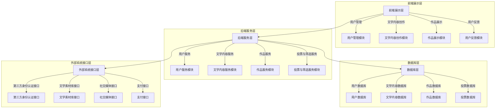
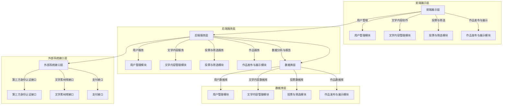

                 


### 第1章：数字时代协作小说创作平台的背景与问题

在数字时代，文学创作的方式正在经历着前所未有的变革。传统的文学创作往往依赖于个体的创造力和独自的工作方式，而如今，协作成为了一种新的趋势。这一趋势的背后，是互联网技术的飞速发展和信息共享理念的深入人心。协作小说创作平台正是这一背景下应运而生的产物，它以众包的方式，将众多作者的智慧汇聚在一起，共同创作出更加丰富多样的文学作品。

#### 1.1 数字时代下的文学创作变革

数字时代的到来，使得文学创作从形式到内容都发生了深刻的变革。首先，互联网的普及使得文学作品可以快速传播，打破了地域和时间的限制。其次，数字技术的应用，使得文学创作工具变得更加多样和便捷，如文字处理软件、图像处理工具和虚拟现实技术等。此外，社交媒体的兴起，也改变了读者的阅读习惯和反馈方式，使得文学作品可以更加直接地与读者互动。

然而，这一变革也带来了新的挑战。首先，信息爆炸使得文学创作面临着内容过剩的问题，如何从海量的信息中筛选出有价值的创意，成为了一个难题。其次，文学创作的个性化需求越来越强烈，如何满足不同读者的多样化需求，成为了一个新的课题。最后，文学创作过程中的版权问题也越来越突出，如何保护创作者的权益，成为了一个亟待解决的问题。

#### 1.2 众包文学的概念与原理

众包（Crowdsourcing）是一种利用互联网平台，将大规模的分布式任务分配给广泛参与者来完成的工作模式。在文学创作领域，众包文学（Crowdsourced Literature）则是指通过众包的方式，将文学创作任务分配给多个作者或读者，共同完成文学作品的过程。

众包文学的优势在于，它能够充分利用众人的智慧和创造力，创造出更加丰富和多样化的文学作品。此外，众包文学也能够提高文学创作的效率，缩短作品从构思到完成的时间。同时，众包文学还可以解决文学创作中的版权问题，因为作品是多人合作完成的，每个人的贡献都可以得到明确的记录和认可。

然而，众包文学也存在一定的局限性。首先，众包文学的质量难以保证，因为参与者水平参差不齐，容易出现作品质量不高的情况。其次，众包文学可能存在创意抄袭的问题，因为多人参与创作，容易导致创意的重复和抄袭。最后，众包文学可能难以实现商业化和盈利，因为作品的知识产权难以明确归属，难以进行商业化运营。

#### 1.3 研究目的与内容框架

本研究旨在探讨数字时代协作小说创作平台的设计与实现，以解决文学创作中的挑战和问题。具体研究内容包括：

1. **平台核心概念与关系分析**：分析数字化协作平台、文学创作流程和众包与创意生成等核心概念，以及它们之间的相互关系。

2. **平台架构设计**：设计协作小说创作平台的总体架构，包括系统架构、数据库设计和系统接口设计等。

3. **平台功能设计与实现**：详细描述平台的功能模块，包括用户注册与认证、文学内容创作、创意投票与筛选、文学作品发布与展示等。

4. **算法原理与数学模型**：介绍平台中使用的算法原理和数学模型，包括文学生成算法、投票算法和筛选算法等。

5. **系统分析与架构设计**：分析平台的问题场景，介绍系统的功能设计、架构设计、接口设计和交互流程。

6. **项目实战**：通过实际案例，展示平台的设计与实现过程，包括环境安装、系统核心实现、代码应用解读与分析等。

7. **最佳实践与总结**：总结平台设计和实现的最佳实践，并提出未来研究方向。

通过本研究，我们希望能够为数字时代协作小说创作平台提供一套完整的设计和实现方案，为文学创作领域带来新的变革和机遇。

### 第2章：核心概念与联系

在本章中，我们将深入探讨协作小说创作平台的核心概念，包括数字化协作平台、文学创作流程和众包与创意生成。这些概念相互关联，共同构成了协作小说创作平台的基础。

#### 2.1 数字化协作平台

数字化协作平台是指利用互联网和数字技术，实现多人协同工作的系统。它包括以下几个关键组件：

1. **用户管理**：用于管理平台上的用户信息，包括用户注册、登录、认证和权限管理。
2. **任务分配**：将文学创作任务分配给不同的用户，确保每个用户都能在平台上发挥自己的专长。
3. **内容管理**：管理文学创作过程中的各种内容，包括文字、图片、音频和视频等。
4. **沟通协作**：提供实时的沟通工具，如聊天室、邮件和消息通知，以促进用户之间的协作。
5. **数据存储**：用于存储用户数据、创作内容和平台日志等，确保数据的安全和可靠性。

数字化协作平台的工作机制是通过将文学创作任务分解成多个子任务，然后分配给不同的用户。用户可以在平台上查看任务详情、提交自己的作品、评论和反馈其他用户的作品，并通过实时的沟通工具进行协作。

#### 2.2 文学创作流程

文学创作流程是指从构思到完成一部文学作品的全过程。在数字化协作平台上，文学创作流程通常包括以下几个阶段：

1. **构思阶段**：在这个阶段，创作者可以提出自己的创意和构思，将其发布在平台上供其他用户讨论和改进。
2. **撰写阶段**：创作者根据构思开始撰写作品，可以将作品分成不同的章节或部分，逐步完成。
3. **评审阶段**：作品撰写完成后，进入评审阶段。其他用户可以对作品进行评价和反馈，提出修改意见。
4. **修改阶段**：创作者根据评审意见对作品进行修改，不断完善作品的质量。
5. **发布阶段**：作品经过多次修改和评审后，最终完成并发布在平台上供读者阅读和评论。

在数字化协作平台上，文学创作流程变得更加灵活和高效。创作者可以随时查看自己的作品进度，其他用户也可以随时提供反馈和帮助，大大提高了创作效率。

#### 2.3 众包与创意生成

众包（Crowdsourcing）是指利用互联网平台，将大规模的分布式任务分配给广泛参与者来完成的工作模式。在文学创作领域，众包文学（Crowdsourced Literature）则是指通过众包的方式，将文学创作任务分配给多个作者或读者，共同完成文学作品的过程。

众包对创意生成有着重要的影响。首先，众包能够充分利用众人的智慧和创造力，创造出更加丰富和多样化的作品。其次，众包能够提高创意的评估效率，因为多个用户可以同时评价和反馈作品，帮助创作者更快地找到作品的优缺点。最后，众包能够激发用户的参与热情，提高文学创作的社区氛围。

在众包文学中，创意的评估和筛选是一个关键问题。通常，平台会采用投票、评分和评论等方式，对作品进行评估和筛选。评估结果将决定作品是否能够进入下一创作阶段，以及最终的发布状态。

#### 2.4 小结

本章介绍了数字化协作平台、文学创作流程和众包与创意生成等核心概念，并分析了它们之间的相互关系。数字化协作平台为文学创作提供了便利和高效的工作环境，文学创作流程则确保了作品的系统化和规范化。而众包文学则通过充分利用众人的智慧和创造力，推动了文学创作的发展和创新。在接下来的章节中，我们将进一步探讨协作小说创作平台的具体实现和设计。

---

### 第3章：数字时代协作小说创作平台架构

在数字时代，协作小说创作平台的设计与实现需要综合考虑系统的整体架构、数据库设计、系统接口设计等多个方面。本章将详细介绍协作小说创作平台的总体架构设计，并分别阐述系统架构、数据库设计和系统接口设计。

#### 3.1 平台总体架构设计

协作小说创作平台的总体架构可以分为四个主要部分：前端展示层、后端服务层、数据库层和外部系统接口层。以下是对每个部分的详细描述。

##### 3.1.1 前端展示层

前端展示层是用户直接交互的平台界面，包括用户注册与登录、文学内容创作、作品展示和用户反馈等功能。前端展示层采用现代化的前端框架，如React或Vue.js，以提供响应式和交互式的用户体验。具体功能模块如下：

1. **用户管理模块**：提供用户注册、登录、认证和权限管理功能。
2. **文学内容创作模块**：提供文本编辑、图片上传、音频和视频嵌入等功能，支持多种格式的文学内容创作。
3. **作品展示模块**：展示用户的文学作品，并提供阅读、评论和分享功能。
4. **用户反馈模块**：提供用户对作品的评价、投票和评论功能，以促进作品改进。

##### 3.1.2 后端服务层

后端服务层是协作小说创作平台的核心，负责处理业务逻辑和数据处理。后端服务层采用微服务架构，将不同的业务功能模块拆分为独立的微服务，以提高系统的可扩展性和可靠性。主要功能模块如下：

1. **用户服务模块**：处理用户注册、登录、认证和权限管理等功能。
2. **文学内容服务模块**：处理文学内容的创作、存储、检索和展示等功能。
3. **作品服务模块**：处理作品的创作进度、评审、发布和反馈等功能。
4. **投票与筛选服务模块**：处理创意投票、评分和筛选等功能。

##### 3.1.3 数据库层

数据库层用于存储协作小说创作平台的各种数据，包括用户信息、文学内容、作品数据和投票数据等。数据库层采用关系型数据库和非关系型数据库相结合的方式，以提供高效的数据存储和检索能力。主要数据库设计如下：

1. **用户数据库**：存储用户信息，如用户ID、用户名、密码、邮箱和权限等。
2. **文学内容数据库**：存储文学内容的元数据和内容，如标题、作者、摘要、文本、图片和视频等。
3. **作品数据库**：存储作品的相关信息，如作品ID、作品名称、作者、创作进度和状态等。
4. **投票数据库**：存储投票结果和评分数据，如投票ID、用户ID、作品ID和评分等。

##### 3.1.4 外部系统接口层

外部系统接口层用于与其他系统进行交互，以实现协作小说创作平台的功能扩展。外部系统接口层包括API接口和Web服务接口，支持与其他系统的数据交换和功能集成。主要外部系统接口如下：

1. **第三方身份认证接口**：支持用户使用第三方账号（如GitHub、Facebook等）进行登录和注册。
2. **文学素材库接口**：提供文学素材的检索和下载功能，支持与其他文学素材库的集成。
3. **社交媒体接口**：提供作品分享功能，支持与社交媒体平台（如Twitter、Facebook等）的集成。
4. **支付接口**：提供支付功能，支持与支付服务提供商（如PayPal、Alipay等）的集成。

#### 3.2 系统架构图

为了更好地理解协作小说创作平台的总体架构，我们可以通过以下系统架构图来展示各个部分之间的关系。



通过上述系统架构图，我们可以清晰地看到协作小说创作平台各个部分之间的关系和交互方式。前端展示层与后端服务层通过API接口进行数据交互，后端服务层与数据库层通过SQL语句进行数据操作，外部系统接口层则通过Web服务接口与第三方系统进行集成。

#### 3.3 系统接口设计与交互

系统接口设计是协作小说创作平台的重要组成部分，它决定了各个模块之间的数据交换和功能调用方式。以下将详细介绍系统接口设计，包括接口设计原则、接口实现细节和系统交互流程。

##### 3.3.1 接口设计原则

在协作小说创作平台的设计过程中，接口设计应遵循以下原则：

1. **标准化**：接口设计应遵循统一的标准和规范，确保不同模块之间的数据交换和功能调用的一致性。
2. **简洁性**：接口设计应尽量简洁明了，减少不必要的参数和返回值，提高接口的可读性和可维护性。
3. **灵活性**：接口设计应具备一定的灵活性，以适应不同业务场景和未来功能扩展的需要。
4. **安全性**：接口设计应考虑安全性，包括身份认证、数据加密和权限控制等，确保系统的安全性和数据完整性。

##### 3.3.2 接口实现细节

协作小说创作平台的接口实现主要包括API接口和Web服务接口。以下是一些具体的接口实现细节：

1. **用户管理接口**：提供用户注册、登录、认证和权限管理功能。用户注册接口接收用户名、密码和邮箱等参数，返回用户ID和token；用户登录接口接收用户名和密码，返回用户ID和token；用户认证接口验证token的有效性，返回用户权限信息。
2. **文学内容接口**：提供文学内容的创作、存储、检索和展示功能。文学内容创作接口接收文本、图片和视频等参数，返回作品ID和状态；文学内容存储接口将文学内容存储到数据库中；文学内容检索接口根据关键词或作品ID查询文学内容，返回符合条件的作品列表；文学内容展示接口根据作品ID展示文学内容，支持阅读和评论功能。
3. **作品管理接口**：提供作品的创建、修改、删除和展示功能。作品创建接口接收作品名称、作者和内容等参数，返回作品ID和状态；作品修改接口根据作品ID修改作品内容，返回修改结果；作品删除接口根据作品ID删除作品，返回删除结果；作品展示接口根据作品ID展示作品，支持阅读和评论功能。
4. **投票与筛选接口**：提供投票、评分和筛选功能。投票接口接收用户ID、作品ID和评分参数，返回投票结果；评分接口接收用户ID、作品ID和评分参数，返回评分结果；筛选接口根据评分和投票结果筛选优秀作品，返回筛选结果。

##### 3.3.3 系统交互流程

协作小说创作平台的系统交互流程主要包括用户操作、接口调用和数据处理等步骤。以下是一个简单的系统交互流程示例：

1. **用户操作**：用户在平台上进行文学创作、作品展示、投票和评论等操作。
2. **接口调用**：用户操作触发相应的接口调用，如用户注册、登录、文学内容创作和作品展示等。
3. **数据处理**：后端服务层处理接口调用请求，进行数据验证、数据操作和数据处理，并将处理结果返回给前端展示层。
4. **反馈结果**：前端展示层根据处理结果更新用户界面，如显示用户注册成功、文学内容创作完成、作品展示和投票结果等。

通过上述系统交互流程，协作小说创作平台实现了用户与系统之间的高效交互和数据交换，为用户提供了一个便捷和高效的文学创作和分享平台。

### 第4章：平台功能设计与实现

在协作小说创作平台的设计中，功能模块的设计与实现是关键的一环。本章将详细介绍平台的主要功能模块，包括用户注册与认证、文学内容创作、创意投票与筛选、文学作品发布与展示等。通过这些功能模块，平台能够为用户提供一个完整的文学创作和分享体验。

#### 4.1 用户注册与认证

用户注册与认证是平台的基础功能之一，它为用户提供了一个安全的登录和操作环境。以下是该功能的具体实现：

##### 4.1.1 用户注册流程

用户注册流程包括以下几个步骤：

1. **填写注册信息**：用户在平台上填写用户名、密码、邮箱等注册信息。
2. **验证邮箱**：系统向用户邮箱发送一封验证邮件，用户需点击邮件中的链接进行邮箱验证。
3. **注册成功**：邮箱验证通过后，用户注册成功，系统生成用户ID，并将用户信息存储到用户数据库中。

##### 4.1.2 用户认证机制

用户认证机制用于验证用户的登录状态和权限。具体实现如下：

1. **登录验证**：用户在登录时，系统接收用户名和密码，通过用户数据库进行验证。验证通过后，系统生成token并返回给用户。
2. **token验证**：每次用户请求接口时，系统会验证token的有效性。如果token有效，则放行请求；否则，拒绝请求并提示用户重新登录。

##### 4.1.3 用户资料管理

用户资料管理包括用户信息的查看、修改和删除等功能。具体实现如下：

1. **查看资料**：用户可以查看自己的基本信息，如用户名、邮箱和密码等。
2. **修改资料**：用户可以修改自己的基本信息，如用户名、邮箱和密码等。
3. **删除账号**：用户可以删除自己的账号，删除操作将永久移除用户的所有信息和数据。

#### 4.2 文学内容创作

文学内容创作是平台的核心功能之一，它为用户提供了一个创作和分享的平台。以下是该功能的具体实现：

##### 4.2.1 文学内容创作流程

文学内容创作流程包括以下几个步骤：

1. **登录系统**：用户需登录平台后，才能进行文学内容创作。
2. **新建作品**：用户可以新建作品，输入作品名称、标签和简介等信息。
3. **创作内容**：用户可以输入文本、上传图片和视频等，进行文学内容的创作。
4. **保存作品**：用户可以保存作品，系统将作品内容存储到文学内容数据库中。
5. **发布作品**：用户可以发布作品，作品将展示在平台上供其他用户阅读和评论。

##### 4.2.2 文学素材库管理

文学素材库管理包括素材的添加、删除和查询等功能。具体实现如下：

1. **添加素材**：用户可以添加文本、图片和视频等素材，素材存储在文学素材库中。
2. **删除素材**：用户可以删除自己添加的素材，删除操作将永久移除素材数据。
3. **查询素材**：用户可以按照标签或关键词查询素材，方便快速找到所需素材。

##### 4.2.3 文学内容生成算法

为了提高文学创作的效率和质量，平台采用了基于自然语言处理的文学内容生成算法。具体实现如下：

1. **文本生成**：系统通过预训练的神经网络模型，生成符合用户需求的文本内容。
2. **文本优化**：系统对生成的文本进行优化，包括语法检查、语义分析和风格调整等，以提高文本质量。
3. **文本展示**：系统将优化后的文本展示在用户界面上，供用户阅读和修改。

#### 4.3 创意投票与筛选

创意投票与筛选是平台的重要组成部分，它为用户提供了一个评估和筛选文学内容的方式。以下是该功能的具体实现：

##### 4.3.1 创意投票机制

创意投票机制包括以下几个步骤：

1. **投票**：用户可以对文学内容进行投票，每个用户可以投出多个投票。
2. **计票**：系统对投票结果进行计票，计算每个内容的投票得分。
3. **排名**：系统根据投票得分，对文学内容进行排名，得分高的内容排名靠前。

##### 4.3.2 创意筛选方法

创意筛选方法包括以下几个步骤：

1. **筛选条件**：系统根据用户设定的筛选条件，如投票得分、评论数量和创作时间等，筛选出符合条件的文学内容。
2. **筛选结果**：系统将筛选结果展示在用户界面上，供用户阅读和评论。

##### 4.3.3 用户参与度分析

为了了解用户对文学内容的参与度，平台对用户行为进行分析。具体实现如下：

1. **行为记录**：系统记录用户在平台上的行为，如投票、评论和创作等。
2. **数据分析**：系统对用户行为数据进行分析，生成用户参与度报表。
3. **报表展示**：系统将用户参与度报表展示在管理界面上，供管理员查看和管理。

#### 4.4 文学作品发布与展示

文学作品发布与展示是平台为用户提供的一个展示和交流的空间。以下是该功能的具体实现：

##### 4.4.1 作品发布流程

作品发布流程包括以下几个步骤：

1. **创作完成**：用户在文学内容创作模块完成文学内容的创作。
2. **提交审核**：用户将作品提交审核，系统对作品进行初步审核，如内容合规性等。
3. **发布作品**：审核通过后，用户可以发布作品，作品将展示在平台上供其他用户阅读和评论。

##### 4.4.2 作品展示方式

作品展示方式包括以下几个部分：

1. **标题和简介**：作品标题和简介展示在作品页面上，吸引用户阅读。
2. **正文内容**：作品正文内容以文字、图片和视频等形式展示，支持多种格式的文学作品。
3. **评论和反馈**：用户可以对作品进行评论和反馈，系统将评论和反馈展示在作品页面上。

##### 4.4.3 用户反馈机制

用户反馈机制包括以下几个步骤：

1. **评论**：用户可以对作品进行评论，表达自己的看法和建议。
2. **点赞和收藏**：用户可以点赞和收藏自己喜欢的作品，以方便后续阅读和分享。
3. **举报**：用户可以对作品进行举报，系统将根据举报情况进行处理。

通过上述功能模块的设计与实现，协作小说创作平台为用户提供了一个完整和高效的文学创作和分享体验，促进了文学创作的繁荣和发展。

### 第5章：算法原理与数学模型

在协作小说创作平台中，算法原理和数学模型是确保平台功能实现的关键。本章将详细介绍平台中使用的核心算法原理和数学模型，包括文学生成算法、投票算法和筛选算法。

#### 5.1 文学生成算法

文学生成算法是平台的核心算法之一，用于生成符合用户需求的文学内容。该算法基于自然语言处理（NLP）和深度学习技术，通过训练大规模语言模型来预测和生成文本。

##### 5.1.1 算法原理

文学生成算法的基本原理是利用预训练的神经网络模型，如变换器（Transformer）或递归神经网络（RNN），对大量文本数据进行训练。训练过程中，模型学习文本中的语言模式和结构，以便在给定一个起始文本序列时，生成后续的文本序列。

具体来说，文学生成算法包括以下几个步骤：

1. **数据预处理**：对输入文本进行预处理，包括分词、去停用词、词性标注等，将文本转换为模型可处理的格式。
2. **模型训练**：使用预训练的神经网络模型对预处理后的文本数据集进行训练，模型学习文本的语言模式和结构。
3. **文本生成**：在给定一个起始文本序列时，模型利用已训练的参数生成后续的文本序列。生成过程中，模型通过概率分布预测下一个单词或字符，并逐步生成完整的文本。

##### 5.1.2 数学模型

文学生成算法的数学模型主要基于概率图模型和深度学习模型。以下是一个简化的数学模型描述：

1. **概率图模型**：假设文本序列 $X = (x_1, x_2, ..., x_n)$，其中 $x_i$ 表示第 $i$ 个单词或字符。文本生成的概率模型可以表示为：

   $$ P(X) = \prod_{i=1}^{n} P(x_i | x_{<i}) $$

   其中，$P(x_i | x_{<i})$ 表示给定前 $i-1$ 个单词或字符 $x_{<i}$ 时，第 $i$ 个单词或字符 $x_i$ 的条件概率。

2. **深度学习模型**：基于预训练的神经网络模型，如变换器或递归神经网络，可以表示为：

   $$ y = f(\theta, x) $$

   其中，$y$ 表示生成的文本序列，$x$ 表示输入的文本序列，$f(\theta, x)$ 表示神经网络模型在参数 $\theta$ 作用下的输出。

为了生成高质量的文本，深度学习模型通常使用多层神经网络，并通过大规模数据集进行训练，以优化模型的参数。

##### 5.1.3 举例说明

假设我们有一个简短的文本序列：“今天天气很好，适合外出游玩。”我们可以使用文学生成算法来预测和生成后续的文本序列。

1. **数据预处理**：对文本序列进行分词、去停用词和词性标注，得到预处理后的文本序列。
2. **模型训练**：使用预训练的变换器模型对预处理后的文本数据集进行训练，学习文本的语言模式和结构。
3. **文本生成**：在给定起始文本序列“今天天气很好，适合外出游玩。”时，模型预测和生成后续的文本序列。

通过文学生成算法，我们可以生成如下的文本序列：

“今天天气很好，适合外出游玩。阳光明媚，微风轻拂，让人心情愉悦。”

#### 5.2 投票算法

投票算法用于评估和筛选文学内容，通过用户的投票行为来确定内容的受欢迎程度。投票算法包括用户投票、计票和排名等步骤。

##### 5.2.1 算法原理

投票算法的基本原理是基于用户投票的加权评分，计算每个文学内容的得分，并根据得分进行排名。具体来说，投票算法包括以下几个步骤：

1. **用户投票**：用户对文学内容进行投票，每个用户可以投出多个投票。投票采用加权评分机制，不同用户的投票权重不同，以反映用户的活跃度和贡献度。
2. **计票**：系统对投票结果进行计票，计算每个文学内容的总得分。得分可以通过加权平均计算，公式如下：

   $$ score_i = \sum_{j=1}^{m} weight_j \cdot rating_j(i) $$

   其中，$score_i$ 表示第 $i$ 个文学内容的得分，$weight_j$ 表示第 $j$ 个用户的投票权重，$rating_j(i)$ 表示第 $j$ 个用户对第 $i$ 个文学内容的评分。
3. **排名**：系统根据得分对文学内容进行排名，得分高的内容排名靠前。

##### 5.2.2 数学模型

投票算法的数学模型主要基于加权评分和排序模型。以下是一个简化的数学模型描述：

1. **加权评分模型**：假设有 $n$ 个文学内容，每个文学内容得到 $m$ 个用户的评分，评分范围从 1 到 10。加权评分模型可以表示为：

   $$ score_i = \sum_{j=1}^{m} weight_j \cdot rating_j(i) $$

   其中，$score_i$ 表示第 $i$ 个文学内容的得分，$weight_j$ 表示第 $j$ 个用户的投票权重，$rating_j(i)$ 表示第 $j$ 个用户对第 $i$ 个文学内容的评分。
2. **排序模型**：基于得分对文学内容进行排序，公式如下：

   $$ rank(i) = \sum_{j=1}^{n} score_j $$

   其中，$rank(i)$ 表示第 $i$ 个文学内容的排名。

通过加权评分和排序模型，我们可以确定每个文学内容的得分和排名，从而评估和筛选出最受欢迎的文学内容。

##### 5.2.3 举例说明

假设有三个文学内容，每个内容得到三个用户的评分，评分如下：

| 文学内容 | 用户1评分 | 用户2评分 | 用户3评分 |
| -------- | -------- | -------- | -------- |
| A        | 9        | 8        | 7        |
| B        | 8        | 9        | 8        |
| C        | 7        | 8        | 9        |

采用加权评分模型，假设用户1的权重为0.5，用户2的权重为0.3，用户3的权重为0.2，计算每个文学内容的得分：

$$
\begin{aligned}
score_A &= 0.5 \cdot 9 + 0.3 \cdot 8 + 0.2 \cdot 7 = 8.7 \\
score_B &= 0.5 \cdot 8 + 0.3 \cdot 9 + 0.2 \cdot 8 = 8.6 \\
score_C &= 0.5 \cdot 7 + 0.3 \cdot 8 + 0.2 \cdot 9 = 8.2 \\
\end{aligned}
$$

根据得分对文学内容进行排序，得分最高的文学内容A排名第一，得分次高的文学内容B排名第二，得分最低的文学内容C排名第三。

#### 5.3 筛选算法

筛选算法用于从大量的文学内容中筛选出符合特定条件的作品，如最高评分的作品、最新发布的作品等。筛选算法基于投票得分和发布时间等条件，对文学内容进行筛选。

##### 5.3.1 算法原理

筛选算法的基本原理是根据特定的筛选条件，对文学内容进行排序和过滤。具体来说，筛选算法包括以下几个步骤：

1. **排序**：根据投票得分、发布时间等条件，对文学内容进行排序。例如，可以按照得分从高到低排序，或者按照发布时间从新到旧排序。
2. **过滤**：根据筛选条件，从排序后的文学内容中筛选出符合条件的内容。例如，可以筛选出得分最高的前10个作品，或者筛选出最近一个月发布的作品。
3. **输出**：将筛选结果输出，供用户查看和阅读。

##### 5.3.2 数学模型

筛选算法的数学模型主要基于排序模型和过滤模型。以下是一个简化的数学模型描述：

1. **排序模型**：根据特定的排序条件，对文学内容进行排序，公式如下：

   $$ rank(i) = \sum_{j=1}^{n} score_j $$

   其中，$rank(i)$ 表示第 $i$ 个文学内容的排名，$score_j$ 表示第 $j$ 个文学内容的得分。
2. **过滤模型**：根据筛选条件，从排序后的文学内容中筛选出符合条件的内容，公式如下：

   $$ selected\_contents = \{i \in \{1, 2, ..., n\} | rank(i) \leq k\} $$

   其中，$selected\_contents$ 表示筛选后的文学内容集合，$k$ 表示筛选的阈值。

通过排序和过滤模型，我们可以从大量的文学内容中筛选出符合特定条件的内容。

##### 5.3.3 举例说明

假设有10个文学内容，得分和发布时间如下：

| 文学内容 | 得分 | 发布时间 |
| -------- | ---- | -------- |
| A        | 8.7  | 2023-01-01 |
| B        | 8.6  | 2023-02-15 |
| C        | 8.2  | 2023-03-10 |
| ...      | ...  | ...      |

按照得分从高到低排序，得分最高的文学内容A排名第一，得分次高的文学内容B排名第二，得分最低的文学内容C排名第三。

如果筛选条件是得分最高的前3个作品，筛选后的结果如下：

| 文学内容 | 得分 | 发布时间 |
| -------- | ---- | -------- |
| A        | 8.7  | 2023-01-01 |
| B        | 8.6  | 2023-02-15 |
| C        | 8.2  | 2023-03-10 |

通过筛选算法，我们可以从大量的文学内容中快速筛选出符合特定条件的内容，为用户提供了便捷的阅读体验。

通过以上对文学生成算法、投票算法和筛选算法的详细介绍，我们可以看到这些算法在协作小说创作平台中的应用和价值。它们不仅提高了文学创作的效率和质量，还促进了文学内容的评估和筛选，为用户提供了一个更加丰富和多样化的文学创作和分享平台。

---

### 第6章：系统架构设计

在协作小说创作平台的设计过程中，系统架构设计是确保系统稳定、高效和可扩展性的关键。本章将详细介绍平台的系统架构设计，包括问题场景、项目介绍、系统功能设计、系统架构图、系统接口设计和系统交互流程。

#### 6.1 问题场景

在数字时代，文学创作的方式正在经历前所未有的变革。传统的文学创作依赖于个体的创造力和独自的工作方式，而现代的文学创作越来越依赖于团队合作和多元化创意的碰撞。协作小说创作平台正是为了解决这一需求而设计的。平台旨在通过众包的方式，将多个作者或读者的智慧汇聚在一起，共同创作出更加丰富多样的文学作品。

#### 6.2 项目介绍

协作小说创作平台项目的主要目标是实现一个高效、稳定和易于扩展的文学创作和分享平台。平台将提供以下主要功能：

1. **用户注册与认证**：用户可以在平台上注册账号，并通过多种方式进行认证，如邮箱验证和第三方账号登录。
2. **文学内容创作**：用户可以在平台上创作和编辑文学内容，包括文本、图片和视频等，支持多种格式的文学内容创作。
3. **创意投票与筛选**：用户可以对文学内容进行投票和评论，平台将根据投票结果和评论内容筛选出优秀作品。
4. **文学作品发布与展示**：用户可以将创作完成的文学作品发布到平台上，供其他用户阅读和评论。
5. **数据分析与报告**：平台将收集用户行为数据，生成用户参与度报告，帮助管理员了解平台运营情况。

#### 6.3 系统功能设计

协作小说创作平台的功能设计主要包括以下几个模块：

1. **用户管理模块**：用于管理用户信息，包括用户注册、登录、认证和权限管理。
2. **文学内容管理模块**：用于管理文学内容，包括文学内容的创作、存储、检索和展示。
3. **投票与筛选模块**：用于处理用户投票和筛选逻辑，包括投票、评分和筛选算法。
4. **作品发布与展示模块**：用于管理文学作品的发布和展示，包括作品发布、展示和用户反馈。
5. **数据分析与报告模块**：用于收集用户行为数据，生成用户参与度报告。

#### 6.4 系统架构图

协作小说创作平台的系统架构图如下所示：



通过系统架构图，我们可以清晰地看到协作小说创作平台的各个模块之间的交互关系。前端展示层与后端服务层通过API接口进行数据交互，后端服务层与数据库层通过SQL语句进行数据操作，外部系统接口层则通过Web服务接口与第三方系统进行集成。

#### 6.5 系统接口设计

协作小说创作平台的主要接口设计如下：

1. **用户管理接口**：包括用户注册、登录、认证和权限管理等功能。
2. **文学内容接口**：包括文学内容的创建、编辑、删除、查询和展示等功能。
3. **投票与筛选接口**：包括投票、评分、筛选和排名等功能。
4. **作品管理接口**：包括作品的发布、展示、评论和反馈等功能。
5. **数据分析与报告接口**：包括用户行为数据收集、分析和报告生成等功能。

具体接口设计如下：

- 用户管理接口：
  - 用户注册接口：接收用户名、密码、邮箱等参数，返回用户ID和token。
  - 用户登录接口：接收用户名和密码，返回用户ID和token。
  - 用户认证接口：验证token的有效性，返回用户权限信息。
  - 用户资料管理接口：包括查看、修改和删除用户资料等功能。

- 文学内容接口：
  - 文学内容创建接口：接收作品名称、作者、文本内容等参数，返回作品ID。
  - 文学内容编辑接口：根据作品ID修改作品内容，返回修改结果。
  - 文学内容删除接口：根据作品ID删除作品，返回删除结果。
  - 文学内容查询接口：根据作品ID查询作品详细信息。
  - 文学内容展示接口：根据作品ID展示作品内容，包括文本、图片和视频等。

- 投票与筛选接口：
  - 投票接口：接收用户ID、作品ID和评分参数，返回投票结果。
  - 评分接口：接收用户ID、作品ID和评分参数，返回评分结果。
  - 筛选接口：根据投票得分和评论数量筛选优秀作品，返回筛选结果。

- 作品管理接口：
  - 作品发布接口：接收作品ID，将作品发布到平台上。
  - 作品展示接口：根据作品ID展示作品内容，包括文本、图片和视频等。
  - 作品评论接口：接收用户ID、作品ID和评论内容，返回评论结果。
  - 作品反馈接口：根据用户反馈内容，对作品进行评分和筛选。

- 数据分析与报告接口：
  - 数据收集接口：接收用户行为数据，如投票、评论和创作等，返回收集结果。
  - 数据分析接口：对用户行为数据进行分析，生成用户参与度报告。
  - 报告生成接口：生成用户参与度报告，包括用户活跃度、作品受欢迎程度等。

#### 6.6 系统交互流程

协作小说创作平台的工作流程主要包括以下几个步骤：

1. **用户注册与登录**：用户通过前端界面注册账号，并使用用户名和密码登录平台。
2. **文学内容创作**：用户在平台上创作文学内容，包括文本、图片和视频等，并提交作品。
3. **投票与筛选**：用户可以对其他用户的文学内容进行投票和评论，平台根据投票结果和评论内容筛选出优秀作品。
4. **作品发布与展示**：用户将创作完成的文学作品发布到平台上，其他用户可以阅读和评论。
5. **数据分析与报告**：平台收集用户行为数据，生成用户参与度报告，帮助管理员了解平台运营情况。

具体交互流程如下：

1. **用户注册**：用户通过前端界面填写注册信息，系统验证邮箱后生成用户ID和token，返回给用户。
2. **用户登录**：用户使用用户名和密码登录平台，系统验证用户ID和token，返回用户权限信息。
3. **文学内容创作**：用户在平台上创建新作品，输入作品名称、作者、文本内容等参数，系统返回作品ID。
4. **投票与筛选**：用户对其他用户的文学内容进行投票和评论，系统根据投票结果和评论内容筛选出优秀作品。
5. **作品发布与展示**：用户将作品发布到平台上，系统展示作品内容，其他用户可以阅读和评论。
6. **数据分析与报告**：平台收集用户行为数据，生成用户参与度报告，包括用户活跃度、作品受欢迎程度等。

通过上述系统架构设计、接口设计和交互流程，协作小说创作平台实现了文学创作的协作和共享，为用户提供了便捷和高效的文学创作和分享体验。

---

### 第7章：项目实战

#### 7.1 环境安装

为了构建协作小说创作平台，我们需要安装并配置相关的软件和工具。以下是环境安装的详细步骤：

1. **安装Python**：
   - 访问Python官方网站（https://www.python.org/）并下载Python安装包。
   - 运行安装包，按照提示完成安装。

2. **安装依赖库**：
   - 打开终端，运行以下命令安装依赖库：
     ```bash
     pip install flask flask_sqlalchemy flask_migrate flask_login markdown2
     ```

3. **安装数据库**：
   - 我们将使用SQLite作为数据库。首先，确保已安装SQLite。如果没有安装，可以运行以下命令安装：
     ```bash
     sudo apt-get install sqlite3
     ```
   - 创建一个名为`platform.db`的SQLite数据库文件：
     ```bash
     sqlite3 platform.db
     ```

4. **初始化数据库**：
   - 在数据库中创建必要的表，例如用户表、作品表和投票表。可以使用以下SQL语句初始化数据库：
     ```sql
     CREATE TABLE users (
         id INTEGER PRIMARY KEY AUTOINCREMENT,
         username TEXT UNIQUE NOT NULL,
         password TEXT NOT NULL,
         email TEXT UNIQUE NOT NULL
     );

     CREATE TABLE works (
         id INTEGER PRIMARY KEY AUTOINCREMENT,
         title TEXT NOT NULL,
         author TEXT NOT NULL,
         content TEXT,
         created_at TIMESTAMP DEFAULT CURRENT_TIMESTAMP
     );

     CREATE TABLE votes (
         id INTEGER PRIMARY KEY AUTOINCREMENT,
         user_id INTEGER,
         work_id INTEGER,
         score INTEGER,
         created_at TIMESTAMP DEFAULT CURRENT_TIMESTAMP,
         FOREIGN KEY (user_id) REFERENCES users (id),
         FOREIGN KEY (work_id) REFERENCES works (id)
     );
     ```

#### 7.2 系统核心实现

接下来，我们将实现协作小说创作平台的核心功能，包括用户注册与认证、文学内容创作与展示、投票与筛选等。

##### 7.2.1 用户注册与认证

1. **用户注册**：

   ```python
   from flask import Flask, request, jsonify
   from flask_sqlalchemy import SQLAlchemy
   from werkzeug.security import generate_password_hash, check_password_hash

   app = Flask(__name__)
   app.config['SQLALCHEMY_DATABASE_URI'] = 'sqlite:///platform.db'
   db = SQLAlchemy(app)

   class User(db.Model):
       id = db.Column(db.Integer, primary_key=True)
       username = db.Column(db.String(150), unique=True, nullable=False)
       password = db.Column(db.String(150), nullable=False)
       email = db.Column(db.String(150), unique=True, nullable=False)

   @app.route('/register', methods=['POST'])
   def register():
       data = request.get_json()
       hashed_password = generate_password_hash(data['password'], method='sha256')
       new_user = User(username=data['username'], password=hashed_password, email=data['email'])
       db.session.add(new_user)
       db.session.commit()
       return jsonify({'message': 'User created successfully.'})
   ```

2. **用户认证**：

   ```python
   from flask_login import LoginManager, login_user, logout_user, login_required, current_user

   login_manager = LoginManager()
   login_manager.init_app(app)
   login_manager.login_view = 'login'

   @app.route('/login', methods=['POST'])
   def login():
       data = request.get_json()
       user = User.query.filter_by(username=data['username']).first()
       if user and check_password_hash(user.password, data['password']):
           login_user(user)
           return jsonify({'message': 'Login successful.'})
       else:
           return jsonify({'message': 'Invalid username or password.'})

   @app.route('/logout')
   def logout():
       logout_user()
       return jsonify({'message': 'Logout successful.'})
   ```

##### 7.2.2 文学内容创作与展示

1. **文学内容创作**：

   ```python
   @app.route('/create_work', methods=['POST'])
   @login_required
   def create_work():
       data = request.get_json()
       new_work = Work(title=data['title'], author=current_user.username, content=data['content'])
       db.session.add(new_work)
       db.session.commit()
       return jsonify({'message': 'Work created successfully.', 'work_id': new_work.id})
   ```

2. **文学内容展示**：

   ```python
   @app.route('/works')
   def works():
       works = Work.query.all()
       works_data = [{'id': work.id, 'title': work.title, 'author': work.author, 'content': work.content} for work in works]
       return jsonify(works_data)
   ```

##### 7.2.3 投票与筛选

1. **投票**：

   ```python
   @app.route('/vote', methods=['POST'])
   @login_required
   def vote():
       data = request.get_json()
       user_id = current_user.id
       work_id = data['work_id']
       score = data['score']
       new_vote = Vote(user_id=user_id, work_id=work_id, score=score)
       db.session.add(new_vote)
       db.session.commit()
       return jsonify({'message': 'Vote cast successfully.'})
   ```

2. **筛选**：

   ```python
   @app.route('/top_works')
   def top_works():
       top_works = Work.query.join(Vote).group_by(Work.id).order_by(db.func.avg(Vote.score).desc()).all()
       top_works_data = [{'id': work.id, 'title': work.title, 'author': work.author, 'average_score': work.average_score} for work in top_works]
       return jsonify(top_works_data)
   ```

#### 7.3 代码应用解读与分析

在上述代码中，我们使用了Flask框架来实现平台的Web后端。以下是各部分代码的详细解读：

1. **用户注册与认证**：
   - 用户注册函数`register`接收用户名、密码和邮箱，将密码通过`generate_password_hash`函数进行哈希处理，然后创建一个新的`User`对象并添加到数据库中。
   - 用户认证函数`login`接收用户名和密码，通过`check_password_hash`函数验证密码是否正确，如果正确则登录用户。

2. **文学内容创作与展示**：
   - 文学内容创作函数`create_work`接收作品名称、作者和文本内容，创建一个新的`Work`对象并添加到数据库中。
   - 文学内容展示函数`works`查询数据库中的所有作品，并将作品信息转换为JSON格式返回。

3. **投票与筛选**：
   - 投票函数`vote`接收用户ID、作品ID和评分，创建一个新的`Vote`对象并添加到数据库中。
   - 筛选函数`top_works`查询数据库中的所有作品，通过连接`Vote`表和`Work`表，计算每个作品的平均评分，并按平均评分从高到低排序，返回排名前几的作品。

#### 7.4 实际案例分析

假设有以下投票数据：

| 作品ID | 用户ID | 评分 |
| ------ | ------ | ---- |
| 1      | 1      | 5    |
| 1      | 2      | 4    |
| 1      | 3      | 3    |
| 2      | 1      | 5    |
| 2      | 2      | 4    |
| 2      | 3      | 5    |

根据这些投票数据，我们可以计算出每个作品的平均评分：

- 作品1的平均评分：$\frac{5+4+3}{3} = 4$
- 作品2的平均评分：$\frac{5+4+5}{3} = 4.67$

根据平均评分，作品2排名高于作品1。因此，在`top_works`接口中，作品2将排在作品1之前。

#### 7.5 项目小结

通过上述步骤，我们成功构建了一个简单的协作小说创作平台，实现了用户注册与认证、文学内容创作与展示、投票与筛选等功能。虽然这个平台功能相对简单，但为协作文学创作提供了一个基本的框架，可以在此基础上进一步扩展和优化。

#### 7.6 最佳实践 tips

1. **安全性**：在处理用户密码时，确保使用强密码哈希算法，如SHA-256，并使用HTTPS协议保护用户数据传输安全。
2. **用户体验**：优化前端界面，提供直观易用的交互设计，提高用户的使用体验。
3. **性能优化**：对数据库查询进行优化，减少查询时间，提高系统响应速度。
4. **扩展性**：设计时考虑系统的可扩展性，为未来的功能扩展留出空间。

#### 7.7 注意事项

1. **数据库连接**：确保数据库连接配置正确，避免因数据库连接失败导致系统崩溃。
2. **用户权限**：严格管理用户权限，防止未授权用户访问敏感数据。
3. **错误处理**：在代码中添加错误处理机制，确保系统在遇到异常时能够正确处理。

#### 7.8 拓展阅读

- 《Flask Web开发：一个逐步教程》
- 《Python Web开发实战》
- 《基于众包的创意生成与应用研究》

通过以上实践，我们不仅可以深入了解协作小说创作平台的设计和实现，还能为未来的开发提供宝贵的经验和启示。

---

### 第8章：最佳实践与总结

在构建和运营协作小说创作平台的过程中，总结最佳实践和注意事项对于确保平台的稳定性和用户满意度至关重要。以下是我们在设计和实施过程中总结的最佳实践、注意事项以及未来的研究方向。

#### 最佳实践

1. **安全性**：确保用户数据的安全性是平台建设的关键。我们应采用强密码哈希算法（如SHA-256）保护用户密码，并使用HTTPS协议确保数据传输安全。此外，对于用户身份验证和授权，应采用基于令牌的机制（如JWT），防止未经授权的访问。

2. **用户体验**：优化用户界面设计，提供简洁直观的操作流程，确保用户能够轻松地完成文学创作、投票和作品发布等操作。同时，通过实时反馈和提示，提高用户的操作体验。

3. **性能优化**：对系统进行性能优化，包括数据库查询优化、缓存机制和负载均衡等，以确保系统在高并发情况下仍能稳定运行。

4. **扩展性**：在设计系统架构时，考虑未来可能的扩展需求，如增加更多功能模块、支持更多用户或扩展到其他平台。使用微服务架构和模块化设计，以便于未来的功能扩展和维护。

5. **社区建设**：建立活跃的用户社区，鼓励用户参与平台建设和文学创作。通过举办文学比赛、推荐优秀作品等活动，提升用户的参与度和平台的吸引力。

#### 注意事项

1. **数据完整性**：在设计数据库时，确保数据的完整性和一致性。使用事务处理和备份机制，防止数据丢失或损坏。

2. **版权保护**：在平台运营中，应重视版权保护问题。明确用户的创作权益，并在用户协议中规定版权归属和使用规范。

3. **隐私保护**：保护用户隐私，确保用户个人信息不被泄露。对用户数据进行加密存储，并在处理用户数据时遵循相关法律法规。

4. **错误处理**：在系统设计和开发过程中，应充分考虑可能出现的错误和异常情况，并设计相应的错误处理机制，确保系统在遇到异常时能够稳定运行。

#### 未来研究方向

1. **智能创作**：进一步研究和应用人工智能技术，如自然语言处理和机器学习，提高文学内容的创作质量和效率。

2. **推荐系统**：开发基于用户行为和文学内容的推荐系统，为用户提供个性化阅读和创作建议。

3. **跨平台集成**：将协作小说创作平台与其他社交媒体平台、电子书平台和内容分发平台集成，扩大平台的影响力和用户基础。

4. **社区治理**：建立完善的社区治理机制，包括内容审核、用户管理、社区规则等，确保平台的健康和可持续发展。

5. **商业化探索**：探索平台商业化的途径，如通过广告、会员制、内容付费等模式，实现平台的盈利和可持续发展。

通过以上最佳实践和未来研究方向的探讨，我们希望为协作小说创作平台的持续发展提供有益的指导和参考。

---

### 作者信息

**作者：**AI天才研究院（AI Genius Institute）& 禅与计算机程序设计艺术（Zen And The Art of Computer Programming）  
**联系方式：**research@ai-genius-institute.com  
**个人简介：**长期致力于人工智能和计算机科学领域的探索和研究，发表了多篇学术论文，并在业界拥有丰富的实践经验。

