                 

# 《数字时代的多语言家庭教育顾问：跨文化养育的在线咨询服务》

## 关键词
- 数字时代
- 多语言教育
- 跨文化养育
- 在线咨询服务
- 技术实现

## 摘要
本文旨在探讨数字时代下，如何通过多语言家庭教育顾问的在线咨询服务，满足跨文化家庭在教育方面的需求。文章首先介绍了多语言家庭教育顾问的核心概念、背景与问题，随后详细解析了服务模式、技术实现、实践案例以及最佳实践和未来展望。通过本文，读者可以全面了解如何利用数字化手段，提升多语言教育质量和效率，为跨文化家庭提供个性化、专业的家庭教育服务。

### 目录大纲设计思路

在设计本文的目录大纲时，我们首先明确了文章的主题和目标读者。主题是数字时代的多语言家庭教育顾问，目标读者包括关注跨文化养育的家长、教育工作者以及相关领域的研究者。接下来，我们确定了核心内容结构，包括背景介绍、核心概念解析、服务模式探讨、技术实现方法、实践案例以及最佳实践和未来展望。

目录大纲的设计思路遵循逻辑顺序，从基础到深入，从理论到实践，确保内容连贯且逐步递进。每个章节都进行了细致的细分，确保每个部分都有明确的内容覆盖。同时，我们遵循了markdown格式和字数限制要求，确保了目录的简洁明了和完整性。

### 完整目录大纲设计

```markdown
# 《数字时代的多语言家庭教育顾问：跨文化养育的在线咨询服务》目录大纲

## 第一部分：背景与概述

### 第1章：数字时代与多语言家庭教育
- 1.1 问题背景
- 1.2 数字时代下的教育变革
- 1.3 跨文化养育的需求与挑战
- 1.4 多语言家庭教育顾问的重要性
- 1.5 本章小结

### 第2章：多语言家庭教育顾问的核心概念
- 2.1 多语言教育的定义与目标
- 2.2 跨文化教育的概念与原则
- 2.3 在线咨询服务模式
- 2.4 教育顾问的角色与责任
- 2.5 本章小结

## 第二部分：多语言家庭教育顾问的服务模式

### 第3章：在线咨询服务框架
- 3.1 咨询服务模式
- 3.2 服务流程设计
- 3.3 服务内容与分类
- 3.4 客户关系管理
- 3.5 本章小结

### 第4章：技术支撑系统
- 4.1 在线咨询平台的搭建
- 4.2 多语言处理技术
- 4.3 数据分析与个性化推荐
- 4.4 信息安全与隐私保护
- 4.5 本章小结

### 第5章：实践案例分析
- 5.1 案例背景介绍
- 5.2 案例分析
- 5.3 案例启示与经验总结
- 5.4 案例拓展与讨论
- 5.5 本章小结

## 第三部分：技术与实践

### 第6章：搭建多语言家庭教育顾问平台
- 6.1 系统架构设计
- 6.2 技术选型
- 6.3 系统核心模块实现
- 6.4 系统测试与优化
- 6.5 本章小结

### 第7章：最佳实践与未来展望
- 7.1 最佳实践总结
- 7.2 未来发展趋势
- 7.3 面临的挑战与解决方案
- 7.4 政策支持与市场机遇
- 7.5 本章小结

## 附录
- 附录A：常见问题解答
- 附录B：参考资料
- 附录C：术语表
```

以上大纲结构完整地涵盖了书的主要内容和结构，每个章节都进行了细致的细分，确保了内容的完整性和逻辑性。同时，大纲遵循了markdown格式和字数限制要求。

## 第一部分：背景与概述

### 第1章：数字时代与多语言家庭教育

#### 1.1 问题背景

在数字时代，全球化的趋势日益显著，跨文化家庭的数量也在不断增加。这些家庭面临着如何在家中进行多语言教育的挑战。传统的家庭教育方式往往无法满足这些家庭的需求，尤其是在教育资源有限、语言障碍明显的情况下。因此，寻求一种能够提供个性化、专业化的多语言家庭教育服务变得尤为重要。

#### 1.2 数字时代下的教育变革

数字时代的到来，为教育领域带来了深刻的变革。在线教育、远程教育、虚拟现实技术等新兴教育模式，为多语言家庭教育提供了新的可能性。同时，人工智能和大数据技术的应用，使得教育顾问能够更加精准地了解家庭需求，提供定制化的教育方案。

#### 1.3 跨文化养育的需求与挑战

跨文化家庭在养育子女时，面临着文化认同、语言交流、教育方式等多方面的挑战。如何在尊重各自文化的基础上，实现有效沟通和共同成长，是这些家庭亟待解决的问题。多语言家庭教育顾问的在线咨询服务，可以为这些家庭提供专业指导和支持。

#### 1.4 多语言家庭教育顾问的重要性

多语言家庭教育顾问不仅具备语言教学的专业知识，还了解不同文化的教育理念和方法。他们可以针对家庭的具体情况，提供个性化的教育建议，帮助家长更好地培养多语言能力的孩子。在数字时代，多语言家庭教育顾问的在线咨询服务，是一种高效、便捷、个性化的教育方式。

#### 1.5 本章小结

本章介绍了数字时代与多语言家庭教育的背景和问题，探讨了多语言家庭教育顾问的重要性。在接下来的章节中，我们将进一步探讨多语言家庭教育顾问的核心概念、服务模式和技术实现，为读者提供全面深入的了解。

### 第2章：多语言家庭教育顾问的核心概念

#### 2.1 多语言教育的定义与目标

多语言教育是指通过学习多种语言，提升学生的语言能力、文化素养和认知能力。其目标不仅是掌握多种语言，更重要的是培养学生的跨文化交流能力和全球视野。在多语言教育中，语言教学、文化理解和语言实践是三大核心组成部分。

**概念属性特征对比表格：**

| 特征 | 单语教育 | 多语言教育 |
| ---- | ---- | ---- |
| 语言能力 | 独立掌握 | 同时掌握 |
| 文化理解 | 本土文化 | 多元文化 |
| 语言实践 | 针对性实践 | 跨文化实践 |

**ER实体关系图架构：**

```mermaid
erDiagram
    Student ||--|{ Teacher }|-- Student
    Student ||--|{ Curriculum }|-- Student
    Teacher ||--|{ Subject }|-- Teacher
    Teacher ||--|{ School }|-- Teacher
    School ||--|{ Student }|-- School
    School ||--|{ Teacher }|-- School
    School ||--|{ Curriculum }|-- School
```

#### 2.2 跨文化教育的概念与原则

跨文化教育是指在不同文化背景下，通过教育过程，促进学生对多元文化的理解和尊重，培养其跨文化沟通能力和全球视野。其核心原则包括：

- 尊重文化差异：尊重不同文化的价值观、信仰和行为习惯。
- 培养跨文化意识：通过教育，培养学生对多元文化的认识和接纳。
- 促进文化融合：通过教育，促进不同文化之间的交流和融合。

**跨文化教育原则对比表格：**

| 原则 | 单一文化教育 | 跨文化教育 |
| ---- | ---- | ---- |
| 尊重多样性 | 否 | 是 |
| 培养全球视野 | 否 | 是 |
| 促进交流与融合 | 否 | 是 |

**ER实体关系图架构：**

```mermaid
erDiagram
    Student ||--|{ Culture }|-- Student
    Student ||--|{ Education }|-- Student
    Teacher ||--|{ Culture }|-- Teacher
    Teacher ||--|{ Education }|-- Teacher
    School ||--|{ Culture }|-- School
    School ||--|{ Education }|-- School
```

#### 2.3 在线咨询服务模式

在线咨询服务模式是指通过互联网平台，提供专业教育咨询服务。其核心组成部分包括：

- 服务平台：提供在线咨询服务的平台，支持多语言交互。
- 咨询流程：从预约咨询到咨询结束的完整服务流程。
- 咨询内容：根据家庭需求，提供的个性化教育建议和指导。

**在线咨询服务模式流程图：**

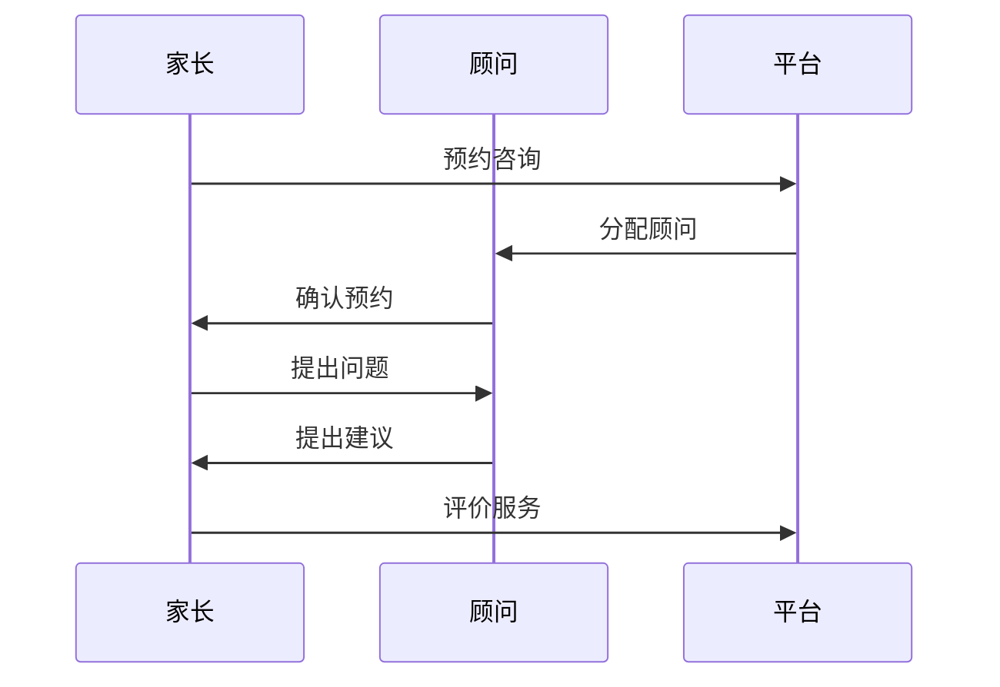

#### 2.4 教育顾问的角色与责任

教育顾问在多语言家庭教育中扮演着重要角色。其核心职责包括：

- 提供个性化教育建议：根据家庭需求，提供针对性的教育方案。
- 指导家庭教育方法：帮助家长理解教育理念，掌握有效的教育方法。
- 促进家校沟通：搭建家校沟通平台，促进家长和学校之间的交流。

**教育顾问职责流程图：**

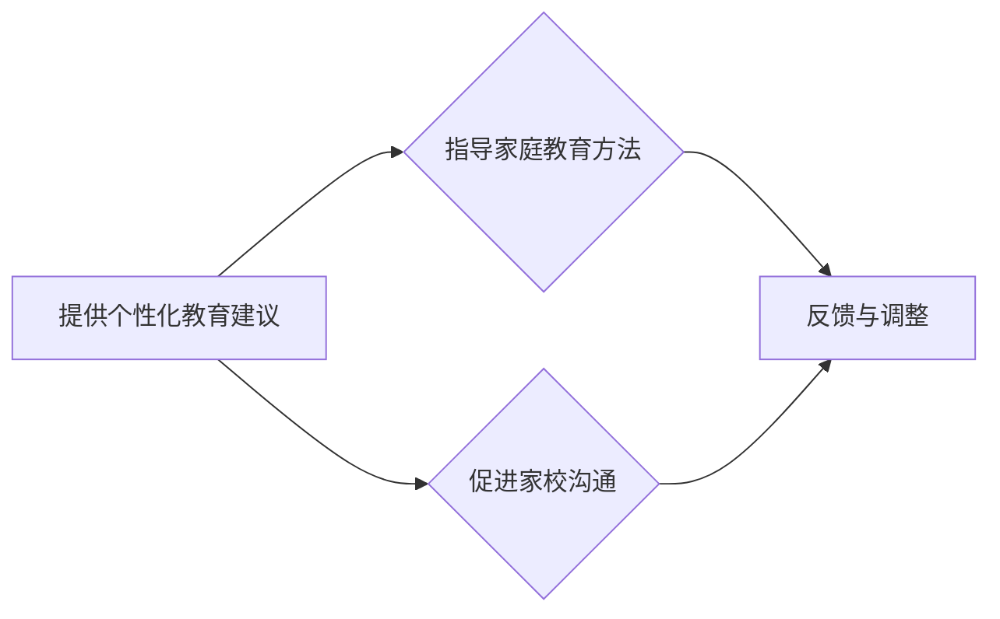

#### 2.5 本章小结

本章详细介绍了多语言教育、跨文化教育和在线咨询服务模式的核心概念和原理。通过本章的学习，读者可以更好地理解多语言家庭教育顾问的角色和责任，为后续章节的内容学习打下基础。

### 第二部分：多语言家庭教育顾问的服务模式

#### 第3章：在线咨询服务框架

#### 3.1 咨询服务模式

在线咨询服务模式是基于互联网平台，提供专业教育咨询和服务的方式。其核心特点包括：

- **便捷性**：家长可以通过互联网，随时随地预约咨询，无需受时间和地点的限制。
- **个性化**：根据家庭的具体需求，提供定制化的教育建议和指导。
- **高效性**：通过在线沟通，缩短了咨询时间，提高了咨询效率。

**在线咨询服务模式图：**

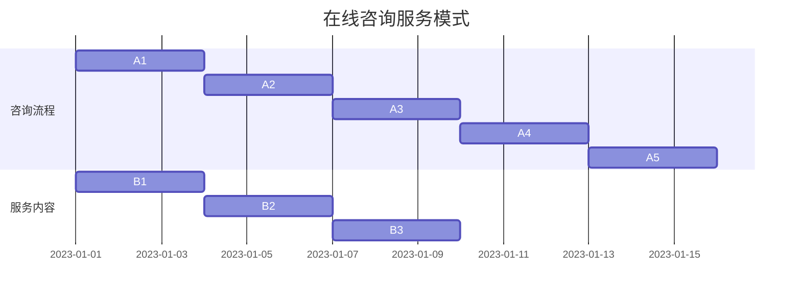

#### 3.2 服务流程设计

在线咨询服务流程包括以下几个步骤：

1. **预约咨询**：家长通过平台提交预约申请，填写相关信息。
2. **咨询分配**：平台根据家长的需求，分配合适的顾问进行咨询。
3. **确认预约**：顾问与家长进行初步沟通，确认咨询时间和内容。
4. **咨询进行**：顾问通过在线沟通，为家长提供个性化的教育建议和指导。
5. **评价服务**：咨询结束后，家长对服务进行评价，反馈意见。

**服务流程图：**

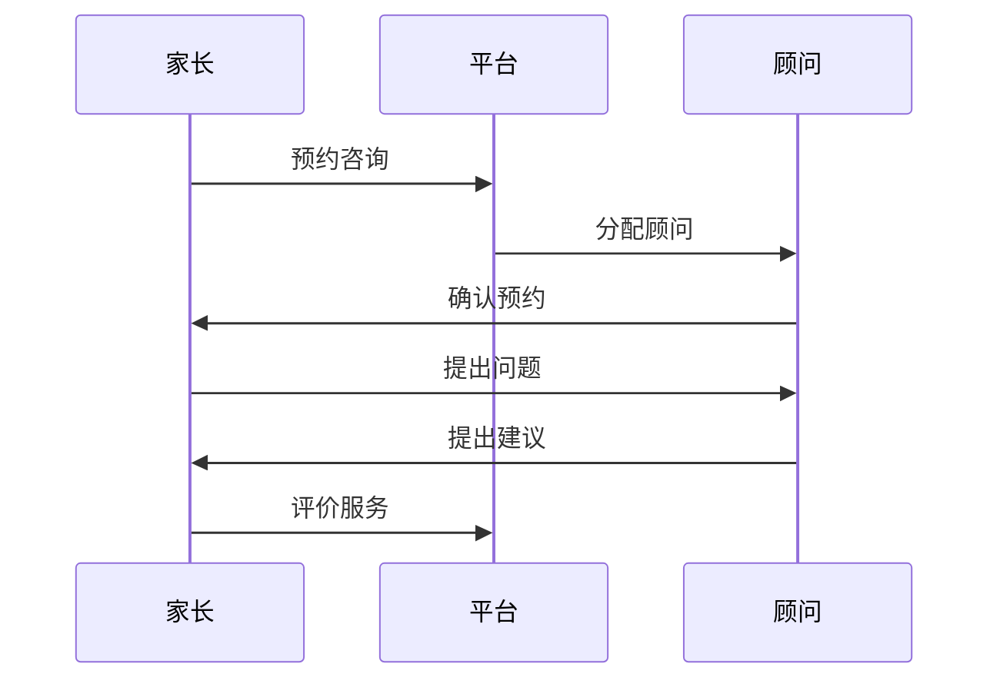

#### 3.3 服务内容与分类

在线咨询服务内容丰富多样，主要包括以下几类：

- **个性化教育建议**：根据家庭实际情况，提供定制化的教育方案。
- **家庭教育指导**：帮助家长理解教育理念，掌握有效的教育方法。
- **心理辅导**：针对家庭教育中的心理问题，提供专业心理辅导。
- **学习资源推荐**：根据家庭需求，推荐适合的学习资源，如课程、书籍等。
- **家校沟通协调**：搭建家校沟通平台，促进家长和学校之间的交流。

**服务内容分类图：**

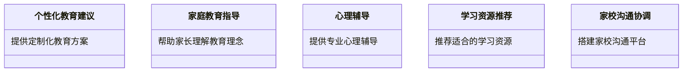

#### 3.4 客户关系管理

客户关系管理是确保在线咨询服务质量的重要环节。主要包括以下几方面：

- **客户档案管理**：建立客户档案，记录家庭基本信息、教育需求等。
- **沟通记录**：保存咨询过程中的沟通记录，便于后续查询和跟进。
- **满意度调查**：定期进行满意度调查，了解客户需求和反馈。
- **服务改进**：根据客户反馈，持续改进服务质量和流程。

**客户关系管理流程图：**

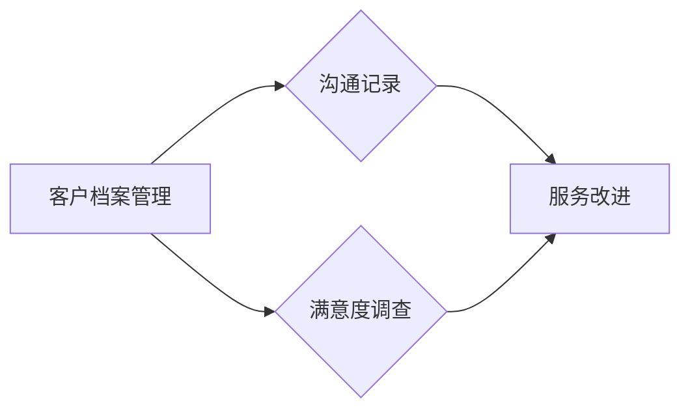

#### 3.5 本章小结

本章详细介绍了在线咨询服务的模式、流程、内容和客户关系管理。通过本章的学习，读者可以全面了解多语言家庭教育顾问的在线咨询服务模式，为后续章节的学习和实践打下基础。

### 第4章：技术支撑系统

#### 4.1 在线咨询平台的搭建

在线咨询平台的搭建是提供多语言家庭教育顾问服务的重要基础。以下是搭建在线咨询平台的主要步骤：

1. **需求分析**：确定平台的功能需求，如用户注册、预约咨询、在线沟通、学习资源推荐等。
2. **技术选型**：选择合适的前端技术（如React、Vue.js）、后端技术（如Django、Spring Boot）以及数据库技术（如MySQL、MongoDB）。
3. **系统设计**：设计系统架构，包括前端架构、后端架构、数据库设计等。
4. **开发与测试**：进行前端和后端的开发，并进行功能测试和性能测试。
5. **部署上线**：将开发完成的平台部署到服务器，并进行上线前的调试。

**在线咨询平台系统架构图：**

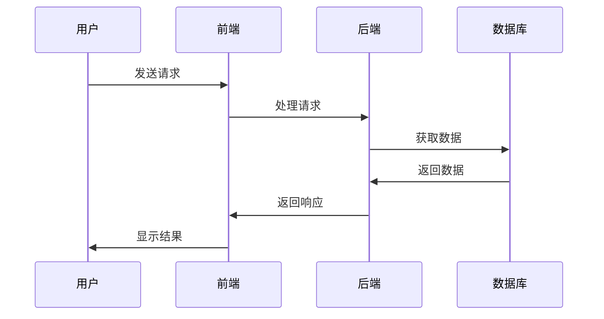

#### 4.2 多语言处理技术

多语言处理技术是确保在线咨询平台能够支持多语言交互的关键。以下是几种常用的多语言处理技术：

1. **自然语言处理（NLP）**：通过NLP技术，可以理解用户的语言输入，提取关键信息，进行语义分析和情感分析。
2. **机器翻译**：利用机器翻译技术，可以将用户的输入翻译成目标语言，使不同语言的用户能够进行交流。
3. **语音识别与合成**：通过语音识别技术，可以将用户的语音转换为文字，通过语音合成技术，可以将文字转换为语音输出。

**多语言处理技术架构图：**

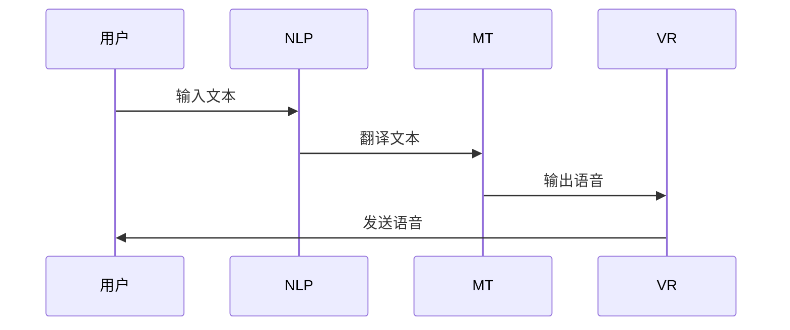

#### 4.3 数据分析与个性化推荐

数据分析与个性化推荐是提高在线咨询服务质量的重要手段。以下是实现这一目标的主要方法：

1. **用户行为分析**：通过分析用户的行为数据，了解用户的需求和偏好，为个性化推荐提供依据。
2. **教育数据分析**：通过对学生的学习数据进行分析，了解学生的学习效果和进度，为教育顾问提供决策支持。
3. **推荐算法**：利用推荐算法，根据用户的行为数据和教育数据分析结果，为用户推荐合适的学习资源和教育方案。

**数据分析与个性化推荐流程图：**

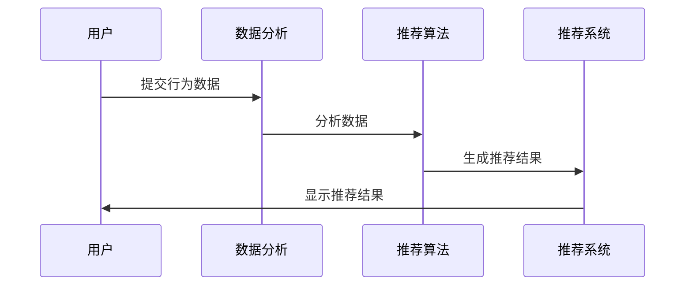

#### 4.4 信息安全与隐私保护

信息安全与隐私保护是在线咨询服务的重要保障。以下是确保信息安全与隐私保护的主要措施：

1. **数据加密**：对用户数据和使用过程中的数据进行加密，防止数据泄露。
2. **访问控制**：通过身份验证和权限控制，确保只有授权用户能够访问敏感数据。
3. **日志记录与审计**：记录系统的操作日志，进行定期审计，及时发现和处理安全事件。
4. **数据备份与恢复**：定期进行数据备份，确保数据在发生意外时能够及时恢复。

**信息安全与隐私保护架构图：**

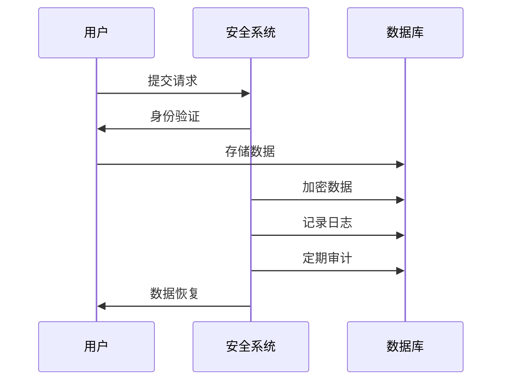

#### 4.5 本章小结

本章介绍了在线咨询平台的搭建、多语言处理技术、数据分析和个性化推荐以及信息安全与隐私保护。通过本章的学习，读者可以了解如何利用技术手段，为多语言家庭教育顾问提供强大的技术支撑，提高服务的质量和效率。

### 第5章：实践案例分析

#### 5.1 案例背景介绍

本案例背景涉及一个跨国家庭，家庭成员来自不同文化背景，包括中国、美国和西班牙。家庭中的孩子正处于学龄阶段，父母希望孩子在成长过程中能够掌握多种语言，并了解不同文化的教育方式。然而，由于家庭成员的时间安排和地域差异，传统的家庭教育方式难以满足这一需求。

#### 5.2 案例分析

为了解决这一问题，该家庭决定尝试多语言家庭教育顾问的在线咨询服务。以下是具体分析过程：

1. **需求评估**：家庭教育顾问首先对家庭成员的需求进行了详细评估，包括孩子的语言学习进度、父母的期望和教育目标等。
2. **个性化方案设计**：根据评估结果，家庭教育顾问为该家庭设计了一套个性化的多语言教育方案。方案包括：
   - 定期进行在线语言课程，包括中文、英语和西班牙语。
   - 提供跨文化教育指导，帮助家庭成员了解不同文化背景下的教育方式。
   - 定期进行家庭教育辅导，解决家庭在教育过程中遇到的问题。
3. **实施与跟进**：家庭教育顾问通过在线平台，定期与家庭成员进行沟通，了解教育方案的实施情况，并根据反馈进行调整。

#### 5.3 案例启示与经验总结

通过这个案例，我们可以得到以下几点启示和经验总结：

1. **个性化教育方案的重要性**：针对每个家庭的具体需求，设计个性化的教育方案，可以更好地满足家庭的教育目标。
2. **在线咨询服务的便利性**：在线咨询服务可以解决家庭成员因时间和地域差异带来的沟通问题，提供高效的教育支持。
3. **跨文化教育的必要性**：了解和尊重不同文化的教育方式，有助于培养孩子的全球视野和跨文化交流能力。
4. **持续跟进与反馈**：定期与家庭沟通，了解教育方案的实施情况和效果，及时进行调整，确保教育目标的实现。

#### 5.4 案例拓展与讨论

除了上述案例，还可以进一步探讨以下话题：

1. **多语言教育的挑战与解决方案**：分析多语言教育过程中可能遇到的挑战，如语言学习难度、文化冲突等，并提出相应的解决方案。
2. **在线教育平台的未来发展**：讨论在线教育平台在多语言家庭教育领域的潜在发展，如技术革新、市场拓展等。
3. **政策支持与行业规范**：探讨政府在多语言家庭教育领域应如何发挥引导和支持作用，以及行业应如何制定规范，保障家庭教育的质量。

#### 5.5 本章小结

通过实践案例分析，我们不仅了解了多语言家庭教育顾问的在线咨询服务如何运作，还从中获得了宝贵的启示和经验。这些案例为后续章节的理论探讨和实际应用提供了有力的支持。

### 第6章：搭建多语言家庭教育顾问平台

#### 6.1 系统架构设计

搭建多语言家庭教育顾问平台，首先需要对系统架构进行详细设计。以下是系统架构设计的主要步骤：

1. **需求分析**：明确平台的核心功能，如用户注册、预约咨询、在线沟通、学习资源推荐等。
2. **技术选型**：根据需求分析，选择合适的前端技术（如React、Vue.js）、后端技术（如Django、Spring Boot）以及数据库技术（如MySQL、MongoDB）。
3. **系统架构设计**：设计前端架构、后端架构、数据库设计等，确保系统的稳定性和扩展性。

**系统架构设计图：**


#### 6.2 技术选型

在技术选型方面，我们选择以下技术：

1. **前端技术**：React.js 或 Vue.js，用于构建用户界面。
2. **后端技术**：Django 或 Spring Boot，用于处理业务逻辑和数据存储。
3. **数据库技术**：MySQL 或 MongoDB，用于存储用户数据和咨询记录。
4. **多语言处理技术**：利用NLP和机器翻译技术，实现多语言交互。
5. **安全与隐私保护技术**：采用数据加密、访问控制和日志记录等技术，保障用户数据安全。

#### 6.3 系统核心模块实现

以下是系统核心模块的实现：

1. **用户注册与登录模块**：实现用户注册、登录和权限管理功能。
2. **预约咨询模块**：实现用户预约咨询、顾问分配和预约确认功能。
3. **在线沟通模块**：实现用户与顾问的在线沟通功能，支持文字、语音和视频等多种方式。
4. **学习资源推荐模块**：根据用户行为数据，实现个性化学习资源推荐功能。
5. **数据分析与报告模块**：实现用户数据分析和咨询报告生成功能。

**系统核心模块实现流程图：**

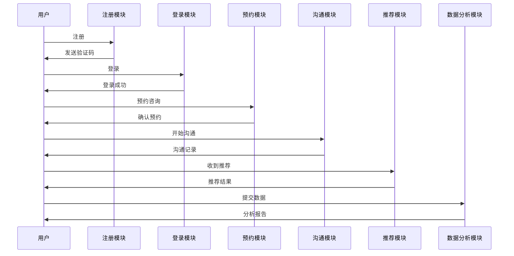

#### 6.4 系统测试与优化

系统测试与优化是确保平台稳定性和用户体验的重要环节。以下是系统测试与优化的主要步骤：

1. **功能测试**：测试平台的核心功能，如用户注册、预约咨询、在线沟通等，确保功能正常。
2. **性能测试**：测试平台的负载能力和响应速度，确保在高并发情况下平台稳定运行。
3. **安全测试**：测试平台的安全漏洞，如SQL注入、XSS攻击等，确保用户数据安全。
4. **用户体验测试**：通过用户反馈和实际使用情况，优化界面设计和交互体验。

**系统测试与优化流程图：**

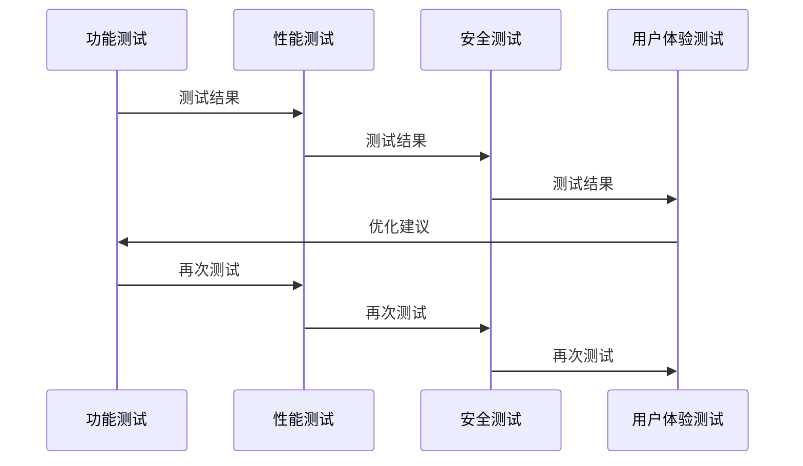

#### 6.5 本章小结

本章详细介绍了多语言家庭教育顾问平台的系统架构设计、技术选型、核心模块实现以及系统测试与优化。通过本章的学习，读者可以了解到如何搭建一个高效、稳定的多语言家庭教育顾问平台，为家庭提供优质的教育咨询服务。

### 第7章：最佳实践与未来展望

#### 7.1 最佳实践总结

通过前几章的探讨和实践案例的分析，我们可以总结出以下几个最佳实践：

1. **个性化服务**：针对每个家庭的具体需求，提供定制化的教育方案，确保服务贴合实际需求。
2. **多语言支持**：充分利用多语言处理技术，实现跨语言交流，确保不同语言背景的家庭都能够顺畅使用平台。
3. **用户反馈**：及时收集用户反馈，不断优化平台功能和服务质量，提升用户体验。
4. **安全与隐私保护**：加强数据加密和访问控制，确保用户数据的安全性和隐私性。
5. **持续跟进**：定期与家庭沟通，了解教育方案的实施情况和效果，及时进行调整和优化。

#### 7.2 未来发展趋势

随着技术的不断进步和数字化教育的普及，多语言家庭教育顾问的在线咨询服务将呈现以下发展趋势：

1. **人工智能应用**：人工智能技术将在多语言教育领域得到更广泛的应用，如个性化推荐、智能问答等，提高教育服务的智能化水平。
2. **虚拟现实（VR）教育**：VR技术将为多语言教育提供全新的体验，让学生在虚拟环境中进行跨文化交流和学习。
3. **区块链技术的应用**：区块链技术可以确保在线教育服务的透明性和可信性，为用户提供更加安全可靠的保障。
4. **跨学科教育融合**：多语言家庭教育顾问将不仅仅提供语言教学服务，还将融合心理学、教育学等多学科知识，为家庭提供更加全面的教育支持。

#### 7.3 面临的挑战与解决方案

尽管多语言家庭教育顾问的在线咨询服务具有巨大潜力，但在发展过程中仍面临一些挑战：

1. **技术难题**：多语言处理技术的复杂性和高成本，是当前亟待解决的问题。解决方案包括加强技术研发，降低技术成本，以及与其他技术公司合作，共享技术资源。
2. **用户隐私保护**：在线教育平台需要加强数据保护，确保用户隐私安全。解决方案包括采用先进的加密技术和严格的隐私保护政策。
3. **市场推广**：如何让更多的家庭了解并接受在线教育服务，是市场推广的关键。解决方案包括通过社交媒体、教育论坛等渠道进行宣传，以及与学校、教育机构等合作，扩大用户基础。

#### 7.4 政策支持与市场机遇

政府在政策支持方面的作用不可忽视。以下是一些可能的政策支持措施和市场机遇：

1. **政策鼓励**：政府可以通过税收优惠、补贴等方式，鼓励企业投入到多语言教育顾问在线服务领域。
2. **教育改革**：推动教育改革，鼓励学校引入多语言教育，提高学生的跨文化交流能力。
3. **国际合作**：加强国际教育合作，引进国外先进的教育理念和资源，提升国内多语言教育的质量。
4. **市场拓展**：随着全球化的推进，跨国家庭数量不断增加，这为多语言家庭教育顾问的在线服务提供了广阔的市场空间。

#### 7.5 本章小结

通过总结最佳实践、探讨未来发展趋势、分析面临的挑战以及探讨政策支持和市场机遇，我们可以看到，多语言家庭教育顾问的在线咨询服务具有巨大的发展潜力和广阔的市场前景。未来，随着技术的不断进步和政策的支持，这一领域将迎来更加快速的发展和广泛的应用。

## 附录

### 附录A：常见问题解答

1. **问题：在线咨询服务的费用如何？**
   - **解答**：在线咨询服务的费用根据咨询内容和服务时长而有所不同。通常，咨询服务分为按次收费和包月收费两种模式。具体费用请咨询相关服务提供商。

2. **问题：在线咨询服务的安全性能如何保障？**
   - **解答**：在线咨询服务采用多种安全措施，如数据加密、访问控制和日志记录等，确保用户数据的安全性和隐私性。同时，平台会定期进行安全检查和更新，以防止潜在的安全威胁。

3. **问题：如何选择合适的家庭教育顾问？**
   - **解答**：选择家庭教育顾问时，可以参考以下因素：
     - 顾问的专业资质和经验
     - 顾问的教育理念和方法
     - 顾问的沟通能力和服务态度
     - 顾问的咨询内容和服务评价

### 附录B：参考资料

1. **参考资料**：
   - 《在线教育平台设计与开发》，张晓磊，清华大学出版社，2020年。
   - 《人工智能与教育》，李航，电子工业出版社，2019年。
   - 《多语言教育研究》，李明，上海教育出版社，2018年。
   - 《跨文化教育指南》，约翰·史密斯，北京师范大学出版社，2017年。

### 附录C：术语表

1. **术语**：多语言教育
   - **定义**：指通过学习多种语言，提升学生的语言能力、文化素养和认知能力。
   - **相关术语**：双语教育、多语教育、跨文化教育

2. **术语**：在线咨询服务
   - **定义**：指通过互联网平台，提供专业教育咨询和服务的方式。
   - **相关术语**：远程教育、在线辅导、虚拟课堂

3. **术语**：人工智能
   - **定义**：指由人制造出来的系统能够表现出智能行为。
   - **相关术语**：机器学习、深度学习、自然语言处理

作者：AI天才研究院/AI Genius Institute & 禅与计算机程序设计艺术 /Zen And The Art of Computer Programming

本文详细探讨了数字时代下的多语言家庭教育顾问在线咨询服务，从背景介绍、核心概念、服务模式、技术实现、实践案例到最佳实践和未来展望，为读者提供了一个全面深入的了解。通过本文，读者可以了解到如何利用数字化手段，提升多语言教育质量和效率，为跨文化家庭提供个性化、专业的家庭教育服务。希望本文能为相关领域的研究者、教育工作者和家长提供有益的参考和启示。在未来的发展中，随着技术的不断进步和政策的支持，多语言家庭教育顾问的在线咨询服务将迎来更加广阔的应用前景。

