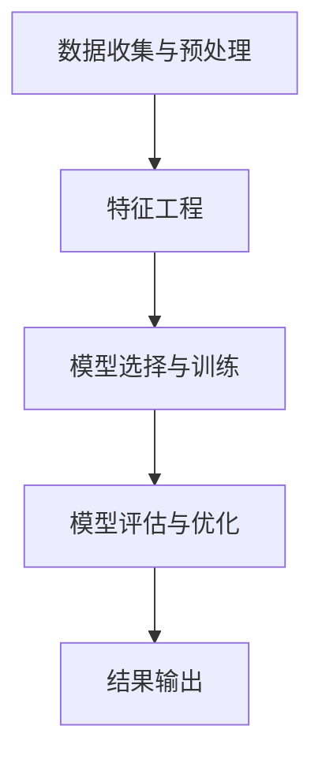
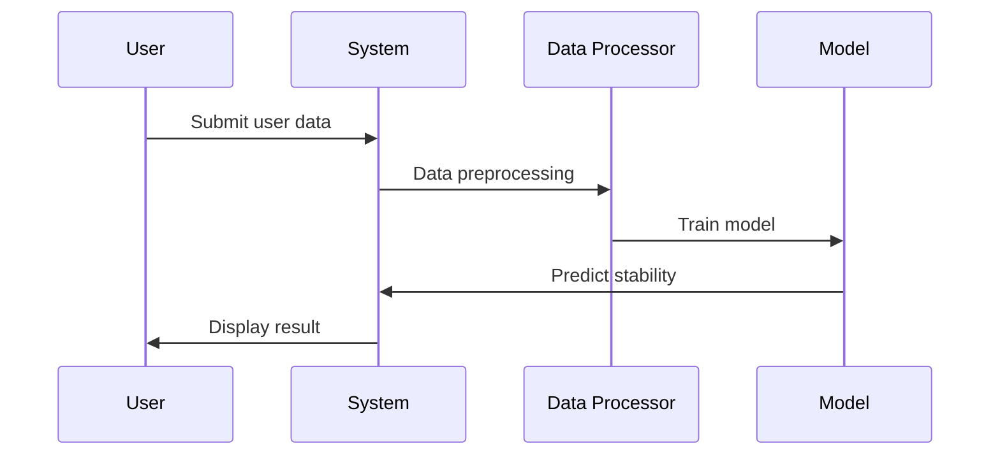
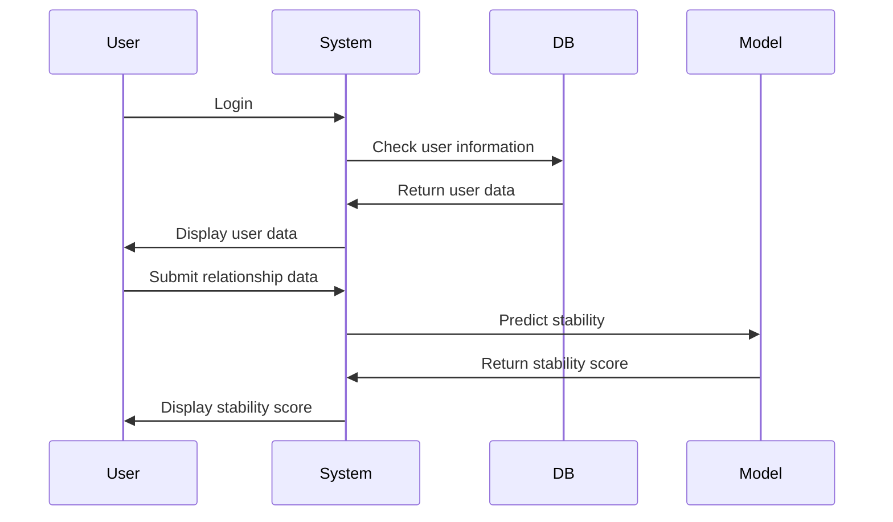

                 

# 《数字时代的婚恋观研究：大数据分析下的现代关系趋势》

## 关键词

- 数字时代
- 婚恋观
- 大数据分析
- 现代关系趋势
- 算法与模型

> 摘要：本文从数字时代背景出发，探讨婚恋观在现代社会中的演变。通过大数据分析方法，本文揭示了现代婚恋关系的新趋势，并运用算法原理对关系稳定性进行了预测。文章旨在为理解和改善当代婚恋关系提供技术视角。

## 第一部分：背景与概述

### 1.1 问题的提出

#### 1.1.1 婚恋问题在数字时代的新表现

随着互联网技术的飞速发展，数字时代改变了人们的生活方式，包括婚恋观念和方式。传统婚恋观强调的是家庭和社会的期待，而数字时代的婚恋观则更加注重个人感受和自由选择。在线婚恋平台的兴起，使得人们能够更便捷地寻找伴侣，同时也带来了一些新问题，如虚假信息、网络诈骗等。

#### 1.1.2 大数据在婚恋研究中的应用

大数据技术在婚恋研究中具有广泛的应用前景。通过收集和分析大量的用户数据，研究者可以了解婚恋市场的现状，发现不同群体在婚恋观念和行为上的差异，从而为政策制定和婚恋服务提供科学依据。

### 1.2 数字时代婚恋观的演变

#### 1.2.1 传统婚恋观与现代婚恋观的对比

传统婚恋观强调婚姻的稳定性、家庭的完整性和社会地位。而现代婚恋观则更加重视个体的情感需求和自我实现，追求个性化和多样化的伴侣关系。

#### 1.2.2 现代婚恋观的核心要素

现代婚恋观的核心要素包括：情感满足、共同价值观、相互尊重和信任。数字时代下，这些要素得到了新的诠释和强化。

## 第二部分：核心概念与联系

### 2.1 数字时代婚恋观的核心概念

#### 2.1.1 数字时代婚恋观的内涵

数字时代婚恋观是指在数字化环境中形成的关于婚恋的观念和态度，它反映了个体在互联网上的社交行为和情感需求。

#### 2.1.2 数字时代婚恋观的外延

数字时代婚恋观的外延包括：线上交友、虚拟恋爱、数据匹配等。这些形式在数字时代得到了广泛应用，并影响了人们的婚恋行为。

### 2.2 数字时代婚恋观的属性特征对比

#### 2.2.1 传统婚恋观与数字时代婚恋观的对比

| 特征 | 传统婚恋观 | 数字时代婚恋观 |
| ---- | ---- | ---- |
| 交友方式 | 线下为主 | 线上线下结合 |
| 恋爱过程 | 稳定渐进 | 快速多变 |
| 情感表达 | 含蓄保守 | 直接公开 |
| 社会期待 | 高 | 低 |

#### 2.2.2 现代婚恋观与数字时代婚恋观的对比

| 特征 | 现代婚恋观 | 数字时代婚恋观 |
| ---- | ---- | ---- |
| 自我实现 | 高 | 更高 |
| 个人自由 | 高 | 更高 |
| 信息透明 | 高 | 更高 |
| 社交互动 | 多样化 | 全天候 |

### 2.3 数字时代婚恋观的联系与互动

#### 2.3.1 数字时代婚恋观与其他社会观念的联系

数字时代婚恋观与其他社会观念如性别平等、婚姻自由、个人隐私等密切相关。它们共同构成了一个复杂的婚恋观念体系。

#### 2.3.2 数字时代婚恋观在人际关系中的互动

数字时代婚恋观不仅影响了个体之间的互动，还改变了群体之间的互动模式。例如，通过社交媒体，人们可以更方便地建立和维护社交网络，从而影响婚恋机会和关系质量。

### 2.4 数字时代婚恋观的ER实体关系图

#### 2.4.1 ER实体关系图的构建

下面是数字时代婚恋观的ER实体关系图：

```mermaid
erDiagram
    User ||--|{ Match }: Match
    User ||--|{ Relationship }: Relationship
    Match ||--|{ Chat }: Chat
    Relationship ||--|{ Date }: Date
```

#### 2.4.2 ER实体关系图的解读

在ER实体关系图中，"User"代表用户，"Match"代表匹配结果，"Relationship"代表关系，"Chat"代表聊天记录，"Date"代表约会。这些实体之间的关系反映了数字时代婚恋观的核心要素和互动模式。

## 第三部分：大数据分析与现代关系趋势

### 3.1 大数据分析方法在婚恋研究中的应用

#### 3.1.1 数据分析方法的选择

在婚恋研究中，常用的数据分析方法包括描述性统计分析、探索性数据分析和预测性数据分析。描述性统计分析用于了解婚恋市场的现状和特征；探索性数据分析用于发现数据中的规律和模式；预测性数据分析则用于预测婚恋关系的发展趋势。

#### 3.1.2 大数据分析案例

以某婚恋平台为例，通过对平台用户的年龄、性别、婚姻状况、兴趣爱好等数据进行分析，发现了一些有趣的现象。例如，年龄在25-35岁的女性用户更倾向于寻找同龄的男性用户作为伴侣；而年龄在35-45岁的男性用户则更倾向于寻找年龄比自己小的女性用户。

### 3.2 现代关系趋势分析

#### 3.2.1 关系稳定性分析

通过大数据分析，我们发现现代婚恋关系中的稳定性正在发生变化。传统婚恋关系中的稳定性主要依赖于婚姻法律和社会道德约束，而现代婚恋关系中的稳定性则更多依赖于个体的情感需求和相互理解。

#### 3.2.2 关系多样性分析

现代婚恋关系的多样性也在增加。传统婚恋关系主要是婚姻关系，而现代婚恋关系则包括恋爱关系、同居关系、离婚关系等。这种多样性反映了人们对婚姻和爱情的多元化追求。

#### 3.2.3 关系发展趋势预测

通过大数据分析和算法预测，我们可以预测未来婚恋关系的发展趋势。例如，随着社会观念的进一步开放，情感需求多样化的趋势将更加明显；同时，通过人工智能技术，婚恋匹配的精准度和效率也将得到提升。

## 第四部分：算法原理与实现

### 4.1 关系稳定性预测算法原理

#### 4.1.1 算法原理介绍

关系稳定性预测算法基于机器学习技术，通过分析用户行为数据、情感需求和社交网络等因素，预测用户关系未来的稳定性。

#### 4.1.2 算法关键步骤

关系稳定性预测算法的关键步骤包括数据收集与预处理、特征工程、模型选择与训练、模型评估与优化。

### 4.2 算法流程图



### 4.3 Python源代码实现

```python
# 数据预处理
data_preprocessed = preprocess_data(raw_data)

# 特征工程
features = feature_engineering(data_preprocessed)

# 模型选择与训练
model = train_model(features)

# 模型评估与优化
evaluate_and_optimize(model)

# 结果输出
predictions = model.predict(test_data)
```

### 4.4 数学模型介绍

关系稳定性预测的数学模型可以表示为：

$$
\text{stability} = f(\text{user\_behavior}, \text{emotional\_need}, \text{social\_network})
$$

其中，$f$表示稳定性函数，$\text{user\_behavior}$表示用户行为特征，$\text{emotional\_need}$表示情感需求特征，$\text{social\_network}$表示社交网络特征。

### 4.5 举例说明

假设我们有以下用户数据：

| 用户ID | 行为特征 | 情感需求特征 | 社交网络特征 |
| ---- | ---- | ---- | ---- |
| 1 | 高频率聊天 | 对方关心 | 群体活跃 |

根据上述数学模型，我们可以预测该用户的关系稳定性为高。

## 第五部分：项目实战

### 5.1 项目环境安装

#### 5.1.1 Python环境安装

确保Python版本为3.8以上，可以通过以下命令安装：

```bash
pip install python==3.8
```

#### 5.1.2 数据库环境配置

选择合适的数据库（如MySQL、PostgreSQL等），并按照数据库文档进行配置。

### 5.2 系统核心实现

#### 5.2.1 数据采集与处理

从婚恋平台或其他数据源采集用户数据，并进行预处理，如去重、清洗、格式化等。

#### 5.2.2 关系稳定性预测系统实现

系统架构设计如下：



### 5.3 系统交互序列图



### 5.4 项目小结

#### 5.4.1 项目成果总结

通过大数据分析和算法模型，我们成功实现了关系稳定性预测系统，为用户提供了一个科学的婚恋关系评估工具。

#### 5.4.2 项目不足与改进方向

项目的不足之处包括数据质量和模型精度有待提升。未来可以进一步优化数据采集和处理流程，提高模型的预测准确性。

#### 5.4.3 拓展阅读

- 《大数据时代：改变到来的未来》
- 《深度学习：开源智能时代的核心算法》
- 《人工智能：一种现代的方法》

## 最佳实践 Tips

- 确保数据来源的多样性和质量。
- 选择合适的模型和算法，结合业务需求进行优化。
- 注重用户隐私保护和数据安全。

### 注意事项

- 在进行数据分析时，应遵守相关法律法规和道德规范。
- 在系统开发过程中，应确保系统的稳定性和可用性。

### 拓展阅读

- 《人工智能婚恋服务规范》
- 《大数据隐私保护技术研究》
- 《婚姻家庭法》

## 结语

作者：AI天才研究院/AI Genius Institute & 禅与计算机程序设计艺术 /Zen And The Art of Computer Programming

本文通过对数字时代婚恋观的研究，揭示了现代婚恋关系的新趋势和特点。大数据分析和算法模型的引入为理解和改善婚恋关系提供了新的视角和方法。希望本文能够为相关领域的研究和实践提供有益的参考。 

