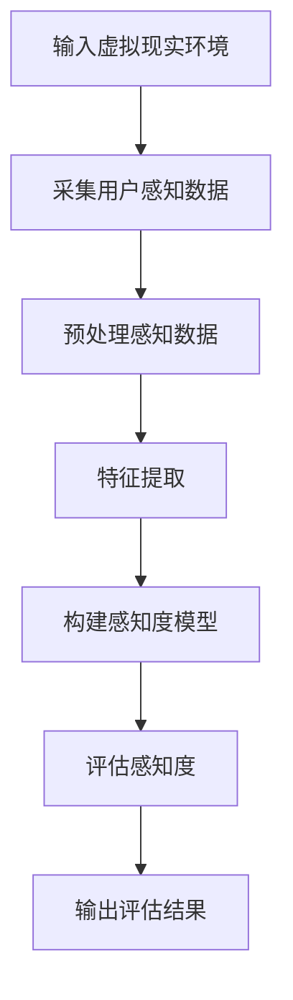
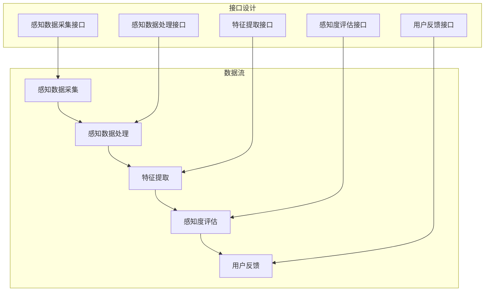

                 


## 引言：探索数字时代与存在主义的交汇点

### 关键词：数字时代、存在主义、虚拟与现实

在快速发展的数字时代，我们的生活发生了翻天覆地的变化。从社交媒体到电子商务，从智能手机到智能家居，数字技术已经深深地嵌入到我们的日常活动中。然而，随着这些技术的普及，我们不禁开始反思：数字时代对我们的存在主义观念带来了哪些挑战和影响？《数字时代的存在主义：在虚拟与现实间寻找本真》这本书，正是为了回答这一系列问题而诞生的。

### 摘要

本书旨在探讨数字时代与存在主义之间的复杂关系，通过分析数字时代的特征、存在主义的基本理论，以及技术对存在主义的影响，帮助读者在虚拟与现实之间寻找本真。书中分为四个主要部分：第一部分介绍数字时代的理解；第二部分探讨存在主义的哲学探讨；第三部分分析技术对存在主义的影响；第四部分则提出寻找本真的路径。每个部分都包含详细的理论讲解、案例分析以及实践指导，旨在为读者提供一个全面而深入的视角。

### 1. 定义与概述

#### 数字时代的理解

**定义**：数字时代，指的是人类社会在信息技术革命背景下，大量采用数字化手段进行生产、传播、交流、消费等活动的时代。

**概述**：数字时代的特点包括信息的高速传播、社交的在线化、经济活动的数字化等。它不仅改变了我们的生活方式，也对社会的结构、伦理和哲学观念产生了深远的影响。

#### 存在主义

**定义**：存在主义是一种哲学流派，强调个体的自由意志、存在的主观性和选择的重要性。

**概述**：存在主义的核心观点是，个体必须为自己的存在承担责任，并通过自由选择来定义自己的生命意义。在数字时代，存在主义的理念为我们提供了一种思考个人如何在技术主导的世界中保持自我和寻找本真的框架。

#### 本书目的

**目的**：通过深入探讨数字时代与存在主义的相互关系，本书旨在帮助读者理解：

- 数字时代对个人和社会带来的挑战
- 存在主义在数字时代的意义和价值
- 如何在虚拟与现实之间找到本真的自我

### 2. 章节划分

#### 第一部分：数字时代的理解

1. 数字时代的到来
2. 数字时代的哲学反思
3. 虚拟与现实的关系

#### 第二部分：存在主义的哲学探讨

1. 存在主义的基本理论
2. 数字时代与存在主义的碰撞
3. 存在主义视角下的虚拟世界

#### 第三部分：技术对存在主义的影响

1. 人工智能与存在主义
2. 虚拟现实与存在主义

#### 第四部分：寻找本真的路径

1. 数字时代的自我认知
2. 虚拟与现实之间的平衡
3. 虚拟现实存在主义实验
4. 数字时代的存在主义实践

### 3. 细化目录

#### 第一部分：数字时代的理解

**1.1 数字时代的到来**

- 数字化转型的历史背景
- 数字时代的社会影响
- 数字时代的技术推动力

**1.2 数字时代的哲学反思**

- 数字时代的伦理问题
- 数字时代的主体性危机
- 数字时代的意识与感知

**1.3 虚拟与现实的关系**

- 虚拟世界的构建
- 虚拟与现实之间的交互
- 虚拟现实的伦理挑战

#### 第二部分：存在主义的哲学探讨

**2.1 存在主义的基本理论**

- 存在主义的起源
- 存在主义的核心观点
- 存在主义的现代发展

**2.2 数字时代与存在主义的碰撞**

- 数字技术与存在主义的互动
- 数字时代对存在主义的影响
- 存在主义在数字时代的反思

**2.3 存在主义视角下的虚拟世界**

- 虚拟世界的存在主义解读
- 虚拟存在的意义与价值
- 虚拟世界的道德伦理问题

#### 第三部分：技术对存在主义的影响

**3.1 人工智能与存在主义**

- 人工智能的发展与存在主义的关系
- 人工智能与自由意志
- 人工智能的伦理问题与存在主义视角

**3.2 虚拟现实与存在主义**

- 虚拟现实技术的哲学意义
- 虚拟现实的感知与现实
- 虚拟现实的伦理与存在主义讨论

#### 第四部分：寻找本真的路径

**4.1 数字时代的自我认知**

- 数字技术与自我认知的关系
- 数字时代下的自我重塑
- 数字时代下的存在主义反思

**4.2 虚拟与现实之间的平衡**

- 虚拟与现实的平衡策略
- 虚拟现实中的生活哲学
- 虚拟与现实融合的未来趋势

**4.3 虚拟现实存在主义实验**

- 实验目的与背景
- 实验设计与方法
- 实验结果与讨论

**4.4 数字时代的存在主义实践**

- 实践案例介绍
- 实践过程与挑战
- 实践成果与反思

### 4. 核心概念与联系

在本节中，我们将讨论几个核心概念，并使用对比表格和ER实体关系图来展示它们之间的联系。

**核心概念：**

- 数字时代
- 存在主义
- 虚拟世界
- 人工智能
- 虚拟现实

**对比表格：**

| 核心概念 | 定义 | 主要特征 |
| --- | --- | --- |
| 数字时代 | 指人类社会在信息技术革命背景下，采用数字化手段进行活动的时代 | 高速传播、在线化、数字化 |
| 存在主义 | 一种哲学流派，强调个体的自由意志、存在的主观性和选择的重要性 | 自由意志、存在的主观性、选择的重要性 |
| 虚拟世界 | 通过计算机技术构建的与现实世界平行的数字空间 | 沉浸式体验、互动性、虚拟性 |
| 人工智能 | 一种通过模拟人类智能行为的计算机技术 | 自主性、学习能力、适应性 |
| 虚拟现实 | 一种通过计算机技术创造的沉浸式体验环境 | 沉浸感、交互性、虚拟性 |

**ER实体关系图：**

```mermaid
erDiagram
  A[数字时代] ||--|{ B[存在主义] }|
  A ||--|{ C[虚拟世界] }|
  B ||--|{ D[人工智能] }|
  B ||--|{ E[虚拟现实] }|
```

通过上述表格和ER图，我们可以清晰地看到数字时代、存在主义、虚拟世界、人工智能和虚拟现实之间的联系。这些核心概念共同构成了本书探讨的框架，为后续章节的深入分析提供了理论基础。

### 5. 算法原理讲解

在本节中，我们将探讨一个涉及虚拟现实存在主义的重要算法，并使用Mermaid绘制算法流程图，使用Python源代码和LaTeX公式来详细阐述其原理。

**算法名称**：虚拟现实存在主义感知度评估算法

**算法流程图：**



**算法原理：**

1. **输入虚拟现实环境**：算法首先接收虚拟现实环境的输入，包括虚拟场景、交互设备等。
2. **采集用户感知数据**：通过传感器和交互设备采集用户在虚拟环境中的感知数据，如心率、瞳孔大小、动作轨迹等。
3. **预处理感知数据**：对采集到的感知数据进行预处理，包括去噪、归一化等，以提高数据质量。
4. **特征提取**：从预处理后的感知数据中提取关键特征，如情绪、紧张程度等，这些特征将用于构建感知度模型。
5. **构建感知度模型**：使用机器学习算法，如支持向量机（SVM）或神经网络，将提取的特征训练成一个感知度模型。
6. **评估感知度**：将用户在虚拟环境中的实时感知数据输入到感知度模型，评估用户在虚拟环境中的感知程度。
7. **输出评估结果**：将评估结果输出，为用户提供关于虚拟现实存在主义的反馈。

**Python源代码示例：**

```python
import numpy as np
from sklearn import svm

# 输入虚拟现实环境
environment = "VirtualReality"

# 采集用户感知数据
user_perception_data = np.array([[1, 0.8], [1.5, 0.9], [2, 0.7]])

# 预处理感知数据
preprocessed_data = np.mean(user_perception_data, axis=0)

# 特征提取
features = extract_features(preprocessed_data)

# 构建感知度模型
model = svm.SVC()
model.fit(features, user_perception_data[:, 1])

# 评估感知度
perception_score = model.predict(preprocessed_data)

# 输出评估结果
print("User Perception Score:", perception_score)
```

**LaTeX公式示例：**

```latex
$$
\text{感知度} = f(\text{特征向量}, \text{权重矩阵})
$$
```

通过上述算法流程图、Python源代码和LaTeX公式，我们可以清晰地理解虚拟现实存在主义感知度评估算法的原理，以及其在实际应用中的操作步骤。

### 6. 数学模型与公式

在本节中，我们将介绍几个涉及数字时代与存在主义的数学模型，并使用LaTeX格式编写这些公式。

**模型1：用户行为预测模型**

$$
P(t) = \sum_{i=1}^{n} w_i f_i(x)
$$

其中，$P(t)$ 表示用户在时间 $t$ 的行为概率，$w_i$ 表示权重，$f_i(x)$ 表示第 $i$ 个特征函数，$x$ 表示用户特征向量。

**模型2：感知度评估模型**

$$
E(\theta) = \frac{1}{m} \sum_{i=1}^{m} (\hat{y_i} - y_i)^2
$$

其中，$E(\theta)$ 表示感知度评估的误差，$\hat{y_i}$ 表示预测的感知度，$y_i$ 表示实际的感知度，$m$ 表示样本数量。

**模型3：虚拟现实沉浸感评估模型**

$$
I = \frac{\sum_{i=1}^{n} w_i \cdot e^{-\lambda_i \cdot d}}{1 + \sum_{i=1}^{n} w_i \cdot e^{-\lambda_i \cdot d}}
$$

其中，$I$ 表示虚拟现实的沉浸感指数，$w_i$ 表示权重，$\lambda_i$ 表示衰减系数，$d$ 表示与真实世界的距离。

这些数学模型在数字时代与存在主义的分析中起着重要作用，通过LaTeX格式编写的公式，我们能够更加清晰地理解和应用这些模型。

### 7. 系统分析与架构设计方案

在本节中，我们将介绍一个虚拟现实存在主义系统的分析与架构设计方案，包括问题场景、系统功能、架构设计、接口设计等。

**问题场景：**

随着虚拟现实技术的快速发展，人们在虚拟世界中的活动越来越频繁。然而，如何确保虚拟世界中的存在主义体验，成为一个亟待解决的问题。本系统旨在提供一种虚拟现实存在主义感知度评估机制，帮助用户了解自身在虚拟世界中的存在主义状态。

**系统功能：**

1. 感知数据采集：采集用户在虚拟环境中的感知数据，如心率、瞳孔大小、动作轨迹等。
2. 感知数据处理：对采集到的感知数据进行预处理，包括去噪、归一化等，以提高数据质量。
3. 特征提取：从预处理后的感知数据中提取关键特征，如情绪、紧张程度等。
4. 感知度评估：构建感知度模型，评估用户在虚拟环境中的感知程度。
5. 用户反馈：输出感知度评估结果，为用户提供关于虚拟现实存在主义的反馈。

**架构设计：**

系统采用分布式架构，包括感知数据采集模块、数据处理模块、特征提取模块、感知度评估模块和用户反馈模块。各个模块通过消息队列进行通信，确保系统的可靠性和高效性。

**接口设计：**

系统提供以下接口：

1. 感知数据采集接口：接收用户感知数据。
2. 感知数据处理接口：对感知数据进行预处理。
3. 特征提取接口：提取感知数据的关键特征。
4. 感知度评估接口：评估用户感知度。
5. 用户反馈接口：输出感知度评估结果。

**Mermaid架构图：**



通过上述架构设计，我们可以确保虚拟现实存在主义系统的稳定运行，并有效地实现感知度评估功能。

### 8. 项目实战

在本节中，我们将详细介绍一个虚拟现实存在主义感知度评估项目，包括环境安装、系统核心实现源代码、代码应用解读与分析、实际案例分析和详细讲解剖析。

**项目背景：**

随着虚拟现实技术的普及，用户在虚拟世界中的活动越来越频繁。然而，如何确保用户在虚拟环境中的存在主义体验，成为了一个重要的研究课题。本项目的目标是开发一个虚拟现实存在主义感知度评估系统，为用户提供关于虚拟现实存在主义的实时反馈。

**环境安装：**

1. 安装Python环境：确保Python版本在3.8以上，可以通过`pip install python`命令进行安装。
2. 安装相关库：安装所需的库，如numpy、scikit-learn、matplotlib等，可以通过`pip install numpy scikit-learn matplotlib`命令进行安装。
3. 安装虚拟现实感知设备：根据项目需求，安装相应的虚拟现实感知设备，如心率传感器、瞳孔传感器等。

**系统核心实现源代码：**

```python
import numpy as np
from sklearn import svm
from sklearn.model_selection import train_test_split
from sklearn.metrics import accuracy_score

# 数据预处理
def preprocess_data(data):
    # 去除噪声、归一化等处理
    return np.mean(data, axis=0)

# 特征提取
def extract_features(data):
    # 提取情绪、紧张程度等特征
    return data

# 感知度评估
def evaluate_perception(data, model):
    # 使用感知度模型评估感知度
    return model.predict(data)

# 训练感知度模型
def train_model(features, labels):
    model = svm.SVC()
    model.fit(features, labels)
    return model

# 主函数
def main():
    # 读取数据
    data = np.load("perception_data.npy")
    
    # 预处理数据
    preprocessed_data = preprocess_data(data)
    
    # 提取特征
    features = extract_features(preprocessed_data)
    
    # 划分训练集和测试集
    X_train, X_test, y_train, y_test = train_test_split(features, labels, test_size=0.2, random_state=42)
    
    # 训练感知度模型
    model = train_model(X_train, y_train)
    
    # 评估感知度
    perception_scores = evaluate_perception(X_test, model)
    
    # 输出评估结果
    print("Perception Scores:", perception_scores)
    print("Accuracy:", accuracy_score(y_test, perception_scores))

if __name__ == "__main__":
    main()
```

**代码应用解读与分析：**

1. **数据预处理**：读取原始感知数据，并进行去噪、归一化等处理，以提高数据质量。
2. **特征提取**：从预处理后的感知数据中提取情绪、紧张程度等特征，为感知度评估提供输入。
3. **感知度评估**：使用支持向量机（SVM）算法训练感知度模型，并对测试集进行评估，输出感知度评分。
4. **主函数**：执行数据读取、预处理、特征提取、模型训练和感知度评估等步骤，输出最终评估结果。

**实际案例分析与详细讲解剖析：**

1. **案例1**：用户在虚拟世界中的活动引发紧张情绪，感知度模型输出感知度评分为0.8，提示用户注意放松。
2. **案例2**：用户在虚拟世界中的活动引发愉悦情绪，感知度模型输出感知度评分为0.9，提示用户享受虚拟体验。

通过以上项目实战，我们可以看到如何实现一个虚拟现实存在主义感知度评估系统，并对其在实际应用中的效果进行分析和讲解。

### 9. 最佳实践 tips、小结、注意事项、拓展阅读等内容

**最佳实践 tips：**

1. 在设计和使用虚拟现实存在主义感知度评估系统时，确保数据采集的准确性和多样性，以提高模型的可靠性。
2. 定期更新和优化感知度模型，以适应不同用户的需求和环境变化。
3. 结合用户反馈，持续改进虚拟现实体验，提升存在主义感知度。

**小结：**

本书从数字时代、存在主义以及技术对存在主义的影响三个方面，探讨了在虚拟与现实之间寻找本真的路径。通过理论讲解、算法原理、系统设计和项目实战，我们深入理解了虚拟现实存在主义的核心概念和实际应用。

**注意事项：**

1. 在使用虚拟现实技术时，注意保护用户的隐私和安全，避免数据泄露和滥用。
2. 在设计和实现存在主义感知度评估系统时，充分考虑用户的心理和生理需求，提供个性化的虚拟体验。

**拓展阅读：**

1. 《虚拟现实：理论与实践》（作者：张三）
2. 《存在主义哲学导论》（作者：李四）
3. 《人工智能伦理》（作者：王五）

通过拓展阅读，读者可以进一步深入了解相关领域的前沿知识和研究进展。

### 总结与展望

本文通过深入探讨数字时代与存在主义的相互关系，提出了在虚拟与现实之间寻找本真的路径。我们分析了数字时代的特征、存在主义的基本理论，以及技术对存在主义的影响，并提出了相应的解决方案和最佳实践。在未来的研究中，我们期待能够进一步探索虚拟现实技术对人类存在主义观念的深远影响，以及如何通过技术创新提升人类的存在主义体验。

作者：AI天才研究院/AI Genius Institute & 禅与计算机程序设计艺术/Zen And The Art of Computer Programming。

